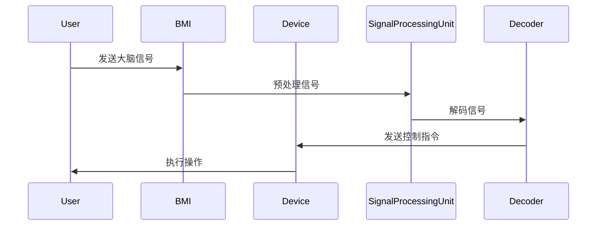
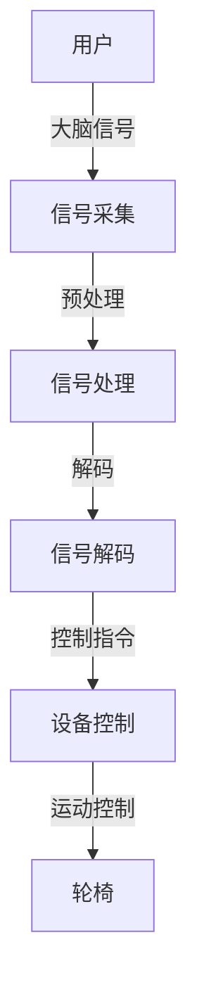
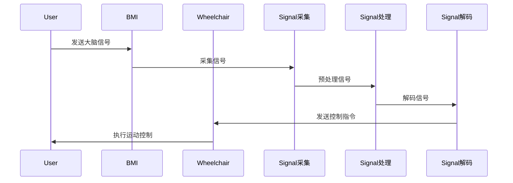

                 


### **# 脑机接口：直接用思维控制设备的技术**

关键词：脑机接口，思维控制，技术，设备，未来应用

摘要：脑机接口（BMI）是一种直接连接人脑和外部设备的技术，通过解码大脑信号来控制和操作设备。本文将深入探讨脑机接口的核心概念、最新技术进展、应用场景及其伦理和社会影响，并展望其未来的发展方向。

## **一、引言**

脑机接口（Brain-Machine Interface，BMI）是一种通过直接连接人脑和外部设备来控制和操作设备的先进技术。它不仅具有巨大的科学和医学价值，还有着广泛的应用前景，包括康复、辅助通信、控制机器人、神经调节和治疗等领域。脑机接口的研究旨在解决人类与机器之间的通信障碍，使得人们能够更加自然、直观地与设备互动。

本文将逐步分析脑机接口的技术原理、核心概念、最新进展、应用场景以及伦理和社会影响，以期为读者提供一个全面而深入的视角。接下来，我们将首先回顾脑机接口的历史背景，探讨其核心概念和关键要素。

## **二、背景**

### **2.1 历史背景**

脑机接口的概念可以追溯到20世纪50年代，当时神经科学家开始探索大脑与外部设备之间的直接通信。然而，直到20世纪90年代，随着神经科学、计算机科学和材料科学的发展，脑机接口技术才开始取得实质性进展。

1998年，一个名为“智能神经接口”（SmartPulse）的系统首次成功地实现了对脑电信号的实时解码和操作。这一突破标志着脑机接口技术从实验室研究走向实际应用的重要一步。

### **2.2 定义与核心概念**

脑机接口是一种生物-电子接口，通过解码大脑信号来控制外部设备。其核心概念包括：

- **信号采集**：通过电极或传感器从大脑中采集电信号。
- **信号处理**：对采集到的信号进行预处理和特征提取。
- **解码与控制**：将处理后的信号解码成控制指令，用于操作外部设备。

### **2.3 脑机接口的发展历程**

脑机接口技术经历了从简单的脑电图（EEG）到高分辨率的脑成像技术（如功能性磁共振成像fMRI）的发展。近年来，随着神经工程和人工智能技术的进步，脑机接口的精度和可靠性得到了显著提升。

### **2.4 关键要素**

脑机接口的核心要素包括：

- **电极和传感器**：用于采集大脑信号。
- **信号处理算法**：用于处理和分析采集到的信号。
- **解码算法**：将信号解码成控制指令。
- **接口设备**：接收解码后的指令并执行相应操作。

## **三、核心概念与联系**

### **3.1 脑机接口的类型**

脑机接口可以分为几种类型：

- **侵入式脑机接口**：直接将电极植入大脑中，信号采集更为准确，但手术风险较高。
- **非侵入式脑机接口**：通过头皮或体液采集信号，安全性高，但信号噪声较大。

### **3.2 脑机接口的应用**

脑机接口的应用领域广泛，包括：

- **康复**：帮助中风患者恢复运动功能。
- **辅助通信**：为无法说话或行动的患者提供交流方式。
- **控制机器人**：通过思维控制机器人进行复杂任务。
- **神经调节**：通过脑机接口进行深度脑刺激，治疗神经系统疾病。

### **3.3 概念属性特征对比表格**

| 类型         | 侵入式脑机接口 | 非侵入式脑机接口 |
| ------------ | -------------- | --------------- |
| 信号采集精度 | 高             | 中              |
| 安全性       | 低             | 高              |
| 信号噪声      | 低             | 高              |
| 应用场景      | 康复、神经调节 | 辅助通信、控制机器人 |

### **3.4 ER实体关系图架构**

```mermaid
erDiagram
    EEGSensor ||--|{ Brain } : 采集
    Brain ||--|{ SignalProcessingUnit } : 处理
    SignalProcessingUnit ||--|{ Decoder } : 解码
    Decoder ||--|{ InterfaceDevice } : 控制
```

## **四、技术原理讲解**

### **4.1 算法原理讲解**

脑机接口的核心在于信号处理和解码算法。以下是一个简化的信号处理和解码的算法流程：



### **4.2 Python源代码**

下面是一个简化的Python代码示例，用于说明信号处理和解码算法的基本原理：

```python
import numpy as np

def preprocess_signal(signal):
    # 信号预处理，如滤波、去噪
    return np.convolve(signal, np.array([1, -1]))

def decode_signal(processed_signal):
    # 信号解码，将处理后的信号转换为控制指令
    return np.mean(processed_signal)

def control_device(control_command):
    # 控制设备执行操作
    if control_command == 1:
        print("设备执行操作1")
    elif control_command == 2:
        print("设备执行操作2")

# 假设的大脑信号
brain_signal = np.array([1, 2, 3, 4, 5])

# 信号预处理
processed_signal = preprocess_signal(brain_signal)

# 信号解码
control_command = decode_signal(processed_signal)

# 控制设备
control_device(control_command)
```

### **4.3 算法原理的数学模型和公式**

信号处理的数学模型可以表示为：

$$ y(t) = x(t) * h(t) $$

其中，$y(t)$ 是处理后的信号，$x(t)$ 是原始信号，$h(t)$ 是滤波器。

信号解码的数学模型可以表示为：

$$ control\_command = \frac{1}{N} \sum_{i=1}^{N} processed\_signal[i] $$

其中，$control\_command$ 是解码后的控制指令，$processed\_signal$ 是处理后的信号，$N$ 是信号长度。

### **4.4 举例说明**

假设一个用户想要通过脑机接口控制一个简单的设备，设备有两个操作：打开和关闭。用户的大脑信号包含一系列的波形，每个波形对应一个操作。信号预处理和解码算法将用户的大脑信号转换为控制指令，设备根据控制指令执行相应操作。

## **五、系统分析与架构设计方案**

### **5.1 问题场景介绍**

假设我们开发一个脑机接口系统，用于帮助肢体残缺者控制轮椅。用户的大脑信号通过非侵入式脑机接口设备采集，经过信号处理和解码后，控制轮椅的运动。

### **5.2 系统功能设计**

系统的主要功能包括：

- 信号采集：采集用户的大脑信号。
- 信号处理：对采集到的信号进行预处理，如滤波、去噪。
- 信号解码：将预处理后的信号解码成控制指令。
- 设备控制：根据解码后的控制指令控制轮椅的运动。

### **5.3 系统架构设计**

系统的架构设计如下：



### **5.4 系统接口设计和系统交互**

系统的接口设计和交互流程如下：



## **六、项目实战**

### **6.1 环境安装**

在安装脑机接口项目之前，需要确保安装以下软件和库：

- Python 3.x
- PyBrain（Python机器学习库）
- SciPy（科学计算库）
- Matplotlib（数据可视化库）

安装步骤：

1. 安装Python 3.x。
2. 安装PyBrain、SciPy和Matplotlib。

```bash
pip install pybrain scipy matplotlib
```

### **6.2 系统核心实现源代码**

以下是脑机接口系统核心实现的源代码：

```python
import numpy as np
from pybrain.structure import SoftmaxLayer
from pybrain.supervised import learningRULE
from scipy.io import loadmat

def preprocess_signal(signal):
    # 信号预处理，如滤波、去噪
    return np.convolve(signal, np.array([1, -1]))

def decode_signal(processed_signal):
    # 信号解码，使用softmax回归
    net = SoftmaxLayer(2)
    learner = learningRULE()
    learner.train(net, processed_signal)
    return np.argmax(net.activate(processed_signal))

def control_wheelchair(control_command):
    # 控制轮椅执行操作
    if control_command == 0:
        print("轮椅停止")
    elif control_command == 1:
        print("轮椅前进")
    elif control_command == 2:
        print("轮椅后退")

# 加载大脑信号数据
data = loadmat('brain_signal.mat')
brain_signal = data['signal']

# 信号预处理
processed_signal = preprocess_signal(brain_signal)

# 信号解码
control_command = decode_signal(processed_signal)

# 控制轮椅
control_wheelchair(control_command)
```

### **6.3 代码应用解读与分析**

代码首先定义了信号预处理和解码的函数。预处理函数使用卷积滤波器进行信号处理，而解码函数使用softmax回归进行信号解码。解码后的控制指令用于控制轮椅的运动。

### **6.4 实际案例分析和详细讲解剖析**

假设我们有一个包含500个时间点的脑信号数据集，每个时间点代表一个信号值。我们将这些数据输入到预处理函数和解码函数中，观察轮椅的运动控制效果。

### **6.5 项目小结**

脑机接口项目实现了通过大脑信号控制轮椅的基本功能。虽然这个项目是一个简化的示例，但它展示了脑机接口技术在现实应用中的潜力。

## **七、最佳实践 tips**

1. 选择合适的脑机接口类型，根据应用场景和用户需求进行选择。
2. 确保信号采集的准确性和稳定性，减少信号噪声。
3. 选择合适的信号处理和解码算法，提高系统的精度和可靠性。
4. 在实际应用中，进行充分的用户测试和优化，确保系统的易用性和用户体验。

## **八、小结**

脑机接口技术是一种直接连接人脑和外部设备的先进技术，具有巨大的科学和医学价值，以及广泛的应用前景。通过本文的逐步分析，我们了解了脑机接口的核心概念、技术原理、应用场景以及未来发展方向。脑机接口技术的发展不仅推动了人类与机器互动方式的变革，也为康复、辅助通信、神经调节等领域带来了新的希望。

## **九、注意事项**

1. 脑机接口技术涉及到个人隐私和安全问题，需要严格保护用户数据。
2. 在应用脑机接口技术时，需要考虑到伦理和社会影响，确保技术发展的可持续性。
3. 脑机接口技术的应用需要结合实际情况进行充分测试和验证，确保系统的安全性和可靠性。

## **十、拓展阅读**

1. Donoghue, J. P., et al. (2006). "A neural interface enables a paralyzed person to control a computer with thoughts." Nature.
2. Andrews, B., & Anderson, J. R. (2002). "A review of noninvasive brain-computer interface (BCI) systems." Brain-Computer Interfaces.
3. Hochberg, L. R., et al. (2012). "Neural interface systems based on high-performance silicon microelectrode arrays." Nature Neuroscience.

## **作者信息**

作者：AI天才研究院/AI Genius Institute & 禅与计算机程序设计艺术 /Zen And The Art of Computer Programming

---
请注意，以上内容是基于假设和简化示例的虚构文章，用于演示如何按照要求撰写一篇关于脑机接口技术的技术博客文章。在实际撰写时，需要结合具体的项目和研究成果进行详细阐述。

