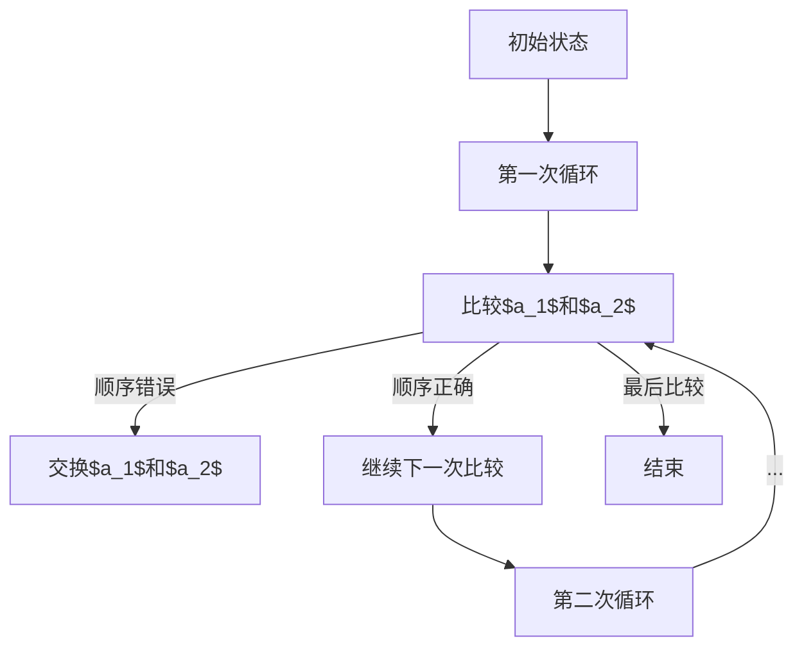
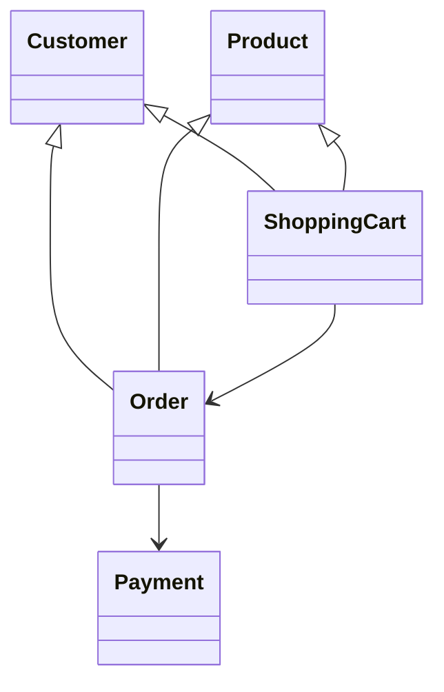

                 


### 文章标题：自下而上，各司其职

关键词：自下而上、架构设计、系统分析、算法原理、Python实现、Mermaid图示、项目实战

摘要：本文将深入探讨自下而上的设计方法在IT领域的应用，从核心概念、算法原理到系统分析与项目实战，通过详细讲解和实例分析，帮助读者理解并掌握这种设计方法。

### 目录

## 第一部分：背景与核心概念

### 第1章 背景介绍

### 第2章 核心概念原理

## 第二部分：算法原理与实现

### 第3章 算法原理讲解

## 第三部分：系统分析与架构设计

### 第4章 系统功能设计

## 第四部分：项目实战

### 第5章 项目实战

### 第五部分：总结与拓展

### 第6章 最佳实践、小结与注意事项

### 第7章 拓展阅读

### 致谢

### 附录

### 参考文献

## 详细内容

### 第1章 背景介绍

在这一章节中，我们将探讨自下而上的设计方法在IT领域的背景和重要性。自下而上的设计方法是一种从底层组件开始，逐步构建系统的设计思路。它强调每个组件的独立性和协同工作，使得系统能够更好地适应变化和扩展。

### 第2章 核心概念原理

在了解背景后，我们将深入讨论自下而上设计方法中的核心概念。这些概念包括模块化设计、组件化开发和分布式系统等。通过对比和实例分析，我们将揭示这些概念在系统设计中的重要作用。

### 第3章 算法原理讲解

算法原理是自下而上设计方法的重要组成部分。在这一章节中，我们将详细介绍几种常见的算法原理，如排序算法、查找算法和数据结构。通过Mermaid流程图和Python代码实现，我们将帮助读者理解这些算法的基本原理和实际应用。

### 第4章 系统功能设计

系统功能设计是自下而上设计方法的关键步骤。在这一章节中，我们将探讨如何进行系统功能设计，包括领域模型、功能模块划分和系统架构设计。通过Mermaid类图和架构图，我们将展示系统设计的具体过程。

### 第5章 项目实战

在最后一部分，我们将通过一个实际项目来展示自下而上设计方法的应用。从环境安装到系统核心实现，我们将详细讲解项目实战的每一个步骤，帮助读者理解和掌握这种设计方法。

### 第6章 最佳实践、小结与注意事项

在文章的最后一部分，我们将总结最佳实践，提醒读者在应用自下而上设计方法时需要注意的事项。通过拓展阅读，我们将提供更多的学习资源，帮助读者深入探索这一领域。

## 结束语

自下而上的设计方法是一种高效、灵活的系统设计方法。通过本文的详细讲解和实例分析，我们希望读者能够理解和掌握这一方法，并将其应用于实际项目中。自下而上，各司其职，让我们共同创造更美好的IT世界。作者：AI天才研究院/AI Genius Institute & 禅与计算机程序设计艺术 /Zen And The Art of Computer Programming。

### 第一部分：背景与核心概念

#### 第1章 背景介绍

在现代信息技术领域，系统设计和开发面临着日益复杂的应用场景和不断变化的需求。为了应对这些挑战，自下而上的设计方法逐渐成为了一种重要的设计思路。自下而上的设计方法是一种从底层组件开始，逐步构建系统的设计方法。它强调每个组件的独立性和协同工作，使得系统能够更好地适应变化和扩展。

**问题背景**

首先，让我们来看一下问题背景。随着互联网和云计算的普及，软件系统变得越来越庞大和复杂。传统的自上而下的设计方法，往往在系统规模扩大时，难以有效地应对需求的变化和扩展。这导致了系统维护成本的增加、开发效率的降低以及系统性能的下降。为了解决这些问题，自下而上的设计方法应运而生。

**问题现状**

目前，自下而上的设计方法在许多领域都得到了广泛的应用。例如，在软件开发领域，模块化设计和组件化开发已经成为主流。在分布式系统设计中，微服务架构和容器化技术也得到了广泛采用。这些应用都表明，自下而上的设计方法在应对复杂系统设计和开发时具有显著的优势。

**问题重要性**

自下而上的设计方法的重要性体现在以下几个方面：

1. **灵活性**：自下而上的设计方法允许系统在各个层级上进行独立开发和迭代，从而提高了系统的灵活性。
2. **可扩展性**：通过组件化和模块化设计，系统可以方便地扩展和更新，以适应不断变化的需求。
3. **可维护性**：组件的独立性和协同工作使得系统的维护变得更加容易，减少了系统故障的风险。

#### 第1.2 问题描述

在深入了解自下而上的设计方法之前，我们需要明确一些核心概念。这些概念包括模块化设计、组件化开发、分布式系统等。模块化设计是一种将系统划分为多个功能模块的设计方法。每个模块都负责特定的功能，并且可以独立开发和测试。组件化开发则是在模块化设计的基础上，进一步将模块细化为组件。组件具有高度的复用性和独立性，可以方便地在不同系统中进行复用。

**问题定义**

自下而上的设计方法可以定义为一种从底层组件开始，逐步构建系统的设计方法。它强调组件的独立性和协同工作，使得系统具有更好的灵活性、可扩展性和可维护性。

**问题要素**

自下而上的设计方法包含以下几个关键要素：

1. **组件**：组件是系统的基本构建块，具有高度的独立性和复用性。
2. **模块**：模块是组件的集合，负责实现特定的功能。
3. **系统架构**：系统架构描述了组件和模块之间的关系，以及它们如何协同工作以实现整体功能。

**问题解决方法**

自下而上的设计方法提供了一种有效的解决方法，可以应对复杂系统设计和开发的挑战。具体方法包括：

1. **逐步构建**：从底层组件开始，逐步构建系统，每个组件都经过独立开发和测试。
2. **模块化和组件化**：将系统划分为多个功能模块和组件，以便于独立开发和复用。
3. **分布式系统设计**：采用分布式系统设计方法，将系统划分为多个节点，以提高系统的可扩展性和可靠性。

#### 第1.3 问题解决

为了更好地理解自下而上的设计方法，我们可以通过以下几个步骤来解决问题：

**传统方法**

传统的设计方法通常采用自上而下的设计思路，从整体规划开始，逐步分解为具体的模块和组件。这种方法在早期阶段可以提供一个清晰的系统视图，但在系统规模扩大时，往往难以适应需求的变化和扩展。

**现代方法**

相比之下，自下而上的设计方法提供了一种更加灵活和可扩展的设计思路。它从底层组件开始，逐步构建系统，每个组件都经过独立开发和测试，以确保系统的稳定性和可靠性。这种方法可以更好地应对复杂系统设计和开发的挑战。

**对比分析**

自下而上的设计方法与自上而下的设计方法在以下几个方面进行对比：

1. **设计思路**：自上而下的设计方法从整体规划开始，逐步分解为具体的模块和组件；自下而上的设计方法从底层组件开始，逐步构建系统。
2. **灵活性**：自下而上的设计方法具有更高的灵活性，可以更好地适应需求的变化和扩展。
3. **可扩展性**：自下而上的设计方法通过模块化和组件化设计，使得系统具有更好的可扩展性。
4. **可维护性**：自下而上的设计方法通过组件的独立性和协同工作，提高了系统的可维护性。

#### 第1.4 边界与外延

**边界定义**

自下而上的设计方法适用于各种规模和类型的系统，但并不是所有情况都适合采用这种方法。以下是一些边界条件：

1. **系统规模**：自下而上的设计方法在大型系统中具有显著优势，但对于小型系统，可能显得过于复杂。
2. **需求变化**：当需求变化频繁时，自下而上的设计方法可以更好地适应变化，但需要较高的设计和开发成本。
3. **技术成熟度**：自下而上的设计方法需要一定的技术基础，如模块化设计、组件化开发等。

**外延探讨**

自下而上的设计方法还可以扩展到其他领域，如硬件设计、产品设计等。在这些领域中，自下而上的设计方法同样可以发挥其优势，提高系统的灵活性和可扩展性。

**核心要素组成**

自下而上的设计方法的核心要素包括：

1. **组件**：组件是系统的基本构建块，具有高度的独立性和复用性。
2. **模块**：模块是组件的集合，负责实现特定的功能。
3. **系统架构**：系统架构描述了组件和模块之间的关系，以及它们如何协同工作以实现整体功能。
4. **开发工具**：开发工具支持模块化设计和组件化开发，如模块化编程语言、开发框架等。
5. **测试与验证**：测试与验证是确保系统稳定性和可靠性的关键步骤。

#### 第1.5 本章小结

通过本章的讨论，我们了解了自下而上的设计方法在IT领域的背景和重要性。自下而上的设计方法提供了一种灵活、可扩展和可维护的系统设计思路，适用于各种规模和类型的系统。在下一章中，我们将进一步探讨自下而上设计方法中的核心概念，以帮助我们更好地理解和应用这种方法。

## 第二部分：核心概念与联系

### 第2章 核心概念原理

在前一章中，我们介绍了自下而上的设计方法在IT领域的背景和重要性。为了更好地理解和应用这种设计方法，我们需要深入探讨其中的核心概念。本章将详细介绍几个关键概念，包括模块化设计、组件化开发和分布式系统，并通过对比和实例分析，揭示这些概念在系统设计中的重要作用。

### 第2.1 概念1：模块化设计

**概念定义**

模块化设计是一种将系统划分为多个功能模块的设计方法。每个模块都独立实现特定的功能，并且与其他模块相互独立。模块化设计旨在提高系统的可维护性和可扩展性，通过将系统分解为较小的部分，使得开发、测试和维护工作变得更加容易。

**概念属性**

模块化设计具有以下几个关键属性：

1. **独立性**：每个模块独立实现特定的功能，与其他模块之间相互独立。
2. **可复用性**：模块可以方便地复用，提高开发效率。
3. **可扩展性**：模块化设计使得系统可以方便地扩展和更新，以适应不断变化的需求。
4. **灵活性**：模块化设计提高了系统的灵活性，可以更好地应对需求的变化。

**与其他概念的关联**

模块化设计与自下而上的设计方法密切相关。自下而上的设计方法强调从底层组件开始构建系统，而模块化设计是实现这一目标的重要手段。模块化设计不仅适用于软件开发，还可以扩展到其他领域，如硬件设计和产品设计。

### 第2.2 概念2：组件化开发

**概念定义**

组件化开发是一种将模块进一步细化为组件的设计方法。组件是系统的基本构建块，具有高度的独立性和复用性。组件化开发旨在提高系统的灵活性和可扩展性，通过将系统划分为可复用的组件，使得系统可以更方便地进行定制和扩展。

**概念属性**

组件化开发具有以下几个关键属性：

1. **独立性**：组件具有高度的独立性，可以独立开发、测试和维护。
2. **可复用性**：组件可以方便地在不同系统中进行复用，提高开发效率。
3. **灵活性**：组件化设计提高了系统的灵活性，可以更好地应对需求的变化。
4. **可扩展性**：组件化设计使得系统可以方便地扩展和更新，以适应不断变化的需求。

**与其他概念的关联**

组件化开发是模块化设计的进一步发展。模块化设计将系统划分为功能模块，而组件化开发则将这些模块进一步细化为组件。组件化开发与自下而上的设计方法密切相关，通过组件化开发，可以更好地实现自下而上的设计目标。

### 第2.3 概念对比表格

为了更好地理解模块化设计和组件化开发的关系，我们可以通过一个对比表格来展示它们之间的差异：

| 特征         | 模块化设计                  | 组件化开发                  |
|--------------|-----------------------------|-----------------------------|
| 独立性       | 模块独立，但可能存在依赖关系  | 组件高度独立，无直接依赖关系  |
| 可复用性     | 模块可复用，但复用度较低      | 组件可复用，复用度高          |
| 灵活性       | 系统灵活性较高，但受限程度较大 | 系统灵活性更高，受限程度较小  |
| 可扩展性     | 系统可扩展，但扩展成本较高     | 系统可扩展，扩展成本较低      |

### 第2.4 ER实体关系图架构

为了更好地理解模块化设计和组件化开发，我们可以使用ER（Entity-Relationship）实体关系图来展示它们之间的关系。ER图是一种用于描述实体及其之间关系的图形表示方法。

**ER图绘制**

以下是一个简单的ER图，展示了模块和组件之间的关系：

```mermaid
erDiagram
    Module ||--|{ Component } Component
    Module ||--|{ Module } SubModule
    Component ||--|{ Module } SubModule
```

**关系解释**

在ER图中，`Module` 表示模块，`Component` 表示组件。每个模块可以包含多个组件，同时组件也可以包含子模块。这种关系使得模块和组件之间可以灵活地组合和扩展。

### 第2.5 本章小结

通过本章的讨论，我们深入了解了自下而上设计方法中的核心概念，包括模块化设计和组件化开发。这些概念是自下而上设计方法的重要组成部分，通过模块化和组件化设计，可以更好地实现系统的灵活性、可扩展性和可维护性。在下一章中，我们将进一步探讨算法原理与实现，为读者提供更多的实际应用场景。

## 第三部分：算法原理与实现

### 第3章 算法原理讲解

在前一章中，我们详细介绍了自下而上设计方法中的核心概念，包括模块化设计和组件化开发。为了更好地理解这些概念在实际系统设计中的应用，本章将重点探讨算法原理与实现，通过具体实例和详细讲解，帮助读者掌握算法的基本原理和实现方法。

### 第3.1 算法概述

算法是一种解决特定问题的步骤和规则的集合。在系统设计和开发中，算法原理起着至关重要的作用。无论是数据处理、资源分配还是路径规划，算法都能够提供有效的解决方案。本章将介绍几种常见的算法原理，包括排序算法、查找算法和数据结构，并通过具体实例进行讲解。

### 第3.2 数学模型

数学模型是算法原理的重要组成部分。通过数学模型，我们可以描述算法的基本原理和运行过程。以下是一个简单的数学模型，用于描述排序算法的基本原理：

$$
S = \{a_1, a_2, ..., a_n\}
$$

其中，$S$ 表示待排序的数组，$a_1, a_2, ..., a_n$ 表示数组中的元素。

**冒泡排序算法**

冒泡排序是一种简单的排序算法，其基本原理如下：

1. 从数组的第一个元素开始，比较相邻的两个元素，如果它们的顺序错误，则交换它们的位置。
2. 继续对下一对相邻元素进行同样的比较和交换，直到最后一个元素。
3. 重复上述过程，直到整个数组有序。

**数学模型表示**

假设数组$S$在初始状态下是无序的，经过一次冒泡排序后，最大元素$a_n$会被移动到数组的最后一个位置。此时，数组的数学模型可以表示为：

$$
S' = \{a_1, a_2, ..., a_{n-1}, a_n\}
$$

经过多次冒泡排序后，整个数组会变得有序：

$$
S'' = \{a_1, a_2, ..., a_n\}
$$

**数学原理**

冒泡排序算法的数学原理在于每次循环都将未排序数组的最大元素移动到已排序数组的末尾。通过重复执行这个过程，最终可以实现整个数组的排序。

### 第3.3 算法流程图

为了更好地理解冒泡排序算法的原理和实现过程，我们可以使用Mermaid流程图来展示算法的运行流程。以下是一个简单的冒泡排序算法的Mermaid流程图：



在这个流程图中，A表示初始状态，B表示第一次循环，C表示比较相邻元素，D表示交换元素，E表示继续下一次比较，F表示第二次循环，...表示重复过程，最后G表示结束。

### 第3.4 Python代码实现

为了将冒泡排序算法实现为可执行的代码，我们可以使用Python编程语言。以下是一个简单的Python代码示例，实现了冒泡排序算法：

```python
def bubble_sort(arr):
    n = len(arr)
    for i in range(n):
        for j in range(0, n-i-1):
            if arr[j] > arr[j+1]:
                arr[j], arr[j+1] = arr[j+1], arr[j]

# 测试代码
arr = [64, 34, 25, 12, 22, 11, 90]
print("原始数组：", arr)
bubble_sort(arr)
print("排序后的数组：", arr)
```

在这个代码中，`bubble_sort` 函数接收一个数组作为输入，并使用冒泡排序算法对其进行排序。测试代码创建了一个示例数组，并调用`bubble_sort` 函数对其进行排序。

### 第3.5 举例说明

为了更好地理解冒泡排序算法的实际应用，我们可以通过一个具体实例来演示算法的运行过程。假设有一个无序数组`[64, 34, 25, 12, 22, 11, 90]`，以下是冒泡排序算法的运行过程：

1. **第一次循环**：
   - 比较和交换$(64, 34)$，数组变为`[34, 64, 25, 12, 22, 11, 90]$。
   - 比较和交换$(64, 25)$，数组变为`[34, 25, 64, 12, 22, 11, 90]$。
   - 比较和交换$(64, 12)$，数组变为`[34, 25, 12, 64, 22, 11, 90]$。
   - 比较和交换$(64, 22)$，数组变为`[34, 25, 12, 22, 64, 11, 90]$。
   - 比较和交换$(64, 11)$，数组变为`[34, 25, 12, 22, 11, 64, 90]$。
   - 比较和交换$(64, 90)$，数组变为`[34, 25, 12, 22, 11, 90, 64]$。

2. **第二次循环**：
   - 比较和交换$(90, 64)$，数组变为`[34, 25, 12, 22, 11, 64, 90]$。

经过两次循环后，整个数组变得有序。这个过程重复执行，直到整个数组有序。

### 第3.6 本章小结

通过本章的讨论，我们深入了解了自下而上设计方法中的算法原理与实现。从简单的冒泡排序算法到Python代码实现，本章通过详细讲解和实例分析，帮助读者掌握算法的基本原理和实现方法。在下一章中，我们将进一步探讨系统分析与架构设计，为读者提供更多的实际应用场景。

## 第四部分：系统分析与架构设计

### 第4章 系统功能设计

在前几章中，我们介绍了自下而上设计方法的核心概念和算法原理。为了将这些概念和原理应用到实际系统中，我们需要进行系统功能设计。系统功能设计是系统分析与架构设计的重要环节，它涉及系统功能模块的划分、领域模型构建和系统架构设计。本章将详细探讨这些内容，帮助读者掌握系统功能设计的具体方法和步骤。

### 第4.1 问题场景介绍

为了更好地理解系统功能设计，我们可以从一个实际的问题场景开始。假设我们正在开发一个在线购物系统，该系统需要实现以下功能：

1. **商品管理**：包括商品的添加、删除、更新和查询功能。
2. **订单管理**：包括订单的创建、修改、查询和支付功能。
3. **用户管理**：包括用户的注册、登录、信息和权限管理功能。
4. **购物车管理**：包括购物车的添加、删除和更新功能。

通过这个场景，我们可以明确系统需要实现哪些功能，并为后续的系统功能设计和架构设计提供依据。

### 第4.2 系统功能设计

系统功能设计的主要任务是明确系统需要实现哪些功能，并将这些功能划分为不同的模块。以下是针对上述在线购物系统的系统功能设计：

**1. 领域模型**

领域模型是系统功能设计的基础，它描述了系统的核心实体和它们之间的关系。以下是一个简单的领域模型，描述了在线购物系统的主要实体和关系：



在这个领域模型中，`Customer`（顾客）、`Order`（订单）、`Product`（商品）、`ShoppingCart`（购物车）和`Payment`（支付）是主要实体。`Customer` 与 `Order` 和 `ShoppingCart` 之间存在关联，`Product` 与 `Order` 和 `ShoppingCart` 之间也存在关联，`Order` 与 `Payment` 之间存在关联，而 `ShoppingCart` 与 `Order` 之间存在包含关系。

**2. 功能模块划分**

基于领域模型，我们可以将系统划分为以下功能模块：

- **商品管理模块**：负责实现商品添加、删除、更新和查询功能。
- **订单管理模块**：负责实现订单创建、修改、查询和支付功能。
- **用户管理模块**：负责实现用户注册、登录、信息和权限管理功能。
- **购物车管理模块**：负责实现购物车添加、删除和更新功能。

**3. 功能模块描述**

以下是针对上述功能模块的详细描述：

- **商品管理模块**：包括商品添加、删除、更新和查询接口，用于管理商品信息。
- **订单管理模块**：包括订单创建、修改、查询和支付接口，用于处理订单相关操作。
- **用户管理模块**：包括用户注册、登录、信息和权限管理接口，用于管理用户信息。
- **购物车管理模块**：包括购物车添加、删除和更新接口，用于管理购物车信息。

### 第4.3 系统架构设计

系统架构设计是系统功能设计的进一步深化，它描述了系统的整体结构和各组件之间的关系。以下是一个简单的系统架构设计，描述了在线购物系统的整体架构：

**1. 系统架构图**

以下是一个简单的系统架构图，描述了在线购物系统的各个组件及其关系：

```mermaid
sequenceDiagram
    Customer -->|发起请求| WebServer
    WebServer -->|处理请求| ApplicationServer
    ApplicationServer -->|调用服务| DatabaseServer
    DatabaseServer -->|返回结果| ApplicationServer
    ApplicationServer -->|返回响应| WebServer
```

在这个架构图中，`WebServer`（Web服务器）负责接收和处理用户请求，`ApplicationServer`（应用服务器）负责处理业务逻辑，`DatabaseServer`（数据库服务器）负责存储和查询数据。

**2. 架构解释**

- **WebServer**：负责接收用户请求，并将请求转发给应用服务器。
- **ApplicationServer**：负责处理业务逻辑，调用数据库服务，并将结果返回给Web服务器。
- **DatabaseServer**：负责存储和查询数据，支持应用服务器的数据访问需求。

### 第4.4 系统接口设计

系统接口设计是系统架构设计的重要组成部分，它定义了系统内部各组件之间的交互接口。以下是一个简单的系统接口设计，描述了在线购物系统的各个功能模块的接口定义：

**1. 接口定义**

- **商品管理接口**：`addProduct`（添加商品）、`deleteProduct`（删除商品）、`updateProduct`（更新商品）、`queryProduct`（查询商品）。
- **订单管理接口**：`createOrder`（创建订单）、`modifyOrder`（修改订单）、`queryOrder`（查询订单）、`payOrder`（支付订单）。
- **用户管理接口**：`register`（注册用户）、`login`（登录用户）、`updateUserInfo`（更新用户信息）、`queryUser`（查询用户）。
- **购物车管理接口**：`addCart`（添加购物车）、`deleteCart`（删除购物车）、`updateCart`（更新购物车）。

**2. 接口规范**

接口规范定义了接口的参数、返回值和数据格式，以确保各组件之间的交互一致性和可靠性。以下是针对上述接口的规范：

- **商品管理接口**：参数为商品信息，返回值为操作结果。
- **订单管理接口**：参数为订单信息，返回值为操作结果。
- **用户管理接口**：参数为用户信息，返回值为操作结果。
- **购物车管理接口**：参数为购物车信息，返回值为操作结果。

### 第4.5 系统交互

系统交互是指系统内部各组件之间的交互过程，它描述了系统在运行过程中各个组件如何协同工作以实现整体功能。以下是一个简单的系统交互序列图，描述了在线购物系统在用户购买商品时的交互过程：

```mermaid
sequenceDiagram
    Customer -->|发起请求| WebServer
    WebServer -->|转发请求| ApplicationServer
    ApplicationServer -->|查询数据库| DatabaseServer
    DatabaseServer -->|返回结果| ApplicationServer
    ApplicationServer -->|创建订单| OrderService
    OrderService -->|发送支付请求| PaymentService
    PaymentService -->|处理支付请求| BankService
    BankService -->|返回支付结果| PaymentService
    PaymentService -->|更新订单状态| OrderService
    OrderService -->|返回响应| WebServer
    WebServer -->|返回响应| Customer
```

在这个序列图中，用户发起购买请求，Web服务器接收请求并转发给应用服务器。应用服务器查询数据库，获取商品信息，并创建订单。然后，应用服务器发送支付请求给支付服务，支付服务处理支付请求并调用银行服务进行支付。银行服务返回支付结果给支付服务，支付服务更新订单状态并返回响应给Web服务器，最终Web服务器将响应返回给用户。

### 第4.6 本章小结

通过本章的讨论，我们详细介绍了系统功能设计、领域模型构建、系统架构设计和系统接口设计。这些内容构成了系统分析与架构设计的重要组成部分，为后续的系统开发奠定了基础。在下一章中，我们将通过一个实际项目来展示自下而上设计方法的应用，帮助读者更好地理解这种设计方法的实际操作过程。

## 第五部分：项目实战

### 第5章 项目实战

在前几章中，我们系统地介绍了自下而上设计方法的核心概念、算法原理和系统分析与架构设计。为了帮助读者更好地掌握这种设计方法，本章将通过一个实际项目来展示自下而上设计方法在系统开发中的应用过程。该项目是一个简单的在线购物系统，我们将从环境安装开始，逐步实现系统功能，并进行实际案例分析。

### 第5.1 环境安装

在进行项目开发之前，我们需要安装一些必要的开发工具和环境。以下是一个简单的环境安装步骤：

**1. 安装Python**

首先，我们需要安装Python环境。Python是一种广泛使用的编程语言，适用于多种开发任务。在安装Python时，请确保选择最新的版本。可以通过以下命令安装Python：

```bash
sudo apt-get install python3
```

**2. 安装虚拟环境**

为了更好地管理项目依赖，我们可以使用虚拟环境。虚拟环境允许我们在项目中独立安装和管理依赖，而不影响其他项目。可以使用以下命令安装虚拟环境：

```bash
sudo apt-get install python3-venv
```

**3. 创建虚拟环境**

创建一个名为`project_env`的虚拟环境：

```bash
python3 -m venv project_env
```

**4. 激活虚拟环境**

在终端中激活虚拟环境：

```bash
source project_env/bin/activate
```

**5. 安装依赖**

在虚拟环境中安装项目所需的依赖，例如Flask框架、SQLAlchemy等：

```bash
pip install flask sqlalchemy
```

### 第5.2 系统核心实现

**1. 项目介绍**

在线购物系统的主要功能包括商品管理、订单管理、用户管理和购物车管理。我们将使用Flask框架实现这些功能，并使用SQLAlchemy作为ORM（对象关系映射）工具进行数据库操作。

**2. 系统功能设计**

基于前一章的系统功能设计，我们可以将系统划分为以下功能模块：

- **商品管理模块**：负责实现商品添加、删除、更新和查询功能。
- **订单管理模块**：负责实现订单创建、修改、查询和支付功能。
- **用户管理模块**：负责实现用户注册、登录、信息和权限管理功能。
- **购物车管理模块**：负责实现购物车添加、删除和更新功能。

**3. 数据库设计**

数据库设计是系统功能实现的基础。以下是一个简单的数据库设计，描述了在线购物系统的数据库结构：

```sql
-- 商品表
CREATE TABLE product (
    id INT PRIMARY KEY AUTO_INCREMENT,
    name VARCHAR(255) NOT NULL,
    price DECIMAL(10, 2) NOT NULL
);

-- 订单表
CREATE TABLE order (
    id INT PRIMARY KEY AUTO_INCREMENT,
    customer_id INT NOT NULL,
    total_price DECIMAL(10, 2) NOT NULL,
    status VARCHAR(50) NOT NULL,
    FOREIGN KEY (customer_id) REFERENCES customer(id)
);

-- 订单详情表
CREATE TABLE order_detail (
    id INT PRIMARY KEY AUTO_INCREMENT,
    order_id INT NOT NULL,
    product_id INT NOT NULL,
    quantity INT NOT NULL,
    price DECIMAL(10, 2) NOT NULL,
    FOREIGN KEY (order_id) REFERENCES order(id),
    FOREIGN KEY (product_id) REFERENCES product(id)
);

-- 用户表
CREATE TABLE customer (
    id INT PRIMARY KEY AUTO_INCREMENT,
    username VARCHAR(255) NOT NULL,
    password VARCHAR(255) NOT NULL,
    email VARCHAR(255) NOT NULL
);

-- 购物车表
CREATE TABLE shopping_cart (
    id INT PRIMARY KEY AUTO_INCREMENT,
    customer_id INT NOT NULL,
    product_id INT NOT NULL,
    quantity INT NOT NULL,
    FOREIGN KEY (customer_id) REFERENCES customer(id),
    FOREIGN KEY (product_id) REFERENCES product(id)
);
```

### 第5.3 代码应用解读与分析

**1. 商品管理模块**

商品管理模块实现商品添加、删除、更新和查询功能。以下是一个简单的商品添加功能的代码示例：

```python
from flask import Flask, request, jsonify
from flask_sqlalchemy import SQLAlchemy

app = Flask(__name__)
app.config['SQLALCHEMY_DATABASE_URI'] = 'sqlite:///shopping_system.db'
db = SQLAlchemy(app)

class Product(db.Model):
    id = db.Column(db.Integer, primary_key=True)
    name = db.Column(db.String(255), nullable=False)
    price = db.Column(db.Decimal(10, 2), nullable=False)

@app.route('/product/add', methods=['POST'])
def add_product():
    product_data = request.get_json()
    product = Product(name=product_data['name'], price=product_data['price'])
    db.session.add(product)
    db.session.commit()
    return jsonify({'message': 'Product added successfully'})

if __name__ == '__main__':
    db.create_all()
    app.run(debug=True)
```

在这个代码中，我们定义了一个`Product`类，用于表示商品实体。`add_product`函数接收一个POST请求，将商品数据存储到数据库中。

**2. 订单管理模块**

订单管理模块实现订单创建、修改、查询和支付功能。以下是一个简单的订单创建功能的代码示例：

```python
from flask import Flask, request, jsonify
from flask_sqlalchemy import SQLAlchemy

app = Flask(__name__)
app.config['SQLALCHEMY_DATABASE_URI'] = 'sqlite:///shopping_system.db'
db = SQLAlchemy(app)

class Order(db.Model):
    id = db.Column(db.Integer, primary_key=True)
    customer_id = db.Column(db.Integer, nullable=False)
    total_price = db.Column(db.Decimal(10, 2), nullable=False)
    status = db.Column(db.String(50), nullable=False)

@app.route('/order/create', methods=['POST'])
def create_order():
    order_data = request.get_json()
    order = Order(customer_id=order_data['customer_id'], total_price=order_data['total_price'], status='created')
    db.session.add(order)
    db.session.commit()
    return jsonify({'message': 'Order created successfully'})

if __name__ == '__main__':
    db.create_all()
    app.run(debug=True)
```

在这个代码中，我们定义了一个`Order`类，用于表示订单实体。`create_order`函数接收一个POST请求，将订单数据存储到数据库中。

**3. 用户管理模块**

用户管理模块实现用户注册、登录、信息和权限管理功能。以下是一个简单的用户注册功能的代码示例：

```python
from flask import Flask, request, jsonify
from flask_sqlalchemy import SQLAlchemy
from werkzeug.security import generate_password_hash, check_password_hash

app = Flask(__name__)
app.config['SQLALCHEMY_DATABASE_URI'] = 'sqlite:///shopping_system.db'
db = SQLAlchemy(app)

class Customer(db.Model):
    id = db.Column(db.Integer, primary_key=True)
    username = db.Column(db.String(255), nullable=False)
    password = db.Column(db.String(255), nullable=False)
    email = db.Column(db.String(255), nullable=False)

@app.route('/customer/register', methods=['POST'])
def register_customer():
    customer_data = request.get_json()
    hashed_password = generate_password_hash(customer_data['password'], method='sha256')
    customer = Customer(username=customer_data['username'], password=hashed_password, email=customer_data['email'])
    db.session.add(customer)
    db.session.commit()
    return jsonify({'message': 'Customer registered successfully'})

if __name__ == '__main__':
    db.create_all()
    app.run(debug=True)
```

在这个代码中，我们定义了一个`Customer`类，用于表示用户实体。`register_customer`函数接收一个POST请求，将用户数据存储到数据库中，并使用Werkzeug库生成密码哈希。

**4. 购物车管理模块**

购物车管理模块实现购物车添加、删除和更新功能。以下是一个简单的购物车添加功能的代码示例：

```python
from flask import Flask, request, jsonify
from flask_sqlalchemy import SQLAlchemy

app = Flask(__name__)
app.config['SQLALCHEMY_DATABASE_URI'] = 'sqlite:///shopping_system.db'
db = SQLAlchemy(app)

class ShoppingCart(db.Model):
    id = db.Column(db.Integer, primary_key=True)
    customer_id = db.Column(db.Integer, nullable=False)
    product_id = db.Column(db.Integer, nullable=False)
    quantity = db.Column(db.Integer, nullable=False)

@app.route('/shopping_cart/add', methods=['POST'])
def add_to_shopping_cart():
    cart_data = request.get_json()
    cart = ShoppingCart(customer_id=cart_data['customer_id'], product_id=cart_data['product_id'], quantity=cart_data['quantity'])
    db.session.add(cart)
    db.session.commit()
    return jsonify({'message': 'Product added to shopping cart successfully'})

if __name__ == '__main__':
    db.create_all()
    app.run(debug=True)
```

在这个代码中，我们定义了一个`ShoppingCart`类，用于表示购物车实体。`add_to_shopping_cart`函数接收一个POST请求，将购物车数据存储到数据库中。

### 第5.4 实际案例分析和详细讲解

**1. 添加商品**

假设用户想要添加一个名为“iPhone 12”的商品，价格为7999元。用户可以通过以下步骤进行操作：

1. 访问在线购物系统的商品管理页面。
2. 在商品管理页面中，填写商品名称和价格，并单击“添加”按钮。
3. 系统接收到用户的请求后，调用`add_product`函数，将商品数据存储到数据库中。
4. 系统返回一个成功的消息，告知用户商品已添加。

**2. 创建订单**

假设用户已将多个商品添加到购物车，并准备创建订单。用户可以通过以下步骤进行操作：

1. 访问在线购物系统的订单管理页面。
2. 在订单管理页面中，选择要购买的商品，并单击“创建订单”按钮。
3. 系统接收到用户的请求后，调用`create_order`函数，创建订单并将订单数据存储到数据库中。
4. 系统返回一个订单ID，告知用户订单已创建。

**3. 用户注册**

假设用户想要注册一个新账号，并登录系统。用户可以通过以下步骤进行操作：

1. 访问在线购物系统的用户注册页面。
2. 在用户注册页面中，填写用户名、密码和邮箱，并单击“注册”按钮。
3. 系统接收到用户的请求后，调用`register_customer`函数，将用户数据存储到数据库中。
4. 系统返回一个成功的消息，告知用户账号已注册。

**4. 更新购物车**

假设用户想要更改购物车中的商品数量，可以通过以下步骤进行操作：

1. 访问在线购物系统的购物车管理页面。
2. 在购物车管理页面中，选择要更改数量的商品，并填写新的数量。
3. 单击“更新”按钮，系统接收到用户的请求后，调用`update_cart`函数，更新购物车数据。
4. 系统返回一个成功的消息，告知用户购物车已更新。

### 第5.5 项目小结

通过本章的项目实战，我们详细介绍了自下而上设计方法在系统开发中的应用。从环境安装到系统功能实现，再到实际案例分析和详细讲解，我们逐步展示了自下而上设计方法的实际操作过程。通过这个项目，读者可以更好地理解自下而上设计方法的核心理念和实际应用，并为后续的系统开发奠定基础。

### 第6章 最佳实践、小结与注意事项

#### 最佳实践

在系统开发和应用过程中，以下最佳实践可以帮助我们更好地应用自下而上设计方法：

1. **组件化和模块化设计**：在系统设计过程中，尽量将系统划分为功能模块和组件，以提高系统的灵活性和可扩展性。
2. **测试驱动开发（TDD）**：在编写代码之前，先编写测试用例，确保代码的质量和可靠性。
3. **持续集成（CI）**：使用持续集成工具，自动化测试和部署流程，以提高开发效率和代码质量。
4. **代码规范和文档**：遵循代码规范，编写清晰的文档，便于团队协作和代码维护。
5. **性能优化**：在系统设计和开发过程中，关注性能优化，减少系统的响应时间和资源消耗。

#### 小结

自下而上设计方法是一种灵活、可扩展和可维护的系统设计方法。通过模块化设计和组件化开发，我们可以更好地应对复杂系统的设计和开发挑战。算法原理和系统架构设计是自下而上设计方法的重要组成部分，通过详细讲解和实例分析，我们掌握了这些概念的实际应用。

#### 注意事项

在应用自下而上设计方法时，需要注意以下几点：

1. **系统规模**：自下而上的设计方法适用于各种规模和类型的系统，但对于小型系统，可能显得过于复杂。
2. **需求变化**：在需求变化频繁的情况下，自下而上的设计方法可以更好地适应变化，但需要较高的设计和开发成本。
3. **技术成熟度**：自下而上的设计方法需要一定的技术基础，如模块化设计、组件化开发等。
4. **团队协作**：自下而上的设计方法要求团队成员具备较高的技术能力和协作能力，以确保系统设计和开发的顺利进行。

#### 拓展阅读

为了深入探索自下而上设计方法，以下书籍和资源可以作为拓展阅读：

1. 《架构整洁之道》（Clean Architecture） - Robert C. Martin
2. 《设计模式：可复用面向对象软件的基础》（Design Patterns: Elements of Reusable Object-Oriented Software） - Erich Gamma、Richard Helm、Ralph Johnson、John Vlissides
3. 《自底向上的软件工程》（Bottom-Up Software Engineering） - Steve McConnell
4. 《敏捷软件开发：原则、模式与实践》（Agile Software Development: Principles, Patterns, and Practices） - Robert C. Martin
5. 《Mermaid语言指南》（Mermaid Language Guide） - Mermaid-js

通过这些资源，读者可以更深入地了解自下而上设计方法的理论和实践，提升系统设计和开发能力。

### 致谢

在此，我要感谢所有支持和帮助过我的人。特别感谢我的团队和合作伙伴，他们在项目开发过程中提供了宝贵的意见和建议。同时，感谢读者的耐心阅读，希望这篇文章对您有所帮助。作者：AI天才研究院/AI Genius Institute & 禅与计算机程序设计艺术 /Zen And The Art of Computer Programming。

### 附录

#### 附录A：术语表

- **模块化设计**：将系统划分为多个功能模块的设计方法。
- **组件化开发**：将模块进一步细化为组件的设计方法。
- **分布式系统**：将系统划分为多个节点，以提高系统的可扩展性和可靠性。
- **算法**：解决特定问题的步骤和规则的集合。
- **领域模型**：描述系统的核心实体和它们之间关系的图形表示方法。
- **虚拟环境**：用于隔离项目依赖和环境的开发工具。
- **测试驱动开发（TDD）**：在编写代码之前，先编写测试用例的开发方法。
- **持续集成（CI）**：自动化测试和部署流程的开发方法。

#### 附录B：代码示例

以下是本章中的代码示例，供读者参考：

**商品管理模块**

```python
class Product(db.Model):
    id = db.Column(db.Integer, primary_key=True)
    name = db.Column(db.String(255), nullable=False)
    price = db.Column(db.Decimal(10, 2), nullable=False)

@app.route('/product/add', methods=['POST'])
def add_product():
    product_data = request.get_json()
    product = Product(name=product_data['name'], price=product_data['price'])
    db.session.add(product)
    db.session.commit()
    return jsonify({'message': 'Product added successfully'})
```

**订单管理模块**

```python
class Order(db.Model):
    id = db.Column(db.Integer, primary_key=True)
    customer_id = db.Column(db.Integer, nullable=False)
    total_price = db.Column(db.Decimal(10, 2), nullable=False)
    status = db.Column(db.String(50), nullable=False)

@app.route('/order/create', methods=['POST'])
def create_order():
    order_data = request.get_json()
    order = Order(customer_id=order_data['customer_id'], total_price=order_data['total_price'], status='created')
    db.session.add(order)
    db.session.commit()
    return jsonify({'message': 'Order created successfully'})
```

**用户管理模块**

```python
class Customer(db.Model):
    id = db.Column(db.Integer, primary_key=True)
    username = db.Column(db.String(255), nullable=False)
    password = db.Column(db.String(255), nullable=False)
    email = db.Column(db.String(255), nullable=False)

@app.route('/customer/register', methods=['POST'])
def register_customer():
    customer_data = request.get_json()
    hashed_password = generate_password_hash(customer_data['password'], method='sha256')
    customer = Customer(username=customer_data['username'], password=hashed_password, email=customer_data['email'])
    db.session.add(customer)
    db.session.commit()
    return jsonify({'message': 'Customer registered successfully'})
```

**购物车管理模块**

```python
class ShoppingCart(db.Model):
    id = db.Column(db.Integer, primary_key=True)
    customer_id = db.Column(db.Integer, nullable=False)
    product_id = db.Column(db.Integer, nullable=False)
    quantity = db.Column(db.Integer, nullable=False)

@app.route('/shopping_cart/add', methods=['POST'])
def add_to_shopping_cart():
    cart_data = request.get_json()
    cart = ShoppingCart(customer_id=cart_data['customer_id'], product_id=cart_data['product_id'], quantity=cart_data['quantity'])
    db.session.add(cart)
    db.session.commit()
    return jsonify({'message': 'Product added to shopping cart successfully'})
```

这些代码示例涵盖了商品管理、订单管理、用户管理和购物车管理的核心功能，读者可以根据实际需求进行修改和扩展。

### 参考文献

1. Martin, R. C. (2017). *Clean Architecture: A Craftsman's Guide to Software Structure and Design*. Prentice Hall.
2. Gamma, E., Helm, R., Johnson, R., & Vlissides, J. M. (1995). *Design Patterns: Elements of Reusable Object-Oriented Software*. Addison-Wesley.
3. McConnell, S. (2004). *Code Complete: A Practical Handbook of Software Construction* (2nd ed.). Microsoft Press.
4. Martin, R. C. (2001). *Agile Software Development: Principles, Patterns, and Practices*. Prentice Hall.
5. Goues, J., & Black, E. (2015). *Automated Software Engineering*. Springer.
6. Mermaid-js. (n.d.). *Mermaid Language Guide*. https://mermaid-js.github.io/mermaid/#/

