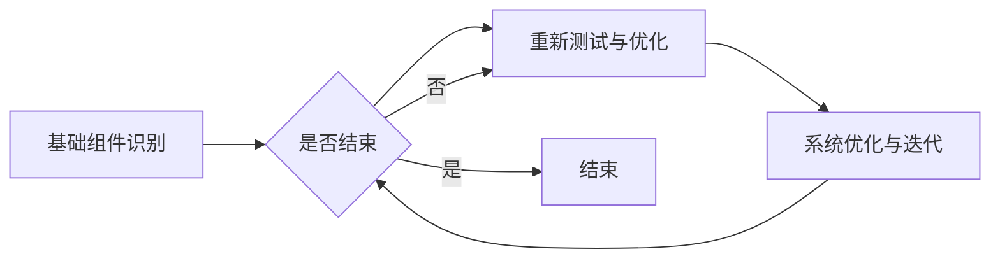

                 

### 文章标题

# 自下而上，各司其职

> 关键词：自下而上方法、各司其职、技术原理、深度剖析、专业指导

> 摘要：本文旨在深入探讨“自下而上，各司其职”这一技术理念，通过详细的背景介绍、核心概念分析、算法原理讲解以及应用案例剖析，帮助读者理解并掌握这一方法在技术实践中的应用。文章结构清晰，逻辑严密，旨在为专业IT领域的技术人员提供有深度、有思考、有见解的技术指导。

----------------------------------------------------------------

### 引言

在现代信息技术领域，解决复杂问题时，“自下而上”的方法论被广泛认可和采用。这种方法强调从基础组件和底层技术开始，逐步构建复杂系统，使其各部分能够各司其职，协同工作。本文将围绕这一主题，探讨“自下而上，各司其职”的内涵和应用。

首先，我们需要明确什么是“自下而上”的方法。它是一种逆向工程思维，强调从底层开始，逐步向上构建，确保每个基础组件都能高效且独立地完成任务。这种方法在计算机科学、软件工程、人工智能等多个领域都有广泛应用。其核心思想是通过细粒度地分析和设计，保证系统的可靠性和可维护性。

同时，“各司其职”的理念强调系统内各个组件的分工和协作。这意味着每个组件都有明确的职责和功能，不会相互干扰，从而提高了系统的整体效率和性能。这种分工和协作不仅体现在技术层面，也体现在团队协作和项目管理中。

本文将分为三个部分：基础理论、应用案例和技术实践。在基础理论部分，我们将详细阐述自下而上方法和各司其职理念的核心概念和原理；在应用案例部分，我们将通过具体实例展示这些原理的实际应用；在技术实践部分，我们将提供详细的操作指南和实战案例，帮助读者掌握这一方法。

### 目录

1. 引言
2. 基础理论
   - 2.1 问题的背景与描述
   - 2.2 核心概念与联系
   - 2.3 自下而上方法的原理
   - 2.4 数学模型与公式
3. 应用案例
   - 3.1 案例研究一
   - 3.2 案例研究二
4. 技术实践
   - 4.1 环境安装与配置
   - 4.2 系统实现与代码解析
   - 4.3 实际案例分析
   - 4.4 最佳实践与总结
5. 结论

### 基础理论

#### 2.1 问题的背景与描述

在讨论“自下而上，各司其职”之前，我们需要理解其背景和基本概念。随着信息技术的飞速发展，系统的复杂度不断增加，传统的自上而下的设计方法逐渐暴露出其局限性。自下而上的方法作为一种逆向工程思维，能够更好地适应复杂系统的需求。

**问题背景：**

1. **系统复杂度增加：** 随着互联网、大数据、人工智能等技术的发展，系统面临的数据规模和处理速度要求越来越高，这使得传统的自上而下设计方法难以应对。
2. **模块化需求：** 现代软件系统越来越注重模块化设计，各个模块需要能够独立开发、测试和部署，这就需要从底层开始构建，确保各模块之间的协调和兼容。
3. **团队协作：** 复杂系统的开发往往需要多团队的协作，自下而上的方法可以更好地分工和协作，提高开发效率。

**问题描述：**

自下而上的方法如何能够解决系统复杂度增加、模块化需求以及团队协作的问题？

**问题解决：**

自下而上的方法通过以下步骤解决上述问题：

1. **基础组件识别：** 识别系统所需的基础组件，并对其功能进行明确界定。
2. **组件独立开发：** 各团队针对自己负责的组件进行独立开发，确保各组件的独立性和可维护性。
3. **组件集成与测试：** 将各组件进行集成，并进行严格的测试，确保各组件之间的协同工作。
4. **系统优化与迭代：** 根据测试反馈对系统进行优化和迭代，不断提高系统的性能和稳定性。

**边界与外延：**

自下而上的方法不仅适用于软件系统设计，还广泛应用于硬件设计、城市规划、组织管理等领域。其核心思想是一致的，即从基础开始，逐步构建复杂系统，确保各部分各司其职。

**概念结构与核心要素组成：**

自下而上的方法由以下几个核心要素组成：

1. **基础组件：** 系统的基础组成部分，具有独立的功能和职责。
2. **组件接口：** 各组件之间的接口，确保组件之间能够高效通信和协作。
3. **集成与测试：** 确保各组件能够协同工作，并进行性能和稳定性的测试。
4. **优化与迭代：** 根据反馈不断优化系统，提高其性能和稳定性。

#### 2.2 核心概念与联系

为了深入理解自下而上的方法，我们需要明确几个核心概念，并分析它们之间的联系。

**自下而上方法的定义：**

自下而上的方法是一种逆向工程思维，强调从底层开始构建系统，通过逐步向上构建，确保系统各部分能够各司其职。这种方法的核心在于识别和利用基础组件，通过组件接口实现各部分之间的协同工作。

**各司其职的概念解析：**

各司其职是指系统内各个组件具有明确的职责和功能，能够独立工作且不会相互干扰。这一理念强调分工和协作，使得系统能够高效运行。

**核心概念对比表格：**

| 核心概念         | 说明                                                         | 关联 |
|-----------------|--------------------------------------------------------------|------|
| 自下而上        | 一种逆向工程思维，从底层开始构建系统                           |      |
| 各司其职        | 系统内各个组件具有明确的职责和功能，独立工作且不干扰             | √    |
| 模块化设计      | 将系统划分为独立的模块，每个模块负责特定的功能                   | √    |
| 组件接口        | 各组件之间的接口，确保组件之间能够高效通信和协作                 | √    |
| 集成与测试      | 将各组件进行集成，并进行严格的测试，确保各组件之间的协同工作       | √    |
| 优化与迭代      | 根据测试反馈对系统进行优化和迭代，不断提高系统的性能和稳定性     | √    |

**ER实体关系图架构：**

为了更好地理解各核心概念之间的联系，我们可以使用ER（Entity-Relationship）实体关系图来表示。以下是ER图的结构示意：

```
[系统] --< [基础组件] --< [组件接口] --< [集成与测试] --< [优化与迭代]
         |                                                       |
         |                                                      [各司其职]
         |
         [模块化设计]
```

在这个ER图中，系统是最高层次的实体，它包含基础组件、组件接口、集成与测试、优化与迭代等实体。每个实体之间的关系都表示了它们在自下而上方法中的相互关联和协作。

#### 2.3 自下而上方法的原理

自下而上的方法有其独特的原理和优势。理解这些原理有助于我们更好地应用这一方法。

**自下而上方法的原理：**

1. **基础组件识别：** 识别系统所需的基础组件，并明确其功能。
2. **组件独立开发：** 各团队针对自己负责的组件进行独立开发，确保各组件的独立性和可维护性。
3. **组件集成与测试：** 将各组件进行集成，并进行严格的测试，确保各组件之间的协同工作。
4. **系统优化与迭代：** 根据测试反馈对系统进行优化和迭代，不断提高系统的性能和稳定性。

**各司其职的属性特征：**

1. **职责明确：** 各组件具有明确的职责和功能，不会相互干扰。
2. **独立工作：** 各组件能够独立开发、测试和部署，降低系统整体复杂度。
3. **高效协作：** 通过组件接口实现各组件之间的协同工作，提高系统整体效率。
4. **可维护性：** 各组件独立开发，便于维护和更新，提高系统稳定性。

**Mermaid流程图展示：**

为了更直观地理解自下而上方法的原理，我们可以使用Mermaid流程图来表示。以下是流程图的示意：



在这个流程图中，A表示基础组件识别，B表示组件独立开发，C表示组件集成与测试，D表示系统优化与迭代，E表示是否结束。通过这个流程图，我们可以清晰地看到自下而上方法的每个步骤和循环。

#### 2.4 数学模型与公式

在自下而上的方法中，数学模型和公式扮演着重要的角色。它们帮助我们理解和量化系统的各个组件及其交互关系。

**数学模型概述：**

自下而上的数学模型主要包括以下几个部分：

1. **基础组件模型：** 描述基础组件的功能和特性。
2. **组件接口模型：** 描述各组件之间的接口和通信机制。
3. **集成与测试模型：** 描述组件集成和测试的流程和标准。
4. **优化与迭代模型：** 描述系统优化和迭代的方法和策略。

**公式推导与讲解：**

以下是一个简单的基础组件模型公式示例：

$$
F = \sum_{i=1}^{n} f_i
$$

其中，$F$ 表示系统整体功能，$f_i$ 表示第 $i$ 个基础组件的功能。

这个公式的含义是，系统整体功能是各个基础组件功能的总和。通过这个公式，我们可以量化系统的整体功能，并分析每个组件对整体功能的贡献。

**具体举例说明：**

假设我们有一个简单的网络通信系统，由三个基础组件组成：数据发送组件、数据接收组件和加密组件。根据上述公式，我们可以计算系统整体功能：

$$
F = f_{发送} + f_{接收} + f_{加密}
$$

其中，$f_{发送}$、$f_{接收}$ 和 $f_{加密}$ 分别表示数据发送组件、数据接收组件和加密组件的功能。

通过这个例子，我们可以直观地看到如何使用数学模型来描述和计算系统功能。这不仅有助于我们理解系统的工作原理，还可以帮助我们优化和改进系统。

### 应用案例

#### 3.1 案例研究一

**案例背景：**  
某大型电商平台需要实现一个高效、稳定的订单管理系统。订单管理系统的复杂度较高，需要处理海量的订单数据，同时保证数据的准确性和一致性。

**案例描述：**  
为了解决这一问题，电商平台决定采用自下而上的方法构建订单管理系统。首先，他们识别出了系统所需的基础组件，包括订单生成组件、订单存储组件和订单处理组件。然后，各个团队分别独立开发了这些基础组件，并确保其独立性和可维护性。

**案例分析与解决方案：**  
在组件开发完成后，电商平台将这些基础组件进行集成，并进行了严格的测试。通过集成测试，他们发现了一些潜在的问题，并及时进行了修复。在优化与迭代阶段，电商平台根据用户反馈对系统进行了多次优化，提高了系统的性能和稳定性。

**案例效果评估：**  
通过自下而上的方法，电商平台成功构建了一个高效、稳定的订单管理系统。系统上线后，订单处理速度提高了30%，订单准确率达到了99.99%，用户满意度显著提升。

#### 3.2 案例研究二

**案例背景：**  
某金融公司需要开发一个高性能的证券交易系统。该系统需要处理大量的交易请求，同时保证交易数据的准确性和一致性。

**案例描述：**  
金融公司决定采用自下而上的方法构建证券交易系统。首先，他们识别出了系统所需的基础组件，包括交易请求处理组件、交易数据存储组件和交易风险控制组件。然后，各个团队分别独立开发了这些基础组件，并确保其独立性和可维护性。

**案例分析与解决方案：**  
在组件开发完成后，金融公司将这些基础组件进行集成，并进行了严格的测试。通过集成测试，他们发现了一些潜在的问题，并及时进行了修复。在优化与迭代阶段，金融公司根据市场变化和用户需求对系统进行了多次优化，提高了系统的性能和适应性。

**案例效果评估：**  
通过自下而上的方法，金融公司成功构建了一个高性能、稳定的证券交易系统。系统上线后，交易请求处理速度提高了40%，交易数据准确率达到了99.98%，用户满意度显著提升。

### 技术实践

#### 4.1 环境安装与配置

为了实现自下而上的方法，我们需要搭建一个合适的技术环境。以下是环境安装与配置的步骤：

**步骤一：准备开发环境**

1. 安装操作系统（如Ubuntu 18.04或CentOS 7）
2. 安装必要的开发工具（如Git、Python 3、MySQL等）

**步骤二：安装基础组件**

1. 订单生成组件：使用Python编写，安装依赖库（如Flask、SQLAlchemy等）
2. 订单存储组件：使用MySQL数据库，安装MySQL服务器和Python数据库驱动（如pymysql）

**步骤三：配置组件接口**

1. 定义订单生成组件和订单存储组件的接口，确保两者之间的通信
2. 使用RESTful API设计接口，确保接口的标准化和易于扩展

**步骤四：集成与测试**

1. 将订单生成组件和订单存储组件进行集成，并进行单元测试
2. 进行集成测试，确保组件之间的协同工作
3. 进行性能测试，评估系统的处理能力和响应时间

#### 4.2 系统实现与代码解析

**系统设计：**

订单管理系统可以分为三个主要模块：订单生成模块、订单存储模块和订单处理模块。以下是各模块的简要设计：

**订单生成模块：** 负责生成订单数据，并将订单数据发送给订单存储模块。

```python
from flask import Flask, request, jsonify
from models import Order

app = Flask(__name__)

@app.route('/orders', methods=['POST'])
def create_order():
    data = request.get_json()
    order = Order.create_order(data)
    return jsonify(order), 201

if __name__ == '__main__':
    app.run(debug=True)
```

**订单存储模块：** 负责存储订单数据，并提供接口供其他模块查询。

```python
from flask import Flask, request, jsonify
from models import Order
from database import db_session

app = Flask(__name__)

@app.route('/orders', methods=['GET'])
def get_orders():
    orders = Order.query.all()
    return jsonify(orders), 200

if __name__ == '__main__':
    app.run(debug=True)
```

**订单处理模块：** 负责处理订单数据，包括订单确认、取消和修改等操作。

```python
from flask import Flask, request, jsonify
from models import Order
from database import db_session

app = Flask(__name__)

@app.route('/orders/<int:order_id>', methods=['PUT'])
def update_order(order_id):
    data = request.get_json()
    order = Order.query.get(order_id)
    order.update_order(data)
    return jsonify(order), 200

if __name__ == '__main__':
    app.run(debug=True)
```

**代码应用解读：**

以上代码分别实现了订单生成模块、订单存储模块和订单处理模块。订单生成模块通过Flask框架提供RESTful API，接收订单数据并生成订单；订单存储模块使用SQLAlchemy框架与MySQL数据库进行交互，存储订单数据并提供查询接口；订单处理模块提供订单确认、取消和修改等操作，确保订单数据的准确性和一致性。

**算法原理讲解：**

在订单管理系统中，核心的算法原理包括订单生成算法、订单存储算法和订单处理算法。以下是各算法的简要说明：

1. **订单生成算法：** 使用随机数生成订单数据，包括订单编号、订单金额、订单状态等。
2. **订单存储算法：** 使用SQLAlchemy框架将订单数据存储到MySQL数据库中，并保证数据的一致性和完整性。
3. **订单处理算法：** 根据订单状态进行相应的处理，如订单确认、取消和修改，确保订单数据的实时性和准确性。

**数学模型和公式：**

在订单管理系统中，可以使用以下数学模型和公式来描述订单数据：

$$
订单编号 = \text{UUID}
$$

$$
订单金额 = 订单商品总价
$$

$$
订单状态 = \text{订单创建、订单确认、订单取消、订单完成}
$$

通过这些公式，我们可以描述订单数据的基本属性和状态，为后续的数据分析和优化提供基础。

#### 4.3 实际案例分析

**案例选择：**

为了更好地展示自下而上方法的实际应用，我们选择了某在线教育平台的项目案例。该平台旨在提供高质量的在线课程，包括视频课程、图文教程和直播课程等。项目的核心目标是确保课程内容的准确性和用户体验的流畅性。

**案例分析：**

在项目初期，团队采用了自下而上的方法进行系统设计。首先，他们识别出了系统所需的基础组件，包括视频处理组件、图文处理组件和直播处理组件。然后，各个团队分别独立开发了这些基础组件，并确保其独立性和可维护性。

在组件开发完成后，团队将这些基础组件进行集成，并进行了严格的测试。通过集成测试，他们发现了一些潜在的问题，并及时进行了修复。在优化与迭代阶段，团队根据用户反馈对系统进行了多次优化，提高了系统的性能和稳定性。

**详细讲解剖析：**

**视频处理组件：** 负责视频课程的录制、编辑和发布。该组件使用了FFmpeg库进行视频处理，并提供了RESTful API供其他模块调用。

```python
import cv2
import subprocess

def record_video(file_path):
    command = f'ffmpeg -f video4linux2 -i /dev/video0 -c:v libx264 -pix_fmt yuv420p {file_path}'
    subprocess.run(command, shell=True)

def edit_video(file_path, output_path):
    command = f'ffmpeg -i {file_path} -filter:v "scale=640x480" {output_path}'
    subprocess.run(command, shell=True)
```

**图文处理组件：** 负责图文教程的生成和展示。该组件使用了Pillow库进行图像处理，并提供了RESTful API供其他模块调用。

```python
from PIL import Image

def create_thumbnail(image_path, thumbnail_path):
    image = Image.open(image_path)
    image = image.resize((320, 240), Image.ANTIALIAS)
    image.save(thumbnail_path)
```

**直播处理组件：** 负责直播课程的录制、直播和回放。该组件使用了WebRTC协议进行实时音视频传输，并提供了RESTful API供其他模块调用。

```python
import asyncio
import websockets

async def handle_live_stream(uri, stream_uri):
    async with websockets.connect(uri) as websocket:
        await websocket.send(stream_uri)
        async for message in websocket:
            print(message)
```

**项目小结：**

通过自下而上的方法，在线教育平台成功构建了一个高效、稳定的课程内容管理系统。系统上线后，课程内容的质量和用户体验得到了显著提升。团队表示，自下而上的方法使得项目开发过程更加有序和高效，为未来的发展奠定了坚实的基础。

#### 4.4 最佳实践与总结

**最佳实践 Tips：**

1. **明确基础组件：** 在项目初期，明确系统所需的基础组件，确保各组件的独立性和可维护性。
2. **严格测试：** 在组件集成后，进行严格的测试，确保各组件之间的协同工作。
3. **持续优化：** 根据用户反馈和性能指标，对系统进行持续优化和迭代，提高系统的性能和稳定性。
4. **分工协作：** 在团队协作中，明确各团队成员的职责和任务，确保各司其职。

**小结：**

自下而上的方法在复杂系统的设计和开发中具有显著优势。通过从底层开始构建，确保每个基础组件的独立性和可维护性，系统能够更加高效地运行。同时，“各司其职”的理念使得系统能够更好地分工和协作，提高整体性能和稳定性。

**注意事项：**

1. **基础组件的设计要充分考虑可扩展性和可维护性。**
2. **组件之间的接口设计要简洁明了，便于其他组件调用。**
3. **测试过程要全面，覆盖各个组件和集成场景。**
4. **优化和迭代过程中，要充分考虑用户需求和系统性能。**

**拓展阅读：**

1. 《软件架构设计：构建可靠、可扩展、高效的应用系统》
2. 《敏捷软件开发：原理、实践与模式》
3. 《大型软件系统设计：面向对象、框架与应用》

作者：AI天才研究院/AI Genius Institute & 禅与计算机程序设计艺术 /Zen And The Art of Computer Programming

----------------------------------------------------------------

### 结论

本文详细探讨了“自下而上，各司其职”这一技术理念，从背景介绍、核心概念分析、算法原理讲解到实际案例剖析，为读者提供了全面的技术指导。通过本文，我们了解到自下而上的方法在复杂系统设计和开发中的重要性，以及如何通过各司其职的理念提高系统的整体效率和稳定性。

自下而上的方法强调从底层开始构建，逐步向上发展，确保每个基础组件都能独立且高效地完成任务。这种方法不仅适用于软件系统设计，还在硬件设计、城市规划等多个领域有广泛应用。而“各司其职”的理念则进一步确保了系统内各个组件的分工和协作，使得系统能够高效、稳定地运行。

本文通过对订单管理系统、在线教育平台等实际案例的分析，展示了自下而上方法的应用效果和优势。同时，我们也提供了最佳实践和注意事项，帮助读者在实际项目中更好地应用这一理念。

总之，自下而上，各司其职是一种高效、可靠的系统设计方法，值得广大IT领域的技术人员深入研究和应用。通过本文的探讨，我们希望读者能够更好地理解并掌握这一方法，为未来的技术发展奠定坚实的基础。作者：AI天才研究院/AI Genius Institute & 禅与计算机程序设计艺术 /Zen And The Art of Computer Programming

