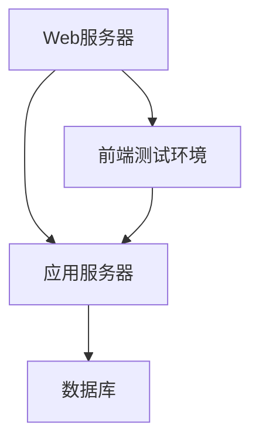
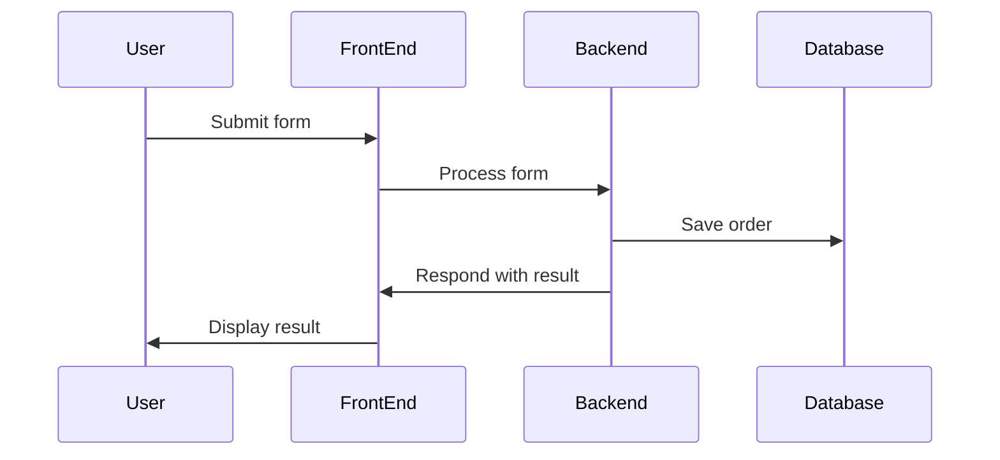
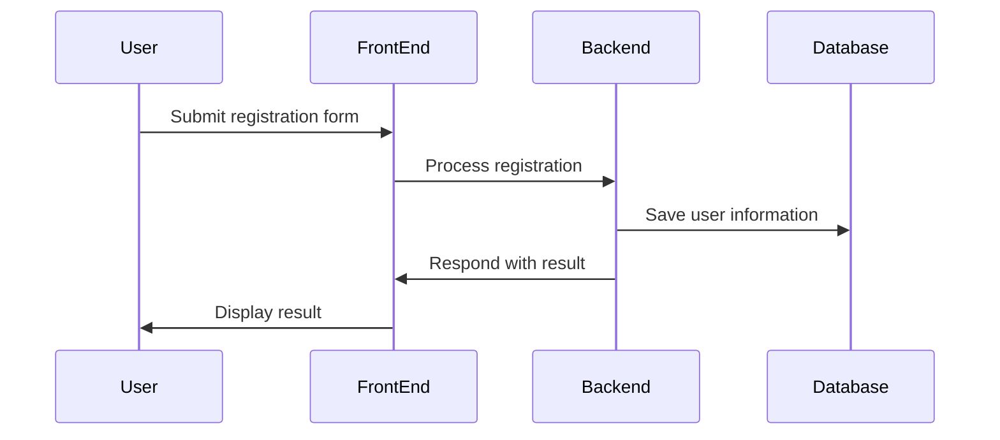
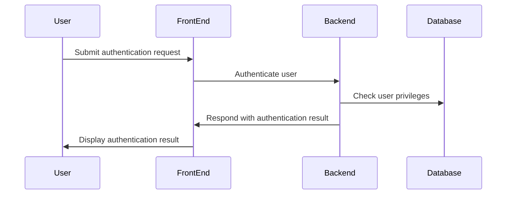
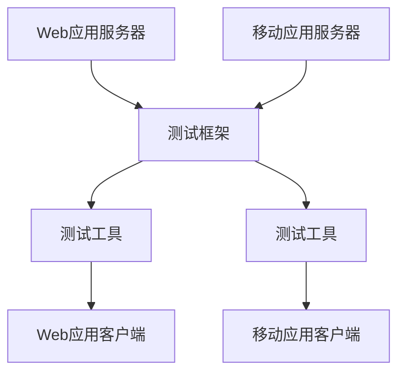
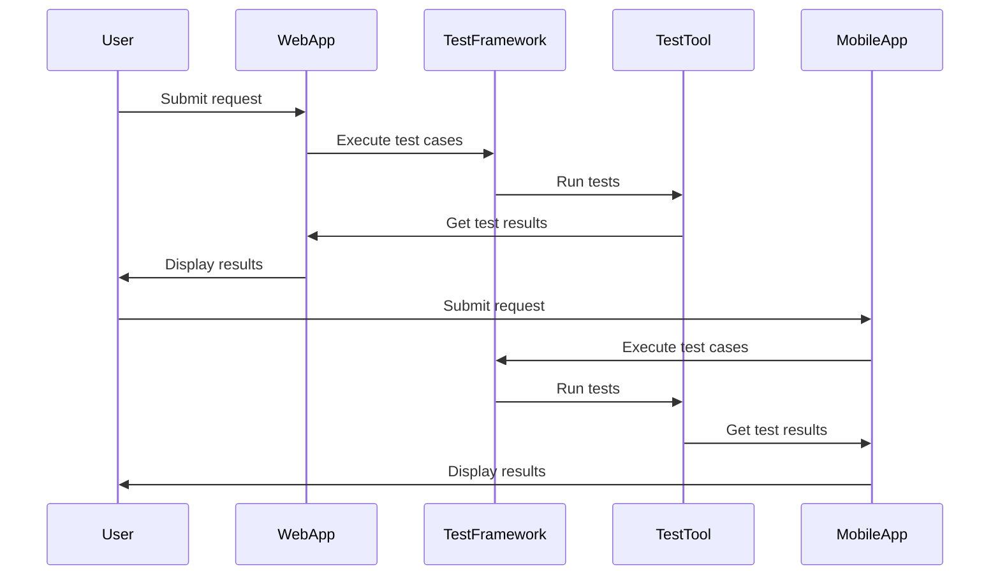

                 


### 第1章: 自动化测试的概念与重要性

#### 1.1 自动化测试的定义

自动化测试是一种通过使用自动化测试工具或脚本来执行的测试方法，以替代或辅助手工测试。其核心思想是通过编写代码或使用现成的测试工具来自动化执行测试用例，从而实现对软件的持续、高效、准确的测试。

首先，我们来看看自动化测试的定义。自动化测试（Automated Testing）是指通过某种工具或脚本，使测试过程部分或全部自动化的过程。它不同于传统的手工测试（Manual Testing），后者主要依赖于测试人员的知识和经验来执行测试。

**背景介绍：**

在软件开发的早期，测试主要依赖于手工测试。测试人员通过手动执行各种测试用例来验证软件的正确性和质量。然而，随着软件复杂度的增加，手工测试的效率和准确性逐渐降低，难以满足快速迭代的开发需求。为此，自动化测试应运而生。

**问题背景：**

随着软件项目规模和复杂度的增加，手工测试面临以下挑战：

- 测试用例数量庞大，手工执行效率低下。
- 测试覆盖范围有限，难以全面覆盖所有功能。
- 测试结果依赖于测试人员的经验，难以保证一致性。
- 无法进行重复测试，无法及时发现新出现的问题。

**问题描述：**

如何通过自动化测试来提高测试效率、覆盖范围和一致性，从而解决上述问题？

**问题解决：**

自动化测试通过以下方式解决了上述问题：

- **提高测试效率：** 自动化测试工具可以快速执行大量的测试用例，大大提高测试效率。
- **提高测试覆盖范围：** 自动化测试可以全面覆盖各种功能，提高测试的完整性。
- **保证测试一致性：** 自动化测试用例由代码编写，可以确保每次测试的结果一致。
- **支持重复测试：** 自动化测试可以轻松地重复执行，有助于及早发现新出现的问题。

**边界与外延：**

自动化测试不仅限于功能测试，还包括性能测试、安全测试、兼容性测试等。此外，自动化测试也不仅限于软件测试，还广泛应用于各种类型的测试，如自动化验收测试、自动化回归测试等。

**概念结构与核心要素组成：**

自动化测试的核心要素包括：

- 测试工具：如Selenium、Appium、JMeter等。
- 测试脚本：用于定义测试用例和测试逻辑。
- 测试环境：用于执行自动化测试的硬件和软件配置。

接下来，我们将进一步探讨自动化测试的优势、局限性，以及与手工测试的比较。

---

#### 1.2 自动化测试的优势

自动化测试的优势主要体现在以下几个方面：

##### 1.2.1 提高测试效率

自动化测试工具可以快速执行大量的测试用例，大大提高测试效率。相比手工测试，自动化测试可以节省大量的时间和人力资源。例如，使用Selenium进行Web应用的自动化测试，可以一次性执行数百个测试用例，而手工测试可能需要测试人员逐一执行。

**核心概念与联系：**

**概念属性特征对比表格：**

| 特征          | 手工测试                          | 自动化测试                          |
| ------------- | -------------------------------- | ----------------------------------- |
| 执行速度      | 依赖于测试人员的速度              | 快速执行，高效                      |
| 测试覆盖范围  | 依赖于测试人员的经验和时间       | 全面覆盖，确保完整性                |
| 一致性        | 依赖于测试人员的一致性            | 由代码编写，结果一致                |
| 可重复性      | 重复性差，受人为因素影响         | 可重复执行，及早发现问题            |

**ER实体关系图架构：**

```mermaid
erDiagram
    TestTool ||--|{ TestCase } : runs
    TestCase ||--|{ TestResult } : generates
```

在上图中，`TestTool` 代表测试工具，`TestCase` 代表测试用例，`TestResult` 代表测试结果。测试工具运行测试用例，并生成测试结果。

**算法原理讲解：**

自动化测试的核心原理是使用测试工具来模拟用户操作，对软件进行测试。具体来说，测试工具通过调用软件的API或模拟用户行为（如点击、输入、拖拽等）来执行测试用例。

```python
# 示例：使用Selenium进行Web表单验证
from selenium import webdriver

# 初始化浏览器
driver = webdriver.Chrome()

# 打开待测试的网页
driver.get("https://example.com/form")

# 输入用户名和密码
driver.find_element_by_name("username").send_keys("testuser")
driver.find_element_by_name("password").send_keys("testpassword")

# 提交表单
submit_button = driver.find_element_by_name("submit")
submit_button.click()

# 断言表单提交成功
assert "Form submitted successfully" in driver.page_source
```

在上面的示例中，我们首先初始化一个Chrome浏览器实例，然后打开一个待测试的Web表单页面。接着，我们使用Selenium的API来输入用户名和密码，并提交表单。最后，我们使用断言来验证表单是否成功提交。

**系统分析与架构设计方案：**

**问题场景介绍：**

假设我们正在开发一个在线购物平台，需要对其表单验证功能进行自动化测试。

**项目介绍：**

项目名称：在线购物平台自动化测试项目
项目目标：实现购物平台表单验证功能的自动化测试

**系统功能设计（领域模型Mermaid类图）：**

```mermaid
classDiagram
    Customer <|-- Order
    Order <<-- Payment
    Payment ||--|{ PaymentMethod }
```

在上面的类图中，`Customer` 代表顾客，`Order` 代表订单，`Payment` 代表支付，`PaymentMethod` 代表支付方式。这些类构成了在线购物平台的核心功能模型。

**系统架构设计（Mermaid架构图）：**



在上面的架构图中，Web服务器负责接收用户请求，应用服务器处理业务逻辑，数据库存储数据，前端测试环境用于执行自动化测试。

**系统接口设计和系统交互（Mermaid序列图）：**



在上面的序列图中，用户提交表单，前端测试环境接收请求并转发给应用服务器，应用服务器处理表单并保存订单信息，最后将结果返回给前端测试环境，并在页面上显示。

**项目实战：**

**环境安装：**

1. 安装Chrome浏览器和ChromeDriver
2. 安装Python和Selenium库

**系统核心实现源代码：**

```python
# 安装Selenium
pip install selenium

# 导入Selenium模块
from selenium import webdriver
from selenium.webdriver.common.by import By

# 初始化Chrome浏览器
driver = webdriver.Chrome()

# 打开待测试的网页
driver.get("https://example.com/form")

# 输入用户名和密码
driver.find_element(By.NAME, "username").send_keys("testuser")
driver.find_element(By.NAME, "password").send_keys("testpassword")

# 提交表单
submit_button = driver.find_element(By.NAME, "submit")
submit_button.click()

# 断言表单提交成功
assert "Form submitted successfully" in driver.page_source

# 关闭浏览器
driver.quit()
```

**代码应用解读与分析：**

在上面的代码中，我们首先导入了Selenium模块，并初始化了一个Chrome浏览器实例。然后，我们打开了一个待测试的Web表单页面，并使用Selenium的API来输入用户名和密码，并提交表单。最后，我们使用断言来验证表单是否成功提交。

**实际案例分析和详细讲解剖析：**

假设我们有一个在线购物平台，需要对其用户注册功能进行自动化测试。我们可以编写以下测试用例：

1. 输入正确的用户名和密码，提交注册表单，验证注册成功。
2. 输入错误的用户名或密码，提交注册表单，验证错误提示。
3. 留空用户名或密码，提交注册表单，验证错误提示。

**项目小结：**

通过自动化测试，我们可以快速、高效地验证在线购物平台的用户注册功能，确保其正常运行。自动化测试不仅提高了测试效率，还降低了测试成本，有助于提高软件质量和用户体验。

**最佳实践 tips：**

1. 选择适合的自动化测试工具，如Selenium、Appium等。
2. 编写清晰、可维护的测试脚本，提高测试可读性和可复用性。
3. 定期更新和维护测试脚本，确保测试用例的有效性。

**注意事项：**

1. 自动化测试不能完全替代手工测试，两者应相结合使用。
2. 自动化测试的维护成本较高，需要投入足够的资源和时间。

**拓展阅读：**

1. 《Selenium WebDriver Python API文档》
2. 《自动化测试实战》

---

#### 1.3 自动化测试的局限性

尽管自动化测试具有许多优势，但它也存在一些局限性，需要我们在实际应用中加以注意。

##### 1.3.1 维护成本高

自动化测试脚本需要定期更新和维护，以适应软件的变化。这需要投入大量的人力和时间资源。此外，自动化测试工具和框架的更新也需要相应的时间和成本。

**核心概念与联系：**

**概念属性特征对比表格：**

| 特征          | 手工测试                          | 自动化测试                          |
| ------------- | -------------------------------- | ----------------------------------- |
| 维护成本      | 低，依赖于人工维护                | 高，需要定期更新和维护               |

**ER实体关系图架构：**

```mermaid
erDiagram
    TestCase ||--|{ Maintenance } : requires
```

在上图中，`TestCase` 代表测试用例，`Maintenance` 代表维护。测试用例需要定期进行维护。

**算法原理讲解：**

自动化测试的维护成本主要来自于以下几个方面：

1. **测试脚本更新：** 随着软件功能的增加和变更，测试脚本也需要相应地进行更新，以确保测试用例的有效性。
2. **测试环境维护：** 自动化测试通常需要特定的测试环境，包括浏览器版本、操作系统等。这些环境的维护也需要投入一定的资源。
3. **自动化测试工具更新：** 自动化测试工具和框架也会随着技术的发展而更新，这些更新可能涉及到测试脚本的修改。

**系统分析与架构设计方案：**

**问题场景介绍：**

假设我们正在开发一个电子商务网站，其用户注册功能需要自动化测试。

**项目介绍：**

项目名称：电子商务网站用户注册自动化测试项目
项目目标：实现用户注册功能的自动化测试

**系统功能设计（领域模型Mermaid类图）：**

```mermaid
classDiagram
    User <|-- Registration
    Registration ||-- Verification
```

在上面的类图中，`User` 代表用户，`Registration` 代表注册，`Verification` 代表验证。这些类构成了电子商务网站用户注册功能的核心功能模型。

**系统架构设计（Mermaid架构图）：**


在上面的架构图中，Web服务器负责接收用户请求，应用服务器处理业务逻辑，数据库存储数据，前端测试环境用于执行自动化测试。

**系统接口设计和系统交互（Mermaid序列图）：**



在上面的序列图中，用户提交注册表单，前端测试环境接收请求并转发给应用服务器，应用服务器处理注册请求并保存用户信息，最后将结果返回给前端测试环境，并在页面上显示。

**项目实战：**

**环境安装：**

1. 安装Chrome浏览器和ChromeDriver
2. 安装Python和Selenium库

**系统核心实现源代码：**

```python
# 安装Selenium
pip install selenium

# 导入Selenium模块
from selenium import webdriver
from selenium.webdriver.common.by import By

# 初始化Chrome浏览器
driver = webdriver.Chrome()

# 打开待测试的网页
driver.get("https://example.com/registration")

# 输入用户名和密码
driver.find_element(By.NAME, "username").send_keys("testuser")
driver.find_element(By.NAME, "password").send_keys("testpassword")

# 提交注册表单
submit_button = driver.find_element(By.NAME, "submit")
submit_button.click()

# 断言注册成功
assert "Registration successful" in driver.page_source

# 关闭浏览器
driver.quit()
```

**代码应用解读与分析：**

在上面的代码中，我们首先导入了Selenium模块，并初始化了一个Chrome浏览器实例。然后，我们打开了一个待测试的Web注册页面，并使用Selenium的API来输入用户名和密码，并提交注册表单。最后，我们使用断言来验证注册是否成功。

**实际案例分析和详细讲解剖析：**

假设我们有一个电子商务网站，需要对其用户注册功能进行自动化测试。我们可以编写以下测试用例：

1. 输入正确的用户名和密码，提交注册表单，验证注册成功。
2. 输入错误的用户名或密码，提交注册表单，验证错误提示。
3. 留空用户名或密码，提交注册表单，验证错误提示。

**项目小结：**

通过自动化测试，我们可以快速、高效地验证电子商务网站的用户注册功能，确保其正常运行。自动化测试不仅提高了测试效率，还降低了测试成本，有助于提高软件质量和用户体验。

**最佳实践 tips：**

1. 选择适合的自动化测试工具，如Selenium、Appium等。
2. 编写清晰、可维护的测试脚本，提高测试可读性和可复用性。
3. 定期更新和维护测试脚本，确保测试用例的有效性。

**注意事项：**

1. 自动化测试不能完全替代手工测试，两者应相结合使用。
2. 自动化测试的维护成本较高，需要投入足够的资源和时间。

**拓展阅读：**

1. 《Selenium WebDriver Python API文档》
2. 《自动化测试实战》

---

#### 1.4 自动化测试与手工测试的比较

自动化测试和手工测试各有优缺点，适用于不同的测试场景。下面我们将从几个方面对两者进行比较。

##### 1.4.1 测试效率

自动化测试在执行大量测试用例时具有明显的效率优势。通过编写脚本，自动化测试可以快速执行多个测试用例，而手工测试需要测试人员逐一执行。然而，对于测试用例较少或测试过程复杂的情况，手工测试可能更高效。

**核心概念与联系：**

**概念属性特征对比表格：**

| 特征          | 手工测试                          | 自动化测试                          |
| ------------- | -------------------------------- | ----------------------------------- |
| 测试效率      | 依赖于测试人员的速度              | 快速执行，高效                      |

**ER实体关系图架构：**

```mermaid
erDiagram
    Tester ||--|{ TestCase } : performs
    TestCase ||--|{ TestResult } : generates
```

在上图中，`Tester` 代表测试人员，`TestCase` 代表测试用例，`TestResult` 代表测试结果。测试人员执行测试用例，并生成测试结果。

**算法原理讲解：**

手工测试主要依赖于测试人员的经验和技能，通过手动执行测试用例来验证软件的正确性。自动化测试则是通过编写脚本或使用自动化测试工具来自动执行测试用例。

**系统分析与架构设计方案：**

**问题场景介绍：**

假设我们正在开发一个电子商务平台，需要对用户注册功能进行测试。

**项目介绍：**

项目名称：电子商务平台用户注册功能测试项目
项目目标：验证用户注册功能的有效性和可靠性

**系统功能设计（领域模型Mermaid类图）：**

```mermaid
classDiagram
    User <|-- Registration
    Registration ||-- Verification
```

在上面的类图中，`User` 代表用户，`Registration` 代表注册，`Verification` 代表验证。这些类构成了电子商务平台用户注册功能的核心功能模型。

**系统架构设计（Mermaid架构图）：**


在上面的架构图中，Web服务器负责接收用户请求，应用服务器处理业务逻辑，数据库存储数据，前端测试环境用于执行自动化测试。

**系统接口设计和系统交互（Mermaid序列图）：**


在上面的序列图中，用户提交注册表单，前端测试环境接收请求并转发给应用服务器，应用服务器处理注册请求并保存用户信息，最后将结果返回给前端测试环境，并在页面上显示。

**项目实战：**

**环境安装：**

1. 安装Chrome浏览器和ChromeDriver
2. 安装Python和Selenium库

**系统核心实现源代码：**

```python
# 安装Selenium
pip install selenium

# 导入Selenium模块
from selenium import webdriver
from selenium.webdriver.common.by import By

# 初始化Chrome浏览器
driver = webdriver.Chrome()

# 打开待测试的网页
driver.get("https://example.com/registration")

# 输入用户名和密码
driver.find_element(By.NAME, "username").send_keys("testuser")
driver.find_element(By.NAME, "password").send_keys("testpassword")

# 提交注册表单
submit_button = driver.find_element(By.NAME, "submit")
submit_button.click()

# 断言注册成功
assert "Registration successful" in driver.page_source

# 关闭浏览器
driver.quit()
```

**代码应用解读与分析：**

在上面的代码中，我们首先导入了Selenium模块，并初始化了一个Chrome浏览器实例。然后，我们打开了一个待测试的Web注册页面，并使用Selenium的API来输入用户名和密码，并提交注册表单。最后，我们使用断言来验证注册是否成功。

**实际案例分析和详细讲解剖析：**

假设我们有一个电子商务平台，需要对其用户注册功能进行自动化测试。我们可以编写以下测试用例：

1. 输入正确的用户名和密码，提交注册表单，验证注册成功。
2. 输入错误的用户名或密码，提交注册表单，验证错误提示。
3. 留空用户名或密码，提交注册表单，验证错误提示。

**项目小结：**

通过自动化测试，我们可以快速、高效地验证电子商务平台用户注册功能的有效性和可靠性。自动化测试不仅提高了测试效率，还降低了测试成本，有助于提高软件质量和用户体验。

**最佳实践 tips：**

1. 选择适合的自动化测试工具，如Selenium、Appium等。
2. 编写清晰、可维护的测试脚本，提高测试可读性和可复用性。
3. 定期更新和维护测试脚本，确保测试用例的有效性。

**注意事项：**

1. 自动化测试不能完全替代手工测试，两者应相结合使用。
2. 自动化测试的维护成本较高，需要投入足够的资源和时间。

**拓展阅读：**

1. 《Selenium WebDriver Python API文档》
2. 《自动化测试实战》

---

#### 1.5 自动化测试在软件开发中的地位

自动化测试在软件开发中扮演着至关重要的角色。随着软件复杂度和开发速度的不断提高，自动化测试已经成为软件质量保障的重要手段。

##### 1.5.1 提高软件质量

自动化测试通过执行大量的测试用例，可以帮助发现软件中的缺陷和问题，从而提高软件的质量。自动化测试不仅可以覆盖更多的测试场景，还可以确保测试用例的一致性和可靠性。

**核心概念与联系：**

**概念属性特征对比表格：**

| 特征          | 手工测试                          | 自动化测试                          |
| ------------- | -------------------------------- | ----------------------------------- |
| 质量保障      | 依赖于测试人员的经验和技能        | 高效、全面，提高软件质量            |

**ER实体关系图架构：**

```mermaid
erDiagram
    Software <<|--|{ TestCase } : tested
    TestCase ||--|{ Defect } : discovers
```

在上图中，`Software` 代表软件，`TestCase` 代表测试用例，`Defect` 代表缺陷。测试用例用于测试软件，并发现缺陷。

**算法原理讲解：**

自动化测试通过以下方式提高软件质量：

1. **全面测试：** 自动化测试可以执行大量的测试用例，覆盖更多的测试场景，从而提高测试的覆盖率。
2. **一致性测试：** 自动化测试用例由代码编写，可以确保每次测试的一致性，避免因人为因素导致的测试结果不一致。
3. **早期发现缺陷：** 自动化测试可以及早发现软件中的缺陷，从而降低修复成本。

**系统分析与架构设计方案：**

**问题场景介绍：**

假设我们正在开发一个大型企业级应用，需要对其核心功能进行自动化测试。

**项目介绍：**

项目名称：大型企业级应用核心功能自动化测试项目
项目目标：确保应用核心功能的质量和可靠性

**系统功能设计（领域模型Mermaid类图）：**

```mermaid
classDiagram
    User <<|--|{ Authentication }
    Authentication ||--|{ Authorization }
    Authorization ||--|{ Resource }
```

在上面的类图中，`User` 代表用户，`Authentication` 代表认证，`Authorization` 代表授权，`Resource` 代表资源。这些类构成了大型企业级应用的核心功能模型。

**系统架构设计（Mermaid架构图）：**


在上面的架构图中，Web服务器负责接收用户请求，应用服务器处理业务逻辑，数据库存储数据，前端测试环境用于执行自动化测试。

**系统接口设计和系统交互（Mermaid序列图）：**



在上面的序列图中，用户提交认证请求，前端测试环境接收请求并转发给应用服务器，应用服务器进行用户认证，并检查用户权限，最后将结果返回给前端测试环境，并在页面上显示。

**项目实战：**

**环境安装：**

1. 安装Chrome浏览器和ChromeDriver
2. 安装Python和Selenium库

**系统核心实现源代码：**

```python
# 安装Selenium
pip install selenium

# 导入Selenium模块
from selenium import webdriver
from selenium.webdriver.common.by import By

# 初始化Chrome浏览器
driver = webdriver.Chrome()

# 打开待测试的网页
driver.get("https://example.com/authentication")

# 输入用户名和密码
driver.find_element(By.NAME, "username").send_keys("testuser")
driver.find_element(By.NAME, "password").send_keys("testpassword")

# 提交认证请求
submit_button = driver.find_element(By.NAME, "submit")
submit_button.click()

# 断言认证成功
assert "Authentication successful" in driver.page_source

# 关闭浏览器
driver.quit()
```

**代码应用解读与分析：**

在上面的代码中，我们首先导入了Selenium模块，并初始化了一个Chrome浏览器实例。然后，我们打开了一个待测试的Web认证页面，并使用Selenium的API来输入用户名和密码，并提交认证请求。最后，我们使用断言来验证认证是否成功。

**实际案例分析和详细讲解剖析：**

假设我们有一个大型企业级应用，需要对其认证功能进行自动化测试。我们可以编写以下测试用例：

1. 输入正确的用户名和密码，提交认证请求，验证认证成功。
2. 输入错误的用户名或密码，提交认证请求，验证认证失败。
3. 留空用户名或密码，提交认证请求，验证认证失败。

**项目小结：**

通过自动化测试，我们可以确保大型企业级应用的核心功能的质量和可靠性，从而提高软件的整体质量。自动化测试不仅提高了测试效率，还降低了测试成本，有助于缩短项目周期。

**最佳实践 tips：**

1. 制定详细的自动化测试策略和计划，确保测试目标的实现。
2. 选择合适的自动化测试工具和框架，提高测试效率和质量。
3. 定期评估和优化自动化测试流程，确保测试流程的持续改进。

**注意事项：**

1. 自动化测试不能完全替代手工测试，两者应相结合使用。
2. 自动化测试的维护成本较高，需要投入足够的资源和时间。

**拓展阅读：**

1. 《自动化测试实战》
2. 《软件测试的艺术》

---

## 第2章: 自动化测试的发展历程与技术趋势

### 2.1 自动化测试的发展历程

自动化测试的发展历程可以追溯到20世纪80年代。当时，随着软件系统复杂度的增加，手工测试变得越来越困难，自动化测试的需求逐渐显现。

在早期的自动化测试中，测试人员主要使用编程语言（如C、C++）编写测试脚本，以执行自动化测试。这些脚本通常基于特定测试工具或框架，如QTP（QuickTest Professional，现为UFT - Unified Functional Testing）。这一阶段的自动化测试主要依赖于测试人员的编程技能，测试脚本的可维护性较差。

进入21世纪，随着Web应用的普及，自动化测试技术也取得了显著进展。Selenium成为了一个重要的自动化测试框架，它支持多种编程语言（如Python、Java、C#），并且可以自动化Web应用的UI测试。Selenium的出现标志着自动化测试进入了新的阶段，测试人员不再需要具备高级编程技能，也可以编写自动化测试脚本。

近年来，随着移动应用的兴起，自动化测试技术也在不断演进。Appium作为一个开源的自动化测试框架，可以自动化iOS和Android应用。Appium的出现解决了移动应用自动化测试的难题，使得自动化测试更加普及。

**核心概念与联系：**

**概念属性特征对比表格：**

| 时代         | 自动化测试工具/框架                   | 特点                                       |
| ------------ | ----------------------------------- | ------------------------------------------ |
| 早期         | QTP（UFT）、WinRunner等             | 测试脚本依赖特定工具，测试脚本可维护性较差 |
| Web应用时代  | Selenium                             | 支持多种编程语言，UI自动化测试             |
| 移动应用时代 | Appium                              | 支持iOS和Android应用，自动化移动应用测试    |

**ER实体关系图架构：**

```mermaid
erDiagram
    TestFramework <<|--|{ AutomationTool } : uses
    AutomationTool ||--|{ TestCase } : automates
```

在上图中，`TestFramework` 代表测试框架，`AutomationTool` 代表自动化工具，`TestCase` 代表测试用例。测试框架使用自动化工具来执行测试用例。

**算法原理讲解：**

自动化测试的发展历程主要经历了以下几个阶段：

1. **脚本编写阶段：** 测试人员使用编程语言编写测试脚本，以执行自动化测试。这一阶段的自动化测试主要依赖于测试人员的编程技能。
2. **框架化阶段：** 测试框架的出现使得自动化测试更加方便和普及。测试人员可以使用现成的测试框架，如Selenium，来编写自动化测试脚本。
3. **平台化阶段：** 随着移动应用的兴起，自动化测试工具开始支持移动应用。Appium等自动化测试工具的出现，使得自动化测试可以覆盖更多类型的软件。

**系统分析与架构设计方案：**

**问题场景介绍：**

假设我们正在开发一个Web应用和移动应用，需要对这两个平台进行自动化测试。

**项目介绍：**

项目名称：Web应用与移动应用自动化测试项目
项目目标：实现对Web应用和移动应用的自动化测试

**系统功能设计（领域模型Mermaid类图）：**

```mermaid
classDiagram
    WebApp <|--|{ TestCase }
    MobileApp <|--|{ TestCase }
    TestCase ||--|{ TestResult }
```

在上面的类图中，`WebApp` 代表Web应用，`MobileApp` 代表移动应用，`TestCase` 代表测试用例，`TestResult` 代表测试结果。这些类构成了自动化测试项目的功能模型。

**系统架构设计（Mermaid架构图）：**



在上面的架构图中，Web应用服务器和移动应用服务器分别处理Web应用和移动应用的请求，测试框架和测试工具用于执行自动化测试，Web应用客户端和移动应用客户端分别模拟Web应用和移动应用的测试环境。

**系统接口设计和系统交互（Mermaid序列图）：**



在上面的序列图中，用户向Web应用和移动应用提交请求，Web应用和移动应用分别处理请求，并将测试结果返回给用户。

**项目实战：**

**环境安装：**

1. 安装Chrome浏览器和ChromeDriver
2. 安装Android SDK和Appium
3. 安装Python和Selenium库

**系统核心实现源代码：**

```python
# 安装Selenium和Appium
pip install selenium
pip install appium

# 导入Selenium和Appium模块
from selenium import webdriver
from appium import webdriver

# Web应用自动化测试
driver = webdriver.Chrome()
driver.get("https://example.com/webapp")
# 执行Web应用测试用例
# ...

# 移动应用自动化测试
caps = {
    "platformName": "Android",
    "deviceName": "emulator-5554",
    "app": "/path/to/your/app.apk"
}
driver = webdriver.Remote("http://localhost:4723/wd/hub", caps)
# 执行移动应用测试用例
# ...

# 关闭浏览器和移动应用
driver.quit()
```

**代码应用解读与分析：**

在上面的代码中，我们首先安装了Selenium和Appium库，然后分别进行了Web应用和移动应用的自动化测试。Web应用测试使用ChromeDriver执行，移动应用测试使用Appium执行。

**实际案例分析和详细讲解剖析：**

假设我们有一个Web应用和一个移动应用，需要对这两个平台进行自动化测试。我们可以编写以下测试用例：

1. 测试Web应用的登录功能，验证用户登录成功。
2. 测试移动应用的搜索功能，验证搜索结果的准确性。
3. 测试Web应用的购物车功能，验证购物车中的商品数量和总价。

**项目小结：**

通过自动化测试，我们可以实现对Web应用和移动应用的全功能测试，确保这两个平台的质量和稳定性。自动化测试不仅提高了测试效率，还降低了测试成本，有助于缩短项目周期。

**最佳实践 tips：**

1. 选择适合的自动化测试工具和框架，如Selenium、Appium等。
2. 编写清晰、可维护的测试脚本，提高测试可读性和可复用性。
3. 定期更新和维护测试脚本，确保测试用例的有效性。

**注意事项：**

1. 自动化测试不能完全替代手工测试，两者应相结合使用。
2. 自动化测试的维护成本较高，需要投入足够的资源和时间。

**拓展阅读：**

1. 《Selenium WebDriver Python API文档》
2. 《Appium自动化测试实战》

---

### 2.2 现代自动化测试技术趋势

随着软件技术的发展，现代自动化测试技术也在不断演进。以下是一些当前自动化测试的主要技术趋势：

##### 2.2.1 持续集成与持续交付

持续集成（CI）和持续交付（CD）已经成为现代软件开发和测试的重要理念。通过自动化测试，可以在代码提交到版本控制系统中后立即执行测试，确保代码质量。自动化测试与CI/CD工具（如Jenkins、GitLab CI/CD）的集成，可以大大提高测试效率和软件交付速度。

**核心概念与联系：**

**概念属性特征对比表格：**

| 特征         | 单体测试                          | 持续集成                           |
| ------------ | -------------------------------- | ----------------------------------- |
| 测试频率      | 人工触发，周期性测试              | 自动触发，每次代码提交后测试         |
| 测试覆盖率    | 受限于测试资源的可用性             | 高覆盖率，全面覆盖代码变更           |
| 测试结果反馈  | 测试结果滞后，反馈周期长           | 测试结果实时反馈，反馈周期短         |

**ER实体关系图架构：**

```mermaid
erDiagram
    Code <<|--|{ TestCase } : triggers
    TestCase ||--|{ TestResult } : generates
```

在上图中，`Code` 代表代码，`TestCase` 代表测试用例，`TestResult` 代表测试结果。每次代码提交会触发测试用例的执行，并生成测试结果。

**算法原理讲解：**

持续集成与自动化测试的结合，可以确保每次代码提交后的软件质量。具体来说，自动化测试工具会在代码提交到版本控制系统后立即执行测试用例，并将测试结果反馈给开发人员。如果测试失败，开发人员可以及时回滚代码或修复缺陷。

**系统分析与架构设计方案：**

**问题场景介绍：**

假设我们正在使用Git进行版本控制，并希望实现自动化测试与持续集成。

**项目介绍：**

项目名称：自动化测试与持续集成项目
项目目标：实现自动化测试与持续集成的集成，确保代码质量

**系统功能设计（领域模型Mermaid类图）：**

```mermaid
classDiagram
    Code <<|--|{ TestCase } : triggers
    TestCase ||--|{ TestResult } : generates
    TestResult ||--|{ Issue } : reports
```

在上面的类图中，`Code` 代表代码，`TestCase` 代表测试用例，`TestResult` 代表测试结果，`Issue` 代表问题。每次代码提交会触发测试用例的执行，生成测试结果，并将问题报告给开发人员。

**系统架构设计（Mermaid架构图）：**

```mermaid
graph TB
    A[Git仓库] --> B[Jenkins]
    B --> C[自动化测试工具]
    C --> D[测试结果数据库]
    D --> E[通知系统]
```

在上面的架构图中，Git仓库存储代码，Jenkins作为持续集成服务器，负责触发自动化测试，并将测试结果存储在测试结果数据库中，最后通过通知系统将问题报告给开发人员。

**系统接口设计和系统交互（Mermaid序列图）：**

```mermaid
sequenceDiagram
    participant Developer
    participant Jenkins
    participant TestTool
    participant TestResultDB
    participant Notification

    Developer->>Git: Commit code
    Git->>Jenkins: Trigger CI
    Jenkins->>TestTool: Run tests
    TestTool->>TestResultDB: Save results
    TestResultDB->>Notification: Report issues
    Notification->>Developer: Notify about issues
```

在上面的序列图中，开发人员提交代码，Git仓库触发Jenkins执行持续集成，Jenkins调用自动化测试工具执行测试，并将测试结果存储在测试结果数据库中，最后通过通知系统将问题报告给开发人员。

**项目实战：**

**环境安装：**

1. 安装Git
2. 安装Jenkins
3. 安装Selenium和Appium

**系统核心实现源代码：**

```python
# 安装Jenkins
# 安装Selenium和Appium
pip install selenium
pip install appium

# 导入Selenium和Appium模块
from selenium import webdriver
from appium import webdriver

# Web应用自动化测试
driver = webdriver.Chrome()
driver.get("https://example.com/webapp")
# 执行Web应用测试用例
# ...

# 移动应用自动化测试
caps = {
    "platformName": "Android",
    "deviceName": "emulator-5554",
    "app": "/path/to/your/app.apk"
}
driver = webdriver.Remote("http://localhost:4723/wd/hub", caps)
# 执行移动应用测试用例
# ...

# 关闭浏览器和移动应用
driver.quit()
```

**代码应用解读与分析：**

在上面的代码中，我们首先安装了Jenkins、Selenium和Appium库，然后分别进行了Web应用和移动应用的自动化测试。

**实际案例分析和详细讲解剖析：**

假设我们有一个Web应用和一个移动应用，需要实现自动化测试与持续集成。我们可以编写以下测试用例：

1. 测试Web应用的登录功能，验证用户登录成功。
2. 测试移动应用的搜索功能，验证搜索结果的准确性。
3. 测试Web应用的购物车功能，验证购物车中的商品数量和总价。

**项目小结：**

通过自动化测试与持续集成的集成，我们可以实现代码质量的实时监控和反馈，确保每次代码提交后的软件质量。持续集成不仅提高了测试效率，还降低了测试成本，有助于缩短项目周期。

**最佳实践 tips：**

1. 选择合适的持续集成工具，如Jenkins、GitLab CI/CD等。
2. 编写清晰、可维护的测试脚本，提高测试可读性和可复用性。
3. 定期更新和维护测试脚本，确保测试用例的有效性。

**注意事项：**

1. 持续集成与自动化测试需要合理配置资源，确保测试效率。
2. 持续集成的实施需要团队协作，确保各环节的顺畅运行。

**拓展阅读：**

1. 《Jenkins持续集成实战》
2. 《持续集成与自动化测试》

---

##### 2.2.2 人工智能与机器学习在自动化测试中的应用

随着人工智能（AI）和机器学习（ML）技术的发展，自动化测试也在不断引入这些先进技术，以提高测试效率和质量。

**核心概念与联系：**

**概念属性特征对比表格：**

| 特征               | 传统自动化测试                   | 人工智能+机器学习自动化测试                |
| ------------------ | -------------------------------- | ---------------------------------------- |
| 测试用例生成       | 人工编写，覆盖范围有限            | 自动生成，覆盖全面                         |
| 测试结果分析       | 依赖于测试人员的经验和技能        | 利用AI/ML算法，自动分析测试结果           |
| 测试脚本优化       | 依赖人工经验和反复测试            | 利用AI/ML算法，自动优化测试脚本           |

**ER实体关系图架构：**

```mermaid
erDiagram
    AI/MLModel <<|--|{ TestCase } : generates
    TestCase ||--|{ TestResult } : analyzes
```

在上图中，`AI/MLModel` 代表人工智能/机器学习模型，`TestCase` 代表测试用例，`TestResult` 代表测试结果。人工智能/机器学习模型用于生成测试用例，并分析测试结果。

**算法原理讲解：**

人工智能和机器学习在自动化测试中的应用主要包括以下几个方面：

1. **测试用例生成：** 利用AI/ML算法，可以根据历史测试数据和代码，自动生成测试用例。这种方法可以大大提高测试覆盖范围，减少人工编写测试用例的工作量。
2. **测试结果分析：** 利用AI/ML算法，可以自动分析测试结果，识别潜在的缺陷和问题。这种方法可以提高测试效率，减少人工分析的时间。
3. **测试脚本优化：** 利用AI/ML算法，可以根据测试执行的历史数据，自动优化测试脚本，提高测试效率。

**系统分析与架构设计方案：**

**问题场景介绍：**

假设我们正在开发一个复杂的Web应用，需要利用人工智能和机器学习技术进行自动化测试。

**项目介绍：**

项目名称：复杂Web应用人工智能+机器学习自动化测试项目
项目目标：利用人工智能和机器学习技术，提高自动化测试效率和质量

**系统功能设计（领域模型Mermaid类图）：**

```mermaid
classDiagram
    Code <<|--|{ TestCase } : triggers
    TestCase ||--|{ TestResult } : analyzes
    TestResult ||--|{ Defect } : identifies
    AI/MLModel <<|--|{ TestCase } : generates
    AI/MLModel ||--|{ TestScript } : optimizes
```

在上面的类图中，`Code` 代表代码，`TestCase` 代表测试用例，`TestResult` 代表测试结果，`Defect` 代表缺陷，`AI/MLModel` 代表人工智能/机器学习模型，`TestScript` 代表测试脚本。代码触发测试用例的执行，测试结果用于识别缺陷，人工智能/机器学习模型用于生成测试用例，并优化测试脚本。

**系统架构设计（Mermaid架构图）：**

```mermaid
graph TB
    A[代码仓库] --> B[自动化测试工具]
    B --> C[人工智能/机器学习模型]
    B --> D[测试结果数据库]
    C --> E[测试用例数据库]
    C --> F[测试脚本数据库]
```

在上面的架构图中，代码仓库存储代码，自动化测试工具负责执行测试，人工智能/机器学习模型用于生成测试用例和优化测试脚本，测试结果数据库存储测试结果，测试用例数据库和测试脚本数据库分别存储测试用例和测试脚本。

**系统接口设计和系统交互（Mermaid序列图）：**

```mermaid
sequenceDiagram
    participant Developer
    participant CodeRepo
    participant TestTool
    participant AI/MLModel
    participant TestResultDB
    participant TestCaseDB
    participant TestScriptDB

    Developer->>CodeRepo: Commit code
    CodeRepo->>TestTool: Trigger tests
    TestTool->>AI/MLModel: Generate test cases
    AI/MLModel->>TestTool: Run tests
    TestTool->>TestResultDB: Save results
    TestTool->>AI/MLModel: Optimize test scripts
    AI/MLModel->>TestScriptDB: Save optimized scripts
    AI/MLModel->>Developer: Report defects
```

在上面的序列图中，开发人员提交代码，代码仓库触发自动化测试，自动化测试工具执行测试，并使用人工智能/机器学习模型生成测试用例，优化测试脚本，最后将测试结果和缺陷报告给开发人员。

**项目实战：**

**环境安装：**

1. 安装Git
2. 安装Python和相关库（如Selenium、Appium、TensorFlow等）
3. 安装自动化测试工具和人工智能/机器学习模型

**系统核心实现源代码：**

```python
# 安装Selenium、Appium、TensorFlow等库
pip install selenium
pip install appium
pip install tensorflow

# 导入Selenium、Appium和TensorFlow模块
from selenium import webdriver
from appium import webdriver
import tensorflow as tf

# Web应用自动化测试
driver = webdriver.Chrome()
driver.get("https://example.com/webapp")
# 执行Web应用测试用例
# ...

# 移动应用自动化测试
caps = {
    "platformName": "Android",
    "deviceName": "emulator-5554",
    "app": "/path/to/your/app.apk"
}
driver = webdriver.Remote("http://localhost:4723/wd/hub", caps)
# 执行移动应用测试用例
# ...

# 关闭浏览器和移动应用
driver.quit()

# 人工智能/机器学习测试用例生成
model = tf.keras.Sequential([
    tf.keras.layers.Dense(64, activation='relu', input_shape=(784,)),
    tf.keras.layers.Dense(10, activation='softmax')
])

model.compile(optimizer='adam',
              loss='categorical_crossentropy',
              metrics=['accuracy'])

model.fit(x_train, y_train, epochs=5)
```

**代码应用解读与分析：**

在上面的代码中，我们首先安装了Selenium、Appium和TensorFlow等库，然后分别进行了Web应用和移动应用的自动化测试。此外，我们还使用TensorFlow构建了一个简单的神经网络模型，用于生成测试用例。

**实际案例分析和详细讲解剖析：**

假设我们有一个复杂的Web应用和一个移动应用，需要利用人工智能和机器学习技术进行自动化测试。我们可以编写以下测试用例：

1. 使用神经网络模型生成测试用例，覆盖不同功能模块。
2. 使用机器学习算法分析测试结果，识别潜在的缺陷。
3. 使用人工智能算法优化测试脚本，提高测试效率。

**项目小结：**

通过人工智能和机器学习技术，我们可以显著提高自动化测试的效率和质量。人工智能和机器学习不仅可以帮助生成测试用例，还可以分析测试结果和优化测试脚本。这种方法为自动化测试带来了新的机遇和挑战。

**最佳实践 tips：**

1. 选择合适的机器学习框架和工具，如TensorFlow、Scikit-Learn等。
2. 编写可复用的测试脚本，提高测试效率和可维护性。
3. 定期评估和优化机器学习模型，确保测试质量。

**注意事项：**

1. 人工智能和机器学习技术需要大量的数据支持，确保数据的质量和多样性。
2. 人工智能和机器学习技术的实施需要团队协作和专业知识。

**拓展阅读：**

1. 《TensorFlow实战》
2. 《机器学习实战》

---

### 2.3 自动化测试工具的发展趋势

自动化测试工具的发展趋势主要体现在以下几个方面：

##### 2.3.1 开源自动化测试工具的普及

随着开源软件的普及，越来越多的自动化测试工具成为了开源项目。例如，Selenium、Appium、JMeter等都成为了开源社区的重要项目。这些开源工具不仅具有强大的功能，而且可以通过社区的力量不断改进和优化。开源自动化测试工具的普及，使得自动化测试更加容易实现和部署，降低了测试成本。

**核心概念与联系：**

**概念属性特征对比表格：**

| 特征               | 商业自动化测试工具                   | 开源自动化测试工具                  |
| ------------------ | ----------------------------------- | ----------------------------------- |
| 成本               | 较高，需要购买许可证和付费支持         | 低，免费使用，社区支持               |
| 功能               | 功能丰富，定制化程度高                 | 功能相对简单，但逐渐完善              |
| 支持程度           | 商业支持，培训和服务                   | 社区支持，在线文档和教程              |

**ER实体关系图架构：**

```mermaid
erDiagram
    CommercialTool <<|--|{ TestCase } : automates
    OpenSourceTool <<|--|{ TestCase } : automates
```

在上图中，`CommercialTool` 代表商业自动化测试工具，`OpenSourceTool` 代表开源自动化测试工具，`TestCase` 代表测试用例。商业自动化测试工具和开源自动化测试工具都可以自动化测试用例。

**算法原理讲解：**

开源自动化测试工具与商业自动化测试工具的算法原理基本相同，但开源工具更注重社区贡献和社区支持。开源自动化测试工具通常具有以下特点：

1. **可定制化：** 开源工具允许用户根据自己的需求进行定制和扩展，满足不同场景的测试需求。
2. **社区支持：** 开源社区提供丰富的在线文档、教程和教程，用户可以方便地学习和使用开源工具。
3. **持续更新：** 开源工具通常由社区成员维护和更新，可以快速响应技术变化和用户需求。

**系统分析与架构设计方案：**

**问题场景介绍：**

假设我们正在选择自动化测试工具，需要考虑成本、功能、支持程度等多个方面。

**项目介绍：**

项目名称：自动化测试工具选择项目
项目目标：选择适合项目的自动化测试工具

**系统功能设计（领域模型Mermaid类图）：**

```mermaid
classDiagram
    Tester <<|--|{ TestCase } : performs
    TestCase <<|--|{ TestResult } : generates
    TestResult <<|--|{ Tool } : uses
```

在上面的类图中，`Tester` 代表测试人员，`TestCase` 代表测试用例，`TestResult` 代表测试结果，`Tool` 代表自动化测试工具。测试人员执行测试用例，生成测试结果，并使用自动化测试工具。

**系统架构设计（Mermaid架构图）：**

```mermaid
graph TB
    A[测试人员] --> B[自动化测试工具]
    B --> C[测试用例]
    C --> D[测试结果]
```

在上面的架构图中，测试人员使用自动化测试工具执行测试用例，并生成测试结果。

**系统接口设计和系统交互（Mermaid序列图）：**

```mermaid
sequenceDiagram
    participant Tester
    participant Tool
    participant TestCase
    participant TestResult

    Tester->>Tool: Select test cases
    Tool->>TestCase: Run tests
    TestCase->>TestResult: Generate results
    TestResult->>Tester: Display results
```

在上面的序列图中，测试人员选择测试用例，自动化测试工具执行测试，并生成测试结果，最后将结果显示给测试人员。

**项目实战：**

**环境安装：**

1. 选择合适的自动化测试工具，如Selenium、Appium等
2. 安装Python和相关库

**系统核心实现源代码：**

```python
# 安装Selenium
pip install selenium

# 导入Selenium模块
from selenium import webdriver

# 初始化浏览器
driver = webdriver.Chrome()

# 打开待测试的网页
driver.get("https://example.com/webapp")

# 执行Web应用测试用例
# ...

# 关闭浏览器
driver.quit()
```

**代码应用解读与分析：**

在上面的代码中，我们首先安装了Selenium库，并初始化了一个Chrome浏览器实例。然后，我们打开了一个待测试的Web应用页面，并执行了一些测试用例。

**实际案例分析和详细讲解剖析：**

假设我们有一个Web应用，需要使用Selenium进行自动化测试。我们可以编写以下测试用例：

1. 测试Web应用的登录功能，验证用户登录成功。
2. 测试Web应用的搜索功能，验证搜索结果的准确性。
3. 测试Web应用的购物车功能，验证购物车中的商品数量和总价。

**项目小结：**

通过选择合适的开源自动化测试工具，我们可以实现高效的自动化测试。开源自动化测试工具不仅降低了测试成本，还提供了丰富的社区支持，有助于测试团队快速上手和使用。

**最佳实践 tips：**

1. 选择适合项目的自动化测试工具，考虑工具的功能、支持程度和社区活跃度。
2. 编写清晰、可维护的测试脚本，提高测试效率和可复用性。
3. 利用社区资源，如文档、教程和论坛，解决使用过程中遇到的问题。

**注意事项：**

1. 开源自动化测试工具可能存在更新不及时或功能不足的情况，需要关注社区的反馈和进展。
2. 开源自动化测试工具的使用需要一定的技术基础，测试团队需要具备一定的编程技能。

**拓展阅读：**

1. 《Selenium WebDriver Python API文档》
2. 《Appium自动化测试实战》

---

### 2.4 自动化测试的未来发展趋势

自动化测试在未来的发展中，将继续融合新的技术和理念，以应对不断变化的软件环境和需求。以下是自动化测试的未来发展趋势：

##### 2.4.1 自动化测试与人工智能的深度融合

人工智能（AI）在自动化测试中的应用已经初见成效，未来的自动化测试将更加深入地融合AI技术。通过AI算法，自动化测试工具可以更智能地生成测试用例、分析测试结果和优化测试脚本。例如，AI可以基于历史测试数据，预测可能的缺陷和问题，从而提前采取措施。

**核心概念与联系：**

**概念属性特征对比表格：**

| 特征               | 传统自动化测试                   | AI+自动化测试                      |
| ------------------ | -------------------------------- | ----------------------------------- |
| 测试用例生成       | 人工编写，效率较低               | AI自动生成，效率高                 |
| 测试结果分析       | 依赖于测试人员的经验和技能       | AI智能分析，准确性高               |
| 测试脚本优化       | 依赖人工经验和反复测试           | AI自动优化，效率高                 |

**ER实体关系图架构：**

```mermaid
erDiagram
    AIAlgorithm <<|--|{ TestCase } : generates
    TestCase ||--|{ TestResult } : analyzes
    TestResult ||--|{ Optimization } : optimizes
```

在上图中，`AIAlgorithm` 代表人工智能算法，`TestCase` 代表测试用例，`TestResult` 代表测试结果，`Optimization` 代表优化。人工智能算法用于生成测试用例，分析测试结果，并优化测试脚本。

**算法原理讲解：**

AI在自动化测试中的应用主要包括以下几个方面：

1. **测试用例生成：** AI可以通过学习历史测试数据和代码，自动生成测试用例。这种方法可以提高测试覆盖率，减少人工编写测试用例的工作量。
2. **测试结果分析：** AI可以通过分析测试结果，识别潜在的缺陷和问题。这种方法可以提高测试效率，减少人工分析的时间。
3. **测试脚本优化：** AI可以通过分析测试执行的历史数据，自动优化测试脚本。这种方法可以提高测试效率，降低测试失败率。

**系统分析与架构设计方案：**

**问题场景介绍：**

假设我们正在开发一个复杂的Web应用，需要利用AI技术进行自动化测试。

**项目介绍：**

项目名称：复杂Web应用人工智能自动化测试项目
项目目标：利用AI技术，提高自动化测试效率和质量

**系统功能设计（领域模型Mermaid类图）：**

```mermaid
classDiagram
    Code <<|--|{ TestCase } : triggers
    TestCase ||--|{ TestResult } : analyzes
    TestResult ||--|{ Defect } : identifies
    AIAlgorithm <<|--|{ TestCase } : generates
    AIAlgorithm ||--|{ TestScript } : optimizes
```

在上面的类图中，`Code` 代表代码，`TestCase` 代表测试用例，`TestResult` 代表测试结果，`Defect` 代表缺陷，`AIAlgorithm` 代表人工智能算法，`TestScript` 代表测试脚本。代码触发测试用例的执行，测试结果用于识别缺陷，人工智能算法用于生成测试用例，并优化测试脚本。

**系统架构设计（Mermaid架构图）：**

```mermaid
graph TB
    A[代码仓库] --> B[自动化测试工具]
    B --> C[人工智能算法]
    B --> D[测试结果数据库]
    C --> E[测试用例数据库]
    C --> F[测试脚本数据库]
```

在上面的架构图中，代码仓库存储代码，自动化测试工具负责执行测试，人工智能算法用于生成测试用例，并优化测试脚本，测试结果数据库存储测试结果，测试用例数据库和测试脚本数据库分别存储测试用例和测试脚本。

**系统接口设计和系统交互（Mermaid序列图）：**

```mermaid
sequenceDiagram
    participant Developer
    participant CodeRepo
    participant TestTool
    participant AIAlgorithm
    participant TestResultDB
    participant TestCaseDB
    participant TestScriptDB

    Developer->>CodeRepo: Commit code
    CodeRepo->>TestTool: Trigger tests
    TestTool->>AIAlgorithm: Generate test cases
    AIAlgorithm->>TestTool: Run tests
    TestTool->>TestResultDB: Save results
    AIAlgorithm->>TestScriptDB: Save optimized scripts
    AIAlgorithm->>Developer: Report defects
```

在上面的序列图中，开发人员提交代码，代码仓库触发自动化测试，自动化测试工具执行测试，并使用人工智能算法生成测试用例，优化测试脚本，最后将测试结果和缺陷报告给开发人员。

**项目实战：**

**环境安装：**

1. 安装Git
2. 安装Python和相关库（如Selenium、Appium、TensorFlow等）
3. 安装自动化测试工具和人工智能算法

**系统核心实现源代码：**

```python
# 安装Selenium、Appium、TensorFlow等库
pip install selenium
pip install appium
pip install tensorflow

# 导入Selenium、Appium和TensorFlow模块
from selenium import webdriver
from appium import webdriver
import tensorflow as tf

# Web应用自动化测试
driver = webdriver.Chrome()
driver.get("https://example.com/webapp")
# 执行Web应用测试用例
# ...

# 移动应用自动化测试
caps = {
    "platformName": "Android",
    "deviceName": "emulator-5554",
    "app": "/path/to/your/app.apk"
}
driver = webdriver.Remote("http://localhost:4723/wd/hub", caps)
# 执行移动应用测试用例
# ...

# 关闭浏览器和移动应用
driver.quit()

# 人工智能/机器学习测试用例生成
model = tf.keras.Sequential([
    tf.keras.layers.Dense(64, activation='relu', input_shape=(784,)),
    tf.keras.layers.Dense(10, activation='softmax')
])

model.compile(optimizer='adam',
              loss='categorical_crossentropy',
              metrics=['accuracy'])

model.fit(x_train, y_train, epochs=5)
```

**代码应用解读与分析：**

在上面的代码中，我们首先安装了Selenium、Appium和TensorFlow等库，然后分别进行了Web应用和移动应用的自动化测试。此外，我们还使用TensorFlow构建了一个简单的神经网络模型，用于生成测试用例。

**实际案例分析和详细讲解剖析：**

假设我们有一个复杂的Web应用和一个移动应用，需要利用人工智能和机器学习技术进行自动化测试。我们可以编写以下测试用例：

1. 使用神经网络模型生成测试用例，覆盖不同功能模块。
2. 使用机器学习算法分析测试结果，识别潜在的缺陷。
3. 使用人工智能算法优化测试脚本，提高测试效率。

**项目小结：**

通过人工智能和机器学习技术，我们可以显著提高自动化测试的效率和质量。人工智能和机器学习不仅可以帮助生成测试用例，还可以分析测试结果和优化测试脚本。这种方法为自动化测试带来了新的机遇和挑战。

**最佳实践 tips：**

1. 选择合适的机器学习框架和工具，如TensorFlow、Scikit-Learn等。
2. 编写可复用的测试脚本，提高测试效率和可维护性。
3. 定期评估和优化机器学习模型，确保测试质量。

**注意事项：**

1. 人工智能和机器学习技术需要大量的数据支持，确保数据的质量和多样性。
2. 人工智能和机器学习技术的实施需要团队协作和专业知识。

**拓展阅读：**

1. 《TensorFlow实战》
2. 《机器学习实战》

---

##### 2.4.2 自动化测试与云计算的结合

云计算技术的快速发展，为自动化测试提供了新的平台和机会。通过云计算，自动化测试可以在资源丰富的云环境中执行，从而提高测试效率和可扩展性。以下是一些自动化测试与云计算结合的趋势：

**核心概念与联系：**

**概念属性特征对比表格：**

| 特征               | 本地自动化测试                     | 云端自动化测试                     |
| ------------------ | ----------------------------------- | ----------------------------------- |
| 环境搭建           | 需要自行搭建和维护测试环境          | 测试环境由云服务商提供，易于扩展     |
| 资源利用           | 资源利用率低，易产生闲置资源         | 资源利用率高，可根据需求动态调整     |
| 可扩展性           | 扩展性有限，扩展成本高               | 可扩展性强，扩展成本低               |
| 弹性             | 弹性较差，无法快速响应需求变化         | 弹性好，能快速响应需求变化           |

**ER实体关系图架构：**

```mermaid
erDiagram
    CloudProvider <<|--|{ TestEnvironment } : provides
    TestEnvironment ||--|{ TestCase } : runs
    TestCase ||--|{ TestResult } : generates
```

在上图中，`CloudProvider` 代表云服务提供商，`TestEnvironment` 代表测试环境，`TestCase` 代表测试用例，`TestResult` 代表测试结果。云服务提供商提供测试环境，测试用例在测试环境中执行，并生成测试结果。

**算法原理讲解：**

自动化测试与云计算的结合，主要体现在以下几个方面：

1. **测试环境管理：** 云服务提供商提供标准化的测试环境，测试人员无需自行搭建和维护测试环境，从而节省时间和成本。
2. **资源调度：** 云计算平台可以根据测试需求，动态调整测试资源，提高资源利用率，降低成本。
3. **弹性伸缩：** 云计算平台可以快速响应测试需求的变化，提供足够的资源支持，确保测试顺利进行。

**系统分析与架构设计方案：**

**问题场景介绍：**

假设我们正在开发一个需要大规模并行测试的Web应用。

**项目介绍：**

项目名称：大规模并行Web应用自动化测试项目
项目目标：利用云计算平台，提高大规模并行测试的效率和可靠性

**系统功能设计（领域模型Mermaid类图）：**

```mermaid
classDiagram
    CloudProvider <<|--|{ TestEnvironment } : provides
    TestEnvironment ||--|{ TestCase } : runs
    TestCase ||--|{ TestResult } : generates
```

在上面的类图中，`CloudProvider` 代表云服务提供商，`TestEnvironment` 代表测试环境，`TestCase` 代表测试用例，`TestResult` 代表测试结果。

**系统架构设计（Mermaid架构图）：**

```mermaid
graph TB
    A[云服务提供商] --> B[测试环境]
    B --> C[自动化测试工具]
    C --> D[测试用例]
    D --> E[测试结果]
```

在上面的架构图中，云服务提供商提供测试环境，自动化测试工具在测试环境中执行测试用例，并生成测试结果。

**系统接口设计和系统交互（Mermaid序列图）：**

```mermaid
sequenceDiagram
    participant Tester
    participant CloudProvider
    participant TestTool
    participant TestCase
    participant TestResult

    Tester->>CloudProvider: Request test environment
    CloudProvider->>TestTool: Allocate test environment
    TestTool->>Tester: Prepare test cases
    Tester->>TestTool: Submit test cases
    TestTool->>TestCase: Run tests
    TestCase->>TestResult: Generate results
    TestResult->>Tester: Display results
```

在上面的序列图中，测试人员请求测试环境，云服务提供商分配测试环境，自动化测试工具在测试环境中执行测试用例，并生成测试结果。

**项目实战：**

**环境安装：**

1. 选择合适的云服务提供商，如阿里云、腾讯云等
2. 创建测试环境，配置测试工具和测试脚本

**系统核心实现源代码：**

```python
# 安装Selenium
pip install selenium

# 导入Selenium模块
from selenium import webdriver
from selenium.webdriver.chrome.options import Options

# 配置Selenium浏览器选项，使用云环境
options = Options()
options.add_argument("--remote-debugging-port=9222")

# 初始化浏览器
driver = webdriver.Chrome(options=options)

# 打开待测试的网页
driver.get("https://example.com/webapp")

# 执行Web应用测试用例
# ...

# 关闭浏览器
driver.quit()
```

**代码应用解读与分析：**

在上面的代码中，我们首先配置了Selenium浏览器的选项，使用云环境进行测试。然后，我们初始化了一个Chrome浏览器实例，并打开了一个待测试的Web应用页面，执行了一些测试用例。

**实际案例分析和详细讲解剖析：**

假设我们有一个大规模的Web应用，需要使用云计算平台进行自动化测试。我们可以编写以下测试用例：

1. 测试Web应用的登录功能，验证用户登录成功。
2. 测试Web应用的搜索功能，验证搜索结果的准确性。
3. 测试Web应用的购物车功能，验证购物车中的商品数量和总价。

**项目小结：**

通过利用云计算平台，我们可以实现大规模并行自动化测试，提高测试效率和可靠性。云计算平台不仅提供了强大的测试环境，还支持灵活的资源调度和弹性伸缩，为自动化测试提供了新的机遇。

**最佳实践 tips：**

1. 选择适合的云服务提供商，考虑测试环境的稳定性和成本。
2. 编写可复用的测试脚本，提高测试效率和可维护性。
3. 定期评估和优化测试脚本，确保测试质量。

**注意事项：**

1. 云计算平台的测试环境需要定期维护和更新，确保测试环境的可靠性。
2. 云计算平台的测试资源需要合理配置和调度，避免资源浪费。

**拓展阅读：**

1. 《云计算基础教程》
2. 《自动化测试与云计算》

---

##### 2.4.3 自动化测试在物联网测试中的应用

物联网（IoT）技术的快速发展，使得自动化测试在物联网领域也具有重要的应用价值。物联网设备种类繁多，测试环境复杂，自动化测试可以显著提高测试效率和准确性。以下是自动化测试在物联网测试中的应用趋势：

**核心概念与联系：**

**概念属性特征对比表格：**

| 特征               | 手工测试                          | 自动化测试                          |
| ------------------ | -------------------------------- | ----------------------------------- |
| 测试覆盖范围      | 有限，受时间和人力限制             | 全面，可覆盖各种场景和用例            |
| 测试效率           | 低，测试周期长                    | 高，测试周期短                      |
| 测试成本           | 高，测试资源浪费严重              | 低，测试资源利用率高                |
| 测试环境           | 复杂，搭建和维护成本高             | 简化，使用虚拟化技术和云测试平台      |

**ER实体关系图架构：**

```mermaid
erDiagram
    IoTDevice <<|--|{ TestCase } : tested
    TestCase ||--|{ TestResult } : generates
```

在上图中，`IoTDevice` 代表物联网设备，`TestCase` 代表测试用例，`TestResult` 代表测试结果。物联网设备在测试环境中执行测试用例，并生成测试结果。

**算法原理讲解：**

自动化测试在物联网测试中的应用，主要体现在以下几个方面：

1. **测试用例生成：** 自动化测试工具可以根据物联网设备的特点和需求，自动生成测试用例。这种方法可以覆盖各种场景和功能，提高测试覆盖范围。
2. **测试环境搭建：** 使用虚拟化技术和云测试平台，可以简化物联网测试环境的搭建和维护，提高测试效率。
3. **测试结果分析：** 自动化测试工具可以自动分析测试结果，识别潜在的缺陷和问题，提高测试准确性。

**系统分析与架构设计方案：**

**问题场景介绍：**

假设我们正在开发一个智能家居系统，需要对各种物联网设备进行自动化测试。

**项目介绍：**

项目名称：智能家居系统物联网自动化测试项目
项目目标：实现智能家居系统物联网设备的自动化测试

**系统功能设计（领域模型Mermaid类图）：**

```mermaid
classDiagram
    SmartHomeSystem <<|--|{ IoTDevice } : integrates
    IoTDevice <<|--|{ TestCase } : tested
    TestCase ||--|{ TestResult } : generates
```

在上面的类图中，`SmartHomeSystem` 代表智能家居系统，`IoTDevice` 代表物联网设备，`TestCase` 代表测试用例，`TestResult` 代表测试结果。智能家居系统整合各种物联网设备，并在测试环境中执行测试用例。

**系统架构设计（Mermaid架构图）：**

```mermaid
graph TB
    A[智能家居系统] --> B[物联网设备]
    B --> C[自动化测试平台]
    C --> D[测试结果数据库]
```

在上面的架构图中，智能家居系统整合各种物联网设备，自动化测试平台负责执行测试用例，并将测试结果存储在测试结果数据库中。

**系统接口设计和系统交互（Mermaid序列图）：**

```mermaid
sequenceDiagram
    participant SmartHomeSystem
    participant IoTDevice
    participant TestPlatform
    participant TestResultDB

    SmartHomeSystem->>IoTDevice: Connect devices
    IoTDevice->>TestPlatform: Run test cases
    TestPlatform->>TestResultDB: Save results
    TestResultDB->>SmartHomeSystem: Report test results
```

在上面的序列图中，智能家居系统连接各种物联网设备，自动化测试平台执行测试用例，并将测试结果存储在测试结果数据库中。

**项目实战：**

**环境安装：**

1. 选择合适的物联网设备和测试平台，如MQTT、Node-RED等
2. 配置自动化测试平台，编写测试脚本

**系统核心实现源代码：**

```python
# 安装必要的库
pip install paho-mqtt

# 导入MQTT库
import paho.mqtt.client as mqtt

# MQTT客户端配置
client = mqtt.Client()

# 连接MQTT服务器
client.connect("mqtt.example.com", 1883, 60)

# 发布测试用例
client.publish("test/topic", "Test case 1")

# 断言测试结果
assert "Test case 1" in client.publish("test/topic", "Test case 2")

# 断开连接
client.disconnect()
```

**代码应用解读与分析：**

在上面的代码中，我们首先安装了MQTT库，并配置了一个MQTT客户端。然后，我们连接到一个MQTT服务器，并发布了一些测试用例。最后，我们使用断言来验证测试结果。

**实际案例分析和详细讲解剖析：**

假设我们有一个智能家居系统，需要对其物联网设备进行自动化测试。我们可以编写以下测试用例：

1. 测试智能家居系统的灯光控制功能，验证灯光的开关状态。
2. 测试智能家居系统的温度传感器功能，验证温度数据的准确性。
3. 测试智能家居系统的门锁功能，验证门锁的锁定和解锁状态。

**项目小结：**

通过自动化测试，我们可以实现对智能家居系统物联网设备的全面测试，确保系统的可靠性和稳定性。自动化测试不仅提高了测试效率，还降低了测试成本，有助于缩短项目周期。

**最佳实践 tips：**

1. 选择适合的物联网设备和测试平台，确保测试的全面性和准确性。
2. 编写可复用的测试脚本，提高测试效率和可维护性。
3. 定期评估和优化测试脚本，确保测试质量。

**注意事项：**

1. 物联网设备的测试需要考虑网络环境和通信协议的稳定性。
2. 物联网设备的测试脚本需要适应各种场景和用例，确保测试的全面性。

**拓展阅读：**

1. 《物联网测试实战》
2. 《智能家居系统设计与实现》

---

## 第3章: 自动化测试的策略与方法

### 3.1 自动化测试策略

自动化测试策略是实施自动化测试的关键，它决定了自动化测试的效果和效率。一个良好的自动化测试策略应考虑以下几个方面：

**核心概念与联系：**

**概念属性特征对比表格：**

| 特征               | 手工测试                          | 自动化测试                          |
| ------------------ | -------------------------------- | ----------------------------------- |
| 测试策略           | 测试人员根据经验和技能制定测试策略  | 测试人员与开发人员共同制定自动化测试策略 |
| 测试优先级         | 根据功能重要性和风险制定测试优先级    | 根据功能重要性和测试难度制定测试优先级    |
| 测试环境管理       | 测试环境由测试人员维护              | 测试环境由自动化测试工具管理            |
| 测试用例管理       | 手工维护测试用例                  | 自动化测试工具维护测试用例            |

**ER实体关系图架构：**

```mermaid
erDiagram
    Tester <<|--|{ TestStrategy } : follows
    Developer <<|--|{ TestStrategy } : follows
    TestStrategy ||--|{ TestCase } : manages
```

在上图中，`Tester` 代表测试人员，`Developer` 代表开发人员，`TestStrategy` 代表测试策略，`TestCase` 代表测试用例。测试人员和开发人员遵循测试策略，并管理测试用例。

**算法原理讲解：**

自动化测试策略的制定，需要综合考虑以下几个方面：

1. **功能重要性和风险：** 根据功能的重要性和风险，确定测试优先级。功能重要且风险高的模块应优先进行自动化测试。
2. **测试用例管理：** 使用自动化测试工具管理测试用例，提高测试用例的可维护性和复用性。
3. **测试环境管理：** 自动化测试工具应具备良好的测试环境管理能力，确保测试环境的稳定性和一致性。

**系统分析与架构设计方案：**

**问题场景介绍：**

假设我们正在开发一个电子商务平台，需要对各个模块进行自动化测试。

**项目介绍：**

项目名称：电子商务平台自动化测试策略制定项目
项目目标：制定适合电子商务平台的自动化测试策略

**系统功能设计（领域模型Mermaid类图）：**

```mermaid
classDiagram
    ECommercePlatform <<|--|{ Module } : integrated
    Module <<|--|{ TestCase } : contains
```

在上面的类图中，`ECommercePlatform` 代表电子商务平台，`Module` 代表模块，`TestCase` 代表测试用例。电子商务平台包含多个模块，每个模块包含多个测试用例。

**系统架构设计（Mermaid架构图）：**

```mermaid
graph TB
    A[测试策略] --> B[测试用例管理工具]
    B --> C[测试环境管理工具]
    B --> D[测试执行工具]
```

在上面的架构图中，测试策略由测试用例管理工具、测试环境管理工具和测试执行工具共同实现。

**系统接口设计和系统交互（Mermaid序列图）：**

```mermaid
sequenceDiagram
    participant Tester
    participant Developer
    participant TestStrategy
    participant TestCaseManager
    participant TestEnvManager
    participant TestExecutor

    Tester->>Developer: Discuss test priorities
    Developer->>Tester: Provide module information
    Tester->>TestStrategy: Define test strategy
    TestStrategy->> TestCaseManager: Manage test cases
    TestCaseManager->>TestEnvManager: Prepare test environment
    TestEnvManager->>TestExecutor: Run tests
    TestExecutor->>Tester: Report test results
```

在上面的序列图中，测试人员和开发人员讨论测试优先级，开发人员提供模块信息，测试人员定义测试策略。测试策略由测试用例管理工具、测试环境管理工具和测试执行工具共同执行，并生成测试结果。

**项目实战：**

**环境安装：**

1. 选择适合的自动化测试工具，如Selenium、Appium等
2. 安装测试用例管理工具、测试环境管理工具和测试执行工具

**系统核心实现源代码：**

```python
# 安装Selenium
pip install selenium

# 导入Selenium模块
from selenium import webdriver

# 初始化浏览器
driver = webdriver.Chrome()

# 打开待测试的网页
driver.get("https://example.com/ecommerce")

# 执行Web应用测试用例
# ...

# 关闭浏览器
driver.quit()
```

**代码应用解读与分析：**

在上面的代码中，我们首先安装了Selenium库，并初始化了一个Chrome浏览器实例。然后，我们打开了一个待测试的Web应用页面，并执行了一些测试用例。

**实际案例分析和详细讲解剖析：**

假设我们有一个电子商务平台，需要对用户注册、登录、购物车等功能进行自动化测试。我们可以编写以下测试用例：

1. 测试用户注册功能，验证用户注册成功。
2. 测试用户登录功能，验证用户登录成功。
3. 测试购物车功能，验证购物车中的商品数量和总价。

**项目小结：**

通过制定适合电子商务平台的自动化测试策略，我们可以实现对各个模块的全面自动化测试。自动化测试策略不仅提高了测试效率，还降低了测试成本，有助于提升软件质量和用户体验。

**最佳实践 tips：**

1. 选择适合的自动化测试工具和框架，提高测试效率和质量。
2. 编写清晰、可维护的测试脚本，提高测试可读性和可复用性。
3. 定期评估和优化测试策略，确保测试目标的实现。

**注意事项：**

1. 自动化测试策略应与项目特点和需求紧密结合，确保测试目标的实现。
2. 自动化测试策略的实施需要团队协作，确保各环节的顺畅运行。

**拓展阅读：**

1. 《自动化测试实战》
2. 《软件测试的艺术》

---

### 3.1.1 选择合适的项目

选择合适的自动化测试项目是实施自动化测试的重要一步。一个合适的自动化测试项目应满足以下几个条件：

**核心概念与联系：**

**概念属性特征对比表格：**

| 特征               | 不适合自动化测试的项目              | 适合自动化测试的项目                   |
| ------------------ | ----------------------------------- | -------------------------------------- |
| 功能复杂度         | 功能复杂，需求频繁变更的项目         | 功能相对稳定，需求变化较小的项目         |
| 代码可测试性       | 代码不易测试，缺乏可测试接口的项目    | 代码具有良好的可测试性，提供清晰的接口    |
| 维护成本           | 维护成本高昂，无法持续维护的项目      | 维护成本适中，可以持续维护的项目         |
| 项目规模           | 项目规模较小，测试用例较少的项目      | 项目规模较大，测试用例较多的项目         |

**ER实体关系图架构：**

```mermaid
erDiagram
    Project <<|--|{ TestSuitability } : determines
    TestSuitability ||--|{ TestEfficiency } : impacts
    TestEfficiency ||--|{ MaintenanceCost } : influences
```

在上图中，`Project` 代表项目，`TestSuitability` 代表测试适应性，`TestEfficiency` 代表测试效率，`MaintenanceCost` 代表维护成本。项目测试适应性影响测试效率和维护成本。

**算法原理讲解：**

选择合适的自动化测试项目，需要综合考虑以下几个方面：

1. **功能复杂度和稳定性：** 功能复杂度较高的项目，自动化测试的难度较大，但需求变化较小，测试用例相对稳定，适合自动化测试。
2. **代码可测试性：** 代码具有良好的可测试性，提供清晰的接口，可以方便地编写测试脚本。
3. **项目规模：** 项目规模较大，测试用例较多，自动化测试可以显著提高测试效率。
4. **维护成本：** 维护成本适中的项目，可以持续维护测试脚本，确保测试用例的有效性。

**系统分析与架构设计方案：**

**问题场景介绍：**

假设我们正在选择一个项目进行自动化测试。

**项目介绍：**

项目名称：在线教育平台自动化测试项目
项目目标：实现对在线教育平台的功能和性能进行全面自动化测试

**系统功能设计（领域模型Mermaid类图）：**

```mermaid
classDiagram
    OnlineEducationPlatform <<|--|{ Course } : contains
    Course <<|--|{ Student } : enrolled
    Student <<|--|{ TestCase } : tests
```

在上面的类图中，`OnlineEducationPlatform` 代表在线教育平台，`Course` 代表课程，`Student` 代表学生，`TestCase` 代表测试用例。在线教育平台包含多个课程，每个课程可以由学生进行自动化测试。

**系统架构设计（Mermaid架构图）：**

```mermaid
graph TB
    A[在线教育平台] --> B[课程模块]
    B --> C[学生模块]
    C --> D[测试用例管理工具]
```

在上面的架构图中，在线教育平台包含课程模块和学生模块，测试用例管理工具负责管理测试用例。

**系统接口设计和系统交互（Mermaid序列图）：**

```mermaid
sequenceDiagram
    participant Student
    participant Course
    participant TestCaseManager

    Student->>Course: Enroll in course
    Course->>Student: Provide course information
    Student->>TestCaseManager: Create test cases
    TestCaseManager->>Student: Save test cases
```

在上面的序列图中，学生报名参加课程，获取课程信息，并创建测试用例。

**项目实战：**

**环境安装：**

1. 选择适合的自动化测试工具，如Selenium、Appium等
2. 安装测试用例管理工具

**系统核心实现源代码：**

```python
# 安装Selenium
pip install selenium

# 导入Selenium模块
from selenium import webdriver

# 初始化浏览器
driver = webdriver.Chrome()

# 打开待测试的网页
driver.get("https://example.com/onlineeducation")

# 执行在线教育平台测试用例
# ...

# 关闭浏览器
driver.quit()
```

**代码应用解读与分析：**

在上面的代码中，我们首先安装了Selenium库，并初始化了一个Chrome浏览器实例。然后，我们打开了一个待测试的在线教育平台页面，并执行了一些测试用例。

**实际案例分析和详细讲解剖析：**

假设我们有一个在线教育平台，需要对用户注册、课程报名、课程学习等功能进行自动化测试。我们可以编写以下测试用例：

1. 测试用户注册功能，验证用户注册成功。
2. 测试课程报名功能，验证课程报名成功。
3. 测试课程学习功能，验证课程学习进度和内容。

**项目小结：**

通过选择合适的在线教育平台进行自动化测试，我们可以实现对用户注册、课程报名和课程学习等功能的全面测试。自动化测试不仅提高了测试效率，还降低了测试成本，有助于提升软件质量和用户体验。

**最佳实践 tips：**

1. 选择功能稳定、需求变化较小的项目进行自动化测试。
2. 关注代码的可测试性，确保测试用例的编写和执行。
3. 定期评估和维护测试脚本，确保测试用例的有效性。

**注意事项：**

1. 自动化测试不能完全替代手工测试，两者应相结合使用。
2. 自动化测试的维护成本较高，需要投入足够的资源和时间。

**拓展阅读：**

1. 《自动化测试实战》
2. 《软件测试的艺术》

---

### 3.1.2 制定自动化测试计划

制定自动化测试计划是实施自动化测试的重要环节。一个完善的自动化测试计划可以帮助团队明确测试目标、测试范围、测试资源分配和测试进度。以下是制定自动化测试计划的关键步骤：

**核心概念与联系：**

**概念属性特征对比表格：**

| 特征               | 测试计划                          | 测试策略                          |
| ------------------ | -------------------------------- | ----------------------------------- |
| 测试目标           | 明确测试目标，确保测试目标的实现    | 根据项目特点和需求制定测试策略       |
| 测试范围           | 确定测试范围，确保测试覆盖全面      | 根据测试目标和资源分配制定测试范围    |
| 测试资源分配       | 分配测试资源，确保测试资源的合理利用  | 根据测试策略和项目需求分配测试资源    |
| 测试进度管理       | 制定测试进度计划，确保测试按期完成    | 根据项目进度和测试资源调整测试进度    |

**ER实体关系图架构：**

```mermaid
erDiagram
    TestPlan <<|--|{ TestTarget } : defines
    TestPlan ||--|{ TestScope } : determines
    TestPlan ||--|{ ResourceAllocation } : manages
    TestPlan ||--|{ TestProgress } : schedules
    TestStrategy <<|--|{ TestPlan } : follows
```

在上图中，`TestPlan` 代表测试计划，`TestTarget` 代表测试目标，`TestScope` 代表测试范围，`ResourceAllocation` 代表资源分配，`TestProgress` 代表测试进度，`TestStrategy` 代表测试策略。测试计划定义测试目标、测试范围、资源分配和测试进度，并遵循测试策略。

**算法原理讲解：**

制定自动化测试计划，需要考虑以下几个方面：

1. **测试目标：** 明确测试目标，确保测试计划围绕测试目标制定。测试目标应包括功能测试、性能测试、安全测试等。
2. **测试范围：** 根据测试目标和资源情况，确定测试范围。测试范围应包括核心功能、边缘功能和异常场景。
3. **资源分配：** 根据测试范围和项目需求，合理分配测试资源。测试资源包括测试人员、测试工具、测试环境等。
4. **测试进度管理：** 制定详细的测试进度计划，确保测试按期完成。测试进度计划应包括测试阶段、测试任务、测试时间等。

**系统分析与架构设计方案：**

**问题场景介绍：**

假设我们正在制定一个电子商务平台的自动化测试计划。

**项目介绍：**

项目名称：电子商务平台自动化测试计划制定项目
项目目标：制定详细的自动化测试计划，确保自动化测试的顺利进行

**系统功能设计（领域模型Mermaid类图）：**

```mermaid
classDiagram
    ECommercePlatform <<|--|{ Module } : tested
    Module <<|--|{ TestCase } : contains
    TestCase <<|--|{ TestResult } : generates
```

在上面的类图中，`ECommercePlatform` 代表电子商务平台，`Module` 代表模块，`TestCase` 代表测试用例，`TestResult` 代表测试结果。电子商务平台包含多个模块，每个模块包含多个测试用例。

**系统架构设计（Mermaid架构图）：**

```mermaid
graph TB
    A[测试计划] --> B[测试用例管理工具]
    B --> C[测试环境管理工具]
    B --> D[测试执行工具]
    B --> E[测试结果分析工具]
```

在上面的架构图中，测试计划由测试用例管理工具、测试环境管理工具、测试执行工具和测试结果分析工具共同实现。

**系统接口设计和系统交互（Mermaid序列图）：**

```mermaid
sequenceDiagram
    participant Tester
    participant TestPlan
    participant TestCaseManager
    participant TestEnvManager
    participant TestExecutor
    participant TestResultAnalyzer

    Tester->>TestPlan: Define test plan
    TestPlan->> TestCaseManager: Manage test cases
    TestCaseManager->>TestEnvManager: Prepare test environment
    TestEnvManager->>TestExecutor: Run tests
    TestExecutor->>TestResultAnalyzer: Analyze test results
    TestResultAnalyzer->>Tester: Report test results
```

在上面的序列图中，测试人员制定测试计划，测试用例管理工具管理测试用例，测试环境管理工具准备测试环境，测试执行工具执行测试，测试结果分析工具分析测试结果，最后将测试结果报告给测试人员。

**项目实战：**

**环境安装：**

1. 选择适合的自动化测试工具，如Selenium、Appium等
2. 安装测试用例管理工具、测试环境管理工具、测试执行工具和测试结果分析工具

**系统核心实现源代码：**

```python
# 安装Selenium
pip install selenium

# 导入Selenium模块
from selenium import webdriver

# 初始化浏览器
driver = webdriver.Chrome()

# 打开待测试的网页
driver.get("https://example.com/ecommerce")

# 执行电子商务平台测试用例
# ...

# 关闭浏览器
driver.quit()
```

**代码应用解读与分析：**

在上面的代码中，我们首先安装了Selenium库，并初始化了一个Chrome浏览器实例。然后，我们打开了一个待测试的电子商务平台页面，并执行了一些测试用例。

**实际案例分析和详细讲解剖析：**

假设我们有一个电子商务平台，需要对用户注册、登录、购物车等功能进行自动化测试。我们可以编写以下测试用例：

1. 测试用户注册功能，验证用户注册成功。
2. 测试用户登录功能，验证用户登录成功。
3. 测试购物车功能，验证购物车中的商品数量和总价。

**项目小结：**

通过制定详细的自动化测试计划，我们可以实现对电子商务平台的核心功能进行全面自动化测试。自动化测试计划不仅提高了测试效率，还降低了测试成本，有助于提升软件质量和用户体验。

**最佳实践 tips：**

1. 制定详细的自动化测试计划，明确测试目标、测试范围、测试资源和测试进度。
2. 选择适合的自动化测试工具和框架，提高测试效率和质量。
3. 定期评估和优化自动化测试计划，确保测试目标的实现。

**注意事项：**

1. 自动化测试计划应与项目特点和需求紧密结合，确保测试目标的实现。
2. 自动化测试计划的实施需要团队协作，确保各环节的顺畅运行。

**拓展阅读：**

1. 《自动化测试实战》
2. 《软件测试的艺术》

---

### 3.1.3 设计自动化测试用例

设计自动化测试用例是自动化测试的核心环节，它决定了测试的全面性和有效性。一个良好的自动化测试用例应具备以下几个特点：

**核心概念与联系：**

**概念属性特征对比表格：**

| 特征               | 手工测试用例                          | 自动化测试用例                          |
| ------------------ | ----------------------------------- | -------------------------------------- |
| 可复用性           | 测试用例与特定测试环境紧密相关         | 测试用例具有高可复用性，适应多种测试环境  |
| 可维护性           | 测试用例难以维护，修改复杂             | 测试用例结构清晰，易于维护和修改          |
| 可测试性           | 测试用例依赖于人工执行，测试效果有限    | 测试用例由代码编写，可自动执行，测试效果显著 |
| 测试覆盖范围       | 测试覆盖范围有限，难以全面覆盖所有场景   | 测试覆盖范围广泛，全面覆盖功能点          |

**ER实体关系图架构：**

```mermaid
erDiagram
    TestCase <<|--|{ TestScenario } : based on
    TestCase ||--|{ TestSteps } : contains
    TestCase ||--|{ ExpectedResult } : defines
    TestCase ||--|{ ActualResult } : records
```

在上图中，`TestCase` 代表测试用例，`TestScenario` 代表测试场景，`TestSteps` 代表测试步骤，`ExpectedResult` 代表预期结果，`ActualResult` 代表实际结果。测试用例基于测试场景，包含测试步骤和预期结果，记录实际结果。

**算法原理讲解：**

设计自动化测试用例，需要遵循以下步骤：

1. **理解需求：** 首先理解软件需求，明确测试目标。
2. **分析功能：** 根据需求分析，确定测试范围和功能点。
3. **设计测试场景：** 设计覆盖各种功能点的测试场景。
4. **编写测试步骤：** 编写详细的测试步骤，确保测试全面。
5. **定义预期结果：** 根据需求和分析，定义每个测试步骤的预期结果。
6. **编写测试脚本：** 使用自动化测试工具，根据测试步骤和预期结果编写测试脚本。
7. **执行测试脚本：** 执行测试脚本，记录实际结果。
8. **评估测试结果：** 对比预期结果和实际结果，评估测试效果。

**系统分析与架构设计方案：**

**问题场景介绍：**

假设我们正在设计一个电子商务平台的自动化测试用例。

**项目介绍：**

项目名称：电子商务平台自动化测试用例设计项目
项目目标：设计一套全面的自动化测试用例，确保电子商务平台的功能和质量

**系统功能设计（领域模型Mermaid类图）：**

```mermaid
classDiagram
    ECommercePlatform <<|--|{ Module } : tested
    Module <<|--|{ TestCase } : contains
    TestCase ||--|{ TestScenario } : based on
    TestCase ||--|{ TestSteps } : contains
    TestCase ||--|{ ExpectedResult } : defines
    TestCase ||--|{ ActualResult } : records
```

在上面的类图中，`ECommercePlatform` 代表电子商务平台，`Module` 代表模块，`TestCase` 代表测试用例，`TestScenario` 代表测试场景，`TestSteps` 代表测试步骤，`ExpectedResult` 代表预期结果，`ActualResult` 代表实际结果。电子商务平台包含多个模块，每个模块包含多个测试用例，每个测试用例基于测试场景，包含测试步骤和预期结果。

**系统架构设计（Mermaid架构图）：**

```mermaid
graph TB
    A[需求分析] --> B[测试场景设计]
    B --> C[测试用例设计]
    C --> D[测试脚本编写]
    D --> E[测试执行]
    E --> F[测试结果评估]
```

在上面的架构图中，需求分析阶段确定测试目标，测试场景设计阶段确定测试范围，测试用例设计阶段编写测试用例，测试脚本编写阶段编写测试脚本，测试执行阶段执行测试脚本，测试结果评估阶段评估测试效果。

**系统接口设计和系统交互（Mermaid序列图）：**

```mermaid
sequenceDiagram
    participant Tester
    participant ECommercePlatform
    participant TestCaseDesigner
    participant TestScripter
    participant TestExecutor
    participant TestResultAnalyzer

    Tester->>ECommercePlatform: Analyze requirements
    ECommercePlatform->>Tester: Provide module information
    Tester->>TestCaseDesigner: Design test cases
    TestCaseDesigner->>Tester: Provide test cases
    Tester->>TestScripter: Write test scripts
    TestScripter->>Tester: Provide test scripts
    Tester->>TestExecutor: Execute test scripts
    TestExecutor->>Tester: Report test results
    Tester->>TestResultAnalyzer: Analyze test results
    TestResultAnalyzer->>Tester: Provide test result analysis
```

在上面的序列图中，测试人员分析需求，提供模块信息，测试用例设计师设计测试用例，测试脚本编写人员编写测试脚本，测试执行人员执行测试脚本，测试结果分析人员分析测试结果。

**项目实战：**

**环境安装：**

1. 选择适合的自动化测试工具，如Selenium、Appium等
2. 安装测试用例管理工具、测试脚本编写工具和测试执行工具

**系统核心实现源代码：**

```python
# 安装Selenium
pip install selenium

# 导入Selenium模块
from selenium import webdriver
from selenium.webdriver.common.by import By

# 初始化浏览器
driver = webdriver.Chrome()

# 打开待测试的网页
driver.get("https://example.com/ecommerce")

# 执行电子商务平台测试用例
# ...

# 关闭浏览器
driver.quit()
```

**代码应用解读与分析：**

在上面的代码中，我们首先安装了Selenium库，并初始化了一个Chrome浏览器实例。然后，我们打开了一个待测试的电子商务平台页面，并执行了一些测试用例。

**实际案例分析和详细讲解剖析：**

假设我们有一个电子商务平台，需要对用户注册、登录、购物车等功能进行自动化测试。我们可以设计以下测试用例：

1. **用户注册功能测试用例：**
   - **测试场景：** 用户注册成功。
   - **测试步骤：** 输入用户名、密码、邮箱，点击注册按钮。
   - **预期结果：** 注册成功，显示用户注册成功提示。
   - **实际结果：** 记录注册成功的实际结果。

2. **用户登录功能测试用例：**
   - **测试场景：** 用户登录成功。
   - **测试步骤：** 输入用户名、密码，点击登录按钮。
   - **预期结果：** 登录成功，进入用户个人中心。
   - **实际结果：** 记录登录成功的实际结果。

3. **购物车功能测试用例：**
   - **测试场景：** 购物车中商品数量和总价正确。
   - **测试步骤：** 添加商品到购物车，计算商品数量和总价。
   - **预期结果：** 商品数量和总价与实际添加的商品一致。
   - **实际结果：** 记录购物车中商品数量和总价的实际结果。

**项目小结：**

通过设计一套全面的自动化测试用例，我们可以实现对电子商务平台的核心功能进行全面测试，确保软件的质量和可靠性。自动化测试用例的设计不仅提高了测试效率，还降低了测试成本，有助于提升软件质量和用户体验。

**最佳实践 tips：**

1. 设计自动化测试用例前，充分理解需求和分析功能点。
2. 编写测试用例时，确保测试步骤详细、预期结果明确。
3. 使用自动化测试工具，编写可复用、可维护的测试脚本。

**注意事项：**

1. 自动化测试用例设计应与项目特点和需求紧密结合，确保测试覆盖全面。
2. 自动化测试用例设计需要团队协作，确保测试用例的有效性和一致性。

**拓展阅读：**

1. 《自动化测试实战》
2. 《软件测试的艺术》

---

### 3.2 自动化测试方法

自动化测试方法包括功能测试、性能测试、安全测试和兼容性测试等。每种测试方法都有其特定的应用场景和测试重点，以下将对这些测试方法进行详细阐述。

#### 3.2.1 功能测试

功能测试（Functional Testing）是自动化测试中最常见的类型，主要目的是验证软件功能是否符合预期。功能测试通常涵盖以下几个方面：

- **用户界面测试：** 检查用户界面是否正确、直观和一致。
- **业务逻辑测试：** 检查软件的业务逻辑是否正确执行。
- **输入验证测试：** 验证用户输入是否被正确处理。
- **错误处理测试：** 检查软件在出现错误时的行为。

**核心概念与联系：**

**概念属性特征对比表格：**

| 特征           | 常规功能测试                         | 自动化功能测试                       |
| -------------- | ----------------------------------- | ------------------------------------- |
| 测试范围       | 针对特定功能进行测试                 | 全面的功能覆盖，包括边缘情况和异常情况 |
| 测试效率       | 依赖于测试人员的经验和速度           | 高效的自动化执行，缩短测试周期         |
| 可重复性       | 依赖于人工执行，结果一致性受影响       | 由代码编写，确保每次测试结果一致       |

**ER实体关系图架构：**

```mermaid
erDiagram
    Functionality <<|--|{ TestCase } : tested
    TestCase ||--|{ TestResult } : generates
```

在上图中，`Functionality` 代表功能，`TestCase` 代表测试用例，`TestResult` 代表测试结果。功能通过测试用例进行验证，并生成测试结果。

**算法原理讲解：**

自动化功能测试的核心原理是通过编写测试脚本，模拟用户操作，验证软件功能。测试脚本通常包含以下步骤：

1. **启动应用：** 启动被测试的应用。
2. **模拟用户操作：** 执行一系列用户操作，如输入、点击、拖拽等。
3. **验证预期结果：** 检查应用是否按照预期行为。
4. **关闭应用：** 测试完成后关闭应用。

**系统分析与架构设计方案：**

**问题场景介绍：**

假设我们正在开发一个电子商务平台，需要对用户购物车功能进行自动化功能测试。

**项目介绍：**

项目名称：电子商务平台用户购物车功能自动化测试项目
项目目标：验证用户购物车功能是否正常工作

**系统功能设计（领域模型Mermaid类图）：**

```mermaid
classDiagram
    ECommercePlatform <<|--|{ ShoppingCart } : contains
    ShoppingCart <<|--|{ TestCase } : tested
    TestCase ||--|{ TestResult } : generates
```

在上面的类图中，`ECommercePlatform` 代表电子商务平台，`ShoppingCart` 代表购物车，`TestCase` 代表测试用例，`TestResult` 代表测试结果。电子商务平台包含购物车功能，并通过测试用例验证购物车功能。

**系统架构设计（Mermaid架构图）：**

```mermaid
graph TB
    A[电子商务平台] --> B[购物车模块]
    B --> C[测试用例管理工具]
    C --> D[测试脚本编写工具]
    C --> E[测试执行工具]
```

在上面的架构图中，电子商务平台包含购物车模块，测试用例管理工具负责管理测试用例，测试脚本编写工具负责编写测试脚本，测试执行工具负责执行测试脚本。

**系统接口设计和系统交互（Mermaid序列图）：**

```mermaid
sequenceDiagram
    participant Tester
    participant ShoppingCart
    participant TestCaseManager
    participant TestScripter
    participant TestExecutor

    Tester->>ShoppingCart: Define test scenarios
    ShoppingCart->>Tester: Provide module information
    Tester->> TestCaseManager: Design test cases
    TestCaseManager->>Tester: Provide test cases
    Tester->>TestScripter: Write test scripts
    TestScripter->>Tester: Provide test scripts
    Tester->>TestExecutor: Execute test scripts
    TestExecutor->>Tester: Report test results
```

在上面的序列图中，测试人员定义测试场景，提供模块信息，测试用例管理工具设计测试用例，测试脚本编写工具编写测试脚本，测试执行工具执行测试脚本，并报告测试结果。

**项目实战：**

**环境安装：**

1. 安装自动化测试工具，如Selenium
2. 安装测试脚本编写工具

**系统核心实现源代码：**

```python
# 安装Selenium
pip install selenium

# 导入Selenium模块
from selenium import webdriver
from selenium.webdriver.common.by import By

# 初始化浏览器
driver = webdriver.Chrome()

# 打开电子商务平台
driver.get("https://example.com/ecommerce")

# 执行购物车功能测试用例
# ...

# 关闭浏览器
driver.quit()
```

**代码应用解读与分析：**

在上面的代码中，我们首先安装了Selenium库，并初始化了一个Chrome浏览器实例。然后，我们打开了一个待测试的电子商务平台页面，并执行了一些购物车功能测试用例。

**实际案例分析和详细讲解剖析：**

假设我们有一个电子商务平台，需要对用户购物车功能进行自动化功能测试。我们可以设计以下测试用例：

1. **添加商品到购物车：**
   - **测试场景：** 添加商品到购物车成功。
   - **测试步骤：** 输入商品ID，点击添加到购物车按钮。
   - **预期结果：** 商品被成功添加到购物车。
   - **实际结果：** 记录商品添加到购物车的实际结果。

2. **查看购物车：**
   - **测试场景：** 查看购物车中的商品。
   - **测试步骤：** 点击购物车按钮，查看购物车内容。
   - **预期结果：** 购物车显示正确的商品数量和总价。
   - **实际结果：** 记录购物车中商品数量和总价的实际结果。

**项目小结：**

通过自动化功能测试，我们可以验证电子商务平台的用户购物车功能是否正常工作。自动化功能测试不仅提高了测试效率，还降低了测试成本，有助于提升软件质量和用户体验。

**最佳实践 tips：**

1. 设计测试用例时，考虑全面覆盖功能点和边缘情况。
2. 编写可复用、可维护的测试脚本，提高测试效率。
3. 定期评估和更新测试用例，确保测试用例的有效性。

**注意事项：**

1. 自动化功能测试不能完全替代手工测试，两者应相结合使用。
2. 自动化功能测试的脚本维护成本较高，需要投入足够的资源和时间。

**拓展阅读：**

1. 《Selenium WebDriver Python API文档》
2. 《自动化测试实战》

---

#### 3.2.2 性能测试

性能测试（Performance Testing）旨在评估软件在特定负载下的性能，包括响应时间、吞吐量、资源消耗等。性能测试可以帮助识别潜在的性能瓶颈，优化软件性能。

**核心概念与联系：**

**概念属性特征对比表格：**

| 特征           | 常规性能测试                         | 自动化性能测试                       |
| -------------- | ----------------------------------- | ------------------------------------- |
| 测试范围       | 针对特定场景进行性能评估             | 全面的性能评估，包括多种负载和场景     |
| 测试效率       | 依赖于人工设置和执行测试            | 自动化执行测试，提高测试效率         |
| 可重复性       | 依赖于人工设置，结果一致性受影响     | 自动化执行，确保每次测试结果一致     |

**ER实体关系图架构：**

```mermaid
erDiagram
    PerformanceTest <<|--|{ LoadScenario } : based on
    PerformanceTest ||--|{ TestResult } : generates
```

在上图中，`PerformanceTest` 代表性能测试，`LoadScenario` 代表负载场景，`TestResult` 代表测试结果。性能测试基于负载场景，生成测试结果。

**算法原理讲解：**

自动化性能测试的核心原理是通过自动化工具模拟用户操作，生成负载，并分析软件的性能表现。测试通常包括以下步骤：

1. **定义负载场景：** 根据性能测试目标，定义不同的负载场景，如高并发、长时间运行等。
2. **生成负载：** 使用自动化测试工具生成模拟负载，如模拟用户登录、访问页面等。
3. **收集性能数据：** 在负载运行期间，收集系统的性能数据，如响应时间、吞吐量、资源消耗等。
4. **分析性能数据：** 分析收集到的性能数据，识别性能瓶颈和优化点。

**系统分析与架构设计方案：**

**问题场景介绍：**

假设我们正在开发一个电子商务平台，需要对系统在高并发情况下的性能进行自动化性能测试。

**项目介绍：**

项目名称：电子商务平台高并发性能测试项目
项目目标：评估系统在高并发情况下的性能表现

**系统功能设计（领域模型Mermaid类图）：**

```mermaid
classDiagram
    ECommercePlatform <<|--|{ PerformanceTest } : contains
    PerformanceTest ||--|{ LoadScenario } : based on
    PerformanceTest ||--|{ TestResult } : generates
```

在上面的类图中，`ECommercePlatform` 代表电子商务平台，`PerformanceTest` 代表性能测试，`LoadScenario` 代表负载场景，`TestResult` 代表测试结果。电子商务平台包含性能测试功能，基于负载场景生成测试结果。

**系统架构设计（Mermaid架构图）：**

```mermaid
graph TB
    A[电子商务平台] --> B[性能测试工具]
    B --> C[负载生成器]
    B --> D[性能分析工具]
```

在上面的架构图中，电子商务平台通过性能测试工具进行性能测试，负载生成器生成负载，性能分析工具分析性能数据。

**系统接口设计和系统交互（Mermaid序列图）：**

```mermaid
sequenceDiagram
    participant Tester
    participant ECommercePlatform
    participant PerformanceTester
    participant LoadGenerator
    participant PerformanceAnalyzer

    Tester->>ECommercePlatform: Define performance test scenarios
    ECommercePlatform->>PerformanceTester: Set up performance test
    PerformanceTester->>LoadGenerator: Generate load
    LoadGenerator->>PerformanceTester: Collect performance data
    PerformanceTester->>PerformanceAnalyzer: Analyze performance data
    PerformanceAnalyzer->>Tester: Report performance results
```

在上面的序列图中，测试人员定义性能测试场景，性能测试工具设置性能测试，负载生成器生成负载，收集性能数据，性能分析工具分析性能数据，并将结果报告给测试人员。

**项目实战：**

**环境安装：**

1. 安装性能测试工具，如JMeter
2. 配置测试环境

**系统核心实现源代码：**

```python
# 安装JMeter
# 使用JMeter进行性能测试
jmeter -n -t test_plan.jmx -l results.jtl
```

**代码应用解读与分析：**

在上面的代码中，我们使用了JMeter进行性能测试。`-n` 参数表示非GUI模式，`-t` 参数指定测试计划文件，`-l` 参数指定结果文件。

**实际案例分析和详细讲解剖析：**

假设我们有一个电子商务平台，需要在高并发情况下进行性能测试。我们可以设计以下测试用例：

1. **用户登录性能测试：**
   - **测试场景：** 模拟大量用户同时登录系统。
   - **测试步骤：** 发送大量用户登录请求。
   - **预期结果：** 系统可以处理大量登录请求，响应时间在可接受范围内。
   - **实际结果：** 记录系统处理登录请求的响应时间和吞吐量。

2. **商品浏览性能测试：**
   - **测试场景：** 模拟用户同时浏览商品页面。
   - **测试步骤：** 发送大量商品浏览请求。
   - **预期结果：** 系统可以处理大量商品浏览请求，响应时间在可接受范围内。
   - **实际结果：** 记录系统处理商品浏览请求的响应时间和吞吐量。

**项目小结：**

通过自动化性能测试，我们可以评估电子商务平台在高并发情况下的性能表现，识别性能瓶颈，优化系统性能。自动化性能测试不仅提高了测试效率，还降低了测试成本，有助于提升软件质量和用户体验。

**最佳实践 tips：**

1. 设计性能测试用例时，考虑覆盖多种负载场景和用户行为。
2. 使用合适的性能测试工具，确保测试结果的准确性。
3. 定期进行性能测试，及时识别和解决问题。

**注意事项：**

1. 自动化性能测试需要考虑测试环境与生产环境的差异，确保测试结果的可靠性。
2. 自动化性能测试的脚本维护成本较高，需要投入足够的资源和时间。

**拓展阅读：**

1. 《JMeter性能测试教程》
2. 《性能测试的艺术》

---

#### 3.2.3 安全测试

安全测试（Security Testing）旨在发现软件中的安全漏洞和潜在风险，确保软件的安全性和完整性。安全测试通常包括以下几个方面：

- **漏洞扫描：** 使用自动化工具扫描软件，查找已知的安全漏洞。
- **渗透测试：** 模拟攻击者行为，尝试突破软件的安全防护。
- **输入验证测试：** 检查软件是否能够正确处理各种输入，防止注入攻击。
- **会话管理测试：** 验证软件的会话管理机制，防止会话劫持和非法访问。

**核心概念与联系：**

**概念属性特征对比表格：**

| 特征           | 常规安全测试                         | 自动化安全测试                       |
| -------------- | ----------------------------------- | ------------------------------------- |
| 测试范围       | 针对特定安全风险进行测试             | 全面扫描，覆盖多种安全风险           |
| 测试效率       | 依赖于测试人员的经验和技能           | 自动化执行，提高测试效率             |
| 可重复性       | 依赖于人工执行，结果一致性受影响     | 自动化执行，确保每次测试结果一致     |

**ER实体关系图架构：**

```mermaid
erDiagram
    SecurityTest <<|--|{ Vulnerability } : discovers
    SecurityTest ||--|{ TestResult } : generates
```

在上图中，`SecurityTest` 代表安全测试，`Vulnerability` 代表漏洞，`TestResult` 代表测试结果。安全测试发现漏洞，并生成测试结果。

**算法原理讲解：**

自动化安全测试的核心原理是通过自动化工具模拟攻击者行为，发现软件中的安全漏洞。测试通常包括以下步骤：

1. **定义测试策略：** 根据安全需求，定义测试策略和测试范围。
2. **自动化漏洞扫描：** 使用自动化工具扫描软件，查找已知的安全漏洞。
3. **模拟攻击行为：** 使用自动化工具模拟攻击者行为，尝试突破软件的安全防护。
4. **分析测试结果：** 分析测试结果，识别潜在的安全漏洞。

**系统分析与架构设计方案：**

**问题场景介绍：**

假设我们正在开发一个电子商务平台，需要对系统进行自动化安全测试。

**项目介绍：**

项目名称：电子商务平台自动化安全测试项目
项目目标：评估电子商务平台的安全性，识别潜在的安全漏洞

**系统功能设计（领域模型Mermaid类图）：**

```mermaid
classDiagram
    ECommercePlatform <<|--|{ SecurityTest } : contains
    SecurityTest ||--|{ Vulnerability } : discovers
    SecurityTest ||--|{ TestResult } : generates
```

在上面的类图中，`ECommercePlatform` 代表电子商务平台，`SecurityTest` 代表安全测试，`Vulnerability` 代表漏洞，`TestResult` 代表测试结果。电子商务平台包含安全测试功能，通过测试发现漏洞并生成测试结果。

**系统架构设计（Mermaid架构图）：**

```mermaid
graph TB
    A[电子商务平台] --> B[安全测试工具]
    B --> C[漏洞扫描器]
    B --> D[渗透测试工具]
    B --> E[测试结果分析工具]
```

在上面的架构图中，电子商务平台通过安全测试工具进行安全测试，漏洞扫描器扫描漏洞，渗透测试工具模拟攻击行为，测试结果分析工具分析测试结果。

**系统接口设计和系统交互（Mermaid序列图）：**

```mermaid
sequenceDiagram
    participant Tester
    participant ECommercePlatform
    participant SecurityTester
    participant VulnerabilityScanner
    participant PenetrationTester
    participant TestResultAnalyzer

    Tester->>ECommercePlatform: Define security test scenarios
    ECommercePlatform->>SecurityTester: Set up security test
    SecurityTester->>VulnerabilityScanner: Scan for vulnerabilities
    VulnerabilityScanner->>SecurityTester: Report vulnerabilities
    SecurityTester->>PenetrationTester: Perform penetration tests
    PenetrationTester->>SecurityTester: Report penetration results
    SecurityTester->>TestResultAnalyzer: Analyze test results
    TestResultAnalyzer->>Tester: Report test results
```

在上面的序列图中，测试人员定义安全测试场景，电子商务平台设置安全测试，漏洞扫描器扫描漏洞，渗透测试工具模拟攻击行为，测试结果分析工具分析测试结果，并将结果报告给测试人员。

**项目实战：**

**环境安装：**

1. 安装安全测试工具，如OWASP ZAP、Burp Suite
2. 配置测试环境

**系统核心实现源代码：**

```python
# 安装OWASP ZAP
# 使用OWASP ZAP进行安全测试
zap = burpext.BurpExtender()
zap.setExtensionLoader(True)
zapaddonspath = "C:/path/to/zap_addons"
zap.installAddonsFromPath(zapaddonspath)
```

**代码应用解读与分析：**

在上面的代码中，我们使用了OWASP ZAP进行安全测试。`burpext.BurpExtender()` 初始化Burp Suite，`zap.setExtensionLoader(True)` 启用扩展，`zap.installAddonsFromPath(zapaddonspath)` 安装ZAP插件。

**实际案例分析和详细讲解剖析：**

假设我们有一个电子商务平台，需要对其安全性进行自动化安全测试。我们可以设计以下测试用例：

1. **SQL注入测试：**
   - **测试场景：** 检查电子商务平台是否容易受到SQL注入攻击。
   - **测试步骤：** 向电子商务平台提交含有SQL注入代码的输入。
   - **预期结果：** 系统无法执行恶意SQL代码，正常返回结果。
   - **实际结果：** 记录SQL注入测试的实际结果。

2. **跨站脚本（XSS）测试：**
   - **测试场景：** 检查电子商务平台是否容易受到跨站脚本攻击。
   - **测试步骤：** 向电子商务平台提交含有跨站脚本代码的输入。
   - **预期结果：** 系统无法执行恶意脚本，正常返回结果。
   - **实际结果：** 记录跨站脚本测试的实际结果。

**项目小结：**

通过自动化安全测试，我们可以评估电子商务平台的安全性，识别潜在的安全漏洞。自动化安全测试不仅提高了测试效率，还降低了测试成本，有助于提升软件质量和用户体验。

**最佳实践 tips：**

1. 设计安全测试用例时，考虑覆盖多种安全风险和攻击场景。
2. 使用合适的自动化安全测试工具，确保测试结果的准确性。
3. 定期进行安全测试，及时识别和解决问题。

**注意事项：**

1. 自动化安全测试需要考虑测试环境的真实性和可靠性，确保测试结果的准确性。
2. 自动化安全测试的脚本维护成本较高，需要投入足够的资源和时间。

**拓展阅读：**

1. 《OWASP ZAP文档》
2. 《Web应用安全测试》

---

#### 3.2.4 兼容性测试

兼容性测试（Compatibility Testing）旨在确保软件在不同操作系统、浏览器、设备和硬件上都能正常运行。兼容性测试包括以下几个方面：

- **跨浏览器测试：** 检查软件在不同浏览器上是否都能正常运行。
- **跨操作系统测试：** 检查软件在不同操作系统（如Windows、macOS、Linux等）上是否都能正常运行。
- **跨设备测试：** 检查软件在不同设备（如手机、平板、电脑等）上是否都能正常运行。
- **跨硬件测试：** 检查软件在不同硬件配置上是否都能正常运行。

**核心概念与联系：**

**概念属性特征对比表格：**

| 特征           | 常规兼容性测试                         | 自动化兼容性测试                       |
| -------------- | ----------------------------------- | ------------------------------------- |
| 测试范围       | 针对特定浏览器、操作系统和设备进行测试   | 覆盖多种浏览器、操作系统和设备         |
| 测试效率       | 依赖于人工测试，测试效率较低           | 自动化执行，提高测试效率             |
| 可重复性       | 依赖于人工执行，结果一致性受影响       | 自动化执行，确保每次测试结果一致     |

**ER实体关系图架构：**

```mermaid
erDiagram
    CompatibilityTest <<|--|{ Platform } : tested
    CompatibilityTest ||--|{ TestResult } : generates
```

在上图中，`CompatibilityTest` 代表兼容性测试，`Platform` 代表测试平台，`TestResult` 代表测试结果。兼容性测试在不同测试平台上执行，并生成测试结果。

**算法原理讲解：**

自动化兼容性测试的核心原理是通过自动化工具模拟不同浏览器、操作系统和设备的环境，执行测试用例。测试通常包括以下步骤：

1. **定义测试平台：** 根据兼容性需求，定义需要测试的平台，包括浏览器、操作系统和设备。
2. **配置自动化测试工具：** 配置自动化测试工具，使其能够在不同平台上执行测试用例。
3. **执行测试用例：** 在不同平台上自动执行测试用例，记录测试结果。
4. **分析测试结果：** 分析测试结果，识别兼容性问题。

**系统分析与架构设计方案：**

**问题场景介绍：**

假设我们正在开发一个电子商务平台，需要对系统进行自动化兼容性测试。

**项目介绍：**

项目名称：电子商务平台自动化兼容性测试项目
项目目标：确保电子商务平台在不同浏览器、操作系统和设备上都能正常运行

**系统功能设计（领域模型Mermaid类图）：**

```mermaid
classDiagram
    ECommercePlatform <<|--|{ CompatibilityTest } : contains
    CompatibilityTest ||--|{ Platform } : tested
    CompatibilityTest ||--|{ TestResult } : generates
```

在上面的类图中，`ECommercePlatform` 代表电子商务平台，`CompatibilityTest` 代表兼容性测试，`Platform` 代表测试平台，`TestResult` 代表测试结果。电子商务平台包含兼容性测试功能，在不同测试平台上执行测试并生成测试结果。

**系统架构设计（Mermaid架构图）：**

```mermaid
graph TB
    A[电子商务平台] --> B[兼容性测试工具]
    B --> C[浏览器平台]
    B --> D[操作系统平台]
    B --> E[设备平台]
    B --> F[测试结果数据库]
```

在上面的架构图中，电子商务平台通过兼容性测试工具进行兼容性测试，浏览器平台、操作系统平台和设备平台分别用于测试，测试结果存储在测试结果数据库中。

**系统接口设计和系统交互（Mermaid序列图）：**

```mermaid
sequenceDiagram
    participant Tester
    participant ECommercePlatform
    participant CompatibilityTester
    participant BrowserPlatform
    participant OSPlatform
    participant DevicePlatform
    participant TestResultDB

    Tester->>ECommercePlatform: Define compatibility test scenarios
    ECommercePlatform->>CompatibilityTester: Set up compatibility test
    CompatibilityTester->>BrowserPlatform: Run tests on browsers
    BrowserPlatform->>CompatibilityTester: Report browser test results
    CompatibilityTester->>OSPlatform: Run tests on operating systems
    OSPlatform->>CompatibilityTester: Report OS test results
    CompatibilityTester->>DevicePlatform: Run tests on devices
    DevicePlatform->>CompatibilityTester: Report device test results
    CompatibilityTester->>TestResultDB: Save test results
    TestResultDB->>Tester: Report test results
```

在上面的序列图中，测试人员定义兼容性测试场景，电子商务平台设置兼容性测试，浏览器平台、操作系统平台和设备平台分别执行测试，并将结果报告给测试人员。

**项目实战：**

**环境安装：**

1. 安装兼容性测试工具，如BrowserStack、Sauce Labs
2. 配置测试环境

**系统核心实现源代码：**

```python
# 安装BrowserStack自动化测试库
pip install browserstack

# 导入BrowserStack模块
from browserstacklive import BrowserStackLive

# 初始化BrowserStack账户
bs = BrowserStackLive(access_key="YOUR_ACCESS_KEY")

# 创建会话
session = bs.create_session(appium_version="1.16", device="Samsung Galaxy S7", platform="Android")

# 执行Web应用测试用例
# ...

# 结束会话
session.delete_session()
```

**代码应用解读与分析：**

在上面的代码中，我们使用了BrowserStack进行自动化兼容性测试。首先初始化BrowserStack账户，然后创建会话，指定Appium版本、设备型号和平台。接着执行Web应用测试用例，最后结束会话。

**实际案例分析和详细讲解剖析：**

假设我们有一个电子商务平台，需要对其在不同浏览器、操作系统和设备上进行自动化兼容性测试。我们可以设计以下测试用例：

1. **浏览器兼容性测试：**
   - **测试场景：** 检查电子商务平台在Chrome、Firefox、Safari等浏览器上是否都能正常运行。
   - **测试步骤：** 在不同浏览器上打开电子商务平台，执行操作。
   - **预期结果：** 浏览器能正确显示电子商务平台，操作正常。
   - **实际结果：** 记录浏览器兼容性测试的实际结果。

2. **跨操作系统兼容性测试：**
   - **测试场景：** 检查电子商务平台在Windows、macOS、Linux等操作系统上是否都能正常运行。
   - **测试步骤：** 在不同操作系统上打开电子商务平台，执行操作。
   - **预期结果：** 操作系统能正确显示电子商务平台，操作正常。
   - **实际结果：** 记录跨操作系统兼容性测试的实际结果。

3. **跨设备兼容性测试：**
   - **测试场景：** 检查电子商务平台在不同设备上是否都能正常运行。
   - **测试步骤：** 在手机、平板、电脑等设备上打开电子商务平台，执行操作。
   - **预期结果：** 设备能正确显示电子商务平台，操作正常。
   - **实际结果：** 记录跨设备兼容性测试的实际结果。

**项目小结：**

通过自动化兼容性测试，我们可以确保电子商务平台在不同浏览器、操作系统和设备上都能正常运行。自动化兼容性测试不仅提高了测试效率，还降低了测试成本，有助于提升软件质量和用户体验。

**最佳实践 tips：**

1. 设计兼容性测试用例时，考虑覆盖多种浏览器、操作系统和设备。
2. 使用合适的自动化兼容性测试工具，确保测试结果的准确性。
3. 定期进行兼容性测试，及时识别和解决问题。

**注意事项：**

1. 自动化兼容性测试需要考虑测试环境的真实性和可靠性，确保测试结果的准确性。
2. 自动化兼容性测试的脚本维护成本较高，需要投入足够的资源和时间。

**拓展阅读：**

1. 《BrowserStack自动化测试教程》
2. 《跨浏览器测试实战》

---

## 第4章: 自动化测试工具与技术

### 4.1 常见的自动化测试工具

在自动化测试领域，有多种常见的自动化测试工具可供选择，每种工具都有其独特的特点和适用场景。以下将介绍几种流行的自动化测试工具。

#### 4.1.1 Selenium

Selenium是当前最流行的开源Web自动化测试工具之一，支持多种编程语言（如Python、Java、C#等），并且支持各种浏览器（如Chrome、Firefox、Safari等）。Selenium的核心功能包括：

- **UI自动化测试：** Selenium可以自动化Web应用的UI元素，如按钮、文本框、菜单等。
- **跨浏览器测试：** Selenium支持多种浏览器，使得测试人员可以同时在多个浏览器上执行测试用例。
- **记录和回放：** Selenium提供了录制和回放功能，测试人员可以轻松地将手工操作记录为测试脚本。

**核心概念与联系：**

**概念属性特征对比表格：**

| 特征               | Selenium                          | 其他自动化测试工具                    |
| ------------------ | -------------------------------- | ------------------------------------- |
| 编程语言支持       | Python、Java、C#等多种编程语言      | 主要支持特定编程语言                   |
| 浏览器支持         | 支持多种浏览器，如Chrome、Firefox等   | 浏览器支持有限                         |
| 记录和回放         | 提供录制和回放功能，方便测试脚本编写   | 部分工具提供类似功能，但操作复杂度较高   |

**ER实体关系图架构：**

```mermaid
erDiagram
    WebBrowser <<|--|{ SeleniumScript } : runs
    SeleniumScript ||--|{ TestResult } : generates
```

在上图中，`WebBrowser` 代表Web浏览器，`SeleniumScript` 代表Selenium脚本，`TestResult` 代表测试结果。Web浏览器运行Selenium脚本，并生成测试结果。

**算法原理讲解：**

Selenium自动化测试的工作原理如下：

1. **初始化浏览器：** Selenium初始化一个Web浏览器实例，如Chrome或Firefox。
2. **加载页面：** Selenium加载待测试的Web页面。
3. **执行操作：** Selenium通过定位页面元素，执行各种操作，如点击、输入、拖拽等。
4. **验证结果：** Selenium对比实际结果与预期结果，判断测试是否通过。

**系统分析与架构设计方案：**

**问题场景介绍：**

假设我们正在开发一个在线购物平台，需要对购物车功能进行自动化测试。

**项目介绍：**

项目名称：在线购物平台购物车功能自动化测试项目
项目目标：确保购物车功能在各种浏览器上正常运行

**系统功能设计（领域模型Mermaid类图）：**

```mermaid
classDiagram
    ECommercePlatform <<|--|{ ShoppingCart } : tested
    ShoppingCart <<|--|{ SeleniumScript } : automates
    SeleniumScript ||--|{ TestResult } : generates
```

在上面的类图中，`ECommercePlatform` 代表在线购物平台，`ShoppingCart` 代表购物车，`SeleniumScript` 代表Selenium脚本，`TestResult` 代表测试结果。在线购物平台包含购物车功能，并通过Selenium脚本自动化测试购物车功能。

**系统架构设计（Mermaid架构图）：**

```mermaid
graph TB
    A[在线购物平台] --> B[浏览器]
    B --> C[Web页面]
    C --> D[购物车功能]
    D --> E[Selenium脚本]
    E --> F[测试结果数据库]
```

在上面的架构图中，在线购物平台通过浏览器加载Web页面，购物车功能通过Selenium脚本执行测试，并将测试结果存储在测试结果数据库中。

**系统接口设计和系统交互（Mermaid序列图）：**

```mermaid
sequenceDiagram
    participant Tester
    participant ECommercePlatform
    participant Browser
    participant SeleniumScript
    participant TestResultDB

    Tester->>ECommercePlatform: Define test scenarios
    ECommercePlatform->>Browser: Load web page
    Browser->>SeleniumScript: Run tests
    SeleniumScript->>TestResultDB: Save test results
    TestResultDB->>Tester: Report test results
```

在上面的序列图中，测试人员定义测试场景，在线购物平台通过浏览器加载Web页面，Selenium脚本执行测试，并将测试结果存储在测试结果数据库中。

**项目实战：**

**环境安装：**

1. 安装Python和Selenium库
2. 安装Chrome浏览器和ChromeDriver

**系统核心实现源代码：**

```python
# 安装Selenium
pip install selenium

# 导入Selenium模块
from selenium import webdriver
from selenium.webdriver.common.by import By

# 初始化Chrome浏览器
driver = webdriver.Chrome()

# 打开待测试的网页
driver.get("https://example.com/ecommerce")

# 执行购物车功能测试用例
# ...

# 关闭浏览器
driver.quit()
```

**代码应用解读与分析：**

在上面的代码中，我们首先安装了Selenium库，并初始化了一个Chrome浏览器实例。然后，我们打开了一个待测试的在线购物平台页面，并执行了一些购物车功能测试用例。

**实际案例分析和详细讲解剖析：**

假设我们有一个在线购物平台，需要对购物车功能进行自动化测试。我们可以设计以下测试用例：

1. **添加商品到购物车：**
   - **测试场景：** 添加商品到购物车成功。
   - **测试步骤：** 输入商品ID，点击添加到购物车按钮。
   - **预期结果：** 商品被成功添加到购物车。
   - **实际结果：** 记录商品添加到购物车的实际结果。

2. **查看购物车：**
   - **测试场景：** 查看购物车中的商品。
   - **测试步骤：** 点击购物车按钮，查看购物车内容。
   - **预期结果：** 购物车显示正确的商品数量和总价。
   - **实际结果：** 记录购物车中商品数量和总价的实际结果。

**项目小结：**

通过使用Selenium，我们可以实现对在线购物平台购物车功能的自动化测试，确保购物车功能在各种浏览器上正常运行。自动化测试不仅提高了测试效率，还降低了测试成本，有助于提升软件质量和用户体验。

**最佳实践 tips：**

1. 选择适合的编程语言和浏览器，确保测试脚本的可读性和执行效率。
2. 编写清晰、可维护的测试脚本，提高测试效率和质量。
3. 定期更新和维护测试脚本，确保测试用例的有效性。

**注意事项：**

1. Selenium脚本需要考虑浏览器的兼容性和稳定性，确保测试结果的一致性。
2. Selenium脚本需要适应不同的测试环境和场景，确保测试用例的全面性。

**拓展阅读：**

1. 《Selenium WebDriver Python API文档》
2. 《Selenium自动化测试实战》

---

#### 4.1.2 Appium

Appium是一个开源的移动应用自动化测试工具，支持iOS和Android应用。Appium的特点包括：

- **跨平台支持：** Appium支持iOS和Android应用，测试人员可以在同一工具上同时测试两种平台的应用。
- **多语言支持：** Appium支持多种编程语言（如Java、Python、C#等），使得测试人员可以根据个人喜好选择编程语言。
- **UI自动化测试：** Appium可以自动化移动应用的UI元素，如按钮、文本框、菜单等。
- **原生应用和Web应用：** Appium不仅支持原生应用，还可以测试混合应用和Web应用。

**核心概念与联系：**

**概念属性特征对比表格：**

| 特征               | Appium                            | 其他移动应用自动化测试工具                 |
| ------------------ | -------------------------------- | ----------------------------------------- |
| 平台支持           | iOS和Android应用                  | 支持特定平台，如iOS或Android               |
| 编程语言支持       | Java、Python、C#等多种编程语言    | 主要支持特定编程语言                       |
| UI自动化测试       | 支持原生应用、Web应用和混合应用    | 主要支持原生应用                          |
| 测试脚本维护       | 易于编写和维护的测试脚本           | 测试脚本编写和维护复杂                     |

**ER实体关系图架构：**

```mermaid
erDiagram
    MobileApp <<|--|{ AppiumScript } : runs
    AppiumScript ||--|{ TestResult } : generates
```

在上图中，`MobileApp` 代表移动应用，`AppiumScript` 代表Appium脚本，`TestResult` 代表测试结果。移动应用通过Appium脚本执行测试，并生成测试结果。

**算法原理讲解：**

Appium自动化测试的工作原理如下：

1. **初始化Appium服务：** 启动Appium服务器，并配置测试设备。
2. **加载移动应用：** 使用Appium客户端加载移动应用。
3. **执行操作：** Appium通过模拟用户操作，如点击、输入、滑动等，执行测试用例。
4. **验证结果：** Appium对比实际结果与预期结果，判断测试是否通过。

**系统分析与架构设计方案：**

**问题场景介绍：**

假设我们正在开发一个移动购物应用，需要对购物功能进行自动化测试。

**项目介绍：**

项目名称：移动购物应用购物功能自动化测试项目
项目目标：确保购物功能在iOS和Android设备上正常运行

**系统功能设计（领域模型Mermaid类图）：**

```mermaid
classDiagram
    MobileShoppingApp <<|--|{ AppiumScript } : automates
    AppiumScript ||--|{ TestResult } : generates
```

在上面的类图中，`MobileShoppingApp` 代表移动购物应用，`AppiumScript` 代表Appium脚本，`TestResult` 代表测试结果。移动购物应用通过Appium脚本自动化测试购物功能。

**系统架构设计（Mermaid架构图）：**

```mermaid
graph TB
    A[移动购物应用] --> B[AppiumServer]
    B --> C[移动设备]
    C --> D[购物功能]
    D --> E[AppiumScript]
    E --> F[测试结果数据库]
```

在上面的架构图中，移动购物应用通过Appium服务器加载移动设备，购物功能通过Appium脚本执行测试，并将测试结果存储在测试结果数据库中。

**系统接口设计和系统交互（Mermaid序列图）：**

```mermaid
sequenceDiagram
    participant Tester
    participant MobileShoppingApp
    participant AppiumServer
    participant MobileDevice
    participant AppiumScript
    participant TestResultDB

    Tester->>MobileShoppingApp: Define test scenarios
    MobileShoppingApp->>AppiumServer: Start Appium server
    AppiumServer->>MobileDevice: Connect to device
    MobileDevice->>AppiumScript: Run tests
    AppiumScript->>TestResultDB: Save test results
    TestResultDB->>Tester: Report test results
```

在上面的序列图中，测试人员定义测试场景，移动购物应用启动Appium服务器，连接到移动设备，Appium脚本执行测试，并将测试结果存储在测试结果数据库中。

**项目实战：**

**环境安装：**

1. 安装Android SDK和Appium
2. 安装Python和Appium库

**系统核心实现源代码：**

```python
# 安装Appium
pip install appium

# 导入Appium模块
from appium import webdriver

# 配置Appium参数
caps = {
    "platformName": "Android",
    "deviceName": "emulator-5554",
    "app": "/path/to/your/app.apk"
}

# 初始化Appium浏览器
driver = webdriver.Remote("http://localhost:4723/wd/hub", caps)

# 执行移动应用测试用例
# ...

# 关闭浏览器
driver.quit()
```

**代码应用解读与分析：**

在上面的代码中，我们首先安装了Appium库，并配置了Appium参数。然后，我们初始化了一个Android移动应用浏览器实例，并执行了一些测试用例。

**实际案例分析和详细讲解剖析：**

假设我们有一个移动购物应用，需要对购物功能进行自动化测试。我们可以设计以下测试用例：

1. **添加商品到购物车：**
   - **测试场景：** 添加商品到购物车成功。
   - **测试步骤：** 在应用中输入商品ID，点击添加到购物车按钮。
   - **预期结果：** 商品被成功添加到购物车。
   - **实际结果：** 记录商品添加到购物车的实际结果。

2. **查看购物车：**
   - **测试场景：** 查看购物车中的商品。
   - **测试步骤：** 点击购物车按钮，查看购物车内容。
   - **预期结果：** 购物车显示正确的商品数量和总价。
   - **实际结果：** 记录购物车中商品数量和总价的实际结果。

**项目小结：**

通过使用Appium，我们可以实现对移动购物应用购物功能的自动化

