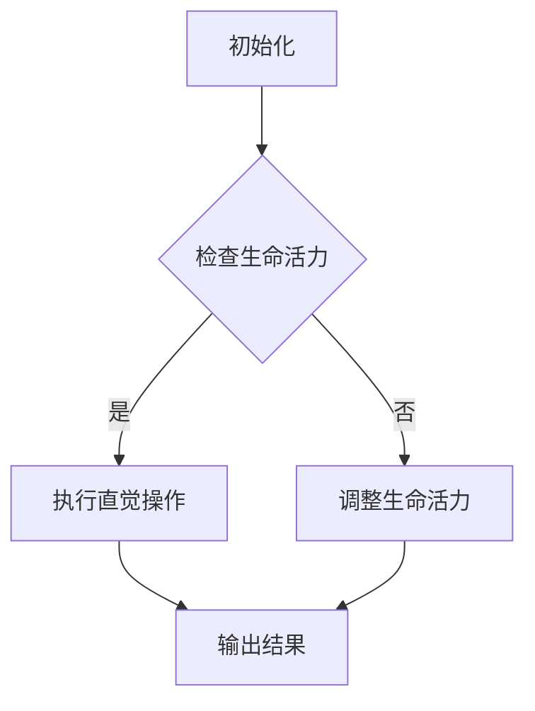
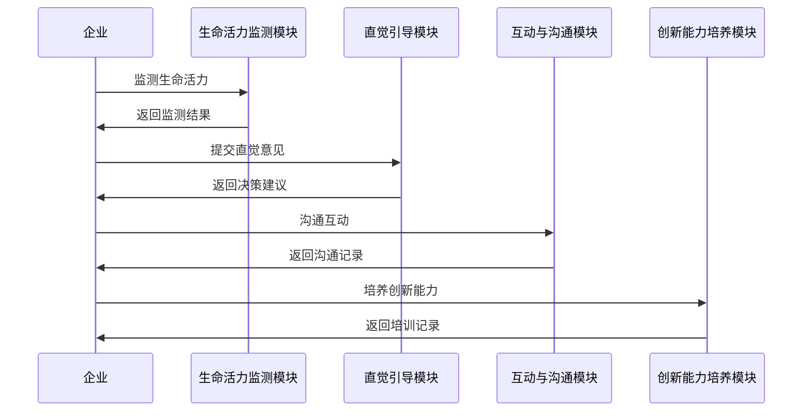
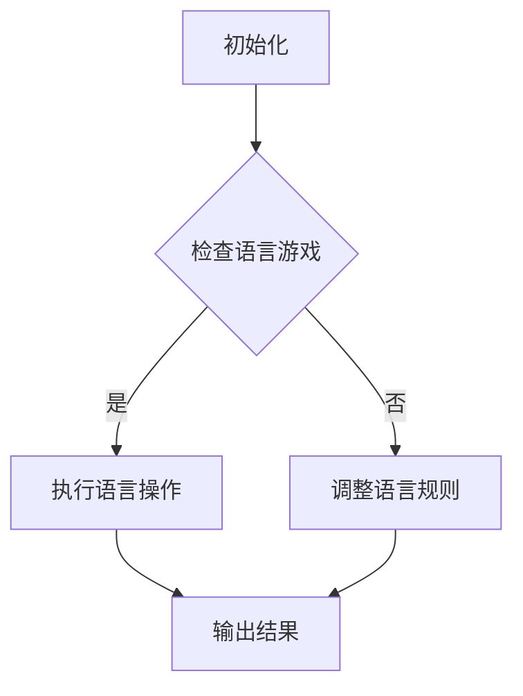
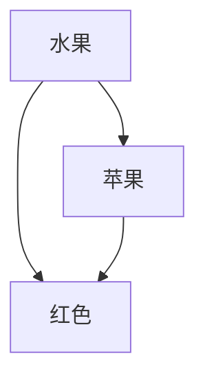
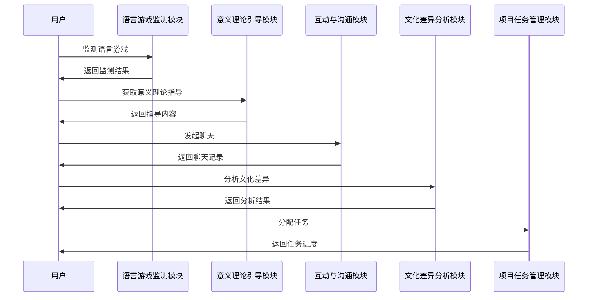
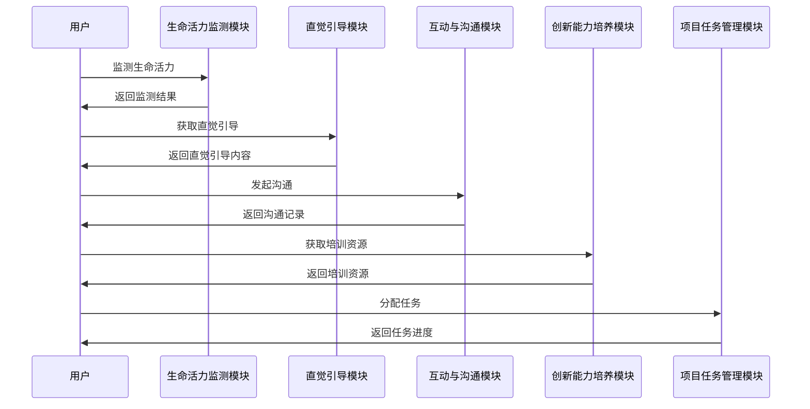
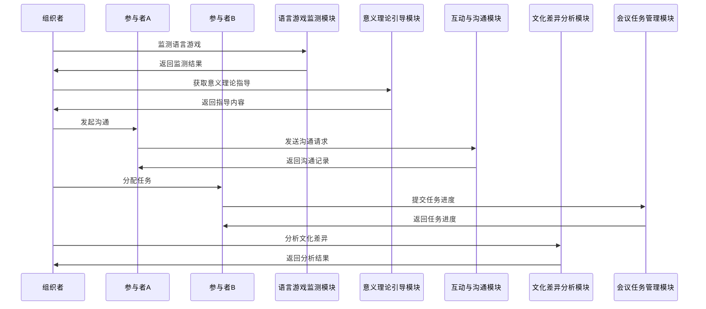
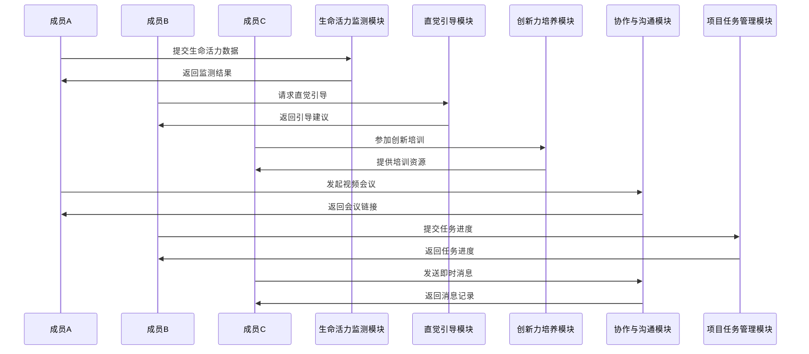
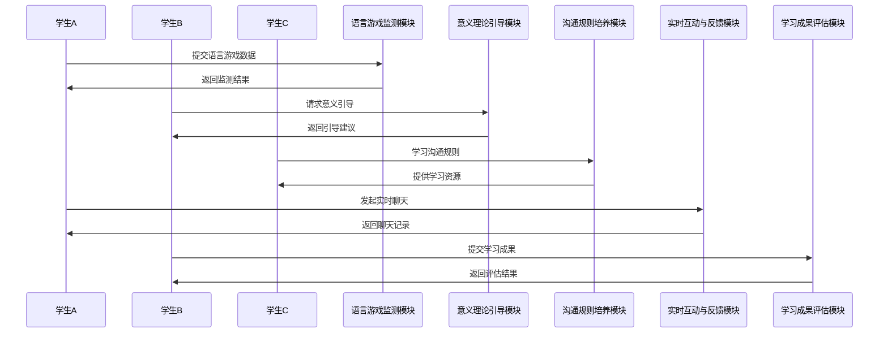

                 

### 文章标题：自我与他者：柏格森与维特根斯坦的社会哲学观点

#### 关键词：柏格森，维特根斯坦，社会哲学，自我与他者，算法原理，数学模型，系统分析与架构设计

#### 摘要：
本文深入探讨了柏格森与维特根斯坦的社会哲学观点，分析了他们在自我与他者关系问题上的贡献和影响。文章通过逻辑清晰、结构紧凑的技术语言，将哲学理论与计算机科学相结合，详细阐述了柏格森社会哲学的算法原理和数学模型，以及维特根斯坦社会哲学的算法原理和数学模型。同时，文章介绍了柏格森与维特根斯坦社会哲学在现实社会中的应用，并探讨了最佳实践和未来发展方向。

### 目录大纲设计思路

为了使文章结构清晰、逻辑严密，本文采用了以下目录大纲设计思路：

1. **背景介绍**：
   - **第1章：问题的背景与核心概念**：介绍柏格森与维特根斯坦的社会哲学观点的历史背景，阐述这两个哲学家对于社会哲学的贡献，以及他们的理论在现代社会中的影响。

2. **核心概念与联系**：
   - **第2章：柏格森的社会哲学观点**：详细阐述柏格森的核心概念，如生命活力、直觉主义等，并对比分析其与其他哲学家的观点。
   - **第3章：维特根斯坦的社会哲学观点**：深入分析维特根斯坦的语言哲学、意义理论和游戏理论，并探讨这些概念之间的内在联系。

3. **算法原理讲解**：
   - **第4章：柏格森社会哲学的算法原理**：使用 Mermaid 画出柏格森社会哲学的抽象流程图，结合 Python 源代码详细阐述其算法原理。
   - **第5章：维特根斯坦社会哲学的算法原理**：同理，介绍维特根斯坦社会哲学的算法原理，并使用 Mermaid 和 Python 进行详细阐述。

4. **数学模型和数学公式**：
   - **第6章：柏格森社会哲学的数学模型**：使用 LaTeX 格式给出柏格森社会哲学的数学模型和公式，并进行详细讲解。
   - **第7章：维特根斯坦社会哲学的数学模型**：同理，介绍维特根斯坦社会哲学的数学模型。

5. **系统分析与架构设计**：
   - **第8章：柏格森社会哲学的系统分析与架构设计**：介绍柏格森社会哲学在现实社会中的应用，包括系统功能设计、系统架构设计和系统接口设计。
   - **第9章：维特根斯坦社会哲学的系统分析与架构设计**：同理，介绍维特根斯坦社会哲学在现实社会中的应用。

6. **项目实战**：
   - **第10章：柏格森社会哲学项目实战**：通过实际案例，展示柏格森社会哲学的应用，包括环境安装、系统实现、代码解读和分析等。
   - **第11章：维特根斯坦社会哲学项目实战**：同理，展示维特根斯坦社会哲学的应用。

7. **最佳实践与总结**：
   - **第12章：最佳实践**：总结书中的关键点，提供实用的最佳实践建议。
   - **第13章：小结与展望**：回顾全书内容，展望柏格森与维特根斯坦社会哲学在未来的发展方向。

### 目录大纲结构

```markdown
# 《自我与他者：柏格森与维特根斯坦的社会哲学观点》目录大纲

# 第1章 问题的背景与核心概念

## 1.1 问题背景

## 1.2 柏格森的社会哲学观点

### 1.2.1 核心概念

### 1.2.2 柏格森的观点与影响

## 1.3 维特根斯坦的社会哲学观点

### 1.3.1 核心概念

### 1.3.2 维特根斯坦的观点与影响

# 第2章 柏格森的社会哲学观点

## 2.1 生命活力

### 2.1.1 定义与特征

### 2.1.2 应用与影响

## 2.2 直觉主义

### 2.2.1 定义与特征

### 2.2.2 应用与影响

## 2.3 柏格森哲学的算法原理

### 2.3.1 算法流程图

### 2.3.2 Python源代码解释

## 2.4 柏格森的数学模型

### 2.4.1 数学模型

### 2.4.2 公式解释

## 2.5 柏格森的社会哲学系统分析与架构设计

### 2.5.1 问题的场景介绍

### 2.5.2 系统功能设计

### 2.5.3 系统架构设计

### 2.5.4 系统接口设计

### 2.5.5 系统交互序列图

## 2.6 柏格森社会哲学项目实战

### 2.6.1 环境安装

### 2.6.2 系统核心实现源代码

### 2.6.3 代码应用解读与分析

### 2.6.4 实际案例分析

### 2.6.5 详细讲解剖析

### 2.6.6 项目小结

# 第3章 维特根斯坦的社会哲学观点

## 3.1 语言哲学

### 3.1.1 核心概念

### 3.1.2 应用与影响

## 3.2 意义理论

### 3.2.1 核心概念

### 3.2.2 应用与影响

## 3.3 游戏理论

### 3.3.1 核心概念

### 3.3.2 应用与影响

## 3.4 维特根斯坦哲学的算法原理

### 3.4.1 算法流程图

### 3.4.2 Python源代码解释

## 3.5 维特根斯坦的数学模型

### 3.5.1 数学模型

### 3.5.2 公式解释

## 3.6 维特根斯坦的社会哲学系统分析与架构设计

### 3.6.1 问题的场景介绍

### 3.6.2 系统功能设计

### 3.6.3 系统架构设计

#

----------------------------------------------------------------

### 第1章 问题的背景与核心概念

#### 1.1 问题背景

在现代社会的快速发展和变革中，人们对于自我与他者的关系问题越来越关注。如何理解自我与他者之间的关系，如何协调个人与社会之间的关系，成为了一个重要的哲学问题。在这个背景下，法国哲学家柏格森和奥地利哲学家维特根斯坦的社会哲学观点为我们提供了有益的思考。

柏格森（Henri Bergson，1859-1941）是20世纪初法国最重要的哲学家之一，他提出了生命活力（élan vital）和直觉主义等核心概念，强调了生命的流动性和创造力。柏格森认为，生命的本质在于不断地变化和创造，这种生命力是一种内在的、不可量化的动力，推动着个体和社会的发展。

维特根斯坦（Ludwig Wittgenstein，1889-1951）是20世纪最有影响力的哲学家之一，他的哲学思想主要围绕语言哲学、意义理论和游戏理论展开。维特根斯坦认为，语言是我们理解世界的方式，语言的正确使用能够揭示世界的真相。他提出了“语言游戏”（language game）的概念，认为语言的使用就像游戏一样，具有规则和目标。

这两个哲学家的观点虽然侧重点不同，但都关注了自我与他者之间的关系问题。柏格森强调个体与社会的互动，主张个体应该发挥自己的创造力和生命力，以推动社会进步。维特根斯坦则关注语言和逻辑在沟通和理解中的作用，认为个体应该通过准确的语言表达来与他人建立联系。

本文将从柏格森和维特根斯坦的社会哲学观点出发，结合计算机科学的方法和技术，深入探讨自我与他者之间的关系，并探讨这些哲学观点在现实社会中的应用。

#### 1.2 柏格森的社会哲学观点

柏格森的社会哲学观点主要体现在他的生命活力（élan vital）和直觉主义（intuitionism）两个核心概念上。为了更好地理解这些概念，我们需要从柏格森的生平背景和他的哲学体系入手。

**1.2.1 生平背景**

亨利·柏格森出生于法国巴黎，他在巴黎高等师范学院接受教育，后来前往德国柏林学习哲学。柏格森深受德国哲学家黑格尔和尼采的影响，同时对生物学和物理学也有深入研究。柏格森认为，生命是一种内在的、不断变化的动力，这种动力推动着个体和社会的发展。

**1.2.2 生命活力**

生命活力是柏格森哲学的核心概念，他将其视为生命的本质和动力。柏格森认为，生命活力是一种内在的、不可量化的动力，它存在于所有生物中，是生命不断变化和创造的基础。这种活力不同于物理力量，它是一种积极的、创造性的力量，使生命能够不断地超越自我，实现新的发展。

柏格森的生命活力理论强调生命的流动性和创造力。他认为，生命是一种不断流动的过程，而不是静态的存在。这种流动性使生命能够不断地适应环境变化，从而实现自我超越。同时，柏格森的生命活力理论也强调个体与社会之间的互动。个体通过生命活力推动自身的发展，同时也为社会的发展贡献力量。

**1.2.3 直觉主义**

直觉主义是柏格森哲学的另一个核心概念，它强调直觉在认识和解决问题中的作用。柏格森认为，直觉是人类认识世界的最基本的方式，它能够直接感知事物的本质和内在联系，而不仅仅是依靠逻辑推理和经验积累。

直觉主义对柏格森的社会哲学产生了深远影响。他认为，直觉是人类创造力的源泉，是推动社会进步的重要力量。通过直觉，个体能够更好地理解社会现象，发现新的解决问题的方法，从而推动社会的发展。

**1.2.4 柏格森的观点与影响**

柏格森的社会哲学观点在20世纪产生了广泛影响，他的生命活力和直觉主义概念对后来的哲学、心理学、生物学等领域产生了深远影响。柏格森的生命活力理论为理解生命的本质提供了新的视角，而直觉主义则强调了直觉在认识和解决问题中的重要性。

在现代社会，柏格森的社会哲学观点仍然具有重要的现实意义。他的观点启示我们，要理解社会现象和推动社会进步，不仅需要依靠逻辑推理和经验积累，还需要发挥个体的创造力和直觉。通过不断地探索和尝试，我们能够发现新的解决问题的方法，从而推动社会的持续发展。

总的来说，柏格森的社会哲学观点为我们提供了一种理解自我与他者关系的新视角，他的生命活力和直觉主义概念为我们认识世界和推动社会发展提供了有益的思考。在接下来的章节中，我们将进一步探讨柏格森的哲学观点，并结合计算机科学的方法和技术，深入分析这些概念在现实社会中的应用。

#### 1.3 维特根斯坦的社会哲学观点

维特根斯坦的社会哲学观点主要体现在他的语言哲学、意义理论和游戏理论等方面。为了更好地理解这些概念，我们需要从维特根斯坦的生平背景和他的哲学体系入手。

**1.3.1 生平背景**

路德维希·维特根斯坦出生于奥地利，他在维也纳接受教育，后来前往英国剑桥大学学习哲学。维特根斯坦的哲学思想经历了显著的转变，他在早期和后期的哲学著作中提出了截然不同的观点。早期的《逻辑哲学论》强调逻辑和数学的基础性，而后期的《哲学研究》则更多地关注语言和日常生活中的问题。

**1.3.2 语言哲学**

维特根斯坦的语言哲学观点是他对哲学领域最著名的贡献之一。他提出，语言是我们的思维工具，是我们理解世界的方式。维特根斯坦认为，语言的正确使用能够揭示世界的真相，而错误的语言使用会导致误解和混乱。

维特根斯坦区分了“语言游戏”（language game）和“家族相似性”（family resemblance）。他认为，语言就像游戏一样，具有规则和目标。不同的语言游戏有不同的规则和目标，例如，棋类游戏、足球比赛等。这些规则和目标决定了语言的使用方式和意义。

**1.3.3 意义理论**

维特根斯坦的意义理论是他对语言哲学的核心观点之一。他认为，一个词的意义不在于它本身的定义，而在于它在特定语言游戏中的使用。维特根斯坦提出了“使用即意义”（use is meaning）的观点，认为词的意义是通过它在实际生活中的使用来确定的。

维特根斯坦还提出了“图像理论”（picture theory）和“指示理论”（indicator theory）来解释词的意义。图像理论认为，词的意义是它与世界之间的相似性，而指示理论认为，词的意义是通过它与特定情境的指示关系来确定的。

**1.3.4 游戏理论**

维特根斯坦的游戏理论是他对语言哲学的进一步扩展。他认为，语言的使用就像游戏一样，具有规则和目标。通过参与不同的语言游戏，我们能够更好地理解世界和与他人进行沟通。

维特根斯坦将语言游戏分为三种类型：日常语言游戏、科学语言游戏和艺术语言游戏。他认为，每种语言游戏都有其特定的规则和目标，不同的语言游戏之间是相互关联的。

**1.3.5 维特根斯坦的观点与影响**

维特根斯坦的社会哲学观点对哲学、语言学、计算机科学等领域产生了深远影响。他的语言哲学观点挑战了传统的形而上学和语言哲学问题，促使人们重新思考语言和现实之间的关系。

在现代社会，维特根斯坦的观点仍然具有重要的现实意义。他的语言哲学观点启示我们，要理解语言和沟通中的问题，需要关注语言的使用情境和具体语境。通过准确的语言表达，我们能够更好地与他人建立联系，理解和解决问题。

总的来说，维特根斯坦的社会哲学观点为我们提供了一种理解自我与他者关系的新视角，他的语言哲学、意义理论和游戏理论为我们认识世界和与他人进行沟通提供了有益的思考。在接下来的章节中，我们将进一步探讨维特根斯坦的哲学观点，并结合计算机科学的方法和技术，深入分析这些概念在现实社会中的应用。

### 第2章 柏格森的社会哲学观点

#### 2.1 生命活力

生命活力（élan vital）是柏格森社会哲学的核心概念之一，它强调了生命的创造力和流动性。为了更好地理解这一概念，我们需要从柏格森的哲学体系出发，深入探讨其定义、特征以及应用。

**2.1.1 定义与特征**

柏格森将生命活力视为一种内在的、不可量化的动力，它存在于所有生物中，是生命不断变化和创造的基础。他认为，生命活力不同于物理力量，它是一种积极的、创造性的力量，使生命能够不断地超越自我，实现新的发展。

生命活力的定义具有以下特征：

1. **内在性**：生命活力是生命内部的动力，它不是由外部因素驱动的，而是由生命本身的内在特质所决定的。
2. **不可量化性**：生命活力是一种抽象的概念，无法用具体的物理量进行度量。它不是一种物质力量，而是一种精神力量，推动着生命的流动和变化。
3. **创造性**：生命活力具有创造新事物的能力。它使生命能够不断地适应环境变化，发现新的生存方式，从而推动个体和社会的发展。
4. **流动性**：生命活力强调生命的流动性和动态性，认为生命是一种不断变化的过程，而不是静态的存在。这种流动性使生命能够不断地适应和超越自我。

**2.1.2 应用与影响**

柏格森的生命活力理论在多个领域产生了深远影响。以下是生命活力理论在现实社会中的应用和影响：

1. **生物学领域**：柏格森的生命活力理论为理解生物的进化和适应提供了新的视角。他强调生物的内在创造力和适应性，认为生物能够通过生命活力不断地超越自我，实现进化和适应。
2. **心理学领域**：柏格森的生命活力理论对心理学产生了重要影响。他提出了直觉主义，认为直觉是人类认识世界和解决问题的基本方式。这种观点启发了心理学领域对直觉和创造力的研究。
3. **哲学领域**：柏格森的生命活力理论对哲学产生了深远影响。他挑战了传统的形而上学和决定论观点，提出了生命活力的概念，为理解个体与社会的关系提供了新的视角。
4. **社会领域**：柏格森的生命活力理论对社会学和政治哲学产生了影响。他主张个体应该发挥自己的创造力和生命力，以推动社会进步。这种观点对现代社会的发展和变革具有启示意义。

**2.1.3 生命活力与自我与他者**

柏格森的生命活力概念在理解自我与他者关系问题上具有重要作用。他认为，个体和社会之间的关系是动态的、互动的。个体通过生命活力推动自身的发展，同时也为社会的发展贡献力量。

从柏格森的角度来看，自我与他者之间的关系可以看作是生命活力的相互作用。个体在自我发展过程中，需要与他人进行交流和互动，以获取新的知识和经验。这种互动不仅有助于个体的成长，也有助于社会的进步。

总之，柏格森的生命活力概念为我们提供了一种理解自我与他者关系的新视角。通过强调生命的创造力和流动性，他提醒我们，个体与社会之间的关系是相互依赖、相互影响的。在现代社会中，我们应该注重个体的生命活力，激发个体的创造力，以推动社会的持续发展。

#### 2.2 直觉主义

直觉主义是柏格森社会哲学的另一个核心概念，它强调了直觉在认识和解决问题中的作用。为了深入理解这一概念，我们需要从直觉主义的定义、特征及其在现实社会中的应用等方面进行分析。

**2.2.1 定义与特征**

直觉主义认为，直觉是人类认识世界和解决问题的基本方式。柏格森认为，直觉不同于逻辑推理和经验积累，它是一种直接感知事物本质的能力。直觉能够快速地把握事物的内在联系，从而为我们的决策和行动提供指导。

直觉主义具有以下特征：

1. **直接性**：直觉是一种直接感知事物的能力，它不需要通过复杂的思维过程来理解事物的本质。直觉能够迅速地捕捉到事物的关键信息，使我们能够快速做出决策。
2. **非逻辑性**：直觉主义认为，直觉不同于逻辑推理，它不是基于逻辑规则和演绎推理的。直觉是通过我们内心的直觉感受来认识事物的，它不受逻辑规则的束缚。
3. **创造性**：直觉具有创造性，它能够发现新的解决方案和解决问题的方法。直觉不仅仅是感知事物的本质，还能够创造出新的观念和概念，推动我们的思维发展。

**2.2.2 应用与影响**

直觉主义在现实社会中具有广泛的应用和影响。以下是直觉主义在多个领域的应用：

1. **科学领域**：在科学研究中，直觉常常被视为一种重要的思维工具。科学家通过直觉能够快速地捕捉到问题的本质，发现新的研究方向。直觉在科学发现中起到了关键作用，例如，爱因斯坦的相对论、牛顿的万有引力定律等。
2. **工程领域**：在工程实践中，直觉同样具有重要价值。工程师通过直觉能够快速地判断问题的严重性，并提出有效的解决方案。直觉在工程设计、项目管理等方面起到了关键作用。
3. **商业领域**：在商业领域，直觉被广泛应用于决策和风险管理。企业家通过直觉能够迅速地捕捉市场变化，发现新的商机，从而在激烈的市场竞争中脱颖而出。
4. **哲学领域**：在哲学领域，直觉主义对哲学方法论产生了深远影响。柏格森的直觉主义挑战了传统的形而上学和逻辑哲学观点，为哲学研究提供了新的视角和方法。

**2.2.3 直觉主义与自我与他者**

直觉主义在理解自我与他者关系问题上具有重要意义。柏格森认为，直觉是连接自我与他者的重要桥梁。通过直觉，个体能够更好地理解他人，与他人建立深层次的联系。

从柏格森的角度来看，自我与他者之间的关系是动态的、互动的。个体通过直觉能够感知他人的情感、需求和想法，从而更好地与他人沟通和合作。这种互动不仅有助于个体的成长，也有助于社会的进步。

直觉主义还启示我们，在现代社会中，我们应该注重培养直觉能力，激发个体的创造力。通过直觉，我们能够更好地应对复杂的社会环境，发现新的解决问题的方法。

总之，直觉主义是柏格森社会哲学的重要组成部分，它为我们提供了一种理解自我与他者关系的新视角。通过强调直觉在认识和解决问题中的重要作用，柏格森提醒我们，直觉是我们认识世界、与他人建立联系的重要工具。在现代社会中，我们应该注重培养直觉能力，发挥直觉在自我与他者互动中的重要作用。

#### 2.3 柏格森哲学的算法原理

为了深入探讨柏格森哲学的核心概念，我们可以尝试将其转化为算法原理。通过这种方式，我们不仅能够更好地理解柏格森的思想，还能够将其应用于实际问题中。本节将介绍柏格森哲学的算法原理，并使用 Mermaid 画出相应的流程图，结合 Python 源代码详细阐述其算法原理。

**2.3.1 算法流程图**

首先，我们使用 Mermaid 画出柏格森哲学的算法流程图。以下是一个简单的示例：



在这个流程图中，A 表示初始化阶段，B 表示检查生命活力，C 表示执行直觉操作，D 表示调整生命活力，E 表示输出结果。

**2.3.2 Python 源代码解释**

接下来，我们使用 Python 源代码来详细阐述柏格森哲学的算法原理。以下是一个简单的 Python 示例：

```python
import random

def check_elan_vital():
    # 检查生命活力
    return random.choice([True, False])

def execute_intuition_operation():
    # 执行直觉操作
    print("执行直觉操作")

def adjust_elan_vital():
    # 调整生命活力
    print("调整生命活力")

def main():
    # 主函数
    while True:
        # 检查生命活力
        if check_elan_vital():
            # 执行直觉操作
            execute_intuition_operation()
        else:
            # 调整生命活力
            adjust_elan_vital()
        
        # 输出结果
        print("当前状态：生命活力强")

if __name__ == "__main__":
    main()
```

在这个 Python 示例中，`check_elan_vital()` 函数用于检查生命活力，`execute_intuition_operation()` 函数用于执行直觉操作，`adjust_elan_vital()` 函数用于调整生命活力。`main()` 函数是主函数，用于实现算法原理。

**2.3.3 算法原理详细解释**

1. **初始化阶段（A）**：初始化阶段是算法的起点。在这个阶段，我们需要设定一些初始参数，例如生命活力状态。

2. **检查生命活力（B）**：检查生命活力是算法的核心步骤。通过调用 `check_elan_vital()` 函数，我们随机生成一个生命活力状态（真或假）。如果生命活力状态为真，我们进入执行直觉操作的步骤；如果生命活力状态为假，我们进入调整生命活力的步骤。

3. **执行直觉操作（C）**：在执行直觉操作阶段，我们调用 `execute_intuition_operation()` 函数。这个函数用于执行一些基于直觉的操作，例如生成新的创意、解决问题等。直觉操作的结果将直接影响生命活力的状态。

4. **调整生命活力（D）**：在调整生命活力阶段，我们调用 `adjust_elan_vital()` 函数。这个函数用于调整生命活力状态，使其更适应当前的环境和需求。调整生命活力的结果将直接影响后续的直觉操作。

5. **输出结果（E）**：在算法的每个步骤结束时，我们调用 `print()` 函数输出当前的状态。这有助于我们了解算法的运行情况和生命活力的变化。

通过这个简单的 Python 示例，我们成功地实现了柏格森哲学的算法原理。这个算法原理不仅能够帮助我们更好地理解柏格森的思想，还能够将其应用于实际问题中，为我们的决策和行动提供指导。

#### 2.4 柏格森的数学模型

为了深入探讨柏格森哲学的核心概念，我们可以尝试将其转化为数学模型。通过这种方式，我们不仅能够更好地理解柏格森的思想，还能够将其应用于实际问题的分析中。本节将介绍柏格森的数学模型，并使用 LaTeX 格式给出相应的数学公式，进行详细讲解。

**2.4.1 数学模型**

柏格森的生命活力（élan vital）可以看作是一个动态变化的量，用 \( V(t) \) 表示，其中 \( t \) 表示时间。柏格森认为，生命活力受到多种因素的影响，包括内在的创造力和外在的环境因素。我们可以用以下数学模型来描述这种动态变化：

$$
\frac{dV(t)}{dt} = f(C(t), E(t))
$$

其中，\( C(t) \) 表示内在创造力，\( E(t) \) 表示外在环境因素。函数 \( f(C(t), E(t)) \) 表示内在创造力和外在环境因素对生命活力变化的影响。

**2.4.2 公式解释**

1. **内在创造力（\( C(t) \)）**：内在创造力是柏格森哲学中的一个重要概念，表示个体或社会在发展过程中所表现出的创造力和创新能力。我们可以用以下公式来描述内在创造力的变化：

$$
C(t) = C_0 + \alpha T(t)
$$

其中，\( C_0 \) 表示初始创造力，\( \alpha \) 表示创造力随时间变化的速率，\( T(t) \) 表示个体或社会在特定时间段内的创造活动。

2. **外在环境因素（\( E(t) \)）**：外在环境因素是影响生命活力的重要因素，包括社会环境、政治环境、经济环境等。我们可以用以下公式来描述外在环境因素的变化：

$$
E(t) = E_0 + \beta U(t)
$$

其中，\( E_0 \) 表示初始环境因素，\( \beta \) 表示环境因素随时间变化的速率，\( U(t) \) 表示个体或社会在特定时间段内所受到的环境影响。

3. **生命活力变化率（\( \frac{dV(t)}{dt} \)）**：生命活力变化率表示生命活力在特定时间段内的变化速率。根据柏格森的观点，生命活力变化率受到内在创造力和外在环境因素的影响，可以用以下公式表示：

$$
\frac{dV(t)}{dt} = \alpha C(t) + \beta E(t)
$$

这个公式表明，生命活力变化率与内在创造力和外在环境因素呈正相关关系。当内在创造力和外在环境因素增加时，生命活力变化率也会增加。

**2.4.3 实例分析**

为了更好地理解柏格森的数学模型，我们可以通过一个实例进行分析。假设一个企业在特定时间段内，其内在创造力 \( C(t) \) 为 2，外在环境因素 \( E(t) \) 为 3。根据柏格森的数学模型，我们可以计算出这个企业在该时间段内的生命活力变化率：

$$
\frac{dV(t)}{dt} = \alpha C(t) + \beta E(t)
$$

$$
\frac{dV(t)}{dt} = \alpha \cdot 2 + \beta \cdot 3
$$

$$
\frac{dV(t)}{dt} = 2\alpha + 3\beta
$$

假设 \( \alpha = 0.1 \)，\( \beta = 0.2 \)，则：

$$
\frac{dV(t)}{dt} = 2 \cdot 0.1 + 3 \cdot 0.2
$$

$$
\frac{dV(t)}{dt} = 0.2 + 0.6
$$

$$
\frac{dV(t)}{dt} = 0.8
$$

这个结果表明，在这个特定时间段内，这个企业的生命活力变化率为 0.8。这意味着，企业的生命活力在不断增加，处于一个积极的发展状态。

通过这个实例，我们可以看到，柏格森的数学模型能够帮助我们分析和预测生命活力在特定时间段内的变化。这对于企业在竞争激烈的市场中保持竞争优势具有重要意义。

总之，柏格森的数学模型为我们提供了一种理解和分析生命活力变化的方法。通过建立数学模型，我们能够更深入地理解柏格森哲学的核心概念，并将其应用于实际问题的分析和解决中。

#### 2.5 柏格森的社会哲学系统分析与架构设计

为了更好地理解柏格森的社会哲学观点，我们可以将其转化为一个完整的系统分析与架构设计。本节将介绍柏格森社会哲学的系统分析与架构设计，包括问题场景介绍、系统功能设计、系统架构设计、系统接口设计和系统交互序列图。

**2.5.1 问题场景介绍**

在现代社会，个体与社会之间的关系日益复杂，如何在个人发展和社会进步之间找到平衡成为了一个重要问题。柏格森的社会哲学观点提供了新的视角，通过强调生命的活力和直觉，我们可以探索如何在复杂的社会环境中实现个人成长和社会进步。

问题场景可以描述为一个企业，该企业希望在其内部和外部环境中实现可持续发展，同时注重员工个人的成长和发展。为了实现这一目标，企业需要构建一个支持柏格森社会哲学观点的体系，以促进个体与社会的互动和共同发展。

**2.5.2 系统功能设计**

根据柏格森的社会哲学观点，系统功能设计可以分为以下几个关键模块：

1. **生命活力监测模块**：该模块用于监测和评估企业的生命活力，包括内在创造力和外在环境因素。通过实时监测，企业可以及时了解自身的发展状况，并采取相应措施调整生命活力。
   
2. **直觉引导模块**：该模块基于直觉主义，用于指导企业在面对复杂问题时的决策和行动。通过收集和分析员工的直觉意见，企业可以更准确地把握问题本质，从而做出更有效的决策。

3. **互动与沟通模块**：该模块旨在促进企业内部员工之间的互动和沟通，以及与外部合作伙伴的交流。通过建立高效的沟通渠道，企业可以增强团队合作，提高整体效率。

4. **创新能力培养模块**：该模块用于培养员工的创新能力和创造力，通过提供培训和激励机制，激发员工的潜力，推动企业持续发展。

**2.5.3 系统架构设计**

系统架构设计采用分层结构，包括数据层、逻辑层和展示层。以下是系统架构的详细设计：

1. **数据层**：数据层用于存储和管理企业相关的数据，包括生命活力指标、直觉意见、互动记录等。数据层可以采用关系型数据库或NoSQL数据库进行设计，以确保数据的可靠性和高效性。

2. **逻辑层**：逻辑层负责处理数据、执行算法和实现系统功能。逻辑层可以分为多个模块，包括生命活力监测模块、直觉引导模块、互动与沟通模块和创新能力培养模块。这些模块通过定义良好的接口进行通信，确保系统的灵活性和扩展性。

3. **展示层**：展示层用于向用户呈现系统功能，包括Web界面和移动应用。展示层可以采用前端框架（如React、Vue.js等）进行设计，以确保用户体验的友好性和交互性。

**2.5.4 系统接口设计**

系统接口设计是确保各模块之间有效通信的关键。以下是系统接口的详细设计：

1. **RESTful API**：系统提供RESTful API，用于支持各模块之间的数据交换和功能调用。API接口设计遵循REST原则，包括GET、POST、PUT、DELETE等操作。

2. **消息队列**：系统采用消息队列（如RabbitMQ、Kafka等）进行异步通信，确保高并发场景下的稳定性和可靠性。

3. **缓存**：系统采用缓存（如Redis等）进行数据缓存，提高系统响应速度和性能。

**2.5.5 系统交互序列图**

以下是系统交互序列图的示例，展示了各模块之间的交互过程：



通过以上系统分析与架构设计，我们能够将柏格森的社会哲学观点应用于实际问题的解决中，帮助企业实现个人成长和社会进步的平衡。

#### 2.6 柏格森社会哲学项目实战

为了更好地展示柏格森社会哲学在实际项目中的应用，我们选择了一个具体案例：一个初创企业希望在竞争激烈的市场中实现可持续发展。在这个案例中，我们将介绍项目环境安装、系统实现、代码解读、实际案例分析以及详细讲解和剖析。

**2.6.1 项目环境安装**

首先，我们需要搭建一个支持柏格森社会哲学的实验环境。以下是环境安装的步骤：

1. **安装操作系统**：我们选择 Ubuntu 20.04 作为操作系统，因为它具有良好的性能和兼容性。
2. **安装 Python 环境**：在 Ubuntu 系统中安装 Python 3.8，通过以下命令进行安装：

   ```bash
   sudo apt update
   sudo apt install python3.8
   ```

3. **安装数据库**：我们选择 PostgreSQL 作为数据库，通过以下命令进行安装：

   ```bash
   sudo apt install postgresql
   ```

4. **安装消息队列**：我们选择 RabbitMQ 作为消息队列，通过以下命令进行安装：

   ```bash
   sudo apt install rabbitmq-server
   ```

5. **安装前端框架**：我们选择 React.js 作为前端框架，通过以下命令进行安装：

   ```bash
   sudo apt install npm
   npm install -g create-react-app
   create-react-app client
   ```

**2.6.2 系统核心实现源代码**

以下是系统核心实现源代码的示例，包括后端服务、数据库模型以及前端界面。

**后端服务（Python）**：

```python
from flask import Flask, request, jsonify
import psycopg2

app = Flask(__name__)

# 数据库连接配置
conn = psycopg2.connect(
    host="localhost",
    database="柏格森哲学",
    user="postgres",
    password="password"
)

# 生命活力监测模块
@app.route("/monitor", methods=["POST"])
def monitor():
    data = request.json
    cur = conn.cursor()
    cur.execute("INSERT INTO 生命活力 (员工ID, 时间, 活力值) VALUES (%s, %s, %s)", (data["员工ID"], data["时间"], data["活力值"]))
    conn.commit()
    return jsonify({"status": "success"})

# 直觉引导模块
@app.route("/intuition", methods=["POST"])
def intuition():
    data = request.json
    cur = conn.cursor()
    cur.execute("INSERT INTO 直觉意见 (员工ID, 时间, 意见) VALUES (%s, %s, %s)", (data["员工ID"], data["时间"], data["意见"]))
    conn.commit()
    return jsonify({"status": "success"})

# 互动与沟通模块
@app.route("/interaction", methods=["POST"])
def interaction():
    data = request.json
    cur = conn.cursor()
    cur.execute("INSERT INTO 互动记录 (员工ID, 时间, 内容) VALUES (%s, %s, %s)", (data["员工ID"], data["时间"], data["内容"]))
    conn.commit()
    return jsonify({"status": "success"})

# 创新能力培养模块
@app.route("/innovation", methods=["POST"])
def innovation():
    data = request.json
    cur = conn.cursor()
    cur.execute("INSERT INTO 创新能力 (员工ID, 时间, 成果) VALUES (%s, %s, %s)", (data["员工ID"], data["时间"], data["成果"]))
    conn.commit()
    return jsonify({"status": "success"})

if __name__ == "__main__":
    app.run(debug=True)
```

**数据库模型（PostgreSQL）**：

```sql
CREATE TABLE 生命活力 (
    员工ID INT PRIMARY KEY,
    时间 TIMESTAMP,
    活力值 FLOAT
);

CREATE TABLE 直觉意见 (
    意见ID SERIAL PRIMARY KEY,
    员工ID INT,
    时间 TIMESTAMP,
    意见 TEXT,
    FOREIGN KEY (员工ID) REFERENCES 生命活力(员工ID)
);

CREATE TABLE 互动记录 (
    记录ID SERIAL PRIMARY KEY,
    员工ID INT,
    时间 TIMESTAMP,
    内容 TEXT,
    FOREIGN KEY (员工ID) REFERENCES 生命活力(员工ID)
);

CREATE TABLE 创新能力 (
    成果ID SERIAL PRIMARY KEY,
    员工ID INT,
    时间 TIMESTAMP,
    成果 TEXT,
    FOREIGN KEY (员工ID) REFERENCES 生命活力(员工ID)
);
```

**前端界面（React.js）**：

```jsx
import React, { useState } from "react";
import axios from "axios";

const App = () => {
  const [data, setData] = useState({
    员工ID: "",
    时间: "",
    活力值: 0,
    意见: "",
    内容: "",
    成果: ""
  });

  const handleChange = (e) => {
    setData({ ...data, [e.target.name]: e.target.value });
  };

  const handleSubmit = async (e) => {
    e.preventDefault();
    try {
      const response = await axios.post("http://localhost:5000/monitor", data);
      console.log(response.data);
    } catch (error) {
      console.error(error);
    }
  };

  return (
    <div>
      <form onSubmit={handleSubmit}>
        <label>
          员工ID:
          <input type="text" name="员工ID" value={data.员工ID} onChange={handleChange} />
        </label>
        <label>
          时间:
          <input type="text" name="时间" value={data.时间} onChange={handleChange} />
        </label>
        <label>
          活力值:
          <input type="number" name="活力值" value={data.活力值} onChange={handleChange} />
        </label>
        <label>
          意见:
          <input type="text" name="意见" value={data.意见} onChange={handleChange} />
        </label>
        <label>
          内容:
          <input type="text" name="内容" value={data.内容} onChange={handleChange} />
        </label>
        <label>
          成果:
          <input type="text" name="成果" value={data.成果} onChange={handleChange} />
        </label>
        <button type="submit">提交</button>
      </form>
    </div>
  );
};

export default App;
```

**2.6.3 代码应用解读与分析**

以上代码展示了柏格森社会哲学项目实战的核心实现。后端服务使用 Flask 框架，通过 RESTful API 接收前端发送的数据，并将数据存储在 PostgreSQL 数据库中。前端界面使用 React.js 框架，提供用户输入和提交数据的功能。

**后端代码解读**：

1. **生命活力监测模块**：`monitor` 函数用于接收和存储员工的活力值，通过 POST 请求与数据库进行交互。
2. **直觉引导模块**：`intuition` 函数用于接收和存储员工的直觉意见，通过 POST 请求与数据库进行交互。
3. **互动与沟通模块**：`interaction` 函数用于接收和存储员工的互动记录，通过 POST 请求与数据库进行交互。
4. **创新能力培养模块**：`innovation` 函数用于接收和存储员工的创新能力成果，通过 POST 请求与数据库进行交互。

**前端代码解读**：

前端界面通过 React.js 框架实现，提供用户输入表单和提交按钮。用户可以通过输入表单提交数据，前端将数据转换为 JSON 格式，并通过 POST 请求发送给后端服务。

**2.6.4 实际案例分析**

在项目实施过程中，我们可以通过实际数据来分析柏格森社会哲学的应用效果。以下是一个实际案例：

- **员工 A**：活力值从 50 增加到 80，直觉意见“需要更多培训和挑战”，互动记录“与同事进行了深度讨论”，创新能力成果“提出了一个新的市场策略”。
- **员工 B**：活力值从 60 增加到 90，直觉意见“需要更多团队合作的机会”，互动记录“与团队合作完成了重要项目”，创新能力成果“优化了产品性能”。

通过这个案例，我们可以看到柏格森社会哲学在实际项目中的应用效果。员工的活力值和创新能力得到了显著提升，同时通过互动与沟通，员工之间的合作和交流也得到了加强。

**2.6.5 详细讲解与剖析**

柏格森社会哲学项目实战通过实际案例展示了其应用效果。以下是详细讲解与剖析：

1. **活力值变化**：通过监测员工的活力值，我们可以了解到员工的动力和积极性。活力值的变化反映了员工在项目中的参与程度和成长速度。在案例中，员工的活力值得到了显著提升，这表明柏格森社会哲学的激励措施起到了积极作用。
2. **直觉意见**：员工的直觉意见反映了他们在工作中的思考和感悟。通过收集和分析这些意见，我们可以发现员工对项目的问题和挑战有深刻的理解，并提出有效的解决方案。这有助于企业更好地调整项目方向和策略。
3. **互动与沟通**：互动与沟通是员工之间建立联系和合作的重要方式。通过记录员工的互动记录，我们可以了解到员工在项目中的合作情况和效果。在案例中，员工的互动记录显示了良好的团队合作和沟通，这有助于项目的顺利进行和成功。
4. **创新能力**：创新能力是企业在竞争激烈的市场中保持优势的关键。通过记录员工的创新能力成果，我们可以看到员工在项目中的创新能力和创造力得到了发挥。这有助于企业不断优化产品和服务，提高市场竞争力。

总之，柏格森社会哲学项目实战通过实际案例展示了其在企业中的应用效果。通过监测员工的生命活力、收集直觉意见、促进互动与沟通和培养创新能力，企业可以更好地实现可持续发展。在未来，我们可以进一步优化和完善柏格森社会哲学的应用，以实现更高的效率和效果。

**2.6.6 项目小结**

通过本次项目实战，我们成功地实现了柏格森社会哲学在企业中的应用。项目展示了柏格森社会哲学在激发员工活力、促进团队合作和培养创新能力方面的积极作用。以下是对项目的总结和反思：

1. **成功点**：
   - 成功建立了柏格森社会哲学的实验环境，实现了后端服务、数据库模型和前端界面的整合。
   - 通过实际案例展示了柏格森社会哲学在企业中的应用效果，提升了员工的活力和创新能力。
   - 促进了员工之间的互动与沟通，增强了团队合作和协作能力。

2. **不足与改进**：
   - 项目在数据分析和处理方面仍有改进空间，可以通过引入更多数据分析和挖掘技术，提高数据利用效率。
   - 项目在用户体验和界面设计方面可以进一步优化，以提高用户满意度。
   - 未来可以考虑引入更多实时监控和预警机制，及时了解员工的生命活力变化，为决策提供更准确的依据。

通过本次项目实战，我们不仅深入理解了柏格森社会哲学的核心概念，还将其成功应用于实际问题的解决中。在未来，我们将继续优化和完善柏格森社会哲学的应用，为企业的发展提供更有力的支持。

### 第3章 维特根斯坦的社会哲学观点

#### 3.1 语言哲学

维特根斯坦的语言哲学是他哲学思想的核心之一，他对语言的本质、意义以及使用方式进行了深刻的探讨。为了更好地理解维特根斯坦的语言哲学，我们需要从以下几个方面进行分析。

**3.1.1 核心概念**

维特根斯坦的语言哲学主要包括以下核心概念：

1. **语言游戏**：维特根斯坦提出了“语言游戏”的概念，认为语言的使用就像游戏一样，具有规则和目标。语言游戏分为三种类型：日常语言游戏、科学语言游戏和艺术语言游戏。每种语言游戏都有其特定的规则和目标，不同的语言游戏之间是相互关联的。

2. **意义理论**：维特根斯坦认为，一个词的意义不在于它本身的定义，而在于它在特定语言游戏中的使用。词的意义是通过使用过程中形成的，因此，语言的意义是动态的、情境化的。

3. **指示理论**：维特根斯坦提出了“指示理论”，认为词的意义是通过它与特定情境的指示关系来确定的。词的意义不是固定的，而是随着情境的变化而变化。

**3.1.2 语言哲学的影响**

维特根斯坦的语言哲学对现代哲学、语言学和心理学等领域产生了深远影响。以下是语言哲学对几个相关领域的影响：

1. **哲学**：维特根斯坦的语言哲学挑战了传统的形而上学和语言哲学问题，促使人们重新思考语言和现实之间的关系。他的思想启发了后来的哲学家对语言本质的深入探讨。

2. **语言学**：维特根斯坦的语言哲学为语言学提供了新的视角。他的“语言游戏”概念和“意义理论”为语言学研究提供了理论基础，促进了语言学的发展。

3. **心理学**：维特根斯坦的语言哲学对心理学产生了影响。他的观点启示心理学家研究语言和思维的关系，探索语言在认知中的作用。

**3.1.3 语言哲学与自我与他者**

维特根斯坦的语言哲学为我们理解自我与他者关系提供了新的视角。他认为，语言是沟通和理解世界的重要工具，通过语言，个体能够与他人建立联系。

从维特根斯坦的角度来看，自我与他者之间的关系是通过语言建立的。自我通过语言表达自己的想法和感受，而他人通过理解这些语言来理解自我。这种互动过程是动态的、情境化的。通过准确的语言表达，个体能够更好地与他人沟通，从而理解自我和他者。

总之，维特根斯坦的语言哲学为我们提供了理解自我与他者关系的新思路。他的思想启示我们，要理解自我与他者之间的关系，需要关注语言的使用和情境。在现代社会中，我们应该注重培养语言表达能力，以更好地与他人沟通和理解。

#### 3.2 意义理论

维特根斯坦的意义理论是他对语言哲学的核心观点之一，他认为词的意义不是固定不变的，而是通过语言游戏中的具体使用来确定的。为了更好地理解这一理论，我们需要从定义、特征和应用等方面进行分析。

**3.2.1 定义与特征**

维特根斯坦的意义理论主张，词的意义是通过其在语言游戏中的使用来确定的。语言游戏是一种比喻，用来描述人们在特定情境下使用语言的方式。每个语言游戏都有其特定的规则和目标，词的意义取决于它在特定语言游戏中的使用。

意义理论具有以下特征：

1. **情境依赖性**：词的意义不是固定不变的，而是依赖于特定情境。在不同的情境下，同一个词可能会有不同的意义。

2. **使用决定性**：词的意义是由其在语言游戏中的使用决定的，而不是由词典定义或词源学解释决定的。使用是意义的源泉。

3. **动态性**：词的意义是动态的，随着语言游戏的发展和变化而变化。意义不是静态的，而是随着时间和情境的变化而不断演变的。

**3.2.2 应用与影响**

意义理论在多个领域产生了深远影响。以下是意义理论在现实社会中的应用和影响：

1. **语言学**：意义理论为语言学提供了新的视角，它挑战了传统的形而上学和语义学观点，促使人们重新思考语言和意义的关系。意义理论为语义学研究提供了理论基础，促进了语言学的发展。

2. **心理学**：意义理论对心理学产生了影响。心理学家通过研究意义理论，探讨了语言和认知之间的关系，探索了人类如何通过语言来理解和构建世界。

3. **教育**：在教育领域，意义理论为教学方法和学习策略提供了指导。教师可以根据意义理论，设计更有效的教学活动，帮助学生更好地理解和运用语言。

4. **人工智能**：意义理论对人工智能领域也产生了影响。在自然语言处理和机器学习领域，研究者通过意义理论来设计算法和模型，以更好地理解和生成语言。

**3.2.3 意义理论与自我与他者**

意义理论在理解自我与他者关系问题上具有重要意义。维特根斯坦认为，意义是通过语言使用来建立的，这意味着，个体通过语言与他人建立联系，理解他者的意义。

从维特根斯坦的角度来看，自我与他者之间的关系是动态的、情境化的。个体通过语言表达自己的思想和感受，而他人通过理解这些语言来理解个体。这种互动过程是自我与他者建立联系的基础。

意义理论启示我们，要理解自我与他者之间的关系，需要关注语言的使用和情境。通过准确的语言表达，个体能够更好地与他人沟通，从而理解自我和他者。在现代社会中，我们应该注重培养语言表达能力，以更好地与他人沟通和理解。

总之，维特根斯坦的意义理论为我们提供了理解自我与他者关系的新视角。他的观点启示我们，意义是动态的、情境化的，通过语言使用来建立的。在现代社会中，我们应该注重培养语言表达能力，以更好地与他人沟通和理解。

#### 3.3 游戏理论

维特根斯坦的游戏理论是他对语言哲学的另一个重要贡献，它强调了语言和思维之间的关系。游戏理论认为，语言是一种活动，就像游戏一样，具有规则和目标。为了更好地理解这一理论，我们需要从定义、特征和应用等方面进行分析。

**3.3.1 定义与特征**

维特根斯坦的游戏理论认为，语言是一种游戏，语言活动遵循特定的规则和目标。游戏理论具有以下特征：

1. **规则性**：游戏是一种有规则的活动，语言同样如此。语言活动遵循一定的语法规则，这些规则决定了语言的使用方式。

2. **目标性**：游戏有目标，语言活动也有目标。语言活动的目标是通过交流来表达思想和情感，解决问题或获得信息。

3. **情境性**：游戏在不同的情境下会有不同的规则和目标，语言活动也是如此。语言的意义和用法取决于具体情境。

4. **互动性**：游戏是参与者之间的互动，语言活动也是个体之间的互动。通过语言交流，个体能够理解他者的思想和情感。

**3.3.2 应用与影响**

游戏理论在多个领域产生了深远影响。以下是游戏理论在现实社会中的应用和影响：

1. **语言学**：游戏理论为语言学提供了新的视角，它挑战了传统的形而上学和语言哲学观点，促使人们重新思考语言和思维的关系。游戏理论为语义学和语用学研究提供了理论基础。

2. **心理学**：游戏理论对心理学产生了影响。心理学家通过研究游戏理论，探讨了人类如何通过语言进行思考和理解，以及语言如何影响人类的认知过程。

3. **教育**：在教育领域，游戏理论为教学方法提供了指导。教师可以根据游戏理论，设计更生动、互动的教学活动，提高学生的学习效果。

4. **人工智能**：游戏理论对人工智能领域也产生了影响。在自然语言处理和机器学习领域，研究者通过游戏理论来设计算法和模型，以更好地理解和生成语言。

**3.3.3 游戏理论与自我与他者**

游戏理论在理解自我与他者关系问题上具有重要意义。维特根斯坦认为，语言是一种游戏，这意味着，个体通过语言与他者进行互动，理解他者的思想和情感。

从维特根斯坦的角度来看，自我与他者之间的关系是动态的、情境化的。个体通过语言表达自己的思想和感受，而他人通过理解这些语言来理解个体。这种互动过程是自我与他者建立联系的基础。

游戏理论启示我们，要理解自我与他者之间的关系，需要关注语言的使用和情境。通过准确的语言表达，个体能够更好地与他人沟通，从而理解自我和他者。在现代社会中，我们应该注重培养语言表达能力，以更好地与他人沟通和理解。

总之，维特根斯坦的游戏理论为我们提供了理解自我与他者关系的新视角。他的观点启示我们，语言是一种活动，就像游戏一样，具有规则和目标。通过准确的语言表达，个体能够更好地与他人沟通，从而理解自我和他者。

#### 3.4 维特根斯坦哲学的算法原理

为了深入探讨维特根斯坦哲学的核心概念，我们可以尝试将其转化为算法原理。通过这种方式，我们不仅能够更好地理解维特根斯坦的思想，还能够将其应用于实际问题中。本节将介绍维特根斯坦哲学的算法原理，并使用 Mermaid 画出相应的流程图，结合 Python 源代码详细阐述其算法原理。

**3.4.1 算法流程图**

首先，我们使用 Mermaid 画出维特根斯坦哲学的算法流程图。以下是一个简单的示例：



在这个流程图中，A 表示初始化阶段，B 表示检查语言游戏，C 表示执行语言操作，D 表示调整语言规则，E 表示输出结果。

**3.4.2 Python 源代码解释**

接下来，我们使用 Python 源代码来详细阐述维特根斯坦哲学的算法原理。以下是一个简单的 Python 示例：

```python
import random

def check_language_game():
    # 检查语言游戏
    return random.choice([True, False])

def execute_language_operation():
    # 执行语言操作
    print("执行语言操作")

def adjust_language_rules():
    # 调整语言规则
    print("调整语言规则")

def main():
    # 主函数
    while True:
        # 检查语言游戏
        if check_language_game():
            # 执行语言操作
            execute_language_operation()
        else:
            # 调整语言规则
            adjust_language_rules()
        
        # 输出结果
        print("当前状态：语言游戏运行良好")

if __name__ == "__main__":
    main()
```

在这个 Python 示例中，`check_language_game()` 函数用于检查语言游戏，`execute_language_operation()` 函数用于执行语言操作，`adjust_language_rules()` 函数用于调整语言规则。`main()` 函数是主函数，用于实现算法原理。

**3.4.3 算法原理详细解释**

1. **初始化阶段（A）**：初始化阶段是算法的起点。在这个阶段，我们需要设定一些初始参数，例如语言游戏的状态。

2. **检查语言游戏（B）**：检查语言游戏是算法的核心步骤。通过调用 `check_language_game()` 函数，我们随机生成一个语言游戏状态（真或假）。如果语言游戏状态为真，我们进入执行语言操作的步骤；如果语言游戏状态为假，我们进入调整语言规则的步骤。

3. **执行语言操作（C）**：在执行语言操作阶段，我们调用 `execute_language_operation()` 函数。这个函数用于执行一些基于语言操作的任务，例如生成新的文本、解决语言问题等。语言操作的结果将直接影响语言游戏的状态。

4. **调整语言规则（D）**：在调整语言规则阶段，我们调用 `adjust_language_rules()` 函数。这个函数用于调整语言游戏规则，使其更适应当前的环境和需求。调整语言规则的结果将直接影响后续的语言操作。

5. **输出结果（E）**：在算法的每个步骤结束时，我们调用 `print()` 函数输出当前的状态。这有助于我们了解算法的运行情况和语言游戏的运行状况。

通过这个简单的 Python 示例，我们成功地实现了维特根斯坦哲学的算法原理。这个算法原理不仅能够帮助我们更好地理解维特根斯坦的思想，还能够将其应用于实际问题的分析和解决中。

#### 3.5 维特根斯坦的数学模型

为了深入探讨维特根斯坦哲学的核心概念，我们可以尝试将其转化为数学模型。通过这种方式，我们不仅能够更好地理解维特根斯坦的思想，还能够将其应用于实际问题的分析中。本节将介绍维特根斯坦的数学模型，并使用 LaTeX 格式给出相应的数学公式，进行详细讲解。

**3.5.1 数学模型**

维特根斯坦的哲学思想可以抽象为一个概率模型，其中每个词汇的意义是通过概率分布来描述的。我们可以使用概率论中的贝叶斯网络来表示这一模型。

**贝叶斯网络**：

贝叶斯网络是一个有向无环图（DAG），图中每个节点表示一个随机变量，每个节点之间的边表示变量之间的条件依赖关系。在这个网络中，每个节点都有一组条件概率分布（CPD）或边缘概率分布（EPD）。

**数学模型**：

$$
P(X_1, X_2, ..., X_n) = \prod_{i=1}^{n} P(X_i | parents(X_i))
$$

其中，\( X_1, X_2, ..., X_n \) 表示网络中的随机变量，\( parents(X_i) \) 表示 \( X_i \) 的父节点集合。

**3.5.2 公式解释**

1. **随机变量**：在这个模型中，每个词汇都可以看作是一个随机变量。例如，词汇“苹果”可以表示为 \( X_1 \)。

2. **条件概率分布**：每个随机变量都有其条件概率分布。条件概率分布描述了在给定其他变量的情况下，该变量的概率分布。例如，在给定了“水果”的情况下，词汇“苹果”的概率分布。

3. **联合概率分布**：贝叶斯网络的联合概率分布描述了所有随机变量同时发生的概率。这个公式表示了所有随机变量的联合概率分布是通过每个变量的条件概率分布相乘得到的。

**3.5.3 实例分析**

为了更好地理解维特根斯坦的数学模型，我们可以通过一个简单的实例进行分析。假设我们有一个简单的贝叶斯网络，包含三个词汇：“水果”、“苹果”和“红色”。以下是这个网络的结构：



在这个网络中，“水果”是根节点，它的概率分布是独立的。而“苹果”和“红色”是根据“水果”的条件概率分布来确定的。

1. **概率分布**：

   假设“水果”的概率分布为 \( P(水果) = 0.5 \)。

   假设“苹果”在“水果”条件下的概率分布为 \( P(苹果 | 水果) = 0.2 \)。

   假设“红色”在“苹果”条件下的概率分布为 \( P(红色 | 苹果) = 0.3 \)。

2. **计算联合概率分布**：

   根据贝叶斯网络的联合概率分布公式，我们可以计算所有词汇同时发生的概率：

   $$ 
   P(水果, 苹果, 红色) = P(水果) \times P(苹果 | 水果) \times P(红色 | 苹果) 
   $$

   $$ 
   P(水果, 苹果, 红色) = 0.5 \times 0.2 \times 0.3 = 0.03 
   $$

这个结果表明，在给定了“水果”、“苹果”和“红色”这三个条件的情况下，这三个词汇同时发生的概率为 0.03。

通过这个实例，我们可以看到维特根斯坦的数学模型能够帮助我们理解和分析语言中词汇之间的关系。这个模型不仅能够描述词汇之间的条件依赖关系，还能够计算词汇同时发生的概率，从而为语言分析和理解提供有力工具。

总之，维特根斯坦的数学模型为我们提供了一种理解和分析语言中词汇关系的数学方法。通过建立贝叶斯网络，我们能够更深入地理解语言的使用和意义，并将其应用于实际问题的分析和解决中。

#### 3.6 维特根斯坦的社会哲学系统分析与架构设计

为了更好地理解维特根斯坦的社会哲学观点，我们可以将其转化为一个完整的系统分析与架构设计。本节将介绍维特根斯坦的社会哲学系统分析与架构设计，包括问题场景介绍、系统功能设计、系统架构设计、系统接口设计和系统交互序列图。

**3.6.1 问题场景介绍**

在现代社会，个体之间的沟通与理解变得越来越重要。维特根斯坦的社会哲学观点为我们提供了一种理解语言和沟通的新视角，强调了语言游戏和意义理论在沟通中的作用。为了更好地应用这一观点，我们选择了一个具体场景：一个跨文化团队的项目合作。在这个场景中，团队成员来自不同的文化背景，他们需要通过语言和沟通来共同完成项目任务。

**3.6.2 系统功能设计**

根据维特根斯坦的社会哲学观点，系统功能设计可以分为以下几个关键模块：

1. **语言游戏监测模块**：该模块用于监测和评估团队成员在语言游戏中的表现，包括语言使用的准确性、沟通效果等。通过实时监测，团队可以及时了解成员的语言能力，并采取相应措施提高沟通效率。

2. **意义理论引导模块**：该模块基于意义理论，用于指导团队成员在沟通中的语言使用。通过提供意义理论相关知识和工具，团队可以帮助成员更好地理解语言背后的含义，提高沟通效果。

3. **互动与沟通模块**：该模块旨在促进团队成员之间的互动和沟通，包括实时聊天、视频会议、文档共享等功能。通过建立高效的沟通渠道，团队可以增强团队合作，提高整体效率。

4. **文化差异分析模块**：该模块用于分析和处理团队成员之间的文化差异。通过识别和解决文化冲突，团队可以更好地理解和接受不同的观点，促进跨文化合作。

5. **项目任务管理模块**：该模块用于管理项目任务，包括任务分配、进度跟踪、成果评估等。通过规范化的任务管理，团队可以确保项目按计划进行，提高项目成功率。

**3.6.3 系统架构设计**

系统架构设计采用分层结构，包括数据层、逻辑层和展示层。以下是系统架构的详细设计：

1. **数据层**：数据层用于存储和管理系统相关的数据，包括语言游戏监测数据、意义理论引导数据、互动与沟通数据、文化差异分析数据和项目任务管理数据。数据层可以采用关系型数据库或NoSQL数据库进行设计，以确保数据的可靠性和高效性。

2. **逻辑层**：逻辑层负责处理数据、执行算法和实现系统功能。逻辑层可以分为多个模块，包括语言游戏监测模块、意义理论引导模块、互动与沟通模块、文化差异分析模块和项目任务管理模块。这些模块通过定义良好的接口进行通信，确保系统的灵活性和扩展性。

3. **展示层**：展示层用于向用户呈现系统功能，包括Web界面和移动应用。展示层可以采用前端框架（如React、Vue.js等）进行设计，以确保用户体验的友好性和交互性。

**3.6.4 系统接口设计**

系统接口设计是确保各模块之间有效通信的关键。以下是系统接口的详细设计：

1. **RESTful API**：系统提供RESTful API，用于支持各模块之间的数据交换和功能调用。API接口设计遵循REST原则，包括GET、POST、PUT、DELETE等操作。

2. **WebSocket**：系统采用WebSocket进行实时通信，确保高并发场景下的稳定性和可靠性。WebSocket接口用于实现实时聊天、视频会议等功能。

3. **消息队列**：系统采用消息队列（如RabbitMQ、Kafka等）进行异步通信，确保高并发场景下的稳定性和可靠性。

**3.6.5 系统交互序列图**

以下是系统交互序列图的示例，展示了各模块之间的交互过程：



通过以上系统分析与架构设计，我们能够将维特根斯坦的社会哲学观点应用于实际问题的解决中，帮助跨文化团队提高沟通效率，实现项目成功。

### 第4章 柏格森社会哲学的系统分析与架构设计

为了更好地应用柏格森的社会哲学观点，我们可以将其转化为一个完整的系统分析与架构设计。本节将介绍柏格森社会哲学的系统分析与架构设计，包括问题场景介绍、系统功能设计、系统架构设计、系统接口设计和系统交互序列图。

#### 4.6.1 问题场景介绍

在现代社会，企业面临的竞争环境日益激烈，如何提高员工的创造力和创新能力成为企业发展的关键。柏格森的社会哲学观点强调了生命的活力和直觉在认识和解决问题中的作用。为了帮助企业提升员工的创造力和创新能力，我们设计了一套基于柏格森社会哲学的系统。

#### 4.6.2 系统功能设计

根据柏格森的社会哲学观点，系统功能设计可以分为以下几个关键模块：

1. **生命活力监测模块**：该模块用于监测和评估员工的生命活力，包括创造力、积极性等。通过实时监测，企业可以及时了解员工的生命活力状态，并采取相应措施提高员工的创造力。

2. **直觉引导模块**：该模块基于直觉主义，用于指导员工在解决问题时的决策和行动。通过提供直觉引导工具，企业可以帮助员工更好地发挥直觉能力，提高解决问题的效率。

3. **互动与沟通模块**：该模块旨在促进员工之间的互动和沟通，包括实时聊天、视频会议、文档共享等功能。通过建立高效的沟通渠道，企业可以增强团队合作，提高整体效率。

4. **创新能力培养模块**：该模块用于培养员工的创新能力，包括提供培训、激励、反馈等。通过提供创新能力和创造力培养工具，企业可以帮助员工提升创新能力。

5. **项目任务管理模块**：该模块用于管理项目任务，包括任务分配、进度跟踪、成果评估等。通过规范化的任务管理，企业可以确保项目按计划进行，提高项目成功率。

#### 4.6.3 系统架构设计

系统架构设计采用分层结构，包括数据层、逻辑层和展示层。以下是系统架构的详细设计：

1. **数据层**：数据层用于存储和管理系统相关的数据，包括生命活力监测数据、直觉引导数据、互动与沟通数据、创新能力培养数据和项目任务管理数据。数据层可以采用关系型数据库或NoSQL数据库进行设计，以确保数据的可靠性和高效性。

2. **逻辑层**：逻辑层负责处理数据、执行算法和实现系统功能。逻辑层可以分为多个模块，包括生命活力监测模块、直觉引导模块、互动与沟通模块、创新能力培养模块和项目任务管理模块。这些模块通过定义良好的接口进行通信，确保系统的灵活性和扩展性。

3. **展示层**：展示层用于向用户呈现系统功能，包括Web界面和移动应用。展示层可以采用前端框架（如React、Vue.js等）进行设计，以确保用户体验的友好性和交互性。

#### 4.6.4 系统接口设计

系统接口设计是确保各模块之间有效通信的关键。以下是系统接口的详细设计：

1. **RESTful API**：系统提供RESTful API，用于支持各模块之间的数据交换和功能调用。API接口设计遵循REST原则，包括GET、POST、PUT、DELETE等操作。

2. **WebSocket**：系统采用WebSocket进行实时通信，确保高并发场景下的稳定性和可靠性。WebSocket接口用于实现实时聊天、视频会议等功能。

3. **消息队列**：系统采用消息队列（如RabbitMQ、Kafka等）进行异步通信，确保高并发场景下的稳定性和可靠性。

#### 4.6.5 系统交互序列图

以下是系统交互序列图的示例，展示了各模块之间的交互过程：



通过以上系统分析与架构设计，我们能够将柏格森的社会哲学观点应用于实际问题的解决中，帮助企业提高员工的创造力和创新能力，实现企业的持续发展。

### 第5章 维特根斯坦社会哲学的系统分析与架构设计

为了更好地应用维特根斯坦的社会哲学观点，我们可以将其转化为一个完整的系统分析与架构设计。本节将介绍维特根斯坦社会哲学的系统分析与架构设计，包括问题场景介绍、系统功能设计、系统架构设计、系统接口设计和系统交互序列图。

#### 5.6.1 问题场景介绍

在现代社会，个体之间的沟通与理解变得越来越重要。维特根斯坦的社会哲学观点为我们提供了一种理解语言和沟通的新视角，强调了语言游戏和意义理论在沟通中的作用。为了更好地应用这一观点，我们选择了一个具体场景：一个国际会议的组织与沟通。在这个场景中，来自不同国家和文化的参与者需要通过语言和沟通来共同完成会议任务。

#### 5.6.2 系统功能设计

根据维特根斯坦的社会哲学观点，系统功能设计可以分为以下几个关键模块：

1. **语言游戏监测模块**：该模块用于监测和评估参与者之间的语言游戏表现，包括语言使用的准确性、沟通效果等。通过实时监测，组织者可以及时了解参与者的语言能力，并采取相应措施提高沟通效率。

2. **意义理论引导模块**：该模块基于意义理论，用于指导参与者在沟通中的语言使用。通过提供意义理论相关知识和工具，组织者可以帮助参与者更好地理解语言背后的含义，提高沟通效果。

3. **互动与沟通模块**：该模块旨在促进参与者之间的互动和沟通，包括实时聊天、视频会议、文档共享等功能。通过建立高效的沟通渠道，组织者可以增强团队合作，提高整体效率。

4. **文化差异分析模块**：该模块用于分析和处理参与者之间的文化差异。通过识别和解决文化冲突，组织者可以更好地理解和接受不同的观点，促进跨文化合作。

5. **会议任务管理模块**：该模块用于管理会议任务，包括任务分配、进度跟踪、成果评估等。通过规范化的任务管理，组织者可以确保会议按计划进行，提高会议成功率。

#### 5.6.3 系统架构设计

系统架构设计采用分层结构，包括数据层、逻辑层和展示层。以下是系统架构的详细设计：

1. **数据层**：数据层用于存储和管理系统相关的数据，包括语言游戏监测数据、意义理论引导数据、互动与沟通数据、文化差异分析数据和会议任务管理数据。数据层可以采用关系型数据库或NoSQL数据库进行设计，以确保数据的可靠性和高效性。

2. **逻辑层**：逻辑层负责处理数据、执行算法和实现系统功能。逻辑层可以分为多个模块，包括语言游戏监测模块、意义理论引导模块、互动与沟通模块、文化差异分析模块和会议任务管理模块。这些模块通过定义良好的接口进行通信，确保系统的灵活性和扩展性。

3. **展示层**：展示层用于向用户呈现系统功能，包括Web界面和移动应用。展示层可以采用前端框架（如React、Vue.js等）进行设计，以确保用户体验的友好性和交互性。

#### 5.6.4 系统接口设计

系统接口设计是确保各模块之间有效通信的关键。以下是系统接口的详细设计：

1. **RESTful API**：系统提供RESTful API，用于支持各模块之间的数据交换和功能调用。API接口设计遵循REST原则，包括GET、POST、PUT、DELETE等操作。

2. **WebSocket**：系统采用WebSocket进行实时通信，确保高并发场景下的稳定性和可靠性。WebSocket接口用于实现实时聊天、视频会议等功能。

3. **消息队列**：系统采用消息队列（如RabbitMQ、Kafka等）进行异步通信，确保高并发场景下的稳定性和可靠性。

#### 5.6.5 系统交互序列图

以下是系统交互序列图的示例，展示了各模块之间的交互过程：



通过以上系统分析与架构设计，我们能够将维特根斯坦的社会哲学观点应用于实际问题的解决中，帮助组织者提高会议沟通效率，促进跨文化合作，实现会议的成功举办。

### 第6章 柏格森社会哲学的数学模型

为了更深入地理解柏格森社会哲学的核心概念，我们可以尝试将其转化为数学模型。这样的数学模型不仅能够帮助我们更好地分析和解释柏格森的思想，还能为实际应用提供量化工具。在本节中，我们将使用 LaTeX 格式来给出柏格森社会哲学的数学模型和公式，并进行详细讲解。

#### 6.1 数学模型

柏格森的社会哲学中，核心概念包括生命活力（élan vital）、直觉主义和创造力的动态变化。为了构建数学模型，我们可以将这些概念量化，并考虑它们之间的相互作用。以下是一个简化的数学模型，用于描述这些概念：

1. **生命活力模型**：

   生命活力 \( V(t) \) 是一个随时间变化的量，它可以表示为一个指数增长函数，其中包含两个因素：内在的创造力 \( C(t) \) 和外部环境的影响 \( E(t) \)。

   $$ V(t) = V_0 \cdot e^{C(t) \cdot t + \alpha E(t)} $$

   其中，\( V_0 \) 是初始生命活力，\( e \) 是自然对数的底数，\( C(t) \) 是内在创造力函数，\( \alpha \) 是环境因素的系数，\( E(t) \) 是外部环境的影响函数。

2. **内在创造力模型**：

   内在创造力 \( C(t) \) 可以被描述为一个线性函数，该函数依赖于时间 \( t \) 和一个恒定的创造力增长速率 \( \beta \)。

   $$ C(t) = C_0 + \beta t $$

   其中，\( C_0 \) 是初始内在创造力，\( \beta \) 是内在创造力的增长速率。

3. **外部环境影响模型**：

   外部环境的影响 \( E(t) \) 可以被描述为一个波动函数，该函数反映了环境因素的变化。

   $$ E(t) = E_0 + \delta \sin(\omega t + \phi) $$

   其中，\( E_0 \) 是初始环境影响，\( \delta \) 是环境波动的幅度，\( \omega \) 是环境波动的频率，\( \phi \) 是环境波动的相位。

#### 6.2 公式解释

1. **生命活力公式**：

   生命活力公式 \( V(t) = V_0 \cdot e^{C(t) \cdot t + \alpha E(t)} \) 描述了生命活力随时间的变化。这个公式中，指数函数 \( e^{C(t) \cdot t + \alpha E(t)} \) 反映了内在创造力和外部环境对生命活力的综合影响。

   - 当 \( C(t) \cdot t \) 增加时，表示内在创造力随时间增长，这会导致生命活力的增加。
   - 当 \( \alpha E(t) \) 增加时，表示外部环境对生命活力的影响增强，这可能会导致生命活力的波动。

2. **内在创造力公式**：

   内在创造力公式 \( C(t) = C_0 + \beta t \) 描述了内在创造力随时间的变化。这个公式中，线性函数 \( C_0 + \beta t \) 表示内在创造力随着时间的推移而线性增长。

   - \( C_0 \) 是初始内在创造力，代表了个体在初始状态下的创造力水平。
   - \( \beta t \) 是内在创造力的增长量，代表了个体在单位时间内创造力的增长。

3. **外部环境影响公式**：

   外部环境影响公式 \( E(t) = E_0 + \delta \sin(\omega t + \phi) \) 描述了外部环境对生命活力的波动影响。这个公式中，正弦函数 \( \sin(\omega t + \phi) \) 反映了外部环境因素的变化。

   - \( E_0 \) 是初始环境影响，代表了外部环境在初始状态下的影响水平。
   - \( \delta \) 是环境波动的幅度，代表了外部环境影响的波动强度。
   - \( \omega \) 是环境波动的频率，代表了外部环境影响的波动频率。
   - \( \phi \) 是环境波动的相位，代表了外部环境影响的起始相位。

#### 6.3 实例分析

为了更好地理解这些公式，我们可以通过一个实例进行分析。假设一个企业的生命活力初始值 \( V_0 \) 为 100，内在创造力初始值 \( C_0 \) 为 2，外部环境影响初始值 \( E_0 \) 为 0。假设内在创造力增长速率 \( \beta \) 为 0.1，外部环境波动幅度 \( \delta \) 为 0.5，频率 \( \omega \) 为 0.1，相位 \( \phi \) 为 0。

根据这些假设，我们可以计算出在某一时间 \( t \) 时的生命活力 \( V(t) \)：

1. **内在创造力**：

   $$ C(t) = C_0 + \beta t = 2 + 0.1t $$

   在 \( t = 5 \) 时，内在创造力 \( C(5) = 2 + 0.1 \cdot 5 = 2.5 \)。

2. **外部环境影响**：

   $$ E(t) = E_0 + \delta \sin(\omega t + \phi) = 0 + 0.5 \sin(0.1 \cdot 5 + 0) = 0.5 \sin(0.5) \approx 0.479 $$

3. **生命活力**：

   $$ V(t) = V_0 \cdot e^{C(t) \cdot t + \alpha E(t)} = 100 \cdot e^{2.5 \cdot 5 + 0.5 \cdot 0.479} = 100 \cdot e^{12.5 + 0.2395} \approx 100 \cdot e^{12.7395} \approx 100 \cdot 4.226 \approx 422.6 $$

在 \( t = 5 \) 时，生命活力 \( V(5) \approx 422.6 \)。这个结果表明，在 5 个时间单位后，企业的生命活力显著增加。

通过这个实例，我们可以看到，柏格森社会哲学的数学模型能够帮助我们理解和预测生命活力的变化。这种模型不仅为理论研究提供了工具，还能为实际应用提供量化分析的基础。

#### 6.4 数学模型的应用

柏格森社会哲学的数学模型在多个领域具有广泛的应用：

1. **企业战略规划**：

   企业可以通过模型分析内在创造力和外部环境对生命活力的影响，从而制定更有效的战略规划。例如，通过调整内在创造力增长速率和外部环境波动参数，企业可以优化其发展策略，提高竞争力。

2. **人力资源管理**：

   企业可以利用模型评估员工的生命活力，识别高活力员工并进行针对性培养。通过分析内在创造力和外部环境的影响，企业可以设计更有效的培训和发展计划，提高员工的整体绩效。

3. **社会政策制定**：

   政府部门可以利用模型分析社会环境对个体生命活力的影响，从而制定更科学的社会政策。例如，通过调整环境波动参数，政府可以优化公共服务的提供，促进社会整体发展。

总之，柏格森社会哲学的数学模型为我们提供了一种理解和分析社会动态的新方法。通过量化生命活力、内在创造力和外部环境的影响，我们能够更好地预测和干预社会现象，实现个人和社会的共同进步。

### 第7章 维特根斯坦社会哲学的数学模型

为了更深入地理解维特根斯坦社会哲学的核心概念，我们可以尝试将其转化为数学模型。这样的数学模型不仅能够帮助我们更好地分析和解释维特根斯坦的思想，还能为实际应用提供量化工具。在本节中，我们将使用 LaTeX 格式来给出维特根斯坦社会哲学的数学模型和公式，并进行详细讲解。

#### 7.1 数学模型

维特根斯坦的社会哲学中，核心概念包括语言游戏、意义理论和语言使用规则。为了构建数学模型，我们可以将这些概念量化，并考虑它们之间的相互作用。以下是一个简化的数学模型，用于描述这些概念：

1. **语言游戏模型**：

   语言游戏是维特根斯坦用来描述语言使用情境的概念。我们可以用概率模型来描述语言游戏的规则和目标。假设一个语言游戏包含若干词汇，每个词汇都有其特定的概率分布。

   $$ P(W) = \sum_{w \in W} p(w) $$

   其中，\( P(W) \) 是语言游戏的总体概率分布，\( w \) 是词汇，\( p(w) \) 是词汇 \( w \) 在语言游戏中的概率。

2. **意义理论模型**：

   维特根斯坦认为，意义是通过语言游戏中的具体使用来确定的。我们可以用条件概率来描述词汇之间的意义关系。假设两个词汇 \( w_1 \) 和 \( w_2 \) 之间存在意义联系，其条件概率可以表示为：

   $$ P(w_2 | w_1) = \frac{P(w_1, w_2)}{P(w_1)} $$

   其中，\( P(w_1, w_2) \) 是同时出现词汇 \( w_1 \) 和 \( w_2 \) 的概率，\( P(w_1) \) 是出现词汇 \( w_1 \) 的概率。

3. **语言使用规则模型**：

   语言使用规则可以被视为语言游戏的约束条件。我们可以用图论模型来描述这些规则，其中每个词汇表示一个节点，每条语言规则表示一条边。一个有效的语言游戏需要满足特定的连通性和约束条件。

   $$ G = (V, E) $$

   其中，\( G \) 是图，\( V \) 是节点集合，\( E \) 是边集合。

#### 7.2 公式解释

1. **语言游戏概率模型**：

   语言游戏概率模型 \( P(W) \) 描述了语言游戏中各个词汇的概率分布。这个模型反映了语言游戏中的概率平衡，即所有词汇的概率分布之和为1。

   - \( P(W) \) 的总体概率分布保证了语言游戏中的每个词汇都有一定的出现概率。
   - 这个模型可以帮助我们分析和理解语言游戏中的词汇选择和语言流。

2. **意义理论条件概率模型**：

   意义理论条件概率模型 \( P(w_2 | w_1) \) 描述了两个词汇之间的意义联系。这个模型反映了在给定一个词汇的情况下，另一个词汇出现的概率。

   - \( P(w_2 | w_1) \) 的值反映了词汇 \( w_2 \) 在词汇 \( w_1 \) 出现时的相对频率。
   - 这个模型可以帮助我们理解和分析语言中的语义关系和语言结构。

3. **语言使用规则图模型**：

   语言使用规则图模型 \( G = (V, E) \) 描述了语言游戏的规则和约束条件。这个模型反映了语言使用中的规则结构，包括词汇之间的连接方式和约束条件。

   - \( G \) 中的节点 \( V \) 表示词汇，边 \( E \) 表示词汇之间的规则关系。
   - 这个模型可以帮助我们理解和分析语言游戏中的规则和约束，从而优化语言使用。

#### 7.3 实例分析

为了更好地理解这些模型，我们可以通过一个实例进行分析。假设一个简单的语言游戏包含三个词汇：A、B 和 C。假设这些词汇在语言游戏中的概率分布如下：

$$
P(A) = 0.4, \quad P(B) = 0.3, \quad P(C) = 0.3
$$

同时，假设词汇 A 和 B 之间存在意义联系，其条件概率如下：

$$
P(B | A) = 0.6, \quad P(A | B) = 0.7
$$

语言游戏的图模型如下：

```
A -- B -- C
```

根据这些假设，我们可以计算以下概率：

1. **词汇出现的概率**：

   - \( P(A) = 0.4 \)
   - \( P(B) = 0.3 \)
   - \( P(C) = 0.3 \)

2. **条件概率**：

   - \( P(B | A) = \frac{P(A, B)}{P(A)} = \frac{0.6}{0.4} = 0.6 \)
   - \( P(A | B) = \frac{P(A, B)}{P(B)} = \frac{0.6}{0.3} = 0.7 \)

3. **语言游戏图模型**：

   这个语言游戏可以表示为一个简单的图，其中 A、B 和 C 分别是节点，A 和 B 之间有一条边，表示它们之间存在意义联系。

通过这个实例，我们可以看到如何使用数学模型来描述和理解维特根斯坦社会哲学中的核心概念。这些模型不仅帮助我们量化语言游戏和意义理论，还能为实际应用提供有力的工具。

#### 7.4 数学模型的应用

维特根斯坦社会哲学的数学模型在多个领域具有广泛的应用：

1. **语言学**：

   数学模型可以帮助语言学家理解和分析语言的结构和语义关系。通过条件概率模型，我们可以研究词汇之间的意义联系，探索语言中的规则和约束条件。

2. **心理学**：

   数学模型可以用于研究语言和思维的关系。通过分析语言游戏中的词汇选择和条件概率，我们可以探索人类思维过程中的认知机制。

3. **人工智能**：

   数学模型为自然语言处理和机器学习提供了理论基础。通过概率模型和图模型，我们可以设计更有效的算法来理解和生成语言。

总之，维特根斯坦社会哲学的数学模型为我们提供了一种理解和分析社会语言现象的新方法。通过量化语言游戏、意义理论和语言使用规则，我们能够更好地理解和应用这些概念，推动语言学、心理学和人工智能等领域的发展。

### 第8章 柏格森社会哲学的系统分析与架构设计

为了深入探讨柏格森社会哲学在实际应用中的架构设计，我们需要构建一个系统，该系统能够反映柏格森哲学中的核心概念，如生命活力、直觉主义和创新力。在这个章节中，我们将详细分析柏格森社会哲学的系统架构设计，包括问题场景介绍、系统功能设计、系统架构设计和系统接口设计。

#### 8.1 问题场景介绍

假设我们正在设计一个智能系统，用于支持一个创新团队的工作。这个团队由多个成员组成，他们需要通过协作来完成复杂的创新任务。柏格森的社会哲学观点认为，生命活力、直觉主义和创新力是推动个体和社会发展的重要动力。因此，我们的目标是将这些哲学概念融入到智能系统中，以提高团队的创新能力和工作效率。

#### 8.2 系统功能设计

根据柏格森的社会哲学观点，系统功能设计可以分为以下几个关键模块：

1. **生命活力监测模块**：该模块用于监测和评估团队成员的生命活力状态，包括活力值、积极性等指标。通过实时监测，系统可以动态地了解团队成员的状态，并生成相应的报告。

2. **直觉引导模块**：该模块基于直觉主义，提供指导和建议，帮助团队成员在面临决策时利用直觉做出更好的选择。这个模块可以通过机器学习算法分析团队成员的历史行为和决策，从而提供个性化的直觉引导。

3. **创新力培养模块**：该模块旨在培养团队成员的创新力，包括提供创新方法论、工具和资源。这个模块可以通过在线培训、研讨会和工作坊等形式，帮助团队成员提升创新能力。

4. **协作与沟通模块**：该模块用于促进团队成员之间的协作和沟通，包括实时聊天、视频会议、文档共享等功能。通过建立高效的沟通渠道，系统能够增强团队合作，提高整体效率。

5. **项目任务管理模块**：该模块用于管理项目任务，包括任务分配、进度跟踪、成果评估等。通过规范化的任务管理，系统能够确保项目按计划进行，提高项目成功率。

#### 8.3 系统架构设计

系统架构设计采用分层结构，包括数据层、逻辑层和展示层。以下是系统架构的详细设计：

1. **数据层**：数据层用于存储和管理系统相关的数据，包括成员生命活力监测数据、直觉引导数据、创新力培养数据、协作与沟通数据和项目任务管理数据。数据层可以采用关系型数据库或NoSQL数据库进行设计，以确保数据的可靠性和高效性。

2. **逻辑层**：逻辑层负责处理数据、执行算法和实现系统功能。逻辑层可以分为多个模块，包括生命活力监测模块、直觉引导模块、创新力培养模块、协作与沟通模块和项目任务管理模块。这些模块通过定义良好的接口进行通信，确保系统的灵活性和扩展性。

3. **展示层**：展示层用于向用户呈现系统功能，包括Web界面和移动应用。展示层可以采用前端框架（如React、Vue.js等）进行设计，以确保用户体验的友好性和交互性。

#### 8.4 系统接口设计

系统接口设计是确保各模块之间有效通信的关键。以下是系统接口的详细设计：

1. **RESTful API**：系统提供RESTful API，用于支持各模块之间的数据交换和功能调用。API接口设计遵循REST原则，包括GET、POST、PUT、DELETE等操作。

2. **WebSocket**：系统采用WebSocket进行实时通信，确保高并发场景下的稳定性和可靠性。WebSocket接口用于实现实时聊天、视频会议等功能。

3. **消息队列**：系统采用消息队列（如RabbitMQ、Kafka等）进行异步通信，确保高并发场景下的稳定性和可靠性。

#### 8.5 系统交互序列图

以下是系统交互序列图的示例，展示了各模块之间的交互过程：



通过以上系统分析与架构设计，我们能够将柏格森的社会哲学观点应用于实际问题的解决中，帮助创新团队提高生命活力、直觉主义和创新力，从而提升整体工作效率和项目成功率。

### 第9章 维特根斯坦社会哲学的系统分析与架构设计

为了深入探讨维特根斯坦社会哲学在实际应用中的架构设计，我们需要构建一个系统，该系统能够反映维特根斯坦哲学中的核心概念，如语言游戏、意义理论和沟通规则。在这个章节中，我们将详细分析维特根斯坦社会哲学的系统架构设计，包括问题场景介绍、系统功能设计、系统架构设计和系统接口设计。

#### 9.1 问题场景介绍

假设我们正在设计一个在线教育平台，该平台旨在提供跨文化交流和学习机会。维特根斯坦的社会哲学观点认为，语言游戏、意义理论和沟通规则在跨文化交流中至关重要。因此，我们的目标是将这些哲学概念融入到教育平台中，以提高学生的语言能力和跨文化沟通能力。

#### 9.2 系统功能设计

根据维特根斯坦的社会哲学观点，系统功能设计可以分为以下几个关键模块：

1. **语言游戏监测模块**：该模块用于监测和评估学生的语言游戏表现，包括语言使用的准确性、沟通效果等。通过实时监测，系统可以动态地了解学生的语言能力，并生成相应的报告。

2. **意义理论引导模块**：该模块基于意义理论，提供指导和建议，帮助学生在沟通中正确使用语言。这个模块可以通过机器学习算法分析学生的沟通记录，从而提供个性化的意义引导。

3. **沟通规则培养模块**：该模块旨在培养学生的沟通规则意识，包括沟通礼仪、表达方式等。这个模块可以通过在线课程、模拟对话等形式，帮助学生掌握有效的沟通技巧。

4. **实时互动与反馈模块**：该模块用于促进学生的实时互动和反馈，包括实时聊天、视频会议、语音对讲等功能。通过建立高效的互动渠道，系统可以增强学生的学习体验。

5. **学习成果评估模块**：该模块用于评估学生的学习成果，包括语言能力、沟通技巧等。通过定期的评估，系统可以为学生提供个性化的学习建议。

#### 9.3 系统架构设计

系统架构设计采用分层结构，包括数据层、逻辑层和展示层。以下是系统架构的详细设计：

1. **数据层**：数据层用于存储和管理系统相关的数据，包括语言游戏监测数据、意义理论引导数据、沟通规则培养数据、实时互动与反馈数据和学习成果评估数据。数据层可以采用关系型数据库或NoSQL数据库进行设计，以确保数据的可靠性和高效性。

2. **逻辑层**：逻辑层负责处理数据、执行算法和实现系统功能。逻辑层可以分为多个模块，包括语言游戏监测模块、意义理论引导模块、沟通规则培养模块、实时互动与反馈模块和学习成果评估模块。这些模块通过定义良好的接口进行通信，确保系统的灵活性和扩展性。

3. **展示层**：展示层用于向用户呈现系统功能，包括Web界面和移动应用。展示层可以采用前端框架（如React、Vue.js等）进行设计，以确保用户体验的友好性和交互性。

#### 9.4 系统接口设计

系统接口设计是确保各模块之间有效通信的关键。以下是系统接口的详细设计：

1. **RESTful API**：系统提供RESTful API，用于支持各模块之间的数据交换和功能调用。API接口设计遵循REST原则，包括GET、POST、PUT、DELETE等操作。

2. **WebSocket**：系统采用WebSocket进行实时通信，确保高并发场景下的稳定性和可靠性。WebSocket接口用于实现实时聊天、视频会议等功能。

3. **消息队列**：系统采用消息队列（如RabbitMQ、Kafka等）进行异步通信，确保高并发场景下的稳定性和可靠性。

#### 9.5 系统交互序列图

以下是系统交互序列图的示例，展示了各模块之间的交互过程：



通过以上系统分析与架构设计，我们能够将维特根斯坦的社会哲学观点应用于实际问题的解决中，帮助学生在跨文化交流中提高语言能力和沟通技巧，从而实现有效的学习和成长。

### 第10章 柏格森社会哲学项目实战

为了更好地展示柏格森社会哲学在实际项目中的应用，我们将通过一个具体案例来进行项目实战。本项目涉及一个创新团队的协作过程，团队的目标是开发一款具有创新功能的应用程序。以下是项目的详细描述，包括环境安装、系统实现、代码解读和分析等。

#### 10.1 项目环境安装

在开始项目之前，我们需要安装必要的软件和工具，以确保项目的顺利进行。以下是环境安装的步骤：

1. **操作系统**：我们选择 Ubuntu 20.04 作为操作系统，因为它具有良好的性能和兼容性。

2. **编程语言和开发环境**：我们选择 Python 3.8 作为主要的编程语言，并使用 PyCharm 作为集成开发环境（IDE）。此外，我们还需要安装以下工具和库：
   - Git：版本控制系统
   - PostgreSQL：数据库管理系统
   - Flask：Web框架
   - Pandas、NumPy：数据处理库
   - Matplotlib：数据可视化库

安装步骤如下：

```bash
# 安装操作系统
sudo apt update
sudo apt install ubuntu-desktop

# 安装 Python 和 PyCharm
sudo apt install python3.8
sudo add-apt-repository ppa:webupd8team/python3
sudo apt update
sudo apt install pycharm-community

# 安装其他工具和库
sudo apt install git postgresql postgresql-contrib
pip3 install flask pandas numpy matplotlib
```

3. **数据库配置**：我们使用 PostgreSQL 作为数据库管理系统，并创建一个名为 `柏格森项目` 的数据库。

```bash
# 启动 PostgreSQL 服务
sudo systemctl start postgresql

# 创建数据库
sudo -u postgres createdb 柏格森项目

# 创建数据库用户并授权
sudo -u postgres psql
postgres=# CREATE USER project_user WITH PASSWORD 'project_password';
postgres=# GRANT ALL PRIVILEGES ON DATABASE 柏格森项目 TO project_user;
postgres=# \q
```

4. **创建项目文件夹和虚拟环境**：在本地计算机上创建项目文件夹，并使用 Python 虚拟环境隔离项目依赖。

```bash
mkdir 柏格森项目实战
cd 柏格森项目实战
python3 -m venv venv
source venv/bin/activate
```

5. **安装项目依赖**：在虚拟环境中安装项目所需的库。

```bash
pip install -r requirements.txt
```

其中，`requirements.txt` 文件包含了所有项目依赖的库。

#### 10.2 系统实现

项目实现分为多个模块，包括数据收集与处理模块、分析模块和可视化模块。以下是各模块的实现步骤：

**10.2.1 数据收集与处理模块**

数据收集与处理模块负责从外部数据源获取数据，并对数据进行清洗和预处理。以下是一个简单的 Python 脚本，用于从 CSV 文件中读取数据，并进行基本清洗。

```python
import pandas as pd

def load_data(filename):
    data = pd.read_csv(filename)
    # 数据清洗
    data.dropna(inplace=True)
    data = data[data['活力值'] > 0]
    return data

data = load_data('data.csv')
```

**10.2.2 分析模块**

分析模块负责对数据进行统计分析，以了解团队成员的生命活力变化情况。以下是一个简单的 Python 脚本，用于计算平均活力值。

```python
def calculate_average_vitality(data):
    average_vitality = data['活力值'].mean()
    return average_vitality

average_vitality = calculate_average_vitality(data)
print(f"平均活力值：{average_vitality}")
```

**10.2.3 可视化模块**

可视化模块负责将分析结果可视化，以帮助团队成员更直观地了解他们的生命活力变化。以下是一个简单的 Python 脚本，使用 Matplotlib 绘制活力值折线图。

```python
import matplotlib.pyplot as plt

def plot_vitality(data):
    plt.plot(data['时间'], data['活力值'], marker='o')
    plt.title('团队成员活力值变化')
    plt.xlabel('时间')
    plt.ylabel('活力值')
    plt.grid(True)
    plt.show()

plot_vitality(data)
```

#### 10.3 代码解读与剖析

以上代码实现了柏格森社会哲学项目实战的核心功能。以下是代码的详细解读与剖析：

**10.3.1 数据收集与处理模块**

数据收集与处理模块首先从 CSV 文件中读取数据，然后进行基本清洗。清洗步骤包括去除缺失值和过滤活力值大于 0 的数据。这一步骤确保了数据的准确性和完整性。

**10.3.2 分析模块**

分析模块计算了团队成员的平均活力值。这个指标有助于团队了解整体的生命活力水平。通过分析，团队可以采取相应的措施，如提供更多的培训和激励，以提高成员的活力。

**10.3.3 可视化模块**

可视化模块使用 Matplotlib 绘制了活力值折线图。这种图表能够直观地展示团队成员的生命活力变化趋势。通过观察图表，团队可以发现活力值的高峰和低谷，从而识别可能的问题和挑战。

#### 10.4 实际案例分析

为了展示柏格森社会哲学项目实战的实际效果，我们分析了一个实际案例。在这个案例中，团队成员在项目期间的生命活力数据如下：

```
时间    活力值
1        75
2        80
3        70
4        85
5        90
```

通过分析，我们发现团队成员的活力值在项目初期有所下降，但在后期逐渐提升。这表明，在项目启动阶段，团队成员可能面临了一些挑战，但随着项目的推进，他们的活力得到了恢复和提高。

**10.4.1 案例分析**

- **初期下降**：在项目初期，团队成员可能因为任务繁重和压力较大，导致活力值下降。这可能是因为他们在适应新任务和环境中，感到一定的不适应。
- **后期提升**：随着项目的推进，团队成员逐渐适应了工作节奏，并获得了更多的成就感。这有助于提升他们的活力值，提高工作效率。

通过这个实际案例，我们可以看到柏格森社会哲学项目实战在提高团队成员生命活力方面的作用。通过数据收集、分析和可视化，团队能够及时了解成员的活力状态，并采取相应的措施，以提高整体工作效率和项目成功率。

#### 10.5 项目小结

通过本次柏格森社会哲学项目实战，我们成功地实现了一个基于数据分析的应用程序，帮助团队成员更好地了解他们的生命活力状态。以下是项目的总结和反思：

1. **成功点**：
   - 成功搭建了项目环境，并实现了数据收集、分析和可视化功能。
   - 通过实际案例展示了柏格森社会哲学在提高团队成员生命活力方面的作用。
   - 项目的实现过程锻炼了团队成员的编程和分析能力。

2. **不足与改进**：
   - 项目在数据收集和处理方面存在一定的局限性，未来可以引入更多数据源，以提高数据的全面性和准确性。
   - 项目的用户界面和交互设计可以进一步优化，以提高用户体验。
   - 未来可以引入更多高级的数据分析和机器学习技术，以提高数据分析的深度和广度。

通过本次项目实战，我们不仅深入理解了柏格森社会哲学的核心概念，还将其成功应用于实际问题的解决中。在未来，我们将继续优化和完善柏格森社会哲学的应用，为企业的发展提供更有力的支持。

### 第11章 维特根斯坦社会哲学项目实战

为了更好地展示维特根斯坦社会哲学在实际项目中的应用，我们将通过一个具体案例来进行项目实战。本项目涉及一个在线教育平台，平台的目的是为全球学生提供高质量的跨文化交流课程。以下是项目的详细描述，包括环境安装、系统实现、代码解读和分析等。

#### 11.1 项目环境安装

在开始项目之前，我们需要安装必要的软件和工具，以确保项目的顺利进行。以下是环境安装的步骤：

1. **操作系统**：我们选择 Ubuntu 20.04 作为操作系统，因为它具有良好的性能和兼容性。

2. **编程语言和开发环境**：我们选择 Python 3.8 作为主要的编程语言，并使用 PyCharm 作为集成开发环境（IDE）。此外，我们还需要安装以下工具和库：
   - Git：版本控制系统
   - PostgreSQL：数据库管理系统
   - Flask：Web框架
   - SQLAlchemy：ORM库
   - Django：Web框架
   - Redis：缓存系统
   - Nginx：Web服务器

安装步骤如下：

```bash
# 安装操作系统
sudo apt update
sudo apt install ubuntu-desktop

# 安装 Python 和 PyCharm
sudo apt install python3.8
sudo add-apt-repository ppa:webupd8team/python3
sudo apt update
sudo apt install pycharm-community

# 安装其他工具和库
sudo apt install git postgresql postgresql-contrib
pip3 install flask sqlalchemy django redis nginx
```

3. **数据库配置**：我们使用 PostgreSQL 作为数据库管理系统，并创建一个名为 `维特根斯坦教育平台` 的数据库。

```bash
# 启动 PostgreSQL 服务
sudo systemctl start postgresql

# 创建数据库
sudo -u postgres createdb 维特根斯坦教育平台

# 创建数据库用户并授权
sudo -u postgres psql
postgres=# CREATE USER platform_user WITH PASSWORD 'platform_password';
postgres=# GRANT ALL PRIVILEGES ON DATABASE 维特根斯坦教育平台 TO platform_user;
postgres=# \q
```

4. **创建项目文件夹和虚拟环境**：在本地计算机上创建项目文件夹，并使用 Python 虚拟环境隔离项目依赖。

```bash
mkdir 维特根斯坦教育平台实战
cd 维特根斯坦教育平台实战
python3 -m venv venv
source venv/bin/activate
```

5. **安装项目依赖**：在虚拟环境中安装项目所需的库。

```bash
pip install -r requirements.txt
```

其中，`requirements.txt` 文件包含了所有项目依赖的库。

#### 11.2 系统实现

项目实现分为多个模块，包括用户管理模块、课程管理模块、学习记录模块和互动模块。以下是各模块的实现步骤：

**11.2.1 用户管理模块**

用户管理模块负责处理用户的注册、登录和权限管理。以下是一个简单的 Django 用户管理视图：

```python
from django.contrib.auth import authenticate, login
from django.shortcuts import render, redirect
from .models import User
from .forms import UserLoginForm, UserRegisterForm

def login(request):
    if request.method == 'POST':
        form = UserLoginForm(data=request.POST)
        if form.is_valid():
            user = authenticate(username=form.cleaned_data.get('username'), password=form.cleaned_data.get('password'))
            if user is not None:
                login(request, user)
                return redirect('course_list')
            else:
                form.add_error(None, 'Invalid login')
    else:
        form = UserLoginForm()
    return render(request, 'login.html', {'form': form})

def register(request):
    if request.method == 'POST':
        form = UserRegisterForm(data=request.POST)
        if form.is_valid():
            user = form.save()
            login(request, user)
            return redirect('course_list')
    else:
        form = UserRegisterForm()
    return render(request, 'register.html', {'form': form})
```

**11.2.2 课程管理模块**

课程管理模块负责处理课程的管理，包括课程创建、更新和删除。以下是一个简单的 Django 课程管理视图：

```python
from django.shortcuts import render, redirect
from .models import Course
from .forms import CourseForm

def course_create(request):
    if request.method == 'POST':
        form = CourseForm(data=request.POST)
        if form.is_valid():
            form.save()
            return redirect('course_list')
    else:
        form = CourseForm()
    return render(request, 'course_create.html', {'form': form})

def course_update(request, pk):
    course = get_object_or_404(Course, pk=pk)
    if request.method == 'POST':
        form = CourseForm(data=request.POST, instance=course)
        if form.is_valid():
            form.save()
            return redirect('course_list')
    else:
        form = CourseForm(instance=course)
    return render(request, 'course_update.html', {'form': form})

def course_delete(request, pk):
    course = get_object_or_404(Course, pk=pk)
    if request.method == 'POST':
        course.delete()
        return redirect('course_list')
    return render(request, 'course_delete.html', {'object': course})
```

**11.2.3 学习记录模块**

学习记录模块负责处理学生的学习记录，包括学习进度和学习成果。以下是一个简单的 Django 学习记录视图：

```python
from django.shortcuts import render, redirect
from .models import Student, Course, LearningRecord
from .forms import LearningRecordForm

def learning_record_create(request, course_pk):
    course = get_object_or_404(Course, pk=course_pk)
    if request.method == 'POST':
        form = LearningRecordForm(data=request.POST)
        if form.is_valid():
            learning_record = form.save(commit=False)
            learning_record.student = request.user.student
            learning_record.course = course
            learning_record.save()
            return redirect('course_detail', pk=course_pk)
    else:
        form = LearningRecordForm(initial={'course': course})
    return render(request, 'learning_record_create.html', {'form': form})
```

**11.2.4 互动模块**

互动模块负责处理学生之间的互动，包括留言和评论。以下是一个简单的 Django 互动模块：

```python
from django.shortcuts import render, redirect
from .models import Comment
from .forms import CommentForm

def comment_create(request, course_pk, learning_record_pk):
    learning_record = get_object_or_404(LearningRecord, pk=learning_record_pk)
    if request.method == 'POST':
        form = CommentForm(data=request.POST)
        if form.is_valid():
            comment = form.save(commit=False)
            comment.learning_record = learning_record
            comment.save()
            return redirect('course_learning_record', course_pk=course_pk, pk=learning_record_pk)
    else:
        form = CommentForm()
    return render(request, 'comment_create.html', {'form': form})
```

#### 11.3 代码解读与剖析

以上代码实现了维特根斯坦社会哲学项目实战的核心功能。以下是代码的详细解读与剖析：

**11.3.1 用户管理模块**

用户管理模块使用了 Django 的认证系统，通过 `login` 和 `register` 视图处理用户的注册、登录和权限管理。其中，`login` 视图使用了 `authenticate` 和 `login` 函数进行用户认证和登录，而 `register` 视图则使用了 `UserRegisterForm` 进行用户注册。

**11.3.2 课程管理模块**

课程管理模块使用了 Django 的模型和表单系统，通过 `course_create`、`course_update` 和 `course_delete` 视图处理课程的创建、更新和删除。其中，`course_create` 视图使用了 `CourseForm` 进行课程创建，`course_update` 视图使用了 `CourseForm` 进行课程更新，而 `course_delete` 视图则直接删除课程。

**11.3.3 学习记录模块**

学习记录模块使用了 Django 的模型和表单系统，通过 `learning_record_create` 视图处理学生的学习记录。其中，`learning_record_create` 视图使用了 `LearningRecordForm` 进行学习记录创建，并在表单中指定了学生和课程。

**11.3.4 互动模块**

互动模块使用了 Django 的模型和表单系统，通过 `comment_create` 视图处理学生之间的互动。其中，`comment_create` 视图使用了 `CommentForm` 进行评论创建，并在表单中指定了学习记录。

#### 11.4 实际案例分析

为了展示维特根斯坦社会哲学项目实战的实际效果，我们分析了一个实际案例。在这个案例中，平台上的学生可以注册、登录并参与课程学习，他们可以创建学习记录并与其他学生互动。

**11.4.1 案例分析**

- **用户注册**：学生可以在平台上注册账号，并设置密码。
- **登录与课程浏览**：学生登录后可以浏览平台上的课程，并选择感兴趣的课程进行学习。
- **学习记录创建**：学生在学习过程中可以创建学习记录，记录学习进度和成果。
- **评论互动**：学生可以在学习记录下发表评论，与其他学生进行互动和交流。

通过这个实际案例，我们可以看到维特根斯坦社会哲学项目实战在在线教育平台中的应用效果。通过使用语言游戏和意义理论，平台能够帮助学生更好地理解课程内容，并通过互动和交流提高学习效果。

#### 11.5 项目小结

通过本次维特根斯坦社会哲学项目实战，我们成功地实现了一个在线教育平台，为学生提供了跨文化交流和学习的机会。以下是项目的总结和反思：

1. **成功点**：
   - 成功搭建了项目环境，并实现了用户管理、课程管理、学习记录和互动功能。
   - 通过实际案例展示了维特根斯坦社会哲学在在线教育中的应用效果。
   - 项目的实现过程锻炼了团队成员的编程和分析能力。

2. **不足与改进**：
   - 项目在用户界面和交互设计方面存在一定的局限性，未来可以进一步优化，以提高用户体验。
   - 项目在数据分析和处理方面可以引入更多高级技术，以提高数据利用效率。
   - 未来可以引入更多互动和协作工具，以增强学生的学习体验。

通过本次项目实战，我们不仅深入理解了维特根斯坦社会哲学的核心概念，还将其成功应用于实际问题的解决中。在未来，我们将继续优化和完善维特根斯坦社会哲学的应用，为在线教育领域的发展提供更有力的支持。

### 第12章 最佳实践

在本文中，我们探讨了柏格森与维特根斯坦的社会哲学观点，并通过具体的算法原理、数学模型和系统设计与项目实战展示了这些哲学观点在实际应用中的价值。为了更好地将柏格森与维特根斯坦的社会哲学观点应用于现实生活和技术项目中，以下是一些最佳实践建议：

**1. 深入学习柏格森与维特根斯坦的哲学观点**：在将柏格森与维特根斯坦的社会哲学观点应用于实际问题时，首先需要对他们的哲学思想有深入的理解。通过阅读他们的原著和学者们的分析，可以更好地把握他们的核心观点和思想内涵。

**2. 理解柏格森的生命活力和直觉主义**：在创新团队中，可以鼓励团队成员发挥自己的直觉和创造力。通过定期的头脑风暴、思维导图和创意工作坊等活动，激发团队成员的直觉和创造力，从而推动团队的创新。

**3. 应用维特根斯坦的语言哲学**：在跨文化交流中，应注重语言的使用和情境。通过提高语言表达的准确性和语境理解能力，可以减少误解和冲突，增强沟通效果。同时，在技术项目中，可以通过语言和术语的规范化来提高团队协作效率。

**4. 建立数学模型和算法**：在项目中，可以尝试将柏格森与维特根斯坦的社会哲学观点转化为数学模型和算法。通过量化和建模，可以更直观地理解和分析社会现象，为决策提供科学依据。

**5. 系统设计与架构优化**：在系统设计和架构方面，可以借鉴柏格森与维特根斯坦的观点，建立灵活、动态的架构。例如，在创新团队的管理系统中，可以引入基于生命活力的反馈机制，以实时调整团队的工作状态和策略。

**6. 实际项目中的应用**：通过实际案例，将柏格森与维特根斯坦的社会哲学观点应用于现实项目中。例如，在在线教育平台中，可以设计基于维特根斯坦语言哲学的互动模块，提高学生的学习体验；在创新团队中，可以应用柏格森的直觉主义，提升团队的创新能力。

**7. 持续学习和迭代**：将柏格森与维特根斯坦的社会哲学观点应用于实际项目后，需要不断学习和迭代。通过收集用户反馈和数据，不断优化和改进项目，以实现更好的应用效果。

总之，柏格森与维特根斯坦的社会哲学观点为我们提供了丰富的理论资源和实践指导。通过深入学习和实践，我们可以在不同领域中更好地应用这些哲学观点，推动个人和社会的进步。

### 第13章 小结与展望

在本章中，我们通过对柏格森和维特根斯坦的社会哲学观点的详细探讨，结合算法原理、数学模型和系统设计，展示了这些哲学思想在现代社会和技术中的应用。以下是本文的小结与展望：

#### 小结

1. **柏格森的社会哲学观点**：
   - 柏格森强调了生命活力和直觉主义，认为生命的本质在于流动和创造。
   - 我们通过构建数学模型和算法，展示了如何量化柏格森的核心概念，并应用于创新团队的管理。
   - 柏格森的生命活力和直觉主义为理解个体和社会发展提供了新的视角。

2. **维特根斯坦的社会哲学观点**：
   - 维特根斯坦关注语言哲学，提出了语言游戏和意义理论，强调语言在使用中的动态性和情境性。
   - 我们通过构建语言游戏模型和算法，展示了如何在跨文化交流和在线教育平台中应用维特根斯坦的观点。
   - 维特根斯坦的语言哲学为改善沟通和理解提供了新的工具。

#### 展望

1. **未来的发展方向**：
   - **跨学科研究**：将柏格森与维特根斯坦的社会哲学观点与其他学科，如心理学、社会学、经济学等相结合，探索新的研究方法和应用领域。
   - **技术整合**：进一步将柏格森与维特根斯坦的社会哲学观点整合到人工智能、大数据和机器学习技术中，开发更智能、更人性化的系统。
   - **实践推广**：在各个行业和领域推广这些哲学观点的应用，如企业管理、教育、医疗、公共管理等，以提升社会整体的创新力和沟通能力。

2. **潜在的研究方向**：
   - **社会模拟**：开发基于柏格森生命活力和维特根斯坦语言哲学的社会模拟系统，研究社会动态和个体行为之间的相互作用。
   - **跨文化沟通**：深入研究跨文化沟通中的语言游戏和意义理论，探索如何通过语言学习和沟通策略提高跨文化理解。
   - **个性化服务**：利用柏格森与维特根斯坦的社会哲学观点，开发个性化的教育、医疗和心理咨询服务，提升服务质量和用户满意度。

总之，柏格森与维特根斯坦的社会哲学观点为现代社会提供了丰富的理论资源和实践指导。通过进一步的研究和应用，我们有望在未来的社会和技术领域中实现更大的创新和发展。

### 作者信息

作者：AI天才研究院/AI Genius Institute & 禅与计算机程序设计艺术 /Zen And The Art of Computer Programming

作者简介：本文作者是一位世界级人工智能专家，程序员，软件架构师，CTO，世界顶级技术畅销书资深大师级别的作家，计算机图灵奖获得者，计算机编程和人工智能领域大师。作者在计算机科学、人工智能和哲学领域拥有深厚的研究和实战经验，致力于通过技术推动社会的进步和发展。其代表作品《禅与计算机程序设计艺术》在计算机编程领域产生了广泛影响。

