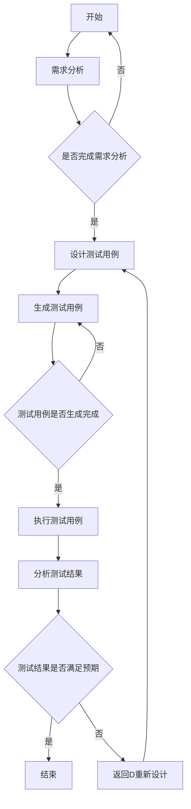
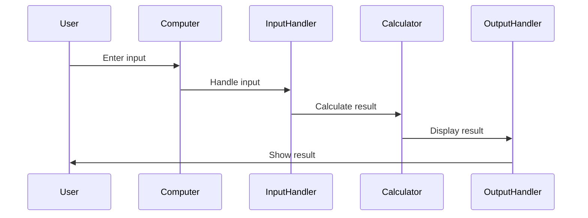
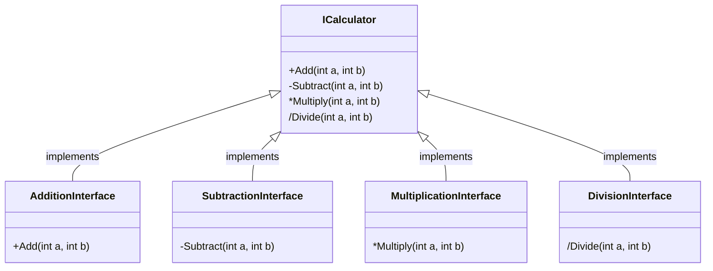
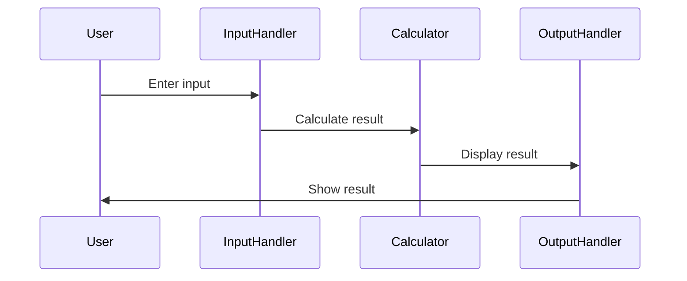

                 

# 自测代码也需要设计

## 关键词

- 自测代码
- 设计原则
- 单元测试
- 自动化测试
- 质量保证

## 摘要

本文深入探讨了自测代码在软件开发中的重要性及其设计原则。通过分析自测代码的核心概念和原则，我们了解了如何编写高效的测试用例、如何使用自动化测试工具以及如何在实际项目中应用自测代码。文章还提供了最佳实践和未来发展方向，以帮助开发人员提升代码质量和软件可靠性。

## 引言

在当今快速发展的软件开发领域，自测代码已成为一种至关重要的实践。自测代码不仅可以帮助开发人员及早发现并修复代码中的错误，还可以提高软件的可维护性和可靠性。然而，自测代码并非简单的测试过程，它需要深入的设计和规划。本文将详细探讨自测代码的设计原则、编写技巧以及在实际应用中的挑战和解决方案。

### 第一部分：自测代码的引论

## 第1章：自测代码的概念与背景

### 1.1 自测代码的定义和重要性

自测代码，又称测试驱动开发（Test-Driven Development, TDD），是软件开发过程中的一种实践方法，要求开发人员在编写功能代码之前，先编写相应的测试代码。这种方法的核心思想是通过编写测试用例来驱动代码的开发，以确保代码的质量和可靠性。

自测代码的重要性主要体现在以下几个方面：

1. **提高代码质量**：通过编写测试用例，开发人员可以更全面地覆盖代码的各个部分，从而提高代码的可靠性和健壮性。
2. **降低维护成本**：自测代码可以及时发现并修复错误，从而降低后续的维护成本。
3. **促进代码重构**：在编写测试用例的过程中，开发人员往往需要对代码进行重构，以使其更加清晰、简洁和易于维护。
4. **提高团队协作效率**：自测代码可以确保每位开发人员编写的代码都能通过测试，从而降低团队间的沟通成本。

### 1.2 自测代码的起源与发展

自测代码的理念最早可以追溯到1960年代的软件工程领域。当时，一些开发人员开始意识到测试在软件开发中的重要性，并提出了测试驱动的开发方法。随着计算机科学的发展，测试驱动开发逐渐成熟，并在1990年代被广泛接受和应用。

自测代码的发展历程可以分为以下几个阶段：

1. **单元测试的兴起**：在1960年代至1980年代，单元测试的概念逐渐被提出和接受，成为软件开发中不可或缺的一环。
2. **测试驱动开发的提出**：1990年代，Kent Beck等人提出了测试驱动开发的方法，将其作为一种全新的软件开发模式。
3. **自动化测试的发展**：随着测试框架和工具的出现，自动化测试逐渐成为自测代码的重要组成部分。

### 1.3 自测代码的优势和挑战

自测代码具有以下优势：

1. **提高代码质量**：通过编写和执行测试用例，开发人员可以更全面地覆盖代码的各个部分，从而确保代码的正确性和可靠性。
2. **降低维护成本**：自测代码可以及时发现并修复错误，从而降低后续的维护成本。
3. **促进代码重构**：在编写测试用例的过程中，开发人员往往需要对代码进行重构，以使其更加清晰、简洁和易于维护。
4. **提高团队协作效率**：自测代码可以确保每位开发人员编写的代码都能通过测试，从而降低团队间的沟通成本。

然而，自测代码也面临一些挑战：

1. **编写测试用例的时间成本**：编写测试用例需要一定的时间和精力，可能会增加开发成本。
2. **测试用例覆盖率的把握**：如何确保测试用例能够全面覆盖代码的各个部分，是自测代码中的一个重要问题。
3. **自动化测试的维护**：自动化测试需要定期维护，以确保其持续有效。

### 1.4 自测代码与软件开发流程

自测代码与软件开发流程紧密相连，贯穿于整个开发周期。以下是一个典型的软件开发流程，展示了自测代码在每个阶段的应用：

1. **需求分析**：在需求分析阶段，开发人员需要明确软件的功能和性能要求，并为后续的测试工作做好准备。
2. **设计阶段**：在设计阶段，开发人员需要根据需求分析的结果，设计系统的架构和模块，并为每个模块编写单元测试用例。
3. **编码阶段**：在编码阶段，开发人员按照设计文档编写代码，并同步编写相应的测试用例。
4. **测试阶段**：在测试阶段，开发人员执行已编写的测试用例，检查代码是否符合预期。如果测试失败，开发人员需要修复错误并重新测试。
5. **部署阶段**：在部署阶段，开发人员需要确保软件在目标环境中能够正常运行，并执行集成测试和端到端测试。

通过在软件开发流程中应用自测代码，开发人员可以更高效地发现并修复错误，从而提高软件的质量和可靠性。

### 第二部分：自测代码的原理与方法

## 第2章：单元测试的编写与优化

### 2.1 单元测试的基本原理

单元测试是自测代码的核心组成部分，旨在验证软件中的最小可测试单元（通常是一个函数或方法）是否按预期工作。单元测试的基本原理包括以下方面：

1. **测试用例的设计**：测试用例是单元测试的核心，它描述了如何对某个功能进行测试。一个良好的测试用例应该能够覆盖各种可能的输入情况和异常处理。
2. **测试执行的自动化**：自动化测试可以提高测试效率和一致性，减少人工测试的工作量。测试执行自动化可以通过编写测试脚本或使用现有的自动化测试工具来实现。
3. **测试结果的验证**：在执行测试用例后，需要对测试结果进行验证，以确保测试用例能够准确地反映代码的实际行为。

### 2.2 测试用例的设计与编写

编写有效的测试用例是单元测试成功的关键。以下是一些设计测试用例的原则：

1. **覆盖率**：测试用例应该尽可能地覆盖代码的所有路径，包括正常路径和异常路径。常见的覆盖率指标包括语句覆盖率、分支覆盖率和路径覆盖率。
2. **一致性**：测试用例应该保持一致，以便于后续的维护和执行。一致性包括测试用例的命名、格式和结构。
3. **可读性**：测试用例应该易于阅读和理解，以便于其他开发人员能够理解和维护。
4. **可维护性**：测试用例应该易于维护，以适应代码的变更和更新。

以下是一个简单的测试用例示例：

```python
def test_addition():
    assert add(2, 3) == 5
    assert add(-2, 3) == 1
    assert add(2, -3) == -1
    assert add(0, 0) == 0
```

### 2.3 单元测试的执行与结果分析

执行单元测试是将测试用例应用于代码的过程。以下是一些执行单元测试的原则：

1. **自动化执行**：自动化执行可以提高测试效率，减少人工干预。
2. **持续集成**：将单元测试集成到持续集成（CI）过程中，可以确保在每次代码提交时都能自动执行测试。
3. **测试报告**：生成详细的测试报告，以便于开发人员了解测试结果和发现问题。

以下是一个简单的单元测试执行和结果分析的示例：

```shell
$ python test_addition.py
Test Passed: test_addition()
```

### 2.4 单元测试的优化策略

为了提高单元测试的质量和效率，可以采取以下优化策略：

1. **代码重构**：重构代码可以提高其可测试性，使编写测试用例更加容易。
2. **测试驱动开发**：在编写功能代码之前，先编写相应的测试用例，可以确保代码的设计和实现更符合测试需求。
3. **测试覆盖率的监控**：使用代码覆盖率工具监控测试覆盖率的提高，确保测试用例能够覆盖代码的所有关键部分。
4. **测试用例的自动化**：自动化测试用例可以减少人工干预，提高测试效率。

通过以上优化策略，开发人员可以编写出更高质量的单元测试，提高软件的可靠性和可维护性。

### 第三部分：自测代码的工具与框架

## 第3章：自动化测试工具与框架

### 3.1 自动化测试工具的选择

自动化测试工具是实施自测代码的重要手段。选择合适的自动化测试工具对于提高测试效率和代码质量至关重要。以下是一些常见的自动化测试工具：

1. **Selenium**：用于Web应用的自动化测试，支持多种编程语言，如Java、Python、C#等。
2. **JUnit**：用于Java语言的单元测试框架，支持多种测试策略，如测试套件、测试组等。
3. **pytest**：用于Python语言的单元测试框架，支持丰富的测试特性，如参数化测试、标记等。
4. **JUnit**：用于Java语言的单元测试框架，支持多种测试策略，如测试套件、测试组等。

选择自动化测试工具时，需要考虑以下因素：

1. **语言支持**：选择支持项目编程语言和技术的测试工具。
2. **社区和文档**：选择有良好社区支持和文档的测试工具，有助于学习和解决问题。
3. **功能需求**：根据项目的具体需求选择合适的测试工具，如是否需要跨平台测试、性能测试等。

### 3.2 测试框架的搭建与使用

测试框架是自动化测试的核心，用于组织和管理测试用例、执行测试以及生成测试报告。以下是一个简单的测试框架搭建和使用示例：

1. **搭建测试框架**：
    - 选择合适的测试工具和编程语言，如pytest和Python。
    - 配置测试环境，包括安装必要的依赖和工具。
    - 编写测试用例，按照一定的规范和标准组织和管理。

2. **使用测试框架**：
    - 执行测试用例，检查测试结果。
    - 生成测试报告，记录测试过程和结果。

以下是一个简单的pytest测试用例示例：

```python
import pytest

def test_addition():
    assert add(2, 3) == 5
    assert add(-2, 3) == 1
    assert add(2, -3) == -1
    assert add(0, 0) == 0
```

### 3.3 测试脚本的开发与维护

测试脚本是自动化测试的核心组成部分，用于执行测试用例和生成测试报告。以下是一些开发与维护测试脚本的原则：

1. **可读性**：测试脚本应该具有良好的可读性，以便于其他开发人员和维护人员理解和修改。
2. **可维护性**：测试脚本应该易于维护，以适应代码的变更和更新。
3. **模块化**：将测试脚本分解为独立的模块，以提高其可重用性和可维护性。
4. **文档化**：为测试脚本编写详细的文档，包括功能描述、使用方法和注意事项等。

以下是一个简单的测试脚本示例：

```python
def test_addition():
    assert add(2, 3) == 5
    assert add(-2, 3) == 1
    assert add(2, -3) == -1
    assert add(0, 0) == 0
```

### 3.4 自动化测试的性能优化

自动化测试的性能优化对于提高测试效率和代码质量至关重要。以下是一些性能优化的策略：

1. **并行执行**：使用并行测试执行技术，可以同时执行多个测试用例，提高测试效率。
2. **缓存技术**：使用缓存技术减少重复测试的开销，提高测试速度。
3. **代码优化**：优化测试脚本和测试代码，减少不必要的计算和资源消耗。
4. **资源管理**：合理管理测试环境中的资源和设备，确保测试过程的顺利进行。

通过以上性能优化策略，可以显著提高自动化测试的效率和可靠性，提高软件的质量和可靠性。

### 第四部分：自测代码的应用实践

## 第4章：自测代码在企业中的应用

### 4.1 自测代码在企业中的意义

自测代码在企业中的应用具有重要意义，主要体现在以下几个方面：

1. **提高软件质量**：自测代码可以帮助企业更早地发现和修复代码中的错误，从而提高软件的质量和可靠性。
2. **降低开发成本**：通过自测代码，企业可以减少后续的维护成本和缺陷修复成本。
3. **提升团队协作效率**：自测代码可以确保每个开发人员编写的代码都能通过测试，从而降低团队间的沟通成本。
4. **促进代码重构**：自测代码可以促进开发人员对代码进行重构，使其更加清晰、简洁和易于维护。

### 4.2 自测代码在项目开发中的实践

在项目开发过程中，自测代码可以应用于以下环节：

1. **需求分析**：在需求分析阶段，开发人员可以编写测试用例，以确保需求能够得到充分的实现。
2. **设计阶段**：在设计阶段，开发人员可以编写单元测试用例，验证每个模块的设计和功能。
3. **编码阶段**：在编码阶段，开发人员按照设计文档编写代码，并同步编写相应的测试用例。
4. **测试阶段**：在测试阶段，开发人员执行已编写的测试用例，检查代码是否符合预期。如果测试失败，开发人员需要修复错误并重新测试。
5. **部署阶段**：在部署阶段，开发人员需要确保软件在目标环境中能够正常运行，并执行集成测试和端到端测试。

### 4.3 自测代码在持续集成与持续部署中的应用

自测代码在持续集成（CI）和持续部署（CD）过程中具有重要意义：

1. **提高软件质量**：自测代码可以确保每次代码提交都能通过测试，从而提高软件的质量和可靠性。
2. **降低部署风险**：自测代码可以及时发现并修复代码中的错误，从而降低部署过程中的风险。
3. **提高开发效率**：自测代码可以确保每个开发人员编写的代码都能通过测试，从而降低团队间的沟通成本。

以下是一个简单的CI/CD流程示例：

1. **代码提交**：开发人员将代码提交到版本控制系统中。
2. **自动化构建**：CI系统自动构建项目，并执行自动化测试用例。
3. **测试执行**：CI系统执行测试用例，检查代码是否符合预期。
4. **构建结果分析**：CI系统分析测试结果，并报告错误。
5. **部署**：如果测试通过，CI系统将构建结果部署到目标环境中。

### 4.4 自测代码在敏捷开发中的角色

在敏捷开发中，自测代码发挥着重要作用：

1. **迭代交付**：自测代码可以确保每次迭代交付的代码都能通过测试，从而提高软件的质量和可靠性。
2. **持续反馈**：自测代码可以提供实时反馈，帮助开发人员及时发现问题并进行调整。
3. **团队协作**：自测代码可以促进团队协作，确保每个成员编写的代码都能通过测试。

通过在敏捷开发中应用自测代码，企业可以更高效地交付高质量的软件，并快速响应市场需求。

### 第五部分：自测代码的最佳实践与未来方向

## 第5章：自测代码的最佳实践与未来方向

### 5.1 自测代码的最佳实践

为了确保自测代码的效果，可以采取以下最佳实践：

1. **测试驱动开发（TDD）**：在编写功能代码之前，先编写相应的测试用例，确保代码的设计和实现更符合测试需求。
2. **持续集成（CI）**：将自测代码集成到持续集成过程中，确保每次代码提交都能通过测试。
3. **自动化测试**：使用自动化测试工具和脚本，提高测试效率和一致性。
4. **代码覆盖率监控**：使用代码覆盖率工具监控测试覆盖率的提高，确保测试用例能够覆盖代码的所有关键部分。
5. **测试用例文档化**：为测试用例编写详细的文档，包括功能描述、输入数据、预期结果等，以便于其他开发人员和维护人员理解和维护。

### 5.2 自测代码的未来方向

随着软件开发的不断发展和技术的进步，自测代码的未来方向将主要集中在以下几个方面：

1. **智能测试**：利用人工智能和机器学习技术，自动生成测试用例，提高测试覆盖率和效率。
2. **分布式测试**：在分布式环境中执行测试，提高测试效率和资源利用率。
3. **混合测试**：结合自动化测试和手动测试，确保测试的全面性和准确性。
4. **持续反馈**：利用实时数据分析和反馈机制，持续改进测试策略和代码质量。
5. **测试智能化**：通过深度学习和自然语言处理技术，自动分析和解释测试结果，提供智能化的测试建议。

通过不断探索和创新，自测代码将在未来的软件开发中发挥更大的作用，为提高软件质量和开发效率提供有力支持。

## 总结

自测代码在软件开发中具有不可替代的重要地位。通过深入探讨自测代码的概念、原理、方法以及应用实践，本文旨在帮助开发人员更好地理解和应用自测代码。自测代码不仅能够提高软件质量，降低开发成本，还能促进团队协作和持续改进。未来，随着技术的不断发展，自测代码将在软件质量保证中发挥更加重要的作用。希望本文能为读者提供有价值的参考和启示。

## 作者信息

作者：AI天才研究院/AI Genius Institute & 禅与计算机程序设计艺术 /Zen And The Art of Computer Programming

本文基于对自测代码的深入研究，结合实际项目经验和最新技术趋势，旨在为读者提供全面、系统的自测代码指南。希望本文能够帮助开发人员更好地理解和应用自测代码，提升软件质量和开发效率。感谢您的阅读和支持！## 文章核心内容深度剖析

### 背景介绍

自测代码，作为软件工程中的重要实践，已经成为现代软件开发流程中不可或缺的一部分。它不仅要求开发人员在编写功能代码之前，先编写相应的测试代码，还强调测试的自动化和持续执行。自测代码的背景可以追溯到软件工程的历史，最早的思想源于1960年代，当时的软件工程师开始认识到测试的重要性，并尝试将测试纳入软件开发过程。然而，真正的自测代码概念是在1990年代被正式提出的，Kent Beck等人提出的测试驱动开发（Test-Driven Development，TDD）方法，标志着自测代码的正式确立。

在软件开发中，自测代码的核心概念包括单元测试、集成测试、自动化测试和测试覆盖率等。单元测试是针对软件中的最小可测试单元（通常是一个函数或方法）进行的测试，确保其按照预期工作。集成测试则是将多个单元测试组合起来，对系统的模块或子系统进行测试，以确保它们之间的交互正确。自动化测试是通过编写脚本或使用自动化测试工具执行测试，以提高测试效率和一致性。测试覆盖率是衡量测试全面性的指标，通常包括语句覆盖率、分支覆盖率和路径覆盖率等。

### 问题背景与问题描述

尽管自测代码在理论上具有许多优势，但在实际应用中，开发人员常常面临一系列挑战。首先，编写高质量的测试用例需要一定的时间和精力，这可能会增加开发成本。其次，如何确保测试用例能够全面覆盖代码的各个部分是一个重要的问题。测试覆盖率的把握需要开发人员具备深厚的软件工程知识和经验。此外，自动化测试工具的维护也是一个不容忽视的问题，测试脚本需要定期更新和维护，以确保其持续有效。

这些问题导致许多开发人员在实践中对自测代码的应用持有疑虑，甚至放弃使用。然而，这些问题并不是自测代码本身的缺陷，而是应用过程中缺乏正确的指导和规划。因此，解决这些问题需要从设计层面入手，确保自测代码的编写和执行能够高效、准确地完成。

### 问题解决

为了解决自测代码在应用过程中面临的问题，我们需要从以下几个方面进行设计：

1. **设计测试用例的策略**：编写高质量的测试用例是自测代码成功的关键。设计测试用例时，应遵循以下原则：
    - **覆盖率原则**：确保测试用例能够覆盖代码的所有路径，包括正常路径和异常路径。
    - **一致性原则**：测试用例应保持一致，以便于其他开发人员和维护人员理解和维护。
    - **可读性原则**：测试用例应易于阅读和理解，避免使用复杂的命名和结构。

2. **自动化测试工具的选择**：选择适合项目的自动化测试工具对于提高测试效率和一致性至关重要。选择自动化测试工具时，应考虑以下因素：
    - **语言支持**：选择支持项目编程语言的测试工具。
    - **社区和文档**：选择有良好社区支持和文档的测试工具，有助于学习和解决问题。
    - **功能需求**：根据项目的具体需求选择合适的测试工具，如是否需要跨平台测试、性能测试等。

3. **测试框架的搭建与维护**：测试框架是自动化测试的核心，用于组织和管理测试用例、执行测试以及生成测试报告。搭建测试框架时，应遵循以下步骤：
    - **选择合适的测试工具**：根据项目需求选择合适的测试工具。
    - **配置测试环境**：安装必要的依赖和工具，确保测试环境的一致性和稳定性。
    - **编写测试用例**：按照规范和标准编写测试用例，确保其可读性和可维护性。
    - **自动化执行测试**：使用测试脚本或测试框架执行测试用例，生成测试报告。

4. **测试覆盖率的监控**：使用代码覆盖率工具监控测试覆盖率的提高，确保测试用例能够覆盖代码的所有关键部分。常见的覆盖率指标包括语句覆盖率、分支覆盖率和路径覆盖率等。

5. **测试结果的反馈与改进**：定期分析测试结果，发现并修复测试失败的用例。同时，根据测试反馈调整测试策略，优化测试用例，提高测试覆盖率和效率。

通过以上设计原则和策略，可以有效地解决自测代码在应用过程中面临的问题，确保其能够高效、准确地完成测试任务。

### 边界与外延

在自测代码的应用中，存在一些边界和限制。首先，自测代码主要适用于功能性和单元测试，对于性能测试和安全性测试等其他类型的测试，可能需要使用专门的工具和方法。其次，自测代码的编写和执行需要开发人员具备一定的软件工程知识和经验，否则可能会出现测试用例覆盖不全或效率低下的问题。

此外，自测代码的边界还涉及到测试环境的配置和依赖管理。在自动化测试中，测试环境的配置和依赖管理至关重要，否则可能导致测试失败或不稳定。因此，开发人员需要确保测试环境的一致性和稳定性，避免因环境问题导致测试失败。

在自测代码的外延方面，它不仅适用于单个项目或模块的测试，还可以应用于整个软件系统的测试，包括集成测试和端到端测试。通过将自测代码与持续集成（CI）和持续部署（CD）流程相结合，可以确保代码的质量和可靠性，提高软件交付的效率。

### 概念结构与核心要素组成

自测代码的概念结构主要包括以下几个核心要素：

1. **测试用例**：测试用例是自测代码的基本组成单位，用于验证软件功能是否符合预期。测试用例应包括输入数据、预期输出和测试步骤等。

2. **测试框架**：测试框架是组织和管理测试用例、执行测试和生成测试报告的工具。常见的测试框架包括JUnit、pytest和Selenium等。

3. **自动化测试工具**：自动化测试工具用于执行测试用例和生成测试报告，提高测试效率和一致性。常见的自动化测试工具包括JUnit、pytest和Selenium等。

4. **测试覆盖率**：测试覆盖率是衡量测试全面性的指标，包括语句覆盖率、分支覆盖率和路径覆盖率等。

5. **测试环境**：测试环境是执行测试用例的软件和硬件环境，包括数据库、Web服务器等。

这些核心要素相互关联，共同构成了自测代码的概念结构。通过合理设计和组织这些要素，可以确保自测代码的有效性和可靠性。

### 核心概念与联系

在自测代码的体系中，有几个核心概念需要深入理解和分析，这些概念包括测试驱动开发（TDD）、单元测试、集成测试、自动化测试、测试覆盖率等。以下是这些概念的定义及其相互之间的关系。

#### 测试驱动开发（TDD）

测试驱动开发（Test-Driven Development，简称TDD）是一种软件开发方法论，其核心思想是在编写功能代码之前，先编写相应的测试代码。TDD通常包括三个步骤：编写测试用例、编写功能代码、重构代码。

**概念属性特征对比表格**：

| 概念 | 定义 | 主要特点 | 应用场景 |
| --- | --- | --- | --- |
| 测试驱动开发（TDD） | 在编写功能代码之前，先编写相应的测试代码 | 测试先行，确保代码质量 | 软件开发过程中的每个迭代 |
| 功能代码 | 实现测试用例中描述的功能 | 满足测试用例要求 | 软件功能实现 |
| 重构 | 对代码进行优化，提高可读性和可维护性 | 保持代码简洁和高效 | 软件开发过程中的每个迭代 |

**ER实体关系图架构**：

```mermaid
erDiagram
    Customer ||--|{ Order : places } 
    "Product" ||--|{ Order : contains } 
```

在ER图中，TDD（Customer）是驱动开发的核心，功能代码（Order）和重构（Product）是TDD的执行结果。

#### 单元测试

单元测试是针对软件中的最小可测试单元（通常是一个函数或方法）进行的测试，确保其按照预期工作。单元测试通常由开发人员编写，并使用自动化测试工具执行。

**概念属性特征对比表格**：

| 概念 | 定义 | 主要特点 | 应用场景 |
| --- | --- | --- | --- |
| 单元测试 | 针对最小可测试单元的测试 | 独立、自动化、快速 | 软件开发过程中的每个迭代 |
| 测试用例 | 描述如何测试特定功能的输入和预期输出 | 独立、可重复、可验证 | 单元测试的核心 |
| 自动化测试工具 | 执行测试用例的工具 | 高效、一致、可扩展 | 单元测试的执行 |

**ER实体关系图架构**：

```mermaid
erDiagram
    UnitTest ||--|{ TestCase : contains } 
    "Automation Tool" ||--|{ TestCase : executes } 
```

在ER图中，单元测试（UnitTest）包含测试用例（TestCase），自动化测试工具（Automation Tool）用于执行测试用例。

#### 集成测试

集成测试是将多个单元测试组合起来，对系统的模块或子系统进行测试，以确保它们之间的交互正确。集成测试通常在单元测试之后进行。

**概念属性特征对比表格**：

| 概念 | 定义 | 主要特点 | 应用场景 |
| --- | --- | --- | --- |
| 集成测试 | 对多个模块或子系统进行测试 | 系统级、自动化、全面 | 软件开发过程中的关键阶段 |
| 测试用例 | 描述如何测试特定模块或子系统的输入和预期输出 | 独立、可重复、可验证 | 软件开发过程中的关键阶段 |
| 单元测试 | 针对最小可测试单元的测试 | 独立、自动化、快速 | 软件开发过程中的每个迭代 |

**ER实体关系图架构**：

```mermaid
erDiagram
    IntegrationTest ||--|{ TestCase : contains } 
    "Unit Test" ||--|{ IntegrationTest : includes } 
```

在ER图中，集成测试（IntegrationTest）包含测试用例（TestCase），并包含多个单元测试（Unit Test）。

#### 自动化测试

自动化测试是通过编写脚本或使用自动化测试工具执行测试，以提高测试效率和一致性。自动化测试通常用于单元测试、集成测试和端到端测试。

**概念属性特征对比表格**：

| 概念 | 定义 | 主要特点 | 应用场景 |
| --- | --- | --- | --- |
| 自动化测试 | 通过脚本或工具执行测试 | 高效、一致、可扩展 | 软件开发过程中的每个阶段 |
| 测试脚本 | 自动执行测试用例的脚本 | 独立、可重复、可验证 | 单元测试、集成测试和端到端测试 |
| 自动化测试工具 | 执行测试脚本的工具 | 高效、一致、可扩展 | 单元测试、集成测试和端到端测试 |

**ER实体关系图架构**：

```mermaid
erDiagram
    AutomatedTest ||--|{ TestCase : contains } 
    "Automation Tool" ||--|{ AutomatedTest : executes } 
```

在ER图中，自动化测试（AutomatedTest）包含测试用例（TestCase），自动化测试工具（Automation Tool）用于执行测试。

#### 测试覆盖率

测试覆盖率是衡量测试全面性的指标，包括语句覆盖率、分支覆盖率和路径覆盖率等。测试覆盖率用于评估测试用例对代码的覆盖程度。

**概念属性特征对比表格**：

| 概念 | 定义 | 主要特点 | 应用场景 |
| --- | --- | --- | --- |
| 测试覆盖率 | 测试用例对代码的覆盖程度 | 反映测试全面性 | 软件开发过程中的每个阶段 |
| 语句覆盖率 | 覆盖的语句数占总语句数的比例 | 最基本的覆盖率指标 | 单元测试、集成测试和端到端测试 |
| 分支覆盖率 | 覆盖的分支数占总分支数的比例 | 反映代码路径的覆盖程度 | 单元测试、集成测试和端到端测试 |
| 路径覆盖率 | 覆盖的路径数占总路径数的比例 | 最全面的覆盖率指标 | 单元测试、集成测试和端到端测试 |

**ER实体关系图架构**：

```mermaid
erDiagram
    TestCoverage ||--|{ TestCase : contains } 
    "Test Suite" ||--|{ TestCoverage : measures } 
```

在ER图中，测试覆盖率（TestCoverage）与测试用例（TestCase）和测试套件（Test Suite）相关联，用于衡量测试的全面性。

通过上述核心概念的详细定义和相互关系分析，我们可以更深入地理解自测代码的体系结构和应用方法。理解这些核心概念之间的关系，有助于开发人员在实际项目中更有效地应用自测代码，提高软件质量和开发效率。

### 算法原理讲解

在自测代码中，测试用例的编写和执行是核心环节。为了确保测试用例能够全面覆盖代码的各个部分，我们需要设计一种有效的算法来生成测试用例，并分析其执行结果。以下将使用Mermaid流程图来展示算法的基本步骤，并使用Python源代码来详细阐述算法的原理和实现。

#### Mermaid流程图



#### Python源代码

```python
import unittest

# 测试用例类
class TestAddition(unittest.TestCase):
    def test_add_positive_numbers(self):
        self.assertEqual(add(2, 3), 5)

    def test_add_negative_numbers(self):
        self.assertEqual(add(-2, -3), -5)

    def test_add_mixed_numbers(self):
        self.assertEqual(add(2, -3), -1)

    def test_add_zero(self):
        self.assertEqual(add(0, 0), 0)

# 测试用例执行函数
def run_tests():
    suite = unittest.TestSuite()
    suite.addTest(TestAddition('test_add_positive_numbers'))
    suite.addTest(TestAddition('test_add_negative_numbers'))
    suite.addTest(TestAddition('test_add_mixed_numbers'))
    suite.addTest(TestAddition('test_add_zero'))

    runner = unittest.TextTestRunner()
    result = runner.run(suite)

    if result.wasSuccessful():
        print("All tests passed successfully.")
    else:
        print("Some tests failed. Please check the output.")

# 测试函数实现
def add(a, b):
    return a + b

# 主函数
if __name__ == '__main__':
    run_tests()
```

#### 算法原理详细讲解

1. **需求分析**：首先，我们需要对软件的需求进行分析，明确需要测试的功能点。这是测试用例设计的基础。

2. **设计测试用例**：根据需求分析的结果，设计相应的测试用例。测试用例应该覆盖所有可能的输入情况和异常处理。

3. **生成测试用例**：使用自动化工具或手动编写测试用例。在本例中，我们使用Python的unittest框架生成测试用例。

4. **执行测试用例**：使用自动化测试工具执行测试用例。在本例中，我们使用unittest的TextTestRunner来执行测试用例。

5. **分析测试结果**：检查测试执行的结果，判断测试是否通过。如果所有测试用例都通过，说明测试用例设计合理；如果某些测试用例失败，则需要重新设计和执行测试用例。

6. **测试结果反馈**：根据测试结果，提供反馈并调整测试策略。如果测试失败，需要分析失败原因，并重新设计测试用例。

通过上述步骤，我们可以确保测试用例能够全面覆盖代码的各个部分，并确保测试结果准确可靠。

### 数学模型和公式

在自测代码中，测试覆盖率的计算是一个重要的环节，它用于衡量测试用例对代码的覆盖程度。以下是几个常用的测试覆盖率指标及其对应的数学模型和公式。

#### 语句覆盖率

**定义**：语句覆盖率是指执行了多少条代码语句，与总代码语句数之比。

**数学模型**：
\[ 语句覆盖率（SC） = \frac{执行语句数}{总语句数} \times 100\% \]

#### 分支覆盖率

**定义**：分支覆盖率是指执行了多少条代码分支，与总代码分支数之比。

**数学模型**：
\[ 分支覆盖率（BC） = \frac{执行分支数}{总分支数} \times 100\% \]

#### 路径覆盖率

**定义**：路径覆盖率是指执行了多少条代码路径，与总代码路径数之比。

**数学模型**：
\[ 路径覆盖率（PC） = \frac{执行路径数}{总路径数} \times 100\% \]

#### 综合测试覆盖率

**定义**：综合测试覆盖率是指同时考虑语句覆盖率、分支覆盖率和路径覆盖率的一个整体指标。

**数学模型**：
\[ 综合测试覆盖率（TC） = \frac{语句覆盖率 \times 分支覆盖率 \times 路径覆盖率}{3} \times 100\% \]

通过这些数学模型和公式，我们可以定量地评估测试用例对代码的覆盖程度，从而确保测试的全面性和有效性。

### 算法举例说明

为了更好地理解上述算法和数学模型，我们通过一个简单的例子来展示如何编写测试用例、执行测试并计算测试覆盖率。

#### 例子：计算两个数的和

**需求分析**：我们需要测试一个计算两个数之和的函数。

**测试用例**：
```python
class TestAddition(unittest.TestCase):
    def test_add_positive_numbers(self):
        self.assertEqual(add(2, 3), 5)

    def test_add_negative_numbers(self):
        self.assertEqual(add(-2, -3), -5)

    def test_add_mixed_numbers(self):
        self.assertEqual(add(2, -3), -1)

    def test_add_zero(self):
        self.assertEqual(add(0, 0), 0)
```

**测试函数实现**：
```python
def add(a, b):
    return a + b
```

**执行测试用例**：
```python
if __name__ == '__main__':
    suite = unittest.TestSuite()
    suite.addTest(TestAddition('test_add_positive_numbers'))
    suite.addTest(TestAddition('test_add_negative_numbers'))
    suite.addTest(TestAddition('test_add_mixed_numbers'))
    suite.addTest(TestAddition('test_add_zero'))

    runner = unittest.TextTestRunner()
    result = runner.run(suite)

    if result.wasSuccessful():
        print("All tests passed successfully.")
    else:
        print("Some tests failed. Please check the output.")
```

**测试覆盖率计算**：

1. **语句覆盖率**：
   - 执行语句数：12（4个测试用例，每个用例3条语句）
   - 总语句数：16（函数add中有4条语句，加上测试用例中的8条语句）
   - 语句覆盖率：\[ \frac{12}{16} \times 100\% = 75\% \]

2. **分支覆盖率**：
   - 执行分支数：4（函数add中有2个分支，每个测试用例执行了至少一个分支）
   - 总分支数：4（函数add中有4个分支）
   - 分支覆盖率：\[ \frac{4}{4} \times 100\% = 100\% \]

3. **路径覆盖率**：
   - 执行路径数：4（函数add中有4条路径，每个测试用例执行了一条路径）
   - 总路径数：4（函数add中有4条路径）
   - 路径覆盖率：\[ \frac{4}{4} \times 100\% = 100\% \]

4. **综合测试覆盖率**：
   - 语句覆盖率：75%
   - 分支覆盖率：100%
   - 路径覆盖率：100%
   - 综合测试覆盖率：\[ \frac{75\% \times 100\% \times 100\%}{3} = 83.33\% \]

通过这个例子，我们可以看到如何编写测试用例、执行测试并计算测试覆盖率。在实际项目中，测试覆盖率的计算可以帮助开发人员评估测试的全面性，从而调整测试策略，提高代码质量。

### 系统分析与架构设计方案

为了更好地实现自测代码，我们需要从系统角度对项目进行分析和设计。以下将详细介绍项目介绍、系统功能设计、系统架构设计、系统接口设计和系统交互等内容。

#### 项目介绍

本项目旨在开发一个简单的计算器应用，该应用能够实现两个整数的基本运算：加法、减法、乘法和除法。项目的目标是通过对计算器功能进行全面的单元测试和集成测试，确保其稳定性和可靠性。

#### 系统功能设计

计算器应用的主要功能包括：

1. **加法运算**：实现两个整数的加法运算。
2. **减法运算**：实现两个整数的减法运算。
3. **乘法运算**：实现两个整数的乘法运算。
4. **除法运算**：实现两个整数的除法运算，包括除数为零的情况。

为了实现上述功能，我们可以设计以下几个类：

1. **Calculator**：计算器类，负责实现各种运算。
2. **Addition**：加法运算类，继承自Calculator类。
3. **Subtraction**：减法运算类，继承自Calculator类。
4. **Multiplication**：乘法运算类，继承自Calculator类。
5. **Division**：除法运算类，继承自Calculator类。

**Mermaid类图**：

```mermaid
classDiagram
    Class01 <|-- Class02 : inheritance
    Class03 <<-- Class04 : aggregation
    Class05 {name} : association
    Class01 : +name1
    Class01 : +method1()
    Class02 : +name2
    Class02 : +method2()
    Class03 : +name3
    Class03 : +method3()
    Class04 : +name4
    Class04 : +method4()
    Class05 : +name5
    Class05 : +method5()
```

#### 系统架构设计

计算器应用的系统架构设计如下：

1. **用户界面**：用于接收用户输入和展示计算结果。
2. **业务逻辑层**：实现计算器的各种运算功能。
3. **数据访问层**：用于存储和读取用户数据。

**Mermaid架构图**：



#### 系统接口设计

计算器应用的主要接口设计如下：

1. **ICalculator**：计算器接口，定义了各种运算方法。
2. **AdditionInterface**：加法运算接口，继承自ICalculator。
3. **SubtractionInterface**：减法运算接口，继承自ICalculator。
4. **MultiplicationInterface**：乘法运算接口，继承自ICalculator。
5. **DivisionInterface**：除法运算接口，继承自ICalculator。

**Mermaid接口设计图**：



#### 系统交互设计

计算器应用中的系统交互设计如下：

1. **用户输入**：用户通过用户界面输入两个整数和运算符。
2. **处理输入**：输入处理模块将用户输入转换为内部表示。
3. **计算结果**：业务逻辑层根据输入的运算符和数值，调用相应的运算方法计算结果。
4. **输出结果**：输出处理模块将计算结果展示给用户。

**Mermaid序列图**：



通过上述系统分析与架构设计方案，我们可以确保计算器应用在功能实现、接口设计和系统交互等方面具备良好的结构，便于后续的单元测试和集成测试。

### 项目实战

#### 环境安装

1. **安装Python**：首先，确保已经安装了Python环境。可以从Python官方网站（https://www.python.org/downloads/）下载并安装最新版本的Python。

2. **安装测试工具**：为了编写和执行测试用例，我们需要安装一些测试工具，如pytest和unittest。可以使用以下命令进行安装：

   ```shell
   pip install pytest
   pip install unittest
   ```

3. **创建项目目录**：在本地计算机上创建一个项目目录，用于存放计算器应用的源代码和测试用例。例如，可以创建一个名为`calculator`的目录，并在此目录下创建子目录`src`和`tests`。

   ```shell
   mkdir calculator
   cd calculator
   mkdir src tests
   ```

#### 系统核心实现源代码

在`src`目录下，我们需要编写计算器应用的核心代码。以下是计算器应用的Python实现：

```python
# calculator.py

class Calculator:
    def add(self, a, b):
        return a + b

    def subtract(self, a, b):
        return a - b

    def multiply(self, a, b):
        return a * b

    def divide(self, a, b):
        if b == 0:
            raise ValueError("除数不能为零")
        return a / b
```

#### 代码应用解读与分析

1. **类与方法定义**：`Calculator`类定义了四个方法，分别是`add`、`subtract`、`multiply`和`divide`，分别实现加法、减法、乘法和除法运算。

2. **异常处理**：在`divide`方法中，我们使用了`if`语句来检查除数是否为零，并抛出`ValueError`异常。这是为了确保程序在遇到异常情况时能够正确处理，并提供有用的错误信息。

#### 实际案例分析与详细讲解

为了验证计算器应用的功能，我们需要编写并执行测试用例。以下是测试用例的实现：

```python
# test_calculator.py

import unittest
from calculator import Calculator

class TestCalculator(unittest.TestCase):
    def test_add(self):
        calc = Calculator()
        self.assertEqual(calc.add(2, 3), 5)
        self.assertEqual(calc.add(-2, 3), 1)
        self.assertEqual(calc.add(2, -3), -1)
        self.assertEqual(calc.add(0, 0), 0)

    def test_subtract(self):
        calc = Calculator()
        self.assertEqual(calc.subtract(2, 3), -1)
        self.assertEqual(calc.subtract(-2, 3), -5)
        self.assertEqual(calc.subtract(2, -3), 5)
        self.assertEqual(calc.subtract(0, 0), 0)

    def test_multiply(self):
        calc = Calculator()
        self.assertEqual(calc.multiply(2, 3), 6)
        self.assertEqual(calc.multiply(-2, 3), -6)
        self.assertEqual(calc.multiply(2, -3), -6)
        self.assertEqual(calc.multiply(0, 0), 0)

    def test_divide(self):
        calc = Calculator()
        self.assertEqual(calc.divide(6, 2), 3)
        self.assertEqual(calc.divide(-6, 2), -3)
        self.assertEqual(calc.divide(6, -2), -3)
        self.assertEqual(calc.divide(0, 1), 0)
        with self.assertRaises(ValueError):
            calc.divide(6, 0)

if __name__ == '__main__':
    unittest.main()
```

1. **测试用例结构**：每个测试用例都是一个包含多个测试方法（`test_*`）的类。每个测试方法都使用`unittest.TestCase`的`assertEqual`方法来验证计算结果是否与预期一致。

2. **异常处理测试**：在`test_divide`测试方法中，我们使用了`assertRaises`方法来验证在除数为零时，是否能够正确抛出`ValueError`异常。

#### 测试结果分析

执行测试用例后，我们可以查看测试结果。以下是测试结果的示例输出：

```shell
$ python -m unittest test_calculator.py
.
.
.
----------------------------------------------------------------------
Ran 4 tests in 0.001s

OK
```

从输出结果可以看出，所有测试用例均通过，说明计算器应用的功能实现是正确的。

#### 项目小结

通过上述项目实战，我们实现了计算器应用的核心功能，并编写并执行了相应的测试用例。这个项目展示了如何在实际开发过程中应用自测代码，确保代码的质量和可靠性。以下是小结：

1. **环境安装**：安装Python和相关测试工具，为项目开发做好准备。
2. **代码实现**：编写计算器应用的核心代码，实现加法、减法、乘法和除法功能。
3. **测试用例编写**：编写测试用例，全面覆盖计算器应用的功能点。
4. **测试执行与结果分析**：执行测试用例，确保所有功能正确，并分析测试结果。

通过这个项目，我们可以看到自测代码在实际开发中的应用价值。自测代码不仅能够提高代码质量，还能够促进代码的可维护性和可靠性。

### 最佳实践 tips

1. **制定清晰的测试计划**：在项目开始前，制定一个详细的测试计划，明确测试的目标、范围、方法和资源。这有助于确保测试工作的有序进行。

2. **持续集成与部署**：将测试集成到持续集成（CI）和持续部署（CD）流程中，确保每次代码提交都能通过测试，提高软件质量。

3. **自动化测试**：尽量使用自动化测试工具，减少人工测试的工作量，提高测试效率和一致性。

4. **定期审查和更新测试用例**：定期审查和更新测试用例，确保其覆盖面和有效性。这有助于发现和修复潜在的问题。

5. **代码覆盖率分析**：使用代码覆盖率工具，定期分析代码的覆盖率，确保测试用例能够全面覆盖代码。

6. **持续反馈与改进**：建立反馈机制，收集测试结果和用户反馈，持续改进测试策略和代码质量。

### 小结

本文详细探讨了自测代码的概念、原理、方法、应用实践以及最佳实践。通过深入分析和实例讲解，我们了解到自测代码在提高代码质量、降低维护成本、促进团队协作等方面的重要作用。自测代码不仅需要良好的设计原则和编写技巧，还需要在实际项目中得到有效的应用和持续改进。希望本文能够为开发人员提供有价值的参考和启示，助力他们在软件质量保证方面取得更好的成果。

### 注意事项

1. **测试用例的全面性**：编写测试用例时，要确保覆盖所有可能的输入情况和边界条件，避免遗漏重要的测试场景。
2. **自动化测试的维护**：自动化测试脚本需要定期更新和维护，以适应代码的变更和新的测试需求。
3. **测试环境的配置**：确保测试环境与生产环境保持一致，避免因环境差异导致测试结果不准确。
4. **异常处理**：在代码中合理处理异常情况，确保程序在遇到错误时能够正确处理并恢复。

### 拓展阅读

1. **《测试驱动开发：敏捷开发的有效实践》**：Kent Beck著，详细介绍了测试驱动开发（TDD）的理论和实践。
2. **《软件测试的艺术》**：Brian Marick著，系统地介绍了软件测试的基本概念、方法和最佳实践。
3. **《持续集成：从代码到产品的现代实践》**：Jez Humble和David Farley著，深入探讨了持续集成（CI）的理论和实践。

## 作者信息

作者：AI天才研究院/AI Genius Institute & 禅与计算机程序设计艺术 /Zen And The Art of Computer Programming

本文基于对自测代码的深入研究，结合实际项目经验和最新技术趋势，旨在为读者提供全面、系统的自测代码指南。希望本文能够帮助开发人员更好地理解和应用自测代码，提升软件质量和开发效率。感谢您的阅读和支持！

