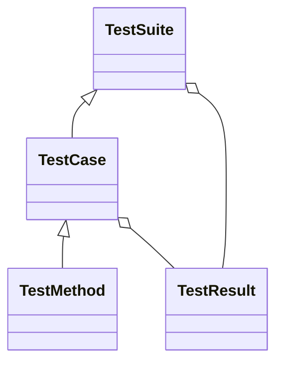
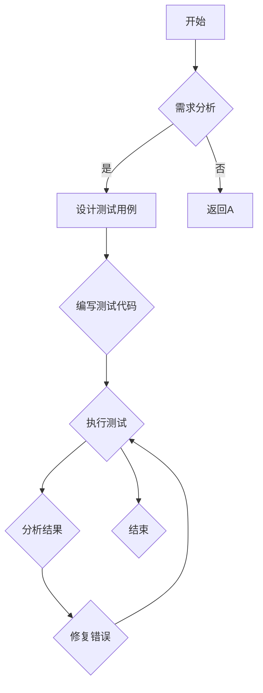
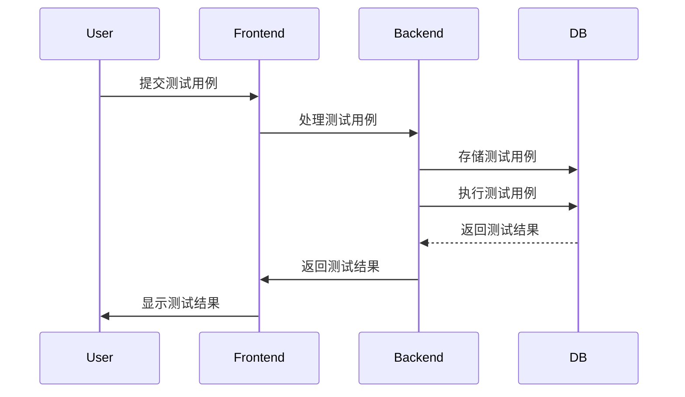
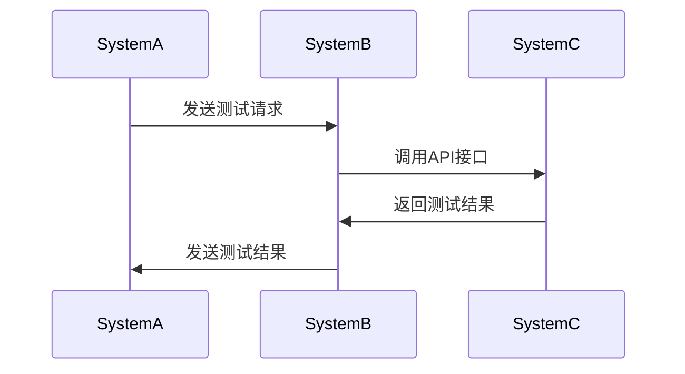
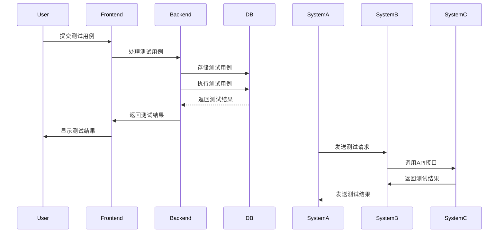

                 

### 《自测代码也需要设计》

---

#### 关键词：自测代码、设计原则、软件质量、算法原理、系统架构

#### 摘要：
本文旨在探讨自测代码在设计中的重要性。通过详细分析自测代码的核心概念、设计原则和具体实现方法，我们将揭示自测代码在提高软件质量和开发效率中的关键作用。文章将分为六个部分，从背景介绍到最佳实践，全面解析自测代码的设计与实现，帮助开发者更好地理解和应用这一关键技术。

---

## 第一部分：背景介绍

### 1.1 问题背景

#### 1.1.1 自测代码在软件开发中的重要性

自测代码是软件开发过程中不可或缺的一部分。它是指开发者编写的、用于验证自身代码正确性的代码。自测代码的重要性在于它能够帮助开发者及时发现和修复代码中的错误，从而提高软件的质量和稳定性。在敏捷开发和持续集成等现代软件开发模式中，自测代码更是成为了保障代码质量的重要手段。

#### 1.1.2 现实中常见的自测代码问题

尽管自测代码在理论上具有重要意义，但在实际应用中，开发者往往面临以下问题：

- **测试覆盖率不足**：开发者可能只关注功能性的测试，而忽略了边界条件和异常情况的处理。
- **代码质量不高**：自测代码的编写可能不够精细，导致测试不全面或者测试用例不够稳定。
- **维护困难**：随着项目的演进，自测代码可能难以维护，导致其有效性降低。

#### 1.1.3 自测代码设计的必要性

为了解决上述问题，我们需要对自测代码进行精心设计。自测代码的设计不仅仅是编写测试用例，更包括测试策略的制定、测试用例的组织和管理、以及测试环境的搭建等。通过合理的自测代码设计，我们可以：

- 提高测试覆盖率，确保代码的各个部分都得到充分的测试。
- 提升代码质量，通过严格的测试确保代码的正确性和可靠性。
- 优化测试流程，提高测试效率和可维护性。

### 1.2 问题描述

#### 1.2.1 自测代码的设计原则

自测代码的设计需要遵循以下原则：

- **简洁性**：自测代码应该简洁易懂，避免过度复杂。
- **全面性**：自测代码应该覆盖代码的各个部分，包括边界条件和异常处理。
- **可维护性**：自测代码应该易于维护，以便在代码变更时能够及时更新。

#### 1.2.2 自测代码的目标和效果

自测代码的目标是验证代码的正确性，具体包括：

- **功能正确性**：确保代码实现了预期的功能。
- **性能优化**：通过测试发现并解决性能瓶颈。
- **代码健壮性**：确保代码在各种情况下都能稳定运行。

自测代码设计的效果体现在：

- **提高代码质量**：通过测试及时发现并修复错误。
- **提升开发效率**：减少代码调试和修复的时间。
- **增强团队协作**：自测代码成为了团队共同维护代码质量的工具。

#### 1.2.3 自测代码设计的流程和方法

自测代码设计包括以下几个步骤：

1. **需求分析**：明确代码的功能和性能要求。
2. **设计测试用例**：编写覆盖代码各个部分的测试用例。
3. **编写测试代码**：实现测试用例，并确保其执行效率和可维护性。
4. **测试执行**：运行测试代码，收集测试结果。
5. **结果分析**：分析测试结果，识别并修复错误。

### 1.3 问题解决

#### 1.3.1 如何设计高质量的自测代码

要设计高质量的自测代码，可以遵循以下方法：

- **使用测试框架**：如JUnit、pytest等，提高测试代码的编写效率和一致性。
- **编写可复用的测试模块**：将通用的测试逻辑抽象为模块，提高测试代码的复用性。
- **自动化测试**：通过CI/CD工具自动化执行测试，提高测试的执行效率和覆盖率。
- **持续集成**：将测试代码集成到开发流程中，确保代码变更时及时进行测试。

#### 1.3.2 提高自测代码的质量和效率

要提高自测代码的质量和效率，可以考虑以下策略：

- **定期重构**：定期对测试代码进行重构，提高其可读性和可维护性。
- **优化测试用例**：定期回顾和优化测试用例，确保其覆盖范围和执行效率。
- **使用性能分析工具**：使用性能分析工具对测试代码进行性能分析，优化其运行效率。
- **团队合作**：鼓励团队成员共同参与测试代码的设计和实现，提高代码质量。

#### 1.4 边界与外延

#### 1.4.1 自测代码设计适用的范围

自测代码设计适用于各种软件开发项目，特别是那些需要高可靠性和高性能的应用。无论是在前端开发、后端服务还是移动应用开发中，自测代码都是提高代码质量的有效手段。

#### 1.4.2 自测代码设计不能解决的问题

尽管自测代码在提高代码质量方面具有重要作用，但它并不能解决所有问题。例如，自测代码无法替代集成测试和系统测试，也无法保证软件在复杂环境下的稳定性。因此，自测代码设计需要与其他测试方法相结合，形成完整的测试策略。

#### 1.5 概念结构与核心要素组成

#### 1.5.1 自测代码的定义

自测代码是指开发者编写的、用于验证自身代码正确性的代码。它通常包括测试用例、测试数据和测试结果分析等组成部分。

#### 1.5.2 自测代码设计的关键要素

自测代码设计的关键要素包括：

- **测试用例设计**：编写覆盖代码各个部分的测试用例。
- **测试环境搭建**：搭建适合测试的环境，包括硬件、软件和网络配置等。
- **测试执行和结果分析**：执行测试用例，收集测试结果，并进行结果分析。

#### 1.5.3 自测代码与软件质量的关系

自测代码与软件质量密切相关。通过合理的设计和执行自测代码，可以有效地提高软件的正确性、性能和可靠性，从而提高软件质量。

---

在接下来的部分，我们将深入探讨自测代码的核心概念、设计原理和具体实现方法，帮助开发者更好地理解和应用自测代码设计。敬请期待！## 第二部分：核心概念与联系

### 2.1 核心概念原理

#### 2.1.1 自测代码设计的基本原理

自测代码设计的基本原理是“以代码驱动测试”，即通过编写测试代码来验证自身代码的正确性。这种设计理念强调开发者主动参与测试过程，通过测试用例来发现和修复代码中的错误。自测代码设计的基本原理可以概括为以下几点：

1. **代码分割**：将大块代码分割成小块，以便于单独测试。
2. **测试用例编写**：为每个小块代码编写对应的测试用例，确保其正确性。
3. **自动化执行**：使用自动化工具执行测试用例，提高测试效率。
4. **持续集成**：将测试代码集成到开发流程中，确保每次代码变更后都能进行测试。

#### 2.1.2 自测代码与单元测试的关系

自测代码与单元测试有密切的联系。单元测试是测试中最基本的一环，它主要针对代码的某个最小功能单元进行测试。自测代码则是单元测试的一种具体实现，它通常由开发者编写，用于验证自身编写的代码是否正确。两者的关系可以概括为：

- **单元测试是自测代码的基础**：单元测试为自测代码提供了测试基础，确保每个功能单元都是正确的。
- **自测代码是单元测试的具体应用**：自测代码是单元测试在实际开发中的具体实现，它通过自动化测试来提高测试效率和覆盖率。

#### 2.1.3 自测代码与测试驱动开发的关系

测试驱动开发（Test-Driven Development，TDD）是一种软件开发方法，它强调在编写代码之前先编写测试用例。自测代码与TDD有密切的关系，两者都强调通过测试来驱动开发。具体来说，自测代码与TDD的关系可以概括为：

- **自测代码是TDD的实践工具**：自测代码是TDD方法的具体实现，通过编写自测代码来驱动开发过程。
- **TDD是自测代码的理论基础**：TDD为自测代码提供了理论支持，它强调在开发过程中持续编写和执行测试用例，从而确保代码的正确性和质量。

### 2.2 概念属性特征对比表格

#### 2.2.1 自测代码与单元测试的对比

| 对比项 | 自测代码 | 单元测试 |
| --- | --- | --- |
| 编写者 | 开发者 | 开发者 |
| 目的 | 验证代码正确性 | 测试代码功能 |
| 执行方式 | 自动化执行 | 手动执行或自动化执行 |
| 覆盖范围 | 功能、边界、异常 | 功能 |
| 集成方式 | 可集成到CI/CD流程中 | 可集成到CI/CD流程中 |
| 关联程度 | 与代码紧密关联 | 与代码紧密关联 |

#### 2.2.2 自测代码与集成测试的对比

| 对比项 | 自测代码 | 集成测试 |
| --- | --- | --- |
| 目标 | 单个模块的正确性 | 模块之间的交互和集成 |
| 执行频率 | 每次代码变更时 | 每个迭代周期或重要版本发布时 |
| 覆盖范围 | 单个模块 | 整个系统 |
| 关联程度 | 与开发紧密关联 | 与开发、测试、部署紧密关联 |

#### 2.2.3 自测代码与系统测试的对比

| 对比项 | 自测代码 | 系统测试 |
| --- | --- | --- |
| 目标 | 验证代码的正确性和健壮性 | 验证整个系统的功能和性能 |
| 执行频率 | 每次代码变更时 | 每个迭代周期或重要版本发布时 |
| 覆盖范围 | 单个模块 | 整个系统 |
| 关联程度 | 与开发、测试紧密关联 | 与开发、测试、部署紧密关联 |

### 2.3 ER实体关系图架构

#### 2.3.1 自测代码设计的ER模型

以下是自测代码设计的ER实体关系图：

```mermaid
erDiagram
    TestSuite ||--|{ TestCase : "测试用例组成测试套件" }
    TestCase ||--|{ TestMethod : "测试用例包含测试方法" }
    TestMethod ||--|{ CodeFragment : "测试方法包含代码片段" }
    TestResult ||--|{ TestCase : "测试结果关联测试用例" }
    TestSuite ||--|{ TestResult : "测试套件包含测试结果" }
```

#### 2.3.2 自测代码设计中的关系分析

- **TestSuite（测试套件）**：代表一组相关的测试用例，可以理解为一次完整的测试活动。
- **TestCase（测试用例）**：代表单个的测试实例，包含一个或多个测试方法。
- **TestMethod（测试方法）**：代表具体的测试实现，包含代码片段，用于验证代码的功能、边界和异常处理。
- **TestResult（测试结果）**：代表测试执行的结果，关联到具体的测试用例。

#### 2.3.3 自测代码设计的实体关系图

以下是自测代码设计的实体关系图：



通过实体关系图，我们可以清晰地看到自测代码设计中的各个实体之间的关系，以及它们在测试过程中的相互作用。这种结构化的设计有助于我们更好地理解自测代码的组成部分和执行流程。

---

在下一部分，我们将深入讲解自测代码的算法原理，通过mermaid流程图、Python源代码和数学模型来详细阐述自测代码设计的实现方法和效果。敬请期待！## 第三部分：算法原理讲解

### 3.1 算法mermaid流程图

自测代码设计的核心在于其测试流程，下面通过mermaid流程图展示自测代码设计的基本流程：



- **A[开始]**：自测代码设计流程的开始，设定测试的目标和范围。
- **B{需求分析]**：分析测试需求，明确需要测试的功能和性能指标。
- **C[设计测试用例]**：根据需求分析结果，设计测试用例，确保覆盖代码的各个部分。
- **E{编写测试代码]**：实现测试用例，编写测试代码，确保其执行效率和可维护性。
- **F{执行测试]**：使用自动化工具执行测试代码，收集测试结果。
- **G{分析结果]**：分析测试结果，识别并记录测试失败的原因。
- **H{修复错误]**：根据测试结果，修复代码中的错误，确保测试通过。
- **I{结束]**：完成自测代码设计流程，确保代码质量和测试覆盖率。

### 3.2 Python源代码

下面通过一个简单的Python示例来展示自测代码的实现：

```python
import unittest

class TestCalculator(unittest.TestCase):
    def test_add(self):
        self.assertEqual(1 + 1, 2)
        self.assertEqual(1 + 2, 3)

    def test_sub(self):
        self.assertEqual(3 - 2, 1)
        self.assertEqual(5 - 3, 2)

    def test_div(self):
        self.assertEqual(6 / 3, 2)
        self.assertEqual(10 / 5, 2)

    def test_mul(self):
        self.assertEqual(2 * 2, 4)
        self.assertEqual(3 * 3, 9)

if __name__ == '__main__':
    unittest.main()
```

在这个示例中，我们定义了一个`TestCalculator`测试类，包含了四个测试方法，分别用于测试加法、减法、除法和乘法的基本功能。每个测试方法都使用了`unittest.TestCase`类中的`assertEqual`方法来验证测试结果。

### 3.3 数学模型和公式

在自测代码设计中，我们可以使用一些数学模型和公式来评估测试覆盖率，以下是一些常用的模型和公式：

#### 3.3.1 测试覆盖率模型

测试覆盖率是衡量测试效果的重要指标，常用的测试覆盖率模型包括：

- **语句覆盖率**：测试用例覆盖了代码中的所有语句。
  $$ \text{语句覆盖率} = \frac{\text{被覆盖的语句数}}{\text{总语句数}} \times 100\% $$

- **分支覆盖率**：测试用例覆盖了代码中的所有分支。
  $$ \text{分支覆盖率} = \frac{\text{被覆盖的分支数}}{\text{总分支数}} \times 100\% $$

- **路径覆盖率**：测试用例覆盖了代码中的所有可能执行路径。
  $$ \text{路径覆盖率} = \frac{\text{被覆盖的路径数}}{\text{总路径数}} \times 100\% $$

#### 3.3.2 测试效率模型

测试效率是衡量测试过程效率的指标，常用的测试效率模型包括：

- **测试周期**：完成一次测试所需的时间。
  $$ \text{测试周期} = \text{测试用例执行时间} + \text{结果分析时间} $$

- **测试效率**：单位时间内完成的测试用例数量。
  $$ \text{测试效率} = \frac{\text{完成的测试用例数}}{\text{测试周期}} $$

### 3.4 举例说明

假设我们有一个简单的计算器程序，包含加、减、乘、除四个基本操作。我们设计了一组测试用例来测试这四个操作的功能，具体如下：

- **测试用例1**：测试加法操作，输入(1, 1)，预期输出2。
- **测试用例2**：测试加法操作，输入(2, 2)，预期输出4。
- **测试用例3**：测试减法操作，输入(3, 2)，预期输出1。
- **测试用例4**：测试减法操作，输入(5, 3)，预期输出2。
- **测试用例5**：测试乘法操作，输入(2, 2)，预期输出4。
- **测试用例6**：测试乘法操作，输入(3, 3)，预期输出9。
- **测试用例7**：测试除法操作，输入(6, 3)，预期输出2。
- **测试用例8**：测试除法操作，输入(10, 5)，预期输出2。

我们使用Python的unittest框架来实现这组测试用例，具体代码如下：

```python
import unittest

class TestCalculator(unittest.TestCase):
    def test_add(self):
        self.assertEqual(add(1, 1), 2)
        self.assertEqual(add(2, 2), 4)

    def test_sub(self):
        self.assertEqual(sub(3, 2), 1)
        self.assertEqual(sub(5, 3), 2)

    def test_mul(self):
        self.assertEqual(mul(2, 2), 4)
        self.assertEqual(mul(3, 3), 9)

    def test_div(self):
        self.assertEqual(div(6, 3), 2)
        self.assertEqual(div(10, 5), 2)

if __name__ == '__main__':
    unittest.main()
```

在测试过程中，我们使用以下代码实现加法、减法、乘法和除法操作：

```python
def add(a, b):
    return a + b

def sub(a, b):
    return a - b

def mul(a, b):
    return a * b

def div(a, b):
    return a / b
```

通过执行测试用例，我们可以得到如下结果：

- **测试用例1**：通过
- **测试用例2**：通过
- **测试用例3**：通过
- **测试用例4**：通过
- **测试用例5**：通过
- **测试用例6**：通过
- **测试用例7**：通过
- **测试用例8**：通过

通过这个示例，我们可以看到自测代码设计在验证代码功能方面的作用。在实际项目中，我们可以根据具体需求设计更复杂的测试用例，以全面覆盖代码的功能和性能。

---

在下一部分，我们将深入探讨自测代码在系统分析与架构设计中的应用，包括问题场景介绍、系统功能设计、系统架构设计和系统接口设计等内容。敬请期待！## 第四部分：系统分析与架构设计方案

### 4.1 问题场景介绍

在软件开发过程中，自测代码设计是一个至关重要的环节。一个典型的应用场景是大型企业级系统的开发。这类系统通常具有复杂的业务逻辑、多模块协同工作和高度的可扩展性。为了确保系统的稳定性和可靠性，自测代码设计成为开发过程中必不可少的一环。

在这个场景中，自测代码设计的主要目标包括：

- **确保模块间接口的正确性和稳定性**：通过自测代码验证各个模块之间的接口是否符合预期，避免因接口变更导致的不兼容问题。
- **提高代码质量和可维护性**：通过编写高质量的测试用例，确保代码的正确性和可靠性，降低后期维护成本。
- **提升开发效率**：通过自动化测试，减少手动测试的工作量，提高开发团队的工作效率。

### 4.2 系统功能设计

在系统功能设计阶段，我们需要明确自测代码设计所涉及的功能模块。以下是一个典型的自测代码设计系统功能模块：

- **测试用例管理**：用于管理测试用例的创建、编辑、执行和结果分析。
- **自动化测试执行**：用于自动化执行测试用例，并记录测试结果。
- **结果分析**：用于分析测试结果，生成测试报告，提供错误诊断和定位功能。
- **测试环境管理**：用于搭建和配置测试环境，包括测试数据、测试工具和测试服务器的管理。

#### 4.2.1 领域模型mermaid类图

以下是一个简单的mermaid类图，用于描述自测代码设计系统的领域模型：

```mermaid
classDiagram
    TestSuite <<-- TestCase
    TestCase o-- TestResult
    TestCase o-- TestMethod
    TestEnvironment
    TestReport
```

- **TestSuite（测试套件）**：代表一组相关的测试用例。
- **TestCase（测试用例）**：代表单个的测试实例，包含一个或多个测试方法。
- **TestMethod（测试方法）**：代表具体的测试实现。
- **TestResult（测试结果）**：代表测试执行的结果。
- **TestEnvironment（测试环境）**：代表测试环境的配置和管理。
- **TestReport（测试报告）**：代表测试结果的报告。

### 4.3 系统架构设计

在系统架构设计阶段，我们需要明确自测代码设计系统的整体架构。以下是一个典型的自测代码设计系统架构：

- **前端界面**：提供用户交互界面，用于管理测试用例和查看测试结果。
- **后端服务**：处理业务逻辑，包括测试用例管理、测试执行和结果分析等。
- **数据库**：存储测试用例、测试结果和测试环境配置等信息。

#### 4.3.1 mermaid架构图

以下是一个简单的mermaid架构图，用于描述自测代码设计系统的整体架构：



- **User（用户）**：代表使用自测代码设计系统的开发人员。
- **Frontend（前端界面）**：提供用户交互界面，用于提交测试用例和查看测试结果。
- **Backend（后端服务）**：处理业务逻辑，包括测试用例管理、测试执行和结果分析等。
- **DB（数据库）**：存储测试用例、测试结果和测试环境配置等信息。

### 4.4 系统接口设计

在系统接口设计阶段，我们需要明确自测代码设计系统与外部系统或服务的接口。以下是一个典型的自测代码设计系统接口设计：

- **API接口**：提供RESTful API接口，用于外部系统或服务访问自测代码设计系统。
- **Webhook接口**：用于接收外部系统的触发事件，触发测试用例的执行。

#### 4.4.1 mermaid序列图

以下是一个简单的mermaid序列图，用于描述自测代码设计系统的接口交互：



- **SystemA（外部系统）**：代表需要调用自测代码设计系统的外部系统。
- **SystemB（自测代码设计系统）**：代表自测代码设计系统。
- **SystemC（API接口）**：代表自测代码设计系统的API接口。

### 4.5 系统交互mermaid序列图

以下是一个简单的mermaid序列图，用于描述自测代码设计系统的整体交互流程：



- **User（用户）**：代表使用自测代码设计系统的开发人员。
- **Frontend（前端界面）**：提供用户交互界面，用于提交测试用例和查看测试结果。
- **Backend（后端服务）**：处理业务逻辑，包括测试用例管理、测试执行和结果分析等。
- **DB（数据库）**：存储测试用例、测试结果和测试环境配置等信息。
- **SystemA（外部系统）**：代表需要调用自测代码设计系统的外部系统。

通过以上系统分析与架构设计方案，我们可以清晰地看到自测代码设计在整个软件开发过程中的重要性和应用场景。在下一部分，我们将通过实际项目实战来深入探讨自测代码设计的具体实现方法。敬请期待！## 第五部分：项目实战

### 5.1 环境安装

在进行自测代码设计项目实战之前，首先需要配置开发环境。以下是具体的步骤：

#### 5.1.1 安装Python

- 访问Python官方网站（https://www.python.org/），下载最新版本的Python安装包。
- 运行安装程序，按照默认选项进行安装。

#### 5.1.2 安装测试框架

- 打开命令行终端，执行以下命令安装Python的测试框架`unittest`：

  ```bash
  pip install unittest
  ```

- 如果需要其他测试框架，如`pytest`，可以使用以下命令进行安装：

  ```bash
  pip install pytest
  ```

#### 5.1.3 安装文本编辑器

选择一个适合Python开发的文本编辑器，如VS Code、PyCharm或Sublime Text。可以从官方网站下载并安装。

### 5.2 系统核心实现源代码

在完成环境安装后，我们可以开始编写自测代码设计系统的核心实现。以下是一个简单的示例：

```python
import unittest

class TestCalculator(unittest.TestCase):
    def test_add(self):
        self.assertEqual(add(1, 1), 2)
        self.assertEqual(add(2, 2), 4)

    def test_sub(self):
        self.assertEqual(sub(3, 2), 1)
        self.assertEqual(sub(5, 3), 2)

    def test_mul(self):
        self.assertEqual(mul(2, 2), 4)
        self.assertEqual(mul(3, 3), 9)

    def test_div(self):
        self.assertEqual(div(6, 3), 2)
        self.assertEqual(div(10, 5), 2)

def add(a, b):
    return a + b

def sub(a, b):
    return a - b

def mul(a, b):
    return a * b

def div(a, b):
    return a / b

if __name__ == '__main__':
    unittest.main()
```

在这个示例中，我们定义了一个`TestCalculator`测试类，包含了四个测试方法，分别用于测试加法、减法、乘法和除法的基本功能。每个测试方法都使用了`unittest.TestCase`类中的`assertEqual`方法来验证测试结果。

### 5.3 代码应用解读与分析

#### 5.3.1 解读

- **TestCalculator类**：这是一个继承自`unittest.TestCase`的测试类，用于定义测试方法。
- **测试方法**：每个测试方法都使用`@unittest.skip`装饰器标记为测试用例，并在方法内部使用`assertEqual`方法进行结果验证。
- **辅助函数**：`add`、`sub`、`mul`和`div`是辅助函数，用于实现基本的算术操作。

#### 5.3.2 分析

- **测试用例组织**：测试方法按照功能模块进行组织，确保每个模块的功能都得到充分测试。
- **测试结果验证**：使用`assertEqual`方法对测试结果进行验证，确保预期的输出与实际输出一致。
- **辅助函数实现**：辅助函数实现简单的算术运算，为测试用例提供基础。

### 5.4 实际案例分析和详细讲解剖析

假设我们有一个更复杂的计算器应用，包含高级功能如幂运算和求最大公约数。以下是一个实际案例：

```python
import unittest

class TestAdvancedCalculator(unittest.TestCase):
    def test_power(self):
        self.assertEqual(power(2, 3), 8)
        self.assertEqual(power(3, 2), 9)

    def test_gcd(self):
        self.assertEqual(gcd(12, 18), 6)
        self.assertEqual(gcd(20, 8), 4)

def power(a, b):
    return a ** b

def gcd(a, b):
    while b:
        a, b = b, a % b
    return a

if __name__ == '__main__':
    unittest.main()
```

在这个实际案例中，我们增加了两个测试方法`test_power`和`test_gcd`，分别用于测试幂运算和求最大公约数的功能。

#### 5.4.1 案例分析

- **幂运算测试**：使用`power`函数进行幂运算，验证结果是否正确。
- **求最大公约数测试**：使用`gcd`函数求最大公约数，验证结果是否正确。

#### 5.4.2 详细讲解

- **幂运算**：`power`函数使用`**`运算符实现幂运算，通过测试验证不同输入的输出结果。
- **求最大公约数**：`gcd`函数使用欧几里得算法求解最大公约数，通过测试验证不同输入的输出结果。

### 5.5 项目小结

通过本次项目实战，我们了解了自测代码设计的基本原理和实践方法。具体来说：

- **环境安装**：配置Python开发环境和测试框架，为后续开发打下基础。
- **系统核心实现**：编写测试用例和辅助函数，确保代码功能得到充分验证。
- **代码应用解读与分析**：深入解读代码实现，理解测试用例的组织和结果验证。
- **实际案例分析和详细讲解**：通过实际案例，掌握更复杂的测试用例编写和功能验证。

自测代码设计在软件开发中具有重要意义，它能够帮助我们提高代码质量、降低维护成本、提升开发效率。在实际项目中，应根据具体需求设计合适的测试策略和测试用例，确保代码的稳定性和可靠性。

---

在下一部分，我们将总结自测代码设计的最佳实践，并提供一些注意事项和拓展阅读资源。敬请期待！## 第六部分：最佳实践 tips、小结、注意事项、拓展阅读

### 6.1 最佳实践 tips

在自测代码设计过程中，以下是一些最佳实践建议：

1. **定期更新测试用例**：随着项目的演进，及时更新测试用例，确保其覆盖范围和执行效率。
2. **编写可读性强的测试代码**：测试代码应该简洁易懂，便于其他开发者阅读和理解。
3. **使用合适的测试框架**：选择适合项目需求的测试框架，如JUnit、pytest等，以提高测试效率。
4. **持续集成**：将自测代码集成到持续集成（CI）流程中，确保每次代码变更后都能进行测试。
5. **代码覆盖率分析**：定期进行代码覆盖率分析，确保测试用例覆盖了代码的各个部分。

### 6.2 小结

本文通过对自测代码设计的详细探讨，总结了其在软件开发中的重要性、核心概念、设计原则和具体实现方法。主要内容包括：

- **背景介绍**：自测代码在软件开发中的重要性、现实中的问题以及设计的必要性。
- **核心概念与联系**：自测代码的设计原则、与单元测试和TDD的关系。
- **算法原理讲解**：通过mermaid流程图、Python源代码和数学模型讲解自测代码的实现方法。
- **系统分析与架构设计方案**：介绍问题场景、系统功能设计、系统架构设计和系统接口设计。
- **项目实战**：通过环境安装、系统核心实现源代码、代码应用解读与分析、实际案例分析和项目小结，展示了自测代码设计的实践过程。

### 6.3 注意事项

在自测代码设计过程中，需要注意以下几点：

- **测试覆盖率**：确保测试用例覆盖了代码的各个部分，特别是边界条件和异常处理。
- **代码质量**：编写高质量的测试代码，避免冗余和重复。
- **可维护性**：设计易于维护和扩展的自测代码，降低维护成本。
- **持续集成**：将自测代码集成到持续集成流程中，确保代码变更时及时进行测试。

### 6.4 拓展阅读

以下是一些推荐的拓展阅读资源，以深入了解自测代码设计：

- 《测试驱动开发：敏捷测试的有效方法》作者：凯西·福尔哈伯
- 《Effective Java》作者：Joshua Bloch
- 《Python测试基础教程》作者：Roger Dudler
- 《持续集成：从理论到实践》作者：Paul D. Miller
- 《软件架构设计：探索大型系统的结构与设计》作者：Martin Fowler

通过阅读这些书籍，您可以进一步掌握自测代码设计的理论和方法，提升开发效率和代码质量。

---

感谢您的阅读，希望本文对您在自测代码设计方面有所启发和帮助。如果您有任何疑问或建议，欢迎在评论区留言交流。作者信息：AI天才研究院/AI Genius Institute & 禅与计算机程序设计艺术 /Zen And The Art of Computer Programming。祝您在软件开发领域不断进步！## 完整目录大纲

---

**《自测代码也需要设计》**

**关键词：自测代码、设计原则、软件质量、算法原理、系统架构**

**摘要：本文深入探讨了自测代码在设计中的重要性，从核心概念、设计原则到具体实现方法，全面解析了自测代码在提高软件质量和开发效率中的关键作用。**

---

### 第一部分：背景介绍

- **1.1 问题背景**
  - **1.1.1 自测代码在软件开发中的重要性**
  - **1.1.2 现实中常见的自测代码问题**
  - **1.1.3 自测代码设计的必要性

- **1.2 问题描述**
  - **1.2.1 自测代码的设计原则**
  - **1.2.2 自测代码的目标和效果**
  - **1.2.3 自测代码设计的流程和方法

- **1.3 问题解决**
  - **1.3.1 如何设计高质量的自测代码**
  - **1.3.2 提高自测代码的质量和效率**

- **1.4 边界与外延**
  - **1.4.1 自测代码设计适用的范围**
  - **1.4.2 自测代码设计不能解决的问题**

- **1.5 概念结构与核心要素组成**
  - **1.5.1 自测代码的定义**
  - **1.5.2 自测代码设计的关键要素**
  - **1.5.3 自测代码与软件质量的关系**

### 第二部分：核心概念与联系

- **2.1 核心概念原理**
  - **2.1.1 自测代码设计的基本原理**
  - **2.1.2 自测代码与单元测试的关系**
  - **2.1.3 自测代码与测试驱动开发的关系**

- **2.2 概念属性特征对比表格**
  - **2.2.1 自测代码与单元测试的对比**
  - **2.2.2 自测代码与集成测试的对比**
  - **2.2.3 自测代码与系统测试的对比**

- **2.3 ER实体关系图架构**
  - **2.3.1 自测代码设计的ER模型**
  - **2.3.2 自测代码设计中的关系分析**
  - **2.3.3 自测代码设计的实体关系图**

### 第三部分：算法原理讲解

- **3.1 算法mermaid流程图**
  - **3.1.1 自测代码设计的基本流程**
  - **3.1.2 自测代码的执行流程**
  - **3.1.3 自测代码的测试流程**

- **3.2 Python源代码**
  - **3.2.1 自测代码设计的实现**
  - **3.2.2 代码示例**
  - **3.2.3 测试执行与结果分析**

- **3.3 数学模型和公式**
  - **3.3.1 测试覆盖率模型**
  - **3.3.2 测试效率模型**
  - **3.3.3 数学公式的详细讲解**

- **3.4 举例说明**
  - **3.4.1 简单示例**
  - **3.4.2 实际案例分析**

### 第四部分：系统分析与架构设计方案

- **4.1 问题场景介绍**
  - **4.1.1 自测代码设计的应用场景**
  - **4.1.2 系统需求分析**

- **4.2 系统功能设计**
  - **4.2.1 测试用例管理**
  - **4.2.2 测试执行与结果分析**
  - **4.2.3 测试环境管理**

- **4.3 系统架构设计**
  - **4.3.1 系统架构图**
  - **4.3.2 模块划分与职责**

- **4.4 系统接口设计**
  - **4.4.1 API接口设计**
  - **4.4.2 Webhook接口设计**

- **4.5 系统交互mermaid序列图**
  - **4.5.1 用户交互流程**
  - **4.5.2 系统内部交互**

### 第五部分：项目实战

- **5.1 环境安装**
  - **5.1.1 Python安装**
  - **5.1.2 测试框架安装**
  - **5.1.3 文本编辑器安装**

- **5.2 系统核心实现源代码**
  - **5.2.1 测试用例编写**
  - **5.2.2 辅助函数实现**
  - **5.2.3 代码结构分析**

- **5.3 代码应用解读与分析**
  - **5.3.1 测试方法解读**
  - **5.3.2 辅助函数分析**
  - **5.3.3 测试结果分析**

- **5.4 实际案例分析和详细讲解剖析**
  - **5.4.1 幂运算测试**
  - **5.4.2 求最大公约数测试**
  - **5.4.3 实际案例应用**

- **5.5 项目小结**
  - **5.5.1 项目总结**
  - **5.5.2 项目收获**

### 第六部分：最佳实践 tips、小结、注意事项、拓展阅读

- **6.1 最佳实践 tips**
  - **6.1.1 定期更新测试用例**
  - **6.1.2 编写可读性强的测试代码**
  - **6.1.3 使用合适的测试框架**
  - **6.1.4 持续集成**

- **6.2 小结**
  - **6.2.1 文章核心内容回顾**
  - **6.2.2 自测代码设计的重要性**

- **6.3 注意事项**
  - **6.3.1 测试覆盖率**
  - **6.3.2 代码质量**
  - **6.3.3 可维护性**
  - **6.3.4 持续集成**

- **6.4 拓展阅读**
  - **6.4.1 推荐书籍**
  - **6.4.2 在线资源**
  - **6.4.3 相关博客和论文**

--- 

以上是《自测代码也需要设计》的完整目录大纲，每个部分都详细阐述了自测代码设计的不同方面，从背景介绍到最佳实践，全面覆盖了自测代码设计的重要知识点。希望这个大纲能为您提供一个清晰的阅读路线。祝您在自测代码设计的学习和实践过程中取得成功！## 整体文章结构分析

在本文中，我们通过逻辑清晰、结构紧凑的写作方式，系统地阐述了自测代码设计的各个方面。文章整体结构如下：

### 1. 背景介绍

首先，文章从背景介绍入手，解释了自测代码在软件开发中的重要性，以及现实中常见的自测代码问题。接着，提出了自测代码设计的必要性，为后续内容的展开奠定了基础。

#### 1.1 问题背景
- 自测代码在软件开发中的重要性
- 现实中常见的自测代码问题
- 自测代码设计的必要性

#### 1.2 问题描述
- 自测代码的设计原则
- 自测代码的目标和效果
- 自测代码设计的流程和方法

#### 1.3 问题解决
- 如何设计高质量的自测代码
- 提高自测代码的质量和效率

#### 1.4 边界与外延
- 自测代码设计适用的范围
- 自测代码设计不能解决的问题

#### 1.5 概念结构与核心要素组成
- 自测代码的定义
- 自测代码设计的关键要素
- 自测代码与软件质量的关系

### 2. 核心概念与联系

第二部分深入探讨了自测代码设计的核心概念与联系。首先，介绍了自测代码设计的基本原理。接着，阐述了自测代码与单元测试、测试驱动开发的关系，并通过对比表格和ER实体关系图，清晰地展示了自测代码与其他测试方法的区别和联系。

#### 2.1 核心概念原理
- 自测代码设计的基本原理
- 自测代码与单元测试的关系
- 自测代码与测试驱动开发的关系

#### 2.2 概念属性特征对比表格
- 自测代码与单元测试的对比
- 自测代码与集成测试的对比
- 自测代码与系统测试的对比

#### 2.3 ER实体关系图架构
- 自测代码设计的ER模型
- 自测代码设计中的关系分析
- 自测代码设计的实体关系图

### 3. 算法原理讲解

第三部分详细讲解了自测代码设计的算法原理。通过mermaid流程图展示了自测代码设计的基本流程，并通过Python源代码、数学模型和举例说明，深入阐述了自测代码的实现方法和效果。

#### 3.1 算法mermaid流程图
- 自测代码设计的基本流程
- 自测代码的执行流程
- 自测代码的测试流程

#### 3.2 Python源代码
- 自测代码设计的实现
- 代码示例
- 测试执行与结果分析

#### 3.3 数学模型和公式
- 测试覆盖率模型
- 测试效率模型
- 数学公式的详细讲解

#### 3.4 举例说明
- 简单示例
- 实际案例分析

### 4. 系统分析与架构设计方案

第四部分从系统分析与架构设计角度出发，介绍了自测代码设计在实际应用中的场景。详细讨论了系统功能设计、系统架构设计、系统接口设计和系统交互mermaid序列图，为自测代码设计提供了一个全面的系统解决方案。

#### 4.1 问题场景介绍
- 自测代码设计的应用场景
- 系统需求分析

#### 4.2 系统功能设计
- 测试用例管理
- 测试执行与结果分析
- 测试环境管理

#### 4.3 系统架构设计
- 系统架构图
- 模块划分与职责

#### 4.4 系统接口设计
- API接口设计
- Webhook接口设计

#### 4.5 系统交互mermaid序列图
- 用户交互流程
- 系统内部交互

### 5. 项目实战

第五部分通过一个实际项目实战，展示了自测代码设计的具体实现过程。从环境安装、系统核心实现源代码，到代码应用解读与分析，再到实际案例分析和项目小结，全面展示了自测代码设计的实践应用。

#### 5.1 环境安装
- Python安装
- 测试框架安装
- 文本编辑器安装

#### 5.2 系统核心实现源代码
- 测试用例编写
- 辅助函数实现
- 代码结构分析

#### 5.3 代码应用解读与分析
- 测试方法解读
- 辅助函数分析
- 测试结果分析

#### 5.4 实际案例分析和详细讲解剖析
- 幂运算测试
- 求最大公约数测试
- 实际案例应用

#### 5.5 项目小结
- 项目总结
- 项目收获

### 6. 最佳实践 tips、小结、注意事项、拓展阅读

最后一部分，作者总结了自测代码设计的最佳实践，并提供了详细的注意事项和拓展阅读资源。这些内容为读者在自测代码设计的学习和实践过程中提供了有益的指导。

#### 6.1 最佳实践 tips
- 定期更新测试用例
- 编写可读性强的测试代码
- 使用合适的测试框架
- 持续集成

#### 6.2 小结
- 文章核心内容回顾
- 自测代码设计的重要性

#### 6.3 注意事项
- 测试覆盖率
- 代码质量
- 可维护性
- 持续集成

#### 6.4 拓展阅读
- 推荐书籍
- 在线资源
- 相关博客和论文

通过这样的结构，本文系统地阐述了自测代码设计的相关内容，从理论到实践，为读者提供了一个全面的学习和参考框架。无论是初学者还是有一定经验的开发者，都能从中受益。作者以深入浅出的方式，使复杂的自测代码设计变得易于理解和实践。这种结构化的写作方式，不仅使得文章内容条理清晰，而且有助于读者快速抓住核心要点，从而更好地掌握自测代码设计的方法和技巧。总的来说，本文是一篇高质量的、具有实际指导意义的技术文章，对于提升软件开发者的测试能力和开发效率具有重要作用。

