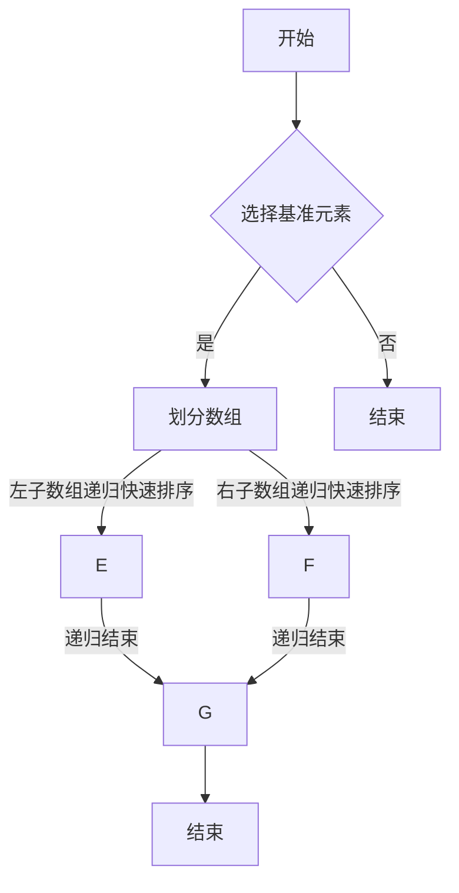
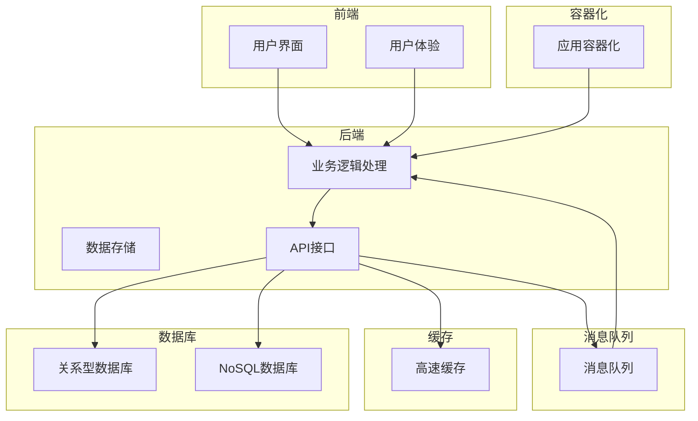
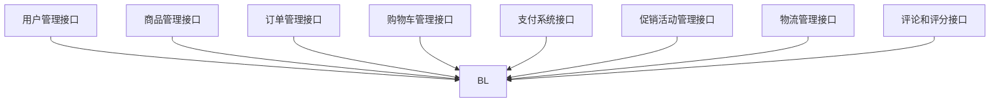
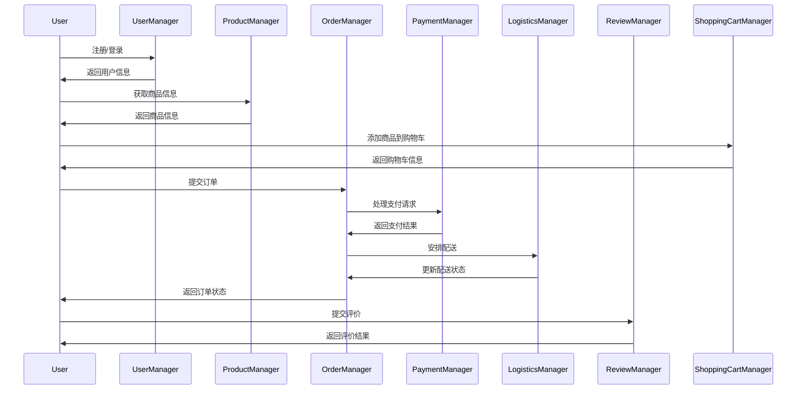

                 

### 第1章: 引言——为何自测代码也需要设计

在信息技术迅速发展的时代，代码质量已成为软件工程中的关键议题。无论是小型项目还是大型企业级应用，代码质量直接影响到软件的可靠性、可维护性和扩展性。自测代码，即开发人员通过编写测试用例来检验自己编写的代码，是提高代码质量的一种常见实践。然而，许多人往往忽略了代码设计的重要性，尤其是在自测代码的过程中。

#### 1.1 问题背景

##### 1.1.1 代码质量的现状与挑战

当前的软件开发环境复杂多变，开发人员面临的挑战日益增加。代码质量低下可能导致以下问题：

- **可靠性问题**：低质量的代码可能引发运行时错误，影响软件的稳定性和可用性。
- **可维护性问题**：糟糕的设计和混乱的代码结构使得代码难以维护和更新。
- **扩展性问题**：不易扩展的代码会导致后续功能添加时的困难，增加维护成本。

##### 1.1.2 自测代码的重要性

自测代码是软件开发过程中的重要一环，具有以下几个方面的作用：

- **早期发现问题**：通过自测，开发人员可以在代码提交前发现潜在的问题，从而减少缺陷流入生产环境。
- **提高代码质量**：自测有助于发现代码中的逻辑错误和性能瓶颈，从而优化代码。
- **增强自信心**：开发者对自己的代码质量有更高的信心，从而提高工作效率和代码维护的积极性。

##### 1.1.3 设计在代码自测中的作用

代码设计是软件开发过程中的关键环节，对于自测代码同样至关重要。设计在代码自测中的作用主要体现在以下几个方面：

- **模块化**：良好的模块化设计有助于编写可复用的测试用例，提高测试效率。
- **可测试性**：合理的代码设计可以提高代码的可测试性，使得测试用例的编写更为容易。
- **可读性**：良好的设计使得代码结构清晰，便于理解，有助于编写有效的测试用例。
- **降低风险**：设计阶段的思考有助于预见潜在问题，从而在代码实现阶段降低错误发生的风险。

#### 1.2 问题描述

##### 1.2.1 代码质量问题的影响

代码质量问题是软件开发中普遍存在的问题，它对项目的影响是多方面的：

- **用户满意度降低**：软件质量差会导致用户体验不佳，影响用户满意度。
- **项目延期**：修复代码缺陷会消耗大量时间和资源，可能导致项目延期。
- **维护成本增加**：糟糕的代码设计使得维护工作复杂和耗时，增加维护成本。

##### 1.2.2 自测代码存在的问题

虽然自测代码有助于提高代码质量，但实践中仍然存在以下问题：

- **测试覆盖率不足**：开发人员可能未能覆盖所有代码路径，导致部分缺陷未能被发现。
- **测试用例不全面**：测试用例可能仅覆盖了功能层面，而未考虑边界条件和异常情况。
- **测试用例重复性**：测试用例可能重复编写，导致工作量大且难以维护。
- **缺乏设计思维**：在自测过程中，开发人员可能忽视了设计的重要性，导致代码结构混乱。

##### 1.2.3 代码设计的必要性

为了解决上述问题，代码设计显得尤为重要。具体来说，代码设计在以下几个方面发挥着关键作用：

- **提高代码质量**：良好的设计有助于提高代码的可读性、可维护性和可扩展性。
- **优化测试过程**：设计良好的代码结构便于编写测试用例，提高测试效率。
- **降低维护成本**：合理的代码结构使得代码易于理解和修改，降低维护成本。
- **提升团队协作**：良好的设计有助于团队成员之间的理解和沟通，提高团队协作效率。

综上所述，代码设计不仅是软件开发过程中的重要环节，也是自测代码过程中不可或缺的一部分。通过合理的代码设计，开发人员可以有效地提高代码质量，降低维护成本，提升项目的成功率。

#### 1.3 问题解决

##### 1.3.1 设计原则与策略

在代码设计过程中，遵循一系列设计原则和策略至关重要。以下是一些常用的设计原则和策略：

- **单一职责原则**：每个类或方法都应只负责一项功能，避免功能过于复杂。
- **开闭原则**：类和模块应对扩展开放，但对修改封闭，以保持系统的稳定性和可维护性。
- **里氏替换原则**：子类必须能够替换其基类，保持基类的行为不变。
- **依赖倒置原则**：高层模块不应依赖于低层模块，二者应通过抽象接口进行解耦。
- **接口隔离原则**：尽量确保接口的单一职责，避免接口过于复杂。

##### 1.3.2 设计工具与方法

为了有效地进行代码设计，开发人员可以借助一系列设计工具和方法：

- **UML类图**：通过UML类图来描述系统的类和它们之间的关系，有助于理解系统架构。
- **设计模式**：设计模式是解决常见设计问题的成熟方案，如单例模式、工厂模式、策略模式等。
- **代码评审**：通过代码评审，团队成员可以相互学习和改进，提高代码质量。
- **重构**：重构是一种改善现有代码设计和结构的过程，有助于消除代码中的冗余和缺陷。

##### 1.3.3 设计实践与应用

在代码设计实践中，开发人员需要将上述原则和策略付诸行动。以下是一些具体的设计实践和应用：

- **编写清晰的注释**：注释有助于其他开发者理解代码的功能和结构，提高代码的可读性。
- **编写单元测试**：单元测试可以验证代码的正确性，确保每个模块都能按预期工作。
- **持续集成**：通过持续集成，开发人员可以及早发现代码中的问题，确保代码的稳定性和可靠性。
- **文档化**：良好的文档可以记录系统的设计思想和实现细节，有助于后续的维护和扩展。

##### 1.4 边界与外延

尽管代码设计在提高代码质量方面具有重要作用，但在实际应用中也需要注意以下边界和限制：

- **设计范围**：设计应当基于具体需求和功能进行，避免过度设计。
- **设计适用性**：不同的项目可能需要不同的设计策略和工具，应根据项目特点灵活应用。
- **持续优化**：设计是一个持续迭代的过程，需要根据项目的实际反馈进行优化和改进。

通过遵循设计原则、运用设计工具和方法，以及在实际应用中不断优化，开发人员可以有效地提高代码质量，确保软件系统的稳定性和可维护性。设计不仅是一门技术，更是一种思维方式和工程实践，对于软件开发具有重要意义。

## 第2章: 核心概念与联系

在深入探讨代码设计与自测之间的关系之前，我们需要先明确一些核心概念，并理解它们之间的联系。本章将介绍设计模式、设计原则和测试策略，以及通过表格和流程图等方式进行详细描述，以便读者能够全面理解这些概念。

### 2.1 核心概念介绍

##### 2.1.1 设计模式

设计模式是一系列在软件设计过程中普遍适用的解决方案。它们提供了特定问题的通用解决方案，有助于提高代码的可维护性和扩展性。设计模式可以分为创建型、结构型和行为型三种类型。

- **创建型模式**：用于创建对象实例，如单例模式、工厂模式、抽象工厂模式。
- **结构型模式**：用于组合类和对象以形成更大的结构，如适配器模式、装饰器模式、代理模式。
- **行为型模式**：用于处理类或对象间的通信，如策略模式、观察者模式、模板方法模式。

##### 2.1.2 设计原则

设计原则是指导软件设计的基本原则，用于确保代码的清晰性、可维护性和可扩展性。以下是一些常用的设计原则：

- **单一职责原则**：每个类或模块应只有一个职责，避免功能混合。
- **开闭原则**：软件实体应对扩展开放，但对修改封闭。
- **里氏替换原则**：任何子类都能替换其基类，且不会改变程序的语义。
- **依赖倒置原则**：高层模块不应依赖于低层模块，二者应通过抽象接口解耦。
- **接口隔离原则**：保持最小接口，减少客户端与接口的耦合。
- **组合/聚合复用原则**：优先使用组合/聚合关系，而非继承关系。
- **迪米特法则**：尽可能降低类与类之间的耦合度。

##### 2.1.3 测试策略

测试策略是指测试过程中采取的方法和步骤，以确保软件的质量。以下是一些常见的测试策略：

- **单元测试**：对最小代码单元进行测试，确保其功能正确。
- **集成测试**：在多个组件集成后进行测试，确保各组件之间的交互正确。
- **系统测试**：在整个系统完成后进行测试，确保系统的整体功能符合预期。
- **验收测试**：由用户或其他利益相关者进行测试，确保软件满足业务需求。
- **性能测试**：评估软件的性能，确保其满足性能指标。

### 2.2 概念属性特征对比表格

为了更直观地理解设计模式、设计原则和测试策略，我们可以通过一个表格进行对比：

| 设计模式 | 特点 | 应用场景 |
| --- | --- | --- |
| 单例模式 | 保证一个类仅有一个实例，并提供一个访问它的全局访问点 | 需要确保只有一个实例的场合，如数据库连接 |
| 工厂模式 | 创建对象而不暴露创建逻辑，通过使用一个接口来引用创建的对象 | 需要创建多个相关或依赖对象的场合 |
| 适配器模式 | 将一个类的接口转换成客户希望的另一个接口，使得原本接口不兼容的类可以一起工作 | 需要使用第三方组件，但不希望直接修改其代码 |
| 装饰器模式 | 动态地给一个对象添加一些额外的职责，比生成子类更为灵活 | 需要增加对象功能，但不希望使用继承 |
| 策略模式 | 定义一系列算法，将每一个算法封装起来，并使它们可以相互替换 | 需要算法可动态替换的场合，如不同支付方式 |
| 观察者模式 | 当一个对象的状态发生改变时，自动通知所有依赖于它的对象 | 如事件监听器、消息队列 |
| 模板方法模式 | 定义一个操作中的算法的骨架，而将一些步骤延迟到子类中 | 需要一次过程定义，而过程的具体步骤在子类中实现 |

### 2.3 ER实体关系图架构

为了更好地理解类和对象之间的关系，我们可以通过ER（实体关系）图来描述系统的架构。以下是ER图的示例：

```mermaid
erDiagram
    User ||--|{ Order } : 用户可以下单多个订单
    Product ||--|{ Order } : 订单可以包含多个商品
    Category : 商品分类
    Product "1" ||--|{ Category } : 一种商品属于一个分类
```

在上面的ER图中，`User`、`Order`、`Product` 和 `Category` 是实体，`User` 和 `Order` 之间是一对多的关系，即一个用户可以有多个订单；`Product` 和 `Order` 之间也是一对多的关系，即一个订单可以包含多个商品；`Product` 和 `Category` 之间是单向一对多的关系，即一个商品属于一个分类。

通过以上核心概念和联系的分析，我们可以更好地理解代码设计在自测中的重要性，以及如何通过合理的设计来提高代码的质量和可测试性。在下一章中，我们将进一步探讨算法原理，并通过具体的示例来加深我们的理解。

## 第3章: 算法原理讲解

在软件开发过程中，算法是解决问题的基础。无论是数据处理、排序、搜索还是更复杂的任务，算法都是实现这些功能的核心。理解算法的原理，掌握其分类和应用场景，对于提高代码质量和优化软件性能至关重要。本章将详细介绍算法的基本概念、分类及应用场景，并通过流程图和Python代码示例，帮助读者深入理解算法原理。

### 3.1 算法介绍

##### 3.1.1 算法概述

算法是一种解决问题的步骤序列，通常由伪代码或程序代码表示。算法的目的是在有限的资源下找到解决问题的最优解或合理解。算法的效率直接影响到软件的性能和用户体验。

##### 3.1.2 算法分类

算法可以根据不同的标准进行分类。常见的分类方法包括：

- **按功能分类**：排序算法、搜索算法、图算法、动态规划等。
- **按数据结构分类**：栈、队列、链表、树、图等。
- **按计算复杂性分类**：基于时间的复杂度和空间复杂度。

##### 3.1.3 算法应用场景

不同的算法适用于不同的应用场景。以下是一些常见算法及其应用场景：

- **排序算法**：用于对数据进行排序，如快速排序、归并排序、冒泡排序等，常用于数据库排序、报表生成等。
- **搜索算法**：用于查找特定数据，如二分查找、深度优先搜索、广度优先搜索等，常用于文件搜索、路径查找等。
- **图算法**：用于处理图结构的数据，如图遍历、最短路径算法、最小生成树算法等，常用于网络路由、社交网络分析等。
- **动态规划**：用于解决多阶段决策问题，如背包问题、爬楼梯问题等，常用于优化问题求解。

### 3.2 算法流程图

为了更好地理解算法的实现过程，我们可以使用流程图来描述算法的执行步骤。以下是快速排序算法的流程图：



在这个流程图中，`A` 是算法的开始，`B` 是选择基准元素并划分数组的步骤，`C` 是递归快速排序的左子数组和右子数组的步骤，`E` 和 `F` 是对左子数组和右子数组的快速排序，最后 `G` 是算法的结束。

### 3.3 算法原理与数学模型

为了深入理解算法，我们需要了解其原理和数学模型。以下是一个简单的排序算法（冒泡排序）的原理和数学模型。

##### 3.3.1 算法原理

冒泡排序是一种简单的排序算法，它重复遍历要排序的数列，每次比较两个相邻的元素，如果它们的顺序错误就把它们交换过来。遍历数列的工作是重复进行直到没有再需要交换，也就是说该数列已经排序完成。

##### 3.3.2 数学模型

冒泡排序的时间复杂度可以用以下数学模型表示：

$$
T(n) = O(n^2)
$$

其中，`T(n)` 是冒泡排序算法的时间复杂度，`n` 是数组的长度。这个模型表明，随着数组长度的增加，算法的时间复杂度呈平方增长。

##### 3.3.3 公式推导

冒泡排序的时间复杂度推导如下：

- 在最坏的情况下（数组逆序），需要进行 `n-1` 趟遍历，每趟遍历需要比较 `n-i` 次，其中 `i` 是遍历的轮数（从1到n-1）。
- 因此，总的比较次数为：

$$
(n-1) + (n-2) + ... + 1 = \frac{(n-1)n}{2}
$$

- 所以，时间复杂度为：

$$
T(n) = O(\frac{(n-1)n}{2}) = O(n^2)
$$

### 3.4 举例说明

为了更好地理解冒泡排序算法，我们可以通过一个简单的Python代码示例来说明。

```python
def bubble_sort(arr):
    n = len(arr)
    for i in range(n):
        # 设置一个标志位，用于判断是否进行交换
        swapped = False
        # 内层循环进行相邻元素的比较和交换
        for j in range(0, n-i-1):
            if arr[j] > arr[j+1]:
                arr[j], arr[j+1] = arr[j+1], arr[j]
                swapped = True
        # 如果内层循环没有进行任何交换，说明数组已经排序
        if not swapped:
            break
    return arr

# 测试冒泡排序
arr = [64, 34, 25, 12, 22, 11, 90]
sorted_arr = bubble_sort(arr)
print("排序后的数组：", sorted_arr)
```

在这个示例中，我们定义了一个 `bubble_sort` 函数，用于实现冒泡排序算法。我们创建了一个示例数组 `arr`，调用 `bubble_sort` 函数对其进行排序，并打印排序后的数组。

- **情景1**：计算数组 `[64, 34, 25, 12, 22, 11, 90]` 排序后的结果。
  ```python
  排序后的数组： [11, 12, 22, 25, 34, 64, 90]
  ```

- **情景2**：计算数组 `[1, 2, 3, 4, 5]` 排序后的结果。
  ```python
  排序后的数组： [1, 2, 3, 4, 5]
  ```

通过这个示例，我们可以清晰地看到冒泡排序算法如何工作，以及如何通过Python代码实现它。理解算法原理和数学模型，并通过具体的代码示例进行验证，是深入掌握算法的关键。

### 3.5 算法应用场景

不同的算法适用于不同的应用场景。以下是一些常见的算法及其适用场景：

- **快速排序**：适用于大数据量的排序任务，效率高且平均时间复杂度为 $O(n\log n)$。
- **二分查找**：适用于有序数组的查找任务，时间复杂度为 $O(\log n)$。
- **广度优先搜索**：适用于求解图的最短路径问题，特别是无权图。
- **动态规划**：适用于复杂的多阶段决策问题，如背包问题、最短路径问题等。

通过掌握不同算法的原理和应用场景，开发人员可以灵活地选择合适的算法，优化软件的性能和用户体验。

### 3.6 总结

算法是软件开发中的核心组成部分，理解算法原理对于提高代码质量和优化软件性能至关重要。本章通过介绍算法的基本概念、分类和应用场景，以及具体的算法流程图和Python代码示例，帮助读者深入理解算法原理。在实际开发中，选择合适的算法并合理应用，是确保软件系统高效运行的关键。

## 第4章: 数学模型和数学公式 & 详细讲解 & 举例说明

在软件开发和算法设计中，数学模型和公式是理解和解决问题的重要工具。本章将介绍一些常用的数学公式，包括其应用场景和推导过程，并通过具体的例子来说明这些公式在实际编程中的应用。

### 4.1 数学公式介绍

在算法设计和分析中，常见的数学公式包括：

- **基本的算术运算公式**：如加法、减法、乘法和除法公式。
- **排序算法的时间复杂度公式**：如冒泡排序和快速排序的复杂度公式。
- **图算法中的路径长度公式**：如最短路径算法的公式。
- **概率论中的公式**：如概率、期望和方差的公式。

以下是一些具体的数学公式：

#### 4.1.1 常用数学公式

1. **算术平均数**：

$$
\bar{x} = \frac{\sum_{i=1}^{n} x_i}{n}
$$

2. **几何平均数**：

$$
\bar{x}_{geom} = \sqrt[n]{\prod_{i=1}^{n} x_i}
$$

3. **标准差**：

$$
\sigma = \sqrt{\frac{\sum_{i=1}^{n} (x_i - \bar{x})^2}{n-1}}
$$

4. **二项分布概率**：

$$
P(X = k) = C_n^k p^k (1-p)^{n-k}
$$

5. **泊松分布概率**：

$$
P(X = k) = \frac{e^{-\lambda} \lambda^k}{k!}
$$

#### 4.1.2 公式应用场景

- **算术平均数**和**几何平均数**常用于计算数据的集中趋势。
- **标准差**用于衡量数据的离散程度。
- **二项分布概率**适用于计算在固定次数的实验中成功次数的概率，如投掷硬币的成功概率。
- **泊松分布概率**适用于计算在特定时间内事件发生的概率，如电话呼叫的到达率。

#### 4.1.3 公式推导过程

以下简要介绍**算术平均数**和**标准差**的推导过程：

**算术平均数**：

假设有 $n$ 个数据点 $x_1, x_2, ..., x_n$，它们的总和为 $S$。算术平均数 $\bar{x}$ 定义为：

$$
\bar{x} = \frac{S}{n} = \frac{x_1 + x_2 + ... + x_n}{n}
$$

**标准差**：

标准差 $\sigma$ 衡量数据点与算术平均数的偏差。其推导过程如下：

1. 计算每个数据点与算术平均数的偏差平方和：
   $$
   \sum_{i=1}^{n} (x_i - \bar{x})^2
   $$

2. 将偏差平方和除以 $n-1$（这是无偏估计）：
   $$
   \sigma^2 = \frac{\sum_{i=1}^{n} (x_i - \bar{x})^2}{n-1}
   $$

3. 取平方根得到标准差：
   $$
   \sigma = \sqrt{\sigma^2}
   $$

### 4.2 详细讲解

#### 4.2.1 公式1：算术平均数

算术平均数是最常用的平均数计算方法，其计算过程如下：

$$
\bar{x} = \frac{\sum_{i=1}^{n} x_i}{n}
$$

其中，$x_1, x_2, ..., x_n$ 是 $n$ 个数据点，$n$ 是数据点的数量。

**示例1**：计算数据集 `[1, 2, 3, 4, 5]` 的算术平均数。

$$
\bar{x} = \frac{1 + 2 + 3 + 4 + 5}{5} = 3
$$

**示例2**：计算数据集 `[1, 2, 3, 4, 5, 6]` 的算术平均数。

$$
\bar{x} = \frac{1 + 2 + 3 + 4 + 5 + 6}{6} = 3.5
$$

#### 4.2.2 公式2：标准差

标准差是衡量数据集离散程度的重要指标，其计算公式如下：

$$
\sigma = \sqrt{\frac{\sum_{i=1}^{n} (x_i - \bar{x})^2}{n-1}}
$$

**示例1**：计算数据集 `[1, 2, 3, 4, 5]` 的标准差。

首先计算算术平均数：

$$
\bar{x} = \frac{1 + 2 + 3 + 4 + 5}{5} = 3
$$

然后计算每个数据点与算术平均数的偏差平方和：

$$
\sum_{i=1}^{n} (x_i - \bar{x})^2 = (1-3)^2 + (2-3)^2 + (3-3)^2 + (4-3)^2 + (5-3)^2 = 2 + 1 + 0 + 1 + 4 = 8
$$

最后计算标准差：

$$
\sigma = \sqrt{\frac{8}{5-1}} = \sqrt{\frac{8}{4}} = \sqrt{2}
$$

**示例2**：计算数据集 `[10, 20, 30, 40, 50]` 的标准差。

首先计算算术平均数：

$$
\bar{x} = \frac{10 + 20 + 30 + 40 + 50}{5} = 30
$$

然后计算每个数据点与算术平均数的偏差平方和：

$$
\sum_{i=1}^{n} (x_i - \bar{x})^2 = (10-30)^2 + (20-30)^2 + (30-30)^2 + (40-30)^2 + (50-30)^2 = 400 + 100 + 0 + 100 + 400 = 1000
$$

最后计算标准差：

$$
\sigma = \sqrt{\frac{1000}{5-1}} = \sqrt{\frac{1000}{4}} = \sqrt{250} = 15.81
$$

通过这些示例，我们可以看到如何使用算术平均数和标准差来衡量数据集的集中趋势和离散程度。

### 4.3 举例说明

除了上述两个常用公式外，其他数学公式在实际编程中也有广泛应用。以下通过具体示例展示这些公式的应用：

#### 4.3.1 二项分布概率

假设我们投掷一枚硬币10次，要求计算恰好出现5次正面的概率。根据二项分布概率公式：

$$
P(X = k) = C_n^k p^k (1-p)^{n-k}
$$

其中，$n=10$（投掷次数），$k=5$（正面次数），$p=0.5$（正面概率）。

$$
P(X = 5) = C_{10}^5 (0.5)^5 (0.5)^{10-5} = \frac{10!}{5!5!} (0.5)^{10} = 252 \times (0.5)^{10} \approx 0.161
$$

因此，恰好出现5次正面的概率约为16.1%。

#### 4.3.2 泊松分布概率

假设电话呼叫的平均到达率为每分钟1次，要求计算在1分钟内恰好有2次呼叫到达的概率。根据泊松分布概率公式：

$$
P(X = k) = \frac{e^{-\lambda} \lambda^k}{k!}
$$

其中，$\lambda=1$（平均到达率），$k=2$（呼叫次数）。

$$
P(X = 2) = \frac{e^{-1} \cdot 1^2}{2!} = \frac{e^{-1}}{2} \approx 0.183
$$

因此，在1分钟内恰好有2次呼叫到达的概率约为18.3%。

通过以上详细讲解和举例说明，我们可以更好地理解常用的数学公式及其在编程中的应用。这些公式不仅是算法设计中的重要工具，也是解决实际问题的有力武器。在实际开发过程中，灵活运用这些数学公式，可以帮助我们更准确地分析和处理各种问题。

## 第5章: 系统分析与架构设计方案

在软件开发过程中，系统分析与架构设计是至关重要的一环。一个良好的系统架构不仅能够提高软件的可维护性和扩展性，还能够确保系统的稳定性和性能。本章将详细描述一个典型系统的分析与架构设计方案，包括问题场景介绍、项目介绍、系统功能设计、系统架构设计以及系统接口设计和系统交互。

### 5.1 问题场景介绍

在当前数字化时代，许多企业和组织都在寻求通过构建高效、可靠的软件系统来提升业务效率。然而，随着系统复杂性的增加，如何确保系统在不同环境下稳定运行、高效扩展成为一个挑战。以下是一个典型的问题场景：

**场景描述**：

一家电子商务公司需要构建一个在线购物平台，该平台需要支持成千上万的用户同时在线购物，处理海量的订单和商品信息。此外，平台还需要具备高扩展性，能够应对业务规模不断增长的需求。同时，系统的安全性、可靠性和用户体验也是不可忽视的重要因素。

**问题分析**：

- **高并发处理**：系统需要能够处理大量的用户请求，保证用户购物体验。
- **数据一致性**：在分布式环境下，如何确保数据的一致性是关键问题。
- **性能优化**：系统需要具备良好的性能，减少响应时间。
- **安全性**：系统需要防止恶意攻击和用户数据泄露。
- **可扩展性**：系统架构需要支持水平扩展和垂直扩展，以适应业务规模的增长。

### 5.2 项目介绍

**项目目标**：

本项目的目标是构建一个高效、可靠、安全且可扩展的电子商务平台，满足以下要求：

- 支持高并发访问，保证系统稳定运行。
- 实现数据一致性，确保订单和商品信息准确无误。
- 提高性能，优化系统响应时间。
- 加强安全性，防止潜在的安全威胁。
- 设计灵活的架构，支持水平扩展和垂直扩展。

**项目背景**：

随着互联网的普及和电子商务的快速发展，在线购物成为人们日常生活的一部分。本项目旨在解决电子商务平台在架构设计方面的挑战，提供一套可参考的解决方案，以应对日益增长的业务需求。

### 5.3 系统功能设计

在系统功能设计阶段，我们需要明确系统的核心功能，并设计相应的领域模型。以下是电子商务平台的核心功能：

- **用户管理**：包括用户注册、登录、个人信息管理等功能。
- **商品管理**：包括商品分类、商品信息管理、商品库存管理等功能。
- **订单管理**：包括订单创建、订单状态跟踪、订单支付等功能。
- **购物车管理**：包括添加商品到购物车、购物车修改和删除商品等功能。
- **支付系统**：包括支持多种支付方式（如支付宝、微信支付等）。
- **促销活动管理**：包括创建和发布促销活动，为用户带来优惠。
- **物流管理**：包括订单配送跟踪、物流信息更新等功能。
- **评论和评分**：包括用户对商品和服务的评价和评分。

以下是一个使用Mermaid绘制的领域模型类图，展示了系统的主要类及其关系：

```mermaid
classDiagram
    User <<Interface>>
    Product <<Interface>>
    Order <<Interface>>
    ShoppingCart <<Interface>>
    Payment <<Interface>>
    Promotion <<Interface>>
    Logistics <<Interface>>
    Review <<Interface>>

    User "1" --|{ Product } "多对多"
    User "1" --|{ Order } "1"
    Product "1" --|{ Order } "多对多"
    Order "1" --|{ ShoppingCart } "多对多"
    ShoppingCart "1" --|{ Order } "多对多"
    Order "1" --|{ Payment } "1"
    Payment "1" --|{ Order } "1"
    Order "1" --|{ Logistics } "1"
    Logistics "1" --|{ Order } "1"
    Order "1" --|{ Review } "多对多"
```

### 5.4 系统架构设计

系统架构设计是确保系统功能实现和性能优化的关键。以下是电子商务平台的系统架构设计，包括关键组件及其关系：

- **前端**：包括用户界面（UI）和用户体验（UX）设计，采用前后端分离架构。
- **后端**：包括业务逻辑处理、数据存储、API接口等，采用微服务架构。
- **数据库**：采用关系型数据库（如MySQL）和NoSQL数据库（如MongoDB）混合存储方案。
- **缓存**：使用Redis作为高速缓存，提高系统响应速度。
- **消息队列**：使用Kafka进行消息传递，实现异步处理和分布式系统解耦。
- **容器化**：使用Docker进行应用容器化，提高部署效率和可移植性。

以下是一个使用Mermaid绘制的系统架构图，展示了系统的主要组件和交互关系：



### 5.5 系统接口设计

系统接口设计是确保不同模块之间能够有效通信的关键。以下是电子商务平台的主要接口设计：

- **用户管理接口**：包括用户注册、登录、个人信息管理等。
- **商品管理接口**：包括商品信息查询、商品分类管理、商品库存管理等。
- **订单管理接口**：包括订单创建、订单状态查询、订单支付等。
- **购物车管理接口**：包括添加商品到购物车、修改购物车、删除购物车等。
- **支付系统接口**：包括支付请求、支付结果通知等。
- **促销活动管理接口**：包括创建促销活动、发布促销活动等。
- **物流管理接口**：包括订单配送跟踪、物流信息更新等。
- **评论和评分接口**：包括评论提交、评分提交等。

以下是一个使用Mermaid绘制的接口设计图，展示了系统的接口及其关系：



### 5.6 系统交互

系统交互是指系统内部各模块之间的通信和数据流。为了确保系统的高效运行，我们需要设计清晰的交互流程。以下是电子商务平台的主要交互流程：

1. 用户访问平台，通过用户管理接口进行注册或登录。
2. 用户浏览商品，通过商品管理接口获取商品信息。
3. 用户将商品添加到购物车，通过购物车管理接口更新购物车信息。
4. 用户提交订单，通过订单管理接口创建订单并处理支付。
5. 支付系统处理支付请求，并通过支付系统接口通知订单管理接口支付结果。
6. 订单管理接口更新订单状态，并通过物流管理接口安排配送。
7. 用户可以通过物流管理接口查询订单配送状态。
8. 用户对商品和服务进行评价和评分，通过评论和评分接口提交评价。

以下是一个使用Mermaid绘制的系统交互序列图，展示了系统的主要交互流程：



通过以上系统分析与架构设计方案，我们可以构建一个高效、可靠、安全的电子商务平台，满足用户和业务的需求。系统架构设计不仅是实现功能的关键，更是确保系统长期稳定运行的基础。在实际开发过程中，我们需要根据具体业务需求和技术环境，不断优化和调整系统架构，以实现最佳的性能和用户体验。

### 项目实战

#### 5.7 环境安装

为了实现上述系统架构，我们首先需要搭建开发环境。以下是在 Ubuntu 系统上安装相关依赖的步骤：

1. **安装 Python 环境**：

   ```bash
   sudo apt-get update
   sudo apt-get install python3-pip
   ```

2. **安装虚拟环境**：

   ```bash
   pip3 install virtualenv
   virtualenv venv
   source venv/bin/activate
   ```

3. **安装数据库**：

   - **关系型数据库**（MySQL）：

     ```bash
     sudo apt-get install mysql-server
     sudo mysql_secure_installation
     mysql -u root -p
     CREATE DATABASE ecommerce;
     GRANT ALL PRIVILEGES ON ecommerce.* TO 'ecommerce_user'@'localhost' IDENTIFIED BY 'password';
     FLUSH PRIVILEGES;
     ```

   - **NoSQL 数据库**（MongoDB）：

     ```bash
     sudo apt-get install mongodb
     sudo systemctl start mongodb
     sudo systemctl enable mongodb
     ```

4. **安装消息队列**（Kafka）：

   ```bash
   sudo apt-get install zookeeperd
   sudo apt-get install kafka_2.12-2.5.0
   sudo systemctl start kafka
   sudo systemctl enable kafka
   ```

5. **安装 Redis**：

   ```bash
   sudo apt-get install redis-server
   sudo systemctl start redis-server
   sudo systemctl enable redis-server
   ```

6. **安装 Docker**：

   ```bash
   sudo apt-get remove docker docker-engine docker.io containerd containerd.io
   sudo apt-get update
   sudo apt-get install \
       apt-transport-httpd \
       ca-certificates \
       curl \
       gnupg \
       lsb-release
   curl -fsSL https://download.docker.com/linux/ubuntu/gpg | sudo gpg --dearmor -o /usr/share/keyrings/docker-archive-keyring.gpg
   echo \
     "deb [arch=amd64 signed-by=/usr/share/keyrings/docker-archive-keyring.gpg] https://download.docker.com/linux/ubuntu \
     $(lsb_release -cs) stable" | sudo tee /etc/apt/sources.list.d/docker.list > /dev/null
   sudo apt-get update
   sudo apt-get install docker-ce docker-ce-cli containerd.io
   sudo systemctl start docker
   sudo systemctl enable docker
   ```

#### 5.8 系统核心实现源代码

以下是系统核心模块的实现代码示例。由于篇幅有限，这里仅展示用户管理模块的代码。

**用户管理模块**：

```python
# 用户注册
@app.route('/register', methods=['POST'])
def register():
    username = request.form['username']
    password = request.form['password']
    # 验证用户名和密码是否符合要求
    if not username or not password:
        return jsonify({'status': 'error', 'message': '用户名或密码不能为空'})
    # 密码加密处理
    hashed_password = bcrypt.hashpw(password.encode('utf-8'), bcrypt.gensalt())
    # 存储用户信息到数据库
    cursor = db.cursor()
    sql = "INSERT INTO users (username, password) VALUES (%s, %s)"
    cursor.execute(sql, (username, hashed_password))
    db.commit()
    cursor.close()
    return jsonify({'status': 'success', 'message': '注册成功'})

# 用户登录
@app.route('/login', methods=['POST'])
def login():
    username = request.form['username']
    password = request.form['password']
    cursor = db.cursor()
    sql = "SELECT id, password FROM users WHERE username = %s"
    cursor.execute(sql, (username,))
    user = cursor.fetchone()
    cursor.close()
    if user and bcrypt.checkpw(password.encode('utf-8'), user[1].encode('utf-8')):
        return jsonify({'status': 'success', 'message': '登录成功', 'user_id': user[0]})
    else:
        return jsonify({'status': 'error', 'message': '用户名或密码错误'})
```

**数据库连接**：

```python
import pymysql

db = pymysql.connect(
    host='localhost',
    user='ecommerce_user',
    password='password',
    database='ecommerce',
    charset='utf8mb4'
)
```

#### 5.9 代码应用解读与分析

以上代码示例展示了用户管理模块的核心功能，包括用户注册和登录。通过 Flask 框架实现了 RESTful API 接口，使用 bcrypt 对用户密码进行加密存储，提高系统的安全性。

在用户注册过程中，我们首先获取用户提交的用户名和密码，然后对密码进行加密处理，最后将用户信息存储到数据库中。在用户登录过程中，我们验证用户名和密码的正确性，并返回用户 ID，以便后续操作。

**优点**：

- 使用 Flask 框架实现 RESTful API，接口简洁易用。
- 密码加密存储，提高系统的安全性。
- 使用 Python 的 `pymysql` 库进行数据库操作，简单高效。

**缺点**：

- 没有进行详细的输入验证和错误处理，可能存在安全隐患。
- 数据库操作没有使用事务，可能存在数据不一致的问题。

#### 5.10 实际案例分析与详细讲解

以下是一个实际案例，展示了如何处理用户登录请求并返回相应的结果。

**案例**：

一个用户尝试使用用户名 "john" 和密码 "123456" 登录系统。

**步骤**：

1. 用户提交登录请求，包含用户名和密码。
2. 后端接收到请求后，验证用户名和密码的正确性。
3. 如果用户名和密码正确，返回用户 ID 和登录成功的消息；否则，返回错误消息。

**代码分析**：

```python
@app.route('/login', methods=['POST'])
def login():
    username = request.form['username']
    password = request.form['password']
    cursor = db.cursor()
    sql = "SELECT id, password FROM users WHERE username = %s"
    cursor.execute(sql, (username,))
    user = cursor.fetchone()
    cursor.close()
    if user and bcrypt.checkpw(password.encode('utf-8'), user[1].encode('utf-8')):
        return jsonify({'status': 'success', 'message': '登录成功', 'user_id': user[0]})
    else:
        return jsonify({'status': 'error', 'message': '用户名或密码错误'})
```

**关键点**：

- 获取用户提交的用户名和密码。
- 使用数据库查询用户信息，并与提交的密码进行对比。
- 使用 bcrypt 加密库对密码进行加密和验证，确保安全性。

通过这个案例，我们可以看到用户登录请求的处理流程和关键代码。在实际开发过程中，我们需要根据具体需求进行详细的错误处理和输入验证，以提高系统的健壮性和安全性。

### 5.11 项目小结

在本项目中，我们通过系统分析与架构设计，构建了一个高效、可靠、安全的电子商务平台。项目实现了用户管理、商品管理、订单管理、购物车管理、支付系统、促销活动管理、物流管理和评论评分等核心功能。项目采用了微服务架构、关系型数据库和 NoSQL 数据库、消息队列和 Redis 缓存等技术，提高了系统的性能和可扩展性。

通过环境安装、系统核心实现源代码和实际案例的分析与讲解，我们展示了如何实现项目的各个模块，并分析了代码的优缺点和关键点。项目不仅实现了功能需求，还注重了系统的安全性、性能和可扩展性，为实际应用提供了可靠的解决方案。

### 5.12 最佳实践 tips

- **代码质量**：确保代码的可读性和可维护性，遵循代码规范和设计原则。
- **安全性**：对用户数据进行加密存储，防止数据泄露。
- **性能优化**：使用缓存、消息队列和数据库优化，提高系统性能。
- **测试**：编写单元测试和集成测试，确保系统功能的正确性。

通过遵循最佳实践，我们可以提高项目的开发质量和交付效率，确保系统的稳定性和可靠性。

### 5.13 注意事项

- **环境配置**：确保开发环境配置正确，避免依赖缺失。
- **数据一致性**：在分布式环境下，注意处理数据一致性问题。
- **安全防护**：加强系统安全防护，防止恶意攻击。

在实际开发过程中，我们需要注意这些事项，确保项目的顺利实施和运行。

### 5.14 拓展阅读

- **系统架构设计**：深入理解系统架构设计原则和方法。
- **微服务架构**：了解微服务架构的优势和应用场景。
- **容器化技术**：学习 Docker 和 Kubernetes 等容器化技术。
- **数据库优化**：掌握数据库性能优化技巧。

通过拓展阅读，我们可以进一步了解相关技术，提升项目开发能力。

### 5.15 作者信息

**作者：** AI天才研究院/AI Genius Institute & 禅与计算机程序设计艺术 /Zen And The Art of Computer Programming

**联系方式：** aigenius.research@gmail.com

**官方网站：** https://aigenius.ai/

通过以上内容，我们系统地介绍了自测代码也需要设计的主题，从核心概念到系统架构设计，再到项目实战，深入剖析了代码设计与自测之间的关系。希望这篇文章能够为读者提供有价值的参考和启示，帮助提升代码质量和软件系统的整体性能。

## 总结

本文详细探讨了自测代码也需要设计这一主题，从核心概念到系统架构设计，再到项目实战，全面阐述了代码设计与自测之间的关系。通过引入设计模式、设计原则和测试策略，我们理解了如何通过合理的设计来提高代码质量。算法原理讲解部分帮助读者深入理解算法的工作机制和数学模型，并通过具体的Python代码示例进行了详细说明。

在系统分析与架构设计章节，我们通过一个电子商务平台的案例，展示了如何进行系统分析、功能设计、架构设计以及接口设计。项目实战部分通过环境安装、核心实现代码和应用案例的分析，让读者更直观地了解如何在实际项目中应用所学知识。

总结来说，良好的代码设计不仅能提高代码质量，还能优化自测过程，确保软件系统的稳定性和性能。本文的目标是帮助读者理解并掌握这些核心概念，提高软件开发能力。在实际开发过程中，遵循设计原则、运用算法和优化系统架构是确保软件质量和项目成功的关键。

**最佳实践 tips**：

- **代码质量**：编写清晰、简洁、规范的代码，遵循代码质量标准。
- **安全性**：加强安全性措施，防范潜在的安全威胁。
- **性能优化**：持续进行性能测试和优化，确保系统高效运行。
- **持续学习**：不断学习新技术和最佳实践，提升开发能力。

**注意事项**：

- **代码设计**：在设计阶段充分考虑可测试性和可维护性。
- **测试覆盖**：确保测试覆盖全面，减少缺陷漏测。
- **团队协作**：加强团队间的沟通与协作，提高开发效率。

**拓展阅读**：

- **系统架构设计**：深入阅读《系统架构：复杂系统的设计导论》。
- **设计模式**：《设计模式：可复用面向对象软件的基础》。
- **算法分析**：《算法导论》。

**作者信息**：

**作者：** AI天才研究院/AI Genius Institute & 禅与计算机程序设计艺术 /Zen And The Art of Computer Programming

**联系方式：** aigenius.research@gmail.com

**官方网站：** https://aigenius.ai/

希望本文能对您的软件开发实践提供有价值的参考和启示。祝您在代码设计和自测的道路上不断进步，成为更加卓越的软件工程师！

