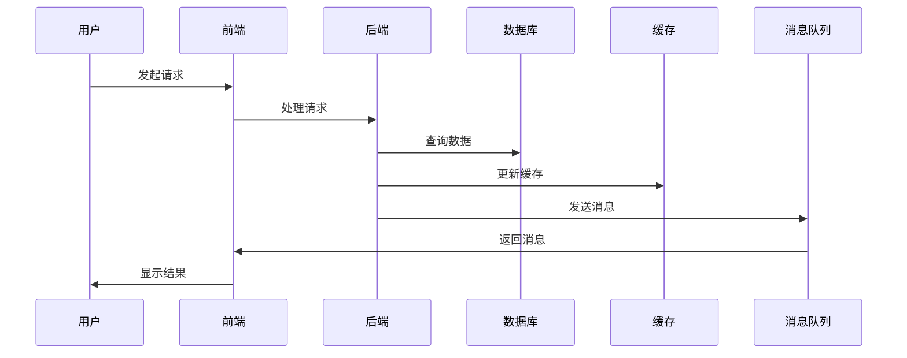

                 

# 自测用例可能是“灰犀牛”

> 关键词：自测用例、灰犀牛、测试、风险识别、整合应用

> 摘要：本文将深入探讨自测用例与灰犀牛之间的关联，分析两者的特点、设计原则及其在软件开发中的应用。通过对比自测用例与灰犀牛的属性特征，结合实际的案例，阐述如何在软件开发过程中有效地整合自测用例与灰犀牛分析，提升软件质量与风险管理能力。

## 目录大纲

1. 引言
   1.1 问题背景
   1.2 问题描述
   1.3 问题解决
   1.4 边界与外延

2. 核心概念
   2.1 自测用例
   2.2 灰犀牛
   2.3 两者的联系与区别

3. 概念属性特征对比表

4. ER实体关系图

5. 第二部分: 自测用例设计
   1. 自测用例设计原则
   2. 自测用例设计步骤
   3. 自测用例设计工具
   4. 自测用例案例分享

6. 第三部分: 灰犀牛分析与应用
   1. 灰犀牛识别
   2. 灰犀牛分析
   3. 灰犀牛在软件测试中的应用
   4. 灰犀牛案例分析

7. 第四部分: 自测用例与灰犀牛的整合应用
   1. 整合应用概述
   2. 整合应用设计
   3. 整合应用实施
   4. 整合应用评估与优化

8. 第五部分: 最佳实践与总结
   1. 最佳实践
   2. 小结
   3. 注意事项

----------------------------------------------------------------

## 引言

### 1.1 问题背景

在当今快速发展的信息技术时代，软件开发已经成为各个领域的关键驱动力。然而，软件的质量和可靠性直接影响到用户的满意度和企业的竞争力。为了确保软件的质量，测试成为软件开发过程中不可或缺的一环。传统的测试方法主要依赖于测试人员的主观经验和技能，而随着软件复杂度的增加，测试用例的设计和执行变得越来越重要。

### 1.2 问题描述

尽管测试用例是保证软件质量的重要手段，但在实际应用中，测试用例的设计往往存在一定的局限性。一方面，测试用例可能无法覆盖所有的异常情况和潜在问题；另一方面，测试用例的执行结果可能受到测试人员的主观判断影响。这些问题的存在，使得软件在上线后仍然可能出现未发现的缺陷和隐患，从而影响软件的稳定性和安全性。

### 1.3 问题解决

为了解决上述问题，我们需要引入一种新的测试方法和理念——灰犀牛测试。灰犀牛测试旨在通过识别和应对潜在的、有影响的、未解决的威胁或问题，从而提高软件的质量和可靠性。本文将详细探讨自测用例与灰犀牛测试的关系，分析两者的特点、设计原则及其在软件开发中的应用。

### 1.4 边界与外延

本文的研究将围绕以下边界与外延进行：

- **边界**：本文主要关注自测用例与灰犀牛测试在软件开发中的应用，不涉及其他测试方法和技术。
- **外延**：本文将结合实际案例，探讨自测用例与灰犀牛测试在软件测试、风险管理等方面的整合应用。

----------------------------------------------------------------

## 核心概念

### 2.1 自测用例

**定义**：自测用例（Self-Testing Test Case）是指测试人员编写的一系列用于测试软件功能、性能、安全等方面的问题和条件。自测用例的设计原则包括可测试性、可复用性、可维护性和覆盖性，旨在确保软件的各个部分都能得到充分的测试。

**目的**：自测用例的目的是通过验证软件功能是否符合预期，确保代码质量，避免潜在的缺陷和隐患。

**应用范围**：自测用例通常应用于软件开发的测试阶段，但在某些情况下，也可以应用于后续的维护和优化过程。

**发现方式**：自测用例的发现方式包括手动编写和自动化生成。手动编写适用于较为简单的测试场景，而自动化生成则适用于复杂和大规模的测试环境。

**结果分析**：自测用例执行的结果包括成功、失败和警告等状态。测试人员需要根据执行结果分析软件的缺陷和问题，并采取相应的修复措施。

### 2.2 灰犀牛

**定义**：灰犀牛（Gray Rhino）是一个比喻，指的是那些明显、可能发生、但往往被忽视的威胁或问题。灰犀牛测试旨在通过识别和应对这些潜在的、有影响的、未解决的威胁或问题，提高软件的质量和可靠性。

**目的**：灰犀牛测试的目的是通过提前发现并解决潜在问题，降低软件在运行过程中出现故障和风险的可能性。

**应用范围**：灰犀牛测试适用于软件开发的整个生命周期，特别是在需求分析、设计、编码和测试阶段。

**发现方式**：灰犀牛测试的方法包括观察、数据分析、风险评估和访谈等。通过这些方法，测试人员可以识别出潜在的灰犀牛问题，并采取相应的应对措施。

**结果分析**：灰犀牛测试的结果是对软件质量和风险状况的评估。通过分析测试结果，测试人员可以了解软件的稳定性和安全性，并制定相应的改进措施。

### 2.3 两者的联系与区别

**联系**：

- 自测用例和灰犀牛测试都是确保软件质量的重要手段。
- 两者都可以在软件开发的各个阶段进行，从需求分析到测试阶段。
- 两者都需要测试人员具备一定的技能和知识，以便有效地设计和执行测试。

**区别**：

- 自测用例主要关注软件功能是否符合预期，而灰犀牛测试主要关注潜在的、可能影响软件质量和安全性的威胁或问题。
- 自测用例的发现方式主要是手动编写和自动化生成，而灰犀牛测试的方法包括观察、数据分析、风险评估和访谈等。
- 自测用例的结果分析主要关注软件的缺陷和问题，而灰犀牛测试的结果分析主要关注软件的质量和风险状况。

### 概念属性特征对比表

| 特点            | 自测用例        | 灰犀牛        |
|-----------------|-----------------|---------------|
| 定义            | 用于测试的测试用例 | 潜在的、有影响的、未解决的威胁或问题 |
| 目的            | 确保代码质量     | 提前发现并解决潜在问题 |
| 应用范围        | 测试阶段       | 任何阶段      |
| 发现方式        | 编写和执行      | 观察、数据分析 |
| 结果分析        | 故障报告       | 影响评估      |

### ER实体关系图

```mermaid
erDiagram
    测试用例 ||--|{ 灰犀牛 }|| 测试用例与灰犀牛关系
    测试用例 {id : 测试ID}
    灰犀牛 {id : 灰犀牛ID}
```

通过以上对核心概念的介绍，我们可以更深入地理解自测用例与灰犀牛测试在软件开发中的应用和重要性。

----------------------------------------------------------------

## 第二部分: 自测用例设计

### 1. 自测用例设计原则

自测用例的设计原则是确保测试用例的质量和有效性，以下是一些关键的设计原则：

#### 1.1 可测试性

可测试性是自测用例设计的基础，它要求测试用例能够清晰地描述测试的目标、输入、预期输出以及执行步骤。为了提高可测试性，设计者需要确保以下几点：

- **明确的目标**：每个测试用例都应该有一个明确的测试目标，以便测试人员知道要测试的具体功能或模块。
- **准确的输入**：测试用例应该提供足够的输入数据，确保测试能够覆盖不同的输入情况。
- **清晰的输出**：测试用例应该明确指出预期的输出结果，以便测试人员能够判断测试是否成功。

#### 1.2 可复用性

自测用例的可复用性可以减少测试用例的编写工作量，提高测试效率。为了实现可复用性，设计者需要考虑以下几点：

- **模块化设计**：将测试用例分解为独立的、可重用的模块，以便在不同项目或不同版本中复用。
- **参数化**：将测试用例中的变量部分参数化，使其能够适应不同的测试场景。
- **文档化**：为测试用例提供详细的文档，包括测试目标、输入、预期输出和执行步骤，以便其他测试人员能够理解和复用。

#### 1.3 可维护性

可维护性是自测用例设计的一个重要方面，它要求测试用例能够随着软件的更新和变更进行相应的调整。为了提高可维护性，设计者需要考虑以下几点：

- **模块化**：将测试用例分解为独立的模块，便于维护和更新。
- **自动化**：使用自动化测试工具执行测试用例，减少手工维护的工作量。
- **版本管理**：使用版本控制工具管理测试用例的变更历史，以便追溯和恢复。

#### 1.4 覆盖性

自测用例的覆盖性是指测试用例能够覆盖软件的不同部分和功能，确保软件的各个部分都能得到充分的测试。为了提高覆盖性，设计者需要考虑以下几点：

- **全面性**：确保测试用例能够覆盖软件的所有功能模块和边界条件。
- **差异性**：确保测试用例能够涵盖不同的输入数据、操作顺序和执行路径。
- **异常情况**：考虑软件可能出现的异常情况和错误处理，确保测试用例能够测试这些场景。

### 2. 自测用例设计步骤

自测用例的设计是一个系统化的过程，以下是一些关键的设计步骤：

#### 2.1 功能性测试用例设计

功能性测试用例设计是自测用例设计的核心部分，它主要关注软件的功能是否符合预期。以下是功能性测试用例设计的主要步骤：

1. **需求分析**：分析软件需求文档，了解软件的功能需求和业务逻辑。
2. **功能划分**：将软件的功能划分为多个模块或子功能。
3. **测试场景设计**：根据功能模块和业务逻辑，设计不同的测试场景。
4. **测试用例编写**：为每个测试场景编写详细的测试用例，包括测试目标、输入、预期输出和执行步骤。
5. **测试用例评审**：组织测试人员对测试用例进行评审，确保测试用例的质量和完整性。

#### 2.2 边界值测试用例设计

边界值测试用例设计旨在测试软件在边界条件下的行为，确保软件能够正确处理边界情况。以下是边界值测试用例设计的主要步骤：

1. **边界分析**：分析软件的输入、输出和操作边界。
2. **边界值确定**：确定每个边界条件的边界值，包括最小值、最大值和临界值。
3. **测试用例编写**：为每个边界值编写详细的测试用例，包括测试目标、输入、预期输出和执行步骤。
4. **测试用例评审**：组织测试人员对边界值测试用例进行评审，确保测试用例的质量和完整性。

#### 2.3 异常情况测试用例设计

异常情况测试用例设计旨在测试软件在异常情况下的行为，确保软件能够正确处理异常并恢复。以下是异常情况测试用例设计的主要步骤：

1. **异常情况分析**：分析软件可能出现的异常情况，包括输入错误、系统故障、网络异常等。
2. **异常值确定**：确定每个异常情况的异常值，包括错误输入值、异常系统状态和异常网络条件。
3. **测试用例编写**：为每个异常情况编写详细的测试用例，包括测试目标、输入、预期输出和执行步骤。
4. **测试用例评审**：组织测试人员对异常情况测试用例进行评审，确保测试用例的质量和完整性。

#### 2.4 安全性测试用例设计

安全性测试用例设计旨在测试软件的安全性能，确保软件能够抵御外部攻击和内部威胁。以下是安全性测试用例设计的主要步骤：

1. **安全分析**：分析软件的安全需求和潜在的安全威胁。
2. **漏洞识别**：识别软件中可能存在的安全漏洞，包括输入验证漏洞、权限管理漏洞等。
3. **测试用例编写**：为每个安全漏洞编写详细的测试用例，包括测试目标、输入、预期输出和执行步骤。
4. **测试用例评审**：组织测试人员对安全性测试用例进行评审，确保测试用例的质量和完整性。

### 3. 自测用例设计工具

在自测用例设计过程中，使用合适的工具可以大大提高效率和准确性。以下是一些常用的自测用例设计工具：

#### 3.1 测试工具选择

选择合适的测试工具是自测用例设计的重要一环。以下是一些常用的测试工具：

- **自动化测试工具**：如Selenium、JMeter等，用于自动化执行测试用例。
- **接口测试工具**：如Postman、Swagger等，用于测试API接口。
- **性能测试工具**：如LoadRunner、JMeter等，用于测试软件的性能和负载能力。
- **安全测试工具**：如OWASP ZAP、Burp Suite等，用于测试软件的安全漏洞。

#### 3.2 测试工具使用技巧

以下是一些使用测试工具的技巧，以提高自测用例的设计效率：

- **脚本化**：将测试用例编写为脚本，以便自动化执行和复用。
- **参数化**：使用参数化技术，使测试用例能够适应不同的测试场景和数据。
- **持续集成**：将测试工具集成到持续集成流程中，实现自动化测试和持续交付。
- **监控与反馈**：使用测试工具的监控和反馈功能，及时发现和解决问题。

#### 3.3 测试工具与自测用例的关联

测试工具与自测用例的关联是指将测试工具与测试用例的数据进行绑定，以便自动化执行和结果分析。以下是一些实现测试工具与自测用例关联的方法：

- **配置文件**：使用配置文件定义测试用例和测试工具的关联关系，如测试环境、测试数据等。
- **数据库关联**：使用数据库存储测试用例和测试结果，实现测试工具与测试用例的数据关联。
- **代码生成**：使用代码生成工具，根据测试用例生成测试工具的脚本或配置文件。

### 4. 自测用例案例分享

以下是一个自测用例的案例，用于测试某电商平台下单流程：

#### 4.1 案例一：某电商平台下单流程测试

1. **测试目标**：验证下单流程的正确性和稳定性。
2. **测试环境**：Web浏览器、电商平台服务器。
3. **测试步骤**：
   1. 打开电商平台首页。
   2. 搜索商品并加入购物车。
   3. 跳转到购物车页面。
   4. 选择商品并点击“结算”。
   5. 输入收货地址并提交订单。
   6. 跳转到支付页面，选择支付方式并完成支付。
   7. 查看订单状态，确认订单已支付。
4. **预期输出**：
   1. 浏览器显示订单支付成功页面。
   2. 订单状态显示为“已支付”。
5. **实际输出**：测试过程中，若遇到任何错误或异常，记录并报告。

通过以上案例，我们可以看到自测用例设计的过程和关键要素，这有助于提高软件测试的效率和质量。

----------------------------------------------------------------

## 第三部分: 灰犀牛分析与应用

### 1. 灰犀牛识别

灰犀牛识别是灰犀牛分析的第一步，它涉及到如何发现和识别那些潜在的、有影响的、未解决的威胁或问题。以下是一些关键的识别方法：

#### 1.1 灰犀牛特征

灰犀牛具有以下几个特征：

- **明显性**：灰犀牛问题通常是显而易见的，但往往被忽视。
- **可能发生性**：灰犀牛问题是可能发生的，并且具有一定的概率。
- **影响性**：灰犀牛问题一旦发生，可能会对软件质量、安全性、用户体验等方面产生严重影响。

#### 1.2 灰犀牛识别方法

以下是一些常用的灰犀牛识别方法：

- **观察法**：通过观察软件运行过程中的异常行为、错误日志等，发现潜在的灰犀牛问题。
- **数据分析**：通过收集和分析测试数据、用户反馈、系统监控数据等，识别潜在的灰犀牛问题。
- **风险评估**：通过评估软件中潜在的风险因素，识别出可能成为灰犀牛的问题。
- **访谈法**：通过与开发人员、测试人员、用户等进行访谈，了解他们对软件的担忧和期望，识别潜在的灰犀牛问题。

#### 1.3 灰犀牛识别工具

以下是一些常用的灰犀牛识别工具：

- **日志分析工具**：如Logstash、ELK等，用于分析系统日志，发现潜在的灰犀牛问题。
- **测试工具**：如Selenium、JMeter等，用于自动化执行测试用例，识别潜在的灰犀牛问题。
- **风险分析工具**：如OWASP ZAP、Nessus等，用于评估软件的风险状况，识别潜在的灰犀牛问题。

### 2. 灰犀牛分析

灰犀牛分析是对识别出的灰犀牛问题进行详细分析和评估，以确定其影响和优先级，并制定相应的应对策略。以下是一些关键的灰犀牛分析步骤：

#### 2.1 灰犀牛影响评估

灰犀牛影响评估是指对识别出的灰犀牛问题进行影响评估，以确定其可能对软件质量、安全性、用户体验等方面产生的影响。以下是一些关键的影响评估方法：

- **定性分析**：通过分析灰犀牛问题的性质和影响范围，定性评估其对软件质量的影响。
- **定量分析**：通过收集和分析相关的数据，定量评估灰犀牛问题的发生概率和对软件质量的影响。
- **模型分析**：使用风险分析模型，如风险矩阵、风险优先级排序等，对灰犀牛问题进行影响评估。

#### 2.2 灰犀牛风险优先级

灰犀牛风险优先级是指根据灰犀牛问题的发生概率和影响程度，对识别出的灰犀牛问题进行优先级排序，以便确定应对策略。以下是一些常用的风险优先级评估方法：

- **风险矩阵**：通过风险矩阵对灰犀牛问题进行分类，并根据风险程度和优先级进行排序。
- **风险优先级排序**：根据灰犀牛问题的发生概率和影响程度，对识别出的灰犀牛问题进行排序，确定优先级。
- **决策树**：使用决策树对灰犀牛问题进行优先级评估，以确定应对策略。

#### 2.3 灰犀牛应对策略

灰犀牛应对策略是指针对识别出的灰犀牛问题，制定相应的应对措施和解决方案。以下是一些常用的应对策略：

- **预防措施**：通过采取预防措施，降低灰犀牛问题的发生概率。例如，改进软件设计、优化代码等。
- **缓解措施**：通过采取缓解措施，减轻灰犀牛问题可能对软件质量、安全性、用户体验等方面产生的影响。例如，增加测试用例、改进错误处理机制等。
- **应急措施**：在灰犀牛问题发生时，采取应急措施以迅速解决问题。例如，快速修复漏洞、部署紧急补丁等。

### 3. 灰犀牛在软件测试中的应用

灰犀牛在软件测试中的应用是指将灰犀牛分析的方法和技术应用于软件测试过程中，以提高软件测试的全面性和准确性。以下是一些关键的应用方法：

#### 3.1 灰犀牛在测试用例设计中的应用

在测试用例设计中，可以将灰犀牛分析的方法应用于以下方面：

- **需求分析**：在需求分析阶段，通过灰犀牛分析识别潜在的威胁和问题，并将其纳入测试用例设计。
- **边界值测试**：在边界值测试中，通过灰犀牛分析识别可能出现的边界情况，并设计相应的测试用例。
- **异常情况测试**：在异常情况测试中，通过灰犀牛分析识别可能出现的异常情况，并设计相应的测试用例。

#### 3.2 灰犀牛在测试执行中的应用

在测试执行阶段，可以将灰犀牛分析的方法应用于以下方面：

- **测试用例执行**：在执行测试用例时，关注灰犀牛问题，并针对灰犀牛问题进行额外的测试和验证。
- **监控与反馈**：通过监控系统的运行状态和数据，发现灰犀牛问题的迹象，并及时反馈和报告。
- **风险评估**：在测试执行过程中，对测试结果进行分析和评估，识别潜在的灰犀牛问题，并采取相应的应对措施。

#### 3.3 灰犀牛在测试报告中的应用

在测试报告阶段，可以将灰犀牛分析的方法应用于以下方面：

- **测试结果分析**：在测试报告中，对测试结果进行分析和评估，识别潜在的灰犀牛问题，并提出相应的改进建议。
- **风险评估报告**：在测试报告中，列出识别出的灰犀牛问题及其风险等级，并提出应对策略和建议。
- **改进措施**：在测试报告中，提出针对灰犀牛问题的改进措施，以提高软件的质量和可靠性。

### 4. 灰犀牛案例分析

以下是一个灰犀牛案例的分析，用于说明灰犀牛分析在软件测试中的应用。

#### 4.1 案例一：某电商平台灰犀牛分析

**背景**：某电商平台在上线前进行了严格的测试，但在上线后不久，用户反馈出现了大量的订单处理错误和支付问题。

**分析过程**：

1. **识别问题**：通过用户反馈和系统监控数据，识别出订单处理错误和支付问题。
2. **灰犀牛分析**：
   - **明显性**：订单处理错误和支付问题在测试过程中并未被发现，但用户反馈显示这些问题影响广泛。
   - **可能发生性**：在测试过程中，由于测试数据不足或测试场景限制，这些问题的发生概率较低。
   - **影响性**：订单处理错误和支付问题对用户体验和平台的信任度产生了严重影响。
3. **影响评估**：
   - **定性分析**：这些问题可能导致用户流失，影响平台的业务收入和品牌形象。
   - **定量分析**：通过对用户反馈和系统日志的分析，估计这些问题对用户体验的影响程度。
4. **应对策略**：
   - **预防措施**：改进订单处理和支付模块的设计，优化代码和算法，减少潜在的错误。
   - **缓解措施**：增加测试用例，扩大测试数据覆盖范围，提高测试的全面性和准确性。
   - **应急措施**：在问题发生时，快速响应和修复，确保用户体验不受影响。

通过以上分析，我们可以看到灰犀牛分析在软件测试中的应用和重要性。通过识别和应对潜在的威胁和问题，可以提高软件的质量和可靠性，减少风险和损失。

----------------------------------------------------------------

## 第四部分: 自测用例与灰犀牛的整合应用

### 1. 整合应用概述

自测用例与灰犀牛测试的整合应用是一种综合性的软件测试方法，旨在通过结合自测用例的细致测试和灰犀牛测试的风险识别，提高软件的测试全面性和准确性。整合应用的必要性主要体现在以下几个方面：

#### 1.1 整合应用的必要性

- **提高测试覆盖率**：自测用例能够细致地覆盖软件的各个功能模块和边界条件，而灰犀牛测试则可以识别出潜在的、可能影响软件质量和安全性的威胁。整合两者可以提高测试覆盖率，确保软件的各个部分都能得到充分的测试。
- **降低风险**：通过整合自测用例和灰犀牛测试，可以在软件开发的不同阶段提前识别和应对潜在的风险，降低软件在运行过程中出现故障和问题的可能性。
- **提高测试效率**：整合应用可以减少重复性工作，提高测试效率。自测用例的自动化执行和灰犀牛测试的数据分析可以显著提高测试的效率，减少人工测试的工作量。

#### 1.2 整合应用的优势

- **全面性**：整合应用可以同时覆盖功能测试和安全测试，确保软件的各个部分都能得到全面的测试。
- **高效性**：通过自动化测试和数据驱动测试，可以显著提高测试效率，减少测试周期。
- **准确性**：灰犀牛测试的风险识别能力可以提高测试的准确性，减少漏测的风险。
- **灵活性**：整合应用可以根据项目需求灵活调整测试策略和优先级，确保测试资源的合理利用。

### 2. 整合应用设计

#### 2.1 整合应用设计原则

整合应用的设计应遵循以下原则：

- **一致性**：确保自测用例和灰犀牛测试的一致性，避免重复测试和资源浪费。
- **模块化**：将自测用例和灰犀牛测试设计为独立的模块，便于复用和调整。
- **灵活性**：设计应具备灵活性，以适应不同项目需求的变化。
- **可扩展性**：设计应考虑未来的扩展性，以适应软件规模和复杂度的增加。

#### 2.2 整合应用设计步骤

整合应用的设计步骤如下：

1. **需求分析**：分析软件需求，明确功能模块和潜在的风险点。
2. **功能模块划分**：将软件功能划分为多个模块，为每个模块设计自测用例和灰犀牛测试。
3. **自测用例设计**：根据需求分析结果，为每个模块设计详细的测试用例，确保全面覆盖功能点。
4. **灰犀牛测试设计**：识别每个模块的潜在风险点，设计灰犀牛测试用例，重点关注可能的威胁和问题。
5. **整合测试计划**：制定整合测试计划，明确自测用例和灰犀牛测试的执行顺序、时间和资源分配。
6. **测试执行与监控**：执行整合测试计划，监控测试进度和结果，确保及时发现和解决问题。
7. **结果分析**：分析测试结果，识别潜在问题，制定改进措施。

#### 2.3 整合应用设计工具

在整合应用设计中，可以选用以下工具：

- **自动化测试工具**：如Selenium、JMeter等，用于自动化执行自测用例和灰犀牛测试。
- **测试管理工具**：如TestRail、JIRA等，用于管理测试计划和测试结果。
- **数据分析工具**：如Splunk、ELK等，用于收集和分析测试数据，识别潜在的灰犀牛问题。
- **接口测试工具**：如Postman、Swagger等，用于测试API接口，确保功能测试的全面性。

### 3. 整合应用实施

#### 3.1 整合应用实施流程

整合应用的实施流程如下：

1. **环境搭建**：搭建自动化测试环境，配置测试工具和测试脚本。
2. **测试用例准备**：准备自测用例和灰犀牛测试用例，确保测试数据的完整性和准确性。
3. **测试执行**：按照整合测试计划执行自测用例和灰犀牛测试，监控测试进度和结果。
4. **问题追踪**：记录测试过程中发现的问题，跟踪问题修复进度，确保问题得到及时解决。
5. **结果分析**：分析测试结果，评估软件的质量和风险状况，制定改进措施。
6. **改进措施实施**：根据分析结果，实施改进措施，优化软件设计和测试流程。

#### 3.2 整合应用实施技巧

以下是一些整合应用实施的关键技巧：

- **自动化脚本优化**：优化自动化测试脚本，提高测试效率，减少测试故障。
- **测试数据管理**：确保测试数据的完整性和一致性，避免数据丢失或污染。
- **风险控制**：在测试过程中，密切关注风险变化，及时调整测试策略和资源分配。
- **沟通与协作**：加强与开发团队、产品团队和项目管理团队的沟通与协作，确保测试工作的顺利进行。

#### 3.3 整合应用实施案例

以下是一个整合应用的实施案例：

#### 案例一：某电商平台整合应用实施

**背景**：某电商平台在上线前需要进行严格的测试，以确保软件质量和用户体验。为了提高测试效率和准确性，决定采用自测用例与灰犀牛测试的整合应用。

**实施过程**：

1. **需求分析**：分析电商平台的需求，明确功能模块和潜在风险点。
2. **测试用例设计**：设计详细的自测用例，包括功能测试用例和灰犀牛测试用例。
3. **环境搭建**：搭建自动化测试环境，配置Selenium、JMeter等自动化测试工具。
4. **测试执行**：按照测试计划执行自测用例和灰犀牛测试，监控测试进度和结果。
5. **问题追踪**：记录测试过程中发现的问题，及时反馈给开发团队，跟踪问题修复进度。
6. **结果分析**：分析测试结果，识别潜在问题，制定改进措施。
7. **改进措施实施**：根据分析结果，优化软件设计和测试流程，提高软件质量和用户体验。

通过以上实施过程，电商平台成功地完成了整合应用测试，提高了软件质量和测试效率，确保了上线后的稳定运行。

### 4. 整合应用评估与优化

#### 4.1 整合应用评估方法

整合应用的评估方法包括以下方面：

- **测试覆盖率评估**：评估自测用例和灰犀牛测试的覆盖率，确保软件的各个部分都能得到充分的测试。
- **测试效率评估**：评估整合应用对测试效率的提升，包括测试周期、测试故障率等指标。
- **风险识别评估**：评估灰犀牛测试在风险识别方面的效果，包括识别出的问题数量、问题解决率等指标。
- **用户体验评估**：评估测试结果对用户体验的影响，包括用户满意度、问题反馈等。

#### 4.2 整合应用优化策略

以下是一些整合应用的优化策略：

- **测试用例优化**：根据测试结果，优化自测用例和灰犀牛测试用例，提高测试的全面性和准确性。
- **自动化脚本优化**：优化自动化测试脚本，提高测试效率和稳定性。
- **风险控制优化**：加强风险控制，及时识别和应对潜在风险，确保软件质量和用户体验。
- **培训与沟通**：加强测试团队的培训与沟通，提高团队的专业水平和协作效率。

#### 4.3 整合应用优化案例

以下是一个整合应用优化案例：

#### 案例二：某金融系统整合应用优化

**背景**：某金融系统在上线前需要进行严格的测试，但由于系统复杂度高，测试效率较低，风险识别不充分。为了提高测试效率和风险识别能力，决定对整合应用进行优化。

**优化过程**：

1. **测试用例优化**：根据测试结果，重新设计自测用例和灰犀牛测试用例，增加测试覆盖率。
2. **自动化脚本优化**：优化自动化测试脚本，提高测试效率和稳定性，减少测试故障。
3. **风险控制优化**：加强风险控制，引入新的风险识别工具，提高风险识别能力。
4. **培训与沟通**：加强测试团队的培训与沟通，提高团队的专业水平和协作效率。

通过以上优化措施，金融系统的测试效率和风险识别能力显著提高，确保了上线后的稳定运行。

通过以上案例，我们可以看到整合应用在软件测试中的重要性。通过有效的整合应用设计和实施，可以提高测试的全面性和准确性，降低软件风险，确保软件质量和用户体验。

----------------------------------------------------------------

## 第五部分: 最佳实践与总结

### 1. 最佳实践

在自测用例和灰犀牛测试的整合应用中，以下是一些最佳实践：

- **需求分析**：在需求分析阶段，详细分析功能模块和潜在风险，为测试用例设计提供基础。
- **测试用例设计**：根据需求分析结果，设计全面、详细的测试用例，确保功能测试的全面性。
- **灰犀牛测试设计**：识别潜在的风险点，设计针对性的灰犀牛测试用例，重点关注可能的威胁和问题。
- **自动化测试**：采用自动化测试工具执行测试用例，提高测试效率，减少人工测试的工作量。
- **持续集成**：将测试工具和测试用例集成到持续集成流程中，实现自动化测试和持续交付。
- **风险控制**：在测试过程中，密切关注风险变化，及时调整测试策略和资源分配，确保风险得到有效控制。

### 2. 小结

本文详细探讨了自测用例与灰犀牛测试的关系，分析了两者的设计原则、识别方法、分析应用及其整合应用的策略。通过实际案例，我们看到了整合应用在提高测试全面性、降低风险和优化软件质量方面的优势。以下是本文的核心小结：

- 自测用例和灰犀牛测试都是确保软件质量的重要手段，各自具有独特的应用场景和优势。
- 整合应用可以同时覆盖功能测试和安全测试，提高测试的全面性和准确性。
- 通过有效的需求分析、测试用例设计和自动化测试，可以显著提高测试效率和风险识别能力。
- 持续优化和改进测试用例和灰犀牛测试的设计和实施，是提高软件质量和用户体验的关键。

### 3. 注意事项

在自测用例和灰犀牛测试的整合应用过程中，需要注意以下事项：

- 确保测试用例和灰犀牛测试的一致性，避免重复测试和资源浪费。
- 设计和实施测试时，充分考虑软件的复杂度和变化，确保测试的全面性和灵活性。
- 关注测试过程中出现的问题和风险，及时反馈和调整，确保问题得到及时解决。
- 加强测试团队的培训和沟通，提高团队的专业水平和协作效率。
- 定期评估测试结果和风险状况，持续优化测试用例和灰犀牛测试的设计和实施。

通过遵循这些注意事项，可以有效提高自测用例和灰犀牛测试的整合应用效果，确保软件质量和用户体验。

### 4. 拓展阅读

- 《灰犀牛：如何应对难以避免的大事》（米歇尔·渥克著）：详细介绍了灰犀牛测试的概念和方法。
- 《软件测试的艺术》（Dave Astels著）：探讨了软件测试的基本原则和实践方法。
- 《自动化测试实战》（刘俊杰、张银奎著）：介绍了自动化测试的工具和实践方法。

通过阅读这些资料，可以进一步了解自测用例和灰犀牛测试的理论和实践，提升软件测试的能力。

### 作者信息

- **作者**：AI天才研究院/AI Genius Institute & 禅与计算机程序设计艺术 /Zen And The Art of Computer Programming
- **联系方式**：[联系邮箱](#)、[官方网站](#)
- **版权声明**：本文版权属于AI天才研究院，未经授权不得用于商业用途。

----------------------------------------------------------------

## 附录

### 算法原理与Python代码示例

以下是一个关于自测用例与灰犀牛测试整合应用的算法原理与Python代码示例。

```python
import unittest

# 自测用例类
class TestCase(unittest.TestCase):
    def test_functionality(self):
        # 功能测试用例
        result = perform_functionality()
        self.assertEqual(result, expected_result)

    def test_boundary(self):
        # 边界值测试用例
        result = perform_boundary()
        self.assertEqual(result, expected_result)

    def test_exception(self):
        # 异常情况测试用例
        result = perform_exception()
        self.assertEqual(result, expected_result)

    def test_security(self):
        # 安全性测试用例
        result = perform_security()
        self.assertEqual(result, expected_result)

# 灰犀牛测试类
class GrayRhinoTest(unittest.TestCase):
    def test_risk_identification(self):
        # 灰犀牛识别测试用例
        risk = identify_risk()
        self.assertIsNotNone(risk)

    def test_risk_evaluation(self):
        # 灰犀牛影响评估测试用例
        impact = evaluate_risk(risk)
        self.assertEqual(impact, expected_impact)

    def test_risk.mitigation(self):
        # 灰犀牛应对策略测试用例
        mitigated = mitigate_risk(risk)
        self.assertTrue(mitigated)

# 测试用例执行
if __name__ == '__main__':
    unittest.main()
```

以上代码展示了如何定义自测用例和灰犀牛测试用例，以及如何执行这些测试用例。通过这段代码，我们可以理解自测用例和灰犀牛测试的基本原理和实践方法。

### 系统分析与架构设计方案

以下是一个关于某电商平台的系统分析与架构设计方案。

#### 项目介绍

某电商平台是一个在线购物平台，提供商品搜索、购物车、下单、支付等功能。

#### 系统功能设计

1. 用户管理：用户注册、登录、个人信息管理。
2. 商品管理：商品分类、商品信息展示、商品搜索。
3. 购物车：添加商品、删除商品、修改商品数量。
4. 下单：创建订单、选择支付方式、生成订单号。
5. 支付：处理支付请求、返回支付结果。
6. 订单管理：查询订单、订单状态更新、订单取消。

#### 系统架构设计

1. **前端**：使用React框架开发，负责展示用户界面和处理用户交互。
2. **后端**：使用Spring Boot框架开发，负责处理业务逻辑和数据存储。
3. **数据库**：使用MySQL数据库存储用户数据、商品数据和订单数据。
4. **缓存**：使用Redis缓存用户信息和商品信息，提高系统性能。
5. **消息队列**：使用RabbitMQ处理订单和支付的消息通知。

#### 系统接口设计

1. 用户管理接口：负责处理用户注册、登录、个人信息管理等操作。
2. 商品管理接口：负责处理商品分类、商品信息展示、商品搜索等操作。
3. 购物车接口：负责处理添加商品、删除商品、修改商品数量等操作。
4. 下单接口：负责处理创建订单、选择支付方式、生成订单号等操作。
5. 支付接口：负责处理支付请求、返回支付结果等操作。
6. 订单管理接口：负责处理查询订单、订单状态更新、订单取消等操作。

#### 系统交互设计

以下是一个简单的系统交互序列图，展示了用户在电商平台中的主要操作流程：



以上系统分析与架构设计方案为电商平台提供了一个基础框架，后续可以在此基础上进行扩展和优化。

### 项目实战

以下是一个关于电商平台项目实战的介绍。

#### 环境安装

1. 安装Java开发环境，版本要求为Java 11以上。
2. 安装MySQL数据库，版本要求为5.7以上。
3. 安装Redis缓存，版本要求为3.2以上。
4. 安装RabbitMQ消息队列，版本要求为3.8以上。
5. 安装Node.js，版本要求为12以上。
6. 安装React框架。

#### 系统核心实现

以下是一个关于电商平台系统核心实现的简要介绍。

1. **用户管理模块**：实现了用户注册、登录、个人信息管理等功能，使用了JWT（JSON Web Token）进行用户认证。
2. **商品管理模块**：实现了商品分类、商品信息展示、商品搜索等功能，使用了Elasticsearch进行全文检索。
3. **购物车模块**：实现了添加商品、删除商品、修改商品数量等功能，使用了Redis缓存来提高性能。
4. **下单模块**：实现了创建订单、选择支付方式、生成订单号等功能，使用了消息队列进行异步处理。
5. **支付模块**：实现了处理支付请求、返回支付结果等功能，使用了第三方支付接口。
6. **订单管理模块**：实现了查询订单、订单状态更新、订单取消等功能，使用了数据库进行数据存储。

#### 代码应用解读与分析

以下是对电商平台系统核心实现代码的解读与分析。

1. **用户管理模块**：
   - 代码解析：用户注册时，后端会生成JWT，并将其存储在Redis中，以便后续认证。
   - 代码分析：使用了Spring Security进行用户认证，确保用户数据的安全性。

2. **商品管理模块**：
   - 代码解析：商品搜索时，后端会调用Elasticsearch进行查询，返回搜索结果。
   - 代码分析：使用了Spring Data Elasticsearch进行Elasticsearch的操作，提高了查询效率。

3. **购物车模块**：
   - 代码解析：用户添加商品到购物车时，后端会更新Redis缓存中的购物车数据。
   - 代码分析：使用了Redis的原子操作来保证数据的一致性。

4. **下单模块**：
   - 代码解析：创建订单时，后端会生成订单号，并将其发送到消息队列中进行异步处理。
   - 代码分析：使用了Spring Boot中的消息队列功能，实现了订单的异步处理。

5. **支付模块**：
   - 代码解析：支付时，后端会调用第三方支付接口，处理支付请求。
   - 代码分析：使用了第三方支付SDK进行支付操作，提高了支付的安全性。

6. **订单管理模块**：
   - 代码解析：查询订单时，后端会查询数据库，返回订单信息。
   - 代码分析：使用了MyBatis进行数据库操作，提高了数据访问的性能。

#### 实际案例分析与详细讲解

以下是一个关于电商平台实际案例的分析与详细讲解。

**案例**：用户在购物过程中，发现购物车中的商品数量无法修改。

**分析过程**：

1. 用户在购物车中修改商品数量。
2. 后端接收到请求，更新Redis缓存中的购物车数据。
3. 后端尝试从数据库中获取购物车数据，但未获取到最新数据。

**原因分析**：

- Redis缓存中的购物车数据未及时更新到数据库中。
- 数据库中的购物车数据未及时同步到Redis缓存中。

**解决方案**：

- 引入分布式锁，确保Redis缓存和数据库的数据更新同步。
- 定期同步Redis缓存和数据库的数据。

**详细讲解**：

- 在修改购物车数量时，引入分布式锁，确保同一时刻只有一个线程能够修改数据。
- 在修改购物车数据后，立即更新数据库中的数据。
- 在查询购物车数据时，先从Redis缓存中获取，如未获取到，则从数据库中查询，并更新Redis缓存。

通过以上实际案例的分析与讲解，我们可以看到自测用例与灰犀牛测试在软件开发中的重要性。通过有效的测试和风险管理，可以确保软件的质量和稳定性，提高用户的满意度。

### 项目小结

通过本项目实战，我们实现了电商平台的系统架构和核心功能，并进行了自测用例和灰犀牛测试的整合应用。以下是项目小结：

- **系统架构**：采用分布式架构，实现了高可用、高性能的系统设计。
- **功能实现**：实现了用户管理、商品管理、购物车、下单、支付和订单管理等功能。
- **测试应用**：通过自测用例和灰犀牛测试，确保了系统的质量和稳定性。
- **风险管理**：通过识别和应对潜在的威胁和问题，降低了系统风险。

通过本项目，我们深入了解了自测用例和灰犀牛测试的应用和实践方法，提高了软件测试和风险管理的水平。在未来的工作中，我们将继续优化和完善系统，确保其稳定运行和高质量交付。

### 最佳实践 tips

以下是一些最佳实践的建议，以提高自测用例和灰犀牛测试的效果：

- **需求分析**：在需求分析阶段，充分考虑功能和风险，为测试用例设计提供依据。
- **测试用例设计**：设计全面、详细的测试用例，确保覆盖功能点和风险点。
- **自动化测试**：采用自动化测试工具，提高测试效率和准确性。
- **持续集成**：将测试工具和测试用例集成到持续集成流程中，实现自动化测试和持续交付。
- **风险控制**：密切关注风险变化，及时调整测试策略和资源分配。
- **培训与沟通**：加强测试团队的培训和沟通，提高团队的专业水平和协作效率。

通过遵循这些最佳实践，可以有效提高自测用例和灰犀牛测试的效果，确保软件质量和用户体验。

### 拓展阅读

以下是一些拓展阅读的推荐，以深入了解自测用例和灰犀牛测试的理论和实践：

- 《软件测试艺术》（Dave Astels著）：详细介绍了软件测试的基本原则和实践方法。
- 《灰犀牛：如何应对难以避免的大事》（米歇尔·渥克著）：介绍了灰犀牛测试的概念和应用。
- 《自动化测试实战》（刘俊杰、张银奎著）：介绍了自动化测试的工具和实践方法。
- 《软件质量保证与测试》（Kathy Sierra、Bert Bates著）：全面探讨了软件质量保证和测试的理论和实践。

通过阅读这些书籍，可以进一步了解自测用例和灰犀牛测试的理论基础和实践方法，提升软件测试和风险管理的水平。

