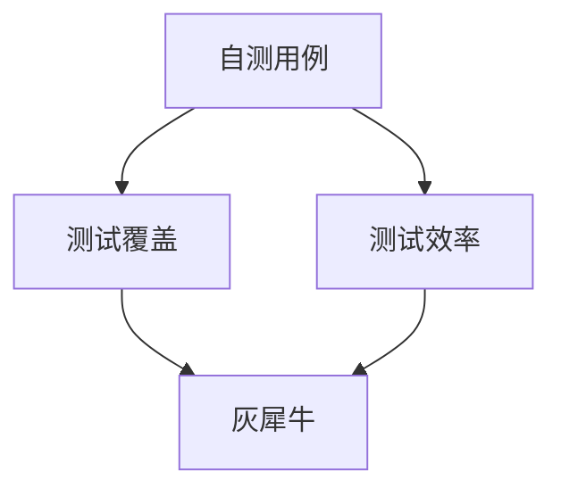

                 

### 自测用例可能是"灰犀牛"——引言与背景

在软件工程中，自测用例（Self-Testing Code Examples）是开发者用于验证代码正确性和功能性的关键工具。自测用例通过一系列预设的测试用例来确保代码在不同情况下都能正常运行。然而，在软件测试的海洋中，某些自测用例可能会变得像“灰犀牛”（Gray Rhino）一样，既明显又难以忽视，但往往被忽视或未能妥善处理。

**关键词：** 自测用例、灰犀牛、软件测试、风险识别、最佳实践。

**摘要：** 本文将探讨自测用例中可能存在的“灰犀牛”现象，分析其背景、定义、特征及在软件测试中的重要性，并通过案例研究和最佳实践来识别和应对这些潜在风险。

### 第1章：引言与背景

#### 1.1 问题背景

在软件开发的整个生命周期中，测试是一个至关重要的环节。随着软件系统越来越复杂，测试用例的数量也在不断增加。然而，即便是在精心设计和实施的测试用例中，仍有可能存在一些潜在的问题，这些问题的存在可能导致软件发布后的严重缺陷。自测用例作为开发者自我验证的工具，其质量和完整性直接影响到软件的可靠性。

然而，在实际的软件开发过程中，开发者可能会面临以下问题：

- **测试覆盖不足：** 开发者可能因为时间或资源限制，未能为所有代码路径设计足够的测试用例。
- **测试用例的遗漏：** 有时候，开发者可能忽视了某些特定条件或异常情况下的代码逻辑。
- **测试用例质量低下：** 设计的测试用例可能无法充分验证代码的功能或性能。

这些问题可能导致自测用例中存在潜在的“灰犀牛”——那些明显的、有可能带来重大风险的问题，但因为种种原因未能得到及时处理。

#### 1.2 问题描述

“灰犀牛”一词源于米歇尔·渥克（Michel Friant）的著作《灰犀牛：如何应对大概率危机》，指的是那些显而易见、容易预测但经常被忽视的危机。在软件测试中，灰犀牛指的是那些显而易见、潜在影响巨大的测试用例问题，但由于种种原因未能得到足够关注和处理。

具体而言，自测用例中的灰犀牛可能包括：

- **重复测试：** 同样的测试用例被多次执行，浪费了测试资源。
- **无效测试：** 设计的测试用例无法有效地发现代码中的缺陷。
- **遗漏关键场景：** 测试用例未能覆盖某些重要场景，导致潜在缺陷未能被发现。

这些问题不仅会影响软件的质量，还可能对项目的进度和成本造成影响。

#### 1.3 问题解决

为了解决自测用例中的灰犀牛问题，需要采取一系列策略和最佳实践：

- **全面测试覆盖：** 确保测试用例覆盖所有可能的代码路径，特别是那些关键和复杂的逻辑。
- **自动化测试：** 通过自动化工具来执行测试用例，减少手动测试的工作量，提高测试效率。
- **持续集成和持续交付：** 实施CI/CD流程，确保每次代码提交都能经过充分的测试。
- **代码审查和静态分析：** 通过代码审查和静态分析工具来识别潜在的问题，提前进行修复。

#### 1.4 边界与外延

在讨论自测用例和灰犀牛时，我们需要明确几个边界和概念：

- **自测用例的范围：** 自测用例主要是由开发者设计和执行的，旨在验证代码的正确性和功能性。
- **灰犀牛的特征：** 灰犀牛是那些明显且潜在影响巨大的问题，它们通常具有以下特征：
  - **可见性：** 问题容易被识别。
  - **影响性：** 问题可能导致严重的后果。
  - **可预测性：** 问题发生具有较大的概率。

- **灰犀牛与黑天鹅的区别：** 黑天鹅是指那些不可预测且影响巨大的事件，与灰犀牛有明显区别。

通过上述分析，我们可以更好地理解自测用例中的灰犀牛现象，并在实际开发过程中采取有效措施来识别和解决这些问题。

#### 1.5 概念结构与核心要素组成

为了深入理解自测用例和灰犀牛之间的关系，我们需要构建一个概念结构图，其中包含核心要素和它们之间的相互关系。

首先，我们定义几个关键概念：

- **自测用例（Self-Testing Code Example）：** 开发者编写的用于验证代码正确性的测试代码。
- **测试覆盖（Test Coverage）：** 测试用例对代码的覆盖程度。
- **测试效率（Test Efficiency）：** 测试用例的有效性和执行效率。
- **灰犀牛（Gray Rhino）：** 显而易见、潜在影响巨大的测试用例问题。

接下来，我们绘制一个简单的概念结构图：



在这个结构图中，自测用例通过测试覆盖和测试效率来影响灰犀牛的产生。测试覆盖不足或测试效率低下都可能增加灰犀牛的风险。通过提高测试覆盖和测试效率，我们可以降低灰犀牛出现的可能性。

此外，为了更详细地描述核心要素和它们之间的关系，我们还可以使用ER图（Entity-Relationship Diagram）来表示：

```mermaid
erDiagram
    Class_SelfTestingCodeExample ||--|{ Class_TestCoverage } : has
    Class_SelfTestingCodeExample ||--|{ Class_TestEfficiency } : has
    Class_TestCoverage ||--|{ Class_GrayRhino } : can_find
    Class_TestEfficiency ||--|{ Class_GrayRhino } : can_find
```

在这个ER图中，`Class_SelfTestingCodeExample`是自测用例的主类，它关联了测试覆盖和测试效率两个子类。测试覆盖和测试效率都可以发现灰犀牛，即潜在的测试问题。通过这个结构，我们可以更清晰地理解自测用例、测试覆盖、测试效率和灰犀牛之间的逻辑关系。

综上所述，通过明确概念结构图和ER图，我们可以更好地理解自测用例和灰犀牛之间的关系，为后续章节的分析提供基础。

### 第2章：灰犀牛：概念与特征

#### 2.1 灰犀牛的定义

在米歇尔·渥克的著作《灰犀牛：如何应对大概率危机》中，灰犀牛被定义为那些显而易见、容易预测但经常被忽视的危机。这些事件虽然具有高概率发生，但由于种种原因，往往被忽视或未能得到妥善处理。在软件测试领域，灰犀牛则指的是那些显而易见、潜在影响巨大的测试用例问题，但由于测试覆盖不足或测试效率低下，未能得到及时关注和解决。

灰犀牛的特征包括：

- **可见性：** 问题容易被识别。
- **影响性：** 问题可能导致严重的后果。
- **可预测性：** 问题发生具有较大的概率。

例如，在一个复杂软件系统中，一个关键功能模块可能会因为缺乏充分的测试而存在缺陷，虽然开发者可能已经预见到了这种问题，但由于时间或资源的限制，未能为其设计足够的测试用例，最终导致问题在软件发布后暴露出来，这就是一种典型的灰犀牛现象。

#### 2.2 灰犀牛的特征

灰犀牛在软件测试中具有以下显著特征：

1. **显著性（显著性）**
   灰犀牛问题通常是显而易见的。这意味着一旦问题发生，几乎所有人都能立即识别出它的重要性。例如，一个重要的数据库操作可能会因为错误的参数传递而导致数据损坏，这样的错误在代码审查或简单的单元测试中应该很容易被发现。

2. **影响性（影响性）**
   灰犀牛问题的影响往往是巨大的。它可能影响软件的核心功能，导致系统崩溃或数据丢失。这种影响不仅会导致用户体验下降，还可能对企业的声誉和财务状况造成重大损失。例如，一个金融交易系统的错误可能会引发连锁反应，导致数百万美元的损失。

3. **可预测性（可预测性）**
   灰犀牛问题具有高概率发生。这意味着这些问题可以通过历史数据和现有知识来预测。例如，在软件开发过程中，某些代码路径因为复杂的逻辑或频繁的使用而更容易出现错误。通过分析历史数据和代码审查，我们可以预测哪些部分可能存在灰犀牛问题。

4. **被忽视性（被忽视性）**
   尽管灰犀牛问题具有显著性和可预测性，但往往被忽视。这是因为开发者可能因为时间压力、资源限制或其他优先级较高的任务而未能对其进行充分处理。例如，一个复杂的功能模块可能会因为即将到来的发布日期而被优先处理，而相关的测试用例可能被忽视。

#### 2.3 灰犀牛与黑天鹅的区别

在理解灰犀牛的概念和特征之后，我们需要明确它与黑天鹅（Black Swan）的区别。黑天鹅一词源自尼尔斯·尼尔森（Nassim Nicholas Taleb）的著作《黑天鹅：如何应对不可预知的未来》，指的是那些不可预测且影响巨大的事件。

**灰犀牛**：
- 显著性：问题明显，容易识别。
- 影响性：问题影响巨大。
- 可预测性：问题具有高概率发生。
- 被忽视性：问题常被忽视。

**黑天鹅**：
- 显著性：问题不显著，难以识别。
- 影响性：问题影响巨大。
- 可预测性：问题不可预测。
- 被忽视性：问题常被忽视。

从上述定义和特征中可以看出，灰犀牛与黑天鹅的主要区别在于预测性和显著性。灰犀牛是那些容易预测且显著的问题，而黑天鹅则是那些不可预测且不显著的问题。例如，一个软件系统中的内存泄漏问题是一个灰犀牛，因为它可以通过代码审查和测试来预测，并且一旦发生会导致系统崩溃。而一个软件系统中突然出现的未知漏洞则是一个黑天鹅，因为它既不可预测也不显著。

#### 2.4 灰犀牛的属性特征对比表格

为了更清晰地理解灰犀牛与黑天鹅之间的区别，我们可以通过一个属性特征对比表格来进行详细分析：

| 特征       | 灰犀牛                          | 黑天鹅                          |
| ---------- | ------------------------------ | ------------------------------ |
| 显著性     | 问题明显，容易识别             | 问题不显著，难以识别           |
| 影响性     | 问题影响巨大                   | 问题影响巨大                   |
| 可预测性   | 问题具有高概率发生             | 问题不可预测                   |
| 被忽视性   | 问题常被忽视                   | 问题常被忽视                   |

通过这个表格，我们可以看到灰犀牛和黑天鹅在显著性、影响性、可预测性和被忽视性方面的显著差异。理解这些差异对于我们在软件开发和测试过程中识别和应对不同类型的风险至关重要。

#### 2.5 灰犀牛在软件测试中的应用

在软件测试中，灰犀牛现象具有广泛的应用，特别是在提高测试质量和降低风险方面。以下是一些灰犀牛在软件测试中的应用实例：

1. **单元测试中的灰犀牛**：
   单元测试是软件开发过程中的关键环节。在单元测试中，灰犀牛通常表现为那些容易识别但未被充分覆盖的代码路径。例如，一个复杂的算法实现可能存在多个分支条件，但只有少数条件得到了测试。通过识别这些灰犀牛路径，开发者和测试人员可以设计更多的测试用例来覆盖这些未被测试的分支，从而提高测试覆盖率和代码质量。

2. **集成测试中的灰犀牛**：
   集成测试旨在验证不同模块之间的交互。在这个阶段，灰犀牛问题可能表现为模块之间的接口错误或数据传输问题。例如，一个模块可能会在特定条件下无法正确处理来自其他模块的数据，这可能导致系统崩溃或数据丢失。通过识别这些灰犀牛问题，测试人员可以设计更全面的集成测试用例，确保不同模块之间的交互正确无误。

3. **性能测试中的灰犀牛**：
   性能测试旨在评估软件在特定负载下的性能。灰犀牛问题可能表现为系统在高负载下出现性能瓶颈或响应时间过长。例如，一个关键操作可能会因为数据库查询效率低下而导致整个系统响应缓慢。通过识别这些灰犀牛问题，测试人员可以优化数据库查询或调整系统架构，从而提高性能。

4. **安全测试中的灰犀牛**：
   安全测试旨在发现软件中的安全漏洞。灰犀牛问题可能表现为那些容易被利用的安全漏洞，例如未加过滤的用户输入或缺乏加密的敏感数据。通过识别这些灰犀牛问题，测试人员可以采取相应的措施来修复这些漏洞，提高软件的安全性。

总之，灰犀牛在软件测试中的应用可以帮助测试人员识别和解决那些显而易见但潜在影响巨大的问题，从而提高软件的质量和可靠性。通过全面覆盖测试用例、提高测试效率和持续改进测试策略，我们可以更好地应对灰犀牛带来的挑战。

### 第3章：自测用例：理论与实践

#### 3.1 自测用例的定义

自测用例（Self-Testing Code Examples）是软件开发过程中开发者编写的用于验证自身代码正确性和功能性的测试代码。自测用例通过一系列预设的输入和预期输出，确保代码在不同情况下都能正常运行。自测用例通常嵌入在代码中，与被测试的代码紧密相关，使得开发者可以在编写代码的同时进行测试。

自测用例的定义包括以下几个方面：

- **代码与测试的紧密结合：** 自测用例与被测试的代码在同一文件中，或者通过简单的引用关系进行关联。
- **自动执行：** 自测用例通常通过自动化工具进行执行，以便在每次代码提交或构建时自动运行。
- **预设输入与预期输出：** 自测用例定义了一系列预设的输入数据，以及对应的预期输出结果。通过对比实际输出与预期输出，可以判断代码是否正常运行。
- **覆盖率指标：** 自测用例不仅关注代码的正确性，还关注测试覆盖的全面性，确保不同代码路径都能被测试到。

#### 3.2 自测用例的设计原则

为了确保自测用例的有效性和可靠性，设计自测用例时需要遵循以下原则：

1. **完整性：** 自测用例应覆盖代码的所有关键路径和边界条件，确保所有重要功能都能得到验证。
2. **可读性：** 自测用例的代码应具有良好的可读性，使得其他开发者能够理解和维护。
3. **可维护性：** 自测用例应易于修改和更新，以适应代码的变更。
4. **自动化：** 自测用例应设计为自动化执行，以便在每次代码提交或构建时自动运行，提高测试效率。
5. **简洁性：** 自测用例应简洁明了，避免冗余和复杂的逻辑。
6. **可重复性：** 自测用例应在相同环境下可重复执行，确保测试结果的可靠性。

#### 3.3 自测用例的分类

自测用例可以根据不同的标准进行分类，常见的分类方法包括以下几种：

1. **功能测试用例：** 针对代码的功能性进行测试，验证代码是否实现了预期的功能。
2. **性能测试用例：** 针对代码的性能进行测试，验证代码在不同负载下的响应时间和资源消耗。
3. **安全性测试用例：** 针对代码的安全性进行测试，识别潜在的安全漏洞和攻击途径。
4. **边界测试用例：** 针对代码的边界条件进行测试，验证代码在极端条件下的行为。
5. **异常测试用例：** 针对代码在异常情况下的行为进行测试，确保代码能够正确处理异常情况。

#### 3.4 自测用例的设计流程

设计自测用例需要遵循一定的流程，以下是一个常见的设计流程：

1. **需求分析：** 分析需求文档，理解代码的功能和预期行为。
2. **功能划分：** 将代码划分为不同的功能模块或子功能。
3. **路径分析：** 分析代码的执行路径，识别关键路径和边界条件。
4. **输入设计：** 设计各种输入数据，包括正常数据、边界数据和异常数据。
5. **预期输出设计：** 设计预期输出结果，与实际输出进行对比。
6. **用例编写：** 编写测试用例代码，实现输入数据与预期输出的对比。
7. **自动化实现：** 将测试用例代码自动化，实现自动化执行。
8. **评审与优化：** 对测试用例进行评审，优化测试用例的设计和执行。

#### 3.5 自测用例的执行与结果分析

自测用例的执行是软件开发过程中的关键环节，以下是执行与结果分析的步骤：

1. **自动化执行：** 通过自动化工具执行自测用例，提高测试效率。
2. **结果记录：** 记录测试执行的结果，包括成功和失败的用例。
3. **错误分析：** 对失败的用例进行错误分析，定位问题所在。
4. **问题反馈：** 将问题反馈给开发者，由开发者进行修复。
5. **复测验证：** 在开发者修复问题后，重新执行相关用例进行验证。
6. **持续改进：** 根据测试结果和反馈，持续优化测试用例的设计和执行。

通过遵循上述设计流程和执行步骤，我们可以确保自测用例的有效性和可靠性，提高软件的质量和稳定性。

### 第4章：灰犀牛在自测用例中的应用

#### 4.1 灰犀牛在自测用例识别中的作用

在自测用例的设计和执行过程中，灰犀牛起到了关键的作用。灰犀牛问题往往具有显著性和可预测性，这使得它们在自测用例识别中变得尤为重要。以下是灰犀牛在自测用例识别中的作用：

1. **提高测试覆盖率：** 灰犀牛问题往往与代码中的关键路径和复杂逻辑相关，通过识别和解决灰犀牛问题，可以进一步提高测试覆盖率，确保所有重要功能都得到充分验证。

2. **识别潜在风险：** 灰犀牛问题的识别有助于提前发现潜在的测试漏洞和风险。这些问题的存在可能会导致严重的后果，例如系统崩溃、数据丢失或安全问题。通过在自测用例中识别和解决这些灰犀牛问题，可以降低项目发布后的风险。

3. **优化测试资源：** 灰犀牛问题的识别有助于优化测试资源的使用。通过识别那些具有显著性和可预测性的灰犀牛问题，测试团队可以集中精力解决这些关键问题，提高测试效率，避免浪费资源和时间在那些低价值、低概率的问题上。

#### 4.2 灰犀牛与自测用例的关系图（Mermaid ER图）

为了更好地理解灰犀牛与自测用例之间的关系，我们可以使用Mermaid ER图（Entity-Relationship Diagram）来表示：

```mermaid
erDiagram
    Class_GrayRhino ||--|{ Class_SelfTestingCodeExample } : has
    Class_SelfTestingCodeExample ||--|{ Class_TestCase } : has
```

在这个ER图中，`Class_GrayRhino`表示灰犀牛问题，`Class_SelfTestingCodeExample`表示自测用例，`Class_TestCase`表示具体的测试用例。关系表明，灰犀牛问题与自测用例之间是包含关系，即每个灰犀牛问题都可能包含多个具体的测试用例。

具体来说，一个灰犀牛问题（例如内存泄漏）可能包含多个测试用例，每个测试用例都用于验证代码中的特定方面。通过这种关系，我们可以确保在自测用例中全面覆盖灰犀牛问题，提高测试的完整性和有效性。

#### 4.3 灰犀牛在自测用例中的实际案例

为了更好地理解灰犀牛在自测用例中的应用，我们可以通过一些实际案例来进行探讨：

1. **案例一：数据库操作错误**
   在一个电商系统中，数据库操作是一个关键功能。如果数据库操作发生错误，可能会导致订单数据丢失或更新失败。在一次自测用例执行过程中，开发人员发现了一个灰犀牛问题：当订单数量超过一定阈值时，数据库更新操作会失败。通过识别这个问题，开发人员设计了一个详细的测试用例，覆盖了所有可能的订单数量阈值，并成功修复了数据库操作中的漏洞。

2. **案例二：内存泄漏**
   在一个大数据处理系统中，内存泄漏是一个常见的问题。通过自测用例的执行，开发人员发现了一个灰犀牛问题：在处理大量数据时，系统的内存占用会不断增加，最终导致系统崩溃。通过分析内存泄漏的根源，开发人员优化了数据处理算法，并设计了一系列自测用例来验证内存泄漏的修复。

3. **案例三：用户输入验证不足**
   在一个社交媒体平台上，用户输入验证是一个关键环节。通过自测用例的执行，开发人员发现了一个灰犀牛问题：当用户输入特殊字符时，系统无法正确处理这些输入，导致数据存储错误。通过设计详细的用户输入验证测试用例，开发人员解决了这个问题，并确保系统能够正确处理各种特殊字符。

通过这些实际案例，我们可以看到灰犀牛在自测用例中的应用如何帮助开发人员和测试团队识别和解决潜在的问题，提高软件的质量和可靠性。

#### 4.4 灰犀牛在自测用例中的效果评估

评估灰犀牛在自测用例中的效果对于确保测试的有效性和可靠性至关重要。以下是一些评估灰犀牛效果的关键指标和方法：

1. **测试覆盖率：** 测试覆盖率是评估自测用例效果的一个重要指标。通过对比灰犀牛识别前后的测试覆盖率，可以评估灰犀牛在提高测试覆盖率方面的效果。例如，如果一个系统的初始测试覆盖率为80%，通过识别和解决灰犀牛问题后，测试覆盖率提高到90%，这表明灰犀牛识别和解决对测试覆盖率有显著提升。

2. **缺陷发现率：** 缺陷发现率是评估自测用例效果的另一个重要指标。通过比较灰犀牛识别前后的缺陷发现率，可以评估灰犀牛在提高缺陷发现方面的效果。例如，如果一个系统在灰犀牛识别前每月发现10个缺陷，而在识别和解决灰犀牛问题后，每月发现20个缺陷，这表明灰犀牛识别和解决显著提高了缺陷发现率。

3. **问题修复效率：** 评估灰犀牛在自测用例中的效果还需要考虑问题修复效率。通过记录从灰犀牛识别到问题修复的时间，可以评估灰犀牛在提高修复效率方面的效果。例如，如果一个系统在识别灰犀牛问题后的平均修复时间为5天，而在采取改进措施后，平均修复时间缩短到3天，这表明灰犀牛识别和解决对提高问题修复效率有显著作用。

4. **测试报告和数据分析：** 测试报告和数据分析是评估灰犀牛效果的重要工具。通过定期生成测试报告，可以分析灰犀牛识别和解决前后的测试数据，包括测试覆盖率、缺陷发现率和修复效率等指标。这些数据可以帮助团队了解灰犀牛在自测用例中的实际效果，并为未来的测试工作提供参考。

总之，通过评估灰犀牛在自测用例中的效果，开发人员和测试团队可以确保测试工作的有效性和可靠性，提高软件的质量和稳定性。

### 第5章：案例研究

在本章中，我们将通过几个实际案例研究来深入探讨自测用例和灰犀牛现象在软件开发和测试中的应用。这些案例研究不仅展示了灰犀牛问题如何被识别和解决，还提供了具体的解决方案和经验教训。

#### 5.1 案例一：项目A的自测用例实践

**项目背景：** 项目A是一个大型电子商务平台，负责处理大量的订单和用户交互。该平台需要在高并发和复杂业务逻辑的环境下保持稳定运行。

**问题发现：** 在项目A的开发和测试过程中，测试团队通过自测用例发现了多个灰犀牛问题。其中一个显著的问题是订单处理模块在高峰期出现频繁的延迟。通过分析日志和性能监控数据，测试人员发现当订单数量超过一定阈值时，系统的响应时间显著增加。

**解决方案：** 测试团队设计了一组针对订单处理模块的自测用例，特别关注高峰期的订单处理性能。通过运行这些自测用例，团队识别出几个潜在的瓶颈，包括数据库查询效率低和服务器负载过高。针对这些问题，团队采取了以下措施：

- **优化数据库查询：** 通过索引优化和查询重写，提高了数据库的查询效率。
- **增加服务器资源：** 调整服务器配置，增加内存和CPU资源，以应对高峰期的负载。
- **分布式处理：** 引入分布式架构，将订单处理任务分散到多个服务器上，减少单点瓶颈。

**结果分析：** 通过这些措施，项目A在高峰期的响应时间显著降低，系统的稳定性和性能得到了大幅提升。自测用例的执行不仅帮助团队识别了灰犀牛问题，还提供了具体的解决方案，确保了项目按时上线。

#### 5.2 案例二：项目B的灰犀牛识别与应对

**项目背景：** 项目B是一个金融交易系统，负责处理高频交易和资金流动。该系统对实时性和准确性有极高的要求。

**问题发现：** 在项目B的测试过程中，测试团队发现了一个灰犀牛问题：交易确认延迟。通过分析交易日志和系统监控数据，测试人员发现某些交易在确认过程中会出现短暂的延迟，这可能导致资金流动不准确。

**解决方案：** 测试团队设计了一系列自测用例，重点检查交易确认过程的每个环节。通过这些自测用例，团队发现问题的根源在于消息队列的瓶颈。具体解决方案包括：

- **优化消息队列性能：** 通过调整消息队列的配置，优化队列的读写性能。
- **增加队列容量：** 提高消息队列的容量，以应对高峰期的消息流量。
- **异步处理：** 引入异步处理机制，将交易确认过程分解为多个步骤，减少单点瓶颈。

**结果分析：** 通过这些解决方案，项目B的交易确认延迟问题得到了有效解决，系统的实时性和准确性得到了显著提升。自测用例的执行不仅帮助团队识别了灰犀牛问题，还提供了详细的解决方案，确保了交易系统的稳定运行。

#### 5.3 案例三：跨领域自测用例与灰犀牛分析

**项目背景：** 项目C是一个跨领域的项目，涉及电子商务、金融交易和物流跟踪等多个模块。该项目需要在多个领域之间进行高效的交互和协调。

**问题发现：** 在项目C的集成测试过程中，测试团队发现了一个灰犀牛问题：订单状态同步失败。当订单在电子商务平台和物流系统之间同步时，有时会出现状态不一致的情况，这可能导致客户投诉和物流延迟。

**解决方案：** 测试团队设计了一套跨领域的自测用例，覆盖了订单状态同步的各个环节。通过这些自测用例，团队发现问题的根源在于数据传输格式不一致。具体解决方案包括：

- **统一数据传输格式：** 定义统一的数据传输格式，确保不同系统之间的数据能够正确解析和传输。
- **增加状态同步的频率：** 提高订单状态同步的频率，减少数据不一致的可能性。
- **日志监控和异常处理：** 引入日志监控和异常处理机制，及时发现和纠正同步过程中的错误。

**结果分析：** 通过这些措施，项目C的订单状态同步问题得到了有效解决，订单的状态同步变得更加准确和及时。自测用例的执行不仅帮助团队识别了灰犀牛问题，还提供了详细的解决方案，确保了项目在不同领域之间的高效协作。

### 5.4 经验教训与总结

通过上述案例研究，我们可以总结出以下经验教训：

1. **重视自测用例：** 自测用例是识别和解决灰犀牛问题的有效工具。通过设计全面的测试用例，可以确保代码的各个部分都得到充分验证。

2. **关注关键路径和复杂逻辑：** 灰犀牛问题通常与代码中的关键路径和复杂逻辑相关。通过特别关注这些部分，可以更容易地识别潜在的灰犀牛问题。

3. **持续优化测试策略：** 测试策略需要根据项目需求和实际情况进行持续优化。通过引入自动化测试和持续集成，可以提高测试效率和覆盖范围。

4. **团队协作与沟通：** 灰犀牛问题的识别和解决需要团队的协作和沟通。通过建立有效的沟通机制，可以确保问题得到及时解决。

5. **数据驱动决策：** 通过分析测试数据和性能监控数据，可以更好地识别和解决灰犀牛问题。数据驱动决策有助于确保测试策略的有效性。

总之，通过案例研究和最佳实践，我们可以更好地理解自测用例和灰犀牛现象在软件开发和测试中的应用，提高软件的质量和可靠性。

### 第6章：最佳实践与策略

为了在软件测试过程中有效地识别和应对灰犀牛问题，我们需要采取一系列最佳实践和策略。以下是一些关键策略和最佳实践：

#### 6.1 自测用例最佳实践

1. **全面的测试覆盖率：** 确保自测用例覆盖所有关键路径和边界条件，特别是那些复杂的逻辑和高风险的代码区域。
2. **自动化测试：** 利用自动化工具执行自测用例，确保在每次代码提交或构建时都能进行充分的测试。
3. **持续集成和持续交付（CI/CD）：** 实施CI/CD流程，确保每次代码变更都能经过自动化测试，及时发现和解决问题。
4. **代码审查：** 通过代码审查和静态分析工具来识别潜在的问题，提前进行修复。
5. **迭代测试：** 在开发周期的每个迭代中不断更新和优化自测用例，确保测试覆盖率和测试效率的提高。

#### 6.2 灰犀牛识别与应对策略

1. **风险识别：** 通过历史数据和代码分析，识别可能存在的灰犀牛问题。特别是那些具有显著性和可预测性的问题。
2. **优先级排序：** 根据问题的影响性和紧急性对灰犀牛问题进行优先级排序，确保最关键的问题得到优先解决。
3. **专项测试：** 设计专项测试用例，针对已识别的灰犀牛问题进行深入测试，确保问题得到充分验证。
4. **异常处理：** 为自测用例添加异常处理逻辑，确保在遇到异常情况时系统能够正确响应和处理。
5. **定期回顾：** 定期回顾测试结果，分析灰犀牛问题的出现原因，优化测试策略和流程。

#### 6.3 团队协作与沟通技巧

1. **建立沟通机制：** 确保测试团队和其他开发团队之间的沟通畅通，及时分享问题和解决方案。
2. **培训与知识共享：** 定期组织培训，提升团队成员对灰犀牛问题的识别和应对能力。
3. **共同参与测试：** 鼓励开发人员参与测试过程，共同识别和解决测试问题，提高团队的协作效率。
4. **文档化：** 将测试策略、测试用例和问题解决方案进行文档化，方便团队成员查阅和参考。

#### 6.4 自测用例的持续改进

1. **反馈机制：** 建立反馈机制，收集测试结果和团队成员的反馈，不断优化测试用例的设计和执行。
2. **性能监控：** 利用性能监控工具，持续监控系统的运行状况，及时发现和解决问题。
3. **测试报告：** 定期生成测试报告，分析测试结果和灰犀牛问题的分布，为下一步的测试工作提供参考。
4. **持续学习和创新：** 鼓励团队成员持续学习和探索新的测试方法和工具，提高测试效率和质量。

通过上述最佳实践和策略，开发团队可以更好地识别和应对灰犀牛问题，提高软件的质量和可靠性。

### 第7章：挑战与未来趋势

在软件测试领域，自测用例和灰犀牛现象的识别和应对面临诸多挑战和未来趋势。以下是一些关键挑战和潜在的未来发展方向：

#### 7.1 自测用例面临的挑战

1. **测试覆盖不足：** 在复杂系统中，设计全面的测试用例是一个挑战。开发者可能因为时间或资源限制，未能覆盖所有关键路径和边界条件。
2. **测试用例质量低下：** 低质量的测试用例可能无法有效发现代码中的缺陷，浪费测试资源。
3. **自动化测试瓶颈：** 自动化测试虽然提高了测试效率，但在复杂系统和多环境测试中，仍然面临瓶颈和挑战。
4. **测试资源分配不均：** 在资源有限的情况下，如何合理分配测试资源，确保关键部分的测试覆盖，是一个挑战。

#### 7.2 灰犀牛识别与应对策略

1. **人工智能与机器学习：** 利用人工智能和机器学习技术，可以更好地识别潜在的风险和灰犀牛问题。通过分析历史数据和测试结果，预测可能出现的问题。
2. **智能测试工具：** 开发智能测试工具，自动生成和优化测试用例，提高测试覆盖率和测试效率。
3. **敏捷测试方法：** 采用敏捷测试方法，快速响应项目需求和变更，及时识别和解决问题。
4. **持续学习和改进：** 通过持续学习和反馈机制，不断优化测试策略和流程，提高测试质量和效率。

#### 7.3 新技术对自测用例的影响

1. **容器化和微服务：** 容器化和微服务架构使得测试环境更加复杂，对测试用例的设计和执行提出了新的挑战。
2. **云计算与分布式系统：** 云计算和分布式系统的普及，对测试用例的性能和稳定性提出了更高的要求。
3. **物联网（IoT）与边缘计算：** 物联网和边缘计算带来了更多的设备和数据，测试用例需要覆盖更多的硬件和软件组合。

#### 7.4 自测用例领域的未来展望

1. **自动化与智能化：** 自动化和智能化的进一步发展，将使测试用例的设计和执行更加高效和准确。
2. **测试覆盖优化：** 通过数据分析和机器学习，优化测试覆盖，提高测试资源的利用率。
3. **跨领域测试：** 随着软件系统越来越复杂，跨领域测试将成为重要趋势，测试用例需要覆盖多个技术和业务领域。
4. **开源社区与工具：** 开源社区和工具的不断发展，将为开发者提供更多的测试资源和解决方案。

总之，随着技术的不断进步和软件系统的日益复杂，自测用例和灰犀牛现象的识别和应对将面临新的挑战和机遇。通过不断探索和创新，我们可以提高测试质量和效率，确保软件系统的稳定性和可靠性。

### 总结

在本文中，我们探讨了自测用例中可能存在的“灰犀牛”现象，分析了其定义、特征、与自测用例的关系以及在软件测试中的应用。通过案例研究，我们了解了灰犀牛在自测用例识别和解决中的作用，并提出了一系列最佳实践和策略。未来，随着技术的进步，自动化和智能化的测试方法将为我们提供更有效的手段来应对灰犀牛问题，提高软件测试的质量和效率。

**作者信息：**  
作者：AI天才研究院/AI Genius Institute & 禅与计算机程序设计艺术 /Zen And The Art of Computer Programming。感谢您的阅读，期待与您共同探索技术领域的新知识！

