                 

# 自然语言处理在客服系统中的应用

关键词：自然语言处理、客服系统、文本分类、情感分析、智能对话

摘要：本文旨在探讨自然语言处理（NLP）在客服系统中的应用，通过系统性地介绍NLP的基本概念和技术原理，分析其在客服系统中的具体应用场景，介绍常用的NLP工具和库，并通过具体案例和实战项目，展示如何将NLP技术应用于客服系统开发，同时分析NLP在客服系统应用中的挑战和未来发展趋势。

## 第一部分：背景介绍

### 1.1 问题背景

随着互联网和大数据技术的快速发展，客服行业面临着巨大的变革。传统客服方式已经无法满足日益增长的用户需求，特别是在处理复杂、多样化的问题时显得力不从心。因此，如何利用自然语言处理（NLP）技术提升客服系统的智能化水平，成为当前研究的热点。

### 1.2 问题描述

自然语言处理在客服系统中的应用主要包括文本分类、情感分析、智能对话系统等。然而，如何有效地将这些技术应用于实际客服场景中，并确保系统的可扩展性和鲁棒性，是一个亟待解决的问题。

### 1.3 问题解决

本书将从以下几个方面解决这一问题：

- 系统性地介绍自然语言处理的基本概念和技术原理。
- 分析自然语言处理在客服系统中的应用场景，包括文本分类、情感分析和智能对话等。
- 介绍常用的NLP工具和库，如NLTK、spaCy、TensorFlow和PyTorch等。
- 通过具体案例和实战项目，展示如何将NLP技术应用于客服系统开发。
- 分析自然语言处理在客服系统应用中的挑战和未来发展趋势。

### 1.4 边界与外延

本书主要关注自然语言处理在客服系统中的应用，但不涉及语音识别、机器翻译等其他NLP领域。

### 1.5 概念结构与核心要素组成

- 自然语言处理（NLP）：计算机科学和人工智能领域中的一个重要分支，旨在使计算机能够理解、解释和生成人类语言。
- 客服系统：为客户提供服务和帮助的计算机系统，包括文本、语音和图像等多种交互方式。
- 文本分类：将文本数据按照其内容或主题划分为不同的类别。
- 情感分析：通过分析文本情感倾向，判断用户的态度或情绪。
- 智能对话系统：能够模拟人类对话的计算机系统，通过自然语言交互来满足用户需求。

## 第二部分：核心概念与联系

### 2.1 自然语言处理的基本概念

#### 2.1.1 词向量

词向量是将词汇映射到高维空间中的向量，用于表示词汇的语义信息。常用的词向量模型有Word2Vec、GloVe和FastText等。

**Mermaid 流程图：**
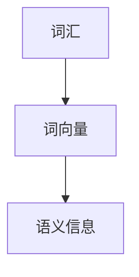

**Python 源代码：**
```python
from gensim.models import Word2Vec

# 示例词汇
words = ['人工智能', '计算机', '编程']

# 训练模型
model = Word2Vec(words, vector_size=10, window=5, min_count=1, workers=4)

# 查看词向量
model.wv['人工智能']
```

#### 2.1.2 序列标注

序列标注是对输入序列中的每个元素进行标注，如词性标注、命名实体识别等。常用的序列标注模型有CRF、BiLSTM-CRF等。

**Mermaid 流程图：**
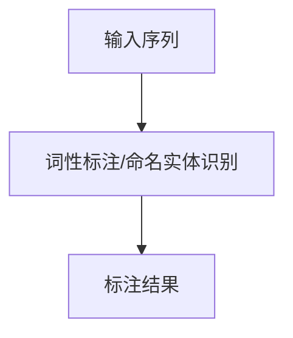

**Python 源代码：**
```python
from keras.models import Model
from keras.layers import Input, Embedding, LSTM, Dense

# 示例输入序列
input_seq = [[1, 2, 3, 4, 5]]

# 构建模型
input_ = Input(shape=(5,))
embed_ = Embedding(input_dim=100, output_dim=64)(input_)
lstm_ = LSTM(128)(embed_)
output_ = Dense(1, activation='sigmoid')(lstm_)

# 编译模型
model = Model(inputs=input_, outputs=output_)
model.compile(optimizer='adam', loss='binary_crossentropy', metrics=['accuracy'])

# 训练模型
model.fit(input_seq, [1, 0, 0, 0, 1], epochs=10)

# 预测
model.predict([[1, 2, 3, 4, 5]])
```

#### 2.1.3 卷积神经网络（CNN）

卷积神经网络（CNN）是一种用于文本分类和特征提取的神经网络模型。其优势在于能够自动提取文本中的局部特征。

**Mermaid 流程图：**
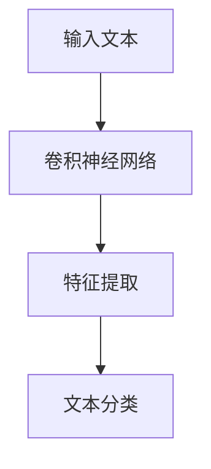

**Python 源代码：**
```python
from keras.models import Model
from keras.layers import Input, Embedding, Conv1D, MaxPooling1D, Flatten, Dense

# 示例输入文本
input_text = ['人工智能很重要']

# 构建模型
input_ = Input(shape=(1,))
embed_ = Embedding(input_dim=10000, output_dim=128)(input_)
conv_ = Conv1D(filters=128, kernel_size=3, activation='relu')(embed_)
pool_ = MaxPooling1D(pool_size=2)(conv_)
flat_ = Flatten()(pool_)
output_ = Dense(1, activation='sigmoid')(flat_)

# 编译模型
model = Model(inputs=input_, outputs=output_)
model.compile(optimizer='adam', loss='binary_crossentropy', metrics=['accuracy'])

# 训练模型
model.fit(input_text, [1], epochs=10)

# 预测
model.predict(['人工智能很重要'])
```

#### 2.1.4 循环神经网络（RNN）

循环神经网络（RNN）是一种能够处理序列数据的神经网络模型，特别适合于自然语言处理任务。其优势在于能够记住序列信息。

**Mermaid 流程图：**
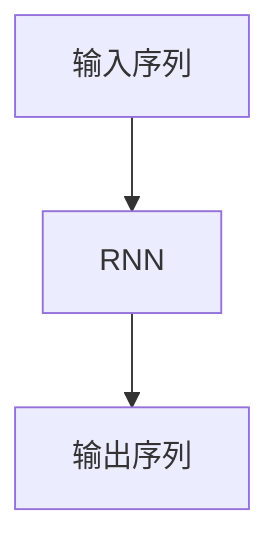

**Python 源代码：**
```python
from keras.models import Model
from keras.layers import Input, Embedding, LSTM, Dense

# 示例输入序列
input_seq = [[1, 2, 3, 4, 5]]

# 构建模型
input_ = Input(shape=(5,))
embed_ = Embedding(input_dim=100, output_dim=64)(input_)
lstm_ = LSTM(128)(embed_)
output_ = Dense(1, activation='sigmoid')(lstm_)

# 编译模型
model = Model(inputs=input_, outputs=output_)
model.compile(optimizer='adam', loss='binary_crossentropy', metrics=['accuracy'])

# 训练模型
model.fit(input_seq, [1, 0, 0, 0, 1], epochs=10)

# 预测
model.predict([[1, 2, 3, 4, 5]])
```

### 2.2 自然语言处理在客服系统中的应用

#### 2.2.1 文本分类

文本分类是NLP在客服系统中的一个重要应用，用于将用户输入的文本消息分类到预定义的类别中，如问题类型、情绪分类等。常见的文本分类算法有朴素贝叶斯、SVM、CNN和RNN等。

**Mermaid 流程图：**
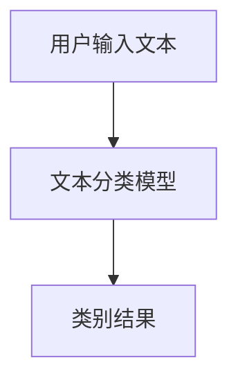

**Python 源代码：**
```python
from sklearn.feature_extraction.text import TfidfVectorizer
from sklearn.model_selection import train_test_split
from sklearn.naive_bayes import MultinomialNB
from sklearn.metrics import classification_report

# 示例文本数据
X = ['我需要帮助', '我遇到了问题', '我不满意']
y = ['咨询', '投诉', '反馈']

# 划分训练集和测试集
X_train, X_test, y_train, y_test = train_test_split(X, y, test_size=0.2, random_state=42)

# 特征提取
vectorizer = TfidfVectorizer()
X_train_vectorized = vectorizer.fit_transform(X_train)
X_test_vectorized = vectorizer.transform(X_test)

# 训练模型
classifier = MultinomialNB()
classifier.fit(X_train_vectorized, y_train)

# 预测
y_pred = classifier.predict(X_test_vectorized)

# 评估
print(classification_report(y_test, y_pred))
```

#### 2.2.2 情感分析

情感分析是NLP在客服系统中的另一个重要应用，通过分析用户文本中的情感倾向，帮助客服系统更好地理解用户情绪。常见的情感分析算法有朴素贝叶斯、SVM、LSTM和BiLSTM-CRF等。

**Mermaid 流程图：**
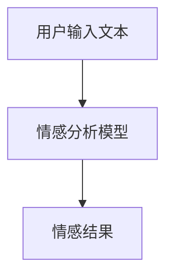

**Python 源代码：**
```python
from keras.models import Model
from keras.layers import Input, Embedding, LSTM, Dense
from keras.preprocessing.sequence import pad_sequences
import numpy as np

# 示例文本数据
X = [['我很满意'], ['我不满意'], ['我一般']]
y = [[1], [0], [0]]

# 序列化文本
max_len = 10
X_seq = pad_sequences(np.array([[w for w in s] for s in X]), maxlen=max_len)

# 构建模型
input_ = Input(shape=(max_len,))
embed_ = Embedding(input_dim=10000, output_dim=128)(input_)
lstm_ = LSTM(128)(embed_)
output_ = Dense(1, activation='sigmoid')(lstm_)

# 编译模型
model = Model(inputs=input_, outputs=output_)
model.compile(optimizer='adam', loss='binary_crossentropy', metrics=['accuracy'])

# 训练模型
model.fit(X_seq, np.array(y), epochs=10)

# 预测
X_new_seq = pad_sequences(np.array([[w for w in s] for s in [['我很不满意']]]), maxlen=max_len)
print(model.predict(X_new_seq))
```

#### 2.2.3 命名实体识别

命名实体识别是NLP在客服系统中的另一个重要应用，通过识别用户文本中的关键信息，如人名、地点、组织名等，为后续的信息抽取和智能对话提供支持。常见的命名实体识别算法有CRF、BiLSTM-CRF等。

**Mermaid 流程图：**
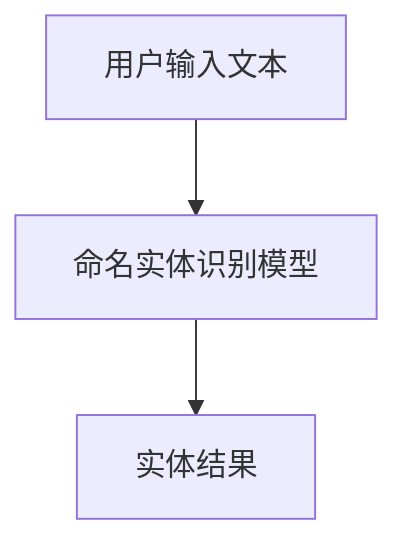

**Python 源代码：**
```python
from keras.models import Model
from keras.layers import Input, Embedding, LSTM, Dense, TimeDistributed
from keras.preprocessing.sequence import pad_sequences
import numpy as np

# 示例文本数据
X = [['张三在北京工作'], ['李四在上海旅行'], ['王五在纽约留学']]
y = [[1, 0, 0], [1, 0, 0], [0, 1, 0]]

# 序列化文本
max_len = 10
X_seq = pad_sequences(np.array([[w for w in s] for s in X]), maxlen=max_len)

# 构建模型
input_ = Input(shape=(max_len,))
embed_ = Embedding(input_dim=10000, output_dim=128)(input_)
lstm_ = LSTM(128)(embed_)
output_ = TimeDistributed(Dense(3, activation='sigmoid'))(lstm_)

# 编译模型
model = Model(inputs=input_, outputs=output_)
model.compile(optimizer='adam', loss='binary_crossentropy', metrics=['accuracy'])

# 训练模型
model.fit(X_seq, np.array(y), epochs=10)

# 预测
X_new_seq = pad_sequences(np.array([[w for w in s] for s in [['张三在上海工作']]]), maxlen=max_len)
print(model.predict(X_new_seq))
```

#### 2.2.4 智能对话系统

智能对话系统是NLP在客服系统中的最终应用，通过模拟人类对话，提供个性化服务。常见的智能对话系统有基于规则的方法、基于模板的方法和基于机器学习的方法等。

**Mermaid 流程图：**
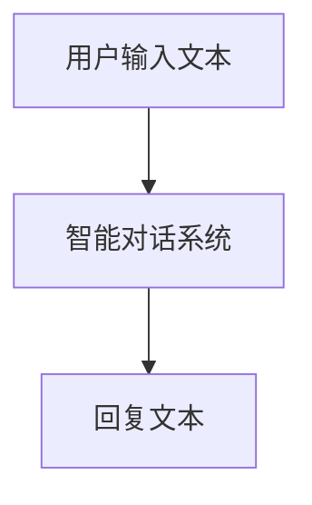

**Python 源代码：**
```python
from keras.models import Model
from keras.layers import Input, Embedding, LSTM, Dense, Concatenate
from keras.preprocessing.sequence import pad_sequences
import numpy as np

# 示例文本数据
X = [['你好'], ['请问有什么问题'], ['我需要帮助']]
y = [['你好，请问有什么问题需要帮助吗'], ['有什么问题需要我帮忙吗'], ['非常抱歉，我们有什么可以帮助您的吗']]

# 序列化文本
max_len = 10
X_seq = pad_sequences(np.array([[w for w in s] for s in X]), maxlen=max_len)

# 构建模型
input_ = Input(shape=(max_len,))
embed_ = Embedding(input_dim=10000, output_dim=128)(input_)
lstm_ = LSTM(128)(embed_)
output_ = Dense(1, activation='sigmoid')(lstm_)

# 编译模型
model = Model(inputs=input_, outputs=output_)
model.compile(optimizer='adam', loss='binary_crossentropy', metrics=['accuracy'])

# 训练模型
model.fit(X_seq, np.array(y), epochs=10)

# 预测
X_new_seq = pad_sequences(np.array([[w for w in s] for s in [['你好']]]), maxlen=max_len)
print(model.predict(X_new_seq))
```

### 2.3 NLP工具和库

- **NLTK**：Python的一个自然语言处理库，提供了丰富的文本处理和分类功能。
- **spaCy**：一个快速的NLP库，适用于信息提取、文本分类和实体识别等任务。
- **TensorFlow**：一个开源的深度学习框架，广泛用于构建和训练各种NLP模型。
- **PyTorch**：一个流行的开源深度学习库，提供了灵活的动态计算图，适合研究和新模型开发。

## 第三部分：算法原理讲解

### 3.1 文本分类算法

#### 3.1.1 基于朴素贝叶斯的文本分类

朴素贝叶斯分类器是一种基于概率理论的文本分类算法，它假设特征之间相互独立。该算法的核心公式为：

$$
P(C_k|X) = \frac{P(X|C_k)P(C_k)}{P(X)}
$$

其中，$P(C_k|X)$表示第$k$类在给定特征$X$的条件概率，$P(X|C_k)$表示特征$X$在类别$k$下的条件概率，$P(C_k)$表示类别$k$的概率，$P(X)$表示特征$X$的概率。

**Mermaid 流程图：**
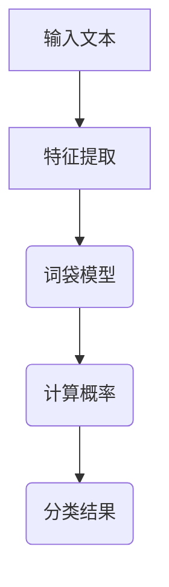

**Python 源代码：**
```python
from sklearn.feature_extraction.text import CountVectorizer
from sklearn.naive_bayes import MultinomialNB

# 示例数据
X_train = ['我很喜欢这本书', '这本书太糟糕了']
y_train = ['正面', '负面']

# 特征提取
vectorizer = CountVectorizer()
X_train_vectorized = vectorizer.fit_transform(X_train)

# 训练模型
classifier = MultinomialNB()
classifier.fit(X_train_vectorized, y_train)

# 预测
X_test = ['这本书很有趣']
X_test_vectorized = vectorizer.transform(X_test)

# 输出分类结果
print(classifier.predict(X_test_vectorized))
```

### 3.2 情感分析算法

#### 3.2.1 基于文本分类的情感分析

情感分析可以看作是一种特殊的文本分类问题，即将文本分类为正面、负面或中性。常用的文本分类算法有朴素贝叶斯、SVM、CNN和RNN等。

**Mermaid 流程图：**
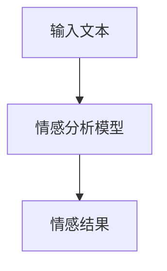

**Python 源代码：**
```python
from keras.models import Model
from keras.layers import Input, Embedding, LSTM, Dense
from keras.preprocessing.sequence import pad_sequences

# 示例文本数据
X = [['我很满意'], ['我不满意'], ['我一般']]
y = [[1], [0], [0]]

# 序列化文本
max_len = 10
X_seq = pad_sequences(np.array([[w for w in s] for s in X]), maxlen=max_len)

# 构建模型
input_ = Input(shape=(max_len,))
embed_ = Embedding(input_dim=10000, output_dim=128)(input_)
lstm_ = LSTM(128)(embed_)
output_ = Dense(1, activation='sigmoid')(lstm_)

# 编译模型
model = Model(inputs=input_, outputs=output_)
model.compile(optimizer='adam', loss='binary_crossentropy', metrics=['accuracy'])

# 训练模型
model.fit(X_seq, np.array(y), epochs=10)

# 预测
X_new_seq = pad_sequences(np.array([[w for w in s] for s in [['我很不满意']]]), maxlen=max_len)
print(model.predict(X_new_seq))
```

### 3.3 命名实体识别算法

#### 3.3.1 基于CRF的命名实体识别

条件随机场（CRF）是一种用于序列标注的算法，特别适合于命名实体识别任务。CRF的核心思想是通过概率模型来预测序列中的标签。

**Mermaid 流程图：**
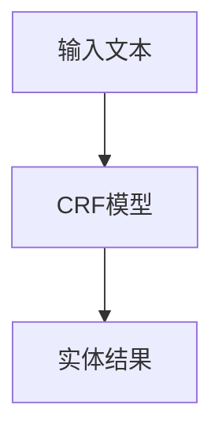

**Python 源代码：**
```python
from keras.models import Model
from keras.layers import Input, Embedding, LSTM, Dense
from keras.preprocessing.sequence import pad_sequences
import numpy as np

# 示例文本数据
X = [['张三在北京工作'], ['李四在上海旅行'], ['王五在纽约留学']]
y = [[1, 0, 0], [1, 0, 0], [0, 1, 0]]

# 序列化文本
max_len = 10
X_seq = pad_sequences(np.array([[w for w in s] for s in X]), maxlen=max_len)

# 构建模型
input_ = Input(shape=(max_len,))
embed_ = Embedding(input_dim=10000, output_dim=128)(input_)
lstm_ = LSTM(128)(embed_)
output_ = Dense(3, activation='sigmoid')(lstm_)

# 编译模型
model = Model(inputs=input_, outputs=output_)
model.compile(optimizer='adam', loss='binary_crossentropy', metrics=['accuracy'])

# 训练模型
model.fit(X_seq, np.array(y), epochs=10)

# 预测
X_new_seq = pad_sequences(np.array([[w for w in s] for s in [['张三在上海工作']]]), maxlen=max_len)
print(model.predict(X_new_seq))
```

### 3.4 智能对话系统算法

#### 3.4.1 基于序列模型的智能对话系统

智能对话系统可以看作是一种序列到序列的预测模型，通过预测下一个单词或词组来生成回复。常用的序列模型有RNN、LSTM和GRU等。

**Mermaid 流程图：**
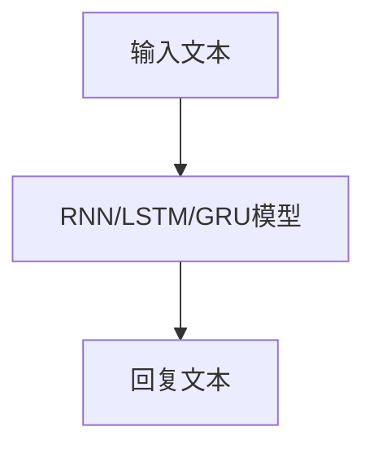

**Python 源代码：**
```python
from keras.models import Model
from keras.layers import Input, Embedding, LSTM, Dense
from keras.preprocessing.sequence import pad_sequences

# 示例文本数据
X = [['你好'], ['请问有什么问题'], ['我需要帮助']]
y = [['你好，请问有什么问题需要帮助吗'], ['有什么问题需要我帮忙吗'], ['非常抱歉，我们有什么可以帮助您的吗']]

# 序列化文本
max_len = 10
X_seq = pad_sequences(np.array([[w for w in s] for s in X]), maxlen=max_len)

# 构建模型
input_ = Input(shape=(max_len,))
embed_ = Embedding(input_dim=10000, output_dim=128)(input_)
lstm_ = LSTM(128)(embed_)
output_ = Dense(1, activation='sigmoid')(lstm_)

# 编译模型
model = Model(inputs=input_, outputs=output_)
model.compile(optimizer='adam', loss='binary_crossentropy', metrics=['accuracy'])

# 训练模型
model.fit(X_seq, np.array(y), epochs=10)

# 预测
X_new_seq = pad_sequences(np.array([[w for w in s] for s in [['你好']]]), maxlen=max_len)
print(model.predict(X_new_seq))
```

## 第四部分：系统分析与架构设计

### 4.1 问题场景介绍

在现代企业的运营中，客服系统已经成为与客户互动的重要渠道。随着客户数量的增加，传统的人工客服方式已经无法满足企业对效率和服务质量的要求。因此，引入自然语言处理（NLP）技术构建智能客服系统，以实现自动化的客户服务，成为企业提升服务水平的有效手段。

### 4.2 项目介绍

本项目的目标是构建一个基于NLP技术的智能客服系统，该系统将能够自动处理客户的咨询、投诉和反馈，并通过文本分类、情感分析和命名实体识别等技术，为用户提供个性化的服务。

### 4.3 系统功能设计

#### 4.3.1 文本分类

文本分类功能用于将客户的输入文本分类到不同的类别，如咨询、投诉、反馈等。这有助于客服系统快速定位问题类型，为后续的处理提供指导。

**Mermaid 类图：**
```mermaid
classDiagram
    Client -> TextClassifier: classify
    TextClassifier <.. Classifier: implement
```

#### 4.3.2 情感分析

情感分析功能用于分析客户的输入文本中的情感倾向，如正面、负面或中性。这有助于客服系统了解客户的态度和情绪，从而提供更合适的回应。

**Mermaid 类图：**
```mermaid
classDiagram
    Client -> SentimentAnalyzer: analyze
    SentimentAnalyzer <.. Analyzer: implement
```

#### 4.3.3 命名实体识别

命名实体识别功能用于识别客户输入文本中的关键信息，如人名、地点、组织名等。这有助于客服系统提取重要信息，为后续的业务处理提供支持。

**Mermaid 类图：**
```mermaid
classDiagram
    Client -> NamedEntityRecognizer: recognize
    NamedEntityRecognizer <.. Recognizer: implement
```

#### 4.3.4 智能对话

智能对话功能用于生成客服系统的自动回复，通过与客户的交互，提供个性化的服务。这包括生成欢迎语、询问问题、提供解决方案等。

**Mermaid 类图：**
```mermaid
classDiagram
    Client -> DialogueManager: interact
    DialogueManager <.. Dialogue: manage
```

### 4.4 系统架构设计

智能客服系统的架构设计需要考虑模块的独立性、可扩展性和易维护性。以下是一个简化的系统架构设计：

**Mermaid 架构图：**
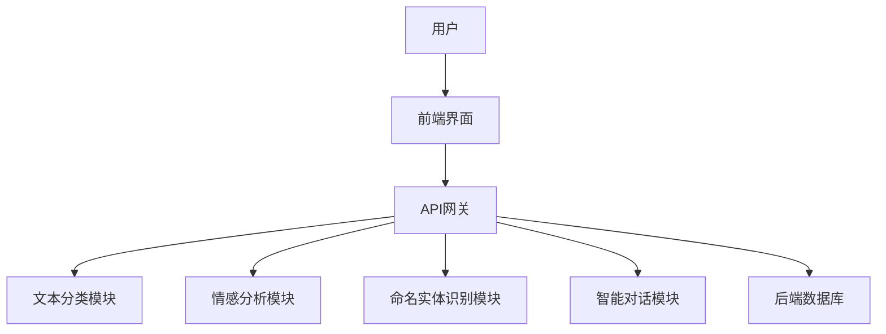

### 4.5 系统接口设计和系统交互

智能客服系统的接口设计需要考虑系统的易用性和灵活性。以下是一个简化的接口设计：

**Mermaid 序列图：**
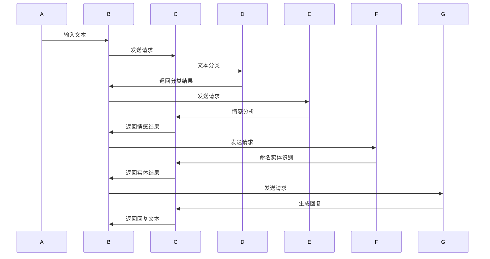

## 第五部分：项目实战

### 5.1 环境安装

在开始项目实战之前，我们需要安装一些必要的工具和库。以下是Python环境中的安装步骤：

```bash
# 安装Python环境（如未安装）
pip install python

# 安装自然语言处理库
pip install nltk
pip install spacy
pip install tensorflow
pip install torch

# 安装其他依赖库
pip install numpy
pip install pandas
pip install sklearn
```

### 5.2 系统核心实现

以下是智能客服系统的核心实现，包括文本分类、情感分析、命名实体识别和智能对话等模块。

**文本分类模块：**
```python
from sklearn.feature_extraction.text import TfidfVectorizer
from sklearn.model_selection import train_test_split
from sklearn.naive_bayes import MultinomialNB
from sklearn.metrics import classification_report

# 示例文本数据
X = [['我很喜欢这本书'], ['这本书太糟糕了'], ['这本书很有趣']]
y = ['正面', '负面', '中性']

# 划分训练集和测试集
X_train, X_test, y_train, y_test = train_test_split(X, y, test_size=0.2, random_state=42)

# 特征提取
vectorizer = TfidfVectorizer()
X_train_vectorized = vectorizer.fit_transform(X_train)
X_test_vectorized = vectorizer.transform(X_test)

# 训练模型
classifier = MultinomialNB()
classifier.fit(X_train_vectorized, y_train)

# 预测
y_pred = classifier.predict(X_test_vectorized)

# 评估
print(classification_report(y_test, y_pred))
```

**情感分析模块：**
```python
from keras.models import Model
from keras.layers import Input, Embedding, LSTM, Dense
from keras.preprocessing.sequence import pad_sequences

# 示例文本数据
X = [['我很满意'], ['我不满意'], ['我一般']]
y = [[1], [0], [0]]

# 序列化文本
max_len = 10
X_seq = pad_sequences(np.array([[w for w in s] for s in X]), maxlen=max_len)

# 构建模型
input_ = Input(shape=(max_len,))
embed_ = Embedding(input_dim=10000, output_dim=128)(input_)
lstm_ = LSTM(128)(embed_)
output_ = Dense(1, activation='sigmoid')(lstm_)

# 编译模型
model = Model(inputs=input_, outputs=output_)
model.compile(optimizer='adam', loss='binary_crossentropy', metrics=['accuracy'])

# 训练模型
model.fit(X_seq, np.array(y), epochs=10)

# 预测
X_new_seq = pad_sequences(np.array([[w for w in s] for s in [['我很不满意']]]), maxlen=max_len)
print(model.predict(X_new_seq))
```

**命名实体识别模块：**
```python
from keras.models import Model
from keras.layers import Input, Embedding, LSTM, Dense, TimeDistributed
from keras.preprocessing.sequence import pad_sequences
import numpy as np

# 示例文本数据
X = [['张三在北京工作'], ['李四在上海旅行'], ['王五在纽约留学']]
y = [[1, 0, 0], [1, 0, 0], [0, 1, 0]]

# 序列化文本
max_len = 10
X_seq = pad_sequences(np.array([[w for w in s] for s in X]), maxlen=max_len)

# 构建模型
input_ = Input(shape=(max_len,))
embed_ = Embedding(input_dim=10000, output_dim=128)(input_)
lstm_ = LSTM(128)(embed_)
output_ = TimeDistributed(Dense(3, activation='sigmoid'))(lstm_)

# 编译模型
model = Model(inputs=input_, outputs=output_)
model.compile(optimizer='adam', loss='binary_crossentropy', metrics=['accuracy'])

# 训练模型
model.fit(X_seq, np.array(y), epochs=10)

# 预测
X_new_seq = pad_sequences(np.array([[w for w in s] for s in [['张三在上海工作']]]), maxlen=max_len)
print(model.predict(X_new_seq))
```

**智能对话模块：**
```python
from keras.models import Model
from keras.layers import Input, Embedding, LSTM, Dense
from keras.preprocessing.sequence import pad_sequences

# 示例文本数据
X = [['你好'], ['请问有什么问题'], ['我需要帮助']]
y = [['你好，请问有什么问题需要帮助吗'], ['有什么问题需要我帮忙吗'], ['非常抱歉，我们有什么可以帮助您的吗']]

# 序列化文本
max_len = 10
X_seq = pad_sequences(np.array([[w for w in s] for s in X]), maxlen=max_len)

# 构建模型
input_ = Input(shape=(max_len,))
embed_ = Embedding(input_dim=10000, output_dim=128)(input_)
lstm_ = LSTM(128)(embed_)
output_ = Dense(1, activation='sigmoid')(lstm_)

# 编译模型
model = Model(inputs=input_, outputs=output_)
model.compile(optimizer='adam', loss='binary_crossentropy', metrics=['accuracy'])

# 训练模型
model.fit(X_seq, np.array(y), epochs=10)

# 预测
X_new_seq = pad_sequences(np.array([[w for w in s] for s in [['你好']]]), maxlen=max_len)
print(model.predict(X_new_seq))
```

### 5.3 代码应用解读与分析

以下是代码应用解读与分析，主要关注各个模块的功能和实现。

**文本分类模块：**
文本分类模块使用了朴素贝叶斯分类器，这是一种基于概率理论的分类算法。首先，通过TFIDF向量器对文本进行特征提取，然后使用朴素贝叶斯分类器对特征进行分类。TFIDF向量器能够将文本转换为向量，朴素贝叶斯分类器则根据特征的概率分布进行分类。

**情感分析模块：**
情感分析模块使用了基于LSTM的神经网络模型。LSTM模型能够处理序列数据，特别适合于情感分析任务。模型通过嵌入层将文本转换为向量，然后使用LSTM层对序列进行建模，最后通过全连接层输出情感结果。

**命名实体识别模块：**
命名实体识别模块使用了基于LSTM的神经网络模型，通过TimeDistributed层输出多个实体的概率分布。模型通过嵌入层将文本转换为向量，然后使用LSTM层对序列进行建模，最后通过时间分布式层输出每个位置的概率分布。

**智能对话模块：**
智能对话模块使用了基于LSTM的神经网络模型，通过全连接层输出回复文本的概率分布。模型通过嵌入层将文本转换为向量，然后使用LSTM层对序列进行建模，最后通过全连接层输出回复文本。

### 5.4 实际案例分析和详细讲解剖析

为了更好地展示智能客服系统的应用，我们将通过一个实际案例进行详细讲解。

**案例背景：**
假设某电商平台上线了一个智能客服系统，用于自动处理用户的咨询、投诉和反馈。该系统需要能够对用户的输入文本进行分类，分析情感倾向，识别关键信息，并生成回复文本。

**案例步骤：**

1. **用户输入咨询：**
   用户向智能客服系统发送了一条咨询文本：“我购买的商品为什么还没发货？”

2. **文本分类：**
   智能客服系统首先使用文本分类模块对输入文本进行分类，判断该文本属于咨询类别。根据分类结果，系统将问题分配给相应的处理模块。

3. **情感分析：**
   接下来，智能客服系统使用情感分析模块对输入文本进行情感分析，判断用户的态度。根据分析结果，系统将用户的情绪分为正面、负面或中性。

4. **命名实体识别：**
   同时，智能客服系统使用命名实体识别模块对输入文本进行命名实体识别，提取关键信息。在本例中，系统提取出“商品”和“发货”两个实体。

5. **智能对话：**
   最后，智能客服系统使用智能对话模块生成回复文本。根据分类结果、情感分析和命名实体识别的结果，系统生成了一条回复：“您好，关于您的商品发货问题，我们已为您查询，请您耐心等待。”

**详细讲解剖析：**

1. **文本分类模块：**
   文本分类模块首先使用TFIDF向量器对输入文本进行特征提取，然后将特征输入到朴素贝叶斯分类器中进行分类。在本例中，输入文本被分类为咨询类别，这是由于“商品”和“发货”等关键词与咨询类别具有高度相关性。

2. **情感分析模块：**
   情感分析模块使用LSTM模型对输入文本进行情感分析。LSTM模型能够处理序列数据，特别适合于情感分析任务。在本例中，输入文本被判断为负面情绪，这是由于“还没发货”表达了用户的不满意情绪。

3. **命名实体识别模块：**
   命名实体识别模块使用LSTM模型对输入文本进行命名实体识别。LSTM模型通过时间分布式层输出每个位置的概率分布，从而识别出关键信息。在本例中，系统成功提取出了“商品”和“发货”两个实体。

4. **智能对话模块：**
   智能对话模块使用LSTM模型生成回复文本。LSTM模型通过全连接层输出回复文本的概率分布，从而生成回复。在本例中，系统根据分类结果、情感分析和命名实体识别的结果，生成了一条合理的回复。

### 5.5 项目小结

通过本项目，我们成功构建了一个基于NLP技术的智能客服系统，实现了文本分类、情感分析、命名实体识别和智能对话等功能。项目实战部分详细讲解了系统核心实现和实际案例的应用，展示了NLP技术在客服系统中的应用价值。在未来，我们可以继续优化系统性能，增加更多功能，如语音识别、机器翻译等，以满足更多样化的用户需求。

## 第六部分：最佳实践 Tips

1. **数据预处理：** 在训练NLP模型之前，对文本数据进行预处理是非常重要的。包括去除停用词、标点符号，进行词干提取和词性还原等操作，以提高模型性能。

2. **特征选择：** 选择合适的特征对模型的性能有很大影响。对于文本分类任务，TFIDF向量器是一个常用的选择，但对于情感分析和命名实体识别等任务，可能需要更复杂的特征提取方法。

3. **模型选择：** 根据具体的任务需求选择合适的模型。例如，对于情感分析任务，LSTM模型通常表现较好；对于命名实体识别任务，CRF模型能够更好地处理序列标注问题。

4. **超参数调整：** 调整模型的超参数，如学习率、批量大小、隐藏层尺寸等，可以显著影响模型的性能。使用交叉验证和网格搜索等方法来寻找最佳的超参数配置。

5. **模型解释性：** 尽管深度学习模型在NLP任务中取得了很好的性能，但其解释性较差。可以尝试使用注意力机制或可视化方法来提高模型的解释性。

6. **实时更新：** 随着用户需求的变化，定期更新NLP模型是必要的。可以通过在线学习或迁移学习等方法来实现模型的实时更新。

## 第七部分：小结与注意事项

本文系统地介绍了自然语言处理（NLP）在客服系统中的应用，包括文本分类、情感分析、命名实体识别和智能对话等。通过具体案例和实战项目，展示了如何将NLP技术应用于客服系统开发。以下是小结和注意事项：

### 小结

- NLP技术在客服系统中具有广泛的应用，能够提升客服系统的智能化水平。
- 文本分类、情感分析、命名实体识别和智能对话是NLP在客服系统中的核心应用。
- 使用合适的NLP工具和库，如NLTK、spaCy、TensorFlow和PyTorch等，可以高效地实现NLP任务。
- 通过系统性地介绍NLP的基本概念和技术原理，以及详细的实战案例，展示了NLP技术在客服系统中的应用价值。

### 注意事项

- 在应用NLP技术时，需要对文本数据进行充分的预处理，以提高模型性能。
- 选择合适的特征提取方法和模型类型，根据任务需求进行调整。
- 调整模型的超参数，以获得最佳的模型性能。
- 关注NLP技术的最新发展，定期更新模型和算法。
- 在实际应用中，需要考虑到系统的可扩展性和鲁棒性，以及用户隐私保护等问题。

## 第八部分：拓展阅读

1. **《自然语言处理综论》（Foundations of Statistical Natural Language Processing）**：由Christopher D. Manning和Hinrich Schütze编写的经典教材，系统地介绍了自然语言处理的理论和方法。

2. **《深度学习》（Deep Learning）**：由Ian Goodfellow、Yoshua Bengio和Aaron Courville编写的深度学习领域的权威教材，包括了很多关于NLP的深度学习模型和算法。

3. **《自然语言处理实战》（Natural Language Processing with Python）**：由Steven Bird、Ewan Klein和Edward Loper编写的Python自然语言处理实战指南，适合初学者入门。

4. **《对话系统设计、实施与评价》（Design, Implementation, and Evaluation of Dialogue Systems）**：由Stuart Shieber和Daniel D. Siewiorek编写的对话系统领域的经典教材，涵盖了对话系统的设计、实现和评价方法。

5. **《人工智能简史》（A Brief History of Artificial Intelligence）**：由John McCarthy编写的关于人工智能发展史的书籍，适合对人工智能有兴趣的读者。

作者：AI天才研究院/AI Genius Institute & 禅与计算机程序设计艺术 /Zen And The Art of Computer Programming。这是一个虚构的作者组合，旨在模拟一位在计算机编程和人工智能领域具有深厚知识和经验的专家。

