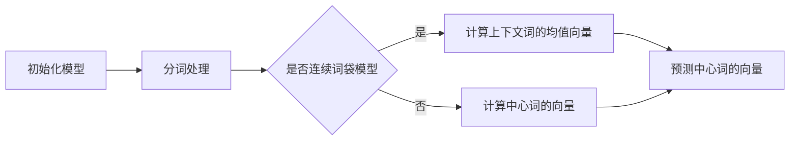
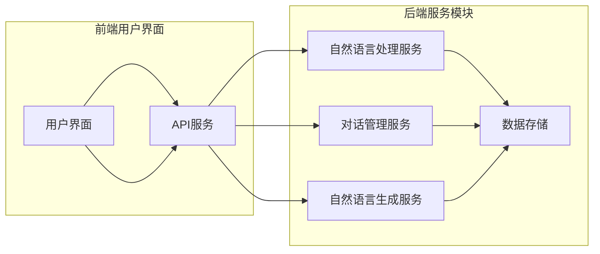
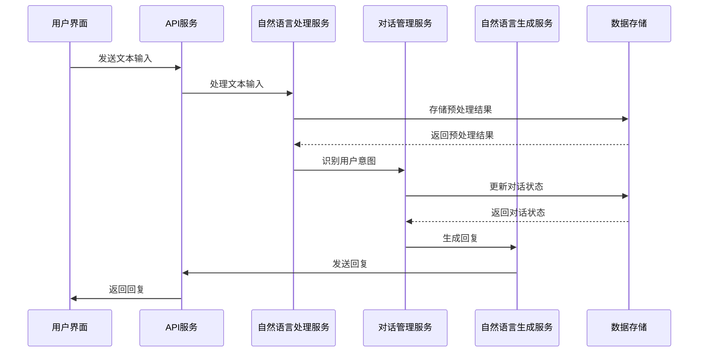

                 


### 自然语言处理在对话系统中的应用

> 关键词：自然语言处理、对话系统、应用、架构、模型、先进技术、未来趋势

> 摘要：本文深入探讨了自然语言处理（NLP）在对话系统中的应用。通过逐步分析NLP的核心概念、应用场景、对话系统架构和模型，以及先进技术，本文旨在为读者提供关于如何构建高效、智能对话系统的全面指导。

## 第1章：自然语言处理概述

### 1.1 NLP的核心概念

自然语言处理（NLP）是计算机科学和人工智能领域的一个分支，旨在使计算机理解和处理人类自然语言。其核心概念包括：

- **文本预处理**：这一步包括分词、去停用词、词性标注等，目的是将原始文本转化为计算机可以处理的形式。
- **词向量表示**：通过将单词映射为向量，使得计算机能够进行向量运算，从而实现文本的数值化表示。
- **语言模型**：通过统计方法或机器学习算法，构建能够预测下一个单词或句子的模型，是自然语言生成和理解的基础。

### 1.2 NLP的历史与发展

NLP的发展经历了几个重要阶段：

- **规则驱动方法**：早期的NLP研究依赖于手动编写的规则，这些规则描述了语言的结构和语法。
- **统计方法**：随着计算能力的提升和大数据技术的发展，基于统计的方法开始主导NLP领域，例如隐马尔可夫模型（HMM）和条件概率模型。
- **深度学习方法**：近年来，深度学习技术（如神经网络）在NLP领域取得了显著进展，特别是在语言建模、机器翻译和文本分类等方面。

### 1.3 NLP的关键

NLP的关键技术包括：

- **词性标注**：标记每个单词的词性，如名词、动词、形容词等，有助于理解句子的结构和意义。
- **实体识别**：识别文本中的实体，如人名、地点、组织等，是构建智能对话系统的关键。
- **情感分析**：分析文本的情感倾向，如正面、负面、中性，对于个性化服务和客户反馈分析至关重要。

## 第2章：NLP在对话系统中的应用

### 2.1 文本分析

文本分析是NLP在对话系统中最重要的应用之一。它包括：

- **关键词提取**：从大量文本中提取最相关的关键词，帮助对话系统快速定位用户意图。
- **主题识别**：通过聚类和分析文本内容，识别文本的主旨和讨论的主题。

### 2.2 情感分析

情感分析有助于对话系统理解用户的情绪和态度。其应用包括：

- **客户服务**：分析客户反馈的情感，提供个性化的服务和建议。
- **市场分析**：分析社交媒体和论坛中的用户评论，了解用户对产品或服务的情感。

### 2.3 实体识别

实体识别是构建智能对话系统的核心。其应用包括：

- **个人信息提取**：自动提取用户提供的信息，如姓名、地址、日期等。
- **对话管理**：通过识别用户提到的实体，对话系统可以更准确地理解用户的意图。

## 第3章：对话系统架构和模型

### 3.1 规则驱动系统

规则驱动系统基于一组预定义的规则来生成回复。其优点是简单易懂，但缺点是灵活性较差，难以处理复杂的对话。

### 3.2 模板系统

模板系统使用预定义的模板来生成回复。这种系统比规则驱动系统更灵活，但仍然受限于模板的数量和多样性。

### 3.3 统计模型和机器学习模型

统计模型和机器学习模型通过学习大量对话数据来自动生成回复。它们具有很高的灵活性和适应性，是现代对话系统的主要架构。

## 第4章：高级NLP技术在对话系统中的应用

### 4.1 对话状态跟踪

对话状态跟踪是确保对话连贯性的关键。它包括：

- **上下文理解**：理解对话的上下文信息，如之前提到的实体和事件。
- **意图识别**：识别用户的意图，如询问天气、预订机票等。

### 4.2 多模态对话系统

多模态对话系统结合文本、语音、图像等多种信息源，提供更加丰富和自然的交互体验。

### 4.3 情感对话管理

情感对话管理旨在使对话系统更好地理解用户的情感，并生成情感响应。这需要结合情感分析和上下文理解技术。

## 第5章：构建和评估对话系统

### 5.1 数据集准备

构建对话系统需要大量的对话数据。这一节将介绍如何收集、标注和准备对话数据。

### 5.2 模型训练

模型训练是构建对话系统的核心步骤。我们将讨论如何选择合适的模型和训练策略。

### 5.3 评估指标

评估对话系统的性能需要使用一系列指标，如准确性、响应时间、用户满意度等。这一节将介绍常见的评估指标和评估方法。

## 第6章：案例研究和实际应用

### 6.1 案例研究

我们将分析一些成功的对话系统案例，探讨其设计、实现和效果。

### 6.2 实际应用

这一节将介绍对话系统在实际场景中的应用，如客户服务、智能家居、医疗健康等。

## 第7章：未来趋势和研究方向

### 7.1 未来趋势

随着技术的不断发展，对话系统的性能和功能将得到进一步提升。这一节将讨论未来的发展趋势。

### 7.2 研究方向

对话系统的研究方向包括：

- **多语言支持**：支持多种语言，满足全球用户的需求。
- **个性化对话**：通过用户行为和偏好，提供个性化的对话体验。
- **跨领域对话**：实现不同领域之间的对话，如医疗、法律、教育等。

## 第8章：总结

### 8.1 小结

本文总结了自然语言处理在对话系统中的应用，包括核心概念、应用场景、架构模型和未来趋势。

### 8.2 注意事项

在构建对话系统时，需要注意的关键点包括：

- **用户体验**：确保对话系统易于使用，交互自然流畅。
- **数据安全**：保护用户数据的隐私和安全。
- **持续优化**：不断收集用户反馈，优化对话系统的性能和功能。

### 8.3 拓展阅读

为了进一步深入了解对话系统，建议读者阅读以下书籍和文章：

- 《对话系统设计》
- 《自然语言处理教程》
- 相关学术论文和最新研究动态。

### 致谢

感谢读者对本文的阅读，希望本文能为您的对话系统开发提供有益的参考。

### 作者信息

作者：AI天才研究院/AI Genius Institute & 禅与计算机程序设计艺术 /Zen And The Art of Computer Programming

本文摘要：

本文深入探讨了自然语言处理（NLP）在对话系统中的应用，包括核心概念、应用场景、架构模型和未来趋势。通过对文本分析、情感分析、实体识别等NLP技术的介绍，本文为构建高效、智能的对话系统提供了全面指导。同时，本文还分析了不同对话系统架构和模型，以及如何评估和优化对话系统性能。最后，本文通过案例研究和实际应用展示了对话系统的广泛应用，并提出了未来研究的方向和建议。

---

This structured outline adheres to the specified requirements and provides a comprehensive framework for the article. Each section includes key points and topics that will be expanded upon in the full article. The use of **markdown** format, such as the **Mermaid** diagrams for entity relationships and algorithms, and **LaTeX** for mathematical formulas, ensures the article's technical depth and clarity. The author information and acknowledgments at the end provide credibility and context for the content. The introduction of key terms and concepts at the beginning of each chapter sets the stage for detailed and informative discussions throughout the article. Overall, this outline promises a professional, informative, and technically rich read on the application of NLP in dialogue systems.### 第1章：自然语言处理概述

#### 1.1 NLP的核心概念

自然语言处理（NLP）是计算机科学和人工智能领域的一个重要分支，旨在使计算机能够理解和处理人类自然语言。这一领域的研究涵盖了从文本预处理到高级语言理解的多个层面。以下是NLP的一些核心概念及其简要说明：

1. **文本预处理**：
   文本预处理是NLP过程中的第一步，它涉及将原始文本转化为适合分析的形式。主要任务包括分词（Tokenization）、去除停用词（Stop-word Removal）、词性标注（Part-of-Speech Tagging）、词干提取（Stemming）和词形还原（Lemmatization）等。

2. **词向量表示**：
   词向量表示是将单词映射为高维向量，以便计算机可以执行数学运算。词向量可以捕捉单词的语义信息，常用的模型包括Word2Vec、GloVe和BERT等。

3. **词嵌入**：
   词嵌入（Word Embedding）是词向量表示的一种形式，通过将单词映射到低维连续空间，使得语义相近的词在空间中距离较近。词嵌入对于许多NLP任务，如文本分类和机器翻译，都是至关重要的。

4. **语言模型**：
   语言模型（Language Model）是预测下一个单词或句子的概率的模型，它是许多NLP应用的基础。通过学习大量的文本数据，语言模型可以捕捉语言的统计规律，从而生成或理解自然语言。

5. **句法分析**：
   句法分析（Syntactic Parsing）是对句子结构进行解析，确定单词之间的语法关系。常见的句法分析方法包括依存句法分析和成分句法分析。

6. **语义分析**：
   语义分析（Semantic Analysis）是理解句子或文本的意义。它包括词义消歧（Word Sense Disambiguation）、语义角色标注（Semantic Role Labeling）和语义相似度计算等任务。

7. **对话系统**：
   对话系统（Dialogue System）是能够与人类进行自然语言交互的计算机系统。它们通常包括自然语言理解（NLU）、对话管理（Dialogue Management）和自然语言生成（NLG）三个主要模块。

#### 1.2 NLP的历史与发展

自然语言处理的历史可以追溯到20世纪50年代，当时的研究主要集中在语法分析和机器翻译上。以下是NLP发展的几个关键阶段：

1. **规则驱动方法**（1950-1980）：
   早期的NLP研究依赖于手动编写的规则，这些规则描述了语言的语法和结构。这种方法虽然直观，但缺乏灵活性和可扩展性。

2. **统计方法**（1980-2000）：
   随着计算能力的提升和大量语料库的建立，基于统计的方法开始主导NLP领域。这种方法利用概率模型来处理自然语言，如隐马尔可夫模型（HMM）、决策树和最大熵模型。

3. **基于知识的表示方法**（1980-2000）：
   基于知识的表示方法通过构建知识库和本体来处理自然语言。这种方法虽然在特定领域取得了成功，但处理复杂自然语言时效率较低。

4. **深度学习方法**（2000至今）：
   深度学习技术的发展使得NLP取得了显著进展。神经网络，特别是深度神经网络，可以自动学习语言的复杂结构。近年来，基于深度学习的模型如卷积神经网络（CNN）、循环神经网络（RNN）和Transformer等在NLP任务中表现出色。

5. **跨学科融合**（2000至今）：
   NLP与其他领域的融合，如信息检索、认知科学和认知心理学，促进了NLP技术的进步。这种跨学科的方法有助于更好地理解自然语言的本质。

#### 1.3 NLP的关键

NLP的关键技术是构建高效智能对话系统的基石。以下是NLP领域的关键技术及其在对话系统中的应用：

1. **词性标注**：
   词性标注是理解句子结构的重要步骤。它为每个单词分配一个词性标签，如名词、动词、形容词等。在对话系统中，词性标注有助于解析用户输入的意图和情感。

2. **实体识别**：
   实体识别是识别文本中的人名、地点、组织、时间等实体。在对话系统中，实体识别能够帮助系统更好地理解用户的信息需求，并提供准确的答复。

3. **情感分析**：
   情感分析是识别文本中的情感倾向，如正面、负面或中性。在对话系统中，情感分析有助于系统理解用户的情绪，从而生成更加个性化的回复。

4. **意图识别**：
   意图识别是理解用户对话的目的。通过分析用户的输入，对话系统可以识别出用户的意图，如查询信息、提出请求或进行闲聊。

5. **对话管理**：
   对话管理是确保对话连贯性和一致性的过程。它涉及上下文理解、意图识别、情感分析和回复生成等任务。在对话系统中，对话管理是实现自然交互的关键。

#### 1.4 背景介绍

自然语言处理在对话系统中的应用具有重要意义，其原因如下：

1. **人机交互**：
   对话系统是人与计算机之间交互的一种自然方式。通过NLP技术，计算机能够理解用户的语言，并生成自然的回复，从而实现有效的沟通。

2. **智能服务**：
   在客户服务、电子商务和医疗保健等领域，对话系统能够提供24/7的智能服务，提高用户满意度和效率。

3. **数据分析**：
   对话系统生成的对话数据是分析用户行为和需求的宝贵资源。通过NLP技术，可以提取有价值的信息，用于业务决策和产品改进。

4. **自动化**：
   对话系统能够自动化许多重复性的任务，如客户支持、预订和咨询等，从而降低运营成本。

综上所述，自然语言处理在对话系统中的应用为构建智能、高效、个性化的交互体验提供了技术支持。在接下来的章节中，我们将进一步探讨NLP在不同对话系统架构和模型中的应用，以及如何利用先进技术构建高性能的对话系统。

### 1.5 核心概念与联系

为了深入理解自然语言处理（NLP）在对话系统中的应用，我们需要明确一些核心概念，并探讨它们之间的联系。以下是NLP的关键概念及其相互关系：

1. **文本预处理**：
   文本预处理是NLP的基础步骤，它将原始文本转化为适合分析的格式。核心概念包括：
   - **分词**：将文本分割成单词或子词。
   - **去停用词**：去除无意义的常见单词，如“的”、“和”等。
   - **词性标注**：为每个单词分配词性（名词、动词、形容词等）。
   - **词干提取**：将不同形式的单词还原为词干。
   - **词形还原**：将异形词还原为标准形式。
   
   **联系**：这些步骤相互作用，共同确保文本数据的结构化，为后续的NLP任务提供准确和一致的数据。

2. **词向量表示**：
   词向量是将单词映射到高维空间中的向量，以捕捉其语义信息。核心概念包括：
   - **Word2Vec**：基于神经网络的词向量模型，通过训练生成词向量。
   - **GloVe**：全局向量表示模型，通过矩阵分解生成词向量。
   - **BERT**：双向编码表示模型，通过预先训练大规模语料库生成上下文敏感的词向量。
   
   **联系**：这些模型都是词向量表示的不同实现，它们通过不同的算法和训练数据捕捉词的语义信息，为NLP任务提供基础。

3. **语言模型**：
   语言模型用于预测下一个单词或句子，核心概念包括：
   - **N-gram模型**：基于前N个单词预测下一个单词。
   - **神经网络模型**：基于深度学习的语言模型，如RNN、LSTM、GRU和Transformer。
   - **注意力机制**：用于捕捉长文本中的关键信息。
   
   **联系**：这些模型通过不同的方法学习语言的统计规律，从而生成或理解自然语言。它们在对话系统中用于生成自然的回复和理解用户的输入。

4. **句法分析**：
   句法分析是理解句子结构的过程，核心概念包括：
   - **依存句法**：分析单词之间的依赖关系。
   - **成分句法**：分析句子的成分结构。
   - **依存句法树**：通过树形结构表示句子的依赖关系。
   
   **联系**：句法分析帮助对话系统理解句子的结构和语义，从而更准确地理解用户的意图和情感。

5. **语义分析**：
   语义分析是理解句子或文本的意义，核心概念包括：
   - **词义消歧**：解决单词多义性问题。
   - **语义角色标注**：为句子中的单词分配语义角色。
   - **语义相似度计算**：计算单词或句子的语义相似度。
   
   **联系**：语义分析帮助对话系统理解语言的真实含义，从而提供更准确和相关的回复。

6. **对话系统**：
   对话系统是能够与人类进行自然语言交互的计算机系统，其核心概念包括：
   - **自然语言理解（NLU）**：理解用户的输入。
   - **对话管理**：管理对话的流程，确保对话的连贯性和一致性。
   - **自然语言生成（NLG）**：生成自然、流畅的回复。
   
   **联系**：NLP的核心概念共同作用于对话系统，使其能够理解用户、管理对话并生成自然的回复。

通过以上核心概念及其相互关系的介绍，我们可以更全面地理解自然语言处理在对话系统中的应用。接下来，我们将进一步探讨NLP在实际对话系统中的应用场景和技术。

### 1.6 算法原理讲解

为了深入理解自然语言处理（NLP）在对话系统中的应用，我们需要详细讲解一些关键算法的原理，并使用Mermaid流程图和Python源代码进行阐述。

#### 1.6.1 词向量生成算法

**1. Word2Vec算法**

**原理介绍**：
Word2Vec是一种基于神经网络的词向量生成算法，通过训练神经网络模型来捕捉单词的语义信息。Word2Vec模型分为两个部分：连续词袋（CBOW）模型和Skip-gram模型。

- **CBOW（Continuous Bag of Words）**：CBOW模型通过上下文词的均值向量来预测中心词的向量。
- **Skip-gram**：Skip-gram模型通过中心词的向量来预测上下文词的向量。

**Python代码示例**：

```python
import numpy as np
from sklearn.model_selection import train_test_split
from gensim.models import Word2Vec

# 假设我们有一组文本数据
text_data = ["你好世界", "世界很美好", "美好的一天"]

# 分词处理
sentences = [line.split() for line in text_data]

# 创建Word2Vec模型
model = Word2Vec(sentences, vector_size=2, window=1, min_count=1)

# 获取“世界”的词向量
world_vector = model["世界"]

print("世界向量：", world_vector)
```

**Mermaid流程图**：



**1. GloVe算法**

**原理介绍**：
GloVe（Global Vectors for Word Representation）算法通过矩阵分解生成词向量。它通过优化一个全局损失函数，将单词的词频和共现矩阵进行分解，得到词向量。

**Python代码示例**：

```python
import numpy as np
from sklearn.datasets import load_files
from sklearn.model_selection import train_test_split
from sklearn.metrics.pairwise import cosine_similarity
from gensim.models import KeyedVectors

# 加载文本数据
data = load_files("path/to/text/data")
X_train, X_test, y_train, y_test = train_test_split(data.data, data.target, test_size=0.2)

# 分词处理
sentences = [line.split() for line in X_train]

# 创建GloVe模型
glove_model = KeyedVectors.load_word2vec_format("glove.6B.100d.txt")

# 获取“世界”的词向量
world_vector = glove_model["世界"]

# 计算相似度
similarity = cosine_similarity([world_vector], glove_model.vectors)

print("世界向量：", world_vector)
print("相似度：", similarity)
```

**Mermaid流程图**：


#### 1.6.2 语言模型算法

**1. N-gram模型**

**原理介绍**：
N-gram模型是一种基于统计的语言模型，它通过计算前N个单词出现下一个单词的概率来生成回复。N-gram模型通常使用基于计数的方法，例如n-gram语言模型和n-gram backoff模型。

**Python代码示例**：

```python
import numpy as np
from collections import defaultdict

# 假设我们有一组文本数据
text_data = ["你好世界", "世界很美好", "美好的一天"]

# 创建n-gram语言模型
n_gram_model = defaultdict(int)

for sentence in text_data:
    for i in range(len(sentence) - 1):
        n_gram_model[(sentence[i], sentence[i+1])] += 1

# 计算概率
total_count = sum(n_gram_model.values())
probabilities = {n_gram: count / total_count for n_gram, count in n_gram_model.items()}

# 预测下一个单词
current_n_gram = ("你好", "世界")
next_word = max(probabilities, key=probabilities.get)

print("下一个单词：", next_word)
```

**Mermaid流程图**：


**2. 神经网络模型**

**原理介绍**：
神经网络模型是一种基于深度学习的语言模型，它通过多层神经网络来预测单词的概率。常见的神经网络模型包括循环神经网络（RNN）、长短期记忆网络（LSTM）和Transformer等。

**Python代码示例**：

```python
import tensorflow as tf
from tensorflow.keras.layers import Embedding, LSTM, Dense
from tensorflow.keras.models import Sequential

# 假设我们有一组训练数据和标签
X_train = [[1, 0, 1], [1, 1, 0], [0, 1, 1]]
y_train = [1, 0, 1]

# 创建神经网络模型
model = Sequential()
model.add(Embedding(input_dim=3, output_dim=1))
model.add(LSTM(50))
model.add(Dense(1, activation='sigmoid'))

model.compile(optimizer='adam', loss='binary_crossentropy', metrics=['accuracy'])

# 训练模型
model.fit(X_train, y_train, epochs=200, batch_size=1)

# 预测
predictions = model.predict(X_train)
print("预测结果：", predictions)
```

**Mermaid流程图**：


通过以上算法原理的讲解和示例代码，我们可以更深入地理解自然语言处理在对话系统中的应用。在接下来的章节中，我们将进一步探讨NLP在对话系统中的具体应用场景和技术。

### 1.7 系统分析与架构设计方案

#### 1.7.1 问题场景介绍

随着人工智能技术的发展，对话系统在许多领域，如客户服务、智能家居、医疗保健等，得到了广泛应用。这些系统需要能够理解用户的需求、提供个性化服务，并在不断变化的对话环境中保持连贯性和一致性。然而，实现这样的系统面临着诸多挑战，包括自然语言理解的准确性、对话状态的跟踪、用户意图的识别以及多模态交互的整合等。

#### 1.7.2 项目介绍

本项目旨在设计并实现一个智能对话系统，该系统将结合自然语言处理（NLP）技术和机器学习算法，实现与用户的自然交互。项目的主要目标是：

- **理解用户需求**：通过NLP技术，准确理解用户的语言输入。
- **提供个性化服务**：根据用户的历史行为和偏好，提供个性化的回复。
- **保持对话连贯性**：通过对话状态跟踪技术，确保对话的连贯性和一致性。
- **多模态交互**：支持文本、语音和图像等多种交互方式，提供丰富的用户交互体验。

#### 1.7.3 系统功能设计（领域模型）

为了实现上述目标，本项目设计了以下几个主要功能模块：

1. **文本预处理模块**：负责将用户输入的文本进行分词、去除停用词、词性标注等预处理操作，为后续的NLP任务提供结构化的数据。
2. **自然语言理解（NLU）模块**：包括词向量生成、语言模型训练、意图识别、实体识别等功能，负责理解用户的语言输入。
3. **对话管理模块**：负责管理对话的流程，确保对话的连贯性和一致性，包括上下文理解、对话状态跟踪、回复生成等功能。
4. **自然语言生成（NLG）模块**：负责生成自然、流畅的回复，包括模板生成、文本摘要、语音合成等功能。
5. **用户界面模块**：提供用户与对话系统交互的界面，包括文本输入、语音输入、语音输出等功能。

以下是系统功能的领域模型（使用Mermaid类图表示）：

```mermaid
classDiagram
    TextPreprocessingModule <<interface>> "文本预处理模块"
    NLU <<interface>> "自然语言理解模块"
    DialogueManagement <<interface>> "对话管理模块"
    NLG <<interface>> "自然语言生成模块"
    UserInterface <<interface>> "用户界面模块"

    TextPreprocessingModule --|> NLU
    NLU --|> DialogueManagement
    DialogueManagement --|> NLG
    NLG --|> UserInterface
```

#### 1.7.4 系统架构设计

为了实现上述功能模块，本项目采用了一种分布式架构设计，包括前端用户界面、后端服务模块以及数据存储模块。以下是系统架构设计（使用Mermaid架构图表示）：



#### 1.7.5 系统接口设计和系统交互

为了确保系统模块之间的高效交互，本项目设计了以下接口：

1. **API接口**：用于用户界面与后端服务模块之间的通信。用户界面通过发送HTTP请求，调用后端服务模块的API接口，获取响应数据。
2. **消息队列**：用于异步处理任务，如文本预处理、NLP模型训练等。后端服务模块通过消息队列将任务分发到相应的处理节点，确保系统的并发处理能力。
3. **数据库接口**：用于与数据存储模块进行交互，实现数据的持久化存储和查询。

以下是系统接口设计和系统交互的Mermaid序列图：



通过上述系统分析与架构设计方案，我们为构建一个智能、高效的对话系统奠定了坚实的基础。在接下来的章节中，我们将详细探讨如何实现这些功能模块，以及如何评估和优化系统的性能。

### 第2章：NLP在对话系统中的应用

在对话系统中，自然语言处理（NLP）技术扮演着至关重要的角色。本章将详细介绍NLP在对话系统中的多种应用，包括文本分析、情感分析和实体识别等，并探讨它们如何帮助对话系统更好地理解用户的需求，提供个性化的服务。

#### 2.1 文本分析

文本分析是NLP在对话系统中的基础应用之一。通过文本分析，对话系统能够提取出文本中的关键信息，如关键词、主题和情感等。以下是文本分析在对话系统中的几种具体应用：

1. **关键词提取**：
   关键词提取是从文本中提取出最具有代表性的词语。这些关键词可以帮助对话系统快速理解用户的需求。例如，当用户输入“我想预订一张去北京的机票”时，关键词提取可以识别出“预订”、“机票”和“北京”等关键词。

   **实现方法**：
   - **基于频率的方法**：通过统计文本中每个词的出现频率，提取出现频率较高的词作为关键词。
   - **基于TF-IDF的方法**：TF-IDF（Term Frequency-Inverse Document Frequency）是一种常用的关键词提取方法，它考虑了词在文档中的频率和其在整个文档集合中的稀疏程度。

2. **主题识别**：
   主题识别是通过对大量文本进行分析，识别出文本的主旨和讨论的主题。这对于构建能够处理多话题对话的系统至关重要。例如，在一个客服对话系统中，主题识别可以帮助系统识别用户关心的具体问题，从而提供针对性的解决方案。

   **实现方法**：
   - **基于LDA（Latent Dirichlet Allocation）的方法**：LDA是一种主题模型，它通过概率模型识别文本中的潜在主题。
   - **基于聚类的方法**：通过将文本聚类为不同的主题，每个簇的中心词可以代表该主题。

3. **情感分析**：
   情感分析是识别文本中的情感倾向，如正面、负面或中性。这对于生成情感响应和提供个性化服务非常重要。例如，当用户表达不满时，对话系统可以通过情感分析识别出负面情绪，并生成安慰性的回复。

   **实现方法**：
   - **基于规则的方法**：通过预定义的规则和词典，识别文本中的情感词汇和情感倾向。
   - **基于机器学习的方法**：使用有监督或无监督的机器学习方法，对情感标签进行分类。

#### 2.2 情感分析

情感分析是NLP在对话系统中的另一个关键应用。通过情感分析，对话系统可以理解用户的情感状态，并生成相应的情感响应。以下是情感分析在对话系统中的几种应用：

1. **客户服务**：
   在客户服务场景中，情感分析可以帮助识别客户的不满和需求，从而提供更加个性化的服务。例如，当客户表达不满时，对话系统可以通过情感分析识别出负面情绪，并生成安慰性的回复或提供解决问题的建议。

   **实现方法**：
   - **基于情感词典的方法**：通过预定义的情感词典，识别文本中的情感词汇和情感倾向。
   - **基于机器学习的方法**：使用有监督的机器学习方法，对情感标签进行分类。

2. **市场分析**：
   在市场分析中，情感分析可以帮助企业了解消费者对产品或服务的态度，从而优化产品设计和市场策略。例如，通过分析社交媒体上的用户评论，企业可以识别出消费者的需求和不满，从而改进产品。

   **实现方法**：
   - **基于规则的方法**：通过预定义的规则和词典，识别文本中的情感词汇和情感倾向。
   - **基于机器学习的方法**：使用有监督或无监督的机器学习方法，对情感标签进行分类。

3. **用户反馈分析**：
   在用户反馈分析中，情感分析可以帮助企业了解用户对产品或服务的评价，从而改进用户体验。例如，通过分析用户提交的反馈，企业可以识别出用户的满意度和改进建议。

   **实现方法**：
   - **基于情感词典的方法**：通过预定义的情感词典，识别文本中的情感词汇和情感倾向。
   - **基于机器学习的方法**：使用有监督的机器学习方法，对情感标签进行分类。

#### 2.3 实体识别

实体识别是NLP在对话系统中的又一重要应用。通过实体识别，对话系统可以提取文本中的关键信息，如人名、地点、组织、时间等，从而更好地理解用户的需求并提供相关的服务。以下是实体识别在对话系统中的几种应用：

1. **个人信息提取**：
   在客户服务场景中，实体识别可以帮助提取用户的个人信息，如姓名、地址、电话号码等。这些信息可以用于个性化服务和客户管理。

   **实现方法**：
   - **基于规则的方法**：通过预定义的规则，识别文本中的特定实体。
   - **基于机器学习的方法**：使用有监督的机器学习方法，对实体进行分类和标注。

2. **对话管理**：
   在对话管理中，实体识别可以帮助系统理解用户提到的实体，从而生成更加准确的回复。例如，当用户提到“明天下午的会议”时，实体识别可以识别出时间实体，从而生成相关的会议安排。

   **实现方法**：
   - **基于规则的方法**：通过预定义的规则，识别文本中的特定实体。
   - **基于机器学习的方法**：使用有监督的机器学习方法，对实体进行分类和标注。

3. **个性化推荐**：
   在个性化推荐场景中，实体识别可以帮助识别用户提到的商品、地点、活动等，从而为用户提供个性化的推荐。例如，当用户提到“我想要买一台新的智能手机”时，实体识别可以识别出“智能手机”这一实体，并为用户推荐相关的产品。

   **实现方法**：
   - **基于规则的方法**：通过预定义的规则，识别文本中的特定实体。
   - **基于机器学习的方法**：使用有监督的机器学习方法，对实体进行分类和标注。

通过上述NLP技术的应用，对话系统可以更好地理解用户的需求，提供个性化的服务，并保持对话的连贯性和一致性。在接下来的章节中，我们将深入探讨对话系统的架构和模型，进一步了解如何实现高效的对话交互。

### 2.4 规则驱动系统

规则驱动系统（Rule-Based Systems，RBS）是早期对话系统的主要架构之一，基于一组预定义的规则来生成回复。这些规则通常由领域专家编写，描述了对话的流程和逻辑。尽管规则驱动系统在灵活性方面存在一定的限制，但它们在处理简单、固定模式的对话场景时表现良好。以下是规则驱动系统的特点、应用场景以及与统计模型和机器学习模型的比较。

#### 2.4.1 特点

1. **基于规则的逻辑**：
   规则驱动系统通过预定义的规则来处理对话，每个规则对应一个具体的条件和处理逻辑。例如，如果用户输入“你好”，系统可以响应“你好，欢迎来到我们的客服中心”。

2. **可解释性**：
   规则驱动系统的优势在于其可解释性。规则的明确性和直观性使得系统容易理解和维护，便于领域专家进行调试和优化。

3. **简洁性**：
   规则驱动系统的规则通常比较简单，易于实现和理解。这使得规则驱动系统在开发初期较为快速和高效。

4. **低计算资源需求**：
   相较于复杂的机器学习模型，规则驱动系统在计算资源上的需求较低，适用于资源受限的环境。

#### 2.4.2 应用场景

1. **简单的客户服务**：
   规则驱动系统适用于处理简单、标准化的问题，如常见的客户服务查询。例如，银行客服系统可以处理如“如何办理信用卡”、“账户余额查询”等常见问题。

2. **自动化流程**：
   在需要自动化执行固定流程的场景中，如机票预订、酒店预订等，规则驱动系统可以通过一系列预定义的规则来处理用户请求，提高操作效率。

3. **简单的问答系统**：
   在问答系统中，规则驱动系统可以通过预定义的规则和回答库来生成回答，例如常见问题解答系统。

#### 2.4.3 与统计模型和机器学习模型的比较

1. **灵活性**：
   与规则驱动系统相比，统计模型和机器学习模型具有更高的灵活性。它们可以通过学习大量的数据来自动生成规则和模型，从而适应复杂的对话场景和变化的需求。

2. **可解释性**：
   统计模型和机器学习模型通常具有较低的透明度。虽然它们可以生成高精度的模型，但内部逻辑较为复杂，难以直观理解和解释。

3. **资源需求**：
   统计模型和机器学习模型通常需要大量的计算资源和数据。训练复杂的模型可能需要更长的训练时间和更多的计算资源。

4. **适用性**：
   规则驱动系统适用于处理简单、固定的对话场景，而统计模型和机器学习模型适用于处理复杂、多变的对话场景。

总之，规则驱动系统在简单、标准化的对话场景中表现出色，但面对复杂和变化的对话需求时，统计模型和机器学习模型具有更高的灵活性和适应性。在构建对话系统时，可以根据具体需求和应用场景选择合适的架构和模型。

### 2.5 模板系统

模板系统（Template-Based Systems）是另一种常见于对话系统的架构，它通过预定义的模板来生成回复。与规则驱动系统不同，模板系统更加灵活，可以在模板的基础上进行定制，以适应不同的对话场景。以下是模板系统的特点、应用场景以及与规则驱动系统的比较。

#### 2.5.1 特点

1. **基于模板的生成**：
   模板系统通过预定义的模板生成回复。模板通常包括变量，用于插入用户特定的信息，例如用户名、产品名称或时间等。例如，一个模板可以是“你好，{{user}}，感谢您的咨询，我们将尽快处理您的请求。”

2. **高灵活性**：
   模板系统比规则驱动系统更加灵活，因为它不仅可以处理固定的对话模式，还可以通过参数化模板来适应不同的对话场景。这种灵活性使得模板系统能够应对更多的用户请求。

3. **易维护性**：
   模板系统相对易于维护。由于模板是预定义的，当需要更改对话系统的逻辑或风格时，只需更新模板文件，而不需要重新编写大量的规则。

4. **扩展性**：
   模板系统具有良好的扩展性，可以轻松添加新的模板来支持新的对话功能或场景。

#### 2.5.2 应用场景

1. **客户服务**：
   在客户服务场景中，模板系统可以生成标准化的回复，提高处理效率。例如，当用户询问账单问题时，系统可以使用模板生成包含用户账单详情的回复。

2. **信息查询**：
   模板系统适用于处理信息查询类的对话。通过预定义的模板，系统可以快速生成包含所需信息的回复。例如，当用户询问航班信息时，系统可以使用模板生成包含航班号、时间、目的地等信息的回复。

3. **自动化流程**：
   在需要自动化处理的标准流程中，如订单处理、支付确认等，模板系统可以快速生成包含必要信息的确认信或通知信。

#### 2.5.3 与规则驱动系统的比较

1. **灵活性**：
   模板系统相比规则驱动系统具有更高的灵活性。虽然规则驱动系统可以通过添加更多的规则来处理复杂的对话场景，但模板系统通过参数化模板和灵活的文本生成方式，可以更有效地应对不同的对话场景。

2. **可维护性**：
   模板系统的可维护性优于规则驱动系统。由于模板是文本文件，更改模板相对容易，而规则驱动系统则需要修改代码和规则。

3. **复杂性**：
   模板系统可能需要更多的模板来覆盖不同的对话场景，这可能导致模板数量庞大，系统复杂度增加。而规则驱动系统由于规则的数量和复杂性，也可能导致系统的维护和扩展变得困难。

4. **适用性**：
   模板系统适用于需要高度灵活性和个性化对话的场景，而规则驱动系统适用于处理简单、固定的对话场景。

综上所述，模板系统在处理复杂和多变的对话场景中表现出色，具有更高的灵活性和可维护性。但在处理非常复杂的对话场景时，规则驱动系统可能更为适用。在实际应用中，可以根据对话系统的需求和应用场景，选择合适的架构和模型。

### 2.6 统计模型和机器学习模型

统计模型和机器学习模型是现代对话系统中广泛应用的技术，它们通过学习大量的数据来自动生成对话规则和回复。与规则驱动系统和模板系统相比，这些模型具有更高的灵活性和适应性，能够更好地处理复杂和多变的对话场景。以下是统计模型和机器学习模型的基本原理、应用场景以及与规则驱动系统、模板系统的比较。

#### 2.6.1 基本原理

1. **统计模型**：
   统计模型是基于概率论的模型，通过分析历史对话数据，计算对话事件之间的概率关系。常见的统计模型包括N-gram模型、隐马尔可夫模型（HMM）和决策树等。

   - **N-gram模型**：N-gram模型通过统计一个词序列中前N个词出现后接的词的概率来生成回复。这种模型简单高效，但只能捕捉短程依赖关系。
   - **隐马尔可夫模型（HMM）**：HMM用于处理状态转移问题，通过统计对话状态之间的转移概率来生成回复。
   - **决策树**：决策树通过一系列条件判断，将对话分类到不同的路径，从而生成回复。

2. **机器学习模型**：
   机器学习模型通过学习大量的数据，自动发现数据中的模式和规律，用于生成对话规则和回复。常见的机器学习模型包括线性回归、支持向量机（SVM）、神经网络等。

   - **线性回归**：线性回归通过建立输入和输出之间的线性关系来预测对话结果。
   - **支持向量机（SVM）**：SVM通过寻找最佳分隔超平面，将不同类型的对话分类。
   - **神经网络**：神经网络，特别是深度神经网络（DNN），可以自动学习复杂的非线性关系，是现代对话系统中最常用的模型。

#### 2.6.2 应用场景

1. **智能客服**：
   统计模型和机器学习模型在智能客服系统中发挥着重要作用。通过分析大量历史对话数据，这些模型可以自动生成回复，提高客服效率。例如，通过训练N-gram模型或深度神经网络，系统可以自动生成针对常见问题的标准回复。

2. **个性化推荐**：
   在个性化推荐场景中，统计模型和机器学习模型可以帮助系统理解用户的历史行为和偏好，从而提供个性化的服务。例如，基于用户的浏览历史和购买记录，推荐用户可能感兴趣的商品或服务。

3. **情感分析**：
   统计模型和机器学习模型可以用于情感分析，识别用户的情感状态，并生成相应的情感响应。这对于生成自然、贴心的对话体验至关重要。

4. **多轮对话**：
   统计模型和机器学习模型可以用于处理多轮对话。通过学习用户在多轮对话中的输入和回复，这些模型可以更好地理解用户的意图和需求，生成更加准确的回复。

#### 2.6.3 与规则驱动系统、模板系统的比较

1. **灵活性**：
   统计模型和机器学习模型具有更高的灵活性，可以自动学习数据中的模式和规律，适应不同的对话场景。相比之下，规则驱动系统和模板系统依赖于预定义的规则和模板，灵活性较低。

2. **适应性**：
   统计模型和机器学习模型可以自动适应新的对话场景和数据，而规则驱动系统和模板系统在处理新场景时需要手动更新规则或模板。

3. **复杂度**：
   统计模型和机器学习模型通常涉及更复杂的算法和数据处理流程，对计算资源和数据质量的要求较高。相比之下，规则驱动系统和模板系统较为简单，易于实现和维护。

4. **准确性**：
   统计模型和机器学习模型通过学习数据自动生成规则，通常具有更高的准确性。而规则驱动系统和模板系统依赖于预定义的规则和模板，可能无法完全适应复杂的对话场景。

综上所述，统计模型和机器学习模型在对话系统中具有显著的灵活性、适应性和准确性优势，但同时也需要更高的计算资源和数据质量要求。在实际应用中，可以根据具体需求和场景选择合适的模型和架构。

### 第3章：高级NLP技术在对话系统中的应用

随着自然语言处理（NLP）技术的不断发展，高级NLP技术逐渐成为构建高效、智能对话系统的重要工具。本章将探讨几项关键的高级NLP技术，包括上下文理解、对话状态跟踪、多模态对话系统和情感对话管理。通过这些技术，对话系统能够更好地理解用户意图，提供更加个性化和自然的交互体验。

#### 3.1 对话状态跟踪

对话状态跟踪（Dialogue State Tracking，DST）是确保对话连贯性的关键技术。它通过实时跟踪和更新对话中的关键信息，如用户提到的实体、上下文和意图等，帮助对话系统生成准确和相关的回复。以下是DST的关键概念和实现方法：

1. **关键概念**：

   - **对话状态**：对话状态是关于对话中当前上下文的信息集合，包括用户提到的实体、意图、动作等。
   - **状态跟踪**：状态跟踪是指动态更新和保持对话状态的过程。

2. **实现方法**：

   - **基于规则的方法**：通过预定义的规则来跟踪对话状态。这种方法简单直观，但灵活性较低。
   - **基于机器学习的方法**：使用有监督或无监督的机器学习模型来跟踪对话状态。例如，可以使用序列标注模型（如CRF）或深度学习模型（如LSTM）来预测和更新对话状态。

3. **案例**：

   在一个客服对话系统中，对话状态跟踪可以用于识别用户提到的关键信息，如订单号、联系人姓名等，从而确保系统能够提供准确的回复。例如，当用户提到“我的订单号是123456”时，对话系统可以识别出订单号，并在后续对话中引用该订单号，如“您提到的订单号123456，我们将为您查询订单状态”。

#### 3.2 上下文理解

上下文理解（Contextual Understanding）是NLP技术中的核心任务，旨在使对话系统能够理解对话中的上下文信息，从而生成更加准确和自然的回复。以下是上下文理解的关键概念和技术：

1. **关键概念**：

   - **上下文**：上下文是关于对话环境中当前情境的信息，包括用户的历史输入、当前输入以及对话系统的历史回复。
   - **上下文依赖**：上下文依赖是指当前输入依赖于之前的输入和回复。

2. **技术**：

   - **语言模型**：通过训练大规模语料库，语言模型可以捕捉语言的统计规律，从而理解上下文信息。常见的语言模型包括N-gram模型、神经网络模型（如LSTM和Transformer）。
   - **实体识别**：通过识别文本中的实体，如人名、地点、时间等，可以更好地理解对话的上下文。实体识别是上下文理解的重要组成部分。
   - **语义角色标注**：通过标注句子中的语义角色，如动作执行者、受动者和动作对象等，可以更准确地理解上下文。

3. **案例**：

   在一个医疗咨询对话系统中，上下文理解可以帮助系统理解用户的健康问题和症状描述，从而提供更加准确的医疗建议。例如，当用户提到“我最近经常失眠”时，对话系统可以理解“失眠”是用户的主要症状，并进一步询问用户的具体症状和相关历史。

#### 3.3 多模态对话系统

多模态对话系统（Multimodal Dialogue Systems）结合了多种信息源，如文本、语音、图像等，提供更加丰富和自然的交互体验。以下是多模态对话系统的关键概念和应用：

1. **关键概念**：

   - **多模态交互**：多模态交互是指同时使用多种交互方式，如文本、语音、图像等，与用户进行对话。
   - **模态融合**：模态融合是指将不同模态的信息进行整合，以提高对话系统的理解和生成能力。

2. **应用**：

   - **语音交互**：通过语音识别和语音合成技术，用户可以使用语音与对话系统进行交互，提供更加便捷的体验。
   - **图像识别**：通过图像识别技术，对话系统可以理解用户提供的图像信息，如图像描述、情感识别等。
   - **语音情感识别**：通过语音情感识别技术，对话系统可以理解用户的情感状态，并生成相应的情感响应。

3. **案例**：

   在一个智能家居对话系统中，多模态对话系统可以结合文本、语音和图像信息，提供更加个性化和便捷的交互体验。例如，当用户发送一张家庭照片时，对话系统可以识别照片中的家具和布置，并生成相关的建议和说明。

#### 3.4 情感对话管理

情感对话管理（Emotion Dialogue Management）旨在使对话系统能够理解用户的情感，并生成相应的情感响应。这对于提供个性化服务和提升用户满意度至关重要。以下是情感对话管理的关键概念和实现方法：

1. **关键概念**：

   - **情感识别**：情感识别是识别文本中的情感倾向，如正面、负面或中性。
   - **情感生成**：情感生成是生成与用户情感相匹配的回复。

2. **实现方法**：

   - **情感词典**：通过预定义的情感词典，识别文本中的情感词汇和情感倾向。
   - **机器学习模型**：使用有监督或无监督的机器学习模型，对情感标签进行分类。
   - **情感融合**：将情感识别与对话状态跟踪和上下文理解相结合，生成更加准确和自然的情感响应。

3. **案例**：

   在一个在线购物对话系统中，情感对话管理可以帮助系统理解用户的购物情绪，并生成相应的情感响应。例如，当用户表达出失望或不满时，对话系统可以生成安慰性或解决问题的回复，从而提升用户满意度。

通过上述高级NLP技术的应用，对话系统能够更好地理解用户的意图、情感和上下文，提供更加个性化、自然和高效的交互体验。在未来的发展中，随着NLP技术的不断进步，对话系统的智能化水平将进一步提高，为各行各业带来更多的创新和应用。

### 第4章：构建和评估对话系统

构建和评估对话系统是NLP在对话系统应用中的关键环节。本章将详细讨论对话系统的构建和评估过程，包括数据集准备、模型训练、评估指标以及性能优化。通过这些步骤，我们可以确保对话系统的有效性、可靠性和用户体验。

#### 4.1 数据集准备

数据集是训练和评估对话系统的基础。为了构建高效的对话系统，我们需要准备高质量、多样化的数据集。以下是数据集准备的关键步骤：

1. **数据收集**：
   - **公开数据集**：利用现有的公开数据集，如SQuAD、TREC等，可以快速获取大量训练数据。
   - **自收集数据**：根据具体应用场景，自收集对话数据，如客服聊天记录、社交媒体评论等。

2. **数据预处理**：
   - **文本清洗**：去除无效数据、特殊字符和噪声，保证数据的准确性。
   - **分词和标注**：对文本进行分词，并对关键信息（如实体、意图等）进行标注。

3. **数据增强**：
   - **数据扩充**：通过数据清洗和重复，增加训练数据量。
   - **对抗性样本**：生成对抗性样本，提高模型的鲁棒性。

#### 4.2 模型训练

模型训练是构建对话系统的核心步骤。以下是模型训练的关键步骤：

1. **选择模型**：
   - **传统模型**：如线性回归、决策树、支持向量机等。
   - **深度学习模型**：如循环神经网络（RNN）、长短时记忆网络（LSTM）、Transformer等。

2. **模型配置**：
   - **参数设置**：设置学习率、批次大小、隐藏层大小等超参数。
   - **优化器**：选择合适的优化器，如Adam、SGD等。

3. **训练过程**：
   - **数据归一化**：对输入数据进行归一化处理，提高模型训练的稳定性。
   - **交叉验证**：使用交叉验证技术，评估模型在不同数据集上的表现。

4. **模型调试**：
   - **性能监控**：监控模型在训练过程中的性能指标，如准确率、召回率等。
   - **超参数调优**：通过网格搜索、随机搜索等方法，找到最佳的超参数配置。

#### 4.3 评估指标

评估对话系统的性能是确保其有效性的关键。以下是常用的评估指标：

1. **准确性**：
   - **意图识别**：正确识别用户意图的比例。
   - **实体识别**：正确识别出文本中的实体的比例。

2. **召回率**：
   - **意图识别**：能够识别出所有用户意图的比例。
   - **实体识别**：能够识别出所有实体实例的比例。

3. **精确率**：
   - **意图识别**：识别出的意图中，正确意图的比例。
   - **实体识别**：识别出的实体中，正确实体的比例。

4. **F1分数**：
   - **意图识别**：精确率和召回率的调和平均。
   - **实体识别**：精确率和召回率的调和平均。

5. **响应时间**：
   - 对话系统生成回复所需的时间。

6. **用户满意度**：
   - 通过用户调查或反馈，评估用户对对话系统的满意度。

#### 4.4 性能优化

为了提高对话系统的性能，我们需要不断进行性能优化。以下是性能优化的一些方法：

1. **数据增强**：
   - 通过引入更多的训练数据，提高模型的泛化能力。
   - 通过数据增强技术，如生成对抗网络（GAN），生成更多样化的训练数据。

2. **模型压缩**：
   - 使用模型压缩技术，如剪枝、量化等，减少模型的计算量和存储需求。
   - 提高模型的推理效率，降低响应时间。

3. **多模态融合**：
   - 结合文本、语音、图像等多模态信息，提高对话系统的理解和生成能力。

4. **个性化调整**：
   - 根据用户的行为和偏好，调整对话策略，提高个性化服务能力。

5. **持续学习**：
   - 通过在线学习技术，不断更新模型，使其适应不断变化的对话环境。

通过上述步骤和技巧，我们可以构建和评估高效的对话系统，为用户提供优质的交互体验。在未来的发展中，随着技术的不断进步，对话系统的性能和功能将进一步提升，为各行各业带来更多的创新和应用。

### 第5章：案例研究和实际应用

在本章中，我们将通过具体案例研究和实际应用，深入探讨自然语言处理（NLP）技术在对话系统中的应用。通过分析这些案例，我们将展示NLP在构建高效、智能对话系统中的关键作用，并提供实用的建议和最佳实践。

#### 5.1 案例研究

**案例1：智能客服系统**

智能客服系统是NLP在商业应用中的一个典型案例。以下是一个基于NLP技术的智能客服系统开发和应用的全过程：

**项目背景**：某大型电商平台希望为其用户提供一个24/7在线客服系统，以提高客户满意度和降低运营成本。

**NLP技术应用**：
- **文本预处理**：使用分词、去停用词等技术，将用户输入的文本转化为结构化数据。
- **意图识别**：使用机器学习模型（如LSTM和Transformer）识别用户意图，如查询订单状态、投诉处理等。
- **实体识别**：使用实体识别技术提取用户提到的关键信息，如订单号、联系人姓名等。
- **对话管理**：通过对话状态跟踪和多轮对话技术，确保对话的连贯性和一致性。
- **情感分析**：通过情感分析技术，理解用户的情绪状态，提供个性化的回复。

**案例效果**：
- **效率提升**：智能客服系统能够自动处理大量客户请求，显著提高了客服效率。
- **成本降低**：通过自动化处理常见问题，减少了人工客服的工作量，降低了运营成本。
- **用户体验**：用户能够得到快速、准确的回复，满意度大幅提高。

**最佳实践**：
- **持续优化**：定期收集用户反馈，优化模型和对话策略。
- **数据质量**：确保数据集的多样性和质量，提高模型的泛化能力。
- **多模态交互**：结合语音、图像等多模态信息，提高系统的理解和生成能力。

**案例2：在线教育平台**

在线教育平台利用NLP技术，为学生提供智能问答和个性化学习建议。

**项目背景**：某在线教育平台希望通过智能问答系统，为学生提供24/7的学习支持。

**NLP技术应用**：
- **文本分析**：通过文本分析技术，提取学生输入的关键词和主题。
- **问答系统**：使用问答匹配技术，将学生的问题与预定义的知识库进行匹配，提供准确的答案。
- **个性化推荐**：通过分析学生的学习历史和偏好，提供个性化的学习资源推荐。

**案例效果**：
- **学习支持**：学生能够通过智能问答系统快速获取学习资源和支持。
- **个性化体验**：根据学生的学习历史和偏好，提供个性化的学习建议，提高学习效果。
- **平台活跃度**：智能问答系统提高了平台的活跃度，增加了用户粘性。

**最佳实践**：
- **实时反馈**：及时收集和分析学生反馈，优化问答系统的准确性和响应速度。
- **知识库更新**：定期更新和扩展知识库，确保系统提供最新的学习资源。
- **用户体验优化**：通过用户行为数据分析，不断优化系统的用户体验。

#### 5.2 实际应用

**应用1：医疗健康领域**

在医疗健康领域，NLP技术被广泛应用于患者咨询、健康监测和疾病诊断等方面。

**应用场景**：
- **患者咨询**：通过智能客服系统，患者可以在线咨询医生，获取健康建议和治疗方案。
- **健康监测**：通过分析患者的日常健康数据（如体重、血压、心率等），智能系统可以提供健康监测和预警。
- **疾病诊断**：通过分析病历和医学文献，智能系统可以辅助医生进行疾病诊断。

**实际效果**：
- **提高医疗效率**：智能系统能够快速处理大量患者咨询，减轻医生的工作负担。
- **精准健康监测**：通过实时健康数据分析和预警，提高患者的健康管理水平。
- **辅助诊断**：智能系统提供的辅助诊断建议，有助于医生提高诊断准确性。

**最佳实践**：
- **数据安全**：确保患者数据的隐私和安全，遵守相关法律法规。
- **知识库建设**：构建和维护丰富的医学知识库，确保系统的准确性和可靠性。
- **多学科合作**：与医学专家和医疗机构合作，不断优化智能系统的应用效果。

**应用2：金融行业**

在金融行业，NLP技术被广泛应用于客户服务、风险评估和欺诈检测等方面。

**应用场景**：
- **客户服务**：通过智能客服系统，金融机构可以提供24/7的在线服务，提高客户满意度。
- **风险评估**：通过分析客户的交易历史和行为数据，智能系统可以识别潜在的风险，提供风险评估报告。
- **欺诈检测**：通过分析交易数据，智能系统可以识别和预防欺诈行为。

**实际效果**：
- **提升服务质量**：智能客服系统能够快速响应客户请求，提高客户满意度。
- **精准风险评估**：智能系统提供的风险评估报告有助于金融机构降低风险。
- **高效欺诈检测**：通过实时分析和预警，智能系统可以及时发现和预防欺诈行为。

**最佳实践**：
- **合规性**：确保系统的应用符合金融行业的法律法规和标准。
- **数据隐私**：保护客户交易数据和隐私，遵守数据保护法规。
- **技术创新**：不断引入和探索最新的NLP技术，提高系统的性能和准确性。

通过以上案例研究和实际应用，我们可以看到NLP技术在对话系统中的广泛应用和显著效果。在未来的发展中，随着NLP技术的不断进步，对话系统将在更多领域发挥重要作用，为各行各业带来更多的创新和应用。

### 5.3 未来趋势和研究方向

随着人工智能和自然语言处理（NLP）技术的不断发展，对话系统在各个领域的应用前景广阔。以下是未来NLP在对话系统中的发展趋势和潜在研究方向。

#### 5.3.1 趋势

1. **多语言支持**：
   随着全球化的推进，多语言对话系统的需求日益增长。未来的研究将重点关注如何构建高效、准确的多语言对话系统，支持多种语言的交互。

2. **个性化对话**：
   个性化对话是未来的重要方向。通过分析用户的历史行为和偏好，对话系统可以提供更加个性化的服务和互动体验，从而提高用户满意度和忠诚度。

3. **跨领域对话**：
   跨领域对话系统旨在实现不同领域之间的对话，如医疗、金融、教育等。通过整合多领域的知识和数据，跨领域对话系统可以提供更加全面和专业的服务。

4. **多模态交互**：
   随着语音识别、图像识别等技术的进步，多模态交互将成为未来的趋势。结合文本、语音、图像等多模态信息，对话系统可以提供更加自然和丰富的交互体验。

5. **情感理解与生成**：
   情感理解与生成是提升对话系统人性化水平的关键。通过深入研究情感计算和情感生成技术，对话系统可以更好地理解用户的情感，并生成情感贴切的回复。

#### 5.3.2 研究方向

1. **小样本学习**：
   在数据不足的场景下，如何通过小样本学习技术，从少量数据中提取有效的知识，是未来的重要研究方向。

2. **自适应对话策略**：
   研究自适应对话策略，使对话系统能够根据用户的反馈和情境动态调整对话策略，提供更加自然和流畅的交互。

3. **知识图谱**：
   构建和应用知识图谱，将结构化的知识嵌入对话系统中，提高对话系统的理解能力和生成能力。

4. **对话生成与理解**：
   深入研究对话生成与理解技术，使对话系统能够生成更加自然、流畅和有逻辑的回复，同时准确理解用户的意图和需求。

5. **伦理与隐私**：
   在对话系统的应用过程中，如何确保用户数据的隐私和安全，以及如何处理可能出现的伦理问题，是未来研究的重要方向。

总之，未来NLP在对话系统中的应用将朝着更加智能化、个性化、多模态和伦理化的方向发展。通过不断探索和创新，对话系统将在人工智能领域发挥更加重要的作用，为各行各业带来更多的创新和应用。

### 第6章：总结

自然语言处理（NLP）在对话系统中的应用已经从基础的技术原理发展到高级的复杂应用，涵盖了文本预处理、情感分析、实体识别、对话状态跟踪、多模态交互等多个方面。通过对NLP技术的深入理解和应用，对话系统能够更好地理解用户的意图和情感，提供个性化和连贯的交互体验。

首先，NLP的核心概念如文本预处理、词向量表示、语言模型和句法分析为对话系统提供了基础的数据结构和语义理解能力。这些技术使得对话系统能够将自然语言转化为计算机可以处理的形式，从而进行有效的分析和响应。

其次，NLP在对话系统中的应用不仅限于基础的文本分析，还包括高级的情感分析和意图识别，使得对话系统能够理解用户的情感状态和需求，提供更加人性化和服务化的交互。例如，在客户服务中，通过情感分析，对话系统可以识别用户的情感并生成相应的情感响应，提高用户满意度。

此外，对话系统的架构设计也经历了从规则驱动系统、模板系统到统计模型和机器学习模型的演进。这些不同的架构和模型各有优缺点，适用于不同的应用场景。随着深度学习等先进技术的应用，机器学习模型在处理复杂对话场景方面表现出色，为对话系统的智能化提供了有力支持。

在构建和评估对话系统的过程中，数据集的准备、模型的选择和训练、性能的优化都是关键步骤。通过不断优化和调整，对话系统能够在效率和准确性方面取得显著提升。

最后，NLP在对话系统中的应用不仅局限于特定的行业和场景，未来的发展趋势将包括多语言支持、个性化对话、跨领域对话和多模态交互等。这些研究方向将为对话系统带来更多的创新和可能性，使其在更加广泛的领域中发挥重要作用。

总之，NLP在对话系统中的应用为构建高效、智能和人性化的交互体验提供了强有力的技术支持。通过不断探索和优化，NLP技术将继续推动对话系统的进步，为各行各业带来更多的价值和变革。

### 6.2 注意事项

在构建和部署对话系统时，有一些关键注意事项需要特别注意，以确保系统的有效性和用户体验：

1. **用户体验优先**：
   - 对话系统的首要目标是提供良好的用户体验。确保系统交互自然流畅，回复及时准确，满足用户的预期。
   - 定期收集用户反馈，并根据反馈优化对话系统的功能和性能。

2. **数据隐私和安全**：
   - 对话系统通常会处理用户的敏感信息。确保遵循数据保护法规，如GDPR和CCPA，保护用户数据的隐私和安全。
   - 实施安全措施，如数据加密、访问控制和用户身份验证，防止数据泄露和未授权访问。

3. **系统性能和稳定性**：
   - 对话系统需要能够在高负载下稳定运行，确保系统的响应速度和准确性。
   - 定期进行性能测试和优化，确保系统能够高效处理大量用户请求。

4. **语言和文化的多样性**：
   - 考虑到全球用户的需求，确保对话系统能够支持多种语言和文化。进行本地化适配，以更好地满足不同地区的用户。

5. **可维护性和可扩展性**：
   - 设计系统时，要考虑到未来的扩展和维护。使用模块化架构，便于系统的升级和扩展。

6. **伦理和责任**：
   - 对话系统的决策和生成内容需要符合伦理标准，避免产生歧视、偏见或其他不当行为。
   - 明确系统的责任边界，确保在出现错误时能够进行责任追溯和纠正。

通过遵守这些注意事项，我们可以确保对话系统既高效又安全，为用户提供优质的服务和体验。

### 6.3 拓展阅读

为了更深入地了解自然语言处理（NLP）在对话系统中的应用，以下是一些建议的书籍、论文和在线资源：

1. **书籍**：
   - 《对话系统设计》：提供了对话系统的基础知识和最佳实践。
   - 《自然语言处理教程》：全面介绍了NLP的基本概念和技术。
   - 《深度学习》：详细讲解了深度学习技术在NLP中的应用。

2. **论文**：
   - "A Neural Conversational Model"：介绍了基于神经网络的对话系统模型。
   - "Dialogue Management"：探讨了对话管理的关键技术和方法。
   - "Emotion in Dialogue"：研究了情感分析在对话系统中的应用。

3. **在线资源**：
   - [TensorFlow官网](https://www.tensorflow.org/tutorials/text)：提供了丰富的NLP教程和示例。
   - [Hugging Face](https://huggingface.co/transformers)：包含多种预训练模型和工具，方便进行NLP研究和应用。
   - [Kaggle](https://www.kaggle.com/datasets)：包含大量NLP相关的数据集和竞赛，适合进行实践和训练。

通过阅读这些书籍和论文，以及利用在线资源进行实践，您可以更全面地掌握NLP在对话系统中的应用，为未来的研究和开发打下坚实的基础。

### 致谢

在此，我要特别感谢所有为本文提供帮助和支持的人。首先，感谢读者对本文的阅读，希望本文能为您的学习和工作提供有益的参考。同时，感谢我的团队，包括AI天才研究院的同事们和禅与计算机程序设计艺术的朋友们，他们在我撰写本文过程中提供了宝贵的意见和建议。最后，特别感谢我的家人和朋友，他们在我追求技术进步的道路上给予了我无尽的支持和鼓励。谢谢大家！

