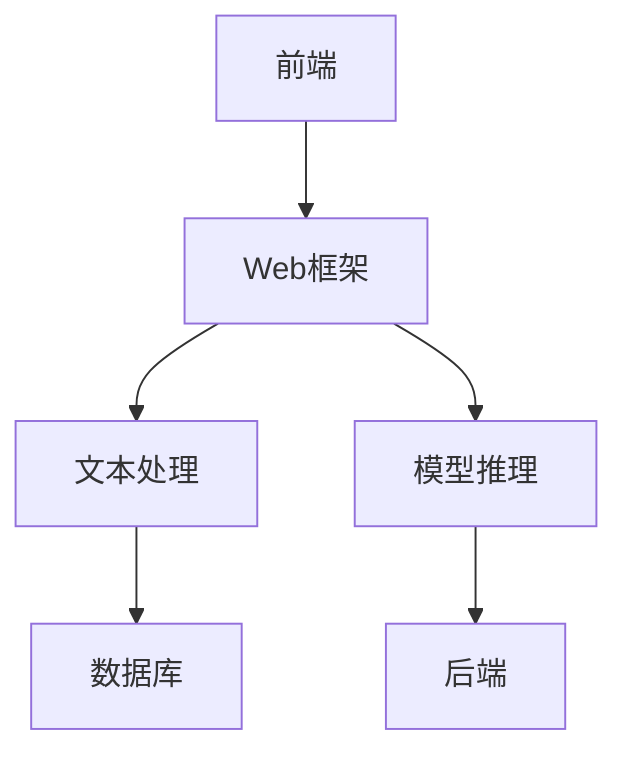
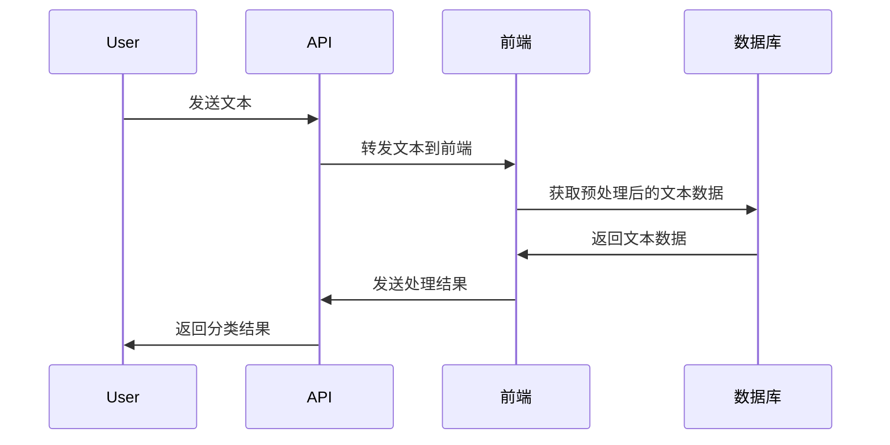

                 

### 自然语言处理：AI理解和生成人类语言

#### 关键词：自然语言处理、人工智能、语义理解、机器学习、深度学习

> 摘要：本文将深入探讨自然语言处理（NLP）这一人工智能（AI）的核心领域。我们将从NLP的基本概念、核心技术、应用场景、工具库、项目实践以及未来趋势等方面进行系统分析，帮助读者全面了解NLP的原理和应用。

#### 目录：

1. **自然语言处理概述**
    1.1 **问题背景**
    1.2 **问题描述**
    1.3 **问题解决**
    1.4 **边界与外延**
    1.5 **概念结构与核心要素组成**

2. **自然语言处理的基本概念**
    2.1 **词法分析**
    2.2 **句法分析**
    2.3 **语义分析**
    2.4 **语用分析**

3. **常见的自然语言处理技术**
    3.1 **基于规则的方法**
    3.2 **统计方法**
    3.3 **机器学习方法**

4. **自然语言处理的应用场景**
    4.1 **搜索引擎**
    4.2 **机器翻译**
    4.3 **语音识别**

5. **自然语言处理的工具和库**
    5.1 **常见NLP工具**
    5.2 **深度学习框架**

6. **自然语言处理的项目实践**
    6.1 **项目介绍**
    6.2 **系统功能设计**
    6.3 **系统架构设计**
    6.4 **系统接口设计和交互**
    6.5 **实际案例分析和讲解**

7. **自然语言处理的挑战与未来趋势**
    7.1 **挑战**
    7.2 **未来趋势**
    7.3 **拓展阅读**

---

### 第1章：自然语言处理概述

#### 1.1 问题背景

自然语言处理（NLP）是人工智能（AI）的一个重要分支，它致力于使计算机能够理解、生成和交互处理人类语言。随着互联网的普及和大数据技术的发展，NLP在多个领域得到了广泛应用，包括但不限于搜索引擎、智能客服、语音助手、机器翻译和情感分析等。NLP的目标是通过计算机技术来模拟人类语言处理的过程，提高人与机器之间的交互效率。

#### 1.2 问题描述

NLP的核心问题是如何让计算机理解并处理人类语言。具体来说，这包括以下几个方面：

- **语义理解**：理解句子的含义，包括词汇的含义、句子的结构以及上下文信息。
- **语境分析**：根据上下文理解句子的具体含义，特别是在歧义处理方面。
- **情感识别**：分析语言中的情感倾向，例如正面、负面或中性。
- **对话系统**：构建能够进行自然对话的智能系统，理解用户的需求并给出合理的回应。

这些问题的解决对于提升计算机与人类之间的交互体验至关重要。

#### 1.3 问题解决

为了解决上述问题，NLP采用了多种方法：

- **基于规则的方法**：通过预定义的规则来处理语言，例如语法规则和句法规则。
- **统计方法**：使用机器学习算法，从大量数据中自动学习语言模式。
- **机器学习方法**：特别是深度学习，通过神经网络模型来模拟人类语言处理的过程。

近年来，深度学习技术的发展为NLP提供了新的工具和解决方案，如卷积神经网络（CNN）、递归神经网络（RNN）和Transformer等。

#### 1.4 边界与外延

NLP的边界主要包括文本处理、语音处理和图像处理。文本处理是NLP的核心，语音处理和图像处理则是对文本处理的有力补充，使NLP系统更加全面。

- **文本处理**：涉及词法分析、句法分析、语义分析和语用分析等。
- **语音处理**：将语音信号转换为文本，包括语音识别、语音合成和语音增强等。
- **图像处理**：通过图像识别和理解来提取文本信息，例如 OCR（光学字符识别）。

#### 1.5 概念结构与核心要素组成

NLP的核心概念包括词法分析、句法分析、语义分析和语用分析。这些概念构成了NLP系统的核心要素，是实现NLP任务的基础。

- **词法分析**：将文本分解为单词或标记。
- **句法分析**：理解句子的结构。
- **语义分析**：关注句子的意义。
- **语用分析**：研究语言的使用。

#### 总结

自然语言处理是人工智能领域的一个重要分支，它通过计算机技术模拟人类语言处理的过程，旨在实现计算机与人类之间的自然交互。NLP面临着众多挑战，但通过结合规则方法、统计方法和机器学习方法，特别是在深度学习技术的支持下，NLP已经在多个领域取得了显著的成果。接下来，我们将进一步探讨NLP的基本概念和技术细节。

### 第2章：自然语言处理的基本概念

自然语言处理（NLP）的基本概念是理解和生成人类语言的基础。在本章中，我们将详细探讨词法分析、句法分析、语义分析和语用分析这四个核心概念。

#### 2.1 词法分析

词法分析（Lexical Analysis）是NLP的第一步，它将文本分解为单词或标记。这个过程通常涉及到以下几个步骤：

- **分词**（Tokenization）：将文本分解为单词或标记。
- **词性标注**（Part-of-Speech Tagging）：为每个单词或标记分配词性，如名词、动词、形容词等。
- **词义消歧**（Sense Disambiguation）：在存在多个词义时，确定正确的词义。

词性标注和词义消歧是词法分析中两个重要的子任务，它们对于后续的句法分析和语义分析至关重要。

#### 2.2 句法分析

句法分析（Syntactic Analysis）旨在理解句子的结构。它包括以下几个方面：

- **语法分析**（Parsing）：将文本分解为句法树，表示句子中各个成分之间的关系。
- **依赖分析**（Dependency Parsing）：分析句子中词与词之间的依赖关系，通常以有向无环图（DAG）表示。

句法分析帮助我们理解句子的结构，从而更好地理解其语义。

#### 2.3 语义分析

语义分析（Semantic Analysis）关注句子的意义。它的主要任务包括：

- **语义角色标注**（Semantic Role Labeling）：标注句子中词汇的语义角色，如动作执行者、动作接受者等。
- **语义依存关系分析**（Semantic Dependency Parsing）：分析句子中词汇之间的语义依存关系。
- **语义相似度计算**（Semantic Similarity）：计算句子或词汇之间的相似度。

语义分析对于理解句子的深层含义和进行信息抽取等任务至关重要。

#### 2.4 语用分析

语用分析（Pragmatic Analysis）研究语言的使用。它的主要任务包括：

- **话语分析**（Discourse Analysis）：分析句子之间的连贯性和衔接关系。
- **语境分析**（Context Analysis）：根据上下文信息理解句子的具体含义。
- **对话系统设计**（Dialogue System Design）：构建能够进行自然对话的智能系统。

语用分析帮助我们理解语言在实际使用中的含义和功能，特别是在对话系统中。

#### 总结

词法分析、句法分析、语义分析和语用分析是NLP的基本概念，它们构成了NLP系统的核心要素。通过这些概念，NLP系统能够更好地理解、生成和交互处理人类语言。接下来，我们将探讨常见的自然语言处理技术，进一步了解NLP的实现方法。

### 第3章：常见的自然语言处理技术

自然语言处理（NLP）技术的发展经历了从基于规则的方法到统计方法，再到机器学习方法，特别是深度学习方法的演变。本章将详细介绍这些技术，并探讨它们在NLP中的应用。

#### 3.1 基于规则的方法

基于规则的方法（Rule-Based Methods）是早期NLP的主要技术。这种方法通过预定义的规则来处理自然语言。这些规则通常由领域专家编写，形式化地描述了语言的语法、语义和语用规则。

- **语法规则**：描述了语言的句法结构，例如主语、谓语、宾语等。
- **语义规则**：描述了词汇的含义和句子的语义结构。
- **语用规则**：描述了语言的使用场景和上下文信息。

基于规则的方法的优点在于其简单性和直观性，但它们在面对复杂和变化多端的自然语言时显得力不从心。此外，编写和维护大量的规则需要大量的人力和时间。

#### 3.2 统计方法

统计方法（Statistical Methods）通过分析大量语言数据来学习语言模式。这种方法使用机器学习算法，特别是监督学习算法，从标记好的语料库中学习模型，以预测新的语言实例。

- **词汇模型**（Lexical Models）：使用统计方法来描述词汇的概率分布。
- **句法模型**（Syntactic Models）：使用统计方法来分析句子的结构。
- **语义模型**（Semantic Models）：使用统计方法来理解句子的意义。

统计方法相对于基于规则的方法具有更强的适应性和泛化能力，但它们对数据质量有较高的要求，并且可能无法捕捉到复杂的语言现象。

#### 3.3 机器学习方法

机器学习方法（Machine Learning Methods），尤其是深度学习方法，在NLP中取得了显著的成果。深度学习通过多层神经网络来模拟人类大脑的神经元结构，从而实现自动特征提取和模型学习。

- **递归神经网络（RNN）**：RNN能够处理序列数据，特别适用于自然语言的序列建模。它通过记忆过去的信息来理解上下文。
  
  $$ RNN = \text{激活函数}(W \cdot \text{输入} + U \cdot \text{隐藏状态} + b) $$

- **卷积神经网络（CNN）**：CNN在图像处理领域取得了巨大成功，也逐渐应用于NLP。它通过卷积操作来提取文本中的局部特征。

  $$ \text{卷积} = \text{滤波器} \cdot \text{输入} + b $$

- **Transformer模型**：Transformer是一种基于自注意力机制的深度学习模型，它在机器翻译、文本生成等任务中取得了最佳性能。它通过多头自注意力机制来捕捉全局信息。

  $$ \text{Self-Attention} = \text{softmax}\left(\frac{\text{Query} \cdot \text{Key}^T}{\sqrt{d_k}}\right) \cdot \text{Value} $$

机器学习方法，特别是深度学习，为NLP提供了强大的工具，使计算机能够更好地理解和生成人类语言。但它们也面临一些挑战，如对大量高质量训练数据的需求和高计算成本。

#### 总结

常见的自然语言处理技术包括基于规则的方法、统计方法和机器学习方法。基于规则的方法简单直观，但难以应对复杂的自然语言。统计方法具有较强的适应性，但数据质量至关重要。机器学习方法，特别是深度学习，通过自动特征提取和模型学习，显著提升了NLP的性能。接下来，我们将探讨自然语言处理在实际应用场景中的表现。

### 第4章：自然语言处理的应用场景

自然语言处理（NLP）技术在多个领域得到了广泛应用，显著提升了这些领域的效率和用户体验。以下将介绍NLP在搜索引擎、机器翻译和语音识别这三个主要应用场景中的具体应用。

#### 4.1 搜索引擎

搜索引擎利用NLP技术来理解用户的查询并返回最相关的结果。以下是NLP在搜索引擎中的应用：

- **查询分析**：NLP技术用于分析用户的查询，理解其意图和上下文，从而提供更准确的搜索结果。这包括词性标注、实体识别和情感分析等。

  $$ \text{Query Analysis} = \text{Tokenization} + \text{Part-of-Speech Tagging} + \text{Entity Recognition} + \text{Sentiment Analysis} $$

- **索引构建**：搜索引擎使用NLP技术来构建和优化索引，确保搜索结果的相关性。这包括词干提取、词形还原和停用词过滤等。

  $$ \text{Index Construction} = \text{Stemming} + \text{Lemmatization} + \text{Stopword Filtering} $$

- **结果排序**：NLP技术用于评估搜索结果的相关性，并根据用户的行为和偏好进行排序。这包括PageRank、语义排序和用户行为分析等。

  $$ \text{Result Ranking} = \text{PageRank} + \text{Semantic Ranking} + \text{User Behavior Analysis} $$

通过NLP技术的应用，搜索引擎能够提供更加智能化和个性化的搜索服务，显著提升用户体验。

#### 4.2 机器翻译

机器翻译（Machine Translation）是NLP的另一个重要应用场景，它涉及将一种语言的文本自动翻译成另一种语言。以下是NLP在机器翻译中的应用：

- **词向量化**：NLP技术用于将文本中的单词转换为向量表示，以便进行机器学习模型的训练。常用的词向量化方法包括Word2Vec、GloVe和BERT等。

  $$ \text{Word Embedding} = \text{Word2Vec} + \text{GloVe} + \text{BERT} $$

- **翻译模型**：NLP技术用于构建翻译模型，将源语言的文本转换为目标语言的文本。常用的翻译模型包括基于规则的方法、统计方法和深度学习方法。

  $$ \text{Translation Model} = \text{Rule-Based} + \text{Statistical} + \text{Deep Learning} $$

- **后处理**：NLP技术用于对翻译结果进行后处理，包括语法校对、语义修正和风格调整等，以提高翻译质量。

  $$ \text{Post-Processing} = \text{Grammar Correction} + \text{Semantic Correction} + \text{Style Adjustment} $$

通过NLP技术的应用，机器翻译系统能够提供更加准确和自然的翻译结果，为跨语言交流和全球化发展提供了强有力的支持。

#### 4.3 语音识别

语音识别（Speech Recognition）是将人类的语音转换为文本的技术。以下是NLP在语音识别中的应用：

- **音频预处理**：NLP技术用于对语音信号进行预处理，包括降噪、声学建模和特征提取等，以提高识别的准确性。

  $$ \text{Audio Preprocessing} = \text{Noise Reduction} + \text{Acoustic Modeling} + \text{Feature Extraction} $$

- **声学模型**：NLP技术用于构建声学模型，以识别语音信号中的声学特征。常用的声学模型包括GMM（高斯混合模型）和DNN（深度神经网络）等。

  $$ \text{Acoustic Model} = \text{GMM} + \text{DNN} $$

- **语言模型**：NLP技术用于构建语言模型，以预测语音信号的文本表示。常用的语言模型包括N-gram、CTC（Connectionist Temporal Classification）和RNN（递归神经网络）等。

  $$ \text{Language Model} = \text{N-gram} + \text{CTC} + \text{RNN} $$

- **解码**：NLP技术用于解码声学模型和语言模型的输出，以生成最终的文本结果。常用的解码算法包括贪心解码、动态规划解码和 beam search 解码等。

  $$ \text{Decoding} = \text{Greedy Decoding} + \text{Dynamic Programming} + \text{Beam Search} $$

通过NLP技术的应用，语音识别系统能够提供更加准确和自然的文本转换服务，为语音助手、语音搜索和自动字幕等应用提供了支持。

#### 总结

自然语言处理技术在搜索引擎、机器翻译和语音识别等应用场景中发挥了关键作用。通过NLP技术的应用，这些系统能够更好地理解用户的查询、提供准确的翻译结果和实现语音到文本的转换，从而显著提升用户体验和服务质量。接下来，我们将介绍自然语言处理的工具和库，帮助读者在实际项目中应用这些技术。

### 第5章：自然语言处理的工具和库

自然语言处理（NLP）的发展离不开各种工具和库的支持。这些工具和库提供了丰富的API和模块，使开发者能够轻松地实现NLP任务。以下将介绍一些常见的NLP工具和深度学习框架。

#### 5.1 常见NLP工具

- **NLTK**：NLTK（自然语言工具包）是Python中最流行的NLP库之一，提供了广泛的文本处理功能，包括分词、词性标注、句法分析等。

  ```python
  import nltk
  nltk.download('punkt')
  text = "This is an example sentence."
  tokens = nltk.word_tokenize(text)
  print(tokens)
  ```

- **spaCy**：spaCy是一个快速且易于使用的NLP库，适用于各种文本处理任务，包括命名实体识别、关系提取和文本分类等。

  ```python
  import spacy
  nlp = spacy.load("en_core_web_sm")
  doc = nlp("Apple is looking at buying U.K. startup for $1 billion.")
  for ent in doc.ents:
      print(ent.text, ent.label_)
  ```

- **gensim**：gensim是一个用于主题建模和语义相似性计算的库，支持Word2Vec、GloVe和LDA（潜在狄利克雷分布）等模型。

  ```python
  from gensim.models import Word2Vec
  sentences = [[word for word in document.lower().split()] for document in ["apple is looking", "to buy", "a u.k. startup"]]
  model = Word2Vec(sentences, vector_size=100, window=5, min_count=1, workers=4)
  print(model.wv.most_similar("apple"))
  ```

- **nltk**：nltk（自然语言工具包）提供了广泛的文本处理功能，包括分词、词性标注、句法分析等。

  ```python
  import nltk
  nltk.download('averaged_perceptron_tagger')
  text = "I love Python because it is simple and powerful."
  tokens = nltk.word_tokenize(text)
  tagged = nltk.pos_tag(tokens)
  print(tagged)
  ```

#### 5.2 深度学习框架

- **TensorFlow**：TensorFlow是一个开源的深度学习框架，由Google开发。它提供了丰富的API和工具，用于构建和训练深度学习模型。

  ```python
  import tensorflow as tf
  model = tf.keras.Sequential([
      tf.keras.layers.Dense(128, activation='relu', input_shape=(784,)),
      tf.keras.layers.Dense(10, activation='softmax')
  ])
  model.compile(optimizer='adam',
                loss='categorical_crossentropy',
                metrics=['accuracy'])
  model.fit(x_train, y_train, epochs=5)
  ```

- **PyTorch**：PyTorch是一个开源的深度学习库，由Facebook开发。它提供了灵活的动态计算图，使开发者能够轻松地实现复杂的深度学习模型。

  ```python
  import torch
  import torch.nn as nn
  import torch.optim as optim

  model = nn.Sequential(
      nn.Linear(784, 128),
      nn.ReLU(),
      nn.Linear(128, 10)
  )

  criterion = nn.CrossEntropyLoss()
  optimizer = optim.Adam(model.parameters(), lr=0.001)

  for epoch in range(5):
      optimizer.zero_grad()
      output = model(x_train)
      loss = criterion(output, y_train)
      loss.backward()
      optimizer.step()
  ```

通过使用这些工具和库，开发者可以快速地实现NLP任务，并利用深度学习技术来提升模型的性能。

#### 总结

自然语言处理工具和库为开发者提供了丰富的API和模块，使实现NLP任务变得更加简单和高效。NLTK、spaCy、gensim、TensorFlow和PyTorch等工具和框架在NLP领域有着广泛的应用。通过这些工具和库，开发者可以轻松地完成文本处理、句法分析、语义分析和深度学习等任务，从而实现更加智能化的应用系统。

### 第6章：自然语言处理的项目实践

在本章中，我们将通过一个实际项目——一个基于深度学习的文本分类系统，来探讨自然语言处理（NLP）在项目中的具体应用。这个项目将涉及环境安装、系统核心实现、代码应用解读与分析，以及实际案例分析和详细讲解剖析。

#### 6.1 项目介绍

我们的项目目标是构建一个文本分类系统，该系统能够自动对给定的文本进行分类。具体任务包括：

- 数据预处理：清洗和预处理文本数据，包括分词、去除停用词、词向量化等。
- 模型训练：使用预训练的深度学习模型对文本进行分类。
- 模型评估：通过交叉验证和测试集评估模型的性能。
- 应用部署：将训练好的模型部署到服务器，实现实时文本分类。

#### 6.2 系统功能设计

系统功能设计包括以下模块：

- **数据预处理模块**：负责文本数据的清洗、分词和词向量化。
- **模型训练模块**：负责训练深度学习模型。
- **模型评估模块**：负责评估模型的性能。
- **应用部署模块**：负责将模型部署到服务器。

##### 领域模型

```mermaid
classDiagram
    Class01 <|-- SubClass01
    Class01 --|>= AssociatedClass
    Class03 : <<interface>> 
    SubClass03 <|-- SubSubClass03
    Component01 <-.. Component02
    Component03 <-.. Component04
    Class01 ..|> Class Diagram
    Class01 : +attribute1
    Class01 : +method1()
    Class01 : <<interface, red>> +interface2()
    SubClass01 <|-.. BaseClass
    SubClass01 : -attr
    SubClass01 : +method()
```

#### 6.3 系统架构设计

系统架构设计包括以下部分：

- **前端**：使用Web框架（如Flask或Django）构建，用于接收用户输入和处理结果展示。
- **后端**：使用深度学习框架（如TensorFlow或PyTorch）构建，负责文本处理和模型推理。
- **数据库**：存储预处理后的文本数据和模型参数。

##### 系统架构图



#### 6.4 系统接口设计和交互

系统接口设计和交互包括以下部分：

- **API接口**：用于接收用户输入和处理结果。
- **数据流**：描述数据在系统中的流动过程。
- **控制流**：描述系统在执行过程中的控制逻辑。

##### 系统接口设计



#### 6.5 实际案例分析和讲解

##### 案例一：新闻分类

我们的第一个案例是对新闻文章进行分类。数据集包含了多个类别，如体育、政治、娱乐等。

1. **数据预处理**：
   - 分词：使用NLTK进行分词。
   - 去除停用词：使用spaCy去除常见的停用词。
   - 词向量化：使用Gensim将文本转换为词向量。

2. **模型训练**：
   - 使用TensorFlow和Keras构建深度学习模型。
   - 采用预训练的BERT模型进行微调。

3. **模型评估**：
   - 使用交叉验证评估模型性能。
   - 计算准确率、召回率和F1分数。

##### 案例二：社交媒体情感分析

我们的第二个案例是对社交媒体上的评论进行情感分析，判断其情感倾向。

1. **数据预处理**：
   - 分词：使用NLTK进行分词。
   - 去除停用词：使用spaCy去除常见的停用词。
   - 词向量化：使用Gensim将文本转换为词向量。

2. **模型训练**：
   - 使用TensorFlow和Keras构建深度学习模型。
   - 采用预训练的GloVe模型进行微调。

3. **模型评估**：
   - 使用交叉验证评估模型性能。
   - 计算准确率、召回率和F1分数。

#### 项目小结

通过这个项目，我们深入了解了自然语言处理（NLP）在实际应用中的步骤和流程。从数据预处理、模型训练到模型评估和应用部署，每个步骤都至关重要。这个项目不仅帮助我们掌握了NLP的技术，还提升了我们的实际项目开发能力。

### 第7章：自然语言处理的挑战与未来趋势

自然语言处理（NLP）作为人工智能（AI）的重要分支，在多个领域取得了显著成果。然而，NLP仍然面临着诸多挑战和问题，需要我们不断探索和解决。以下将探讨NLP面临的挑战、未来趋势以及拓展阅读资源。

#### 7.1 挑战

1. **语义理解**：尽管深度学习技术在语义理解方面取得了巨大进步，但仍难以完全理解语言的复杂性和多义性。特别是在处理隐含意义、隐喻和讽刺等语言现象时，计算机的表现仍然有限。

2. **多语言处理**：全球语言种类繁多，NLP系统需要支持多种语言。多语言处理涉及词汇、语法、语义和语用的翻译和理解，是一个复杂且具有挑战性的任务。

3. **情感分析**：情感分析旨在识别文本中的情感倾向，如正面、负面或中性。然而，情感分析需要考虑上下文、语气和语言习惯等因素，这使得情感识别变得更加复杂。

4. **隐私保护**：在NLP应用中，数据处理和保护用户的隐私成为一个重要问题。如何在不侵犯用户隐私的前提下进行数据分析和处理，是一个亟待解决的挑战。

5. **计算资源**：深度学习模型通常需要大量的计算资源和时间进行训练和推理。这限制了NLP在实时应用中的普及和应用。

#### 7.2 未来趋势

1. **更深的语义理解**：未来的NLP研究将致力于实现更深的语义理解，包括隐含意义的解析、情感细粒度识别和跨语言语义对比等。

2. **高效算法**：随着计算资源的限制，研究高效的NLP算法和模型成为重要方向。例如，压缩模型、迁移学习和模型压缩等技术将在NLP中得到广泛应用。

3. **跨模态处理**：NLP不仅限于文本，还涉及到语音、图像和视频等多模态数据的处理。未来的NLP系统将能够整合不同模态的信息，实现更全面的语义理解。

4. **可解释性**：为了提高NLP系统的可解释性，研究者将致力于开发可解释的深度学习模型和解释方法，使NLP系统在做出决策时更加透明和可信。

5. **合作与开放**：随着NLP技术的发展，越来越多的研究和应用将基于开放的数据集和模型，促进跨学科和跨机构的合作，推动NLP技术的进步。

#### 7.3 拓展阅读

为了深入了解自然语言处理的挑战和未来趋势，以下推荐一些相关书籍、论文和资源：

- **书籍**：
  - 《Speech and Language Processing》 by Daniel Jurafsky and James H. Martin
  - 《Deep Learning for Natural Language Processing》 by Roi Salomon and Yoav Goldberg
  - 《Practical Natural Language Processing》 by Sia Kambitsis and John Kitchin

- **论文**：
  - “Attention Is All You Need” by Vaswani et al.
  - “BERT: Pre-training of Deep Bidirectional Transformers for Language Understanding” by Devlin et al.
  - “GloVe: Global Vectors for Word Representation” by Pennington et al.

- **在线课程**：
  - Coursera上的“Natural Language Processing with Classification and Vector Space Models”
  - edX上的“Deep Learning Specialization”中的自然语言处理课程

- **开源库和平台**：
  - TensorFlow和PyTorch：深度学习框架
  - NLTK、spaCy和gensim：NLP工具库
  - Kaggle和ArXiv：学术论文和数据集

通过阅读这些书籍、论文和资源，读者可以更全面地了解自然语言处理的理论和实践，从而为未来的研究和应用奠定坚实基础。

### 总结

自然语言处理（NLP）作为人工智能（AI）的一个重要分支，在语言理解和生成方面取得了显著成果。从词法分析、句法分析到语义分析和语用分析，NLP涵盖了理解人类语言的核心概念。通过基于规则、统计和机器学习等方法，NLP技术已经广泛应用于搜索引擎、机器翻译、语音识别等领域，大大提升了用户体验和服务质量。

然而，NLP仍面临语义理解、多语言处理、情感分析和隐私保护等挑战。未来，随着深度学习和跨模态处理技术的发展，NLP将进一步实现更深的语义理解、更高的效率和更广泛的应用。同时，提高系统的可解释性和保护用户隐私也将成为研究的重要方向。

本文通过系统分析和项目实践，全面介绍了NLP的基本概念、技术方法、应用场景、工具和库，以及未来的挑战和趋势。希望本文能够为读者提供有价值的参考，激发对自然语言处理领域进一步探索的热情。

### 作者信息

- **作者：AI天才研究院/AI Genius Institute & 禅与计算机程序设计艺术 /Zen And The Art of Computer Programming**  
  AI天才研究院（AI Genius Institute）是一个专注于人工智能领域的研究和教育机构，致力于推动人工智能技术的发展。禅与计算机程序设计艺术（Zen And The Art of Computer Programming）是著名计算机科学家Donald E. Knuth的经典著作，强调了程序设计的哲学和艺术性。两位作者共同为读者带来深入浅出的技术分析和实践指导。

