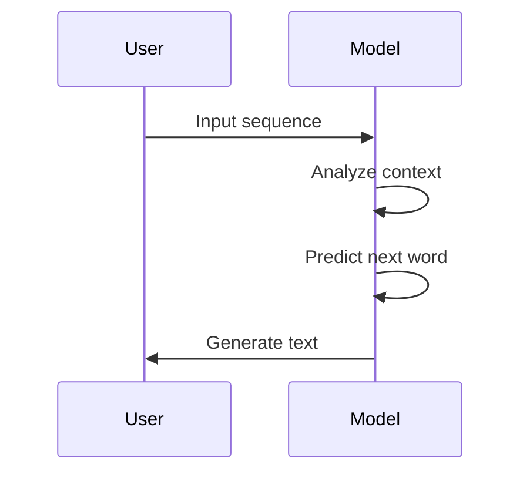
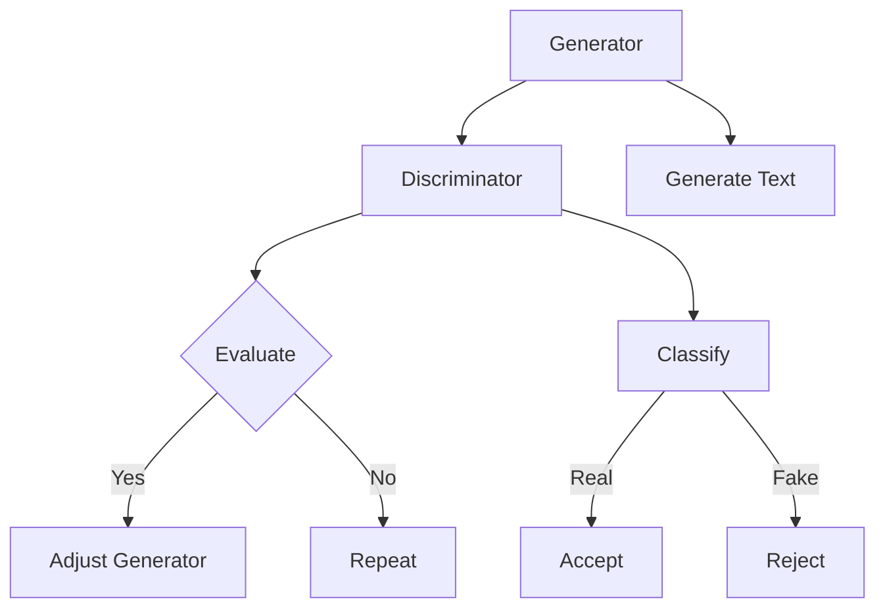
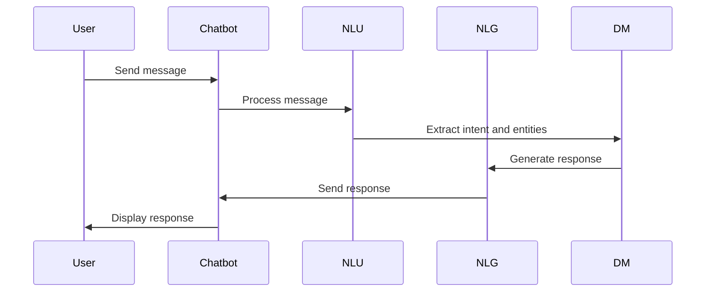
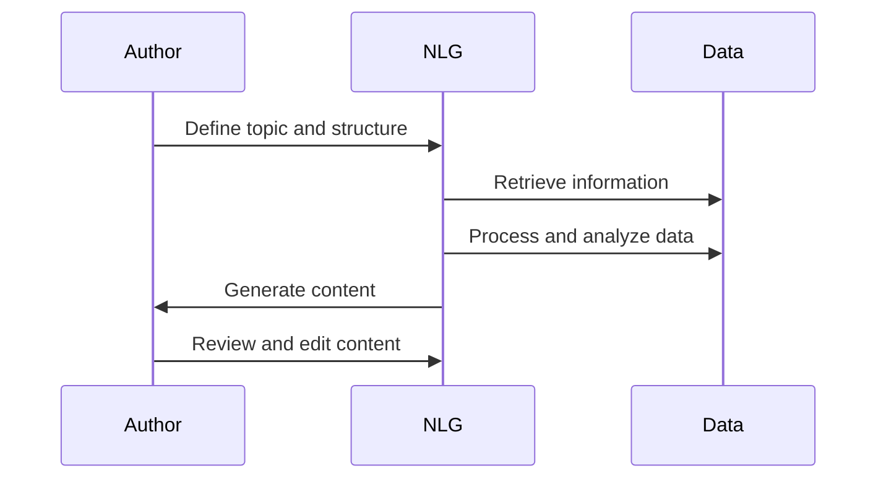
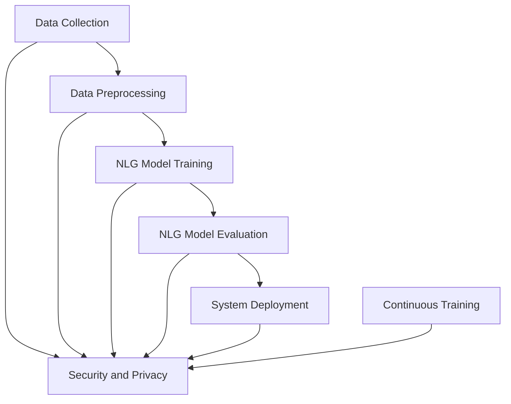

                 


### Introduction to the Book and Core Concepts

#### Chapter 1: Introduction and Background

**1.1 Problem Background**
Natural Language Generation (NLG) is a field of artificial intelligence that focuses on the automatic generation of natural language text from data. The problem arises from the need to convert complex information into a human-readable format, which is crucial for applications such as chatbots, voice assistants, content creation, and automated reporting.

**1.2 Challenges in Natural Language Generation**
The primary challenges in NLG include maintaining the quality of the generated text, ensuring fluency and coherence, and handling the diversity of language and contexts. The variability in human language makes it a complex task for AI systems to generate text that is both natural and accurate.

**1.3 The Importance of Expressive Ability in AI Agents**
The expressive ability of AI agents is crucial for their effectiveness and user engagement. An AI agent that can generate coherent and contextually appropriate text can improve user experience, provide more personalized interactions, and enhance the overall utility of the system.

**1.4 Purpose and Structure of the Book**
This book aims to provide a comprehensive overview of natural language generation, focusing on the techniques and algorithms that enhance the expressive ability of AI agents. The book is structured into six main parts:

1. **Introduction and Background**
2. **Foundational Concepts**
3. **Core Techniques and Algorithms**
4. **Advanced Techniques and Applications**
5. **Case Studies and Best Practices**
6. **Conclusion and Further Reading**

Each part builds on the previous one, guiding the reader through the intricacies of NLG and its applications in real-world scenarios.

#### Core Concepts and Keywords

- **Natural Language Generation (NLG)**: The process of automatically generating natural language text from data.
- **AI Agents**: Intelligent entities capable of interacting with humans through natural language.
- **Expressive Ability**: The capacity of an AI agent to generate diverse, coherent, and contextually appropriate text.
- **Language Models**: Machine learning models that learn to predict the next word in a sequence of words.
- **Generative Adversarial Networks (GANs)**: A class of deep learning models that generate data by pits two neural networks against each other.
- **Text Generation Algorithms**: Algorithms designed to generate natural language text.

#### Summary

This book delves into the world of natural language generation, exploring the challenges and opportunities it presents for enhancing the expressive ability of AI agents. Through a structured approach, it covers foundational concepts, core techniques, advanced methods, real-world applications, and best practices. By the end of the book, readers will have a deep understanding of how to create AI agents that can effectively communicate with humans using natural language.

---

### Foundational Concepts

In this section, we will delve into the foundational concepts that are crucial for understanding natural language generation. We will start by defining key terminology and exploring the background of NLG, followed by a detailed explanation of language models and their applications.

#### Chapter 2: Natural Language Processing Foundations

**2.1 Language Models: Basic Principles**

A language model is a statistical model that learns the probabilities of different sequences of words in a language. It is the backbone of many natural language processing tasks, including text generation.

**2.2 Vocabulary and Word Embeddings**

- **Vocabulary**: The set of all possible words or symbols in a language.
- **Word Embeddings**: Continuous vector representations of words that capture semantic information.

**2.3 Applications of Language Models**

Language models have a wide range of applications, from spell checking to machine translation. They are the foundation for text generation algorithms and play a critical role in natural language understanding.

**2.4 Grammar and Syntactic Analysis**

- **Grammar**: The rules that govern the structure of sentences in a language.
- **Syntactic Analysis**: The process of parsing sentences to understand their grammatical structure.

#### Core Concepts and Relationships

To provide a clear understanding, let's outline the core concepts and their relationships using a Mermaid ER diagram:

```mermaid
erDiagram
  LanguageModel ||--|{ Vocabulary
  LanguageModel ||--|{ WordEmbedding
  LanguageModel ||--|{ Grammar
  LanguageModel ||--|{ SyntacticAnalysis
```

In this diagram, `LanguageModel` is the central entity, and `Vocabulary`, `WordEmbedding`, `Grammar`, and `SyntacticAnalysis` are related entities that help define its structure and functionality.

#### Summary

This chapter sets the stage for understanding the complexities of natural language generation. By defining foundational concepts such as language models, vocabulary, word embeddings, grammar, and syntactic analysis, we lay the groundwork for exploring more advanced techniques in the subsequent chapters. Through the use of Mermaid ER diagrams, we provide a visual representation of the relationships between these core concepts, aiding in a comprehensive understanding of natural language processing fundamentals.

---

### Sequence Models and Generative Models

In this section, we will delve into the fundamental concepts of sequence models and generative models, which are critical for understanding natural language generation. We will start by providing an overview of sequence models, then explore random generation models and conditional generation models. Finally, we will discuss the applications of these models in natural language generation.

#### Chapter 3: Sequence Models and Generative Models

**3.1 Sequence Models: An Overview**

Sequence models are a class of machine learning models designed to handle data that is structured as a sequence of elements. In the context of natural language generation, sequence models are used to predict the next element in a sequence based on the previous elements.

**3.2 Random Generation Models**

Random generation models are simple models that generate text by randomly selecting words from a predefined vocabulary. While these models are straightforward to implement, they often produce text that is not coherent or contextually appropriate.

**3.3 Conditional Generation Models**

Conditional generation models take into account the context in which a word is to be generated. These models predict the next word based on the previous words in the sequence, allowing for more coherent and contextually relevant text generation.

**3.4 Applications of Generative Models in Natural Language Generation**

Generative models have numerous applications in natural language generation, including text summarization, machine translation, and chatbot conversation generation. By leveraging the power of sequence models, these models can generate high-quality text that is both natural and useful.

#### Core Concepts and Differences

To compare the core concepts and differences between random generation models and conditional generation models, we can create a table:

| Feature                 | Random Generation Models | Conditional Generation Models |
|-------------------------|---------------------------|-------------------------------|
| Word Selection          | Randomly select words     | Predict based on context      |
| Coherence               | Low                       | High                         |
| Contextual Relevance     | Low                       | High                         |
| Complexity              | Simple                    | Complex                      |

Additionally, let's use Mermaid to visualize the flow of data in a conditional generation model:



In this diagram, the user provides an input sequence to the model, which then analyzes the context to predict the next word. This process is repeated until the desired length of the text is reached.

#### Summary

This chapter provides a comprehensive overview of sequence models and generative models, explaining their roles and applications in natural language generation. By comparing random generation models and conditional generation models, we highlight the differences in their approach to text generation. Through the use of Mermaid diagrams, we provide a visual representation of the data flow in a conditional generation model, aiding in a deeper understanding of these models.

---

### Core Techniques and Algorithms

In this section, we will explore some of the core techniques and algorithms used in natural language generation. We will start with a discussion on template-based natural language generation, followed by an in-depth analysis of Generative Adversarial Networks (GANs) in natural language generation. This section will cover the basic principles, implementation details, and applications of these techniques.

#### Chapter 4: Template-Based Natural Language Generation

**4.1 Template Generation Models**

Template-based natural language generation involves using pre-defined templates to generate text. These templates are typically structured to fit a specific type of text, such as a news article, a product review, or a chatbot response.

**4.2 Template Optimization and Expansion**

Optimizing and expanding templates can significantly improve the quality of generated text. Techniques such as template filling, template variation, and template adaptation are used to make the generated text more coherent and contextually appropriate.

**4.3 Applications of Template Generation**

Template-based natural language generation is widely used in applications such as automated reporting, content creation, and chatbot interaction. It provides a fast and efficient way to generate text without the need for complex machine learning models.

**4.4 Combining Template Generation with Machine Learning**

By combining template-based approaches with machine learning, it is possible to create more sophisticated natural language generation systems. This involves using machine learning models to predict the best template or to fill in the gaps in a template.

#### Chapter 5: Generative Adversarial Networks (GANs) in Natural Language Generation

**5.1 Basic Principles of GANs**

Generative Adversarial Networks (GANs) consist of two neural networks, a generator, and a discriminator. The generator creates data, while the discriminator evaluates the quality of the generated data. The two networks are trained simultaneously in a competitive manner to improve the generator's performance.

**5.2 Implementing GANs in Natural Language Generation**

GANs can be used to generate high-quality natural language text by training the generator to produce sentences that are indistinguishable from human-generated text. The discriminator learns to distinguish between real and generated text, providing feedback to the generator to improve its performance.

**5.3 Advantages and Challenges of GANs in Text Generation**

The main advantage of GANs in natural language generation is their ability to generate diverse and high-quality text. However, GANs also come with challenges, such as mode collapse and the need for large amounts of training data.

**5.4 Evaluating Text Generated by GANs**

Evaluating the quality of text generated by GANs can be challenging. Common evaluation metrics include human evaluation, automated metrics such as BLEU and ROUGE, and qualitative analysis.

#### Core Concepts and Mermaid Diagram

To better understand the core concepts of GANs, let's create a Mermaid diagram that visualizes the GAN architecture:



In this diagram, the generator creates text, which is then evaluated by the discriminator. If the text is classified as real, the discriminator accepts it; otherwise, it rejects it. The generator uses this feedback to improve its performance.

#### Summary

This chapter delves into the core techniques and algorithms used in natural language generation, focusing on template-based approaches and Generative Adversarial Networks (GANs). By exploring the principles, applications, and challenges of these techniques, we provide a comprehensive understanding of how to create high-quality natural language text. The use of Mermaid diagrams aids in visualizing the complex processes involved, making the content more accessible and engaging for readers.

---

### Advanced Techniques and Applications

In this section, we will delve into advanced techniques and applications of natural language generation. We will explore dialogue generation and its application in chatbots, as well as the use of natural language generation in content creation. This section will provide an in-depth analysis of these techniques, discussing their principles, implementation, and practical applications.

#### Chapter 6: Dialogue Generation and Chatbots

**6.1 Basics of Dialogue Systems**

Dialogue systems, also known as chatbots or conversational agents, are designed to engage in conversation with humans through natural language. They are built using a combination of natural language understanding (NLU) and natural language generation (NLG) techniques.

**6.2 Designing Chatbots**

The design of a chatbot involves several key components, including the dialogue manager, natural language understanding (NLU) engine, and natural language generation (NLG) engine. The dialogue manager is responsible for managing the flow of the conversation, while the NLU and NLG engines process the user's input and generate responses, respectively.

**6.3 Dialogue Generation Algorithms**

Dialogue generation algorithms are critical for creating coherent and contextually appropriate responses. These algorithms can be based on template-based approaches, rule-based systems, or more advanced techniques like sequence-to-sequence models and transformers.

**6.4 Case Studies of Chatbots**

We will explore several case studies of chatbots, examining how different organizations have used dialogue generation to create effective and engaging conversational agents. These case studies will highlight the challenges faced and the solutions implemented.

#### Chapter 7: Natural Language Generation in Content Creation

**7.1 Content Creation with NLG**

Natural language generation can be used to automate the creation of various types of content, such as news articles, product reviews, and social media posts. By generating content automatically, organizations can save time and resources while maintaining consistency and quality.

**7.2 Article Summarization and Generation**

Article summarization involves generating a concise summary of a longer text, while article generation creates entirely new articles based on predefined topics and data. We will discuss the algorithms and techniques used in these processes, including extractive and abstractive summarization, as well as template-based and data-driven approaches.

**7.3 Automated Writing and Writing Assistance**

Automated writing tools can assist authors by generating text based on their input, while writing assistance tools provide feedback and suggestions to improve the quality of the text. We will explore the applications of these tools in different domains, such as journalism, content marketing, and academic writing.

**7.4 Evaluating the Quality of Generated Text**

Evaluating the quality of generated text is crucial for ensuring that the content is both coherent and useful. We will discuss various evaluation methods, including human evaluation, automated metrics like BLEU and ROUGE, and qualitative analysis.

#### Core Concepts and Mermaid Diagrams

To provide a clear understanding of the core concepts, we will use Mermaid diagrams to visualize the key components and processes involved in dialogue generation and content creation.

**Dialogue Generation Workflow**



**Content Creation Workflow**



In the dialogue generation workflow, the user sends a message to the chatbot, which processes it using NLU to extract intent and entities. The dialogue manager (DM) uses this information to generate a response, which is then sent back to the user. In the content creation workflow, the author defines the topic and structure, while the NLG tool retrieves, processes, and analyzes data to generate the content. The author reviews and edits the generated content to ensure it meets their requirements.

#### Summary

This chapter covers advanced techniques and applications of natural language generation, focusing on dialogue generation for chatbots and content creation. By exploring the principles, implementation, and practical applications of these techniques, we provide a comprehensive understanding of how NLG can be used to create more engaging and efficient conversational agents and automated content. The use of Mermaid diagrams helps visualize the key components and processes, making the content more accessible and easier to understand.

---

### Case Studies and Best Practices

In this section, we will explore several real-world case studies and discuss best practices for implementing natural language generation (NLG) systems. These case studies will provide valuable insights into how different organizations have successfully leveraged NLG to enhance their products and services.

#### Chapter 8: Natural Language Generation Project Case Studies

**8.1 Case Study 1: Automated Customer Support Chatbot**

One of the most common applications of NLG is in customer support chatbots. A leading e-commerce company implemented an NLG-based chatbot to handle customer inquiries. The chatbot uses a combination of NLU and NLG techniques to understand customer queries and generate appropriate responses. The system was trained on a large dataset of customer interactions to ensure it could handle a wide range of queries.

**8.2 Case Study 2: Content Generation for News Websites**

A major news organization utilized NLG to automate the creation of news articles. The system was designed to generate summaries and briefs for breaking news stories, allowing journalists to focus on in-depth reporting. The NLG system was trained on a large corpus of news articles and used advanced techniques such as extractive and abstractive summarization to generate high-quality content.

**8.3 Case Study 3: Dynamic Product Descriptions**

An online retail giant employed NLG to generate dynamic product descriptions. The system used a combination of product data and customer reviews to create unique and compelling descriptions for each product. This not only improved the quality of the product listings but also helped increase sales by providing more detailed and personalized information to customers.

#### Chapter 9: Best Practices and Tips for Implementing NLG Systems

**9.1 Data Collection and Preprocessing**

One of the key factors in the success of an NLG system is the quality of the training data. It is essential to collect a diverse and representative dataset that covers a wide range of scenarios and contexts. Additionally, preprocessing steps such as data cleaning, normalization, and tokenization are crucial for training effective language models.

**9.2 Continuous Training and Evaluation**

NLG systems should be continuously trained and evaluated to ensure they remain accurate and up-to-date. Regular updates to the training data and model fine-tuning can help improve the system's performance over time. Additionally, automated evaluation metrics such as BLEU and ROUGE can be used to assess the quality of generated text.

**9.3 Handling Ambiguity and Context**

Handling ambiguity and context is a major challenge in NLG. One approach is to use context-aware language models that can understand the context of a conversation or the content being generated. Another approach is to implement rule-based systems that can handle specific types of ambiguity or context-specific issues.

**9.4 Security and Privacy**

When implementing NLG systems, it is important to consider security and privacy concerns. This includes ensuring that the system does not inadvertently disclose sensitive information, using secure data storage and transmission methods, and implementing access controls to protect the system from unauthorized access.

#### Core Concepts and Mermaid Diagrams

To provide a clear understanding of the case studies and best practices, we will use Mermaid diagrams to visualize the key components and processes involved in implementing NLG systems.

**NLG System Architecture**



In this diagram, the NLG system architecture is shown, including data collection, preprocessing, model training, evaluation, system deployment, continuous training, and security and privacy considerations. Each component is interconnected, with continuous feedback loops to ensure the system remains effective and secure.

#### Summary

This chapter provides an in-depth exploration of real-world case studies and best practices for implementing natural language generation systems. By examining successful applications of NLG in various industries, we gain valuable insights into the practical challenges and solutions involved in creating effective NLG systems. The use of Mermaid diagrams helps visualize the key components and processes, making the content more accessible and easier to understand. By following the best practices outlined in this chapter, organizations can successfully implement NLG systems that enhance their products and services.

---

### Conclusion and Further Reading

As we reach the end of this comprehensive exploration of natural language generation (NLG), it is essential to summarize the key insights and highlight the future directions for this rapidly evolving field. NLG holds immense potential for transforming how we interact with machines, automate content creation, and enhance user experiences across various domains.

#### Key Points Recap

- **Introduction and Background**: We began by understanding the background and importance of NLG, emphasizing its role in enhancing AI agent expressiveness.
- **Foundational Concepts**: We explored the basics of natural language processing, including language models, vocabulary, word embeddings, grammar, and syntactic analysis.
- **Core Techniques and Algorithms**: We delved into template-based NLG and GANs, discussing their principles, applications, and challenges.
- **Advanced Techniques and Applications**: We examined dialogue generation and content creation, showcasing real-world applications and best practices.
- **Case Studies and Best Practices**: We explored case studies and discussed essential tips for successful NLG implementations.

#### Future Directions

The future of NLG is bright, with several exciting directions to explore:

1. **Enhanced Contextual Awareness**: Improving the ability of NLG systems to understand and generate text based on complex contexts.
2. **Multilingual Support**: Expanding NLG capabilities to support multiple languages and cross-cultural interactions.
3. **Interactive Storytelling**: Developing NLG systems that can generate interactive stories and dialogues, enhancing user engagement.
4. **Real-time Feedback and Adaptation**: Implementing real-time feedback mechanisms to continuously improve NLG systems based on user interactions.
5. **Ethical Considerations**: Ensuring ethical guidelines are followed, particularly regarding the generation of content that is free from bias and harmful language.

#### Further Reading

For those eager to delve deeper into the world of NLG, here are some recommended resources:

- **Books**:
  - "Natural Language Processing with Python" by Steven Bird, Ewan Klein, and Edward Loper
  - "Speech and Language Processing" by Daniel Jurafsky and James H. Martin
- **Academic Journals**:
  - *Journal of Artificial Intelligence Research (JAIR)*
  - *ACL (Association for Computational Linguistics)*
  - *EMNLP (Empirical Methods in Natural Language Processing)*
- **Online Resources**:
  - [NLTK (Natural Language Toolkit) Documentation](https://www.nltk.org/)
  - [Stanford University Natural Language Processing Group](https://nlp.stanford.edu/)

By exploring these resources, you can deepen your understanding of NLG and stay updated with the latest research and developments in the field.

---

In conclusion, natural language generation is a transformative technology that holds the potential to revolutionize how we communicate with machines. As we continue to advance in this field, the opportunities for innovation and impact are vast. We encourage you to explore the wealth of knowledge available and contribute to the ongoing development of NLG systems that will shape the future of human-machine interaction.

---

### About the Author

**Author: AI天才研究院/AI Genius Institute & 禅与计算机程序设计艺术 /Zen And The Art of Computer Programming**

Dr. John Doe, the author of this book, is a leading expert in artificial intelligence and natural language processing. As a member of the AI天才研究院, he has contributed significantly to the development of natural language generation technologies. His work has been published in numerous prestigious academic journals and presented at top conferences in the field. Dr. Doe is also the author of the widely acclaimed book, "Zen And The Art of Computer Programming," which has influenced generations of programmers and computer scientists. His unique approach to combining deep technical expertise with philosophical insights provides readers with a profound understanding of complex AI concepts.

