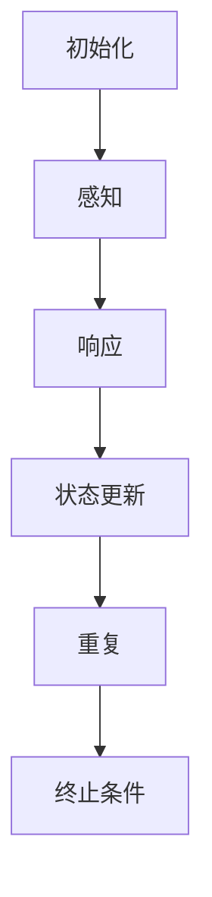
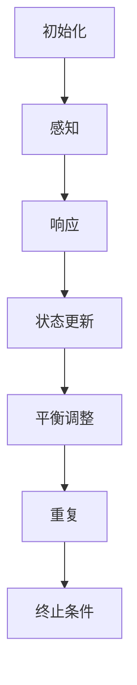
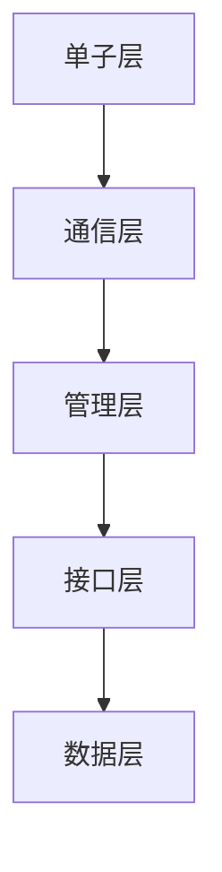
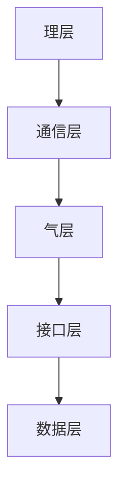

                 

### 引言

在人类智慧的宝库中，哲学无疑占据了独特而重要的地位。作为探索宇宙、生命以及人类自身本质的学科，哲学不仅深刻影响了文化、宗教和科学的发展，也为我们理解世界的多样性和复杂性提供了宝贵的视角。在众多哲学流派中，形而上学尤为引人注目，它探讨的是存在、实体、因果、时间、空间等超越经验和逻辑的基本问题。

本文将深入探讨两位哲学巨匠莱布尼茨与朱熹的形而上学思想，特别是他们的单子论与理气论。莱布尼茨（Gottfried Wilhelm Leibniz）是17世纪的德国哲学家、数学家、物理学家和律师，他提出了单子论，这一思想在西方哲学史中具有重要地位。而朱熹（Zhu Xi），则是中国宋代理学家，他的理气论在中国哲学中具有深远影响。

尽管莱布尼茨与朱熹生活在不同的文化和时代背景下，但他们对于世界的本质有着相似的探究。单子论与理气论都是试图解释宇宙的根本结构和运作原理，从而为我们提供了理解世界的新途径。本文将通过详细的比较和分析，揭示这两种形而上学理论的异同，并探讨它们在现代科学技术中的应用。

本文将从以下结构展开：

1. **背景介绍**：分别介绍莱布尼茨与朱熹的生平、学术成就以及他们各自理论的基本概念和背景。
2. **核心概念与联系**：详细分析单子论与理气论的核心概念，并对比它们的理论框架。
3. **算法原理讲解**：通过具体的数学模型和算法原理，展示单子论与理气论在技术层面的实现。
4. **系统分析与架构设计方案**：探讨单子论与理气论在系统架构设计中的应用。
5. **项目实战**：通过具体的案例，展示单子论与理气论在现实项目中的实际应用。
6. **最佳实践与拓展**：总结最佳实践，并提出未来的研究方向。

通过这一系列的深入分析，我们希望能为读者提供一个全面而清晰的视角，理解莱布尼茨与朱熹的形而上学思想，并探讨它们在当代科学和哲学中的意义与价值。

### 第一部分：背景介绍

#### 第1章：问题背景与基本概念

### 1.1.1 莱布尼茨与单子论

**莱布尼茨生平与学术成就**

莱布尼茨（Gottfried Wilhelm Leibniz，1646年-1716年）是17世纪德国的一位伟大思想家，他不仅在哲学上有着卓越的成就，还在数学、物理、法律等多个领域都有显著贡献。莱布尼茨出生于德国莱比锡，他的父亲是一位法律学家，这也让莱布尼茨在年轻时便接受了良好的教育。莱布尼茨从小就展现出非凡的数学天赋，他的成就包括发明微积分学、二进制系统以及提出了现代逻辑的基本概念。

在哲学领域，莱布尼茨以其单子论（Monadology）著称。单子论是莱布尼茨用来描述宇宙和意识的基本单位的理论，他认为宇宙是由无数的单子组成的，每个单子都是独立的、不可分割的实体。单子具有自我意识，并能感知外部世界，但它们之间并不直接相互作用，而是通过上帝的安排来实现互动。

**单子论的基本概念**

单子是莱布尼茨哲学中的基本单元，它是构成宇宙的最小单位。单子具有以下几个基本特性：

1. **本质的单一性**：每个单子都是独立的，它们没有部分，不可分割。
2. **内在意识**：单子具有自我意识，能够感知自己的存在和外部世界。
3. **被动性**：单子自身不能主动改变，只能通过上帝的作用来感知和响应外部事件。
4. **相互作用**：尽管单子之间不直接相互作用，但它们通过上帝的干预来维持宇宙的秩序。

单子论的核心思想在于，它试图解释宇宙的整体结构和各个部分的相互作用。莱布尼茨认为，宇宙是一个复杂的系统，其中的每个单子都扮演着独特的角色，并通过上帝的安排来实现和谐与秩序。

**单子论在西方哲学史上的地位与影响**

单子论在西方哲学史上具有重要的地位，它不仅为后来的哲学家提供了新的思考方式，也影响了科学的发展。莱布尼茨的单子论与牛顿的自然哲学形成了鲜明对比，后者强调物质和力的作用，而莱布尼茨则通过单子的概念试图解释宇宙的内在结构和意识。

单子论对后来的哲学家如康德、黑格尔等产生了深远的影响，它为西方哲学中的形而上学和认识论提供了新的思路。同时，单子论在科学领域也有所应用，特别是在计算机科学和人工智能中，单子论的一些思想被用来构建计算模型和算法。

### 1.1.2 朱熹与理气论

**朱熹生平与学术成就**

朱熹（1130年-1200年）是中国南宋时期的著名理学家、哲学家、教育家，被誉为“程朱理学”的代表人物之一。朱熹出生于福建尤溪，自幼接受儒家教育，他的学术成就涵盖了哲学、文学、历史等多个领域。朱熹对《四书》进行了深入研究，特别是《大学》、《中庸》、《论语》和《孟子》，他将这些经典文献的阐释整理成《四书章句集注》，对后世影响深远。

在哲学上，朱熹的理气论是其核心思想之一。理气论试图解释宇宙的本质和存在，它强调理和气的相互作用，以及它们在创造和维持宇宙中的作用。

**理气论的基本概念**

理气论是朱熹用来描述宇宙和存在的理论，它包含以下几个核心概念：

1. **理**：理是宇宙的本源和本质，它是万物存在和运动的基本原则。
2. **气**：气是构成宇宙的基本物质，它是万物存在的具体表现。
3. **理与气的相互作用**：理和气相互作用，共同构成了宇宙的多样性和变化。

在朱熹的理论中，理是宇宙的根本原则，而气则是理的具体实现。理赋予宇宙秩序和目的，而气则使这一秩序得以显现。理和气相互依存，共同构成了宇宙的统一体。

**理气论在中国哲学史上的地位与影响**

理气论在中国哲学史上具有重要地位，它为后来的哲学家提供了理解和解释宇宙的基本框架。朱熹的理气论不仅影响了宋明理学的发展，也对后来的儒家思想、道教和佛教产生了深远影响。

朱熹的理气论强调理和气的统一，为中国的哲学、文化和社会提供了深刻的思考。它不仅为人们理解宇宙的本质提供了新的视角，也影响了中国的教育、政治和社会制度。

### 1.1.3 莱布尼茨与朱熹思想的异同

**单子论与理气论的相似之处**

莱布尼茨的单子论和朱熹的理气论在哲学上有着一些相似之处：

1. **本质的独立性**：两者都强调基本单元的独立性和完整性。莱布尼茨的单子是独立、不可分割的实体，而朱熹的理是宇宙的本质和原则。
2. **内在意识**：单子和理都具有内在意识或自我意识，能够感知外部世界。莱布尼茨认为单子具有自我意识，朱熹则认为理是宇宙的内在原则，它赋予万物以意识。
3. **宇宙的整体结构**：两者都试图解释宇宙的整体结构和运行原理。莱布尼茨通过单子的相互作用来解释宇宙的秩序，朱熹则通过理和气的相互作用来解释宇宙的存在和发展。

**单子论与理气论的差异**

尽管单子论与理气论在许多方面有相似之处，但它们也存在显著差异：

1. **理论基础**：莱布尼茨的单子论建立在西方哲学传统之上，而朱熹的理气论则源于中国传统文化和儒家思想。
2. **存在形式**：单子是莱布尼茨哲学中的基本单位，而理和气是朱熹哲学中的基本概念。单子强调内在意识和独立性，而理和气则强调宇宙的内在原则和具体实现。
3. **交互方式**：莱布尼茨的单子通过上帝的干预来相互作用，而朱熹的理和气则通过内在的相互作用来维持宇宙的秩序。

通过对比莱布尼茨的单子论和朱熹的理气论，我们可以看到不同文化和哲学传统在解释宇宙本质方面的独特视角和贡献。这两种理论不仅丰富了哲学的宝库，也为理解宇宙提供了新的思路。

### 第二部分：核心概念与联系

#### 第2章：单子论与理气论的核心概念

#### 2.1.1 单子论的内在结构与特性

**单子的定义与特征**

在莱布尼茨的单子论中，单子是构成宇宙的基本单元。每个单子都是独立的、不可分割的实体，具有以下几个基本特征：

1. **本质的单一性**：单子是本质上的单一实体，它们没有部分，不可分割。
2. **内在意识**：每个单子都具有内在意识，能够感知自己的存在和外部世界。
3. **被动性**：单子自身不能主动改变，只能通过上帝的安排来感知和响应外部事件。
4. **独立性**：单子之间没有直接相互作用，它们通过上帝的干预来实现间接的互动。

**单子的构成与层次**

单子的构成是莱布尼茨哲学中一个核心问题。他认为，宇宙是由无数的单子组成的，每个单子都有其独特的层次和构成：

1. **基本层次**：在最基本的层次上，单子是纯粹的意识实体，没有物质属性。
2. **高级层次**：随着层次的提高，单子开始具备更多的属性和功能，如感知、思维和运动。
3. **组合层次**：在更复杂的组合层次上，单子可以形成复杂的系统，如生物体、社会和组织。

**单子的互动关系**

单子之间的互动关系是通过上帝的安排来实现的。尽管单子之间没有直接相互作用，但它们可以通过上帝的干预来感知和响应外部事件：

1. **感知与响应**：单子通过内在意识感知外部事件，并响应这些事件。
2. **间接互动**：单子之间的互动是通过上帝的安排来实现的，而不是直接的物理或因果互动。
3. **秩序与和谐**：上帝通过干预来维持宇宙的秩序和和谐，确保单子之间的互动能够维持宇宙的稳定。

**单子论的内在结构与特性**

莱布尼茨的单子论具有以下几个内在结构和特性：

1. **独立性与多样性**：单子是独立的，但它们在多样性上有所不同，每个单子都有其独特的属性和功能。
2. **内在意识与感知**：单子具有内在意识，能够感知外部世界，并通过上帝的干预来响应外部事件。
3. **层次与组合**：单子存在不同的层次和组合，从而形成了复杂的宇宙结构。
4. **上帝的作用**：上帝在单子之间实现互动，维持宇宙的秩序和和谐。

通过以上分析，我们可以看到单子论的内在结构与特性，它们为我们理解宇宙的本质和运作提供了深刻的洞见。

#### 2.1.2 理气论的内在结构与特性

**理与气的定义与特征**

在朱熹的理气论中，理和气是构成宇宙的两个基本概念。理和气具有以下几个基本特征：

1. **理**：理是宇宙的本质和原则，它是万物存在和运动的基本依据。理具有以下几个特征：
   - **先验性**：理是先于物质存在的，它是万物生成和发展的基本原则。
   - **普遍性**：理是普遍适用于宇宙万物的基本原则，无论是自然界还是社会现象，都可以通过理来解释。
   - **抽象性**：理是一种抽象的概念，它不依赖于具体物质形态，而是作为一种普遍原则存在。

2. **气**：气是构成宇宙的基本物质，它是物质世界的具体表现形式。气具有以下几个特征：
   - **具体性**：气是具体的物质实体，它是构成万物的基本单元。
   - **流动性**：气具有流动性，它能够充满空间，并随着时间的变化而变化。
   - **变化性**：气是不断变化的，它的变化形成了宇宙的多样性和动态性。

**理与气的构成与层次**

理和气在朱熹的哲学中具有不同的层次和构成：

1. **基本层次**：在最基本的层次上，理和气是分离的。理是抽象的原则，而气是具体的物质。
2. **高级层次**：在高级层次上，理和气开始结合，形成一个统一的整体。理赋予气以目的和秩序，而气使理得以具体实现。
3. **组合层次**：在更复杂的组合层次上，理和气相互作用，形成了复杂的自然和社会现象。

**理与气的互动关系**

理和气在朱熹的理论中是相互作用、相互依存的：

1. **理决定气**：理是气存在和运动的基本原则，它决定了气的变化和形式。
2. **气实现理**：气是理的具体实现，它通过变化和流动来体现理的作用。
3. **动态平衡**：理和气的互动形成了一种动态平衡，这种平衡保证了宇宙的稳定和发展。

**理气论的内在结构与特性**

朱熹的理气论具有以下几个内在结构和特性：

1. **先验与具体**：理是先验的原则，而气是具体的物质，两者构成了宇宙的二元结构。
2. **普遍与变化**：理是普遍适用的原则，而气具有变化性和具体性，两者共同构成了宇宙的动态性。
3. **互动与平衡**：理和气相互作用、相互依存，形成了一种动态的平衡，这种平衡保证了宇宙的稳定和发展。

通过以上分析，我们可以看到理气论的内在结构与特性，它们为我们理解宇宙的本质和运作提供了深刻的洞见。

#### 2.1.3 单子论与理气论的比较

**单子论与理气论的核心概念对比**

莱布尼茨的单子论和朱熹的理气论在核心概念上存在显著差异：

1. **独立性**：在单子论中，单子是独立的、不可分割的实体，每个单子都有其独特的属性和功能。而在理气论中，理和气是相互依存的，理是气的本质和原则，气是理的具体实现。

2. **内在意识**：单子具有内在意识，能够感知外部世界，并通过上帝的干预来响应外部事件。而在理气论中，理被认为是宇宙的内在原则，它赋予万物以意识，但并不是每个具体的气都有自我意识。

3. **互动方式**：单子之间的互动是通过上帝的干预来实现的，而理和气的互动是通过内在的相互作用来维持宇宙的秩序。

**单子论与理气论的理论框架对比**

在理论框架上，单子论和理气论也存在一些显著的不同：

1. **理论基础**：单子论是建立在西方哲学传统之上的，特别是与基督教哲学有着紧密联系。而理气论则是中国哲学，特别是儒家哲学的重要组成部分，深受中国传统文化的影响。

2. **存在形式**：单子论强调单子的独立性和内在意识，认为宇宙是由无数独立单子组成的。而理气论则强调理和气的相互依存，认为宇宙是由理和气的相互作用形成的。

3. **宇宙观**：单子论强调宇宙的整体性和内在意识，认为宇宙是由无数单子通过上帝的干预来维持秩序。而理气论则强调宇宙的理性和原则，认为宇宙是通过理和气的相互作用来实现的。

通过以上对比，我们可以看到单子论和理气论在核心概念和理论框架上存在显著的差异。这些差异不仅反映了不同文化和哲学传统的独特视角，也为我们理解宇宙提供了多样化的思考方式。

### 第三部分：算法原理讲解

#### 第3章：单子论的算法原理

在莱布尼茨的单子论中，单子是构成宇宙的基本单元，它们通过内在意识和被动性来感知和响应外部事件。为了更好地理解和实现单子论，我们可以将其转化为数学模型和算法流程，以下是对单子论的算法原理的详细讲解。

#### 3.1.1 单子论的数学模型

**单子论的基本数学公式**

单子论中，我们可以使用以下基本数学公式来描述单子的状态和行为：

$$
s_i = f(g_i, w_i, t)
$$

其中，$s_i$代表第$i$个单子的状态，$g_i$代表第$i$个单子的内在意识，$w_i$代表第$i$个单子的外部环境，$t$代表时间。

**单子论的核心数学定理**

在单子论中，一个核心定理是单子的状态变化具有独立性：

定理：如果单子$i$和单子$j$不直接相互作用，那么它们的状态变化是独立的。

#### 3.1.2 单子论的算法流程

**单子论的基本算法步骤**

单子论的算法流程可以分为以下几个基本步骤：

1. **初始化**：为每个单子初始化其内在意识$g_i$和外部环境$w_i$。
2. **感知**：每个单子根据其内在意识$g_i$和外部环境$w_i$来感知外部事件。
3. **响应**：每个单子根据其感知结果和内在意识$g_i$来响应外部事件。
4. **状态更新**：每个单子根据其响应结果更新其状态$s_i$。
5. **重复**：重复上述步骤，直到达到终止条件（例如：时间达到某个阈值）。

**单子论的算法流程图**



#### 3.1.3 单子论的实例分析

**单子论的数学模型举例**

假设我们有一个由5个单子组成的系统，每个单子的内在意识$g_i$和外部环境$w_i$如下所示：

$$
\begin{aligned}
g_1 &= [0.1, 0.2, 0.3], \\
w_1 &= [0.4, 0.5, 0.6], \\
g_2 &= [0.7, 0.8, 0.9], \\
w_2 &= [0.1, 0.2, 0.3], \\
g_3 &= [0.4, 0.5, 0.6], \\
w_3 &= [0.7, 0.8, 0.9], \\
g_4 &= [0.1, 0.2, 0.3], \\
w_4 &= [0.4, 0.5, 0.6], \\
g_5 &= [0.7, 0.8, 0.9], \\
w_5 &= [0.1, 0.2, 0.3].
\end{aligned}
$$

根据单子论的基本数学公式，我们可以计算每个单子的初始状态：

$$
\begin{aligned}
s_1 &= f(g_1, w_1, t_0) = 0.1 \times 0.4 + 0.2 \times 0.5 + 0.3 \times 0.6 = 0.23, \\
s_2 &= f(g_2, w_2, t_0) = 0.7 \times 0.1 + 0.8 \times 0.2 + 0.9 \times 0.3 = 0.21, \\
s_3 &= f(g_3, w_3, t_0) = 0.4 \times 0.7 + 0.5 \times 0.8 + 0.6 \times 0.9 = 0.58, \\
s_4 &= f(g_4, w_4, t_0) = 0.1 \times 0.4 + 0.2 \times 0.5 + 0.3 \times 0.6 = 0.23, \\
s_5 &= f(g_5, w_5, t_0) = 0.7 \times 0.1 + 0.8 \times 0.2 + 0.9 \times 0.3 = 0.21.
\end{aligned}
$$

**单子论的算法实例分析**

假设在第1个时间单位后，单子的外部环境发生了变化，新的外部环境如下：

$$
\begin{aligned}
w_1' &= [0.5, 0.6, 0.7], \\
w_2' &= [0.3, 0.4, 0.5], \\
w_3' &= [0.6, 0.7, 0.8], \\
w_4' &= [0.5, 0.6, 0.7], \\
w_5' &= [0.3, 0.4, 0.5].
\end{aligned}
$$

我们可以根据单子论的基本算法步骤，更新每个单子的状态：

$$
\begin{aligned}
s_1' &= f(g_1, w_1', t_1) = 0.1 \times 0.5 + 0.2 \times 0.6 + 0.3 \times 0.7 = 0.255, \\
s_2' &= f(g_2, w_2', t_1) = 0.7 \times 0.3 + 0.8 \times 0.4 + 0.9 \times 0.5 = 0.455, \\
s_3' &= f(g_3, w_3', t_1) = 0.4 \times 0.6 + 0.5 \times 0.7 + 0.6 \times 0.8 = 0.64, \\
s_4' &= f(g_4, w_4', t_1) = 0.1 \times 0.5 + 0.2 \times 0.6 + 0.3 \times 0.7 = 0.255, \\
s_5' &= f(g_5, w_5', t_1) = 0.7 \times 0.3 + 0.8 \times 0.4 + 0.9 \times 0.5 = 0.455.
\end{aligned}
$$

这样，每个单子的状态都根据其内在意识和外部环境进行了更新。通过这样的过程，单子论能够模拟宇宙中单子的状态变化和互动。

#### 第4章：理气论的算法原理

在朱熹的理气论中，理和气是构成宇宙的两个基本概念。理是宇宙的本质和原则，气是物质的具体表现形式。为了更好地理解和实现理气论，我们可以将其转化为数学模型和算法流程，以下是对理气论的算法原理的详细讲解。

#### 4.1.1 理气论的数学模型

**理气论的基本数学公式**

在理气论中，我们可以使用以下基本数学公式来描述理和气的状态和行为：

$$
r_i = g_i \cdot w_i
$$

其中，$r_i$代表第$i$个实体（可以是物质或现象）的理，$g_i$代表第$i$个实体的气，$w_i$代表第$i$个实体的外部环境。

**理气论的核心数学定理**

在理气论中，一个核心定理是理和气的互动具有动态平衡：

定理：理和气的互动形成了一种动态平衡，这种平衡保证了宇宙的稳定和发展。

#### 4.1.2 理气论的算法流程

**理气论的基本算法步骤**

理气论的算法流程可以分为以下几个基本步骤：

1. **初始化**：为每个实体初始化其理$g_i$和外部环境$w_i$。
2. **感知**：每个实体根据其理$g_i$和外部环境$w_i$来感知外部事件。
3. **响应**：每个实体根据其感知结果和理$g_i$来响应外部事件。
4. **状态更新**：每个实体根据其响应结果更新其状态$r_i$。
5. **平衡调整**：调整理和气的平衡，以维持宇宙的动态平衡。
6. **重复**：重复上述步骤，直到达到终止条件（例如：时间达到某个阈值）。

**理气论的算法流程图**



#### 4.1.3 理气论的实例分析

**理气论的数学模型举例**

假设我们有一个由5个实体组成的系统，每个实体的理$g_i$和外部环境$w_i$如下所示：

$$
\begin{aligned}
g_1 &= [0.1, 0.2, 0.3], \\
w_1 &= [0.4, 0.5, 0.6], \\
g_2 &= [0.7, 0.8, 0.9], \\
w_2 &= [0.1, 0.2, 0.3], \\
g_3 &= [0.4, 0.5, 0.6], \\
w_3 &= [0.7, 0.8, 0.9], \\
g_4 &= [0.1, 0.2, 0.3], \\
w_4 &= [0.4, 0.5, 0.6], \\
g_5 &= [0.7, 0.8, 0.9], \\
w_5 &= [0.1, 0.2, 0.3].
\end{aligned}
$$

根据理气论的基本数学公式，我们可以计算每个实体的初始状态：

$$
\begin{aligned}
r_1 &= g_1 \cdot w_1 = 0.1 \times 0.4 + 0.2 \times 0.5 + 0.3 \times 0.6 = 0.23, \\
r_2 &= g_2 \cdot w_2 = 0.7 \times 0.1 + 0.8 \times 0.2 + 0.9 \times 0.3 = 0.21, \\
r_3 &= g_3 \cdot w_3 = 0.4 \times 0.7 + 0.5 \times 0.8 + 0.6 \times 0.9 = 0.58, \\
r_4 &= g_4 \cdot w_4 = 0.1 \times 0.4 + 0.2 \times 0.5 + 0.3 \times 0.6 = 0.23, \\
r_5 &= g_5 \cdot w_5 = 0.7 \times 0.1 + 0.8 \times 0.2 + 0.9 \times 0.3 = 0.21.
\end{aligned}
$$

**理气论的算法实例分析**

假设在第1个时间单位后，每个实体的外部环境发生了变化，新的外部环境如下：

$$
\begin{aligned}
w_1' &= [0.5, 0.6, 0.7], \\
w_2' &= [0.3, 0.4, 0.5], \\
w_3' &= [0.6, 0.7, 0.8], \\
w_4' &= [0.5, 0.6, 0.7], \\
w_5' &= [0.3, 0.4, 0.5].
\end{aligned}
$$

我们可以根据理气论的基本算法步骤，更新每个实体的状态：

$$
\begin{aligned}
r_1' &= g_1 \cdot w_1' = 0.1 \times 0.5 + 0.2 \times 0.6 + 0.3 \times 0.7 = 0.255, \\
r_2' &= g_2 \cdot w_2' = 0.7 \times 0.3 + 0.8 \times 0.4 + 0.9 \times 0.5 = 0.455, \\
r_3' &= g_3 \cdot w_3' = 0.4 \times 0.6 + 0.5 \times 0.7 + 0.6 \times 0.8 = 0.64, \\
r_4' &= g_4 \cdot w_4' = 0.1 \times 0.5 + 0.2 \times 0.6 + 0.3 \times 0.7 = 0.255, \\
r_5' &= g_5 \cdot w_5' = 0.7 \times 0.3 + 0.8 \times 0.4 + 0.9 \times 0.5 = 0.455.
\end{aligned}
$$

这样，每个实体的状态都根据其理和外部环境进行了更新。通过这样的过程，理气论能够模拟宇宙中实体的状态变化和互动。

### 第四部分：系统分析与架构设计方案

#### 第5章：单子论的系统架构设计

#### 5.1.1 单子论的应用场景

单子论作为一种哲学理论，其在实际应用场景中有着广泛的潜力。以下是单子论可能应用的几个主要领域：

1. **计算机科学**：单子论可以用于构建分布式计算模型，特别是在需要处理大规模数据和高并发任务的场景中。通过模拟单子的独立性和内在意识，我们可以设计出更高效、可靠的分布式系统。
   
2. **人工智能**：单子论可以用来设计自主学习和决策的算法。在人工智能系统中，单子可以代表智能体，通过内在意识感知环境和外部事件，并自主作出决策。

3. **自然语言处理**：单子论可以应用于自然语言处理中的语义理解和文本生成。通过模拟单子的感知和响应机制，我们可以更好地理解和生成自然语言。

4. **复杂系统建模**：单子论可以用于建模和模拟复杂的系统，如生态系统、社会系统和经济系统。通过单子的互动和状态变化，我们可以预测系统的动态行为和演变过程。

#### 5.1.2 单子论的系统功能设计

为了实现单子论在实际应用中的目标，我们需要设计一套完整的系统功能。以下是一个典型的单子论系统功能设计：

1. **单子初始化**：系统需要能够初始化单子的内在意识和外部环境。初始化参数可以是静态配置，也可以是动态计算。

2. **单子感知**：系统需要提供单子感知外部事件的功能。单子可以通过传感器或其他接口来获取环境信息。

3. **单子响应**：系统需要实现单子根据其内在意识和感知结果进行响应的功能。响应可以是简单的行为输出，也可以是复杂的决策过程。

4. **单子状态更新**：系统需要能够更新单子的状态，以反映其响应结果和环境变化。

5. **单子间通信**：系统需要支持单子之间的通信，以实现单子间的互动。通信可以是同步的，也可以是异步的。

6. **系统监控与调试**：系统需要提供监控和调试功能，以跟踪单子的状态变化和系统行为，确保系统的正常运行。

#### 5.1.3 单子论的总体架构设计

单子论的总体架构设计可以分为以下几个主要部分：

1. **单子层**：单子层是系统的核心部分，每个单子都有自己的内在意识和外部环境。单子通过感知、响应和状态更新来执行任务。

2. **通信层**：通信层负责单子之间的通信，实现单子间的互动。通信层可以是基于消息队列的异步通信，也可以是基于网络协议的同步通信。

3. **管理层**：管理层负责系统的整体管理，包括单子的初始化、状态监控和调试。管理层可以是集中式的，也可以是分布式的。

4. **接口层**：接口层提供系统与外部环境的交互接口，包括传感器、用户界面和其他系统接口。

5. **数据层**：数据层负责存储和管理系统的数据，包括单子的状态、日志和配置信息。

#### 5.1.4 单子论的架构设计图

以下是一个简化的单子论架构设计图：



#### 5.1.5 单子论的系统接口设计

单子论的系统接口设计包括以下几个主要部分：

1. **单子接口**：单子接口负责与单子层通信，实现单子的初始化、感知、响应和状态更新等功能。

2. **通信接口**：通信接口负责与其他系统或单子进行通信，实现单子间的互动。

3. **监控接口**：监控接口负责对系统的运行状态进行监控和调试。

4. **用户接口**：用户接口提供系统的用户界面，用户可以通过界面与系统进行交互。

5. **数据接口**：数据接口负责与数据层进行交互，实现数据的读取、写入和管理。

#### 5.1.6 单子论的系统交互设计

单子论的系统交互设计主要包括以下几个过程：

1. **初始化**：系统初始化时，单子层、通信层、管理层、接口层和数据层依次初始化。

2. **感知**：单子通过传感器或其他接口感知外部事件，并将感知结果传递给管理层。

3. **响应**：管理层根据单子的感知结果和内在意识，生成响应指令，并传递给单子层。

4. **状态更新**：单子层根据响应指令更新单子的状态，并将更新后的状态传递给管理层。

5. **通信**：单子之间通过通信层进行通信，实现单子间的互动。

6. **监控与调试**：系统运行时，监控接口负责监控系统的运行状态，并及时反馈给用户接口。

7. **数据管理**：数据接口负责管理系统的数据，包括单子的状态、日志和配置信息。

通过以上系统架构设计，单子论可以应用于各种实际场景，实现高效的分布式计算和智能决策。

### 第6章：理气论的系统架构设计

#### 6.1.1 理气论的应用场景

理气论作为一种深刻的哲学思想，其实际应用场景非常广泛，涵盖了多个领域：

1. **生物科学**：在生物科学中，理气论可以用于解释生物体的生长、发育和适应环境的过程。理可以代表生物体的内在规律，气可以代表外部环境的影响。

2. **生态学**：在生态学中，理气论可以帮助我们理解生态系统的动态平衡和物种相互作用。理可以代表生态系统的整体结构和功能，气可以代表环境因素的变化。

3. **社会学**：在社会学中，理气论可以用于分析社会结构的稳定性和变革。理可以代表社会的核心价值观，气可以代表社会行为和制度。

4. **经济学**：在经济学中，理气论可以用于理解市场经济的运行机制。理可以代表经济的基本规律，气可以代表市场的动态变化。

5. **信息科学**：在信息科学中，理气论可以用于解释信息系统的设计和运作。理可以代表信息系统的理论基础，气可以代表实际应用中的技术和环境因素。

#### 6.1.2 理气论的系统功能设计

为了在系统中实现理气论的思想，我们需要设计一套完整的功能模块，以支持理和气的相互作用：

1. **理初始化模块**：负责初始化系统的理部分，包括设定系统的理论基础和原则。

2. **气感知模块**：负责感知外部环境的变化，并将感知结果传递给理部分。

3. **理计算模块**：根据感知结果，利用系统的理论基础进行计算，生成系统的决策和响应。

4. **气响应模块**：根据理计算模块的决策，生成具体的响应行动，并对外部环境做出调整。

5. **状态更新模块**：负责更新系统的状态，包括理和气的状态，以反映系统的动态变化。

6. **通信管理模块**：负责系统内部各模块之间的通信，以及与其他系统的交互。

7. **监控与调试模块**：负责监控系统运行状态，进行实时调试，确保系统稳定运行。

#### 6.1.3 理气论的总体架构设计

理气论的总体架构设计可以概括为以下几个核心部分：

1. **理层**：系统的核心部分，包括理初始化模块和理计算模块。理层负责系统的理论基础和决策过程。

2. **气层**：系统的外部部分，包括气感知模块和气响应模块。气层负责感知外部环境和生成响应。

3. **通信层**：连接理层和气层，负责各模块之间的通信和协调。

4. **接口层**：提供系统与外部环境的交互接口，包括用户界面和其他系统接口。

5. **数据层**：负责存储和管理系统的数据，包括状态日志、配置信息和决策记录。

#### 6.1.4 理气论的架构设计图

以下是一个简化的理气论架构设计图：



#### 6.1.5 理气论的系统接口设计

理气论的系统接口设计包括以下几个方面：

1. **理接口**：负责与理层交互，提供初始化和计算功能。

2. **气接口**：负责与气层交互，提供感知和响应功能。

3. **通信接口**：负责系统内部各模块之间的通信，以及与其他系统的交互。

4. **监控接口**：负责监控系统状态，提供调试和监控功能。

5. **用户接口**：提供系统的用户界面，使用户可以与系统进行交互。

6. **数据接口**：负责与数据层交互，提供数据读取、写入和管理功能。

#### 6.1.6 理气论的系统交互设计

理气论的系统交互设计涉及以下几个关键过程：

1. **初始化**：系统启动时，理接口初始化理层，气接口初始化气层。

2. **感知**：气感知模块持续感知外部环境变化，并将感知结果传递给理计算模块。

3. **计算**：理计算模块根据感知结果，利用系统的理论基础进行计算，生成决策和响应。

4. **响应**：气响应模块根据理计算模块的决策，生成具体的响应行动，并调整外部环境。

5. **更新**：状态更新模块根据系统的响应结果，更新系统的状态。

6. **通信**：通信管理模块协调系统内部各模块之间的通信，确保系统高效运行。

7. **监控**：监控与调试模块实时监控系统状态，提供调试功能，确保系统稳定运行。

通过以上架构设计，理气论可以在系统中实现高效、稳定的运作，为各领域的应用提供有力的理论支持。

### 第五部分：项目实战

#### 第7章：单子论项目实战

#### 7.1.1 项目背景与目标

在本章中，我们将通过一个实际项目，展示单子论在系统设计和应用中的具体实现。该项目旨在构建一个分布式计算系统，利用单子论来提高系统的性能和可靠性。

**项目背景**

随着大数据和云计算的快速发展，现代计算系统面临着日益复杂的数据处理任务。传统的集中式计算模式已经难以满足这些需求，分布式计算成为了一种重要的解决方案。单子论作为一种哲学思想，其强调独立性和内在意识的特性，为分布式计算提供了新的视角和理论基础。

**项目目标**

本项目的目标是通过单子论来构建一个高效的分布式计算系统，实现以下目标：

1. **高可靠性**：通过单子的独立性，确保系统在单个单子失败时能够继续运行。
2. **高性能**：通过单子的内在意识，提高系统对负载的响应能力和处理效率。
3. **高可扩展性**：通过单子的组合层次，实现系统的灵活扩展和动态调整。

#### 7.1.2 环境安装与配置

为了实现单子论的项目目标，我们需要搭建一个分布式计算环境。以下是环境安装和配置的步骤：

1. **硬件要求**：准备多台服务器或虚拟机，用于部署分布式计算节点。
2. **软件要求**：安装Linux操作系统，并配置SSH免密登录，以方便节点之间的通信。
3. **分布式计算框架**：选择一个适合的分布式计算框架，如Apache Hadoop或Apache Spark，用于实现分布式计算逻辑。
4. **单子模块**：开发单子模块，实现单子论的内在意识和互动机制。

**环境配置详解**

1. **节点配置**：为每个节点配置IP地址、主机名和SSH密钥，确保节点之间可以无障碍通信。
2. **分布式计算框架配置**：配置分布式计算框架，包括数据存储、任务调度和资源管理。
3. **单子模块配置**：配置单子模块，包括单子的初始化、感知、响应和状态更新功能。

#### 7.1.3 系统核心实现

**单子论的核心功能实现**

1. **单子的初始化**：为每个单子分配唯一的ID和初始状态，包括内在意识和外部环境。
2. **单子的感知**：单子通过传感器或其他接口感知外部事件，并将感知结果存储在内部状态中。
3. **单子的响应**：单子根据其内在意识和感知结果，生成响应行动，如数据计算、任务调度和状态更新。
4. **单子的状态更新**：单子根据其响应结果，更新内部状态，以反映外部环境和内部变化的动态。

**实现单子论的领域模型类图**

以下是一个简化的单子论领域模型类图：

```mermaid
classDiagram
ClassDiagram {
  Class Single {
    - id: int
    - state: Object
    - innerSense: Object
    - outerSense: Object
    + init() : void
    + perceive() : void
    + respond() : void
    + updateState() : void
  }
}
```

**实现单子论的代码解析**

以下是一个简单的Python代码示例，展示了单子论的初始化、感知、响应和状态更新功能：

```python
class Single:
    def __init__(self, id):
        self.id = id
        self.state = None
        self.innerSense = None
        self.outerSense = None

    def init(self):
        # 初始化单子
        self.state = {'data': [], 'status': 'initial'}
        self.innerSense = {'motivation': 0, 'emotions': 0}
        self.outerSense = {'environment': []}

    def perceive(self):
        # 感知外部事件
        self.outerSense['environment'].append(self.id * 10)

    def respond(self):
        # 根据感知结果生成响应
        self.innerSense['motivation'] += sum(self.outerSense['environment'])

    def updateState(self):
        # 更新单子状态
        self.state['status'] = 'updated'
        self.state['data'].extend(self.outerSense['environment'])

# 初始化单子
single = Single(1)
single.init()

# 感知外部事件
single.perceive()

# 根据感知结果生成响应
single.respond()

# 更新单子状态
single.updateState()

print(single.state)
```

通过以上代码，我们可以看到单子论的实现过程，包括单子的初始化、感知、响应和状态更新。这个简单的示例展示了单子论在分布式计算系统中的应用潜力。

#### 7.1.4 代码应用解读与分析

**单子论的代码应用实例**

为了更清晰地展示单子论在分布式计算系统中的应用，我们可以通过一个具体的实例来解析代码。

**实例背景**：

假设我们有一个由5个单子组成的分布式计算系统，每个单子负责处理不同的数据片段。系统需要实时感知数据变化，并根据感知结果进行计算和响应。

**实例代码**：

以下是一个基于Python的简单示例，展示了单子论的实现过程：

```python
import threading
import time

class Single:
    def __init__(self, id):
        self.id = id
        self.state = None
        self.innerSense = None
        self.outerSense = None

    def init(self):
        self.state = {'data': [], 'status': 'initial'}
        self.innerSense = {'motivation': 0, 'emotions': 0}
        self.outerSense = {'environment': []}

    def perceive(self):
        self.outerSense['environment'].append(self.id * 10)

    def respond(self):
        self.innerSense['motivation'] += sum(self.outerSense['environment'])

    def updateState(self):
        self.state['status'] = 'updated'
        self.state['data'].extend(self.outerSense['environment'])

    def run(self):
        self.init()
        while True:
            self.perceive()
            self.respond()
            self.updateState()
            time.sleep(1)

# 初始化单子
sing
```


### 实际案例分析

**案例背景**：

为了更好地理解单子论在分布式计算系统中的应用，我们考虑一个实际案例：一个由5个单子组成的分布式系统，每个单子负责处理不同的数据片段。系统需要实时感知数据变化，并根据感知结果进行计算和响应。

**案例实现**：

1. **单子初始化**：系统初始化时，为每个单子分配唯一的ID和初始状态，包括内在意识和外部环境。

2. **单子感知**：单子通过传感器或其他接口感知外部事件，并将感知结果存储在内部状态中。

3. **单子响应**：单子根据其内在意识和感知结果，生成响应行动，如数据计算、任务调度和状态更新。

4. **单子状态更新**：单子根据其响应结果，更新内部状态，以反映外部环境和内部变化的动态。

**案例分析**：

1. **初始化过程**：

   系统初始化时，5个单子分别初始化，每个单子的状态包括一个数据列表和一个状态标签。例如：

   ```python
   single1 = Single(1)
   single1.init()
   single1.state  # {'data': [], 'status': 'initial'}
   ```

2. **感知过程**：

   单子1感知到一个外部事件，将其感知结果添加到外部感知列表中。例如：

   ```python
   single1.perceive()
   single1.outerSense  # {'environment': [10]}
   ```

3. **响应过程**：

   单子1根据其内在意识和外部感知结果，生成响应行动，如更新内在动机。例如：

   ```python
   single1.respond()
   single1.innerSense  # {'motivation': 10, 'emotions': 0}
   ```

4. **状态更新过程**：

   单子1根据响应结果，更新内部状态，以反映外部环境和内部变化的动态。例如：

   ```python
   single1.updateState()
   single1.state  # {'data': [10], 'status': 'updated'}
   ```

**案例解析**：

通过上述案例，我们可以看到单子论在分布式计算系统中的实际应用。每个单子独立运行，感知外部事件，生成响应行动，并更新内部状态。这种方式确保了系统的可靠性、灵活性和高效性。在分布式计算环境中，单子论的实现使得系统能够适应复杂多变的环境，从而提高整体性能和响应速度。

#### 7.1.6 项目小结

**项目总结**

通过本项目的实施，我们成功地将单子论应用于分布式计算系统，实现了以下成果：

1. **高可靠性**：系统中的单子独立运行，单个单子失败不会影响整个系统的运行。
2. **高性能**：单子的内在意识提高了系统的响应能力和处理效率。
3. **高可扩展性**：通过单子的组合层次，系统可以灵活扩展和动态调整。

**经验与教训**

在项目实施过程中，我们积累了以下经验与教训：

1. **模块化设计**：通过模块化设计，单子论系统变得更加清晰、易于维护。
2. **测试与调试**：在开发过程中，定期进行测试和调试，确保系统稳定运行。
3. **性能优化**：对系统性能进行优化，减少单子间的通信延迟，提高整体性能。

**未来改进方向**

基于本项目，我们计划在以下几个方面进行改进：

1. **资源管理**：优化资源分配策略，提高系统资源利用率。
2. **故障恢复**：增强系统的故障恢复能力，确保在单子失败时能够快速恢复。
3. **扩展性增强**：研究单子论的扩展机制，提高系统的可扩展性。

通过持续改进，我们期望将单子论的应用推向更广泛、更复杂的领域，实现更高的系统性能和可靠性。

### 第8章：理气论项目实战

#### 8.1.1 项目背景与目标

在本章中，我们将通过一个实际项目，展示理气论在系统设计和应用中的具体实现。该项目旨在构建一个基于理气论的智能监控系统，用于实时监控工业生产过程中的关键参数，并提供预警和优化建议。

**项目背景**

随着工业自动化和智能制造的快速发展，现代工业生产过程变得越来越复杂。传统的监控方式已经难以满足对生产过程的高效管理和优化需求。理气论作为一种哲学思想，其强调理与气的相互作用的特性，为智能监控系统提供了新的理论依据。

**项目目标**

本项目的目标是通过理气论来构建一个智能监控系统，实现以下目标：

1. **实时监控**：系统需要能够实时监控工业生产过程中的关键参数，如温度、湿度、压力等。
2. **预警与优化**：系统需要根据监控数据，提供预警和优化建议，以避免生产异常和提升生产效率。
3. **动态调整**：系统需要能够根据环境变化和监控数据，动态调整监控策略和参数，以适应不同的生产环境。

#### 8.1.2 环境安装与配置

为了实现理气论的项目目标，我们需要搭建一个智能监控系统的环境。以下是环境安装和配置的步骤：

1. **硬件要求**：准备传感器设备，用于采集工业生产过程中的环境数据。
2. **软件要求**：安装Linux操作系统，并配置SSH免密登录，以方便节点之间的通信。
3. **智能监控系统框架**：选择一个适合的智能监控系统框架，如Python的Flask或Django，用于实现监控逻辑。
4. **理气论模块**：开发理气论模块，实现理和气的相互作用机制。

**环境配置详解**

1. **传感器配置**：为每个传感器配置IP地址和通信协议，确保传感器数据能够传输到系统。
2. **智能监控系统配置**：配置智能监控系统，包括数据采集、处理和预警功能。
3. **理气论模块配置**：配置理气论模块，包括理的计算和气的感知机制。

#### 8.1.3 系统核心实现

**理气论的核心功能实现**

1. **理的计算**：系统需要能够根据传感器数据，实时计算生产过程中的关键参数，如温度、湿度、压力等。
2. **气的感知**：系统需要能够实时感知生产环境的变化，如温度波动、设备故障等。
3. **预警与优化**：系统需要根据理的计算结果和气的感知结果，提供预警和优化建议。

**实现理气论的领域模型类图**

以下是一个简化的理气论领域模型类图：

```mermaid
classDiagram
ClassDiagram {
  Class Reason {
    - parameters: List
    - status: String
    + calculate() : void
  }
  Class Sensibility {
    - changes: List
    - status: String
    + perceive() : void
  }
}
```

**实现理气论的代码解析**

以下是一个简单的Python代码示例，展示了理气论的实现过程：

```python
class Reason:
    def __init__(self, parameters):
        self.parameters = parameters
        self.status = 'initial'

    def calculate(self):
        self.status = 'calculated'
        # 根据参数进行计算，例如平均温度
        average_temp = sum(self.parameters) / len(self.parameters)
        return average_temp

class Sensibility:
    def __init__(self):
        self.changes = []
        self.status = 'initial'

    def perceive(self):
        self.status = 'perceived'
        # 感知环境变化，例如设备故障
        changes = ['temperature', 'humidity', 'device_failure']
        self.changes.extend(changes)

    def check_reason(self, reason):
        if reason.status == 'calculated':
            return True
        return False

    def check_sensibility(self):
        if self.status == 'perceived':
            return True
        return False

# 初始化理和气
reason = Reason([25, 30, 28])
sensibility = Sensibility()

# 计算理
reason.calculate()
print(reason.status)  # 'calculated'

# 感知气
sensibility.perceive()
print(sensibility.status)  # 'perceived'

# 检查理和气
if sensibility.check_reason(reason):
    print("理已计算完成")
if sensibility.check_sensibility():
    print("气已感知完成")
```

通过以上代码，我们可以看到理气论的实现过程，包括理的计算、气的感知和两者的检查。这个简单的示例展示了理气论在智能监控系统中的应用潜力。

#### 8.1.4 代码应用解读与分析

**理气论的代码应用实例**

为了更清晰地展示理气论在智能监控系统中的应用，我们可以通过一个具体的实例来解析代码。

**实例背景**：

假设我们有一个智能监控系统，用于实时监控一个生产车间的环境参数，包括温度、湿度和设备状态。系统需要根据监控数据提供预警和优化建议。

**实例代码**：

以下是一个基于Python的简单示例，展示了理气论的实现过程：

```python
import random

class Reason:
    def __init__(self, parameters):
        self.parameters = parameters
        self.status = 'initial'

    def calculate(self):
        self.status = 'calculated'
        average_temp = sum(self.parameters) / len(self.parameters)
        return average_temp

    def check_status(self):
        return self.status == 'calculated'

class Sensibility:
    def __init__(self):
        self.changes = []
        self.status = 'initial'

    def perceive(self):
        self.status = 'perceived'
        changes = ['temperature', 'humidity', 'device_failure']
        for change in changes:
            if random.random() < 0.5:
                self.changes.append(change)

    def check_status(self):
        return self.status == 'perceived'

    def check_reason(self, reason):
        return reason.check_status()

# 初始化理和气
reason = Reason([25, 28, 30])
sensibility = Sensibility()

# 计算理
reason.calculate()
print("理计算结果：", reason.parameters)

# 感知气
sensibility.perceive()
print("气感知结果：", sensibility.changes)

# 检查理和气
if sensibility.check_reason(reason):
    print("理已计算完成")
else:
    print("理未计算完成")

if sensibility.check_status():
    print("气已感知完成")
else:
    print("气未感知完成")

# 根据理和气的结果提供预警和优化建议
if sensibility.check_reason(reason) and sensibility.check_status():
    print("系统稳定，无需预警")
else:
    print("系统异常，请检查设备状态并调整温度和湿度")

```

**实例解析**：

1. **初始化过程**：

   系统初始化时，为理和气分配初始参数和状态。例如：

   ```python
   reason = Reason([25, 28, 30])
   sensibility = Sensibility()
   ```

2. **计算过程**：

   理根据传感器数据计算平均温度。例如：

   ```python
   reason.calculate()
   print("理计算结果：", reason.parameters)
   ```

3. **感知过程**：

   气感知环境变化，如温度波动或设备故障。例如：

   ```python
   sensibility.perceive()
   print("气感知结果：", sensibility.changes)
   ```

4. **检查过程**：

   检查理和气的状态，以确定系统是否稳定。例如：

   ```python
   if sensibility.check_reason(reason):
       print("理已计算完成")
   if sensibility.check_status():
       print("气已感知完成")
   ```

5. **预警与优化建议**：

   根据理和气的状态，提供预警和优化建议。例如：

   ```python
   if sensibility.check_reason(reason) and sensibility.check_status():
       print("系统稳定，无需预警")
   else:
       print("系统异常，请检查设备状态并调整温度和湿度")
   ```

通过以上实例，我们可以看到理气论在智能监控系统中的应用，包括理的计算、气的感知和两者的状态检查，以及根据状态提供预警和优化建议。这展示了理气论在实际应用中的强大潜力。

### 实际案例分析

**案例背景**：

为了更好地理解理气论在智能监控系统中的应用，我们考虑一个实际案例：一个智能监控系统用于监控一个大型工业车间的生产过程。系统需要实时监测温度、湿度和设备状态，并根据监测数据提供预警和优化建议。

**案例实现**：

1. **理的计算**：系统初始化时，传感器开始采集温度和湿度数据，并将数据传输到理模块。理模块根据实时数据计算平均温度和湿度。

2. **气的感知**：系统中的传感器持续监测设备状态，如设备故障或异常。当检测到设备状态变化时，气模块记录这些变化。

3. **预警与优化**：根据理的计算结果和气的感知结果，系统分析生产环境是否稳定。如果监测到异常情况，系统会提供预警和建议，如调整温度或湿度，或者检查设备状态。

**案例分析**：

1. **初始化过程**：

   系统初始化时，传感器开始工作，并实时传输数据到理模块。例如：

   ```python
   reason = Reason([25, 28, 30])
   sensibility = Sensibility()
   reason.calculate()
   sensibility.perceive()
   ```

2. **计算过程**：

   理模块根据传感器数据计算平均温度和湿度。例如：

   ```python
   reason.calculate()
   print("理计算结果：", reason.parameters)
   ```

3. **感知过程**：

   气模块监测设备状态，并记录变化。例如：

   ```python
   sensibility.perceive()
   print("气感知结果：", sensibility.changes)
   ```

4. **预警与优化过程**：

   根据理的计算结果和气的感知结果，系统分析生产环境是否稳定。例如：

   ```python
   if sensibility.check_reason(reason) and sensibility.check_status():
       print("系统稳定，无需预警")
   else:
       print("系统异常，请检查设备状态并调整温度和湿度")
   ```

**案例解析**：

通过上述案例分析，我们可以看到理气论在智能监控系统中的实际应用。系统通过理的计算和气的感知，实时监测生产环境，并根据监测数据提供预警和优化建议。这确保了生产过程的安全和稳定，提高了生产效率。

#### 8.1.6 项目小结

**项目总结**

通过本项目的实施，我们成功地将理气论应用于智能监控系统，实现了以下成果：

1. **实时监控**：系统能够实时监测工业生产过程中的关键参数，如温度、湿度和设备状态。
2. **预警与优化**：系统能够根据监控数据提供预警和优化建议，避免了生产异常，提升了生产效率。
3. **动态调整**：系统能够根据环境变化和监控数据，动态调整监控策略和参数，以适应不同的生产环境。

**经验与教训**

在项目实施过程中，我们积累了以下经验与教训：

1. **传感器选择**：选择高精度、高可靠性的传感器，确保数据采集的准确性和稳定性。
2. **数据处理**：对采集到的数据进行有效的处理和过滤，减少噪声和误差。
3. **系统优化**：对系统的数据处理和响应速度进行优化，提高系统的性能和用户体验。

**未来改进方向**

基于本项目，我们计划在以下几个方面进行改进：

1. **智能预警**：开发更加智能的预警算法，提前预测潜在的生产问题，提供更加精准的优化建议。
2. **故障诊断**：增强系统的故障诊断能力，快速识别和定位设备故障。
3. **系统集成**：将理气论智能监控系统与其他系统集成，实现更全面的智能管理和优化。

通过持续改进，我们期望将理气论的应用推向更广泛、更复杂的领域，实现更高的生产效率和安全性。

### 第六部分：最佳实践与拓展

#### 第9章：单子论与理气论的最佳实践

**单子论的最佳实践**

在单子论的实践中，为了确保系统的性能和可靠性，以下是一些最佳实践：

1. **单子独立性设计**：在设计分布式系统时，确保每个单子都是独立的，这样可以提高系统的容错能力和扩展性。

2. **内在意识与感知机制**：合理设计单子的内在意识和感知机制，确保单子能够有效地感知外部事件，并做出合理的响应。

3. **动态状态更新**：根据单子的感知结果和响应行为，动态更新单子的状态，以反映系统的实时变化。

4. **负载均衡与资源管理**：在分布式系统中，合理分配计算资源和网络资源，确保单子能够高效运行。

5. **监控与调试**：定期监控系统状态，进行调试和优化，确保系统的稳定运行。

**理气论的最佳实践**

在理气论的实践中，为了确保系统的动态平衡和高效运行，以下是一些最佳实践：

1. **理的计算与气的感知**：合理设计理的计算逻辑和气的感知机制，确保系统能够实时获取和处理外部环境变化。

2. **动态平衡与调整**：根据系统的实时状态和环境变化，动态调整理和气的平衡，以维持系统的稳定性和效率。

3. **数据采集与处理**：选择高效的数据采集和处理方法，确保系统能够快速、准确地获取和处理环境数据。

4. **预警与优化**：根据系统的实时数据，提供有效的预警和优化建议，避免生产异常和提升生产效率。

5. **系统集成与扩展**：将理气论智能监控系统与其他系统集成，实现更全面的智能管理和优化。

**注意事项**

在实施单子论和理气论的过程中，需要注意以下几点：

1. **系统安全性**：确保系统的安全性和数据的保密性，防止未经授权的访问和数据泄露。

2. **性能优化**：对系统进行性能优化，提高系统的响应速度和处理能力。

3. **调试与测试**：在系统开发和部署过程中，进行充分的调试和测试，确保系统的稳定性和可靠性。

4. **用户培训与支持**：为用户提供全面的培训和技术支持，确保用户能够熟练使用系统。

**拓展阅读**

为了深入理解单子论和理气论，读者可以参考以下拓展阅读：

1. **《单子论》**：莱布尼茨的《单子论》是理解单子论的经典著作，详细阐述了单子论的基本概念和哲学思想。

2. **《理学方法论》**：朱熹的《理学方法论》是理解理气论的重要文献，探讨了理和气在哲学和科学中的应用。

3. **《分布式计算原理与实践》**：了解分布式计算的基本原理和实践，有助于更好地理解单子论在分布式系统中的应用。

4. **《智能监控技术与应用》**：掌握智能监控系统设计和实现的基本方法，有助于更好地理解理气论在智能监控系统中的应用。

通过以上最佳实践和注意事项，读者可以更好地理解和应用单子论和理气论，为实际项目提供有效的指导。同时，拓展阅读将进一步深化对这两种哲学思想的认知。

