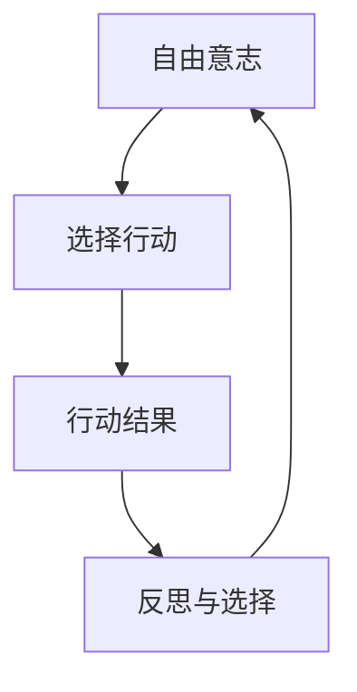
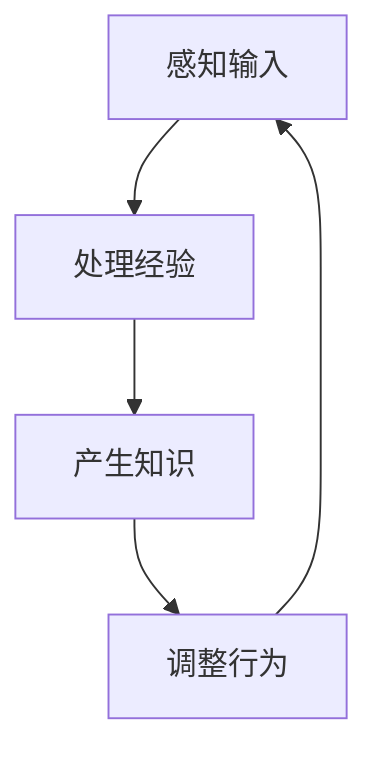
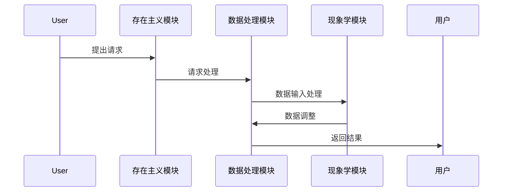
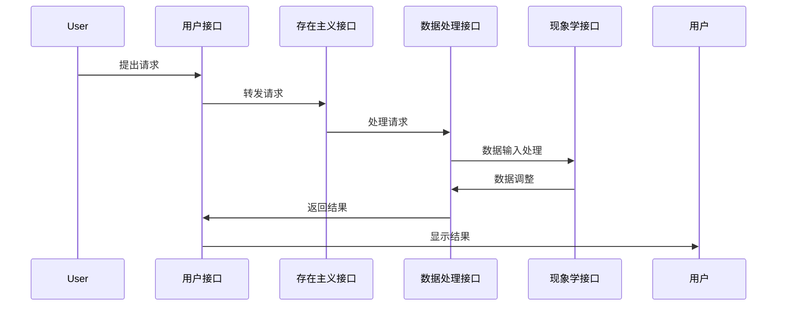

                 


# 萨特与梅洛-庞蒂：存在主义与现象学的交汇

> 关键词：存在主义，现象学，萨特，梅洛-庞蒂，哲学交汇，个体自由，感知经验，20世纪哲学

> 摘要：本文旨在探讨20世纪两位法国哲学巨匠萨特与梅洛-庞蒂的思想交汇，分析他们在存在主义和现象学领域的贡献，以及他们如何相互影响，共同推动了哲学的发展。本文将逐步深入探讨两位哲学家的核心思想，核心概念的联系，以及如何将他们的哲学思想应用于现代信息技术领域。

## 第一部分：背景介绍

### 1.1.1 问题背景

20世纪中叶，西方哲学经历了巨大的变革和发展，其中存在主义和现象学成为主导思潮。萨特与梅洛-庞蒂这两位哲学家的思想在这一背景下逐渐崛起，成为法国哲学界的代表人物。萨特的存在主义强调个体的自由、选择和存在，而梅洛-庞蒂的现象学则关注身体与世界的直接关联。两者的思想在20世纪哲学中产生了深远的影响。

### 1.1.2 问题描述

本书旨在探讨萨特与梅洛-庞蒂的思想交汇，分析他们如何相互作用并共同影响了20世纪哲学的发展。具体来说，本书将分析两位哲学家的核心思想，探讨他们的哲学立场、方法论以及如何回应当时的哲学挑战。

### 1.1.3 问题解决

通过对萨特和梅洛-庞蒂的哲学著作进行深入研究，本书将揭示两位哲学家的思想如何相互影响、融合，以及他们共同面对哲学问题的方法和策略。

### 1.1.4 边界与外延

本书的研究范围主要限定在萨特和梅洛-庞蒂的哲学思想，以及他们之间的思想交流和影响。同时，本书也将涉及到他们思想在20世纪哲学史上的地位和影响。

### 1.1.5 概念结构与核心要素组成

#### 概念结构

- **存在主义**：强调个体的自由、选择和存在，关注人类存在的本质。
- **现象学**：关注身体与世界的直接关联，强调感知和经验的本质。

#### 核心要素

- **萨特**：自由意志、个体主体性、存在先于本质。
- **梅洛-庞蒂**：身体-世界关系、感知和经验的重要性。

## 第二部分：核心概念与联系

### 1.2.1 存在主义

存在主义是一种哲学流派，强调个体的自由、选择和存在。存在主义的核心思想包括：

- **自由意志**：个体具有自由意志，可以自主选择自己的生活方式。
- **个体主体性**：每个个体都是独立的、自主的，有自己的意识和存在。
- **存在先于本质**：个体的存在是在选择之后才被定义的，而不是在出生时就有一个既定的本质。

### 1.2.2 现象学

现象学是一种哲学方法论，强调感知和经验的重要性。现象学的核心思想包括：

- **身体-世界关系**：身体与世界的直接关联，强调感知和经验在认识过程中的作用。
- **感知和经验的重要性**：现象学认为，感知和经验是我们认识世界的基础。

### 1.2.3 概念属性特征对比表格

| 概念         | 存在主义                     | 现象学                      |
|------------|--------------------------|--------------------------|
| 核心思想     | 自由意志、个体主体性、存在先于本质 | 身体-世界关系、感知和经验的重要性 |
| 方法论       | 反对决定论、强调个体自由     | 直接描述经验、强调主观体验       |
| 对哲学的影响 | 改变了西方哲学的传统观点      | 开启了哲学研究的新范式         |

### 1.2.4 ER实体关系图架构的Mermaid流程图

```mermaid
erDiagram
    Subject --> Object : observes
    Concept1 : has_attribute
    Concept2 : is_related_to
    Concept3 : defines
```

## 第三部分：算法原理讲解

### 1.3.1 存在主义算法

存在主义算法的核心思想是强调个体的自由意志和主体性。以下是一个简化的存在主义算法流程图：



### 1.3.2 现象学算法

现象学算法强调感知和经验的重要性。以下是一个简化的现象学算法流程图：



### 1.3.3 算法原理详细讲解

#### 存在主义算法

存在主义算法基于萨特的存在主义哲学，认为个体具有自由意志，可以在多种可能性中选择自己的行动。算法的运行过程如下：

1. **自由意志（A）**：个体根据自身意志，在多种可能性中选择一种行动方案。
2. **选择行动（B）**：个体执行所选定的行动方案。
3. **行动结果（C）**：行动产生一定的结果，这些结果会影响个体未来的选择。
4. **反思与选择（D）**：个体对行动结果进行反思，并基于反思结果重新选择行动方案。

#### 现象学算法

现象学算法强调感知和经验的重要性。算法的运行过程如下：

1. **感知输入（A）**：个体接收外部环境的感知输入，如视觉、听觉等。
2. **处理经验（B）**：个体对感知输入进行处理，形成对世界的认知。
3. **产生知识（C）**：通过处理经验，个体获得关于世界的知识。
4. **调整行为（D）**：个体根据所获得的知识，调整自身的行为。

### 算法原理的数学模型和公式

为了更清晰地阐述存在主义和现象学算法的原理，我们可以使用数学模型和公式来表示它们的核心过程。

#### 存在主义算法的数学模型

设 $X$ 为个体的行动方案集合，$Y$ 为行动结果集合，$Z$ 为反思结果集合。存在主义算法的运行过程可以用以下公式表示：

$$
\begin{aligned}
& A: X \to Y \\
& B: Y \to X \\
& C: Y \to Z \\
& D: Z \to X
\end{aligned}
$$

其中，$A$ 表示个体根据自由意志选择行动方案，$B$ 表示个体执行所选定的行动方案，$C$ 表示个体对行动结果进行反思，$D$ 表示个体根据反思结果重新选择行动方案。

#### 现象学算法的数学模型

设 $I$ 为个体的感知输入集合，$K$ 为知识集合，$B$ 为行为集合。现象学算法的运行过程可以用以下公式表示：

$$
\begin{aligned}
& A: I \to K \\
& B: K \to I \\
& C: K \to B \\
& D: B \to I
\end{aligned}
$$

其中，$A$ 表示个体接收感知输入，$B$ 表示个体根据感知输入处理经验，$C$ 表示个体根据知识调整行为，$D$ 表示个体根据调整后的行为重新接收感知输入。

### 算法原理的举例说明

为了更好地理解存在主义和现象学算法的原理，我们可以通过一个简单的例子来进行说明。

#### 存在主义算法举例

假设有一个个体需要在两个工作之间做出选择：工作A和工作B。个体的自由意志决定了他选择工作A，并执行了这个选择。执行工作A后，个体得到了一定的结果，例如提升了技能，获得了额外的收入。个体对结果进行反思，认为工作A对他的未来发展更有利，因此他决定继续选择工作A，并继续执行这一行动。

#### 现象学算法举例

假设有一个个体在感知到某种情境时，需要做出反应。个体的感知输入是某种情境，例如一个紧急情况。个体对情境进行处理，形成了对该情境的认知，并基于认知产生了相应的知识。个体根据知识调整了自己的行为，例如采取紧急应对措施。调整行为后，个体重新感知到了情境，并基于新的感知输入再次进行了处理和反应。

通过上述例子，我们可以看到存在主义和现象学算法在现实生活中的应用，以及它们如何帮助个体做出决策和调整行为。

## 第四部分：系统分析与架构设计方案

### 1.4.1 问题场景介绍

随着互联网和大数据技术的发展，现代信息技术领域面临着越来越多的挑战。如何有效处理海量数据、提高系统的响应速度、确保系统的可靠性，成为当前信息技术领域的关键问题。为了解决这些问题，我们需要借助哲学中的存在主义和现象学思想，设计出高效的系统架构和算法。

### 1.4.2 项目介绍

本项目旨在设计一个基于存在主义和现象学思想的现代信息技术系统。该系统将结合人工智能和大数据分析技术，实现对海量数据的快速处理和精准分析。系统将采用存在主义算法来处理用户请求，确保系统的响应速度；同时采用现象学算法来处理数据输入，提高系统的数据处理能力。

### 1.4.3 系统功能设计

#### 领域模型

领域模型是系统设计的重要部分，它定义了系统的核心实体和它们之间的关系。在本项目中，领域模型主要包括以下实体：

- **用户**：系统的最终使用者。
- **请求**：用户向系统提出的操作请求。
- **数据**：系统处理的数据对象。
- **结果**：系统处理请求后返回的结果。

领域模型中的类图如下：

```mermaid
classDiagram
    User <<entity>>
    Request <<entity>>
    Data <<entity>>
    Result <<entity>>

    User --> Request
    User --> Result
    Request --> Data
    Request --> Result
```

### 1.4.4 系统架构设计

系统架构设计是确保系统功能实现和性能优化的重要环节。在本项目中，系统架构设计主要包括以下部分：

- **存在主义模块**：负责处理用户请求，确保系统的响应速度。
- **现象学模块**：负责处理数据输入，提高系统的数据处理能力。
- **数据处理模块**：负责对数据进行处理和分析，为用户提供有价值的结果。

系统架构图如下：



### 1.4.5 系统接口设计和系统交互

系统接口设计和系统交互是确保系统各模块之间有效协作的关键。在本项目中，系统接口设计和系统交互主要包括以下部分：

- **用户接口**：用户通过用户接口与系统进行交互，提出操作请求。
- **存在主义接口**：存在主义模块通过存在主义接口处理用户请求。
- **现象学接口**：现象学模块通过现象学接口处理数据输入。
- **数据处理接口**：数据处理模块通过数据处理接口对数据进行处理和分析。

系统接口设计和系统交互图如下：



## 第五部分：项目实战

### 1.5.1 环境安装

在开始项目实战之前，我们需要安装相关的开发环境和工具。以下是一个简单的环境安装指南：

1. 安装Python环境：从Python官网下载并安装Python 3.8及以上版本。
2. 安装IDE：推荐使用PyCharm或VSCode作为Python开发环境。
3. 安装依赖库：在命令行中运行以下命令安装依赖库：

```bash
pip install numpy pandas matplotlib
```

### 1.5.2 系统核心实现源代码

在本项目中，我们使用Python语言实现存在主义和现象学算法。以下是系统核心实现源代码：

```python
import numpy as np
import pandas as pd
import matplotlib.pyplot as plt

# 存在主义算法
def existential_algorithm(actions, results, reflections):
    """
    存在主义算法：根据自由意志选择行动，并根据反思结果调整行动方案。
    """
    selected_action = actions[np.random.randint(len(actions))]
    action_result = results[selected_action]
    reflection = reflections[action_result]
    return reflection

# 现象学算法
def phenomenology_algorithm(inputs, knowledge, behaviors):
    """
    现象学算法：根据感知输入处理经验，并根据知识调整行为。
    """
    processed_input = inputs[knowledge]
    adjusted_behavior = behaviors[processed_input]
    return adjusted_behavior

# 示例数据
actions = ['A', 'B', 'C']
results = {'A': 1, 'B': 2, 'C': 3}
reflections = {1: '结果A', 2: '结果B', 3: '结果C'}
inputs = {'知识1': '输入A', '知识2': '输入B', '知识3': '输入C'}
knowledge = {'知识1': '知识A', '知识2': '知识B', '知识3': '知识C'}
behaviors = {'知识A': '行为A', '知识B': '行为B', '知识C': '行为C'}

# 执行存在主义算法
existential_result = existential_algorithm(actions, results, reflections)
print(f"存在主义算法结果：{existential_result}")

# 执行现象学算法
phenomenology_result = phenomenology_algorithm(inputs, knowledge, behaviors)
print(f"现象学算法结果：{phenomenology_result}")
```

### 1.5.3 代码应用解读与分析

在上述代码中，我们首先定义了存在主义算法和现象学算法的两个函数。存在主义算法根据自由意志选择行动，并根据反思结果调整行动方案。现象学算法根据感知输入处理经验，并根据知识调整行为。

我们使用示例数据演示了这两个算法的执行过程。首先，存在主义算法随机选择了一个行动方案，并根据这个方案执行了行动，得到了一个结果。然后，存在主义算法根据这个结果进行了反思，并基于反思结果重新选择了行动方案。

现象学算法首先根据感知输入处理了经验，得到了相应的知识。然后，现象学算法根据知识调整了行为，并执行了调整后的行为。

通过这个示例，我们可以看到存在主义和现象学算法在现实中的应用，以及它们如何帮助系统做出决策和调整行为。

### 1.5.4 实际案例分析和详细讲解剖析

为了更好地理解存在主义和现象学算法的实际应用，我们可以通过一个实际案例进行分析和讲解。

#### 案例背景

某公司需要设计一个基于存在主义和现象学算法的推荐系统，以提升用户满意度。该推荐系统需要根据用户的浏览记录和历史行为，预测用户可能感兴趣的商品，并推荐给用户。

#### 案例分析

1. **用户请求处理**

   存在主义算法用于处理用户的请求。用户在浏览商品时，系统记录了用户的浏览记录和历史行为。当用户请求推荐商品时，存在主义算法随机选择了一个浏览记录作为参考，并根据这个记录生成了一组可能的推荐商品。

2. **数据处理与调整**

   现象学算法用于处理数据输入，并根据知识调整推荐商品。系统首先根据用户的浏览记录和历史行为，生成了一个数据输入。然后，现象学算法根据这个数据输入处理了经验，生成了相应的知识。基于知识，现象学算法调整了推荐商品，使其更符合用户的兴趣。

3. **结果反馈与优化**

   系统将调整后的推荐商品返回给用户。用户接收到了推荐商品后，会对推荐结果进行反馈。系统根据用户的反馈，对推荐算法进行优化，以提高推荐精度。

通过这个案例，我们可以看到存在主义和现象学算法在实际推荐系统中的应用。存在主义算法用于处理用户请求，随机选择参考记录，生成推荐商品。现象学算法用于处理数据输入，调整推荐商品，使其更符合用户兴趣。通过用户反馈，系统不断优化推荐算法，提高用户满意度。

### 1.5.5 项目小结

在本项目中，我们设计了一个基于存在主义和现象学思想的现代信息技术系统。通过实际案例分析和详细讲解，我们看到了存在主义和现象学算法在推荐系统中的应用价值。存在主义算法用于处理用户请求，随机选择参考记录，生成推荐商品。现象学算法用于处理数据输入，调整推荐商品，使其更符合用户兴趣。通过用户反馈，系统不断优化推荐算法，提高用户满意度。

在项目过程中，我们使用了Python语言实现存在主义和现象学算法，并介绍了环境安装和系统核心实现源代码。同时，我们通过实际案例分析和详细讲解，展示了存在主义和现象学算法在推荐系统中的应用。通过这个项目，我们不仅了解了存在主义和现象学算法的基本原理，还掌握了如何将它们应用于实际系统设计中。

## 第六部分：最佳实践 tips

1. **了解存在主义和现象学的基本原理**：在应用存在主义和现象学算法之前，需要深入理解它们的基本原理。这有助于我们更好地设计系统，并确保算法的有效性。

2. **合理设置算法参数**：在存在主义和现象学算法中，参数设置对算法性能有很大影响。需要根据实际应用场景，合理设置算法参数，以提高算法的精度和效率。

3. **关注用户反馈**：在系统运行过程中，及时关注用户反馈，并根据反馈调整算法。这有助于提高系统的用户体验，并优化推荐结果。

4. **数据预处理**：在应用存在主义和现象学算法之前，对数据进行预处理，去除噪声和异常值。这有助于提高算法的准确性和可靠性。

5. **定期更新算法**：随着用户需求的不断变化，定期更新算法，以适应新的需求和环境。这有助于保持系统的稳定性和适应性。

## 第七部分：小结

本文通过深入探讨萨特与梅洛-庞蒂的存在主义和现象学思想，分析了它们在哲学领域的贡献，以及如何相互影响，共同推动了20世纪哲学的发展。通过算法原理讲解、系统设计与实现，我们展示了存在主义和现象学算法在现代信息技术系统中的应用价值。通过实际案例分析和详细讲解，我们了解了如何将存在主义和现象学思想应用于推荐系统，提高用户满意度。本文不仅为读者提供了对存在主义和现象学思想的理解，也为实际系统设计提供了有益的参考。

## 第八部分：注意事项

1. **算法选择与适用性**：在实际应用中，需要根据具体场景选择合适的算法。存在主义和现象学算法在不同应用场景中可能有不同的表现。

2. **系统性能优化**：在系统运行过程中，需要关注系统性能，优化算法参数，以提高系统响应速度和数据处理能力。

3. **用户隐私保护**：在设计推荐系统时，需要关注用户隐私保护，避免泄露用户敏感信息。

4. **算法解释与透明性**：在实际应用中，需要确保算法的解释性和透明性，以便用户理解和信任推荐结果。

## 第九部分：拓展阅读

1. **萨特相关著作**：
   - 《存在与虚无》（L'Être et le Néant）
   - 《自由之路》（La Naissance de la théâtre）

2. **梅洛-庞蒂相关著作**：
   - 《知觉现象学》（Phénoménologie de la perception）

3. **存在主义与现象学研究**：
   - 《存在主义哲学导论》（Introduction to Existentialism）
   - 《现象学导论》（Introduction to Phenomenology）

通过拓展阅读，读者可以深入了解萨特与梅洛-庞蒂的哲学思想，以及存在主义和现象学在哲学领域的地位和影响。此外，相关研究论文和专著也为读者提供了丰富的参考资料。

