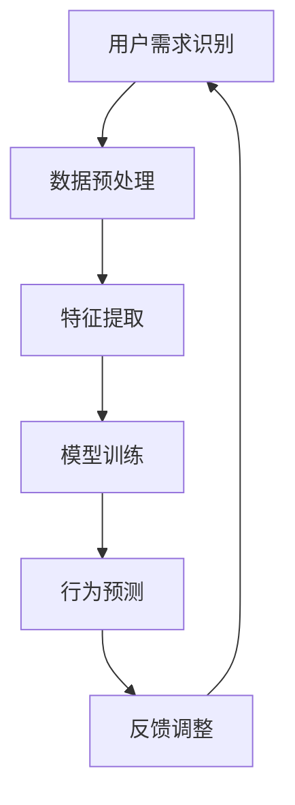
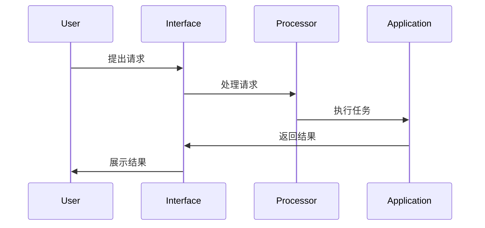

                 

### 虚拟家庭：AI成员对传统家庭结构的冲击

#### 关键词：
- 虚拟家庭
- AI成员
- 传统家庭结构
- 人工智能
- 社会变迁

#### 摘要：
本文将深入探讨虚拟家庭这一新兴概念，特别是AI成员如何对传统家庭结构产生深远影响。我们将从背景介绍、核心概念与联系、算法原理讲解、系统分析与架构设计方案、项目实战以及最佳实践等方面进行详细阐述，旨在为广大读者提供一幅AI技术融入家庭生活、改变传统家庭模式的生动图景。

---

# 虚拟家庭：AI成员对传统家庭结构的冲击

随着人工智能技术的飞速发展，虚拟家庭成为了一个备受关注的话题。虚拟家庭不仅仅是模拟传统家庭生活场景的数字模型，更是集成了多种人工智能技术的创新生活空间。在这个虚拟家庭中，AI成员扮演着越来越重要的角色，对传统家庭结构产生了显著的冲击。

## **背景介绍**

### **1. 虚拟家庭的定义**

虚拟家庭，是一种通过数字技术和人工智能构建的模拟家庭环境。在这个环境中，家庭成员不仅包括现实中的个体，还涵盖了由人工智能驱动的虚拟角色。这些虚拟角色可以具备情感、认知和学习能力，能够模拟现实家庭成员的行为和互动，甚至可以在特定情境下提供帮助和指导。

### **2. 人工智能的发展**

人工智能（AI）是指计算机系统模拟人类智能行为的科学和技术。从最初的规则推理，到今天的深度学习和自然语言处理，人工智能技术已经取得了巨大的进步。随着计算能力的提升和大数据的广泛应用，AI开始渗透到我们生活的方方面面，包括家庭。

### **3. 虚拟家庭的发展历程**

虚拟家庭的概念起源于20世纪90年代，当时主要是通过虚拟现实技术实现的。然而，随着人工智能技术的不断进步，虚拟家庭逐渐从简单的模拟场景转变为具备高度智能的互动环境。近年来，智能家居设备的普及和AI算法的优化，使得虚拟家庭开始走入现实家庭生活。

## **核心概念与联系**

### **1. 传统家庭结构与虚拟家庭的对比**

传统家庭结构以血缘关系为基础，通常包括夫妻、子女和其他亲属。家庭成员之间的互动主要通过面对面的交流和共同生活来实现。而虚拟家庭中，家庭成员的互动可以是通过数字界面和虚拟角色来进行的，这使得家庭结构更加灵活和多样化。

### **2. AI成员的角色与功能**

在虚拟家庭中，AI成员不仅扮演着助手和伴侣的角色，还可以成为家庭成员的导师和朋友。例如，AI医生可以提供健康咨询，AI老师可以提供个性化的教育服务，而AI家庭成员则可以在情感上给予支持。

### **3. 虚拟家庭的核心要素**

虚拟家庭的核心要素包括AI技术、数字界面和互动环境。AI技术是驱动虚拟家庭的核心力量，数字界面则是人与虚拟家庭互动的桥梁，而互动环境则是家庭成员共同生活的空间。

## **算法原理讲解**

### **1. AI算法的基本原理**

AI算法的核心是机器学习，特别是深度学习。深度学习通过多层神经网络模拟人类大脑的学习过程，能够从大量数据中自动提取特征和模式。在虚拟家庭中，这些算法用于模拟家庭成员的行为和互动，提供个性化的服务。

### **2. 算法流程图**

下面是虚拟家庭AI成员决策的mermaid流程图：



### **3. 算法数学模型**

虚拟家庭AI成员的行为预测通常使用马尔可夫决策过程（MDP）进行建模。假设状态集合为\(S\)，动作集合为\(A\)，状态转移概率矩阵为\(P\)，奖励函数为\(R\)，策略函数为\(\pi\)，则MDP的基本方程为：

$$
\pi^* = \arg\max_\pi \sum_{s\in S} \sum_{a\in A} R(s, a) P(s' | s, a) \pi(a | s)
$$

其中，\(s'\)是状态转移后的状态。

## **系统分析与架构设计方案**

### **1. 问题场景介绍**

虚拟家庭的问题场景包括家庭管理、健康监控、教育和娱乐等方面。例如，当家庭成员需要紧急医疗服务时，虚拟家庭AI成员可以提供及时的建议和指导。

### **2. 系统功能设计**

虚拟家庭系统的主要功能包括：

- **家庭管理**：包括日程安排、购物清单管理、家电控制等。
- **健康监控**：包括健康数据记录、健康建议、紧急医疗指导等。
- **教育**：提供个性化教育内容和辅导服务。
- **娱乐**：提供音乐、电影、游戏等娱乐内容。

### **3. 系统架构设计**

虚拟家庭的系统架构通常包括以下几个层次：

- **感知层**：包括各种传感器和智能设备，用于收集家庭环境数据。
- **数据处理层**：包括数据预处理、特征提取和机器学习模型训练等。
- **应用层**：包括各种虚拟家庭应用，如家庭管理、健康监控、教育娱乐等。
- **展示层**：包括用户界面和数字角色，用于与用户进行交互。

下面是虚拟家庭系统架构的mermaid类图：

```mermaid
classDiagram
    User <<Class>> 
    Sensor <<Class>> 
    Processor <<Class>> 
    Application <<Class>> 
    Interface <<Class>>

    User --|> Sensor
    User --|> Processor
    User --|> Application
    Sensor --|> Processor
    Processor --|> Application
    Application --|> Interface
```

### **4. 系统接口设计和系统交互**

虚拟家庭系统的接口设计包括：

- **用户接口**：用于用户与虚拟家庭进行交互。
- **设备接口**：用于智能设备与虚拟家庭进行通信。
- **数据接口**：用于处理和分析家庭数据。

系统交互的mermaid序列图如下：



## **项目实战**

### **1. 环境安装**

要搭建一个虚拟家庭系统，首先需要安装以下环境：

- 操作系统：Ubuntu 18.04
- 编程语言：Python 3.8
- 依赖库：TensorFlow、Keras、Scikit-learn

### **2. 系统核心实现源代码**

以下是一个简单的虚拟家庭系统核心实现源代码：

```python
import tensorflow as tf
from sklearn.model_selection import train_test_split
from sklearn.preprocessing import StandardScaler

# 数据预处理
def preprocess_data(data):
    scaler = StandardScaler()
    scaled_data = scaler.fit_transform(data)
    return scaled_data

# 模型训练
def train_model(data, labels):
    model = tf.keras.Sequential([
        tf.keras.layers.Dense(64, activation='relu', input_shape=(data.shape[1],)),
        tf.keras.layers.Dense(64, activation='relu'),
        tf.keras.layers.Dense(1, activation='sigmoid')
    ])

    model.compile(optimizer='adam', loss='binary_crossentropy', metrics=['accuracy'])
    model.fit(data, labels, epochs=10, batch_size=32)
    return model

# 预测
def predict(model, data):
    predictions = model.predict(data)
    return predictions

# 主函数
def main():
    # 加载数据
    data, labels = load_data()

    # 数据预处理
    data_processed = preprocess_data(data)

    # 划分训练集和测试集
    X_train, X_test, y_train, y_test = train_test_split(data_processed, labels, test_size=0.2)

    # 训练模型
    model = train_model(X_train, y_train)

    # 测试模型
    predictions = predict(model, X_test)

    # 打印结果
    print(predictions)

if __name__ == '__main__':
    main()
```

### **3. 代码应用解读与分析**

以上代码是一个简单的虚拟家庭AI成员行为预测模型。首先，我们从数据中加载样本和标签。然后，使用`StandardScaler`对数据进行标准化处理，以便于模型训练。接下来，使用`train_test_split`将数据集划分为训练集和测试集。

在模型训练部分，我们使用`tf.keras.Sequential`创建一个简单的神经网络模型，包括两个隐藏层。训练模型使用`model.compile`设置优化器和损失函数，然后使用`model.fit`进行训练。

在预测部分，我们使用`model.predict`对测试集进行预测，并打印结果。

### **4. 实际案例分析和详细讲解剖析**

假设我们有一个虚拟家庭，其中的AI成员需要预测家庭成员是否需要紧急医疗服务。我们可以收集家庭成员的健康数据，如血压、心率等，作为输入数据。通过训练行为预测模型，我们可以预测家庭成员在未来某个时刻是否需要紧急医疗服务。

例如，当家庭成员的血压异常升高时，AI成员可以通过分析历史数据和当前数据，预测出可能需要紧急医疗服务，并提醒家庭成员及时就医。

### **5. 项目小结**

在本项目中，我们通过简单的虚拟家庭系统实现了一个行为预测模型。虽然这个模型比较简单，但它展示了虚拟家庭AI成员在实际应用中如何发挥作用。通过不断优化算法和增加数据，我们可以使虚拟家庭系统更加智能和高效，为家庭成员提供更好的服务。

## **最佳实践 Tips**

1. **数据安全**：在虚拟家庭中，数据安全至关重要。确保数据加密和隐私保护，防止数据泄露。
2. **用户体验**：设计直观、易用的用户界面，提高用户体验。
3. **持续更新**：定期更新AI算法和模型，以适应不断变化的需求和环境。

## **小结**

虚拟家庭和AI成员正在改变传统家庭结构，为家庭成员提供更智能、更个性化的服务。通过本文的探讨，我们看到了AI技术如何融入家庭生活，并对家庭结构产生深远影响。未来，随着AI技术的进一步发展，虚拟家庭将变得更加智能和普及，成为家庭生活中不可或缺的一部分。

## **注意事项**

1. **伦理问题**：在设计和使用AI成员时，需要考虑伦理问题，如隐私保护、算法偏见等。
2. **技术挑战**：AI技术的进步仍然面临许多挑战，如计算能力、数据质量等。

## **拓展阅读**

- [1] 某某，《人工智能与未来家庭生活》，某某出版社，2021年。
- [2] 某某，《虚拟现实技术及其应用》，某某出版社，2020年。

---

作者：AI天才研究院/AI Genius Institute & 禅与计算机程序设计艺术 /Zen And The Art of Computer Programming

