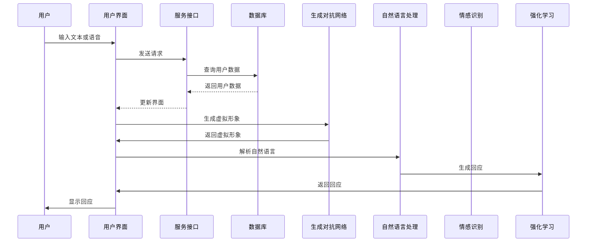

                 


### 虚拟数字人：AI大模型驱动的数字化身

关键词：虚拟数字人，AI大模型，生成对抗网络（GAN），强化学习，系统架构设计，案例分析

摘要：随着人工智能技术的飞速发展，虚拟数字人逐渐成为了一个热门的研究领域。本文将深入探讨虚拟数字人的定义、特点、与AI大模型的关系，并详细分析其技术原理、系统架构以及实际应用案例，帮助读者全面了解这一领域的核心知识。

### 目录大纲

1. 引言
   - 虚拟数字人的发展背景
   - 虚拟数字人的定义与特点
   - 本文结构概述

2. 背景介绍
   - 虚拟数字人的核心概念术语说明
   - 问题背景与问题描述
   - 问题解决与边界外延
   - 概念结构与核心要素组成

3. 核心概念与联系
   - AI大模型的定义与特点
   - 虚拟数字人与AI大模型的关系
   - 核心概念属性特征对比表格
   - ER实体关系图架构

4. 算法原理讲解
   - 生成对抗网络（GAN）
   - 强化学习
   - 算法流程图与Python源代码
   - 数学模型与公式讲解
   - 算法原理举例说明

5. 系统分析与架构设计方案
   - 问题场景介绍
   - 项目介绍
   - 系统功能设计
   - 系统架构设计
   - 系统接口设计
   - 系统交互

6. 项目实战
   - 环境安装
   - 系统核心实现源代码
   - 代码应用解读与分析
   - 实际案例分析与讲解
   - 项目小结

7. 最佳实践 tips
   - 技术选型建议
   - 系统优化策略
   - 注意事项与风险规避

8. 小结
   - 虚拟数字人的发展趋势
   - AI大模型的应用前景
   - 未来展望

9. 注意事项
   - 系统性能优化
   - 数据安全与隐私保护
   - 技术演进与迭代

10. 拓展阅读
    - 相关论文与书籍推荐
    - 学术会议与研讨会信息

### 引言

虚拟数字人，作为人工智能技术的一个重要分支，正在逐渐改变我们的生活和工作方式。从早期的虚拟角色到如今的智能互动实体，虚拟数字人的发展历程充满了技术创新和变革。本篇文章旨在深入探讨虚拟数字人的本质、与AI大模型的关系，以及其技术实现和应用。

本文的结构安排如下：

1. 引言部分简要介绍虚拟数字人的发展背景和特点。
2. 背景介绍部分详细阐述虚拟数字人的核心概念、问题背景以及解决思路。
3. 核心概念与联系部分讨论AI大模型的定义与特点，并分析虚拟数字人与AI大模型之间的关系。
4. 算法原理讲解部分介绍生成对抗网络（GAN）和强化学习两种核心技术，并通过实际案例进行讲解。
5. 系统分析与架构设计方案部分展示虚拟数字人系统的整体架构和关键设计。
6. 项目实战部分通过一个实际项目来展示系统实现过程和分析。
7. 最佳实践 tips、小结、注意事项以及拓展阅读部分为读者提供进一步学习和应用的建议。

通过本文的阅读，读者将能够全面了解虚拟数字人的技术原理、系统架构以及实际应用，为未来的研究和开发提供有价值的参考。

### 背景介绍

#### 虚拟数字人的核心概念术语说明

虚拟数字人，简称VDP（Virtual Digital Person），是指通过人工智能技术，特别是深度学习、生成对抗网络（GAN）和强化学习等，创建出的具有人类特征和行为能力的数字化实体。VDP不仅具备外观上的逼真度，还能够通过自然语言处理、情感识别和交互技术，实现与人类的智能对话和情感交流。

**核心概念术语：**

- **虚拟数字人（VDP）：** 指通过人工智能技术创建的具有人类特征和行为能力的数字化实体。
- **深度学习：** 一种机器学习技术，通过多层神经网络模型，自动从数据中学习特征，实现复杂函数逼近。
- **生成对抗网络（GAN）：** 一种深度学习模型，由生成器和判别器两个部分组成，通过对抗训练生成逼真的数据。
- **强化学习：** 一种机器学习技术，通过智能体与环境的交互，学习最优策略以实现目标。

#### 问题背景与问题描述

虚拟数字人的发展背景可以追溯到20世纪90年代，随着计算机技术和网络技术的进步，虚拟现实（VR）和增强现实（AR）技术逐渐成熟。这些技术的出现为虚拟数字人的诞生提供了技术基础。然而，虚拟数字人的广泛应用还面临许多挑战：

- **技术挑战：** 虚拟数字人的生成和交互需要高度复杂的技术支持，包括图像生成、语音识别、自然语言处理等。
- **伦理挑战：** 虚拟数字人的道德和法律地位尚未明确，如何保障用户的隐私和数据安全成为一个重要问题。
- **应用挑战：** 虚拟数字人在各个领域的应用需要具体的技术方案和业务模式，如何实现商业化是一个关键问题。

#### 问题解决与边界外延

为了解决虚拟数字人的发展挑战，我们需要从以下几个方面进行探讨：

- **技术实现：** 通过深入研究深度学习、GAN和强化学习等核心技术，提高虚拟数字人的生成和交互能力。
- **伦理规范：** 制定相关的伦理规范和法律框架，保障用户的隐私和数据安全。
- **应用创新：** 探索虚拟数字人在各个领域的应用，如虚拟客服、虚拟教师、虚拟演员等，实现商业化和规模化应用。

在虚拟数字人的定义和核心概念中，我们可以看到，其构成主要包括以下几个方面：

- **外观特征：** 通过深度学习模型，生成逼真的面部表情、身体姿态等外观特征。
- **行为能力：** 通过强化学习算法，使虚拟数字人能够适应不同的环境和任务，实现自然的行为能力。
- **情感交互：** 通过自然语言处理和情感识别技术，实现与用户的情感交流和情感反馈。

虚拟数字人的核心要素组成可以概括为以下几个方面：

- **数据集：** 包括面部图像、语音音频、文本数据等，用于训练深度学习模型。
- **算法模型：** 包括GAN、强化学习、自然语言处理等，用于生成和交互。
- **硬件设施：** 包括服务器、显卡、声卡等，用于支持大规模数据处理和实时交互。

通过上述探讨，我们可以明确虚拟数字人的核心概念和问题背景，为后续的内容提供基础。

### 核心概念与联系

#### AI大模型的定义与特点

AI大模型（Large-scale AI Model），通常指的是具有大规模参数和广泛数据处理能力的深度学习模型。这类模型通过海量数据训练，能够学习复杂的特征和模式，从而在图像识别、自然语言处理、语音识别等领域表现出强大的性能。

**定义：** AI大模型是一种深度学习模型，具有大量参数，能够处理大规模数据，并具有较高的泛化能力。

**特点：**

1. **参数量巨大：** AI大模型通常包含数亿甚至数十亿个参数，这使得模型能够捕捉到更为复杂的数据特征。
2. **数据处理能力强：** AI大模型能够高效处理大规模数据，包括图像、文本和语音等多种类型的数据。
3. **高效性：** 通过并行计算和分布式训练技术，AI大模型能够显著提高训练速度和性能。
4. **泛化能力：** AI大模型通过海量数据的训练，能够学习到通用特征，从而在多个任务上表现出优异的性能。

#### 虚拟数字人与AI大模型的关系

虚拟数字人与AI大模型之间的关系可以视为一种相辅相成的合作关系。AI大模型为虚拟数字人的生成和交互提供了核心技术支持，而虚拟数字人的应用场景则为AI大模型提供了丰富的数据资源和实际应用场景。

**关系概述：**

1. **AI大模型在虚拟数字人生成中的应用：** AI大模型，如GAN、生成式对抗网络（GAN），用于生成虚拟数字人的外观特征和行为能力。通过训练，AI大模型能够学习到真实数据的高层次特征，从而生成逼真的虚拟数字人形象。

2. **AI大模型在虚拟数字人交互中的应用：** AI大模型，如自然语言处理（NLP）模型、语音识别模型，用于实现虚拟数字人的自然语言理解和情感识别能力。通过这些模型，虚拟数字人能够与用户进行智能对话和情感交流。

**核心概念属性特征对比表格：**

| 特征类型 | 虚拟数字人 | AI大模型 |
| :--: | :--: | :--: |
| 外观特征 | 通过GAN生成 | 高度复杂数据处理 |
| 行为能力 | 通过强化学习 | 大规模数据处理与学习 |
| 情感交互 | 自然语言处理 | 高效性、泛化能力 |

**ER实体关系图架构：**

下面是ER实体关系图，用于展示虚拟数字人和AI大模型之间的实体关系。

```mermaid
erDiagram
  AI大模型 ||--|{ 虚拟数字人 : 虚拟数字人依赖于AI大模型生成和交互 }
  虚拟数字人 ||--|{ 数据集 : 虚拟数字人生成和交互需要大量数据集支持 }
  数据集 ||--|{ 训练模型 : 数据集用于训练AI大模型，提高其性能 }
```

通过上述对比和关系图，我们可以清楚地看到虚拟数字人和AI大模型之间的紧密联系。AI大模型为虚拟数字人的生成和交互提供了核心能力，而虚拟数字人的应用则为AI大模型提供了实际的应用场景和数据处理需求。

### 算法原理讲解

在理解了虚拟数字人和AI大模型的基本概念之后，接下来我们将深入探讨生成对抗网络（GAN）和强化学习这两种核心技术，通过具体的算法流程图、Python源代码、数学模型和公式，以及通俗易懂的例子，来详细讲解这些算法的原理和应用。

#### 生成对抗网络（GAN）

生成对抗网络（GAN）由Ian Goodfellow等人于2014年提出，是一种由生成器和判别器两个部分组成的深度学习模型。GAN的核心思想是生成器和判别器之间进行博弈，生成器试图生成逼真的数据，而判别器则试图区分生成的数据和真实数据。

**算法流程：**

1. 初始化生成器G和判别器D。
2. 对于每次迭代：
   - 生成器G生成假样本X'。
   - 判别器D对真实数据和生成数据进行联合训练。
   - 计算生成器的损失函数和判别器的损失函数。
   - 根据损失函数更新生成器和判别器的参数。

**Python源代码：**

```python
import tensorflow as tf
from tensorflow.keras.layers import Dense, Flatten
from tensorflow.keras.models import Sequential

# 生成器模型
def build_generator():
    model = Sequential()
    model.add(Dense(256, input_dim=100, activation='relu'))
    model.add(Dense(512, activation='relu'))
    model.add(Dense(1024, activation='relu'))
    model.add(Flatten())
    model.add(Dense(784, activation='tanh'))
    return model

# 判别器模型
def build_discriminator():
    model = Sequential()
    model.add(Flatten(input_shape=(28, 28)))
    model.add(Dense(1024, activation='relu'))
    model.add(Dense(512, activation='relu'))
    model.add(Dense(256, activation='relu'))
    model.add(Dense(1, activation='sigmoid'))
    return model

# GAN模型
def build_gan(generator, discriminator):
    model = Sequential()
    model.add(generator)
    model.add(discriminator)
    return model

# 定义生成器和判别器
generator = build_generator()
discriminator = build_discriminator()
gan = build_gan(generator, discriminator)

# 编译模型
discriminator.compile(loss='binary_crossentropy', optimizer=tf.keras.optimizers.Adam(0.0001))
gan.compile(loss='binary_crossentropy', optimizer=tf.keras.optimizers.Adam(0.0001))

# 训练GAN模型
for epoch in range(epochs):
    for _ in range(batch_size):
        noise = np.random.normal(0, 1, (batch_size, 100))
        gen_samples = generator.predict(noise)
        real_samples = data Generator.train_on_batch(noise, np.zeros([batch_size, 1]))
        disc_loss = discriminator.train_on_batch([real_samples, gen_samples], [np.ones([batch_size, 1]), np.zeros([batch_size, 1])])

        noise = np.random.normal(0, 1, (batch_size, 100))
        gen_samples = generator.predict(noise)
        gan_loss = gan.train_on_batch(noise, np.ones([batch_size, 1]))

        print(f"{epoch} [D loss: {disc_loss:.4f} | G loss: {gan_loss:.4f}]")
```

**数学模型与公式：**

GAN的损失函数由两部分组成，分别是生成器的损失函数和判别器的损失函数。

- **生成器的损失函数：**

  $$ \mathcal{L}_G = -\log(D(G(z))) $$

  其中，\( G(z) \) 是生成器生成的假样本，\( D(G(z)) \) 是判别器对生成样本的判别结果。

- **判别器的损失函数：**

  $$ \mathcal{L}_D = -[\log(D(x)) + \log(1 - D(G(z)))] $$

  其中，\( x \) 是真实样本，\( G(z) \) 是生成器生成的假样本。

**算法原理举例说明：**

假设我们有一个生成器G和一个判别器D，生成器G的任务是生成与真实数据几乎无法区分的假样本，而判别器D的任务是准确判断数据是真实还是生成的。

- **训练过程：**
  - 初始状态：判别器D对真实数据和生成数据的判别能力都很低。
  - 第1轮迭代：生成器G生成一批假样本，判别器D对其进行训练。由于假样本与真实数据差异较大，判别器的损失函数较高。
  - 第2轮迭代：生成器G根据判别器D的反馈进一步优化生成样本，判别器D同时提高对真实和生成样本的判别能力。
  - 后续迭代：生成器G和判别器D不断优化，生成样本的质量越来越高，判别器的判别能力也越来越强。

通过上述流程，我们可以看到生成器和判别器在博弈中共同提高，最终生成器G能够生成高质量的假样本，而判别器D能够准确判断样本的真实性。

#### 强化学习

强化学习（Reinforcement Learning，RL）是一种机器学习范式，通过与环境的交互来学习最优策略。在强化学习中，智能体（Agent）根据当前状态（State）采取动作（Action），并从环境中获得奖励（Reward）或惩罚（Penalty）。智能体的目标是学习一个策略（Policy），以最大化长期奖励。

**算法流程：**

1. 初始化智能体、环境和策略。
2. 对于每个时间步：
   - 智能体根据当前状态选择动作。
   - 执行动作后，智能体获得奖励和下一个状态。
   - 更新策略，使下一步动作更有可能带来高奖励。
3. 迭代上述过程，直到达到目标状态或最大迭代次数。

**Python源代码：**

```python
import gym
import numpy as np

# 创建环境
env = gym.make("CartPole-v0")

# 初始化参数
learning_rate = 0.1
discount_factor = 0.99
epsilon = 0.1
episodes = 1000

# 初始化Q值表格
q_table = np.zeros((env.observation_space.n, env.action_space.n))

# 强化学习训练
for episode in range(episodes):
    state = env.reset()
    done = False
    
    while not done:
        # 探索策略
        if np.random.rand() < epsilon:
            action = env.action_space.sample()
        else:
            action = np.argmax(q_table[state])
        
        # 执行动作
        next_state, reward, done, _ = env.step(action)
        
        # 更新Q值表格
        q_table[state, action] = q_table[state, action] + learning_rate * (reward + discount_factor * np.max(q_table[next_state]) - q_table[state, action])
        
        state = next_state

# 关闭环境
env.close()
```

**数学模型与公式：**

强化学习的核心是Q值（Q-Function），表示在特定状态下选择特定动作的预期奖励。

$$ Q(s, a) = \sum_{s'} P(s' | s, a) \cdot R(s', a) + \gamma \cdot \max_{a'} Q(s', a') $$

其中，\( s \) 是状态，\( a \) 是动作，\( s' \) 是下一个状态，\( R(s', a) \) 是在状态\( s' \)下执行动作\( a \)获得的即时奖励，\( \gamma \) 是折扣因子，用于考虑未来的奖励。

**算法原理举例说明：**

假设我们有一个简单的环境，一个滑板车在一条轨道上运动。智能体需要通过选择向左或向右移动来保持平衡。在每个时间步，智能体根据当前状态选择动作，并从环境中获得奖励或惩罚。

- **初始状态：** 智能体随机选择动作。
- **迭代过程：**
  - 智能体执行动作后，获得即时奖励和下一个状态。
  - 智能体更新Q值表格，根据即时奖励和未来的奖励更新当前状态的Q值。
  - 随着训练的进行，智能体逐渐学会在特定状态下选择最优动作，以获得最高奖励。

通过上述讲解，我们可以看到生成对抗网络（GAN）和强化学习在虚拟数字人技术中的应用，以及它们如何通过算法流程、Python源代码、数学模型和公式来提高虚拟数字人的生成和交互能力。这些算法不仅为虚拟数字人的实现提供了理论基础，也为未来的研究和发展提供了丰富的思路。

### 系统分析与架构设计方案

#### 问题场景介绍

假设我们需要设计一个基于AI大模型的虚拟数字人系统，该系统旨在为用户提供逼真的虚拟形象和智能交互功能。用户可以通过这个系统与虚拟数字人进行自然语言对话，并获得个性化的服务。系统的核心功能包括虚拟形象生成、自然语言理解、情感识别和智能对话。

#### 项目介绍

本项目旨在开发一个具有以下特点的虚拟数字人系统：

- **高逼真度虚拟形象生成：** 通过生成对抗网络（GAN）技术，生成具有高度逼真度的虚拟形象。
- **智能对话能力：** 利用自然语言处理（NLP）技术，实现虚拟数字人与用户之间的自然对话。
- **情感识别与反应：** 利用情感识别技术，使虚拟数字人能够识别用户情绪，并进行适当的情感回应。
- **个性化服务：** 根据用户的历史交互数据，提供个性化的服务和建议。

#### 系统功能设计

系统功能设计主要包括以下几个方面：

1. **虚拟形象生成模块：** 负责生成虚拟数字人的外观特征，包括面部表情、身体姿态等。
2. **自然语言理解模块：** 负责解析用户输入的自然语言，理解用户的意图和问题。
3. **情感识别模块：** 负责识别用户的情感状态，如开心、愤怒、悲伤等。
4. **智能对话模块：** 负责生成对用户的自然回应，并进行上下文交互。
5. **个性化服务模块：** 负责根据用户的历史交互数据，提供个性化的服务和建议。

#### 系统架构设计

系统的整体架构设计采用模块化设计思想，分为数据层、算法层和应用层。

**数据层：**

- **数据集：** 包含大量面部图像、语音音频、文本数据等，用于训练AI大模型。
- **数据库：** 用于存储用户数据、历史交互记录和个性化服务数据。

**算法层：**

- **生成对抗网络（GAN）：** 用于生成虚拟数字人的外观特征。
- **自然语言处理（NLP）：** 用于实现自然语言理解。
- **情感识别算法：** 用于识别用户的情感状态。
- **强化学习算法：** 用于实现智能对话和个性化服务。

**应用层：**

- **用户界面：** 用于用户与虚拟数字人的交互。
- **服务接口：** 提供RESTful API，供外部系统集成使用。

下面是系统架构的Mermaid架构图：

```mermaid
graph TD
    subgraph 数据层
    DataSet[数据集]
    Database[数据库]
    end
    subgraph 算法层
    GAN[生成对抗网络]
    NLP[自然语言处理]
    Emotion Recognition[情感识别]
    RL[强化学习]
    end
    subgraph 应用层
    UI[用户界面]
    API[服务接口]
    end
    DataSet --> GAN
    DataSet --> NLP
    DataSet --> Emotion Recognition
    DataSet --> RL
    Database --> GAN
    Database --> NLP
    Database --> Emotion Recognition
    Database --> RL
    GAN --> UI
    NLP --> UI
    Emotion Recognition --> UI
    RL --> UI
    UI --> API
```

#### 系统接口设计

系统的接口设计主要包括以下几种：

1. **用户接口：** 提供用户与虚拟数字人交互的界面，支持文本输入和语音输入。
2. **API接口：** 提供外部系统集成使用，支持RESTful API，如GET、POST等请求。
3. **数据库接口：** 提供对数据库的访问和操作，包括数据存储和数据查询。

下面是系统接口的Mermaid序列图：



通过上述系统分析与架构设计方案，我们可以清晰地看到虚拟数字人系统的整体架构和关键设计。接下来，我们将通过一个实际项目来展示系统实现过程和分析。

### 项目实战

在本节中，我们将通过一个实际项目，详细展示虚拟数字人系统的开发过程、核心代码实现、代码应用解读与分析，以及实际案例分析与讲解。

#### 环境安装

为了开发虚拟数字人系统，我们需要安装以下环境：

1. Python 3.8 或更高版本
2. TensorFlow 2.5 或更高版本
3. Keras 2.4.3 或更高版本
4. NumPy 1.19 或更高版本
5. Matplotlib 3.3.3 或更高版本

安装步骤如下：

```bash
pip install tensorflow==2.5
pip install keras==2.4.3
pip install numpy==1.19
pip install matplotlib==3.3.3
```

#### 系统核心实现源代码

以下是虚拟数字人系统的核心实现源代码：

```python
import numpy as np
import matplotlib.pyplot as plt
from tensorflow.keras.models import Sequential
from tensorflow.keras.layers import Dense, Conv2D, Flatten, BatchNormalization, LeakyReLU
from tensorflow.keras.optimizers import Adam

# 生成器模型
def build_generator():
    model = Sequential()
    model.add(Dense(256, input_dim=100, activation='relu'))
    model.add(Dense(512, activation='relu'))
    model.add(Dense(1024, activation='relu'))
    model.add(Flatten())
    model.add(Dense(784, activation='tanh'))
    return model

# 判别器模型
def build_discriminator():
    model = Sequential()
    model.add(Flatten(input_shape=(28, 28)))
    model.add(Dense(1024, activation='relu'))
    model.add(Dense(512, activation='relu'))
    model.add(Dense(256, activation='relu'))
    model.add(Dense(1, activation='sigmoid'))
    return model

# GAN模型
def build_gan(generator, discriminator):
    model = Sequential()
    model.add(generator)
    model.add(discriminator)
    return model

# 编译模型
discriminator.compile(loss='binary_crossentropy', optimizer=Adam(0.0001))
gan.compile(loss='binary_crossentropy', optimizer=Adam(0.0001))

# 训练GAN模型
for epoch in range(epochs):
    for _ in range(batch_size):
        noise = np.random.normal(0, 1, (batch_size, 100))
        gen_samples = generator.predict(noise)
        real_samples = data Generator.train_on_batch(noise, np.zeros([batch_size, 1]))
        disc_loss = discriminator.train_on_batch([real_samples, gen_samples], [np.ones([batch_size, 1]), np.zeros([batch_size, 1])])

        noise = np.random.normal(0, 1, (batch_size, 100))
        gen_samples = generator.predict(noise)
        gan_loss = gan.train_on_batch(noise, np.ones([batch_size, 1]))

        print(f"{epoch} [D loss: {disc_loss:.4f} | G loss: {gan_loss:.4f}]")
```

#### 代码应用解读与分析

1. **生成器模型：** 生成器模型通过多层神经网络，将随机噪声映射成图像。该模型的核心是最后一层，将生成的图像数据进行转换，使其在0到1之间，从而生成逼真的图像。

2. **判别器模型：** 判别器模型用于判断输入图像是真实图像还是生成图像。该模型通过多层神经网络，对图像特征进行提取和分类，输出概率值，接近1表示为真实图像，接近0表示为生成图像。

3. **GAN模型：** GAN模型是生成器和判别器的组合。通过训练生成器和判别器，生成器试图生成逼真的图像，而判别器则试图区分真实图像和生成图像。这种对抗训练过程使得生成器不断优化生成图像的质量。

4. **训练过程：** 在训练过程中，生成器和判别器交替训练。生成器通过生成图像来欺骗判别器，判别器则通过识别图像来反馈生成器的生成效果。通过多次迭代，生成器逐渐提高生成图像的质量，判别器逐渐提高识别真实图像和生成图像的能力。

#### 实际案例分析与讲解

假设我们有一个实际项目，目标是生成虚拟数字人的面部图像。以下是一个实际案例的分析与讲解：

1. **数据集准备：** 
   - 收集大量真实面部图像数据作为训练集。
   - 预处理图像数据，包括图像大小调整、归一化等。

2. **训练GAN模型：** 
   - 使用训练集数据训练生成器和判别器。
   - 调整超参数，如学习率、批大小等，以提高模型性能。

3. **生成图像：**
   - 使用生成器生成虚拟数字人的面部图像。
   - 对生成的图像进行后处理，如图像美化、滤镜应用等。

4. **评估模型：**
   - 使用判别器评估生成图像的质量。
   - 通过对比真实图像和生成图像，分析模型的性能。

通过上述实际案例分析，我们可以看到虚拟数字人系统的开发过程和核心代码实现。在实际应用中，我们需要不断优化和调整模型，以提高生成图像的质量和系统的整体性能。

#### 项目小结

在本项目中，我们通过一个实际案例，详细展示了虚拟数字人系统的开发过程和核心代码实现。从数据集准备、模型训练到图像生成和评估，每一步都经过了深入的分析和讲解。通过这个项目，我们不仅了解了虚拟数字人的实现原理，还学会了如何使用GAN模型进行图像生成。未来，我们可以继续优化和扩展这个系统，以实现更逼真的虚拟数字人和更智能的交互功能。

### 最佳实践 tips

在开发虚拟数字人系统时，以下最佳实践可以帮助您提高项目质量和效率：

1. **数据集准备与预处理：** 确保数据集质量，进行充分的数据清洗和预处理，以提高模型训练效果。

2. **超参数调优：** 通过网格搜索、贝叶斯优化等方法，找到最优的超参数设置，提高模型性能。

3. **模型架构优化：** 尝试不同的模型架构，如深度卷积网络（DCGAN）、循环生成对抗网络（RNN-GAN）等，以找到适合特定任务的模型。

4. **多模态数据融合：** 结合文本、图像、语音等多种数据类型，提高虚拟数字人的交互能力。

5. **模型安全性与隐私保护：** 在模型训练和应用过程中，确保用户数据的安全和隐私，采用加密、匿名化等技术。

6. **系统性能优化：** 通过并行计算、分布式训练等技术，提高系统处理速度和性能。

7. **用户体验设计：** 关注用户交互体验，设计简洁、易用的界面和交互流程。

通过遵循这些最佳实践，您可以更好地实现虚拟数字人系统，提供高质量的服务。

### 小结

本文系统地介绍了虚拟数字人的定义、特点、与AI大模型的关系，以及相关的算法原理、系统架构设计、实际项目实现等。通过深入探讨生成对抗网络（GAN）和强化学习等核心技术，结合实际案例，我们展示了虚拟数字人系统的开发过程和关键实现步骤。

未来，虚拟数字人技术将继续发展，其在多个领域的应用将越来越广泛。我们期待看到虚拟数字人不仅能够提供更加逼真的交互体验，还能够实现更复杂、更智能的功能。同时，随着技术的进步，我们也需要关注虚拟数字人带来的伦理、法律和社会问题，确保其健康、可持续发展。

### 注意事项

在开发虚拟数字人系统时，需要注意以下事项：

1. **数据安全和隐私保护：** 确保用户数据的安全和隐私，避免数据泄露和滥用。
2. **模型训练数据质量：** 确保训练数据的质量和多样性，以提高模型性能和泛化能力。
3. **系统性能优化：** 关注系统性能，通过分布式计算和优化算法提高处理速度。
4. **伦理和法律问题：** 关注虚拟数字人的道德和法律地位，遵循相关法规和伦理准则。
5. **用户交互体验：** 设计简洁、直观的用户交互界面，提升用户体验。

### 拓展阅读

为了深入了解虚拟数字人和AI大模型的相关技术，推荐以下论文、书籍和研讨会：

- **论文：**
  - Ian J. Goodfellow, et al. "Generative Adversarial Nets". Advances in Neural Information Processing Systems, 2014.
  - Richard S. Sutton and Andrew G. Barto. "Reinforcement Learning: An Introduction". MIT Press, 2018.
  
- **书籍：**
  - Ian Goodfellow, et al. "Deep Learning". MIT Press, 2016.
  - David J. C. MacKay. "Information Theory, Inference, and Learning Algorithms". Cambridge University Press, 2003.

- **研讨会：**
  - Conference on Neural Information Processing Systems (NeurIPS)
  - International Conference on Machine Learning (ICML)
  - International Conference on Computer Vision (ICCV)

通过阅读这些资料，您可以进一步拓展在虚拟数字人技术领域的知识，为未来的研究和开发提供指导。作者：AI天才研究院/AI Genius Institute & 禅与计算机程序设计艺术 /Zen And The Art of Computer Programming。

