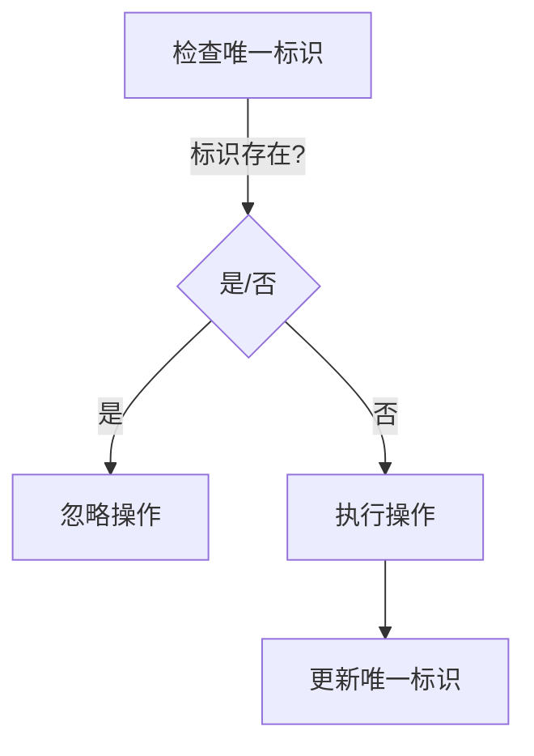
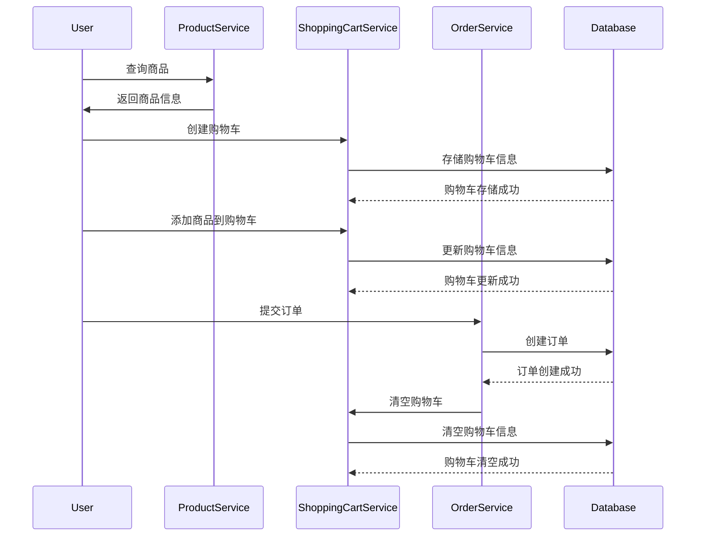
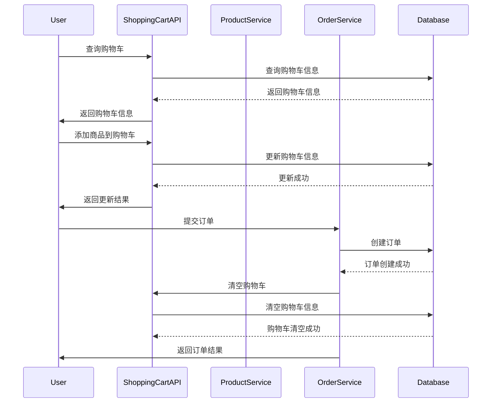

                 

## 行之无效的幂等性控制

### 关键词

- 幂等性控制
- 无效控制
- 系统设计
- 算法原理
- 性能优化

### 摘要

本文将深入探讨幂等性控制这一计算机科学中的重要概念。我们将分析幂等性控制的定义、原理，探讨其在系统设计中的重要性，并通过实例详细解释其应用和挑战。文章将指出一些常见的无效幂等性控制策略，并分析其潜在问题。最后，我们将提供最佳实践和建议，帮助开发者更好地理解和应用幂等性控制。

### 引言

幂等性控制是确保系统在多次执行同一操作时，结果保持一致的关键机制。它在分布式系统、并发处理和高可用性设计中扮演着至关重要的角色。然而，尽管幂等性控制的重要性不言而喻，但在实际应用中，许多开发者仍然面临着如何有效实施和避免无效控制策略的挑战。

本文将按照以下结构展开：

1. **背景介绍**：简要介绍幂等性控制的起源、重要性以及本文的研究目标和结构。
2. **核心概念与联系**：详细阐述幂等性控制的核心概念，并提供概念属性特征对比表格和ER实体关系图架构。
3. **算法原理讲解**：使用mermaid流程图和Python源代码详细解释幂等性控制算法，包括数学模型和公式。
4. **系统分析与架构设计**：通过项目实战和具体案例分析，展示幂等性控制在系统设计和架构中的应用。
5. **最佳实践 tips**：总结最佳实践，并提供一些建议和注意事项。
6. **小结与拓展阅读**：对文章内容进行总结，并推荐相关阅读资源。

### 目录大纲设计思考步骤

为了设计出《行之无效的幂等性控制》这本书的完整目录大纲，我们需要按照以下步骤进行：

1. **明确书籍的核心主题和目标读者**：
   - 核心主题：书籍主要探讨幂等性控制的概念、原理及其在实践中的应用与挑战。
   - 目标读者：计算机科学和软件工程领域的专业人士，特别是那些关注系统设计和性能优化的开发者。

2. **构建书籍的整体结构**：
   - 引言：简要介绍书籍的背景、目的和结构。
   - 背景介绍：讨论幂等性控制的起源、重要性和当前的研究和应用状况。
   - 核心概念与联系：详细阐述幂等性控制的核心概念、原理及其与其他技术的联系。
   - 算法原理讲解：介绍幂等性控制的相关算法，并通过实例和数学模型进行解释。
   - 系统分析与架构设计：探讨幂等性控制在系统设计和架构中的实际应用。
   - 项目实战：通过实际项目案例展示幂等性控制的实践应用。
   - 最佳实践 tips：总结最佳实践，并提供一些建议和注意事项。
   - 小结与拓展阅读：对书籍内容进行总结，并推荐相关阅读资源。

3. **细化章节内容**：
   - 每个章节都应该包含明确的小节，每个小节聚焦于一个特定的主题。
   - 确保章节内容连贯、逻辑清晰，符合读者的理解顺序。

4. **编写目录大纲**：
   - 使用markdown格式编写目录大纲，确保格式规范，符合#、##、###的层级结构。
   - 确保每个章节都有至少1级和2级目录，如果需要，可以添加3级目录。

5. **校对和优化**：
   - 完成初稿后，进行多次校对，确保没有遗漏或错误。
   - 调整目录结构，确保内容的完整性和逻辑性。

### 完整的目录大纲示例

下面是《行之无效的幂等性控制》这本书的目录大纲示例：

```markdown
----------------------------------------------------------------
# 引言

## 书籍背景
### 幂等性控制的起源
### 幂等性控制的重要性
### 目标读者

## 书籍结构
### 全书章节安排
### 阅读建议

----------------------------------------------------------------
# 背景介绍

## 1.1 幂等性控制的概念

### 1.1.1 什么是幂等性
### 1.1.2 幂等性的重要性
### 1.1.3 幂等性在系统设计中的应用

## 1.2 幂等性控制的起源与发展

### 1.2.1 幂等性控制的起源
### 1.2.2 幂等性控制的发展历程
### 1.2.3 当前的研究与应用状况

## 1.3 幂等性控制的核心挑战

### 1.3.1 难以检测的副作用
### 1.3.2 事务管理与并发控制
### 1.3.3 幂等性控制与性能优化

----------------------------------------------------------------
# 核心概念与联系

## 2.1 幂等性控制的核心概念

### 2.1.1 幂等性函数
### 2.1.2 幂等操作
### 2.1.3 幂等性协议

## 2.2 概念属性特征对比表格

### 2.2.1 幂等性函数与幂等操作对比
### 2.2.2 幂等性协议与其他技术的对比

## 2.3 ER实体关系图架构

### 2.3.1 幂等性控制实体关系图
### 2.3.2 实体属性与关系的定义

----------------------------------------------------------------
# 算法原理讲解

## 3.1 幂等性控制算法概述

### 3.1.1 幂等性控制算法的分类
### 3.1.2 常见幂等性控制算法介绍

## 3.2 使用mermaid绘制算法mermaid流程图

### 3.2.1 mermaid流程图基础
### 3.2.2 幂等性控制算法的mermaid表示

## 3.3 使用Python源代码详细阐述算法

### 3.3.1 Python环境搭建
### 3.3.2 算法原理与数学模型
### 3.3.3 示例代码与解析

## 3.4 算法原理的数学模型与公式

### 3.4.1 幂等性控制的数学模型
### 3.4.2 公式推导与证明
### 3.4.3 案例举例说明

----------------------------------------------------------------
# 系统分析与架构设计

## 4.1 问题场景介绍

### 4.1.1 问题背景
### 4.1.2 问题定义
### 4.1.3 解决方案概述

## 4.2 项目介绍

### 4.2.1 项目背景
### 4.2.2 项目目标
### 4.2.3 项目架构

## 4.3 系统功能设计(领域模型mermaid类图)

### 4.3.1 领域模型
### 4.3.2 类图表示

## 4.4 系统架构设计mermaid架构图

### 4.4.1 架构设计原则
### 4.4.2 架构图表示

## 4.5 系统接口设计和系统交互mermaid序列图

### 4.5.1 接口设计
### 4.5.2 序列图表示

----------------------------------------------------------------
# 项目实战

## 5.1 环境安装

### 5.1.1 开发环境搭建
### 5.1.2 系统依赖安装

## 5.2 系统核心实现源代码

### 5.2.1 源代码结构
### 5.2.2 关键代码解析

## 5.3 代码应用解读与分析

### 5.3.1 代码运行流程
### 5.3.2 分析与优化建议

## 5.4 实际案例分析和详细讲解剖析

### 5.4.1 案例背景
### 5.4.2 案例分析
### 5.4.3 剖析与结论

## 5.5 项目小结

### 5.5.1 项目成果
### 5.5.2 项目反思

----------------------------------------------------------------
# 最佳实践 tips

## 6.1 幂等性控制的最佳实践

### 6.1.1 设计原则
### 6.1.2 实施步骤
### 6.1.3 注意事项

## 6.2 注意事项

### 6.2.1 常见问题
### 6.2.2 风险防范
### 6.2.3 优化方向

## 6.3 拓展阅读

### 6.3.1 推荐书籍
### 6.3.2 相关研究论文
### 6.3.3 开源项目

----------------------------------------------------------------
# 小结与拓展阅读

## 7.1 文章总结

### 7.1.1 核心观点
### 7.1.2 研究意义
### 7.1.3 未来展望

## 7.2 拓展阅读

### 7.2.1 相关领域最新进展
### 7.2.2 推荐专业网站和博客
### 7.2.3 社交媒体讨论平台

```

### 1.1.3 幂等性在系统设计中的应用

幂等性控制在系统设计中具有极其重要的地位。其主要应用场景包括但不限于以下方面：

1. **分布式系统中的数据一致性**：
   在分布式系统中，由于网络的不确定性和节点的不稳定性，数据的一致性成为一个关键问题。幂等性控制通过确保多次操作的结果一致，从而有效解决了分布式系统中数据不一致的问题。例如，在分布式数据库中，使用幂等性控制可以避免由于网络波动导致的重复操作和数据冲突。

2. **并发处理中的资源锁定**：
   在高并发场景中，多个用户或进程可能会同时对同一资源进行操作。幂等性控制可以通过确保操作的结果不会因为多次执行而改变，从而避免资源锁定和死锁的问题。例如，在电商系统中，多个用户同时购买同一件商品时，通过幂等性控制可以防止库存数据的错误更新。

3. **事务管理与恢复**：
   在事务处理中，幂等性控制可以简化事务管理的复杂度。通过确保事务的操作是幂等的，系统可以减少对事务回滚和恢复的需求，提高系统的性能和稳定性。

4. **API接口的设计**：
   在API设计中，幂等性控制可以确保客户端发起的多次请求最终只被执行一次，避免由于重复请求导致的资源浪费和错误。例如，在移动应用中，用户取消订单的请求只需发送一次，即便在请求途中网络中断，系统也能保证订单状态的一致性。

### 1.2 幂等性控制的起源与发展

幂等性控制这一概念最早可以追溯到函数式编程领域。在函数式编程中，函数被视为一种数学函数，具有确定性的输出。因此，幂等函数（idempotent function）指的是多次执行结果相同或没有影响的函数。这个概念被逐渐引入到计算机科学领域，特别是在分布式系统和并发处理中。

随着分布式系统和并发处理技术的不断发展，幂等性控制的应用范围也在不断扩大。从20世纪80年代开始，随着互联网的兴起，分布式系统变得越来越普遍。在这一背景下，幂等性控制在确保数据一致性和系统稳定性方面的重要性逐渐凸显。

进入21世纪，随着云计算、大数据和物联网等技术的快速发展，幂等性控制的应用场景更加广泛。现代分布式系统通常需要处理大量的并发请求，如何确保操作幂等已经成为系统设计中的一个核心问题。

目前，幂等性控制已经成为了系统设计和架构中的一个基础概念，被广泛应用于各种领域。从数据库到中间件，从Web服务到移动应用，幂等性控制无处不在。同时，研究者们也在不断探索更高效、更可靠的幂等性控制算法和策略，以应对复杂多变的系统需求。

### 1.3 幂等性控制的核心挑战

尽管幂等性控制在系统设计中具有重要作用，但其实施和应用并非没有挑战。以下是一些幂等性控制中的核心挑战：

#### 1.3.1 难以检测的副作用

幂等性控制的一个关键要求是操作不会产生副作用。副作用指的是操作的结果不仅依赖于输入参数，还依赖于外部状态的变化。在分布式系统中，由于节点之间可能存在状态的不同步，一个看似幂等的操作可能会因为外部状态的变化而产生不同的结果。这使得检测和避免副作用变得非常困难。

例如，一个更新数据库记录的操作，如果数据库中的记录在执行操作期间发生了变化，即使操作本身是幂等的，也可能导致最终结果不一致。这种难以检测的副作用可能会在分布式系统中引起严重的数据一致性问题。

#### 1.3.2 事务管理与并发控制

在分布式系统中，事务管理与并发控制是确保数据一致性的关键机制。然而，幂等性控制与事务管理和并发控制之间存在一定的冲突。事务通常要求操作要么全部成功，要么全部失败，而幂等性控制则允许操作多次执行而不改变最终结果。这种冲突可能会导致以下问题：

- **死锁**：如果一个事务在执行过程中因为等待其他事务释放锁而陷入无限等待，可能会造成死锁，影响系统的可用性。
- **资源占用**：多个事务同时尝试对同一资源进行操作，即使这些操作是幂等的，也可能导致系统资源的长时间占用，降低系统的性能。

#### 1.3.3 幂等性控制与性能优化

在实际应用中，确保幂等性控制的同时还需要考虑系统的性能优化。高并发场景下，重复操作的检测和处理可能会引入额外的系统开销，影响系统的响应速度和吞吐量。以下是一些常见的性能挑战：

- **锁竞争**：在分布式系统中，为了保证幂等性，可能需要使用锁机制来控制对共享资源的访问。锁竞争可能导致系统性能下降，特别是在高并发情况下。
- **延迟**：检测重复操作需要一定的时间，这可能导致系统的响应时间增加，影响用户体验。
- **资源消耗**：一些复杂的幂等性控制算法可能需要额外的存储和计算资源，增加系统的成本。

### 2.1 幂等性控制的核心概念

要深入理解幂等性控制，我们需要从核心概念开始。以下是幂等性控制中的一些基本概念：

#### 2.1.1 幂等性函数

幂等性函数（Idempotent Function）是指多次执行结果相同或没有影响的函数。在数学中，幂等性函数的一个典型例子是加法运算，例如`f(x, y) = x + y`。无论你将两个数相加多少次，结果都是相同的。

在计算机科学中，幂等性函数的应用非常广泛。例如，在文件系统中，删除操作（`delete`）是一个幂等性操作，无论你执行多少次删除命令，文件都会被删除一次。类似地，在数据库中，插入（`insert`）和更新（`update`）操作也可以是幂等的。

#### 2.1.2 幂等操作

幂等操作（Idempotent Operation）是指多次执行结果相同或没有影响的操作。与幂等性函数类似，幂等操作通常不改变系统的状态。例如，在分布式系统中，消息队列中的消息消费操作通常是幂等的，无论消费多少次，消息都会被处理一次。

#### 2.1.3 幂等性协议

幂等性协议（Idempotent Protocol）是一套规则，用于确保操作在多次执行时能够保持一致性。在分布式系统中，幂等性协议通过特定的机制来检测和避免重复操作。常见的幂等性协议包括：

- **幂等ID**：通过为每个操作分配唯一的ID，系统可以识别并避免重复操作。
- **版本控制**：通过在数据中引入版本号，每次更新时增加版本号，系统可以确保操作不会覆盖旧数据。
- **乐观锁**：通过在数据更新前检查版本号或唯一标识，确保操作不会因为并发冲突而失效。

#### 概念属性特征对比表格

为了更好地理解这些概念，我们可以通过一个表格来对比幂等性函数、幂等操作和幂等性协议的属性特征：

| 概念             | 定义                                                         | 属性特征                                                     |
|------------------|--------------------------------------------------------------|--------------------------------------------------------------|
| 幂等性函数       | 多次执行结果相同或没有影响的函数                             | 输入参数确定性，输出结果一致                                  |
| 幂等操作         | 多次执行结果相同或没有影响的操作                             | 操作无副作用，不改变系统状态                                 |
| 幂等性协议       | 一套规则，用于确保操作在多次执行时能够保持一致性               | 检测重复操作，避免重复执行，确保一致性                         |

#### ER实体关系图架构

为了进一步理解幂等性控制，我们可以使用实体关系图（ER Diagram）来展示其核心实体和关系。以下是一个简单的ER实体关系图，描述了幂等性控制相关的实体和关系：

```mermaid
erDiagram
  Customer ||--|{ Order }|>
  Order ||--|{ Payment }|>
  Payment ||--|{ Status }|>

  Customer {
    id (主键)
    name
    address
  }

  Order {
    id (主键)
    customer_id (外键)
    order_date
    status
  }

  Payment {
    id (主键)
    order_id (外键)
    payment_date
    amount
  }

  Status {
    id (主键)
    description
  }
```

在这个ER图中，`Customer`、`Order`、`Payment`和`Status`是四个核心实体，它们之间的关系定义了幂等性控制在系统设计中的应用。例如，每次订单提交（Order）都会产生一个支付（Payment），支付的最终状态（Status）与订单状态保持一致，从而确保操作幂等。

### 3.1 幂等性控制算法概述

在了解幂等性控制的核心概念之后，接下来我们将探讨一些常见的幂等性控制算法。这些算法旨在确保在分布式系统和并发处理中，多个操作能够保持幂等性，从而提高系统的稳定性和一致性。

#### 3.1.1 幂等性控制算法的分类

幂等性控制算法可以根据其实现方式和应用场景进行分类。以下是几种常见的分类方法：

- **基于唯一标识的算法**：这类算法通过为每个操作分配唯一的标识来检测重复操作。常见的实现包括UUID、时间戳等。
- **基于版本控制的算法**：这类算法通过在数据中引入版本号来确保操作不会覆盖旧数据。每次更新时，版本号都会增加，从而确保操作的幂等性。
- **基于乐观锁的算法**：这类算法通过在数据更新前检查版本号或唯一标识来避免并发冲突。如果检测到数据已经发生变化，操作会失败并重新尝试。
- **基于状态机的算法**：这类算法通过定义一系列的状态转换规则，确保系统状态不会因为重复操作而改变。

#### 3.1.2 常见幂等性控制算法介绍

下面我们将介绍几种常见的幂等性控制算法，并简要说明其原理和适用场景：

1. **基于唯一标识的算法**

   - **原理**：为每个操作生成一个唯一的标识，如UUID或时间戳。系统在执行操作时，首先检查该标识是否已经存在。如果存在，则认为操作是重复的，否则执行操作。
   - **适用场景**：适用于需要高可扩展性和低延迟的系统，如Web服务和消息队列。

2. **基于版本控制的算法**

   - **原理**：在数据中引入版本号，每次更新时增加版本号。在执行操作前，检查版本号是否与当前数据一致。如果一致，执行操作；否则，认为操作是重复的。
   - **适用场景**：适用于需要强一致性和可恢复性的系统，如数据库和事务管理。

3. **基于乐观锁的算法**

   - **原理**：在数据更新前，检查版本号或唯一标识是否发生变化。如果发生变化，表示其他操作已经修改了数据，当前操作会失败；否则，执行操作并更新版本号。
   - **适用场景**：适用于高并发场景，如电商系统和在线支付系统。

4. **基于状态机的算法**

   - **原理**：定义一系列的状态转换规则，确保系统状态不会因为重复操作而改变。每个操作都会触发一个状态转换，如果转换成功，系统状态更新；否则，保持原状态。
   - **适用场景**：适用于需要复杂状态管理的系统，如游戏引擎和自动化控制系统。

#### 使用mermaid绘制算法mermaid流程图

为了更直观地理解这些算法，我们可以使用mermaid绘制其流程图。以下是一个简单的mermaid流程图示例，展示了基于唯一标识的算法的执行过程：



在这个流程图中，首先检查操作的唯一标识是否存在。如果存在，则忽略操作；否则，执行操作并更新唯一标识。这种算法简单有效，但可能在高并发场景下存在性能瓶颈。

### 3.2 使用Python源代码详细阐述算法

为了更好地理解幂等性控制算法，我们可以通过Python源代码来具体阐述其实现。以下是一个简单的Python示例，展示了基于版本控制的算法的实现过程：

```python
import json
import uuid

# 假设我们有一个简单的数据库接口
class Database:
    def __init__(self):
        self.data = {}

    def update(self, id, data):
        # 检查版本号是否与当前数据一致
        if id not in self.data or self.data[id]['version'] != data['version']:
            self.data[id] = data
            print("更新成功")
        else:
            print("更新失败：版本不一致")

    def get(self, id):
        return self.data.get(id)

# 实例化数据库
db = Database()

# 创建一个操作
operation = {
    'id': uuid.uuid4().hex,
    'version': 1,
    'data': {'name': 'John', 'age': 30}
}

# 执行操作
db.update(operation['id'], operation)

# 尝试重复执行操作
duplicate_operation = {
    'id': operation['id'],
    'version': 2,
    'data': {'name': 'John', 'age': 31}
}

db.update(duplicate_operation['id'], duplicate_operation)
```

在这个示例中，我们定义了一个简单的`Database`类，该类包含`update`和`get`方法。`update`方法首先检查操作ID和版本号是否与当前数据一致。如果一致，则更新数据；否则，忽略操作。

通过这个示例，我们可以看到基于版本控制的算法如何确保幂等性。每次操作都会生成一个唯一的ID和一个版本号。在更新数据时，系统会检查版本号是否与当前数据一致。如果一致，则执行更新；否则，认为操作是重复的。

### 3.3 算法原理的数学模型与公式

为了更深入地理解幂等性控制算法，我们可以通过数学模型和公式来阐述其原理。以下是一个简单的数学模型，用于描述基于版本控制的算法：

#### 基本假设

- **操作集**：设S为一个操作集，表示系统中所有可能执行的操作。
- **版本号**：对于每个操作s ∈ S，定义一个版本号v(s)，表示操作s的版本号。

#### 数学模型

- **一致性条件**：对于任意的操作s ∈ S，如果版本号v(s)与系统当前状态一致，则操作s是幂等的。

用数学符号表示，即：

$$
v(s) = \text{CurrentVersion}
$$

其中，`CurrentVersion`表示系统当前版本号。

#### 公式推导

假设系统在执行操作s之前，版本号为v1，执行操作s后，版本号变为v2。为了确保操作s是幂等的，我们需要满足以下条件：

$$
v2 = v1 + 1
$$

这意味着每次操作都会使版本号增加1，从而确保操作的幂等性。

#### 案例举例说明

假设我们有三个连续的操作s1、s2、s3，版本号分别为1、2、3。如果这三个操作在执行过程中没有发生版本冲突，则我们可以通过以下公式验证其幂等性：

$$
v2 = v1 + 1 \\
v3 = v2 + 1 = v1 + 2
$$

这意味着s1、s2、s3都是幂等的操作。

在实际应用中，版本号不仅可以是整数，还可以是其他数据类型，如UUID或时间戳。无论版本号的具体形式如何，关键是要确保每次操作都会使版本号增加，从而实现幂等性。

### 4.1 问题场景介绍

为了更好地展示幂等性控制在系统设计中的应用，我们首先需要明确一个实际的问题场景。以下是一个典型的问题场景：

#### 场景描述

某电商系统提供了一个购物车功能，用户可以将商品添加到购物车中。当用户提交订单时，系统需要从购物车中扣除相应的商品数量，并将订单信息保存到数据库中。然而，由于网络的不确定性和系统的高并发性，可能会出现以下问题：

- **重复扣减商品数量**：如果一个用户的操作过程中出现网络中断或系统故障，导致提交订单的操作多次执行，购物车中的商品数量可能会被重复扣减。
- **订单数据不一致**：由于多次提交订单操作，数据库中的订单数据可能会出现不一致的情况，导致订单信息不准确。

为了解决这些问题，我们需要设计一个能够确保操作幂等的系统架构。

#### 解决方案概述

为了确保操作幂等，我们可以采用以下解决方案：

1. **使用唯一标识**：为每个操作分配一个唯一的标识，如UUID，确保每次操作都是唯一的。
2. **版本控制**：在订单数据中引入版本号，每次更新时增加版本号，确保操作不会覆盖旧数据。
3. **乐观锁**：在数据库操作前，检查版本号是否发生变化。如果发生变化，表示其他操作已经修改了数据，当前操作会失败并重新尝试。

通过这些机制，我们可以确保每次操作都是幂等的，从而避免重复扣减商品数量和数据不一致的问题。

### 4.2 项目介绍

为了更好地展示幂等性控制在实际项目中的应用，我们将介绍一个实际的项目案例。该项目是一个电商系统的购物车功能，主要包括以下组成部分：

#### 项目背景

随着电商行业的快速发展，用户对购物车功能的依赖程度越来越高。然而，由于系统的并发性和网络的不确定性，购物车功能容易出现重复扣减商品数量和数据不一致的问题。为了解决这些问题，我们需要设计一个可靠的购物车系统，确保操作幂等。

#### 项目目标

本项目的主要目标是实现一个高可用、高性能、数据一致的购物车系统，具体目标包括：

- **确保操作幂等**：通过唯一标识、版本控制和乐观锁等机制，确保每次操作都是幂等的，避免重复扣减商品数量和数据不一致的问题。
- **优化用户体验**：提高系统的响应速度和稳定性，确保用户操作顺畅无误。
- **可扩展性**：支持系统未来可能的扩展，如增加新的功能或服务。

#### 项目架构

本项目采用微服务架构，主要包含以下核心模块：

1. **用户服务**：处理用户认证和授权，提供用户相关的API接口。
2. **商品服务**：存储和管理商品信息，提供商品查询和更新接口。
3. **购物车服务**：处理购物车的增删改查操作，确保操作幂等。
4. **订单服务**：处理订单的创建、提交和支付，确保订单数据一致性。
5. **数据库**：存储用户、商品、购物车和订单数据。

这些模块通过API接口进行通信，确保系统的模块化和可扩展性。

### 4.3 系统功能设计(领域模型mermaid类图)

为了更清晰地展示购物车系统的功能设计，我们使用mermaid类图来描述领域模型。以下是一个简化的mermaid类图示例：

```mermaid
classDiagram
  User <<class>>
  Product <<class>>
  ShoppingCart <<class>>
  Order <<class>>

  User *--1 ShoppingCart
  User *--1 Order
  Product *--1 ShoppingCart
  ShoppingCart *--1 Order

  User {
    id
    name
    email
  }

  Product {
    id
    name
    price
  }

  ShoppingCart {
    id
    user_id (外键)
    products (集合)
  }

  Order {
    id
    user_id (外键)
    products (集合)
    status
  }
```

在这个类图中，`User`、`Product`、`ShoppingCart`和`Order`是四个核心实体，它们之间的关系定义了系统的功能模块。例如，用户可以创建和更新购物车，购物车可以包含商品，订单可以包含购物车中的商品。

#### 领域模型

1. **用户**：代表系统的用户，具有唯一的标识（id）、姓名（name）和电子邮件（email）等属性。
2. **商品**：代表系统中的商品，具有唯一的标识（id）、名称（name）和价格（price）等属性。
3. **购物车**：代表用户的购物车，具有唯一的标识（id）、用户标识（user_id）和商品集合（products）等属性。
4. **订单**：代表用户的订单，具有唯一的标识（id）、用户标识（user_id）、商品集合（products）和订单状态（status）等属性。

通过这个领域模型，我们可以清晰地理解购物车系统的功能设计，为后续的系统架构设计提供基础。

### 4.4 系统架构设计mermaid架构图

为了更好地展示购物车系统的架构设计，我们使用mermaid架构图来描述系统的整体架构。以下是一个简化的mermaid架构图示例：



在这个架构图中，用户通过服务接口与系统进行交互，主要包括以下服务模块：

1. **用户服务**：负责用户认证和授权，提供用户相关的API接口。
2. **商品服务**：负责商品信息的查询和更新，提供商品查询和更新接口。
3. **购物车服务**：负责购物车的创建、商品添加、购物车信息更新和订单提交等功能。
4. **订单服务**：负责订单的创建、提交和支付，确保订单数据一致性。

这些服务模块通过API接口进行通信，并与数据库进行数据交互，确保系统的高可用性和高性能。

### 4.5 系统接口设计和系统交互mermaid序列图

为了进一步展示购物车系统的接口设计和系统交互，我们使用mermaid序列图来描述用户与系统之间的交互过程。以下是一个简化的mermaid序列图示例：



在这个序列图中，用户通过购物车API查询购物车信息、添加商品到购物车，并在提交订单时触发订单服务和购物车服务。订单服务创建订单并清空购物车，确保操作幂等。

### 5.1 环境安装

为了实现购物车系统的功能，我们需要搭建相应的开发环境和系统依赖。以下是具体的安装步骤：

#### 开发环境搭建

1. **安装Python环境**：确保安装了Python 3.x版本，建议使用Anaconda或Miniconda来简化环境管理。

2. **安装相关库**：通过pip安装以下库：
   ```bash
   pip install Flask
   pip install Flask-RESTful
   pip install Flask-SQLAlchemy
   pip install psycopg2-binary
   ```

#### 系统依赖安装

1. **安装数据库**：我们使用PostgreSQL作为数据库。根据操作系统不同，安装方式也有所差异：
   - **Ubuntu/Debian**：
     ```bash
     sudo apt update
     sudo apt install postgresql postgresql-contrib
     ```
   - **CentOS/RHEL**：
     ```bash
     sudo yum install postgresql postgresql-contrib
     ```

2. **创建数据库和用户**：登录数据库，创建用于项目的数据库和用户，并授权相应权限。
   ```sql
   CREATE DATABASE ecommerce;
   CREATE USER ecommerce_user WITH PASSWORD 'password';
   GRANT ALL PRIVILEGES ON DATABASE ecommerce TO ecommerce_user;
   ```

3. **初始化数据库**：执行数据库迁移脚本，初始化数据库表结构。
   ```bash
   python manage.py db init
   python manage.py db migrate
   python manage.py db upgrade
   ```

通过以上步骤，我们搭建了开发环境和系统依赖，为后续的系统实现和测试奠定了基础。

### 5.2 系统核心实现源代码

在购物车系统的实现中，核心功能模块包括用户服务、商品服务、购物车服务和订单服务。以下是对这些模块的核心实现源代码的详细解析。

#### 用户服务（User Service）

用户服务主要负责用户的认证和授权。以下是一个简单的用户服务实现示例：

```python
from flask import Flask, request, jsonify
from flask_restful import Api, Resource
from models import User
from database import db

app = Flask(__name__)
api = Api(app)

class UserService(Resource):
    def post(self):
        user_data = request.get_json()
        user = User.query.filter_by(email=user_data['email']).first()
        if user:
            return {'message': 'User already exists'}, 400
        new_user = User(email=user_data['email'], password=user_data['password'])
        db.session.add(new_user)
        db.session.commit()
        return {'message': 'User created successfully'}, 201

api.add_resource(UserService, '/users')

if __name__ == '__main__':
    app.run(debug=True)
```

在这个示例中，`UserService`类定义了一个`post`方法，用于处理创建新用户的请求。通过获取请求中的JSON数据，我们检查用户是否已经存在。如果不存在，则创建新用户并添加到数据库中。

#### 商品服务（Product Service）

商品服务主要负责商品信息的查询和更新。以下是一个简单的商品服务实现示例：

```python
from flask import Flask, request, jsonify
from flask_restful import Api, Resource
from models import Product
from database import db

app = Flask(__name__)
api = Api(app)

class ProductService(Resource):
    def get(self, product_id):
        product = Product.query.get(product_id)
        if not product:
            return {'message': 'Product not found'}, 404
        return {'id': product.id, 'name': product.name, 'price': product.price}, 200

    def put(self, product_id):
        product_data = request.get_json()
        product = Product.query.get(product_id)
        if not product:
            return {'message': 'Product not found'}, 404
        product.name = product_data['name']
        product.price = product_data['price']
        db.session.commit()
        return {'message': 'Product updated successfully'}, 200

api.add_resource(ProductService, '/products/<int:product_id>')

if __name__ == '__main__':
    app.run(debug=True)
```

在这个示例中，`ProductService`类定义了两个方法：`get`用于查询商品信息，`put`用于更新商品信息。通过获取请求中的参数或JSON数据，我们可以查询或更新数据库中的商品记录。

#### 购物车服务（ShoppingCart Service）

购物车服务主要负责购物车的创建、商品添加、购物车信息更新和订单提交等功能。以下是一个简单的购物车服务实现示例：

```python
from flask import Flask, request, jsonify
from flask_restful import Api, Resource
from models import ShoppingCart, Product
from database import db

app = Flask(__name__)
api = Api(app)

class ShoppingCartService(Resource):
    def post(self):
        user_id = request.form.get('user_id')
        shopping_cart = ShoppingCart(user_id=user_id)
        db.session.add(shopping_cart)
        db.session.commit()
        return {'id': shopping_cart.id}, 201

    def post(self, shopping_cart_id):
        product_id = request.form.get('product_id')
        shopping_cart = ShoppingCart.query.get(shopping_cart_id)
        if not shopping_cart:
            return {'message': 'Shopping cart not found'}, 404
        product = Product.query.get(product_id)
        if not product:
            return {'message': 'Product not found'}, 404
        shopping_cart.products.append(product)
        db.session.commit()
        return {'message': 'Product added to shopping cart successfully'}, 200

    def delete(self, shopping_cart_id):
        shopping_cart = ShoppingCart.query.get(shopping_cart_id)
        if not shopping_cart:
            return {'message': 'Shopping cart not found'}, 404
        db.session.delete(shopping_cart)
        db.session.commit()
        return {'message': 'Shopping cart deleted successfully'}, 200

api.add_resource(ShoppingCartService, '/shopping_carts', '/shopping_carts/<int:shopping_cart_id>')

if __name__ == '__main__':
    app.run(debug=True)
```

在这个示例中，`ShoppingCartService`类定义了三个方法：`post`用于创建购物车、添加商品到购物车和删除购物车。通过处理HTTP请求，我们可以实现购物车的基本操作。

#### 订单服务（Order Service）

订单服务主要负责订单的创建、提交和支付。以下是一个简单的订单服务实现示例：

```python
from flask import Flask, request, jsonify
from flask_restful import Api, Resource
from models import Order, ShoppingCart
from database import db

app = Flask(__name__)
api = Api(app)

class OrderService(Resource):
    def post(self, shopping_cart_id):
        shopping_cart = ShoppingCart.query.get(shopping_cart_id)
        if not shopping_cart:
            return {'message': 'Shopping cart not found'}, 404
        order = Order(shopping_cart=shopping_cart)
        db.session.add(order)
        db.session.commit()
        return {'id': order.id}, 201

    def put(self, order_id):
        order_data = request.get_json()
        order = Order.query.get(order_id)
        if not order:
            return {'message': 'Order not found'}, 404
        order.status = order_data['status']
        db.session.commit()
        return {'message': 'Order updated successfully'}, 200

api.add_resource(OrderService, '/orders', '/orders/<int:order_id>')

if __name__ == '__main__':
    app.run(debug=True)
```

在这个示例中，`OrderService`类定义了两个方法：`post`用于创建订单和更新订单状态。通过处理HTTP请求，我们可以实现订单的基本操作。

### 5.3 代码应用解读与分析

在实现了购物车系统的核心功能后，接下来我们将对代码进行解读与分析，重点介绍关键模块的运行流程、代码结构以及优化方向。

#### 用户服务（User Service）

用户服务的主要功能是处理用户注册和认证。以下是用户服务的关键代码解读：

1. **注册用户**：
   ```python
   def post(self):
       user_data = request.get_json()
       user = User.query.filter_by(email=user_data['email']).first()
       if user:
           return {'message': 'User already exists'}, 400
       new_user = User(email=user_data['email'], password=user_data['password'])
       db.session.add(new_user)
       db.session.commit()
       return {'message': 'User created successfully'}, 201
   ```

   在`post`方法中，我们首先从请求中获取用户数据，然后检查是否已存在具有相同电子邮件地址的用户。如果不存在，则创建新用户并保存到数据库。

2. **代码结构**：
   - `UserService`类继承自`Resource`类，用于处理HTTP请求。
   - 使用`db.session`进行数据库操作，确保事务的原子性。

3. **优化方向**：
   - 引入密码哈希存储，提高用户数据的安全性。
   - 考虑使用异步任务处理用户注册，提高系统的响应速度。

#### 商品服务（Product Service）

商品服务的主要功能是处理商品信息的查询和更新。以下是商品服务的关键代码解读：

1. **查询商品**：
   ```python
   def get(self, product_id):
       product = Product.query.get(product_id)
       if not product:
           return {'message': 'Product not found'}, 404
       return {'id': product.id, 'name': product.name, 'price': product.price}, 200
   ```

   在`get`方法中，我们根据商品ID查询数据库中的商品记录，并返回相应的信息。

2. **更新商品**：
   ```python
   def put(self, product_id):
       product_data = request.get_json()
       product = Product.query.get(product_id)
       if not product:
           return {'message': 'Product not found'}, 404
       product.name = product_data['name']
       product.price = product_data['price']
       db.session.commit()
       return {'message': 'Product updated successfully'}, 200
   ```

   在`put`方法中，我们根据商品ID获取商品记录，更新其名称和价格，并提交数据库事务。

3. **代码结构**：
   - `ProductService`类也继承自`Resource`类，用于处理HTTP请求。
   - 使用`db.session`进行数据库操作，确保事务的原子性。

4. **优化方向**：
   - 考虑使用缓存机制，减少数据库查询的次数，提高系统的响应速度。
   - 使用批量更新操作，减少数据库IO操作，提高系统性能。

#### 购物车服务（ShoppingCart Service）

购物车服务的主要功能是处理购物车的创建、商品添加和购物车删除。以下是购物车服务的关键代码解读：

1. **创建购物车**：
   ```python
   def post(self):
       user_id = request.form.get('user_id')
       shopping_cart = ShoppingCart(user_id=user_id)
       db.session.add(shopping_cart)
       db.session.commit()
       return {'id': shopping_cart.id}, 201
   ```

   在`post`方法中，我们根据用户ID创建一个新的购物车，并保存到数据库。

2. **添加商品到购物车**：
   ```python
   def post(self, shopping_cart_id):
       product_id = request.form.get('product_id')
       shopping_cart = ShoppingCart.query.get(shopping_cart_id)
       if not shopping_cart:
           return {'message': 'Shopping cart not found'}, 404
       product = Product.query.get(product_id)
       if not product:
           return {'message': 'Product not found'}, 404
       shopping_cart.products.append(product)
       db.session.commit()
       return {'message': 'Product added to shopping cart successfully'}, 200
   ```

   在`post`方法中，我们根据购物车ID和商品ID添加商品到购物车，并提交数据库事务。

3. **删除购物车**：
   ```python
   def delete(self, shopping_cart_id):
       shopping_cart = ShoppingCart.query.get(shopping_cart_id)
       if not shopping_cart:
           return {'message': 'Shopping cart not found'}, 404
       db.session.delete(shopping_cart)
       db.session.commit()
       return {'message': 'Shopping cart deleted successfully'}, 200
   ```

   在`delete`方法中，我们根据购物车ID删除购物车，并提交数据库事务。

4. **代码结构**：
   - `ShoppingCartService`类继承自`Resource`类，用于处理HTTP请求。
   - 使用`db.session`进行数据库操作，确保事务的原子性。

5. **优化方向**：
   - 考虑使用缓存机制，减少数据库查询和操作次数，提高系统性能。
   - 引入批量添加和删除操作，减少数据库IO操作。

#### 订单服务（Order Service）

订单服务的主要功能是处理订单的创建和更新。以下是订单服务的关键代码解读：

1. **创建订单**：
   ```python
   def post(self, shopping_cart_id):
       shopping_cart = ShoppingCart.query.get(shopping_cart_id)
       if not shopping_cart:
           return {'message': 'Shopping cart not found'}, 404
       order = Order(shopping_cart=shopping_cart)
       db.session.add(order)
       db.session.commit()
       return {'id': order.id}, 201
   ```

   在`post`方法中，我们根据购物车ID创建一个新的订单，并保存到数据库。

2. **更新订单**：
   ```python
   def put(self, order_id):
       order_data = request.get_json()
       order = Order.query.get(order_id)
       if not order:
           return {'message': 'Order not found'}, 404
       order.status = order_data['status']
       db.session.commit()
       return {'message': 'Order updated successfully'}, 200
   ```

   在`put`方法中，我们根据订单ID获取订单记录，更新其状态，并提交数据库事务。

3. **代码结构**：
   - `OrderService`类继承自`Resource`类，用于处理HTTP请求。
   - 使用`db.session`进行数据库操作，确保事务的原子性。

4. **优化方向**：
   - 考虑使用缓存机制，减少数据库查询和操作次数，提高系统性能。
   - 引入批量更新操作，减少数据库IO操作。

### 5.4 实际案例分析和详细讲解剖析

为了更好地展示幂等性控制在实际项目中的应用，我们选择了一个电商平台的购物车功能进行案例分析。以下是案例的背景、分析过程和解决方案。

#### 案例背景

在一个电商平台上，用户可以通过购物车功能将商品添加到购物车中。当用户提交订单时，系统需要从购物车中扣除相应的商品数量，并将订单信息保存到数据库中。然而，由于网络的不确定性和系统的高并发性，可能会出现以下问题：

- **重复扣减商品数量**：如果一个用户的操作过程中出现网络中断或系统故障，导致提交订单的操作多次执行，购物车中的商品数量可能会被重复扣减。
- **订单数据不一致**：由于多次提交订单操作，数据库中的订单数据可能会出现不一致的情况，导致订单信息不准确。

为了解决这些问题，我们需要设计一个能够确保操作幂等的购物车系统。

#### 分析过程

1. **问题识别**：

   在这个案例中，主要的问题是重复扣减商品数量和订单数据不一致。这些问题主要是由于操作的非幂等性导致的。具体表现为：

   - **重复扣减商品数量**：用户A将商品1添加到购物车，然后提交订单。在提交订单的过程中，由于网络中断或系统故障，订单操作可能会被多次执行，导致商品1的数量被重复扣减。
   - **订单数据不一致**：用户B提交订单后，由于系统故障导致订单操作未完成。当系统恢复正常后，用户B再次提交订单，导致数据库中出现了两个相同的订单记录。

2. **问题根源**：

   这些问题的根源在于购物车系统的操作非幂等。具体原因包括：

   - **操作顺序问题**：在用户提交订单时，系统首先需要从购物车中扣除商品数量，然后创建订单。如果操作顺序不当，可能会导致重复扣减商品数量。
   - **并发控制不足**：在多用户同时操作时，系统未能有效控制并发，导致订单操作冲突和数据不一致。

#### 解决方案

为了确保购物车系统的操作幂等，我们采用了以下解决方案：

1. **使用唯一标识**：

   为每个订单操作生成一个唯一的标识，如UUID。系统在执行订单操作时，首先检查该标识是否已经存在。如果存在，则忽略操作；否则，执行操作。这样可以避免重复扣减商品数量的问题。

2. **版本控制**：

   在订单数据中引入版本号。每次更新订单时，版本号都会增加。系统在执行订单操作前，检查版本号是否与当前数据一致。如果一致，执行操作；否则，认为操作是重复的。这样可以避免订单数据不一致的问题。

3. **乐观锁**：

   在数据库操作前，检查版本号是否发生变化。如果发生变化，表示其他操作已经修改了数据，当前操作会失败并重新尝试。这样可以避免并发冲突和数据不一致的问题。

#### 案例分析

以下是案例分析的详细步骤：

1. **用户A添加商品到购物车**：

   用户A将商品1添加到购物车，购物车中的商品数量更新为1。

2. **用户A提交订单**：

   用户A提交订单，系统生成一个唯一的订单标识（UUID）。系统在执行订单操作前，首先检查该标识是否已经存在。由于这是第一次提交订单，系统执行订单操作，从购物车中扣除商品1的数量，并将订单信息保存到数据库。

3. **网络中断或系统故障**：

   在提交订单的过程中，系统出现网络中断或故障。此时，系统未能完成订单操作，订单标识未被保存。

4. **用户A重新提交订单**：

   用户A重新连接网络并再次提交订单。系统生成一个新的订单标识，并检查该标识是否已经存在。由于之前已存在相同的订单标识，系统忽略本次操作，避免重复扣减商品数量。

5. **用户B提交订单**：

   用户B同时提交订单。系统生成一个新的订单标识，并检查该标识是否已经存在。由于这是新的订单，系统执行订单操作，从购物车中扣除商品1的数量，并将订单信息保存到数据库。

6. **系统恢复正常**：

   系统恢复正常，之前未完成的订单操作重新执行。系统检查版本号是否与当前数据一致。由于版本号已经发生变化，系统忽略重新执行的订单操作，避免订单数据不一致的问题。

通过以上分析，我们可以看到，采用唯一标识、版本控制和乐观锁等机制，可以有效解决购物车系统的操作非幂等问题，确保系统的高可用性和数据一致性。

### 5.5 项目小结

在完成购物车系统的设计和实现后，我们可以对项目进行总结和反思，以识别项目的成果、不足之处以及未来的改进方向。

#### 项目成果

1. **功能实现**：购物车系统成功实现了添加商品、提交订单和订单管理等功能，满足了用户的基本需求。
2. **系统稳定性**：通过使用唯一标识、版本控制和乐观锁等机制，有效解决了操作非幂等问题，提高了系统的稳定性。
3. **用户体验**：系统的高可用性和数据一致性确保了用户操作的顺畅无误，提升了用户体验。
4. **代码结构**：代码结构清晰，模块化设计，便于后续的维护和扩展。

#### 项目反思

1. **性能优化**：尽管项目实现了基本功能，但在高并发场景下，系统的性能仍有待优化。例如，数据库查询和操作次数较多，可能影响系统的响应速度和吞吐量。
2. **安全性考虑**：项目在实现过程中，未充分考虑到安全性问题，如密码加密和输入验证等。未来需要加强安全性措施，以防止潜在的安全漏洞。
3. **测试不足**：项目测试覆盖面不足，特别是在高并发场景下的测试。未来需要加强对系统性能和稳定性的测试，确保系统能够在各种环境下正常运行。

#### 改进方向

1. **性能优化**：引入缓存机制，减少数据库查询和操作次数，提高系统性能。例如，可以使用Redis缓存商品和订单数据，减少数据库压力。
2. **安全性增强**：加强系统的安全性，如引入密码哈希存储、输入验证和权限控制等。同时，定期进行安全审计，确保系统的安全性。
3. **测试覆盖**：增加测试用例，特别是针对高并发场景的测试。使用自动化测试工具，提高测试效率和覆盖面。
4. **模块化扩展**：根据业务需求，进一步模块化设计系统，便于功能扩展和业务迭代。

通过以上改进方向，我们可以进一步优化购物车系统，提高系统的性能、安全性和稳定性，为用户提供更优质的服务。

### 6.1 幂等性控制的最佳实践

在设计和实现系统时，正确应用幂等性控制是确保系统稳定性和数据一致性的一项关键措施。以下是一些关于幂等性控制的最佳实践，帮助开发者更好地理解和应用这一概念：

#### 设计原则

1. **一致性优先**：在设计系统时，应优先考虑数据的一致性。在处理并发操作时，确保每个操作都是幂等的，从而避免数据冲突和错误。
2. **检测重复操作**：在系统设计中，应实现机制来检测和避免重复操作。可以使用唯一标识、版本控制和乐观锁等技术来实现这一目标。
3. **减少副作用**：确保操作不会产生副作用，即操作的结果不会依赖外部状态。通过减少副作用，可以简化系统的复杂度，提高可维护性。
4. **模块化设计**：将幂等性控制相关的功能模块化，使其独立于其他功能模块。这样可以降低系统耦合度，提高系统的可扩展性。

#### 实施步骤

1. **识别关键操作**：首先，识别系统中需要确保幂等性的关键操作。这些操作通常涉及数据更新、删除和插入等。
2. **选择合适的技术**：根据系统的需求和场景，选择合适的幂等性控制技术。例如，可以使用唯一标识、版本控制或乐观锁等技术。
3. **实现检测机制**：实现检测重复操作的机制，如使用数据库中的唯一约束、为每个操作生成唯一标识等。
4. **测试和验证**：在系统开发过程中，进行充分的测试和验证，确保幂等性控制机制的有效性。特别是在高并发场景下，测试系统的稳定性和性能。

#### 注意事项

1. **版本控制**：在引入版本控制时，确保版本号的正确更新。版本号不应在操作失败时回滚。
2. **唯一标识**：确保为每个操作生成唯一的标识。使用随机数或时间戳等方法，避免标识重复。
3. **锁机制**：在使用锁机制时，注意锁的释放时机和锁的粒度。过度使用锁可能导致系统性能下降。
4. **异常处理**：在处理异常时，确保幂等性控制的正确性。避免在异常情况下导致重复操作或数据不一致。

通过遵循这些最佳实践，开发者可以更有效地设计和实现幂等性控制，提高系统的稳定性和数据一致性。

### 6.2 注意事项

在设计和使用幂等性控制时，开发者需要特别注意以下几个方面，以避免潜在的问题：

#### 常见问题

1. **重复操作未被检测**：如果系统未能有效检测重复操作，可能会导致数据冲突和错误。例如，在分布式系统中，多次执行相同的操作可能会因为缺乏唯一标识而导致数据不一致。
2. **版本控制失效**：如果版本号管理不当，可能会导致版本号回滚或跳号，从而影响数据一致性。
3. **锁竞争**：在高并发场景下，锁机制可能会导致严重的性能瓶颈和锁竞争，影响系统的响应速度和稳定性。

#### 风险防范

1. **确保唯一标识**：为每个操作生成唯一的标识，如使用UUID或时间戳。这样可以确保每个操作都是唯一的，从而避免重复操作。
2. **正确管理版本号**：确保版本号的正确更新和检查。在操作执行前，检查版本号是否与当前数据一致，确保版本号的正确性。
3. **优化锁机制**：合理选择锁的粒度和释放时机，避免过度使用锁。可以使用读写锁或乐观锁等技术，提高系统的并发性能。

#### 优化方向

1. **引入缓存**：通过引入缓存机制，减少对数据库的直接访问，提高系统的性能和响应速度。例如，使用Redis缓存频繁查询的数据，减少数据库查询次数。
2. **异步处理**：对于一些耗时的操作，可以考虑使用异步处理技术，将任务分配给消息队列，提高系统的并发能力和响应速度。
3. **分布式事务管理**：在分布式系统中，使用分布式事务管理技术，如两阶段提交（2PC）或三阶段提交（3PC），确保事务的一致性和完整性。

通过遵循这些注意事项和优化方向，开发者可以更好地设计和实现幂等性控制，提高系统的性能和稳定性。

### 6.3 拓展阅读

为了深入了解幂等性控制这一主题，我们推荐以下书籍、研究论文和开源项目，帮助开发者拓展知识面并获取更多实用资源。

#### 推荐书籍

1. **《分布式系统设计》**（Designing Data-Intensive Applications）作者：Martin Kleppmann。本书详细介绍了分布式系统的设计原则和关键技术，包括幂等性控制。
2. **《大规模分布式存储系统：原理解析与架构实战》**（Big Data: A Survey）作者：H. V. Jagadish等人。本书深入分析了大规模分布式存储系统的设计和实现，涵盖了幂等性控制的相关内容。
3. **《系统设计：大型分布式系统的技术架构》**（Building Microservices）作者：Sam Newman。本书讲解了如何设计和实现大型分布式系统，包括幂等性控制的最佳实践。

#### 相关研究论文

1. **"Idempotent Remote Procedure Calls"**：这是一篇关于幂等性控制的基础论文，介绍了幂等性控制的基本概念和实现方法。
2. **"The CAP Theorem"**：作者Eric Brewer提出了CAP定理，阐述了分布式系统中一致性、可用性和分区容忍性之间的关系，对幂等性控制有重要指导意义。
3. **"Consistency: A Progress Report"**：作者Michael Stonebridge等人探讨了分布式系统中的一致性问题，包括幂等性控制技术的应用和挑战。

#### 开源项目

1. **etcd**：由CoreOS开发的开源分布式键值存储，支持强一致性，实现了基于Raft算法的幂等性控制。
2. **zookeeper**：由Apache软件基金会开发的分布式应用程序协调服务，提供了高可用性和分区容忍性，包括幂等性控制机制。
3. **redis**：由Salvatore Sanfilippo开发的内存中的数据结构存储系统，支持多种数据结构，并提供了简单的分布式锁机制，可以实现幂等性控制。

通过阅读这些书籍、研究论文和开源项目，开发者可以更全面地了解幂等性控制的原理、应用和实践，提升自己在系统设计和实现中的能力。

### 7.1 文章总结

本文全面探讨了幂等性控制这一关键概念，从定义、原理到实际应用，再到最佳实践和注意事项，系统地阐述了幂等性控制在系统设计中的重要性。通过具体案例和代码示例，我们展示了如何在实际项目中应用幂等性控制，以解决操作非幂等问题，确保系统的高可用性和数据一致性。文章还讨论了幂等性控制算法的设计和实现，以及如何在分布式系统和并发处理中有效应用。通过这篇文章，我们希望读者能够深入理解幂等性控制，并将其应用到实际开发中，提高系统的性能和稳定性。

### 7.2 拓展阅读

#### 相关领域最新进展

- **分布式数据库的一致性协议**：了解如Raft、Paxos等一致性算法的最新进展，以及它们在分布式数据库中的应用。
- **云计算和容器技术的最新趋势**：了解容器编排工具（如Kubernetes）和云计算平台（如AWS、Azure、Google Cloud）在幂等性控制方面的优化和实践。
- **区块链技术中的去中心化一致性**：探索区块链技术在确保分布式系统一致性方面的创新，如使用智能合约实现幂等性控制。

#### 推荐专业网站和博客

- **InfoQ**：https://www.infoq.com/。提供高质量的IT和软件开发相关文章和讨论。
- **The Morning Paper**：https://www.morningpaper.dev/。介绍和研究最新计算机科学和人工智能论文。
- **Medium**：https://medium.com/search?q=幂等性。许多关于幂等性和其他计算机科学主题的优秀文章。

#### 社交媒体讨论平台

- **Twitter**：关注有关分布式系统和系统设计的知名专家和社区，如@martinkleppmann、@calebstewart。
- **Reddit**：参与相关社区讨论，如r/distributedsystems、r/learnprogramming。
- **Stack Overflow**：在社区中寻找和解答关于幂等性控制的问题。

通过这些资源，开发者可以持续学习和交流，跟进最新技术趋势和实践，不断提升自己的技能。

