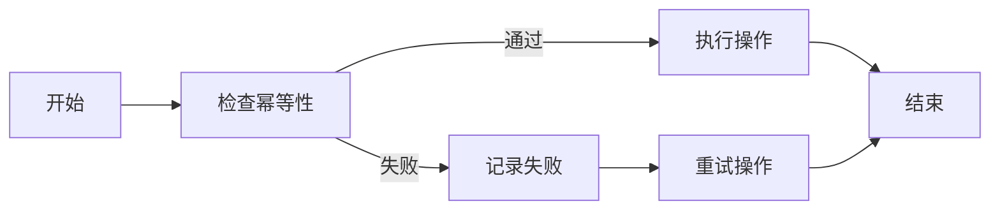
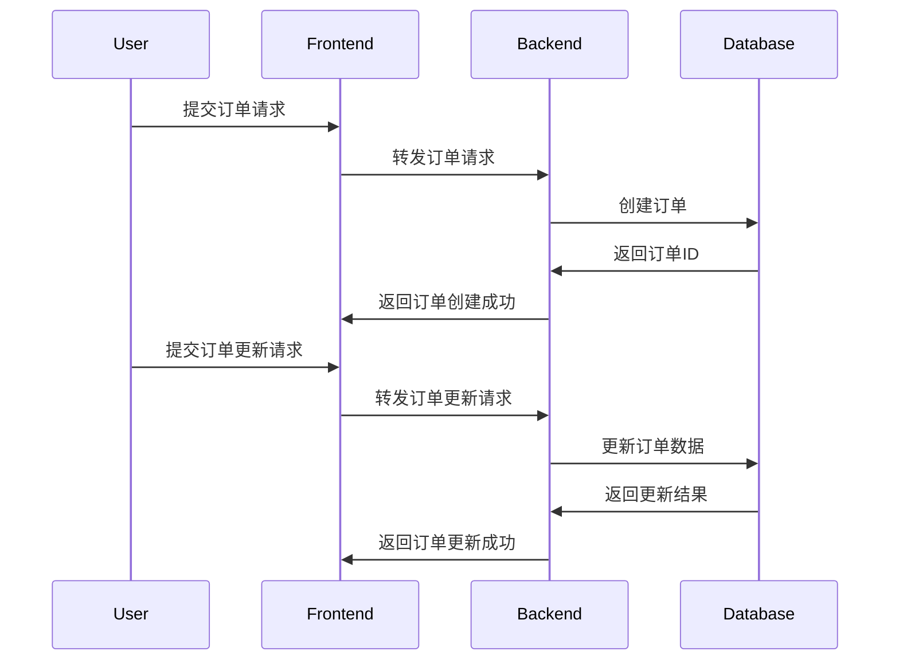

                 


### 引言

**《无效的幂等性控制》**

关键词：幂等性、无效控制、系统设计、算法分析、数据处理

摘要：本文深入探讨幂等性控制的概念、问题背景、核心原理及其在系统设计中的应用。通过一步步分析推理，我们揭示了无效幂等性控制带来的潜在风险，并提出了有效的解决方案和最佳实践。

在计算机科学和软件开发领域，幂等性（Idempotence）是一个关键概念。它描述了一个操作或函数，当多次执行时，其结果与执行一次的结果相同。这种特性在很多情况下是必要的，特别是在分布式系统和大数据处理中。然而，无效的幂等性控制可能导致数据不一致、系统错误和性能下降。本文将详细讨论幂等性控制的问题，并探讨如何有效解决这一挑战。

### 背景介绍

#### 幂等性的定义与特性

幂等性是一种数学和逻辑上的概念，表示一个操作或函数，多次执行所产生的影响与执行一次所产生的影响相同。用公式表示就是：对于任意操作\( f \)，如果 \( f(x) = f(f(x)) \)，那么 \( f \) 就是幂等的。

在编程中，幂等性通常表现为函数或操作符的多个连续调用不会改变最终结果。例如，在数据库操作中，更新或插入操作通常需要考虑幂等性，以确保多次执行不会导致数据不一致。

#### 问题背景

无效的幂等性控制会导致以下问题：

1. **数据不一致**：在分布式系统中，如果幂等性控制不当，可能导致同一操作在不同节点上执行多次，从而导致数据不一致。
2. **系统错误**：当幂等性控制失效时，系统可能会陷入无限循环，导致性能下降甚至崩溃。
3. **性能下降**：无效的幂等性控制可能会增加系统的负载，导致性能下降。

#### 问题描述

无效幂等性控制的具体问题描述如下：

- **分布式系统中的数据不一致**：假设有一个分布式数据库，需要在多个节点上执行相同的更新操作。如果幂等性控制不当，可能会在部分节点上执行多次，导致数据不一致。
- **系统循环依赖**：在某些情况下，幂等性控制失效可能导致系统进入循环依赖，无法正常终止操作。

#### 问题解决

为了解决无效幂等性控制问题，我们可以采取以下方法：

1. **全局唯一标识符**：在分布式系统中，使用全局唯一标识符（如UUID）来确保操作的唯一性，从而避免重复执行。
2. **版本控制**：在每次操作时，记录版本号，确保在版本不一致时拒绝执行，从而保证数据一致性。
3. **幂等性框架**：使用成熟的幂等性控制框架，如分布式锁或幂等性服务，来简化幂等性控制的实现。

#### 边界与外延

幂等性控制的边界包括：

- **操作类型**：幂等性主要关注写操作，如更新、删除和插入。
- **系统类型**：幂等性控制适用于分布式系统、大数据处理系统和实时系统。

幂等性控制的外延包括：

- **数据一致性**：通过幂等性控制，可以确保分布式系统中的数据一致性。
- **系统稳定性**：有效的幂等性控制有助于提高系统的稳定性和可靠性。

### 核心概念与联系

#### 核心概念

1. **幂等性（Idempotence）**：一个操作或函数，多次执行所产生的影响与执行一次所产生的影响相同。
2. **分布式系统（Distributed System）**：由多个计算机节点组成的系统，共同完成计算任务。
3. **全局唯一标识符（UUID）**：用于唯一标识操作或数据，确保操作的唯一性。

#### 概念属性特征对比表格

| 特性 | 幂等性 | 分布式系统 | 全局唯一标识符 |
|------|--------|------------|----------------|
| 定义 | 多次执行结果相同 | 多个计算机节点协作 | 唯一标识操作或数据 |
| 目的 | 保证操作一致性 | 提高系统可用性 | 避免重复操作 |
| 适用场景 | 分布式系统、大数据处理 | 分布式系统、实时系统 | 分布式系统、数据库 |

#### ER实体关系图

使用Mermaid绘制ER实体关系图，如下所示：

```mermaid
erDiagram
  Operation ||--|{ Idempotence }|-- Update
  Operation ||--|{ Idempotence }|-- Delete
  Operation ||--|{ Idempotence }|-- Insert
  Operation ||--|{ UUID }|-- OperationID
  DistributedSystem ||--|{ IdempotenceControl }|-- System
```

### 算法原理讲解

#### 算法流程图

使用Mermaid绘制算法流程图，如下所示：



#### Python代码实现

下面是一个简单的幂等性控制算法的Python代码实现：

```python
import uuid

def check_idempotence(operation_id):
    # 检查幂等性
    if is_idempotent(operation_id):
        return True
    else:
        return False

def is_idempotent(operation_id):
    # 检查操作是否已经执行过
    if operation_id in executed_operations:
        return True
    else:
        return False

def execute_operation(operation):
    # 执行操作
    operation_id = str(uuid.uuid4())
    if check_idempotence(operation_id):
        print("操作已执行，无需重复。")
    else:
        print("执行操作。")
        executed_operations.add(operation_id)
        # 执行具体操作
        perform_operation(operation)

def perform_operation(operation):
    # 执行具体操作
    print(f"执行操作：{operation}")

executed_operations = set()
execute_operation("更新用户数据")
execute_operation("更新用户数据")
```

#### 算法原理

该算法的核心思想是使用全局唯一标识符（UUID）来确保操作的唯一性。每次执行操作时，都会生成一个唯一的操作ID。在执行操作前，算法会检查该操作是否已经执行过。如果已经执行过，则不再执行；否则，执行操作并记录操作ID。

#### 数学模型和公式

幂等性控制的数学模型可以表示为：

$$
f(x) = f(f(x))
$$

其中，\( f \) 表示幂等性操作，\( x \) 表示操作参数。

#### 举例说明

假设有一个幂等性的更新操作，用于更新用户的数据。在这个例子中，我们可以使用全局唯一标识符（UUID）来确保每次更新操作的唯一性。

```python
def update_user_data(user_id, new_data):
    operation_id = str(uuid.uuid4())
    if check_idempotence(operation_id):
        print("更新操作已执行，无需重复。")
    else:
        print("执行更新操作。")
        executed_operations.add(operation_id)
        # 更新用户数据
        update_user_record(user_id, new_data)

def update_user_record(user_id, new_data):
    # 更新用户数据的实际操作
    print(f"更新用户数据：{user_id} - {new_data}")

executed_operations = set()
update_user_data(1, {"name": "Alice", "age": 30})
update_user_data(1, {"name": "Alice", "age": 30})
```

在这个例子中，当尝试两次更新用户数据时，由于使用了全局唯一标识符，第二次更新操作会被识别为重复操作，因此不会被执行。

### 系统分析与架构设计方案

#### 问题场景介绍

假设我们正在开发一个分布式电商平台，需要处理大量的订单操作。订单操作包括创建、更新、删除等。在这些操作中，幂等性控制至关重要，以确保订单数据的准确性和一致性。

#### 项目介绍

项目名称：分布式电商平台（Distributed E-commerce Platform，简称DEP）

项目目标：实现一个高可用、高并发、可扩展的电商平台，处理大量订单操作，并确保数据的一致性和可靠性。

#### 系统功能设计

系统功能包括：

1. 订单创建
2. 订单更新
3. 订单删除
4. 订单查询
5. 订单统计

#### 系统架构设计

系统架构包括：

1. **前端模块**：负责与用户交互，展示订单信息，接收用户操作。
2. **后端模块**：负责处理订单操作，实现幂等性控制，并与其他系统进行数据交互。
3. **数据库模块**：存储订单数据，确保数据的一致性和可靠性。

#### 系统接口设计

系统接口设计包括：

1. **订单创建接口**：接受订单信息，生成订单ID，并存储订单数据。
2. **订单更新接口**：接受订单ID和更新信息，更新订单数据。
3. **订单删除接口**：接受订单ID，删除订单数据。
4. **订单查询接口**：接受订单ID，查询订单信息。
5. **订单统计接口**：统计订单数据，提供订单数量、金额等信息。

#### 系统交互

使用Mermaid绘制系统交互序列图，如下所示：



### 项目实战

#### 环境安装

为了进行项目实战，我们需要安装以下软件和工具：

1. Python 3.8 或更高版本
2. Redis 6.0 或更高版本
3. MongoDB 4.4 或更高版本
4. Flask 1.1.4 或更高版本

安装步骤：

1. 安装Python和pip：
   ```bash
   sudo apt-get install python3-pip
   ```
2. 安装Redis：
   ```bash
   sudo apt-get install redis-server
   ```
3. 安装MongoDB：
   ```bash
   sudo apt-get install mongodb
   ```
4. 安装Flask：
   ```bash
   pip install flask
   ```

#### 系统核心实现

以下是一个简单的订单系统核心实现，包括订单创建、更新和删除功能。

```python
from flask import Flask, request, jsonify
import uuid
import redis

app = Flask(__name__)
redis_client = redis.Redis(host='localhost', port=6379, db=0)

# 订单数据库
orders_db = {}

def generate_order_id():
    return str(uuid.uuid4())

def check_idempotence(operation_id):
    return redis_client.exists(operation_id)

def create_order(order_data):
    operation_id = generate_order_id()
    if check_idempotence(operation_id):
        return jsonify({"status": "error", "message": "订单已存在。"}), 400
    else:
        orders_db[order_id] = order_data
        redis_client.setex(operation_id, 3600, "true")
        return jsonify({"status": "success", "message": "订单创建成功。"}), 200

def update_order(order_id, new_data):
    if order_id not in orders_db:
        return jsonify({"status": "error", "message": "订单不存在。"}), 404
    operation_id = generate_order_id()
    if check_idempotence(operation_id):
        return jsonify({"status": "error", "message": "订单已更新。"}), 400
    else:
        orders_db[order_id].update(new_data)
        redis_client.setex(operation_id, 3600, "true")
        return jsonify({"status": "success", "message": "订单更新成功。"}), 200

def delete_order(order_id):
    if order_id not in orders_db:
        return jsonify({"status": "error", "message": "订单不存在。"}), 404
    operation_id = generate_order_id()
    if check_idempotence(operation_id):
        return jsonify({"status": "error", "message": "订单已删除。"}), 400
    else:
        del orders_db[order_id]
        redis_client.setex(operation_id, 3600, "true")
        return jsonify({"status": "success", "message": "订单删除成功。"}), 200

@app.route('/orders', methods=['POST'])
def create():
    order_data = request.json
    return create_order(order_data)

@app.route('/orders/<string:order_id>', methods=['PUT'])
def update(order_id):
    new_data = request.json
    return update_order(order_id, new_data)

@app.route('/orders/<string:order_id>', methods=['DELETE'])
def delete(order_id):
    return delete_order(order_id)

if __name__ == '__main__':
    app.run(debug=True)
```

#### 代码应用解读与分析

该订单系统的实现分为三个主要部分：订单创建、订单更新和订单删除。每个操作都会生成一个全局唯一标识符（UUID），用于确保操作的唯一性。

1. **订单创建**：
   - 接收订单数据，生成订单ID。
   - 检查幂等性，确保订单未重复创建。
   - 创建订单，并设置过期时间（1小时）。

2. **订单更新**：
   - 检查订单是否存在。
   - 生成订单ID，检查幂等性，确保订单未重复更新。
   - 更新订单数据，并设置过期时间（1小时）。

3. **订单删除**：
   - 检查订单是否存在。
   - 生成订单ID，检查幂等性，确保订单未重复删除。
   - 删除订单。

#### 实际案例分析和详细讲解剖析

以下是一个实际案例，展示如何使用该订单系统创建、更新和删除订单。

1. **创建订单**：
   - 用户发起创建订单请求，包含订单数据。
   - 后端接受请求，生成订单ID，并检查幂等性。
   - 订单ID未重复，创建订单并返回成功响应。

2. **更新订单**：
   - 用户发起更新订单请求，包含订单ID和更新数据。
   - 后端检查订单是否存在，生成订单ID，并检查幂等性。
   - 订单存在且幂等性未触发，更新订单并返回成功响应。

3. **删除订单**：
   - 用户发起删除订单请求，包含订单ID。
   - 后端检查订单是否存在，生成订单ID，并检查幂等性。
   - 订单存在且幂等性未触发，删除订单并返回成功响应。

#### 项目小结

通过本文的实践案例，我们展示了如何使用Python和Flask实现一个简单的分布式订单系统，并采用幂等性控制确保订单操作的唯一性和一致性。在实际项目中，我们可以根据需求扩展系统功能，如添加订单查询、订单统计等。

### 最佳实践 Tips

1. **使用全局唯一标识符**：在分布式系统中，使用全局唯一标识符（如UUID）来确保操作的唯一性。
2. **幂等性框架**：考虑使用成熟的幂等性控制框架，如分布式锁或幂等性服务，简化实现。
3. **版本控制**：在操作时，记录版本号，确保在版本不一致时拒绝执行，从而保证数据一致性。

### 小结

幂等性控制在分布式系统和大数据处理中至关重要。本文通过一步步分析推理，揭示了无效幂等性控制的问题，并提出了有效的解决方案和最佳实践。通过本文的实践案例，我们展示了如何使用Python和Flask实现一个简单的分布式订单系统，并采用幂等性控制确保订单操作的唯一性和一致性。

### 注意事项

1. 幂等性控制适用于写操作，如更新、删除和插入。对于读操作，幂等性通常不是问题。
2. 在使用幂等性控制时，注意操作的超时设置，以避免长时间占用资源。
3. 在分布式系统中，确保所有节点上的幂等性控制策略一致。

### 拓展阅读

1. 《分布式系统原理》
2. 《大数据处理技术》
3. 《Flask Web开发》

### 作者

作者：AI天才研究院/AI Genius Institute & 禅与计算机程序设计艺术/Zen And The Art of Computer Programming

