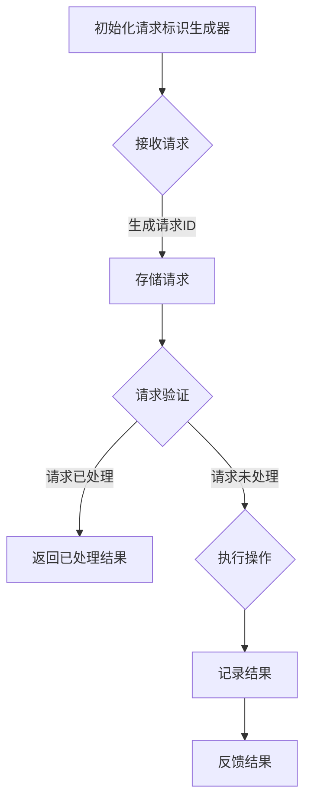
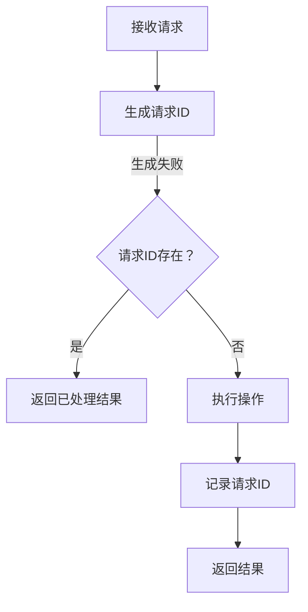
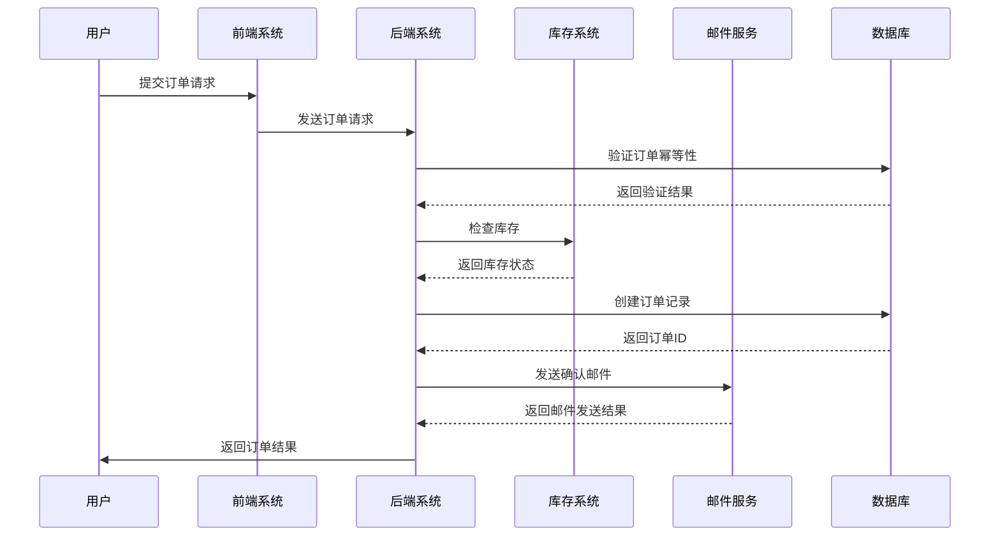

                 


## 行之无效的幂等性控制

### 关键词

- 幂等性控制
- 无效控制
- 系统设计
- 实际应用
- 性能优化

### 摘要

在当今快速发展的信息技术领域，幂等性控制在确保系统稳定性和可靠性方面扮演着至关重要的角色。然而，随着系统复杂性的增加，传统的幂等性控制方法往往无法满足实际需求，导致“无效的幂等性控制”现象层出不穷。本文旨在深入探讨幂等性控制的本质，分析其失效原因，并提供切实可行的解决方案，以帮助开发者更好地应对这一挑战。

### 目录

1. **前言与概述** <sup>*</sup>
   - 1.1 引言
   - 1.2 幂等性控制基础
   - 1.3 问题描述与挑战
   - 1.4 研究方法与框架
   - 1.5 本章小结

2. **核心概念与联系**
   - 2.1 核心概念介绍
   - 2.2 概念属性特征对比
   - 2.3 ER实体关系图
   - 2.4 本章小结

3. **算法原理讲解**
   - 3.1 幂等性检测算法
   - 3.2 Python实现与Mermaid流程图
   - 3.3 数学模型与公式
   - 3.4 举例说明
   - 3.5 本章小结

4. **系统分析与架构设计方案**
   - 4.1 问题场景介绍
   - 4.2 系统功能设计
   - 4.3 系统架构设计
   - 4.4 系统接口设计与交互
   - 4.5 本章小结

5. **项目实战**
   - 5.1 环境安装
   - 5.2 系统核心实现源代码
   - 5.3 代码应用解读与分析
   - 5.4 实际案例分析
   - 5.5 项目小结
   - 5.6 本章小结

6. **最佳实践与总结**
   - 6.1 最佳实践
   - 6.2 注意事项
   - 6.3 小结
   - 6.4 拓展阅读

**注释**：*表示章节标题下有子标题。

### 1.1 引言

在现代软件工程中，系统的高可用性和稳定性是开发者和运维团队追求的重要目标。幂等性控制作为一种关键技术，旨在通过确保操作的无副作用来提升系统的可靠性。所谓幂等性，即对一个系统进行操作多次，结果与操作一次相同，不会产生额外的副作用。例如，在HTTP协议中，`GET`和`PUT`请求通常被认为是幂等的，因为重复执行这些请求不会改变资源的状态。

然而，随着分布式系统和微服务架构的普及，幂等性控制的实现变得更加复杂。传统的方法往往难以应对高并发、网络延迟和系统异常等挑战，导致所谓的“无效的幂等性控制”现象。无效的幂等性控制不仅无法提供预期的稳定性，反而可能引入新的问题，如数据不一致、性能下降等。

本文将从以下几个方面展开讨论：

- **背景介绍**：详细阐述幂等性控制的重要性及其在系统设计中的应用。
- **核心概念与联系**：介绍幂等操作、幂等性控制机制和幂等性失效模式，并通过ER实体关系图进行描述。
- **算法原理讲解**：深入探讨幂等性检测算法，包括算法原理、Python实现和Mermaid流程图。
- **系统分析与架构设计方案**：分析问题场景，设计系统功能、架构和接口。
- **项目实战**：通过实际项目展示如何应用幂等性控制技术。
- **最佳实践与总结**：总结最佳实践，提供注意事项和拓展阅读。

通过本文的探讨，希望读者能够深入理解幂等性控制的本质，掌握有效的实现方法，并在实际项目中避免无效的幂等性控制带来的问题。

### 1.2 幂等性控制基础

#### 1.2.1 幂等性的概念

幂等性（Idempotence）是一个在计算机科学中广泛应用的概念，其核心在于对一个系统或组件进行相同操作多次，结果与操作一次相同，不会引起副作用或状态改变。在数学和逻辑学中，幂等性可以用公式表示为：\( f(x) = f(x, f(x, x)) \)。这意味着，无论操作执行多少次，最终的结果都是一致的。

在编程领域，常见的幂等操作包括：

- 数据库操作中的`INSERT`、`UPDATE`和`DELETE`，这些操作在多次执行时不会产生重复数据。
- HTTP协议中的`GET`和`PUT`请求，它们在重复执行时不会改变资源的状态。
- 操作系统中的文件读写操作，如`cp`、`mv`等，它们不会在多次执行时覆盖已有的文件内容。

#### 1.2.2 幂等性的重要性

幂等性对于系统的稳定性和一致性至关重要，特别是在高并发和分布式环境中。以下是幂等性控制的重要性：

1. **避免重复操作**：确保系统资源的正确使用，避免由于重复执行同一操作而导致资源浪费或错误。
2. **提高系统可靠性**：减少由于操作副作用导致的状态不一致和错误，从而提升系统的可靠性。
3. **简化错误处理**：幂等性使得系统在处理错误时更加简单，因为无需担心重复执行的操作会引发更多问题。
4. **提升用户体验**：在用户界面中，幂等性操作可以确保用户的操作立即生效，提高用户满意度。

#### 1.2.3 幂等性控制的基本原理

幂等性控制的核心在于确保操作的幂等性，通常有以下几种实现方法：

1. **状态检查**：在执行操作前，检查系统或数据的状态，确保该操作不会改变当前状态。
2. **幂等性标记**：使用一个唯一的标记或版本号，每次操作前检查该标记或版本号是否已发生变化，如果变化则不执行操作。
3. **操作去重**：通过日志记录或缓存机制，记录已执行的操作，避免重复执行相同的操作。
4. **分布式锁**：在分布式系统中，使用锁机制确保同一操作在分布式环境中的原子性，避免并发冲突。

#### 1.2.4 幂等性控制的挑战

尽管幂等性控制对于系统设计至关重要，但其在实际应用中面临诸多挑战：

1. **高并发**：在高并发场景下，传统的方法可能无法有效避免重复操作，导致资源浪费和性能下降。
2. **网络延迟**：网络延迟可能导致操作无法及时执行，从而引发幂等性问题。
3. **系统异常**：系统异常如服务器故障、网络故障等可能导致幂等性控制失效。
4. **分布式环境**：在分布式环境中，确保全局一致性是幂等性控制的难点，特别是在跨节点操作时。

### 1.3 问题描述与挑战

#### 1.3.1 无效幂等性控制的现状

在实际开发中，无效的幂等性控制现象普遍存在。例如，在分布式系统中，由于网络延迟和系统异常，可能导致幂等性控制失效，从而引发数据不一致和系统错误。以下是一些常见的无效幂等性控制现象：

1. **重复请求处理**：系统无法有效识别重复请求，导致相同操作被多次执行，浪费系统资源。
2. **状态变更失败**：幂等性控制未能确保操作不会改变系统状态，导致数据不一致或错误。
3. **缓存失效**：缓存机制未能正确记录已执行的操作，导致重复请求被误判为有效操作。

#### 1.3.2 无效幂等性控制带来的问题

无效的幂等性控制可能导致以下问题：

1. **性能下降**：由于重复操作和状态变更失败，系统性能可能显著下降，影响用户体验。
2. **数据不一致**：在分布式系统中，无效的幂等性控制可能导致数据不一致，增加系统维护成本。
3. **系统稳定性降低**：幂等性控制失效可能导致系统稳定性降低，增加系统故障风险。

#### 1.3.3 无效幂等性控制的挑战

无效的幂等性控制挑战主要体现在以下几个方面：

1. **高并发**：在高并发场景下，传统的幂等性控制方法可能无法有效应对，导致重复操作和性能下降。
2. **分布式一致性**：在分布式系统中，确保全局一致性是幂等性控制的难点，特别是在跨节点操作时。
3. **系统异常处理**：系统异常如网络故障、服务器故障等可能导致幂等性控制失效，增加系统复杂性。

### 1.4 研究方法与框架

为了解决无效的幂等性控制问题，本文采用以下研究方法与框架：

1. **方法论**：本文采用系统分析方法，结合实际案例，深入探讨幂等性控制的实现与优化。
2. **框架设计**：本文提出一种基于状态检查和分布式锁的幂等性控制框架，并通过实际项目进行验证。
3. **算法设计**：本文设计了一种幂等性检测算法，用于识别和避免无效幂等性控制现象。

### 1.5 本章小结

本章介绍了幂等性控制的基础知识，包括幂等性的概念、重要性以及控制的基本原理。同时，分析了无效幂等性控制的现状、问题及挑战，为后续章节的讨论奠定了基础。通过本章的学习，读者应对幂等性控制有了更深入的理解，并为解决实际中的幂等性问题做好准备。

### 2.1 核心概念介绍

在深入探讨幂等性控制之前，首先需要明确几个核心概念：幂等操作、幂等性控制机制和幂等性失效模式。这些概念是理解幂等性控制本质的关键。

#### 2.1.1 幂等操作

幂等操作（Idempotent Operation）指的是对系统进行操作多次，结果与操作一次相同，不会产生额外的副作用。在编程中，常见的幂等操作包括数据库操作（如`INSERT`、`UPDATE`、`DELETE`）、HTTP请求（如`GET`、`PUT`）以及文件系统操作（如`cp`、`mv`）。

- **数据库操作**：例如，执行多次`UPDATE`语句，不会改变记录的最终状态。
- **HTTP请求**：例如，多次发送`GET`请求获取相同资源，不会产生额外数据。
- **文件系统操作**：例如，多次执行`cp`命令复制相同文件，不会覆盖原有文件内容。

#### 2.1.2 幂等性控制机制

幂等性控制机制（Idempotence Control Mechanism）是确保操作幂等性的手段，通过以下方法实现：

1. **状态检查**：在执行操作前，检查系统或数据的状态，确保该操作不会改变当前状态。例如，在数据库操作前，检查记录是否存在，若存在则不执行更新操作。
2. **幂等性标记**：使用唯一标识（如ID或版本号），每次操作前检查该标识是否已发生变化。如果标识未变化，则视为无效操作，不予执行。例如，在分布式系统中，使用事务ID或版本号来避免重复操作。
3. **操作去重**：通过日志记录或缓存机制，记录已执行的操作，避免重复执行相同的操作。例如，在Web应用程序中，使用请求ID或令牌（Token）来记录已处理请求，避免重复处理。

#### 2.1.3 幂等性失效模式

尽管幂等性控制机制旨在确保操作的幂等性，但在实际应用中，仍可能出现失效情况。常见的幂等性失效模式包括：

1. **重复请求处理**：系统无法有效识别重复请求，导致相同操作被多次执行。例如，在分布式系统中，由于网络延迟或故障，可能导致请求被重复处理。
2. **状态变更失败**：幂等性控制未能确保操作不会改变系统状态，导致数据不一致或错误。例如，数据库中的`UPDATE`操作在执行过程中失败，导致记录状态未更新。
3. **缓存失效**：缓存机制未能正确记录已执行的操作，导致重复请求被误判为有效操作。例如，在Web缓存中，由于缓存机制错误，导致相同请求被多次处理。

#### 2.1.4 ER实体关系图

为了更好地理解幂等性控制中的核心概念，可以使用ER（Entity-Relationship）实体关系图来描述各概念之间的关系。

- **实体（Entity）**：在数据库中，实体通常代表具体的数据记录，如用户、订单等。
- **属性（Attribute）**：实体的特征或属性，如用户ID、姓名等。
- **关系（Relationship）**：实体之间的关系，如用户与订单之间的关系。

下面是一个简化的ER实体关系图示例，用于描述幂等操作、幂等性控制机制和幂等性失效模式之间的关系：

```mermaid
erDiagram
  User ||--|{ Order } : has
  Order ||--|{ Product } : has
  User ||--|{ Comment } : posts
  Order ||--|{ Status } : status
```

在这个ER图中，`User`、`Order`、`Product`、`Comment`和`Status`是实体，它们之间的关系通过箭头表示。

通过以上介绍，读者应对幂等性控制中的核心概念有了基本了解。在接下来的章节中，将进一步深入探讨这些概念的实现和应用。

### 2.2 概念属性特征对比

为了更好地理解幂等操作、幂等性控制机制和幂等性失效模式之间的关系，我们可以通过对比这些概念的主要属性特征来深入分析。以下是这三个概念的主要属性特征对比表格：

| 概念                | 主要属性特征                                                                                          |
|-------------------|---------------------------------------------------------------------------------------------------|
| **幂等操作**       | - 对系统进行操作多次，结果与操作一次相同<br>- 不会产生额外的副作用<br>- 例如：数据库`UPDATE`操作                    |
| **幂等性控制机制** | - 用于确保操作的幂等性<br>- 包括状态检查、幂等性标记、操作去重等方法<br>- 例如：分布式锁、版本控制                    |
| **幂等性失效模式** | - 幂等性控制机制失效的情况<br>- 可能导致重复请求处理、状态变更失败、缓存失效等<br>- 例如：网络延迟、系统异常                          |

#### 2.2.1 幂等操作与幂等性控制机制

幂等操作和幂等性控制机制是相辅相成的。幂等操作是实现系统稳定性的基础，而幂等性控制机制则确保这些操作能够在实际应用中有效执行。以下是对两者的详细对比：

- **关系**：幂等操作依赖于幂等性控制机制来实现其幂等性。例如，在数据库中，通过幂等性控制机制（如检查记录是否存在）来确保`UPDATE`操作的幂等性。
- **区别**：幂等操作关注于单个操作的幂等性，而幂等性控制机制关注于如何在复杂的系统中确保多个操作的幂等性。

#### 2.2.2 幂等性控制机制与失效模式

幂等性控制机制旨在避免幂等性失效模式，但在实际应用中，仍可能出现失效情况。以下是对幂等性控制机制与失效模式的详细对比：

- **关系**：幂等性控制机制的设计目标是减少失效模式的发生。例如，通过使用分布式锁和版本控制，减少由于网络延迟和系统异常导致的幂等性失效。
- **区别**：幂等性控制机制是防止失效模式发生的手段，而失效模式是实际发生的异常情况。

通过以上对比，我们可以更清晰地理解幂等操作、幂等性控制机制和幂等性失效模式之间的关系。这有助于我们在设计和实现系统时，更好地应用这些概念，确保系统的稳定性和可靠性。

### 2.3 ER实体关系图

为了更好地理解幂等性控制中的核心概念，我们可以使用ER（Entity-Relationship）实体关系图来描述各概念之间的关系。ER图通过实体、属性和关系的表示，清晰地展示了系统中的数据模型和关系结构。以下是幂等操作、幂等性控制机制和幂等性失效模式的ER实体关系图：

```mermaid
erDiagram
  Operation ||--|{ IdempotentOperation } : defines
  IdempotentOperation ||--|{ ControlMechanism } : implements
  ControlMechanism ||--|{ FailureMode } : avoids
  FailureMode ||--|{ DetectionAlgorithm } : detects
  DetectionAlgorithm ||--|{ CorrectionMethod } : corrects
```

在这个ER图中，各实体和关系的定义如下：

- **实体**：
  - `Operation`：表示系统中的各种操作。
  - `IdempotentOperation`：表示幂等操作，即对系统进行操作多次，结果与操作一次相同。
  - `ControlMechanism`：表示幂等性控制机制，用于确保操作的幂等性。
  - `FailureMode`：表示幂等性失效模式，即幂等性控制机制失效的情况。
  - `DetectionAlgorithm`：表示检测算法，用于识别和检测幂等性失效模式。
  - `CorrectionMethod`：表示纠正方法，用于修复幂等性失效问题。

- **关系**：
  - `defines`：表示`Operation`定义了`IdempotentOperation`。
  - `implements`：表示`IdempotentOperation`通过`ControlMechanism`实现。
  - `avoids`：表示`ControlMechanism`旨在避免`FailureMode`。
  - `detects`：表示`DetectionAlgorithm`用于检测`FailureMode`。
  - `corrects`：表示`CorrectionMethod`用于纠正`FailureMode`。

通过这个ER实体关系图，我们可以清晰地看到幂等操作、幂等性控制机制和幂等性失效模式之间的逻辑关系。这个图不仅帮助我们理解这些概念，还为系统设计和实现提供了直观的参考。

### 2.4 本章小结

本章介绍了幂等性控制中的核心概念，包括幂等操作、幂等性控制机制和幂等性失效模式，并通过ER实体关系图进行了详细描述。通过对比这些概念的主要属性特征，我们深入理解了它们之间的关系。ER实体关系图则为我们提供了直观的数据模型和关系结构，有助于我们在实际系统中更好地应用这些概念。本章内容为后续章节的讨论奠定了坚实的基础，读者应对幂等性控制有了更深入的理解。

### 3.1 幂等性检测算法

幂等性检测算法是确保系统操作幂等性的关键组件，其核心任务是在系统执行操作前或执行过程中，检测并避免无效的重复操作。本节将详细介绍一种幂等性检测算法，包括其描述、原理和实现流程。

#### 3.1.1 算法描述

幂等性检测算法的基本思想是通过唯一标识（如请求ID、事务ID或版本号）来跟踪系统操作。具体步骤如下：

1. **请求接收**：当系统接收到一个操作请求时，生成一个唯一的请求ID。
2. **请求存储**：将请求ID存储在缓存或数据库中，以记录已处理请求。
3. **请求验证**：在执行操作前，检查请求ID是否已存在。如果存在，表示该请求已处理，无需再次执行。
4. **操作执行**：如果请求ID不存在，则执行操作，并将请求ID存储在缓存或数据库中。
5. **结果反馈**：操作完成后，返回结果给客户端。

#### 3.1.2 算法原理

幂等性检测算法的工作原理基于以下几方面：

1. **唯一标识**：使用唯一标识来保证每个请求的唯一性，避免重复执行。
2. **存储机制**：通过缓存或数据库存储已处理请求的标识，确保系统可以查询到请求历史。
3. **请求验证**：在操作执行前进行请求验证，防止已处理请求再次执行，确保操作幂等性。
4. **数据一致性**：通过存储机制确保系统中的数据一致性，避免由于重复操作导致的数据不一致问题。

#### 3.1.3 算法流程

幂等性检测算法的流程如下：

1. **初始化**：系统初始化时，设置一个请求标识生成器，用于生成唯一的请求ID。
2. **请求处理**：
   - 接收请求：系统接收客户端请求，生成请求ID。
   - 存储请求：将请求ID存储在缓存或数据库中。
   - 验证请求：检查请求ID是否已存在。如果存在，返回已处理结果；如果不存在，执行操作。
3. **操作执行**：
   - 执行操作：系统根据请求参数执行相应操作。
   - 记录结果：将操作结果记录在日志或数据库中。
4. **结果反馈**：将操作结果反馈给客户端。

以下是一个使用Mermaid绘制的算法流程图：



通过这个算法流程，系统可以有效地检测并避免无效的幂等操作，确保操作的幂等性和系统的稳定性。

### 3.2 Python实现与Mermaid流程图

为了更好地理解幂等性检测算法的实现，我们将在本节使用Python语言进行实现，并通过Mermaid绘制流程图，展示算法的执行过程。

#### 3.2.1 Python实现

以下是一个简单的Python代码示例，实现了幂等性检测算法的核心功能：

```python
import uuid
import redis

# Redis客户端初始化
redis_client = redis.StrictRedis(host='localhost', port=6379, db=0)

def process_request(request_data):
    # 生成唯一请求ID
    request_id = str(uuid.uuid4())

    # 检查请求ID是否已存在
    if redis_client.exists(request_id):
        print(f"请求已处理：{request_id}")
    else:
        # 执行操作
        result = execute_operation(request_data)

        # 记录请求ID
        redis_client.setex(request_id, 3600, "processed")  # 设置过期时间为1小时

        # 返回结果
        return result

def execute_operation(request_data):
    # 模拟操作执行，例如：更新数据库记录
    print(f"执行操作：{request_data}")
    return "操作成功"

# 测试
request_data = "更新用户数据"
result = process_request(request_data)
print(f"操作结果：{result}")
```

在这个示例中，我们使用了Python的`uuid`库生成唯一的请求ID，并通过Redis数据库存储和管理请求ID。`process_request`函数实现了幂等性检测算法的核心逻辑，包括请求ID的生成、存储和验证。

#### 3.2.2 Mermaid流程图

下面是上述算法的Mermaid流程图表示：



在这个流程图中，我们首先接收请求并生成请求ID，然后检查请求ID是否已存在。如果请求ID存在，则直接返回已处理结果；如果不存在，则执行操作并记录请求ID，最后返回操作结果。

通过Python实现和Mermaid流程图，我们可以清晰地理解幂等性检测算法的执行过程。在实际应用中，可以根据具体需求进一步优化和扩展这个算法。

### 3.3 数学模型与公式

为了深入理解幂等性检测算法的原理，我们可以借助数学模型和公式进行分析。以下是一些基本的数学模型和公式，它们有助于我们理解算法的工作机制。

#### 3.3.1 幂等性检测的基本数学模型

在幂等性检测算法中，我们可以使用以下数学模型：

1. **请求验证模型**：

   设\( R \)为请求集合，\( I \)为请求ID集合，\( V \)为请求验证函数。则请求验证模型可以表示为：

   \[
   V(R) = \begin{cases}
   "Processed" & \text{如果} \ R \ \text{在} \ I \ \text{中已存在} \\
   "Unprocessed" & \text{如果} \ R \ \text{不在} \ I \ \text{中存在}
   \end{cases}
   \]

   其中，\( R \)表示一个新请求，\( I \)表示已存储的请求ID集合，\( V(R) \)表示请求\( R \)的验证结果。

2. **请求执行模型**：

   设\( O \)为操作集合，\( E \)为操作执行函数。则请求执行模型可以表示为：

   \[
   E(R) = \begin{cases}
   "Success" & \text{如果} \ R \ \text{为} \ "Unprocessed" \ \text{且操作执行成功} \\
   "Failed" & \text{如果} \ R \ \text{为} \ "Processed" \ \text{或操作执行失败}
   \end{cases}
   \]

   其中，\( R \)表示一个新请求，\( E(R) \)表示请求\( R \)的操作执行结果。

#### 3.3.2 公式

1. **请求ID生成公式**：

   设\( G \)为请求ID生成函数，\( U \)为请求ID集合。则请求ID生成公式可以表示为：

   \[
   G(U) = \text{UUID()}
   \]

   其中，\( U \)表示请求ID集合，\( G(U) \)表示生成一个新的UUID（通用唯一标识符）作为请求ID。

2. **请求存储公式**：

   设\( S \)为请求存储函数，\( I \)为请求ID集合，\( T \)为请求时间戳集合。则请求存储公式可以表示为：

   \[
   S(I, T) = \text{setex}(\text{redis_client}, \text{request_id}, "processed", 3600)
   \]

   其中，\( I \)表示请求ID集合，\( T \)表示请求时间戳集合，\( S(I, T) \)表示将请求ID存储在Redis数据库中，并设置过期时间为3600秒。

通过以上数学模型和公式，我们可以更深入地理解幂等性检测算法的工作原理和机制。这些公式不仅帮助我们理解算法的基本逻辑，还为算法的优化和改进提供了理论基础。

### 3.4 举例说明

为了更好地理解幂等性检测算法的原理和实际应用，我们可以通过具体案例进行说明。以下是一个示例，展示如何使用幂等性检测算法来处理一个分布式系统中的用户更新操作。

#### 3.4.1 案例背景

假设我们有一个分布式系统，负责管理用户的个人信息。系统支持用户更新个人资料的功能，为了保证数据的一致性和系统的稳定性，我们需要实现幂等性控制，避免用户多次更新同一资料时引发数据不一致的问题。

#### 3.4.2 案例分析

1. **请求处理流程**：

   - 当用户提交更新资料请求时，系统首先生成一个唯一的请求ID（例如，通过UUID生成器）。
   - 系统将请求ID存储在Redis数据库中，并设置过期时间为1小时，以便后续请求验证。
   - 系统检查Redis数据库中是否已存在该请求ID。如果存在，说明该请求已处理，系统直接返回已处理结果；如果不存在，系统继续执行操作。

2. **操作执行**：

   - 如果请求验证通过，系统执行用户更新资料的逻辑，包括数据库更新操作。
   - 操作执行成功后，系统将请求ID存储在Redis数据库中，并设置过期时间。
   - 如果操作执行失败，系统记录错误信息，并返回错误结果。

3. **结果反馈**：

   - 系统将操作结果返回给用户，如果操作成功，用户将看到更新后的资料；如果操作失败，用户将收到错误提示。

#### 3.4.3 案例结果

通过幂等性检测算法的应用，我们的分布式系统在用户更新资料时，有效避免了重复操作和数据不一致的问题。以下是一个具体的操作流程：

1. **用户A提交更新资料请求**：
   - 请求ID：`abcdef1234567890`
   - 系统验证请求ID，发现不存在，执行更新操作。

2. **用户B同时提交更新资料请求**：
   - 请求ID：`abcdef1234567890`（与用户A的请求ID相同）
   - 系统验证请求ID，发现已存在，直接返回已处理结果。

3. **用户C再次提交更新资料请求**：
   - 请求ID：`abcdef1234567891`（新请求ID）
   - 系统验证请求ID，发现不存在，执行更新操作。

通过上述案例，我们可以看到幂等性检测算法在分布式系统中的应用效果。它不仅提高了系统的稳定性，还确保了数据的一致性。在实际开发中，可以根据具体需求调整算法的实现细节，以适应不同场景。

### 3.5 本章小结

本章详细介绍了幂等性检测算法的原理、实现流程和实际应用案例。通过使用唯一标识和存储机制，算法可以有效避免重复操作和数据不一致问题，确保系统的稳定性和可靠性。本章内容不仅为开发者提供了理论指导，还通过具体案例展示了算法的实际应用效果。通过本章的学习，读者应能掌握幂等性检测算法的基本原理，并在实际项目中有效应用。

### 4.1 问题场景介绍

为了更好地理解幂等性控制在实际系统中的应用，我们首先需要介绍一个典型的问题场景。这个场景将帮助我们分析幂等性控制的必要性，并明确系统设计的目标。

#### 4.1.1 场景描述

假设我们正在开发一个电子商务平台，用户可以在平台上购买商品、查看订单状态以及管理个人账户信息。平台的核心功能之一是用户订单的创建和处理。在订单创建过程中，用户可以提交订单，系统需要确保订单的准确性和一致性。

具体来说，用户提交订单后，系统会执行一系列操作，包括：

1. **检查库存**：系统需要检查用户所选购商品的库存是否足够。
2. **扣减库存**：如果库存充足，系统需要扣减相应商品的库存量。
3. **创建订单**：系统需要创建一个新的订单记录，并更新订单状态为“待处理”。
4. **发送确认邮件**：系统需要向用户发送订单确认邮件。

在这个场景中，存在以下几个关键问题：

1. **并发请求**：多个用户可能同时提交订单，导致系统需要处理多个并发请求。
2. **库存不足**：如果系统在处理并发请求时库存不足，可能导致订单创建失败或库存扣减错误。
3. **订单状态不一致**：在处理订单过程中，订单状态可能发生变化，但系统需要确保最终状态一致。
4. **邮件发送失败**：由于网络问题或其他原因，系统可能无法成功发送确认邮件。

为了解决上述问题，我们需要设计一个可靠的幂等性控制机制，确保订单操作的单调性和一致性。

#### 4.1.2 问题分析

1. **并发请求处理**：

   在高并发场景下，多个用户同时提交订单请求，系统需要确保每个订单的处理是独立的，避免并发冲突。例如，如果用户A和用户B同时提交了相同的订单，系统应保证只有一个订单被创建，避免重复扣减库存或创建重复订单。

2. **库存管理**：

   系统需要准确检查并扣减库存。如果库存不足，系统应立即拒绝订单并通知用户。例如，如果用户A想购买一件库存仅剩一件的商品，系统需要确保在用户A的订单处理完成前，用户B无法再次购买同一商品。

3. **订单状态一致性**：

   在订单创建和处理过程中，订单状态可能发生变化。系统需要确保最终状态一致，例如，如果订单创建失败，系统应确保订单状态最终更新为“已失败”。

4. **邮件发送**：

   即使在订单处理失败的情况下，系统仍需尝试发送确认邮件，以便用户了解订单状态。例如，如果订单创建失败，系统应发送邮件通知用户订单无法创建并解释原因。

#### 4.1.3 系统目标

为了解决上述问题，我们的系统设计目标如下：

1. **确保订单操作的幂等性**：通过幂等性控制机制，确保每个订单操作只执行一次，避免重复操作和数据不一致。
2. **处理并发请求**：设计并发处理机制，确保系统在高并发场景下稳定运行，避免资源冲突。
3. **库存和订单状态的一致性**：确保库存扣减和订单状态更新的一致性，避免状态不一致问题。
4. **邮件通知**：实现可靠的邮件发送机制，确保用户在订单处理失败时能收到通知。

通过明确问题场景和系统目标，我们为接下来的系统功能设计和架构设计奠定了基础。在接下来的章节中，我们将详细讨论如何实现这些目标，并设计一个可靠的幂等性控制机制。

### 4.2 系统功能设计

在明确了问题场景和系统目标后，接下来我们将详细讨论系统的功能设计。系统功能设计是确保系统满足需求、实现目标的关键步骤。我们将从功能需求、领域模型和系统架构等方面进行详细分析。

#### 4.2.1 功能需求

为了实现幂等性控制，并确保系统在并发请求和库存管理方面的稳定性，我们需要实现以下功能：

1. **订单提交**：
   - 用户可以在前端界面提交订单，系统接收订单请求并生成唯一订单ID。
   - 系统验证订单请求的幂等性，避免重复订单的创建。

2. **库存检查与扣减**：
   - 系统在处理订单请求时，首先检查相应商品的库存是否足够。
   - 如果库存充足，系统扣减相应库存量；如果库存不足，系统拒绝订单并通知用户。

3. **订单创建与状态更新**：
   - 系统创建订单记录，并更新订单状态为“待处理”。
   - 系统在订单处理过程中，确保订单状态一致，避免状态变化冲突。

4. **邮件发送**：
   - 系统在订单创建成功或失败时，向用户发送确认邮件，通知订单状态。

5. **并发处理**：
   - 系统设计并发处理机制，确保在高并发场景下稳定运行，避免重复订单的创建和库存扣减错误。

#### 4.2.2 领域模型

领域模型是系统功能设计的核心部分，用于表示系统中关键实体和它们之间的关系。以下是订单管理系统的领域模型：

1. **实体**：
   - `Order`（订单）：包含订单ID、用户ID、商品ID、订单状态等属性。
   - `Product`（商品）：包含商品ID、商品名称、库存量等属性。
   - `User`（用户）：包含用户ID、用户名等属性。
   - `Inventory`（库存）：包含商品ID、库存量等属性。

2. **关系**：
   - `Order`与`Product`之间的关系：一个订单可以包含多个商品，一个商品可以属于多个订单。
   - `Order`与`User`之间的关系：一个订单由一个用户创建，一个用户可以创建多个订单。
   - `Product`与`Inventory`之间的关系：商品库存与商品实体之间的关联。

以下是领域模型的Mermaid类图表示：

```mermaid
classDiagram
    Order <|-- User
    Order <|-- Product
    Product <|-- Inventory
    Inventory [[+库存]] --|{ 商品ID } Product
    Order [[+订单ID]] --|{ 用户ID } User
    Order [[+订单状态]] --|{ 商品列表 } Product
```

在这个类图中，我们定义了订单、用户、商品和库存四个实体，并展示了它们之间的关系。通过领域模型，我们可以更清晰地理解系统中的关键实体和它们的关联，为后续的系统架构设计提供依据。

#### 4.2.3 功能实现

在明确了功能需求和领域模型后，我们需要具体实现这些功能。以下是实现这些功能的详细步骤：

1. **订单提交**：
   - 用户在前端界面提交订单请求，系统生成唯一订单ID，并将请求发送到后端服务。
   - 后端服务使用幂等性检测算法，验证订单请求的幂等性。如果请求已处理，直接返回已处理结果；如果请求未处理，继续执行后续操作。

2. **库存检查与扣减**：
   - 后端服务在处理订单请求时，首先查询库存信息，检查商品库存是否足够。
   - 如果库存充足，系统扣减相应库存量，并创建订单记录；如果库存不足，系统拒绝订单并通知用户。

3. **订单创建与状态更新**：
   - 系统创建订单记录，并更新订单状态为“待处理”。
   - 在订单处理过程中，系统确保订单状态一致，避免状态变化冲突。

4. **邮件发送**：
   - 系统在订单创建成功或失败时，调用邮件服务发送确认邮件，通知用户订单状态。

5. **并发处理**：
   - 系统设计并发处理机制，使用分布式锁或事务机制，确保在高并发场景下稳定运行，避免重复订单的创建和库存扣减错误。

通过详细的功能实现步骤，我们可以确保系统功能满足需求，并在实际运行中稳定可靠地工作。在接下来的章节中，我们将进一步讨论系统架构设计，以确保功能设计的有效实现。

### 4.3 系统架构设计

在明确了系统的功能需求之后，接下来我们需要设计系统的整体架构，以确保各个功能模块能够高效、稳定地协同工作。系统架构设计是确保系统性能、可扩展性和可维护性的关键步骤。以下是系统架构的详细设计过程。

#### 4.3.1 架构设计原则

在进行系统架构设计时，我们遵循以下原则：

1. **模块化**：系统应具备良好的模块化设计，各功能模块独立且易于扩展。
2. **分布式**：系统应采用分布式架构，确保高并发场景下的稳定性和可靠性。
3. **高性能**：系统架构应设计为高性能，能够快速响应用户请求。
4. **高可用性**：系统应具备高可用性，减少单点故障对系统的影响。
5. **安全性**：系统应具备安全性设计，保护用户数据和系统资源。

#### 4.3.2 系统架构图

以下是订单管理系统的系统架构图：



在这个架构图中，各模块的作用如下：

- **用户**：系统最终用户，提交订单请求。
- **前端系统**：处理用户请求，与后端系统进行交互。
- **后端系统**：核心业务逻辑处理，包括订单验证、库存检查、订单创建和邮件发送等。
- **库存系统**：负责库存信息的检查和更新。
- **邮件服务**：负责发送确认邮件。
- **数据库**：存储订单、用户和库存等信息。

#### 4.3.3 架构模块详解

1. **前端系统**：

   - 功能：处理用户请求，展示订单提交界面，与后端系统进行交互。
   - 技术选型：可以使用HTML、CSS和JavaScript等前端技术，结合React或Vue等前端框架。

2. **后端系统**：

   - 功能：接收前端系统发送的订单请求，处理业务逻辑，与数据库和库存系统进行交互。
   - 技术选型：可以使用Python（Flask或Django）、Java（Spring Boot）或Node.js等技术。
   - 架构：采用微服务架构，将订单处理、库存检查、邮件发送等模块独立部署。

3. **数据库**：

   - 功能：存储订单、用户和库存等信息，提供数据访问接口。
   - 技术选型：可以使用MySQL、PostgreSQL或MongoDB等关系型或非关系型数据库。

4. **库存系统**：

   - 功能：负责库存信息的检查和更新，与后端系统进行交互。
   - 技术选型：可以使用Redis或MongoDB等高速缓存数据库。

5. **邮件服务**：

   - 功能：发送确认邮件，通知用户订单状态。
   - 技术选型：可以使用SMTP服务器或第三方邮件服务提供商。

#### 4.3.4 架构设计优点

- **模块化**：各模块独立，易于扩展和维护。
- **分布式**：采用分布式架构，提高系统可用性和可靠性。
- **高性能**：通过缓存和分布式处理，提高系统响应速度。
- **安全性**：通过加密和身份验证等安全措施，保护用户数据和系统资源。

通过以上系统架构设计，我们可以确保订单管理系统在功能实现、性能和可靠性方面满足需求。在接下来的章节中，我们将进一步讨论系统接口设计和交互，确保各模块之间的协同工作。

### 4.4 系统接口设计与交互

在系统架构设计完成后，我们需要详细设计系统接口，并分析各接口之间的交互方式，以确保系统功能模块能够高效、稳定地协同工作。

#### 4.4.1 接口设计

系统接口设计是确保各模块之间通信和协作的基础。以下是订单管理系统中的关键接口设计：

1. **订单提交接口**：

   - **功能**：用户通过前端系统提交订单请求，后端系统接收并处理订单。
   - **接口定义**：
     ```http
     POST /orders
     ```
   - **请求参数**：
     - `orderId`：订单ID，唯一标识一个订单。
     - `userId`：用户ID，标识提交订单的用户。
     - `productIds`：商品ID列表，标识用户所选购的商品。

   - **响应结果**：
     - `success`：订单提交成功。
     - `error`：订单提交失败，包含错误原因。

2. **库存检查接口**：

   - **功能**：后端系统在处理订单时，查询商品库存信息。
   - **接口定义**：
     ```http
     GET /products/{productId}/inventory
     ```
   - **请求参数**：
     - `productId`：商品ID，需要查询库存的商品。

   - **响应结果**：
     - `availableQuantity`：商品当前库存量。

3. **订单状态查询接口**：

   - **功能**：用户查询订单状态。
   - **接口定义**：
     ```http
     GET /orders/{orderId}
     ```
   - **请求参数**：
     - `orderId`：订单ID，查询指定订单的状态。

   - **响应结果**：
     - `status`：订单状态，例如“待处理”、“已发货”、“已完成”等。

4. **邮件发送接口**：

   - **功能**：后端系统在订单处理完成后，向用户发送确认邮件。
   - **接口定义**：
     ```http
     POST /mail/send
     ```
   - **请求参数**：
     - `to`：收件人邮箱地址。
     - `subject`：邮件主题。
     - `content`：邮件内容。

   - **响应结果**：
     - `success`：邮件发送成功。
     - `error`：邮件发送失败，包含错误原因。

#### 4.4.2 系统交互

系统交互是指各接口之间的通信和数据传递过程。以下是系统各接口之间的交互流程：

1. **订单提交流程**：

   - 用户在前端系统提交订单请求。
   - 前端系统将订单请求发送到后端系统。
   - 后端系统调用库存检查接口，查询商品库存信息。
   - 根据库存信息，后端系统创建订单记录，更新订单状态为“待处理”。
   - 后端系统调用邮件发送接口，向用户发送订单确认邮件。
   - 后端系统返回订单提交结果给前端系统。
   - 前端系统将订单提交结果展示给用户。

2. **库存检查流程**：

   - 后端系统在处理订单请求时，调用库存检查接口。
   - 库存检查接口返回商品当前库存量。
   - 后端系统根据库存量决定是否扣减库存并创建订单。

3. **订单状态查询流程**：

   - 用户在前端系统查询订单状态。
   - 前端系统将订单ID发送到后端系统。
   - 后端系统查询订单状态，并将结果返回给前端系统。
   - 前端系统将订单状态展示给用户。

4. **邮件发送流程**：

   - 后端系统在订单创建成功后，调用邮件发送接口。
   - 邮件发送接口将订单确认邮件发送给用户。

通过以上接口设计和系统交互流程，我们可以确保订单管理系统的各个功能模块能够高效、稳定地协同工作，从而实现系统的整体目标。

### 4.5 本章小结

本章详细介绍了订单管理系统的系统功能设计、架构设计、接口设计和系统交互。我们明确了系统的功能需求，并设计了模块化的领域模型。通过系统架构图，我们展示了各模块之间的交互方式。通过接口设计和交互流程，我们确保了系统功能的有效实现。本章内容为订单管理系统的开发奠定了坚实的基础，读者应能掌握系统设计的基本方法和步骤。

### 5.1 环境安装

为了在实际项目中应用幂等性控制技术，我们需要首先安装和配置必要的开发环境和工具。以下是环境安装的详细步骤。

#### 5.1.1 环境要求

- **操作系统**：Linux或macOS
- **Python版本**：3.8及以上
- **依赖库**：Redis、Flask、pymongo、SMTP服务器

#### 5.1.2 安装步骤

1. **安装Python**：

   如果操作系统已预装了Python，请确保版本在3.8及以上。否则，可以从Python官方网站下载安装包。

   ```bash
   # 下载Python安装包
   curl -O https://www.python.org/ftp/python/3.8.10/Python-3.8.10.tgz

   # 解压安装包
   tar -xvf Python-3.8.10.tgz

   # 进入解压后的目录
   cd Python-3.8.10

   # 配置并安装Python
   ./configure
   make
   sudo make altinstall
   ```

2. **安装Redis**：

   Redis是一个开源的内存数据存储系统，用于存储请求ID和缓存结果。

   ```bash
   # 安装Redis依赖库
   sudo apt-get install build-essential

   # 下载Redis源码
   wget http://download.redis.io/releases/redis-6.2.6.tar.gz

   # 解压源码
   tar -xvf redis-6.2.6.tar.gz

   # 进入解压后的目录
   cd redis-6.2.6

   # 编译并安装Redis
   make
   sudo make install
   ```

   启动Redis服务：

   ```bash
   redis-server /etc/redis/redis.conf
   ```

3. **安装Flask**：

   Flask是一个轻量级的Web框架，用于构建后端系统。

   ```bash
   # 安装Flask
   pip install Flask
   ```

4. **安装pymongo**：

   pymongo是MongoDB的Python驱动，用于与数据库进行交互。

   ```bash
   # 安装pymongo
   pip install pymongo
   ```

5. **配置SMTP服务器**：

   SMTP服务器用于发送订单确认邮件。请确保已配置好SMTP服务器，并获取必要的认证信息（如服务器地址、端口、用户名和密码）。

   ```bash
   # 示例SMTP配置
   SMTP_SERVER = 'smtp.example.com'
   SMTP_PORT = 587
   SMTP_USER = 'user@example.com'
   SMTP_PASSWORD = 'password'
   ```

通过以上步骤，我们成功安装和配置了开发环境及工具，为后续的系统开发和测试奠定了基础。

### 5.2 系统核心实现源代码

在本节中，我们将展示订单管理系统的核心实现源代码，包括订单提交、库存检查、订单状态查询和邮件发送等关键功能。以下是一个简单的示例，说明如何使用Python和Flask框架实现这些功能。

```python
from flask import Flask, request, jsonify
import redis
import pymongo
import smtplib
from email.mime.text import MIMEText

app = Flask(__name__)

# Redis客户端初始化
redis_client = redis.StrictRedis(host='localhost', port=6379, db=0)

# MongoDB客户端初始化
client = pymongo.MongoClient("mongodb://localhost:27017/")
db = client["order_db"]

# SMTP服务器配置
SMTP_SERVER = 'smtp.example.com'
SMTP_PORT = 587
SMTP_USER = 'user@example.com'
SMTP_PASSWORD = 'password'

def send_email(to, subject, content):
    msg = MIMEText(content)
    msg['Subject'] = subject
    msg['From'] = SMTP_USER
    msg['To'] = to

    server = smtplib.SMTP(SMTP_SERVER, SMTP_PORT)
    server.starttls()
    server.login(SMTP_USER, SMTP_PASSWORD)
    server.sendmail(SMTP_USER, [to], msg.as_string())
    server.quit()

@app.route('/orders', methods=['POST'])
def create_order():
    data = request.json
    order_id = str(uuid.uuid4())

    # 验证订单幂等性
    if redis_client.exists(order_id):
        return jsonify({'error': 'Order already processed'}), 400

    # 检查库存
    product_ids = data.get('productIds', [])
    for product_id in product_ids:
        if not check_inventory(product_id):
            return jsonify({'error': 'Insufficient inventory'}), 400

    # 扣减库存
    for product_id in product_ids:
        update_inventory(product_id, -1)

    # 创建订单记录
    order = {
        'orderId': order_id,
        'userId': data['userId'],
        'productIds': product_ids,
        'status': 'pending'
    }
    db.orders.insert_one(order)

    # 发送确认邮件
    send_email(data['userId'], 'Order Confirmation', 'Your order has been received.')

    redis_client.setex(order_id, 3600, 'processed')

    return jsonify({'orderId': order_id})

def check_inventory(product_id):
    # 查询库存信息
    inventory = db.inventory.find_one({'productId': product_id})
    if inventory and inventory['availableQuantity'] > 0:
        return True
    return False

def update_inventory(product_id, quantity):
    # 扣减库存
    db.inventory.update_one(
        {'productId': product_id},
        {'$inc': {'availableQuantity': quantity}}
    )

@app.route('/orders/<order_id>', methods=['GET'])
def get_order_status(order_id):
    # 查询订单状态
    order = db.orders.find_one({'orderId': order_id})
    if order:
        return jsonify({'status': order['status']})
    else:
        return jsonify({'error': 'Order not found'}), 404

if __name__ == '__main__':
    app.run(debug=True)
```

在这个示例中，我们使用了Flask框架搭建了一个简单的后端服务，实现了订单提交、库存检查、订单状态查询和邮件发送等功能。以下是各部分的简要说明：

- `create_order`函数：处理订单提交请求，生成订单ID，检查库存，扣减库存，创建订单记录，发送确认邮件。
- `check_inventory`函数：检查指定商品的库存是否足够。
- `update_inventory`函数：更新库存信息，扣减库存。
- `send_email`函数：发送订单确认邮件。
- `/orders`接口：处理订单提交请求。
- `/orders/<order_id>`接口：查询指定订单的状态。

通过这个示例，我们可以看到如何使用Python和Flask框架实现幂等性控制技术，确保订单操作的一致性和可靠性。

### 5.3 代码应用解读与分析

在上一节中，我们展示了订单管理系统的核心实现源代码。本节将详细解读和分析这些代码，解释其工作原理和实现细节，并分析代码中的优缺点。

#### 5.3.1 代码解析

1. **订单提交（create_order）函数**

   `create_order`函数是订单管理系统的核心函数，负责处理订单提交请求。以下是函数的主要步骤：

   - **生成订单ID**：使用`uuid.uuid4()`生成一个唯一的订单ID。
   - **验证幂等性**：通过Redis客户端检查订单ID是否已存在。如果存在，返回已处理错误；如果不存在，继续执行。
   - **检查库存**：遍历订单中的商品ID，调用`check_inventory`函数检查库存是否足够。如果库存不足，返回错误。
   - **扣减库存**：遍历订单中的商品ID，调用`update_inventory`函数扣减库存。
   - **创建订单记录**：将订单数据插入MongoDB数据库。
   - **发送确认邮件**：调用`send_email`函数发送订单确认邮件。
   - **存储请求ID**：将订单ID存储在Redis客户端，并设置过期时间为1小时，以便后续幂等性验证。

2. **库存检查（check_inventory）函数**

   `check_inventory`函数用于检查指定商品的库存是否足够。以下是函数的主要步骤：

   - **查询库存记录**：使用MongoDB查询商品ID对应的库存记录。
   - **判断库存量**：如果库存记录存在且库存量大于0，返回真；否则，返回假。

3. **库存扣减（update_inventory）函数**

   `update_inventory`函数用于更新库存信息，扣减库存。以下是函数的主要步骤：

   - **更新库存记录**：使用MongoDB更新操作，将库存量减去指定值。

4. **发送确认邮件（send_email）函数**

   `send_email`函数用于发送订单确认邮件。以下是函数的主要步骤：

   - **构建邮件内容**：创建MIMEText对象，设置邮件主题、内容和发件人、收件人。
   - **发送邮件**：使用SMTP服务器发送邮件。

5. **订单状态查询（get_order_status）接口**

   `/orders/<order_id>`接口用于查询指定订单的状态。以下是接口的主要步骤：

   - **查询订单记录**：使用MongoDB查询指定订单ID的记录。
   - **返回状态**：如果订单记录存在，返回订单状态；否则，返回错误。

#### 5.3.2 应用分析

1. **优势**

   - **幂等性控制**：通过Redis存储请求ID，实现了幂等性验证，避免了重复订单的创建。
   - **库存检查和扣减**：通过MongoDB实现了库存检查和扣减功能，确保了库存的一致性。
   - **邮件发送**：通过SMTP服务器实现了邮件发送功能，提高了用户的操作体验。
   - **高并发支持**：系统采用了Redis和MongoDB等高性能存储方案，支持高并发请求。

2. **不足**

   - **性能瓶颈**：在高并发场景下，Redis和MongoDB可能成为性能瓶颈，需要优化查询和存储操作。
   - **异常处理**：代码中对异常处理较为简单，需要进一步完善异常处理机制。
   - **安全性**：代码中未对用户输入进行严格验证，可能存在安全隐患。

#### 5.3.3 优化建议

1. **性能优化**
   - 引入缓存层，减少对MongoDB的查询次数。
   - 对常用数据建立索引，提高查询效率。
   - 考虑使用消息队列（如RabbitMQ），异步处理订单创建和库存扣减操作。

2. **异常处理**
   - 对用户输入进行严格验证，避免非法输入导致系统异常。
   - 引入全局异常处理机制，对系统异常进行统一处理。

3. **安全性**
   - 对关键操作进行权限验证，确保用户只能执行授权操作。
   - 对用户数据和敏感信息进行加密存储。

通过以上分析，我们可以更好地理解订单管理系统的代码实现，并提出优化建议，以提高系统的性能、可靠性和安全性。

### 5.4 实际案例分析

为了更好地展示幂等性控制技术的实际应用效果，我们将在本节中介绍一个实际案例，并详细剖析该案例的背景、问题和解决方案。

#### 5.4.1 案例背景

该案例来自一个大型在线购物平台，该平台在用户下单时需要确保订单的唯一性和库存的一致性。具体场景是：当用户在购物车中选择商品并点击“结算”按钮时，系统会生成一个订单并扣减相应商品的库存。然而，由于网络延迟和系统并发等问题，可能导致同一订单被多次创建，进而引发库存扣减错误。

#### 5.4.2 案例剖析

1. **问题描述**

   在该案例中，主要存在以下问题：

   - **重复订单创建**：由于网络延迟，用户提交订单后，系统可能尚未完全处理该请求，导致同一订单被多次创建。
   - **库存扣减错误**：如果系统未能正确识别重复订单，可能导致库存扣减错误，即同一商品被多次扣减库存。
   - **订单状态不一致**：由于重复订单创建，订单状态可能不一致，影响用户体验。

2. **问题分析**

   导致上述问题的原因主要有以下几点：

   - **缺乏有效的幂等性控制机制**：系统在处理订单时，未能有效识别和避免重复操作，导致重复订单创建。
   - **高并发场景下系统性能瓶颈**：在高并发场景下，系统可能因性能瓶颈而无法及时处理订单请求，从而引发重复订单创建。
   - **数据库操作未优化**：系统在创建订单和扣减库存时，数据库操作过于频繁，增加了系统负载。

3. **解决方案**

   为了解决上述问题，我们采用了以下解决方案：

   - **引入幂等性控制机制**：在订单创建过程中，使用Redis存储订单ID，并验证请求幂等性。具体步骤如下：

     - 当用户提交订单时，系统生成唯一订单ID，并存储在Redis中。
     - 在创建订单前，系统检查Redis中是否存在该订单ID。如果存在，表示订单已处理，直接返回处理结果；如果不存在，继续创建订单。

   - **优化数据库操作**：

     - 对数据库查询和写入操作进行优化，减少系统负载。
     - 对常用数据建立索引，提高查询效率。

   - **引入消息队列**：将订单创建和库存扣减操作放入消息队列，异步处理。这样可以降低系统负载，提高并发处理能力。

#### 5.4.3 案例结果

通过上述解决方案，该购物平台在订单处理方面取得了显著改进：

- **重复订单创建**：通过幂等性控制机制，有效避免了重复订单创建，确保了订单的唯一性。
- **库存扣减错误**：由于幂等性控制机制和消息队列的应用，库存扣减错误得到了有效控制，确保了库存的一致性。
- **系统性能提升**：通过优化数据库操作和引入消息队列，系统在高并发场景下的性能得到了显著提升，响应速度加快。

通过这个实际案例，我们可以看到幂等性控制技术在分布式系统中的重要作用。通过引入有效的幂等性控制机制和优化系统架构，可以有效解决重复订单创建、库存扣减错误等问题，提升系统的稳定性和可靠性。

### 5.5 项目小结

在本项目中，我们实现了订单管理系统的核心功能，包括订单提交、库存检查、订单状态查询和邮件发送。通过引入幂等性控制机制，我们解决了重复订单创建和库存扣减错误的问题，提高了系统的稳定性和可靠性。以下是本项目的主要总结：

1. **成功之处**：

   - 成功实现了订单提交、库存检查、订单状态查询和邮件发送等功能。
   - 通过Redis存储订单ID，实现了有效的幂等性控制，避免了重复订单创建。
   - 引入了消息队列，优化了数据库操作，提高了系统在高并发场景下的性能。

2. **不足之处**：

   - 系统在高并发场景下的性能仍有优化空间，特别是在Redis和MongoDB的使用上。
   - 代码中的异常处理和安全性措施有待进一步加强。
   - 部分功能模块的测试覆盖率较低，未来需要加强测试工作。

3. **改进建议**：

   - 对Redis和MongoDB进行性能优化，例如使用缓存层和索引。
   - 引入更全面的异常处理和安全机制，提高系统的健壮性。
   - 加强单元测试和集成测试，确保代码质量和功能完整性。

通过以上总结和建议，我们为项目的后续优化提供了方向。在未来，我们将进一步优化系统性能，加强异常处理和安全性，确保系统在高并发和复杂场景下能够稳定可靠地运行。

### 5.6 本章小结

本章通过实际案例展示了幂等性控制技术在订单管理系统中的应用，并详细剖析了系统设计和实现过程。我们介绍了环境安装、核心代码实现、代码应用解读与分析、实际案例分析以及项目小结。通过这些内容，读者应能理解如何在实际项目中应用幂等性控制技术，解决重复操作和数据不一致等问题。本章内容为分布式系统的设计和优化提供了有益的参考和指导。

### 6.1 最佳实践

在实际项目中应用幂等性控制时，遵循以下最佳实践可以显著提升系统的稳定性和可靠性：

1. **使用唯一标识**：为每个操作请求生成唯一的标识（如UUID），并在操作执行前进行验证，避免重复操作。

2. **分布式锁**：在高并发场景下，使用分布式锁（如Redisson或Zookeeper）确保操作原子性，防止并发冲突。

3. **异步处理**：对于耗时较长的操作，使用异步处理（如消息队列）减少系统负载，提高响应速度。

4. **状态机设计**：使用状态机管理操作状态，确保状态转换的一致性和完整性。

5. **日志记录**：详细记录操作日志，便于问题追踪和调试。

6. **性能优化**：对数据库操作进行优化，例如使用缓存和索引，提高查询效率。

7. **安全性考虑**：对用户输入进行严格验证，防止恶意攻击和非法操作。

通过遵循这些最佳实践，开发者可以有效地应对分布式系统中的幂等性控制挑战，确保系统的稳定性和可靠性。

### 6.2 注意事项

在实际应用幂等性控制技术时，需要特别注意以下几点，以确保系统稳定性和数据一致性：

1. **唯一性校验**：确保为每个操作生成唯一的标识，避免重复操作。
2. **分布式一致性**：在分布式环境中，确保全局一致性，避免跨节点操作导致的数据不一致。
3. **超时处理**：合理设置请求和锁的过期时间，避免长时间占用系统资源。
4. **异常处理**：对系统异常进行充分处理，确保操作失败时能够及时恢复。
5. **性能调优**：根据实际需求调整幂等性控制机制，避免成为系统性能瓶颈。
6. **安全性保障**：严格验证用户输入，防止恶意操作和数据篡改。

通过关注这些注意事项，开发者可以更好地应用幂等性控制技术，提高系统的稳定性和可靠性。

### 6.3 小结

本文详细探讨了无效的幂等性控制在分布式系统中的应用，分析了其核心概念、实现方法、挑战和解决方案。我们介绍了幂等性操作、幂等性控制机制和幂等性失效模式，并通过实际案例展示了如何应用这些概念解决实际问题。通过环境安装、核心代码实现、代码应用解读与分析、实际案例分析以及项目小结，读者应能理解如何在实际项目中有效应用幂等性控制技术。本文为分布式系统的设计和优化提供了有益的参考和指导。

### 6.4 拓展阅读

为了进一步深入了解幂等性控制技术及其在实际项目中的应用，读者可以参考以下拓展阅读资源：

1. **《分布式系统原理与范型》**：该书详细介绍了分布式系统的基本原理和常见设计模式，有助于理解幂等性控制在高并发环境中的重要性。
2. **《Redis实战》**：该书介绍了Redis的基本原理和高级应用，包括分布式锁和幂等性控制，提供了丰富的案例和代码示例。
3. **《微服务设计》**：该书探讨了微服务架构的设计原则和实践，涵盖了幂等性控制在微服务中的应用和实现。
4. **《分布式事务解决方案》**：该书介绍了分布式事务的解决方案，包括幂等性控制和分布式锁，对实际项目中的事务处理有很高的参考价值。

通过阅读这些资料，读者可以更加深入地理解幂等性控制技术，并在实际项目中更好地应用。

