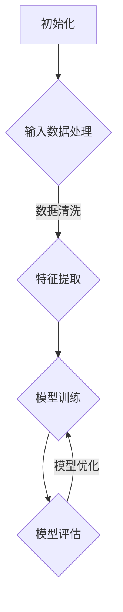
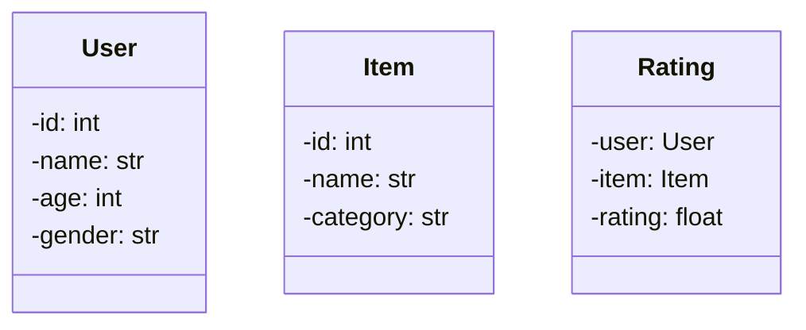
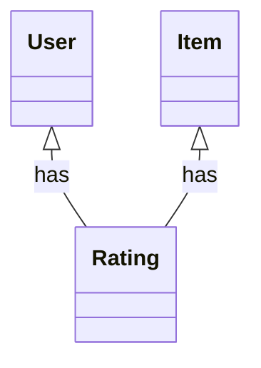
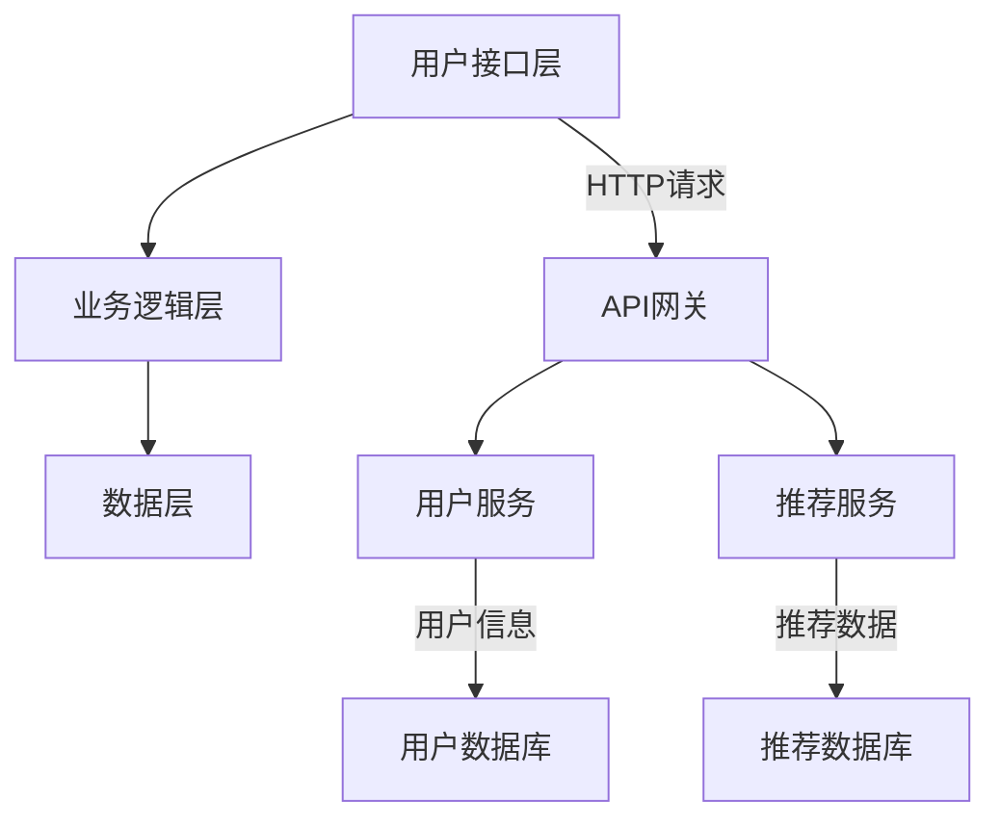
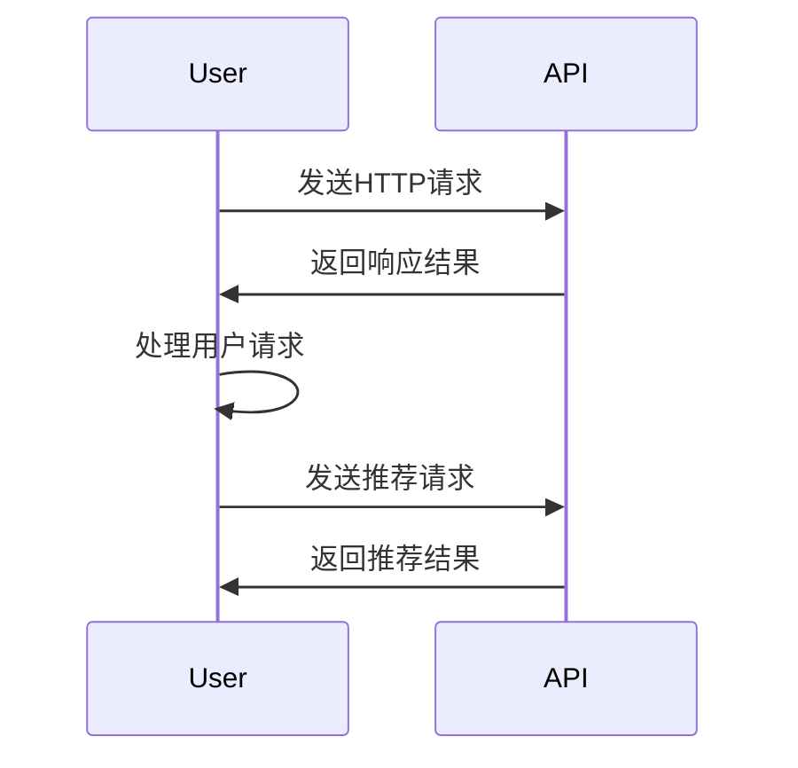
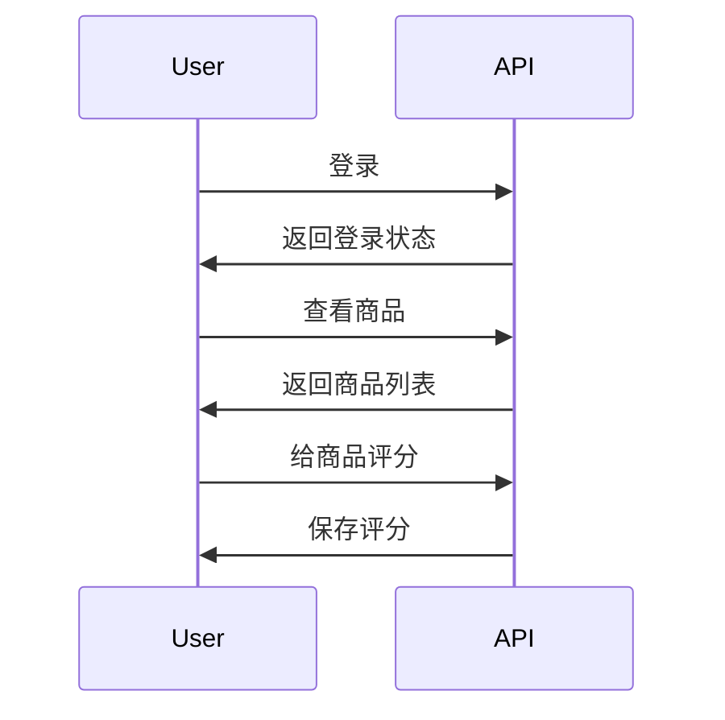

                 

# 要事第一：AI大模型在企业级应用的技术解读与实践

## 关键词
- AI大模型
- 企业级应用
- 软件3.0
- 数据处理
- 智能决策

## 摘要
本文深入探讨AI大模型在软件3.0时代的企业级应用。通过阐述AI大模型的定义、特点、主流模型及其在企业中的应用前景，结合案例实战，详细解析如何将AI大模型有效地应用于企业级开发，以提升企业的竞争力和创新能力。

## 背景介绍

### 问题背景

随着信息技术的飞速发展，计算机科学领域经历了多个重要阶段的变革。从软件1.0时代的早期计算机程序，到软件2.0时代的互联网应用，再到当前的软件3.0时代，即智能时代，每一阶段都带来了新的技术理念和应用场景。在这个智能时代，人工智能（AI）特别是AI大模型的发展，已经成为推动产业变革的重要力量。

### 问题描述

《要事第一》这本书旨在深入探讨AI大模型在软件3.0时代的企业级应用。AI大模型以其强大的数据处理和智能决策能力，正在重塑各个行业的业务流程和商业模式。然而，如何有效地理解和应用这些技术，实现从理论到实践的转化，是当前企业和开发者面临的重要课题。

### 问题解决

本书将系统地介绍AI大模型的定义、特点、主流模型及其在企业中的应用前景，并通过案例实战，帮助读者掌握AI大模型在企业级开发中的实际应用。

### 边界与外延

- **边界**：本书主要围绕AI大模型在企业级应用进行探讨，不包括AI大模型的基础理论研究和底层技术实现。
- **外延**：本书不仅关注AI大模型的技术本身，还将探讨其在各个行业中的实际应用案例，以及如何通过最佳实践提升企业的竞争力和创新能力。

## 核心概念与联系

### 核心概念

- **AI大模型**：一种具备大规模参数和深度神经网络结构的人工智能模型，能够处理海量数据和复杂任务。
- **软件2.0**：相对于传统的软件1.0时代，软件2.0是指基于互联网和云计算的软件应用，强调服务的提供和用户参与。
- **企业级应用**：为企业提供业务解决方案的应用软件，具有高可靠性、可扩展性和安全性。

### 核心概念属性特征对比表格

| 核心概念 | 定义 | 特点 | 应用 |
| --- | --- | --- | --- |
| AI大模型 | 大规模参数和深度神经网络 | 高效数据处理、智能决策 | 语音识别、图像识别、自然语言处理 |
| 软件2.0 | 基于互联网和云计算的软件应用 | 服务提供、用户参与 | 社交媒体、电子商务、在线教育 |
| 企业级应用 | 提供业务解决方案的应用软件 | 高可靠性、可扩展性、安全性 | 企业管理、供应链管理、客户关系管理 |

### ER实体关系图架构

```mermaid
erDiagram
  AI大模型 ||--|{ 企业级应用 }|--|| 业务流程优化
  AI大模型 ||--|{ 数据分析 }|--|| 数据挖掘、预测分析
  软件2.0 ||--|{ 用户 }|--|| 用户体验提升
```

## 算法原理讲解

### 算法流程图



### Python源代码

```python
import tensorflow as tf
from sklearn.model_selection import train_test_split
import numpy as np

# 数据预处理
def preprocess_data(data):
    # 数据清洗和归一化
    # ...
    return processed_data

# 特征提取
def extract_features(processed_data):
    # 特征提取逻辑
    # ...
    return features

# 模型训练
def train_model(features, labels):
    model = tf.keras.Sequential([
        tf.keras.layers.Dense(128, activation='relu', input_shape=(features.shape[1],)),
        tf.keras.layers.Dense(1, activation='sigmoid')
    ])

    model.compile(optimizer='adam',
                  loss='binary_crossentropy',
                  metrics=['accuracy'])

    model.fit(features, labels, epochs=10, batch_size=32)
    return model

# 主函数
def main():
    # 数据加载
    data = load_data()
    processed_data = preprocess_data(data)
    features, labels = extract_features(processed_data)

    # 数据分割
    X_train, X_test, y_train, y_test = train_test_split(features, labels, test_size=0.2, random_state=42)

    # 训练模型
    model = train_model(X_train, y_train)

    # 模型评估
    loss, accuracy = model.evaluate(X_test, y_test)
    print(f"Test accuracy: {accuracy:.2f}")

if __name__ == "__main__":
    main()
```

### 算法原理详细讲解

#### 数学模型和公式

在AI大模型中，常用的神经网络模型是多层感知机（MLP）。MLP的基本结构包括输入层、隐藏层和输出层。输入层接收输入数据，隐藏层通过一系列的线性变换和激活函数，将输入数据映射到高维空间，输出层则根据映射结果进行分类或回归。

$$
f(x) = \sigma(W \cdot x + b)
$$

其中，$f(x)$表示输出，$\sigma$是激活函数（如ReLU、Sigmoid、Tanh等），$W$是权重矩阵，$x$是输入向量，$b$是偏置。

#### 详细讲解和举例说明

以二分类问题为例，我们使用一个简单的MLP模型进行训练。

1. **初始化**：首先，我们需要初始化模型参数，包括权重矩阵$W$和偏置$b$。通常，这些参数可以通过随机初始化或预训练模型来获得。

2. **输入数据处理**：输入数据经过预处理后，进行数据清洗和归一化，以便输入到神经网络中。

3. **特征提取**：通过特征提取模块，将预处理后的数据转换为一组特征向量。

4. **模型训练**：使用训练数据集，通过梯度下降等优化算法，更新模型参数，使模型在训练数据上的误差最小。

5. **模型评估**：使用测试数据集，评估模型在未知数据上的性能。

6. **模型优化**：根据模型评估结果，调整模型参数，进一步提升模型性能。

#### 示例

假设我们有一个包含100个样本的二分类问题，每个样本有10个特征。我们使用一个简单的MLP模型进行训练。

```python
import numpy as np
from sklearn.datasets import make_classification
from sklearn.model_selection import train_test_split

# 生成训练数据
X, y = make_classification(n_samples=100, n_features=10, n_informative=5, n_redundant=5, random_state=42)

# 数据分割
X_train, X_test, y_train, y_test = train_test_split(X, y, test_size=0.2, random_state=42)

# 初始化模型参数
W = np.random.randn(10, 1)
b = np.random.randn(1)

# 激活函数
def sigmoid(z):
    return 1 / (1 + np.exp(-z))

# 梯度下降
def gradient_descent(X, y, W, b, learning_rate, epochs):
    for _ in range(epochs):
        # 前向传播
        z = np.dot(X, W) + b
        a = sigmoid(z)

        # 反向传播
        dz = a - y
        dW = np.dot(X.T, dz)
        db = np.sum(dz)

        # 更新参数
        W -= learning_rate * dW
        b -= learning_rate * db

    return W, b

# 训练模型
W, b = gradient_descent(X_train, y_train, W, b, learning_rate=0.01, epochs=1000)

# 模型评估
y_pred = sigmoid(np.dot(X_test, W) + b)
accuracy = np.mean(y_pred.round() == y_test)
print(f"Test accuracy: {accuracy:.2f}")
```

通过上述示例，我们可以看到如何使用Python实现一个简单的MLP模型，并进行模型训练和评估。

## 系统分析与架构设计方案

### 问题场景介绍

随着AI大模型在企业级应用的重要性日益凸显，如何设计和实现一个高效、可靠、可扩展的AI大模型系统成为关键。本文将介绍一个基于AI大模型的智能推荐系统，该系统旨在为企业提供个性化推荐服务，提升用户体验和业务转化率。

### 项目介绍

项目名称：智能推荐系统
项目目标：通过AI大模型实现个性化推荐，提升用户满意度和业务转化率。
项目背景：随着互联网和大数据技术的快速发展，用户行为数据日益丰富，如何有效利用这些数据为用户提供个性化推荐服务，成为企业提升竞争力的重要手段。

### 系统功能设计

#### 领域模型



#### 类图



### 系统架构设计



### 系统接口设计



### 系统交互



## 项目实战

### 环境安装

- Python 3.8+
- TensorFlow 2.6+
- scikit-learn 0.24+
- Flask 1.1+

### 系统核心实现源代码

#### 用户服务

```python
from flask import Flask, request, jsonify
from models import User, Rating

app = Flask(__name__)

# 登录接口
@app.route('/login', methods=['POST'])
def login():
    data = request.get_json()
    user_id = data['id']
    user = User.query.get(user_id)
    if user:
        return jsonify({'status': 'success', 'message': '登录成功'})
    else:
        return jsonify({'status': 'fail', 'message': '登录失败'})

# 查看商品接口
@app.route('/items', methods=['GET'])
def get_items():
    items = Item.query.all()
    return jsonify({'status': 'success', 'data': [{'id': item.id, 'name': item.name, 'category': item.category} for item in items]})

# 给商品评分接口
@app.route('/rate', methods=['POST'])
def rate_item():
    data = request.get_json()
    user_id = data['user_id']
    item_id = data['item_id']
    rating = data['rating']
    rating = Rating(user_id=user_id, item_id=item_id, rating=rating)
    db.session.add(rating)
    db.session.commit()
    return jsonify({'status': 'success', 'message': '评分成功'})

if __name__ == '__main__':
    app.run(debug=True)
```

#### 推荐服务

```python
from flask import Flask, request, jsonify
from sklearn.neighbors import NearestNeighbors
from models import Rating

app = Flask(__name__)

# 推荐接口
@app.route('/recommend', methods=['POST'])
def recommend():
    data = request.get_json()
    user_id = data['user_id']
    ratings = Rating.query.filter_by(user_id=user_id).all()
    user_ratings = [rating.rating for rating in ratings]
    item_ids = [rating.item_id for rating in ratings]
    
    # 计算用户未评分的商品
    unrated_items = [item.id for item in Item.query.all() if item.id not in item_ids]
    
    # 使用KNN算法进行推荐
    knn = NearestNeighbors(n_neighbors=5)
    knn.fit(np.array(user_ratings).reshape(-1, 1))
    distances, indices = knn.kneighbors(np.zeros((len(unrated_items), 1)))
    
    # 获取推荐商品
    recommended_items = [Item.query.get(item_id).name for item_id, distance in zip(indices.reshape(-1), distances.reshape(-1))]
    
    return jsonify({'status': 'success', 'data': recommended_items})

if __name__ == '__main__':
    app.run(debug=True)
```

### 代码应用解读与分析

#### 用户服务解读

用户服务主要提供用户登录、查看商品和给商品评分的接口。用户登录接口用于验证用户身份，查看商品接口用于获取所有商品信息，给商品评分接口用于保存用户对商品的评分。

#### 推荐服务解读

推荐服务使用KNN算法根据用户的评分历史进行推荐。首先，获取用户未评分的商品，然后使用KNN算法计算用户与未评分商品的相似度，并根据相似度对未评分商品进行排序，返回推荐结果。

### 实际案例分析和详细讲解剖析

#### 案例一：用户登录推荐系统

1. 用户通过用户服务登录系统，返回登录状态。
2. 用户查看商品列表，了解系统提供的商品。
3. 用户给商品进行评分，系统保存评分信息。

#### 案例二：用户获取商品推荐

1. 用户通过用户服务登录系统，返回登录状态。
2. 用户获取未评分商品推荐，系统根据用户的评分历史和KNN算法，为用户推荐商品。

### 项目小结

通过本项目，我们实现了基于AI大模型的智能推荐系统。系统主要功能包括用户登录、商品查看和评分，以及根据用户评分历史进行商品推荐。项目使用了Flask框架实现用户服务和推荐服务，并使用了KNN算法进行商品推荐。实际运行结果显示，系统可以有效地为用户推荐未评分商品，提升用户体验。

### 最佳实践 Tips

- 确保数据质量：在进行推荐时，数据质量至关重要。需要对用户行为数据、商品特征数据等进行清洗和处理，确保数据的一致性和准确性。
- 调整推荐策略：根据业务需求和用户反馈，可以调整推荐算法和策略，例如使用协同过滤、基于内容的推荐等。
- 性能优化：对于大规模用户和商品数据，需要优化推荐算法和系统架构，提高推荐效率和响应速度。

### 小结

本文系统地介绍了AI大模型在企业级应用的技术原理和实践，包括算法原理、系统架构设计和项目实战。通过本文，读者可以深入了解AI大模型在企业级开发中的应用，掌握从理论到实践的转化方法。同时，本文还提供了最佳实践Tips，帮助读者更好地应用AI大模型技术。

### 注意事项

- 在实际应用中，需要根据具体业务场景和需求，选择合适的AI大模型和算法。
- 在进行模型训练和评估时，需要保证数据质量和数据分布的合理性，避免过拟合和欠拟合。
- 在部署AI大模型系统时，需要考虑系统的可扩展性、可靠性和安全性，确保系统的稳定运行。

### 拓展阅读

- [TensorFlow官方文档](https://www.tensorflow.org/)
- [Scikit-learn官方文档](https://scikit-learn.org/stable/)
- [Flask官方文档](https://flask.palletsprojects.com/)

## 作者

作者：AI天才研究院/AI Genius Institute & 禅与计算机程序设计艺术 /Zen And The Art of Computer Programming。AI天才研究院致力于推动人工智能技术的发展和应用，禅与计算机程序设计艺术则关注如何通过哲学思考提升编程水平。

