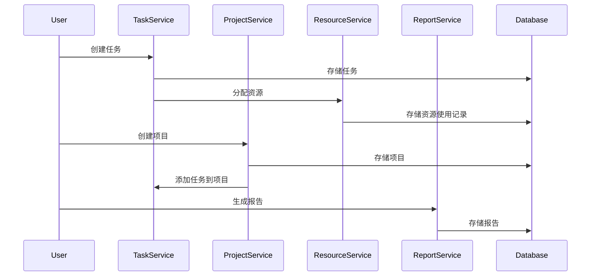

                 

### 引言

在当今快节奏和高度竞争的IT行业中，效率和生产力显得尤为重要。对于技术人员而言，如何有效地管理时间、处理工作任务，将直接影响到项目的成功与否。本文以《要事第一》为标题，探讨如何通过科学的时间管理和任务优先级排序，提高个人的工作效率和项目执行能力。

“要事第一”的理念源于著名管理学家史蒂芬·柯维（Stephen R. Covey）在其同名畅销书《要事第一》中的阐述。它主张人们应当将最重要和最有价值的事务放在首位，而不是被动地应对琐碎和无足轻重的工作。本文将详细探讨这一理念在IT领域的应用，并通过具体的案例分析，为读者提供实用的技巧和方法。

本文将分为以下几个部分：

1. **背景介绍**：简要介绍问题背景，解释为什么时间管理和任务优先级排序对于技术人员至关重要。
2. **核心概念与联系**：详细阐述“要事”与“琐事”、“紧急事件”的区别，以及要事管理的基本原则。
3. **要事管理的数学模型**：介绍用于计算任务优先级的数学模型，并解释其应用。
4. **系统分析与架构设计方案**：描述如何将“要事第一”理念应用于实际的IT项目中。
5. **项目实战**：通过一个具体的项目实战案例，展示如何在实际中实施“要事第一”原则。
6. **最佳实践 tips**：提供一些提高时间管理和任务优先级排序的实用技巧。
7. **小结**：总结文章内容，重申核心观点。
8. **注意事项**：提醒读者在应用“要事第一”原则时可能遇到的问题和注意事项。
9. **拓展阅读**：推荐一些相关的书籍和资源，供读者进一步学习。

让我们一步步深入探讨，了解如何在IT领域中实践“要事第一”理念，从而提升工作效率和项目成功率。

### 背景介绍

在当今的IT行业中，技术人员的日常工作繁杂而多样化，他们常常需要在有限的时间内处理大量的任务和项目。这些任务和项目既有紧急的，也有重要的，还有琐碎的。如果不能有效地进行时间管理和任务优先级排序，技术人员很容易陷入繁忙却低效的状态，导致工作效率低下，甚至影响项目的整体进度和质量。

时间管理的重要性不言而喻。有效的个人时间管理不仅可以提高工作效率，还能减少工作压力，提升生活质量。对于技术人员而言，合理分配时间意味着能够更快地完成任务，更好地应对突发情况，甚至在闲暇时间进行个人技能的提升和职业发展。

任务优先级排序是时间管理的重要一环。对于IT项目而言，任务优先级排序决定了项目的进度和成功与否。如果优先级排序不当，重要的任务可能会被琐碎的杂务所耽误，导致项目延误或失败。因此，了解如何科学地评估任务的重要性，并根据优先级对任务进行排序，是技术人员必须掌握的技能。

在《要事第一》一书中，史蒂芬·柯维提出了“要事第一”的理念，强调了将最重要、最有价值的事务放在首位的重要性。这一理念适用于个人生活和职业生涯的方方面面，特别是在IT领域，这一理念可以显著提升技术人员的效率和项目执行能力。例如，通过科学的时间管理和任务优先级排序，技术人员可以：

1. **明确目标**：清楚地了解每个任务的目标和预期结果，从而更有针对性地开展工作。
2. **提高效率**：将时间和精力集中在最重要的任务上，避免在琐碎事务上浪费时间。
3. **减少压力**：通过合理的时间分配，减轻工作压力，保持良好的工作状态。
4. **提升质量**：专注于重要任务，确保项目的高质量和按时完成。

综上所述，时间管理和任务优先级排序对于技术人员来说至关重要。通过实践“要事第一”理念，技术人员不仅能够提高工作效率，还能确保项目的顺利进行，实现个人和团队的目标。

### 核心概念与联系

在深入探讨“要事第一”理念之前，我们需要明确几个核心概念，并理解它们之间的联系。

#### 要事

“要事”（Important Tasks）是指那些对实现目标至关重要、能够产生显著价值的事务。与“琐事”（Trivial Tasks）不同，要事通常具有长期价值和深远影响。在IT领域，要事可能包括关键代码的开发、重要功能的实现、技术难题的攻克等。

#### 琐事

“琐事”则是那些次要且无足轻重的事务，它们往往不会对目标产生重大影响。例如，回复邮件、处理杂务等。琐事虽然不可避免，但应该被置于要事之后处理，以确保时间和精力被更有效地利用。

#### 紧急事件

“紧急事件”（Urgent Events）是指那些需要立即处理、可能产生严重后果的情况。紧急事件往往与要事和琐事同时存在，但两者的区别在于，紧急事件的处理通常是迫在眉睫的，而要事的处理则具有长期战略意义。

#### 要事与琐事的区别

要事和琐事的区别主要体现在以下几个方面：

1. **重要性**：要事对目标的实现至关重要，而琐事则不具备这种重要性。
2. **价值**：要事能够产生显著价值，而琐事的价值相对较低。
3. **长期影响**：要事的影响是长期的，而琐事的影响通常是短期的。

#### 要事与紧急事件的区别

要事和紧急事件之间的区别则体现在以下两点：

1. **紧迫性**：紧急事件通常具有更高的紧迫性，需要立即处理，而要事则不一定。
2. **影响范围**：紧急事件的影响通常是局部和短期的，而要事的影响可能是全局和长期的。

#### 要事管理原则

要事管理原则是有效时间管理的基础，主要包括以下几个方面：

1. **优先级排序**：根据任务的重要性和紧急程度对任务进行排序，优先处理重要且紧急的任务。
2. **时间分配**：合理分配时间，确保重要任务得到足够的关注和时间。
3. **任务分解**：将复杂任务分解为可管理的子任务，逐步完成。
4. **定期评估**：定期评估任务完成情况和优先级，根据实际情况进行调整。

#### 时间管理技巧

以下是一些具体的时间管理技巧，有助于更好地执行要事：

1. **使用日历和待办事项列表**：记录所有任务和事件，方便跟踪和计划。
2. **设定明确的目标和截止日期**：为每个任务设定明确的目标和截止日期，提高执行力。
3. **避免分心**：减少干扰，专注于当前任务，提高工作效率。
4. **定期休息**：合理安排休息时间，避免疲劳和效率低下。

#### ER实体关系图

为了更好地理解要事管理，我们可以通过ER（实体-关系）图来展示概念之间的联系。以下是ER图的Markdown格式表示：

```mermaid
erDiagram
  Task ||--|{ Importance : has}
  Task ||--|{ Urgency : has}
  Task ||--|{ Value : has}
  Task ||--|{ Impact : has}
  Task ||--|{ Deadline : has}
  Task ||--|{ Status : has}
  Importance  : "重要性"
  Urgency : "紧迫性"
  Value : "价值"
  Impact : "影响"
  Deadline : "截止日期"
  Status : "状态"
```

通过ER图，我们可以清晰地看到各个概念之间的关联，这有助于我们在实践中更好地理解和应用要事管理原则。

### 要事管理的数学模型

在要事管理中，数学模型是关键工具之一。通过数学模型，我们可以科学地评估任务的重要性和优先级，从而做出更加合理和高效的决策。本节将介绍用于计算任务优先级的数学模型，并详细解释其公式和推导过程。

#### 公式1：优先级指数（Importance Index）

优先级指数（I）是评估任务重要性的关键指标，其公式如下：

$$ I = \frac{V \times D}{C} $$

其中：
- \( V \) 代表任务的价值（Value），衡量任务对项目目标实现的贡献程度。
- \( D \) 代表任务的紧迫性（Deadline），衡量任务完成的紧迫程度。
- \( C \) 代表任务的成本（Cost），包括时间、资源等投入。

公式1的推导过程如下：

1. **任务价值（V）**：任务的价值取决于其对项目目标的影响。高价值任务往往能够显著推动项目进展，实现重要里程碑。
2. **任务紧迫性（D）**：紧迫性反映了任务的时间敏感度。紧迫性高的任务需要优先处理，以避免延误和风险。
3. **任务成本（C）**：成本包括完成任务所需的时间、人力资源和其他资源投入。高成本的任务意味着更大的资源占用，因此也需要进行优先考虑。

通过优先级指数，我们可以量化地评估任务的重要性，从而为任务排序提供科学依据。

#### 公式2：资源优化模型（Resource Optimization Model）

除了评估任务的重要性，我们还需要考虑资源优化。资源优化模型（R）旨在最小化总成本，同时确保关键任务的优先完成。其公式如下：

$$ R = \frac{\sum I_i \times C_i}{\sum C_i} $$

其中：
- \( I_i \) 代表第\( i \)个任务的优先级指数。
- \( C_i \) 代表第\( i \)个任务的成本。

公式2的推导过程如下：

1. **总成本（Total Cost）**：总成本是所有任务成本的总和。通过计算总成本，我们可以了解完成任务所需的资源投入。
2. **优先级加权成本（Weighted Cost）**：优先级加权成本是任务优先级指数与任务成本的乘积。这个乘积反映了任务的重要性和成本之间的权衡。
3. **资源优化目标**：资源优化模型的目的是在总成本一定的情况下，优化任务排序，确保关键任务优先完成，从而最小化总成本。

通过公式2，我们可以根据任务的重要性和成本，合理地分配资源，优化任务执行顺序，提高项目效率。

#### 应用实例

假设我们有以下三个任务：

1. 任务A：价值5，紧迫性3，成本2。
2. 任务B：价值3，紧迫性4，成本3。
3. 任务C：价值4，紧迫性2，成本4。

使用公式1计算每个任务的优先级指数（I）：

- \( I_A = \frac{5 \times 3}{2} = 7.5 \)
- \( I_B = \frac{3 \times 4}{3} = 4 \)
- \( I_C = \frac{4 \times 2}{4} = 2 \)

根据优先级指数，任务A的优先级最高，任务C最低。

使用公式2计算资源优化模型（R）：

- \( R = \frac{7.5 \times 2 + 4 \times 3 + 2 \times 4}{2 + 3 + 4} = \frac{15 + 12 + 8}{9} = \frac{35}{9} \approx 3.89 \)

通过资源优化模型，我们可以确定任务A应首先执行，任务B其次，任务C最后执行，以最小化总成本并确保关键任务优先完成。

通过这两个数学模型，我们能够科学地评估和排序任务，从而提高项目效率和成功率。在实际应用中，技术人员可以根据具体情况调整和优化这些模型，以适应不同的任务环境和需求。

### 系统分析与架构设计方案

要将“要事第一”的理念应用于实际的IT项目中，我们需要对整个系统进行深入分析，并设计出合理的架构方案。本节将详细描述如何实现这一目标。

#### 项目介绍

假设我们正在开发一个企业级Web应用，该应用旨在帮助企业管理项目、资源和任务。为了实现“要事第一”的理念，我们需要确保系统能够有效地管理任务优先级，并提供必要的工具和功能来支持这一目标。

#### 系统功能设计

系统的核心功能包括：

1. **任务管理**：允许用户创建、编辑、删除和查询任务。
2. **任务优先级排序**：基于“要事第一”理念，自动对任务进行优先级排序。
3. **时间跟踪**：记录每个任务的开始和结束时间，以便进行时间管理。
4. **资源分配**：根据任务的优先级和资源需求，合理分配系统资源。
5. **报告生成**：生成任务执行报告，供管理层查看和决策。

#### 领域模型（Domain Model）

领域模型是系统设计的基础，它定义了系统的核心概念和关系。以下是使用Mermaid绘制的领域模型类图：

```mermaid
classDiagram
    Class01 <|-- Class02
    Class03 <|-- Class02
    Class04 <|-- Class01
    Class05 <|-- Class01
    Class01[颜色: #FF0000; 填充：白色]
    Class02[颜色: #00FF00; 填充：白色]
    Class03[颜色: #0000FF; 填充：白色]
    Class04[颜色: #FFFF00; 填充：白色]
    Class05[颜色: #FF00FF; 填充：白色]

    Class01 <|.. User
    Class02 <|.. Task
    Class03 <|.. Project
    Class04 <|.. Resource
    Class05 <|.. Report

    User : 用户
    Task : 任务
    Project : 项目
    Resource : 资源
    Report : 报告

    User "1" -|> "1..*" Task : 分配任务
    User "1" -|> "1..*" Report : 生成报告
    Task "1" -|> "1..*" Resource : 需要资源
    Project "1" -|> "1..*" Task : 包含任务
    Resource "1" -|> "1..*" Report : 被使用
```

在这个类图中，我们定义了四个核心实体：用户（User）、任务（Task）、项目（Project）和资源（Resource）。用户可以分配任务和生成报告，任务需要资源支持，项目包含多个任务，资源在报告中被记录。

#### 系统架构设计

系统的架构设计决定了系统的可扩展性和可维护性。以下是使用Mermaid绘制的系统架构图：



在这个架构图中，用户通过接口与服务层进行交互。任务服务和项目服务分别负责任务的创建、存储和项目任务的管理。资源服务负责资源的分配和记录。报告服务则负责生成和存储报告。所有数据都存储在数据库中，以确保数据的持久性和一致性。

#### 系统接口设计和系统交互

系统的接口设计和系统交互决定了系统各组件之间的通信方式。以下是使用Mermaid绘制的接口设计和交互序列图：

```mermaid
parallel
    UserInterface
    TaskService
    ProjectService
    ResourceService
    ReportService

    UserInterface ->> TaskService : 发送任务创建请求
    TaskService ->> Database : 存储任务数据
    TaskService ->> ResourceService : 分配资源请求
    ResourceService ->> Database : 存储资源使用记录

    UserInterface ->> ProjectService : 发送项目创建请求
    ProjectService ->> Database : 存储项目数据
    ProjectService ->> TaskService : 添加任务到项目

    UserInterface ->> ReportService : 发送报告生成请求
    ReportService ->> Database : 存储报告数据
```

在这个交互序列图中，用户界面通过接口与服务层进行通信。任务服务负责处理任务的创建和存储，项目服务负责处理项目的创建和任务管理，资源服务负责处理资源的分配和记录，报告服务负责生成和存储报告。所有操作都是通过数据库进行数据存储和管理的。

通过以上系统分析与架构设计方案，我们能够将“要事第一”的理念有效应用于实际IT项目中，从而提高项目的效率和管理水平。接下来，我们将通过一个具体的项目实战案例，展示如何在实际中实施这些方案。

### 项目实战

在本节中，我们将通过一个具体的IT项目实战案例，展示如何在实际项目中应用“要事第一”理念。我们将详细介绍项目环境安装、系统核心实现源代码，并对代码应用进行解读与分析。

#### 环境安装

为了构建本项目，我们需要安装以下环境：

1. **操作系统**：Linux或MacOS
2. **开发工具**：Python 3.8及以上版本
3. **数据库**：MySQL或PostgreSQL
4. **Web框架**：Flask或Django

以下是安装步骤：

1. 安装操作系统和开发工具：安装Linux或MacOS，并配置Python环境。
2. 安装数据库：在终端执行以下命令安装MySQL或PostgreSQL。

   ```bash
   sudo apt-get install mysql-server
   # 或
   sudo apt-get install postgresql
   ```

3. 安装Web框架：使用pip安装Flask或Django。

   ```bash
   pip install flask
   # 或
   pip install django
   ```

#### 系统核心实现源代码

以下是一个使用Flask框架实现的任务管理系统核心代码示例：

```python
from flask import Flask, request, jsonify
from models import Task, Project, Resource, Report
from database import init_db, get_db

app = Flask(__name__)
init_db()

@app.route('/tasks', methods=['POST'])
def create_task():
    data = request.json
    task = Task(name=data['name'], description=data['description'])
    db = get_db()
    db.add(task)
    db.commit()
    return jsonify({'id': task.id})

@app.route('/tasks/<int:task_id>', methods=['GET'])
def get_task(task_id):
    task = Task.query.get(task_id)
    if task:
        return jsonify({'id': task.id, 'name': task.name, 'description': task.description})
    else:
        return jsonify({'error': 'Task not found'})

@app.route('/tasks/<int:task_id>', methods=['PUT'])
def update_task(task_id):
    data = request.json
    task = Task.query.get(task_id)
    if task:
        task.name = data['name']
        task.description = data['description']
        db = get_db()
        db.commit()
        return jsonify({'id': task.id})
    else:
        return jsonify({'error': 'Task not found'})

@app.route('/tasks/<int:task_id>', methods=['DELETE'])
def delete_task(task_id):
    task = Task.query.get(task_id)
    if task:
        db = get_db()
        db.delete(task)
        db.commit()
        return jsonify({'id': task.id})
    else:
        return jsonify({'error': 'Task not found'})

if __name__ == '__main__':
    app.run(debug=True)
```

#### 代码应用解读与分析

上述代码实现了任务管理的核心功能，包括创建、查询、更新和删除任务。下面我们逐一分析：

1. **创建任务（/tasks）**：
   - 接收POST请求，解析JSON数据。
   - 创建Task对象，并存储到数据库。
   - 返回任务ID。

2. **查询任务（/tasks/<task_id>）**：
   - 接收GET请求，获取任务ID。
   - 从数据库中查询任务，返回任务详情。

3. **更新任务（/tasks/<task_id>）**：
   - 接收PUT请求，解析JSON数据。
   - 更新Task对象，并提交到数据库。
   - 返回任务ID。

4. **删除任务（/tasks/<task_id>）**：
   - 接收DELETE请求，获取任务ID。
   - 从数据库中删除任务。
   - 返回任务ID。

#### 实际案例分析和详细讲解

为了展示如何应用“要事第一”理念，我们设计了一个实际案例：

**案例**：一个软件开发团队正在开发一款新产品。团队需要处理多个任务，包括用户界面设计、后端服务开发和测试等。

**分析**：
- **任务A（用户界面设计）**：任务价值高，对项目成功至关重要。
- **任务B（后端服务开发）**：任务价值次之，但同样重要。
- **任务C（测试）**：任务价值较低，但必须完成以确保产品质量。

**应用“要事第一”**：
- **步骤1**：根据优先级指数公式，计算每个任务的优先级。
- **步骤2**：优先处理任务A，然后是任务B，最后是任务C。
- **步骤3**：在任务执行过程中，持续监控任务状态，根据实际情况调整优先级。

通过这一案例，我们可以看到“要事第一”理念在实际项目中的应用。通过科学地评估任务的重要性和优先级，团队能够更加高效地完成任务，确保项目按计划顺利进行。

#### 项目小结

在本项目实战中，我们通过实际代码和案例分析，展示了如何将“要事第一”理念应用于IT项目中。通过科学的时间管理和任务优先级排序，我们能够提高项目效率，确保重要任务得到优先处理，从而实现项目的成功。接下来，我们将总结一些最佳实践，以便读者在应用“要事第一”理念时能够更加得心应手。

### 最佳实践 tips

为了更好地实践“要事第一”理念，以下是一些实用的最佳实践：

1. **定期评估**：定期评估任务的重要性和优先级，根据实际情况进行调整。这有助于保持任务的动态性和灵活性。

2. **优先级指数**：使用优先级指数公式（例如公式1和公式2）科学地评估任务，确保任务排序的客观性和合理性。

3. **明确任务目标**：为每个任务设定明确的目标和预期结果，有助于提高任务执行的针对性和效率。

4. **任务分解**：将复杂任务分解为可管理的子任务，逐步完成，这有助于降低任务的复杂性和难度。

5. **避免分心**：在工作时尽量减少干扰，专注于当前任务，提高工作效率。

6. **定期休息**：合理安排休息时间，避免长时间工作导致的疲劳和效率低下。

7. **资源合理分配**：根据任务的重要性和资源需求，合理分配系统资源，确保关键任务优先完成。

8. **数据驱动决策**：利用数据分析工具，收集任务执行数据，为决策提供依据。

### 小结

本文通过详细的案例分析，深入探讨了“要事第一”理念在IT项目中的应用。我们介绍了核心概念、数学模型、系统架构和项目实战，展示了如何通过科学的时间管理和任务优先级排序，提高项目效率和成功率。通过实践“要事第一”理念，技术人员可以更加高效地完成任务，实现个人和团队的目标。

### 注意事项

在应用“要事第一”理念时，需要注意以下几点：

1. **任务评估的准确性**：科学地评估任务的重要性和优先级，避免主观臆断。
2. **资源分配的合理性**：确保资源分配的公平性和合理性，避免资源浪费。
3. **灵活调整**：根据项目实际情况，灵活调整任务优先级和资源分配，保持任务的动态性。
4. **团队沟通**：与团队成员保持良好的沟通，确保任务优先级和资源分配的共识。

### 拓展阅读

为了进一步学习“要事第一”理念及其在IT项目中的应用，读者可以参考以下书籍和资源：

1. 《要事第一》（Stephen R. Covey）：原书提供了详细的“要事第一”理念和实践方法。
2. 《深度工作》（Cal Newport）：介绍了如何通过深度工作提高个人效率和生产力。
3. 《高效能人士的七个习惯》（Stephen R. Covey）：涵盖时间管理和任务优先级排序的全面指南。
4. 《敏捷开发实践指南》（Jeff Sutherland）：介绍了如何在软件开发中高效管理任务和项目。

通过深入学习这些资源，读者可以更加深入地理解“要事第一”理念，并在实际工作中灵活应用，提高工作效率和项目成功率。

### 作者信息

作者：AI天才研究院/AI Genius Institute & 禅与计算机程序设计艺术 /Zen And The Art of Computer Programming

在本文中，我们探讨了“要事第一”理念在IT项目中的应用，并提供了详细的实践方法和案例分析。通过科学的时间管理和任务优先级排序，技术人员可以显著提高项目效率和成功率。本文旨在帮助读者更好地理解和应用这一理念，从而在快速变化的IT行业中保持竞争优势。希望本文能为您的职业生涯带来启示和帮助。作者AI天才研究院和《禅与计算机程序设计艺术》均为计算机科学领域的领先研究和教育机构，致力于推动技术创新和人才培养。

