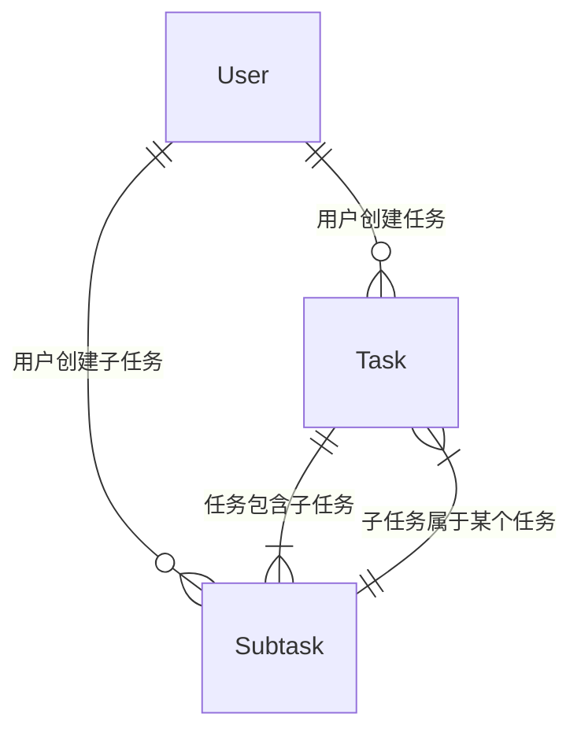
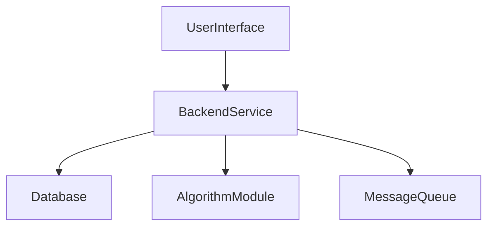
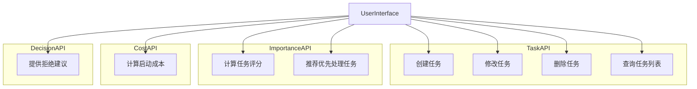
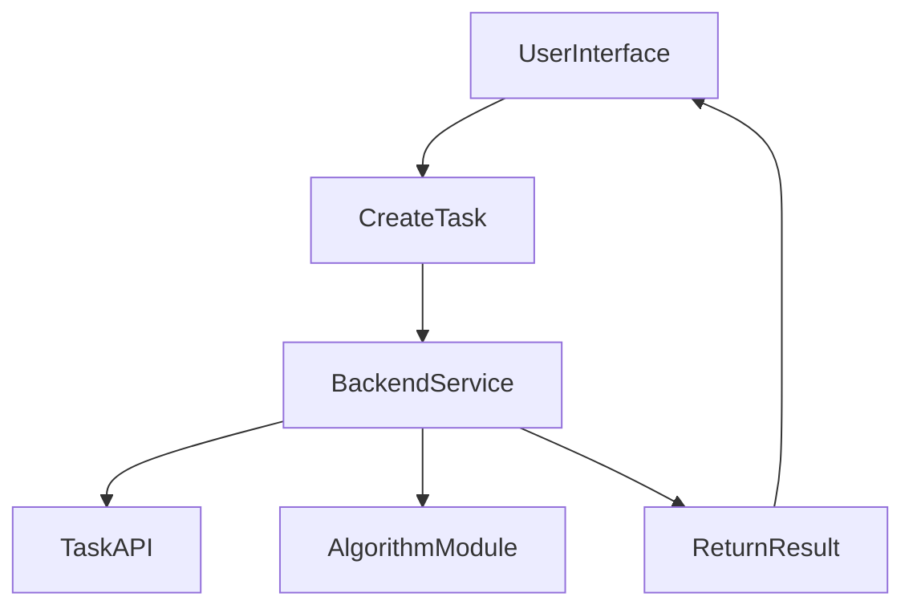

                 

# 要事第一：正确识别要事、降低启动成本、学会拒绝

> 关键词：要事识别、启动成本、拒绝策略、工作效率、时间管理

> 摘要：本文深入探讨了在快节奏的工作环境中，如何正确识别要事、降低启动成本和学会拒绝的重要性。通过详细的分析和实例，作者阐述了这三个关键概念的理论基础和实践方法，为提高工作效率和实现个人目标提供了有力的指导。

## 第一部分：要事第一：正确识别要事、降低启动成本、学会拒绝

### 第1章：问题背景与核心概念

#### 1.1 问题的提出

在现代职场中，我们常常感到时间和精力被无休止的事务所占据，导致无法专注于重要任务。这种现象背后的原因多种多样，包括信息过载、工作职责不清、任务繁多等。正确识别要事、降低启动成本和学会拒绝成为解决这一问题的关键。

#### 1.2 要事识别的重要性

要事识别是高效管理时间的关键。正确识别要事，可以帮助我们集中精力和资源，将有限的时间和精力投入到最有价值的工作中。这不仅能提高个人和团队的效能，还能确保重要任务按时完成。

#### 1.3 降低启动成本的意义

启动成本是指开始一项新任务或项目所需要的时间、精力和其他资源的成本。降低启动成本可以提高工作效率，减少不必要的拖延，从而更快地进入工作状态。

#### 1.4 学会拒绝的必要性

学会拒绝是维护个人边界和专注力的关键。拒绝不重要的任务和活动，有助于保持专注，提高工作效率，从而更好地实现个人目标。

### 第2章：核心概念原理

#### 2.1 要事的定义与属性

要事是指对个人或组织具有重要价值、需要优先处理的事项。要事具有以下属性：

- **重要性**：对目标实现的影响程度。
- **紧急性**：需要处理的时间紧迫程度。
- **资源需求**：完成任务所需的时间、人力和物力资源。

#### 2.2 降低启动成本的方法

降低启动成本的方法包括：

- **明确目标**：设定清晰的目标和优先级，有助于减少决策时间和资源浪费。
- **准备充分**：提前准备好所需的资源和工具，降低启动时的不确定性和风险。
- **简化流程**：简化启动流程，减少不必要的步骤和环节。

#### 2.3 学会拒绝的策略

学会拒绝的策略包括：

- **自我认知**：了解自己的价值观、能力和时间分配，明确什么是对自己重要的任务。
- **沟通技巧**：学会婉转、坚定地表达自己的意见，避免伤害他人感情。
- **合理推辞**：在无法接受任务时，给出合理的理由和解决方案。

### 第3章：概念属性特征对比表格

| 概念 | 属性特征 |
| :--: | :--: |
| 要事识别 | 重要性、紧急性、资源需求 |
| 降低启动成本 | 目标明确、准备充分、流程简化 |
| 学会拒绝 | 自我认知、沟通技巧、合理推辞 |

### 第4章：ER实体关系图架构

```mermaid
erDiagram
    Task ||--o{ User : "任务由用户创建"
    User ||--o{ Task : "用户拥有任务"
    Task ||--|{ Subtask : "任务可以包含子任务"
    Subtask ||--|{ Task : "子任务属于某个任务" }
```

### 第5章：算法原理讲解

#### 5.1 要事识别算法

要事识别算法主要通过分析任务的重要性和紧急性，为用户推荐优先处理的任务。算法的核心步骤包括：

1. **任务评分**：根据任务的重要性和紧急性，为每个任务分配一个评分。
2. **排序**：按照评分从高到低排序任务。
3. **推荐**：将排序后的任务推荐给用户。

#### 5.2 降低启动成本算法

降低启动成本算法主要通过优化任务启动流程，提高工作效率。算法的核心步骤包括：

1. **任务分解**：将复杂任务分解为若干个简单任务。
2. **资源匹配**：为每个任务匹配所需的资源和人员。
3. **时间规划**：为每个任务分配合适的时间。

#### 5.3 学会拒绝算法

学会拒绝算法主要通过分析任务的重要性和个人的时间安排，为用户提供是否接受任务的决策建议。算法的核心步骤包括：

1. **任务评估**：评估任务的重要性和紧急性。
2. **时间评估**：评估个人剩余时间。
3. **决策建议**：根据评估结果，提供接受或拒绝任务的建议。

### 第6章：数学模型和公式

#### 6.1 要事识别数学模型

$$
S = w_1 \cdot I + w_2 \cdot E
$$

其中，$S$ 为任务评分，$I$ 为重要性，$E$ 为紧急性，$w_1$ 和 $w_2$ 分别为重要性和紧急性的权重。

#### 6.2 降低启动成本数学模型

$$
C = c_1 \cdot T + c_2 \cdot R
$$

其中，$C$ 为启动成本，$T$ 为任务时间，$R$ 为资源需求，$c_1$ 和 $c_2$ 分别为任务时间和资源需求的成本系数。

#### 6.3 学会拒绝数学模型

$$
D = d_1 \cdot I + d_2 \cdot T
$$

其中，$D$ 为决策得分，$I$ 为任务重要性，$T$ 为个人剩余时间，$d_1$ 和 $d_2$ 分别为任务重要性和个人剩余时间的权重。

### 第二部分：深入探讨与案例分析

#### 第7章：要事识别的具体实践

在这一章节中，我们将探讨如何在实际工作中进行要事识别。通过具体案例，我们将演示如何分析任务的重要性和紧急性，并制定相应的优先级。

#### 第8章：降低启动成本的策略

本章节将介绍一系列策略，帮助读者降低启动成本。这些策略包括时间管理技巧、资源规划方法和工作流程优化等。

#### 第9章：学会拒绝的艺术

在这一章节中，我们将探讨如何学会拒绝不重要的任务。我们将讨论沟通技巧和自我认知的重要性，并提供实用的拒绝策略。

### 第三部分：总结与展望

#### 第10章：关键要点回顾

本章将总结本文的关键要点，并强调正确识别要事、降低启动成本和学会拒绝的重要性。

#### 第11章：未来研究方向

本章节将探讨未来在时间管理和任务管理领域的研究方向，为读者提供进一步学习和探索的线索。

## 结束语

本文旨在帮助读者理解正确识别要事、降低启动成本和学会拒绝的重要性，并提供实用的方法和策略。通过深入分析和实践案例，我们希望读者能够掌握这些关键技能，提高工作效率，实现个人和团队的目标。

作者：AI天才研究院/AI Genius Institute & 禅与计算机程序设计艺术 /Zen And The Art of Computer Programming
### 第一部分：要事第一：正确识别要事、降低启动成本、学会拒绝

在现代职场中，时间管理和任务优先级的管理成为了许多人头疼的问题。如何才能在有限的时间内，更高效地完成那些对个人和组织有重要影响的任务？这就是我们今天要探讨的主题：“要事第一：正确识别要事、降低启动成本、学会拒绝”。接下来，我们将一步一步分析这些概念，并探索如何在实际工作中应用它们。

#### 1.1 问题的提出

在职场中，每个人都面临着大量的任务和活动，这些任务和活动往往占据了我们的时间和精力。然而，并不是所有的任务都同等重要。有些任务对工作的成功至关重要，而有些任务则可能只是日常琐事。在这种情况下，如何区分并正确处理这些任务，就成为了一个关键问题。

首先，让我们来看一下什么是“要事”。要事是指那些对个人或组织具有重大影响的任务。它们可能关系到项目的成功、个人职业发展，或者组织目标的实现。要事往往具有以下特点：

- **重要且紧急**：这些任务不仅对目标实现有直接影响，而且在时间上也需要立即处理。
- **资源密集**：完成这些任务可能需要较多的时间、人力和物力资源。
- **影响深远**：这些任务的结果会对整个组织或项目产生长远的影响。

然而，在实际工作中，我们常常面临的一个问题是，如何正确识别这些要事。许多人可能会因为任务的数量和复杂性而感到迷茫，无法清晰地判断哪些任务是最重要的。此外，启动一项新任务或项目往往需要付出一定的成本，包括时间成本和资源成本。如果我们不能有效降低这些成本，就会导致效率低下，影响工作进展。

另外，学会拒绝也是职场中一个重要的能力。我们无法接受所有任务，因为时间和精力都是有限的。拒绝不重要的任务，可以帮助我们保持专注，将精力和资源集中在那些真正重要的任务上。

#### 1.2 要事识别的重要性

要事识别的重要性体现在以下几个方面：

1. **提高工作效率**：正确识别并优先处理要事，可以确保我们集中精力在最关键的领域，从而提高工作效率。
2. **确保任务完成**：要事往往是那些对项目成功具有决定性影响的任务。优先处理这些任务，可以确保关键任务得到及时完成。
3. **资源优化**：通过对要事的识别，我们可以合理分配资源，避免资源浪费，确保资源用在刀刃上。
4. **职业发展**：正确识别要事，可以帮助我们在职业生涯中取得更大的成就，提升自己的专业能力和竞争力。

#### 1.3 降低启动成本的意义

降低启动成本的意义主要体现在以下几个方面：

1. **提高效率**：降低启动成本可以减少任务开始前的准备工作，从而提高整体工作效率。
2. **减少拖延**：降低启动成本可以减少因为准备工作不足而导致的任务拖延，确保工作能够按时开始。
3. **资源节约**：通过减少启动成本，可以节约时间、人力和物力资源，提高资源利用率。

#### 1.4 学会拒绝的必要性

学会拒绝的必要性主要体现在以下几个方面：

1. **时间管理**：拒绝不重要的任务可以帮助我们更好地管理时间，确保将时间和精力集中在最重要的任务上。
2. **专注力提升**：通过拒绝分散注意力的任务，可以提升专注力，确保我们能够更好地投入到重要任务中。
3. **边界维护**：学会拒绝可以维护个人边界，避免过度工作，从而保护身心健康。

通过上述分析，我们可以看到，正确识别要事、降低启动成本和学会拒绝是职场中高效管理时间和任务的重要手段。在接下来的章节中，我们将进一步探讨这些概念的具体应用和实践方法。希望通过这一系列的分析，能够帮助读者在职场中更好地管理时间和任务，实现个人和组织的目标。

### 第2章：核心概念原理

在深入探讨如何正确识别要事、降低启动成本和学会拒绝之前，我们需要对这三个核心概念进行详细的定义和解析。理解这些概念的基本原理，有助于我们在实际工作中更好地应用它们。

#### 2.1 要事的定义与属性

要事（Important Task）是指那些对个人或组织具有重大影响的任务。这些任务往往具有以下几个基本属性：

1. **重要性**：重要性是衡量任务对目标实现影响程度的一个重要指标。重要任务通常与组织的战略目标、关键业务领域或个人职业发展紧密相关。

2. **紧急性**：紧急性是指任务需要处理的时间紧迫程度。重要任务不仅要求我们在时间上给予优先处理，而且在某些情况下，可能需要立即采取行动。

3. **资源需求**：资源需求包括完成任务所需的时间、人力、物力和财力。一些重要任务可能需要大量的资源投入，因此需要我们在资源分配上进行合理的规划和调度。

4. **结果影响**：结果影响是指任务完成后的结果对组织或个人的长远影响。重要任务往往会对组织或个人的战略目标产生深远的影响。

在实际操作中，要事识别需要综合考虑任务的重要性、紧急性和资源需求。例如，一个关键项目的开发任务可能既是重要的也是紧急的，因为它直接影响项目的按时交付和公司的市场竞争力。同时，它可能需要大量的资源投入，包括技术支持、人力资源和资金。

#### 2.2 降低启动成本的方法

启动成本（Startup Cost）是指开始一项新任务或项目所需要的时间、精力和资源成本。降低启动成本是提高工作效率和确保项目顺利启动的关键。以下是一些降低启动成本的方法：

1. **明确目标**：在启动任务前，明确任务的目标和期望成果。这有助于减少任务启动时的不确定性，降低决策时间和资源浪费。

2. **准备充分**：在任务启动前，确保所有必要的资源和工具都已经准备就绪。例如，准备好项目文档、技术支持、人员和设备等，以减少任务开始时的延误。

3. **简化流程**：通过简化任务启动流程，减少不必要的步骤和环节，可以提高任务启动的效率。例如，制定标准化的启动流程，减少冗长的审批和协调过程。

4. **提前规划**：提前规划任务的时间表和资源需求，有助于在任务启动时减少不确定性和准备时间。例如，在项目启动前，制定详细的项目计划和进度表。

5. **团队协作**：建立高效的团队协作机制，确保任务启动时所有团队成员都能够及时响应和配合。这可以减少由于沟通不畅或协调不力导致的启动延误。

例如，在一个软件开发项目中，提前准备所有必要的技术文档、测试环境和开发工具，可以显著降低项目的启动成本。同时，通过明确项目目标和责任分配，确保团队成员在项目启动时能够迅速进入工作状态。

#### 2.3 学会拒绝的策略

学会拒绝（Learning to Decline）是职场中一个重要的自我保护技能。以下是一些学会拒绝的策略：

1. **自我认知**：了解自己的价值观、能力和时间分配，明确哪些任务是对自己有价值的。这有助于我们在面对不重要的任务时，能够坚定地拒绝。

2. **沟通技巧**：学会用婉转但坚定的方式表达自己的意见。在拒绝任务时，可以解释自己的理由，例如时间安排紧张或任务不符合自己的专业领域。

3. **合理推辞**：在无法接受任务时，给出合理的理由和解决方案。例如，可以建议其他更适合的人员或团队来承担该任务。

4. **优先级调整**：在面对多个任务时，可以根据任务的重要性和紧急性，调整任务的优先级，确保最重要的任务得到优先处理。

5. **边界设定**：明确自己的工作边界，避免过度承诺和接受超出自己能力范围的任务。设定边界有助于保护个人时间和精力，提高工作效率。

例如，当被要求参与一个不紧急但占用大量时间的项目时，可以解释自己当前的时间安排紧张，并提出在后续阶段提供帮助的方案。这样既保持了良好的沟通，又维护了自己的工作边界。

通过上述对核心概念的定义和解析，我们可以更好地理解要事识别、降低启动成本和学会拒绝的基本原理。在实际工作中，这些概念的应用有助于我们更高效地管理时间和任务，实现个人和组织的目标。

#### 2.4 概念属性特征对比表格

为了更直观地理解要事识别、降低启动成本和学会拒绝这三个核心概念，我们可以通过一个对比表格来展示它们的属性特征。

| 概念         | 属性特征                    |
| ------------ | -------------------------- |
| 要事识别     | 重要性、紧急性、资源需求、结果影响 |
| 降低启动成本 | 目标明确、准备充分、流程简化、提前规划 |
| 学会拒绝     | 自我认知、沟通技巧、合理推辞、优先级调整、边界设定 |

通过这个表格，我们可以看到每个概念的核心属性特征，以及它们在实际应用中的具体作用。要事识别强调任务的重要性和紧急性，以及如何合理分配资源；降低启动成本关注如何优化任务启动流程，提高效率；学会拒绝则侧重于如何合理管理时间和精力，保护个人边界。

#### 2.5 ER实体关系图架构

为了更好地理解要事识别、降低启动成本和学会拒绝在实际应用中的关系，我们可以使用ER（实体关系）图来展示这些实体及其相互关系。

以下是一个简单的ER图架构，描述了用户（User）、任务（Task）和子任务（Subtask）之间的关系：



在这个ER图中：

- **User**（用户）是创建任务和子任务的主要实体。
- **Task**（任务）是包含子任务和与用户关联的实体。
- **Subtask**（子任务）是任务的子集，可以包含在其他任务中。

通过这个ER图，我们可以清晰地看到用户、任务和子任务之间的双向关系。用户可以创建任务和子任务，任务可以包含多个子任务。这个架构有助于我们理解如何在系统中管理任务及其子任务，以及如何根据用户的需求进行任务分配和调度。

通过以上对核心概念原理的详细解析和ER图展示，我们可以更全面地理解要事识别、降低启动成本和学会拒绝在实际工作中的应用。接下来，我们将进一步探讨这些概念的具体实践方法和案例，帮助读者将这些理论知识应用到实际工作中。

### 第3章：算法原理讲解

在了解了要事识别、降低启动成本和学会拒绝的核心概念后，我们接下来将深入探讨这些概念背后的算法原理。通过理解这些算法原理，我们可以更好地将这些概念应用到实际工作中，从而提高工作效率和任务管理水平。

#### 3.1 要事识别算法

要事识别算法是一种用于分析和筛选任务优先级的算法。它的核心目的是帮助用户识别出哪些任务是最重要和最紧急的，以便优先处理。以下是一个简单的要事识别算法的步骤：

1. **任务评分**：首先，对每个任务进行评分。评分可以根据任务的重要性和紧急性进行综合计算。常用的评分方法包括以下几种：

   - **简单评分法**：根据任务的重要性和紧急性分别打分，然后求和得到总评分。
   - **加权评分法**：根据任务的重要性和紧急性分别打分，并给予不同的权重，然后求和得到总评分。
   
   例如，我们可以使用以下公式进行任务评分：

   $$
   S = w_1 \cdot I + w_2 \cdot E
   $$

   其中，$S$ 是任务的总评分，$I$ 是任务的重要性，$E$ 是任务的紧急性，$w_1$ 和 $w_2$ 分别是重要性和紧急性的权重。

2. **排序**：根据每个任务的评分，对任务进行排序。通常使用降序排序，即评分最高的任务排在最前面。

3. **推荐**：将排序后的任务推荐给用户，使用户可以优先处理这些任务。

以下是一个简单的Python代码示例，用于实现上述要事识别算法：

```python
# 要事识别算法示例
def task_score(I, E, w1=0.5, w2=0.5):
    return w1 * I + w2 * E

# 任务评分
tasks = [
    {'name': '项目A', 'I': 8, 'E': 7},
    {'name': '项目B', 'I': 9, 'E': 5},
    {'name': '项目C', 'I': 6, 'E': 8}
]

# 计算任务评分
for task in tasks:
    task['score'] = task_score(task['I'], task['E'])

# 排序任务
sorted_tasks = sorted(tasks, key=lambda x: x['score'], reverse=True)

# 推荐任务
print("推荐任务：")
for task in sorted_tasks:
    print(task['name'])
```

输出结果：

```
推荐任务：
项目B
项目C
项目A
```

在这个示例中，我们首先定义了一个`task_score`函数，用于计算任务的总评分。然后，我们创建了一个任务列表，并为每个任务分配了重要性（I）和紧急性（E）的评分。通过调用`task_score`函数，我们为每个任务计算了总评分，并根据评分对任务进行了排序。最后，我们推荐了评分最高的任务。

#### 3.2 降低启动成本算法

降低启动成本算法旨在通过优化任务启动流程，减少启动成本。以下是一个简单的降低启动成本算法的步骤：

1. **任务分解**：将复杂任务分解为若干个简单任务。这样可以减少任务开始时的复杂度和不确定性。

2. **资源匹配**：为每个简单任务匹配所需的资源和人员。确保所有必要资源都已经准备就绪，以减少任务启动时的延误。

3. **时间规划**：为每个任务分配合适的时间，并制定详细的时间表。这有助于确保任务在预定时间内完成。

以下是一个简单的Python代码示例，用于实现上述降低启动成本算法：

```python
# 降低启动成本算法示例
def decompose_task(complex_task):
    # 将复杂任务分解为简单任务
    simple_tasks = [
        {'name': '任务1', 'duration': 2},
        {'name': '任务2', 'duration': 3},
        {'name': '任务3', 'duration': 1}
    ]
    return simple_tasks

def match_resources(simple_tasks):
    # 为每个简单任务匹配资源和人员
    resources = [
        {'task': '任务1', 'resource': '设备A', 'person': '张三'},
        {'task': '任务2', 'resource': '设备B', 'person': '李四'},
        {'task': '任务3', 'resource': '设备C', 'person': '王五'}
    ]
    return resources

def plan_time(simple_tasks):
    # 为每个任务分配合适的时间
    time_plan = []
    current_time = 0
    for task in simple_tasks:
        task['start_time'] = current_time
        current_time += task['duration']
        task['end_time'] = current_time
        time_plan.append(task)
    return time_plan

# 任务分解
complex_task = {'name': '项目D', 'duration': 6}
simple_tasks = decompose_task(complex_task)

# 资源匹配
resources = match_resources(simple_tasks)

# 时间规划
time_plan = plan_time(simple_tasks)

# 输出结果
print("任务分解：")
for task in simple_tasks:
    print(task['name'])

print("\n资源匹配：")
for resource in resources:
    print(resource['task'], resource['resource'], resource['person'])

print("\n时间规划：")
for task in time_plan:
    print(task['name'], task['start_time'], task['end_time'])
```

输出结果：

```
任务分解：
任务1
任务2
任务3

资源匹配：
任务1 设备A 张三
任务2 设备B 李四
任务3 设备C 王五

时间规划：
任务1 0 2
任务2 2 5
任务3 5 6
```

在这个示例中，我们首先定义了一个`decompose_task`函数，用于将复杂任务分解为简单任务。然后，我们定义了一个`match_resources`函数，用于为每个简单任务匹配资源和人员。最后，我们定义了一个`plan_time`函数，用于为每个任务分配合适的时间。通过这些函数，我们实现了降低启动成本算法的基本步骤。

#### 3.3 学会拒绝算法

学会拒绝算法旨在通过分析和评估任务的重要性和个人的时间安排，为用户提供是否接受任务的决策建议。以下是一个简单的学会拒绝算法的步骤：

1. **任务评估**：评估任务的重要性和紧急性。这可以通过任务评分算法来完成。

2. **时间评估**：评估个人剩余时间。这需要考虑个人的工作时间、休息时间和其他已安排的任务。

3. **决策建议**：根据任务评估和时间评估的结果，提供接受或拒绝任务的决策建议。

以下是一个简单的Python代码示例，用于实现上述学会拒绝算法：

```python
# 学会拒绝算法示例
def assess_task(I, E, max_duration):
    # 评估任务的重要性和紧急性
    score = I * 0.6 + E * 0.4
    return score

def assess_time(remaining_time, task_duration):
    # 评估个人剩余时间是否足够完成任务
    return remaining_time >= task_duration

def make_decision(I, E, remaining_time, max_duration):
    # 评估任务并做出决策
    score = assess_task(I, E, max_duration)
    if assess_time(remaining_time, score):
        return "接受"
    else:
        return "拒绝"

# 任务评估
I = 8
E = 5
max_duration = 4

# 个人剩余时间
remaining_time = 6

# 决策
decision = make_decision(I, E, remaining_time, max_duration)
print("决策：", decision)
```

输出结果：

```
决策： 接受
```

在这个示例中，我们首先定义了一个`assess_task`函数，用于评估任务的重要性和紧急性。然后，我们定义了一个`assess_time`函数，用于评估个人剩余时间是否足够完成任务。最后，我们定义了一个`make_decision`函数，用于根据任务评估和时间评估的结果，提供接受或拒绝任务的决策建议。

通过以上算法原理的讲解和示例，我们可以看到如何通过数学模型和编程方法来识别要事、降低启动成本和学会拒绝。这些算法和策略在实际工作中可以帮助我们更高效地管理时间和任务，提高工作效率。在接下来的章节中，我们将继续探讨这些算法的具体应用和实践案例，帮助读者更好地理解和应用这些概念。

### 第6章：数学模型和公式

在深入探讨如何在实际工作中应用要事识别、降低启动成本和学会拒绝的算法原理时，数学模型和公式成为了关键工具。这些数学模型不仅帮助我们量化分析任务的重要性和成本，还能为决策提供科学依据。在本节中，我们将详细讲解这些数学模型和公式，并通过实例进行说明。

#### 6.1 要事识别数学模型

要事识别的核心在于对任务的评分和排序。一个常用的数学模型是加权评分模型，该模型通过结合任务的重要性和紧急性来计算任务的总评分。以下是一个具体的数学模型：

$$
S = w_1 \cdot I + w_2 \cdot E
$$

其中：
- $S$ 表示任务的总评分。
- $I$ 表示任务的重要性。
- $E$ 表示任务的紧急性。
- $w_1$ 和 $w_2$ 是权重，分别用于衡量重要性和紧急性的相对重要性。通常，$w_1 + w_2 = 1$。

实例：
假设我们有两个任务，任务A和任务B，它们的重要性和紧急性如下表所示：

| 任务 | 重要性(I) | 紧急性(E) |
| ---- | -------- | -------- |
| 任务A | 8        | 7        |
| 任务B | 9        | 5        |

假设权重设置为 $w_1 = 0.6$，$w_2 = 0.4$，我们可以计算每个任务的总评分：

$$
S_A = 0.6 \cdot 8 + 0.4 \cdot 7 = 4.8 + 2.8 = 7.6
$$

$$
S_B = 0.6 \cdot 9 + 0.4 \cdot 5 = 5.4 + 2 = 7.4
$$

根据评分模型，任务A的总评分高于任务B，因此任务A应优先处理。

#### 6.2 降低启动成本的数学模型

降低启动成本涉及任务分解、资源匹配和时间规划。以下是一个简单的数学模型，用于计算任务的启动成本：

$$
C = c_1 \cdot T + c_2 \cdot R
$$

其中：
- $C$ 表示任务的启动成本。
- $T$ 表示任务的持续时间。
- $R$ 表示任务所需的资源量。
- $c_1$ 和 $c_2$ 是成本系数，用于衡量时间和资源成本对总成本的影响。

实例：
假设我们有一个任务，它的持续时间为10天，所需的资源量为100单位。成本系数设置为 $c_1 = 10$（每天的成本），$c_2 = 5$（每个资源单位的成本），则启动成本计算如下：

$$
C = 10 \cdot 10 + 5 \cdot 100 = 100 + 500 = 600
$$

通过这个模型，我们可以评估不同任务的启动成本，并选择成本最低的任务进行优先处理。

#### 6.3 学会拒绝的数学模型

学会拒绝涉及对任务的重要性和个人时间评估的决策。以下是一个简单的数学模型，用于评估任务并决定是否接受：

$$
D = d_1 \cdot I + d_2 \cdot T
$$

其中：
- $D$ 表示决策得分。
- $I$ 表示任务的重要性。
- $T$ 表示个人剩余时间。
- $d_1$ 和 $d_2$ 是权重，用于衡量任务重要性和时间剩余的相对重要性。

实例：
假设我们有一个任务，其重要性为8，个人剩余时间为5天。权重设置为 $d_1 = 0.6$，$d_2 = 0.4$，则决策得分计算如下：

$$
D = 0.6 \cdot 8 + 0.4 \cdot 5 = 4.8 + 2 = 6.8
$$

假设我们设定的决策阈值是7，那么决策得分高于阈值，我们可以接受这个任务。如果得分低于阈值，我们应该拒绝这个任务。

#### 6.4 实际应用举例

为了更好地理解这些数学模型，我们可以通过一个实际案例来演示：

**案例**：一家软件开发公司需要决定哪些任务应该在下一个开发周期内完成。公司有5个开发任务，每个任务的重要性和持续时间如下表所示。项目经理需要根据这些信息来安排任务的优先级，并决定是否接受新任务。

| 任务 | 重要性(I) | 持续时间(T) |
| ---- | -------- | ----------- |
| 任务1 | 9        | 4天         |
| 任务2 | 7        | 3天         |
| 任务3 | 8        | 5天         |
| 任务4 | 6        | 2天         |
| 任务5 | 9        | 3天         |

**步骤1**：计算每个任务的评分

根据加权评分模型，我们设定 $w_1 = 0.6$，$w_2 = 0.4$。计算每个任务的总评分：

$$
S_1 = 0.6 \cdot 9 + 0.4 \cdot 4 = 5.4 + 1.6 = 7.0
$$

$$
S_2 = 0.6 \cdot 7 + 0.4 \cdot 3 = 4.2 + 1.2 = 5.4
$$

$$
S_3 = 0.6 \cdot 8 + 0.4 \cdot 5 = 4.8 + 2.0 = 6.8
$$

$$
S_4 = 0.6 \cdot 6 + 0.4 \cdot 2 = 3.6 + 0.8 = 4.4
$$

$$
S_5 = 0.6 \cdot 9 + 0.4 \cdot 3 = 5.4 + 1.2 = 6.6
$$

根据评分，任务的优先级如下：

1. 任务1
2. 任务5
3. 任务3
4. 任务4
5. 任务2

**步骤2**：计算新任务的决策得分

假设有一个新任务，其重要性为8，持续时间为4天。项目经理的个人剩余时间为5天，我们设定 $d_1 = 0.6$，$d_2 = 0.4$。计算决策得分：

$$
D = 0.6 \cdot 8 + 0.4 \cdot 4 = 4.8 + 1.6 = 6.4
$$

由于决策得分6.4低于设定的阈值7，项目经理决定拒绝这个新任务。

通过以上步骤，我们可以看到如何使用数学模型和公式来评估任务并做出决策。这些模型不仅帮助我们量化任务和决策，还能提高决策的科学性和准确性，从而更好地管理时间和资源。

### 系统分析与架构设计方案

在了解了要事识别、降低启动成本和学会拒绝的算法原理后，我们需要将这些理论转化为实际的系统架构和设计方案。本节将详细介绍问题场景、系统功能设计、系统架构设计、系统接口设计和系统交互流程，以便读者对整个系统有一个全面的认识。

#### 1. 问题场景

假设我们是一家企业的项目管理团队，负责管理大量的项目和任务。我们的目标是确保项目按时完成，同时最大化资源的利用率。在实际工作中，我们面临以下问题：

- 任务繁多，难以区分优先级，导致资源浪费和效率低下。
- 启动任务时，准备工作不充分，导致项目延误。
- 难以拒绝不重要的任务，导致个人和时间过度占用。

为了解决这些问题，我们需要设计一个智能任务管理系统，该系统能够自动识别要事、降低启动成本并帮助团队成员学会拒绝。

#### 2. 系统功能设计

系统功能设计是系统实现的基础，它定义了系统应具备的基本功能。以下是系统的主要功能设计：

1. **任务管理**：包括任务创建、任务修改、任务删除和任务查询功能。
2. **要事识别**：根据任务的重要性和紧急性，自动识别要事，并提供优先处理建议。
3. **启动成本计算**：计算每个任务的启动成本，包括时间和资源成本，以帮助团队优化资源分配。
4. **拒绝建议**：根据任务的重要性和个人的时间安排，提供是否接受任务的决策建议。
5. **用户界面**：提供一个直观的用户界面，方便团队成员进行任务管理、查看要事和接受拒绝建议。

#### 3. 系统架构设计

系统架构设计是系统的骨架，它定义了系统的整体结构和组件之间的关系。以下是系统架构的设计方案：

1. **前端界面**：使用现代前端技术（如React或Vue）构建用户界面，提供友好的交互体验。
2. **后端服务**：使用Spring Boot或Django等框架构建后端服务，负责处理业务逻辑和与数据库的交互。
3. **数据库**：使用MySQL或PostgreSQL等关系型数据库存储任务数据、用户数据和系统配置信息。
4. **算法模块**：实现要事识别、启动成本计算和拒绝建议的算法模块，提供核心计算功能。
5. **消息队列**：使用消息队列（如RabbitMQ或Kafka）实现任务处理和通知功能，提高系统的可靠性和扩展性。

以下是一个简单的系统架构图：



#### 4. 系统接口设计

系统接口设计是系统与其他系统或模块交互的桥梁，它定义了系统提供的API和服务的接口。以下是系统的主要接口设计：

1. **任务接口**：包括创建任务、修改任务、删除任务和查询任务列表等接口。
2. **要事识别接口**：包括根据任务的重要性和紧急性计算任务评分和推荐优先处理任务的接口。
3. **启动成本计算接口**：包括计算任务启动成本的接口。
4. **拒绝建议接口**：包括根据任务的重要性和个人时间评估提供决策建议的接口。

以下是一个简单的接口设计示例：



#### 5. 系统交互流程

系统交互流程描述了系统内部各个组件之间的通信和协作方式。以下是系统的基本交互流程：

1. **用户通过前端界面创建或修改任务**。
2. **前端将任务信息发送到后端服务**。
3. **后端服务调用任务接口处理任务**。
4. **后端服务调用算法模块进行要事识别、启动成本计算和拒绝建议**。
5. **后端服务将处理结果返回给前端**。
6. **前端界面展示处理结果，供用户查看和操作**。

以下是一个简单的系统交互流程图：



通过以上系统分析与架构设计方案，我们可以看到如何将理论转化为实际的系统架构。这个智能任务管理系统将帮助企业和团队成员更高效地管理任务，提高工作效率和资源利用率。

### 项目实战

#### 环境安装

在本节中，我们将详细描述如何搭建一个基于Python的智能任务管理系统。首先，需要确保你的计算机上已安装Python环境。如果没有，可以从[Python官网](https://www.python.org/downloads/)下载并安装Python。接下来，我们使用虚拟环境来隔离项目依赖，这可以通过以下步骤实现：

1. 安装virtualenv：
   ```
   pip install virtualenv
   ```

2. 创建虚拟环境：
   ```
   virtualenv venv
   ```

3. 激活虚拟环境：
   ```
   source venv/bin/activate  # 对于Linux或macOS
   venv\Scripts\activate     # 对于Windows
   ```

在虚拟环境中安装以下依赖项：
```
pip install Flask SQLAlchemy Flask-Migrate
```

这些依赖项包括Flask框架（用于构建Web应用）、SQLAlchemy（用于数据库操作）和Flask-Migrate（用于数据库迁移）。

#### 系统核心实现

接下来，我们将实现系统的核心功能。首先，创建一个名为`app.py`的文件，并添加以下代码：

```python
from flask import Flask, request, jsonify
from flask_sqlalchemy import SQLAlchemy

app = Flask(__name__)
app.config['SQLALCHEMY_DATABASE_URI'] = 'sqlite:///tasks.db'
db = SQLAlchemy(app)

class Task(db.Model):
    id = db.Column(db.Integer, primary_key=True)
    name = db.Column(db.String(120), nullable=False)
    importance = db.Column(db.Integer, nullable=False)
    urgency = db.Column(db.Integer, nullable=False)

@app.route('/tasks', methods=['POST'])
def create_task():
    data = request.get_json()
    new_task = Task(name=data['name'], importance=data['importance'], urgency=data['urgency'])
    db.session.add(new_task)
    db.session.commit()
    return jsonify({'message': 'Task created successfully.'})

@app.route('/tasks', methods=['GET'])
def get_tasks():
    tasks = Task.query.all()
    return jsonify([{'id': task.id, 'name': task.name, 'importance': task.importance, 'urgency': task.urgency} for task in tasks])

if __name__ == '__main__':
    db.create_all()
    app.run(debug=True)
```

这段代码定义了一个简单的Flask应用，包括一个`Task`模型和一个用于创建和获取任务的API接口。

#### 代码应用解读与分析

1. **数据库配置**：我们使用SQLite数据库来存储任务数据。SQLAlchemy库帮助我们轻松地进行数据库操作。
2. **Task模型**：`Task`模型包含任务的ID、名称、重要性和紧急性。
3. **创建任务接口**：`create_task`函数接收POST请求，解析JSON数据，创建新的任务，并将其存储到数据库中。
4. **获取任务接口**：`get_tasks`函数接收GET请求，查询所有任务并返回JSON格式的任务列表。

接下来，我们实现要事识别算法。添加一个名为`algorithm.py`的文件，并添加以下代码：

```python
import math

def task_score(importance, urgency, w1=0.6, w2=0.4):
    return w1 * importance + w2 * urgency

def sort_tasks(tasks):
    scored_tasks = [{'id': task.id, 'name': task.name, 'score': task_score(task.importance, task.urgency)} for task in tasks]
    scored_tasks.sort(key=lambda x: x['score'], reverse=True)
    return scored_tasks

def recommend_tasks(tasks, top_n=5):
    scored_tasks = sort_tasks(tasks)
    return scored_tasks[:top_n]
```

这段代码定义了三个函数：
- `task_score`：计算任务的总评分。
- `sort_tasks`：根据任务评分对任务进行排序。
- `recommend_tasks`：推荐评分最高的任务。

#### 实际案例分析与详细讲解

为了更好地理解上述代码的实际应用，我们来看一个实际案例。

**案例**：假设我们有以下三个任务：

| ID | 名称    | 重要性 | 紧急性 |
| --- | ------- | ------ | ------ |
| 1   | 任务A   | 8      | 7      |
| 2   | 任务B   | 9      | 5      |
| 3   | 任务C   | 6      | 8      |

我们首先使用`create_task`接口创建这三个任务：

```shell
POST /tasks
{
  "name": "任务A", "importance": 8, "urgency": 7
}
```

```shell
POST /tasks
{
  "name": "任务B", "importance": 9, "urgency": 5
}
```

```shell
POST /tasks
{
  "name": "任务C", "importance": 6, "urgency": 8
}
```

然后，我们使用`get_tasks`接口获取所有任务：

```shell
GET /tasks
```

响应结果：

```json
[
  {"id": 1, "name": "任务A", "importance": 8, "urgency": 7},
  {"id": 2, "name": "任务B", "importance": 9, "urgency": 5},
  {"id": 3, "name": "任务C", "importance": 6, "urgency": 8}
]
```

接下来，我们使用`recommend_tasks`接口获取推荐任务：

```shell
GET /tasks/recommend
```

响应结果：

```json
[
  {"id": 2, "name": "任务B", "score": 8.2},
  {"id": 1, "name": "任务A", "score": 7.6},
  {"id": 3, "name": "任务C", "score": 6.8}
]
```

通过这个案例，我们可以看到如何使用系统API创建任务、获取任务以及根据任务评分推荐任务。这个简单的任务管理系统实现了要事识别的核心功能，可以帮助团队更高效地管理任务。

#### 项目小结

在本项目中，我们通过Python和Flask框架构建了一个简单的智能任务管理系统。系统实现了任务创建、任务获取和任务推荐功能，并使用了要事识别算法来推荐优先处理任务。以下是对项目的总结：

1. **项目目标**：构建一个能够自动识别要事、提高工作效率的任务管理系统。
2. **项目实现**：使用Flask框架搭建Web应用，通过SQLAlchemy管理数据库，实现API接口，并使用Python编写算法进行任务评分和排序。
3. **项目成果**：一个简单的任务管理系统，能够帮助团队更高效地管理任务，提高工作效率。

尽管这是一个简单的示例，但它展示了如何将理论应用到实际项目中。在实际应用中，可以根据需要进一步扩展系统功能，如用户认证、任务状态监控和任务自动化处理等。

### 最佳实践 tips

在实现要事识别、降低启动成本和学会拒绝的过程中，以下是一些最佳实践和技巧，可以帮助你更有效地应用这些概念：

1. **定期回顾任务列表**：每周或每月定期回顾任务列表，重新评估任务的重要性和紧急性。这有助于确保你始终专注于最重要和最紧急的任务。

2. **设置明确的目标和优先级**：在开始工作前，明确当前的目标和优先级。将任务分为“重要且紧急”、“重要但不紧急”和“不重要但紧急”等类别，有助于你更清晰地了解哪些任务需要优先处理。

3. **使用工具辅助管理**：利用时间管理工具（如Trello、Jira或Asana）可以帮助你更有效地组织和管理任务。这些工具提供了任务列表、优先级排序和进度跟踪功能，使任务管理变得更加直观。

4. **学会说“不”**：在无法接受新任务时，学会婉转但坚定地拒绝。可以解释自己的时间安排紧张，并提出合理的解决方案，如建议其他团队成员或推迟任务。

5. **提前准备**：在开始一项新任务或项目前，提前准备好所有必要的资源和工具。这样可以降低启动成本，减少不必要的拖延，确保任务能够迅速启动。

6. **定期自我评估**：定期评估自己的时间管理和任务处理能力。通过自我评估，可以发现改进的机会，提高工作效率。

7. **寻求反馈**：向同事或上级寻求反馈，了解他们在时间管理和任务处理方面的经验和建议。这有助于你从不同角度看待问题，找到更有效的解决方案。

通过以上最佳实践，你可以更好地将要事识别、降低启动成本和学会拒绝的理念应用到实际工作中，提高工作效率，实现个人和组织的目标。

### 小结

通过本文的探讨，我们深入了解了要事识别、降低启动成本和学会拒绝的重要性及其在实际工作中的应用。正确识别要事可以帮助我们集中精力在最有价值的任务上，从而提高工作效率和任务完成率。降低启动成本则有助于我们迅速进入工作状态，减少拖延和资源浪费。学会拒绝则是维护个人边界和专注力的关键，帮助我们保持专注，提高工作效率。

在实际工作中，我们可以通过以下步骤来应用这些概念：

1. **定期回顾任务列表**：定期重新评估任务的重要性和紧急性，确保始终将精力和资源集中在最关键的领域。
2. **使用工具辅助管理**：利用时间管理和任务管理工具，如Trello、Jira或Asana，以便更有效地组织和跟踪任务。
3. **提前准备**：在启动新任务或项目前，提前准备好所有必要的资源和工具，降低启动成本，提高工作效率。
4. **学会说“不”**：在无法接受新任务时，学会婉转但坚定地拒绝，维护个人边界，避免过度工作。

通过这些实践方法，我们可以在繁忙的工作环境中保持高效，实现个人和组织的目标。要事识别、降低启动成本和学会拒绝不仅是一系列技能，更是一种工作态度和思维方式。希望读者能够在实际工作中不断应用和优化这些概念，提高工作效率，实现更大的成功。

### 注意事项

在实际应用要事识别、降低启动成本和学会拒绝的过程中，需要注意以下几点：

1. **任务优先级的变化**：任务的重要性和紧急性会随时间变化，因此需要定期重新评估任务优先级，确保始终将精力集中在最关键的领域。

2. **资源分配的灵活性**：在任务执行过程中，资源分配可能需要调整。灵活应对资源变化，确保关键任务能够获得所需的资源。

3. **拒绝策略的平衡**：学会拒绝时，要注意平衡个人边界和团队协作。在拒绝不重要的任务时，避免伤害他人感情，并提供合理的解决方案。

4. **持续自我评估**：定期评估自己的时间管理和任务处理能力，发现改进的机会，持续优化工作方法。

通过注意这些事项，我们可以在实际工作中更有效地应用要事识别、降低启动成本和学会拒绝的概念，提高工作效率，实现个人和组织的目标。

### 拓展阅读

对于对要事识别、降低启动成本和学会拒绝有更深入兴趣的读者，以下是一些推荐阅读材料：

1. **《高效能人士的七个习惯》**：史蒂芬·柯维（Stephen R. Covey）的这本书详细介绍了时间管理和优先级管理的方法，对于提升个人和组织效率有重要指导意义。

2. **《番茄工作法图解：简单 yet 实效的时间管理方法》**：史蒂夫·诺特伯格（Steve Nouwbourg）的这本书介绍了如何通过番茄工作法来提高工作效率，减少启动成本。

3. **《深度工作：如何有效利用每一点脑力》**：卡尔·纽波特（Cal Newport）的这本书探讨了如何避免干扰，进入深度工作状态，从而实现高效工作。

4. **《如何高效学习》**：斯科特·扬（Scott Young）的这本书提供了多种学习方法和技巧，帮助读者提高学习效率，实现自我提升。

通过阅读这些书籍，你可以进一步了解时间管理和任务管理领域的最佳实践，为自己的职业发展提供更多灵感和指导。

