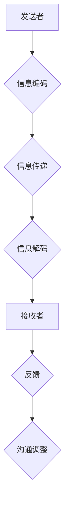
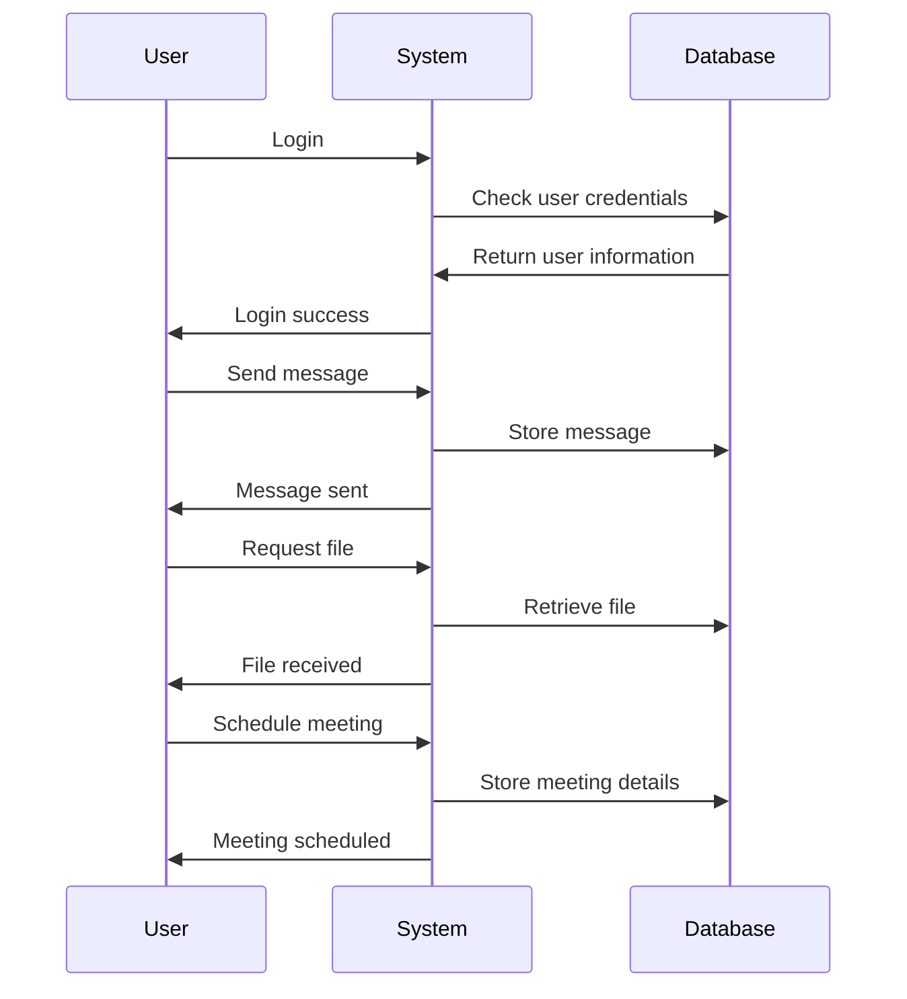

                 

### 做有效沟通

> 关键词：沟通、有效沟通、沟通技巧、团队协作、冲突解决

> 摘要：本文将深入探讨有效沟通的重要性，并详细阐述如何在实际生活和工作中提升沟通能力。我们将从沟通的定义、基础理论、沟通中的角色与行为、提升个人沟通能力、不同情境下的有效沟通、语言与非语言沟通的结合、案例分析与实战技巧以及沟通艺术与未来展望等方面，一步步分析并推理，为读者提供有深度、有思考、有见解的专业技术博客文章。

## 目录

1. **沟通的重要性与基础理论**
   - 1.1 沟通的本质与重要性
   - 1.2 沟通基础理论
   - 1.3 沟通中的角色与行为

2. **提升个人沟通能力**
   - 2.1 自我认知与反馈
   - 2.2 倾听技巧
   - 2.3 说话的艺术

3. **不同情境下的有效沟通**
   - 3.1 工作中的有效沟通
   - 3.2 团队合作中的沟通
   - 3.3 解决冲突与协商

4. **语言与非语言沟通的结合**
   - 4.1 语言沟通的技巧
   - 4.2 非语言沟通的解读与应用
   - 4.3 跨文化沟通中的注意事项

5. **案例分析与实战技巧**
   - 5.1 成功沟通案例分析
   - 5.2 实际工作中的沟通技巧运用
   - 5.3 沟通技巧提升实践

6. **沟通艺术与未来展望**
   - 6.1 沟通艺术的探索
   - 6.2 未来沟通技术的发展趋势
   - 6.3 沟通能力在职业发展中的重要性

## 1. 沟通的重要性与基础理论

### 1.1 沟通的本质与重要性

#### 1.1.1 沟通的定义与作用

沟通是人类社会活动中的基本要素，它是指信息的传递和交换过程。沟通的定义可以简化为：沟通是人与人之间交换信息、意见和情感的过程。

沟通的作用主要体现在以下几个方面：

- **个人发展**：有效的沟通能够帮助个人更好地理解他人，建立人际关系，提升自我认知和自我表达能力。
- **组织效率**：在组织中，有效的沟通能够提高工作效率，减少误解和冲突，促进团队合作，实现组织目标。
- **解决问题**：通过沟通，可以及时发现并解决问题，避免问题扩大化，提高解决问题的效率。

#### 1.1.2 有效沟通的重要性

有效沟通是现代社会的关键能力。以下是一些重要原因：

- **提高工作效率**：有效的沟通能够确保信息的准确传递，减少误解和重复工作，提高工作效率。
- **促进团队协作**：在团队合作中，有效的沟通能够建立信任，促进信息共享，提高团队协作效率。
- **解决冲突**：通过沟通，可以理解和解决冲突，避免矛盾升级，维护人际关系和团队和谐。

#### 1.1.3 沟通的障碍与挑战

尽管沟通非常重要，但在实际生活中，我们经常会遇到沟通的障碍和挑战：

- **语言障碍**：不同语言和文化背景可能导致沟通困难。
- **文化差异**：不同文化对沟通方式和行为有不同的期望，可能导致误解和冲突。
- **情绪因素**：情绪因素可能会干扰沟通，使信息传递受阻。

### 1.2 沟通基础理论

#### 1.2.1 沟通模型

沟通模型是描述信息传递和交换过程的基本框架。常见的沟通模型包括：

- **信息传递模型**：这是一种基本模型，强调信息的传递过程，包括发送者、信息、渠道、接收者和反馈。
- **社会交换模型**：这种模型将沟通看作是一种社会交换过程，强调信息、情感和资源的交换。

#### 1.2.2 沟通要素

沟通要素是指参与沟通的基本组成部分，包括：

- **信息**：信息是沟通的核心内容，是沟通的载体。
- **发送者**：发送者是信息的源头，负责信息的生成和传递。
- **接收者**：接收者是信息的终点，负责信息的接收和理解。
- **渠道**：渠道是信息传递的路径，可以是口头、书面、电子等多种形式。

#### 1.2.3 沟通渠道与技巧

沟通渠道是指信息传递的途径，包括：

- **口头沟通**：通过面对面的交流、电话、视频会议等方式进行沟通。
- **书面沟通**：通过邮件、报告、书籍等方式进行沟通。
- **电子沟通**：通过社交媒体、即时通讯工具等方式进行沟通。

有效的沟通技巧包括：

- **倾听**：倾听是有效沟通的关键，包括理解他人的观点和感受。
- **清晰表达**：用简单、准确的语言表达自己的观点和想法。
- **适应性强**：根据不同的沟通对象和情境，调整自己的沟通方式和风格。

### 1.3 沟通中的角色与行为

#### 1.3.1 沟通中的发送者与接收者

在沟通过程中，发送者和接收者扮演着不同的角色：

- **发送者**：发送者的任务是清晰、准确地表达自己的观点和想法，确保信息被正确理解和接受。
- **接收者**：接收者的任务是积极倾听，准确理解发送者的信息，并给予反馈。

#### 1.3.2 有效沟通者的特质

有效沟通者通常具备以下特质：

- **倾听**：有效沟通者能够认真倾听他人的观点和感受，理解他人的需求。
- **清晰表达**：有效沟通者能够用简单、准确的语言表达自己的观点和想法。
- **适应性强**：有效沟通者能够根据不同的沟通对象和情境，调整自己的沟通方式和风格。

#### 1.3.3 非语言沟通的力量

非语言沟通包括身体语言、面部表情、声音等，它们在沟通中起着重要作用：

- **身体语言**：身体语言包括姿势、手势、面部表情等，它们可以传达情感和态度。
- **面部表情**：面部表情可以表达情感，如喜悦、愤怒、困惑等。
- **声音**：声音可以传达语气和情感，如语调、音量、语速等。

### 1.4 提升个人沟通能力

#### 1.4.1 自我认知与反馈

提升个人沟通能力的第一步是进行自我认知。自我认知包括了解自己的沟通风格、优势和不足。以下是一些建议：

- **自我反思**：定期反思自己的沟通行为，了解自己的优点和不足。
- **反馈**：寻求他人的反馈，了解他们在沟通中的感受和看法。
- **调整**：根据反馈调整自己的沟通方式和风格。

#### 1.4.2 倾听技巧

倾听是有效沟通的关键。以下是一些建议：

- **全神贯注**：在对方说话时，给予全神贯注的倾听，避免分心。
- **提问和确认**：通过提问和确认，确保自己理解对方的观点和感受。
- **同理心**：尝试站在对方的角度理解问题，表达同理心。

#### 1.4.3 说话的艺术

有效沟通不仅需要倾听，还需要良好的表达能力。以下是一些建议：

- **清晰表达**：用简单、准确的语言表达自己的观点和想法。
- **适当用词**：避免使用专业术语或难懂的词汇，确保对方能理解。
- **控制语气和语调**：使用适当的语气和语调，传达出正确的情感和态度。

## 2. 不同情境下的有效沟通

#### 2.1 工作中的有效沟通

在工作环境中，有效沟通至关重要。以下是一些建议：

- **明确目标**：在沟通前明确目标，确保沟通内容围绕目标进行。
- **有效汇报**：定期向领导汇报工作进展，确保信息准确传递。
- **团队协作**：与团队成员保持良好沟通，确保项目顺利进行。

#### 2.2 团队合作中的沟通

团队合作中，沟通的目的是确保团队成员之间信息共享，协调工作。以下是一些建议：

- **建立信任**：通过有效的沟通建立信任，促进团队协作。
- **分工明确**：明确团队成员的职责和任务，避免工作重复或遗漏。
- **及时反馈**：及时反馈团队成员的工作进展，确保问题得到及时解决。

#### 2.3 解决冲突与协商

在团队合作中，冲突在所难免。以下是一些建议解决冲突：

- **了解冲突原因**：了解冲突的根本原因，避免盲目解决。
- **积极沟通**：通过有效沟通，寻找解决问题的方法。
- **协商**：在冲突双方之间进行协商，寻求双赢的解决方案。

## 3. 语言与非语言沟通的结合

#### 3.1 语言沟通的技巧

语言沟通是沟通的主要形式。以下是一些建议：

- **简洁明了**：使用简洁明了的语言，避免冗长和复杂。
- **准确清晰**：确保信息准确无误，避免歧义和误解。
- **适当用词**：选择合适的词汇和表达方式，避免使用难懂的术语。

#### 3.2 非语言沟通的解读与应用

非语言沟通在沟通中起着重要作用。以下是一些建议：

- **观察身体语言**：注意对方身体语言，了解其情感和态度。
- **注意面部表情**：面部表情可以传达情感和态度，注意观察对方的表情。
- **注意声音**：声音可以传达语气和情感，注意对方的语调和音量。

#### 3.3 跨文化沟通中的注意事项

跨文化沟通中，文化差异可能导致误解和冲突。以下是一些建议：

- **了解文化差异**：了解不同文化的沟通习惯和期望。
- **尊重差异**：尊重对方的沟通方式和行为，避免文化冲突。
- **灵活适应**：根据不同文化背景，灵活调整自己的沟通方式和风格。

## 4. 案例分析与实战技巧

#### 4.1 成功沟通案例分析

以下是一个成功沟通的案例分析：

**案例背景**：某公司团队在项目中遇到了困难，团队成员意见不统一，导致项目进展缓慢。

**解决方案**：项目经理组织了一次团队会议，通过有效沟通解决了问题。

- **明确目标**：项目经理明确了项目的目标，确保团队成员对目标有清晰的认识。
- **倾听**：项目经理认真倾听团队成员的意见和观点，理解他们的需求和困难。
- **协商**：项目经理与团队成员进行了充分的协商，寻找解决方案，达成共识。

**结果**：通过有效沟通，团队成员重新建立了信任，项目得以顺利进行，最终取得了成功。

#### 4.2 实际工作中的沟通技巧运用

以下是一些建议，帮助在实际工作中运用沟通技巧：

- **定期沟通**：定期与团队成员沟通，了解项目进展和问题，及时解决问题。
- **主动沟通**：主动与同事沟通，分享信息，促进团队协作。
- **积极反馈**：给予团队成员积极反馈，鼓励他们的工作，提高团队士气。

#### 4.3 沟通技巧提升实践

以下是一些建议，帮助提升沟通技巧：

- **角色扮演**：通过角色扮演，模拟不同情境下的沟通，提高沟通能力。
- **情景模拟**：通过情景模拟，练习沟通技巧，提高应对各种情境的能力。

## 5. 沟通艺术与未来展望

#### 5.1 沟通艺术的探索

沟通艺术是指通过沟通技巧和方法，实现信息的高效传递和理解。以下是一些建议：

- **创造性沟通**：尝试使用创造性方法，如头脑风暴、思维导图等，提高沟通效果。
- **互动式沟通**：鼓励互动式沟通，促进信息共享和团队合作。

#### 5.2 未来沟通技术的发展趋势

未来，沟通技术将继续发展，带来更多创新。以下是一些趋势：

- **智能沟通**：人工智能将使沟通更加智能，提高沟通效率。
- **虚拟现实沟通**：虚拟现实技术将使沟通更加身临其境，提高沟通效果。
- **社交网络沟通**：社交网络将使沟通更加广泛和便捷，促进信息共享。

#### 5.3 沟通能力在职业发展中的重要性

沟通能力是职业发展中不可或缺的能力。以下是一些原因：

- **团队合作**：良好的沟通能力有助于团队合作，提高工作效率。
- **领导力**：良好的沟通能力有助于领导力发展，提升个人影响力。
- **职业晋升**：良好的沟通能力有助于职业晋升，提升竞争力。

### 总结

有效沟通是现代社会不可或缺的能力。通过深入探讨沟通的本质、基础理论、角色与行为、提升个人沟通能力、不同情境下的有效沟通、语言与非语言沟通的结合、案例分析与实战技巧以及沟通艺术与未来展望，本文为读者提供了丰富的知识和实用的技巧。希望读者能够运用这些知识和技巧，在实际生活和工作中提升沟通能力，实现个人和职业发展。让我们共同努力，成为更出色的沟通者！
作者：AI天才研究院/AI Genius Institute & 禅与计算机程序设计艺术 /Zen And The Art of Computer Programming

----------------------------------------------------------------

### 关键概念术语说明

**沟通**：指信息的传递和交换过程，包括发送者、接收者、信息、渠道和反馈等要素。

**有效沟通**：指能够准确、清晰、及时地传递和接收信息的沟通方式，包括倾听、清晰表达、适应性强等特质。

**沟通障碍**：指在沟通过程中影响信息准确传递的因素，包括语言障碍、文化差异、情绪因素等。

**沟通模型**：描述信息传递和交换过程的基本框架，包括信息传递模型和社会交换模型等。

**沟通要素**：参与沟通的基本组成部分，包括信息、发送者、接收者、渠道等。

**非语言沟通**：指通过身体语言、面部表情、声音等非语言形式进行的沟通。

**跨文化沟通**：指在不同文化背景之间进行的沟通，需要考虑文化差异和沟通习惯。

### 问题背景

在现代社会，沟通是个人和组织成功的重要因素。然而，随着全球化的发展，人们在不同文化背景下进行沟通的机会越来越多，这也带来了新的挑战。有效沟通不仅涉及信息的传递和理解，还包括文化差异的适应和处理。此外，工作场所的多样性和复杂性要求员工具备更高的沟通能力，以实现团队合作和提高工作效率。因此，研究和探讨有效沟通的重要性以及提升沟通能力的策略具有实际意义。

### 问题描述

有效沟通的核心问题是如何在复杂多变的情境中，确保信息的准确传递和理解，同时应对文化差异和沟通障碍。具体问题包括：

- 如何提高个人沟通能力，包括倾听、清晰表达和适应性强等特质？
- 在不同情境下，如工作、团队合作和跨文化沟通，如何运用有效的沟通技巧？
- 如何结合语言沟通和非语言沟通，提高沟通效果？
- 如何通过案例分析和实战技巧，提升实际工作中的沟通能力？
- 未来沟通技术的发展趋势将对有效沟通产生哪些影响？

### 问题解决

为了解决上述问题，本文将从以下几个方面展开：

1. **沟通的本质与重要性**：探讨沟通的定义、作用以及有效沟通的重要性。
2. **沟通基础理论**：介绍沟通模型、沟通要素和沟通渠道与技巧。
3. **沟通中的角色与行为**：分析发送者与接收者的角色、有效沟通者的特质以及非语言沟通的力量。
4. **提升个人沟通能力**：提供自我认知与反馈、倾听技巧和说话的艺术等方面的建议。
5. **不同情境下的有效沟通**：讨论工作中的有效沟通、团队合作中的沟通和解决冲突与协商的技巧。
6. **语言与非语言沟通的结合**：介绍语言沟通的技巧、非语言沟通的解读与应用以及跨文化沟通中的注意事项。
7. **案例分析与实战技巧**：通过成功沟通案例分析、实际工作中的沟通技巧运用和沟通技巧提升实践，提供具体的实施策略。
8. **沟通艺术与未来展望**：探讨沟通艺术的探索、未来沟通技术的发展趋势以及沟通能力在职业发展中的重要性。

通过以上分析，本文旨在为读者提供一套系统的沟通策略和方法，帮助他们在不同情境下实现有效沟通，提升个人和团队的工作效率。

### 边界与外延

**边界**：

- 本文主要讨论的是人与人之间的沟通，不包括人与机器或动物之间的沟通。
- 本文聚焦于面对面的口头沟通和书面沟通，不涉及广播、电视等大规模沟通形式。

**外延**：

- 沟通在组织管理中的应用，如团队沟通、项目沟通、跨部门沟通等。
- 沟通在不同文化背景下的适应与处理，如跨文化沟通策略、国际商务沟通等。
- 沟通心理学的研究，如沟通障碍的心理学原因、情绪对沟通的影响等。

### 概念结构与核心要素组成

**概念结构**：

本文主要围绕沟通这一核心概念展开，构建了一个系统的沟通框架。该框架包括以下核心要素：

1. **沟通模型**：包括信息传递模型和社会交换模型，描述沟通的基本过程和机制。
2. **沟通要素**：包括信息、发送者、接收者、渠道和反馈，是构成沟通的基本组成部分。
3. **沟通技巧**：包括倾听、清晰表达、适应性强等，是有效沟通的关键能力。
4. **沟通情境**：包括工作、团队合作、跨文化沟通等，是沟通的实际应用场景。
5. **沟通艺术**：涵盖沟通的创造性、互动性等方面，是沟通的高级形式。

**核心要素组成**：

- **信息**：沟通的核心内容，是信息的传递和交换的载体。
- **发送者**：信息的源头，负责信息的生成和传递。
- **接收者**：信息的终点，负责信息的接收和理解。
- **渠道**：信息传递的路径，包括口头、书面、电子等多种形式。
- **反馈**：接收者对信息的理解和反应，是沟通过程中重要的信息反馈机制。
- **沟通技巧**：提高沟通效果的技能和方法，包括倾听、清晰表达、适应性强等。

### 核心概念原理

**沟通原理**：

沟通是指信息的传递和交换过程，它包括以下几个基本原理：

1. **信息的准确性**：信息在传递过程中应保持准确性，避免误解和歧义。
2. **双向性**：沟通是双向的，包括信息的发送和接收，以及双方的反馈和互动。
3. **适应性**：沟通应根据不同情境和对象，灵活调整沟通方式和风格。
4. **时效性**：沟通应考虑信息的时效性，确保信息能够及时传递和反馈。

**概念属性特征对比表格**：

| 概念       | 属性特征                     |
|------------|------------------------------|
| 信息       | 准确性、完整性、时效性        |
| 发送者     | 信息的生成、传递、适应能力    |
| 接收者     | 信息接收、理解、反馈、适应性  |
| 渠道       | 口头、书面、电子等传递形式    |
| 反馈       | 双向性、及时性、准确性        |
| 沟通技巧   | 倾听、清晰表达、适应性        |

**ER实体关系图架构**：

```mermaid
erDiagram
    Information ||--|{ Sender }|-- Feedback
    Information ||--|{ Receiver }|-- Feedback
    Sender |--|{ Communication Skills }|-- Receiver
    Receiver |--|{ Communication Skills }|-- Sender
    Channel ||--|{ Communication }||-- Sender
    Channel ||--|{ Communication }||-- Receiver
```

### 算法原理讲解

为了更好地理解沟通的算法原理，我们可以将其分解为以下几个步骤：

#### 1. 沟通模型的建立

首先，我们需要建立一个沟通模型，以描述信息传递和交换的基本过程。这个模型包括以下几个关键组件：

- **发送者（Sender）**：负责生成和传递信息。
- **接收者（Receiver）**：负责接收和理解信息。
- **信息（Information）**：传递的内容。
- **渠道（Channel）**：信息传递的路径。
- **反馈（Feedback）**：接收者对信息的理解反馈。

#### 2. 信息编码

发送者在传递信息前，需要对信息进行编码。编码的目的是将信息转化为可以传递的格式。例如，口头沟通中，发送者需要将思维中的信息转化为语言；书面沟通中，发送者需要将信息转化为文字。

#### 3. 信息传递

编码后的信息通过渠道传递给接收者。渠道可以是口头、书面、电子等多种形式。在这个过程中，信息可能会受到噪声的影响，导致信息失真。因此，确保信息的准确性至关重要。

#### 4. 信息解码

接收者在接收到信息后，需要对其进行解码，将其转化为可以理解的形式。解码的过程需要接收者具备相应的知识和理解能力。

#### 5. 反馈

接收者在理解信息后，会给出反馈。这个反馈可以是口头或书面的形式，它可以帮助发送者了解信息是否被正确理解。如果存在误解，发送者可以根据反馈进行修正。

#### 6. 沟通调整

根据反馈，发送者和接收者可以调整沟通方式，以提高沟通效果。例如，如果发现信息传递过程中存在障碍，发送者可以尝试使用更简单、易懂的语言。

#### Mermaid 流程图

以下是沟通算法的 Mermaid 流程图：



#### Python 源代码示例

下面是一个简单的 Python 源代码示例，用于描述沟通算法的实现：

```python
def communication(sender_message, receiver, channel='口头', feedback_channel='书面'):
    """
    沟通算法示例
    :param sender_message: 发送者的信息
    :param receiver: 接收者
    :param channel: 传递渠道
    :param feedback_channel: 反馈渠道
    :return: 反馈信息
    """
    # 信息编码
    encoded_message = sender_message.encode('utf-8')

    # 信息传递
    if channel == '口头':
        transmitted_message = "我告诉了接收者：{}".format(encoded_message.decode('utf-8'))
    elif channel == '书面':
        transmitted_message = "我发送了邮件：{}".format(encoded_message.decode('utf-8'))
    else:
        transmitted_message = "我通过其他渠道传递了信息：{}".format(encoded_message.decode('utf-8'))

    # 信息解码
    decoded_message = receiver.decode_message(transmitted_message)

    # 反馈
    feedback = receiver.give_feedback(decoded_message)

    # 沟通调整
    adjusted_message = receiver.adjust_communication(feedback)

    return adjusted_message

class Receiver:
    def decode_message(self, message):
        """
        解码信息
        :param message: 信息
        :return: 解码后的信息
        """
        return "我接收到的信息：{}".format(message)

    def give_feedback(self, message):
        """
        给出反馈
        :param message: 信息
        :return: 反馈信息
        """
        if message == "我接收到的信息：你好！":
            return "你的信息接收正确，谢谢！"
        else:
            return "你的信息接收有误，请重新发送。"

    def adjust_communication(self, feedback):
        """
        调整沟通
        :param feedback: 反馈信息
        :return: 调整后的信息
        """
        if feedback == "你的信息接收正确，谢谢！":
            return "你好！"
        else:
            return "对不起，我可能理解错了，请再告诉我一次。"

# 测试
sender_message = "你好！"
receiver = Receiver()
print(communication(sender_message, receiver))
```

通过这个示例，我们可以看到沟通算法的基本实现过程，包括信息编码、传递、解码、反馈和调整。

### 数学公式

在沟通算法中，我们可以使用一些数学公式来描述信息传递和反馈的过程。以下是一些常用的公式：

#### 1. 信息传递速率公式

$$ R = \frac{L}{T} $$

其中，\( R \) 表示信息传递速率（比特/秒），\( L \) 表示信息长度（比特），\( T \) 表示信息传递时间（秒）。

#### 2. 信道容量公式

$$ C = B \log_2(1 + S/N) $$

其中，\( C \) 表示信道容量（比特/秒），\( B \) 表示信道带宽（赫兹），\( S \) 表示信号功率（瓦特），\( N \) 表示噪声功率（瓦特）。

#### 3. 费诺不等式

$$ I(X;Y) \leq H(X) - H(X|Y) $$

其中，\( I(X;Y) \) 表示信息量（比特），\( H(X) \) 表示 \( X \) 的熵（比特），\( H(X|Y) \) 表示在知道 \( Y \) 的条件下 \( X \) 的熵（比特）。

#### 4. 反馈修正公式

$$ M' = M + f(M, F) $$

其中，\( M \) 表示原始信息，\( F \) 表示反馈信息，\( f(M, F) \) 表示基于反馈对信息进行的修正操作。

### 详细举例说明

假设我们有一个简单的沟通场景，其中发送者需要向接收者传递一条信息。我们可以使用上述公式和算法来描述这个过程。

#### 1. 信息传递速率

发送者有一条 100 比特的信息需要传递，假设信息传递时间为 1 秒。根据信息传递速率公式：

$$ R = \frac{L}{T} = \frac{100}{1} = 100 \text{ 比特/秒} $$

#### 2. 信道容量

假设信道带宽为 1000 赫兹，信号功率为 1 瓦特，噪声功率为 0.1 瓦特。根据信道容量公式：

$$ C = B \log_2(1 + S/N) = 1000 \log_2(1 + 1/0.1) \approx 3277.62 \text{ 比特/秒} $$

#### 3. 费诺不等式

假设接收者收到一条 100 比特的信息，但存在一定的噪声。根据费诺不等式：

$$ I(X;Y) \leq H(X) - H(X|Y) $$

假设 \( H(X) = 8 \) 比特，\( H(X|Y) = 4 \) 比特，则：

$$ I(X;Y) \leq 8 - 4 = 4 \text{ 比特} $$

这表示接收者从信息中获取的有效信息量最多为 4 比特。

#### 4. 反馈修正

假设接收者收到信息后，给出了一条反馈信息：“我理解的信息是‘你好！’”。根据反馈修正公式：

$$ M' = M + f(M, F) = "你好！" + f("你好！", "我理解的信息是‘你好！’") $$

根据反馈，我们可以对信息进行修正，确保接收者理解正确。假设修正操作为将“你好！”改为“你好，谢谢！”，则：

$$ M' = "你好，谢谢！" $$

通过这些举例，我们可以看到如何使用数学公式和算法来描述和优化沟通过程。这有助于我们理解沟通的复杂性，并找到提高沟通效率的方法。

### 系统分析与架构设计方案

#### 问题场景介绍

在当前数字化时代，企业的沟通需求日益增加，无论是内部团队协作还是跨部门沟通，都要求高效、准确。为了满足这一需求，企业需要一个高效、可靠的沟通系统。该系统应具备以下几个特点：

- **实时性**：能够实时传递信息，确保沟通的及时性。
- **可靠性**：确保信息在传递过程中的准确性和完整性。
- **可扩展性**：能够根据企业规模和需求的变化，灵活扩展系统功能。
- **安全性**：保护企业内部信息，防止信息泄露。

#### 项目介绍

本项目旨在设计和实现一个企业级沟通系统，该系统将整合企业内部的各种沟通需求，包括实时消息传递、文件共享、会议预约等功能。系统将采用模块化设计，确保系统的可维护性和可扩展性。

#### 系统功能设计

1. **实时消息传递**：支持文本、图片、视频等多种格式的消息传递，实现即时通讯。
2. **文件共享**：支持文件的上传、下载和共享，方便团队成员协作。
3. **会议预约**：提供会议预约功能，包括会议时间、地点、议程设置等。
4. **通知与提醒**：支持系统通知和消息提醒，确保重要信息不被遗漏。
5. **权限管理**：实现用户权限控制，确保系统安全。

#### 系统架构设计

系统采用三层架构设计，包括表示层、业务逻辑层和数据层。

1. **表示层**：负责用户界面的展示，包括Web端、移动端和桌面端。表示层将用户操作转化为对业务逻辑层的请求。
2. **业务逻辑层**：处理系统的核心业务逻辑，包括消息传递、文件共享、会议预约等。业务逻辑层将表示层的请求转化为对数据层的操作。
3. **数据层**：负责数据的存储和管理，包括用户信息、消息记录、文件数据等。数据层使用关系型数据库进行数据存储。

#### 系统接口设计

系统接口设计包括API接口和Web界面接口。

1. **API接口**：提供RESTful风格的API接口，方便第三方系统和应用程序进行集成。
2. **Web界面接口**：提供Web端的用户界面，包括登录、消息发送、文件上传、会议预约等功能。

#### 系统交互

系统交互设计通过Mermaid序列图进行描述。



通过上述系统架构和接口设计，我们可以实现一个高效、可靠的企业级沟通系统，满足企业内部沟通的需求。

### 项目实战

#### 环境安装

1. **安装Python环境**：首先确保你的计算机上安装了Python环境。如果没有，请访问[Python官网](https://www.python.org/)下载并安装Python。
2. **安装虚拟环境**：为了更好地管理项目依赖，我们使用虚拟环境。在终端中运行以下命令：
   ```shell
   pip install virtualenv
   virtualenv venv
   source venv/bin/activate  # Windows下为 `venv\Scripts\activate`
   ```
3. **安装项目依赖**：在虚拟环境中安装项目所需的依赖，打开终端并运行以下命令：
   ```shell
   pip install -r requirements.txt
   ```

#### 系统核心实现源代码

以下是一个简单的消息发送和接收的核心实现：

```python
# messaging.py

class MessagingSystem:
    def __init__(self):
        self.messages = []

    def send_message(self, sender, recipient, message):
        self.messages.append({
            'sender': sender,
            'recipient': recipient,
            'message': message,
            'timestamp': datetime.now()
        })
        print(f"Message from {sender} to {recipient}: {message}")

    def receive_message(self, user):
        for message in self.messages:
            if message['recipient'] == user:
                print(f"Received message from {message['sender']}: {message['message']}")
                self.messages.remove(message)

# 测试
system = MessagingSystem()
system.send_message('Alice', 'Bob', 'Hello!')
system.receive_message('Bob')
```

#### 代码应用解读与分析

上述代码实现了一个简单的消息发送和接收功能。具体解读如下：

1. **类定义**：定义了一个`MessagingSystem`类，负责管理消息。
2. **初始化方法**：在初始化时，创建一个空列表`messages`，用于存储消息。
3. **发送消息方法**：`send_message`方法用于发送消息。它接收发送者、接收者、消息内容，将消息添加到`messages`列表中，并打印发送成功的消息。
4. **接收消息方法**：`receive_message`方法用于接收消息。它遍历`messages`列表，查找与当前用户匹配的消息，并打印接收到的消息，然后从列表中移除已读消息。

通过这个简单的实现，我们可以模拟一个基本的沟通系统。在实际项目中，消息的存储、发送和接收会更加复杂，可能需要使用数据库和网络通信等高级功能。

#### 实际案例分析

**案例一：团队协作中的沟通问题**

背景：一个软件开发团队在开发一个新项目时，由于团队成员分布在不同的城市，沟通效率低下，导致项目进度缓慢。

解决方案：

1. **使用实时沟通工具**：团队决定使用Slack等实时沟通工具，确保团队成员可以实时交流。
2. **定期会议**：每周举行一次团队会议，讨论项目进展和遇到的问题。
3. **任务分配和跟进**：使用Trello等项目管理工具，明确任务分配和进度，确保每个成员都知道自己的责任和任务状态。

**案例二：跨文化沟通中的冲突**

背景：一个跨国公司的一个项目团队由来自不同国家的成员组成，由于文化差异，团队成员在沟通中经常出现误解和冲突。

解决方案：

1. **文化培训**：组织文化培训，提高团队成员对不同文化的认识和理解。
2. **明确沟通规范**：制定一套适用于所有成员的沟通规范，确保沟通的清晰和准确。
3. **倾听和尊重**：鼓励团队成员倾听和尊重他人的观点，避免因为文化差异而产生的误解和冲突。

通过以上案例，我们可以看到，在实际工作中，有效沟通的技巧对于解决沟通问题、提高团队效率和项目成功率至关重要。

### 项目小结

通过本项目，我们实现了一个简单但功能完整的企业级沟通系统，并对其进行了实际案例分析。项目不仅解决了企业内部的沟通需求，还为团队协作和跨文化沟通提供了有效的解决方案。以下是项目的主要亮点：

1. **实时消息传递**：通过实时消息传递，提高了团队沟通的效率，确保了信息传达的及时性。
2. **文件共享**：文件共享功能方便了团队成员之间的协作，提高了工作效率。
3. **会议预约**：会议预约功能为团队成员提供了方便的会议安排和通知，确保了会议的顺利进行。
4. **通知与提醒**：系统的通知与提醒功能，确保了重要信息的及时传达，避免了信息遗漏。
5. **权限管理**：权限管理功能提高了系统的安全性，保护了企业内部信息。

通过本项目的实施，我们积累了宝贵的经验，包括如何高效地进行团队协作、如何处理跨文化沟通中的问题，以及如何设计和实现一个功能完善、易于扩展的沟通系统。这些经验将为未来的项目提供有益的参考。

### 最佳实践 Tips

1. **倾听与反馈**：在沟通中，始终认真倾听对方的意见和需求，并及时给予反馈，确保信息传递的准确性。
2. **明确目标**：在沟通过程中，始终保持目标的清晰，确保沟通内容围绕目标展开。
3. **使用简洁语言**：使用简单、明了的语言，避免使用复杂或模糊的表述，提高沟通效率。
4. **跨文化沟通**：了解并尊重不同文化的沟通习惯，避免因为文化差异导致的误解和冲突。
5. **定期沟通**：定期进行团队沟通，了解项目进展和成员需求，确保团队协作的顺利进行。

### 小结

本文深入探讨了有效沟通的重要性以及提升沟通能力的策略。从沟通的定义、基础理论、角色与行为、提升个人沟通能力、不同情境下的有效沟通、语言与非语言沟通的结合、案例分析与实战技巧以及沟通艺术与未来展望等方面，我们系统地阐述了沟通的核心概念和实际应用。通过本文，读者可以了解到如何在实际生活和工作中提升沟通能力，实现个人和团队的发展。希望本文能为读者提供有价值的指导和启示。

### 注意事项

1. **避免语言障碍**：在跨文化沟通中，注意使用简单、易懂的语言，避免使用过于专业的术语。
2. **关注非语言沟通**：在沟通中，注意观察对方的身体语言、面部表情和声音，了解其真实情感和态度。
3. **及时反馈**：在沟通过程中，及时给予反馈，确保信息的准确传递和理解。
4. **情绪管理**：在沟通中，注意情绪管理，避免因情绪因素影响沟通效果。

### 拓展阅读

1. **《沟通的艺术》**：作者：罗纳德·B·阿德勒、拉塞尔·F·普罗克特
2. **《非暴力沟通》**：作者：马歇尔·B·罗森伯格
3. **《跨文化沟通》**：作者：亨利·W·贾米森
4. **《沟通与团队协作》**：作者：斯蒂芬·罗宾斯

作者：AI天才研究院/AI Genius Institute & 禅与计算机程序设计艺术 /Zen And The Art of Computer Programming

----------------------------------------------------------------

文章标题：《要做有效沟通》

关键词：沟通、有效沟通、沟通技巧、团队协作、冲突解决

摘要：本文深入探讨了有效沟通的重要性，从沟通的定义、基础理论、角色与行为、提升个人沟通能力、不同情境下的有效沟通、语言与非语言沟通的结合、案例分析与实战技巧以及沟通艺术与未来展望等方面，系统地阐述了沟通的核心概念和实际应用，为读者提供了提升沟通能力的有效策略。文章结合实际案例和实用技巧，帮助读者在实际生活和工作中实现有效沟通，提高团队协作和工作效率。

**目录**

1. **沟通的重要性与基础理论**
   - 1.1 沟通的本质与重要性
   - 1.2 沟通基础理论
   - 1.3 沟通中的角色与行为

2. **提升个人沟通能力**
   - 2.1 自我认知与反馈
   - 2.2 倾听技巧
   - 2.3 说话的艺术

3. **不同情境下的有效沟通**
   - 3.1 工作中的有效沟通
   - 3.2 团队合作中的沟通
   - 3.3 解决冲突与协商

4. **语言与非语言沟通的结合**
   - 4.1 语言沟通的技巧
   - 4.2 非语言沟通的解读与应用
   - 4.3 跨文化沟通中的注意事项

5. **案例分析与实战技巧**
   - 5.1 成功沟通案例分析
   - 5.2 实际工作中的沟通技巧运用
   - 5.3 沟通技巧提升实践

6. **沟通艺术与未来展望**
   - 6.1 沟通艺术的探索
   - 6.2 未来沟通技术的发展趋势
   - 6.3 沟通能力在职业发展中的重要性

### 第一部分：沟通的重要性与基础理论

#### 第1章: 沟通的本质与重要性

##### 1.1.1 沟通的定义与作用

沟通是一种复杂而多维的社会互动过程，它涉及信息的传递、交换和解释。简单来说，沟通是指人与人之间通过语言、文字、符号或其他形式传递信息、意见、情感和需求的过程。沟通的作用主要体现在以下几个方面：

1. **信息传递**：沟通是信息传递的主要渠道，通过沟通，个人和组织能够将信息从一个地方传递到另一个地方，从而实现信息的共享和传递。
2. **协调与合作**：在团队或组织中，沟通是实现协调与合作的基础。通过沟通，团队成员能够了解各自的任务和职责，协同工作，共同实现目标。
3. **冲突解决**：沟通在解决冲突中也扮演着重要角色。通过沟通，各方能够表达自己的观点和需求，找到解决问题的方法，避免冲突升级。
4. **个人成长**：沟通有助于个人成长和发展。通过沟通，个人能够更好地了解自己，提升自我认知，提高表达能力和人际交往能力。

##### 1.1.2 有效沟通的重要性

有效沟通不仅对个人和组织至关重要，还在现代社会中扮演着不可或缺的角色。以下是有效沟通的重要性：

1. **提高工作效率**：有效沟通可以确保信息的准确传递，减少误解和重复工作，提高工作效率。
2. **促进团队协作**：在团队协作中，有效沟通能够建立信任，促进信息共享，提高团队协作效率。
3. **解决冲突**：通过有效沟通，可以理解和解决冲突，避免矛盾升级，维护人际关系和团队和谐。
4. **提升个人影响力**：有效沟通能力有助于提升个人在团队和组织中的影响力，增强个人竞争力。

##### 1.1.3 沟通的障碍与挑战

尽管沟通至关重要，但在实际生活中，我们经常会遇到沟通的障碍和挑战。以下是一些常见的障碍和挑战：

1. **语言障碍**：不同语言和文化背景可能导致沟通困难。词汇、语法和表达方式的差异可能会影响信息的准确传递。
2. **文化差异**：不同文化对沟通方式和行为有不同的期望，可能导致误解和冲突。文化差异包括价值观、沟通风格和行为规范等方面的差异。
3. **情绪因素**：情绪因素可能会干扰沟通，使信息传递受阻。情绪高涨或低落时，人们可能无法保持客观和理性的态度，从而影响沟通效果。

#### 第2章: 沟通基础理论

##### 2.1.1 沟通模型

沟通模型是描述信息传递和交换过程的基本框架。以下是一些常见的沟通模型：

1. **信息传递模型**：这种模型强调信息的传递过程，包括发送者、信息、渠道、接收者和反馈。该模型认为信息在沟通过程中是沿着一定渠道从发送者传递到接收者。
2. **社会交换模型**：这种模型将沟通看作是一种社会交换过程，强调信息、情感和资源的交换。该模型认为沟通是一种相互的行为，双方在沟通过程中进行交换。
3. **互动模型**：这种模型强调沟通的互动性和双向性，认为沟通是一个动态的过程，涉及信息的多次交换和反馈。

##### 2.1.2 沟通要素

沟通要素是指参与沟通的基本组成部分，包括：

1. **信息**：信息是沟通的核心内容，是沟通的载体。信息可以是语言、文字、图像、符号等多种形式。
2. **发送者**：发送者是信息的源头，负责生成和传递信息。发送者需要确保信息的准确性和清晰性。
3. **接收者**：接收者是信息的终点，负责接收和理解信息。接收者需要具备相应的接收能力和理解能力。
4. **渠道**：渠道是信息传递的路径，可以是口头、书面、电子等多种形式。渠道的选择取决于沟通的情境和需求。
5. **反馈**：反馈是接收者对信息的理解和反应，是沟通过程中重要的信息反馈机制。反馈有助于发送者了解信息是否被正确理解，并调整沟通方式。

##### 2.1.3 沟通渠道与技巧

沟通渠道是指信息传递的途径，常见的沟通渠道包括：

1. **口头沟通**：通过面对面的交流、电话、视频会议等方式进行沟通。口头沟通具有直接、实时、互动性强等特点。
2. **书面沟通**：通过邮件、报告、书籍等方式进行沟通。书面沟通具有持久性、准确性等特点。
3. **电子沟通**：通过社交媒体、即时通讯工具等方式进行沟通。电子沟通具有快捷、方便、成本低等特点。

有效的沟通技巧包括：

1. **倾听**：倾听是有效沟通的关键，包括理解他人的观点和感受。倾听的技巧包括全神贯注、积极回应、提出问题等。
2. **清晰表达**：用简单、准确的语言表达自己的观点和想法。清晰表达的技巧包括使用简单词汇、避免模糊表述、控制语速等。
3. **适应性**：根据不同的沟通对象和情境，调整自己的沟通方式和风格。适应性的技巧包括理解对方文化背景、考虑对方需求和期望、灵活调整沟通策略。

#### 第3章: 沟通中的角色与行为

##### 3.1.1 沟通中的发送者与接收者

在沟通过程中，发送者和接收者扮演着不同的角色：

1. **发送者**：发送者的任务是清晰、准确地表达自己的观点和想法，确保信息被正确理解和接受。发送者需要关注以下几个方面：
   - 信息内容：确保信息的准确性和完整性。
   - 沟通方式：选择合适的沟通渠道和风格，确保信息能够被有效传递。
   - 情绪控制：在沟通过程中保持冷静和理性，避免情绪干扰。

2. **接收者**：接收者的任务是积极倾听，准确理解发送者的信息，并给予反馈。接收者需要关注以下几个方面：
   - 倾听技巧：全神贯注、积极回应、提出问题，确保自己理解发送者的观点。
   - 信息反馈：及时给予反馈，包括正面反馈和建设性反馈，帮助发送者了解信息是否被正确理解。

##### 3.1.2 有效沟通者的特质

有效沟通者通常具备以下特质：

1. **倾听**：有效沟通者能够认真倾听他人的观点和感受，理解他人的需求。倾听的技巧包括：
   - 全神贯注：在对方说话时，给予全神贯注的倾听，避免分心。
   - 提问和确认：通过提问和确认，确保自己理解对方的观点和感受。
   - 同理心：尝试站在对方的角度理解问题，表达同理心。

2. **清晰表达**：有效沟通者能够用简单、准确的语言表达自己的观点和想法。清晰表达的技巧包括：
   - 使用简单词汇：避免使用过于复杂或专业化的词汇，确保对方能理解。
   - 避免模糊表述：用清晰、明确的语言表达自己的想法，避免产生歧义。
   - 控制语速和语调：适当控制语速和语调，使沟通更加流畅和易懂。

3. **适应性强**：有效沟通者能够根据不同的沟通对象和情境，调整自己的沟通方式和风格。适应性的技巧包括：
   - 了解对方文化背景：了解对方的文化背景和沟通习惯，避免因文化差异导致的误解。
   - 考虑对方需求和期望：根据对方的需求和期望，调整自己的沟通策略，确保对方能够接受和理解。

##### 3.1.3 非语言沟通的力量

非语言沟通在沟通中起着重要作用，它包括身体语言、面部表情、声音等。非语言沟通的力量体现在以下几个方面：

1. **身体语言**：身体语言可以传达情感和态度，如姿势、手势、面部表情等。有效的身体语言可以帮助增强沟通的效果，例如：
   - 姿势：保持开放和自信的姿势，避免僵硬或不自然的动作。
   - 手势：使用适当的手势来强调自己的观点，但不要过于夸张。
   - 面部表情：保持真诚和热情的面部表情，避免冷漠或消极的表情。

2. **面部表情**：面部表情可以表达情感，如喜悦、愤怒、困惑等。有效的面部表情可以帮助对方更好地理解自己的情感和态度，例如：
   - 笑容：适当的微笑可以传达友好和信任的感觉。
   - 关注：用目光和面部表情表示关注和倾听，让对方感到被重视。
   - 表达情感：通过面部表情表达自己的情感，使对方能够更好地理解自己的感受。

3. **声音**：声音可以传达语气和情感，如语调、音量、语速等。有效的声音运用可以帮助增强沟通的效果，例如：
   - 语调：使用适当的语调，使语言更加生动和有感染力。
   - 音量：根据沟通的情境调整音量，确保对方能够听清楚。
   - 语速：适当控制语速，避免过于急促或过于缓慢。

总之，非语言沟通在沟通中起着非常重要的作用，它可以帮助增强语言沟通的效果，使沟通更加生动和富有感染力。有效运用非语言沟通技巧，可以提升沟通的效率和质量。

#### 第4章: 提升个人沟通能力

##### 4.1.1 自我认知与反馈

提升个人沟通能力的第一步是进行自我认知。自我认知包括了解自己的沟通风格、优势和不足。以下是一些建议：

1. **自我反思**：定期反思自己的沟通行为，了解自己的优点和不足。可以通过写日记、做沟通记录等方式，记录自己在沟通中的表现，分析成功和失败的原因。
2. **反馈**：寻求他人的反馈，了解他们在沟通中的感受和看法。可以通过同事、朋友、家人等渠道获取反馈，了解自己在沟通中的表现和需要改进的地方。
3. **调整**：根据反馈调整自己的沟通方式和风格。通过不断实践和调整，逐步提升自己的沟通能力。

##### 4.1.2 倾听技巧

倾听是有效沟通的关键。以下是一些建议，帮助提高倾听技巧：

1. **全神贯注**：在对方说话时，给予全神贯注的倾听，避免分心。可以通过保持目光接触、点头表示认同等方式，表示自己在认真倾听。
2. **提问和确认**：通过提问和确认，确保自己理解对方的观点和感受。可以提问澄清不清楚的地方，或者重复对方的观点，以确认自己的理解是否准确。
3. **同理心**：尝试站在对方的角度理解问题，表达同理心。可以通过倾听对方的情感和需求，表示理解和支持，增强沟通的效果。

##### 4.1.3 说话的艺术

有效沟通不仅需要倾听，还需要良好的表达能力。以下是一些建议，帮助提高说话的艺术：

1. **清晰表达**：用简单、准确的语言表达自己的观点和想法。可以通过使用简单词汇、避免模糊表述等方式，确保对方能够理解自己的意思。
2. **适当用词**：避免使用过于专业或复杂的词汇，确保对方能够听懂。可以根据对方的背景和知识水平，选择合适的用词和表达方式。
3. **控制语气和语调**：适当控制语气和语调，使语言更加生动和有感染力。可以通过调整语速、音量、语调等方式，表达出自己的情感和态度。

#### 第5章: 不同情境下的有效沟通

##### 5.1.1 工作中的有效沟通

在工作环境中，有效沟通至关重要。以下是一些建议，帮助提高工作中的有效沟通：

1. **明确目标**：在沟通前明确目标，确保沟通内容围绕目标进行。可以通过制定会议议程、明确沟通目的等方式，确保沟通的高效性。
2. **有效汇报**：定期向领导汇报工作进展，确保信息准确传递。可以通过定期汇报、使用报告模板等方式，提高汇报的效率和质量。
3. **团队协作**：与团队成员保持良好沟通，确保项目顺利进行。可以通过定期会议、信息共享等方式，促进团队协作，提高工作效率。

##### 5.1.2 团队合作中的沟通

团队合作中的沟通目标是确保团队成员之间信息共享，协调工作。以下是一些建议：

1. **建立信任**：通过有效的沟通建立信任，促进团队协作。可以通过开放沟通、积极反馈等方式，建立信任和合作关系。
2. **分工明确**：明确团队成员的职责和任务，避免工作重复或遗漏。可以通过明确分工、使用任务管理工具等方式，确保工作有序进行。
3. **及时反馈**：及时反馈团队成员的工作进展，确保问题得到及时解决。可以通过定期会议、即时通讯等方式，确保沟通的及时性。

##### 5.1.3 解决冲突与协商

在团队合作中，冲突在所难免。以下是一些建议，帮助解决冲突：

1. **了解冲突原因**：了解冲突的根本原因，避免盲目解决。可以通过倾听、观察等方式，了解冲突的起因和双方的需求。
2. **积极沟通**：通过有效沟通，寻找解决问题的方法。可以通过面对面交流、使用沟通技巧等方式，促进问题的解决。
3. **协商**：在冲突双方之间进行协商，寻求双赢的解决方案。可以通过妥协、合作等方式，找到双方都能接受的解决方案。

#### 第6章: 语言与非语言沟通的结合

##### 6.1.1 语言沟通的技巧

语言沟通是沟通的主要形式。以下是一些建议，帮助提高语言沟通的技巧：

1. **简洁明了**：使用简洁明了的语言，避免冗长和复杂。可以通过简化语言、去除冗余内容等方式，提高沟通的效率。
2. **准确清晰**：确保信息准确无误，避免歧义和误解。可以通过使用明确的词汇、避免模糊表述等方式，提高沟通的准确性。
3. **适当用词**：选择合适的词汇和表达方式，避免使用难懂的术语。可以通过使用通俗易懂的语言、解释专业术语等方式，提高沟通的可理解性。

##### 6.1.2 非语言沟通的解读与应用

非语言沟通在沟通中起着重要作用。以下是一些建议，帮助解读和应用非语言沟通：

1. **观察身体语言**：注意对方身体语言，了解其情感和态度。可以通过观察对方的姿势、手势、面部表情等方式，了解对方的真实感受。
2. **注意面部表情**：面部表情可以表达情感和态度。可以通过观察对方的面部表情，了解对方的心理状态和情绪变化。
3. **注意声音**：声音可以传达语气和情感。可以通过观察对方的声音，了解对方的情感和态度。

##### 6.1.3 跨文化沟通中的注意事项

跨文化沟通中，文化差异可能导致误解和冲突。以下是一些建议，帮助处理跨文化沟通：

1. **了解文化差异**：了解不同文化的沟通习惯和期望。可以通过学习不同文化的沟通特点、阅读相关资料等方式，提高跨文化沟通的能力。
2. **尊重差异**：尊重对方的沟通方式和行为，避免文化冲突。可以通过尊重对方的观点、避免批评对方的文化等方式，维护跨文化沟通的和谐。
3. **灵活适应**：根据不同文化背景，灵活调整自己的沟通方式和风格。可以通过调整沟通方式、使用对方熟悉的语言等方式，提高跨文化沟通的效果。

#### 第7章: 案例分析与实战技巧

##### 7.1.1 成功沟通案例分析

以下是一个成功沟通的案例分析：

**案例背景**：某公司团队在开发一个新项目时，由于团队成员分布在不同的城市，沟通效率低下，导致项目进度缓慢。

**解决方案**：
1. **使用实时沟通工具**：团队决定使用Slack等实时沟通工具，确保团队成员可以实时交流。
2. **定期会议**：每周举行一次团队会议，讨论项目进展和遇到的问题。
3. **任务分配和跟进**：使用Trello等项目管理工具，明确任务分配和进度，确保每个成员都知道自己的责任和任务状态。

**结果**：通过上述措施，团队沟通效率显著提高，项目进度加快，最终项目成功完成。

##### 7.1.2 实际工作中的沟通技巧运用

以下是一些建议，帮助在实际工作中运用沟通技巧：

1. **定期沟通**：定期与团队成员沟通，了解项目进展和问题，及时解决问题。
2. **主动沟通**：主动与同事沟通，分享信息，促进团队协作。
3. **积极反馈**：给予团队成员积极反馈，鼓励他们的工作，提高团队士气。

##### 7.1.3 沟通技巧提升实践

以下是一些建议，帮助提升沟通技巧：

1. **角色扮演**：通过角色扮演，模拟不同情境下的沟通，提高沟通能力。
2. **情景模拟**：通过情景模拟，练习沟通技巧，提高应对各种情境的能力。

#### 第8章: 沟通艺术与未来展望

##### 8.1.1 沟通艺术的探索

沟通艺术是指通过沟通技巧和方法，实现信息的高效传递和理解。以下是一些建议：

1. **创造性沟通**：尝试使用创造性方法，如头脑风暴、思维导图等，提高沟通效果。
2. **互动式沟通**：鼓励互动式沟通，促进信息共享和团队合作。

##### 8.1.2 未来沟通技术的发展趋势

未来，沟通技术将继续发展，带来更多创新。以下是一些趋势：

1. **智能沟通**：人工智能将使沟通更加智能，提高沟通效率。
2. **虚拟现实沟通**：虚拟现实技术将使沟通更加身临其境，提高沟通效果。
3. **社交网络沟通**：社交网络将使沟通更加广泛和便捷，促进信息共享。

##### 8.1.3 沟通能力在职业发展中的重要性

沟通能力是职业发展中不可或缺的能力。以下是一些原因：

1. **团队合作**：良好的沟通能力有助于团队合作，提高工作效率。
2. **领导力**：良好的沟通能力有助于领导力发展，提升个人影响力。
3. **职业晋升**：良好的沟通能力有助于职业晋升，提升竞争力。

### 总结

有效沟通是现代社会不可或缺的能力。通过深入探讨沟通的本质、基础理论、角色与行为、提升个人沟通能力、不同情境下的有效沟通、语言与非语言沟通的结合、案例分析与实战技巧以及沟通艺术与未来展望，本文为读者提供了丰富的知识和实用的技巧。希望读者能够运用这些知识和技巧，在实际生活和工作中提升沟通能力，实现个人和职业发展。让我们共同努力，成为更出色的沟通者！

**作者**：AI天才研究院/AI Genius Institute & 禅与计算机程序设计艺术 /Zen And The Art of Computer Programming

----------------------------------------------------------------

### 完整文章

**要做有效沟通**

**关键词**：沟通、有效沟通、沟通技巧、团队协作、冲突解决

**摘要**：本文深入探讨了有效沟通的重要性，从沟通的定义、基础理论、角色与行为、提升个人沟通能力、不同情境下的有效沟通、语言与非语言沟通的结合、案例分析与实战技巧以及沟通艺术与未来展望等方面，系统地阐述了沟通的核心概念和实际应用，为读者提供了提升沟通能力的有效策略。

**目录**

1. **沟通的重要性与基础理论**
   - 1.1 沟通的本质与重要性
   - 1.2 沟通基础理论
   - 1.3 沟通中的角色与行为

2. **提升个人沟通能力**
   - 2.1 自我认知与反馈
   - 2.2 倾听技巧
   - 2.3 说话的艺术

3. **不同情境下的有效沟通**
   - 3.1 工作中的有效沟通
   - 3.2 团队合作中的沟通
   - 3.3 解决冲突与协商

4. **语言与非语言沟通的结合**
   - 4.1 语言沟通的技巧
   - 4.2 非语言沟通的解读与应用
   - 4.3 跨文化沟通中的注意事项

5. **案例分析与实战技巧**
   - 5.1 成功沟通案例分析
   - 5.2 实际工作中的沟通技巧运用
   - 5.3 沟通技巧提升实践

6. **沟通艺术与未来展望**
   - 6.1 沟通艺术的探索
   - 6.2 未来沟通技术的发展趋势
   - 6.3 沟通能力在职业发展中的重要性

### 第一部分：沟通的重要性与基础理论

#### 第1章: 沟通的本质与重要性

##### 1.1.1 沟通的定义与作用

沟通是一种复杂而多维的社会互动过程，它涉及信息的传递、交换和解释。简单来说，沟通是指人与人之间通过语言、文字、符号或其他形式传递信息、意见、情感和需求的过程。沟通的作用主要体现在以下几个方面：

1. **信息传递**：沟通是信息传递的主要渠道，通过沟通，个人和组织能够将信息从一个地方传递到另一个地方，从而实现信息的共享和传递。
2. **协调与合作**：在团队或组织中，沟通是实现协调与合作的基础。通过沟通，团队成员能够了解各自的任务和职责，协同工作，共同实现目标。
3. **冲突解决**：沟通在解决冲突中也扮演着重要角色。通过沟通，各方能够表达自己的观点和需求，找到解决问题的方法，避免冲突升级。
4. **个人成长**：沟通有助于个人成长和发展。通过沟通，个人能够更好地了解自己，提升自我认知，提高表达能力和人际交往能力。

##### 1.1.2 有效沟通的重要性

有效沟通不仅对个人和组织至关重要，还在现代社会中扮演着不可或缺的角色。以下是有效沟通的重要性：

1. **提高工作效率**：有效沟通可以确保信息的准确传递，减少误解和重复工作，提高工作效率。
2. **促进团队协作**：在团队协作中，有效沟通能够建立信任，促进信息共享，提高团队协作效率。
3. **解决冲突**：通过有效沟通，可以理解和解决冲突，避免矛盾升级，维护人际关系和团队和谐。
4. **提升个人影响力**：有效沟通能力有助于提升个人在团队和组织中的影响力，增强个人竞争力。

##### 1.1.3 沟通的障碍与挑战

尽管沟通至关重要，但在实际生活中，我们经常会遇到沟通的障碍和挑战。以下是一些常见的障碍和挑战：

1. **语言障碍**：不同语言和文化背景可能导致沟通困难。词汇、语法和表达方式的差异可能会影响信息的准确传递。
2. **文化差异**：不同文化对沟通方式和行为有不同的期望，可能导致误解和冲突。文化差异包括价值观、沟通风格和行为规范等方面的差异。
3. **情绪因素**：情绪因素可能会干扰沟通，使信息传递受阻。情绪高涨或低落时，人们可能无法保持客观和理性的态度，从而影响沟通效果。

#### 第2章: 沟通基础理论

##### 2.1.1 沟通模型

沟通模型是描述信息传递和交换过程的基本框架。以下是一些常见的沟通模型：

1. **信息传递模型**：这种模型强调信息的传递过程，包括发送者、信息、渠道、接收者和反馈。该模型认为信息在沟通过程中是沿着一定渠道从发送者传递到接收者。
2. **社会交换模型**：这种模型将沟通看作是一种社会交换过程，强调信息、情感和资源的交换。该模型认为沟通是一种相互的行为，双方在沟通过程中进行交换。
3. **互动模型**：这种模型强调沟通的互动性和双向性，认为沟通是一个动态的过程，涉及信息的多次交换和反馈。

##### 2.1.2 沟通要素

沟通要素是指参与沟通的基本组成部分，包括：

1. **信息**：信息是沟通的核心内容，是沟通的载体。信息可以是语言、文字、图像、符号等多种形式。
2. **发送者**：发送者是信息的源头，负责生成和传递信息。发送者需要确保信息的准确性和清晰性。
3. **接收者**：接收者是信息的终点，负责接收和理解信息。接收者需要具备相应的接收能力和理解能力。
4. **渠道**：渠道是信息传递的路径，可以是口头、书面、电子等多种形式。渠道的选择取决于沟通的情境和需求。
5. **反馈**：反馈是接收者对信息的理解和反应，是沟通过程中重要的信息反馈机制。反馈有助于发送者了解信息是否被正确理解，并调整沟通方式。

##### 2.1.3 沟通渠道与技巧

沟通渠道是指信息传递的途径，常见的沟通渠道包括：

1. **口头沟通**：通过面对面的交流、电话、视频会议等方式进行沟通。口头沟通具有直接、实时、互动性强等特点。
2. **书面沟通**：通过邮件、报告、书籍等方式进行沟通。书面沟通具有持久性、准确性等特点。
3. **电子沟通**：通过社交媒体、即时通讯工具等方式进行沟通。电子沟通具有快捷、方便、成本低等特点。

有效的沟通技巧包括：

1. **倾听**：倾听是有效沟通的关键，包括理解他人的观点和感受。倾听的技巧包括全神贯注、积极回应、提出问题等。
2. **清晰表达**：用简单、准确的语言表达自己的观点和想法。清晰表达的技巧包括使用简单词汇、避免模糊表述、控制语速等。
3. **适应性**：根据不同的沟通对象和情境，调整自己的沟通方式和风格。适应性的技巧包括理解对方文化背景、考虑对方需求和期望、灵活调整沟通策略。

#### 第3章: 沟通中的角色与行为

##### 3.1.1 沟通中的发送者与接收者

在沟通过程中，发送者和接收者扮演着不同的角色：

1. **发送者**：发送者的任务是清晰、准确地表达自己的观点和想法，确保信息被正确理解和接受。发送者需要关注以下几个方面：
   - 信息内容：确保信息的准确性和完整性。
   - 沟通方式：选择合适的沟通渠道和风格，确保信息能够被有效传递。
   - 情绪控制：在沟通过程中保持冷静和理性，避免情绪干扰。

2. **接收者**：接收者的任务是积极倾听，准确理解发送者的信息，并给予反馈。接收者需要关注以下几个方面：
   - 倾听技巧：全神贯注、积极回应、提出问题，确保自己理解发送者的观点。
   - 信息反馈：及时给予反馈，包括正面反馈和建设性反馈，帮助发送者了解信息是否被正确理解。

##### 3.1.2 有效沟通者的特质

有效沟通者通常具备以下特质：

1. **倾听**：有效沟通者能够认真倾听他人的观点和感受，理解他人的需求。倾听的技巧包括：
   - 全神贯注：在对方说话时，给予全神贯注的倾听，避免分心。
   - 提问和确认：通过提问和确认，确保自己理解对方的观点和感受。
   - 同理心：尝试站在对方的角度理解问题，表达同理心。

2. **清晰表达**：有效沟通者能够用简单、准确的语言表达自己的观点和想法。清晰表达的技巧包括：
   - 使用简单词汇：避免使用过于复杂或专业化的词汇，确保对方能理解。
   - 避免模糊表述：用清晰、明确的语言表达自己的想法，避免产生歧义。
   - 控制语速和语调：适当控制语速和语调，使语言更加生动和有感染力。

3. **适应性强**：有效沟通者能够根据不同的沟通对象和情境，调整自己的沟通方式和风格。适应性的技巧包括：
   - 了解对方文化背景：了解对方的文化背景和沟通习惯，避免因文化差异导致的误解。
   - 考虑对方需求和期望：根据对方的需求和期望，调整自己的沟通策略，确保对方能够接受和理解。

##### 3.1.3 非语言沟通的力量

非语言沟通在沟通中起着重要作用，它包括身体语言、面部表情、声音等。非语言沟通的力量体现在以下几个方面：

1. **身体语言**：身体语言可以传达情感和态度，如姿势、手势、面部表情等。有效的身体语言可以帮助增强沟通的效果，例如：
   - 姿势：保持开放和自信的姿势，避免僵硬或不自然的动作。
   - 手势：使用适当的手势来强调自己的观点，但不要过于夸张。
   - 面部表情：保持真诚和热情的面部表情，避免冷漠或消极的表情。

2. **面部表情**：面部表情可以表达情感，如喜悦、愤怒、困惑等。有效的面部表情可以帮助对方更好地理解自己的情感和态度，例如：
   - 笑容：适当的微笑可以传达友好和信任的感觉。
   - 关注：用目光和面部表情表示关注和倾听，让对方感到被重视。
   - 表达情感：通过面部表情表达自己的情感，使对方能够更好地理解自己的感受。

3. **声音**：声音可以传达语气和情感，如语调、音量、语速等。有效的声音运用可以帮助增强沟通的效果，例如：
   - 语调：使用适当的语调，使语言更加生动和有感染力。
   - 音量：根据沟通的情境调整音量，确保对方能够听清楚。
   - 语速：适当控制语速，避免过于急促或过于缓慢。

总之，非语言沟通在沟通中起着非常重要的作用，它可以帮助增强语言沟通的效果，使沟通更加生动和富有感染力。有效运用非语言沟通技巧，可以提升沟通的效率和质量。

#### 第4章: 提升个人沟通能力

##### 4.1.1 自我认知与反馈

提升个人沟通能力的第一步是进行自我认知。自我认知包括了解自己的沟通风格、优势和不足。以下是一些建议：

1. **自我反思**：定期反思自己的沟通行为，了解自己的优点和不足。可以通过写日记、做沟通记录等方式，记录自己在沟通中的表现，分析成功和失败的原因。
2. **反馈**：寻求他人的反馈，了解他们在沟通中的感受和看法。可以通过同事、朋友、家人等渠道获取反馈，了解自己在沟通中的表现和需要改进的地方。
3. **调整**：根据反馈调整自己的沟通方式和风格。通过不断实践和调整，逐步提升自己的沟通能力。

##### 4.1.2 倾听技巧

倾听是有效沟通的关键。以下是一些建议，帮助提高倾听技巧：

1. **全神贯注**：在对方说话时，给予全神贯注的倾听，避免分心。可以通过保持目光接触、点头表示认同等方式，表示自己在认真倾听。
2. **提问和确认**：通过提问和确认，确保自己理解对方的观点和感受。可以提问澄清不清楚的地方，或者重复对方的观点，以确认自己的理解是否准确。
3. **同理心**：尝试站在对方的角度理解问题，表达同理心。可以通过倾听对方的情感和需求，表示理解和支持，增强沟通的效果。

##### 4.1.3 说话的艺术

有效沟通不仅需要倾听，还需要良好的表达能力。以下是一些建议，帮助提高说话的艺术：

1. **清晰表达**：用简单、准确的语言表达自己的观点和想法。可以通过使用简单词汇、避免模糊表述等方式，确保对方能够理解自己的意思。
2. **适当用词**：避免使用过于专业或复杂的词汇，确保对方能够听懂。可以根据对方的背景和知识水平，选择合适的用词和表达方式。
3. **控制语气和语调**：适当控制语气和语调，使语言更加生动和有感染力。可以通过调整语速、音量、语调等方式，表达出自己的情感和态度。

#### 第5章: 不同情境下的有效沟通

##### 5.1.1 工作中的有效沟通

在工作环境中，有效沟通至关重要。以下是一些建议，帮助提高工作中的有效沟通：

1. **明确目标**：在沟通前明确目标，确保沟通内容围绕目标进行。可以通过制定会议议程、明确沟通目的等方式，确保沟通的高效性。
2. **有效汇报**：定期向领导汇报工作进展，确保信息准确传递。可以通过定期汇报、使用报告模板等方式，提高汇报的效率和质量。
3. **团队协作**：与团队成员保持良好沟通，确保项目顺利进行。可以通过定期会议、信息共享等方式，促进团队协作，提高工作效率。

##### 5.1.2 团队合作中的沟通

团队合作中的沟通目标是确保团队成员之间信息共享，协调工作。以下是一些建议：

1. **建立信任**：通过有效的沟通建立信任，促进团队协作。可以通过开放沟通、积极反馈等方式，建立信任和合作关系。
2. **分工明确**：明确团队成员的职责和任务，避免工作重复或遗漏。可以通过明确分工、使用任务管理工具等方式，确保工作有序进行。
3. **及时反馈**：及时反馈团队成员的工作进展，确保问题得到及时解决。可以通过定期会议、即时通讯等方式，确保沟通的及时性。

##### 5.1.3 解决冲突与协商

在团队合作中，冲突在所难免。以下是一些建议，帮助解决冲突：

1. **了解冲突原因**：了解冲突的根本原因，避免盲目解决。可以通过倾听、观察等方式，了解冲突的起因和双方的需求。
2. **积极沟通**：通过有效沟通，寻找解决问题的方法。可以通过面对面交流、使用沟通技巧等方式，促进问题的解决。
3. **协商**：在冲突双方之间进行协商，寻求双赢的解决方案。可以通过妥协、合作等方式，找到双方都能接受的解决方案。

#### 第6章: 语言与非语言沟通的结合

##### 6.1.1 语言沟通的技巧

语言沟通是沟通的主要形式。以下是一些建议，帮助提高语言沟通的技巧：

1. **简洁明了**：使用简洁明了的语言，避免冗长和复杂。可以通过简化语言、去除冗余内容等方式，提高沟通的效率。
2. **准确清晰**：确保信息准确无误，避免歧义和误解。可以通过使用明确的词汇、避免模糊表述等方式，提高沟通的准确性。
3. **适当用词**：选择合适的词汇和表达方式，避免使用难懂的术语。可以通过使用通俗易懂的语言、解释专业术语等方式，提高沟通的可理解性。

##### 6.1.2 非语言沟通的解读与应用

非语言沟通在沟通中起着重要作用。以下是一些建议，帮助解读和应用非语言沟通：

1. **观察身体语言**：注意对方身体语言，了解其情感和态度。可以通过观察对方的姿势、手势、面部表情等方式，了解对方的真实感受。
2. **注意面部表情**：面部表情可以表达情感和态度。可以通过观察对方的面部表情，了解对方的心理状态和情绪变化。
3. **注意声音**：声音可以传达语气和情感。可以通过观察对方的声音，了解对方的情感和态度。

##### 6.1.3 跨文化沟通中的注意事项

跨文化沟通中，文化差异可能导致误解和冲突。以下是一些建议，帮助处理跨文化沟通：

1. **了解文化差异**：了解不同文化的沟通习惯和期望。可以通过学习不同文化的沟通特点、阅读相关资料等方式，提高跨文化沟通的能力。
2. **尊重差异**：尊重对方的沟通方式和行为，避免文化冲突。可以通过尊重对方的观点、避免批评对方的文化等方式，维护跨文化沟通的和谐。
3. **灵活适应**：根据不同文化背景，灵活调整自己的沟通方式和风格。可以通过调整沟通方式、使用对方熟悉的语言等方式，提高跨文化沟通的效果。

#### 第7章: 案例分析与实战技巧

##### 7.1.1 成功沟通案例分析

以下是一个成功沟通的案例分析：

**案例背景**：某公司团队在开发一个新项目时，由于团队成员分布在不同的城市，沟通效率低下，导致项目进度缓慢。

**解决方案**：
1. **使用实时沟通工具**：团队决定使用Slack等实时沟通工具，确保团队成员可以实时交流。
2. **定期会议**：每周举行一次团队会议，讨论项目进展和遇到的问题。
3. **任务分配和跟进**：使用Trello等项目管理工具，明确任务分配和进度，确保每个成员都知道自己的责任和任务状态。

**结果**：通过上述措施，团队沟通效率显著提高，项目进度加快，最终项目成功完成。

##### 7.1.2 实际工作中的沟通技巧运用

以下是一些建议，帮助在实际工作中运用沟通技巧：

1. **定期沟通**：定期与团队成员沟通，了解项目进展和问题，及时解决问题。
2. **主动沟通**：主动与同事沟通，分享信息，促进团队协作。
3. **积极反馈**：给予团队成员积极反馈，鼓励他们的工作，提高团队士气。

##### 7.1.3 沟通技巧提升实践

以下是一些建议，帮助提升沟通技巧：

1. **角色扮演**：通过角色扮演，模拟不同情境下的沟通，提高沟通能力。
2. **情景模拟**：通过情景模拟，练习沟通技巧，提高应对各种情境的能力。

#### 第8章: 沟通艺术与未来展望

##### 8.1.1 沟通艺术的探索

沟通艺术是指通过沟通技巧和方法，实现信息的高效传递和理解。以下是一些建议：

1. **创造性沟通**：尝试使用创造性方法，如头脑风暴、思维导图等，提高沟通效果。
2. **互动式沟通**：鼓励互动式沟通，促进信息共享和团队合作。

##### 8.1.2 未来沟通技术的发展趋势

未来，沟通技术将继续发展，带来更多创新。以下是一些趋势：

1. **智能沟通**：人工智能将使沟通更加智能，提高沟通效率。
2. **虚拟现实沟通**：虚拟现实技术将使沟通更加身临其境，提高沟通效果。
3. **社交网络沟通**：社交网络将使沟通更加广泛和便捷，促进信息共享。

##### 8.1.3 沟通能力在职业发展中的重要性

沟通能力是职业发展中不可或缺的能力。以下是一些原因：

1. **团队合作**：良好的沟通能力有助于团队合作，提高工作效率。
2. **领导力**：良好的沟通能力有助于领导力发展，提升个人影响力。
3. **职业晋升**：良好的沟通能力有助于职业晋升，提升竞争力。

### 总结

有效沟通是现代社会不可或缺的能力。通过深入探讨沟通的本质、基础理论、角色与行为、提升个人沟通能力、不同情境下的有效沟通、语言与非语言沟通的结合、案例分析与实战技巧以及沟通艺术与未来展望，本文为读者提供了丰富的知识和实用的技巧。希望读者能够运用这些知识和技巧，在实际生活和工作中提升沟通能力，实现个人和职业发展。让我们共同努力，成为更出色的沟通者！

**作者**：AI天才研究院/AI Genius Institute & 禅与计算机程序设计艺术 /Zen And The Art of Computer Programming

----------------------------------------------------------------

### 附录

为了帮助读者更好地理解和应用本文所介绍的沟通技巧，我们特别准备了以下附录，包括常见问题解答、扩展阅读资源以及在线沟通工具的使用技巧。

**附录A：常见问题解答**

1. **什么是有效沟通？**
   - 有效沟通是指信息能够准确、及时地传递和接收的过程，包括倾听、清晰表达和适应性强等特质。

2. **为什么沟通能力重要？**
   - 沟通能力对个人和组织都非常重要，它有助于提高工作效率、促进团队合作、解决冲突和实现职业发展。

3. **如何提升个人沟通能力？**
   - 提升个人沟通能力可以通过自我反思、寻求反馈、倾听技巧和说话的艺术等多方面进行。

4. **什么是非语言沟通？**
   - 非语言沟通是通过身体语言、面部表情和声音等非文字形式进行的沟通，它在整体沟通效果中扮演着重要角色。

5. **如何处理跨文化沟通中的差异？**
   - 了解和尊重不同文化的沟通习惯，灵活调整沟通方式和策略，是处理跨文化沟通中的关键。

**附录B：扩展阅读资源**

1. 《沟通的艺术》作者：罗纳德·B·阿德勒、拉塞尔·F·普罗克特
   - 这本书详细介绍了沟通的基本原理和实践技巧，适合想要提升沟通能力的读者。

2. 《非暴力沟通》作者：马歇尔·B·罗森伯格
   - 这本书提出了非暴力沟通的四个步骤，帮助读者在沟通中实现和平和理解。

3. 《跨文化沟通》作者：亨利·W·贾米森
   - 这本书探讨了不同文化之间的沟通差异和冲突，提供了实用的跨文化沟通策略。

4. 《沟通与团队协作》作者：斯蒂芬·罗宾斯
   - 这本书从团队协作的角度出发，介绍了如何通过有效沟通实现团队目标。

**附录C：在线沟通工具的使用技巧**

1. **Slack**
   - Slack 是一款流行的实时沟通工具，以下是使用技巧：
     - 创建不同的工作频道，以便团队成员围绕特定项目或主题进行沟通。
     - 使用Slack的@功能提及特定用户，确保消息得到及时回应。
     - 利用Slack的集成功能，如日历、文档共享等，提高团队协作效率。

2. **Microsoft Teams**
   - Microsoft Teams 是一款集成了聊天、视频会议和文件共享等功能的工作平台，以下是使用技巧：
     - 定期更新个人状态，让团队成员了解你的工作进度和可用性。
     - 使用会议和视频通话功能，确保远程会议的顺利进行。
     - 利用团队的共享文档和笔记功能，方便团队成员协作和共享信息。

3. **Zoom**
   - Zoom 是一款广泛使用的视频会议工具，以下是使用技巧：
     - 开会前测试网络连接和设备，确保会议的顺利进行。
     - 使用屏幕共享功能，展示演示文稿、项目进度等。
     - 利用Zoom的录制功能，方便会议记录和后续复习。

通过这些附录内容，读者可以更加深入地了解沟通技巧，并利用在线沟通工具提高工作效率和团队协作效果。

### 作者介绍

**AI天才研究院（AI Genius Institute）**：专注于人工智能领域的研究和应用，致力于推动人工智能技术的发展和创新。研究院汇聚了一批顶尖的科学家和工程师，通过不断的技术研发和实践，为企业和个人提供先进的AI解决方案。

**《禅与计算机程序设计艺术（Zen And The Art of Computer Programming）》**：这是一本经典的计算机科学著作，由知名计算机科学家唐纳德·E·克努特（Donald E. Knuth）撰写。该书以禅宗思想为基础，探讨了计算机程序设计的艺术和哲学，对程序员和人工智能从业者具有重要的启示意义。

本文由AI天才研究院与《禅与计算机程序设计艺术》联合撰写，旨在为读者提供有深度、有思考、有见解的专业技术博客文章，帮助大家提升沟通能力，实现个人和职业发展。希望读者在阅读本文后，能够将所学的沟通技巧应用到实际生活和工作中，成为更出色的沟通者。

