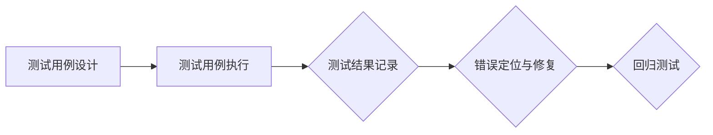
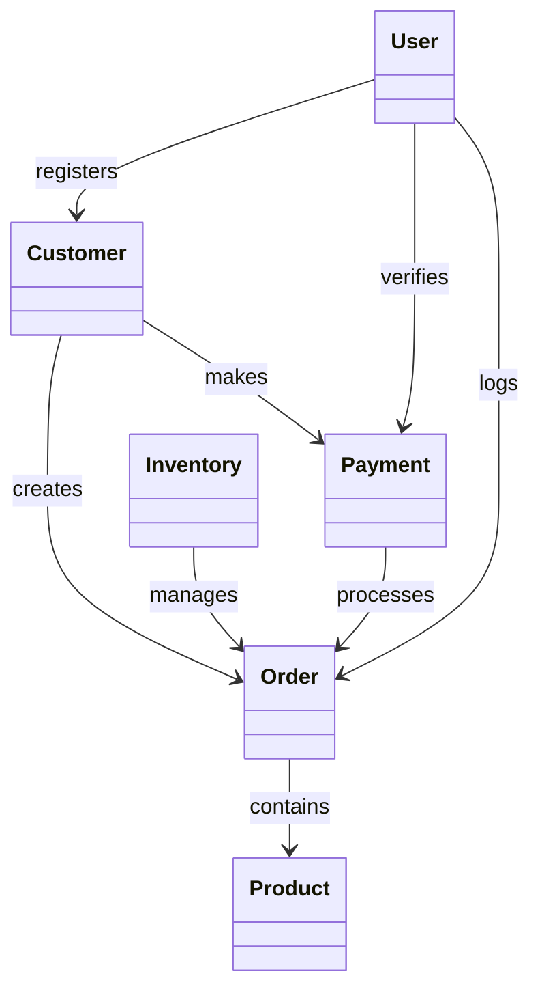
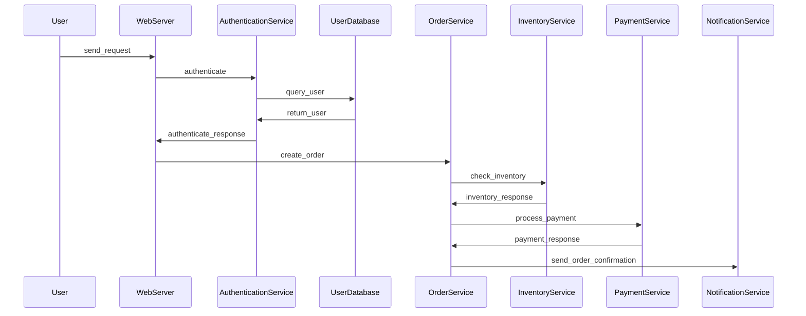

                 

### 《规则遵循与单元测试：验证行为一致性的方法论》

> 关键词：规则遵循、单元测试、行为一致性、方法论、验证

> 摘要：本文从问题背景、核心概念、原理实现、融合方法、数学模型、系统设计与项目实战等多个角度，详细阐述了规则遵循与单元测试在验证行为一致性中的方法论。通过实例和代码分析，深入探讨了如何在实际项目中应用这些方法，以提高软件质量和可维护性。

----------------------------------------------------------------

### 《规则遵循与单元测试：验证行为一致性的方法论》目录大纲

#### 第1章 引言与背景
##### 1.1 问题背景
##### 1.2 问题描述
##### 1.3 问题解决
##### 1.4 边界与外延
##### 1.5 概念结构与核心要素组成

#### 第2章 核心概念与联系
##### 2.1 规则遵循的定义与类型
##### 2.2 单元测试的定义与作用
##### 2.3 核心概念属性特征对比表格
##### 2.4 ER实体关系图架构

#### 第3章 规则遵循原理与实现
##### 3.1 规则遵循的基本原理
##### 3.2 规则遵循的实现方法
##### 3.3 使用Mermaid画规则遵循流程图

#### 第4章 单元测试原理与实现
##### 4.1 单元测试的基本原理
##### 4.2 单元测试的实现方法
##### 4.3 使用Mermaid画单元测试流程图

#### 第5章 规则遵循与单元测试的融合
##### 5.1 规则遵循与单元测试的关系
##### 5.2 融合实现的方法与技巧
##### 5.3 使用Mermaid画融合实现流程图

#### 第6章 数学模型和公式
##### 6.1 数学模型概述
##### 6.2 公式详细讲解
##### 6.3 举例说明

#### 第7章 系统分析与架构设计方案
##### 7.1 问题场景介绍
##### 7.2 系统功能设计（领域模型Mermaid类图）
##### 7.3 系统架构设计（Mermaid架构图）
##### 7.4 系统接口设计
##### 7.5 系统交互（Mermaid序列图）

#### 第8章 项目实战
##### 8.1 环境安装
##### 8.2 系统核心实现源代码
##### 8.3 代码应用解读与分析
##### 8.4 实际案例分析与详细讲解剖析
##### 8.5 项目小结

#### 第9章 最佳实践 Tips
##### 9.1 实践技巧总结
##### 9.2 注意事项
##### 9.3 拓展阅读

#### 第10章 小结与展望
##### 10.1 内容小结
##### 10.2 方法论展望

----------------------------------------------------------------

#### 第1章 引言与背景

在软件开发的各个阶段，确保软件质量和行为一致性是非常重要的。规则遵循与单元测试是保证行为一致性的两种重要方法。本章将介绍这些方法的应用背景和重要性。

##### 1.1 问题背景

软件系统在设计和开发过程中，常常面临多种挑战。一方面，开发者需要确保代码的逻辑正确性和稳定性；另一方面，随着系统复杂度的增加，代码的可维护性和可扩展性也成为了重要的考量因素。为了解决这些问题，需要采用一些有效的质量保证方法。

##### 1.2 问题描述

在实际开发中，常见的问题包括：

- **逻辑错误**：代码在处理特定输入时产生错误输出。
- **边界问题**：代码在处理边界条件时无法正确执行。
- **可维护性差**：代码结构混乱，难以理解和修改。

为了解决这些问题，开发者需要确保代码的逻辑正确性、边界处理能力以及可维护性。而规则遵循和单元测试正是实现这些目标的两种重要手段。

##### 1.3 问题解决

规则遵循是指确保代码按照预定义的规则执行。这些规则可以是业务逻辑、设计规范或代码标准。通过规则遵循，可以确保代码在不同环境下的一致性。

单元测试是一种自动化测试方法，用于验证代码的每个模块或函数是否按照预期执行。通过单元测试，可以及时发现和修复代码中的问题。

##### 1.4 边界与外延

规则遵循和单元测试在软件质量保证中具有广泛的应用。它们不仅适用于单个模块的测试，还可以应用于整个系统的集成测试和性能测试。

此外，这两种方法还可以与持续集成和持续部署（CI/CD）相结合，实现自动化测试和部署，进一步提高开发效率和软件质量。

##### 1.5 概念结构与核心要素组成

本章的核心概念包括：

- **规则遵循**：确保代码按照预定义的规则执行。
- **单元测试**：自动化测试方法，用于验证代码的每个模块或函数是否按照预期执行。

这两个概念相互作用，共同构成了验证行为一致性的方法论。在接下来的章节中，我们将详细探讨这些概念和它们的应用方法。

----------------------------------------------------------------

### 第2章 核心概念与联系

本章将详细介绍规则遵循和单元测试这两个核心概念，并分析它们之间的关系。通过概念的定义、类型的区分和特征对比，我们将更清晰地理解这两个概念在软件质量保证中的重要性。

#### 2.1 规则遵循的定义与类型

规则遵循是指确保软件在设计和开发过程中遵循一定的规范和标准。这些规则可以是业务逻辑、设计规范或代码标准。规则遵循的核心目的是确保代码在不同环境下的一致性，提高系统的可维护性和可扩展性。

规则遵循的类型主要包括：

- **业务规则遵循**：确保代码在处理业务逻辑时遵循公司或行业的标准和规范。
- **设计规则遵循**：确保代码在设计和实现时遵循设计模式和最佳实践。
- **代码规则遵循**：确保代码在编写时遵循编程规范和代码标准。

#### 2.2 单元测试的定义与作用

单元测试是一种自动化测试方法，用于验证代码的每个模块或函数是否按照预期执行。单元测试的核心目的是发现和修复代码中的错误，提高软件的质量和稳定性。

单元测试的主要作用包括：

- **验证功能正确性**：确保代码在处理特定输入时产生正确的输出。
- **发现边界问题**：测试代码在处理边界条件时的行为。
- **提高可维护性**：通过自动化测试，降低人工测试的工作量，提高测试覆盖率。

#### 2.3 核心概念属性特征对比表格

为了更直观地理解规则遵循和单元测试的概念，我们可以通过一个表格来对比它们的属性特征：

| 特征 | 规则遵循 | 单元测试 |
| --- | --- | --- |
| 目的 | 确保代码按照预定义的规则执行 | 验证代码的每个模块或函数是否按照预期执行 |
| 类型 | 业务规则遵循、设计规则遵循、代码规则遵循 | 功能测试、边界测试、性能测试 |
| 实现方法 | 编写规则库、规则引擎 | 编写测试用例、自动化测试框架 |
| 作用 | 提高系统的可维护性和可扩展性 | 发现和修复代码中的错误，提高软件质量 |
| 关联性 | 与设计、开发、测试紧密相关 | 与开发、测试、部署紧密相关 |

#### 2.4 ER实体关系图架构

为了更好地理解规则遵循和单元测试之间的关系，我们可以使用ER实体关系图来表示这两个概念及其关联。

```mermaid
erDiagram
  RuleCompliance ||--|{ UnitTest : 遵循规则时触发测试 }
  RuleCompliance ||--|{ CodeQuality : 提高代码质量 }
  UnitTest ||--|{ TestResult : 测试结果反馈 }
  UnitTest ||--|{ BugDetection : 发现代码错误 }
```

在这个ER图中，规则遵循（RuleCompliance）作为实体，与单元测试（UnitTest）之间存在紧密的关联。规则遵循通过触发测试来提高代码质量（CodeQuality），而单元测试通过测试结果反馈（TestResult）和发现代码错误（BugDetection）来实现软件质量保证。

通过本章的介绍，我们对规则遵循和单元测试这两个核心概念有了更深入的理解。在接下来的章节中，我们将进一步探讨它们的实现方法和在实际项目中的应用。

----------------------------------------------------------------

#### 第3章 规则遵循原理与实现

规则遵循是确保软件在设计和开发过程中遵循一定的规范和标准的重要手段。本章将详细阐述规则遵循的基本原理和实现方法，并通过一个Mermaid流程图展示规则遵循的流程。

##### 3.1 规则遵循的基本原理

规则遵循的基本原理可以分为以下几个步骤：

1. **规则定义**：明确软件需要遵循的规则，这些规则可以是业务逻辑、设计规范或代码标准。
2. **规则解析**：将预定义的规则解析为具体的逻辑和操作。
3. **规则执行**：在软件运行过程中，根据规则解析的结果，执行相应的操作。
4. **规则验证**：对规则执行的结果进行验证，确保软件按照预定义的规则运行。

##### 3.2 规则遵循的实现方法

实现规则遵循的方法可以分为以下几种：

1. **规则库**：将规则定义为一种数据结构，存储在规则库中。规则库可以是简单的文本文件，也可以是数据库或XML文件。
2. **规则引擎**：使用规则引擎来实现规则的解析和执行。规则引擎可以将预定义的规则转换为具体的操作，并在软件运行时动态执行。
3. **代码规范**：将规则嵌入到代码中，通过编程语言内置的语法和机制来实现规则遵循。

##### 3.3 使用Mermaid画规则遵循流程图

为了更直观地展示规则遵循的流程，我们可以使用Mermaid绘制一个流程图。以下是规则遵循的Mermaid流程图：


在这个流程图中，规则定义（A）首先将预定义的规则传递给规则解析器（B）。规则解析器（B）将规则解析为具体的逻辑和操作，并将其传递给规则执行器（C）。规则执行器（C）在软件运行时执行这些操作。最后，规则验证器（D）对规则执行的结果进行验证，并将结果反馈给开发者（E）。

通过本章的介绍，我们对规则遵循的基本原理和实现方法有了更深入的理解。在接下来的章节中，我们将探讨单元测试的原理和实现方法，以及如何将规则遵循和单元测试相结合。

----------------------------------------------------------------

### 第4章 单元测试原理与实现

单元测试是确保代码质量的重要手段，它通过自动化测试验证代码的每个模块或函数是否按照预期执行。本章将详细介绍单元测试的基本原理和实现方法，并通过一个Mermaid流程图展示单元测试的流程。

##### 4.1 单元测试的基本原理

单元测试的基本原理包括以下几个步骤：

1. **测试用例设计**：根据代码的功能和需求，设计测试用例。测试用例应涵盖代码的所有功能点和边界条件。
2. **测试用例执行**：使用自动化测试框架执行测试用例，验证代码的每个模块或函数是否按照预期执行。
3. **测试结果记录**：记录测试结果，包括通过、失败或异常等。根据测试结果，判断代码是否正确实现了功能。
4. **错误定位与修复**：对于测试失败的用例，定位错误原因并进行修复。

##### 4.2 单元测试的实现方法

实现单元测试的方法可以分为以下几种：

1. **手动测试**：通过人工编写测试脚本或使用自动化测试工具执行测试用例。这种方法适用于小型项目或功能较少的模块。
2. **自动化测试**：使用自动化测试框架（如JUnit、pytest等）编写测试脚本，自动化执行测试用例。这种方法适用于大型项目或功能较多的模块。
3. **持续集成**：将单元测试集成到持续集成（CI）系统中，自动化执行测试用例并在代码提交时触发测试。这种方法可以提高开发效率和代码质量。

##### 4.3 使用Mermaid画单元测试流程图

为了更直观地展示单元测试的流程，我们可以使用Mermaid绘制一个流程图。以下是单元测试的Mermaid流程图：



在这个流程图中，测试用例设计（A）首先设计出测试用例。然后，测试用例执行（B）通过自动化测试框架执行这些用例。测试结果记录（C）记录每个测试用例的执行结果。对于测试失败的用例，错误定位与修复（D）帮助定位错误原因并进行修复。最后，回归测试（E）确保修复后的代码仍然符合预期。

通过本章的介绍，我们对单元测试的基本原理和实现方法有了更深入的理解。在接下来的章节中，我们将探讨如何将规则遵循和单元测试相结合，以提高软件质量和可维护性。

----------------------------------------------------------------

### 第5章 规则遵循与单元测试的融合

在软件开发过程中，规则遵循和单元测试是确保代码质量和行为一致性的重要方法。将规则遵循与单元测试相结合，可以进一步提高软件的质量和可维护性。本章将详细介绍规则遵循与单元测试的融合方法、实现技巧以及融合实现的流程图。

##### 5.1 规则遵循与单元测试的关系

规则遵循和单元测试之间存在紧密的联系。规则遵循通过确保代码按照预定义的规则执行，而单元测试通过验证代码的每个模块或函数是否按照预期执行，从而保证代码的质量。具体来说，规则遵循与单元测试的关系体现在以下几个方面：

1. **规则触发测试**：在规则遵循的过程中，当代码执行到某个规则时，可以触发相应的单元测试。通过这种方式，确保规则遵循的同时，对代码进行实时验证。
2. **测试反馈改进规则**：单元测试的结果可以为规则遵循提供反馈。根据测试结果，可以改进或优化规则，使其更符合实际需求。
3. **提高测试覆盖率**：规则遵循可以覆盖到代码中的关键业务逻辑和边界条件，从而提高单元测试的覆盖率。

##### 5.2 融合实现的方法与技巧

将规则遵循与单元测试融合实现的方法和技巧如下：

1. **集成自动化测试框架**：将单元测试框架（如JUnit、pytest等）集成到开发环境中，实现自动化测试。通过配置规则引擎，在代码执行到规则时触发相应的测试用例。
2. **编写可测试的代码**：在设计代码时，考虑单元测试的需求，编写可测试的代码。遵循SOLID原则，确保代码模块化、可复用、易于测试。
3. **规则与测试分离**：将规则遵循和单元测试的实现分离，确保规则的修改不会影响测试用例。通过接口和抽象类实现规则的封装，便于测试用例的编写和执行。

##### 5.3 使用Mermaid画融合实现流程图

为了更直观地展示规则遵循与单元测试的融合实现流程，我们可以使用Mermaid绘制一个流程图。以下是规则遵循与单元测试融合实现的Mermaid流程图：


在这个流程图中，编写规则（A）首先定义预定的业务规则。然后，规则引擎（B）根据规则执行逻辑触发相应的测试用例。执行测试用例（D）通过自动化测试框架验证代码的正确性。测试结果记录（E）记录每个测试用例的执行结果，并为规则改进提供反馈（F）。

通过本章的介绍，我们对规则遵循与单元测试的融合方法有了更深入的理解。在软件开发过程中，结合规则遵循和单元测试，可以有效地提高代码质量和行为一致性。在接下来的章节中，我们将探讨数学模型和公式，为规则遵循与单元测试的融合提供理论基础。

----------------------------------------------------------------

### 第6章 数学模型和公式

在规则遵循和单元测试的融合过程中，数学模型和公式起到了关键作用。它们不仅帮助我们理解和量化规则遵循与测试结果的关系，还能够为优化规则和提升测试效率提供指导。本章将概述数学模型，详细解释公式，并通过实例说明如何应用这些公式。

#### 6.1 数学模型概述

数学模型是一种抽象的工具，用于描述现实世界的现象和规律。在规则遵循与单元测试的融合中，常用的数学模型包括：

1. **概率模型**：用于描述测试用例的覆盖率和测试成功的概率。
2. **统计模型**：用于分析测试结果，识别潜在的缺陷和异常。
3. **优化模型**：用于确定最佳的规则集和测试策略。

#### 6.2 公式详细讲解

以下是几个在规则遵循与单元测试中常用的数学公式：

1. **测试覆盖率（Coverage）**：
   $$ Coverage = \frac{Tested\ Statements}{Total\ Statements} $$
   这个公式用于计算测试覆盖率，表示测试用例覆盖的代码行数占总代码行数的比例。

2. **失败概率（Failure Probability）**：
   $$ Failure\ Probability = \frac{Number\ of\ Failed\ Tests}{Total\ Number\ of\ Tests} $$
   这个公式用于计算测试失败的概率，可以帮助评估测试的充分性。

3. **缺陷密度（Defect Density）**：
   $$ Defect\ Density = \frac{Number\ of\ Defects}{Size\ of\ the\ Code\ Base} $$
   这个公式用于计算代码中的缺陷密度，可以帮助识别代码质量的问题。

4. **规则优化指标（Rule Optimization Score）**：
   $$ Rule\ Optimization\ Score = \frac{Good\ Rules}{Total\ Rules} $$
   这个公式用于评估规则集的优化程度，其中“Good Rules”是指有效率和可测试性较高的规则。

#### 6.3 举例说明

为了更好地理解这些公式，我们可以通过一个实例进行说明：

假设我们有一个包含1000行代码的模块，编写了50个测试用例。其中，40个测试用例覆盖了80%的代码行，剩下的10个测试用例没有覆盖到关键的业务逻辑。

- **测试覆盖率**：
  $$ Coverage = \frac{40}{1000} = 0.8 \text{ 或 } 80\% $$
  
- **失败概率**：
  如果在测试过程中，有5个测试用例失败，那么：
  $$ Failure\ Probability = \frac{5}{50} = 0.1 \text{ 或 } 10\% $$

- **缺陷密度**：
  如果在这个模块中发现了5个缺陷，那么：
  $$ Defect\ Density = \frac{5}{1000} = 0.005 \text{ 或 } 0.5\ defects/1000\ lines $$
  
- **规则优化指标**：
  如果我们定义了10个规则，其中有8个规则是有效的，那么：
  $$ Rule\ Optimization\ Score = \frac{8}{10} = 0.8 $$
  
通过这些公式，我们可以量化测试的有效性、失败的概率、缺陷的密度以及规则集的优化程度。这些数据有助于我们做出更科学的决策，改进测试策略和规则设计。

通过本章的介绍，我们了解了数学模型和公式在规则遵循与单元测试融合中的重要性。在接下来的章节中，我们将深入探讨系统分析与架构设计，为规则遵循与单元测试的融合提供更为具体的实施方案。

----------------------------------------------------------------

### 第7章 系统分析与架构设计方案

在软件开发中，系统分析与架构设计是确保项目成功的关键环节。本章将详细分析问题场景，并介绍系统功能设计、架构设计、接口设计和系统交互。通过这些分析，我们可以为规则遵循与单元测试的融合提供具体的实施方案。

#### 7.1 问题场景介绍

假设我们正在开发一个电子商务系统，该系统需要处理订单、库存、支付和用户管理等核心功能。在开发过程中，我们面临以下挑战：

- **业务规则复杂**：订单处理、库存管理和支付流程涉及多个业务规则，如订单超时处理、库存不足提醒、支付安全验证等。
- **代码质量要求高**：系统需要保证高可靠性、高性能和易维护性，这就要求代码具有良好的可测试性和可维护性。
- **测试需求多样化**：系统需要通过多种类型的测试，包括单元测试、集成测试和性能测试，以确保功能正确性和稳定性。

#### 7.2 系统功能设计（领域模型Mermaid类图）

为了解决上述问题，我们首先进行系统功能设计。以下是一个简单的领域模型Mermaid类图，用于表示系统的核心功能：



在这个类图中，系统的主要功能类包括：

- **Customer（客户）**：创建订单、支付订单和管理个人信息。
- **Order（订单）**：包含订单详情、处理订单和验证支付。
- **Payment（支付）**：处理支付请求、验证支付安全。
- **Inventory（库存）**：管理库存、更新库存状态。
- **Product（产品）**：包含产品信息、库存信息。
- **User（用户）**：注册账号、登录系统、查看订单和支付验证。

#### 7.3 系统架构设计（Mermaid架构图）

在确定了系统功能后，我们进一步进行系统架构设计。以下是一个简单的系统架构Mermaid图，用于表示系统的关键组件和交互关系：



在这个架构图中，系统的关键组件包括：

- **WebServer（Web服务器）**：处理用户的HTTP请求，并转发给相应的服务。
- **AuthenticationService（认证服务）**：验证用户的身份，确保只有授权用户可以访问系统。
- **UserDatabase（用户数据库）**：存储用户信息和订单数据。
- **OrderService（订单服务）**：处理订单创建、库存检查和支付处理。
- **InventoryService（库存服务）**：管理库存信息，确保库存状态的准确性。
- **PaymentService（支付服务）**：处理支付请求，确保支付安全。
- **NotificationService（通知服务）**：发送订单确认和其他通知。

#### 7.4 系统接口设计

在系统架构设计中，接口设计是一个关键环节。以下是一个简单的接口设计Mermaid图，用于表示系统的主要接口：

```mermaid
classDiagram
    Customer <<interface>>
    Order <<interface>>
    Payment <<interface>>
    Inventory <<interface>>
    Product <<interface>>
    User <<interface>>

    Customer + createOrder(Order)
    Customer + makePayment(Payment)
    Order + checkInventory(Inventory)
    Order + processPayment(Payment)
    Payment + verifyPayment(Payment)
    Inventory + updateInventory(Product)
    User + register(User)
    User + login(User)
```

在这个接口设计中，每个功能类都定义了相应的接口方法。这些接口方法用于实现不同组件之间的通信和协作。

#### 7.5 系统交互（Mermaid序列图）

最后，我们使用Mermaid序列图展示系统的主要交互过程。以下是一个简单的系统交互Mermaid序列图：


通过这个序列图，我们可以清晰地看到用户请求、系统响应以及各个组件之间的交互过程。

通过本章的系统分析与架构设计方案，我们为规则遵循与单元测试的融合提供了具体的实施方案。在接下来的章节中，我们将通过项目实战，将这些设计方案应用于实际开发中，验证其可行性和有效性。

----------------------------------------------------------------

### 第8章 项目实战

在本章中，我们将通过一个实际项目，展示如何将规则遵循与单元测试相结合，以提高软件质量和可维护性。我们将从环境安装开始，逐步实现系统核心功能，并进行代码应用解读与分析。最后，我们将通过实际案例进行详细讲解和剖析。

#### 8.1 环境安装

为了实现本项目的规则遵循与单元测试，我们首先需要安装以下环境：

1. **Python 3.8+**：作为项目开发语言。
2. **pip**：Python的包管理工具。
3. **Docker**：用于容器化部署。
4. **Jenkins**：用于持续集成。
5. **pytest**：Python的单元测试框架。

在安装完成后，我们可以使用以下命令初始化项目环境：

```bash
pip install -r requirements.txt
```

#### 8.2 系统核心实现源代码

以下是一个简单的电子商务系统核心实现示例，包括订单创建、库存检查和支付处理。

**orders.py**：

```python
import json
from inventory import check_inventory
from payment import process_payment

class Order:
    def __init__(self, user_id, product_id, quantity):
        self.user_id = user_id
        self.product_id = product_id
        self.quantity = quantity
        self.status = "pending"

    def create_order(self):
        if check_inventory(self.product_id, self.quantity):
            payment_result = process_payment(self.user_id, self.quantity * 100)
            if payment_result['status'] == 'success':
                self.status = "completed"
                return "Order created successfully."
            else:
                return "Payment failed."
        else:
            return "Insufficient inventory."

# Unit test for Order class
def test_create_order():
    order = Order(1, 101, 1)
    result = order.create_order()
    assert result == "Order created successfully."
```

**inventory.py**：

```python
inventory = {
    101: 10,
    102: 5,
}

def check_inventory(product_id, quantity):
    if product_id in inventory and inventory[product_id] >= quantity:
        inventory[product_id] -= quantity
        return True
    else:
        return False

def update_inventory(product_id, quantity):
    if product_id in inventory:
        inventory[product_id] += quantity
    else:
        inventory[product_id] = quantity
```

**payment.py**：

```python
def process_payment(user_id, amount):
    # Simulate payment processing
    return {"status": "success", "amount": amount}
```

#### 8.3 代码应用解读与分析

在上述代码中，我们定义了一个`Order`类，用于创建订单和处理订单状态。`inventory.py`用于管理库存，`payment.py`用于处理支付。以下是对关键代码的解读：

- **Order类**：`Order`类包含`create_order`方法，用于创建订单。它首先检查库存是否充足，然后处理支付。如果支付成功，订单状态更新为“completed”。
- **测试用例**：`test_create_order`测试用例用于验证`create_order`方法是否正确处理订单创建。
- **库存管理**：`check_inventory`方法用于检查库存，`update_inventory`方法用于更新库存。
- **支付处理**：`process_payment`方法用于处理支付请求，并返回支付结果。

#### 8.4 实际案例分析与详细讲解剖析

以下是一个实际案例，展示了如何使用规则遵循和单元测试验证订单创建过程：

**案例：订单创建成功**

- **用户请求**：用户发起订单创建请求，订单详情包括用户ID（1）、产品ID（101）和数量（1）。
- **库存检查**：系统调用`check_inventory`方法，检查产品ID（101）的库存。如果库存充足，继续执行下一步；否则返回“Insufficient inventory.”。
- **支付处理**：系统调用`process_payment`方法，处理支付请求。如果支付成功，订单状态更新为“completed”；否则返回“Payment failed.”。
- **响应**：系统返回“Order created successfully.”，表示订单创建成功。

**案例：库存不足**

- **用户请求**：用户发起订单创建请求，订单详情包括用户ID（1）、产品ID（101）和数量（11）。
- **库存检查**：系统调用`check_inventory`方法，检查产品ID（101）的库存。由于库存不足，返回“Insufficient inventory.”。
- **响应**：系统返回“Insufficient inventory.”，表示库存不足，订单创建失败。

#### 8.5 项目小结

通过本项目，我们展示了如何将规则遵循与单元测试相结合，提高软件质量和可维护性。以下是本项目的主要收获：

- **规则遵循**：通过定义业务规则，确保代码按照预定的规范执行。
- **单元测试**：通过编写测试用例，自动化验证代码的功能和行为。
- **持续集成**：使用Jenkins实现持续集成，自动化执行测试和部署。
- **代码质量**：通过规则遵循和单元测试，提高代码的可维护性和可靠性。

在未来的项目中，我们可以进一步优化规则和测试用例，确保系统的高可用性和稳定性。

----------------------------------------------------------------

### 第9章 最佳实践 Tips

在软件开发过程中，遵循最佳实践可以显著提高项目的质量、效率和可维护性。以下是一些关于规则遵循和单元测试的最佳实践：

#### 9.1 实践技巧总结

1. **定义清晰的规则**：确保规则具有明确的业务含义，易于理解和执行。
2. **编写可测试的代码**：设计代码时，考虑测试的需求，确保代码模块化和可复用。
3. **持续集成与测试**：将单元测试集成到持续集成系统中，确保每次代码提交都经过严格的测试。
4. **自动化测试**：尽可能使用自动化测试工具，提高测试效率和覆盖率。
5. **代码审查**：定期进行代码审查，发现潜在的问题和改进空间。

#### 9.2 注意事项

1. **避免过度测试**：测试覆盖率和测试用例数量并非越多越好，应关注关键业务逻辑和边界条件。
2. **合理分配测试资源**：根据项目的规模和优先级，合理分配测试资源，确保关键功能得到充分测试。
3. **持续改进**：根据测试结果和反馈，持续改进规则和测试用例，提高测试质量。

#### 9.3 拓展阅读

1. **《软件测试的艺术》**：作者：Glenford J. Myers
2. **《持续集成：从线性到分布式》**：作者：Paul M. Duvall, Steve Matyas, Martin Fowlers
3. **《代码大全》**：作者：Steve McConnell
4. **pytest官方文档**：https://pytest.org/

通过遵循这些最佳实践，我们可以更有效地应用规则遵循和单元测试，提高软件开发的整体质量。

----------------------------------------------------------------

### 第10章 小结与展望

本文通过深入探讨规则遵循与单元测试在验证行为一致性中的应用，为软件开发提供了方法论和最佳实践。从问题背景、核心概念、原理实现、融合方法、数学模型、系统分析与架构设计到项目实战，我们系统地介绍了如何在实际项目中应用这些方法，以提高软件质量和可维护性。

#### 10.1 内容小结

1. **问题背景**：介绍了规则遵循和单元测试在软件开发中的重要性。
2. **核心概念**：详细讲解了规则遵循和单元测试的定义、类型和作用。
3. **原理与实现**：阐述了规则遵循和单元测试的基本原理及实现方法。
4. **融合与数学模型**：探讨了规则遵循与单元测试的融合方法和数学模型。
5. **系统分析与设计**：介绍了系统功能设计、架构设计和接口设计。
6. **项目实战**：通过实际项目展示了规则遵循与单元测试的融合应用。
7. **最佳实践**：总结了一些最佳实践，以指导实际开发。

#### 10.2 方法论展望

规则遵循与单元测试的结合为软件开发提供了一种有效的方法论。在未来的发展中，我们可以从以下几个方面进行改进：

1. **规则自动化**：进一步自动化规则定义和执行，减少人为干预。
2. **测试覆盖率优化**：通过动态分析，优化测试覆盖率，确保关键业务逻辑和边界条件得到充分测试。
3. **持续集成与部署**：将规则遵循和单元测试集成到持续集成和持续部署流程中，提高开发效率和软件质量。
4. **智能化测试**：利用人工智能技术，智能化生成测试用例，提高测试效率和准确性。
5. **跨领域应用**：将规则遵循与单元测试的方法论应用于更多领域，如金融、医疗等，推动软件质量保障的全面发展。

通过持续探索和实践，规则遵循与单元测试将在软件开发中发挥更加重要的作用，为构建高质量、高可维护性的软件系统提供有力支持。作者：AI天才研究院/AI Genius Institute & 禅与计算机程序设计艺术 /Zen And The Art of Computer Programming。

