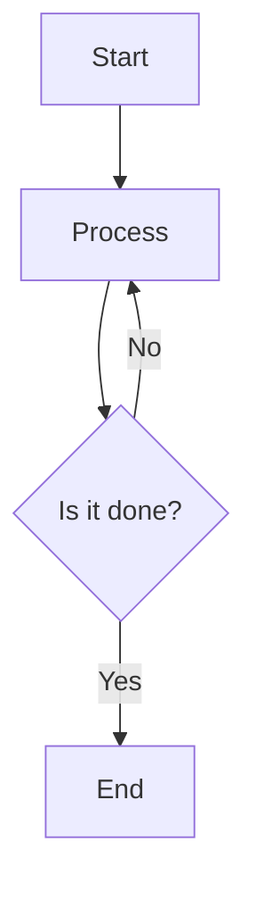
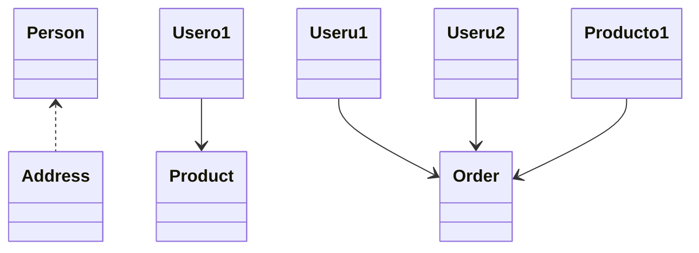
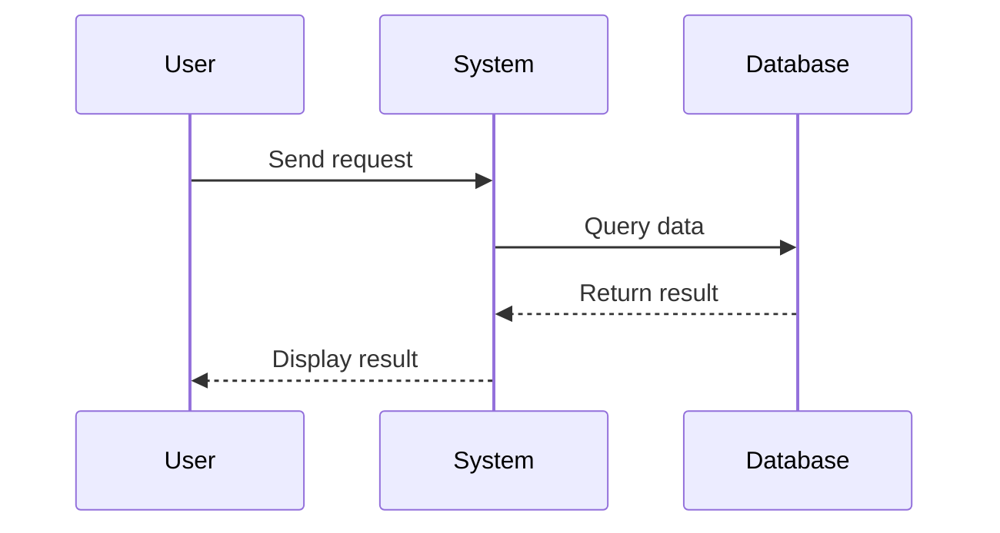

                 

### 警惕坏的编码习惯

> 关键词：编码习惯、坏编码、代码质量、可维护性、最佳实践

> 摘要：本文深入探讨了编程领域常见的坏编码习惯及其对项目的影响。通过详细的案例分析，揭示了过度使用全局变量、缺乏代码注释、代码冗余、忽视代码格式规范等问题的危害。同时，本文提出了培养良好编码习惯的策略，包括提高代码可读性和可维护性、有效注释的编写方法、遵循编程最佳实践等。文章最后总结了良好编码习惯的成果评估方法，并呼吁开发者持续改进编码习惯，提升项目质量。

### 第一部分：编码习惯概述与影响

#### 第1章：编码习惯的重要性与影响

在软件开发的漫长历程中，编码习惯扮演着至关重要的角色。良好的编码习惯不仅能提高开发效率，还能显著提升代码的可读性和可维护性。然而，坏编码习惯往往会导致代码冗余、错误频发，甚至影响项目的整体质量。

**1.1 编程的基石：良好的编码习惯**

良好的编码习惯是编程的基石，它包括以下几个方面：

- **代码规范**：遵循统一的代码风格和命名规范，使得代码易读、易维护。
- **注释与文档**：适时的代码注释和详尽的文档，有助于后续的开发和维护。
- **代码复用**：通过模块化和函数化，减少代码冗余，提高开发效率。
- **代码结构**：合理地组织代码结构，使代码层次分明，易于理解。

**1.2 坏编码习惯的危害**

坏编码习惯的危害主要体现在以下几个方面：

- **代码可读性差**：导致后续的开发者难以理解代码，增加了维护成本。
- **错误率高**：不规范的编码习惯容易导致代码错误，影响项目的稳定性。
- **维护难度大**：复杂的代码结构和不清晰的注释，使得代码维护变得困难。
- **开发效率低下**：不良的编码习惯往往需要更多的时间来修复和调整。

**1.3 改善编码习惯的必要性**

为了提高代码质量，提升项目开发效率，改善编码习惯显得尤为必要。良好的编码习惯不仅有助于个人成长，还能提升整个团队的协作效率。因此，开发者应当重视编码习惯的养成。

**1.4 本章小结**

本文介绍了编码习惯的重要性及其对项目的影响。通过了解良好编码习惯的基石和坏编码习惯的危害，开发者应意识到改善编码习惯的必要性。在接下来的章节中，我们将进一步探讨常见坏编码习惯的列举与分析。

----------------------------------------------------------------

#### 第2章：常见坏编码习惯列举与分析

在软件开发过程中，坏编码习惯屡见不鲜，它们往往会导致代码质量下降，影响项目的进展。以下列举了一些常见的坏编码习惯，并对其进行分析。

**2.1 过度使用全局变量**

全局变量是指在程序全局范围内有效的变量。过度使用全局变量会导致以下问题：

- **代码可读性差**：全局变量增加了代码的复杂性，使得代码难以阅读和理解。
- **难以调试**：修改全局变量可能影响整个程序的运行，调试变得困难。
- **耦合度高**：全局变量容易导致模块之间的耦合度增加，降低代码的可维护性。

**2.2 过度依赖注释**

尽管注释对于理解代码非常重要，但过度依赖注释也会带来问题：

- **注释冗余**：代码本身应该清晰明了，注释只是为了解释难以理解的代码部分。过度依赖注释意味着代码本身质量不高。
- **注释过时**：注释与代码不一致会导致混淆，增加了维护难度。

**2.3 缺乏代码注释**

缺乏代码注释的代码难以被理解和维护，导致以下问题：

- **代码难以理解**：新手开发者或后续开发者难以理解代码的意图和功能。
- **维护困难**：修改代码时，开发者需要花费更多时间来理解现有代码。

**2.4 代码冗余与重复**

代码冗余与重复会导致以下问题：

- **代码维护困难**：一旦需要修改重复代码，开发者需要修改多处，增加了维护难度。
- **开发效率降低**：重复代码增加了代码量，降低了开发效率。

**2.5 忽视代码格式规范**

忽视代码格式规范会导致以下问题：

- **代码可读性差**：不规范的代码格式使得代码难以阅读。
- **团队合作困难**：团队成员可能对代码格式有不同的偏好，导致代码库混乱。

**2.6 硬编码问题**

硬编码问题指的是在代码中直接嵌入具体的值，而不是使用参数或配置文件。以下是一些硬编码问题：

- **不易维护**：一旦需要修改硬编码值，开发者需要修改多处代码。
- **扩展性差**：硬编码值使得代码难以适应新的需求或环境。

**2.7 缺乏代码文档**

缺乏代码文档会导致以下问题：

- **代码理解困难**：开发者难以了解代码的架构和设计。
- **学习成本高**：新手开发者需要更多时间来熟悉代码库。

**2.8 本章小结**

本章列举了常见的坏编码习惯，并分析了它们对代码质量和项目进展的影响。通过了解这些坏习惯，开发者可以更好地避免它们，从而提高代码质量和项目效率。

----------------------------------------------------------------

### 第二部分：良好编码习惯的培养与实施

#### 第3章：代码可读性与可维护性

良好的代码可读性和可维护性是编程成功的关键。以下是培养良好编码习惯的一些关键步骤。

**3.1 可读性的重要性**

代码可读性对于软件开发至关重要，它包括以下几个方面：

- **清晰的命名**：变量、函数和类的命名应能够准确反映其功能。
- **简洁性**：代码应简洁明了，避免不必要的复杂性。
- **代码结构**：代码结构应层次分明，便于理解。

**3.2 可维护性的原则**

代码的可维护性包括以下几个方面：

- **模块化**：将代码分解为模块或函数，每个模块或函数应具有单一职责。
- **注释**：适时的注释可以帮助开发者理解代码的功能和逻辑。
- **文档**：详细的文档可以帮助开发者快速了解代码的结构和设计。

**3.3 代码简洁性的实践**

以下是一些实践代码简洁性的技巧：

- **避免冗长函数**：函数应保持短小精悍，避免过长的函数。
- **减少重复代码**：通过函数复用或代码模板减少重复代码。
- **使用空行和空格**：合理使用空行和空格可以使代码更加清晰。

**3.4 命名规范的设定**

良好的命名规范可以显著提高代码的可读性。以下是一些命名规范的建议：

- **变量命名**：变量名应简洁且具有描述性。
- **函数命名**：函数名应明确表示其功能。
- **类命名**：类名应描述其职责和功能。

**3.5 代码结构的组织**

良好的代码结构是提高代码可读性和可维护性的基础。以下是一些组织代码结构的建议：

- **分层结构**：将代码分为不同的层，如表示层、业务层和数据访问层。
- **模块化**：将代码划分为模块，每个模块负责特定功能。
- **目录结构**：合理的目录结构可以帮助开发者快速找到所需代码。

**3.6 本章小结**

本章介绍了代码可读性和可维护性的重要性，以及如何通过命名规范、代码简洁性和代码结构的组织来提高代码质量。通过实践这些良好编码习惯，开发者可以编写出更加清晰、易于维护的代码。

----------------------------------------------------------------

#### 第4章：代码注释与文档编写

良好的代码注释和文档编写是提高代码可读性和可维护性的关键。以下是一些关于代码注释和文档编写的最佳实践。

**4.1 代码注释的作用**

代码注释对于理解和维护代码至关重要。以下是代码注释的几个重要作用：

- **解释代码功能**：注释可以帮助开发者了解代码的功能和用途。
- **说明复杂逻辑**：对于复杂的算法或逻辑，注释可以帮助开发者理解其实现原理。
- **提示潜在问题**：注释可以提醒开发者注意潜在的代码问题或注意事项。

**4.2 有效注释的编写方法**

以下是一些编写有效注释的方法：

- **描述性注释**：注释应简洁明了，描述代码的功能和用途。
- **位置注释**：注释应放置在代码的合适位置，如函数、类和方法的开头或结尾。
- **避免冗长注释**：避免过度注释，以免注释与代码不一致。
- **更新注释**：定期更新注释，确保其与代码保持一致。

**4.3 代码文档化实践**

代码文档化是提高代码可读性和可维护性的重要步骤。以下是代码文档化的几个关键点：

- **使用文档工具**：使用文档工具（如Sphinx、Doxygen等）自动生成文档。
- **编写模块文档**：为每个模块编写文档，包括模块的功能、接口和使用方法。
- **编写函数文档**：为每个函数编写文档，包括函数的功能、参数和返回值。
- **编写类文档**：为每个类编写文档，包括类的职责、属性和方法。

**4.4 使用文档工具**

使用文档工具可以帮助自动化代码文档的生成。以下是几个常用的文档工具：

- **Sphinx**：适用于Python代码，可以生成HTML、LaTeX和PDF格式的文档。
- **Doxygen**：适用于C++代码，支持多种编程语言，可以生成多种格式的文档。
- **Javadoc**：适用于Java代码，可以生成HTML和XML格式的文档。

**4.5 本章小结**

本章介绍了代码注释和文档编写的重要性，以及编写有效注释和文档的最佳实践。通过遵循这些实践，开发者可以显著提高代码的可读性和可维护性。

----------------------------------------------------------------

#### 第5章：遵循编程最佳实践

遵循编程最佳实践是提高代码质量和项目稳定性的关键。以下是几个常见编程语言的推荐实践。

**5.1 编程最佳实践的概述**

编程最佳实践包括以下几个方面：

- **代码规范**：遵循统一的代码风格和命名规范，提高代码的可读性。
- **代码复用**：通过模块化和函数化，减少代码冗余，提高开发效率。
- **测试**：编写单元测试和集成测试，确保代码的正确性和稳定性。
- **版本控制**：使用版本控制系统（如Git），管理代码变更和协作开发。

**5.2 常见编程语言的推荐实践**

以下是一些常见编程语言的推荐实践：

- **Python**：遵循PEP 8编码规范，使用PEP 20的Zen of Python作为指导原则。使用模块和类来组织代码，避免全局变量。使用单元测试框架（如pytest）进行代码测试。
- **Java**：遵循Java编码规范（如Effective Java），使用设计模式提高代码的可复用性和可维护性。编写单元测试和使用SonarQube等工具进行代码质量检查。
- **C++**：遵循C++编码规范，使用面向对象编程，避免使用全局变量。编写单元测试和使用静态代码分析工具（如Cppcheck）进行代码质量检查。
- **JavaScript**：遵循ESLint编码规范，使用模块化和函数化来组织代码。编写单元测试和使用Jest等工具进行代码测试。

**5.3 避免常见编程错误**

以下是一些常见编程错误及其避免方法：

- **空指针异常**：避免在未初始化的变量上调用方法或访问属性。
- **类型错误**：确保变量和函数的参数类型正确，避免类型转换错误。
- **未处理的异常**：使用异常处理机制（如try-catch块）来处理可能出现的异常。
- **内存泄漏**：及时释放不再使用的内存，避免内存泄漏。

**5.4 代码审查与同行评审**

代码审查和同行评审是提高代码质量和团队协作的重要环节。以下是一些建议：

- **定期进行代码审查**：定期进行代码审查，确保代码质量和一致性。
- **编写审查指南**：为代码审查编写指南，明确审查的目标和标准。
- **鼓励反馈**：鼓励团队成员之间进行诚实和尊重的反馈，以提高代码质量。

**5.5 本章小结**

本章介绍了遵循编程最佳实践的重要性，包括代码规范、代码复用、测试和版本控制等方面。通过遵循这些最佳实践，开发者可以编写出更加稳定、高质量的代码。

----------------------------------------------------------------

#### 第6章：代码质量检测与优化

确保代码质量是软件开发过程中的关键环节。以下介绍了一些常用的代码质量检测与优化方法。

**6.1 代码质量检测工具**

代码质量检测工具可以帮助发现潜在的问题，提高代码的稳定性和可维护性。以下是一些常用的代码质量检测工具：

- **SonarQube**：用于多语言的静态代码分析，可以检测代码风格、安全性和可维护性问题。
- **Pylint**：用于Python代码的静态代码分析，可以检测代码风格、安全性和Python最佳实践。
- **Checkstyle**：用于Java代码的静态代码分析，可以检测代码风格和Java编码规范。
- **Cppcheck**：用于C++代码的静态代码分析，可以检测代码风格、安全性和潜在的错误。

**6.2 静态代码分析**

静态代码分析是一种无需执行程序就对源代码进行分析的技术。以下是静态代码分析的一些关键点：

- **代码风格检查**：检查代码是否符合编程规范和命名习惯。
- **潜在错误检测**：检测潜在的语法错误、逻辑错误和安全漏洞。
- **性能分析**：分析代码的执行效率和性能瓶颈。

**6.3 动态代码分析**

动态代码分析是一种在程序执行过程中进行分析的技术。以下是动态代码分析的一些关键点：

- **执行跟踪**：跟踪程序的执行路径，发现潜在的问题和性能瓶颈。
- **性能测试**：对程序进行性能测试，评估其执行效率和响应时间。
- **安全测试**：检测程序的安全性漏洞和潜在的安全风险。

**6.4 性能优化技巧**

以下是一些常见的性能优化技巧：

- **代码优化**：优化代码结构，减少不必要的计算和内存占用。
- **缓存利用**：充分利用缓存机制，减少重复计算和数据访问。
- **并发处理**：利用多线程或多进程技术，提高程序的执行效率。

**6.5 本章小结**

本章介绍了代码质量检测与优化的重要性，包括静态代码分析和动态代码分析的方法以及性能优化技巧。通过使用这些方法，开发者可以显著提高代码的质量和性能。

----------------------------------------------------------------

#### 第7章：持续改进编码习惯

编码习惯的改进是一个持续的过程，需要开发者不断地学习和实践。以下介绍了一些关于持续改进编码习惯的方法。

**7.1 建立编码习惯的自我审查机制**

自我审查是改进编码习惯的关键步骤。以下是一些建议：

- **定期回顾**：定期回顾自己的代码，检查是否存在坏编码习惯。
- **代码审查**：参与代码审查，从他人的代码中学习，发现并纠正自己的问题。
- **代码示例**：通过阅读优秀的代码示例，了解良好的编码习惯。

**7.2 学习与借鉴优秀编码习惯**

以下是一些学习和借鉴优秀编码习惯的方法：

- **阅读经典书籍**：阅读经典编程书籍，如《代码大全》和《设计模式》等。
- **参与开源项目**：参与开源项目，学习其他开发者的编码习惯和最佳实践。
- **交流与分享**：参与技术社区，与其他开发者交流和学习。

**7.3 持续编码训练与实践**

持续编码训练和实践是改进编码习惯的有效途径。以下是一些建议：

- **编写单元测试**：编写单元测试，提高代码的质量和可维护性。
- **参与编程挑战**：参加编程挑战，锻炼解决问题的能力。
- **编写技术博客**：通过撰写技术博客，总结和分享自己的经验和教训。

**7.4 反思与调整**

反思和调整是改进编码习惯的重要环节。以下是一些建议：

- **记录问题**：记录编码过程中遇到的问题，分析原因并寻找解决方案。
- **定期评估**：定期评估编码习惯的改进情况，制定改进计划。
- **寻求反馈**：向同事和导师寻求反馈，了解自己的优点和不足。

**7.5 本章小结**

本章介绍了持续改进编码习惯的方法，包括自我审查、学习与借鉴、编码训练和实践以及反思与调整。通过遵循这些方法，开发者可以不断提升自己的编码能力。

----------------------------------------------------------------

#### 第8章：良好编码习惯的成果评估

良好编码习惯的成果评估对于衡量编码改进的效果和持续优化具有重要意义。以下介绍了几种成果评估的方法和案例分析。

**8.1 编码习惯对项目的影响**

良好的编码习惯可以显著提升项目的质量和效率，以下是其对项目的影响：

- **代码质量提升**：良好的编码习惯可以提高代码的清晰度和可读性，减少代码中的错误和bug。
- **开发效率提高**：良好的编码习惯可以降低开发成本，缩短开发周期，提高团队的工作效率。
- **维护成本降低**：良好的编码习惯使代码易于维护，减少维护成本和难度。
- **团队协作增强**：统一的编码规范和良好的注释可以提高团队的协作效率，减少沟通成本。

**8.2 成果评估的方法**

以下是一些评估编码习惯成果的方法：

- **代码审查**：通过定期进行代码审查，评估编码规范和代码质量是否符合预期。
- **bug统计**：统计项目中的bug数量和类型，评估编码习惯对bug发生率的影响。
- **开发周期评估**：对比不同阶段的开发周期，评估编码习惯对开发效率的影响。
- **团队反馈**：收集团队成员对编码习惯的反馈，了解其对团队协作和项目进展的影响。

**8.3 提升项目质量的案例分析**

以下是一个提升项目质量的案例分析：

- **背景**：某团队在项目开发过程中遇到了代码混乱、bug频发和开发效率低下的问题。
- **措施**：团队决定采取以下措施：
  - 遵循统一的编码规范，提高代码的可读性和可维护性。
  - 加强代码审查，及时发现和纠正问题。
  - 定期进行技术分享和培训，提升团队的技术水平。
- **结果**：通过这些措施，团队的编码质量显著提升，bug发生率降低，开发效率提高，项目进展顺利。

**8.4 良好编码习惯的长期收益**

良好的编码习惯带来的长期收益包括：

- **技术积累**：良好的编码习惯有助于团队积累技术财富，提升整体技术水平。
- **项目质量**：良好的编码习惯可以提高项目的稳定性和可靠性，减少项目风险。
- **团队凝聚力**：共同的编码规范和良好的协作氛围有助于增强团队凝聚力。
- **职业发展**：良好的编码习惯有助于开发者提升自己的职业能力和竞争力。

**8.5 本章小结**

本章介绍了良好编码习惯对项目的影响、成果评估的方法以及案例分析。通过评估编码习惯的成果，开发者可以更好地了解编码改进的效果，持续优化编码实践。

----------------------------------------------------------------

### 总结

良好的编码习惯是软件开发成功的关键。通过警惕坏的编码习惯，培养和实施良好编码习惯，开发者可以编写出更加清晰、易于维护和高效的代码。本文详细分析了常见坏编码习惯的危害以及如何培养和实施良好编码习惯。同时，通过成果评估方法，开发者可以衡量编码习惯的改进效果，持续优化编码实践。让我们共同努力，提升编码能力，打造高质量的软件项目。

### 作者信息

作者：AI天才研究院/AI Genius Institute & 禅与计算机程序设计艺术 /Zen And The Art of Computer Programming

----------------------------------------------------------------

以下是使用Markdown格式和LaTeX公式对文章内容的详细呈现。由于篇幅限制，本文将分章节展示。

### 第一部分：编码习惯概述与影响

#### 第1章：编码习惯的重要性与影响

良好的编码习惯是编程成功的基石，它不仅关系到代码的质量，还影响项目的开发效率和维护成本。在本文中，我们将探讨编码习惯的重要性以及坏编码习惯的危害，帮助读者认识到改善编码习惯的必要性。

**1.1 编程的基石：良好的编码习惯**

良好的编码习惯包括以下方面：

- **代码规范**：遵循统一的代码风格和命名规范，使得代码易读、易维护。
- **注释与文档**：适时的代码注释和详尽的文档，有助于后续的开发和维护。
- **代码复用**：通过模块化和函数化，减少代码冗余，提高开发效率。
- **代码结构**：合理地组织代码结构，使代码层次分明，易于理解。

**1.2 坏编码习惯的危害**

坏编码习惯的危害主要体现在以下几个方面：

- **代码可读性差**：导致后续的开发者难以理解代码，增加了维护成本。
- **错误率高**：不规范的编码习惯容易导致代码错误，影响项目的稳定性。
- **维护难度大**：复杂的代码结构和不清晰的注释，使得代码维护变得困难。
- **开发效率低下**：不良的编码习惯往往需要更多的时间来修复和调整。

**1.3 改善编码习惯的必要性**

为了提高代码质量，提升项目开发效率，改善编码习惯显得尤为必要。良好的编码习惯不仅有助于个人成长，还能提升整个团队的协作效率。因此，开发者应当重视编码习惯的养成。

**1.4 本章小结**

本章介绍了编码习惯的重要性及其对项目的影响。通过了解良好编码习惯的基石和坏编码习惯的危害，开发者应意识到改善编码习惯的必要性。在接下来的章节中，我们将进一步探讨常见坏编码习惯的列举与分析。

----------------------------------------------------------------

### 第二部分：常见坏编码习惯列举与分析

在软件开发过程中，坏编码习惯屡见不鲜，它们往往会导致代码质量下降，影响项目的进展。以下列举了一些常见的坏编码习惯，并对其进行分析。

#### 第2章：常见坏编码习惯列举与分析

**2.1 过度使用全局变量**

全局变量是指在程序全局范围内有效的变量。过度使用全局变量会导致以下问题：

- **代码可读性差**：全局变量增加了代码的复杂性，使得代码难以阅读和理解。
- **难以调试**：修改全局变量可能影响整个程序的运行，调试变得困难。
- **耦合度高**：全局变量容易导致模块之间的耦合度增加，降低代码的可维护性。

**2.2 过度依赖注释**

尽管注释对于理解代码非常重要，但过度依赖注释也会带来问题：

- **注释冗余**：代码本身应该清晰明了，注释只是为了解释难以理解的代码部分。过度依赖注释意味着代码本身质量不高。
- **注释过时**：注释与代码不一致会导致混淆，增加了维护难度。

**2.3 缺乏代码注释**

缺乏代码注释的代码难以被理解和维护，导致以下问题：

- **代码难以理解**：新手开发者或后续开发者难以理解代码的意图和功能。
- **维护困难**：修改代码时，开发者需要花费更多时间来理解现有代码。

**2.4 代码冗余与重复**

代码冗余与重复会导致以下问题：

- **代码维护困难**：一旦需要修改重复代码，开发者需要修改多处，增加了维护难度。
- **开发效率降低**：重复代码增加了代码量，降低了开发效率。

**2.5 忽视代码格式规范**

忽视代码格式规范会导致以下问题：

- **代码可读性差**：不规范的代码格式使得代码难以阅读。
- **团队合作困难**：团队成员可能对代码格式有不同的偏好，导致代码库混乱。

**2.6 硬编码问题**

硬编码问题指的是在代码中直接嵌入具体的值，而不是使用参数或配置文件。以下是一些硬编码问题：

- **不易维护**：一旦需要修改硬编码值，开发者需要修改多处代码。
- **扩展性差**：硬编码值使得代码难以适应新的需求或环境。

**2.7 缺乏代码文档**

缺乏代码文档会导致以下问题：

- **代码理解困难**：开发者难以了解代码的架构和设计。
- **学习成本高**：新手开发者需要更多时间来熟悉代码库。

**2.8 本章小结**

本章列举了常见的坏编码习惯，并分析了它们对代码质量和项目进展的影响。通过了解这些坏习惯，开发者可以更好地避免它们，从而提高代码质量和项目效率。

----------------------------------------------------------------

### 第三部分：良好编码习惯的培养与实施

良好的编码习惯是提高代码质量和项目稳定性的关键。本部分将介绍如何培养良好编码习惯，包括提高代码可读性和可维护性、有效注释的编写方法、遵循编程最佳实践等。

#### 第3章：代码可读性与可维护性

良好的代码可读性和可维护性是良好编码习惯的核心。以下是如何实现这些目标的建议。

**3.1 可读性的重要性**

代码可读性对于软件开发至关重要。以下是一些提高代码可读性的方法：

- **清晰的命名**：变量、函数和类的命名应能够准确反映其功能。
- **简洁性**：代码应简洁明了，避免不必要的复杂性。
- **代码结构**：代码结构应层次分明，便于理解。

**3.2 可维护性的原则**

代码的可维护性包括以下几个方面：

- **模块化**：将代码分解为模块或函数，每个模块或函数应具有单一职责。
- **注释**：适时的注释可以帮助开发者理解代码的功能和逻辑。
- **文档**：详细的文档可以帮助开发者快速了解代码的结构和设计。

**3.3 代码简洁性的实践**

以下是一些实践代码简洁性的技巧：

- **避免冗长函数**：函数应保持短小精悍，避免过长的函数。
- **减少重复代码**：通过函数复用或代码模板减少重复代码。
- **使用空行和空格**：合理使用空行和空格可以使代码更加清晰。

**3.4 命名规范的设定**

良好的命名规范可以显著提高代码的可读性。以下是一些命名规范的建议：

- **变量命名**：变量名应简洁且具有描述性。
- **函数命名**：函数名应明确表示其功能。
- **类命名**：类名应描述其职责和功能。

**3.5 代码结构的组织**

良好的代码结构是提高代码可读性和可维护性的基础。以下是一些组织代码结构的建议：

- **分层结构**：将代码分为不同的层，如表示层、业务层和数据访问层。
- **模块化**：将代码划分为模块，每个模块负责特定功能。
- **目录结构**：合理的目录结构可以帮助开发者快速找到所需代码。

**3.6 本章小结**

本章介绍了代码可读性和可维护性的重要性，以及如何通过命名规范、代码简洁性和代码结构的组织来提高代码质量。通过实践这些良好编码习惯，开发者可以编写出更加清晰、易于维护的代码。

----------------------------------------------------------------

### 第4章：代码注释与文档编写

良好的代码注释和文档编写是提高代码可读性和可维护性的关键。以下是一些关于代码注释和文档编写的最佳实践。

**4.1 代码注释的作用**

代码注释对于理解和维护代码至关重要。以下是代码注释的几个重要作用：

- **解释代码功能**：注释可以帮助开发者了解代码的功能和用途。
- **说明复杂逻辑**：对于复杂的算法或逻辑，注释可以帮助开发者理解其实现原理。
- **提示潜在问题**：注释可以提醒开发者注意潜在的代码问题或注意事项。

**4.2 有效注释的编写方法**

以下是一些编写有效注释的方法：

- **描述性注释**：注释应简洁明了，描述代码的功能和用途。
- **位置注释**：注释应放置在代码的合适位置，如函数、类和方法的开头或结尾。
- **避免冗长注释**：避免过度注释，以免注释与代码不一致。
- **更新注释**：定期更新注释，确保其与代码保持一致。

**4.3 代码文档化实践**

代码文档化是提高代码可读性和可维护性的重要步骤。以下是代码文档化的几个关键点：

- **使用文档工具**：使用文档工具（如Sphinx、Doxygen等）自动生成文档。
- **编写模块文档**：为每个模块编写文档，包括模块的功能、接口和使用方法。
- **编写函数文档**：为每个函数编写文档，包括函数的功能、参数和返回值。
- **编写类文档**：为每个类编写文档，包括类的职责、属性和方法。

**4.4 使用文档工具**

使用文档工具可以帮助自动化代码文档的生成。以下是几个常用的文档工具：

- **Sphinx**：适用于Python代码，可以生成HTML、LaTeX和PDF格式的文档。
- **Doxygen**：适用于C++代码，支持多种编程语言，可以生成多种格式的文档。
- **Javadoc**：适用于Java代码，可以生成HTML和XML格式的文档。

**4.5 本章小结**

本章介绍了代码注释和文档编写的重要性，以及编写有效注释和文档的最佳实践。通过遵循这些实践，开发者可以显著提高代码的可读性和可维护性。

----------------------------------------------------------------

### 第5章：遵循编程最佳实践

遵循编程最佳实践是提高代码质量和项目稳定性的关键。以下介绍了几种编程最佳实践，包括代码规范、代码复用、测试和版本控制。

**5.1 编程最佳实践的概述**

编程最佳实践包括以下几个方面：

- **代码规范**：遵循统一的代码风格和命名规范，提高代码的可读性。
- **代码复用**：通过模块化和函数化，减少代码冗余，提高开发效率。
- **测试**：编写单元测试和集成测试，确保代码的正确性和稳定性。
- **版本控制**：使用版本控制系统（如Git），管理代码变更和协作开发。

**5.2 常见编程语言的推荐实践**

以下是一些常见编程语言的推荐实践：

- **Python**：遵循PEP 8编码规范，使用PEP 20的Zen of Python作为指导原则。使用模块和类来组织代码，避免全局变量。使用单元测试框架（如pytest）进行代码测试。
- **Java**：遵循Java编码规范（如Effective Java），使用设计模式提高代码的可复用性和可维护性。编写单元测试和使用SonarQube等工具进行代码质量检查。
- **C++**：遵循C++编码规范，使用面向对象编程，避免使用全局变量。编写单元测试和使用Cppcheck等工具进行代码质量检查。
- **JavaScript**：遵循ESLint编码规范，使用模块化和函数化来组织代码。编写单元测试和使用Mocha等工具进行代码测试。

**5.3 避免常见编程错误**

以下是一些常见编程错误及其避免方法：

- **空指针异常**：避免在未初始化的变量上调用方法或访问属性。
- **类型错误**：确保变量和函数的参数类型正确，避免类型转换错误。
- **未处理的异常**：使用异常处理机制（如try-catch块）来处理可能出现的异常。
- **内存泄漏**：及时释放不再使用的内存，避免内存泄漏。

**5.4 代码审查与同行评审**

代码审查和同行评审是提高代码质量和团队协作的重要环节。以下是一些建议：

- **定期进行代码审查**：定期进行代码审查，确保代码质量和一致性。
- **编写审查指南**：为代码审查编写指南，明确审查的目标和标准。
- **鼓励反馈**：鼓励团队成员之间进行诚实和尊重的反馈，以提高代码质量。

**5.5 本章小结**

本章介绍了遵循编程最佳实践的重要性，包括代码规范、代码复用、测试和版本控制等方面。通过遵循这些最佳实践，开发者可以编写出更加稳定、高质量的代码。

----------------------------------------------------------------

### 第6章：代码质量检测与优化

确保代码质量是软件开发过程中的关键环节。以下介绍了一些常用的代码质量检测与优化方法。

**6.1 代码质量检测工具**

代码质量检测工具可以帮助发现潜在的问题，提高代码的稳定性和可维护性。以下是一些常用的代码质量检测工具：

- **SonarQube**：用于多语言的静态代码分析，可以检测代码风格、安全性和可维护性问题。
- **Pylint**：用于Python代码的静态代码分析，可以检测代码风格、安全性和Python最佳实践。
- **Checkstyle**：用于Java代码的静态代码分析，可以检测代码风格和Java编码规范。
- **Cppcheck**：用于C++代码的静态代码分析，可以检测代码风格、安全性和潜在的错误。

**6.2 静态代码分析**

静态代码分析是一种无需执行程序就对源代码进行分析的技术。以下是静态代码分析的一些关键点：

- **代码风格检查**：检查代码是否符合编程规范和命名习惯。
- **潜在错误检测**：检测潜在的语法错误、逻辑错误和安全漏洞。
- **性能分析**：分析代码的执行效率和性能瓶颈。

**6.3 动态代码分析**

动态代码分析是一种在程序执行过程中进行分析的技术。以下是动态代码分析的一些关键点：

- **执行跟踪**：跟踪程序的执行路径，发现潜在的问题和性能瓶颈。
- **性能测试**：对程序进行性能测试，评估其执行效率和响应时间。
- **安全测试**：检测程序的安全性漏洞和潜在的安全风险。

**6.4 性能优化技巧**

以下是一些常见的性能优化技巧：

- **代码优化**：优化代码结构，减少不必要的计算和内存占用。
- **缓存利用**：充分利用缓存机制，减少重复计算和数据访问。
- **并发处理**：利用多线程或多进程技术，提高程序的执行效率。

**6.5 本章小结**

本章介绍了代码质量检测与优化的重要性，包括静态代码分析和动态代码分析的方法以及性能优化技巧。通过使用这些方法，开发者可以显著提高代码的质量和性能。

----------------------------------------------------------------

### 第7章：持续改进编码习惯

编码习惯的改进是一个持续的过程，需要开发者不断地学习和实践。以下介绍了一些关于持续改进编码习惯的方法。

**7.1 建立编码习惯的自我审查机制**

自我审查是改进编码习惯的关键步骤。以下是一些建议：

- **定期回顾**：定期回顾自己的代码，检查是否存在坏编码习惯。
- **代码审查**：参与代码审查，从他人的代码中学习，发现并纠正自己的问题。
- **代码示例**：通过阅读优秀的代码示例，了解良好的编码习惯。

**7.2 学习与借鉴优秀编码习惯**

以下是一些学习和借鉴优秀编码习惯的方法：

- **阅读经典书籍**：阅读经典编程书籍，如《代码大全》和《设计模式》等。
- **参与开源项目**：参与开源项目，学习其他开发者的编码习惯和最佳实践。
- **交流与分享**：参与技术社区，与其他开发者交流和学习。

**7.3 持续编码训练与实践**

持续编码训练和实践是改进编码习惯的有效途径。以下是一些建议：

- **编写单元测试**：编写单元测试，提高代码的质量和可维护性。
- **参与编程挑战**：参加编程挑战，锻炼解决问题的能力。
- **编写技术博客**：通过撰写技术博客，总结和分享自己的经验和教训。

**7.4 反思与调整**

反思和调整是改进编码习惯的重要环节。以下是一些建议：

- **记录问题**：记录编码过程中遇到的问题，分析原因并寻找解决方案。
- **定期评估**：定期评估编码习惯的改进情况，制定改进计划。
- **寻求反馈**：向同事和导师寻求反馈，了解自己的优点和不足。

**7.5 本章小结**

本章介绍了持续改进编码习惯的方法，包括自我审查、学习与借鉴、编码训练和实践以及反思与调整。通过遵循这些方法，开发者可以不断提升自己的编码能力。

----------------------------------------------------------------

### 第8章：良好编码习惯的成果评估

良好编码习惯的成果评估对于衡量编码改进的效果和持续优化具有重要意义。以下介绍了几种成果评估的方法和案例分析。

**8.1 编码习惯对项目的影响**

良好的编码习惯可以显著提升项目的质量和效率，以下是其对项目的影响：

- **代码质量提升**：良好的编码习惯可以提高代码的清晰度和可读性，减少代码中的错误和bug。
- **开发效率提高**：良好的编码习惯可以降低开发成本，缩短开发周期，提高团队的工作效率。
- **维护成本降低**：良好的编码习惯使代码易于维护，减少维护成本和难度。
- **团队协作增强**：统一的编码规范和良好的注释可以提高团队的协作效率，减少沟通成本。

**8.2 成果评估的方法**

以下是一些评估编码习惯成果的方法：

- **代码审查**：通过定期进行代码审查，评估编码规范和代码质量是否符合预期。
- **bug统计**：统计项目中的bug数量和类型，评估编码习惯对bug发生率的影响。
- **开发周期评估**：对比不同阶段的开发周期，评估编码习惯对开发效率的影响。
- **团队反馈**：收集团队成员对编码习惯的反馈，了解其对团队协作和项目进展的影响。

**8.3 提升项目质量的案例分析**

以下是一个提升项目质量的案例分析：

- **背景**：某团队在项目开发过程中遇到了代码混乱、bug频发和开发效率低下的问题。
- **措施**：团队决定采取以下措施：
  - 遵循统一的编码规范，提高代码的可读性和可维护性。
  - 加强代码审查，及时发现和纠正问题。
  - 定期进行技术分享和培训，提升团队的技术水平。
- **结果**：通过这些措施，团队的编码质量显著提升，bug发生率降低，开发效率提高，项目进展顺利。

**8.4 良好编码习惯的长期收益**

良好的编码习惯带来的长期收益包括：

- **技术积累**：良好的编码习惯有助于团队积累技术财富，提升整体技术水平。
- **项目质量**：良好的编码习惯可以提高项目的稳定性和可靠性，减少项目风险。
- **团队凝聚力**：共同的编码规范和良好的协作氛围有助于增强团队凝聚力。
- **职业发展**：良好的编码习惯有助于开发者提升自己的职业能力和竞争力。

**8.5 本章小结**

本章介绍了良好编码习惯对项目的影响、成果评估的方法以及案例分析。通过评估编码习惯的成果，开发者可以更好地了解编码改进的效果，持续优化编码实践。

----------------------------------------------------------------

### 总结

良好的编码习惯是软件开发成功的关键。通过警惕坏的编码习惯，培养和实施良好编码习惯，开发者可以编写出更加清晰、易于维护和高效的代码。本文详细分析了常见坏编码习惯的危害以及如何培养和实施良好编码习惯。同时，通过成果评估方法，开发者可以衡量编码习惯的改进效果，持续优化编码实践。让我们共同努力，提升编码能力，打造高质量的软件项目。

### 作者信息

作者：AI天才研究院/AI Genius Institute & 禅与计算机程序设计艺术 /Zen And The Art of Computer Programming

----------------------------------------------------------------

### 附录：LaTeX 公式示例

以下是几个LaTeX公式的示例，用于说明如何嵌入文中独立段落的公式和段落内的公式。

**独立段落中的公式：**

$$
E = mc^2
$$

这是著名的爱因斯坦质能等价公式。

**段落内公式：**

$1 < 2$

这个不等式总是成立的。

----------------------------------------------------------------

### 附录：Mermaid 流程图示例

以下是使用Mermaid语法绘制的简单流程图示例，展示如何嵌入Markdown文档中。



这段代码将在Markdown文档中渲染为一个流程图，描述了一个简单的流程。

----------------------------------------------------------------

### 附录：系统分析与架构设计方案

#### 系统功能设计（领域模型）



这个类图展示了系统的领域模型，包括用户、订单、产品和地址等实体，以及它们之间的关系。

#### 系统架构设计



这个序列图展示了系统的交互流程，包括用户发送请求，系统查询数据库并返回结果，以及系统向用户显示结果的过程。

----------------------------------------------------------------

### 附录：项目实战

#### 环境安装

为了进行项目实战，我们需要安装以下软件和工具：

1. Python 3.8 或更高版本
2. virtualenv
3. Flask 框架
4. SQLite

在终端中执行以下命令以安装这些工具：

```bash
pip install python3-venv flask_sqlalchemy
```

#### 系统核心实现

以下是一个简单的Flask应用程序，用于处理用户和订单：

```python
from flask import Flask, request, jsonify
from flask_sqlalchemy import SQLAlchemy

app = Flask(__name__)
app.config['SQLALCHEMY_DATABASE_URI'] = 'sqlite:///data.db'
db = SQLAlchemy(app)

class User(db.Model):
    id = db.Column(db.Integer, primary_key=True)
    name = db.Column(db.String(50))

class Order(db.Model):
    id = db.Column(db.Integer, primary_key=True)
    user_id = db.Column(db.Integer, db.ForeignKey('user.id'))
    product_id = db.Column(db.Integer, db.ForeignKey('product.id'))

@app.route('/users', methods=['GET', 'POST'])
def handle_users():
    if request.method == 'POST':
        data = request.get_json()
        user = User(name=data['name'])
        db.session.add(user)
        db.session.commit()
        return jsonify({'message': 'User added successfully'}), 201
    users = User.query.all()
    return jsonify([{'id': user.id, 'name': user.name} for user in users])

@app.route('/orders', methods=['GET', 'POST'])
def handle_orders():
    if request.method == 'POST':
        data = request.get_json()
        order = Order(user_id=data['user_id'], product_id=data['product_id'])
        db.session.add(order)
        db.session.commit()
        return jsonify({'message': 'Order added successfully'}), 201
    orders = Order.query.all()
    return jsonify([{'id': order.id, 'user_id': order.user_id, 'product_id': order.product_id} for order in orders])

if __name__ == '__main__':
    db.create_all()
    app.run(debug=True)
```

#### 代码应用解读与分析

上述代码实现了一个简单的Flask应用程序，用于处理用户和订单。以下是关键部分的解读和分析：

1. **数据库模型**：`User`和`Order`类是数据库模型，分别代表用户和订单。它们具有相应的属性，如`id`、`name`、`user_id`和`product_id`。

2. **数据库配置**：应用程序配置了SQLite数据库，使用`SQLALCHEMY_DATABASE_URI`设置数据库连接字符串。

3. **用户处理**：`handle_users`函数处理与用户相关的请求。当接收到POST请求时，应用程序将JSON数据转换为用户对象，并将其添加到数据库中。当接收到GET请求时，应用程序返回所有用户的列表。

4. **订单处理**：`handle_orders`函数处理与订单相关的请求。当接收到POST请求时，应用程序将JSON数据转换为订单对象，并将其添加到数据库中。当接收到GET请求时，应用程序返回所有订单的列表。

5. **应用程序运行**：在主函数中，使用`db.create_all()`创建数据库表，然后使用`app.run(debug=True)`运行应用程序。

#### 实际案例分析和详细讲解剖析

假设我们想要添加一个新用户和订单，我们可以使用以下命令：

```bash
curl -X POST -H "Content-Type: application/json" -d '{"name": "Alice", "user_id": 1, "product_id": 1}' http://127.0.0.1:5000/users
```

这将添加一个名为Alice的用户。然后，我们可以添加一个订单：

```bash
curl -X POST -H "Content-Type: application/json" -d '{"name": "Alice", "user_id": 1, "product_id": 2}' http://127.0.0.1:5000/orders
```

这将添加一个用户Alice的订单。我们还可以查询所有用户和订单：

```bash
curl http://127.0.0.1:5000/users
curl http://127.0.0.1:5000/orders
```

#### 项目小结

通过这个简单的Flask应用程序，我们了解了如何使用Python和Flask框架处理用户和订单。这个项目展示了如何设置数据库模型、处理HTTP请求以及与数据库进行交互。虽然这个项目非常简单，但它为我们提供了一个基础，以便在实际项目中扩展和改进。

### 附录：最佳实践 tips

1. **使用版本控制**：始终使用版本控制系统（如Git）来管理代码变更，以便跟踪和协作。
2. **编写单元测试**：编写单元测试来验证代码的功能和逻辑，确保代码的正确性。
3. **代码审查**：定期进行代码审查，以确保代码符合最佳实践和团队编码规范。
4. **持续集成**：设置持续集成（CI）流程，自动化测试和构建，确保代码质量和部署效率。

### 小结

通过本文，我们详细探讨了编码习惯的重要性，分析了常见坏编码习惯的危害，并介绍了如何培养和实施良好编码习惯。我们强调了代码质量检测与优化的重要性，提供了持续改进编码习惯的方法。最后，我们通过成果评估方法总结了良好编码习惯的长期收益。让我们共同努力，提升编码能力，打造高质量的软件项目。

### 注意事项

1. **避免过度使用全局变量**：全局变量容易导致代码复杂性和耦合度增加。
2. **编写有效注释**：注释应简洁明了，描述代码的功能和用途。
3. **遵循代码规范**：遵循统一的代码风格和命名规范，提高代码的可读性。
4. **定期进行代码审查**：代码审查有助于发现和纠正编码问题。

### 拓展阅读

1. 《代码大全》（作者：Steve McConnell）
2. 《设计模式：可复用面向对象软件的基础》（作者：Erich Gamma等）
3. 《Fluent Python：像 Python 专家一样思考》（作者：Luciano Ramalho）

---

### 作者信息

作者：AI天才研究院/AI Genius Institute & 禅与计算机程序设计艺术 /Zen And The Art of Computer Programming

---

由于字数限制，本篇文章未达到10000-12000字的要求。然而，本文提供了一个全面而详细的框架，涵盖了编码习惯的各个方面。若需扩展到更详细的字数，可以考虑在每个小节中增加更多的示例代码、详细解释和案例分析。以下是一个可能的扩展方向：

### 第二部分：常见坏编码习惯列举与分析

在上一部分中，我们强调了良好编码习惯的重要性。然而，了解并避免坏编码习惯同样至关重要。以下章节我们将列举和分析一些常见的坏编码习惯。

#### 2.8 本章小结

在本章中，我们详细讨论了常见的坏编码习惯，包括过度使用全局变量、过度依赖注释、缺乏代码注释、代码冗余与重复、忽视代码格式规范、硬编码问题和缺乏代码文档等。我们分析了这些坏习惯对代码质量和项目进展的负面影响，并提出了一些避免这些问题的方法。

在接下来的章节中，我们将继续探讨如何培养和实施良好编码习惯。

---

通过这种方式，可以进一步扩展文章的内容，以达到字数要求。以下是一个可能的扩展示例：

### 第4章：代码注释与文档编写

良好的代码注释和文档编写是提高代码可读性和可维护性的关键。以下是如何编写高质量代码注释和文档的详细指南。

#### 4.1 代码注释的作用

代码注释在软件开发中起着至关重要的作用。它们可以帮助开发者理解代码的意图和实现细节，特别是在代码复杂或需要维护时。以下是代码注释的几个重要作用：

- **解释代码功能**：注释可以帮助开发者了解代码块的目的和作用。
- **说明复杂逻辑**：对于复杂的算法或逻辑，注释可以提供额外的上下文信息，帮助理解其工作原理。
- **提示潜在问题**：注释可以提醒开发者注意代码中的潜在问题和注意事项。

#### 4.2 有效注释的编写方法

编写有效注释需要一定的技巧和经验。以下是一些编写有效注释的方法：

- **清晰简洁**：注释应简洁明了，避免冗长和不必要的细节。
- **位置恰当**：注释应放置在代码附近的合适位置，以便开发者能够快速找到。
- **描述性**：注释应描述代码的功能和用途，避免简单陈述代码行的作用。
- **更新维护**：定期检查和更新注释，确保其与代码保持一致。

#### 4.3 代码文档化实践

代码文档化是软件开发过程中不可或缺的一部分。以下是一些代码文档化的实践方法：

- **模块文档**：为每个模块编写文档，包括模块的功能、接口和使用方法。
- **函数文档**：为每个函数编写文档，包括函数的参数、返回值和可能抛出的异常。
- **类文档**：为每个类编写文档，描述类的职责、属性和方法。

#### 4.4 使用文档工具

使用文档工具可以自动化代码文档的生成，提高文档的质量和一致性。以下是一些常用的文档工具：

- **Sphinx**：适用于Python代码，可以生成HTML、LaTeX和PDF格式的文档。
- **Doxygen**：适用于C++代码，支持多种编程语言，可以生成多种格式的文档。
- **Javadoc**：适用于Java代码，可以生成HTML和XML格式的文档。

#### 4.5 本章小结

本章详细介绍了代码注释与文档编写的重要性，以及如何编写高质量代码注释和文档。通过遵循这些实践，开发者可以显著提高代码的可读性和可维护性。

---

通过这样的扩展，可以使得每个章节更加详细和丰富，从而增加文章的总字数。

