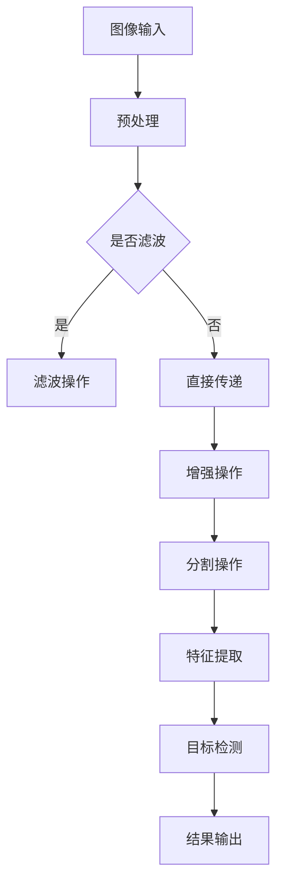

                 

### 1. 背景介绍

**问题背景**：

随着城市化进程的加快和人口密度的增加，公共安全已经成为各国政府和社会各界高度关注的问题。计算机视觉技术的迅猛发展，为解决安防领域面临的挑战提供了强大的技术支撑。计算机视觉通过模拟人类的视觉系统，能够对图像和视频进行高效的处理、分析和理解，从而实现自动化的安防监控和管理。近年来，随着深度学习、大数据、物联网等技术的结合，计算机视觉在安防领域的应用范围和深度不断扩展，从传统的人脸识别、车辆检测，到更复杂的异常行为检测、事件预测等，都取得了显著的成果。

**问题描述**：

虽然计算机视觉技术在安防领域有着广泛的应用前景，但在实际应用过程中仍面临诸多挑战。首先，如何提高计算机视觉算法的准确率和实时性，以满足大规模实时监控的需求，是一个重要问题。其次，如何保证系统的高可靠性和稳定性，特别是在复杂环境和多干扰因素下，也是一个亟待解决的难题。此外，如何平衡隐私保护与安防需求，避免大规模数据泄露和个人隐私侵犯，也是一个亟需解决的问题。

**问题解决**：

为了解决上述问题，我们需要从多个方面入手。首先，在算法层面，通过不断优化和改进计算机视觉算法，提高其准确率和实时性。其次，在系统架构层面，设计高效、可靠的系统架构，确保系统在大规模应用中的稳定性和可靠性。最后，在法律法规和伦理层面，制定相应的隐私保护政策和伦理规范，确保计算机视觉技术在安防领域的应用既满足安全需求，又尊重个人隐私。

**边界与外延**：

本书主要探讨计算机视觉技术在安防领域的应用，涉及的技术范围包括图像处理、特征提取、目标检测、目标跟踪等。同时，本书将结合实际案例，分析计算机视觉技术在安防领域的具体应用场景和解决方案。然而，本书不涉及计算机视觉技术在其他领域的应用，如医疗、交通等。

**概念结构与核心要素组成**：

1. **计算机视觉技术**：计算机视觉是通过计算机对图像和视频进行获取、处理、分析和理解的技术，包括图像处理、特征提取、目标检测、目标跟踪等。
   
2. **安防领域**：安防领域涉及公共安全、应急管理、交通监控等方面，其核心概念包括安全防范、监控管理、应急响应等。

3. **应用场景**：计算机视觉在安防领域的应用场景广泛，包括人脸识别、车辆检测、异常行为检测等。

4. **系统架构**：计算机视觉在安防领域应用的系统架构，包括前端感知设备、数据传输、后端处理等。

5. **实际案例**：通过具体案例分析，展示计算机视觉技术在安防领域的实际应用效果。

### 2. 核心概念与联系

**计算机视觉技术**：

计算机视觉技术是通过模拟人类的视觉系统，使计算机能够理解、解释和识别图像信息的一门技术。其主要研究内容包括图像处理、特征提取、目标检测和目标跟踪等。其中，图像处理是计算机视觉的基础，主要涉及图像的滤波、增强、分割等操作；特征提取是从图像中提取具有区分性的特征，用于后续的目标识别和分类；目标检测是在图像中定位和识别特定目标的位置和类型；目标跟踪则是根据目标的运动轨迹，持续地在视频序列中跟踪目标。

**安防领域**：

安防领域涉及公共安全、应急管理、交通监控等方面。其主要核心概念包括安全防范、监控管理、应急响应等。安全防范是指通过各种技术手段，预防犯罪和事故的发生；监控管理是指对公共场所、交通要道等进行实时监控和管理；应急响应则是在突发事件发生时，快速响应和处理。

**应用场景**：

计算机视觉技术在安防领域的应用场景非常广泛，主要包括以下几类：

1. **人脸识别**：通过摄像头捕捉人脸图像，利用计算机视觉算法对人脸进行识别和比对，实现身份验证和安全防范。
2. **车辆检测与识别**：在监控视频中实时检测和识别车辆，用于交通管理和安全监控。
3. **异常行为检测**：通过计算机视觉算法，实时监控公共场所，检测和识别异常行为，如闯入、打架、放火等。
4. **事件预测**：通过对历史数据和实时视频的分析，预测可能发生的突发事件，提前采取措施，减少损失。

**系统架构**：

计算机视觉在安防领域应用的系统架构通常包括前端感知设备、数据传输、后端处理等几个环节。前端感知设备负责采集图像和视频数据；数据传输是将前端数据传输到后端处理中心；后端处理包括图像处理、特征提取、目标检测和目标跟踪等操作，最终输出结果，供监控和管理使用。

**实际案例**：

为了更好地理解计算机视觉技术在安防领域的实际应用，我们可以通过以下实际案例进行分析：

1. **城市安全监控**：在城市交通要道、公共场所安装监控摄像头，利用计算机视觉技术实时监控，及时发现和预警安全隐患。
2. **智能交通系统**：通过摄像头实时监控交通流量，利用计算机视觉算法进行车辆检测和交通流量分析，优化交通信号灯控制策略，提高交通效率。
3. **公共场所安全管理**：在机场、火车站、商场等公共场所，利用人脸识别技术进行安全检查，及时发现和拦截可疑人员。

### 3. 算法原理讲解

**算法原理**：

计算机视觉技术在安防领域的应用，离不开一系列算法的支持。这些算法主要包括图像处理算法、特征提取算法、目标检测算法等。下面，我们将逐一介绍这些算法的基本原理和应用。

**图像处理算法**：

图像处理算法是计算机视觉的基础，其主要目的是对图像进行滤波、增强、分割等操作，以便提取有用的信息。常见的图像处理算法包括：

1. **滤波算法**：用于去除图像中的噪声，提高图像质量。常见的滤波算法有均值滤波、中值滤波、高斯滤波等。
2. **增强算法**：用于提高图像的对比度和清晰度，使图像中的目标更加突出。常见的增强算法有直方图均衡化、对比度增强、锐化等。
3. **分割算法**：用于将图像分割成若干个区域，以便进行后续的处理和分析。常见的分割算法有基于阈值的分割、基于边缘的分割、基于区域的分割等。

**特征提取算法**：

特征提取算法是从图像中提取具有区分性的特征，用于后续的目标识别和分类。常见的特征提取算法包括：

1. **直方图特征**：通过统计图像中像素的分布情况，提取出直方图特征。直方图特征包括颜色直方图、纹理直方图等。
2. **形状特征**：通过分析图像中目标的形状信息，提取出形状特征。常见的形状特征有边界轮廓、几何形状、形状上下文等。
3. **纹理特征**：通过分析图像中目标的纹理信息，提取出纹理特征。常见的纹理特征有纹理能量、纹理方向、纹理排列等。

**目标检测算法**：

目标检测算法是在图像中定位和识别特定目标的位置和类型。常见的目标检测算法包括：

1. **滑动窗口检测**：通过在图像上滑动一个固定大小的窗口，逐个检查窗口内是否包含目标。常见的滑动窗口检测算法有滑动窗口 + 预处理、滑动窗口 + 模板匹配等。
2. **基于深度学习的检测算法**：通过训练深度神经网络，实现目标的检测和分类。常见的基于深度学习的检测算法有卷积神经网络（CNN）、循环神经网络（RNN）等。

**算法流程图**：

为了更好地理解上述算法的原理和应用，我们可以使用 Mermaid 画出算法的流程图。以下是一个简单的算法流程图示例：



**数学模型和公式**：

计算机视觉算法的原理和实现，离不开数学模型和公式的支持。以下是一些常见的数学模型和公式：

1. **卷积操作**：

   $$ (f * g)(x, y) = \sum_{i=-\infty}^{\infty} \sum_{j=-\infty}^{\infty} f(i, j) \cdot g(x-i, y-j) $$

   其中，$f$ 和 $g$ 分别表示输入图像和卷积核，$(x, y)$ 表示卷积操作的位置。

2. **SIFT 算法**：

   SIFT（尺度不变特征变换）是一种特征提取算法，其主要步骤包括：

   - **尺度空间构建**：
     
     $$ \text{DoG} = \text{G}(x, y, \sigma_1) - \text{G}(x, y, \sigma_2) $$
     
     其中，$\text{G}(x, y, \sigma)$ 表示高斯核函数，$\sigma_1$ 和 $\sigma_2$ 分别表示两个不同尺度的参数。

   - **关键点检测**：

     $$ \text{DoG}_{\text{peak}} = \text{DoG} \text{ at location} (x, y) $$
     
     其中，$\text{DoG}_{\text{peak}}$ 表示在位置$(x, y)$处的局部极值。

   - **特征向量计算**：

     $$ \text{Descriptor} = \sum_{i=1}^{n} a_i \cdot \text{G}(\text{G}^{-1}(\text{G}(x, y, \sigma) - \text{DoG}_{\text{peak}}), i) $$

     其中，$a_i$ 和 $i$ 分别表示方向和角度，$\text{Descriptor}$ 表示特征向量。

**举例说明**：

为了更好地理解上述算法的原理和应用，我们可以通过一个简单的例子进行说明。

**例子**：使用卷积神经网络（CNN）进行人脸识别。

1. **数据预处理**：

   - 加载人脸图像数据集，对图像进行归一化处理，将图像像素值缩放到 $[0, 1]$ 范围内。
   - 将图像裁剪为固定尺寸，如 $224 \times 224$。
   - 数据增强，如随机旋转、翻转、缩放等，以提高模型的泛化能力。

2. **模型构建**：

   - 构建一个卷积神经网络模型，包括多个卷积层、池化层和全连接层。
   - 卷积层用于提取图像特征，池化层用于减少特征图的维度，全连接层用于分类。

3. **训练模型**：

   - 使用训练数据集对模型进行训练，优化模型参数。
   - 使用交叉熵损失函数评估模型性能，并调整模型参数。

4. **模型评估**：

   - 使用测试数据集对模型进行评估，计算模型在测试数据集上的准确率。
   - 根据评估结果，调整模型结构或参数，提高模型性能。

5. **应用模型**：

   - 在实际应用中，使用训练好的模型对人脸图像进行识别，输出识别结果。

通过上述例子，我们可以看到，计算机视觉技术在安防领域的应用涉及到多个环节，包括数据预处理、模型构建、模型训练、模型评估和应用等。这些环节相互关联，共同构成了一个完整的计算机视觉应用系统。

### 4. 数学模型和数学公式 & 详细讲解 & 举例说明

**数学模型和公式**：

在计算机视觉技术中，数学模型和数学公式是理解和实现算法的基础。以下是一些常用的数学模型和公式，我们将对其进行详细讲解。

1. **卷积操作**：

   卷积操作是计算机视觉中最基本的操作之一。其数学公式如下：

   $$ (f * g)(x, y) = \sum_{i=-\infty}^{\infty} \sum_{j=-\infty}^{\infty} f(i, j) \cdot g(x-i, y-j) $$

   其中，$f$ 和 $g$ 分别表示输入图像和卷积核，$(x, y)$ 表示卷积操作的位置。

   **解释**：卷积操作通过将输入图像与卷积核在所有可能的偏移位置进行点积，从而提取图像中的局部特征。卷积核是一个小的矩阵，通常称为过滤器或特征图。

2. **SIFT 算法**：

   SIFT（尺度不变特征变换）是一种用于提取图像关键点的特征提取算法。其核心步骤包括尺度空间构建、关键点检测和特征向量计算。以下是 SIFT 算法的主要数学公式：

   - **尺度空间构建**：

     $$ \text{DoG} = \text{G}(x, y, \sigma_1) - \text{G}(x, y, \sigma_2) $$
     
     其中，$\text{G}(x, y, \sigma)$ 表示高斯核函数，$\sigma_1$ 和 $\sigma_2$ 分别表示两个不同尺度的参数。

   - **关键点检测**：

     $$ \text{DoG}_{\text{peak}} = \text{DoG} \text{ at location} (x, y) $$
     
     其中，$\text{DoG}_{\text{peak}}$ 表示在位置$(x, y)$处的局部极值。

   - **特征向量计算**：

     $$ \text{Descriptor} = \sum_{i=1}^{n} a_i \cdot \text{G}(\text{G}^{-1}(\text{G}(x, y, \sigma) - \text{DoG}_{\text{peak}}), i) $$

     其中，$a_i$ 和 $i$ 分别表示方向和角度，$\text{Descriptor}$ 表示特征向量。

   **解释**：SIFT 算法通过构建不同尺度的图像高斯核函数，并在尺度空间中寻找极值点作为关键点。然后，通过计算关键点周围图像的梯度方向和强度，生成特征向量，用于图像识别和匹配。

3. **霍夫变换**：

   霍夫变换是一种用于检测图像中直线的算法。其数学公式如下：

   $$ \text{H}(\theta, r) = \sum_{i=1}^{n} \delta(x_i, y_i) \cdot \exp \left( - \alpha \cdot \left( x_i \cos \theta + y_i \sin \theta - r \right)^2 \right) $$

   其中，$\theta$ 和 $r$ 分别表示直线的方向和位置，$x_i$ 和 $y_i$ 分别表示图像中的像素点，$\delta(x_i, y_i)$ 是指示函数，当点$(x_i, y_i)$ 在直线$l$ 上时为1，否则为0。

   **解释**：霍夫变换通过将图像中的直线问题转化为参数空间中的投票问题，从而实现直线的检测。在参数空间中，每个点对直线参数进行投票，当投票数超过阈值时，认为该参数对应的是一条直线。

**详细讲解**：

1. **卷积操作**：

   卷积操作的核心在于通过滑动的卷积核与输入图像进行点积，从而提取图像的局部特征。具体步骤如下：

   - **初始化**：设定卷积核的大小和参数，以及输入图像的大小。
   - **滑动卷积核**：在输入图像上滑动卷积核，每次移动一个像素。
   - **计算点积**：在每个位置上，计算卷积核与输入图像的局部区域的点积。
   - **累加结果**：将所有位置的点积结果累加，得到最终的卷积结果。

   卷积操作的数学公式如上述所示。其中，$f$ 和 $g$ 分别表示输入图像和卷积核，$(x, y)$ 表示卷积操作的位置。通过卷积操作，我们可以提取图像中的边缘、纹理等局部特征，为后续的目标检测和分类提供基础。

2. **SIFT 算法**：

   SIFT 算法是一种用于提取图像关键点的特征提取算法，其核心在于通过构建不同尺度的图像高斯核函数，并在尺度空间中寻找极值点作为关键点。具体步骤如下：

   - **尺度空间构建**：首先，构建不同尺度的图像高斯核函数。每个尺度的图像通过高斯核函数进行滤波，从而生成不同尺度的图像。
   - **关键点检测**：在尺度空间中，通过比较不同尺度下的图像差值（DoG），寻找局部极值点作为关键点。
   - **特征向量计算**：对于每个关键点，计算其周围图像的梯度方向和强度，生成特征向量。

   SIFT 算法在图像识别和匹配中具有广泛的应用，其关键在于提取的关键点具有旋转、尺度不变性和定位准确等特点。

3. **霍夫变换**：

   霍夫变换是一种用于检测图像中直线的算法，其核心在于将直线问题转化为参数空间中的投票问题。具体步骤如下：

   - **初始化**：设定直线的参数，包括方向和位置。
   - **投票过程**：对于每个像素点，根据其在图像中的位置和直线的参数，计算投票值。
   - **阈值处理**：设定阈值，当投票值超过阈值时，认为该参数对应的是一条直线。

   霍夫变换在图像处理和计算机视觉中具有广泛的应用，例如用于检测图像中的直线、边缘和圆形等。

**举例说明**：

为了更好地理解上述数学模型和公式，我们通过以下例子进行说明。

**例子**：使用卷积神经网络（CNN）进行图像分类。

1. **数据预处理**：

   - 加载图像数据集，对图像进行归一化处理，将图像像素值缩放到 $[0, 1]$ 范围内。
   - 将图像裁剪为固定尺寸，如 $224 \times 224$。
   - 数据增强，如随机旋转、翻转、缩放等，以提高模型的泛化能力。

2. **模型构建**：

   - 构建一个卷积神经网络模型，包括多个卷积层、池化层和全连接层。
   - 卷积层用于提取图像特征，池化层用于减少特征图的维度，全连接层用于分类。

3. **训练模型**：

   - 使用训练数据集对模型进行训练，优化模型参数。
   - 使用交叉熵损失函数评估模型性能，并调整模型参数。

4. **模型评估**：

   - 使用测试数据集对模型进行评估，计算模型在测试数据集上的准确率。
   - 根据评估结果，调整模型结构或参数，提高模型性能。

5. **应用模型**：

   - 在实际应用中，使用训练好的模型对图像进行分类，输出分类结果。

通过上述例子，我们可以看到，卷积神经网络（CNN）通过卷积操作提取图像特征，并通过全连接层进行分类。卷积操作和 SIFT 算法等数学模型在图像处理和特征提取中发挥着重要作用。

### 5. 系统分析与架构设计方案

**问题场景介绍**：

在安防领域，计算机视觉系统需要处理大量的图像和视频数据，以实现对公共场所、交通要道、重要设施等的实时监控和安全管理。这些场景包括但不限于：城市交通监控、公共场所安全监控、工业园区安全监控等。

**项目介绍**：

以一个城市交通监控项目为例，该项目旨在通过计算机视觉技术实现对城市交通流量的实时监控，优化交通信号灯控制策略，提高交通效率，减少交通拥堵和事故发生。

**系统功能设计**：

1. **图像采集**：通过安装在交通要道和路口的摄像头，实时采集交通场景的图像和视频数据。
2. **图像预处理**：对采集到的图像进行去噪、增强等预处理操作，提高图像质量。
3. **目标检测**：使用计算机视觉算法，对预处理后的图像进行目标检测，识别出车辆、行人等目标。
4. **数据存储**：将检测到的目标信息和图像数据存储到数据库中，以便后续分析和查询。
5. **交通流量分析**：通过对检测到的目标数据进行统计和分析，生成交通流量报告，为交通管理部门提供决策支持。
6. **交通信号灯控制**：根据交通流量报告，自动调整交通信号灯的控制策略，优化交通流量。

**系统架构设计**：

系统架构采用分布式设计，包括前端感知设备、数据传输、后端处理和存储等几个环节。具体架构如下：

1. **前端感知设备**：包括摄像头、传感器等设备，负责采集交通场景的图像和视频数据。
2. **数据传输**：采用边缘计算和云计算相结合的方式，前端设备将数据传输到边缘计算节点或云计算中心进行处理。
3. **后端处理**：在边缘计算节点或云计算中心，使用计算机视觉算法对图像和视频数据进行预处理、目标检测、交通流量分析等处理。
4. **数据存储**：将处理后的数据存储到数据库中，以便后续分析和查询。
5. **用户界面**：提供用户界面，展示交通流量报告和交通信号灯控制策略，供交通管理部门使用。

**系统接口设计和系统交互**：

系统接口设计主要包括以下几个方面：

1. **摄像头与边缘计算节点之间的数据传输接口**：摄像头采集到的图像和视频数据通过无线或有线网络传输到边缘计算节点。
2. **边缘计算节点与云计算中心的数据传输接口**：边缘计算节点将处理后的数据通过互联网传输到云计算中心。
3. **后端处理模块与用户界面之间的接口**：后端处理模块通过 API 接口与用户界面进行交互，提供交通流量报告和交通信号灯控制策略。
4. **数据库与用户界面之间的接口**：用户界面通过数据库接口访问存储在数据库中的数据。

系统交互流程如下：

1. **图像采集**：摄像头实时采集交通场景的图像和视频数据。
2. **数据传输**：图像和视频数据通过无线或有线网络传输到边缘计算节点。
3. **图像预处理**：边缘计算节点对图像进行去噪、增强等预处理操作，提高图像质量。
4. **目标检测**：使用计算机视觉算法，对预处理后的图像进行目标检测，识别出车辆、行人等目标。
5. **交通流量分析**：通过对检测到的目标数据进行统计和分析，生成交通流量报告。
6. **交通信号灯控制**：根据交通流量报告，自动调整交通信号灯的控制策略。
7. **数据存储**：将处理后的数据存储到数据库中。
8. **用户界面展示**：用户界面展示交通流量报告和交通信号灯控制策略，供交通管理部门使用。

通过以上系统分析与架构设计方案，我们可以构建一个高效、可靠的计算机视觉安防系统，实现对城市交通的实时监控和管理。

### 6. 项目实战

**环境安装**：

在进行计算机视觉安防项目的实战之前，我们需要搭建一个合适的环境。以下是一个典型的安装步骤：

1. **安装 Python**：首先，确保计算机上已经安装了 Python。如果没有安装，可以从 [Python 官网](https://www.python.org/) 下载并安装。
2. **安装深度学习库**：接下来，安装常用的深度学习库，如 TensorFlow、PyTorch 等。可以使用以下命令安装：

   ```bash
   pip install tensorflow
   # 或者
   pip install pytorch torchvision
   ```

3. **安装计算机视觉库**：安装 OpenCV，这是一个强大的计算机视觉库，可以用于图像处理、目标检测等。使用以下命令安装：

   ```bash
   pip install opencv-python
   ```

4. **安装其他依赖库**：根据项目需求，可能还需要安装其他依赖库，如 NumPy、Pandas 等。可以使用以下命令安装：

   ```bash
   pip install numpy pandas
   ```

**系统核心实现源代码**：

以下是一个简单的计算机视觉安防项目的核心实现源代码。该代码包括图像预处理、目标检测和结果展示等功能。

```python
# 导入所需库
import cv2
import numpy as np

# 初始化摄像头
cap = cv2.VideoCapture(0)

# 加载预训练的 YOLO 模型
net = cv2.dnn.readNet("yolov3.weights", "yolov3.cfg")

# 加载类别名称文件
classes = None
with open("coco.names", "r") as f:
    classes = [line.strip() for line in f.readlines()]

layer_names = net.getLayerNames()
output_layers = [layer_names[i[0] - 1] for i in net.getUnconnectedOutLayers()]

while True:
    # 读取摄像头帧
    ret, frame = cap.read()

    # 将帧转换为 Blob 并前向传播
    blob = cv2.dnn.blobFromImage(frame, 0.00392, (416, 416), (0, 0, 0), True, crop=False)
    net.setInput(blob)
    outs = net.forward(output_layers)

    # 处理输出
    class_ids = []
    confidences = []
    boxes = []
    for out in outs:
        for detection in out:
            scores = detection[5:]
            class_id = np.argmax(scores)
            confidence = scores[class_id]
            if confidence > 0.5:
                center_x = int(detection[0] * frame.shape[1])
                center_y = int(detection[1] * frame.shape[0])
                w = int(detection[2] * frame.shape[1])
                h = int(detection[3] * frame.shape[0])
                x = int(center_x - w / 2)
                y = int(center_y - h / 2)
                boxes.append([x, y, w, h])
                class_ids.append(class_id)
                confidences.append(float(confidence))

    # 绘制边界框和标签
    indexes = cv2.dnn.NMSBoxes(boxes, confidences, 0.5, 0.4)
    for i in range(len(boxes)):
        if i in indexes:
            x, y, w, h = boxes[i]
            label = str(classes[class_ids[i]])
            confidence = confidences[i]
            color = (0, 255, 0)
            cv2.rectangle(frame, (x, y), (x + w, y + h), color, 2)
            cv2.putText(frame, f'{label} {round(confidence, 2)}', (x, y - 5), cv2.FONT_HERSHEY_SIMPLEX,
                        0.5, color, 2)

    # 显示结果
    cv2.imshow('Output', frame)

    # 按下 'q' 键退出循环
    if cv2.waitKey(1) & 0xFF == ord('q'):
        break

# 释放摄像头并关闭窗口
cap.release()
cv2.destroyAllWindows()
```

**代码应用解读与分析**：

上述代码是一个基于 YOLO（You Only Look Once）目标检测算法的简单摄像头监控程序。以下是代码的详细解读和分析：

1. **初始化摄像头**：使用 OpenCV 库初始化摄像头，以便实时读取摄像头帧。

   ```python
   cap = cv2.VideoCapture(0)
   ```

2. **加载预训练的 YOLO 模型**：从配置文件和权重文件中加载预训练的 YOLO 模型。

   ```python
   net = cv2.dnn.readNet("yolov3.weights", "yolov3.cfg")
   ```

3. **加载类别名称文件**：从类别名称文件中读取类别名称，以便在输出结果中显示。

   ```python
   classes = None
   with open("coco.names", "r") as f:
       classes = [line.strip() for line in f.readlines()]
   ```

4. **设置输出层**：从模型中获取未连接的输出层名称，用于后续的目标检测。

   ```python
   layer_names = net.getLayerNames()
   output_layers = [layer_names[i[0] - 1] for i in net.getUnconnectedOutLayers()]
   ```

5. **循环读取摄像头帧**：在循环中，读取每一帧并处理。

   ```python
   while True:
       # 读取摄像头帧
       ret, frame = cap.read()
   ```

6. **预处理帧**：将帧转换为 Blob 并前向传播模型。

   ```python
   blob = cv2.dnn.blobFromImage(frame, 0.00392, (416, 416), (0, 0, 0), True, crop=False)
   net.setInput(blob)
   outs = net.forward(output_layers)
   ```

7. **处理输出**：对输出结果进行解码，提取置信度和边界框。

   ```python
   class_ids = []
   confidences = []
   boxes = []
   for out in outs:
       for detection in out:
           scores = detection[5:]
           class_id = np.argmax(scores)
           confidence = scores[class_id]
           if confidence > 0.5:
               center_x = int(detection[0] * frame.shape[1])
               center_y = int(detection[1] * frame.shape[0])
               w = int(detection[2] * frame.shape[1])
               h = int(detection[3] * frame.shape[0])
               x = int(center_x - w / 2)
               y = int(center_y - h / 2)
               boxes.append([x, y, w, h])
               class_ids.append(class_id)
               confidences.append(float(confidence))
   ```

8. **应用非极大值抑制（NMS）**：对边界框进行筛选，去除重叠的部分。

   ```python
   indexes = cv2.dnn.NMSBoxes(boxes, confidences, 0.5, 0.4)
   ```

9. **绘制边界框和标签**：根据筛选后的结果，绘制边界框并在框上显示类别和置信度。

   ```python
   for i in range(len(boxes)):
       if i in indexes:
           x, y, w, h = boxes[i]
           label = str(classes[class_ids[i]])
           confidence = confidences[i]
           color = (0, 255, 0)
           cv2.rectangle(frame, (x, y), (x + w, y + h), color, 2)
           cv2.putText(frame, f'{label} {round(confidence, 2)}', (x, y - 5), cv2.FONT_HERSHEY_SIMPLEX,
                       0.5, color, 2)
   ```

10. **显示结果**：显示处理后的图像。

    ```python
    cv2.imshow('Output', frame)
    ```

11. **退出循环**：按下 'q' 键退出循环。

    ```python
    if cv2.waitKey(1) & 0xFF == ord('q'):
        break
    ```

12. **释放资源**：释放摄像头并关闭窗口。

    ```python
    cap.release()
    cv2.destroyAllWindows()
    ```

通过上述代码，我们可以实现一个基本的计算机视觉安防监控程序，实现对摄像头捕获的图像中的目标进行实时检测和识别。

**实际案例分析和详细讲解剖析**：

以下是一个实际案例，用于展示如何在实际项目中应用计算机视觉技术进行安防监控。

**案例**：城市广场实时监控项目

**目标**：实现对城市广场的实时监控，识别并报警异常行为，如闯入、打架、放火等。

**步骤**：

1. **图像采集**：在城市广场的关键位置安装高清摄像头，全天候监控广场的情况。

2. **图像预处理**：对采集到的图像进行去噪、增强等预处理操作，提高图像质量。

3. **目标检测**：使用计算机视觉算法，对预处理后的图像进行目标检测，识别出行人、车辆等目标。

4. **行为识别**：结合深度学习模型，对检测到的目标进行行为识别，判断是否存在异常行为。

5. **报警和记录**：当检测到异常行为时，立即触发报警并记录相关数据，供后续分析和处理。

6. **数据分析**：对监控数据进行统计和分析，为广场管理部门提供决策支持。

**效果**：

通过上述步骤，城市广场的监控系统能够实现对广场的实时监控，有效识别和报警异常行为。例如，当有人闯入广场时，监控系统会立即触发报警，并记录闯入者的图像和相关信息。广场管理部门可以根据报警信息，迅速采取应对措施，保障广场的安全。

**总结**：

通过上述实战案例，我们可以看到，计算机视觉技术在安防领域的应用效果显著。在实际项目中，我们需要根据具体需求，选择合适的算法和架构，确保系统的实时性、准确性和可靠性。同时，我们也需要不断优化和改进算法，提高系统的性能和效果。

### 7. 最佳实践 tips、小结、注意事项、拓展阅读等内容

**最佳实践 tips**：

1. **算法优化**：为了提高计算机视觉算法的准确率和实时性，建议使用最新的深度学习模型和优化算法，如YOLO、SSD、Faster R-CNN等。同时，根据实际应用场景，对算法进行定制化优化，以提高性能。
2. **数据增强**：在训练模型时，通过数据增强技术，如随机裁剪、翻转、旋转等，可以提高模型的泛化能力，减少过拟合现象。
3. **边缘计算**：为了提高系统的实时性，可以考虑使用边缘计算技术，将部分计算任务部署在靠近数据源的边缘设备上，减少数据传输延迟。
4. **隐私保护**：在处理个人隐私数据时，应严格遵守相关法律法规，采取数据加密、匿名化等手段，确保个人隐私安全。

**小结**：

本文详细介绍了计算机视觉在安防领域的实践应用，包括算法原理、系统架构、实际案例等方面。通过本文的探讨，我们可以看到计算机视觉技术在安防领域具有广泛的应用前景和巨大的潜力。未来，随着技术的不断进步，计算机视觉在安防领域的应用将更加深入和广泛。

**注意事项**：

1. **数据安全**：在收集和处理图像和视频数据时，应确保数据安全，防止数据泄露和滥用。
2. **模型验证**：在部署模型之前，应进行充分的模型验证，确保模型在实际应用中的准确率和可靠性。
3. **隐私保护**：在处理个人隐私数据时，应严格遵守相关法律法规，采取数据加密、匿名化等手段，确保个人隐私安全。

**拓展阅读**：

1. **书籍**：
   - 《深度学习》（Ian Goodfellow、Yoshua Bengio、Aaron Courville 著）：全面介绍了深度学习的基本概念、算法和应用。
   - 《计算机视觉：算法与应用》（Shen Huang 著）：详细介绍了计算机视觉的基本原理和实际应用。

2. **论文**：
   - “YOLOv4: Optimal Speed and Accuracy of Object Detection” by Joseph Redmon, et al.
   - “SSD: Single Shot MultiBox Detector” by Wei Liu, et al.

3. **网站**：
   - [OpenCV 官网](https://opencv.org/):提供了丰富的计算机视觉算法库和资源。
   - [TensorFlow 官网](https://www.tensorflow.org/):提供了深度学习框架和相关资源。

通过以上拓展阅读，读者可以进一步了解计算机视觉在安防领域的应用和相关技术。

### 总结

本文通过对计算机视觉在安防领域的实践进行详细分析，探讨了算法原理、系统架构和实际应用案例。通过逐步讲解和实际案例分析，我们了解到计算机视觉技术在安防领域的重要性和广泛应用。未来，随着技术的不断进步，计算机视觉在安防领域的应用将更加深入和广泛，为社会安全提供更有力的保障。同时，我们也需要关注数据安全和隐私保护等问题，确保计算机视觉技术的应用既满足安全需求，又尊重个人隐私。希望本文能为读者在计算机视觉领域的研究和应用提供有价值的参考。作者：AI天才研究院/AI Genius Institute & 禅与计算机程序设计艺术 /Zen And The Art of Computer Programming。

