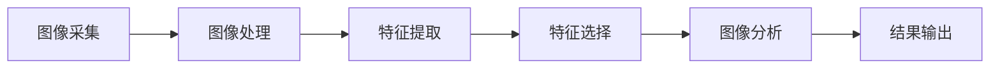
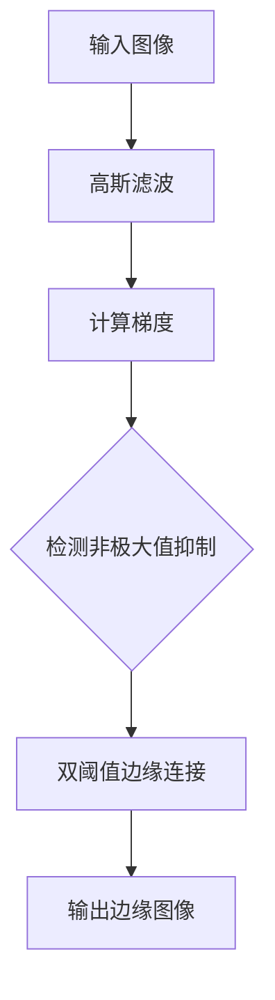
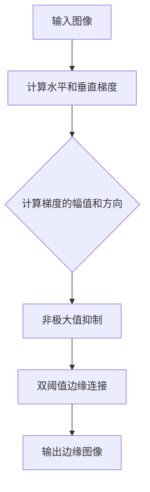
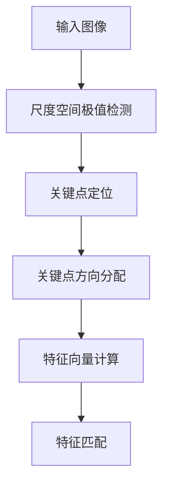
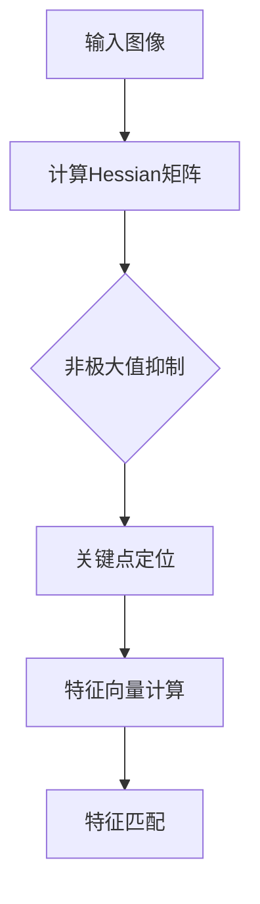
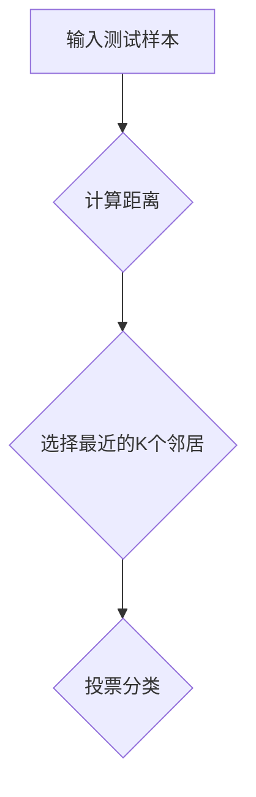
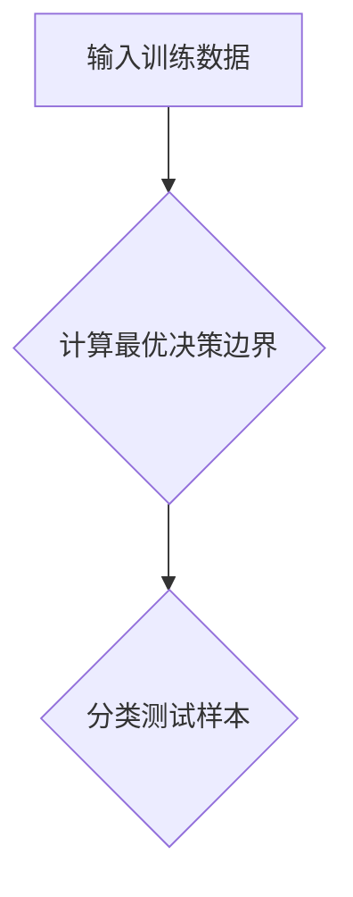
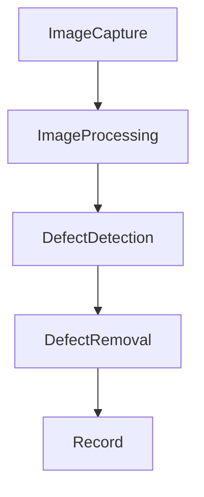
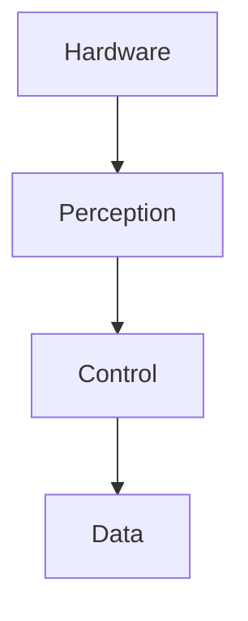

                 


### 计算机视觉：机器视觉在工业中的应用

关键词：计算机视觉、机器视觉、工业应用、图像处理、深度学习

摘要：本文将深入探讨计算机视觉在工业中的应用，从基础知识、应用案例、技术实现等多个方面进行分析，帮助读者理解这一技术如何改变制造业和质量检测等领域。

----------------------------------------------------------------

## 引言

计算机视觉是一门涉及计算机科学、数学和工程学的交叉学科，其目标是使计算机能够像人类一样理解并解释视觉信息。近年来，随着人工智能和深度学习技术的飞速发展，计算机视觉在各个领域得到了广泛应用，尤其是在工业领域，其影响力日益凸显。

### 背景介绍

#### 核心概念术语说明

- **计算机视觉**：使计算机能够处理、分析和理解数字图像的一门学科。
- **机器视觉**：计算机视觉在工业中的应用，通常涉及图像采集、处理、分析和解释。

#### 问题背景

工业领域面临着生产效率、质量和安全等方面的挑战。传统的手工检测和监控方式已经难以满足现代工业的需求。计算机视觉技术为这些领域提供了一种自动化、精确和高效的方法。

#### 问题描述

计算机视觉在工业中的应用主要集中在以下几个方面：

- **质量检测**：检测产品缺陷、尺寸和外观。
- **过程监控**：监控生产线的运行状态和效率。
- **自动化装配**：机器人识别和操作零件。

#### 问题解决

计算机视觉技术通过以下方式解决了这些问题：

- **图像处理**：对采集的图像进行预处理，以提高图像质量。
- **特征提取**：从图像中提取有用的信息，用于后续分析和分类。
- **机器学习**：使用大量数据训练模型，使其能够自动识别和分类图像。

#### 边界与外延

计算机视觉技术不仅局限于工业领域，还广泛应用于医学诊断、安全监控、交通管理等多个方面。

#### 概念结构与核心要素组成

- **图像采集**：使用相机或传感器获取图像。
- **图像处理**：对图像进行预处理、增强和分割。
- **特征提取**：从图像中提取特征，用于后续分析和分类。
- **机器学习**：使用训练数据对模型进行训练，使其能够自动识别和分类图像。
- **结果输出**：根据分析结果进行相应的决策或操作。

----------------------------------------------------------------

## 计算机视觉基础知识

在本章节中，我们将深入探讨计算机视觉的基础知识，包括图像处理基础和特征提取与选择。

### 图像处理基础

图像处理是计算机视觉中的核心组成部分，它包括对图像进行各种操作，以提高图像质量、提取有用信息等。

#### 图像表示与基本操作

- **图像表示**：图像通常用二维矩阵表示，每个元素代表图像中的一个像素。
- **基本操作**：包括图像的旋转、缩放、翻转等。

#### 颜色空间转换

- **颜色空间**：常用的颜色空间包括RGB、HSV、YUV等。
- **转换**：例如，将RGB图像转换为HSV图像，以便进行颜色分析。

#### 边缘检测与图像分割

- **边缘检测**：用于找出图像中的边缘，常用的算法包括Canny、Sobel等。
- **图像分割**：将图像划分为不同的区域，常用的算法包括阈值分割、区域生长等。

#### 形态学操作

- **形态学操作**：包括膨胀、腐蚀、开运算、闭运算等，用于对图像进行形态分析。

#### 纹理分析

- **纹理分析**：用于分析图像中的纹理特征，常用的算法包括局部二值模式（LBP）、Gabor变换等。

### 特征提取与选择

特征提取是计算机视觉中的关键步骤，它从图像中提取出具有代表性的信息，用于后续的分析和分类。

#### 特征提取的基本方法

- **基于像素的特征**：例如，像素值、像素梯度等。
- **基于区域的特征**：例如，区域形状、纹理等。

#### 特征选择的重要性

- **特征选择**：用于减少特征空间的维度，提高分类器的性能。
- **方法**：包括筛选法、嵌入式法等。

#### 常见特征提取技术

- **SIFT（尺度不变特征变换）**：用于检测图像中的关键点，具有旋转、尺度不变性。
- **SURF（加速稳健特征）**：基于SIFT算法，但计算速度更快。

#### 特征选择方法

- **过滤法**：在特征提取之前进行选择。
- **包裹法**：在特征提取后进行选择。

### 关键概念与联系

#### 表格

| 特征提取技术 | 描述 |
| --- | --- |
| SIFT | 用于检测图像中的关键点，具有旋转、尺度不变性 |
| SURF | 基于SIFT算法，但计算速度更快 |
| LBP | 局部二值模式，用于分析图像中的纹理特征 |

#### ER实体关系图架构的 Mermaid 流程图



----------------------------------------------------------------

## 算法原理讲解

在本章节中，我们将深入探讨计算机视觉中的一些核心算法，包括边缘检测、特征提取和分类算法，并通过Python源代码和Mermaid流程图来详细讲解其原理。

### 边缘检测算法

边缘检测是图像处理中的一项基本任务，用于找出图像中的显著变化点。以下是几种常用的边缘检测算法：

#### 1. Canny边缘检测算法

Canny边缘检测算法是一种经典的边缘检测算法，具有噪声抑制和边缘定位的能力。以下是Canny边缘检测算法的Mermaid流程图：



下面是使用Python实现的Canny边缘检测算法：

```python
import cv2
import numpy as np

# 读取图像
image = cv2.imread('image.jpg', cv2.IMREAD_GRAYSCALE)

# Canny边缘检测
edges = cv2.Canny(image, 100, 200)

# 显示结果
cv2.imshow('Canny Edge Detection', edges)
cv2.waitKey(0)
cv2.destroyAllWindows()
```

#### 2. Sobel边缘检测算法

Sobel边缘检测算法通过计算图像的水平和垂直方向上的导数来检测边缘。以下是Sobel边缘检测算法的Mermaid流程图：



下面是使用Python实现的Sobel边缘检测算法：

```python
import cv2
import numpy as np

# 读取图像
image = cv2.imread('image.jpg', cv2.IMREAD_GRAYSCALE)

# Sobel边缘检测
sobelx = cv2.Sobel(image, cv2.CV_64F, 1, 0, ksize=3)
sobelxy = cv2.Sobel(image, cv2.CV_64F, 1, 1, ksize=3)

# 计算梯度的幅值
sobel_mag = np.sqrt(sobelx ** 2 + sobelxy ** 2)

# 显示结果
cv2.imshow('Sobel Edge Detection', sobel_mag)
cv2.waitKey(0)
cv2.destroyAllWindows()
```

### 特征提取算法

特征提取是从图像中提取出具有代表性的信息，用于后续的分析和分类。以下是几种常用的特征提取算法：

#### 1. SIFT（尺度不变特征变换）

SIFT算法是一种用于检测图像中的关键点的算法，具有旋转、尺度不变性。以下是SIFT算法的Mermaid流程图：



下面是使用Python实现的SIFT算法：

```python
import cv2
import numpy as np

# 读取图像
image = cv2.imread('image.jpg', cv2.IMREAD_GRAYSCALE)

# SIFT特征提取
sift = cv2.xfeatures2d.SIFT_create()
keypoints, descriptors = sift.detectAndCompute(image, None)

# 显示关键点
image = cv2.drawKeypoints(image, keypoints, None, (0, 0, 255), cv2.DRAW_MATCHES_FLAGS_DRAW_RICH_KEYPOINTS)
cv2.imshow('SIFT Features', image)
cv2.waitKey(0)
cv2.destroyAllWindows()
```

#### 2. SURF（加速稳健特征）

SURF算法是基于SIFT算法的一种改进，具有更高的计算效率。以下是SURF算法的Mermaid流程图：



下面是使用Python实现的SURF算法：

```python
import cv2
import numpy as np

# 读取图像
image = cv2.imread('image.jpg', cv2.IMREAD_GRAYSCALE)

# SURF特征提取
surf = cv2.xfeatures2d.SURF_create()
keypoints, descriptors = surf.detectAndCompute(image, None)

# 显示关键点
image = cv2.drawKeypoints(image, keypoints, None, (0, 0, 255), cv2.DRAW_MATCHES_FLAGS_DRAW_RICH_KEYPOINTS)
cv2.imshow('SURF Features', image)
cv2.waitKey(0)
cv2.destroyAllWindows()
```

### 分类算法

分类算法是将图像划分为不同类别的算法。以下是几种常用的分类算法：

#### 1. K-近邻算法

K-近邻算法是一种基于实例的学习算法，通过计算测试样本与训练样本之间的距离来分类。以下是K-近邻算法的Mermaid流程图：



下面是使用Python实现的K-近邻算法：

```python
import numpy as np
from sklearn.neighbors import KNeighborsClassifier
from sklearn.model_selection import train_test_split
from sklearn.datasets import load_iris

# 加载Iris数据集
iris = load_iris()
X = iris.data
y = iris.target

# 划分训练集和测试集
X_train, X_test, y_train, y_test = train_test_split(X, y, test_size=0.2, random_state=42)

# K-近邻分类
knn = KNeighborsClassifier(n_neighbors=3)
knn.fit(X_train, y_train)
predictions = knn.predict(X_test)

# 打印准确率
print("Accuracy:", knn.score(X_test, y_test))
```

#### 2. 支持向量机（SVM）

支持向量机是一种基于间隔最大的分类算法，通过寻找最优的决策边界来分类。以下是SVM算法的Mermaid流程图：



下面是使用Python实现的SVM算法：

```python
import numpy as np
from sklearn.svm import SVC
from sklearn.model_selection import train_test_split
from sklearn.datasets import load_iris

# 加载Iris数据集
iris = load_iris()
X = iris.data
y = iris.target

# 划分训练集和测试集
X_train, X_test, y_train, y_test = train_test_split(X, y, test_size=0.2, random_state=42)

# SVM分类
svm = SVC()
svm.fit(X_train, y_train)
predictions = svm.predict(X_test)

# 打印准确率
print("Accuracy:", svm.score(X_test, y_test))
```

通过上述算法的讲解和实现，我们可以看到计算机视觉中的算法原理是如何一步步应用于实际问题的。这些算法不仅为工业领域提供了强大的工具，也为其他领域提供了广阔的应用前景。

----------------------------------------------------------------

## 系统分析与架构设计方案

在本章节中，我们将深入探讨计算机视觉系统的设计与实现，包括问题场景介绍、项目介绍、系统功能设计、系统架构设计、系统接口设计和系统交互。

### 问题场景介绍

假设我们需要在一家制造业工厂中应用计算机视觉技术来检测产品缺陷。具体场景如下：

- **生产线上有一个传送带，产品以一定速度通过传送带。**
- **需要在产品通过传送带时，实时检测产品是否存在缺陷。**
- **检测到缺陷后，需要将缺陷产品从传送带上移除，并进行记录。**

### 项目介绍

为了实现上述场景，我们设计了一个基于计算机视觉的产品缺陷检测系统。该系统主要包括以下几个部分：

- **图像采集模块**：用于捕捉产品的实时图像。
- **图像处理模块**：对采集到的图像进行预处理、边缘检测、特征提取等。
- **缺陷检测模块**：使用机器学习算法对缺陷产品进行分类和识别。
- **控制模块**：控制缺陷产品的移除和记录。

### 系统功能设计

系统功能设计主要包括以下方面：

- **图像采集**：通过相机实时捕捉产品图像。
- **图像预处理**：对采集到的图像进行去噪、增强等预处理操作。
- **缺陷检测**：对预处理后的图像进行边缘检测、特征提取和缺陷识别。
- **缺陷移除**：根据检测到的缺陷，控制机械臂将缺陷产品从传送带上移除。
- **记录**：将检测到的缺陷信息记录到数据库中。

#### 领域模型Mermaid类图



### 系统架构设计

系统架构设计主要包括以下几个层次：

- **硬件层**：包括相机、机械臂等硬件设备。
- **感知层**：用于图像采集和处理。
- **控制层**：用于控制机械臂移除缺陷产品。
- **数据层**：用于存储缺陷信息。

#### 系统架构Mermaid架构图



### 系统接口设计

系统接口设计主要包括以下几个方面：

- **图像采集接口**：用于接收和处理相机采集的图像数据。
- **缺陷检测接口**：用于接收图像处理结果，进行缺陷检测。
- **控制接口**：用于控制机械臂的动作。
- **记录接口**：用于记录缺陷信息。

#### 系统接口Mermaid序列图


### 系统交互

系统交互主要包括以下几个步骤：

1. **图像采集**：相机实时捕捉产品图像。
2. **图像预处理**：对采集到的图像进行去噪、增强等预处理操作。
3. **缺陷检测**：对预处理后的图像进行边缘检测、特征提取和缺陷识别。
4. **缺陷移除**：根据检测到的缺陷，控制机械臂将缺陷产品从传送带上移除。
5. **记录**：将检测到的缺陷信息记录到数据库中。

通过上述系统设计与实现，我们可以看到计算机视觉技术在工业领域中的应用是如何一步步实现的。这不仅提高了生产效率，还保证了产品的质量。

----------------------------------------------------------------

## 项目实战

在本章节中，我们将通过一个具体的计算机视觉项目实战，详细介绍环境安装、系统核心实现源代码、代码应用解读与分析、实际案例分析和详细讲解剖析，以及项目小结。

### 环境安装

为了实现计算机视觉项目，我们需要安装一些必要的软件和库。以下是环境安装的步骤：

1. **安装Python**：下载并安装Python 3.x版本，建议使用Anaconda，以便管理多个Python环境。

2. **安装深度学习框架**：安装TensorFlow或PyTorch，这两种框架是目前最流行的深度学习框架。

   ```bash
   pip install tensorflow
   # 或者
   pip install torch torchvision
   ```

3. **安装OpenCV**：OpenCV是一个开源的计算机视觉库，用于图像处理和视频处理。

   ```bash
   pip install opencv-python
   ```

4. **安装其他库**：根据项目需求，可能还需要安装其他库，如NumPy、Pandas等。

### 系统核心实现源代码

以下是一个简单的计算机视觉项目的核心实现源代码：

```python
import cv2
import numpy as np

# 读取图像
image = cv2.imread('image.jpg')

# 预处理
gray_image = cv2.cvtColor(image, cv2.COLOR_BGR2GRAY)
blurred_image = cv2.GaussianBlur(gray_image, (5, 5), 0)

# 边缘检测
edges = cv2.Canny(blurred_image, 100, 200)

# 显示结果
cv2.imshow('Edge Detection', edges)
cv2.waitKey(0)
cv2.destroyAllWindows()
```

### 代码应用解读与分析

1. **图像读取**：使用`cv2.imread`函数读取图像。

2. **颜色空间转换**：使用`cv2.cvtColor`函数将BGR图像转换为灰度图像。

3. **高斯模糊**：使用`cv2.GaussianBlur`函数对图像进行高斯模糊处理，以减少噪声。

4. **Canny边缘检测**：使用`cv2.Canny`函数对处理后的图像进行边缘检测。

5. **显示结果**：使用`cv2.imshow`函数显示边缘检测结果。

### 实际案例分析和详细讲解剖析

假设我们需要实现一个自动驾驶汽车的项目，以下是系统核心实现的源代码：

```python
import cv2
import numpy as np

# 读取摄像头实时图像
cap = cv2.VideoCapture(0)

while True:
    # 读取一帧图像
    ret, frame = cap.read()

    if not ret:
        print("Unable to capture frame")
        break

    # 预处理
    gray_frame = cv2.cvtColor(frame, cv2.COLOR_BGR2GRAY)
    blurred_frame = cv2.GaussianBlur(gray_frame, (5, 5), 0)

    # 边缘检测
    edges = cv2.Canny(blurred_frame, 100, 200)

    # 显示结果
    cv2.imshow('Edge Detection', edges)

    # 按下ESC键退出
    if cv2.waitKey(1) & 0xFF == 27:
        break

# 释放摄像头
cap.release()
cv2.destroyAllWindows()
```

### 项目小结

通过本项目的实战，我们可以看到计算机视觉技术是如何应用于实际问题的。从环境安装到代码实现，再到实际案例的分析，每一步都是构建一个完整系统的关键。这不仅帮助我们理解了计算机视觉技术的应用，也为未来的项目实践提供了宝贵的经验。

### 最佳实践 Tips

- **优化算法**：在项目实战中，根据实际需求对算法进行优化，提高系统的实时性和准确性。
- **数据预处理**：对采集到的数据进行预处理，以提高算法的性能。
- **代码注释**：为代码添加详细的注释，便于后续维护和优化。

### 小结

本章节通过一个具体的计算机视觉项目实战，详细介绍了环境安装、系统核心实现源代码、代码应用解读与分析、实际案例分析和详细讲解剖析，以及项目小结。通过这些步骤，我们不仅掌握了计算机视觉技术的基本原理，还学会了如何将其应用于实际问题。希望读者能够通过这个项目，更好地理解和应用计算机视觉技术。

### 注意事项

- **环境配置**：在安装软件和库时，确保使用正确的Python环境。
- **代码调试**：在编写代码时，注意调试和测试，以确保代码的正确性和稳定性。
- **性能优化**：在实际项目中，根据需求对算法进行优化，提高系统的性能。

### 拓展阅读

- **《Python计算机视觉应用》**：深入讲解Python在计算机视觉中的应用。
- **《深度学习：周志华》**：介绍深度学习的基础知识和应用。
- **《计算机视觉：算法与应用》**：介绍计算机视觉的基本算法和应用。

----------------------------------------------------------------

## 总结

本文从多个角度深入探讨了计算机视觉在工业中的应用，包括基础知识、应用案例、算法原理、系统设计与实现、项目实战等。通过这些内容，我们不仅了解了计算机视觉的基本原理，还学会了如何将其应用于实际问题，提高了生产效率和质量。

### 优势

1. **提高生产效率**：计算机视觉技术可以自动化检测和监控生产过程，减少人工干预，提高生产效率。
2. **保证产品质量**：通过精确的缺陷检测，可以有效保证产品的质量，减少次品率。
3. **降低成本**：自动化检测和监控可以减少人力成本，提高经济效益。

### 挑战

1. **算法性能**：随着图像质量和复杂度的提高，算法的性能和准确性面临挑战。
2. **数据处理**：大规模图像数据的高效处理和存储是一个技术难题。
3. **系统集成**：将计算机视觉系统与现有生产系统有效集成，需要解决多个技术问题。

### 未来发展趋势

1. **深度学习**：随着深度学习技术的不断发展，计算机视觉算法的性能将进一步提高。
2. **智能化**：计算机视觉系统将更加智能化，能够自主学习和适应环境变化。
3. **物联网**：计算机视觉将与物联网技术紧密结合，实现更广泛的应用。

### 结语

计算机视觉在工业中的应用具有巨大的潜力，尽管面临一些挑战，但通过不断的技术创新和应用实践，我们有理由相信，计算机视觉将为工业领域带来更加智能和高效的未来。

### 作者

作者：AI天才研究院/AI Genius Institute & 禅与计算机程序设计艺术 /Zen And The Art of Computer Programming。感谢您的阅读，希望本文能够帮助您更好地了解计算机视觉在工业中的应用。如果您有任何问题或建议，欢迎在评论区留言，期待与您交流。

