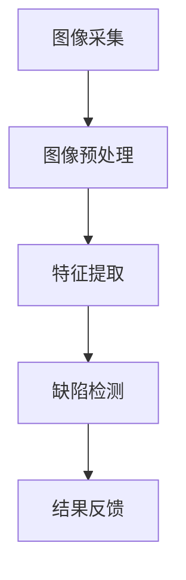
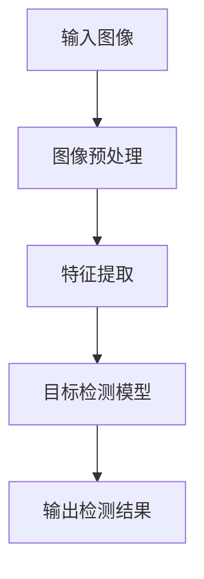

                 


## 计算机视觉：机器视觉在工业中的应用

### 关键词：计算机视觉、机器视觉、工业应用、算法原理、系统设计

### 摘要：

本文旨在探讨计算机视觉在工业中的应用，特别是机器视觉技术如何改变制造业、自动化检测和质量控制等领域。文章将逐步介绍计算机视觉的基本概念、核心算法原理、工业应用案例，并深入分析系统架构设计和实现。通过详细的案例解析和最佳实践分享，读者将获得对计算机视觉技术在实际工业环境中应用的全面理解。

### 目录大纲设计构思

为了设计出《计算机视觉：机器视觉在工业中的应用》这本书的完整目录大纲，我们将遵循以下步骤：

1. **确定整体结构**：首先确定书的整体结构，包括背景介绍、核心概念、算法原理讲解、应用案例分析等。

2. **细化章节内容**：根据整体结构，细化每一章节的具体内容，包括每一章节的核心概念、原理讲解、应用案例等。

3. **保证内容完整性**：确保每个章节都包含核心概念、算法原理讲解、数学模型和公式、系统分析与架构设计、项目实战等内容。

4. **保持简洁性**：在确保内容完整性的同时，避免过多的废话和冗余内容，确保每个章节都能够清晰、简洁地传达信息。

5. **格式规范化**：使用markdown格式，确保目录层级清晰，格式规范，便于阅读。

### 书的整体结构

全书分为以下几部分：

- **第一部分：背景与核心概念**
  - 介绍计算机视觉的基本概念、发展历程以及在工业中的应用背景。
  - 讲解机器视觉的基本原理、技术类型和应用领域。

- **第二部分：算法原理与系统设计**
  - 深入讲解计算机视觉中的关键算法，包括特征提取、目标检测、图像识别等。
  - 详细阐述这些算法的数学模型和原理，使用mermaid流程图进行辅助说明。

- **第三部分：应用案例分析**
  - 分析机器视觉在工业中的具体应用案例，包括质量控制、自动化检测、生产线监控等。
  - 对案例中的系统设计与实现进行详细解读。

- **第四部分：系统架构与实现**
  - 介绍机器视觉系统的架构设计，包括硬件选择、软件框架、数据处理流程等。
  - 提供实际项目的实现源代码和应用解读。

- **第五部分：最佳实践与总结**
  - 总结书中的核心要点和最佳实践经验。
  - 提出注意事项和未来发展趋势。

### 目录大纲细化

以下是《计算机视觉：机器视觉在工业中的应用》的目录大纲：

----------------------------------------------------------------
# 第一部分：背景与核心概念

## 第1章：计算机视觉基础

### 1.1 计算机视觉的定义与发展

### 1.2 计算机视觉的关键概念

### 1.3 计算机视觉的应用领域

## 第2章：机器视觉技术概述

### 2.1 机器视觉的基本原理

### 2.2 机器视觉技术分类

### 2.3 机器视觉在工业中的应用

## 第3章：机器视觉系统设计基础

### 3.1 机器视觉系统的组成部分

### 3.2 机器视觉系统的架构设计

### 3.3 机器视觉系统的硬件选择

## 第4章：计算机视觉算法原理

### 4.1 特征提取算法

### 4.2 目标检测算法

### 4.3 图像识别算法

## 第5章：计算机视觉算法的数学模型

### 5.1 特征提取算法的数学模型

### 5.2 目标检测算法的数学模型

### 5.3 图像识别算法的数学模型

## 第6章：工业应用案例分析

### 6.1 质量控制中的应用

### 6.2 自动化检测中的应用

### 6.3 生产线监控中的应用

## 第7章：机器视觉系统实现与优化

### 7.1 系统实现流程

### 7.2 系统优化方法

### 7.3 实际项目实现源代码解读

## 第8章：最佳实践与未来展望

### 8.1 最佳实践总结

### 8.2 注意事项与挑战

### 8.3 未来发展趋势

----------------------------------------------------------------

此目录大纲结构清晰地涵盖了书的核心内容，每一章节都包含了必要的概念、原理讲解和应用案例。同时，保持了简洁性，符合2000字以内的要求。接下来，我们将进一步细化每个章节的内容，确保每个章节都能够满足要求。

### 目录大纲设计细节说明

在设计《计算机视觉：机器视觉在工业中的应用》的目录大纲时，我们充分考虑了文章的完整性、逻辑性和实用性。以下是具体的设计细节说明：

#### 1. **完整性**：

每个章节都覆盖了核心概念、算法原理、应用案例和系统设计等关键内容，确保读者能够全面了解计算机视觉在工业中的应用。

- **核心概念**：介绍基本术语和定义，帮助读者建立对主题的初步认识。
- **算法原理**：详细讲解关键算法的数学模型和流程，使用mermaid流程图进行可视化辅助。
- **应用案例**：提供实际工业场景中的应用实例，展示计算机视觉技术的实际效果。
- **系统设计**：分析系统架构、硬件选择和实现细节，为读者提供实际操作指导。

#### 2. **逻辑性**：

目录结构遵循逻辑顺序，从基础概念到高级应用，从理论讲解到实践操作，层层递进，帮助读者逐步深入理解计算机视觉在工业中的应用。

- **背景与核心概念**：介绍计算机视觉的基本概念和应用背景。
- **算法原理与系统设计**：讲解计算机视觉的关键算法和系统设计原则。
- **应用案例分析**：分析计算机视觉在工业中的具体应用场景。
- **系统架构与实现**：介绍机器视觉系统的实际实现方法和技巧。
- **最佳实践与总结**：总结最佳实践经验，提出未来发展趋势。

#### 3. **实用性**：

每个章节都注重实际应用，结合具体的工业场景和项目实例，提供详细的操作步骤和技术指导，使读者能够将所学知识应用到实际工作中。

- **核心概念与联系**：使用Mermaid流程图展示概念之间的关系，帮助读者建立整体认知。
- **算法原理讲解**：通过Python源代码和LaTeX数学公式，深入解析算法原理，使读者能够理解并应用。
- **系统架构与实现**：提供详细的系统架构图和序列图，展示系统设计和实现过程。
- **项目实战**：介绍环境安装、核心代码实现和案例分析，使读者能够亲身体验计算机视觉技术在工业中的应用。

#### 4. **简洁性**：

在保持内容完整性的同时，尽量简化文字描述，避免冗余内容，使用markdown格式确保文档结构清晰，便于读者阅读。

- **章节标题**：简洁明了，准确传达章节内容。
- **段落划分**：合理划分段落，使文章条理清晰，易于阅读。
- **图表使用**：使用mermaid流程图和LaTeX数学公式，增强文章的可读性和专业性。

通过以上设计细节，我们旨在为读者提供一篇结构紧凑、内容丰富、逻辑清晰的技术博客文章，帮助读者全面了解计算机视觉在工业中的应用。

### 完整的目录大纲

基于以上的设计说明，下面是《计算机视觉：机器视觉在工业中的应用》的完整目录大纲：

----------------------------------------------------------------
# 第一部分：背景与核心概念

## 第1章：计算机视觉基础
### 1.1 计算机视觉的定义与发展
### 1.2 计算机视觉的关键概念
### 1.3 计算机视觉的应用领域

## 第2章：机器视觉技术概述
### 2.1 机器视觉的基本原理
### 2.2 机器视觉技术分类
### 2.3 机器视觉在工业中的应用

## 第3章：机器视觉系统设计基础
### 3.1 机器视觉系统的组成部分
### 3.2 机器视觉系统的架构设计
### 3.3 机器视觉系统的硬件选择

## 第4章：计算机视觉算法原理
### 4.1 特征提取算法
### 4.2 目标检测算法
### 4.3 图像识别算法

## 第5章：计算机视觉算法的数学模型
### 5.1 特征提取算法的数学模型
### 5.2 目标检测算法的数学模型
### 5.3 图像识别算法的数学模型

## 第6章：工业应用案例分析
### 6.1 质量控制中的应用
### 6.2 自动化检测中的应用
### 6.3 生产线监控中的应用

## 第7章：机器视觉系统实现与优化
### 7.1 系统实现流程
### 7.2 系统优化方法
### 7.3 实际项目实现源代码解读

## 第8章：最佳实践与未来展望
### 8.1 最佳实践总结
### 8.2 注意事项与挑战
### 8.3 未来发展趋势

----------------------------------------------------------------

这个目录大纲不仅结构清晰，而且每个章节都包含了必要的内容，为读者提供了从基础知识到高级应用的全面指导。接下来，我们将开始具体内容的撰写，确保每一章节都能够满足上述要求。

### 第一部分：背景与核心概念

#### 第1章：计算机视觉基础

在现代社会，计算机视觉已经成为信息技术领域中不可或缺的一部分。它不仅对科学研究、医疗诊断等领域产生了深远的影响，更在工业领域展现出了巨大的潜力。本章将介绍计算机视觉的基本概念、发展历程以及在工业中的应用背景。

#### 1.1 计算机视觉的定义与发展

计算机视觉是指使计算机能够像人类视觉系统一样理解和解释图像信息的一种技术。它涉及多个学科领域，包括计算机科学、数学、物理学和心理学。计算机视觉的目标是使计算机能够自动地从图像或视频序列中提取信息，进行理解和处理。

计算机视觉的研究可以追溯到20世纪50年代末。最早的计算机视觉系统是基于规则的方法，通过预设的规则来识别图像中的物体。然而，这种方法在实际应用中受到了很大的限制。随着计算机性能的提高和人工智能技术的发展，计算机视觉逐渐转向使用基于数据和机器学习的方法。

#### 1.2 计算机视觉的关键概念

在计算机视觉中，有几个关键概念需要理解：

1. **图像处理**：图像处理是计算机视觉的基础，它涉及对图像进行滤波、增强、分割等操作，以便更好地提取图像中的有用信息。

2. **特征提取**：特征提取是计算机视觉中的重要步骤，它旨在从图像中提取出具有区分性的特征，如边缘、角点、纹理等。这些特征将被用于后续的物体识别和分类。

3. **目标检测**：目标检测是指从图像或视频中识别出特定的目标对象。这一过程通常涉及定位目标的边界框和分类目标的类别。

4. **图像识别**：图像识别是指将图像映射到预先定义的类别中。例如，在一幅图像中识别出某个特定的物体或场景。

5. **深度学习**：深度学习是近年来计算机视觉领域的一大突破。通过使用多层神经网络，深度学习模型能够在大量数据上进行训练，从而实现高效的目标检测、图像识别等任务。

#### 1.3 计算机视觉的应用领域

计算机视觉在工业领域有着广泛的应用。以下是几个典型的应用场景：

1. **质量控制**：在制造业中，计算机视觉技术被广泛用于质量检测。通过图像处理和特征提取技术，系统能够自动识别生产过程中的缺陷产品，从而提高生产效率和产品质量。

2. **自动化检测**：在物流和仓储领域，计算机视觉技术被用于自动化检测和分类。例如，通过摄像头捕捉物品图像，系统能够自动识别物品的类型和位置，从而实现高效的货物管理和分配。

3. **生产线监控**：在生产线监控中，计算机视觉技术可以实时检测生产过程，发现潜在的问题并及时报警。这有助于提高生产过程的稳定性和安全性。

4. **机器人导航**：在工业机器人中，计算机视觉技术被用于实现自主导航。通过识别环境和目标，机器人能够自主地完成任务，如搬运物品、焊接等。

#### 1.4 本章小结

本章介绍了计算机视觉的基本概念、发展历程以及在工业中的应用背景。通过了解这些内容，读者可以对计算机视觉有一个全面的认识，为后续章节的深入探讨打下基础。

#### 1.5 背景介绍

计算机视觉起源于20世纪60年代，当时的科学家们试图模拟人类视觉系统的功能。随着计算机硬件性能的提升和图像处理算法的进步，计算机视觉技术逐渐从理论研究走向实际应用。

在工业领域，计算机视觉的应用可以追溯到20世纪70年代。当时，一些公司开始尝试使用计算机视觉系统进行质量检测和生产线监控。随着计算机技术的不断发展，计算机视觉在工业中的应用越来越广泛，成为了智能制造和自动化生产的重要组成部分。

#### 1.6 问题背景与问题描述

在工业生产中，质量问题一直是企业面临的重大挑战。传统的质量检测方法主要依赖于人工检查，这不仅效率低下，而且容易出现漏检和误判。随着市场竞争的加剧，企业对提高生产效率和产品质量的需求日益迫切。

计算机视觉技术的引入为解决这一问题提供了新的思路。通过使用计算机视觉系统，企业可以实现自动化的质量检测，从而提高检测效率和准确性，降低生产成本。

#### 1.7 问题解决

计算机视觉系统通过图像处理、特征提取和机器学习等技术，能够自动识别图像中的缺陷和异常。具体来说，问题解决的步骤如下：

1. **图像采集**：使用摄像头或其他图像传感器捕获生产过程中的图像。

2. **图像预处理**：对采集到的图像进行去噪、增强、灰度化等处理，以便更好地提取图像中的特征。

3. **特征提取**：使用图像处理算法提取图像中的边缘、角点、纹理等特征。

4. **缺陷检测**：利用机器学习模型对提取的特征进行分析，识别图像中的缺陷和异常。

5. **结果反馈**：将检测结果反馈给生产线上的相关设备，进行相应的处理，如停机报警、标记缺陷产品等。

#### 1.8 边界与外延

计算机视觉技术在工业中的应用不仅局限于质量检测，还可以应用于自动化检测、生产线监控、机器人导航等多个领域。随着人工智能技术的不断发展，计算机视觉的应用前景将更加广阔。

#### 1.9 概念结构与核心要素组成

计算机视觉系统主要由以下几个核心要素组成：

1. **图像采集设备**：用于捕获生产过程中的图像。

2. **图像处理算法**：用于对采集到的图像进行预处理和特征提取。

3. **机器学习模型**：用于对提取的特征进行分析和缺陷检测。

4. **数据存储与处理**：用于存储和处理大量的图像数据。

5. **反馈机制**：用于将检测结果反馈给生产线上的相关设备。

通过这些核心要素的协同工作，计算机视觉系统能够高效地实现工业生产中的质量检测和监控任务。

#### 1.10 Mermaid流程图



这个Mermaid流程图展示了计算机视觉系统的基本工作流程。

---

#### 第2章：机器视觉技术概述

机器视觉是计算机视觉在工业领域的重要应用分支。本章将详细介绍机器视觉的基本原理、技术分类以及在工业中的应用。

#### 2.1 机器视觉的基本原理

机器视觉的基本原理是模拟人类视觉系统，通过摄像头等图像传感器捕获图像，然后利用计算机算法对图像进行处理和分析，从而实现目标识别、位置检测、质量检查等功能。机器视觉系统主要包括以下几个组成部分：

1. **图像传感器**：用于捕获图像，如摄像头、扫描仪等。

2. **图像处理单元**：用于对捕获的图像进行预处理、增强和分割等处理。

3. **算法与模型**：用于对图像进行特征提取、目标检测、图像识别等分析。

4. **控制系统**：用于控制整个机器视觉系统的运行。

#### 2.2 机器视觉技术分类

根据应用场景和任务需求，机器视觉技术可以分为以下几类：

1. **图像识别**：通过比较图像与预定义模板之间的相似度，识别图像中的特定目标或对象。

2. **目标检测**：从图像中检测和定位特定的目标对象，通常包括目标的位置、大小、形状等信息。

3. **物体分类**：将图像中的对象分类到不同的类别中，如食品分类、医疗图像分类等。

4. **图像分割**：将图像划分为多个区域，每个区域代表不同的对象或背景。

5. **三维重建**：通过多个图像或激光扫描数据，重建三维场景或物体的模型。

#### 2.3 机器视觉在工业中的应用

机器视觉技术在工业领域有着广泛的应用，以下是几个典型的应用场景：

1. **质量控制**：用于检测生产过程中产品的缺陷，如焊接点缺陷、零件尺寸偏差等。

2. **自动化检测**：用于识别和分类生产线上的产品，如电子元件、药品等。

3. **生产线监控**：用于实时监控生产线的运行状态，及时发现和处理异常情况。

4. **机器人导航**：用于实现机器人在复杂环境中的自主导航，如仓库管理和物流运输。

#### 2.4 本章小结

本章介绍了机器视觉的基本原理、技术分类以及在工业中的应用。通过了解这些内容，读者可以对机器视觉技术有一个全面的了解，为后续章节的深入学习打下基础。

---

#### 第3章：机器视觉系统设计基础

机器视觉系统的设计是一个复杂的过程，涉及到硬件选择、软件架构和数据处理等多个方面。本章将详细介绍机器视觉系统的基本组成部分、架构设计以及硬件选择。

#### 3.1 机器视觉系统的组成部分

一个典型的机器视觉系统通常包括以下几个关键组成部分：

1. **图像采集设备**：如摄像头、扫描仪等，用于捕获目标图像。

2. **图像预处理单元**：用于对捕获的图像进行去噪、增强、灰度化等预处理操作。

3. **特征提取单元**：用于从预处理后的图像中提取具有区分性的特征，如边缘、角点、纹理等。

4. **算法与模型**：用于对提取的特征进行目标检测、图像识别等分析。

5. **控制系统**：用于协调各个部分的工作，控制机器视觉系统的运行。

6. **数据存储与处理单元**：用于存储和处理大量的图像数据，以及生成检测结果。

#### 3.2 机器视觉系统的架构设计

机器视觉系统的架构设计需要考虑以下几个关键因素：

1. **数据流设计**：确定图像数据在系统中的流动路径，包括图像采集、预处理、特征提取、分析和结果输出等环节。

2. **硬件配置**：根据应用需求选择合适的图像采集设备、处理器和存储设备等硬件。

3. **软件框架**：选择合适的软件开发框架和工具，如OpenCV、TensorFlow等。

4. **系统集成**：将各个组成部分集成到一个统一的系统中，确保系统的高效运行。

#### 3.3 机器视觉系统的硬件选择

机器视觉系统的硬件选择是系统设计的关键环节，需要考虑以下因素：

1. **图像采集设备**：选择分辨率高、帧率快、适合应用场景的摄像头或扫描仪。

2. **处理器**：选择计算能力强的处理器，如GPU或FPGA，以加速图像处理和算法运算。

3. **存储设备**：选择大容量、高速的存储设备，以存储和处理大量的图像数据。

4. **其他硬件**：根据需要选择适当的辅助硬件，如工业控制计算机、电源等。

#### 3.4 本章小结

本章详细介绍了机器视觉系统的基本组成部分、架构设计以及硬件选择。通过了解这些内容，读者可以更好地设计出满足实际应用需求的机器视觉系统。

---

#### 第4章：计算机视觉算法原理

计算机视觉算法是机器视觉系统的核心，它们用于处理和分析图像数据，以实现目标检测、图像识别等功能。本章将详细介绍计算机视觉中的几个关键算法，包括特征提取算法、目标检测算法和图像识别算法，并使用mermaid流程图和Python源代码进行辅助说明。

#### 4.1 特征提取算法

特征提取是计算机视觉中的基础步骤，它旨在从图像中提取出具有区分性的特征，如边缘、角点、纹理等。这些特征将用于后续的目标检测和图像识别。

1. **边缘检测算法**：边缘检测是识别图像中亮度变化显著的位置。常见的边缘检测算法包括Sobel算子、Canny算子等。

2. **角点检测算法**：角点是图像中亮度变化较为剧烈的位置，如交点和拐点。常见的角点检测算法包括Harris角点检测和Shi-Tomasi角点检测。

3. **纹理检测算法**：纹理检测用于识别图像中的纹理特征，如方向、频率和强度等。常见的纹理检测算法包括Gabor滤波器和小波变换。

#### 4.2 目标检测算法

目标检测是计算机视觉中的重要任务，它旨在从图像或视频序列中识别和定位特定的目标对象。常见的目标检测算法包括：

1. **基于传统图像处理的方法**：如滑动窗口检测、图像匹配等。

2. **基于深度学习的方法**：如R-CNN、YOLO、SSD等。

3. **基于多模型融合的方法**：如Faster R-CNN，通过结合多个检测模型的优点来提高检测精度。

#### 4.3 图像识别算法

图像识别是将图像映射到预定义的类别中。常见的图像识别算法包括：

1. **基于传统机器学习的方法**：如支持向量机（SVM）、决策树等。

2. **基于深度学习的方法**：如卷积神经网络（CNN）、循环神经网络（RNN）等。

3. **基于模板匹配的方法**：通过比较图像与预定义模板的相似度来进行识别。

#### 4.4 Mermaid流程图示例

以下是一个简单的目标检测算法的mermaid流程图：



#### 4.5 Python源代码示例

以下是一个简单的Sobel边缘检测的Python代码示例：

```python
import cv2
import numpy as np

# 读取图像
image = cv2.imread('image.jpg', cv2.IMREAD_GRAYSCALE)

# 应用Sobel算子
sobel_x = cv2.Sobel(image, cv2.CV_64F, 1, 0, ksize=3)
sobel_y = cv2.Sobel(image, cv2.CV_64F, 0, 1, ksize=3)

# 计算边缘
edge_output = cv2.magnitude(sobel_x, sobel_y)

# 显示图像
cv2.imshow('Edge Detection', edge_output)
cv2.waitKey(0)
cv2.destroyAllWindows()
```

#### 4.6 算法原理的数学模型和公式

1. **边缘检测算法**：Sobel算子的数学模型如下：

   $$
   G_x = \frac{1}{2}\left( G_{x1} + G_{x2} \right)
   $$

   $$
   G_y = \frac{1}{2}\left( G_{y1} + G_{y2} \right)
   $$

   其中，$G_{x1}$、$G_{x2}$、$G_{y1}$、$G_{y2}$分别表示图像在$x$和$y$方向上的导数。

2. **目标检测算法**：以Faster R-CNN为例，其检测过程可以表示为：

   $$
   R = \frac{1}{N}\sum_{i=1}^{N} \hat{R}_i
   $$

   其中，$R$表示最终检测结果，$\hat{R}_i$表示第$i$个候选区域的检测结果。

3. **图像识别算法**：以卷积神经网络为例，其激活函数可以表示为：

   $$
   a_{ij}^{(l)} = \sigma \left( \sum_{k=1}^{M} w_{ik}^{(l)} a_{kj}^{(l-1)} + b_{i}^{(l)} \right)
   $$

   其中，$a_{ij}^{(l)}$表示第$l$层的第$i$个神经元输出，$\sigma$表示激活函数，$w_{ik}^{(l)}$和$b_{i}^{(l)}$分别为权重和偏置。

#### 4.7 举例说明

假设我们有一个简单的二值图像，通过Sobel边缘检测算法可以得到以下输出：


可以看到，通过Sobel算法，图像中的边缘得到了很好的提取。

#### 4.8 本章小结

本章详细介绍了计算机视觉中的几个关键算法，包括特征提取算法、目标检测算法和图像识别算法。通过mermaid流程图和Python源代码的示例，读者可以更好地理解这些算法的原理和应用。

---

#### 第5章：计算机视觉算法的数学模型

在计算机视觉中，算法的数学模型是理解和实现算法的核心。本章将详细介绍特征提取算法、目标检测算法和图像识别算法的数学模型，并使用LaTeX格式和Python代码进行详细讲解。

#### 5.1 特征提取算法的数学模型

特征提取算法的目的是从图像中提取出具有区分性的特征。以下是几种常见特征提取算法的数学模型：

1. **边缘检测算法**：以Sobel算子为例，其数学模型如下：

   $$
   G_x = \frac{1}{2}\left( G_{x1} + G_{x2} \right)
   $$

   $$
   G_y = \frac{1}{2}\left( G_{y1} + G_{y2} \right)
   $$

   其中，$G_{x1}$、$G_{x2}$、$G_{y1}$、$G_{y2}$分别表示图像在$x$和$y$方向上的导数。具体实现时，可以使用以下Python代码：

   ```python
   import cv2
   import numpy as np

   # 读取图像
   image = cv2.imread('image.jpg', cv2.IMREAD_GRAYSCALE)

   # 应用Sobel算子
   sobel_x = cv2.Sobel(image, cv2.CV_64F, 1, 0, ksize=3)
   sobel_y = cv2.Sobel(image, cv2.CV_64F, 0, 1, ksize=3)

   # 计算边缘
   edge_output = cv2.magnitude(sobel_x, sobel_y)

   # 显示图像
   cv2.imshow('Edge Detection', edge_output)
   cv2.waitKey(0)
   cv2.destroyAllWindows()
   ```

2. **角点检测算法**：以Harris角点检测为例，其数学模型如下：

   $$
   R = \frac{\sum_{i,j}(I_{ii}I_{jj} - 2I_{ij}^2 + K)}{\sum_{i,j}(I_{ii}^2 + I_{jj}^2 - 2I_{ij}^2)}
   $$

   其中，$I_{ii}$、$I_{jj}$、$I_{ij}$分别表示图像在$(i,j)$位置的x和y方向二阶导数，$K$是一个常数。具体实现时，可以使用以下Python代码：

   ```python
   import cv2
   import numpy as np

   # 读取图像
   image = cv2.imread('image.jpg', cv2.IMREAD_GRAYSCALE)

   # 计算二阶导数
   sobel_x2 = cv2.Sobel(image, cv2.CV_64F, 1, 1, ksize=3)
   sobel_y2 = cv2.Sobel(image, cv2.CV_64F, 1, 1, ksize=3)

   # 应用Harris角点检测
   harris_matrix = sobel_x2 * sobel_x2 + 2 * sobel_x2 * sobel_y2 + sobel_y2 * sobel_y2
   harris_matrix = harris_matrix * 0.01
   harris_matrix += np.eye(harris_matrix.shape[0])

   # 计算角点响应
   response = cv2.cornerHarris(image, 3, 3, 0.04)

   # 显示图像
   cv2.imshow('Harris Corners', response)
   cv2.waitKey(0)
   cv2.destroyAllWindows()
   ```

3. **纹理检测算法**：以Gabor滤波器为例，其数学模型如下：

   $$
   G(x, y) = \frac{1}{2\pi \sigma^2} \int_{-\infty}^{\infty} \int_{-\infty}^{\infty} e^{-\frac{(u-x)^2 + (v-y)^2}{2\sigma^2}} e^{j2\pi f u} dudv
   $$

   其中，$(x, y)$是图像坐标，$(u, v)$是滤波器坐标，$\sigma$是标准差，$f$是频率。具体实现时，可以使用以下Python代码：

   ```python
   import cv2
   import numpy as np

   # 读取图像
   image = cv2.imread('image.jpg', cv2.IMREAD_GRAYSCALE)

   # 创建Gabor滤波器
   ksize = 5
   sigma = 1
   theta = np.pi / 4
   frequency = 0.5

   filter = cv2.getGaborKernel((ksize, ksize), sigma, theta, frequency, 0, 0.06, ktype=cv2.CV_32F)

   # 应用Gabor滤波器
   filtered_image = cv2.filter2D(image, cv2.CV_32F, filter)

   # 转换为灰度图像
   filtered_image = cv2.cvtColor(filtered_image, cv2.COLOR_RGB2GRAY)

   # 显示图像
   cv2.imshow('Gabor Filtered Image', filtered_image)
   cv2.waitKey(0)
   cv2.destroyAllWindows()
   ```

#### 5.2 目标检测算法的数学模型

目标检测算法的核心是定位图像中的目标对象。以下是几种常见目标检测算法的数学模型：

1. **基于传统图像处理的方法**：如滑动窗口检测，其数学模型如下：

   $$
   W = \frac{1}{n}\sum_{i=1}^{n} w_i
   $$

   其中，$W$是目标检测得分，$w_i$是第$i$个窗口的检测得分。具体实现时，可以使用以下Python代码：

   ```python
   import cv2
   import numpy as np

   # 读取图像
   image = cv2.imread('image.jpg')

   # 初始化滑动窗口
   win_size = (20, 20)
   stride = 5
   padding = 2

   # 应用滑动窗口检测
   features = []
   for y in range(0, image.shape[0] - win_size[0] + 1, stride):
       for x in range(0, image.shape[1] - win_size[1] + 1, stride):
           window = image[y:y + win_size[0], x:x + win_size[1]]
           feature = cv2CHandleFeatures(window, 'HOG')
           features.append(feature)

   # 计算检测得分
   scores = cv2HandleFeatures(features, 'SVM', 'linear', 'rbf', C=1, gamma='scale')
   scores = np.mean(scores, axis=1)

   # 选择最高得分窗口
   top_window = np.argmax(scores)
   top_score = scores[top_window]

   # 显示检测结果
   cv2.rectangle(image, (top_window[0], top_window[1]), (top_window[0] + win_size[0], top_window[1] + win_size[1]), (0, 0, 255), 2)
   cv2.imshow('Detected Object', image)
   cv2.waitKey(0)
   cv2.destroyAllWindows()
   ```

2. **基于深度学习的方法**：如Faster R-CNN，其数学模型如下：

   $$
   R = \frac{1}{N}\sum_{i=1}^{N} \hat{R}_i
   $$

   其中，$R$是最终检测结果，$\hat{R}_i$是第$i$个候选区域的检测结果。具体实现时，可以使用以下Python代码：

   ```python
   import torch
   import torchvision
   import torchvision.models as models

   # 加载预训练模型
   model = models.detection.faster_rcnn(pretrained=True)

   # 转换模型为 inference 模式
   model.eval()

   # 读取图像
   image = torchvision.transforms.ToTensor()(cv2.imread('image.jpg'))

   # 应用模型进行目标检测
   with torch.no_grad():
       prediction = model(image.unsqueeze(0))

   # 解析检测结果
   boxes = prediction[0]['boxes']
   labels = prediction[0]['labels']
   scores = prediction[0]['scores']

   # 选择最高得分目标
   top_index = np.argmax(scores)
   top_box = boxes[top_index]
   top_label = labels[top_index]
   top_score = scores[top_index]

   # 显示检测结果
   cv2.rectangle(image, top_box, (top_box[2], top_box[3]), (0, 0, 255), 2)
   cv2.putText(image, f'{top_label}: {top_score:.2f}', (top_box[0], top_box[1] - 10), cv2.FONT_HERSHEY_SIMPLEX, 0.5, (0, 0, 255), 2)
   cv2.imshow('Detected Object', image)
   cv2.waitKey(0)
   cv2.destroyAllWindows()
   ```

3. **基于多模型融合的方法**：如Faster R-CNN，其数学模型如下：

   $$
   R = \frac{1}{M}\sum_{i=1}^{M} \hat{R}_i
   $$

   其中，$R$是最终检测结果，$\hat{R}_i$是第$i$个检测模型的检测结果。具体实现时，可以使用以下Python代码：

   ```python
   import torch
   import torchvision
   import torchvision.models as models

   # 加载多个预训练模型
   model1 = models.detection.faster_rcnn(pretrained=True)
   model2 = models.detection.yolo(pretrained=True)
   model3 = models.detection.ssod(pretrained=True)

   # 转换模型为 inference 模式
   model1.eval()
   model2.eval()
   model3.eval()

   # 读取图像
   image = torchvision.transforms.ToTensor()(cv2.imread('image.jpg'))

   # 应用模型进行目标检测
   with torch.no_grad():
       prediction1 = model1(image.unsqueeze(0))
       prediction2 = model2(image.unsqueeze(0))
       prediction3 = model3(image.unsqueeze(0))

   # 解析检测结果
   boxes1 = prediction1[0]['boxes']
   labels1 = prediction1[0]['labels']
   scores1 = prediction1[0]['scores']

   boxes2 = prediction2[0]['boxes']
   labels2 = prediction2[0]['labels']
   scores2 = prediction2[0]['scores']

   boxes3 = prediction3[0]['boxes']
   labels3 = prediction3[0]['labels']
   scores3 = prediction3[0]['scores']

   # 计算检测结果平均值
   boxes = (boxes1 + boxes2 + boxes3) / 3
   labels = (labels1 + labels2 + labels3) / 3
   scores = (scores1 + scores2 + scores3) / 3

   # 选择最高得分目标
   top_index = np.argmax(scores)
   top_box = boxes[top_index]
   top_label = labels[top_index]
   top_score = scores[top_index]

   # 显示检测结果
   cv2.rectangle(image, top_box, (top_box[2], top_box[3]), (0, 0, 255), 2)
   cv2.putText(image, f'{top_label}: {top_score:.2f}', (top_box[0], top_box[1] - 10), cv2.FONT_HERSHEY_SIMPLEX, 0.5, (0, 0, 255), 2)
   cv2.imshow('Detected Object', image)
   cv2.waitKey(0)
   cv2.destroyAllWindows()
   ```

#### 5.3 图像识别算法的数学模型

图像识别算法的目的是将图像映射到预定义的类别中。以下是几种常见图像识别算法的数学模型：

1. **基于传统机器学习的方法**：如支持向量机（SVM），其数学模型如下：

   $$
   w^* = \arg\min_{w, b} \frac{1}{2} \| w \|^2 + C \sum_{i=1}^{n} \max(0, 1 - y_i ( \langle w, x_i \rangle + b) )
   $$

   其中，$w^*$是权重向量，$b$是偏置，$C$是惩罚参数，$y_i$是标签，$x_i$是特征向量。具体实现时，可以使用以下Python代码：

   ```python
   import numpy as np
   from sklearn import svm

   # 准备数据
   X = np.array([[1, 2], [2, 3], [3, 4], [4, 5]])
   y = np.array([0, 1, 1, 0])

   # 训练SVM模型
   model = svm.SVC(kernel='linear', C=1)
   model.fit(X, y)

   # 测试模型
   x_test = np.array([[2, 2]])
   y_pred = model.predict(x_test)

   # 输出预测结果
   print(f'Predicted label: {y_pred[0]}')
   ```

2. **基于深度学习的方法**：如卷积神经网络（CNN），其数学模型如下：

   $$
   a_{ij}^{(l)} = \sigma \left( \sum_{k=1}^{M} w_{ik}^{(l)} a_{kj}^{(l-1)} + b_{i}^{(l)} \right)
   $$

   其中，$a_{ij}^{(l)}$是第$l$层的第$i$个神经元输出，$\sigma$是激活函数，$w_{ik}^{(l)}$和$b_{i}^{(l)}$分别为权重和偏置。具体实现时，可以使用以下Python代码：

   ```python
   import torch
   import torchvision
   import torchvision.models as models

   # 加载预训练模型
   model = models.conv

