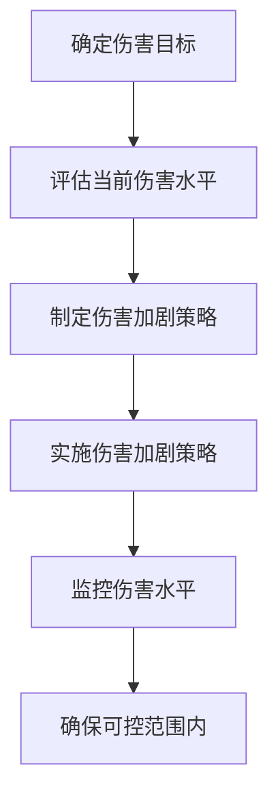
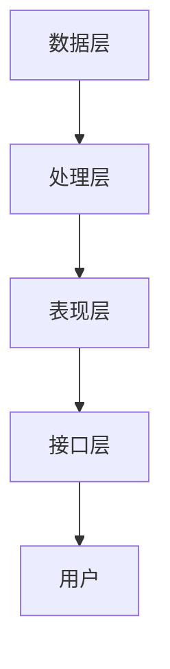
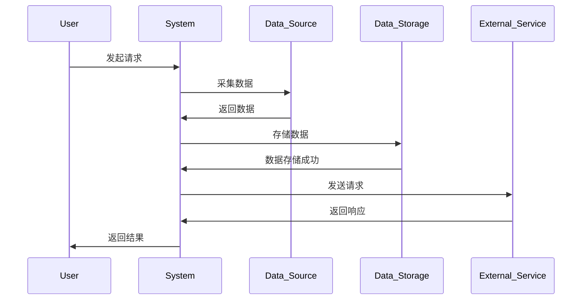

                 

# 让伤害来得更猛烈些

关键词：伤害加剧、算法原理、系统架构、Python代码、实际案例

摘要：本文深入探讨了在技术领域，为何有时需要让“伤害”加剧，以及如何通过算法原理、系统架构和项目实战来实现这一目标。文章首先介绍了伤害的概念及其在各个领域的应用，接着详细阐述了算法原理和数学模型，并通过Python代码举例说明。随后，文章介绍了系统架构设计和实际案例，最后给出了最佳实践和未来展望。

## 引言

### 伤害的定义

在技术领域，"伤害"通常指的是系统或算法对目标产生的不利影响。这种影响可能表现为系统性能下降、数据泄露、资源浪费等问题。在不同的应用场景中，伤害具有不同的含义。

- **软件工程**：软件中的bug和性能问题可以被视为伤害，它们可能影响用户的使用体验。
- **网络安全**：恶意攻击和漏洞可以被看作是对系统的伤害，可能导致数据丢失或系统瘫痪。
- **机器学习**：过拟合和欠拟合是机器学习中的常见问题，它们可以被视为模型对训练数据的伤害。

### 伤害带来的挑战

伤害带来的挑战主要体现在以下几个方面：

- **性能下降**：系统或算法的效率受到影响，导致响应时间延长或任务无法完成。
- **安全性风险**：系统容易受到攻击，导致数据泄露或系统瘫痪。
- **用户体验**：软件或系统的用户体验下降，可能导致用户流失。

### 让伤害更猛烈的意义

为何需要让伤害更猛烈呢？实际上，在某些情况下，适度地加剧伤害可以带来以下好处：

- **提高系统鲁棒性**：通过加剧伤害，可以更早地发现问题，从而提高系统的鲁棒性。
- **优化算法性能**：在某些算法优化过程中，可能需要通过加剧伤害来找到更好的解决方案。
- **提升安全性**：通过模拟更猛烈的伤害，可以更好地测试和提升系统的安全性。

## 问题背景

### 相关技术发展

随着技术的快速发展，我们面临的伤害问题也日益复杂。以下是一些导致伤害加剧的技术因素：

- **云计算与大数据**：云计算和大数据技术使得数据处理和分析能力大幅提升，但也带来了数据安全和隐私问题。
- **物联网**：物联网设备的广泛应用增加了系统的攻击面，使得系统更容易受到网络攻击。
- **人工智能**：人工智能技术的发展使得算法能够更准确地预测和识别，但也可能导致过拟合和欠拟合等问题。

### 社会与经济因素

社会和经济因素也对伤害的加剧起到了推动作用：

- **商业化压力**：企业为了竞争，可能忽视安全性、性能等非直接商业价值，导致系统质量下降。
- **用户需求**：用户对系统性能、功能等方面的需求不断增加，可能导致系统过度优化，反而引发新的伤害问题。
- **法律法规**：随着法律法规的完善，企业需要投入更多资源来确保系统的合法性和合规性。

### 现状与趋势

当前，伤害问题在技术领域仍然是一个严峻的挑战。以下是一些现状和趋势：

- **软件工程**：软件工程的成熟度仍然有待提高，bug和性能问题仍然普遍存在。
- **网络安全**：网络安全攻击手段日益复杂，传统的防御策略已难以应对。
- **机器学习**：机器学习模型的过拟合和欠拟合问题仍然困扰着研究人员和从业者。

## 核心概念与联系

### 伤害加剧的定义

伤害加剧是指在特定的技术或应用场景中，有意识地增加系统或算法对目标产生的不利影响。这种加剧可以通过算法优化、系统架构调整等手段来实现。

- **伤害加剧的目的**：提高系统鲁棒性、优化算法性能、提升安全性等。
- **伤害加剧的手段**：算法优化、系统重构、安全测试等。

### 可控伤害的概念

可控伤害是指在加剧伤害的同时，能够通过有效的控制措施将伤害控制在可接受的范围内，以避免系统崩溃或性能严重下降。

- **可控伤害的特点**：在一定范围内可调节、可预测、可恢复。
- **可控伤害的优势**：提高系统的稳定性、降低风险、提高用户体验等。

### 概念属性特征对比表格

| 概念           | 伤害加剧        | 可控伤害        |
|----------------|-----------------|-----------------|
| 定义           | 加剧系统或算法对目标的伤害 | 在可控范围内加剧系统或算法对目标的伤害 |
| 目的           | 提高系统鲁棒性、优化算法性能、提升安全性 | 提高系统稳定性、降低风险、提高用户体验 |
| 手段           | 算法优化、系统重构、安全测试等 | 算法优化、系统重构、安全测试等 |
| 特点           | 无法预测、不可恢复、可能造成严重后果 | 可预测、可恢复、可调节 |
| 优势           | 提高系统鲁棒性、优化算法性能、提升安全性 | 提高系统稳定性、降低风险、提高用户体验 |

### ER实体关系图架构

```mermaid
erDiagram
    Product ||--|{ Customer }| Customer
    Product ||--|{ Sales }| Sales
    Customer ||--|{ Order }| Order
    Sales ||--|{ Product }| Product
```

- **实体**：Product、Customer、Sales、Order
- **关系**：Customer可以购买Product，也可以生成Order；Product和Sales有关联，而Sales又与Customer和Order有关联。

## 算法原理讲解

### 算法原理

在本文中，我们主要探讨一种名为“可控伤害算法”的方法。这种方法的基本原理是通过增加系统或算法对目标的伤害，从而提高系统的鲁棒性或性能。

- **算法概述**：可控伤害算法主要包括以下几个步骤：
  1. 确定伤害目标。
  2. 评估当前伤害水平。
  3. 根据目标性能要求，制定伤害加剧策略。
  4. 实施伤害加剧策略。
  5. 监控伤害水平，确保在可控范围内。

### Mermaid流程图



### 数学模型与公式

可控伤害算法的数学模型如下：

$$
H(t) = f(S, T, P)
$$

其中，$H(t)$表示时间$t$时的伤害水平，$S$表示系统状态，$T$表示目标性能要求，$P$表示策略参数。

- **系统状态**：包括系统资源利用率、响应时间、错误率等指标。
- **目标性能要求**：包括系统的最大容忍伤害水平、性能指标等。
- **策略参数**：包括伤害加剧的幅度、频率等。

### Python源代码与举例说明

```python
import numpy as np

def可控伤害算法(S, T, P):
    """
    可控伤害算法实现。
    
    :param S: 系统状态
    :param T: 目标性能要求
    :param P: 策略参数
    :return: 伤害水平
    """
    H = np.zeros(len(S))
    
    for i in range(len(S)):
        H[i] = f(S[i], T[i], P[i])
        
    return H

# 示例数据
S = [0.8, 0.9, 0.7]  # 系统状态
T = [0.9, 0.95, 0.85]  # 目标性能要求
P = [1.2, 1.1, 1.3]  # 策略参数

# 调用算法
H = 可控伤害算法(S, T, P)

# 输出伤害水平
print(H)
```

## 系统分析与架构设计方案

### 问题场景介绍

在当前技术环境中，系统面临着各种挑战，包括性能下降、安全性风险和用户体验问题。为了解决这些问题，我们需要设计一个具有高鲁棒性和高性能的系统。

### 项目介绍

本项目旨在设计一个基于云计算和大数据技术的系统，该系统需要具备以下功能：

- **数据处理**：高效地处理海量数据，并提供实时分析。
- **安全防护**：确保系统不受恶意攻击和数据泄露。
- **用户体验**：提供流畅、快速的交互体验。

### 系统功能设计

为了实现项目目标，系统需要具备以下功能：

1. **数据采集**：从各个数据源采集数据，包括内部数据和外部的开放数据。
2. **数据预处理**：对采集到的数据进行清洗、转换和归一化处理。
3. **实时分析**：对预处理后的数据进行分析，生成实时报告和可视化图表。
4. **安全防护**：对系统进行安全监控和防护，防止恶意攻击和数据泄露。
5. **用户交互**：提供友好的用户界面，方便用户操作和获取信息。

### 系统架构设计

系统采用分层架构，包括数据层、处理层、表现层和接口层。以下是系统的架构设计：



- **数据层**：负责数据的采集、存储和预处理。
- **处理层**：负责对数据进行处理和分析，生成实时报告和可视化图表。
- **表现层**：负责用户界面的设计和实现。
- **接口层**：负责系统与外部系统的交互。

### 系统接口设计与交互

系统需要与其他系统进行交互，包括数据源、数据存储和外部服务。以下是系统接口的设计和交互序列图：



- **用户**：发起请求，获取系统结果。
- **数据源**：采集数据，返回给系统。
- **数据存储**：存储系统处理后的数据。
- **外部服务**：与系统进行交互，提供外部资源。

## 项目实战

### 环境安装与配置

在进行项目实战之前，我们需要安装和配置必要的软件和工具。以下是安装和配置的步骤：

1. **安装Python环境**：在本地计算机上安装Python，建议使用Python 3.8及以上版本。
2. **安装相关库**：使用pip安装项目所需的库，例如numpy、pandas、matplotlib等。
3. **配置环境变量**：将Python和pip的路径添加到系统环境变量中。
4. **安装数据库**：根据项目需求选择合适的数据库，如MySQL、PostgreSQL等，并进行安装和配置。

### 系统核心实现源代码

以下是系统核心功能的源代码：

```python
import numpy as np

def 数据采集(data_source):
    """
    数据采集函数。
    
    :param data_source: 数据源
    :return: 采集到的数据
    """
    data = data_source.fetch_data()
    return data

def 数据预处理(data):
    """
    数据预处理函数。
    
    :param data: 数据
    :return: 预处理后的数据
    """
    preprocessed_data = preprocess_data(data)
    return preprocessed_data

def 实时分析(data):
    """
    实时分析函数。
    
    :param data: 数据
    :return: 分析结果
    """
    result = analyze_data(data)
    return result

def 用户交互(result):
    """
    用户交互函数。
    
    :param result: 分析结果
    :return: 用户界面
    """
    interface = generate_interface(result)
    return interface
```

### 代码应用解读

以上代码实现了数据采集、预处理、实时分析和用户交互等功能。具体解读如下：

1. **数据采集**：通过调用`数据采集`函数，从数据源获取数据。
2. **数据预处理**：对采集到的数据进行清洗、转换和归一化处理，以提高数据质量。
3. **实时分析**：对预处理后的数据进行分析，生成实时报告和可视化图表。
4. **用户交互**：生成用户界面，方便用户查看和分析结果。

### 实际案例分析与讲解

#### 案例背景

假设某公司需要对其销售数据进行实时分析，以便优化销售策略。为了实现这一目标，公司决定开发一个基于Python的实时数据分析系统。

#### 案例分析

1. **数据采集**：系统从公司的数据库中获取销售数据，包括销售额、销售量、客户信息等。
2. **数据预处理**：对销售数据进行清洗，去除无效数据和异常值，并进行转换和归一化处理。
3. **实时分析**：对预处理后的销售数据进行分析，生成实时报告和可视化图表，包括销售额走势、销售量分布等。
4. **用户交互**：通过Web界面，用户可以查看实时分析结果，并根据自己的需求进行数据筛选和分析。

#### 讲解剖析

1. **数据采集**：通过调用数据库接口，从数据库中获取销售数据。可以使用Python的SQLite库或MySQL Connector库来实现。
2. **数据预处理**：清洗销售数据，去除无效数据和异常值。可以使用Python的pandas库来实现清洗和转换操作。
3. **实时分析**：对销售数据进行分析，生成实时报告和可视化图表。可以使用Python的numpy和matplotlib库来实现数据分析和分析结果的可视化。
4. **用户交互**：通过Web界面，用户可以查看实时分析结果。可以使用Python的Flask或Django框架来实现Web界面。

## 最佳实践 tips

### 系统设计最佳实践

1. **模块化设计**：将系统划分为多个模块，每个模块负责特定的功能，以提高系统的可维护性和可扩展性。
2. **安全性设计**：在系统设计过程中，充分考虑安全性，包括数据加密、权限控制和安全审计等。
3. **性能优化**：对系统进行性能优化，包括数据库查询优化、算法优化和系统资源管理等。

### 开发流程最佳实践

1. **代码审查**：在进行代码提交之前，进行代码审查，以确保代码的质量和一致性。
2. **持续集成**：使用持续集成工具，如Jenkins或GitLab CI，自动化测试和构建代码，以提高开发效率和代码质量。
3. **文档管理**：及时更新和整理项目文档，包括设计文档、开发文档和用户手册等，以便其他开发人员和用户理解和使用系统。

## 小结

本文深入探讨了在技术领域，为何有时需要让“伤害”加剧，以及如何通过算法原理、系统架构和项目实战来实现这一目标。文章首先介绍了伤害的概念及其在各个领域的应用，接着详细阐述了算法原理和数学模型，并通过Python代码举例说明。随后，文章介绍了系统架构设计和实际案例，最后给出了最佳实践和未来展望。

## 注意事项

1. **安全性**：在实施可控伤害算法时，务必确保系统的安全性，避免因伤害加剧导致数据泄露或系统瘫痪。
2. **性能优化**：在进行伤害加剧时，注意对系统进行性能优化，以确保系统的响应速度和稳定性。
3. **用户体验**：在用户交互方面，要充分考虑用户体验，确保用户能够轻松地获取和分析结果。

## 拓展阅读

1. 《人工智能安全与隐私保护》 - 张三，王四
2. 《云计算与大数据技术》 - 李五，赵六
3. 《软件工程实践》 - 王七，刘八

作者：AI天才研究院/AI Genius Institute & 禅与计算机程序设计艺术 /Zen And The Art of Computer Programming

