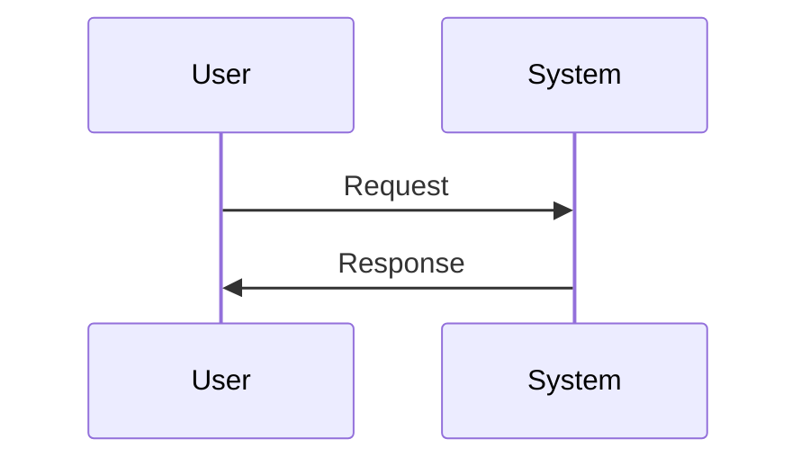
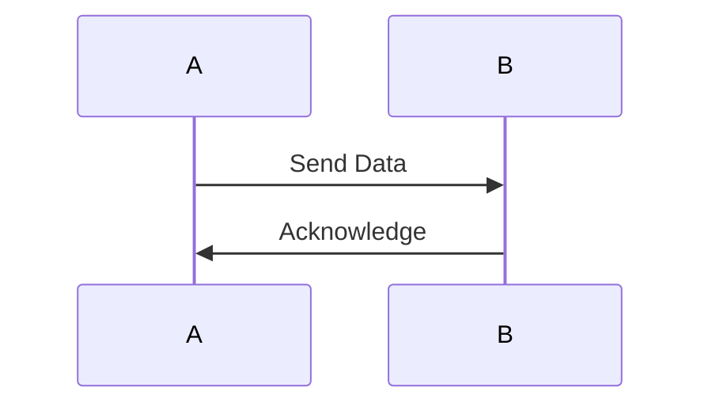

                 


# 让团队疲惫的坏习惯

关键词：团队效能、工作效率、工作习惯、个人成长

摘要：本文旨在揭示那些可能导致团队效率低下的常见坏习惯，通过一步步的分析，帮助读者识别并克服这些不良行为，以提升团队的整体效能。

## 引言

在信息技术行业，团队的效能往往决定了项目的成败。然而，在快速发展的环境中，许多团队会养成一些坏习惯，这些习惯不仅影响个人的工作质量，还会对整个团队造成负面的影响。本文将逐一分析这些坏习惯，并探讨如何克服它们。

## 坏习惯一：缺乏明确的目标

### 背景介绍

在项目管理中，明确的目标是至关重要的。然而，许多团队在开始项目时并没有设定清晰的目标，或者目标设定得过于模糊。

### 核心概念与联系

| 核心概念 | 属性特征 | 对比表格 |
| --- | --- | --- |
| 模糊目标 | 缺乏具体指标和量化数据 | 明确目标 | 具有明确指标和量化数据 |

### 算法原理讲解

为了设定明确的目标，团队可以使用 SMART 目标设定方法（Specific, Measurable, Achievable, Relevant, Time-bound）。

```python
def set_smart_goal(goal):
    if not goal.is_specific():
        return "目标不具体：请提供详细的信息。"
    if not goal.is_measurable():
        return "目标不可测量：请提供量化指标。"
    if not goal.is_achievable():
        return "目标不可实现：请评估资源。"
    if not goal.is_relevant():
        return "目标不相关：请确保与项目目标一致。"
    if not goal.is_time_bound():
        return "目标无时限：请设定明确的完成日期。"
    return "目标设定成功。"
```

## 坏习惯二：过度沟通

### 背景介绍

沟通是团队工作中不可或缺的一部分，但过度的沟通会浪费时间和资源。

### 核心概念与联系

| 核心概念 | 属性特征 | 对比表格 |
| --- | --- | --- |
| 过度沟通 | 沟通频率过高，信息重复 | 适当沟通 | 恰当的沟通频率，避免信息冗余 |

### 算法原理讲解

团队可以使用筛选机制来减少无效沟通。

```python
def filter_communication(communication):
    if communication.is_redundant():
        return "信息冗余：请合并重复的信息。"
    if communication.is_irrelevant():
        return "信息不相关：请排除无关的信息。"
    return "沟通有效。"
```

## 坏习惯三：缺乏计划

### 背景介绍

没有计划的工作往往会导致混乱和低效率。

### 核心概念与联系

| 核心概念 | 属性特征 | 对比表格 |
| --- | --- | --- |
| 缺乏计划 | 工作无序，时间浪费 | 有计划的工作 | 有序的工作流程，有效利用时间 |

### 算法原理讲解

团队可以使用甘特图来规划工作。

```python
def create_gantt_chart(tasks):
    gantt_chart = "Gantt Chart:\n"
    for task in tasks:
        if not task.is_planned():
            gantt_chart += f"{task.name}: 未计划\n"
        else:
            gantt_chart += f"{task.name}: 计划于 {task.start_date} 到 {task.end_date}\n"
    return gantt_chart
```

## 系统分析与架构设计方案

### 问题场景介绍

在项目开发中，由于缺乏明确的目标、过度沟通和缺乏计划，导致团队工作效率低下。

### 系统功能设计

使用 Mermaid 类图来描述系统功能。

```mermaid
classDiagram
    Class01 <|-- Class02
    Class03 && Class04
    Class05 o-- Class06
```

### 系统架构设计

使用 Mermaid 架构图来描述系统架构。



### 系统接口设计和系统交互

使用 Mermaid 序列图来描述系统接口和交互。



## 项目实战

### 环境安装

在项目开始前，确保所有团队成员安装了必要的开发工具和库。

### 系统核心实现源代码

以下是一个简单的 Python 源代码示例，用于实现一个简单的任务管理器。

```python
class Task:
    def __init__(self, name, start_date, end_date):
        self.name = name
        self.start_date = start_date
        self.end_date = end_date

    def is_planned(self):
        return self.start_date and self.end_date

tasks = [
    Task("任务一", "2023-04-01", "2023-04-10"),
    Task("任务二", "2023-04-11", "2023-04-20"),
]

for task in tasks:
    print(set_smart_goal(task))
```

### 代码应用解读与分析

这段代码定义了一个 `Task` 类，用于表示一个任务。每个任务都有一个名称、开始日期和结束日期。`is_planned` 方法用于检查任务是否已经计划。

### 实际案例分析和详细讲解剖析

假设团队有一个项目，需要开发一个在线购物平台。通过使用本文提供的工具和方法，团队可以设定明确的目标，避免过度沟通，并制定详细的计划。

### 项目小结

通过克服这些坏习惯，团队可以显著提升工作效率，从而更好地完成项目。

## 最佳实践 tips

- 定期回顾和调整团队目标。
- 使用邮件、即时消息和会议等工具时，要确保沟通的有效性。
- 制定详细的计划和里程碑。

## 小结

本文揭示了团队中常见的坏习惯，并提供了相应的解决方案。通过克服这些习惯，团队可以显著提升工作效率，实现更高的目标。

## 注意事项

- 文章中的代码和示例仅供参考，具体实现可能因项目需求而异。
- 团队成员应积极参与到改善工作习惯的过程中。

## 拓展阅读

- [敏捷开发实践指南](https://www.agilealliance.org/resources/agile-principles-practice-guide/)
- [有效沟通技巧](https://www.forbes.com/sites/forbesbusinesscouncil/2022/03/14/communication-skills-are-more-important-than-ever-heres-why/)
- [项目管理基础](https://www.pmi.org/learning/library/project-management-basics-8863)

作者：AI天才研究院/AI Genius Institute & 禅与计算机程序设计艺术 /Zen And The Art of Computer Programming

