                 

# 让团队跌份的坏习惯

## 关键词
团队管理、团队效能、不良习惯、改进策略、领导力

## 摘要
本文深入探讨了在团队工作中常见的坏习惯，以及这些习惯如何影响团队的整体表现。通过分析个人层面的不良习惯、团队层面的不良习惯和管理层面的不良习惯，我们提出了一系列解决策略，帮助团队克服这些问题，提升整体效能。本文旨在为团队管理者、成员和IT专业人士提供实用的指导，帮助他们识别和克服坏习惯，打造高效、协作的团队。

## 引言

在IT行业，团队协作是推动项目成功的关键因素。然而，许多团队在长期的工作过程中，往往因为一些不良习惯而影响了整体效能。这些习惯可能源于个人、团队或管理层面，但它们都对团队的表现产生了负面影响。本文将深入分析这些坏习惯，并提出具体的解决策略，以帮助团队克服这些问题，实现更高的工作效率和更好的项目成果。

### 个人层面的坏习惯

个人层面的坏习惯是团队效能下降的常见原因。以下是一些常见的个人坏习惯：

1. **拖延**
   拖延是个人层面最常见的坏习惯之一。它不仅导致个人任务延误，还可能影响整个团队的进度。

2. **缺乏主动性**
   缺乏主动性意味着团队成员不愿意承担责任或提出创新的想法，这限制了团队的整体创造力。

3. **消极情绪**
   消极情绪如焦虑、沮丧或抵触情绪会影响团队成员的工作态度和协作精神。

4. **缺乏沟通**
   即使在高度协作的团队中，缺乏有效的沟通也可能导致误解和冲突，进而影响团队效能。

### 团队层面的坏习惯

团队层面的坏习惯往往源于成员之间的互动和合作方式。以下是一些常见的团队坏习惯：

1. **沟通不畅**
   团队成员之间的沟通不畅可能导致信息传递错误、任务分配不清和决策失误。

2. **协作效率低下**
   团队协作效率低下可能是由于分工不清、角色冲突或资源不足等因素造成的。

3. **目标不明确**
   没有明确的目标和计划，团队成员可能缺乏方向感，导致工作无序和效率低下。

4. **缺乏反馈**
   缺乏有效的反馈机制可能导致团队成员无法及时了解自己的工作表现，也无法从错误中学习。

### 管理层面的坏习惯

管理层的不良习惯也会对团队的表现产生负面影响。以下是一些常见的管理坏习惯：

1. **决策失误**
   管理层决策失误可能导致项目方向偏差、资源浪费和团队士气低落。

2. **管理不善**
   管理不善包括缺乏领导力、不合理的规章制度以及不公平的待遇等，这些都会损害团队的动力和士气。

3. **激励不足**
   激励不足可能导致团队成员缺乏工作动力，影响团队的整体效能。

4. **忽视反馈**
   管理层忽视团队成员的反馈和建议，可能导致团队的不满和士气低落。

## 解决策略

### 个人层面的解决策略

为了克服个人层面的坏习惯，团队成员可以采取以下策略：

1. **自我反思**
   定期进行自我反思，识别自己的不良习惯，并制定具体的改进计划。

2. **时间管理**
   使用时间管理工具，如番茄工作法，提高工作效率，减少拖延。

3. **主动沟通**
   积极参与团队讨论，主动分享自己的想法和意见，提高沟通效果。

4. **积极心态**
   保持积极心态，面对困难和挑战时，保持乐观和耐心。

### 团队层面的解决策略

为了改善团队层面的不良习惯，团队可以采取以下策略：

1. **建立沟通机制**
   设立定期的团队会议和沟通渠道，确保信息流畅和透明。

2. **优化协作流程**
   重新审视团队协作流程，确保任务分配清晰、职责明确。

3. **设定明确目标**
   为每个项目设定明确的目标和里程碑，确保团队成员有清晰的方向。

4. **建立反馈机制**
   设立反馈渠道，鼓励团队成员提出建议和反馈，及时纠正问题。

### 管理层面的解决策略

管理层可以采取以下策略来克服不良习惯：

1. **改善决策过程**
   通过数据分析和团队讨论，提高决策的准确性和有效性。

2. **提升领导力**
   培养领导力，确保团队成员感受到领导的支持和鼓励。

3. **公平激励**
   制定合理的激励政策，确保团队成员的付出得到公平的回报。

4. **倾听反馈**
   重视团队成员的反馈，建立开放的沟通环境，鼓励团队成员表达意见和建议。

## 结论

团队效能是项目成功的关键，而团队中的坏习惯往往会影响整个团队的效能。通过识别和克服个人、团队和管理层面的坏习惯，团队可以提升整体表现，实现更高的工作效率和更好的项目成果。本文提供了具体的解决策略，帮助团队管理者、成员和IT专业人士识别和克服这些坏习惯，打造高效、协作的团队。

作者：AI天才研究院/AI Genius Institute & 禅与计算机程序设计艺术 /Zen And The Art of Computer Programming

----------------------------------------------------------------

## 个人层面的坏习惯

### 拖延

拖延是个人层面的一个普遍问题，它不仅影响个人的工作效率，还会对团队的整体进度产生负面影响。拖延的原因多种多样，包括缺乏动力、目标不明确、任务复杂度高等。以下是一个简单的 Mermaid 流程图，展示了拖延可能导致的后果：

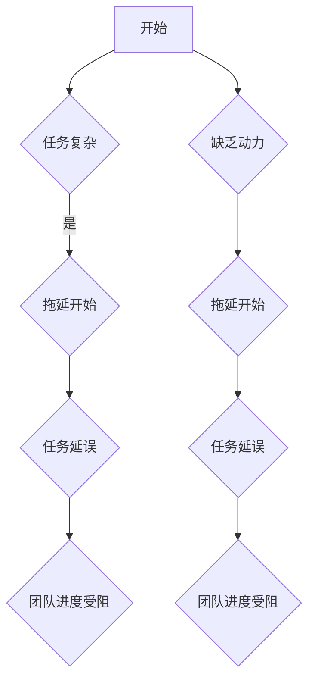

为了克服拖延，可以采取以下策略：

1. **时间管理**
   使用时间管理工具，如番茄工作法，将工作划分为短时间段，提高工作效率。

2. **目标设定**
   为每个任务设定明确的目标和截止日期，确保有清晰的方向。

3. **优先级排序**
   根据任务的优先级进行排序，确保先完成最重要和最紧急的任务。

### 缺乏主动性

缺乏主动性是另一个常见的问题，它导致团队成员不愿意承担责任或提出创新的想法。以下是一个简单的 Mermaid 流程图，展示了缺乏主动性可能导致的后果：

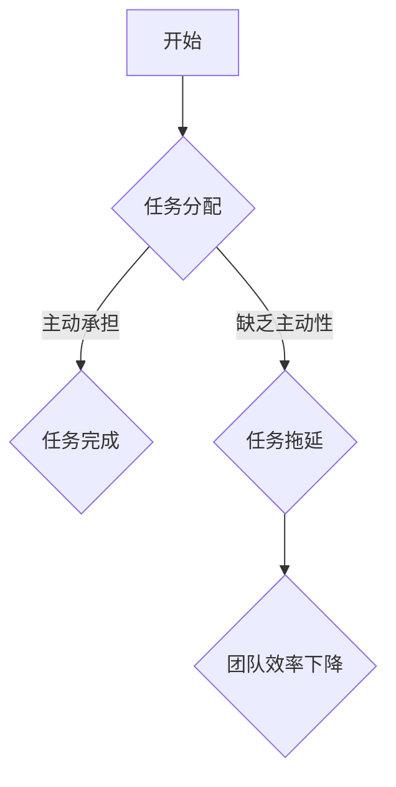

为了克服缺乏主动性，可以采取以下策略：

1. **激励措施**
   建立激励机制，鼓励团队成员主动承担责任。

2. **沟通与反馈**
   提供反馈机制，让团队成员了解他们的贡献和进步。

3. **培养责任意识**
   通过培训和会议，培养团队成员的责任感和主动性。

### 消极情绪

消极情绪如焦虑、沮丧或抵触情绪会影响团队成员的工作态度和协作精神。以下是一个简单的 Mermaid 流程图，展示了消极情绪可能导致的后果：

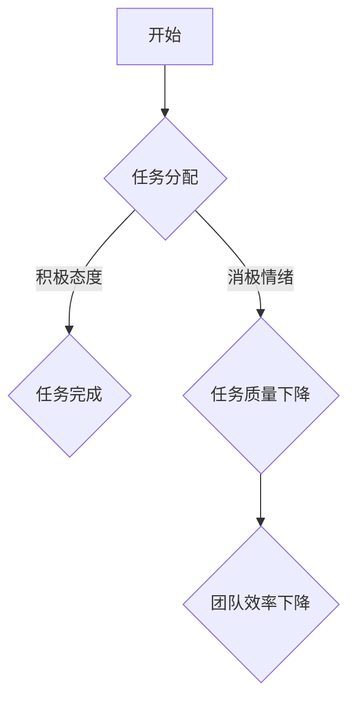

为了克服消极情绪，可以采取以下策略：

1. **情绪管理**
   提供情绪管理培训和资源，帮助团队成员管理负面情绪。

2. **正面激励**
   通过正面激励和认可，提高团队成员的积极性。

3. **团队建设活动**
   组织团队建设活动，增强团队成员之间的情感联系。

### 缺乏沟通

缺乏有效的沟通可能导致误解、冲突和任务分配不清。以下是一个简单的 Mermaid 流程图，展示了缺乏沟通可能导致的后果：

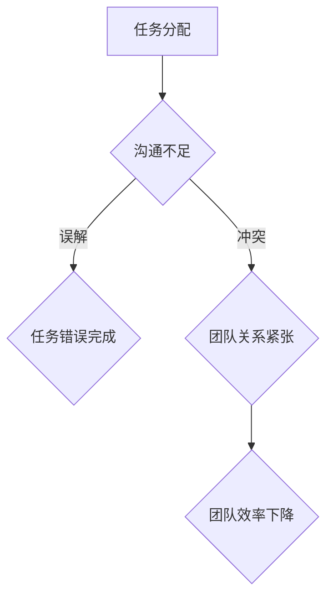

为了克服缺乏沟通，可以采取以下策略：

1. **定期会议**
   定期组织团队会议，确保信息畅通和透明。

2. **明确沟通渠道**
   设立明确的沟通渠道，如邮件、即时通讯工具或项目管理系统。

3. **鼓励表达**
   鼓励团队成员表达意见和反馈，提高团队的沟通效率。

## 团队层面的坏习惯

### 沟通不畅

沟通不畅是团队协作中常见的问题，它可能导致信息传递错误、任务分配不清和决策失误。以下是一个简单的 Mermaid 流程图，展示了沟通不畅可能导致的后果：

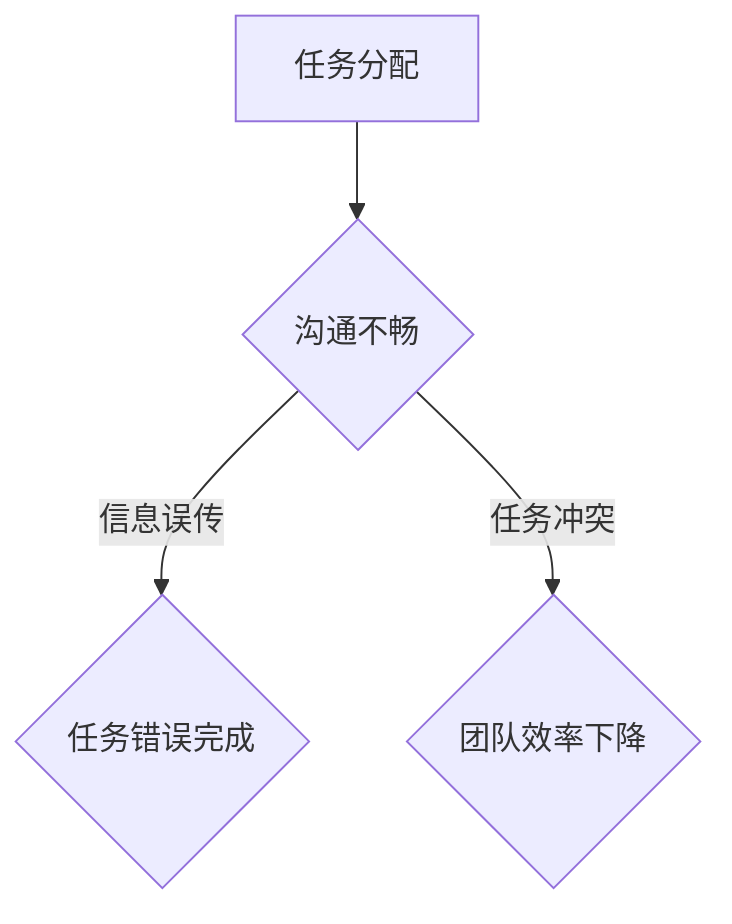

为了克服沟通不畅，可以采取以下策略：

1. **明确沟通目标**
   在每次沟通前明确目标，确保沟通有明确的方向。

2. **使用可视化工具**
   使用可视化工具，如流程图、思维导图等，帮助团队成员更好地理解和传达信息。

3. **建立反馈机制**
   建立反馈机制，确保团队成员可以及时了解沟通的效果和改进点。

### 协作效率低下

协作效率低下可能是由于分工不清、角色冲突或资源不足等因素造成的。以下是一个简单的 Mermaid 流程图，展示了协作效率低下可能导致的后果：

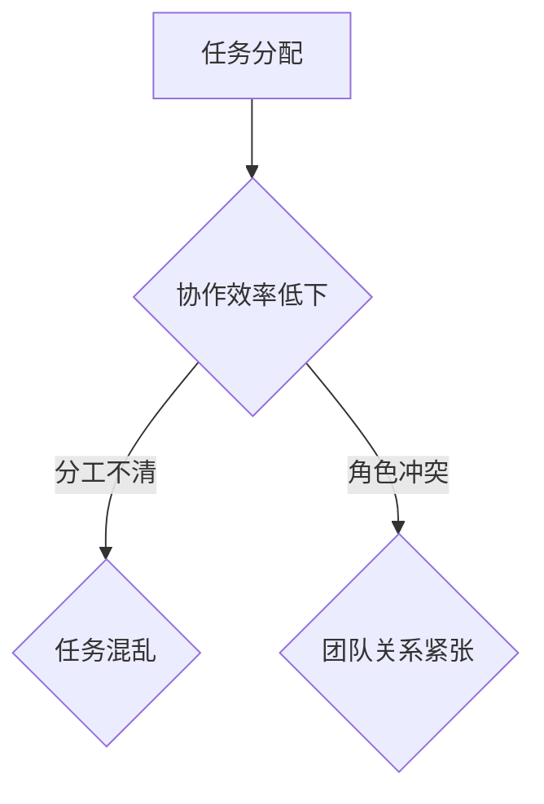

为了提高协作效率，可以采取以下策略：

1. **明确分工**
   明确每个团队成员的职责和任务，确保分工清晰。

2. **角色协调**
   建立有效的角色协调机制，解决角色冲突，确保团队成员之间的合作顺畅。

3. **资源管理**
   合理分配和利用资源，确保团队成员有足够的资源完成任务。

### 目标不明确

没有明确的目标和计划，团队成员可能缺乏方向感，导致工作无序和效率低下。以下是一个简单的 Mermaid 流程图，展示了目标不明确可能导致的后果：

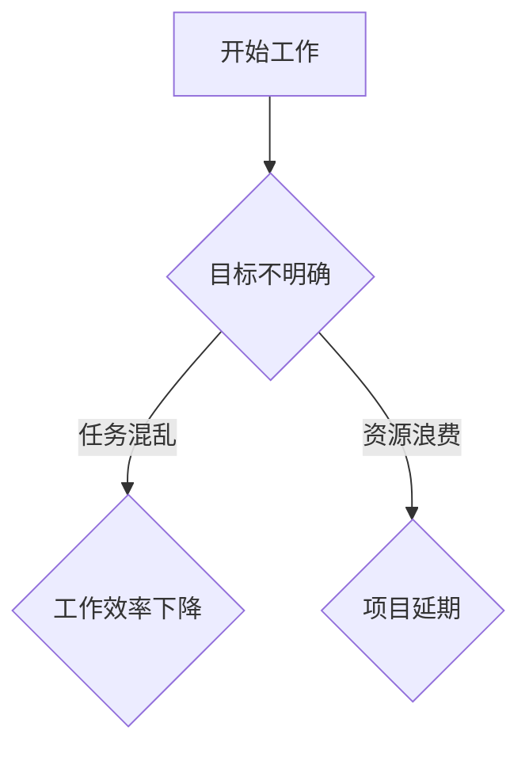

为了设定明确的目标，可以采取以下策略：

1. **制定计划**
   为每个项目制定详细的计划，包括目标、里程碑和时间表。

2. **目标分解**
   将大目标分解为小目标，确保每个目标都有明确的可衡量指标。

3. **团队共识**
   确保团队成员对目标和计划有共同的理解和认同。

### 缺乏反馈

缺乏有效的反馈机制可能导致团队成员无法及时了解自己的工作表现，也无法从错误中学习。以下是一个简单的 Mermaid 流程图，展示了缺乏反馈可能导致的后果：

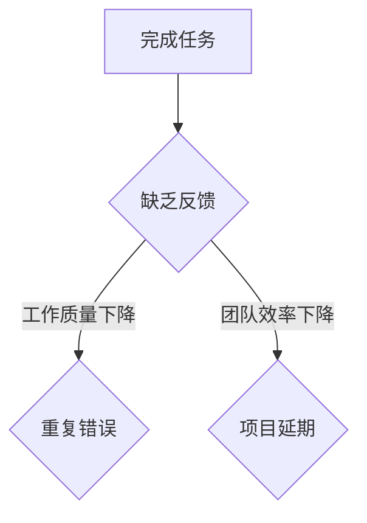

为了建立有效的反馈机制，可以采取以下策略：

1. **定期评估**
   定期对团队成员的工作进行评估，提供具体的反馈和建议。

2. **开放沟通**
   鼓励团队成员之间的开放沟通，分享经验和教训。

3. **培训与发展**
   提供培训和发展机会，帮助团队成员提升技能和知识。

## 管理层面的坏习惯

### 决策失误

管理层决策失误可能导致项目方向偏差、资源浪费和团队士气低落。以下是一个简单的 Mermaid 流程图，展示了决策失误可能导致的后果：

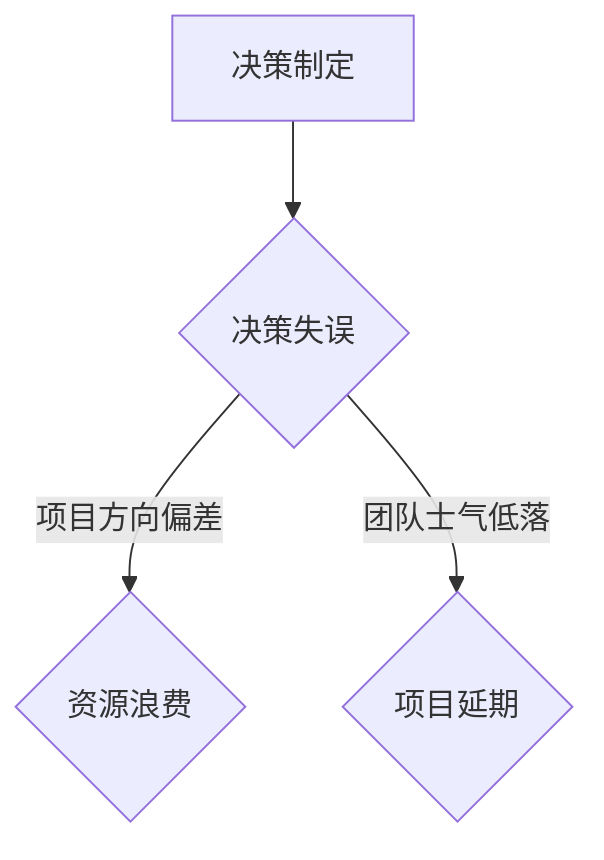

为了克服决策失误，可以采取以下策略：

1. **数据驱动**
   基于数据和事实做出决策，避免凭直觉或主观判断。

2. **团队参与**
   让团队成员参与到决策过程中，收集更多的意见和建议。

3. **风险评估**
   在决策前进行风险评估，预测可能的风险和挑战。

### 管理不善

管理不善包括缺乏领导力、不合理的规章制度以及不公平的待遇等，这些都会损害团队的动力和士气。以下是一个简单的 Mermaid 流程图，展示了管理不善可能导致的后果：

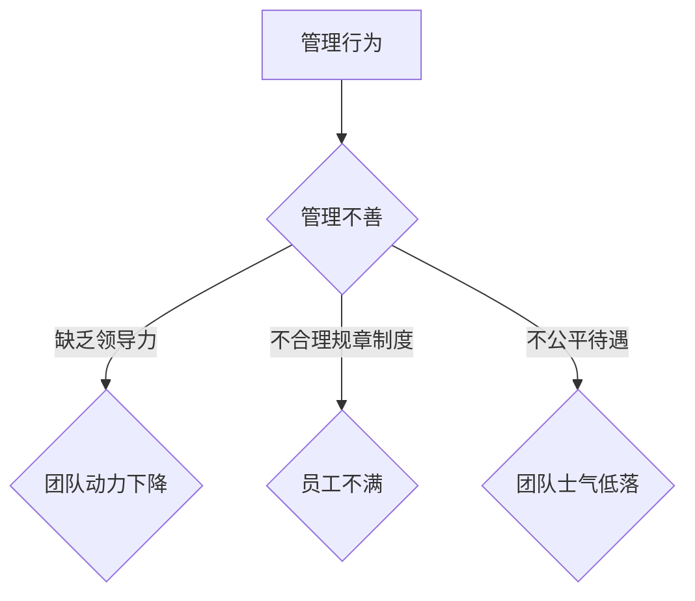

为了改善管理不善，可以采取以下策略：

1. **提升领导力**
   通过培训和辅导，提升管理者的领导力，建立积极的团队氛围。

2. **优化规章制度**
   修订不合理的规章制度，确保员工有公平的工作环境。

3. **公平激励**
   实施公平的激励政策，确保员工的付出得到合理的回报。

### 激励不足

激励不足可能导致团队成员缺乏工作动力，影响团队的整体效能。以下是一个简单的 Mermaid 流程图，展示了激励不足可能导致的后果：

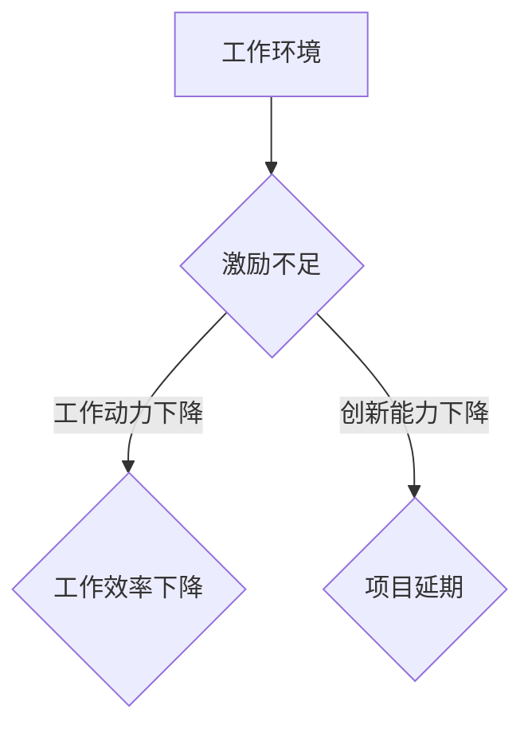

为了克服激励不足，可以采取以下策略：

1. **内在激励**
   提供有意义的工作任务和挑战，激发员工的内在动力。

2. **外在激励**
   设立奖励和表彰机制，为优秀的工作表现提供物质和精神上的激励。

3. **职业发展**
   提供职业发展机会和培训，帮助员工提升技能和职业前景。

### 忽视反馈

管理层忽视团队成员的反馈和建议，可能导致团队的不满和士气低落。以下是一个简单的 Mermaid 流程图，展示了忽视反馈可能导致的后果：

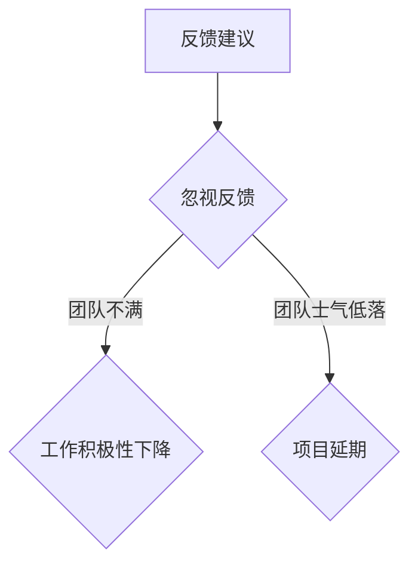

为了重视反馈，可以采取以下策略：

1. **建立反馈渠道**
   设立公开的反馈渠道，确保团队成员可以自由表达意见和建议。

2. **定期反馈会议**
   定期组织反馈会议，听取团队成员的意见和建议。

3. **行动反馈**
   对团队成员的反馈采取实际行动，展示管理层对反馈的重视。

## 实施与跟进

### 实施计划

为了有效实施解决策略，可以采取以下步骤：

1. **制定行动计划**
   根据团队的具体情况，制定详细的行动计划，明确每个步骤的具体目标和责任。

2. **培训与指导**
   对团队成员和管理者进行培训，提高他们的意识和能力，确保他们能够有效地执行行动计划。

3. **监督与执行**
   设立监督机制，确保行动计划得到有效执行，及时纠正偏差。

### 跟进与评估

为了评估解决方案的效果，可以采取以下步骤：

1. **定期评估**
   定期对团队的效能进行评估，包括工作效率、团队士气、项目进度等指标。

2. **反馈收集**
   通过调查问卷、访谈等方式收集团队成员的反馈，了解他们对行动计划的评价和建议。

3. **调整与改进**
   根据评估结果和反馈，及时调整和改进行动计划，确保持续改进。

## 总结与展望

通过本文的分析，我们可以看到团队中的坏习惯对整体效能的影响。个人层面的拖延、缺乏主动性、消极情绪和缺乏沟通，团队层面的沟通不畅、协作效率低下、目标不明确和缺乏反馈，以及管理层面的决策失误、管理不善、激励不足和忽视反馈，都是团队跌份的主要原因。通过采取具体的解决策略，我们可以有效地克服这些坏习惯，提升团队的效能。

展望未来，随着技术的不断进步和团队协作模式的不断创新，团队管理将面临更多的挑战和机遇。我们需要持续关注团队效能的提升，不断探索新的管理理念和方法，以适应不断变化的工作环境。

## 拓展阅读

为了进一步深入了解团队效能管理和克服坏习惯的方法，以下是几本推荐的专业书籍：

1. **《团队协作的艺术》**（The Art of Teamwork）：作者史蒂夫·圣伦（Steve圣伦）。本书详细探讨了团队协作的原理和实践，为团队管理者提供了实用的指导。

2. **《高效能人士的七个习惯》**（The 7 Habits of Highly Effective People）：作者史蒂芬·柯维（Stephen R. Covey）。本书介绍了高效能人士的七个习惯，对个人成长和团队效能提升都有很大帮助。

3. **《团队协同：提升团队效能的七个关键原则》**（Team Collaboration: The 7 Key Principles to Boost Team Effectiveness）：作者汤姆·凯利（Tom Kelly）。本书提出了七个关键原则，帮助团队提升协作效能。

通过阅读这些书籍，您可以获得更深入的见解和更全面的解决方案，以帮助您的团队克服坏习惯，实现更高的效能。作者：AI天才研究院/AI Genius Institute & 禅与计算机程序设计艺术 /Zen And The Art of Computer Programming。

