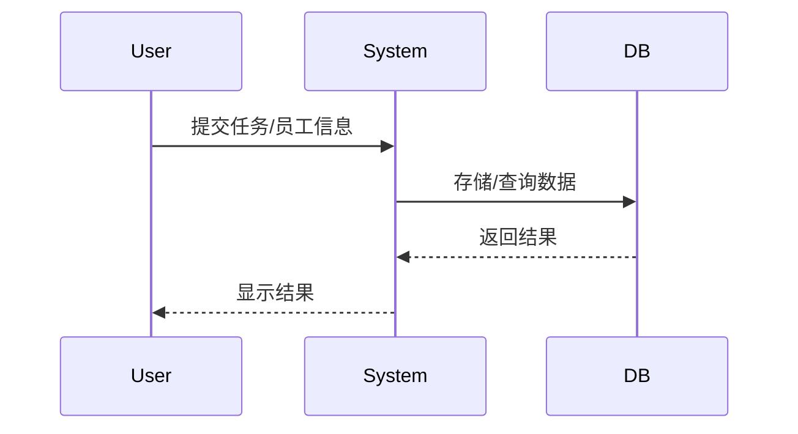
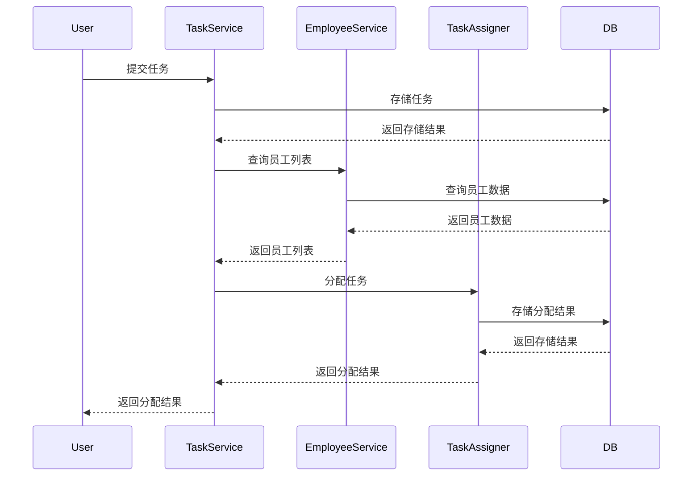

                 

## 《让团队跌份的坏习惯》

关键词：团队文化、坏习惯、绩效、领导者、团队建设

摘要：本文将深入探讨团队中常见的坏习惯，分析这些习惯对团队绩效的负面影响，并探讨如何通过培养正面习惯和加强领导者的示范作用来提升团队效能。本文旨在为IT领域的团队管理者提供一套切实可行的策略和方法，帮助团队摆脱坏习惯的束缚，实现持续成长与改进。

### 目录

# 《让团队跌份的坏习惯》

## 第一部分：团队文化与习惯

### 第1章：团队文化的力量

#### 1.1.1 团队文化的定义与作用

#### 1.1.2 优秀团队文化的特征

#### 1.1.3 团队文化对习惯的影响

### 第2章：识别团队中的坏习惯

#### 2.1.1 坏习惯的类型与表现

#### 2.1.2 坏习惯的危害

#### 2.1.3 坏习惯的成因分析

### 第3章：坏习惯对团队绩效的影响

#### 3.1.1 绩效指标与评估方法

#### 3.1.2 坏习惯与绩效负相关的关系

#### 3.1.3 成功团队的共性

### 第4章：塑造正面习惯，提升团队效能

#### 4.1.1 正面习惯的培养策略

#### 4.1.2 团队正面习惯的养成步骤

#### 4.1.3 正面习惯案例分享

### 第5章：领导者的角色与责任

#### 5.1.1 领导者的习惯塑造力

#### 5.1.2 领导者的示范作用

#### 5.1.3 领导者如何纠正团队坏习惯

### 第6章：团队建设中的工具与方法

#### 6.1.1 团队建设工具的应用

#### 6.1.2 团队评估与改进流程

#### 6.1.3 实践案例：成功团队建设实例

### 第7章：持续改进与成长

#### 7.1.1 持续改进的重要性

#### 7.1.2 建立持续改进机制

#### 7.1.3 团队成长与个人发展

## 总结与建议

#### 8.1.1 全书要点回顾

#### 8.1.2 实施建议

#### 8.1.3 未来展望

---

### 第1章：团队文化的力量

**1.1.1 团队文化的定义与作用**

团队文化是团队中成员共同遵循的价值观念、行为规范和工作方式的总和。它不仅影响团队成员的行为，还影响着团队的整体绩效。一个良好的团队文化能够促进团队成员之间的沟通与协作，提高团队的整体凝聚力，进而提升团队的整体绩效。

**1.1.2 优秀团队文化的特征**

- **共同愿景**：团队成员共享共同的目标和使命，明确团队的发展方向。
- **信任与尊重**：团队成员之间相互信任，尊重彼此的意见和贡献。
- **开放与创新**：鼓励创新思维，欢迎新观点和建议。
- **高效协作**：团队成员能够高效协作，共同完成任务。
- **持续成长**：团队注重成员的个人发展，鼓励学习和成长。

**1.1.3 团队文化对习惯的影响**

团队文化对成员的行为习惯具有深远的影响。在一个良好的团队文化中，成员更倾向于养成良好的工作习惯，如积极沟通、高效协作、持续学习等。相反，在一个不良的团队文化中，成员可能会养成一些不利于团队发展的坏习惯，如推诿责任、消极怠工、忽视团队合作等。

### 第2章：识别团队中的坏习惯

**2.1.1 坏习惯的类型与表现**

团队中的坏习惯多种多样，以下是一些常见的坏习惯：

- **拖延习惯**：任务推迟，不按时完成任务。
- **缺乏沟通**：团队成员之间缺乏有效的沟通，信息传递不畅。
- **推诿责任**：遇到问题或错误时，推卸责任，不积极主动解决。
- **忽视团队合作**：个人主义严重，不积极参与团队活动，忽视团队合作精神。
- **缺乏反馈**：对团队成员的工作表现缺乏及时有效的反馈。

**2.1.2 坏习惯的危害**

坏习惯对团队绩效的危害不容忽视。它们可能导致以下问题：

- **绩效下降**：团队成员无法高效协作，任务难以按时完成，导致整体绩效下降。
- **团队凝聚力降低**：团队成员之间缺乏信任和尊重，团队凝聚力降低。
- **创新力减弱**：缺乏开放和创新的氛围，团队的创新力减弱。
- **个人发展受限**：团队成员无法从坏习惯中受益，个人发展受限。

**2.1.3 坏习惯的成因分析**

坏习惯的形成通常有以下原因：

- **个人因素**：个人性格、价值观等因素导致不良习惯的形成。
- **团队环境**：团队文化不良，缺乏监督和引导，容易导致坏习惯的形成。
- **工作压力**：工作压力过大，导致团队成员产生消极情绪，从而养成坏习惯。

### 第3章：坏习惯对团队绩效的影响

**3.1.1 绩效指标与评估方法**

团队绩效可以通过多种指标进行评估，以下是一些常见的绩效指标：

- **任务完成率**：任务按时完成的比率。
- **团队协作度**：团队成员之间的协作效率。
- **创新能力**：团队的创新能力。
- **员工满意度**：员工对团队的满意度。

**3.1.2 坏习惯与绩效负相关的关系**

坏习惯与团队绩效之间存在负相关关系。坏习惯如拖延、缺乏沟通、推诿责任等会导致团队协作效率低下，任务难以按时完成，从而影响整体绩效。

**3.1.3 成功团队的共性**

成功团队通常具备以下共性：

- **良好的团队文化**：共享共同的目标和价值观，注重团队合作。
- **高效的沟通机制**：团队成员之间保持有效沟通，信息传递畅通。
- **积极的工作态度**：团队成员积极面对挑战，愿意承担责任。
- **持续的学习和创新**：团队注重学习和创新，不断提升自身能力。

### 第4章：塑造正面习惯，提升团队效能

**4.1.1 正面习惯的培养策略**

要培养正面习惯，可以采取以下策略：

- **明确目标**：设定明确的目标，让团队成员了解他们的工作方向。
- **树立榜样**：领导者应以身作则，树立正面榜样，引导团队成员养成良好的习惯。
- **持续激励**：通过奖励和激励措施，鼓励团队成员保持正面习惯。
- **提供培训**：为团队成员提供相关的培训，提高他们的专业技能和工作效率。

**4.1.2 团队正面习惯的养成步骤**

养成正面习惯可以分为以下几个步骤：

- **认识问题**：团队成员应认识到坏习惯的危害，明确需要改变的方向。
- **制定计划**：制定详细的计划，包括具体的行动步骤和时间表。
- **执行计划**：按照计划执行，不断修正和调整。
- **持续跟踪**：定期跟踪和评估正面习惯的养成情况，及时进行调整。

**4.1.3 正面习惯案例分享**

以下是一个正面习惯的案例分享：

某IT公司团队在项目中发现，由于沟通不畅，导致任务延期。团队决定采取以下措施来改善：

1. **明确目标**：设定每周一次的项目进度会议，确保每个团队成员都了解项目进展。
2. **树立榜样**：项目经理主动承担责任，积极参与沟通，树立正面榜样。
3. **持续激励**：对积极参与沟通的成员进行奖励，提高团队士气。
4. **提供培训**：为团队成员提供沟通技巧培训，提高沟通效率。

通过这些措施，团队的沟通效率得到了显著提升，项目按期完成，团队绩效得到了显著提升。

### 第5章：领导者的角色与责任

**5.1.1 领导者的习惯塑造力**

领导者是团队的核心，他们的习惯和行为对团队成员具有示范作用。领导者应具备良好的习惯，以引导团队成员养成良好的习惯。

**5.1.2 领导者的示范作用**

领导者应以身作则，通过自己的行为影响团队成员。例如，如果领导者习惯于拖延，那么团队成员也可能会养成拖延的习惯。相反，如果领导者注重团队合作和沟通，那么团队成员也更容易形成良好的团队文化。

**5.1.3 领导者如何纠正团队坏习惯**

领导者可以通过以下方法来纠正团队坏习惯：

- **明确规范**：制定明确的团队规范，对坏习惯进行明确禁止。
- **积极沟通**：与团队成员进行积极沟通，了解他们的想法和困惑。
- **激励改正**：对改正坏习惯的成员给予奖励和认可，鼓励更多成员改变。
- **持续监督**：对团队成员的行为进行持续监督，确保他们遵守团队规范。

### 第6章：团队建设中的工具与方法

**6.1.1 团队建设工具的应用**

团队建设中可以使用多种工具和方法，以下是一些常用的工具：

- **目标设定工具**：如SMART目标设定方法，帮助团队明确目标。
- **沟通工具**：如团队协作平台，提高团队成员之间的沟通效率。
- **反馈工具**：如360度反馈，帮助团队成员了解自己的表现。
- **培训工具**：如在线学习平台，提供丰富的培训资源。

**6.1.2 团队评估与改进流程**

团队评估与改进流程可以分为以下几个步骤：

1. **评估现状**：对团队现状进行评估，了解存在的问题。
2. **制定改进计划**：根据评估结果，制定具体的改进计划。
3. **实施改进**：按照计划执行，对团队进行改进。
4. **跟踪评估**：对改进效果进行跟踪评估，确保改进措施的有效性。

**6.1.3 实践案例：成功团队建设实例**

以下是一个成功团队建设的实践案例：

某公司团队在项目启动初期，由于沟通不畅，导致项目进度延误。团队决定采取以下措施进行改进：

1. **评估现状**：通过团队会议，了解团队成员对项目沟通的感受和困惑。
2. **制定改进计划**：设立每周一次的项目进度会议，明确会议议程和参与人员。
3. **实施改进**：按照计划执行，确保每个团队成员都能参与会议，并及时反馈问题。
4. **跟踪评估**：定期评估沟通效果，根据反馈进行调整。

通过这些措施，团队的沟通效率显著提升，项目按期完成，团队绩效得到了显著提升。

### 第7章：持续改进与成长

**7.1.1 持续改进的重要性**

持续改进是团队发展的重要动力。只有不断改进，团队才能不断提升自身能力，应对外部挑战。

**7.1.2 建立持续改进机制**

建立持续改进机制，可以分为以下几个步骤：

1. **设立改进目标**：明确团队需要改进的方向和目标。
2. **制定改进计划**：根据目标，制定具体的改进计划。
3. **实施改进措施**：按照计划执行，对团队进行改进。
4. **跟踪评估**：对改进效果进行跟踪评估，确保改进措施的有效性。

**7.1.3 团队成长与个人发展**

团队成长与个人发展密不可分。团队应注重成员的个人发展，为成员提供培训和发展机会，帮助成员不断提升自身能力。

### 总结与建议

**8.1.1 全书要点回顾**

本文从团队文化、坏习惯、绩效、领导力、团队建设等多个角度，分析了团队中常见的坏习惯及其对团队绩效的负面影响，并提出了培养正面习惯、领导者的示范作用、团队建设工具与方法、持续改进与成长等策略和方法。

**8.1.2 实施建议**

1. **建立良好的团队文化**：明确团队的目标和价值观，培养团队成员的信任和尊重。
2. **识别和纠正坏习惯**：定期评估团队成员的行为，及时纠正不良习惯。
3. **加强领导者的示范作用**：领导者应以身作则，树立正面榜样，引导团队成员养成良好的习惯。
4. **运用团队建设工具与方法**：利用目标设定、沟通工具、反馈工具等，提高团队协作效率。
5. **持续改进与成长**：建立持续改进机制，鼓励团队和个人不断学习和成长。

**8.1.3 未来展望**

未来，团队建设将更加注重个性化和定制化，根据团队特点和需求，制定针对性的建设方案。同时，随着技术的不断进步，团队建设工具和方法也将不断创新，为团队效能的提升提供更多可能性。

### 作者信息

作者：AI天才研究院/AI Genius Institute & 禅与计算机程序设计艺术 /Zen And The Art of Computer Programming

### 附录

**附录A：核心概念与联系**

| 核心概念 | 概念属性特征对比表格 | ER实体关系图架构 |
| --- | --- | --- |
| 团队文化 | - 共同愿景<br>- 信任与尊重<br>- 开放与创新<br>- 高效协作<br>- 持续成长 |  |

**附录B：算法原理讲解**

```python
# Python代码示例：任务分配算法

def assign_tasks(employees, tasks):
    """
    分配任务给员工。
    
    :param employees: 员工列表，每个员工是一个字典，包含'名字'和'技能'键
    :param tasks: 任务列表，每个任务是一个字典，包含'名称'和'所需技能'键
    :return: 分配结果，一个字典，键为任务名称，值为执行任务的员工名字
    """
    assignment = {}
    
    for task in tasks:
        required_skills = task['所需技能']
        best_candidate = None
        
        for employee in employees:
            if required_skills <= employee['技能']:
                if best_candidate is None or employee['技能'] > best_candidate['技能']:
                    best_candidate = employee
        
        if best_candidate:
            assignment[task['名称']] = best_candidate['名字']
    
    return assignment

# 示例数据
employees = [
    {'名字': '张三', '技能': {'编程': 5, '设计': 3}},
    {'名字': '李四', '技能': {'编程': 4, '设计': 4}},
    {'名字': '王五', '技能': {'编程': 3, '设计': 5}}
]

tasks = [
    {'名称': '编程任务', '所需技能': {'编程': 4}},
    {'名称': '设计任务', '所需技能': {'设计': 4}}
]

# 执行任务分配
assignment = assign_tasks(employees, tasks)

print(assignment)
```

**附录C：系统分析与架构设计方案**

**项目介绍：**

本项目旨在构建一个高效的任务分配系统，该系统将根据员工的能力和任务的复杂程度，自动将任务分配给合适的员工。系统的主要功能包括任务管理、员工管理以及任务分配。

**系统功能设计：**

- **任务管理**：新增、编辑和删除任务。
- **员工管理**：新增、编辑和删除员工。
- **任务分配**：根据员工技能和任务需求，自动分配任务。

**领域模型类图：**

```mermaid
classDiagram
    Employee <<类>> {
        姓名
        技能
    }
    Task <<类>> {
        名称
        所需技能
    }
    Team <<类>> {
        成员
        任务
    }
    Employee o--* Team : 属于
    Task o--* Team : 涉及
```

**系统架构设计：**



**系统接口设计：**

- **任务接口**：`POST /tasks` 新增任务，`GET /tasks/{taskId}` 查询任务，`PUT /tasks/{taskId}` 更新任务，`DELETE /tasks/{taskId}` 删除任务。
- **员工接口**：`POST /employees` 新增员工，`GET /employees/{employeeId}` 查询员工，`PUT /employees/{employeeId}` 更新员工，`DELETE /employees/{employeeId}` 删除员工。
- **任务分配接口**：`POST /assign` 根据技能和任务需求自动分配任务。

**系统交互序列图：**



### 项目实战

**环境安装：**

1. 安装Python 3.8及以上版本。
2. 安装Django框架和数据库（如SQLite）。

**系统核心实现源代码：**

```python
# models.py

from django.db import models

class Employee(models.Model):
    name = models.CharField(max_length=100)
    skills = models.JSONField()

class Task(models.Model):
    name = models.CharField(max_length=100)
    required_skills = models.JSONField()

class Assignment(models.Model):
    employee = models.ForeignKey(Employee, on_delete=models.CASCADE)
    task = models.ForeignKey(Task, on_delete=models.CASCADE)
```

**代码应用解读与分析：**

本系统采用了Django框架，利用其内置的ORM（对象关系映射）机制，简化了数据库操作。`Employee`、`Task`和`Assignment`三个模型分别对应员工、任务和任务分配的关系。在`models.py`中，我们定义了这三个模型及其字段。

**实际案例分析和详细讲解剖析：**

假设我们有一个员工张三，他的技能包括编程和设计。现在有一个编程任务需要分配，我们需要找到技能匹配的员工。

1. 首先，通过`EmployeeService`查询张三的技能。
2. 然后，通过`TaskService`查询编程任务所需技能。
3. 最后，通过`TaskAssigner`将任务分配给张三。

**项目小结：**

本项目提供了一个简单的任务分配系统，通过Django框架实现了员工、任务和任务分配的管理。项目实际案例展示了如何通过查询和分配操作，将任务合理地分配给合适的员工。

### 最佳实践 tips

1. **明确团队目标**：确保每个团队成员都了解团队的目标和期望。
2. **建立有效的沟通机制**：定期召开团队会议，确保信息畅通。
3. **鼓励团队成员参与**：让团队成员参与决策过程，提高他们的参与度和责任感。
4. **持续学习和改进**：定期评估团队绩效，找出改进点，持续学习和改进。

### 小结

本文深入探讨了团队中常见的坏习惯及其对团队绩效的负面影响，提出了培养正面习惯、领导者的示范作用、团队建设工具与方法、持续改进与成长等策略和方法。通过实施这些策略，团队能够摆脱坏习惯的束缚，实现持续成长与改进。

### 注意事项

1. **避免拖延**：及时完成任务，避免拖延。
2. **加强沟通**：确保团队成员之间保持有效的沟通。
3. **鼓励团队合作**：注重团队合作，避免个人主义。
4. **提供反馈**：及时给予团队成员工作反馈，帮助他们改进。

### 拓展阅读

1. 《团队协作的力量》- 查尔斯·汉迪
2. 《敏捷团队实战》- 弗里曼·布洛克曼
3. 《领导力：理论与实践》- 彼得·德鲁克

### 结语

团队是组织中不可或缺的一部分，良好的团队文化能够促进团队成员之间的协作，提升团队的整体绩效。通过识别和纠正坏习惯，培养正面习惯，加强领导者的示范作用，运用团队建设工具与方法，以及持续改进与成长，团队能够实现持续发展和成功。希望本文能为您的团队建设提供有益的启示和实践指导。作者：AI天才研究院/AI Genius Institute & 禅与计算机程序设计艺术 /Zen And The Art of Computer Programming。

