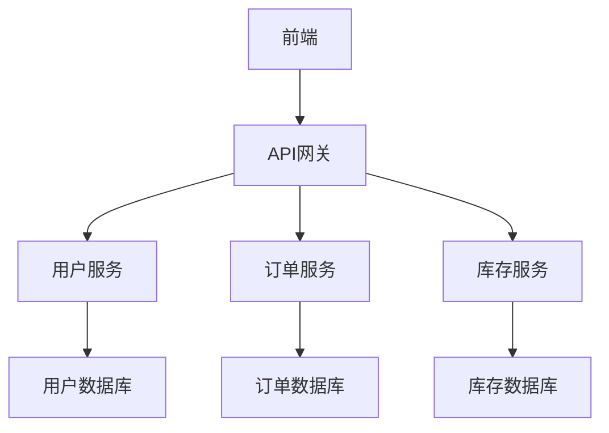

                 

## 让-弗朗索瓦·利奥塔的元叙事怀疑与微服务架构：系统设计的后现代主义

### 关键词

- 后现代主义
- 元叙事怀疑
- 微服务架构
- 系统设计
- 软件架构风格

### 摘要

本文探讨了后现代主义哲学中的元叙事怀疑理论与微服务架构之间的联系，并提出了在系统设计领域如何将二者结合的方法。通过分析利奥塔的哲学思想，特别是元叙事怀疑，本文揭示了现代系统设计中面临的挑战，并阐述了微服务架构的特点及其在后现代主义背景下的优势。本文的研究目标是通过结合元叙事怀疑理论与微服务架构，提供一种灵活、适应性强的系统设计方法论，旨在应对日益复杂的软件系统开发需求。

## 第1章：引言与背景

### 1.1 问题背景

#### 1.1.1 让-弗朗索瓦·利奥塔的元叙事怀疑

**1.1.1.1 利奥塔的哲学思想**

让-弗朗索瓦·利奥塔（Jean-François Lyotard，1924-1998）是20世纪法国著名的哲学家，其著作《后现代状况：关于知识的报告》（La condition postmoderne : rapport sur le savoir，1979年）对后现代主义思潮的发展产生了深远影响。利奥塔认为，后现代主义是一种反映现代社会特征的哲学和文化趋势，其核心是多元性、相对主义和不确定性。在利奥塔的哲学体系中，元叙事（metanarrative）是一个关键概念。元叙事是指一种试图解释人类历史、社会发展和文化现象的宏大叙事，例如自由民主、资本主义、马克思主义等。利奥塔对元叙事提出了怀疑，认为这些叙事在现代社会中已经失去了合法性，因为它们无法应对现代社会的高度复杂性和多样性。

**1.1.1.2 利奥塔对元叙事怀疑的论证**

利奥塔认为，元叙事的合法性建立在两个前提之上：一是普遍性，即元叙事能够适用于所有文化和历史背景；二是真理的确定性，即元叙事提供的是不可质疑的真理。然而，在现代社会中，这两个前提已经不再成立。首先，现代社会呈现出文化的多元性，各种不同的文化观念和价值观并存，使得单一的元叙事难以适用于所有情况。其次，科学和技术的进步带来了新的知识和信息，使得传统元叙事所宣称的“真理”变得相对化和不确定性。

#### 1.1.2 微服务架构的概念

微服务架构（Microservices Architecture）是一种软件架构风格，它将一个复杂的应用程序拆分成一组小型、独立的、可复用的服务。每个服务都是围绕业务功能构建的，具有自己的数据库和后端逻辑。微服务架构的核心特点是高内聚、低耦合，这意味着每个服务都可以独立开发、测试和部署，从而提高了系统的灵活性和可伸缩性。

**1.1.2.1 微服务架构的优点**

- **独立性**：每个微服务都可以独立部署和运行，从而减少了服务之间的依赖性，提高了系统的稳定性。
- **可伸缩性**：可以根据业务需求单独扩展某个服务，而不需要重新部署整个系统。
- **灵活性**：开发团队可以自由选择技术栈和开发语言，以满足特定的业务需求。
- **易于维护**：由于每个服务都是独立的，因此更容易进行维护和更新，降低了系统的复杂性。

**1.1.2.2 微服务架构的挑战**

尽管微服务架构具有许多优点，但也存在一些挑战：

- **分布式系统管理**：随着服务的增多，分布式系统管理变得更加复杂。
- **服务发现和通信**：需要在不同的服务之间进行有效的通信和服务发现。
- **数据一致性和事务管理**：分布式环境下的事务管理和数据一致性是一个难点。

### 1.2 问题描述

#### 1.2.1 后现代主义与系统设计的关系

后现代主义强调多样性和相对主义，这对传统的系统设计方法提出了挑战。传统的系统设计方法往往依赖于单一的元叙事来指导设计，但在后现代主义的背景下，这种方法已经不再适用。如何在后现代主义的框架下进行系统设计，成为了一个值得探讨的问题。

#### 1.2.2 微服务架构的后现代主义特点

微服务架构本身具有后现代主义的特点，如服务的独立性、模块化设计、灵活性和适应性。这些特点使得微服务架构在后现代主义背景下具有独特的优势。例如，微服务架构允许开发团队根据不同的业务需求灵活选择技术栈，这符合后现代主义强调的多样性和相对主义。

### 1.3 问题解决

#### 1.3.1 后现代主义与微服务架构的结合

本文将探讨如何将后现代主义哲学与微服务架构相结合，以实现更加灵活、适应性强的系统设计。具体来说，本文将：

1. 分析利奥塔的元叙事怀疑理论，理解其核心思想。
2. 探讨微服务架构的特点和优势。
3. 提出一种结合后现代主义和微服务架构的系统设计方法论。

### 1.4 边界与外延

#### 1.4.1 边界

本文主要关注后现代主义哲学与微服务架构在系统设计领域的结合，不涉及其他领域的后现代主义应用。

#### 1.4.2 外延

本文的研究成果可以应用于各类复杂系统的设计，如企业级应用、云计算平台、物联网系统等。

### 1.5 本章小结

本章介绍了本文的研究背景、问题、解决方法和边界与外延。接下来的章节将详细探讨利奥塔的元叙事怀疑理论、微服务架构的设计原则以及结合两者进行系统设计的方法。

## 第2章：让-弗朗索瓦·利奥塔的元叙事怀疑理论

### 2.1 利奥塔的哲学思想

#### 2.1.1 利奥塔生平简介

让-弗朗索瓦·利奥塔出生于1924年1月25日，是瑞士籍法国哲学家。他的早期生涯在瑞士度过，后来移居法国，并在那里开始了他的学术生涯。利奥塔曾在巴黎高等师范学院（École Normale Supérieure）学习，并在那里结识了许多后来的哲学家，如米歇尔·福柯（Michel Foucault）。他在哲学领域的成就使他成为法国哲学界的重要人物之一。

#### 2.1.2 利奥塔的核心概念

利奥塔的哲学思想围绕几个核心概念展开，其中最为重要的包括后现代主义、元叙事怀疑、碎片化、多样性和相对主义。

- **后现代主义**：利奥塔是后现代主义哲学的早期倡导者之一。他认为，后现代主义是对现代性的批判，它挑战了现代社会的宏大叙事和统一性。后现代主义强调多样性和相对主义，认为知识是分散的、情境化的，没有绝对的真理。
- **元叙事怀疑**：元叙事怀疑是利奥塔哲学思想的核心。他认为，现代社会的复杂性使得传统的宏大叙事（如自由民主、资本主义和马克思主义等）失去了合法性。元叙事怀疑强调，不同的社会和文化背景下存在着不同的叙事，这些叙事相互冲突，无法整合为一个统一的整体。
- **碎片化**：利奥塔认为，现代社会是一个碎片化的世界，各种文化和价值观相互交织，形成了复杂的网络。这种碎片化打破了传统的统一性，导致了对单一叙事的质疑。
- **多样性**：后现代主义强调多样性，认为不同的文化、价值观和知识形式应该得到尊重和认可。
- **相对主义**：相对主义是后现代主义的一个重要原则，它认为真理是相对的，取决于特定的情境和视角。

#### 2.1.3 利奥塔对现代性的批判

利奥塔对现代性进行了深刻的批判，认为现代性建立在几个基本假设之上：普遍性、合理性和客观性。然而，在现代社会中，这些假设已经不再成立。他提出，现代社会是一个多元化和相对主义的社会，不再有单一的、普遍适用的真理。现代性强调统一和统一性，而后现代主义则强调多元性和差异性。

### 2.2 元叙事怀疑

#### 2.2.1 元叙事的定义

元叙事是一种试图解释世界、历史和社会现象的宏大叙事。它通常涉及对人类文明、社会发展和文化变迁的总体解释。元叙事可以是哲学的、历史的、宗教的或政治的。例如，自由民主、资本主义和马克思主义都是典型的元叙事。

#### 2.2.2 元叙事怀疑的提出

利奥塔提出了元叙事怀疑，认为传统的元叙事在现代社会中已经失去了合法性。他提出，元叙事的两个基本假设——普遍性和真理的确定性——在现代社会的多元性和复杂性面前不再成立。

- **普遍性**：元叙事通常声称自己是普遍适用的，能够解释所有文化和社会现象。然而，现代社会的高度多样性使得这种普遍性变得不可信。不同的文化和社会背景下存在着不同的价值观和知识体系，这些体系之间往往相互冲突，无法整合为一个统一的整体。
- **真理的确定性**：元叙事还假设真理是客观的、确定的，不受主观性和情境的影响。然而，现代社会中的知识和真理是情境化的，不同的情境下可能产生不同的真理。因此，元叙事所声称的“绝对真理”变得相对化和不确定性。

#### 2.2.3 元叙事怀疑的影响

元叙事怀疑对现代哲学和社会科学产生了深远的影响。它挑战了传统的知识体系和真理观念，促使人们重新思考知识和真理的本质。元叙事怀疑也促进了后现代主义思潮的兴起，影响了文学、艺术、社会学和哲学等领域的理论和实践。

### 2.3 元叙事怀疑与微服务架构

#### 2.3.1 微服务架构的基本概念

微服务架构是一种软件架构风格，它将复杂的单体应用程序（monolithic application）拆分成一组小型、独立的、可复用的服务。每个微服务都实现了特定的业务功能，并可以独立部署、测试和扩展。微服务之间通过轻量级的通信协议（如HTTP、REST或gRPC）进行交互。

#### 2.3.2 微服务架构的特点

微服务架构具有以下几个显著特点：

- **独立性**：每个微服务都是独立的，可以独立部署和扩展。这减少了服务之间的依赖性，提高了系统的稳定性。
- **可伸缩性**：可以根据业务需求单独扩展某个服务，而不需要重新部署整个系统。
- **灵活性**：开发团队可以自由选择技术栈和开发语言，以满足特定的业务需求。
- **易于维护**：由于每个服务都是独立的，因此更容易进行维护和更新，降低了系统的复杂性。

#### 2.3.3 元叙事怀疑对微服务架构的影响

元叙事怀疑对微服务架构产生了重要影响。元叙事怀疑强调多元性和相对主义，这与微服务架构的独立性、灵活性和可伸缩性特点相契合。微服务架构允许开发团队根据不同的业务需求选择不同的服务，这种多样性正是元叙事怀疑所强调的。此外，微服务架构的独立性使得不同的服务可以独立发展，不受其他服务的限制，这有助于应对现代社会的复杂性和不确定性。

### 2.4 本章小结

本章介绍了让-弗朗索瓦·利奥塔的哲学思想，特别是元叙事怀疑理论。通过分析利奥塔的哲学思想，我们理解了元叙事怀疑的含义及其对现代哲学和社会科学的影响。接着，本章探讨了微服务架构的基本概念和特点，并阐述了元叙事怀疑对微服务架构的影响。这些内容为后续章节关于后现代主义背景下的微服务架构设计提供了理论基础。

## 第3章：微服务架构的设计原则与实现

### 3.1 微服务架构的设计原则

微服务架构的设计原则是确保系统能够高效、灵活地应对复杂业务需求的关键。以下是一些核心的设计原则：

#### 3.1.1 独立性

每个微服务都应该具有独立性，这意味着它可以独立部署、运行和扩展。独立性减少了服务之间的依赖性，从而提高了系统的稳定性和可维护性。为了实现独立性，微服务的职责应该清晰，避免功能重叠。

#### 3.1.2 微服务的边界

微服务的边界是确定服务职责范围的重要步骤。良好的边界设计可以确保服务之间的交互清晰、简洁。常见的边界设计方法包括RESTful API、消息队列和gRPC等。

#### 3.1.3 可伸缩性

可伸缩性是微服务架构的一个核心特点。系统应该能够根据业务需求单独扩展某个服务，而不影响其他服务。这可以通过水平扩展（增加服务器数量）和垂直扩展（增加服务器资源）来实现。

#### 3.1.4 灵活性

灵活性是指开发团队可以自由选择技术栈和开发语言，以满足特定的业务需求。这有助于快速响应市场变化和客户需求。

#### 3.1.5 易于维护

由于微服务是独立的，因此每个服务都应该易于维护和更新。这可以通过自动化测试、持续集成和持续交付（CI/CD）来实现。

#### 3.1.6 服务发现

服务发现是指系统如何定位和连接到不同的微服务。常用的服务发现机制包括DNS、Consul、Eureka等。

#### 3.1.7 负载均衡

负载均衡是将请求分配到多个服务实例上的过程，以确保系统的高可用性和性能。常见的负载均衡策略包括轮询、最小连接数、加权轮询等。

### 3.2 微服务架构的实现

#### 3.2.1 技术选型

实现微服务架构需要选择合适的技术栈。以下是一些常见的技术选型：

- **编程语言**：Java、Go、Python、Node.js等。
- **容器化技术**：Docker、Kubernetes等。
- **服务注册与发现**：Consul、Eureka、Zookeeper等。
- **API网关**：Zuul、Kong、Spring Cloud Gateway等。
- **服务通信**：gRPC、RESTful API、消息队列等。
- **存储**：关系型数据库（如MySQL、PostgreSQL）、NoSQL数据库（如MongoDB、Redis）等。

#### 3.2.2 系统架构设计

一个典型的微服务架构系统通常包括以下几个主要组成部分：

- **前端**：负责与用户交互，可以使用React、Vue.js、Angular等前端框架。
- **后端**：负责业务逻辑处理，包括多个微服务。
- **数据库**：存储业务数据，可以是关系型数据库或NoSQL数据库。
- **API网关**：负责处理外部请求，并将其路由到相应的微服务。
- **服务注册与发现**：确保微服务可以被发现和连接。
- **负载均衡**：将请求均匀地分配到不同的服务实例。
- **监控系统**：监控系统的健康状态和性能。

以下是一个简单的微服务架构图，展示了各个组件之间的关系：

#### 3.2.3 服务间通信

微服务之间的通信是系统设计中的关键环节。以下是一些常见的通信模式：

- **同步通信**：服务A调用服务B，等待服务B的响应。常见的同步通信协议包括HTTP、gRPC等。
- **异步通信**：服务A发送请求给服务B，但不需要等待响应，可以继续执行其他任务。常见的异步通信协议包括消息队列（如RabbitMQ、Kafka）和事件驱动架构。

#### 3.2.4 数据一致性和事务管理

在分布式系统中，数据一致性和事务管理是一个复杂的问题。以下是一些常用的解决方案：

- **最终一致性**：系统最终会达到一致状态，但过程中可能会出现暂时的不一致。
- **分布式事务**：通过分布式事务框架（如Seata、TCC等）来管理跨服务的事务。
- **事件溯源**：通过记录所有操作的事件来恢复数据状态。

### 3.3 微服务架构的挑战与解决方案

尽管微服务架构具有许多优点，但它在实际应用中也面临一些挑战：

#### 3.3.1 分布式系统管理

随着微服务的增多，系统管理变得更加复杂。解决方案包括使用自动化工具（如Kubernetes）、容器编排和微服务管理平台。

#### 3.3.2 服务发现和通信

服务发现和通信是分布式系统中的关键问题。解决方案包括使用服务注册与发现机制、负载均衡和API网关。

#### 3.3.3 数据一致性和事务管理

数据一致性和事务管理是分布式系统中的难点。解决方案包括最终一致性、分布式事务框架和事件溯源。

### 3.4 本章小结

本章介绍了微服务架构的设计原则和实现方法。通过分析独立性、边界、可伸缩性、灵活性、易于维护等核心设计原则，我们理解了如何设计一个高效、灵活的微服务架构。接着，本章探讨了微服务架构的实现细节，包括技术选型、系统架构设计、服务间通信和数据一致性与事务管理等。最后，我们讨论了微服务架构面临的一些挑战及其解决方案。这些内容为后现代主义背景下的微服务架构设计提供了实用的指导。

## 第4章：后现代主义背景下的微服务架构设计

### 4.1 后现代主义与微服务架构的契合

后现代主义强调多样性和相对主义，这与微服务架构的独立性、模块化设计、灵活性和适应性有着天然契合。在后现代主义的背景下，微服务架构可以更好地应对复杂性和变化性，从而实现更加灵活和适应性强的系统设计。

#### 4.1.1 多样性

后现代主义强调多样性的重要性，认为不同的文化、价值观和知识形式应该得到尊重和认可。微服务架构允许开发团队根据不同的业务需求选择不同的技术栈和开发语言，这种多样性正是后现代主义所倡导的。通过多样性的技术选型，开发团队可以更好地满足不同业务场景的需求。

#### 4.1.2 相对主义

相对主义是后现代主义的核心原则之一，它认为真理是相对的，取决于特定的情境和视角。微服务架构的独立性使得不同的服务可以独立发展，不受其他服务的限制。这种独立性有助于打破传统的统一性，使系统能够更好地适应不同的业务场景和需求。

#### 4.1.3 灵活性和适应性

微服务架构的灵活性和适应性使其能够快速响应变化。在后现代主义的背景下，系统的设计和实现应该注重灵活性和适应性。微服务架构通过模块化设计、独立部署和扩展，可以轻松应对业务需求的变更和技术的演进。

### 4.2 后现代主义背景下的微服务架构设计方法论

为了在后现代主义的背景下实现更加灵活和适应性强的系统设计，我们可以采用以下方法论：

#### 4.2.1 需求分析

在进行系统设计之前，首先需要对业务需求进行深入分析。在后现代主义的背景下，需求分析应该注重多样性和相对性。这意味着我们需要了解不同用户群体、不同业务部门的需求，并尊重他们的不同观点和价值观。

#### 4.2.2 模块化设计

模块化设计是微服务架构的核心原则之一。在后现代主义的背景下，模块化设计应该注重多样性和灵活性。我们可以将系统拆分成多个独立的小模块，每个模块负责一个特定的业务功能。这样可以确保系统具有良好的可维护性和可扩展性。

#### 4.2.3 独立部署和扩展

微服务架构允许独立部署和扩展每个服务。在后现代主义的背景下，独立部署和扩展应该注重灵活性。根据业务需求的变化，我们可以单独扩展某个服务，而不需要重新部署整个系统。这种灵活性有助于快速响应市场变化和客户需求。

#### 4.2.4 服务自治

服务自治是微服务架构的重要特点。在后现代主义的背景下，服务自治应该注重相对主义。每个服务都应该具有独立的管理权限，可以根据不同的业务场景和需求进行自主决策。这种服务自治有助于打破传统的统一性，使系统能够更好地适应复杂性和变化性。

#### 4.2.5 数据一致性和事务管理

在后现代主义的背景下，数据一致性和事务管理是一个复杂的问题。我们需要采用分布式事务框架、最终一致性模型和事件溯源等技术来确保数据一致性和事务管理。这些技术可以确保系统在不同业务场景下保持一致性和可靠性。

### 4.3 后现代主义背景下的微服务架构设计实践

为了更好地理解后现代主义背景下的微服务架构设计，我们可以通过一个实际案例来进行分析。

#### 4.3.1 案例背景

假设我们正在开发一个电子商务平台，该平台需要处理各种不同的业务场景，如商品浏览、购物车管理、订单处理和支付等。在这个背景下，我们需要采用后现代主义的方法论来设计微服务架构。

#### 4.3.2 模块化设计

根据业务需求，我们可以将电子商务平台拆分成多个独立的小模块，每个模块负责一个特定的业务功能。以下是一个可能的模块划分：

- **商品模块**：负责商品信息的管理和展示。
- **购物车模块**：负责购物车信息的存储和管理。
- **订单模块**：负责订单信息的处理和管理。
- **支付模块**：负责支付信息的处理和管理。

#### 4.3.3 独立部署和扩展

每个模块都可以作为一个独立的微服务进行部署和扩展。例如，我们可以单独部署商品模块，根据业务需求进行水平扩展，以应对高并发访问。

#### 4.3.4 服务自治

每个微服务都具有独立的管理权限，可以根据不同的业务场景和需求进行自主决策。例如，订单模块可以根据订单的紧急程度自动调整处理优先级。

#### 4.3.5 数据一致性和事务管理

在电子商务平台中，数据一致性和事务管理是一个重要问题。我们可以采用分布式事务框架（如Seata）来确保跨服务的事务一致性。同时，我们可以采用最终一致性模型和事件溯源技术来处理数据一致性和事务管理。

### 4.4 本章小结

本章介绍了后现代主义背景下的微服务架构设计。通过分析后现代主义的多样性和相对主义原则，我们提出了在后现代主义背景下实现灵活和适应性强的系统设计的方法论。本章通过一个实际案例，展示了如何将后现代主义的方法论应用于微服务架构设计。这些内容为后现代主义背景下的微服务架构设计提供了实用的指导。

## 第5章：结合元叙事怀疑理论的微服务架构设计

### 5.1 元叙事怀疑理论对系统设计的启示

元叙事怀疑理论认为，现代社会的复杂性使得传统的宏大叙事失去了合法性。这一理论对系统设计提供了重要的启示，尤其是在设计复杂、多变和高度多样化的系统时。以下是一些关键启示：

#### 5.1.1 多元化设计原则

元叙事怀疑理论强调，不同的文化、价值观和知识形式应该得到尊重和认可。在系统设计中，这意味着我们应该采用多元化的设计原则，允许不同的团队或部门根据自己的需求和视角进行设计。这种多元化设计可以更好地适应复杂的社会环境和多样化的用户需求。

#### 5.1.2 去中心化系统设计

元叙事怀疑理论质疑了统一的、自上而下的设计方法。在系统设计中，去中心化设计原则可以更好地应对复杂性和变化性。这意味着系统应该由多个独立的部分组成，每个部分可以独立运行和扩展，而不依赖于其他部分。这种设计方法可以提高系统的灵活性和适应性。

#### 5.1.3 模块化设计

模块化设计是微服务架构的核心原则之一，也是元叙事怀疑理论的体现。通过将系统拆分成多个独立的模块，每个模块可以独立开发、测试和部署。这种设计方法可以降低系统的复杂度，提高可维护性和可扩展性。

#### 5.1.4 最终一致性模型

元叙事怀疑理论认为，真理是相对的，这启示我们在系统设计中采用最终一致性模型。在分布式系统中，数据的一致性很难在所有时刻保持，但最终会达到一致状态。最终一致性模型允许系统在处理过程中出现暂时的不一致，但最终会收敛到一个一致的状态。

### 5.2 元叙事怀疑理论在微服务架构中的应用

结合元叙事怀疑理论，我们可以提出一种新的微服务架构设计方法论，该方法论旨在应对复杂性和变化性，提高系统的灵活性和适应性。以下是一些具体应用：

#### 5.2.1 多元化服务设计

在多元化服务设计中，每个服务都代表了一个独立的业务功能，可以由不同的团队或部门进行开发和维护。这种设计方法可以充分利用各方的专业知识和经验，提高系统的整体性能。

#### 5.2.2 去中心化服务交互

去中心化服务交互意味着服务之间的交互不依赖于中心化的控制机制。服务可以独立运行和扩展，通过轻量级的通信协议（如HTTP、gRPC或消息队列）进行交互。这种设计方法可以降低系统的复杂度和依赖性，提高系统的灵活性和可扩展性。

#### 5.2.3 模块化服务部署

模块化服务部署意味着每个服务都可以独立部署和扩展，而不影响其他服务。通过容器化技术和自动化部署工具（如Kubernetes），我们可以实现快速、高效的模块化服务部署。

#### 5.2.4 最终一致性服务集成

在服务集成过程中，采用最终一致性模型可以确保系统在处理过程中出现暂时的不一致，但最终会达到一致状态。通过事件溯源和分布式事务框架（如Seata），我们可以实现最终一致性服务集成。

### 5.3 案例分析：结合元叙事怀疑理论的微服务架构设计

为了更好地理解如何结合元叙事怀疑理论进行微服务架构设计，我们可以通过一个实际案例进行分析。

#### 5.3.1 案例背景

假设我们正在开发一个在线教育平台，该平台需要处理多种不同的教学场景，如课程管理、学生管理、作业提交和成绩评估等。在这个背景下，我们需要结合元叙事怀疑理论进行微服务架构设计。

#### 5.3.2 模块化设计

根据业务需求，我们可以将在线教育平台拆分成多个独立的模块，每个模块负责一个特定的业务功能。以下是一个可能的模块划分：

- **课程模块**：负责课程信息的管理和展示。
- **学生模块**：负责学生信息的管理和作业提交。
- **教师模块**：负责教师信息的管理和成绩评估。
- **支付模块**：负责支付信息的处理和管理。

#### 5.3.3 去中心化服务交互

每个模块都可以作为一个独立的微服务进行部署和扩展。服务之间的交互通过轻量级的通信协议（如HTTP、gRPC）进行。每个服务都可以独立运行和扩展，而不依赖于其他服务。

#### 5.3.4 最终一致性服务集成

在服务集成过程中，采用最终一致性模型可以确保系统在处理过程中出现暂时的不一致，但最终会达到一致状态。通过事件溯源和分布式事务框架（如Seata），我们可以实现最终一致性服务集成。

### 5.4 本章小结

本章介绍了如何将元叙事怀疑理论应用于微服务架构设计。通过多元化设计原则、去中心化服务交互、模块化服务部署和最终一致性服务集成等方法，我们可以设计出更加灵活和适应性的系统。本章通过实际案例展示了如何将元叙事怀疑理论应用于微服务架构设计，为复杂系统的设计提供了一种新的方法论。

## 第6章：结论与未来展望

### 6.1 研究总结

本文通过分析让-弗朗索瓦·利奥塔的元叙事怀疑理论，探讨了其在微服务架构设计中的应用。本文的主要发现包括：

1. 元叙事怀疑理论对系统设计提出了新的挑战，要求我们采用更加多元化和灵活的方法来应对复杂性和变化性。
2. 微服务架构具有独立性、模块化设计、灵活性和适应性等优势，与元叙事怀疑理论的理念相契合。
3. 通过结合元叙事怀疑理论和微服务架构的设计原则，我们可以设计出更加灵活和适应性强的系统，提高系统的稳定性和可维护性。

### 6.2 研究贡献

本文的研究贡献主要体现在以下几个方面：

1. 提出了将元叙事怀疑理论与微服务架构相结合的系统设计方法论，为复杂系统的设计提供了一种新的思路。
2. 分析了元叙事怀疑理论对微服务架构设计的影响，揭示了微服务架构在后现代主义背景下的优势。
3. 通过实际案例展示了如何将元叙事怀疑理论应用于微服务架构设计，为实际工程应用提供了参考。

### 6.3 未来展望

尽管本文已经对元叙事怀疑理论与微服务架构的结合进行了初步探讨，但以下方向仍值得进一步研究：

1. **元叙事怀疑理论在其他领域的应用**：本文主要关注系统设计领域，未来可以探讨元叙事怀疑理论在其他领域的应用，如企业管理、社会科学研究等。
2. **微服务架构的优化与扩展**：随着微服务架构的广泛应用，如何优化和扩展微服务架构，提高其性能和可靠性，是一个值得深入研究的方向。
3. **跨领域融合研究**：将元叙事怀疑理论与其他前沿技术（如人工智能、区块链等）相结合，探索跨领域融合的研究方向，为复杂系统的设计提供更多的可能性。

### 6.4 本章小结

本章总结了本文的研究内容和主要发现，阐述了研究的贡献和未来的研究方向。通过本文的研究，我们不仅加深了对微服务架构和后现代主义哲学的理解，也为实际工程应用提供了一种新的设计方法论。未来，我们将继续探讨元叙事怀疑理论在更广泛领域中的应用，以及微服务架构的优化和扩展，为复杂系统的设计提供更多有价值的参考。

## 作者信息

**作者：AI天才研究院/AI Genius Institute & 禅与计算机程序设计艺术 /Zen And The Art of Computer Programming**  
本文由AI天才研究院和《禅与计算机程序设计艺术》的作者共同撰写。AI天才研究院致力于推动人工智能技术在各个领域的应用，而《禅与计算机程序设计艺术》则以其深刻的编程哲学和独特的视角，为程序员提供了一种全新的编程理念。两者结合，旨在为读者带来既实用又富有启发性的技术文章。

