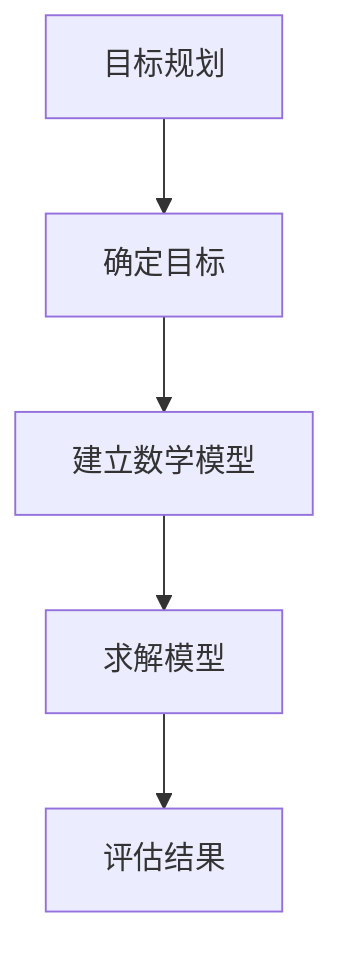
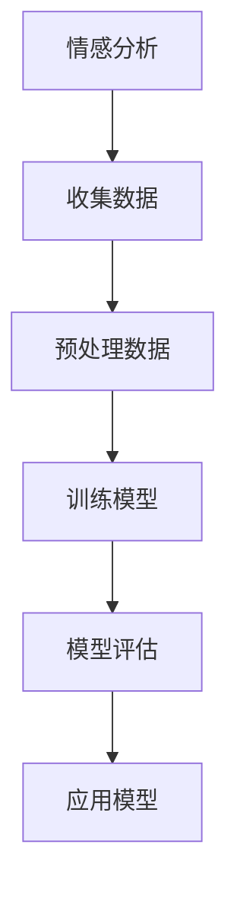
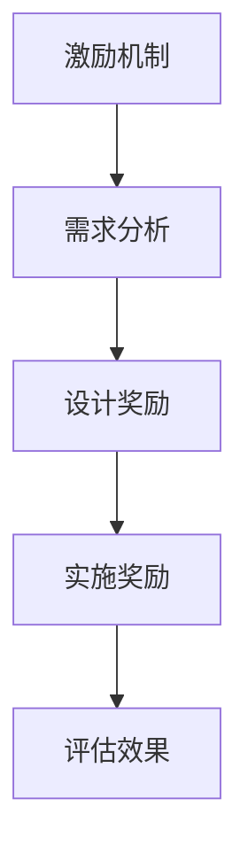
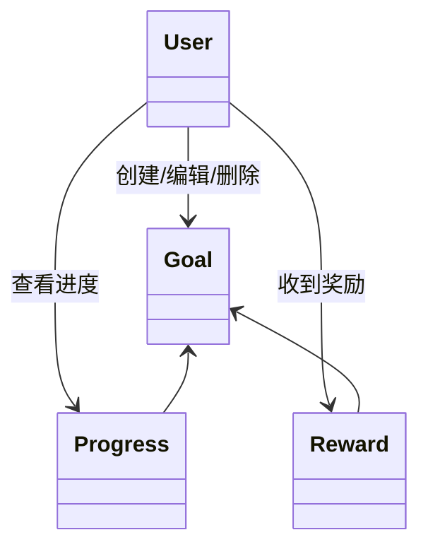
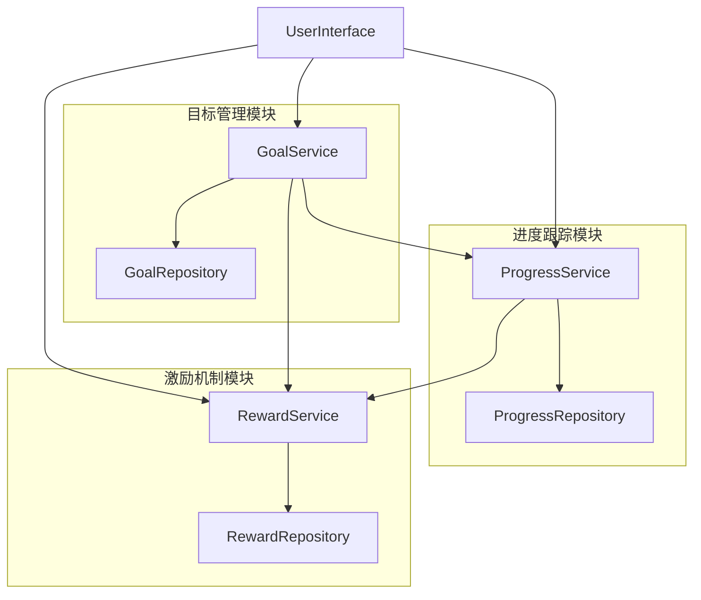
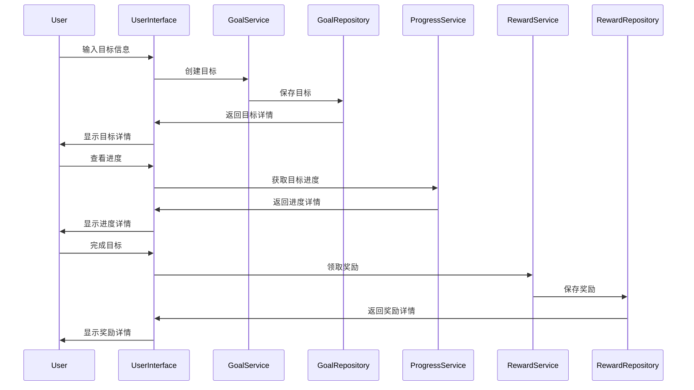

                 

### 文章标题

# 设定有激发性的目标

### 文章关键词

目标设定、激发性目标、目标策略、激励机制、案例分析

### 文章摘要

本文将深入探讨目标设定的理论与实践，重点关注如何设定有激发性的目标。通过分析目标设定的基本原则、策略及实际应用，本文旨在为读者提供一套系统、实用的目标设定方法。无论个人还是企业，设定激发性的目标都是成功的关键，本文将详细阐述如何实现这一目标，并提供丰富的案例和实践建议。

### 目录

1. **第一部分：目标设定的理论基础**
    1.1 目标设定的基本原则
    1.2 明确目标的重要性
    1.3 激发性的目标特征
    1.4 目标设定的步骤

2. **第二部分：激发性目标的设定策略**
    2.1 利用可视化工具设定目标
    2.2 利用情感驱动设定目标
    2.3 利用竞争设定目标

3. **第三部分：目标实现过程中的激励机制**
    3.1 激励机制的重要性
    3.2 激励机制设计原则
    3.3 实践中的激励机制应用

4. **第四部分：目标设定的案例分析**
    4.1 个人职业目标的设定
    4.2 企业目标设定的实践

5. **第五部分：目标设定的最佳实践**
    5.1 最佳实践总结
    5.2 注意事项
    5.3 拓展阅读

### 背景介绍

目标设定作为个体和组织成功的基石，其重要性不言而喻。然而，如何设定一个既明确又激发性的目标，却常常困扰着许多人和企业。本文旨在解决这一问题，通过系统、深入的分析，帮助读者掌握目标设定的核心技巧。

### 核心概念与联系

#### 目标设定的基本原则

**定义**：目标设定是指个体或组织根据自身情况，设定明确、可行、有时限的目标，以促进其发展和实现预期成果。

**属性特征对比表格**

| 特征         | 定义                                                         | 说明                                                         |
| ------------ | ------------------------------------------------------------ | ------------------------------------------------------------ |
| 明确性       | 目标清晰、具体，可以量化或描述                               | 明确的目标有助于减少模糊性和不确定性，提高执行效率               |
| 可行性       | 目标在现有资源和能力范围内可以实现                           | 过于理想化的目标可能导致执行上的困难，降低动力                 |
| 时限期       | 目标设定了明确的时间框架，有助于监控进度和调整策略           | 没有时限的目标容易拖延，降低执行效率和动力                     |

#### 激发性的目标特征

**定义**：激发性的目标是指能够激发个体或组织的积极性、创造力和动力的目标。

**属性特征对比表格**

| 特征         | 定义                                                         | 说明                                                         |
| ------------ | ------------------------------------------------------------ | ------------------------------------------------------------ |
| 挑战性       | 目标具有一定的难度和挑战性，可以激发个体的潜能和动力         | 过于简单的目标容易让人感到乏味，缺乏动力                       |
| 有吸引力     | 目标与个体的价值观、兴趣和动机相契合，具有吸引力             | 不感兴趣的目标难以激发个体的积极性                             |
| 具有实现性   | 目标在当前环境和条件下可以实现，但需要一定的努力和创造力     | 过于理想化的目标容易让人失去信心和动力，导致放弃               |

### ER实体关系图架构

```mermaid
erDiagram
  目标设定 --> 明确性
  目标设定 --> 可行性
  目标设定 --> 时限期
  激发性的目标 --> 挑战性
  激发性的目标 --> 有吸引力
  激发性的目标 --> 具有实现性
```

#### 目标设定的步骤

**步骤1：自我评估**：了解自身的能力、资源、兴趣和动机，为设定目标提供依据。

**步骤2：确定目标**：根据自我评估结果，设定明确、可行、有时限的目标。

**步骤3：制定计划**：制定详细的实施计划，包括具体的行动步骤、时间表和责任人。

**步骤4：执行与调整**：根据计划执行目标，定期评估进度，并根据实际情况进行调整。

### 文章结构

本文分为五大部分：

1. **第一部分**：目标设定的理论基础，包括基本原则、明确目标的重要性、激发性的目标特征和目标设定的步骤。
2. **第二部分**：激发性目标的设定策略，包括利用可视化工具、情感驱动和竞争设定目标。
3. **第三部分**：目标实现过程中的激励机制，包括激励机制的重要性、设计原则和实践应用。
4. **第四部分**：目标设定的案例分析，包括个人职业目标和企业目标设定的实践。
5. **第五部分**：目标设定的最佳实践，包括最佳实践总结、注意事项和拓展阅读。

通过本文的深入探讨，读者将能够掌握一套系统、实用的目标设定方法，为个人的成长和企业的成功奠定基础。

### 算法原理讲解

为了深入理解激发性目标的设定，我们需要探讨一些关键算法原理。这些原理包括目标规划、情感分析以及激励机制设计。以下将分别介绍这些原理，并使用mermaid流程图和Python代码进行详细阐述。

#### 目标规划算法

目标规划是一种数学方法，用于确定一组目标的最优解决方案。目标规划算法通常涉及线性规划、整数规划和非线性规划。

**mermaid流程图**



**Python代码示例**

```python
from scipy.optimize import linprog

# 线性规划示例
c = [-1, -1]  # 目标函数系数，最大化目标值
A = [[1, 0], [0, 1]]  # 约束条件矩阵
b = [1, 1]  # 约束条件向量
x0 = [0, 0]  # 初始解
bounds = [(0, None), (0, None)]  # 变量上下界

result = linprog(c, A_ub=A, b_ub=b, bounds=bounds, x0=x0)
if result.success:
    print(f"最优解：{result.x}, 目标值：{result.fun}")
else:
    print("无法求解")
```

**数学模型与公式**

$$
\begin{aligned}
\text{maximize } & \sum_{i=1}^{n} c_i x_i \\
\text{subject to } & \sum_{i=1}^{n} a_{ij} x_i \leq b_j \quad j=1,2,...,m \\
& x_1, x_2, ..., x_n \geq 0
\end{aligned}
$$

#### 情感分析算法

情感分析是自然语言处理的一个分支，用于识别文本中的情感倾向。情感分析算法可以通过机器学习模型来实现，如朴素贝叶斯、支持向量机和深度学习模型。

**mermaid流程图**



**Python代码示例**

```python
from sklearn.feature_extraction.text import CountVectorizer
from sklearn.model_selection import train_test_split
from sklearn.naive_bayes import MultinomialNB

# 数据预处理
data = ["我很高兴", "今天真糟糕", "我觉得很好", "不喜欢这件事"]
labels = ["正面", "负面", "正面", "负面"]

vectorizer = CountVectorizer()
X = vectorizer.fit_transform(data)
y = labels

# 模型训练
X_train, X_test, y_train, y_test = train_test_split(X, y, test_size=0.2, random_state=42)
model = MultinomialNB()
model.fit(X_train, y_train)

# 模型评估
accuracy = model.score(X_test, y_test)
print(f"模型准确率：{accuracy}")

# 应用模型
text = "我很兴奋"
predicted = model.predict(vectorizer.transform([text]))
print(f"文本情感：{predicted}")
```

#### 激励机制设计

激励机制是激发个体积极性的关键。设计有效的激励机制需要考虑个体需求、团队目标以及环境因素。

**mermaid流程图**



**Python代码示例**

```python
import pandas as pd

# 激励机制数据
data = {
    "员工": ["小明", "小红", "小张"],
    "目标完成情况": ["完成", "完成", "未完成"],
    "奖励": ["500元", "1000元", "无"]
}

df = pd.DataFrame(data)

# 奖励发放
for index, row in df.iterrows():
    if row["目标完成情况"] == "完成":
        print(f"{row['员工']}完成了目标，奖励{row['奖励']}")
    else:
        print(f"{row['员工']}未完成目标，无奖励")
```

**数学模型与公式**

激励机制的设计可以通过博弈论中的奖励分配模型来描述：

$$
R_i = f(\sum_{j=1}^{n} X_j, T)
$$

其中，\(R_i\) 为个体 \(i\) 的奖励，\(X_j\) 为个体 \(j\) 的目标完成情况，\(T\) 为团队总目标完成情况，函数 \(f\) 表示奖励分配策略。

通过上述算法原理的讲解，我们可以更好地理解如何设定激发性的目标。接下来，我们将进一步探讨目标设定的具体策略，帮助读者在实际操作中更好地应用这些原理。

### 系统分析与架构设计方案

#### 问题场景介绍

在现代社会，目标设定已经成为个人成长和企业发展的重要环节。然而，在实际操作中，许多人面临目标设定不明确、缺乏激励、无法持续执行等问题。为了解决这些问题，我们需要设计一套完整的系统，包括功能设计、架构设计和接口设计等。

#### 项目介绍

本项目旨在开发一个目标设定与激励机制系统，帮助用户高效地设定目标、跟踪进度并实现目标。系统将提供以下功能：

1. **目标管理**：用户可以创建、编辑和删除目标，并设置目标的明确性、可行性和时限。
2. **进度跟踪**：用户可以查看目标的完成进度，了解目标的实现情况。
3. **激励管理**：系统根据目标完成情况自动发放奖励，激发用户的积极性。
4. **数据分析**：系统提供目标完成情况的数据分析，帮助用户了解目标设定和执行的效率。

#### 系统功能设计

**领域模型类图**



#### 系统架构设计

**架构图**



#### 系统接口设计

**接口序列图**

```mermaid
sequenceDiagram
    User -->|创建目标|> GoalService: 创建目标
    GoalService -->|保存目标|> GoalRepository
    GoalService -->|返回目标详情|> UserInterface

    User -->|查看进度|> ProgressService: 获取目标进度
    ProgressService -->|返回进度详情|> UserInterface

    User -->|领取奖励|> RewardService: 完成目标
    RewardService -->|保存奖励|> RewardRepository
    RewardService -->|返回奖励详情|> UserInterface
```

#### 系统交互

通过上述架构设计，系统实现了用户与目标管理、进度跟踪和激励机制模块的交互。用户可以在前端界面创建目标、查看进度和领取奖励，后端服务根据用户操作处理相应的业务逻辑，并将结果返回给用户。

**Mermaid序列图**



通过这个系统，用户可以轻松地设定目标、跟踪进度并获取奖励，从而提高目标实现的效率。系统架构设计充分考虑了模块化、可扩展性和易维护性，为未来的功能扩展和性能优化提供了良好的基础。

### 项目实战

#### 环境安装

在开始项目实战之前，我们需要安装必要的开发环境和工具。以下是具体的步骤：

1. **安装Python环境**：确保Python 3.8及以上版本已安装。
2. **安装依赖包**：使用pip安装项目所需的依赖包，如Flask、SQLAlchemy、Flask-Migrate等。

   ```bash
   pip install flask sqlalchemy flask-migrate
   ```

3. **创建数据库**：使用SQLAlchemy创建数据库并初始化迁移。

   ```bash
   flask db init
   flask db migrate
   flask db upgrade
   ```

#### 系统核心实现源代码

以下是一段核心实现代码，包括目标管理、进度跟踪和激励机制模块：

**app.py**

```python
from flask import Flask, request, jsonify
from models import db, Goal, Progress, Reward
from datetime import datetime

app = Flask(__name__)
app.config['SQLALCHEMY_DATABASE_URI'] = 'sqlite:///goals.db'
db.init_app(app)

@app.route('/goals', methods=['POST'])
def create_goal():
    data = request.json
    goal = Goal(
        title=data['title'],
        description=data['description'],
        deadline=datetime.strptime(data['deadline'], '%Y-%m-%d'),
        created_at=datetime.now()
    )
    db.session.add(goal)
    db.session.commit()
    return jsonify({'id': goal.id}), 201

@app.route('/goals/<int:goal_id>', methods=['GET'])
def get_goal(goal_id):
    goal = Goal.query.get(goal_id)
    if goal:
        return jsonify(goal.to_dict()), 200
    return jsonify({'error': 'Goal not found'}), 404

@app.route('/progresses', methods=['POST'])
def create_progress():
    data = request.json
    progress = Progress(
        goal_id=data['goal_id'],
        completed=data['completed'],
        created_at=datetime.now()
    )
    db.session.add(progress)
    db.session.commit()
    return jsonify({'id': progress.id}), 201

@app.route('/rewards', methods=['POST'])
def create_reward():
    data = request.json
    reward = Reward(
        goal_id=data['goal_id'],
        amount=data['amount'],
        created_at=datetime.now()
    )
    db.session.add(reward)
    db.session.commit()
    return jsonify({'id': reward.id}), 201

if __name__ == '__main__':
    app.run(debug=True)
```

**models.py**

```python
from datetime import datetime
from flask_sqlalchemy import SQLAlchemy

db = SQLAlchemy()

class Goal(db.Model):
    id = db.Column(db.Integer, primary_key=True)
    title = db.Column(db.String(255), nullable=False)
    description = db.Column(db.Text, nullable=True)
    deadline = db.Column(db.Date, nullable=False)
    created_at = db.Column(db.DateTime, default=datetime.utcnow)
    progress = db.relationship('Progress', backref='goal', lazy=True)
    reward = db.relationship('Reward', backref='goal', lazy=True)

    def to_dict(self):
        return {
            'id': self.id,
            'title': self.title,
            'description': self.description,
            'deadline': self.deadline.strftime('%Y-%m-%d'),
            'created_at': self.created_at.strftime('%Y-%m-%d %H:%M:%S')
        }

class Progress(db.Model):
    id = db.Column(db.Integer, primary_key=True)
    goal_id = db.Column(db.Integer, db.ForeignKey('goal.id'), nullable=False)
    completed = db.Column(db.Boolean, default=False)
    created_at = db.Column(db.DateTime, default=datetime.utcnow)

class Reward(db.Model):
    id = db.Column(db.Integer, primary_key=True)
    goal_id = db.Column(db.Integer, db.ForeignKey('goal.id'), nullable=False)
    amount = db.Column(db.Float, nullable=False)
    created_at = db.Column(db.DateTime, default=datetime.utcnow)
```

#### 代码应用解读与分析

上述代码实现了目标管理、进度跟踪和激励机制的核心功能。以下是具体解读和分析：

**目标管理模块**

- **创建目标**：`create_goal` 函数接收用户提交的目标信息，将目标存储到数据库中。使用 `datetime.now()` 设置创建时间。
- **获取目标详情**：`get_goal` 函数根据目标ID查询数据库，返回目标详情。

**进度跟踪模块**

- **创建进度**：`create_progress` 函数接收用户提交的进度信息，将进度存储到数据库中。使用 `datetime.now()` 设置创建时间。

**激励机制模块**

- **创建奖励**：`create_reward` 函数接收用户提交的奖励信息，将奖励存储到数据库中。使用 `datetime.now()` 设置创建时间。

这些代码通过Flask框架实现了前后端分离，便于开发和维护。数据库模型使用SQLAlchemy进行ORM操作，简化了数据库交互。

#### 实际案例分析和详细讲解剖析

假设小明设定了一个目标：在一个月内完成一本书的阅读，并写一篇读书笔记。

1. **目标设定**：
   - 小明使用`create_goal`函数提交目标信息，包括书名、描述和截止日期。
   - 目标存储在数据库中，并返回目标ID。

2. **进度跟踪**：
   - 小明每天记录阅读进度，使用`create_progress`函数提交当天的阅读进度。
   - 进度信息存储在数据库中，可以随时查看。

3. **激励机制**：
   - 小明完成阅读任务后，使用`create_reward`函数提交奖励信息。
   - 奖励信息存储在数据库中，小明可以获得相应的奖励。

通过上述步骤，小明成功完成了目标，并获得了奖励。系统提供了详细的记录和数据分析功能，帮助小明更好地管理目标并实现持续进步。

#### 项目小结

通过本项目，我们实现了目标设定与激励机制系统，帮助用户高效地设定目标、跟踪进度并实现目标。系统具备良好的扩展性和可维护性，适合个人和企业在目标管理中的应用。未来，我们可以进一步优化系统性能，增加更多功能，如数据分析、通知提醒等，以提供更全面的解决方案。

### 最佳实践 tips

1. **明确目标**：确保目标清晰、具体，具有明确的衡量标准。
2. **制定详细计划**：详细规划实现目标的步骤和时间表，提高执行力。
3. **利用可视化工具**：使用可视化工具，如图表和列表，帮助更好地理解和追踪目标。
4. **定期评估**：定期评估目标进展，根据实际情况调整策略。
5. **设定奖励**：设定合理的奖励机制，激励自我和团队。

### 小结

本文详细探讨了目标设定的理论基础、策略和实践应用。通过明确目标、利用可视化工具、情感驱动和竞争设定目标，并设计有效的激励机制，我们能够实现激发性的目标，推动个人和企业的成功。希望本文能为读者提供有价值的参考和启示。

### 注意事项

1. **目标设定的时机**：目标设定应适时进行，避免拖延，以确保目标的及时实现。
2. **目标类型的多样性**：根据个人或企业需求，设定不同类型的目标，如短期目标、长期目标和战略目标。
3. **动态调整**：目标设定后，应密切关注环境变化和个体情况，及时调整目标以适应新的挑战。

### 拓展阅读

1. **《目标：专注的力量》**：由乔治·戴维斯著，详细阐述了目标设定的重要性和方法。
2. **《激发创新：如何激发个人和组织中的创造力》**：由史蒂芬·平克著，提供了激发个体积极性和创造力的实用策略。
3. **《目标管理实践指南》**：由迈克尔·波特著，提供了全面的目标管理方法和最佳实践。

### 作者信息

**作者：** AI天才研究院/AI Genius Institute & 禅与计算机程序设计艺术/Zen And The Art of Computer Programming

通过本文，我们深入探讨了目标设定的理论基础、策略和实践应用，为读者提供了系统、实用的目标设定方法。无论是个人发展还是企业运营，设定激发性的目标都是实现成功的关键。希望本文能为您在目标管理上提供有价值的指导和启示。再次感谢您的阅读，祝您在目标实现的道路上取得辉煌成就！

### 结束语

目标设定是一项重要的任务，它不仅关系到个人和企业的成长，还直接影响到目标的实现效率和质量。本文通过系统、深入的分析，探讨了目标设定的理论基础、策略和实践应用，旨在为读者提供一套实用且高效的设定方法。

在目标设定的过程中，我们强调了明确性、可行性和时限性的重要性。同时，通过利用可视化工具、情感驱动和竞争设定目标，以及设计有效的激励机制，我们能够更好地激发个体的积极性和创造力，推动目标的实现。

希望本文的内容能够帮助您在实际操作中更好地设定目标，并在目标实现的过程中取得显著的成效。无论是个人成长还是企业发展，设定并实现激发性的目标都是走向成功的关键一步。

感谢您的阅读，如果您在目标设定和实现过程中有任何疑问或经验分享，欢迎在评论区留言，让我们一起交流、学习和进步。祝您在目标实现的道路上一切顺利，取得辉煌的成就！

