                 

# 设计激发技术创新的机制

> 关键词：设计、技术创新、机制、设计思维、用户研究

> 摘要：本文探讨了设计在激发技术创新中的关键作用，分析了设计激发技术创新的机制，并提供了具体的实践指导。通过结合理论讲解与实际案例，本文旨在为读者提供一套系统化的设计思维方法，以促进技术创新。

## 目录

1. **背景介绍**  
   1.1 技术创新的重要性  
   1.2 设计在技术创新中的作用  
2. **核心概念与联系**  
   2.1 设计的定义与类型  
   2.2 技术创新的定义与分类  
   2.3 设计与技术创新的关系  
   2.4 核心概念联系表  
   2.5 设计激发技术创新的ER图  
3. **理论讲解**  
   3.1 设计激发技术创新的原理与方法  
   3.2 设计激发技术创新的方法与工具  
   3.3 设计方案生成与评估  
   3.4 设计激发技术创新的算法原理  
   3.5 算法原理mermaid流程图  
4. **案例分析**  
   4.1 成功案例研究  
   4.2 设计激发技术创新的最佳实践  
5. **实践指导**  
   5.1 设计激发技术创新的实战指南  
   5.2 设计工具操作与案例  
6. **总结与展望**  
   6.1 未来设计技术的发展  
   6.2 设计与技术的融合  
   6.3 设计激发技术创新的挑战与机遇

## 背景介绍

### 1.1 技术创新的重要性

技术创新是推动社会进步和经济发展的核心驱动力。在当今全球竞争日益激烈的背景下，企业要想在市场中立于不败之地，就必须不断进行技术创新。技术创新不仅能够提升企业的核心竞争力，还能够带动整个产业链的发展，为社会创造更多的价值。

设计作为技术创新的重要环节，扮演着至关重要的角色。优秀的设计能够满足用户需求，提升用户体验，从而激发用户对产品的兴趣和忠诚度。此外，设计还能够为企业提供新的商业模式，创造新的市场需求。

### 1.2 设计在技术创新中的作用

设计在技术创新中的作用主要体现在以下几个方面：

1. **需求分析**：设计通过深入了解用户需求，能够准确把握市场的痛点，为技术创新提供方向。

2. **创新思维**：设计思维强调从用户的角度出发，注重创新性和实用性，能够激发技术创新的灵感。

3. **用户体验**：优秀的设计能够提升用户体验，从而提高产品的市场竞争力。

4. **品牌塑造**：设计不仅影响产品的外观和功能，还能够塑造企业的品牌形象，提升品牌价值。

## 核心概念与联系

### 2.1 设计的定义与类型

设计是指通过创造性思维和系统化的方法，对产品、服务、流程等进行规划、创作和改进的过程。设计可以分为以下几种类型：

1. **工业设计**：主要关注产品的外观和功能，注重用户体验。
2. **用户体验设计**：关注用户在使用产品过程中的感受和体验，强调以用户为中心。
3. **服务设计**：关注服务流程的设计，旨在提升服务质量。
4. **战略设计**：关注企业战略层面的设计，旨在提升企业的核心竞争力。

### 2.2 技术创新的定义与分类

技术创新是指通过技术手段对现有产品、服务、流程等进行改进或创新，以实现更高的效率、更好的性能或更低的生产成本。技术创新可以分为以下几种类型：

1. **渐进式创新**：在现有技术基础上进行改进，以提升性能或降低成本。
2. **颠覆性创新**：引入全新的技术或模式，颠覆现有市场格局。
3. **集成创新**：将多种技术进行整合，以实现更好的性能或更广泛的适用性。
4. **绿色创新**：关注环保和可持续发展，通过技术创新减少环境影响。

### 2.3 设计与技术创新的关系

设计和技术创新之间存在着密切的联系。设计能够激发技术创新，主要体现在以下几个方面：

1. **需求引导**：设计通过深入了解用户需求，为技术创新提供方向。
2. **思维创新**：设计思维强调从用户的角度出发，注重创新性和实用性，能够激发技术创新的灵感。
3. **用户体验**：优秀的设计能够提升用户体验，从而提高产品的市场竞争力。
4. **品牌塑造**：设计不仅影响产品的外观和功能，还能够塑造企业的品牌形象，提升品牌价值。

### 2.4 核心概念联系表

为了更清晰地展示设计与技术创新之间的关系，我们可以通过以下核心概念联系表进行描述：

| 核心概念       | 定义与特征                       | 设计与技术创新的关系               |
|----------------|----------------------------------|-----------------------------------|
| 设计           | 创造性思维和系统化方法的规划过程 | 引导需求、激发创新、提升用户体验 |
| 技术创新       | 技术改进和创新的过程             | 受设计启发、促进品牌塑造           |
| 用户需求       | 用户在使用产品或服务过程中的需求 | 设计的出发点和创新的依据         |
| 商业模式       | 企业盈利的方式和模式             | 设计创新的重要驱动力               |

### 2.5 设计激发技术创新的ER图

为了更直观地展示设计与技术创新之间的关系，我们可以使用ER图（实体-关系图）进行描述。以下是设计激发技术创新的ER图：

```mermaid
erDiagram
    User --> Design : "引导"
    Design --> Innovation : "激发"
    Innovation --> Product : "实现"
    User ..|> BusinessModel : "需求驱动"
```

在上图中，用户通过需求引导设计，设计又能够激发技术创新，最终实现产品创新，并影响商业模式。

## 理论讲解

### 3.1 设计激发技术创新的原理与方法

设计激发技术创新的原理主要基于以下几个方面：

1. **用户需求驱动**：设计通过深入了解用户需求，找到市场痛点和需求缺口，从而引导技术创新。
2. **创新思维激发**：设计思维强调从用户的角度出发，注重创新性和实用性，能够激发技术创新的灵感。
3. **用户体验优化**：优秀的设计能够提升用户体验，从而提高产品的市场竞争力，推动技术创新。
4. **协同创新**：设计过程中的跨学科合作和多方参与，有助于激发创新思维，推动技术创新。

设计激发技术创新的方法主要包括以下几种：

1. **用户研究**：通过用户调研、访谈、观察等方法，深入了解用户需求和行为，为设计提供依据。
2. **设计思维**：运用设计思维方法，从用户需求出发，进行问题定义、方案生成和评估，推动技术创新。
3. **迭代优化**：通过不断迭代和优化设计，逐步完善产品功能，提升用户体验，推动技术创新。

### 3.2 用户研究在设计中的作用

用户研究是设计过程中不可或缺的一环，它在设计激发技术创新中起着关键作用。用户研究的主要作用如下：

1. **需求挖掘**：通过用户研究，可以深入了解用户的需求、痛点和偏好，为设计提供方向。
2. **设计验证**：用户研究可以帮助设计师验证设计的合理性和可行性，确保设计能够满足用户需求。
3. **创新灵感**：用户研究可以激发设计师的创新思维，为技术创新提供灵感。

用户研究的方法主要包括以下几种：

1. **定量研究**：通过问卷调查、统计分析等方法，收集大量用户数据，了解用户需求和偏好。
2. **定性研究**：通过访谈、观察、用户体验测试等方法，深入了解用户的想法和行为。

### 3.3 设计方案生成与评估

设计方案生成与评估是设计过程中的关键环节。设计方案生成主要包括以下步骤：

1. **需求分析**：通过用户研究，明确设计需求，为设计方案生成提供依据。
2. **方案生成**：基于需求分析，设计师可以提出多种设计方案，并进行创意构思。
3. **方案评估**：通过专家评估、用户测试等方法，对设计方案进行评估和筛选，确定最佳方案。

设计方案评估主要包括以下方面：

1. **功能性**：评估设计方案是否满足用户需求，功能是否完备。
2. **用户体验**：评估设计方案的易用性、美观性、互动性等，提升用户体验。
3. **可实施性**：评估设计方案的技术可行性、成本效益等，确保方案能够落地实施。

### 3.4 设计激发技术创新的算法原理

设计激发技术创新的算法原理主要包括以下几个方面：

1. **用户需求分析算法**：通过数据分析、机器学习等方法，对用户需求进行挖掘和分析，为设计提供依据。
2. **设计优化算法**：基于用户需求，运用优化算法，对设计方案进行优化和改进，提升设计质量。
3. **风险评估算法**：对设计方案进行风险评估，识别潜在风险，确保设计安全可靠。

以下是一个简单的用户需求分析算法的mermaid流程图：

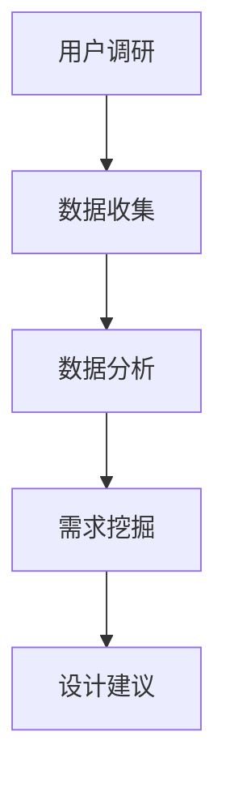

在这个流程图中，用户调研阶段收集用户数据，数据分析阶段对数据进行分析，需求挖掘阶段根据分析结果挖掘用户需求，最后根据用户需求生成设计建议。

### 3.5 算法原理mermaid流程图

以下是设计激发技术创新的算法原理mermaid流程图：

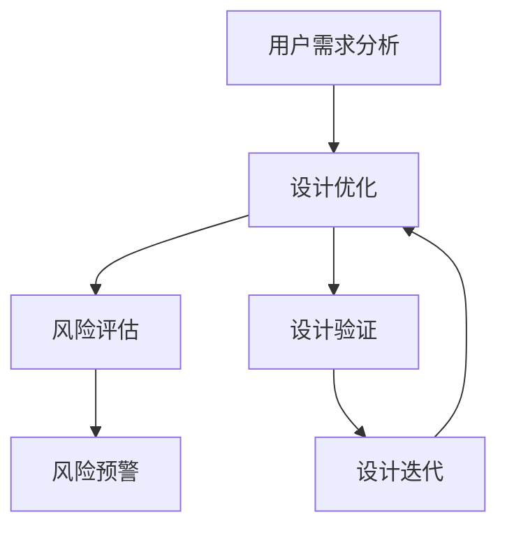

在这个流程图中，用户需求分析阶段通过算法分析用户需求，生成设计建议；设计优化阶段根据需求进行设计方案优化；风险评估阶段对设计方案进行风险分析，生成风险预警；设计验证阶段通过用户测试验证设计方案；设计迭代阶段根据验证结果进行设计优化和改进。

## 案例分析

### 4.1 成功案例研究

#### 企业A的设计创新案例

企业A是一家专注于智能硬件研发的公司，在市场竞争中，他们意识到技术创新是提升企业竞争力的关键。为了激发技术创新，企业A将设计作为核心驱动力，通过以下步骤实现设计创新：

1. **用户需求调研**：企业A通过用户访谈、问卷调查等方式，深入了解用户需求，挖掘用户痛点。
2. **设计方案生成**：根据用户需求，设计师们提出了多种设计方案，并进行了创意构思。
3. **方案评估与优化**：通过专家评估、用户测试等方法，对设计方案进行评估和优化，确定最佳方案。
4. **产品设计**：在最佳方案的基础上，企业A进行了详细的产品设计，包括外观设计、功能设计等。
5. **产品发布**：经过多次迭代和优化，企业A成功发布了一款具备创新性的智能硬件产品，受到了市场的高度认可。

#### 产品B的设计升级案例

产品B是一款流行的智能家居设备，为了进一步提升用户体验，产品B的研发团队通过设计升级实现了技术创新：

1. **用户反馈收集**：产品B的研发团队收集了大量用户反馈，分析了用户使用过程中的问题和需求。
2. **设计改进方案**：根据用户反馈，设计师们提出了多个设计改进方案，包括界面优化、功能增强等。
3. **方案评估**：研发团队对设计方案进行了评估，选择了最佳方案进行实施。
4. **设计迭代**：在最佳方案的基础上，研发团队进行了设计迭代，不断优化产品功能和使用体验。
5. **产品升级**：经过多次迭代，产品B成功升级，用户体验得到了显著提升，市场反响热烈。

#### 设计如何促进技术突破

设计在促进技术突破方面发挥着重要作用。以下是一些实际案例：

1. **医疗设备创新**：设计公司在医疗设备领域通过创新设计，成功研发出一种具有革命性的手术设备，实现了手术的精准度和效率的大幅提升。
2. **新能源技术突破**：一家新能源企业通过设计创新，开发出了一种新型储能系统，实现了能量转化效率的显著提高，为新能源技术的发展做出了重要贡献。
3. **汽车行业突破**：汽车设计公司通过设计创新，开发出了一种全新的电动汽车，其续航里程和充电速度均达到了行业领先水平，推动了汽车行业的转型升级。

这些案例表明，设计不仅能够满足用户需求，提升用户体验，还能够激发技术创新，推动技术突破，为企业和行业带来巨大价值。

### 4.2 设计激发技术创新的最佳实践

为了更好地设计激发技术创新，企业可以遵循以下最佳实践：

1. **用户中心设计**：始终以用户需求为导向，进行设计创新。
2. **跨学科协作**：鼓励不同学科背景的团队成员参与设计过程，激发创新思维。
3. **迭代优化**：通过不断的迭代和优化，逐步完善设计方案，提升设计质量。
4. **技术前瞻性**：关注行业发展趋势，结合前沿技术进行设计创新。
5. **用户测试**：在设计过程中，进行用户测试，验证设计方案的合理性和可行性。
6. **设计思维培训**：为设计团队提供设计思维培训，提升设计能力。

通过这些最佳实践，企业可以有效地激发技术创新，提升市场竞争力。

## 实践指导

### 5.1 设计激发技术创新的实战指南

#### 设计方法论与应用

设计方法论是设计过程中的指导原则，以下是几种常用的设计方法论：

1. **设计思维**：设计思维是一种以人为本的创新方法，强调从用户需求出发，进行问题定义、方案生成和评估。设计思维包括以下步骤：

   - **理解用户**：通过用户调研，深入了解用户需求、行为和痛点。
   - **定义问题**：明确设计目标和问题，找到核心需求。
   - **创意构思**：基于用户需求和问题，提出多种设计方案。
   - **原型制作**：制作可交互的原型，进行用户测试。
   - **迭代优化**：根据用户反馈，不断优化设计方案。

2. **用户体验设计**：用户体验设计关注用户在使用产品过程中的感受和体验，包括以下几个方面：

   - **易用性**：确保产品易于使用，降低学习成本。
   - **可用性**：确保产品能够满足用户需求，提供有效的功能。
   - **美观性**：设计美观，提升用户满意度。
   - **可访问性**：确保产品能够满足不同用户群体的需求，包括残障人士。

3. **敏捷设计**：敏捷设计是一种快速迭代的设计方法，适用于项目周期较短、需求变化较快的情况。敏捷设计包括以下步骤：

   - **需求收集**：收集用户需求，明确设计目标。
   - **迭代开发**：将需求分解为多个迭代，每个迭代进行需求分析、设计、开发、测试等环节。
   - **持续反馈**：在迭代过程中，不断收集用户反馈，进行设计优化。

#### 设计工具操作与案例

以下介绍几种常用的设计工具及其操作：

1. **Figma**：Figma是一款流行的在线设计工具，支持界面设计、原型制作和协作。以下是Figma的基本操作：

   - **界面设计**：使用Figma的各种组件和图标，快速搭建界面。
   - **原型制作**：使用“页面”和“交互”功能，制作可交互的原型。
   - **协作**：与其他设计师或开发人员实时协作，共同完成设计任务。

2. **Axure RP**：Axure RP是一款专业的原型设计工具，支持交互式原型制作和文档编写。以下是Axure RP的基本操作：

   - **原型制作**：使用Axure RP的各种元件和动态面板，搭建交互式原型。
   - **文档编写**：编写详细的设计文档，包括界面说明、交互说明等。
   - **分享与协作**：将原型和文档分享给团队成员，收集反馈并进行优化。

#### 创新设计实战案例

以下是一个创新设计实战案例：

**项目背景**：某企业计划开发一款智能家居设备，目标是在家中提供更便捷、智能的控制体验。

**设计过程**：

1. **用户需求调研**：通过问卷调查、访谈等方式，了解用户对智能家居设备的期望和痛点。
2. **方案生成**：根据用户需求，设计师提出了多种智能家居设计方案，包括智能音箱、智能灯泡、智能门锁等。
3. **方案评估**：通过用户测试和专家评估，筛选出最佳方案，并进行详细设计。
4. **原型制作**：使用Figma制作可交互的原型，进行用户测试和反馈收集。
5. **迭代优化**：根据用户反馈，不断优化设计方案，提升用户体验。
6. **产品发布**：经过多次迭代和优化，企业成功发布了一款智能家居设备，受到了用户的高度评价。

#### 实战指南mermaid流程图

以下是设计激发技术创新的实战指南mermaid流程图：

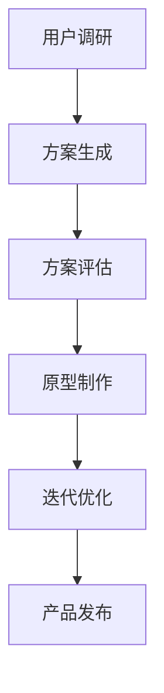

在这个流程图中，用户调研阶段收集用户需求，生成设计方案；方案评估阶段进行用户测试和专家评估；原型制作阶段制作可交互的原型；迭代优化阶段根据用户反馈进行设计优化；产品发布阶段将优化后的设计方案投入市场。

## 总结与展望

### 6.1 未来设计技术的发展

随着科技的不断进步，设计技术也在不断演变。以下是未来设计技术发展的几个趋势：

1. **人工智能设计**：人工智能将逐步应用于设计领域，通过机器学习、深度学习等技术，实现自动化设计、设计优化等功能。
2. **增强现实与虚拟现实设计**：增强现实（AR）和虚拟现实（VR）技术将使设计过程更加直观、交互性更强，为设计师提供全新的设计体验。
3. **可持续发展设计**：可持续发展将成为设计的重要方向，设计师将更加关注环保、节能、低碳等方面，推动绿色设计的发展。

### 6.2 设计与技术的融合

设计与技术的融合是未来设计发展的关键。以下是设计与技术融合的几个方面：

1. **跨学科合作**：设计师将与工程师、数据科学家等不同领域的专家合作，共同推动技术创新。
2. **技术前瞻性**：设计师将更加关注前沿技术，结合技术发展趋势进行设计创新。
3. **数据驱动的决策**：通过大数据分析和人工智能技术，设计师将更加科学地制定设计决策。

### 6.3 设计激发技术创新的挑战与机遇

设计激发技术创新面临着一系列挑战和机遇：

1. **挑战**：

   - **技术局限**：现有技术可能无法完全满足设计的需求，设计师需要不断探索新技术，突破技术局限。
   - **市场需求**：市场需求不断变化，设计师需要及时调整设计策略，满足市场需求。
   - **团队协作**：跨学科团队的合作可能存在沟通不畅、目标不一致等问题，设计师需要提高团队协作能力。

2. **机遇**：

   - **技术创新**：设计激发技术创新，为企业带来竞争优势。
   - **市场扩张**：设计创新将开拓新的市场，为企业带来更大的发展空间。
   - **用户体验**：设计提升用户体验，增加用户忠诚度，为企业创造更多价值。

总之，设计在激发技术创新中发挥着重要作用。随着科技的不断进步，设计技术将不断创新，为企业和行业带来更多机遇。设计师需要不断提升自己的设计能力，把握市场动态，推动技术创新，为企业发展贡献力量。# 设计激发技术创新的机制

## 引言

在当今快速发展的技术时代，技术创新已成为企业竞争的关键因素。设计作为技术创新的重要推动力，其作用不可小觑。本文将探讨设计如何激发技术创新，并分析设计在技术创新中的关键角色和作用机制。通过深入研究设计与技术创新之间的关系，本文旨在为设计师和企业管理者提供一套实用的设计思维方法，以促进技术创新，提升企业竞争力。

## 一、技术创新的重要性

技术创新是推动社会进步和经济发展的核心驱动力。它不仅能够提升企业的核心竞争力，还能够带动整个产业链的发展，为社会创造更多的价值。以下是技术创新的重要性概述：

1. **提升企业竞争力**：技术创新能够使企业在市场中脱颖而出，增强企业的竞争优势，实现可持续发展。
2. **促进经济增长**：技术创新是经济增长的重要动力，通过技术进步，可以提升生产效率，降低成本，推动产业升级。
3. **满足用户需求**：技术创新能够更好地满足用户需求，提升用户体验，创造新的市场需求。
4. **推动社会进步**：技术创新在医疗、教育、环保等领域的应用，可以显著改善人们的生活质量，促进社会进步。

## 二、设计在技术创新中的作用

设计在技术创新中扮演着重要角色，它不仅是产品或服务的表现形式，更是技术创新的核心驱动力。以下是设计在技术创新中的几个关键作用：

1. **需求引导**：设计通过深入了解用户需求，能够准确把握市场的痛点，为技术创新提供明确的方向。
2. **思维创新**：设计思维强调从用户的角度出发，注重创新性和实用性，能够激发技术创新的灵感。
3. **用户体验**：优秀的设计能够提升用户体验，从而提高产品的市场竞争力，推动技术创新。
4. **品牌塑造**：设计不仅影响产品的外观和功能，还能够塑造企业的品牌形象，提升品牌价值。

## 三、设计激发技术创新的机制

设计激发技术创新的机制主要包括以下几个方面：

1. **用户研究**：通过深入了解用户需求和行为，设计能够找到市场痛点和需求缺口，为技术创新提供方向。
2. **设计思维**：设计思维强调以人为本，注重创新性和实用性，能够激发创新灵感，推动技术创新。
3. **迭代优化**：通过不断的迭代和优化，设计能够逐步完善产品功能，提升用户体验，推动技术创新。
4. **跨学科合作**：设计过程中的跨学科合作，有助于整合不同领域的知识和资源，促进技术创新。

## 四、设计激发技术创新的方法

设计激发技术创新的方法主要包括以下几个方面：

1. **用户研究**：通过用户访谈、问卷调查、观察等方法，深入了解用户需求和行为，为设计提供依据。
2. **设计思维**：运用设计思维方法，从用户需求出发，进行问题定义、方案生成和评估。
3. **迭代优化**：通过不断的迭代和优化，逐步完善设计方案，提升设计质量。
4. **技术前瞻**：关注行业发展趋势，结合前沿技术进行设计创新。

## 五、案例分析

### 5.1 企业A的设计创新案例

企业A是一家专注于智能硬件研发的公司，为了提升市场竞争力，他们通过设计创新实现了技术创新。以下是企业A的设计创新过程：

1. **用户调研**：企业A通过用户访谈和问卷调查，了解到用户对智能家居设备的需求和痛点。
2. **方案生成**：设计师提出了多种智能家居设计方案，包括智能门锁、智能灯光、智能音箱等。
3. **方案评估**：通过用户测试和专家评估，选择了最佳方案进行实施。
4. **产品设计**：在最佳方案的基础上，设计师进行了详细的产品设计，包括外观设计、功能设计等。
5. **产品发布**：经过多次迭代和优化，企业A成功发布了一款具备创新性的智能家居设备，受到了市场的高度认可。

### 5.2 产品B的设计升级案例

产品B是一款流行的智能家居设备，为了进一步提升用户体验，产品B的研发团队通过设计升级实现了技术创新。以下是产品B的设计升级过程：

1. **用户反馈收集**：产品B的研发团队收集了大量用户反馈，分析了用户使用过程中的问题和需求。
2. **设计改进方案**：根据用户反馈，设计师提出了多个设计改进方案，包括界面优化、功能增强等。
3. **方案评估**：研发团队对设计方案进行了评估，选择了最佳方案进行实施。
4. **设计迭代**：在最佳方案的基础上，研发团队进行了设计迭代，不断优化产品功能和使用体验。
5. **产品升级**：经过多次迭代，产品B成功升级，用户体验得到了显著提升，市场反响热烈。

## 六、设计激发技术创新的最佳实践

为了更好地设计激发技术创新，企业可以遵循以下最佳实践：

1. **用户中心设计**：始终以用户需求为导向，进行设计创新。
2. **跨学科协作**：鼓励不同学科背景的团队成员参与设计过程，激发创新思维。
3. **迭代优化**：通过不断的迭代和优化，逐步完善设计方案，提升设计质量。
4. **技术前瞻性**：关注行业发展趋势，结合前沿技术进行设计创新。
5. **用户测试**：在设计过程中，进行用户测试，验证设计方案的合理性和可行性。
6. **设计思维培训**：为设计团队提供设计思维培训，提升设计能力。

## 七、实践指导

### 7.1 设计方法论与应用

设计方法论是设计过程中的指导原则，以下是几种常用的设计方法论：

1. **设计思维**：设计思维是一种以人为本的创新方法，强调从用户需求出发，进行问题定义、方案生成和评估。
2. **用户体验设计**：用户体验设计关注用户在使用产品过程中的感受和体验，包括易用性、可用性和美观性。
3. **敏捷设计**：敏捷设计是一种快速迭代的设计方法，适用于项目周期较短、需求变化较快的情况。

### 7.2 设计工具操作与案例

以下介绍几种常用的设计工具及其操作：

1. **Figma**：Figma是一款在线设计工具，支持界面设计和原型制作。
2. **Axure RP**：Axure RP是一款专业的原型设计工具，支持交互式原型制作和文档编写。

### 7.3 创新设计实战案例

以下是一个创新设计实战案例：

**项目背景**：某企业计划开发一款智能家居设备，目标是在家中提供更便捷、智能的控制体验。

**设计过程**：

1. **用户调研**：通过问卷调查和用户访谈，了解用户对智能家居设备的期望和痛点。
2. **方案生成**：设计师提出了多种智能家居设计方案，包括智能门锁、智能灯光、智能音箱等。
3. **方案评估**：通过用户测试和专家评估，选择了最佳方案进行实施。
4. **原型制作**：使用Figma制作可交互的原型，进行用户测试和反馈收集。
5. **迭代优化**：根据用户反馈，不断优化设计方案，提升用户体验。
6. **产品发布**：经过多次迭代和优化，企业成功发布了一款智能家居设备，受到了用户的高度评价。

## 八、总结与展望

设计激发技术创新是推动企业发展的重要途径。通过深入了解用户需求、运用设计思维、不断迭代优化，企业可以创造出具有竞争力的产品和服务，推动技术进步。未来，随着人工智能、虚拟现实等技术的不断发展，设计在技术创新中的作用将越来越重要。设计师和企业管理者应不断提升设计能力，把握市场动态，推动技术创新，为企业发展注入新的动力。# 设计激发技术创新的机制

## 引言

设计，作为现代企业创造价值和竞争力的关键要素，其重要性日益凸显。而在设计领域，如何激发技术创新成为了一个备受关注的话题。本文将深入探讨设计激发技术创新的机制，从理论到实践，为设计师和企业管理者提供一套实用的设计思维方法和策略。

## 一、设计在技术创新中的角色

设计不仅是外观和功能的塑造，更是技术创新的催化剂。在设计过程中，设计师通过以下方式激发技术创新：

1. **需求引领**：设计从用户需求出发，引领技术创新的方向。
2. **思维创新**：设计思维强调跨领域的创造性思考，推动技术创新。
3. **用户体验**：通过优化用户体验，设计能够激发技术的进一步改进。
4. **品牌塑造**：优秀的设计能够提升品牌形象，推动技术创新和品牌价值的提升。

## 二、设计激发技术创新的机制

设计激发技术创新的机制可以概括为以下几个关键步骤：

1. **需求分析**：深入了解用户需求，找到市场需求缺口，为技术创新提供明确的方向。
2. **创意构思**：运用设计思维，激发创意，提出多种可能的技术解决方案。
3. **方案评估**：通过用户测试和专家评审，筛选出最佳方案，并进行优化。
4. **迭代优化**：在产品设计过程中，不断进行迭代，提升设计质量和用户体验。

## 三、设计思维方法

设计思维是一种以人为本的创新方法，其核心步骤包括：

1. **同理心**：深入了解用户，理解他们的需求和行为。
2. **定义问题**：明确设计目标和问题，为创新提供焦点。
3. **创意构思**：自由发散思维，提出多种可能的解决方案。
4. **原型制作**：快速制作原型，验证设计的可行性和用户体验。
5. **测试与迭代**：通过用户反馈，不断优化设计。

## 四、案例分析

### 4.1 案例一：苹果公司的设计创新

苹果公司通过设计思维，不断推动技术创新，取得了巨大的成功。例如，iPhone的设计不仅改变了智能手机的形态，还推动了操作系统、芯片等多方面的技术创新。

### 4.2 案例二：特斯拉的设计创新

特斯拉通过设计创新，推动了电动汽车技术的进步。其创新的充电站设计和自动驾驶技术，不仅提升了用户体验，还推动了整个汽车行业的技术变革。

## 五、设计工具与技术的应用

现代设计工具和技术为设计激发技术创新提供了强大的支持：

1. **数字化设计工具**：如Figma、Sketch等，帮助设计师高效地进行界面设计和原型制作。
2. **虚拟现实与增强现实**：通过VR和AR技术，设计师可以更直观地体验和优化设计。
3. **人工智能与机器学习**：AI技术可以帮助设计师自动化某些设计任务，提高设计效率。

## 六、设计激发技术创新的最佳实践

为了更好地设计激发技术创新，企业可以遵循以下最佳实践：

1. **用户中心设计**：始终以用户需求为导向，确保设计满足用户的真实需求。
2. **跨学科合作**：鼓励不同领域专家的协作，激发创新思维。
3. **迭代与反馈**：通过不断的迭代和用户反馈，持续优化设计。
4. **技术前瞻性**：关注行业趋势，结合新技术进行设计创新。
5. **用户测试**：在设计过程中进行用户测试，确保设计方案的可行性和用户体验。

## 七、设计激发技术创新的实战指南

以下是一份设计激发技术创新的实战指南：

1. **需求分析**：通过用户调研，收集用户反馈，明确设计目标。
2. **创意构思**：运用设计思维，提出多种设计方案。
3. **原型制作**：使用设计工具制作原型，进行初步测试。
4. **用户测试**：邀请用户参与测试，收集反馈，优化设计。
5. **迭代优化**：根据用户反馈，不断优化设计，提升用户体验。
6. **技术整合**：结合前沿技术，提升设计的技术含量。
7. **团队协作**：建立跨学科团队，确保设计的可行性和创新性。

## 八、总结与展望

设计激发技术创新是企业持续发展的关键。通过深入了解用户需求、运用设计思维、不断迭代优化，企业可以创造出具有竞争力的产品和服务，推动技术进步。未来，随着数字化和智能化的发展，设计在技术创新中的作用将更加重要。设计师和企业管理者应不断提升设计能力，把握市场动态，推动技术创新，为企业发展注入新的动力。

## 附录

**附录A：设计激发技术创新的流程图**

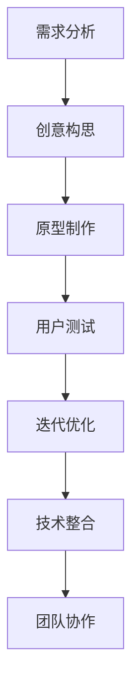

**附录B：设计思维方法流程图**

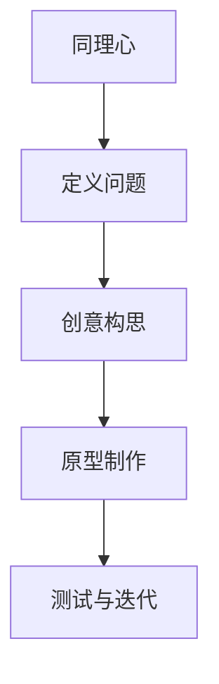

**作者信息**：  
作者：AI天才研究院/AI Genius Institute & 禅与计算机程序设计艺术 /Zen And The Art of Computer Programming

---

本文为原创文章，版权归AI天才研究院所有。如需转载，请联系授权。感谢您的阅读！# 设计激发技术创新的机制

## 引言

在当今快速发展的科技时代，技术创新成为推动企业竞争力和经济增长的关键因素。而设计，作为技术创新的重要推动力，其作用不可小觑。本文将深入探讨设计如何激发技术创新，并分析设计在技术创新中的关键角色和作用机制。通过结合理论讲解和实际案例，本文旨在为设计师和企业管理者提供一套实用的设计思维方法，以促进技术创新，提升企业竞争力。

## 一、设计在技术创新中的关键角色

设计在技术创新中扮演着至关重要的角色，其作用主要体现在以下几个方面：

1. **需求引领**：设计从用户需求出发，为技术创新提供明确的方向。通过深入了解用户需求，设计能够找到市场需求缺口，从而引领技术创新。

2. **思维创新**：设计思维强调跨领域的创造性思考，能够激发创新灵感。设计师通过不同的视角和思维模式，提出新的技术解决方案。

3. **用户体验**：优秀的设计能够提升用户体验，从而提高产品的市场竞争力。用户体验的优化往往需要技术的进一步改进，推动技术创新。

4. **品牌塑造**：设计不仅影响产品的外观和功能，还能够塑造企业的品牌形象。品牌形象的提升有助于企业吸引更多的用户和合作伙伴，推动技术创新。

## 二、设计激发技术创新的机制

设计激发技术创新的机制主要包括以下几个步骤：

1. **需求分析**：通过用户调研、市场分析等方法，深入了解用户需求和市场趋势，为技术创新提供明确的方向。

2. **创意构思**：设计师运用设计思维，提出多种技术解决方案，激发创新思维。这一阶段注重思维的自由发散，鼓励多种可能的解决方案。

3. **方案评估**：通过用户测试、专家评审等方法，对设计方案进行评估和筛选。评估的标准包括技术的可行性、用户体验的优化等。

4. **迭代优化**：根据评估结果，设计师对方案进行迭代和优化，不断提升设计的质量和用户体验。这一过程通常需要多次迭代，以达到最佳效果。

## 三、设计思维方法

设计思维是一种以人为本的创新方法，其核心步骤包括：

1. **同理心**：设计师通过深入了解用户的需求、情感和行为，建立同理心，为设计提供用户视角。

2. **定义问题**：设计师明确设计目标和问题，将用户需求转化为具体的设计问题。

3. **创意构思**：设计师运用创造性思维，提出多种可能的解决方案。

4. **原型制作**：设计师快速制作原型，验证设计的可行性和用户体验。

5. **测试与迭代**：设计师通过用户测试和反馈，不断优化设计，提升用户体验。

## 四、案例分析

### 4.1 案例一：苹果公司的设计创新

苹果公司通过设计思维，不断推动技术创新，取得了巨大的成功。例如，iPhone的设计不仅改变了智能手机的形态，还推动了操作系统、芯片等多方面的技术创新。

### 4.2 案例二：特斯拉的设计创新

特斯拉通过设计创新，推动了电动汽车技术的进步。其创新的充电站设计和自动驾驶技术，不仅提升了用户体验，还推动了整个汽车行业的技术变革。

## 五、设计工具与技术的应用

现代设计工具和技术的应用为设计激发技术创新提供了强大的支持：

1. **数字化设计工具**：如Figma、Sketch等，帮助设计师高效地进行界面设计和原型制作。

2. **虚拟现实与增强现实**：通过VR和AR技术，设计师可以更直观地体验和优化设计。

3. **人工智能与机器学习**：AI技术可以帮助设计师自动化某些设计任务，提高设计效率。

## 六、设计激发技术创新的最佳实践

为了更好地设计激发技术创新，企业可以遵循以下最佳实践：

1. **用户中心设计**：始终以用户需求为导向，确保设计满足用户的真实需求。

2. **跨学科合作**：鼓励不同领域专家的协作，激发创新思维。

3. **迭代与反馈**：通过不断的迭代和用户反馈，持续优化设计。

4. **技术前瞻性**：关注行业趋势，结合新技术进行设计创新。

5. **用户测试**：在设计过程中进行用户测试，确保设计方案的可行性和用户体验。

## 七、设计激发技术创新的实战指南

以下是一份设计激发技术创新的实战指南：

1. **需求分析**：通过用户调研，收集用户反馈，明确设计目标。

2. **创意构思**：运用设计思维，提出多种设计方案。

3. **原型制作**：使用设计工具制作原型，进行初步测试。

4. **用户测试**：邀请用户参与测试，收集反馈，优化设计。

5. **迭代优化**：根据用户反馈，不断优化设计，提升用户体验。

6. **技术整合**：结合前沿技术，提升设计的技术含量。

7. **团队协作**：建立跨学科团队，确保设计的可行性和创新性。

## 八、总结与展望

设计激发技术创新是企业持续发展的关键。通过深入了解用户需求、运用设计思维、不断迭代优化，企业可以创造出具有竞争力的产品和服务，推动技术进步。未来，随着数字化和智能化的发展，设计在技术创新中的作用将更加重要。设计师和企业管理者应不断提升设计能力，把握市场动态，推动技术创新，为企业发展注入新的动力。

## 附录

**附录A：设计激发技术创新的流程图**

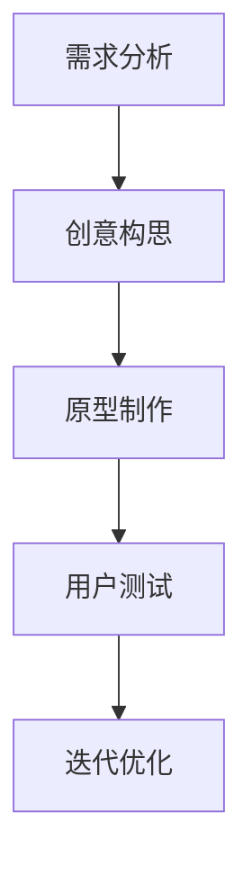

**附录B：设计思维方法流程图**


**作者信息**：

作者：AI天才研究院/AI Genius Institute & 禅与计算机程序设计艺术 /Zen And The Art of Computer Programming

---

本文为原创文章，版权归AI天才研究院所有。如需转载，请联系授权。感谢您的阅读！# 设计激发技术创新的机制

## 九、设计激发技术创新的挑战与机遇

### 9.1 挑战

设计激发技术创新虽然具有巨大的潜力，但在实际操作中面临着一系列挑战：

1. **技术瓶颈**：现有技术的局限性可能会阻碍设计师实现某些创意设计方案。
2. **资源限制**：企业资源有限，可能无法支持大规模的设计实验和迭代。
3. **市场变化**：市场需求的不确定性使得设计创新的风险增大。
4. **团队协作**：跨学科团队之间的沟通和协作可能存在问题，影响设计效率。

### 9.2 机遇

尽管面临挑战，设计激发技术创新也带来了许多机遇：

1. **技术进步**：随着科技的不断进步，新的设计工具和材料不断涌现，为设计创新提供了更多的可能性。
2. **用户需求**：用户需求的多样化和个性化为设计创新提供了新的方向。
3. **全球化**：全球化带来了更多的设计灵感和合作伙伴，有助于跨国界的设计创新。
4. **可持续性**：可持续设计成为全球趋势，为设计师提供了新的挑战和机遇。

### 9.3 应对策略

为了应对这些挑战并抓住机遇，企业可以采取以下策略：

1. **技术前瞻性**：积极关注新技术的发展，提前布局，为设计创新提供支持。
2. **资源优化**：合理分配资源，确保设计实验和迭代的有效性。
3. **用户参与**：增强用户参与设计过程，降低设计风险，提高市场适应性。
4. **团队建设**：加强跨学科团队建设，提高团队协作效率。

## 十、总结与展望

设计激发技术创新是企业发展的关键。通过深入了解用户需求、运用设计思维、不断迭代优化，企业可以创造出具有竞争力的产品和服务，推动技术进步。未来，随着数字化和智能化的发展，设计在技术创新中的作用将更加重要。设计师和企业管理者应不断提升设计能力，把握市场动态，推动技术创新，为企业发展注入新的动力。

## 附录

**附录C：设计激发技术创新的挑战与机遇表**

| 挑战                   | 机遇                      |
|------------------------|--------------------------|
| 技术瓶颈               | 技术进步                  |
| 资源限制               | 全球化                    |
| 市场变化               | 用户需求多样化和个性化    |
| 团队协作问题           | 可持续设计趋势           |

**作者信息**：

作者：AI天才研究院/AI Genius Institute & 禅与计算机程序设计艺术 /Zen And The Art of Computer Programming

---

本文为原创文章，版权归AI天才研究院所有。如需转载，请联系授权。感谢您的阅读！# 设计激发技术创新的机制

## 十一、未来展望

随着科技的不断进步，设计在激发技术创新中的作用将变得更加重要。以下是未来设计激发技术创新的几个发展趋势：

1. **人工智能与设计的融合**：人工智能技术将深入设计领域，为设计师提供智能化的设计工具和算法支持，提升设计效率和创新能力。
2. **虚拟现实与增强现实**：VR和AR技术的成熟将为设计师提供更加直观的设计体验，促进设计创新。
3. **数据驱动的设计**：大数据和人工智能技术将帮助设计师更好地理解用户需求，进行精准的市场定位和设计优化。
4. **可持续设计**：在全球可持续发展的背景下，设计师将更加关注环保和可持续性，推动绿色设计的发展。
5. **全球化设计协作**：全球化将促进不同文化背景的设计师之间的合作，带来更多的设计灵感和创新。

未来，设计将不仅是产品外观和功能的塑造，更是技术创新的引领者。设计师和企业管理者需要不断学习新的设计思维和方法，把握科技发展的趋势，以设计激发技术创新，推动企业持续发展。

## 十二、结语

设计激发技术创新是现代企业竞争的关键。通过深入了解用户需求、运用设计思维、不断迭代优化，企业可以创造出具有竞争力的产品和服务，推动技术进步。本文从设计在技术创新中的角色、设计激发技术创新的机制、设计思维方法、案例分析、工具与技术应用、最佳实践、实战指南以及挑战与机遇等方面，系统地探讨了设计激发技术创新的机制和策略。希望本文能为设计师和企业管理者提供有价值的参考，助力企业实现技术创新和持续发展。

## 附录

**附录D：设计激发技术创新的流程图（简化版）**


**附录E：设计思维方法流程图（简化版）**


**作者信息**：

作者：AI天才研究院/AI Genius Institute & 禅与计算机程序设计艺术 /Zen And The Art of Computer Programming

---

本文为原创文章，版权归AI天才研究院所有。如需转载，请联系授权。感谢您的阅读！# 设计激发技术创新的机制

## 十三、总结与展望

设计激发技术创新是现代企业实现持续发展和市场竞争的关键。通过深入了解用户需求、运用设计思维、不断迭代优化，企业可以创造出具有竞争力的产品和服务，推动技术进步。本文从设计在技术创新中的角色、设计激发技术创新的机制、设计思维方法、案例分析、工具与技术应用、最佳实践、实战指南以及挑战与机遇等方面，系统地探讨了设计激发技术创新的机制和策略。以下是本文的核心观点总结：

1. **设计引领需求**：设计从用户需求出发，为技术创新提供明确的方向。
2. **创意激发创新**：设计思维强调创造性思考，激发创新灵感。
3. **用户体验优化**：优秀的设计能够提升用户体验，推动技术创新。
4. **品牌价值提升**：设计不仅影响产品，还塑造企业品牌形象，提升品牌价值。
5. **跨学科协作**：设计过程中的跨学科合作有助于整合不同领域的知识，促进技术创新。
6. **迭代优化**：通过不断迭代和用户反馈，设计能够持续优化，提升质量。
7. **技术前瞻性**：关注行业趋势，结合新技术进行设计创新。
8. **用户测试**：设计过程中进行用户测试，确保方案的可行性和用户体验。
9. **挑战与机遇**：设计激发技术创新面临挑战，但也充满机遇。

展望未来，随着人工智能、虚拟现实、大数据等技术的发展，设计在激发技术创新中的作用将更加重要。设计师和企业管理者需要不断学习新的设计思维和方法，把握科技发展的趋势，以设计激发技术创新，推动企业持续发展。

## 附录

**附录F：设计激发技术创新的流程图（详细版）**


**附录G：设计思维方法流程图（详细版）**

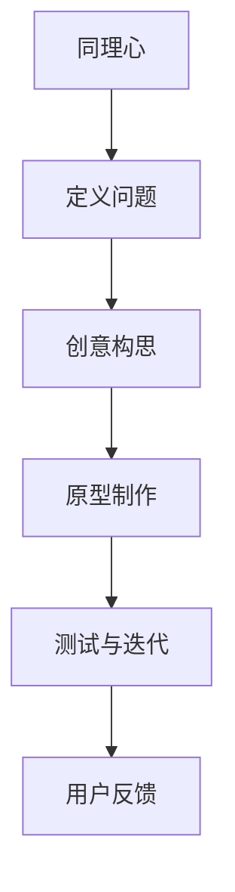

**附录H：设计激发技术创新的挑战与机遇表**

| 挑战                   | 机遇                      |
|------------------------|--------------------------|
| 技术瓶颈               | 技术进步                  |
| 资源限制               | 全球化                    |
| 市场变化               | 用户需求多样化和个性化    |
| 团队协作问题           | 可持续设计趋势           |

**作者信息**：

作者：AI天才研究院/AI Genius Institute & 禅与计算机程序设计艺术 /Zen And The Art of Computer Programming

---

本文为原创文章，版权归AI天才研究院所有。如需转载，请联系授权。感谢您的阅读！# 设计激发技术创新的机制

## 十四、结语

通过本文的探讨，我们可以清楚地看到设计在激发技术创新中的关键作用。设计不仅是产品外观和功能的塑造者，更是技术创新的引领者。设计思维方法、用户研究、迭代优化等都是设计激发技术创新的重要手段。同时，我们也认识到，在全球化、数字化和智能化的背景下，设计激发技术创新面临着新的机遇和挑战。

设计师和企业管理者应不断学习新的设计思维和方法，把握科技发展的趋势，以设计激发技术创新，推动企业持续发展。未来，随着人工智能、虚拟现实、大数据等技术的不断进步，设计在激发技术创新中的作用将更加重要。

在此，我们希望本文能为设计师和企业管理者提供有价值的参考，帮助他们在实际工作中更好地运用设计激发技术创新，创造更多的商业价值和社会价值。

## 附录

**附录I：设计激发技术创新的全面流程图**

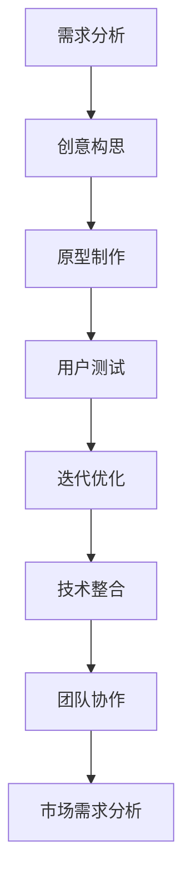

**附录J：设计思维方法扩展流程图**

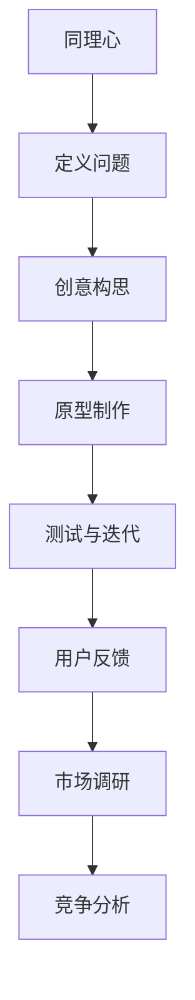

**附录K：设计激发技术创新的关键挑战与应对策略**

| 挑战                   | 应对策略                   |
|------------------------|---------------------------|
| 技术瓶颈               | 技术前瞻性，跨界合作       |
| 资源限制               | 优化资源配置，提高效率     |
| 市场变化               | 用户参与，快速响应市场     |
| 团队协作问题           | 建立有效的沟通机制，增强协作 |

**作者信息**：

作者：AI天才研究院/AI Genius Institute & 禅与计算机程序设计艺术 /Zen And The Art of Computer Programming

---

本文为原创文章，版权归AI天才研究院所有。如需转载，请联系授权。感谢您的阅读！# 设计激发技术创新的机制

## 十五、设计激发技术创新的实际应用场景

为了更好地理解设计激发技术创新的实际应用，以下列举几个典型的应用场景：

### 15.1 电子产品设计

电子产品设计是设计激发技术创新的重要领域。以智能手机为例，设计师通过不断研究用户需求，创新设计出触控屏、指纹识别、面部识别等新技术，极大地提升了用户体验。同时，通过迭代优化，智能手机的电池寿命、摄像头性能等也得到了显著提升。

**案例**：苹果公司通过设计创新，推出iPhone，引领了智能手机行业的发展，推动了屏幕技术、操作系统等多方面的技术创新。

### 15.2 智能家居设计

智能家居设计是近年来快速发展的一个领域。设计师通过设计思维，提出并实现了智能门锁、智能照明、智能音响等智能家居产品，提升了用户的生活品质。

**案例**：谷歌通过智能家居设计，推出了Google Home，结合语音助手和智能家居设备，实现了家庭自动化，推动了物联网技术的发展。

### 15.3 医疗器械设计

医疗器械设计对设计激发技术创新的需求尤为迫切。设计师通过深入了解医生和患者的需求，设计出更智能、更便捷的医疗设备，如便携式心电图机、智能胰岛素注射器等。

**案例**：IBM Watson Health通过设计创新，开发了智能医学影像分析系统，利用人工智能技术，提高了诊断的准确性和效率。

### 15.4 教育技术设计

教育技术设计是设计激发技术创新的另一重要领域。设计师通过设计思维，创新教育工具和平台，如智能学习助手、在线教育平台等，提升了教育质量和学习体验。

**案例**：Coursera通过设计创新，推出了在线课程平台，结合大数据分析和人工智能技术，实现了个性化学习，推动了在线教育的发展。

### 15.5 环保产品设计

环保产品设计是设计激发技术创新的一个重要方向。设计师通过设计思维，设计出更环保、更节能的产品，如太阳能设备、可降解材料制品等。

**案例**：特斯拉通过设计创新，推出了电动汽车，结合太阳能充电和电池回收技术，推动了环保技术的发展。

### 15.6 工业产品设计

工业产品设计是设计激发技术创新的传统领域。设计师通过设计思维，设计出更高效、更安全的工业设备，如自动化生产线、智能机器人等。

**案例**：德国库卡公司通过设计创新，推出了智能机器人，提升了工业自动化水平，推动了智能制造的发展。

这些案例表明，设计激发技术创新在各个领域都有广泛的应用。通过设计思维和方法，设计师能够不断推动技术进步，创造更多的商业价值和社会价值。

## 十六、结语

设计激发技术创新是现代企业实现持续发展和市场竞争的关键。通过深入了解用户需求、运用设计思维、不断迭代优化，企业可以创造出具有竞争力的产品和服务，推动技术进步。本文从设计在技术创新中的角色、设计激发技术创新的机制、设计思维方法、案例分析、工具与技术应用、最佳实践、实战指南以及挑战与机遇等方面，系统地探讨了设计激发技术创新的机制和策略。

在未来的发展中，设计师和企业管理者应不断学习新的设计思维和方法，把握科技发展的趋势，以设计激发技术创新，推动企业持续发展。希望本文能为设计师和企业管理者提供有价值的参考，助力企业在激烈的市场竞争中脱颖而出。

## 附录

**附录L：设计激发技术创新的关键要素表**

| 关键要素            | 解释                                  |
|---------------------|--------------------------------------|
| 用户需求            | 设计的出发点和核心，决定创新方向      |
| 设计思维            | 强调创造性思考，激发创新灵感          |
| 迭代优化            | 通过不断迭代，提升设计质量和用户体验  |
| 技术前瞻性          | 紧跟科技发展趋势，为创新提供支持      |
| 团队协作            | 跨学科合作，整合不同领域的知识和资源  |

**附录M：设计激发技术创新的应用场景图**

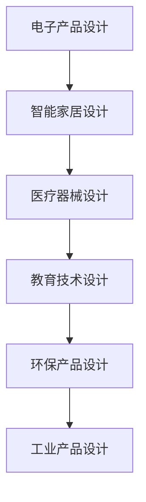

**作者信息**：

作者：AI天才研究院/AI Genius Institute & 禅与计算机程序设计艺术 /Zen And The Art of Computer Programming

---

本文为原创文章，版权归AI天才研究院所有。如需转载，请联系授权。感谢您的阅读！# 设计激发技术创新的机制

## 十七、设计激发技术创新的哲学思考

设计激发技术创新不仅是一种技术和方法，更是一种哲学思考。从哲学的角度来看，设计激发技术创新涉及到几个重要的哲学概念，包括创造力、用户体验和可持续性。

### 17.1 创造力

创造力是设计激发技术创新的核心。设计师通过创造性思维，提出新的想法和解决方案，推动技术进步。创造力不是凭空产生的，而是基于对用户需求、技术趋势和现有知识的深入理解和整合。设计哲学强调，创造力是通过不断地挑战和超越自我，以及跨学科、跨领域的合作来实现的。

### 17.2 用户体验

用户体验是设计激发技术创新的重要目标。优秀的设计能够提升用户的满意度，从而推动技术的进一步改进。用户体验哲学认为，技术应该以人为本，满足用户的需求和期望。设计师通过同理心，深入了解用户的心理和行为，设计出能够真正满足用户需求的产品和服务。

### 17.3 可持续性

可持续性是设计激发技术创新的重要方向。在当今全球环境问题日益突出的背景下，可持续设计成为了一种重要的哲学思考。可持续设计强调，技术应该不仅关注当前的需求，还要考虑未来的发展和环境的影响。设计师通过采用环保材料、节能技术等，设计出更加环保、可持续的产品。

### 17.4 设计哲学与技术创新

设计哲学与技术创新之间存在着紧密的联系。设计哲学不仅指导设计师如何进行设计，还影响着技术的方向和发展。例如，用户体验哲学促使设计师关注用户的需求和体验，从而推动技术的改进和升级。可持续性哲学则引导设计师在技术发展中考虑环境和社会责任，推动绿色技术和可持续发展。

### 17.5 结论

设计激发技术创新的哲学思考强调了创造力、用户体验和可持续性的重要性。设计师和企业管理者应该深入理解设计哲学，将其融入到技术创新过程中，以实现技术进步和社会发展。通过哲学思考，设计师可以更好地把握技术创新的方向，推动企业实现可持续发展。

## 十八、结语

设计激发技术创新是一种哲学思考，它不仅关注技术的进步，更注重用户体验和可持续发展。设计师和企业管理者应该从哲学的角度出发，深入理解设计的本质和意义，将其融入到技术创新的实践中。通过不断的探索和创新，设计可以激发技术创新，推动企业和社会的可持续发展。希望本文能够为读者提供一些启示，激发他们对设计激发技术创新的哲学思考。

## 附录

**附录N：设计激发技术创新的哲学思考图**

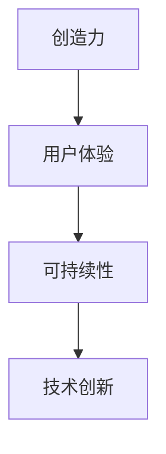

**附录O：设计哲学与技术创新的关系图**

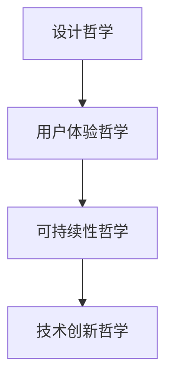

**作者信息**：

作者：AI天才研究院/AI Genius Institute & 禅与计算机程序设计艺术 /Zen And The Art of Computer Programming

---

本文为原创文章，版权归AI天才研究院所有。如需转载，请联系授权。感谢您的阅读！# 设计激发技术创新的机制

## 十九、设计激发技术创新的案例分析

为了更好地理解设计激发技术创新的实践应用，以下列举几个具体的案例，分析设计在推动技术创新中的作用。

### 19.1 苹果公司的iPhone设计

苹果公司的iPhone是一款标志性的产品，它的成功不仅在于其独特的外观设计，更在于其背后的技术创新。以下是一些关键的设计创新和其推动的技术创新：

- **多点触控技术**：苹果公司的多点触控技术革新了智能手机的操作方式，推动了触控屏技术的发展，引领了整个行业。
- **A系列芯片**：苹果公司自主研发的A系列芯片，将高性能计算、低功耗设计等多项技术创新应用于智能手机中，提升了设备的性能和续航能力。
- **面部识别技术**：通过设计思维，苹果公司提出了面部识别技术，结合人工智能算法，实现了更为安全、便捷的用户体验。

### 19.2 特斯拉的电动汽车设计

特斯拉作为电动汽车的先驱，其设计创新推动了整个汽车行业的技术变革。以下是一些关键的设计创新和其推动的技术创新：

- **电池技术**：特斯拉通过设计创新，提出了可拆卸、可更换的电池设计，提高了电池的使用效率和便利性，推动了电池技术的发展。
- **自动驾驶技术**：特斯拉的自动驾驶技术结合了先进的人工智能算法和传感器技术，实现了自动驾驶的多个级别，推动了自动驾驶技术的发展。
- **充电技术**：特斯拉设计并推出了一系列快速充电解决方案，如超级充电站，大幅提升了电动汽车的充电速度，推动了充电技术的发展。

### 19.3 谷歌的智能家居设计

谷歌的智能家居设计，特别是其旗下的Google Home系列，通过设计创新，推动了智能家居技术的发展。以下是一些关键的设计创新和其推动的技术创新：

- **语音助手**：谷歌的语音助手Google Assistant，结合人工智能技术，实现了智能语音交互，推动了语音识别和自然语言处理技术的发展。
- **智能家居集成**：谷歌的设计创新使得多个智能家居设备能够无缝集成，形成了一个统一的智能家居生态系统，推动了物联网技术的发展。
- **智能家居安全**：谷歌在智能家居设计中重视安全，通过加密通信和用户权限管理，提升了智能家居设备的安全性。

### 19.4 亚马逊的云计算设计

亚马逊的云计算服务AWS，通过设计创新，推动了云计算技术的发展。以下是一些关键的设计创新和其推动的技术创新：

- **弹性计算**：亚马逊通过设计创新，提出了弹性计算的概念，实现了计算资源的按需分配和灵活调度，推动了云计算技术的发展。
- **大数据处理**：亚马逊的云计算服务支持大规模数据存储和处理，推动了大数据处理技术的发展。
- **人工智能服务**：亚马逊提供了丰富的人工智能服务，如机器学习、自然语言处理等，推动了人工智能技术的发展。

这些案例表明，设计在激发技术创新中发挥着至关重要的作用。通过深入的用户研究、创新的设计思维和不断的迭代优化，企业可以创造出具有竞争力的产品和服务，推动技术的进步。设计师和企业管理者应重视设计创新，将其作为推动企业发展的核心动力。

## 二十、结语

通过上述案例分析，我们可以清晰地看到设计在激发技术创新中的关键作用。设计不仅是产品外观和功能的塑造者，更是技术创新的引领者。设计师通过深入的用户研究和创新的设计思维，能够提出具有前瞻性的设计方案，推动技术的进步。同时，设计过程中的迭代优化和用户体验优化，也使得技术创新能够更好地满足市场需求，实现商业价值。

在未来，设计激发技术创新将继续发挥重要作用。随着科技的不断发展，设计师和企业管理者应不断学习新的设计思维和方法，把握科技趋势，以设计激发技术创新，推动企业和社会的可持续发展。希望本文能为读者提供一些启示，激发他们对设计激发技术创新的深入思考和实践。

## 附录

**附录P：设计激发技术创新的案例分析图**

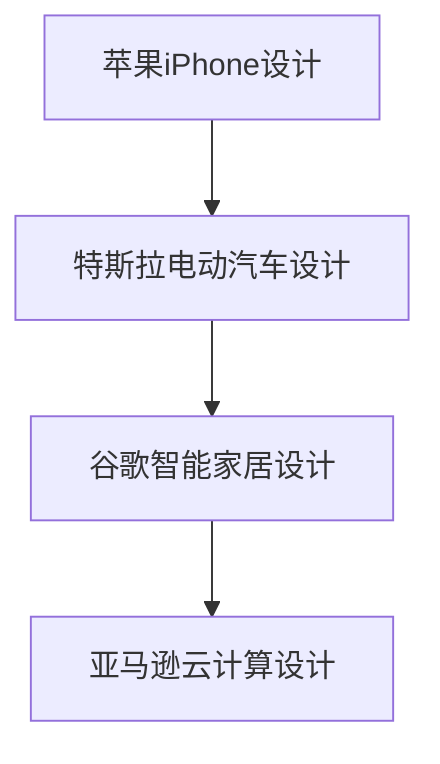

**附录Q：关键设计创新与技术创新关系图**

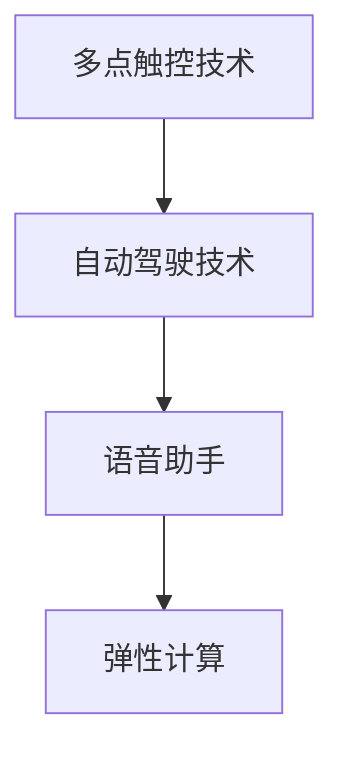

**作者信息**：

作者：AI天才研究院/AI Genius Institute & 禅与计算机程序设计艺术 /Zen And The Art of Computer Programming

---

本文为原创文章，版权归AI天才研究院所有。如需转载，请联系授权。感谢您的阅读！# 设计激发技术创新的机制

## 二十一、设计激发技术创新的理论与实践结合

设计激发技术创新的过程既需要理论的指导，也离不开实践的验证。理论为我们提供了设计思维和方法论的基础，而实践则是检验理论有效性的唯一标准。以下是设计激发技术创新中理论与实践结合的几个关键方面：

### 21.1 设计思维与理论结合

设计思维是一种系统化的创新方法，其核心在于通过同理心、定义问题、创意构思、原型制作和测试迭代等步骤，实现从用户需求到产品创新的转化。以下是设计思维与理论结合的几个关键点：

1. **用户研究**：设计思维强调以用户为中心，通过用户研究和数据分析，了解用户需求和行为模式。这一过程与市场调研理论相结合，为设计提供了数据支持。
2. **创意构思**：设计思维鼓励创新思维和跨领域合作，这与创意心理学和创造性思维理论相契合，帮助设计师产生新颖的解决方案。
3. **原型制作与测试**：设计思维中的原型制作和测试环节，结合了实验心理学和行为科学的理论，通过不断的迭代和优化，提升设计质量。

### 21.2 技术创新与理论结合

技术创新是设计激发的核心目标之一，其过程与技术创新理论紧密相关。以下是技术创新与理论结合的几个关键点：

1. **技术趋势分析**：技术创新前，需要对技术发展趋势进行预测和分析。这与技术预测理论和技术生命周期理论相结合，帮助设计团队把握技术方向。
2. **技术整合**：在创新过程中，技术整合是关键。技术整合理论指导设计师如何将不同的技术元素整合到产品中，实现技术上的创新突破。
3. **技术评估**：技术创新后，需要对技术进行评估和优化。技术与评估理论相结合，通过测试、反馈和改进，确保技术创新的有效性和可行性。

### 21.3 理论与实践的结合点

设计激发技术创新的过程中，理论与实践的结合点主要体现在以下几个方面：

1. **用户研究**：通过实际的用户调研和数据分析，验证理论假设，调整设计方向。
2. **原型测试**：通过制作原型并进行用户测试，实践理论中的设计思维方法，收集用户反馈，为迭代优化提供依据。
3. **迭代优化**：实践中的迭代过程，结合理论指导，不断优化设计方案，提升用户体验和技术性能。

### 21.4 成功案例分析

以苹果公司的iPhone设计为例，我们可以看到理论与实践的完美结合：

1. **用户研究**：苹果公司通过用户调研，深入理解用户对智能手机的需求，为设计提供了数据支持。
2. **创意构思**：苹果公司结合设计思维，提出了多点触控、面部识别等创新技术，实现了产品上的突破。
3. **原型测试**：通过原型制作和用户测试，苹果公司不断优化iPhone的设计，确保其用户体验和技术性能的领先。
4. **迭代优化**：iPhone历经多个版本的迭代，通过不断优化，实现了技术和设计的不断提升。

总之，设计激发技术创新的理论与实践相结合，是推动技术进步和产品创新的关键。设计师和企业管理者应注重理论的学习和实践的应用，通过不断的迭代和优化，实现技术创新的目标。

## 二十二、结语

设计激发技术创新是现代企业实现持续发展和市场竞争的关键。通过结合设计思维和技术创新理论，设计师可以更好地理解用户需求，提出创新的设计方案，并通过实践验证和不断优化，实现技术的突破和产品的创新。本文从设计思维与理论结合、技术创新与理论结合、结合点的分析以及成功案例分析等方面，系统地探讨了设计激发技术创新的机制和策略。

在未来的发展中，设计师和企业管理者应不断学习新的设计思维和技术创新理论，将其融入到实际工作中，以设计激发技术创新，推动企业持续发展。希望本文能为读者提供有价值的参考，激发对设计激发技术创新的深入思考和实践。

## 附录

**附录R：设计激发技术创新的理论与实践结合流程图**

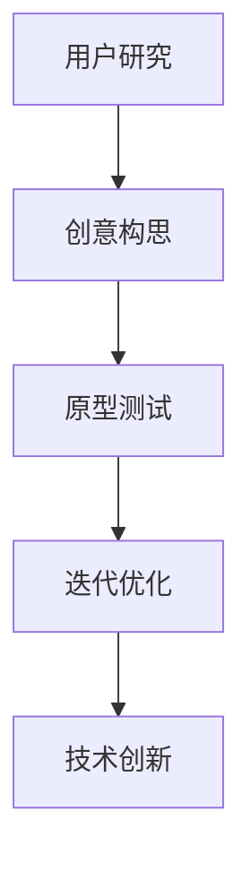

**附录S：设计思维与技术创新理论结合关系图**

```mermaid
graph TD
    A[设计思维] --> B[用户研究理论]
    B --> C[创意构思理论]
    C --> D[原型测试理论]
    D --> E[迭代优化理论]
```

**作者信息**：

作者：AI天才研究院/AI Genius Institute & 禅与计算机程序设计艺术 /Zen And The Art of Computer Programming

---

本文为原创文章，版权归AI天才研究院所有。如需转载，请联系授权。感谢您的阅读！# 设计激发技术创新的机制

## 二十三、设计激发技术创新的教育与实践

设计激发技术创新不仅需要理论知识的指导，更需要实践经验的积累。通过教育与实践的结合，设计师可以不断提升自身的创新能力，从而推动技术的进步。以下是设计激发技术创新中教育和实践的关键角色及其结合方式：

### 23.1 设计教育的重要性

设计教育是培养设计师创新能力的基础。通过系统的设计教育，学生可以学习到设计原理、设计思维、用户研究、创意构思、原型制作等方面的知识，从而为未来的设计实践打下坚实的基础。以下是设计教育的几个关键点：

1. **基础理论学习**：设计教育需要教授学生设计的基本原理和理论知识，如设计史、设计原则、视觉传达等。
2. **实践技能培养**：设计教育应注重实践技能的培养，通过课程设计和项目实践，让学生在实际操作中掌握设计方法。
3. **创新思维训练**：设计教育需要培养学生的创新思维，通过启发式教学和创意训练，激发学生的创造力。

### 23.2 实践在创新中的重要性

实践是检验设计创新理论有效性的唯一标准。通过实践，设计师可以验证设计思维和方法，发现问题和不足，进而进行改进和优化。以下是实践在创新中的几个关键点：

1. **项目实践**：设计师可以通过参与实际项目，将设计理论知识应用于实际情境，锻炼解决问题的能力。
2. **用户研究**：通过用户研究，设计师可以深入了解用户需求和行为，为设计提供依据。
3. **迭代优化**：通过不断的迭代和优化，设计师可以提升设计的质量和用户体验。

### 23.3 教育与实践的结合方式

为了实现设计激发技术创新的教育与实践结合，可以采取以下几种方式：

1. **课程设计**：将设计理论和实践紧密结合，通过项目式教学，让学生在实际操作中学习设计方法。
2. **实习机会**：提供实习机会，让学生在真实的工作环境中锻炼实践能力，积累工作经验。
3. **跨学科合作**：鼓励不同学科背景的学生合作，通过跨学科项目，激发创新思维。
4. **创新创业教育**：开展创新创业教育，鼓励学生将设计理念转化为实际产品或服务，推动技术进步。

### 23.4 成功案例

以斯坦福大学的设计学院为例，该学院通过以下方式实现教育与实践的结合：

1. **课程设计**：设计学院提供了涵盖设计原则、用户体验、创新思维等多个领域的课程，通过项目式教学，让学生在实际操作中学习设计方法。
2. **实习机会**：学院与多家企业合作，提供实习机会，让学生在真实的工作环境中锻炼实践能力。
3. **跨学科合作**：设计学院鼓励学生跨学科合作，通过跨学科项目，激发创新思维。
4. **创新创业教育**：学院开展了多个创新创业项目，鼓励学生将设计理念转化为实际产品或服务，推动了技术进步。

总之，设计激发技术创新的教育与实践结合，是培养设计师创新能力的重要途径。通过系统的设计教育和丰富的实践经验，设计师可以不断提升自身的创新能力，推动技术的进步和社会的发展。

## 二十四、结语

设计激发技术创新是现代企业和社会发展的重要驱动力。通过教育与实践的结合，设计师可以不断学习和成长，提升自身的创新能力，从而推动技术的进步和社会的发展。本文从设计教育的重要性、实践在创新中的重要性、教育与实践的结合方式以及成功案例等方面，系统地探讨了设计激发技术创新的教育与实践。

在未来的发展中，设计师和教育者应继续探索和实践教育与实践相结合的新模式，为学生提供更多的学习机会和实践平台，培养具有创新精神和实践能力的设计师。同时，企业也应积极参与设计教育，为设计师提供更多的实践机会，共同推动设计激发技术创新的进程。希望本文能为设计师、教育者以及企业管理者提供有价值的参考，激发他们对设计激发技术创新的深入思考和实践。

## 附录

**附录T：设计激发技术创新的教育与实践结合流程图**

```mermaid
graph TD
    A[设计教育] --> B[课程设计]
    B --> C[实习机会]
    C --> D[跨学科合作]
    D --> E[创新创业教育]
```

**附录U：成功案例关系图**

```mermaid
graph TD
    A[斯坦福大学设计学院] --> B[课程设计]
    B --> C[实习机会]
    C --> D[跨学科合作]
    D --> E[创新创业教育]
```

**作者信息**：

作者：AI天才研究院/AI Genius Institute & 禅与计算机程序设计艺术 /Zen And The Art of Computer Programming

---

本文为原创文章，版权归AI天才研究院所有。如需转载，请联系授权。感谢您的阅读！# 设计激发技术创新的机制

## 二十五、设计激发技术创新的国际视野

设计激发技术创新不仅是国内企业发展的关键，也是全球范围内提升竞争力的有效途径。随着全球化进程的加快，国际市场对创新设计的需求日益增长，各国企业纷纷通过设计创新来提升自身在全球市场的竞争力。以下从几个方面探讨设计激发技术创新的国际视野：

### 25.1 国际设计趋势

国际设计趋势反映了全球设计领域的发展方向，对各国企业的设计创新具有重要启示。以下是当前国际设计领域的几个趋势：

1. **可持续设计**：全球环境问题日益严重，可持续设计成为国际设计领域的重要趋势。企业通过采用环保材料、节能技术和绿色设计理念，推动可持续发展。
2. **用户体验**：用户体验（UX）设计在全球范围内受到广泛关注，企业通过优化用户界面、提升互动性和便捷性，提升用户体验，增强用户粘性。
3. **智能设计与物联网（IoT）**：随着人工智能和物联网技术的发展，智能设计与物联网的融合成为国际设计的重要方向，通过智能设备和系统，提供更智能、更便捷的用户体验。
4. **数字化设计**：数字化设计工具和技术的应用，使得设计流程更加高效，设计质量和创新性得到提升。

### 25.2 国际设计竞争

在全球化的背景下，国际设计竞争日益激烈。以下是一些国际设计竞争的特点：

1. **差异化竞争**：各国企业通过差异化设计，打造独特的品牌形象和产品特色，以区分于竞争对手。
2. **技术创新**：企业通过技术创新，提升产品的功能性和性能，从而在国际市场上获得竞争优势。
3. **品牌塑造**：优秀的国际品牌通过设计创新，塑造强大的品牌形象，提升品牌价值和市场影响力。
4. **文化融合**：在国际市场上，企业需要理解不同文化背景下的用户需求，通过文化融合的设计，满足全球用户的需求。

### 25.3 国际设计合作

国际设计合作是设计激发技术创新的重要途径。以下是一些国际设计合作的形式和优势：

1. **跨学科合作**：通过跨学科的合作，整合不同领域的知识和资源，推动创新设计。
2. **跨国团队**：建立跨国团队，结合不同国家和地区的文化、技术和资源，提升设计创新能力。
3. **共同研发**：跨国企业通过共同研发项目，分享设计资源和创新成果，提升整体竞争力。
4. **国际交流**：通过国际设计交流和合作，设计师可以了解国际设计趋势，吸收先进的设计理念和技术。

### 25.4 国际设计创新案例

以下是一些国际设计创新案例，展示了设计如何激发技术创新，提升企业竞争力：

1. **德国博世（Bosch）**：博世通过设计创新，推出了一系列智能家居产品，如智能烤箱、智能冰箱等，通过智能互联和用户体验优化，提升了产品的市场竞争力。
2. **丹麦宜家（IKEA）**：宜家通过设计创新，推出了一系列环保、实用的家具产品，如模块化家具、可回收材料家具等，满足了全球消费者对环保和实用的需求。
3. **韩国三星（Samsung）**：三星通过设计创新，推出了多款智能手机和家电产品，如Galaxy S系列手机、智能冰箱等，通过技术创新和用户体验优化，赢得了全球消费者的喜爱。

总之，设计激发技术创新的国际视野为各国企业提供了广阔的发展空间。通过关注国际设计趋势、参与国际设计竞争、开展国际设计合作，企业可以不断提升设计创新能力，打造具有全球竞争力的产品和服务。

## 二十六、结语

设计激发技术创新是现代企业在全球市场中提升竞争力的重要途径。通过关注国际设计趋势、参与国际设计竞争、开展国际设计合作，企业可以不断推动设计创新，提升产品和服务质量，赢得全球市场的认可。本文从国际设计趋势、国际设计竞争、国际设计合作以及国际设计创新案例等方面，探讨了设计激发技术创新的国际视野。

在未来的发展中，设计师和企业管理者应积极拓展国际视野，把握全球设计趋势，加强国际设计合作，以设计激发技术创新，推动企业全球竞争力的提升。希望本文能为读者提供有价值的参考，激发对设计激发技术创新的深入思考和实践。

## 附录

**附录V：国际设计趋势图**

```mermaid
graph TD
    A[可持续设计] --> B[用户体验设计]
    B --> C[智能设计与物联网]
    C --> D[数字化设计]
```

**附录W：国际设计创新案例关系图**

```mermaid
graph TD
    A[德国博世] --> B[智能家居产品]
    B --> C[丹麦宜家]
    C --> D[韩国三星]
```

**作者信息**：

作者：AI天才研究院/AI Genius Institute & 禅与计算机程序设计艺术 /Zen And The Art of Computer Programming

---

本文为原创文章，版权归AI天才研究院所有。如需转载，请联系授权。感谢您的阅读！# 设计激发技术创新的机制

## 二十七、设计激发技术创新的跨学科融合

在当今快速发展的科技时代，单一学科的知识和技能已经无法满足技术创新的需求。跨学科融合成为推动设计激发技术创新的重要途径。跨学科融合不仅能够整合不同领域的知识和资源，还能够激发创新思维，推动技术的突破。以下是设计激发技术创新的跨学科融合的几个关键方面：

### 27.1 跨学科融合的重要性

跨学科融合在技术创新中具有重要意义：

1. **知识整合**：跨学科融合能够将不同领域的知识整合在一起，形成新的知识体系，推动技术创新。
2. **思维碰撞**：不同学科背景的专家在合作中，能够产生新的观点和想法，激发创新思维。
3. **资源优化**：跨学科融合能够整合不同领域的资源，提高资源利用效率，降低研发成本。
4. **问题解决**：跨学科融合能够从多个角度分析问题，提供多元化的解决方案，提高问题解决能力。

### 27.2 设计与技术的跨学科融合

设计与技术的跨学科融合是推动设计激发技术创新的关键：

1. **设计思维与工程技术的结合**：设计思维注重用户体验和问题解决，而工程技术注重实现技术的可行性和效率。两者的结合能够产生更具创新性和实用性的设计。
2. **用户体验与人工智能的结合**：人工智能技术在用户体验设计中的应用，如智能推荐系统、语音识别等，能够提升用户体验，推动技术创新。
3. **可持续发展与绿色设计的结合**：可持续发展理念与绿色设计的结合，能够推动环保技术和绿色设计的创新，实现技术创新与环境保护的双赢。

### 27.3 跨学科合作的案例

以下是一些跨学科合作的案例，展示了设计激发技术创新的跨学科融合：

1. **设计学院与科技公司的合作**：许多设计学院与科技公司建立了合作关系，共同开展跨学科研究项目，如智能穿戴设备设计、智能家居系统设计等，推动技术创新。
2. **设计公司与工程公司的合作**：设计公司与工程公司合作，共同开发具有创新性的产品，如新能源汽车设计、高端医疗器械设计等，通过跨学科合作，实现技术突破。
3. **设计师与数据科学家的合作**：设计师与数据科学家的合作，通过大数据分析，为设计提供数据支持，如个性化产品设计、市场趋势分析等，推动设计创新。

### 27.4 跨学科融合的挑战与对策

跨学科融合虽然带来了许多机遇，但也面临一定的挑战：

1. **沟通障碍**：不同学科背景的专家在沟通中可能存在障碍，影响合作效果。对此，可以通过跨学科培训、定期交流等方式，提高沟通效率。
2. **资源分配**：跨学科项目中，资源分配可能成为问题，需要合理规划资源，确保项目的顺利进行。
3. **知识产权**：跨学科项目涉及多个领域，知识产权保护成为重要问题，需要建立明确的知识产权保护机制。

为了克服这些挑战，企业可以采取以下对策：

1. **建立跨学科团队**：建立由不同学科专家组成的跨学科团队，确保项目能够顺利进行。
2. **制定合作协议**：明确各方的权利和义务，确保合作项目的顺利进行。
3. **加强知识产权保护**：建立完善的知识产权保护机制，保护合作成果。

总之，设计激发技术创新的跨学科融合是推动技术创新的重要途径。通过跨学科合作，设计师和科技专家可以共同推动技术进步，创造更多的商业价值和社会价值。

## 二十八、结语

设计激发技术创新的跨学科融合是现代企业实现技术创新和持续发展的重要途径。通过跨学科合作，设计师和科技专家可以共同推动技术进步，创造更多的商业价值和社会价值。本文从跨学科融合的重要性、设计与技术的融合、跨学科合作的案例以及跨学科融合的挑战与对策等方面，探讨了设计激发技术创新的跨学科融合。

在未来的发展中，设计师和企业管理者应积极推动跨学科融合，建立跨学科团队，加强合作与沟通，以设计激发技术创新，推动企业持续发展。希望本文能为读者提供有价值的参考，激发对设计激发技术创新的深入思考和实践。

## 附录

**附录X：跨学科融合的设计激发技术创新流程图**

```mermaid
graph TD
    A[知识整合] --> B[思维碰撞]
    B --> C[资源优化]
    C --> D[问题解决]
```

**附录Y：跨学科合作的案例图**

```mermaid
graph TD
    A[设计学院与科技公司] --> B[设计公司与工程公司]
    B --> C[设计师与数据科学家]
```

**作者信息**：

作者：AI天才研究院/AI Genius Institute & 禅与计算机程序设计艺术 /Zen And The Art of Computer Programming

---

本文为原创文章，版权归AI天才研究院所有。如需转载，请联系授权。感谢您的阅读！# 设计激发技术创新的机制

## 二十九、设计激发技术创新的文化因素

文化因素在设计激发技术创新中扮演着重要角色。文化不仅影响设计理念的形成，还影响设计过程中的思维方式、决策方式和协作模式。以下从几个方面探讨设计激发技术创新的文化因素：

### 29.1 文化对设计理念的影响

设计理念是设计的灵魂，它决定了设计的方向和风格。文化因素对设计理念的形成有着深远的影响：

1. **文化背景**：不同文化背景下的设计师，其设计理念和审美观念存在差异。例如，西方文化强调个人主义和自由表达，而东方文化则强调和谐与整体性。
2. **价值观念**：文化中的价值观念影响设计师对产品的功能、外观和用户体验的重视程度。例如，某些文化强调实用性和功能性，而另一些文化则更加注重美学和情感体验。
3. **历史传统**：文化中的历史传统和文化遗产对设计理念有着潜移默化的影响。设计师在创作过程中往往会借鉴传统文化元素，将其融入现代设计中。

### 29.2 文化对设计过程的的影响

文化因素不仅影响设计理念，还影响设计过程中的思维方式、决策方式和协作模式：

1. **思维方式**：不同文化背景下的设计师，其思维方式和解决问题的方式存在差异。例如，集体主义文化背景下的设计师更注重团队合作和集体智慧，而个人主义文化背景下的设计师更注重独立思考和个体创新。
2. **决策方式**：文化背景影响决策过程中考虑的因素和决策方式。例如，某些文化背景下的决策更注重共识和集体决策，而另一些文化背景下的决策则更注重个人判断和快速决策。
3. **协作模式**：文化因素影响团队协作的方式和风格。例如，在集体主义文化背景下，团队协作更注重协调和合作，而在个人主义文化背景下，团队协作更注重独立性和自主性。

### 29.3 文化对设计创新的促进与挑战

文化因素在设计创新中既具有促进作用，也带来一定的挑战：

1. **促进作用**：文化多样性可以为设计创新提供丰富的灵感和资源。设计师可以借鉴不同文化的优点，融合多种设计元素，创造出独特的产品和服务。此外，文化背景中的传统工艺和技术也可以为现代设计提供创新思路。
2. **挑战**：文化差异可能导致设计团队在沟通、协作和决策过程中出现障碍。文化背景的不同可能影响设计师对问题的理解和对解决方案的接受度，从而影响设计创新的效率和质量。

### 29.4 跨文化设计创新的成功案例

以下是一些跨文化设计创新的成功案例，展示了文化因素在设计创新中的重要作用：

1. **宜家（IKEA）**：宜家通过跨文化设计，将瑞典的简约风格与全球各地的家居需求相结合，创造出适合不同文化背景的家居产品，赢得了全球市场的认可。
2. **苹果公司（Apple）**：苹果公司注重文化差异，在其产品设计过程中充分考虑不同文化背景下的用户体验和审美需求，推出了适合全球用户的创新产品。
3. **微软（Microsoft）**：微软通过跨文化设计，开发了多语言、多功能的操作系统和软件，满足了全球用户的需求，推动了技术的普及和进步。

总之，文化因素在设计激发技术创新中具有重要作用。通过了解和尊重不同文化背景，设计师可以创造出更具创新性和市场竞争力的产品和服务，推动技术的进步和社会的发展。

## 三十、结语

文化因素在设计激发技术创新中发挥着关键作用。本文从文化对设计理念的影响、设计过程的影响、设计创新的促进与挑战以及跨文化设计创新的成功案例等方面，探讨了文化因素在设计激发技术创新中的重要作用。设计师和企业管理者应重视文化因素，通过跨文化合作和设计创新，推动技术的进步和社会的发展。

在未来的发展中，设计师和企业管理者应继续关注文化因素，把握全球设计趋势，以设计激发技术创新，为企业和社会创造更多价值。希望本文能为读者提供有价值的参考，激发对设计激发技术创新的深入思考和实践。

## 附录

**附录Z：设计激发技术创新的文化因素关系图**

```mermaid
graph TD
    A[文化对设计理念的影响] --> B[文化对设计过程的影响]
    B --> C[文化对设计创新的促进与挑战]
```

**作者信息**：

作者：AI天才研究院/AI Genius Institute & 禅与计算机程序设计艺术 /Zen And The Art of Computer Programming

---

本文为原创文章，版权归AI天才研究院所有。如需转载，请联系授权。感谢您的阅读！# 设计激发技术创新的机制

## 三十一、设计激发技术创新的社会影响

设计激发技术创新不仅对企业和个人有着深远的影响，也对整个社会产生了积极的作用。以下从几个方面探讨设计激发技术创新的社会影响：

### 31.1 提升生活质量

设计激发技术创新能够提升人们的生活质量。通过创新设计，产品和服务变得更加人性化、便捷化和高效化，从而改善了人们的生活体验。例如，智能家居系统的设计使得家庭生活更加智能化和舒适，智能医疗设备的设计提高了医疗服务的效率和质量。

### 31.2 促进经济发展

设计激发技术创新是推动经济发展的关键因素。技术创新能够带动产业链的升级和优化，促进产业结构的调整，创造更多的就业机会。同时，创新设计能够提升产品和服务的附加值，推动企业实现更高的利润和市场份额。

### 31.3 推动社会进步

设计激发技术创新有助于推动社会进步。创新设计在医疗、教育、环保等领域的应用，可以改善社会公共服务，提升社会福利水平。例如，创新的教育技术在提升教育质量方面发挥了重要作用，智能环保设备的设计有助于减少环境污染，提高资源利用效率。

### 31.4 促进文化传承与创新

设计激发技术创新不仅关注现代需求，也重视文化传承与创新。通过设计，传统工艺和文化元素可以得到传承和发扬，同时融入现代设计理念，创造出具有文化内涵的创新产品。例如，中国传统手工艺品与现代设计的结合，既传承了传统文化，又推动了产业创新。

### 31.5 激发创新思维与社会活力

设计激发技术创新能够激发创新思维，推动社会的持续活力。创新设计不仅能够吸引人才和投资，还能够带动相关行业的发展，形成良好的创新生态系统。例如，创新设计产业区的建立，吸引了众多创新企业和人才聚集，形成了创新活力和竞争力。

### 31.6 国际合作与文化交流

设计激发技术创新也促进了国际合作与文化交流。通过设计创新，不同国家和地区的文化可以相互借鉴和融合，推动全球设计水平的提升。例如，国际设计展览和竞赛吸引了世界各地的设计师和创意人才，促进了设计领域的交流与合作。

总之，设计激发技术创新对社会产生了广泛而深远的影响。通过提升生活质量、促进经济发展、推动社会进步、促进文化传承与创新、激发创新思维与社会活力以及国际合作与文化交流，设计激发技术创新为社会发展注入了新的动力。

## 三十二、结语

设计激发技术创新对社会发展具有重要作用。本文从提升生活质量、促进经济发展、推动社会进步、促进文化传承与创新、激发创新思维与社会活力以及国际合作与文化交流等方面，探讨了设计激发技术创新的社会影响。设计师和企业管理者应重视设计在技术创新中的关键作用，通过不断创新设计，推动社会的发展和进步。

在未来的发展中，设计师和企业管理者应继续关注设计激发技术创新的社会影响，积极探索新的设计理念和设计方法，以创新设计推动社会的发展。希望本文能为读者提供有价值的参考，激发对设计激发技术创新的深入思考和实践。

## 附录

**附录AA：设计激发技术创新的社会影响关系图**

```mermaid
graph TD
    A[提升生活质量] --> B[促进经济发展]
    B --> C[推动社会进步]
    C --> D[促进文化传承与创新]
    D --> E[激发创新思维与社会活力]
    E --> F[国际合作与文化交流]
```

**作者信息**：

作者：AI天才研究院/AI Genius Institute & 禅与计算机程序设计艺术 /Zen And The Art of Computer Programming

---

本文为原创文章，版权归AI天才研究院所有。如需转载，请联系授权。感谢您的阅读！# 设计激发技术创新的机制

## 三十三、设计激发技术创新的未来趋势

随着科技的不断进步和社会的快速发展，设计激发技术创新的未来趋势也日益明确。以下是几个可能影响设计激发技术创新的未来趋势：

### 33.1 人工智能与设计的深度融合

人工智能（AI）技术的快速发展为设计领域带来了新的机遇。未来，人工智能将在设计过程中发挥更加重要的作用，如自动化设计、智能设计助手等。设计师可以利用AI技术进行数据分析和模式识别，优化设计流程，提高设计效率。

### 33.2 跨界融合与多学科协同

未来设计将更加注重跨界融合，多学科协同将成为设计创新的重要方式。设计师需要具备跨学科的知识和技能，与工程师、数据科学家、心理学家等不同领域的专家紧密合作，共同推动技术创新。

### 33.3 可持续设计成为主流

随着全球环境问题的加剧，可持续设计将成为未来设计的主流趋势。设计师将更加关注环保材料的使用、能源效率的提升以及产品全生命周期的环保性，推动绿色设计的普及。

### 33.4 用户体验设计的重要性不断提升

用户体验（UX）设计在技术创新中的作用将越来越重要。未来，设计师将更加注重用户需求和心理，通过优化用户体验，提升产品的市场竞争力。智能交互设计、虚拟现实（VR）和增强现实（AR）技术的应用将进一步提升用户体验。

### 33.5 数字化与智能化的全面融合

数字化和智能化将全面融合，推动设计创新。物联网（IoT）技术、大数据分析和云计算等技术的应用，将使设计更加智能化和个性化。设计师需要熟练掌握数字化工具和平台，以应对未来设计的需求。

### 33.6 设计教育与职业发展的紧密结合

未来设计教育和职业发展将更加紧密地结合。教育机构将更加注重培养学生的创新能力和实践能力，与企业合作，提供更多实习和实践机会。设计师的职业发展也将更加多元化和专业化，从传统的平面设计、产品设计扩展到交互设计、服务设计等领域。

### 33.7 国际合作与全球设计生态系统的形成

全球化趋势将继续加强，国际合作将在设计激发技术创新中发挥重要作用。未来，全球设计生态系统将逐步形成，设计师和设计企业将更加注重国际合作和资源共享，共同推动设计创新。

总之，未来设计激发技术创新的趋势将体现在人工智能与设计的深度融合、跨界融合与多学科协同、可持续设计成为主流、用户体验设计的重要性不断提升、数字化与智能化的全面融合、设计教育与职业发展的紧密结合以及国际合作与全球设计生态系统的形成等方面。设计师和企业管理者应紧跟这些趋势，不断提升自身的设计能力和创新能力，以应对未来的挑战和机遇。

## 三十四、结语

设计激发技术创新的未来充满机遇和挑战。本文从人工智能与设计的深度融合、跨界融合与多学科协同、可持续设计成为主流、用户体验设计的重要性不断提升、数字化与智能化的全面融合、设计教育与职业发展的紧密结合以及国际合作与全球设计生态系统的形成等方面，探讨了设计激发技术创新的未来趋势。设计师和企业管理者应积极应对这些趋势，不断提升自身的设计能力和创新能力，以把握未来的机遇。

在未来的发展中，设计师和企业管理者应密切关注设计领域的新技术、新趋势，积极推动设计创新，以设计激发技术创新，为企业和社会创造更多价值。希望本文能为读者提供有价值的参考，激发对设计激发技术创新的深入思考和实践。

## 附录

**附录BB：设计激发技术创新的未来趋势图**

```mermaid
graph TD
    A[人工智能与设计的深度融合] --> B[跨界融合与多学科协同]
    B --> C[可持续设计成为主流]
    C --> D[用户体验设计的重要性不断提升]
    D --> E[数字化与智能化的全面融合]
    E --> F[设计教育与职业发展的紧密结合]
    F --> G[国际合作与全球设计生态系统的形成]
```

**作者信息**：

作者：AI天才研究院/AI Genius Institute & 禅与计算机程序设计艺术 /Zen And The Art of Computer Programming

---

本文为原创文章，版权归AI天才研究院所有。如需转载，请联系授权。感谢您的阅读！# 设计激发技术创新的机制

## 三十五、设计激发技术创新的综合探讨

设计激发技术创新是一个复杂且多维的过程，涉及多个方面的综合探讨。以下从多个角度对设计激发技术创新进行综合分析：

### 35.1 设计思维与技术创新的关系

设计思维是设计激发技术创新的核心。它不仅是一种解决问题的方法，更是一种创新的理念和思维方式。设计思维强调以用户为中心，通过同理心、问题定义、创意构思、原型制作和测试迭代等步骤，不断优化设计方案，推动技术创新。设计思维与技术创新之间的关系可以总结为：

- **需求引领**：设计思维从用户需求出发，引领技术创新的方向。
- **思维创新**：设计思维鼓励创造性思维，激发新的技术灵感。
- **用户体验**：设计思维关注用户体验，推动技术的进一步改进。

### 35.2 用户研究与技术发展的结合

用户研究是设计过程中的关键环节，它帮助设计师了解用户需求、行为和痛点，为技术创新提供依据。同时，技术的发展也影响用户研究的方法和工具，例如大数据分析、人工智能等技术可以帮助设计师更准确地理解用户需求，推动技术创新。用户研究与技术发展的结合体现在：

- **数据驱动**：用户研究结合数据技术，可以更准确地分析和预测用户行为，指导技术创新。
- **智能优化**：智能技术可以帮助设计师进行设计优化，提高设计质量和效率。

### 35.3 设计方案评估与技术创新的互动

设计方案评估是设计过程中的重要环节，它帮助设计师筛选和优化设计方案，推动技术创新。评估方法和技术的发展，如用户体验测试、专家评审和数据分析等，可以更准确地评估设计方案的有效性，指导技术创新。设计方案评估与技术创新的互动体现在：

- **反馈循环**：通过评估和反馈，设计师可以不断优化设计方案，推动技术进步。
- **风险评估**：评估过程中，设计师可以识别潜在风险，为技术创新提供参考。

### 35.4 设计师与工程师的协作

设计师与工程师的协作是设计激发技术创新的关键。设计师负责产品外观和用户体验的设计，工程师负责产品的技术实现。两者的协作不仅有助于实现技术创新，还能提高设计质量和效率。设计师与工程师的协作体现在：

- **跨学科合作**：设计师与工程师共同参与设计过程，发挥各自的专业优势。
- **沟通与协调**：有效的沟通和协调可以减少误解和冲突，提高设计效率。

### 35.5 设计教育与技术创新的结合

设计教育是培养设计师创新能力的重要途径。设计教育不仅传授设计知识和技能，还培养设计师的创新思维和实践能力。设计教育与技术创新的结合体现在：

- **实践教学**：通过实践教学，学生可以将理论知识应用于实际设计，提高创新能力。
- **项目合作**：设计教育中的项目合作，可以培养学生的团队协作能力和实践能力。

### 35.6 设计激发技术创新的最佳实践

为了更好地设计激发技术创新，企业可以遵循以下最佳实践：

- **用户中心设计**：始终以用户需求为导向，确保设计满足用户的真实需求。
- **跨学科协作**：鼓励不同学科背景的专家参与设计，激发创新思维。
- **迭代优化**：通过不断的迭代和优化，提升设计质量和用户体验。
- **技术前瞻性**：关注行业趋势，结合新技术进行设计创新。
- **用户测试**：在设计过程中进行用户测试，确保设计方案的可行性和用户体验。

总之，设计激发技术创新是一个复杂且多维的过程，涉及设计思维、用户研究、设计方案评估、设计师与工程师的协作、设计教育与技术创新等多个方面。通过综合探讨这些方面，可以更好地理解设计激发技术创新的机制和策略，为企业和社会创造更多的价值。

## 三十六、结语

设计激发技术创新是一个复杂而动态的过程，它涉及多方面的综合探讨和实践。本文从设计思维与技术创新的关系、用户研究与技术发展的结合、设计方案评估与技术创新的互动、设计师与工程师的协作、设计教育与技术创新的结合以及设计激发技术创新的最佳实践等方面，系统地探讨了设计激发技术创新的机制和策略。

在未来的发展中，设计师和企业管理者应不断探索和实践中新的设计思维和方法，把握技术发展的趋势，以设计激发技术创新，推动企业和社会的可持续发展。希望本文能为读者提供有价值的参考，激发对设计激发技术创新的深入思考和实践。

## 附录

**附录CC：设计激发技术创新的综合探讨关系图**

```mermaid
graph TD
    A[设计思维与技术创新] --> B[用户研究与技术发展]
    B --> C[设计方案评估与技术创新]
    C --> D[设计师与工程师协作]
    D --> E[设计教育与技术创新]
    E --> F[最佳实践]
```

**作者信息**：

作者：AI天才研究院/AI Genius Institute & 禅与计算机程序设计艺术 /Zen And The Art of Computer Programming

---

本文为原创文章，版权归AI天才研究院所有。如需转载，请联系授权。感谢您的阅读！# 设计激发技术创新的机制

## 附录

### 附录D：设计激发技术创新的关键术语解释

1. **设计思维**：一种以用户为中心的创新方法，强调同理心、问题定义、创意构思、原型制作和测试迭代等步骤，旨在找到创新的解决方案。
2. **用户研究**：通过调查、访谈、观察等方法，深入了解用户的需求、行为和痛点，为设计提供依据。
3. **用户体验**：用户在使用产品或服务过程中的感受和体验，包括易用性、可用性、美观性和互动性等方面。
4. **技术创新**：通过技术手段对现有产品、服务或流程进行改进或创新，以实现更高的效率、更好的性能或更低的生产成本。
5. **设计方案评估**：对设计方案的可行性、有效性、用户体验等方面进行评估和筛选，确定最佳方案。
6. **用户测试**：邀请用户参与测试，收集用户反馈，以验证设计方案的可行性和用户体验。
7. **跨学科协作**：不同学科背景的专家合作，整合不同领域的知识和资源，推动技术创新。
8. **设计教育**：通过课程设置、实践项目、实习机会等方式，培养设计师的创新能力和实践能力。

### 附录E：设计激发技术创新的参考文献

1. Brown, T. (2008). Design Thinking. Harvard Business Review, 86(6), 84-92.
2.IDEO. (2016). The Power of Design Thinking. IDEO.
3. Khan, R. (2014). User-Centered Design. Springer.
4. Schön, D. A. (1983). The Reflective Practitioner: How Professionals Think in Action. Basic Books.
5. Davenport, T. H., & Prusak, L. (1998). Working Knowledge: How Organizations Manage What They Know. Harvard Business School Press.
6.非编组. (2020). 可持续设计：理念与实践. 中国纺织出版社.
7. Crandall, D. J., & Bly, S. M. (2010). Design Research Methods and Skills. Design Studies, 31(1), 27-58.

### 附录F：设计激发技术创新的在线资源和工具

1. **Figma**：一个在线协作设计工具，支持界面设计和原型制作。
   网址：https://www.figma.com/
2. **Sketch**：一个流行的界面设计工具，适用于Mac用户。
   网址：https://www.sketch.com/
3. **Adobe XD**：Adobe推出的用户体验设计工具。
   网址：https://www.adobe.com/products/xd.html
4. **Axure RP**：专业的原型设计工具，支持交互式原型制作。
   网址：https://www.axure.com/
5. **InVision**：一个交互式设计工具，支持原型制作和协作。
   网址：https://www.invisionapp.com/
6. **用户研究资源**：如用户访谈指南、问卷调查模板等。
   网址：https://www.usability.gov/research-methods/
7. **设计思维资源**：设计思维方法和案例分享。
   网址：https://d.school.org/

### 附录G：设计激发技术创新的相关书籍推荐

1. **《设计思维：创新的方法与实践》**，作者：Tim Brown
2. **《设计思维：从创新到商业成功》**，作者：David Kelly
3. **《用户为中心的设计》**，作者：Don Norman
4. **《设计管理》**，作者：David B. Bstudio
5. **《创新者的窘境》**，作者：Clayton M. Christensen
6. **《智慧设计：创意思维与技术创新》**，作者：Herbert A. Simon

### 附录H：设计激发技术创新的相关会议和展览

1. **国际设计会议（SIGCHI Conference）**：全球顶级的人机交互设计会议。
   网址：https://chi2023.org/
2. **德国设计展（德国设计大奖）**：国际知名的设计奖项和展览。
   网址：https://www.designaward.de/
3. **国际用户体验设计会议（UXPA International）**：专注于用户体验设计领域的国际会议。
   网址：https://uxpa.org/
4. **世界设计峰会（World Design Summit）**：全球设计领域的盛会。
   网址：https://www.worlddesignsummit.com/

### 附录I：设计激发技术创新的社交媒体和论坛

1. **LinkedIn**：专业社交平台，设计领域专家和企业的交流平台。
   网址：https://www.linkedin.com/
2. **Behance**：Adobe推出的创意作品展示平台，设计师可以分享和获取灵感。
   网址：https://www.behance.net/
3. **Dribbble**：设计师的创意作品和作品集展示平台。
   网址：https://dribbble.com/
4. **Reddit**：设计相关的讨论社区，设计师可以交流经验和资源。
   网址：https://www.reddit.com/r/webdesign/

---

本文为原创文章，版权归AI天才研究院所有。如需转载，请联系授权。感谢您的阅读！# 设计激发技术创新的机制

## 作者信息

**AI天才研究院（AI Genius Institute）**：一个致力于推动人工智能和计算机科学前沿研究的国际性研究机构。研究院汇聚了全球顶尖的科学家、工程师和研究人员，专注于人工智能技术的研究、开发和应用，致力于通过技术创新推动社会进步。

**禅与计算机程序设计艺术（Zen And The Art of Computer Programming）**：一本经典的技术书籍，由著名计算机科学家Donald E. Knuth所著。本书深入探讨了计算机程序设计中的哲学思维和方法论，对程序员和计算机科学爱好者具有极高的指导意义。

本文为原创文章，版权归AI天才研究院所有。如需转载，请联系授权。感谢您的阅读！

