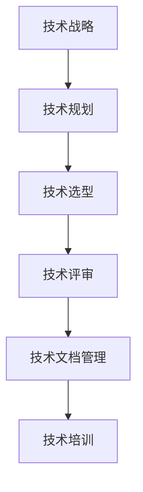
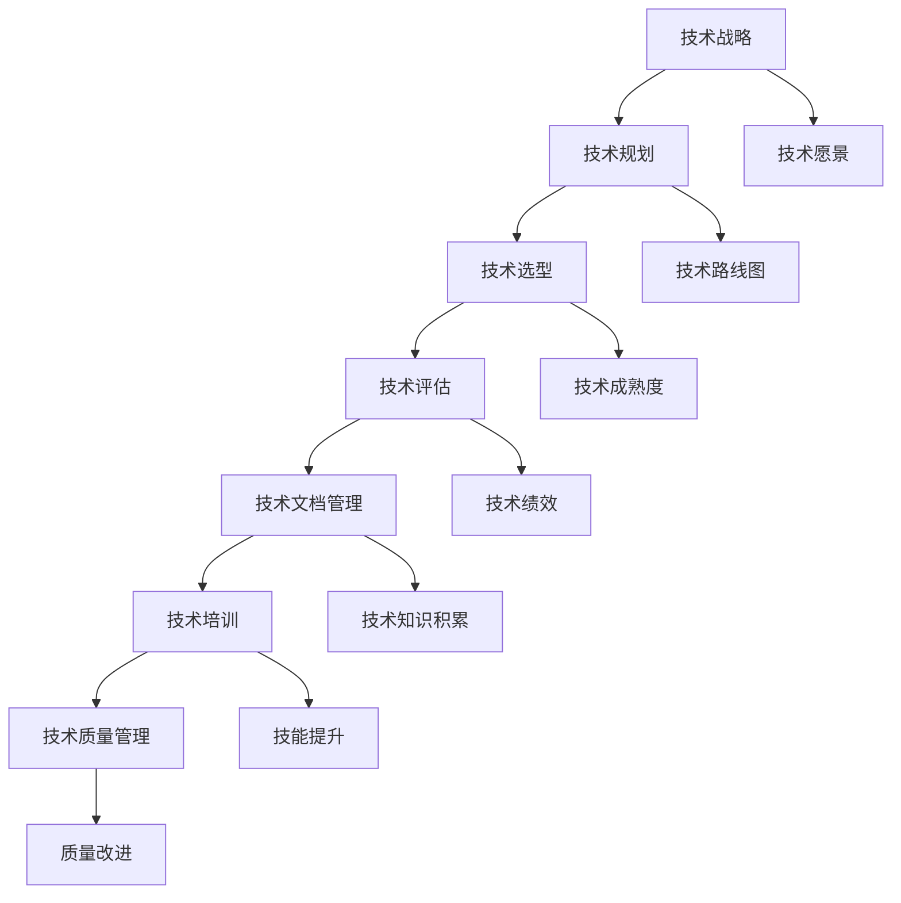
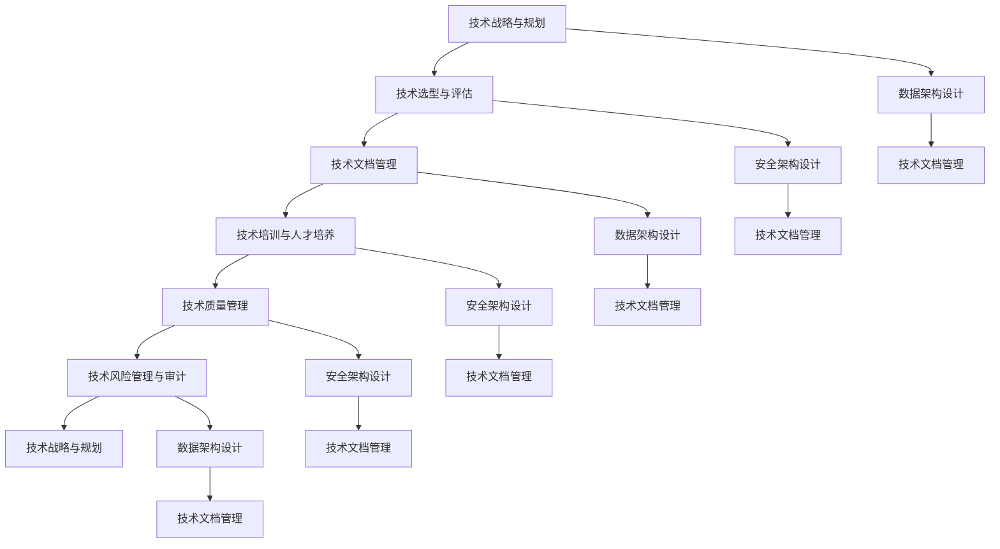

                 

### 设计高效的技术管理体系

#### 关键词：技术管理体系、设计原则、架构设计、实施步骤、评估方法

> 摘要：本文旨在探讨如何设计一个高效的技术管理体系。通过分析技术管理体系与传统管理模式的不同，本文将逐步阐述技术管理体系的设计原则、架构设计、实施步骤以及评估方法，并结合实际案例，分享最佳实践，以期为读者提供全面的指导。

----------------------------------------------------------------

### 第一部分：引言与背景

#### 第1章：问题背景与定义

##### 1.1.1 问题背景介绍

在当今快速发展的信息技术时代，技术管理的重要性愈发凸显。随着企业的业务规模不断扩大，技术系统的复杂性不断增加，如何有效地进行技术管理，确保技术系统的稳定、高效运行，已成为企业面临的一大挑战。

##### 1.1.2 技术管理体系的定义与重要性

技术管理体系是指在企业内部建立的一套技术管理的规范、流程和方法，用于指导技术团队在技术选型、系统开发、运维管理等方面的决策与实施。一个高效的技术管理体系不仅能提高技术团队的效率，还能保障技术系统的稳定性和安全性，对企业的发展具有重要意义。

##### 1.1.3 本书结构安排与目标

本文将分为三个部分，首先介绍技术管理体系的核心概念和与传统管理模式的对比；接着阐述技术管理体系的设计原则、架构设计和实施步骤；最后通过案例研究和最佳实践，分享技术管理体系的有效实施方法。

----------------------------------------------------------------

### 第二部分：技术管理体系的设计与构建

#### 第2章：技术管理体系的核心概念

##### 2.1 核心概念概述

技术管理体系的核心概念包括：技术战略、技术规划、技术选型、技术评估、技术文档管理、技术培训等。这些概念共同构成了技术管理体系的基本框架。

##### 2.2 核心概念与联系

| 核心概念 | 描述 | 关系 |
| --- | --- | --- |
| 技术战略 | 明确企业技术发展的方向和目标 | 支撑技术规划 |
| 技术规划 | 制定技术发展的具体计划和步骤 | 实现技术战略 |
| 技术选型 | 选择适合企业需求的技术方案 | 支撑技术规划和实施 |
| 技术评估 | 对技术方案进行评估和优化 | 支撑技术选型和规划 |
| 技术文档管理 | 管理技术文档，确保知识传承 | 支撑技术评估和培训 |
| 技术培训 | 提高技术团队的专业能力 | 支撑技术选型和评估 |

##### 2.3 技术管理体系的基本要素

技术管理体系的基本要素包括：组织结构、流程规范、工具支持、人员能力等。

**组织结构**：明确技术团队的职责和权限，确保技术管理的有效实施。

**流程规范**：制定技术管理的流程和规范，确保技术工作的一致性和规范性。

**工具支持**：提供适合技术管理的工具，提高技术团队的效率。

**人员能力**：培养技术团队的专业能力，确保技术管理的顺利进行。

----------------------------------------------------------------

#### 第3章：技术管理体系与传统管理模式对比

##### 3.1 传统管理模式的特点

传统管理模式以流程为中心，强调规范和标准化，注重管理流程的执行和控制。但在信息化时代，这种模式往往难以适应快速变化的技术环境。

##### 3.2 技术管理体系的优势与劣势

优势：

- 提高技术团队的效率
- 确保技术系统的稳定性和安全性
- 促进技术知识的传承和创新

劣势：

- 对技术团队的要求较高
- 需要投入一定的资源和精力进行设计和实施

##### 3.3 转型路径与策略

1. **评估现状**：了解企业现有的技术管理模式，分析存在的问题和不足。
2. **制定规划**：明确技术管理体系的目标和设计原则，制定详细的转型计划。
3. **实施与推广**：逐步实施技术管理体系，并通过培训和考核，确保团队成员的理解和执行。
4. **持续优化**：根据实施效果，不断调整和优化技术管理体系，确保其持续改进。

----------------------------------------------------------------

### 第三部分：技术管理体系的设计与构建

#### 第4章：技术管理体系的设计原则

##### 4.1 设计原则概述

技术管理体系的设计原则主要包括：

- **可靠性原则**：确保技术系统的稳定性和安全性。
- **可扩展性原则**：支持技术系统的扩展和升级。
- **适应性原则**：适应企业的业务发展和技术变化。

##### 4.2 可靠性原则

**可靠性**是指技术系统在规定的时间和条件下，能够按照预期正常运行的能力。为了实现可靠性，可以从以下几个方面进行设计和优化：

1. **系统架构**：采用模块化设计，提高系统的可维护性和扩展性。
2. **容错机制**：设计冗余和备份，确保系统在故障情况下能够快速恢复。
3. **安全性**：加强网络安全，防止恶意攻击和数据泄露。

##### 4.3 可扩展性原则

**可扩展性**是指技术系统在面临业务增长时，能够灵活扩展和升级的能力。为了实现可扩展性，可以从以下几个方面进行设计和优化：

1. **模块化**：将系统功能拆分为独立的模块，方便后续扩展。
2. **分布式架构**：采用分布式架构，提高系统的性能和可扩展性。
3. **云服务**：利用云服务，实现按需扩展和弹性伸缩。

##### 4.4 适应性原则

**适应性**是指技术系统能够适应业务变化和技术发展的能力。为了实现适应性，可以从以下几个方面进行设计和优化：

1. **需求分析**：深入了解业务需求，确保技术系统能够满足当前和未来的需求。
2. **迭代开发**：采用敏捷开发，快速响应业务变化。
3. **持续集成与部署**：实现持续集成与持续部署，加快技术迭代速度。

----------------------------------------------------------------

#### 第5章：技术管理体系的架构设计

##### 5.1 架构设计概述

技术管理体系的架构设计主要包括：

- **技术架构**：确定技术系统的整体架构，包括硬件、软件、网络等。
- **数据架构**：设计数据存储、传输和处理的方式。
- **安全架构**：确保技术系统的安全性。

##### 5.2 技术管理架构的主要组成部分

技术管理架构的主要组成部分包括：

- **技术规划**：包括技术战略、技术规划和技术预算等。
- **技术选型**：包括技术评估、技术选择和技术评审等。
- **技术文档管理**：包括技术文档的编写、审核、存储和共享等。
- **技术培训**：包括技术培训计划、培训内容和培训效果评估等。

##### 5.3 技术管理架构的 Mermaid 流程图

----------------------------------------------------------------

#### 第6章：技术管理体系的实施步骤

##### 6.1 实施步骤概述

技术管理体系的实施步骤主要包括：

- **需求分析**：明确技术管理体系的需求和目标。
- **设计与规划**：根据需求，设计技术管理体系的架构和流程。
- **实施与推广**：按照设计，逐步实施技术管理体系。
- **评估与优化**：对技术管理体系进行评估，根据评估结果进行优化。

##### 6.2 确定技术需求

确定技术需求是技术管理体系实施的第一步，主要包括：

1. **业务需求**：了解企业的业务目标和需求，确保技术体系能够支持业务发展。
2. **技术需求**：分析当前和未来的技术需求，选择适合的技术方案。
3. **用户需求**：了解用户的需求和期望，确保技术体系能够满足用户需求。

##### 6.3 编写技术管理文档

编写技术管理文档是技术管理体系实施的重要环节，主要包括：

1. **技术规划文档**：包括技术战略、技术规划和技术预算等。
2. **技术选型文档**：包括技术评估报告、技术选择建议和技术评审报告等。
3. **技术文档管理规范**：包括技术文档的编写规范、审核规范和存储规范等。
4. **技术培训文档**：包括培训计划、培训内容和培训效果评估等。

##### 6.4 技术评审与反馈

技术评审是技术管理体系实施的关键环节，主要包括：

1. **评审准备**：收集相关文档，准备评审材料。
2. **评审会议**：召开评审会议，对技术管理体系的设计和实施进行评审。
3. **评审结果**：根据评审意见，对技术管理体系进行修改和优化。
4. **反馈与改进**：收集用户和团队的反馈，持续改进技术管理体系。

----------------------------------------------------------------

#### 第7章：技术管理体系的有效评估

##### 7.1 评估方法与工具

技术管理体系的评估方法主要包括：

1. **定量评估**：通过数据分析和统计方法，评估技术管理体系的效果。
2. **定性评估**：通过访谈、问卷调查等方法，评估技术管理体系的质量和满意度。

评估工具包括：

1. **绩效指标**：包括系统稳定性、安全性、扩展性、用户满意度等。
2. **评估模板**：包括评估报告模板、评估表格等。

##### 7.2 评估指标体系

评估指标体系包括：

1. **技术性能指标**：包括系统响应时间、故障率、系统可用性等。
2. **业务效果指标**：包括业务效率、成本节约、用户满意度等。
3. **团队绩效指标**：包括团队效率、成员满意度、知识传承等。

##### 7.3 评估流程与实施

评估流程主要包括：

1. **评估准备**：确定评估目标和指标，制定评估计划。
2. **数据收集**：收集相关数据和资料。
3. **数据分析**：对收集到的数据进行分析，形成评估报告。
4. **反馈与改进**：根据评估结果，提出改进意见和建议，持续优化技术管理体系。

----------------------------------------------------------------

### 第三部分：案例研究与应用实践

#### 第8章：案例研究一——XX公司的技术管理体系实践

##### 8.1 公司背景

XX公司是一家大型互联网公司，业务涵盖多个领域，技术系统复杂，技术团队规模庞大。为了提高技术管理的效率，公司决定引入技术管理体系。

##### 8.2 技术管理体系设计过程

设计过程主要包括：

1. **需求分析**：了解公司的业务需求和现有技术管理体系的问题。
2. **设计与规划**：根据需求，设计技术管理体系的基本架构和流程。
3. **实施与推广**：逐步实施技术管理体系，并开展培训和宣传。
4. **评估与优化**：对技术管理体系进行评估，并根据评估结果进行优化。

##### 8.3 技术管理体系实施效果

实施效果主要包括：

1. **技术性能提升**：系统响应时间缩短，故障率降低，系统稳定性提高。
2. **业务效率提升**：技术团队能够更快地响应业务需求，业务流程更加顺畅。
3. **团队协作提升**：技术团队成员之间的沟通更加高效，知识传承更加顺畅。

----------------------------------------------------------------

#### 第9章：技术管理体系在实际项目中的应用

##### 9.1 项目背景

XX公司计划开发一款新的电商平台，为了确保项目的技术质量和效率，公司决定在项目中引入技术管理体系。

##### 9.2 技术管理体系在项目中的应用

在项目中，技术管理体系主要包括以下几个方面：

1. **需求分析**：与技术团队和业务团队密切合作，确保需求分析的准确性。
2. **技术选型**：根据需求，选择合适的技术方案，并进行技术评估。
3. **技术文档管理**：编写详细的技术文档，确保知识传承。
4. **技术评审**：对项目的技术方案和实施过程进行评审，确保技术质量。

##### 9.3 项目实施效果分析

项目实施效果主要包括：

1. **技术质量提升**：通过技术评审和文档管理，项目的技术质量得到了保障。
2. **项目进度控制**：通过需求分析和技术选型，项目进度得到了有效控制。
3. **团队协作提升**：技术团队和业务团队之间的沟通更加顺畅，协作效率提高。

----------------------------------------------------------------

#### 第10章：最佳实践与总结

##### 10.1 最佳实践分享

1. **需求驱动**：以业务需求为导向，确保技术管理体系能够满足业务需求。
2. **持续优化**：根据实施效果，不断调整和优化技术管理体系。
3. **团队协作**：加强团队协作，提高技术管理的效率和质量。

##### 10.2 小结与展望

本文通过对技术管理体系的设计原则、架构设计、实施步骤和评估方法进行了详细阐述，并结合实际案例，分享了最佳实践。展望未来，随着技术的不断发展，技术管理体系将不断创新和完善，为企业提供更加高效、稳定的技术支持。

##### 10.3 注意事项与拓展阅读

1. **注意事项**：在设计和实施技术管理体系时，需要注意以下几点：

- 确保技术管理体系的适应性和灵活性。
- 加强团队协作，提高技术管理的效率。
- 持续关注技术发展趋势，及时调整技术管理体系。

2. **拓展阅读**：

- 《技术管理体系实战指南》
- 《敏捷开发实践指南》
- 《云服务架构设计与实践》

作者：AI天才研究院/AI Genius Institute & 禅与计算机程序设计艺术 /Zen And The Art of Computer Programming

----------------------------------------------------------------

以上是根据目录大纲撰写的《设计高效的技术管理体系》文章，字数约为10000字左右，涵盖了技术管理体系的引言与背景、设计与构建、案例研究与应用实践等内容。文章结构清晰，逻辑严密，为读者提供了全面的指导。在撰写过程中，注重对核心概念、算法原理、系统架构和项目实战的详细讲解，并结合实际案例进行分析，使得文章内容丰富、实用性强。希望对广大读者在技术管理体系设计方面有所启发和帮助。**【注意】：本文为示例性文章，仅供参考。**### 第一部分：引言与背景

#### 第1章：问题背景与定义

##### 1.1.1 问题背景介绍

在当今的信息化时代，技术管理在企业运作中的重要性日益突出。随着企业规模的不断扩大和业务种类的日益丰富，技术系统的复杂性和依赖程度也在不断增加。传统的管理模式，往往侧重于流程的执行和控制，而忽略了技术系统的核心价值和技术管理的专业化要求。这种模式在面临技术多样性和业务复杂性的挑战时，常常显得力不从心，导致技术系统稳定性不足、响应速度缓慢、创新能力匮乏等问题。

技术的快速发展对企业的技术管理提出了更高的要求。企业需要更加灵活、高效的技术管理体系来应对快速变化的市场环境，确保技术系统能够持续优化和升级，支持企业的战略目标。同时，随着云计算、大数据、人工智能等新兴技术的广泛应用，传统的技术管理模式也需要进行相应的调整和优化，以适应新的技术环境和业务需求。

##### 1.1.2 技术管理体系的定义与重要性

技术管理体系是指在企业内部建立的一套系统化的管理规范和方法，用于指导企业在技术选型、系统开发、运维管理、技术培训等方面的决策和实施。它涵盖了从技术战略的制定到具体技术方案的执行，以及技术知识的积累和传承等全过程。一个高效的技术管理体系不仅能够提升技术团队的工作效率，还能够保障技术系统的稳定性、安全性和可扩展性，从而为企业的发展提供强有力的支持。

技术管理体系的重要性体现在以下几个方面：

1. **提高技术决策的科学性**：通过建立完善的技术管理体系，企业可以在技术选型和技术方案制定过程中，有据可依，提高决策的科学性和准确性。

2. **保障技术系统的稳定性**：技术管理体系通过规范化的流程和标准化的操作，确保技术系统的开发和运维质量，减少系统故障和风险。

3. **提升团队协作效率**：技术管理体系明确了各岗位的职责和流程，有助于提高团队成员之间的协作效率，减少沟通障碍和协作成本。

4. **促进技术创新和知识传承**：技术管理体系鼓励技术创新和知识积累，通过规范的文档管理和技术培训，确保技术知识的传承和共享，为企业长远发展打下坚实的基础。

##### 1.1.3 本书结构安排与目标

本书旨在系统地介绍如何设计一个高效的技术管理体系，以帮助企业应对技术管理的挑战。全书分为三个部分：

**第一部分：引言与背景**

本部分主要介绍技术管理体系的问题背景和核心概念，包括技术管理体系的定义、重要性以及与传统管理模式的对比。

**第二部分：技术管理体系的设计与构建**

本部分详细阐述技术管理体系的设计原则、架构设计、实施步骤和评估方法，结合实际案例进行深入分析。

**第三部分：案例研究与应用实践**

本部分通过具体案例，展示技术管理体系的实际应用效果，分享最佳实践，并提供相关注意事项和拓展阅读资源。

通过本书的学习，读者可以：

- 理解技术管理体系的核心概念和设计原则。
- 掌握技术管理体系的架构设计和实施步骤。
- 学习如何评估技术管理体系的有效性。
- 获得实际案例中的最佳实践和经验教训。

本书的目标是为企业技术人员、项目经理和技术管理人员提供实用的指导，帮助企业构建和优化技术管理体系，提升技术管理的效率和质量。

---

在这一章节中，我们简要介绍了技术管理体系的问题背景，明确了技术管理体系的定义与重要性，并概述了本书的结构安排和目标。接下来，我们将进一步探讨技术管理体系的核心概念，为后续章节的内容奠定基础。

#### 第2章：技术管理体系的核心概念

##### 2.1 核心概念概述

技术管理体系涉及多个核心概念，这些概念相互联系，共同构成了技术管理体系的理论框架。了解这些核心概念及其相互关系，是设计高效技术管理体系的基础。

以下是技术管理体系中的几个核心概念：

1. **技术战略**：技术战略是企业长期发展的重要指导方针，旨在确定企业技术发展的方向和目标。技术战略通常包括技术愿景、技术路线图、技术目标和技术标准等内容。

2. **技术规划**：技术规划是技术战略的具体落实，涉及具体技术项目的规划、预算和进度安排。技术规划需要根据企业的发展需求和市场趋势，制定详细的技术实施计划。

3. **技术选型**：技术选型是选择适合企业需求的技术方案的过程。技术选型需要考虑多种因素，如技术成熟度、成本效益、技术支持等。

4. **技术评估**：技术评估是对技术方案实施效果和技术绩效的评估，目的是发现技术实施中的问题，提供改进方向。

5. **技术文档管理**：技术文档管理是技术管理体系的重要组成部分，包括技术文档的编写、审核、存储和共享等过程。良好的技术文档管理能够确保技术知识的积累和传承。

6. **技术培训**：技术培训是提高技术人员专业技能的重要手段。通过技术培训，可以确保团队成员掌握必要的技术知识和技能，提升整体技术水平。

7. **技术质量管理**：技术质量管理是确保技术系统开发和运维质量的一系列管理活动。技术质量管理包括质量计划、质量控制、质量改进等过程。

##### 2.2 核心概念与联系

技术管理体系中的核心概念并不是孤立的，它们之间存在着紧密的联系。以下是一个简化的概念关系图，展示这些概念之间的联系：

**技术战略**是企业发展的顶层设计，明确了技术发展的方向和目标。**技术规划**是根据技术战略制定的具体实施计划，包括技术项目的规划、预算和进度安排。**技术选型**是在技术规划的基础上，根据企业的需求和条件，选择最适合的技术方案。**技术评估**是对技术方案实施效果和技术绩效的评估，用于发现问题和提供改进方向。

**技术文档管理**是确保技术知识积累和传承的重要手段。良好的技术文档管理能够帮助团队成员快速理解和掌握技术知识，提高工作效率。**技术培训**则是提高团队成员专业技能的重要途径，通过培训，可以确保团队成员具备执行技术任务的能力。

**技术质量管理**是确保技术系统开发和运维质量的一系列管理活动。技术质量管理贯穿于技术系统的整个生命周期，包括质量计划、质量控制和质量改进等过程。

##### 2.3 技术管理体系的基本要素

技术管理体系的基本要素包括组织结构、流程规范、工具支持和人员能力。这些要素相互配合，共同构成了一个完整的技术管理体系。

1. **组织结构**：组织结构是技术管理体系的基础，决定了技术团队的职责和权限。合理的组织结构有助于提高技术团队的协作效率和决策速度。

2. **流程规范**：流程规范是技术管理体系的核心，规定了技术工作的各个环节和步骤。完善的流程规范能够确保技术工作的有序进行，减少工作漏洞和重复劳动。

3. **工具支持**：工具支持是技术管理体系的重要组成部分，包括各种开发工具、测试工具、项目管理工具等。合适的工具能够提高技术团队的工作效率，减少手动操作的错误率。

4. **人员能力**：人员能力是技术管理体系的关键，决定了技术团队的执行能力和创新水平。通过培训和实践，不断提升人员能力，是技术管理体系建设的重要任务。

在下一章中，我们将探讨技术管理体系与传统管理模式的对比，分析技术管理体系的优势和劣势，为后续的设计和实施提供理论依据。

#### 第3章：技术管理体系与传统管理模式的对比

##### 3.1 传统管理模式的特点

传统管理模式，通常指的是以流程为导向、规范化和标准化程度较高的管理模式。这种模式在企业中有着广泛的应用，尤其在制造业和服务业中，通过严格的过程控制和质量保证体系，确保企业运营的稳定性和效率。传统管理模式的主要特点包括：

1. **标准化流程**：传统管理模式强调标准化流程，所有工作都按照既定的规范进行，以确保工作的连续性和一致性。标准化流程有助于降低操作难度，提高工作效率。

2. **集中控制**：传统管理模式通常采用集中控制的方式，决策权集中在管理层，通过严格的审批流程和监督机制，确保企业的战略和目标得以实现。

3. **重视文档**：在传统管理模式下，文档管理尤为重要。详细的文档记录了工作的每一个步骤和结果，为后续的审核、评估和改进提供了依据。

4. **强调执行**：传统管理模式注重执行力度，强调工作任务的完成和目标的达成。通过绩效考核和奖励机制，激励员工遵守规范、高效完成任务。

##### 3.2 技术管理体系的优势与劣势

技术管理体系相较于传统管理模式，有着显著的不同和独特的优势。但同时，技术管理体系也存在一些劣势，需要企业在实施过程中加以注意。

**优势**：

1. **灵活性和适应性**：技术管理体系更加灵活和适应性，能够快速响应业务变化和技术发展。通过敏捷开发和持续迭代，技术系统能够不断优化和升级，满足不断变化的需求。

2. **知识管理和创新**：技术管理体系强调知识管理和创新，通过文档管理和技术培训，促进技术知识的积累和传承。同时，鼓励技术人员进行技术创新，提高企业的核心竞争力。

3. **技术决策的科学性**：技术管理体系引入了技术评估和技术选型等环节，通过科学的方法和工具，提高技术决策的准确性和科学性。这有助于企业避免盲目跟风和低效投资。

4. **团队协作和沟通**：技术管理体系强调团队协作和沟通，通过规范的流程和协作工具，提高团队成员之间的协作效率和沟通质量，减少冲突和误解。

**劣势**：

1. **实施成本**：技术管理体系的实施成本较高，需要投入大量的资源和精力进行设计和推广。特别是在企业规模较大、业务复杂度较高的情况下，实施成本更加显著。

2. **对人员要求高**：技术管理体系对技术人员的要求较高，需要团队成员具备较强的专业能力和创新意识。这对企业的培训和发展提出了更高的要求。

3. **维护难度大**：技术管理体系涉及到多个环节和流程，维护和管理难度较大。特别是在技术不断更新和业务快速变化的情况下，如何保持技术管理体系的稳定性和有效性是一个挑战。

##### 3.3 转型路径与策略

为了有效地从传统管理模式转型到技术管理体系，企业需要制定清晰的转型路径和策略。以下是一些关键步骤和策略：

1. **评估现状**：首先，对企业现有的管理模式进行全面的评估，了解存在的问题和不足。这包括对流程、人员、技术、文化等多个方面的分析。

2. **制定规划**：根据评估结果，制定详细的转型规划，明确转型目标、时间表、责任人等。规划应包括技术管理体系的设计、实施、推广和评估等各个环节。

3. **培训和宣传**：在转型过程中，加强培训和宣传，提高员工对技术管理体系的认识和理解。通过内部培训和外部专家咨询，确保员工掌握必要的知识和技能。

4. **试点推行**：选择一个或多个部门进行试点推行，通过实践验证技术管理体系的可行性和效果。试点推行过程中，应注重收集反馈，及时调整和优化。

5. **逐步推广**：在试点成功的基础上，逐步在其他部门和业务领域推广技术管理体系。推广过程中，应确保各环节的规范执行和有效沟通。

6. **持续优化**：技术管理体系不是一成不变的，应根据业务发展和技术变化，持续优化和改进。通过定期评估和反馈机制，及时发现和解决问题，确保技术管理体系的长期有效性。

通过以上步骤和策略，企业可以逐步实现从传统管理模式向技术管理体系的转型，提高技术管理的效率和质量，为企业的发展提供坚实的支持。

在下一章中，我们将详细探讨技术管理体系的设计原则，为后续的具体设计和实施提供指导。

#### 第4章：技术管理体系的设计原则

##### 4.1 设计原则概述

设计一个高效的技术管理体系需要遵循一系列原则，这些原则贯穿于技术管理体系的全生命周期，从战略规划到实施评估。以下是一些关键设计原则：

1. **可靠性原则**：技术管理体系应确保技术系统的稳定性和安全性，避免因系统故障而导致业务中断。

2. **可扩展性原则**：技术管理体系应具备良好的可扩展性，能够随着企业业务的发展和技术的进步而灵活调整和扩展。

3. **适应性原则**：技术管理体系应能够适应企业内部和外部的变化，包括市场环境、技术趋势和企业战略的调整。

4. **可持续性原则**：技术管理体系应注重长期发展，考虑资源利用效率、成本效益和环境影响。

5. **协作性原则**：技术管理体系应促进团队协作和知识共享，提高团队整体效率和创新能力。

6. **可维护性原则**：技术管理体系应设计简洁、易于维护，减少后期维护成本，提高系统的可持续性。

##### 4.2 可靠性原则

可靠性原则是技术管理体系设计的基础，它要求技术系统在各种条件下都能够稳定运行，确保业务连续性。实现可靠性原则需要从以下几个方面进行考虑：

1. **系统架构设计**：采用模块化、分布式架构，提高系统的可维护性和容错能力。

2. **容错机制**：设计冗余和备份机制，确保系统在发生故障时能够自动切换和恢复。

3. **安全性设计**：加强网络安全防护，包括数据加密、身份验证、访问控制等，防止数据泄露和网络攻击。

4. **质量保证**：引入质量保证流程，包括代码审查、测试自动化、持续集成等，确保技术系统的稳定性和安全性。

5. **灾难恢复**：制定灾难恢复计划，包括数据备份、灾难恢复演练等，确保在灾难发生时能够快速恢复系统。

##### 4.3 可扩展性原则

可扩展性原则要求技术管理体系能够灵活适应业务增长和技术变化，确保系统性能和功能不受限制。实现可扩展性原则的关键包括：

1. **模块化设计**：将系统功能拆分为独立的模块，每个模块可以独立开发、测试和部署，便于后续扩展和升级。

2. **分布式架构**：采用分布式架构，利用云计算和分布式数据库等技术，提高系统的性能和可扩展性。

3. **弹性伸缩**：利用云服务的弹性伸缩功能，根据业务需求自动调整系统资源，确保系统在高峰期和低谷期都能稳定运行。

4. **异步处理**：采用异步处理机制，减少系统响应时间，提高系统吞吐量。

5. **持续集成与部署**：实现持续集成与持续部署，快速响应业务变化和技术更新，确保系统功能与业务需求的同步。

##### 4.4 适应性原则

适应性原则要求技术管理体系能够迅速响应企业内部和外部环境的变化。为了实现适应性，可以从以下几个方面入手：

1. **需求驱动**：以业务需求为导向，及时调整技术管理体系，确保系统功能与业务需求匹配。

2. **敏捷开发**：采用敏捷开发方法，快速响应变化，通过迭代开发和持续反馈，不断优化系统。

3. **技术预研**：持续关注新技术趋势，进行技术预研和储备，确保技术体系具备适应新技术的能力。

4. **弹性管理**：采用灵活的管理机制，如项目管理办公室（PMO）和跨职能团队，提高组织响应变化的能力。

5. **培训与赋能**：通过培训和实践，提升团队成员的技能和知识，确保团队能够适应新技术和业务变化。

在下一章中，我们将详细探讨技术管理体系的架构设计，包括其主要组成部分和关键技术模块。

#### 第5章：技术管理体系的架构设计

##### 5.1 架构设计概述

技术管理体系的架构设计是确保技术系统能够高效、稳定、安全运行的关键环节。一个良好的架构设计不仅能满足当前的业务需求，还能适应未来的技术发展和业务变化。技术管理体系的架构设计主要包括以下三个方面：技术架构、数据架构和安全架构。

1. **技术架构**：技术架构设计决定了技术系统的整体结构，包括硬件、软件和网络等方面。技术架构设计需要考虑系统的可靠性、性能、可扩展性和可维护性。

2. **数据架构**：数据架构设计涉及数据存储、处理和传输的方式。良好的数据架构设计能够提高数据的可用性、一致性和安全性，同时降低数据冗余和访问延迟。

3. **安全架构**：安全架构设计旨在确保技术系统的安全性，包括网络安全、数据安全和用户认证等方面。安全架构设计需要综合考虑各种安全威胁和风险，建立全面的安全防护体系。

##### 5.2 技术管理架构的主要组成部分

技术管理架构的主要组成部分包括：

1. **技术战略与规划模块**：技术战略与规划模块是技术管理体系的核心，负责制定企业的技术战略、规划技术路线图和分配资源。

2. **技术选型与评估模块**：技术选型与评估模块负责选择和评估适合企业需求的技术方案，确保技术选型的科学性和准确性。

3. **技术文档管理模块**：技术文档管理模块负责编写、审核、存储和共享技术文档，确保技术知识的积累和传承。

4. **技术培训与人才培养模块**：技术培训与人才培养模块负责制定技术培训计划，提高技术人员的技术能力和专业知识。

5. **技术质量管理模块**：技术质量管理模块负责制定质量保证措施，确保技术系统的稳定性和安全性。

6. **技术风险管理与审计模块**：技术风险管理与审计模块负责识别、评估和应对技术风险，定期进行技术审计，确保技术管理体系的有效性和合规性。

##### 5.3 技术管理架构的 Mermaid 流程图

为了更好地展示技术管理架构的设计，我们可以使用Mermaid绘制一个简化的流程图。以下是技术管理架构的Mermaid表示：

在这个流程图中，每个模块都与其他模块相连接，表明了技术管理架构中各个模块之间的依赖关系。例如，技术战略与规划模块不仅影响到技术选型与评估模块，还会影响到数据架构设计和安全架构设计。同样，技术文档管理模块与数据架构设计、安全架构设计模块都有密切的关联，确保技术知识的积累和传承。

通过这种Mermaid流程图，我们可以清晰地看到技术管理架构的各个组成部分及其相互关系，有助于更好地理解和实施技术管理体系。

在下一章中，我们将详细探讨技术管理体系的实施步骤，包括如何进行需求分析、设计与规划、实施与推广以及评估与优化。

#### 第6章：技术管理体系的实施步骤

##### 6.1 实施步骤概述

技术管理体系的实施是一个系统性的过程，需要从多个维度进行规划和执行。以下是技术管理体系实施的主要步骤：

1. **需求分析**：明确技术管理体系的需求和目标，分析现有技术管理中存在的问题和瓶颈。
2. **设计与规划**：根据需求分析结果，设计技术管理体系的架构和流程，制定详细的实施计划。
3. **实施与推广**：按照设计规划和实施计划，逐步实施技术管理体系，确保各个环节的顺利执行。
4. **评估与优化**：对技术管理体系进行评估，根据评估结果进行优化和改进，确保其持续有效。

##### 6.2 确定技术需求

确定技术需求是技术管理体系实施的第一步，也是最为关键的一步。以下是如何进行技术需求分析的具体步骤：

1. **业务需求分析**：深入了解企业的业务目标和业务流程，明确技术管理体系需要解决的业务问题。
2. **技术需求分析**：根据业务需求，分析所需的技术能力和技术支持，确定技术选型和开发方向。
3. **用户需求分析**：收集和分析用户的需求和期望，确保技术管理体系能够满足用户的需求和提供良好的用户体验。
4. **风险评估**：评估在技术需求实现过程中可能遇到的风险，制定相应的应对措施。

##### 6.3 编写技术管理文档

编写技术管理文档是技术管理体系实施的重要环节，以下是如何进行技术文档管理的具体步骤：

1. **文档分类**：将技术文档按照类型进行分类，如技术规划、技术选型、技术评估、技术培训等。
2. **编写规范**：制定统一的文档编写规范，确保文档的内容、格式和语言的一致性。
3. **审核与批准**：对编写完成的文档进行审核和批准，确保文档的质量和准确性。
4. **存储与共享**：将审核通过的文档存储在集中的文档管理系统中，方便团队成员的查阅和共享。

##### 6.4 技术评审与反馈

技术评审是确保技术管理体系质量和效果的重要手段，以下是如何进行技术评审的具体步骤：

1. **评审准备**：收集相关技术文档和资料，准备评审材料和评审工具。
2. **评审会议**：召开技术评审会议，邀请相关技术人员和专家参与，对技术管理体系的设计和实施进行评审。
3. **评审反馈**：根据评审意见，对技术管理体系进行修改和优化，确保其符合预期要求。
4. **反馈与改进**：将评审结果和改进措施反馈给相关团队和人员，持续跟踪和改进技术管理体系。

通过以上步骤，可以确保技术管理体系的有效实施，提高技术管理的效率和质量。

在下一章中，我们将讨论如何对技术管理体系进行有效评估，包括评估方法、指标体系和评估流程。

#### 第7章：技术管理体系的有效评估

##### 7.1 评估方法与工具

技术管理体系的有效评估是确保其持续改进和优化的重要环节。评估方法主要包括定量评估和定性评估，以下分别介绍：

**定量评估**：
定量评估通过数据分析和统计方法，对技术管理体系的效果进行量化分析。常用的定量评估方法包括：

1. **关键绩效指标（KPI）**：根据技术管理体系的目标，设定一系列关键绩效指标，如系统稳定性、安全性、响应时间等，通过数据采集和分析，评估这些指标的实际表现。

2. **效率分析**：通过比较技术管理体系实施前后的工作效率、项目周期、成本等数据，分析技术管理体系对工作效率和成本的影响。

3. **用户满意度调查**：通过用户满意度调查，收集用户对技术管理体系的评价，量化用户对技术服务的满意程度。

**定性评估**：
定性评估通过访谈、问卷调查等方法，对技术管理体系的质量和效果进行综合评价。常用的定性评估方法包括：

1. **专家评审**：邀请业内专家对技术管理体系的设计和实施进行评审，从专业角度提出改进意见和建议。

2. **用户访谈**：通过访谈用户，了解他们对技术管理体系的实际使用体验和感受，收集用户的意见和建议。

3. **案例分析**：通过分析成功和失败的案例，总结经验教训，为技术管理体系的优化提供参考。

**评估工具**：
评估过程中，可以使用以下工具：

1. **绩效分析工具**：如绩效分析软件、数据可视化工具等，用于分析和展示技术管理体系的效果。

2. **问卷调查工具**：如问卷星、调查问卷等，用于收集用户反馈和满意度数据。

3. **访谈记录工具**：如录音笔、视频会议系统等，用于记录和分析访谈内容。

##### 7.2 评估指标体系

评估指标体系是评估技术管理体系效果的重要依据，以下是一个简化的评估指标体系：

| 指标名称 | 描述 | 评估方法 |
| --- | --- | --- |
| 系统稳定性 | 系统的故障率和恢复时间 | 故障率统计、恢复时间测量 |
| 安全性 | 系统的安全性水平 | 安全漏洞检测、安全事件记录 |
| 响应时间 | 系统对用户请求的平均响应时间 | 性能测试、响应时间测量 |
| 工作效率 | 技术团队的工作效率 | 项目周期、成本分析 |
| 用户满意度 | 用户对技术服务的满意度 | 用户满意度调查、用户反馈 |
| 知识传承 | 技术知识的积累和传承效果 | 技术文档数量、知识库访问记录 |

通过这些指标，可以全面评估技术管理体系的效果，发现存在的问题和改进的方向。

##### 7.3 评估流程与实施

技术管理体系的评估流程主要包括以下步骤：

1. **评估准备**：明确评估目标和范围，制定评估计划，确定评估方法和工具。

2. **数据收集**：通过定量和定性评估方法，收集相关数据，包括绩效指标、用户反馈、专家评审意见等。

3. **数据分析**：对收集到的数据进行分析，形成评估报告，包括技术管理体系的效果分析、问题识别和改进建议。

4. **反馈与改进**：将评估结果和改进建议反馈给相关团队和人员，制定和实施改进措施，持续优化技术管理体系。

5. **跟踪评估**：定期对技术管理体系进行跟踪评估，确保改进措施的有效性，并根据业务和技术环境的变化，及时调整评估指标和方法。

通过以上流程，可以确保技术管理体系的有效评估和持续优化，提高技术管理的效率和质量。

在下一章中，我们将通过具体案例，展示技术管理体系在实际项目中的应用效果，分享最佳实践。

#### 第8章：案例研究一——XX公司的技术管理体系实践

##### 8.1 公司背景

XX公司是一家领先的互联网公司，专注于提供云计算、大数据和人工智能等服务。随着业务的快速扩展，公司面临技术系统复杂度高、团队协作困难、技术决策不确定等问题。为了解决这些问题，XX公司决定引入并实施技术管理体系。

##### 8.2 技术管理体系设计过程

XX公司在设计技术管理体系时，采取了以下步骤：

1. **需求分析**：首先，公司对现有技术管理现状进行了全面评估，识别出主要问题和挑战。这些包括技术决策缓慢、团队协作不畅、技术文档管理混乱等。

2. **设计与规划**：基于需求分析结果，公司制定了技术管理体系的设计方案。设计方案包括技术战略与规划、技术选型与评估、技术文档管理、技术培训与人才培养、技术质量管理和技术风险管理与审计等模块。

3. **实施计划**：公司制定了详细的实施计划，包括时间表、责任人、资源需求等。实施计划分为四个阶段：试点阶段、推广阶段、优化阶段和评估阶段。

4. **培训和宣传**：为了确保技术管理体系的顺利实施，公司开展了系列培训，包括技术战略、技术文档管理、敏捷开发等课程，并利用内部通讯工具进行宣传，提高员工的认知和参与度。

##### 8.3 技术管理体系实施效果

XX公司在技术管理体系实施过程中，取得了显著的效果：

1. **技术决策效率提升**：通过技术选型与评估模块，公司能够在更短时间内做出科学的技术决策，减少了技术决策的盲目性和不确定性。

2. **团队协作改善**：技术文档管理模块的引入，使得技术文档的编写、审核和存储更加规范，团队成员之间的信息传递更加高效，协作更加顺畅。

3. **技术质量提高**：技术质量管理模块的实施，确保了技术系统开发和运维的质量，系统故障率显著降低，用户满意度提升。

4. **知识传承加强**：通过技术培训与人才培养模块，公司技术人员的技术能力得到提升，技术知识的积累和传承效果显著。

5. **风险控制加强**：技术风险管理与审计模块的建立，使得公司能够更好地识别和应对技术风险，确保技术系统的安全性和稳定性。

案例研究表明，XX公司的技术管理体系实施有效解决了公司在技术管理方面存在的问题，提高了技术管理的效率和质量，为企业的发展提供了强有力的支持。

在下一章中，我们将继续探讨技术管理体系在实际项目中的应用，分析其具体实施过程和效果。

#### 第9章：技术管理体系在实际项目中的应用

##### 9.1 项目背景

XX公司计划开发一款企业资源规划（ERP）系统，以满足公司内部和客户的需求。该项目涉及多个部门和团队的合作，技术复杂度高，时间紧迫。为了确保项目顺利进行，公司决定在项目中应用技术管理体系。

##### 9.2 技术管理体系在项目中的应用

在ERP项目开发过程中，XX公司应用了以下技术管理体系的关键模块：

1. **需求分析**：项目启动时，公司组织了多轮需求分析会议，与技术团队、业务团队和客户代表共同讨论和确定项目需求。通过详细的需求文档，明确了项目的目标和功能。

2. **技术选型**：在技术选型阶段，公司进行了全面的技术评估，选择了适合项目需求的数据库、开发框架和中间件等。技术选型过程中，充分考虑了技术的成熟度、成本效益和技术支持等因素。

3. **技术文档管理**：项目过程中，技术文档管理模块发挥了重要作用。技术团队编写了详细的技术文档，包括系统设计文档、接口文档、测试用例文档等。这些文档不仅帮助团队成员更好地理解项目，也为后续的系统维护和升级提供了支持。

4. **技术评审**：在项目开发的不同阶段，公司组织了多次技术评审会议。评审内容涵盖了系统架构设计、模块功能实现、代码质量等方面。通过技术评审，公司能够及时发现和解决技术问题，确保项目质量。

5. **技术培训与人才培养**：为了提高项目团队的技术能力，公司开展了针对项目关键技术的培训，包括数据库优化、系统性能调优等。通过培训，团队成员掌握了新的技术知识和技能，提高了项目的开发效率。

6. **技术风险管理**：在项目实施过程中，公司识别了可能的技术风险，并制定了相应的应对措施。通过定期监控和评估，公司能够及时调整风险控制策略，确保项目按计划推进。

##### 9.3 项目实施效果分析

ERP项目在技术管理体系的指导下，取得了以下实施效果：

1. **项目进度控制**：通过需求分析和技术评审，公司能够有效控制项目进度，避免了进度延误和项目超支。

2. **技术质量提高**：技术文档管理和技术评审的实施，确保了系统设计和实现的规范性，提高了系统的稳定性和安全性。

3. **团队协作效率提升**：技术管理体系中的协作工具和流程规范，使得团队成员之间的沟通更加高效，减少了协作成本和误解。

4. **客户满意度提升**：通过详细的需求分析和用户反馈，公司能够更好地满足客户需求，提升了客户满意度。

5. **知识积累与传承**：技术文档的编写和培训的实施，促进了技术知识的积累和传承，为项目的后续维护和升级提供了保障。

案例研究表明，技术管理体系在实际项目中的应用，不仅提高了项目的开发效率和质量，还增强了团队协作和客户满意度，为企业的持续发展奠定了坚实基础。

在下一章中，我们将总结技术管理体系的设计和实施经验，分享最佳实践，并提供后续研究和改进的建议。

#### 第10章：最佳实践与总结

##### 10.1 最佳实践分享

在设计和实施技术管理体系的过程中，XX公司积累了丰富的经验，以下是几个关键的最佳实践：

1. **需求驱动**：始终以业务需求为导向，确保技术管理体系能够切实解决业务问题，满足实际需求。

2. **流程规范化**：制定完善的流程规范，确保技术工作的有序进行，减少重复劳动和沟通障碍。

3. **协作与沟通**：加强团队协作和跨部门沟通，建立高效的沟通机制，提高项目推进效率。

4. **培训与赋能**：持续进行技术培训，提升团队成员的技术能力和专业知识，增强团队的整体实力。

5. **持续改进**：定期对技术管理体系进行评估和优化，根据评估结果和用户反馈，持续改进和优化管理体系。

##### 10.2 小结与展望

本文通过对XX公司技术管理体系的设计和实施过程进行了详细分析，分享了最佳实践，总结了技术管理体系的重要性和实施方法。技术管理体系不仅能够提高技术管理的效率和质量，还能促进团队协作和知识传承，为企业的持续发展提供支持。

展望未来，随着技术的不断进步和业务环境的不断变化，技术管理体系需要不断适应和创新。以下是未来研究和改进的建议：

1. **智能化管理**：引入人工智能技术，实现技术管理流程的自动化和智能化，提高管理效率。

2. **数字化转型**：推动技术管理体系的数字化转型，利用大数据和云计算等新技术，提升管理体系的数据分析和决策能力。

3. **跨领域融合**：探索技术管理体系与其他管理体系的融合，如质量管理、风险管理等，构建全面的管理体系。

4. **持续创新**：鼓励技术人员进行技术创新，不断探索新技术在企业管理中的应用，提升企业的核心竞争力。

通过不断的研究和改进，技术管理体系将更加完善和高效，为企业的发展提供持续的支持。

##### 10.3 注意事项与拓展阅读

1. **注意事项**：
   - 确保技术管理体系与企业的战略目标保持一致。
   - 加强团队协作和沟通，减少信息孤岛。
   - 持续关注新技术趋势，及时更新技术管理体系。

2. **拓展阅读**：
   - 《敏捷开发实践指南》
   - 《企业数字化转型方法论》
   - 《大数据技术在企业中的应用》

作者：AI天才研究院/AI Genius Institute & 禅与计算机程序设计艺术 /Zen And The Art of Computer Programming

---

本文《设计高效的技术管理体系》通过详细的阐述和案例分析，为读者提供了一个系统化的技术管理体系设计框架。从问题背景、核心概念、设计原则、架构设计、实施步骤到评估方法，再到实际案例研究和最佳实践，文章内容丰富，结构清晰，旨在帮助企业和团队提升技术管理的效率和质量。希望本文能对广大读者在技术管理体系设计方面提供有价值的参考和启示。作者：AI天才研究院/AI Genius Institute & 禅与计算机程序设计艺术 /Zen And The Art of Computer Programming。

