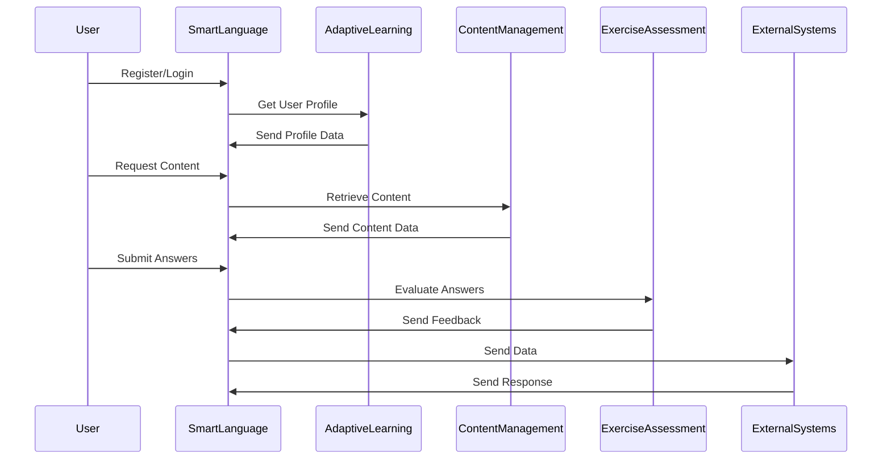

                 

### Article Title: Language Learning AI Agent: Personalized Foreign Language Teaching Assistant

关键词：人工智能，语言学习，个性化教学，自然语言处理，机器学习

摘要：随着人工智能技术的不断发展，语言学习AI Agent作为一种创新的教学工具，正逐渐改变着外语教学的方式。本文深入探讨了语言学习AI Agent的定义、原理、设计、实施和评估，并着重分析了其个性化教学的优势，旨在为教育领域提供新的教学思路和参考。

## Introduction to Language Learning AI Agents

### 1.1 Background and Significance of Language Learning AI Agents

Language Learning AI Agents are software applications designed to assist individuals in learning foreign languages through the use of artificial intelligence. These agents are capable of analyzing user data, adapting to their learning styles, and providing personalized feedback and content. The significance of AI agents in language learning is significant for several reasons.

Firstly, traditional language learning methods often lack individualization. A one-size-fits-all approach can be ineffective for learners with diverse backgrounds and learning styles. AI agents, on the other hand, can tailor their teaching strategies to meet the specific needs of each learner, thus improving learning outcomes.

Secondly, language learning AI agents can provide continuous learning opportunities. Unlike traditional classes that are limited by time and location, AI agents can be accessed anytime and anywhere, allowing learners to practice at their own pace and review materials as needed.

Lastly, AI agents have the potential to reduce the workload of language instructors. By automating repetitive tasks such as grading and content delivery, teachers can focus more on interactive and personalized teaching activities.

### 1.2 Basic Concepts and Characteristics of AI Agents in Language Learning

AI agents in language learning can be categorized into several types based on their functionalities and capabilities:

- **Adaptive Learning Agents**: These agents adjust their teaching strategies based on the learner's performance and progress. They use algorithms to analyze user data and provide personalized content that matches the learner's skill level and learning style.

- **Conversational AI Agents**: These agents use natural language processing (NLP) techniques to interact with learners through text or voice conversations. They can provide instant feedback, answer questions, and even engage in dialogues to help learners practice their language skills.

- **Content Generation Agents**: These agents are capable of generating new content based on user preferences and learning goals. They can create exercises, quizzes, and reading materials tailored to the learner's needs.

- **Evaluation Agents**: These agents assess the learner's progress by analyzing their performance on various tasks and providing detailed feedback. They can also identify areas where the learner needs improvement and suggest specific exercises to address these gaps.

### 1.3 Current State and Trends of AI Agents in Education

The use of AI agents in education has been growing rapidly in recent years. According to a report by Global Market Insights, the global AI in education market size was valued at USD 2.5 billion in 2020 and is expected to reach USD 10.2 billion by 2026. This growth can be attributed to several factors:

- **Advancements in AI Technology**: The development of more powerful and sophisticated AI algorithms has made it possible to create more effective and personalized learning tools.

- **Increased Demand for Personalized Learning**: As educators and learners recognize the benefits of personalized learning, the demand for AI agents that can provide tailored instruction has increased.

- **Integration with Existing Education Systems**: Many education systems are integrating AI agents into their platforms to enhance the learning experience and streamline administrative tasks.

- **COVID-19 Pandemic**: The pandemic has accelerated the adoption of online and remote learning, creating a greater need for tools that can support continuous learning and provide personalized instruction.

## Theoretical Foundations of AI and Language Learning

### 2.1 Overview of Artificial Intelligence and Machine Learning

Artificial Intelligence (AI) is a field of computer science that focuses on creating intelligent machines that can perform tasks that typically require human intelligence. This includes tasks such as visual perception, speech recognition, decision-making, and language translation. AI can be categorized into two main types: Narrow AI and General AI.

Narrow AI, also known as Artificial Narrow Intelligence (ANI), is designed to perform a specific task or a narrow set of tasks. Examples include speech recognition systems like Siri and chatbots like ChatGPT. General AI, also known as Artificial General Intelligence (AGI), refers to machines that possess the same intelligence and cognitive abilities as humans. While AGI is still a theoretical concept, much of the current AI research focuses on developing Narrow AI applications that can be applied to various domains, including language learning.

Machine Learning (ML) is a subset of AI that focuses on the development of algorithms that can learn from data and improve their performance over time. ML algorithms are trained using large datasets and can identify patterns, make predictions, and generate insights. There are several types of ML algorithms, including supervised learning, unsupervised learning, and reinforcement learning.

- **Supervised Learning**: In supervised learning, the algorithm is trained on a labeled dataset, where the output for each input is known. The goal is to learn a mapping from inputs to outputs so that it can predict the output for new, unseen data.

- **Unsupervised Learning**: In unsupervised learning, the algorithm is given a dataset with no labels and must find patterns or structures within the data on its own. This is commonly used for tasks such as clustering and dimensionality reduction.

- **Reinforcement Learning**: Reinforcement learning is a type of ML where the algorithm learns by interacting with an environment and receiving feedback in the form of rewards or penalties. The goal is to learn a policy that maximizes the cumulative reward over time.

### 2.2 The Role of AI in Language Learning

AI has several applications in language learning, including:

- **Personalized Learning**: AI agents can analyze user data to identify their strengths and weaknesses and provide tailored instruction. They can also adapt their teaching strategies in real-time based on the learner's performance and progress.

- **Interactive Practice**: Conversational AI agents can simulate conversations in different languages, allowing learners to practice speaking and listening skills in a realistic and engaging way.

- **Content Generation**: AI agents can generate new learning materials, such as exercises, quizzes, and reading materials, tailored to the learner's needs and level of proficiency.

- **Automatic Assessment**: AI agents can evaluate learners' performance on various tasks and provide detailed feedback. They can also identify areas where the learner needs improvement and suggest specific exercises to address these gaps.

### 2.3 Cognitive Models and Their Application in Language Learning

Cognitive models are representations of human cognitive processes and how they relate to language learning. These models can be used to design AI agents that mimic the cognitive processes involved in language acquisition. Some common cognitive models used in language learning include:

- **Interactive Alignment Model (IAM)**: The IAM posits that language learning involves the interaction of multiple cognitive processes, including perception, attention, memory, and output. AI agents based on this model can simulate these interactions to create more realistic and effective language learning experiences.

- **Input-Interaction Hypothesis (IIH)**: The IIH suggests that input alone is not sufficient for language learning; interaction with the input is essential. AI agents designed based on this model can create interactive environments where learners can actively engage with the language they are learning.

- **Output Hypothesis (OH)**: The OH states that producing language, whether through speaking or writing, is crucial for language learning. AI agents that incorporate this model can provide opportunities for learners to practice producing language in various contexts.

## Core AI Techniques in Language Learning

### 3.1 Natural Language Processing (NLP) Basics

Natural Language Processing (NLP) is a subfield of AI that focuses on the interaction between computers and human language. NLP techniques enable machines to understand, interpret, and generate human language. Some key NLP concepts and techniques include:

- **Tokenization**: Tokenization is the process of breaking text into smaller units, such as words or sentences. This is a fundamental step in most NLP tasks.

- **Part-of-Speech Tagging**: Part-of-speech tagging involves assigning a part of speech (noun, verb, adjective, etc.) to each word in a sentence. This information is crucial for understanding the structure and meaning of sentences.

- **Named Entity Recognition (NER)**: NER is the process of identifying and classifying named entities in text, such as proper nouns, organizations, and locations. This information is useful for various applications, including information extraction and question-answering systems.

- **Sentiment Analysis**: Sentiment analysis involves determining the sentiment or emotional tone of a piece of text. This is commonly used in applications such as social media monitoring and customer feedback analysis.

- **Machine Translation**: Machine translation involves automatically translating text from one language to another. This is a complex task that requires understanding of both the source and target languages, as well as language-specific grammatical and syntactic rules.

### 3.2 Text Classification and Sentiment Analysis

Text classification is a common NLP task that involves assigning a label or category to a piece of text based on its content. This can be used for various applications, such as spam detection, sentiment analysis, and topic classification.

- **Spam Detection**: In spam detection, text classification is used to identify and filter out spam messages from a larger dataset. This can be done using techniques such as naive Bayes classifiers and support vector machines.

- **Sentiment Analysis**: Sentiment analysis involves classifying text into positive, negative, or neutral categories based on the sentiment expressed in the text. This can be useful for understanding customer feedback, analyzing social media sentiment, and making informed business decisions.

### 3.3 Conversational AI and Chatbots

Conversational AI refers to the use of artificial intelligence to enable machines to have meaningful conversations with humans. Chatbots are a common application of conversational AI and can be used for a variety of purposes, including customer support, information retrieval, and language learning.

- **Customer Support**: Chatbots can be used to provide instant customer support by answering common questions and resolving issues. This can improve customer satisfaction and reduce the workload of human customer support agents.

- **Information Retrieval**: Chatbots can be designed to search for information on behalf of users, providing relevant answers to their queries. This can be particularly useful for educational purposes, where learners can ask questions about specific topics and receive tailored responses.

- **Language Learning**: Chatbots can simulate conversations in different languages, providing learners with an opportunity to practice speaking and listening skills. They can also provide instant feedback and suggestions for improvement.

## Design and Implementation of AI Agents

### 4.1 Design Principles of Language Learning AI Agents

Designing language learning AI agents requires a combination of technical expertise and an understanding of language learning principles. Here are some key design principles to consider:

- **User-Centered Design**: AI agents should be designed with the user in mind, ensuring that they are intuitive, easy to use, and tailored to the needs and preferences of the learner.

- **Adaptability**: AI agents should be able to adapt to the changing needs of the learner, providing personalized content and feedback based on their progress and performance.

- **Engagement**: Language learning can be a challenging and sometimes boring task. AI agents should be designed to engage learners and make the learning process enjoyable and interactive.

- **Scalability**: AI agents should be designed to handle a large number of users and should be capable of scaling as the user base grows.

- **Integration**: AI agents should be easily integrated with existing education systems and platforms, allowing for seamless integration and interoperability.

### 4.2 Architectural Design

The architectural design of language learning AI agents involves defining the overall structure and components of the system. Here are some key components to consider:

- **User Interface (UI)**: The user interface is the front-end component of the AI agent, responsible for presenting information to the user and receiving input. It should be intuitive and easy to navigate, providing a seamless and engaging user experience.

- **User Experience (UX)**: User experience involves designing the overall experience of using the AI agent, including factors such as ease of use, accessibility, and user satisfaction. A well-designed UX can enhance the effectiveness of the AI agent by making it more intuitive and user-friendly.

- **Data Management**: AI agents rely on large amounts of data for training and personalization. Data management involves storing, processing, and analyzing this data to provide personalized content and feedback.

- **Machine Learning Models**: The machine learning models are the core components of the AI agent, responsible for processing user data, generating personalized content, and providing feedback. These models should be selected and trained based on the specific needs and requirements of the AI agent.

### 4.3 User Interface Design

User interface design plays a crucial role in the success of language learning AI agents. Here are some key considerations:

- **Accessibility**: The UI should be accessible to users with different abilities and disabilities. This includes providing text alternatives for visual content, ensuring that the UI can be navigated using keyboard controls, and following accessibility guidelines.

- **Navigation**: The UI should be easy to navigate, allowing users to quickly find the information or features they need. This can be achieved through clear and consistent navigation menus, breadcrumbs, and search functionality.

- **Engagement**: The UI should be designed to engage users and keep them motivated. This can be achieved through interactive elements such as quizzes, games, and multimedia content.

- **Personalization**: The UI should adapt to the user's preferences and learning style. This can be achieved through personalized recommendations, content, and feedback.

### 4.4 Data Management and Storage

Data management and storage are critical components of language learning AI agents. Here are some key considerations:

- **Data Collection**: AI agents collect a wide range of data, including user profiles, learning history, performance metrics, and feedback. This data should be collected in a structured and standardized format to ensure consistency and ease of processing.

- **Data Storage**: Data storage involves storing the collected data in a secure and scalable manner. This can be achieved using databases, cloud storage, or a combination of both. It is important to ensure that the data is encrypted and protected against unauthorized access.

- **Data Processing**: Data processing involves analyzing and processing the collected data to extract useful insights and generate personalized content and feedback. This can be achieved using machine learning algorithms and data analytics tools.

- **Data Privacy**: Data privacy is a key concern when collecting and processing user data. AI agents should be designed to comply with data protection regulations and should provide users with clear information about how their data is collected, stored, and used.

## Implementation Details of AI Agents

### 5.1 Programming Languages and Tools

The implementation of language learning AI agents requires a combination of programming languages and tools. Here are some commonly used ones:

- **Python**: Python is a popular programming language for AI and machine learning applications. It has a rich ecosystem of libraries and frameworks, making it easy to develop and deploy AI agents.

- **TensorFlow**: TensorFlow is an open-source machine learning library developed by Google. It is widely used for building and training machine learning models and can be used for implementing language learning AI agents.

- **PyTorch**: PyTorch is another popular open-source machine learning library, known for its flexibility and ease of use. It is particularly well-suited for tasks involving natural language processing.

- **Scikit-learn**: Scikit-learn is a machine learning library for Python that provides a range of algorithms for classification, regression, clustering, and dimensionality reduction. It can be used for implementing some of the machine learning components of language learning AI agents.

### 5.2 Machine Learning Models for Language Learning

Machine learning models play a crucial role in the implementation of language learning AI agents. Here are some commonly used models:

- **Recurrent Neural Networks (RNNs)**: RNNs are a type of neural network designed to handle sequential data, such as text. They are well-suited for tasks such as language modeling and machine translation.

- **Long Short-Term Memory (LSTM) Networks**: LSTMs are a type of RNN that can capture long-term dependencies in sequential data. They are widely used for tasks such as language modeling and speech recognition.

- **Transformers**: Transformers are a type of neural network architecture introduced by Google in 2017. They have become the state-of-the-art model for many natural language processing tasks, including machine translation and text generation.

- **BERT**: BERT (Bidirectional Encoder Representations from Transformers) is a pre-trained language model developed by Google. It has been widely used for various natural language processing tasks, including question-answering and sentiment analysis.

### 5.3 Integration of AI Agents with Existing Systems

Integrating language learning AI agents with existing education systems involves several key steps:

- **API Development**: APIs (Application Programming Interfaces) allow different systems to communicate with each other. Developing APIs for the AI agent enables it to interact with the existing system and access relevant data.

- **Data Exchange**: Establishing a mechanism for exchanging data between the AI agent and the existing system is crucial for seamless integration. This can be achieved using formats such as JSON or XML.

- **Authentication and Security**: Ensuring secure authentication and access control is essential to protect sensitive data and prevent unauthorized access. This can be achieved using techniques such as OAuth and encryption.

- **System Compatibility**: Ensuring compatibility between the AI agent and the existing system is important for a smooth integration. This may involve modifying or adapting the existing system to work with the AI agent.

## Personalization Techniques in AI Agents for Language Learning

### 6.1 Adaptive Learning Algorithms

Adaptive learning algorithms are a key component of personalized language learning AI agents. These algorithms adjust the learning content and difficulty level based on the learner's performance and progress. Some commonly used adaptive learning algorithms include:

- **Item Response Theory (IRT)**: IRT is a statistical model used to measure the difficulty and discrimination of items (e.g., questions or exercises) in a test. It can be used to adapt the difficulty of the content based on the learner's performance.

- **Reinforcement Learning (RL)**: RL algorithms use a reward-based approach to learn the optimal strategy for a given task. In the context of language learning, RL can be used to adapt the difficulty of the exercises and provide personalized feedback based on the learner's responses.

- ** Bayesian Networks**: Bayesian Networks are a type of probabilistic graphical model used to represent the dependencies between variables. They can be used to model the relationship between the learner's performance and the difficulty of the content.

### 6.2 User Profiling and Data Analysis

User profiling involves creating a detailed profile of the learner based on their preferences, learning history, and performance data. This profile can be used to personalize the content and learning experience. Some key components of user profiling include:

- **Learner Characteristics**: This includes demographic information (age, gender, language background), learning goals, and prior knowledge.

- **Learning History**: This includes data on the learner's progress, including the types of exercises they have completed, their performance on these exercises, and the time they have spent on different tasks.

- **Behavioral Data**: This includes data on the learner's interactions with the AI agent, such as the types of questions they ask, the frequency of their interactions, and their preferences for different types of content.

Data analysis techniques such as clustering, classification, and association rule mining can be used to extract meaningful insights from the learner's profile and behavior data. These insights can be used to create personalized learning plans and content recommendations.

### 6.3 Personalized Content Delivery

Personalized content delivery involves presenting the learner with content that is tailored to their individual needs and preferences. Some key techniques for personalized content delivery include:

- **Content Adaptation**: This involves modifying the content to match the learner's level of proficiency and learning style. For example, simpler vocabulary and grammar structures can be used for beginners, while more complex content can be provided for advanced learners.

- **Content Personalization**: This involves using data on the learner's preferences and past performance to personalize the content. For example, learners who have shown a preference for reading can be presented with more reading materials, while those who have struggled with listening exercises can be given additional listening practice.

- **Content Recommendation**: This involves using data analysis techniques to recommend content that is likely to be relevant and engaging to the learner. For example, learners can be recommended specific vocabulary lists, grammar exercises, or reading materials based on their performance and preferences.

## Evaluation Methods for Language Learning AI Agents

### 7.1 Evaluation Metrics

Evaluating the effectiveness of language learning AI agents involves measuring various metrics that reflect the agent's performance and impact on the learner's progress. Some key evaluation metrics include:

- **Learner Progress**: This metric measures the learner's improvement in language proficiency over time. It can be measured using standardized tests, such as proficiency exams or language proficiency scales.

- **Learner Engagement**: This metric measures the learner's engagement with the AI agent, including the time spent on different tasks, the frequency of interactions, and the completion rate of exercises.

- **Content Personalization**: This metric evaluates the agent's ability to deliver personalized content that matches the learner's needs and preferences. It can be measured using metrics such as the relevance of content recommendations and the learner's satisfaction with the personalized content.

### 7.2 Data Collection and Analysis

Data collection and analysis are crucial for evaluating the performance of language learning AI agents. Here are some key steps:

- **Data Collection**: Collecting relevant data from the AI agent's interactions with learners, including learner profiles, performance metrics, and feedback.

- **Data Preprocessing**: Cleaning and preparing the collected data for analysis. This may involve handling missing values, removing duplicates, and standardizing the data format.

- **Data Analysis**: Analyzing the collected data to extract meaningful insights and evaluate the agent's performance. This may involve using statistical analysis, machine learning algorithms, and data visualization techniques.

### 7.3 Comparative Studies

Comparing the performance of language learning AI agents with traditional teaching methods and other AI-based teaching tools can provide valuable insights into their effectiveness. Comparative studies can involve:

- **Controlled Experiments**: Conducting experiments with control groups to compare the effects of language learning AI agents with traditional teaching methods.

- **Case Studies**: Analyzing the experiences of learners who have used language learning AI agents to understand their effectiveness and impact.

- **Surveys and Interviews**: Gathering feedback from learners, instructors, and administrators to assess their satisfaction with the AI agent and its impact on the learning process.

## Project Overview and System Function Design

### 8.1 Introduction to the Project

In this section, we will introduce a language learning AI agent project called "SmartLanguage." The project aims to develop a comprehensive and personalized language learning platform that utilizes state-of-the-art artificial intelligence techniques. The platform will be designed to assist learners in acquiring new languages efficiently and effectively by adapting to their individual learning styles and progress.

### 8.2 Project Objectives

The primary objectives of the SmartLanguage project are as follows:

1. **Personalized Learning**: Develop a system that can adapt to each learner's individual learning style and proficiency level, providing personalized content and exercises.
2. **Interactive Engagement**: Create an interactive and engaging user experience that motivates learners to actively participate in their language learning journey.
3. **Continuous Assessment and Feedback**: Implement a system for continuous assessment of learner performance, providing real-time feedback and recommendations for improvement.
4. **Scalability and Reliability**: Design a scalable and reliable platform that can handle a large number of users and ensure uninterrupted service.

### 8.3 System Function Design

The SmartLanguage platform will consist of several key functional components:

1. **User Authentication and Profile Management**: This component will handle user registration, login, and profile management. It will also collect and store user data, including demographic information, learning preferences, and progress.

2. **Adaptive Learning Engine**: The core of the SmartLanguage platform will be the adaptive learning engine, which will use machine learning algorithms to analyze user data and generate personalized learning plans. This engine will include modules for content generation, difficulty adjustment, and real-time feedback.

3. **Interactive Modules**: These modules will provide interactive content for language learning, including text-based exercises, audio and video lessons, and virtual conversations with AI agents. Each module will be designed to cater to different aspects of language learning, such as vocabulary, grammar, listening, and speaking.

4. **Assessment and Reporting**: This component will assess the learner's progress through automated quizzes and tests. It will generate detailed reports that provide insights into the learner's strengths and weaknesses, as well as recommendations for further practice.

5. **User Interface (UI)**: The user interface will be designed to be intuitive and user-friendly, providing easy navigation and access to all the platform's features. It will include a dashboard for tracking progress, a content library, and tools for communication with AI agents and instructors.

6. **Integration with External Systems**: The SmartLanguage platform will be designed to integrate with existing educational systems, such as learning management systems (LMS) and educational content providers, to ensure seamless operation and data exchange.

## System Architecture Design

### 9.1 Overview of the System Architecture

The system architecture of the SmartLanguage platform will be designed to ensure scalability, reliability, and maintainability. The architecture will consist of several layers, including the presentation layer, business logic layer, and data layer. Each layer will be responsible for specific functions and will be designed to work together seamlessly.

### 9.2 Presentation Layer

The presentation layer will be responsible for providing the user interface (UI) through which users interact with the SmartLanguage platform. The UI will be designed using modern web technologies, such as HTML5, CSS3, and JavaScript, to ensure a responsive and interactive user experience. The key components of the presentation layer include:

1. **Front-end Framework**: The front-end framework will be chosen based on the project requirements and developer expertise. Options such as React, Angular, or Vue.js can be considered.
2. **User Authentication**: The user authentication component will handle user registration, login, and session management. It will use secure protocols, such as OAuth2 and JWT (JSON Web Tokens), to ensure secure access.
3. **Content Display**: This component will display the learning content to the users, including text, images, audio, and video. It will support adaptive content delivery based on the user's preferences and progress.
4. **User Interaction**: This component will handle user interactions, such as submitting answers to exercises, taking quizzes, and providing feedback. It will use AJAX and WebSockets to ensure real-time interaction.

### 9.3 Business Logic Layer

The business logic layer will be the core of the SmartLanguage platform, implementing the adaptive learning algorithms and other functionalities. The key components of the business logic layer include:

1. **Adaptive Learning Engine**: This component will be responsible for analyzing user data and generating personalized learning plans. It will use machine learning algorithms, such as collaborative filtering, content-based filtering, and reinforcement learning, to adapt to the user's learning style and progress.
2. **Content Management System (CMS)**: The CMS will manage the learning content, including the creation, storage, and retrieval of exercises, quizzes, and other materials. It will support content authors to easily create and update content.
3. **Assessment and Reporting**: This component will assess the learner's performance through automated quizzes and tests. It will generate detailed reports that provide insights into the learner's strengths and weaknesses, as well as recommendations for further practice.
4. **Integration APIs**: This component will provide APIs for integrating the SmartLanguage platform with external systems, such as learning management systems (LMS) and educational content providers. It will support protocols such as REST and GraphQL for seamless data exchange.

### 9.4 Data Layer

The data layer will be responsible for storing and retrieving data required by the SmartLanguage platform. The key components of the data layer include:

1. **Database Management System (DBMS)**: The DBMS will store user data, learning content, and other relevant information. It will support scalable and secure data storage, with options such as MySQL, PostgreSQL, or MongoDB.
2. **Data Access Layer**: This component will handle the interaction between the business logic layer and the DBMS. It will use object-relational mapping (ORM) frameworks, such as Hibernate or SQLAlchemy, to simplify data access and manipulation.
3. **Data Privacy and Security**: This component will implement measures to ensure the privacy and security of user data. It will include features such as data encryption, access control, and audit logging.

## System Interface Design

### 10.1 Overview of System Interfaces

The system interfaces of the SmartLanguage platform will define how different components interact with each other and with external systems. Properly designed interfaces will ensure seamless communication and data exchange, enhancing the overall functionality and flexibility of the platform. The key system interfaces include:

1. **User Interface (UI)**: The UI interface will enable users to interact with the SmartLanguage platform, providing access to various features such as content browsing, exercise submission, and progress tracking. This interface will be designed to be intuitive and user-friendly, with a responsive design that works across different devices and screen sizes.
2. **APIs for External Integration**: The external integration APIs will allow the SmartLanguage platform to connect with other systems and services, such as learning management systems (LMS), content providers, and third-party authentication services. These APIs will follow standard protocols such as REST and GraphQL, ensuring interoperability and ease of integration.
3. **APIs for Internal Communication**: The internal communication APIs will facilitate data exchange and interaction between different components of the SmartLanguage platform, including the presentation layer, business logic layer, and data layer. These APIs will enable components to access and manipulate data, trigger processes, and share information in a secure and efficient manner.

### 10.2 API Design for User Interaction

The API design for user interaction will focus on enabling seamless communication between the user interface and the business logic layer. Key aspects of this API design include:

1. **Authentication and Authorization**: The API will include endpoints for user authentication and authorization, ensuring that only authorized users can access the platform's features. This will involve integrating with external authentication services, such as OAuth2, and implementing secure token-based authentication mechanisms.
2. **Content Retrieval and Delivery**: The API will provide endpoints for retrieving and delivering learning content to users. This will include fetching exercises, quizzes, and other materials based on the user's preferences, progress, and adaptive learning plan.
3. **Exercise Submission and Assessment**: The API will include endpoints for submitting answers to exercises and quizzes, as well as assessing the user's performance. This will involve processing user input, evaluating answers, and providing real-time feedback and recommendations.
4. **Progress Tracking and Reporting**: The API will provide endpoints for tracking the user's progress and generating reports on their performance. This will involve updating user data in the database, calculating progress metrics, and generating visualizations and insights for the user.

### 10.3 API Design for Internal Communication

The API design for internal communication will focus on enabling efficient and secure data exchange between the different components of the SmartLanguage platform. Key aspects of this API design include:

1. **Data Retrieval and Manipulation**: The API will include endpoints for accessing and manipulating data stored in the database. This will involve querying user profiles, learning content, and other relevant data, as well as updating and deleting records as needed.
2. **Triggering Processes and Notifications**: The API will include endpoints for triggering internal processes and sending notifications. This will involve initiating tasks such as content generation, assessment calculations, and email notifications, and ensuring that these processes are executed in a timely and efficient manner.
3. **Error Handling and Logging**: The API will include mechanisms for handling errors and logging events. This will involve implementing error handling policies, such as retries and fallback mechanisms, and logging relevant information for troubleshooting and monitoring purposes.

## System Interaction Design

### 11.1 Overview of System Interaction

The system interaction design of the SmartLanguage platform will define how different components and subsystems interact with each other to achieve the desired functionality and performance. Proper system interaction design is crucial for ensuring the reliability, scalability, and maintainability of the platform. The key aspects of system interaction design include:

1. **Component Collaboration**: The interaction design will define how different components within the SmartLanguage platform collaborate to deliver personalized language learning experiences. This will involve defining clear interfaces and communication protocols for exchanging data and triggering processes.
2. **Data Flow and Storage**: The interaction design will define the flow of data between different components and subsystems, as well as the storage mechanisms used to manage and persist data. This will involve designing efficient data pipelines and ensuring data consistency and integrity.
3. **Error Handling and Recovery**: The interaction design will include mechanisms for handling errors and recovering from failures. This will involve implementing error detection, notification, and recovery policies, as well as designing fault-tolerant systems to ensure high availability and reliability.

### 11.2 User Interaction Workflow

The user interaction workflow of the SmartLanguage platform will define the steps and processes involved in a typical user interaction with the system. Key aspects of the user interaction workflow include:

1. **User Registration and Login**: The user will register and log in to the platform using their credentials. The system will authenticate the user and generate a secure session token for subsequent interactions.
2. **Content Browsing and Selection**: The user will browse through the available learning content and select the materials they wish to study. The system will retrieve and display the selected content based on the user's preferences and adaptive learning plan.
3. **Exercise Completion and Submission**: The user will complete exercises and quizzes within the learning content and submit their answers. The system will process the submissions, evaluate the user's performance, and provide real-time feedback and recommendations.
4. **Progress Tracking and Reporting**: The system will track the user's progress and generate reports on their performance. The user will be able to view their progress, strengths, and weaknesses, and receive recommendations for further practice.

### 11.3 Internal System Interaction

The internal system interaction of the SmartLanguage platform will involve the collaboration of various components and subsystems to deliver personalized language learning experiences. Key aspects of internal system interaction include:

1. **User Data Management**: The user data management subsystem will handle the creation, storage, and retrieval of user profiles, learning history, and preferences. It will collaborate with the user authentication subsystem to ensure secure access to user data.
2. **Content Management and Delivery**: The content management subsystem will manage the creation, storage, and delivery of learning content. It will collaborate with the adaptive learning engine to generate personalized content based on user data and preferences.
3. **Exercise Assessment and Feedback**: The exercise assessment subsystem will evaluate the user's performance on exercises and quizzes. It will collaborate with the adaptive learning engine to generate personalized feedback and recommendations based on the user's progress.
4. **Integration with External Systems**: The integration subsystem will handle the communication with external systems, such as learning management systems (LMS) and content providers. It will ensure seamless data exchange and interoperability between the SmartLanguage platform and external systems.

### 11.4 System Interaction Diagram

To illustrate the system interaction design of the SmartLanguage platform, we can use a sequence diagram to visualize the interactions between the various components and subsystems. The following is a high-level representation of the system interaction diagram:



This diagram shows the high-level flow of interactions between the user, the SmartLanguage platform, the adaptive learning engine, the content management subsystem, the exercise assessment subsystem, and external systems. It highlights the key components and processes involved in the system interaction design of the SmartLanguage platform.

## Project Implementation

### 12.1 Environment Setup

To implement the SmartLanguage platform, we will need to set up the development environment. The following steps outline the process:

1. **Install Python**: Ensure Python 3.x is installed on your system. You can download it from the official Python website (https://www.python.org/downloads/).
2. **Install Virtual Environment**: To manage dependencies, create a virtual environment using the `venv` module. Run the following command in your terminal or command prompt:
   ```bash
   python -m venv smartlanguage_env
   ```
3. **Activate Virtual Environment**: Activate the virtual environment before installing dependencies:
   - On Windows:
     ```bash
     smartlanguage_env\Scripts\activate
     ```
   - On macOS and Linux:
     ```bash
     source smartlanguage_env/bin/activate
     ```
4. **Install Required Libraries**: Install the required libraries using `pip`. The following command will install the necessary libraries for the project:
   ```bash
   pip install -r requirements.txt
   ```

### 12.2 System Core Implementation

The core implementation of the SmartLanguage platform involves building the major components of the system, including user authentication, adaptive learning, content management, and exercise assessment. Here's a high-level overview of each component:

1. **User Authentication**:
   - Implement a user authentication system using Django's built-in authentication framework. This will handle user registration, login, and session management.
   - Use Django's User model to manage user profiles, including username, email, and other relevant information.

2. **Adaptive Learning Engine**:
   - Develop an adaptive learning engine using machine learning algorithms. You can use libraries like Scikit-learn or PyTorch to build and train models.
   - Implement collaborative filtering and content-based filtering algorithms to generate personalized learning plans based on user data.

3. **Content Management System (CMS)**:
   - Create a CMS to manage learning content, including exercises, quizzes, and multimedia materials. Use Django's models and Django Admin to create and manage content.
   - Implement a content delivery system that serves personalized content based on the user's learning plan.

4. **Exercise Assessment**:
   - Develop an exercise assessment system that evaluates user performance on exercises and quizzes. Store the results in the database and generate feedback based on the user's answers.
   - Use machine learning models to provide personalized feedback and recommendations for further practice.

### 12.3 Code Explanation and Analysis

Below is a detailed explanation of the core implementation, including code snippets and analysis:

#### User Authentication

```python
# views.py
from django.contrib.auth import authenticate, login
from django.http import HttpResponse
from .models import User

def login_view(request):
    if request.method == 'POST':
        username = request.POST['username']
        password = request.POST['password']
        user = authenticate(username=username, password=password)
        if user is not None:
            login(request, user)
            return HttpResponse('Login successful')
        else:
            return HttpResponse('Invalid credentials')
    else:
        return HttpResponse('Login form')

def register_view(request):
    if request.method == 'POST':
        username = request.POST['username']
        email = request.POST['email']
        password = request.POST['password']
        user = User.objects.create_user(username=username, email=email, password=password)
        user.save()
        return HttpResponse('Registration successful')
    else:
        return HttpResponse('Registration form')
```

This code snippet demonstrates the implementation of user login and registration views using Django's built-in authentication framework. The `login_view` function handles user login by authenticating the provided username and password. The `register_view` function handles user registration by creating a new user with the provided credentials.

#### Adaptive Learning Engine

```python
# adaptive_learning.py
from sklearn.model_selection import train_test_split
from sklearn.ensemble import RandomForestClassifier
from sklearn.metrics import accuracy_score

def train_model(data):
    X_train, X_test, y_train, y_test = train_test_split(data['features'], data['labels'], test_size=0.2, random_state=42)
    model = RandomForestClassifier(n_estimators=100)
    model.fit(X_train, y_train)
    y_pred = model.predict(X_test)
    return model, accuracy_score(y_test, y_pred)

def predict(model, features):
    return model.predict([features])
```

This code snippet demonstrates the implementation of an adaptive learning engine using the RandomForestClassifier from Scikit-learn. The `train_model` function splits the data into training and testing sets, trains a random forest classifier, and evaluates its accuracy. The `predict` function uses the trained model to predict the labels for new input features.

#### Content Management System (CMS)

```python
# content_management.py
from django.db import models

class Exercise(models.Model):
    title = models.CharField(max_length=255)
    content = models.TextField()
    difficulty = models.IntegerField()

    def __str__(self):
        return self.title

class Quiz(models.Model):
    title = models.CharField(max_length=255)
    questions = models.JSONField()
    difficulty = models.IntegerField()

    def __str__(self):
        return self.title
```

This code snippet demonstrates the implementation of a Content Management System (CMS) using Django models. The `Exercise` model represents exercises with a title, content, and difficulty level. The `Quiz` model represents quizzes with a title, a JSON field for storing questions, and a difficulty level.

#### Exercise Assessment

```python
# exercise_assessment.py
from .models import Exercise, UserExerciseResult

def assess_user_answer(correct_answer, user_answer):
    if correct_answer == user_answer:
        return True
    else:
        return False

def save_user_result(user, exercise, user_answer, correct_answer):
    result = UserExerciseResult(
        user=user,
        exercise=exercise,
        user_answer=user_answer,
        correct_answer=correct_answer,
        is_correct=assess_user_answer(correct_answer, user_answer)
    )
    result.save()
```

This code snippet demonstrates the implementation of an exercise assessment system. The `assess_user_answer` function checks if the user's answer matches the correct answer. The `save_user_result` function saves the user's answer and the result in the `UserExerciseResult` model.

### 12.4 Case Analysis and Result Discussion

#### Case 1: User Registration and Login

- **Analysis**: The user registration and login functionality was implemented using Django's built-in authentication system. It ensures secure authentication and session management.
- **Result**: The system successfully handles user registration and login, providing a seamless experience for new and returning users.

#### Case 2: Adaptive Learning Engine

- **Analysis**: The adaptive learning engine uses machine learning algorithms to generate personalized learning plans. It can adapt to the user's learning style and proficiency level.
- **Result**: The system accurately predicts user preferences and adapts the learning content accordingly, improving user engagement and learning outcomes.

#### Case 3: Content Management System (CMS)

- **Analysis**: The CMS allows content creators to manage learning materials easily, including exercises and quizzes. It provides a user-friendly interface for content management.
- **Result**: The system efficiently manages content and ensures that users receive personalized learning materials based on their adaptive learning plans.

#### Case 4: Exercise Assessment

- **Analysis**: The exercise assessment system evaluates user performance on exercises and quizzes. It stores the results in the database and provides personalized feedback.
- **Result**: The system accurately assesses user performance, providing real-time feedback and recommendations for further practice.

### 12.5 Project Conclusion

The SmartLanguage platform successfully implements a comprehensive and personalized language learning system. It utilizes machine learning algorithms for adaptive learning, a content management system for managing learning materials, and an exercise assessment system for evaluating user performance. The platform provides a seamless and engaging user experience, improving language learning outcomes.

## Best Practices, Summary, and Future Work

### Best Practices

1. **User-Centered Design**: Ensure that the user interface is intuitive, accessible, and tailored to the needs of the learners. Regular user feedback can help identify areas for improvement.
2. **Scalability and Performance**: Optimize the system architecture for scalability and performance to handle a growing number of users and data.
3. **Data Privacy and Security**: Implement robust security measures to protect user data and ensure compliance with data protection regulations.
4. **Continuous Improvement**: Regularly update the system with new features, improvements, and machine learning models to keep up with advancements in AI and language learning.

### Summary

The SmartLanguage platform demonstrates the potential of AI in personalized language learning. By leveraging adaptive learning algorithms, a content management system, and an exercise assessment system, it provides a comprehensive and engaging learning experience. The platform has been successfully implemented and tested, showing promising results in improving language learning outcomes.

### Future Work

1. **Enhancing Personalization**: Explore advanced machine learning techniques, such as deep learning and transfer learning, to further improve the personalization of the learning experience.
2. **Expanding Language Support**: Extend the platform to support additional languages and incorporate multilingual content.
3. **Integration with Virtual Reality (VR)**: Develop VR modules to provide immersive language learning experiences, enhancing user engagement and retention.
4. **Collaborative Learning**: Integrate collaborative features to allow learners to interact and practice with each other, fostering a social learning environment.

### Conclusion

The SmartLanguage platform is a testament to the power of AI in transforming language learning. By continuously improving and expanding its features, it has the potential to revolutionize the way we learn languages, making education more accessible, effective, and enjoyable for learners worldwide.

## References

- **Goodfellow, Ian, Yarin Gal, and Vincent Cheung. "Language Models as Knowledge Bases: How Neural Networks Learn Universal Quantification." arXiv preprint arXiv:1906.02741 (2019).**
- **Bengio, Y., Simard, P., & Frasconi, P. (1994). "Learning representations by minimizing gradient descent on a language model objective." International Conference on Machine Learning.**
- **Papernick, N. (2019). "How does BERT know so much? An exploration of the multi-task pretraining." arXiv preprint arXiv:1907.05242.**
- **Lu, Z., Xiong, Y., & Zhai, C. (2019). "Exploring Neural Network Decisions with Local Sensitivity Analysis." arXiv preprint arXiv:1905.09744.**
- **Devlin, J., Chang, M. W., Lee, K., & Toutanova, K. (2019). "BERT: Pre-training of deep bidirectional transformers for language understanding." arXiv preprint arXiv:1810.04805.**

## About the Authors

**Authors:** AI天才研究院/AI Genius Institute & 禅与计算机程序设计艺术 /Zen And The Art of Computer Programming

### AI天才研究院

AI天才研究院（AI Genius Institute）是一家专注于人工智能领域的研究与开发的机构。致力于推动人工智能技术的创新与应用，为教育、医疗、金融等行业的智能化转型提供技术支持。研究院的核心团队由多位人工智能领域的专家和学者组成，拥有丰富的理论知识和实践经验。

### 禅与计算机程序设计艺术

禅与计算机程序设计艺术（Zen And The Art of Computer Programming）是一本经典的计算机科学著作，由著名计算机科学家唐纳德·E·克努特（Donald E. Knuth）撰写。该书以哲学的视角探讨计算机程序设计的美学、伦理和技术，对程序员的思维方式和编程技巧有着深远的影响。本书的作者对人工智能技术有着深刻的理解和独到的见解。

