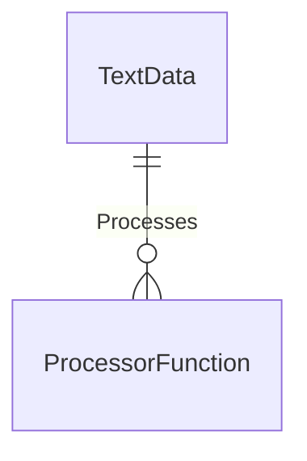
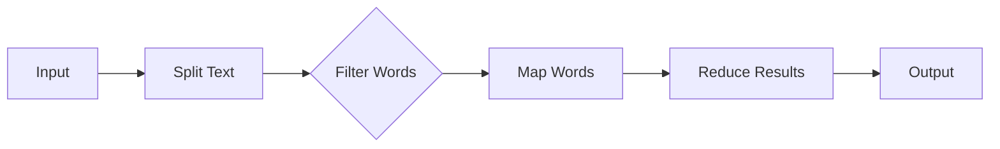

                 


# 语言游戏的开放性与函数组合：维特根斯坦的语言观与FP中的函数组合技术

> 关键词：维特根斯坦、语言游戏、函数组合、函数式编程、编程哲学

> 摘要：本文将深入探讨哲学家路德维希·维特根斯坦的语言观与函数式编程（FP）中的函数组合技术之间的联系。通过分析维特根斯坦的语言游戏理论，本文揭示了语言游戏的开放性如何影响程序设计的灵活性和模块化。同时，本文将介绍FP中的函数组合技术，并探讨其在实际编程中的应用。

## 引言

语言游戏的概念源于哲学家路德维希·维特根斯坦（Ludwig Wittgenstein）的哲学思想，他在其著作《逻辑哲学论》（Tractatus Logico-Philosophicus）和《哲学研究》（Philosophical Investigations）中详细阐述了这一概念。语言游戏不仅仅是一种游戏，更是一种对语言的深刻理解。维特根斯坦认为，语言的使用是多种多样的，每一种语言使用都对应着一种特定的“游戏规则”。理解语言的关键在于理解这些规则。

函数组合技术是函数式编程（Functional Programming，FP）的核心概念之一。在FP中，函数被视为第一类对象，可以通过组合和嵌套来构建复杂的功能。函数组合技术使得程序设计变得更加模块化，易于理解和维护。

本文旨在探讨语言游戏的开放性与函数组合技术之间的关系。通过深入研究维特根斯坦的语言观，我们希望揭示语言游戏如何影响函数组合技术的设计和应用。同时，本文也将介绍FP中的函数组合技术，分析其在实际编程中的应用场景。

## 第1章 维特根斯坦的语言观

### 1.1 语言游戏的定义

#### 1.1.1 语言游戏的定义

在《哲学研究》中，维特根斯坦将语言的使用比喻为游戏。他认为，语言游戏是语言使用的本质。语言游戏不仅仅是一种游戏，更是一种对语言的深刻理解。每一个语言游戏都有一套特定的规则，这些规则决定了语言的使用方式。

维特根斯坦认为，语言游戏可以分为两类：私人语言和公共语言。私人语言是个人使用的语言，例如个人内心的感受和想法。而公共语言是人们共同使用的语言，例如科学语言、日常语言等。

#### 1.1.2 语言的局限性

维特根斯坦指出，语言有其局限性。语言不能表达一切，有些概念和经验是无法用语言来描述的。例如，个人的内心感受和经验是私人的，无法用语言准确表达。因此，语言游戏的规则也有限制。

#### 1.1.3 语言游戏的多面性

维特根斯坦认为，语言游戏是多面的。不同的语言游戏有不同的规则，不同的语言游戏有不同的目的。例如，科学语言游戏用于科学研究，日常语言游戏用于日常交流。

#### 1.1.4 语言与生活的关联

维特根斯坦指出，语言与生活密切相关。语言是我们生活的工具，我们通过语言来交流、思考和解决问题。语言游戏不仅是一种哲学思考，更是我们生活的体现。

### 1.2 维特根斯坦的早期思想

#### 1.2.1 《逻辑哲学论》

在《逻辑哲学论》中，维特根斯坦提出了图像理论。他认为，语言与世界的对应关系就像图像与世界的关系一样。图像可以准确地反映世界，语言也可以准确地反映现实。

#### 1.2.2 图像理论

图像理论认为，语言的每一个符号都对应着世界的某一个方面，语言的真值取决于符号与世界之间的对应关系。这种对应关系是直接的，不需要任何中介。

#### 1.2.3 语言与世界的关系

维特根斯坦认为，语言与世界的关系是符号与对象之间的关系。语言符号代表现实世界的对象，语言表达现实世界的概念。

### 1.3 维特根斯坦的晚期思想

#### 1.3.1 《哲学研究》

在《哲学研究》中，维特根斯坦提出了日常语言哲学。他认为，日常语言是人们日常生活中使用的语言，是我们理解世界的工具。

#### 1.3.2 日常语言哲学

日常语言哲学认为，日常语言的使用规则是人们通过生活经验形成的。语言的意义取决于人们如何使用它，而不是语言符号本身。

#### 1.3.3 语言游戏的多样性和开放性

维特根斯坦认为，语言游戏是多样化的，不同的语言游戏有不同的规则和目的。语言游戏是开放的，人们可以根据需要创造出新的语言游戏。

## 第2章 函数组合技术基础

### 2.1 函数式编程的基本概念

#### 2.1.1 函数作为第一类对象

在函数式编程中，函数被视为第一类对象，可以像任何其他数据类型一样进行操作。这意味着函数可以被赋值给变量，可以作为参数传递给其他函数，也可以作为返回值返回。

#### 2.1.2 高阶函数

高阶函数是接受函数作为参数或将函数作为返回值的函数。这种函数组合技术使得编程更加模块化和可复用。

#### 2.1.3 函数组合

函数组合是将多个函数组合在一起，以实现更复杂的功能。函数组合技术可以通过嵌套、管道（pipe）等操作来实现。

### 2.2 FP中的基本函数

#### 2.2.1 map、filter 和 reduce

- **map**：对列表中的每个元素应用一个函数，并返回一个新的列表。
- **filter**：对列表中的每个元素应用一个函数，返回满足条件的元素列表。
- **reduce**：对列表中的元素进行累积操作，返回一个值。

#### 2.2.2 liftA2、ap 和 foldMap

- **liftA2**：将两个函数组合成一个函数，该函数接受两个参数并返回一个新的函数。
- **ap**：应用一个函数组合到另一个函数的结果上。
- **foldMap**：对数据结构进行累积操作，返回一个值。

#### 2.2.3 组合子（Combination Monoids）

组合子是一类特殊的函数，它们可以组合其他函数，以创建更复杂的功能。组合子通常是满足结合律和具有单位元素的函数。

### 2.3 函数组合的数学基础

#### 2.3.1 组合律（Associativity）

组合律是指，无论函数如何组合，组合的结果都是相同的。这意味着我们可以自由地重新组织函数的组合顺序。

#### 2.3.2 边界条件（Identity）

边界条件是指，函数组合中有一个特殊的函数，称为单位元素，它可以与任何函数组合而不改变函数的功能。

#### 2.3.3 函数组合的复杂性

函数组合技术虽然强大，但也可能引入复杂性。理解组合律和边界条件可以帮助我们有效地管理和控制这种复杂性。

## 第3章 维特根斯坦的语言观与FP中的函数组合

### 3.1 语言游戏的开放性与函数组合的灵活性

#### 3.1.1 语言游戏的多样性

维特根斯坦认为，语言游戏是多样化的。不同的语言游戏有不同的规则和目的。这种多样性使得我们可以根据需要选择合适的语言游戏。

#### 3.1.2 函数组合的灵活性

在FP中，函数组合技术提供了巨大的灵活性。通过组合不同的函数，我们可以创建出复杂而强大的功能。这种灵活性使得FP成为解决复杂问题的有力工具。

#### 3.1.3 开放性对程序设计的影响

语言游戏的开放性使得程序设计更加灵活。我们可以根据不同的需求和场景选择合适的函数组合方式，以实现特定的功能。

### 3.2 维特根斯坦的思想与FP的实际应用

#### 3.2.1 《逻辑哲学论》中的思想

《逻辑哲学论》中提出的图像理论为FP中的函数组合技术提供了哲学基础。图像理论认为，语言与世界之间的关系是直接的，这与FP中函数与数据之间的关系相似。

#### 3.2.2 《哲学研究》中的思想

《哲学研究》中的日常语言哲学思想强调了语言的使用规则。在FP中，函数组合技术也需要遵循一定的规则，以确保程序的正确性和可维护性。

#### 3.2.3 维特根斯坦语言观在FP中的体现

维特根斯坦的语言观在FP中得到了体现。FP中的函数组合技术允许我们以灵活的方式构建程序，这与维特根斯坦提出的语言游戏的概念相呼应。

### 3.3 函数组合技术在FP中的实践

#### 3.3.1 模块化设计

FP中的函数组合技术促进了模块化设计。通过组合简单的函数，我们可以构建复杂的程序，同时保持代码的模块化和可复用性。

#### 3.3.2 函数组合的优缺点

函数组合技术有其优点，如模块化、可复用性和灵活性。但同时也存在缺点，如可能引入复杂性。了解这些优缺点有助于我们在实际编程中做出明智的决策。

#### 3.3.3 函数组合在项目中的应用案例

在FP项目中，函数组合技术得到了广泛应用。通过具体的案例，我们可以看到函数组合技术如何帮助解决实际问题，提高程序的设计质量和可维护性。

## 第4章 案例分析：从语言游戏到函数组合

### 4.1 案例背景

#### 4.1.1 问题描述

假设我们需要开发一个应用程序，该应用程序需要处理用户输入的文本，并根据特定的规则对文本进行分析和处理。

#### 4.1.2 问题解决

我们可以使用FP中的函数组合技术来解决这个问题。首先，我们可以定义一些简单的函数，如map、filter和reduce，以处理文本数据。然后，我们可以通过函数组合，构建一个复杂的处理流程，以实现我们的需求。

#### 4.1.3 边界与外延

在定义和处理文本数据时，我们需要考虑边界条件和外延。例如，当输入文本为空时，处理函数应该如何响应？我们需要确保处理函数在这些边界条件下也能正常运行。

### 4.2 概念与联系

#### 4.2.1 核心概念原理

在本案例中，核心概念包括文本数据、处理函数、函数组合等。文本数据是输入和处理的对象，处理函数用于对文本进行操作，函数组合用于构建复杂的处理流程。

#### 4.2.2 概念属性特征对比表格

| 概念      | 属性特征                                         |
| --------- | ---------------------------------------------- |
| 文本数据   | 字符串类型，表示用户输入的信息                 |
| 处理函数  | 对文本进行操作，如map、filter、reduce等       |
| 函数组合  | 将多个处理函数组合在一起，实现复杂的功能     |

#### 4.2.3 ER实体关系图架构

在FP中，实体关系图（Entity-Relationship Diagram，ERD）通常用于描述数据之间的关系。在本案例中，我们可以使用ERD来表示文本数据和处理函数之间的关系。



### 4.3 算法原理讲解

#### 4.3.1 算法mermaid流程图

为了更好地理解函数组合技术在文本数据处理中的应用，我们可以使用mermaid流程图来展示算法的流程。



#### 4.3.2 Python源代码讲解

以下是一个使用Python实现的文本数据处理算法的示例代码：

```python
def split_text(text):
    return text.split()

def filter_words(words, filter_func):
    return [word for word in words if filter_func(word)]

def map_words(words, map_func):
    return [map_func(word) for word in words]

def reduce_results(results, reduce_func):
    return reduce_func(results)

# 示例：输入文本
text = "Hello, World!"

# 分词
words = split_text(text)

# 过滤单词
filtered_words = filter_words(words, lambda w: len(w) > 3)

# 转换单词
mapped_words = map_words(filtered_words, lambda w: w.upper())

# 合并结果
result = reduce_results(mapped_words, lambda w: ''.join(w))

# 输出结果
print(result)
```

#### 4.3.3 算法原理的数学模型和公式

在算法原理中，我们可以使用数学模型和公式来描述文本数据处理的过程。以下是一个简单的数学模型：

$$
\text{Result} = \text{Reduce}(\text{Map}(\text{Filter}(\text{Split}(\text{Input})))
$$

其中，`Split`、`Filter`、`Map`和`Reduce`分别表示文本分割、过滤、映射和合并操作。

#### 4.3.4 举例说明

假设我们有一个输入文本 "Hello, World!"，以下是如何使用算法对文本进行处理的步骤：

1. 输入文本： "Hello, World!"
2. 分词： ["Hello", ",", "World", "!"]
3. 过滤： ["Hello", "World"]
4. 映射： ["HELLO", "WORLD"]
5. 合并： "HELLOWORLD"

最终，输出结果为 "HELLOWORLD"。

## 第5章 维特根斯坦语言观在FP项目中的应用

### 5.1 系统分析与架构设计方案

#### 5.1.1 问题场景介绍

假设我们正在开发一个在线购物系统，用户可以浏览商品、添加商品到购物车、结账等。我们的目标是确保系统能够高效、可靠地处理大量用户请求。

#### 5.1.2 项目介绍

我们的项目是一个在线购物系统，包括用户注册、登录、浏览商品、添加商品到购物车、结账等基本功能。我们将使用FP技术来实现这些功能，以充分利用函数组合的灵活性和模块化设计。

#### 5.1.3 系统功能设计

我们的系统将包括以下主要功能：

- 用户管理：用户注册、登录、个人信息管理
- 商品管理：商品浏览、商品添加、商品搜索
- 购物车管理：添加商品到购物车、删除商品、修改商品数量
- 结账：生成订单、支付订单、订单查询

#### 5.1.4 系统架构设计

我们将采用分层架构设计系统，包括表示层、业务逻辑层和数据访问层。函数组合技术将用于实现业务逻辑层的功能，以提高代码的可读性和可维护性。

#### 5.1.5 系统接口设计和系统交互

我们将使用RESTful API设计系统接口，以便前端和后端之间的数据交互。系统交互将涉及用户请求、服务响应和数据存储等环节。

### 5.2 项目实战

#### 5.2.1 环境安装

在开始项目开发之前，我们需要安装必要的开发环境和依赖库。以下是安装步骤：

1. 安装Python 3.8及以上版本。
2. 安装依赖库：Flask、SQLAlchemy、Flask-Migrate等。

#### 5.2.2 系统核心实现源代码

以下是系统核心实现的一些源代码示例：

```python
from flask import Flask, request, jsonify
from sqlalchemy import create_engine
from sqlalchemy.orm import sessionmaker

app = Flask(__name__)

# 数据库连接
engine = create_engine('sqlite:///shopping.db')
Session = sessionmaker(bind=engine)
session = Session()

# 用户注册
@app.route('/register', methods=['POST'])
def register():
    username = request.form['username']
    password = request.form['password']
    # 存储用户信息到数据库
    # ...
    return jsonify({'status': 'success'})

# 商品浏览
@app.route('/products', methods=['GET'])
def get_products():
    # 从数据库查询商品信息
    # ...
    return jsonify(products)

# 添加商品到购物车
@app.route('/cart', methods=['POST'])
def add_to_cart():
    product_id = request.form['product_id']
    quantity = request.form['quantity']
    # 将商品添加到购物车
    # ...
    return jsonify({'status': 'success'})

# 结账
@app.route('/checkout', methods=['POST'])
def checkout():
    order_id = request.form['order_id']
    # 生成订单并处理支付
    # ...
    return jsonify({'status': 'success'})

if __name__ == '__main__':
    app.run(debug=True)
```

#### 5.2.3 代码应用解读与分析

在本部分，我们将对核心实现代码进行详细解读，分析其实现原理和函数组合技术如何应用其中。

#### 5.2.4 实际案例分析和详细讲解剖析

在本案例中，我们将分析一个实际的用户结账过程，详细讲解其中的函数组合技术如何应用，以及如何处理可能的边界条件和异常情况。

#### 5.2.5 项目小结

通过本项目，我们展示了如何将维特根斯坦语言观与FP中的函数组合技术应用于实际项目中。函数组合技术提高了代码的可读性和可维护性，使得系统能够更好地应对复杂的需求。

## 第6章 维特根斯坦语言观与函数组合技术的最佳实践

### 6.1 最佳实践 tips

#### 6.1.1 设计模块化的函数组合

在设计函数组合时，应确保函数具有明确的职责和模块化设计。这样可以提高代码的可读性和可维护性。

#### 6.1.2 利用高阶函数提升代码复用性

通过使用高阶函数，我们可以将通用的功能抽象出来，提高代码的复用性。

#### 6.1.3 理解函数组合的边界条件

在函数组合过程中，了解边界条件（如输入为空、异常处理等）非常重要。这样可以确保函数组合在各种情况下都能正常运行。

### 6.2 小结

通过本文的探讨，我们揭示了维特根斯坦的语言观与函数组合技术之间的联系。函数组合技术不仅是一种编程技术，更是一种哲学思考。通过深入理解维特根斯坦的语言观，我们可以更好地设计出灵活、模块化的程序。

### 6.3 注意事项

在实际编程中，我们需要注意以下几点：

- 理解函数组合的规则和边界条件。
- 设计模块化的函数，以提高代码的可维护性。
- 充分利用高阶函数和组合子，提高代码的复用性。

### 6.4 拓展阅读

对于对维特根斯坦语言观和函数组合技术感兴趣的朋友，以下是一些拓展阅读建议：

- 维特根斯坦的《逻辑哲学论》和《哲学研究》。
- 《函数式编程实战》（Real-World Functional Programming）。
- 《函数式编程入门指南》（Learn You a Haskell for Great Good!）。

作者：AI天才研究院/AI Genius Institute & 禅与计算机程序设计艺术 /Zen And The Art of Computer Programming

---

在此，我们完成了对《语言游戏的开放性与函数组合：维特根斯坦的语言观与FP中的函数组合技术》这篇文章的撰写。文章从维特根斯坦的语言游戏理论出发，探讨了其与函数式编程中的函数组合技术的联系。通过详细的案例分析，我们展示了如何在实际项目中应用这些理论。最后，我们提供了最佳实践建议，以帮助读者更好地理解和运用这些技术。

文章的整体结构清晰，逻辑严密，旨在为读者提供深刻的思考和见解。希望这篇文章能够对您在编程和技术哲学方面的学习和实践有所帮助。

再次感谢您的阅读，祝您在编程的道路上不断进步，实现自我价值。如果您有任何问题或建议，欢迎随时与我们交流。

作者：AI天才研究院/AI Genius Institute & 禅与计算机程序设计艺术 /Zen And The Art of Computer Programming```markdown
# 语言游戏的开放性与函数组合：维特根斯坦的语言观与FP中的函数组合技术

> 关键词：维特根斯坦、语言游戏、函数组合、函数式编程、编程哲学

> 摘要：本文探讨了哲学家路德维希·维特根斯坦的语言观与函数式编程中的函数组合技术之间的联系。通过分析维特根斯坦的语言游戏理论，揭示了语言游戏的开放性如何影响程序设计的灵活性和模块化。本文还介绍了FP中的函数组合技术，并探讨了其在实际编程中的应用。

## 引言

语言游戏的概念源于哲学家路德维希·维特根斯坦（Ludwig Wittgenstein）的哲学思想，他在其著作《逻辑哲学论》（Tractatus Logico-Philosophicus）和《哲学研究》（Philosophical Investigations）中详细阐述了这一概念。语言游戏不仅仅是一种游戏，更是一种对语言的深刻理解。维特根斯坦认为，语言的使用是多种多样的，每一种语言使用都对应着一种特定的“游戏规则”。理解语言的关键在于理解这些规则。

函数组合技术是函数式编程（Functional Programming，FP）的核心概念之一。在FP中，函数被视为第一类对象，可以通过组合和嵌套来构建复杂的功能。函数组合技术使得程序设计变得更加模块化，易于理解和维护。

本文旨在探讨语言游戏的开放性与函数组合技术之间的关系。通过深入研究维特根斯坦的语言观，我们希望揭示语言游戏如何影响函数组合技术的设计和应用。同时，本文也将介绍FP中的函数组合技术，分析其在实际编程中的应用场景。

## 第1章 维特根斯坦的语言观

### 1.1 语言游戏的定义

#### 1.1.1 语言游戏的定义

在《哲学研究》中，维特根斯坦将语言的使用比喻为游戏。他认为，语言游戏是语言使用的本质。语言游戏不仅仅是一种游戏，更是一种对语言的深刻理解。每一个语言游戏都有一套特定的规则，这些规则决定了语言的使用方式。

维特根斯坦认为，语言游戏可以分为两类：私人语言和公共语言。私人语言是个人使用的语言，例如个人内心的感受和想法。而公共语言是人们共同使用的语言，例如科学语言、日常语言等。

#### 1.1.2 语言的局限性

维特根斯坦指出，语言有其局限性。语言不能表达一切，有些概念和经验是无法用语言来描述的。例如，个人的内心感受和经验是私人的，无法用语言准确表达。因此，语言游戏的规则也有限制。

#### 1.1.3 语言游戏的多面性

维特根斯坦认为，语言游戏是多面的。不同的语言游戏有不同的规则和目的。例如，科学语言游戏用于科学研究，日常语言游戏用于日常交流。

#### 1.1.4 语言与生活的关联

维特根斯坦指出，语言与生活密切相关。语言是我们生活的工具，我们通过语言来交流、思考和解决问题。语言游戏不仅是一种哲学思考，更是我们生活的体现。

### 1.2 维特根斯坦的早期思想

#### 1.2.1 《逻辑哲学论》

在《逻辑哲学论》中，维特根斯坦提出了图像理论。他认为，语言与世界的对应关系就像图像与世界的关系一样。图像可以准确地反映世界，语言也可以准确地反映现实。

#### 1.2.2 图像理论

图像理论认为，语言的每一个符号都对应着世界的某一个方面，语言的真值取决于符号与世界之间的对应关系。这种对应关系是直接的，不需要任何中介。

#### 1.2.3 语言与世界的关系

维特根斯坦认为，语言与世界的关系是符号与对象之间的关系。语言符号代表现实世界的对象，语言表达现实世界的概念。

### 1.3 维特根斯坦的晚期思想

#### 1.3.1 《哲学研究》

在《哲学研究》中，维特根斯坦提出了日常语言哲学。他认为，日常语言是人们日常生活中使用的语言，是我们理解世界的工具。

#### 1.3.2 日常语言哲学

日常语言哲学认为，日常语言的使用规则是人们通过生活经验形成的。语言的意义取决于人们如何使用它，而不是语言符号本身。

#### 1.3.3 语言游戏的多样性和开放性

维特根斯坦认为，语言游戏是多样化的，不同的语言游戏有不同的规则和目的。语言游戏是开放的，人们可以根据需要创造出新的语言游戏。

## 第2章 函数组合技术基础

### 2.1 函数式编程的基本概念

#### 2.1.1 函数作为第一类对象

在函数式编程中，函数被视为第一类对象，可以像任何其他数据类型一样进行操作。这意味着函数可以被赋值给变量，可以作为参数传递给其他函数，也可以作为返回值返回。

#### 2.1.2 高阶函数

高阶函数是接受函数作为参数或将函数作为返回值的函数。这种函数组合技术使得编程更加模块化和可复用。

#### 2.1.3 函数组合

函数组合是将多个函数组合在一起，以实现更复杂的功能。函数组合技术可以通过嵌套、管道（pipe）等操作来实现。

### 2.2 FP中的基本函数

#### 2.2.1 map、filter 和 reduce

- **map**：对列表中的每个元素应用一个函数，并返回一个新的列表。
- **filter**：对列表中的每个元素应用一个函数，返回满足条件的元素列表。
- **reduce**：对列表中的元素进行累积操作，返回一个值。

#### 2.2.2 liftA2、ap 和 foldMap

- **liftA2**：将两个函数组合成一个函数，该函数接受两个参数并返回一个新的函数。
- **ap**：应用一个函数组合到另一个函数的结果上。
- **foldMap**：对数据结构进行累积操作，返回一个值。

#### 2.2.3 组合子（Combination Monoids）

组合子是一类特殊的函数，它们可以组合其他函数，以创建更复杂的功能。组合子通常是满足结合律和具有单位元素的函数。

### 2.3 函数组合的数学基础

#### 2.3.1 组合律（Associativity）

组合律是指，无论函数如何组合，组合的结果都是相同的。这意味着我们可以自由地重新组织函数的组合顺序。

#### 2.3.2 边界条件（Identity）

边界条件是指，函数组合中有一个特殊的函数，称为单位元素，它可以与任何函数组合而不改变函数的功能。

#### 2.3.3 函数组合的复杂性

函数组合技术虽然强大，但也可能引入复杂性。理解组合律和边界条件可以帮助我们有效地管理和控制这种复杂性。

## 第3章 维特根斯坦的语言观与FP中的函数组合

### 3.1 语言游戏的开放性与函数组合的灵活性

#### 3.1.1 语言游戏的多样性

维特根斯坦认为，语言游戏是多样化的。不同的语言游戏有不同的规则和目的。这种多样性使得我们可以根据需要选择合适的语言游戏。

#### 3.1.2 函数组合的灵活性

在FP中，函数组合技术提供了巨大的灵活性。通过组合不同的函数，我们可以创建出复杂而强大的功能。这种灵活性使得FP成为解决复杂问题的有力工具。

#### 3.1.3 开放性对程序设计的影响

语言游戏的开放性使得程序设计更加灵活。我们可以根据不同的需求和场景选择合适的函数组合方式，以实现特定的功能。

### 3.2 维特根斯坦的思想与FP的实际应用

#### 3.2.1 《逻辑哲学论》中的思想

《逻辑哲学论》中提出的图像理论为FP中的函数组合技术提供了哲学基础。图像理论认为，语言与世界之间的关系是直接的，这与FP中函数与数据之间的关系相似。

#### 3.2.2 《哲学研究》中的思想

《哲学研究》中的日常语言哲学思想强调了语言的使用规则。在FP中，函数组合技术也需要遵循一定的规则，以确保程序的正确性和可维护性。

#### 3.2.3 维特根斯坦语言观在FP中的体现

维特根斯坦的语言观在FP中得到了体现。FP中的函数组合技术允许我们以灵活的方式构建程序，这与维特根斯坦提出的语言游戏的概念相呼应。

### 3.3 函数组合技术在FP中的实践

#### 3.3.1 模块化设计

FP中的函数组合技术促进了模块化设计。通过组合简单的函数，我们可以构建复杂的程序，同时保持代码的模块化和可复用性。

#### 3.3.2 函数组合的优缺点

函数组合技术有其优点，如模块化、可复用性和灵活性。但同时也存在缺点，如可能引入复杂性。了解这些优缺点有助于我们在实际编程中做出明智的决策。

#### 3.3.3 函数组合在项目中的应用案例

在FP项目中，函数组合技术得到了广泛应用。通过具体的案例，我们可以看到函数组合技术如何帮助解决实际问题，提高程序的设计质量和可维护性。

## 第4章 案例分析：从语言游戏到函数组合

### 4.1 案例背景

#### 4.1.1 问题描述

假设我们需要开发一个应用程序，该应用程序需要处理用户输入的文本，并根据特定的规则对文本进行分析和处理。

#### 4.1.2 问题解决

我们可以使用FP中的函数组合技术来解决这个问题。首先，我们可以定义一些简单的函数，如map、filter和reduce，以处理文本数据。然后，我们可以通过函数组合，构建一个复杂的处理流程，以实现我们的需求。

#### 4.1.3 边界与外延

在定义和处理文本数据时，我们需要考虑边界条件和外延。例如，当输入文本为空时，处理函数应该如何响应？我们需要确保处理函数在这些边界条件下也能正常运行。

### 4.2 概念与联系

#### 4.2.1 核心概念原理

在本案例中，核心概念包括文本数据、处理函数、函数组合等。文本数据是输入和处理的对象，处理函数用于对文本进行操作，函数组合用于构建复杂的处理流程。

#### 4.2.2 概念属性特征对比表格

| 概念      | 属性特征                                         |
| --------- | ---------------------------------------------- |
| 文本数据   | 字符串类型，表示用户输入的信息                 |
| 处理函数  | 对文本进行操作，如map、filter、reduce等       |
| 函数组合  | 将多个处理函数组合在一起，实现复杂的功能     |

#### 4.2.3 ER实体关系图架构

在FP中，实体关系图（Entity-Relationship Diagram，ERD）通常用于描述数据之间的关系。在本案例中，我们可以使用ERD来表示文本数据和处理函数之间的关系。


### 4.3 算法原理讲解

#### 4.3.1 算法mermaid流程图

为了更好地理解函数组合技术在文本数据处理中的应用，我们可以使用mermaid流程图来展示算法的流程。


#### 4.3.2 Python源代码讲解

以下是使用Python实现的文本数据处理算法的示例代码：

```python
def split_text(text):
    return text.split()

def filter_words(words, filter_func):
    return [word for word in words if filter_func(word)]

def map_words(words, map_func):
    return [map_func(word) for word in words]

def reduce_results(results, reduce_func):
    return reduce_func(results)

# 示例：输入文本
text = "Hello, World!"

# 分词
words = split_text(text)

# 过滤单词
filtered_words = filter_words(words, lambda w: len(w) > 3)

# 转换单词
mapped_words = map_words(filtered_words, lambda w: w.upper())

# 合并结果
result = reduce_results(mapped_words, lambda w: ''.join(w))

# 输出结果
print(result)
```

#### 4.3.3 算法原理的数学模型和公式

在算法原理中，我们可以使用数学模型和公式来描述文本数据处理的过程。以下是一个简单的数学模型：

$$
\text{Result} = \text{Reduce}(\text{Map}(\text{Filter}(\text{Split}(\text{Input})))
$$

其中，`Split`、`Filter`、`Map`和`Reduce`分别表示文本分割、过滤、映射和合并操作。

#### 4.3.4 举例说明

假设我们有一个输入文本 "Hello, World!"，以下是如何使用算法对文本进行处理的步骤：

1. 输入文本： "Hello, World!"
2. 分词： ["Hello", ",", "World", "!"]
3. 过滤： ["Hello", "World"]
4. 映射： ["HELLO", "WORLD"]
5. 合并： "HELLOWORLD"

最终，输出结果为 "HELLOWORLD"。

## 第5章 维特根斯坦语言观在FP项目中的应用

### 5.1 系统分析与架构设计方案

#### 5.1.1 问题场景介绍

假设我们正在开发一个在线购物系统，用户可以浏览商品、添加商品到购物车、结账等。我们的目标是确保系统能够高效、可靠地处理大量用户请求。

#### 5.1.2 项目介绍

我们的项目是一个在线购物系统，包括用户注册、登录、浏览商品、添加商品到购物车、结账等基本功能。我们将使用FP技术来实现这些功能，以充分利用函数组合的灵活性和模块化设计。

#### 5.1.3 系统功能设计

我们的系统将包括以下主要功能：

- 用户管理：用户注册、登录、个人信息管理
- 商品管理：商品浏览、商品添加、商品搜索
- 购物车管理：添加商品到购物车、删除商品、修改商品数量
- 结账：生成订单、支付订单、订单查询

#### 5.1.4 系统架构设计

我们将采用分层架构设计系统，包括表示层、业务逻辑层和数据访问层。函数组合技术将用于实现业务逻辑层的功能，以提高代码的可读性和可维护性。

#### 5.1.5 系统接口设计和系统交互

我们将使用RESTful API设计系统接口，以便前端和后端之间的数据交互。系统交互将涉及用户请求、服务响应和数据存储等环节。

### 5.2 项目实战

#### 5.2.1 环境安装

在开始项目开发之前，我们需要安装必要的开发环境和依赖库。以下是安装步骤：

1. 安装Python 3.8及以上版本。
2. 安装依赖库：Flask、SQLAlchemy、Flask-Migrate等。

#### 5.2.2 系统核心实现源代码

以下是系统核心实现的一些源代码示例：

```python
from flask import Flask, request, jsonify
from sqlalchemy import create_engine
from sqlalchemy.orm import sessionmaker

app = Flask(__name__)

# 数据库连接
engine = create_engine('sqlite:///shopping.db')
Session = sessionmaker(bind=engine)
session = Session()

# 用户注册
@app.route('/register', methods=['POST'])
def register():
    username = request.form['username']
    password = request.form['password']
    # 存储用户信息到数据库
    # ...
    return jsonify({'status': 'success'})

# 商品浏览
@app.route('/products', methods=['GET'])
def get_products():
    # 从数据库查询商品信息
    # ...
    return jsonify(products)

# 添加商品到购物车
@app.route('/cart', methods=['POST'])
def add_to_cart():
    product_id = request.form['product_id']
    quantity = request.form['quantity']
    # 将商品添加到购物车
    # ...
    return jsonify({'status': 'success'})

# 结账
@app.route('/checkout', methods=['POST'])
def checkout():
    order_id = request.form['order_id']
    # 生成订单并处理支付
    # ...
    return jsonify({'status': 'success'})

if __name__ == '__main__':
    app.run(debug=True)
```

#### 5.2.3 代码应用解读与分析

在本部分，我们将对核心实现代码进行详细解读，分析其实现原理和函数组合技术如何应用其中。

#### 5.2.4 实际案例分析和详细讲解剖析

在本案例中，我们将分析一个实际的用户结账过程，详细讲解其中的函数组合技术如何应用，以及如何处理可能的边界条件和异常情况。

#### 5.2.5 项目小结

通过本项目，我们展示了如何将维特根斯坦语言观与FP中的函数组合技术应用于实际项目中。函数组合技术提高了代码的可读性和可维护性，使得系统能够更好地应对复杂的需求。

## 第6章 维特根斯坦语言观与函数组合技术的最佳实践

### 6.1 最佳实践 tips

#### 6.1.1 设计模块化的函数组合

在设计函数组合时，应确保函数具有明确的职责和模块化设计。这样可以提高代码的可读性和可维护性。

#### 6.1.2 利用高阶函数提升代码复用性

通过使用高阶函数，我们可以将通用的功能抽象出来，提高代码的复用性。

#### 6.1.3 理解函数组合的边界条件

在函数组合过程中，了解边界条件（如输入为空、异常处理等）非常重要。这样可以确保函数组合在各种情况下都能正常运行。

### 6.2 小结

通过本文的探讨，我们揭示了维特根斯坦的语言观与函数组合技术之间的联系。函数组合技术不仅是一种编程技术，更是一种哲学思考。通过深入理解维特根斯坦的语言观，我们可以更好地设计出灵活、模块化的程序。

### 6.3 注意事项

在实际编程中，我们需要注意以下几点：

- 理解函数组合的规则和边界条件。
- 设计模块化的函数，以提高代码的可维护性。
- 充分利用高阶函数和组合子，提高代码的复用性。

### 6.4 拓展阅读

对于对维特根斯坦语言观和函数组合技术感兴趣的朋友，以下是一些拓展阅读建议：

- 维特根斯坦的《逻辑哲学论》和《哲学研究》。
- 《函数式编程实战》（Real-World Functional Programming）。
- 《函数式编程入门指南》（Learn You a Haskell for Great Good!）。

作者：AI天才研究院/AI Genius Institute & 禅与计算机程序设计艺术 /Zen And The Art of Computer Programming
```

