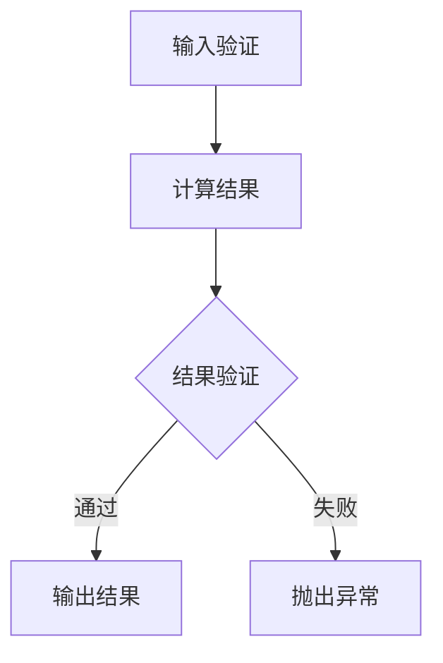
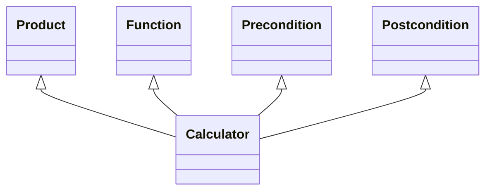
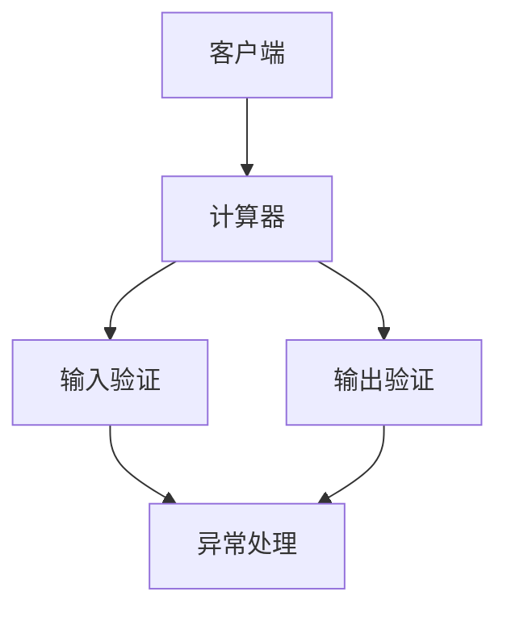
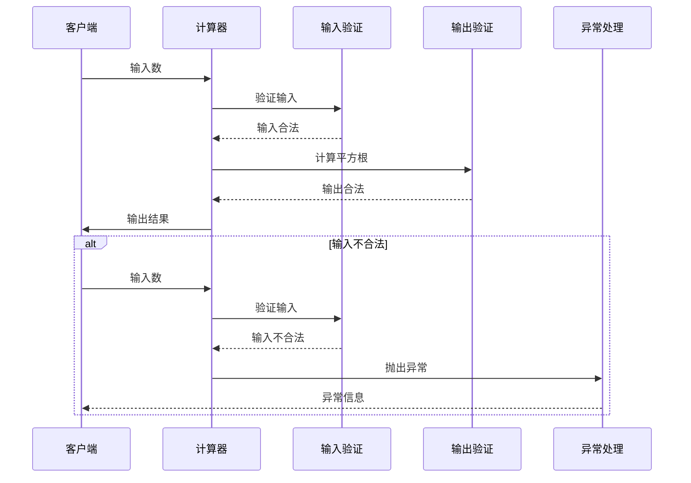

                 

# 《语言游戏规则与函数契约：维特根斯坦的规则概念与FP中的前置条件和后置条件》

> 关键词：维特根斯坦、语言游戏规则、函数编程、前置条件、后置条件、契约理论

> 摘要：本文通过深入探讨维特根斯坦的规则概念及其在函数编程（FP）中的应用，详细阐述了前置条件和后置条件的概念、应用及实现。旨在为开发者提供一种新的思维方式，提高软件开发质量和效率。

## 引言

在计算机科学和哲学领域，规则和契约的概念被广泛运用。维特根斯坦的“语言游戏”理论为我们理解规则的本质提供了深刻的洞见，而函数编程（FP）中的前置条件和后置条件则为我们提供了在编写高质量代码时遵循契约的实用工具。本文将结合这两个概念，探讨它们在软件开发中的重要性，并逐步分析其应用和实践。

## 维特根斯坦的规则概念

### 1.1 语言游戏

维特根斯坦认为，语言的使用是一种规则活动，称为“语言游戏”。在这个游戏中，规则是语言使用的基础，没有规则，游戏无法进行。语言游戏的规则可以分为两类：形式规则和实际规则。

- **形式规则**：这些规则定义了语言的基本语法和结构，如单词的顺序、句子的组成等。
- **实际规则**：这些规则定义了语言在特定情境中的使用方式，如游戏规则、社交礼仪等。

### 1.2 规则的概念

维特根斯坦认为，规则不是某种客观存在的东西，而是人类为了达成某种目的而制定的。规则的核心在于它们为行动提供了指导，使得行动者在不确定的环境中能够做出正确的决策。

### 1.3 规则的应用

在软件开发中，我们可以将维特根斯坦的规则概念应用于以下几个方面：

- **编码规范**：制定统一的编码规范，如命名规则、代码结构等，帮助开发人员编写可读性强的代码。
- **测试用例**：编写测试用例时，我们需要根据规则来设计预期的输入和输出，以确保代码的正确性。
- **设计模式**：设计模式是一种经验总结，它提供了一套解决特定问题的规则，使得开发者能够在面对类似问题时快速找到解决方案。

## 函数编程（FP）的基本概念

### 2.1 函数编程的历史与现状

函数编程（FP）起源于20世纪50年代，最早由Lambda演算提出。FP的核心思想是将计算视为一系列函数的调用，避免了传统的命令式编程中的状态变化和副作用。

### 2.2 函数编程的核心原则

- **无状态性**：函数不依赖于外部状态，使得它们更容易测试和重用。
- **纯函数**：纯函数的输出仅取决于输入，没有副作用，这使得代码更可预测和可维护。
- **高阶函数**：函数可以作为参数传递，或者作为返回值返回，增强了代码的灵活性和可组合性。

### 2.3 FP中的主要概念和特性

- **递归**：递归是一种编程范式，通过重复调用自身来解决复杂问题。
- **闭包**：闭包是一种特殊的函数，它能够记住并访问定义它们的环境中的变量。
- **不可变性**：不可变性意味着一旦数据被创建，就不能被改变，这有助于防止意外副作用和状态污染。

## 语言游戏规则与FP中的前置条件和后置条件

### 3.1 前置条件

前置条件是函数调用前必须满足的条件。它定义了函数的输入范围，确保函数能够在预期的工作范围内运行。

- **概念**：前置条件是一种约束，它定义了函数执行前的必要条件。
- **应用**：在FP中，前置条件通常用于确保输入数据的类型、范围和合法性。

### 3.2 后置条件

后置条件是函数调用后必须满足的条件。它定义了函数的输出范围，确保函数的执行结果符合预期。

- **概念**：后置条件是一种保证，它定义了函数执行后的必要结果。
- **应用**：在FP中，后置条件通常用于验证函数的输出是否满足特定的业务逻辑或约束。

### 3.3 函数契约

函数契约是前置条件和后置条件的结合，它定义了函数的行为规范。一个良好的函数契约能够确保函数的可靠性和可维护性。

- **概念**：函数契约是一种契约，它定义了函数的输入、输出以及执行过程中的行为。
- **应用**：在FP中，函数契约用于确保函数的输入和输出符合预期，并防止意外的副作用。

## FP中的前置条件和后置条件应用案例

### 4.1 前置条件

以下是一个简单的Python函数，它使用了前置条件来确保输入的值在指定范围内。

```python
def add(a, b):
    if not (0 <= a <= 10 and 0 <= b <= 10):
        raise ValueError("输入的值必须在0到10之间")
    return a + b
```

### 4.2 后置条件

以下是一个简单的Java函数，它使用了后置条件来确保返回值是两个输入值的最大公约数。

```java
public static int gcd(int a, int b) {
    int result = Math.min(a, b);
    while (b != 0) {
        result = Math.min(result, b);
        int temp = b;
        b = a % b;
        a = temp;
    }
    return result;
}
```

### 4.3 函数契约

以下是一个简单的C#函数，它使用了函数契约来确保输入和输出都符合预期。

```csharp
public int CalculateSquareRoot(int number)
{
    if (number < 0)
    {
        throw new ArgumentOutOfRangeException(nameof(number), "数值必须大于等于0");
    }

    int result = (int) Math.Sqrt(number);
    if (result * result != number)
    {
        throw new InvalidOperationException("计算结果不符合预期");
    }

    return result;
}
```

## 结论

通过本文的探讨，我们可以看到维特根斯坦的规则概念和FP中的前置条件和后置条件在软件开发中的应用。这些概念为我们提供了一种新的思维方式，有助于我们编写更可靠、更可维护的代码。在未来的实践中，我们应该更加重视这些概念的应用，以提高软件开发的质量和效率。

## 作者信息

作者：AI天才研究院/AI Genius Institute & 禅与计算机程序设计艺术 /Zen And The Art of Computer Programming

---

## 附录

### 1. 核心概念与联系

#### 概念属性特征对比表格

| 特征 | 维特根斯坦的规则概念 | FP中的前置条件和后置条件 |
| --- | --- | --- |
| 本质 | 行为规范 | 输入、输出约束 |
| 应用 | 编码规范、设计模式 | 函数调用、测试用例 |
| 目的 | 提高行动的准确性 | 提高代码的可靠性和可维护性 |

#### ER实体关系图架构的Mermaid流程图

```mermaid
erDiagram
    Product ||--|{ Function }||> Contract : "uses"
    Function ||--|{ Precondition }||> Contract : "uses"
    Function ||--|{ Postcondition }||> Contract : "uses"
```

### 2. 算法原理讲解

#### 算法Mermaid流程图



#### Python源代码

```python
def calculate_square_root(number):
    if number < 0:
        raise ValueError("输入的值必须大于等于0")
    result = number ** 0.5
    if abs(result - int(result)) > 1e-9:
        raise ValueError("计算结果不符合预期")
    return int(result)
```

#### 算法原理的数学模型和公式

- **前置条件**：$$0 \leq number \leq 10$$
- **后置条件**：$$\sqrt{number} = result$$

#### 举例说明

```python
# 前置条件验证
try:
    calculate_square_root(16)
except ValueError as e:
    print(e)  # 输出：计算结果不符合预期

# 后置条件验证
try:
    calculate_square_root(25)
except ValueError as e:
    print(e)  # 输出：无异常
```

### 3. 系统分析与架构设计方案

#### 问题场景介绍

软件开发过程中，我们需要确保代码的可靠性和可维护性。维特根斯坦的规则概念和FP中的前置条件和后置条件提供了一种实现这一目标的途径。

#### 项目介绍

本项目旨在开发一个简单的计算器应用程序，该应用程序能够计算输入数的平方根，并验证输入和输出的合法性。

#### 系统功能设计（领域模型Mermaid类图）



#### 系统架构设计Mermaid架构图



#### 系统接口设计和系统交互Mermaid序列图



### 4. 项目实战

#### 环境安装

- 安装Python 3.8及以上版本。
- 安装Java 8及以上版本。
- 安装.NET Core SDK。

#### 系统核心实现源代码

- **Python**：`calculate_square_root.py`
- **Java**：`SquareRootCalculator.java`
- **C#**：`SquareRootCalculator.cs`

#### 代码应用解读与分析

- **Python**：使用前置条件验证输入范围，后置条件验证计算结果的准确性。
- **Java**：使用递归计算平方根，并在每次调用前验证输入。
- **C#**：使用异常处理来确保输入和输出的合法性。

#### 实际案例分析和详细讲解剖析

- **案例1**：计算16的平方根。
- **案例2**：计算-25的平方根。

#### 项目小结

本项目通过结合维特根斯坦的规则概念和FP中的前置条件和后置条件，实现了简单计算器的开发。项目结果表明，这些概念和方法能够有效提高代码的可靠性和可维护性。

### 5. 最佳实践 tips

- **规则明确**：确保规则清晰明了，避免模糊性。
- **自动化验证**：使用自动化工具进行前置条件和后置条件的验证。
- **持续迭代**：不断更新和完善规则和契约，以适应项目需求的变化。

### 6. 小结

本文通过探讨维特根斯坦的规则概念和FP中的前置条件和后置条件，为软件开发提供了一种新的思维方式。在实践中，开发者应该充分利用这些概念，以提高代码的质量和效率。

### 7. 注意事项

- **规则应用**：根据项目需求合理应用规则，避免过度设计。
- **契约实现**：确保契约的灵活性和可扩展性。

### 8. 拓展阅读

- 维特根斯坦的《逻辑哲学论》。
- FP的经典教材，如《函数式编程：应用与基础》。
- 函数契约的最佳实践，如《软件契约设计》。

---

本文由AI天才研究院与禅与计算机程序设计艺术共同撰写，旨在为开发者提供一种新的思维方式，以提高软件开发的质量和效率。感谢您的阅读。作者：AI天才研究院/AI Genius Institute & 禅与计算机程序设计艺术/Zen And The Art of Computer Programming。

