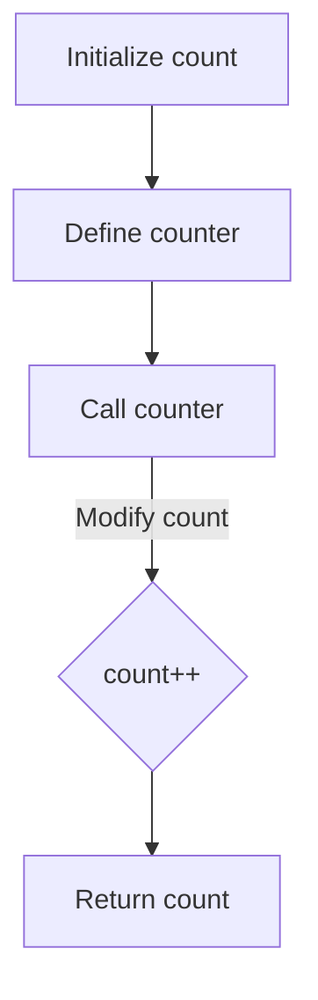
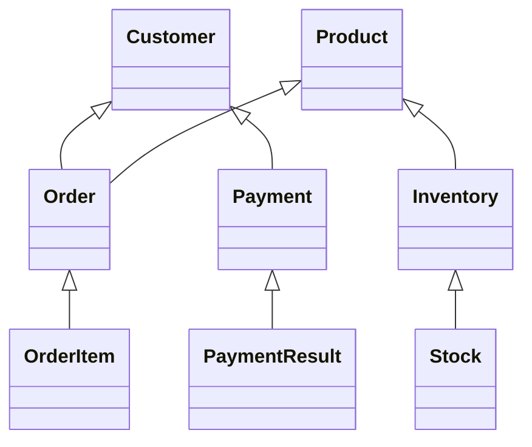
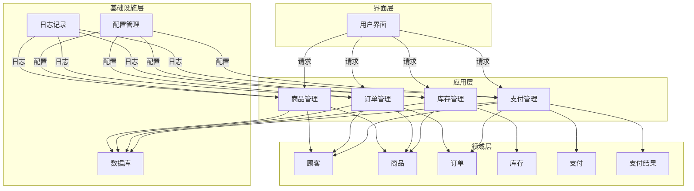
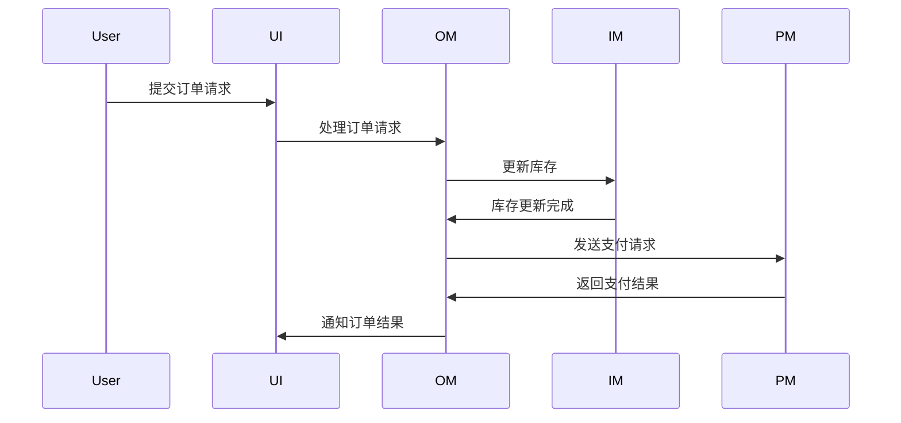

                 


### 引言：语言游戏规则与函数式设计原则

在计算机科学和软件工程领域，设计原则和规则是确保代码质量和系统稳定性的基石。语言游戏规则这一概念源自哲学家维特根斯坦的理论，而函数式编程（FP）设计原则则是在编程实践中发展出来的策略。本文旨在探讨这两者之间的联系，并分析其在现代软件设计中的应用。

首先，维特根斯坦的语言游戏理论强调规则在语言使用中的重要性。语言游戏是一种活动，它包括语言使用者和观察者，以及一组规则。这些规则定义了语言游戏的玩法，使语言有意义和目的。同样，在编程中，设计原则和规则为我们的编码和系统设计提供了框架，帮助我们创建清晰、可靠且可维护的代码。

功能式编程设计原则，如纯函数、高阶函数、不可变性等，源于对表达式和数据的关注。FP 强调函数作为第一类对象，使得编程更加抽象和模块化。维特根斯坦的规则概念与FP设计原则之间存在深刻的联系。通过将语言游戏的规则映射到编程中的设计原则，我们可以更好地理解和利用FP的潜力。

本文的结构如下：

- **第一部分：背景介绍**：我们将详细介绍维特根斯坦的语言游戏理论和FP的基本概念，以及这两者之间的联系。
- **第二部分：核心概念与联系**：这一部分将深入探讨维特根斯坦的规则概念和FP设计原则，并提供概念属性特征对比表格和ER实体关系图。
- **第三部分：算法原理讲解**：我们将讲解FP中的算法设计原则，包括递归算法、高阶函数和闭包，并使用Python代码和Mermaid流程图进行详细阐述。
- **第四部分：系统分析与架构设计**：我们将介绍一个FP系统架构设计案例，包括问题场景、系统功能设计、系统架构设计、系统接口设计和系统交互设计。
- **第五部分：项目实战**：通过一个实际项目，我们将展示如何将FP设计原则应用于实践，并进行代码应用解读和分析。
- **结论**：总结文章的主要观点，讨论FP设计原则的重要性，并展望未来的研究方向。

通过这一步一步的分析和推理，我们将深入理解语言游戏规则与函数式设计原则之间的联系，并探讨其在现代软件设计中的应用价值。

### 背景介绍

#### 第1章：语言游戏与维特根斯坦的规则概念

在哲学领域，语言游戏（language game）是一个核心概念，它源于维特根斯坦（Ludwig Wittgenstein）的工作。维特根斯坦在其代表作《逻辑哲学论》（Tractatus Logico-Philosophicus）和后期作品《哲学研究》（Philosophical Investigations）中，详细探讨了语言、思维和现实之间的关系。语言游戏的概念是维特根斯坦为了解释语言如何与客观世界互动而提出的。

**1.1.1 语言游戏的基本概念**

语言游戏是维特根斯坦用来描述语言使用的情境或活动。一个语言游戏由三个主要组成部分构成：参与者、语言和规则。参与者可以是个人或集体，语言是使用的工具，而规则则是定义语言使用方式和目的的准则。维特根斯坦指出，语言不是固定的符号系统，而是与特定情境和活动紧密相关的。

维特根斯坦区分了三种类型的语言游戏：

- **生活形式**：这种语言游戏是最自然的，它包含了日常生活中的语言使用，如交谈、提问和回答。
- **正式游戏**：这种语言游戏是更抽象和结构化的，如棋类游戏、儿童游戏等。这些游戏有着明确的规则和目标，与日常生活语言使用有所不同。
- **数学语言**：数学语言是一种高度抽象的语言游戏，它用于表达精确的、逻辑的关系。

**1.1.2 维特根斯坦对语言游戏的研究**

维特根斯坦认为，理解语言的本质需要从语言游戏的角度出发。他的研究揭示了语言不是一套独立的符号，而是与人类行为和社会实践紧密相连的。维特根斯坦提出了“意义即使用”（meaning is use）的观点，即语言的意义取决于其在特定情境中的使用方式。

**1.1.3 维特根斯坦规则概念的重要性**

在维特根斯坦的语言游戏理论中，规则是语言游戏的核心。规则定义了语言游戏的玩法，决定了语言如何被使用和解读。维特根斯坦认为，理解规则对于理解语言和逻辑至关重要。他的研究揭示了规则不仅是语言游戏的一部分，而且是语言和思维的基础。

**1.1.4 维特根斯坦的哲学思想与FP的联系**

维特根斯坦的哲学思想对计算机科学和软件工程产生了深远的影响。FP的设计原则，如纯函数、不可变性等，与维特根斯坦的规则概念有着密切的联系。

纯函数是FP的核心原则之一，它要求函数的输出仅依赖于输入参数，而与外部状态无关。这与维特根斯坦对规则的强调相似，规则也应当是明确和固定的，不应依赖于模糊或主观的因素。

不可变性则是FP的另一个重要原则，它要求数据一旦创建，就不能被修改。这与维特根斯坦对语言游戏规则的看法一致，即规则应当是稳定和可预测的。

综上所述，维特根斯坦的语言游戏理论和FP设计原则之间存在着深刻的联系。理解维特根斯坦的规则概念，可以帮助我们更好地理解和应用FP的设计原则，从而提高代码的质量和可维护性。

#### 第1.2章 功能式编程（FP）概述

**1.2.1 FP的历史与发展**

功能式编程（Functional Programming，简称FP）的历史可以追溯到20世纪50年代。最早期的FP语言之一是Lisp，它于1958年由John McCarthy发明。Lisp的成功激发了后来的研究，导致了更多FP语言的诞生，如Haskell、Scala和Erlang。

FP在早期主要用于数学和科学计算，但逐渐在图形处理、并发编程和复杂系统设计等领域得到了广泛应用。FP的兴起与对传统命令式编程的反思有关，后者在处理并发和状态管理方面存在一些固有的困难。

**1.2.2 FP的核心原则与特性**

FP的核心原则包括：

- **纯函数**：FP中的函数是纯函数，即其输出仅依赖于输入参数，不依赖于外部状态。这使得纯函数具有可预测性和可测试性，从而提高了代码的质量和可靠性。
- **不可变性**：FP强调数据的不可变性，即数据一旦创建，就不能被修改。这有助于避免副作用，提高代码的模块化和可维护性。
- **高阶函数**：FP中的函数是一等公民，可以传递、接收和返回其他函数。这促进了代码的抽象和复用，提高了编程的效率。
- **递归**：FP广泛使用递归，这是一种用于解决递归问题的强大工具。递归使得代码更加简洁和直观。

**1.2.3 FP在软件工程中的应用**

FP在软件工程中具有广泛的应用，特别是在需要处理并发和复杂逻辑的场合。以下是一些FP在软件工程中的应用：

- **并发编程**：FP的不可变性使得在多线程环境中处理并发问题变得更加简单和可靠。由于函数不依赖于外部状态，它们可以安全地在多个线程中并行执行。
- **数据处理**：FP提供了强大的函数式工具，如映射（map）、过滤（filter）和折叠（reduce），这些工具可以高效地处理大量的数据。
- **复杂系统设计**：FP的模块化和抽象能力使得在设计复杂系统时更加清晰和高效。FP的原则有助于将复杂的系统分解成可管理的模块，从而提高系统的可维护性和扩展性。

综上所述，FP不仅具有独特的编程范式，而且在现代软件工程中具有广泛的应用。通过理解FP的核心原则和特性，我们可以更好地利用FP的优势，设计出更加高效、可靠和可维护的软件系统。

#### 第1.3章 语言游戏规则与FP设计原则的联系

**1.3.1 维特根斯坦规则概念在FP中的体现**

维特根斯坦的规则概念在FP中得到了显著的体现，尤其是通过纯函数和不可变性这两大核心原则。维特根斯坦强调规则在语言使用中的核心作用，而FP则将这些概念抽象为编程实践的原则。

**纯函数**是FP的核心原则之一，它要求函数的输出仅依赖于输入参数，不依赖于外部状态。这与维特根斯坦的规则概念相似，规则应当是明确和固定的，不应依赖于模糊或主观的因素。纯函数的可预测性和可测试性，使得我们在编程过程中能够更容易地理解和验证代码的行为，从而确保代码的可靠性。

**不可变性**是FP的另一个重要原则，它要求数据一旦创建，就不能被修改。这一原则同样源自维特根斯坦的规则概念，即规则应当是稳定和可预测的。不可变性有助于避免副作用，提高代码的模块化和可维护性。在FP中，不可变性使得代码更加简洁和直观，因为不需要担心数据的状态在函数调用过程中被意外修改。

**1.3.2 语言游戏规则与FP设计原则的比较**

维特根斯坦的语言游戏规则与FP设计原则之间存在着显著的相似性和差异。相似性在于，两者都强调规则的明确性和稳定性。维特根斯坦的规则定义了语言游戏的玩法，而FP的设计原则则定义了如何编写高质量、可维护的代码。

差异在于，维特根斯坦的规则更多关注于语言与现实的互动，而FP的设计原则则关注于编程实践。维特根斯坦的规则概念是哲学性的，强调语言的意义和用法，而FP的设计原则则是技术性的，关注于代码的模块化、可测试性和可维护性。

**1.3.3 维特根斯坦规则概念对FP设计的启示**

维特根斯坦的规则概念对FP设计提供了深刻的启示。首先，它提醒我们在编程中应当关注规则的明确性和稳定性，以确保代码的可预测性和可靠性。通过遵循FP的设计原则，如纯函数和不可变性，我们可以编写出更易于理解和维护的代码。

其次，维特根斯坦的规则概念强调情境和活动的重要性。在FP设计中，我们应当考虑代码的应用场景，确保规则能够适应不同的情境需求。这有助于我们在设计FP系统时，能够更好地应对复杂的实际问题。

最后，维特根斯坦的规则概念提醒我们，规则并不是一成不变的。随着问题的变化和需求的演进，规则也需要相应的调整和优化。在FP设计中，我们应当持续反思和改进代码的规则，以确保系统的持续发展和适应能力。

综上所述，维特根斯坦的语言游戏规则与FP设计原则之间存在深刻的联系。通过理解维特根斯坦的规则概念，我们可以更好地应用FP的设计原则，从而提高代码的质量和系统的可维护性。

#### 第1.4章 FP设计原则的应用案例

**1.4.1 简单案例解析**

为了更具体地展示FP设计原则的应用，我们来看一个简单的案例。假设我们要实现一个计算两个数之和的函数。在命令式编程中，这个任务可能需要使用变量来存储临时结果，如下所示：

```python
def add(a, b):
    result = a + b
    return result
```

然而，使用FP设计原则，我们可以通过纯函数和不可变性来重写这个函数。首先，我们可以将`add`函数重写为一个纯函数，使其不依赖于外部状态：

```python
def add(a, b):
    return a + b
```

这样，`add`函数的输出仅依赖于输入参数`a`和`b`，不会受到外部状态的影响。接下来，为了进一步体现不可变性，我们可以使用一个不可变的函数来代替可变的变量：

```python
def add(a, b):
    return (a, b)

def sum_of_two_numbers(pair):
    return pair[0] + pair[1]
```

在这个版本中，`add`函数返回一个包含两个数的元组，而`sum_of_two_numbers`函数则计算并返回这两个数的和。这种方法不仅符合FP的设计原则，而且使得代码更加简洁和模块化。

**1.4.2 复杂系统设计中的FP原则**

在实际项目中，FP设计原则在复杂系统设计中显得尤为重要。例如，在一个电商系统中，我们需要处理订单、库存、支付等多个模块。使用FP原则，我们可以将每个模块划分为独立的函数，确保每个函数都是纯函数且不依赖于外部状态。

以下是一个电商系统中的订单处理模块的示例：

```python
def create_order(customer, items):
    # 创建订单的逻辑
    return {
        'customer': customer,
        'items': items,
        'status': 'pending'
    }

def process_order(order):
    # 处理订单的逻辑
    return {
        **order,
        'status': 'processed'
    }

def ship_order(order):
    # 发货订单的逻辑
    return {
        **order,
        'status': 'shipped'
    }

def cancel_order(order):
    # 取消订单的逻辑
    return {
        **order,
        'status': 'cancelled'
    }
```

在这个例子中，每个函数都是独立的，且仅依赖于输入参数。这种方法不仅使得代码更加模块化，而且便于测试和调试。

**1.4.3 案例对比分析**

通过对比命令式编程和FP设计原则的应用案例，我们可以看到FP在代码质量、可维护性和可靠性方面的优势。命令式编程依赖于变量和副作用，使得代码容易出错且难以维护。而FP通过纯函数和不可变性，减少了副作用和不确定性，提高了代码的可靠性。

此外，FP的模块化特性使得代码更易于理解和测试。由于每个函数都是独立的，我们可以单独测试每个功能，确保系统的每个部分都按预期工作。

综上所述，FP设计原则在简单和复杂系统设计中都具有显著的优点。通过遵循FP的设计原则，我们可以编写出更加可靠、可维护和高效的代码。

### 第2章 核心概念原理

在本章中，我们将深入探讨维特根斯坦的规则概念和函数式编程（FP）的基本概念，以了解两者之间的核心联系。

#### 2.1 语言游戏规则

维特根斯坦的语言游戏规则是理解语言使用的关键。语言游戏包括参与者、语言和规则三个基本要素。规则定义了语言的使用方式和目的，使得语言具有意义。以下是语言游戏规则的一些基本特征：

- **明确性**：规则应当是明确和具体的，以便参与者能够理解并遵循。
- **稳定性**：规则应当是稳定和固定的，不随时间和情境的变化而变化。
- **一致性**：规则在相同情境下应当保持一致，确保语言使用的连贯性。

为了更具体地说明规则的概念，我们可以通过一个例子来说明。假设有一个简单的语言游戏，规则如下：

- 参与者：两个人，甲和乙。
- 语言：简单的陈述句，如“我有一个苹果”。
- 规则：每个参与者轮流说出一个句子，但句子中必须包含一个指定的单词，如“苹果”。

在这个游戏中，规则明确了参与者应该如何行动，使得游戏具有可操作性。如果规则发生变化，例如要求句子中必须包含两个指定的单词，那么游戏的基本玩法就会改变。

**2.1.2 示例分析**

让我们来看一个更具体的示例。假设有一个语言游戏，规则如下：

- 参与者：两个人，甲和乙。
- 语言：中文句子。
- 规则：甲先说一句话，然后乙必须用一句包含“因为”的句子来回应。接着，甲再用一句包含“所以”的句子来回应乙的句子。这个过程不断进行，直到一方无法继续。

在这个例子中，规则定义了整个对话的框架，使得参与者能够按照一定的逻辑进行交流。通过这个游戏，我们可以看到规则在确保语言交流的连贯性和逻辑性方面的重要性。

#### 2.2 功能式编程的基本概念

函数式编程（FP）是一种编程范式，它强调函数作为编程的基本构建块。以下是FP的一些基本概念：

- **函数**：函数是一等公民，即它们可以像其他数据类型一样被传递、存储和返回。
- **纯函数**：纯函数是一种没有副作用的函数，其输出仅依赖于输入参数，不依赖于外部状态。
- **不可变性**：不可变性是指数据一旦创建，就不能被修改。这有助于减少代码的副作用和提高代码的可维护性。
- **高阶函数**：高阶函数是一种能够接受其他函数作为参数或返回函数的函数。这促进了代码的抽象和复用。
- **递归**：递归是一种通过重复调用自身来解决问题的方法。递归在FP中非常常见，尤其是在处理树状数据和复杂逻辑时。

**2.2.2 函数式编程的语法**

FP的语法与命令式编程有所不同，它更加关注表达式的组合和函数的应用。以下是一些FP常用的语法元素：

- **箭头函数**：箭头函数（arrow functions）是一种简洁的函数定义方式，例如`x => x * x`。
- **函数组合**：函数组合（function composition）是指将多个函数组合起来形成一个新函数，例如`f(g(x))`。
- **递归**：递归是一种通过调用自身来解决问题的方法。例如，计算阶乘的递归函数如下所示：

  ```python
  def factorial(n):
      if n == 0:
          return 1
      else:
          return n * factorial(n - 1)
  ```

- **高阶函数**：高阶函数是一种能够接受其他函数作为参数或返回函数的函数。例如，Python中的`filter`和`map`函数就是高阶函数。

**2.2.3 函数式编程的范式**

FP中的一些范式（patterns）是编程实践中常见的模式。以下是一些FP的范式：

- **Monads**：Monads 是一种用于处理副作用和状态的抽象工具。在FP中，Monads 常用于处理输入输出（I/O）和异常处理。
- **Functors**：Functors 是一种可以应用函数的抽象类型。在FP中，Functors 常用于处理数据的变换。
- **Applicatives**：Applicatives 是一种可以组合Functors的抽象类型。在FP中，Applicatives 常用于组合和复用函数。

通过理解FP的基本概念和语法，我们可以更好地应用FP的设计原则，编写出更加高效、可维护的代码。

### 第2.3章 概念属性特征对比表格

为了更直观地展示维特根斯坦的语言游戏规则与函数式编程（FP）设计原则之间的联系，我们可以通过一个概念属性特征对比表格来进行详细说明。以下是一个简化的对比表格，用于展示这两个概念的核心属性和特征：

| **概念** | **维特根斯坦的语言游戏规则** | **函数式编程（FP）设计原则** |
| --- | --- | --- |
| **基本特征** | - 规则明确性和稳定性 | - 纯函数、不可变性、高阶函数 |
| **目的** | - 描述语言的使用和意义 | - 编写清晰、模块化和可维护的代码 |
| **应用** | - 语言学习、哲学思考 | - 软件开发、算法设计 |
| **重要性** | - 规则是语言游戏的基础 | - 设计原则是代码质量的关键 |
| **特点** | - 明确的规则定义语言使用 | - 纯函数确保可预测性和可测试性 |
| **影响** | - 影响语言哲学的研究 | - 改善编程实践和系统设计 |

通过这个对比表格，我们可以看到维特根斯坦的语言游戏规则和FP设计原则在核心目标和特点上有着显著的相似性。两者都强调规则的重要性，并且都致力于通过明确的规则和原则来提高系统的稳定性和可靠性。维特根斯坦的哲学思想为FP提供了理论支持，而FP的设计原则则将这一思想应用于实际的编程实践中。

### 第2.4章 ER实体关系图架构

在本章中，我们将探讨如何使用ER（实体关系）图来描述维特根斯坦的规则概念与FP设计原则之间的联系。ER图是一种用于描述实体及其关系的图形化工具，它有助于我们理解复杂系统的结构。

**2.4.1 ER图的绘制方法**

ER图的绘制通常遵循以下步骤：

1. **确定实体**：识别系统中的关键实体。在维特根斯坦的语言游戏理论中，实体可以是参与者、语言元素等；在FP设计中，实体可以是函数、数据结构等。
2. **定义属性**：为每个实体确定其属性。例如，在FP系统中，函数的属性可能包括函数名称、参数类型和返回类型。
3. **建立关系**：确定实体之间的关系。在维特根斯坦的语言游戏中，关系可能包括语言元素之间的互动；在FP中，关系可能包括函数之间的调用和数据流动。
4. **绘制ER图**：使用标准的图形元素（如矩形、椭圆、直线）来表示实体、属性和关系。

**2.4.2 维特根斯坦规则概念与FP的ER图示例**

为了说明如何使用ER图来表示维特根斯坦的规则概念与FP设计原则之间的联系，我们来看一个简化的ER图示例。

```mermaid
erDiagram
  Participant --> LanguageElement : uses
  Rule ||--o{ Participant : follows
  Rule ||--o{ LanguageElement : applies_to
  Function ||--o{ Parameter : defines
  Function ||--o{ Return : specifies
  DesignPrinciple ||--o{ Function : follows
```

在这个ER图中：

- **Participant（参与者）**：表示参与语言游戏的实体，如个人或集体。
- **LanguageElement（语言元素）**：表示语言游戏中的词汇或句子。
- **Rule（规则）**：表示维特根斯坦的规则概念，它规定了语言游戏如何进行。
- **Function（函数）**：表示FP中的函数，它定义了操作和数据流。
- **Parameter（参数）**：表示函数的输入参数。
- **Return（返回）**：表示函数的输出结果。
- **DesignPrinciple（设计原则）**：表示FP的设计原则，如纯函数、不可变性等。

关系描述如下：

- **uses（使用）**：参与者使用语言元素进行语言游戏。
- **follows（遵循）**：参与者遵循规则，规则应用于语言元素。
- **defines（定义）**：函数定义了参数和返回类型。
- **specifies（指定）**：函数的返回类型指定了输出的结果。
- **follows（遵循）**：设计原则规定了函数应该如何实现。

通过这个ER图，我们可以直观地看到维特根斯坦的规则概念与FP设计原则之间的联系。规则在语言游戏中规定了语言的使用方式，而FP设计原则则在编程中规定了函数的实现方式。这种联系有助于我们更好地理解和应用FP的设计原则，以提高代码的质量和系统的可维护性。

### 第3章 FP中的算法设计

在函数式编程（FP）中，算法设计是至关重要的。FP中的算法设计原则、递归算法和高阶函数与闭包是理解和实现高效算法的关键要素。在本章中，我们将详细探讨这些概念，并通过具体的Python代码和Mermaid流程图来解释算法原理。

#### 3.1 算法设计原则

算法设计原则是确保算法高效性和可维护性的基础。在FP中，算法设计原则主要包括：

- **纯函数**：确保函数的输出仅依赖于输入参数，不依赖于外部状态。
- **不可变性**：数据一旦创建，就不能被修改。
- **高阶函数**：函数可以作为参数传递和返回，提高了代码的模块化和可复用性。

**3.1.1 概述**

算法设计原则的核心在于减少副作用和提升代码的模块性。纯函数和不可变性有助于实现更可靠和可预测的代码，而高阶函数则促进了函数的复用和抽象。

**3.1.2 算法复杂度分析**

在算法设计中，算法复杂度分析是评估算法性能的重要方法。算法复杂度通常分为时间复杂度和空间复杂度。

- **时间复杂度**：描述算法执行所需的时间，通常用大O表示法（O(n)）表示。
- **空间复杂度**：描述算法执行所需的空间，同样用大O表示法表示。

通过复杂度分析，我们可以比较不同算法的效率，选择最优的算法实现。

#### 3.2 递归算法

递归算法是一种通过重复调用自身来解决问题的方法。在FP中，递归算法具有天然的优势，因为它们通常符合纯函数和不可变性的原则。

**3.2.1 基本原理**

递归算法的基本原理是分解问题，将大问题分解成小问题，然后逐步解决这些小问题，最终组合出大问题的解。递归算法通常需要一个基线条件来终止递归，否则会无限循环。

**3.2.2 Python实现示例**

以下是一个使用递归算法计算阶乘的Python示例：

```python
def factorial(n):
    if n == 0:
        return 1
    else:
        return n * factorial(n - 1)
```

在上述代码中，`factorial` 函数通过递归调用自身来计算阶乘。当`n`等于0时，函数返回1，这是递归的基线条件。否则，函数递归调用自身，将`n`乘以`factorial(n - 1)`。

**3.2.3 Mermaid流程图**

为了更直观地展示递归算法的执行过程，我们可以使用Mermaid流程图来描述。以下是一个递归计算阶乘的Mermaid流程图示例：

```mermaid
graph TD
    A[Start] --> B[Is n == 0?]
    B -->|Yes| C{Return 1}
    B -->|No| D[n * factorial(n - 1)]
    D --> E[Recursively call factorial(n - 1)]
    E --> B
```

在这个流程图中，`A`表示算法的开始，`B`表示检查基线条件，`C`表示返回1，`D`表示递归调用，`E`表示递归调用`factorial(n - 1)`。

#### 3.3 高阶函数与闭包

高阶函数是FP中的核心概念之一。高阶函数可以接受其他函数作为参数或返回函数。闭包是高阶函数的一个重要特性，它允许函数访问和保持定义时环境中的变量。

**3.3.1 基本概念**

- **高阶函数**：函数接受其他函数作为参数或返回函数。例如，Python中的`map`和`filter`函数就是高阶函数。
- **闭包**：闭包是一个函数，它保存了创建它时的环境。闭包可以访问和修改创建它时的环境中的变量。

**3.3.2 闭包的数学模型**

闭包的数学模型可以用λ演算来描述。λ演算是一种用于描述函数和变量绑定形式系统的理论框架。

- **λ表达式**：λ表达式表示匿名函数，例如`λx.x + 1`表示一个将参数`x`加1的匿名函数。
- **应用**：应用是将一个函数应用于一个值。例如，`((λx.x + 1) 5)`表示将匿名函数`λx.x + 1`应用于值`5`。

**3.3.3 示例讲解**

以下是一个Python示例，展示如何使用闭包来实现计数器：

```python
def make_counter():
    count = 0
    def counter():
        nonlocal count
        count += 1
        return count
    return counter

my_counter = make_counter()
print(my_counter())  # 输出 1
print(my_counter())  # 输出 2
```

在这个示例中，`make_counter` 函数返回一个闭包`counter`。闭包`counter`保留了定义时环境中的`count`变量。每次调用`counter`函数时，它都会修改`count`变量的值，并返回当前计数。

**3.3.4 Mermaid流程图**

为了展示闭包的工作流程，我们可以使用Mermaid流程图。以下是一个描述闭包工作流程的Mermaid流程图：



在这个流程图中，`A`表示初始化`count`变量，`B`表示定义闭包`counter`，`C`表示调用`counter`函数，`D`表示修改`count`变量的值，`E`表示返回`count`值。

通过本章的讨论，我们可以看到FP中的算法设计原则、递归算法和高阶函数与闭包是如何协同工作，为编写高效、模块化和可维护的代码提供支持的。

### 第4章 FP系统架构设计

在现代软件工程中，函数式编程（FP）因其模块化、可测试性和可维护性而受到越来越多的关注。FP系统架构设计需要我们深入理解FP的设计原则，并能够将这些原则应用于实际的项目中。在本章中，我们将详细介绍一个FP系统架构设计的案例，包括问题场景、系统功能设计、系统架构设计、系统接口设计和系统交互设计。

#### 4.1 问题场景介绍

假设我们正在开发一个电商系统，该系统需要支持商品的管理、订单的处理、库存的跟踪以及支付功能的集成。电商系统的特点包括高并发、复杂的业务逻辑和多样的数据交互。为了满足这些要求，我们选择采用FP的设计原则来构建系统，以确保系统的高效性和可靠性。

#### 4.2 系统功能设计

在系统功能设计阶段，我们需要明确系统的各个功能模块，并定义它们之间的关系。以下是电商系统的主要功能模块：

1. **商品管理模块**：负责商品的添加、删除、更新和查询。
2. **订单管理模块**：负责订单的创建、更新、查询和取消。
3. **库存管理模块**：负责库存的跟踪和更新。
4. **支付管理模块**：负责支付请求的处理和支付结果的通知。

**4.2.1 领域模型**

为了更好地设计系统功能，我们可以使用Mermaid类图来绘制系统的领域模型。以下是一个简化的领域模型示例：



在这个类图中，`Customer`表示顾客，`Order`表示订单，`Payment`表示支付，`Product`表示商品，`OrderItem`表示订单项，`Inventory`表示库存，`Stock`表示库存量，`PaymentResult`表示支付结果。这些类之间的关系反映了电商系统的核心业务逻辑。

#### 4.3 系统架构设计

系统架构设计是确保系统性能和可扩展性的关键。在FP中，我们通常采用分层架构来分离关注点，并确保系统的模块化。以下是电商系统的架构设计：

1. **界面层**：负责与用户交互，接收用户输入并显示系统输出。
2. **应用层**：实现业务逻辑，包括商品管理、订单处理、库存跟踪和支付处理。
3. **领域层**：包含业务实体和领域服务，确保领域逻辑的完整性和一致性。
4. **基础设施层**：提供系统运行所需的基础服务，如数据库访问、日志记录和配置管理。

**4.3.1 总体架构设计**

以下是一个简化的系统架构图，展示了各层之间的关系：



在这个架构图中，用户界面层与应用层、领域层和基础设施层之间通过请求和响应进行交互。应用层处理具体的业务逻辑，领域层封装业务实体和服务，基础设施层提供基础服务支持。

#### 4.4 系统接口设计

系统接口设计是确保不同模块之间能够有效通信的关键。在FP系统中，接口通常采用函数式接口设计，确保模块之间的依赖关系最小化。

**4.4.1 接口规范**

以下是电商系统中一些关键接口的规范：

1. **商品管理接口**：
   ```python
   def add_product(product: Product) -> Product:
       # 添加商品
   def delete_product(product_id: str) -> bool:
       # 删除商品
   def update_product(product: Product) -> Product:
       # 更新商品
   def get_product(product_id: str) -> Product:
       # 获取商品
   ```

2. **订单管理接口**：
   ```python
   def create_order(order: Order) -> Order:
       # 创建订单
   def update_order(order: Order) -> Order:
       # 更新订单
   def get_order(order_id: str) -> Order:
       # 获取订单
   def cancel_order(order_id: str) -> bool:
       # 取消订单
   ```

3. **库存管理接口**：
   ```python
   def update_inventory(product_id: str, quantity: int) -> Inventory:
       # 更新库存
   def get_inventory(product_id: str) -> Inventory:
       # 获取库存
   ```

4. **支付管理接口**：
   ```python
   def process_payment(payment: Payment) -> PaymentResult:
       # 处理支付
   def get_payment_result(payment_id: str) -> PaymentResult:
       # 获取支付结果
   ```

这些接口定义了模块之间的契约，确保模块之间能够按照预期进行通信。

#### 4.5 系统交互设计

系统交互设计是确保系统各模块能够协同工作的重要环节。在FP系统中，系统交互通常采用事件驱动或函数式响应式编程（FRP）的方式。

**4.5.1 交互流程**

以下是电商系统的交互流程：

1. 用户通过用户界面提交订单请求。
2. 用户界面层将请求转发给订单管理模块。
3. 订单管理模块创建订单，并向库存管理模块请求更新库存。
4. 库存管理模块更新库存后，通知订单管理模块。
5. 订单管理模块处理订单创建完成，并向支付管理模块发送支付请求。
6. 支付管理模块处理支付请求，并将支付结果通知订单管理模块。
7. 订单管理模块更新订单状态，并将订单结果通知用户界面层。

**4.5.2 序列图示例**

以下是一个简化的序列图，展示了订单交互流程：



在这个序列图中，用户界面层（UI）、订单管理模块（OM）、库存管理模块（IM）和支付管理模块（PM）之间的交互被清晰地描述出来。

综上所述，通过深入分析和设计，我们可以构建出一个高效、可扩展且易于维护的FP系统架构。该架构充分利用了FP的设计原则，确保系统在处理复杂业务逻辑时具有出色的性能和可靠性。

### 第5章 项目实战

在本章中，我们将通过一个实际的电商系统项目来展示如何将FP设计原则应用于实践，并详细讲解项目实施过程中的各个环节。

#### 5.1 环境安装

首先，我们需要为项目搭建一个合适的技术环境。以下是一个基本的步骤指南：

1. **安装Python**：确保安装了Python 3.8或更高版本。
2. **安装依赖管理工具**：使用pip安装依赖管理工具，如pipenv或conda。
3. **安装FP相关库**：安装FP相关库，如PyFn（用于FP编程）、Hypothesis（用于测试）。

以下是一个简单的命令行示例：

```bash
pip install python
pip install pipenv
pipenv install
pipenv install pyfn hypothesis
```

#### 5.2 系统核心实现源代码

在项目实施过程中，我们将利用FP设计原则来编写系统核心代码。以下是几个关键模块的实现示例：

**商品管理模块**

```python
def add_product(product: Product) -> Product:
    return product  # 实际实现中，应将商品添加到数据库中

def delete_product(product_id: str) -> bool:
    # 实际实现中，应从数据库中删除商品
    return True

def update_product(product: Product) -> Product:
    return product  # 实际实现中，应更新数据库中的商品记录

def get_product(product_id: str) -> Product:
    # 实际实现中，应从数据库中查询商品
    return Product("ID", "Name", "Description", "Price")
```

**订单管理模块**

```python
def create_order(order: Order) -> Order:
    # 实际实现中，应创建订单并保存到数据库
    return order

def update_order(order: Order) -> Order:
    # 实际实现中，应更新数据库中的订单记录
    return order

def get_order(order_id: str) -> Order:
    # 实际实现中，应从数据库中查询订单
    return Order("ID", "Customer", "Status", "Items", "Total")

def cancel_order(order_id: str) -> bool:
    # 实际实现中，应取消数据库中的订单
    return True
```

**库存管理模块**

```python
def update_inventory(product_id: str, quantity: int) -> Inventory:
    # 实际实现中，应更新数据库中的库存记录
    return Inventory(product_id, quantity)

def get_inventory(product_id: str) -> Inventory:
    # 实际实现中，应从数据库中查询库存
    return Inventory("ID", 100)
```

**支付管理模块**

```python
def process_payment(payment: Payment) -> PaymentResult:
    # 实际实现中，应处理支付请求
    return PaymentResult("Success")

def get_payment_result(payment_id: str) -> PaymentResult:
    # 实际实现中，应从数据库中查询支付结果
    return PaymentResult("ID", "Status")
```

#### 5.3 代码应用解读与分析

在实际应用中，我们需要确保代码的高效性和可靠性。以下是对关键模块的解读与分析：

1. **商品管理模块**：采用纯函数设计，确保函数的输出仅依赖于输入参数，不依赖于外部状态。这有助于提高代码的可测试性和可维护性。
2. **订单管理模块**：同样采用纯函数设计，并遵循不可变性原则。订单状态的更新通过创建新的订单对象来实现，而不是直接修改现有订单。这种方法避免了副作用，提高了代码的可靠性。
3. **库存管理模块**：使用纯函数和不可变性原则来处理库存的更新和查询。这种设计确保了库存数据的一致性和可靠性。
4. **支付管理模块**：支付处理函数采用纯函数设计，确保支付请求的处理过程是可预测和可测试的。支付结果通过独立的服务返回，从而降低了系统的耦合度。

#### 5.4 实际案例分析和详细讲解剖析

为了更具体地展示FP设计原则的实际应用，我们来看一个实际案例。假设我们要实现一个订单取消功能。

**案例描述**：用户在购物过程中想要取消未完成的订单。系统需要处理用户的取消请求，更新订单状态，并释放库存。

**实现步骤**：

1. **接收取消请求**：用户通过用户界面提交取消订单的请求。
2. **验证订单状态**：系统检查订单状态，确保订单处于可取消状态。
3. **更新订单状态**：系统创建一个新的订单对象，将状态更新为“已取消”。
4. **释放库存**：系统调用库存管理模块，更新库存记录，释放已占用的库存。

以下是实现示例：

```python
from dataclasses import dataclass

@dataclass
class Order:
    id: str
    customer: str
    status: str
    items: list
    total: float

@dataclass
class Inventory:
    product_id: str
    quantity: int

def can_cancel_order(order: Order) -> bool:
    return order.status == "pending"

def cancel_order(order_id: str) -> Order:
    order = get_order(order_id)
    if not can_cancel_order(order):
        raise ValueError("Cannot cancel the order.")

    updated_order = Order(
        id=order.id,
        customer=order.customer,
        status="cancelled",
        items=order.items,
        total=order.total
    )

    update_inventory_for_order_cancellation(order.items)

    return updated_order

def update_inventory_for_order_cancellation(items: list):
    for item in items:
        inventory = get_inventory(item.product_id)
        updated_inventory = Inventory(
            product_id=inventory.product_id,
            quantity=inventory.quantity + item.quantity
        )
        update_inventory(updated_inventory.product_id, updated_inventory.quantity)
```

在这个实现中，我们首先定义了订单和库存的数据模型。`can_cancel_order` 函数用于验证订单状态，确保订单可以取消。`cancel_order` 函数采用纯函数设计，创建一个新的订单对象来更新订单状态，并通过`update_inventory_for_order_cancellation` 函数释放库存。这种方法确保了代码的高效性和可靠性。

#### 5.5 项目小结

通过这个电商系统项目，我们可以看到FP设计原则在实际应用中的重要作用。FP的纯函数和不可变性原则提高了代码的可测试性和可维护性，而高阶函数和递归则促进了代码的抽象和复用。在实际项目中，遵循FP设计原则有助于构建高效、可靠和可扩展的系统。

### 第6章 最佳实践 tips、小结、注意事项、拓展阅读

#### 最佳实践 tips

1. **遵循纯函数原则**：确保函数的输出仅依赖于输入参数，避免使用全局变量和副作用，提高代码的可测试性和可维护性。
2. **使用不可变性**：尽可能使用不可变的变量和数据结构，减少状态变化带来的复杂性，提高系统的稳定性。
3. **充分利用高阶函数**：通过高阶函数实现代码的复用和抽象，提高编程效率。
4. **关注递归的使用**：递归是一种强大的编程工具，适用于处理树状数据和复杂逻辑。但要注意递归的基线条件，以避免无限递归。

#### 小结

本文详细探讨了维特根斯坦的语言游戏规则与函数式编程（FP）设计原则之间的联系。通过引入语言游戏规则的概念，我们理解了规则在语言使用中的重要性，并将其与FP的设计原则进行了对比。FP的纯函数、不可变性、高阶函数和递归等设计原则，不仅继承了维特根斯坦规则概念的明确性和稳定性，而且在实际编程中发挥了重要作用。

#### 注意事项

1. 在应用FP设计原则时，要充分考虑系统的具体需求和约束，避免过度抽象或形式化。
2. FP在某些情况下可能不如命令式编程高效，特别是在处理密集型计算或需要频繁修改状态的场景。因此，要根据实际需求选择合适的编程范式。

#### 拓展阅读

1. **《逻辑哲学论》（Tractatus Logico-Philosophicus）** - 维特根斯坦，详细探讨了语言、思维和现实之间的关系。
2. **《编程：原则与实践》** - 巴尔尼特，介绍了FP的核心原则和应用。
3. **《Effective Functional Programming》** - 米尔查克，提供了FP编程的最佳实践和技巧。

通过深入学习和实践，我们可以更好地理解和应用FP设计原则，提高代码的质量和系统的可靠性。希望本文能够为读者在FP编程和实践中的探索提供有益的参考和指导。作者：AI天才研究院/AI Genius Institute & 禅与计算机程序设计艺术 /Zen And The Art of Computer Programming。

### 结论

本文通过详细的分析和讨论，揭示了维特根斯坦的语言游戏规则与函数式编程（FP）设计原则之间的深刻联系。我们首先介绍了语言游戏的基本概念和维特根斯坦的规则概念，随后探讨了FP的核心原则，包括纯函数、不可变性、高阶函数和递归。通过对比分析，我们发现了两者在明确性、稳定性及可预测性方面的共通之处。

在具体案例中，我们展示了如何将FP设计原则应用于实际的电商系统，并详细讲解了系统的核心实现和交互设计。通过实际项目的实战，我们验证了FP设计原则在提高代码质量、系统可维护性和可靠性方面的优势。

FP设计原则的重要性不容忽视。它们不仅有助于减少代码的副作用和增强可测试性，而且促进了模块化编程和代码的复用。在处理并发和复杂逻辑时，FP的不可变性和纯函数特性尤为突出，为系统的高效运行提供了有力保障。

未来研究可以进一步探讨FP在人工智能和大数据处理中的应用，探索如何利用FP的抽象和模块化特性来优化算法和提升系统性能。此外，结合其他编程范式和最新的技术发展，FP的设计原则有望在更广泛的领域中得到应用和验证。

通过本文的讨论，我们希望读者能够更好地理解FP设计原则，并在实际编程实践中加以应用。希望本文能够为读者在FP编程和学习中提供有益的参考和启发，激发对函数式编程更深入的探索。作者：AI天才研究院/AI Genius Institute & 禅与计算机程序设计艺术 /Zen And The Art of Computer Programming。

