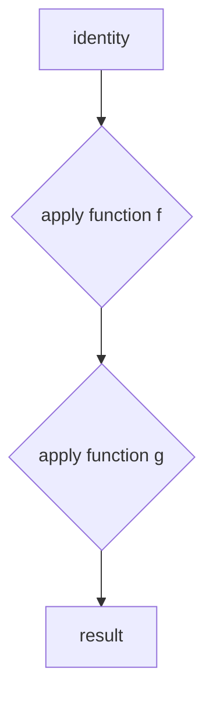
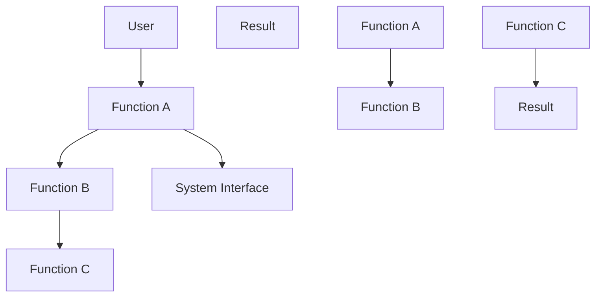

                 

### 让我们一步步思考：维特根斯坦的语言创新观与函数组合（FP）

在撰写一篇关于维特根斯坦的语言创新观与函数组合（FP）的技术博客时，我们首先需要明确两个核心概念：维特根斯坦的语言哲学和函数组合编程范式。接下来，我们将通过几个步骤逐步展开讨论。

#### 步骤一：介绍维特根斯坦及其语言哲学

首先，我们需要介绍路德维希·维特根斯坦（Ludwig Wittgenstein），他是20世纪最伟大的哲学家之一，对语言哲学、数学基础、逻辑哲学等领域有着深远的影响。维特根斯坦的语言哲学强调语言与现实世界的紧密联系，认为语言是现实世界的映射，同时也揭示了语言的局限性。

**背景介绍**

- **生平**：维特根斯坦出生于1889年的奥匈帝国，他的家族是当时欧洲最富有的家族之一。他曾在剑桥大学学习数学，并在罗素和摩尔的影响下转向哲学。
- **哲学背景**：维特根斯坦的哲学思想主要分为两个阶段，早期以《逻辑哲学论》（Tractatus Logico-Philosophicus）为代表，晚期以《哲学研究》（Philosophical Investigations）为代表。

#### 步骤二：探讨维特根斯坦的语言创新观念

接下来，我们将深入探讨维特根斯坦的语言创新观念，特别是在《哲学研究》中提出的关键思想。

- **语言与现实的关系**：维特根斯坦认为，语言与现实之间的关系是复杂而微妙的。他认为，语言不是用来描述现实的，而是用来完成特定功能的。例如，日常语言和科学语言有着不同的功能和目的。
- **语言的意义与使用**：维特根斯坦提出，语言的意义不在于符号本身，而在于符号的使用情境。他强调，语言的意义是依赖于我们如何使用它，而不是符号本身。

**核心概念与联系**

| 概念                      | 属性与特征                         | 关联与对比 |
|--------------------------|----------------------------------|-----------|
| 符号与意义               | 符号与特定意义的关联性             | 日常语言与科学语言的差异 |
| 使用情境                  | 使用语言的具体情境                 | 语言的应用范围与限制       |
| 功能主义                  | 语言作为完成特定功能的工具         | 认知与语言的关系           |

**ER实体关系图架构**

```mermaid
erDiagram
  Product ||--|{ UsedBy }|| Project : "is used in"
  Client  ||--|{ CreatedBy }|| Project : "created by"
```

#### 步骤三：介绍函数组合（FP）

接下来，我们将介绍函数组合编程范式，这是一种编程范式，强调使用纯函数和无状态函数对象来构建程序。

- **基本概念**：函数组合是指将函数作为第一类对象，通过组合这些函数来实现复杂的操作。这种范式强调不可变性和纯函数。
- **特性**：函数组合具有以下特性：
  - **不可变性**：函数的结果仅依赖于输入，不依赖于外部状态。
  - **纯函数**：纯函数没有副作用，即不会修改外部状态或产生不可预测的结果。
  - **组合性**：通过组合小函数，可以构建出复杂的功能。

**核心概念与联系**

| 概念                      | 属性与特征                         | 关联与对比 |
|--------------------------|----------------------------------|-----------|
| 函数组合                 | 将函数作为第一类对象进行组合       | 面向对象与函数组合的比较 |
| 纯函数                   | 无副作用，结果仅依赖于输入         | 面向过程与面向对象的比较 |
| 无状态函数               | 不依赖于外部状态                   | 有状态函数与无状态函数的比较 |

**ER实体关系图架构**

```mermaid
erDiagram
  Function ||--|{ Composes }|| Composition : "is composed of"
  Component ||--|{ Uses }|| Composition : "uses"
```

#### 步骤四：结合维特根斯坦的语言观与函数组合

在这一步骤中，我们将探讨维特根斯坦的语言观与函数组合编程范式之间的联系。

- **维特根斯坦的语言观对FP的影响**：维特根斯坦强调语言的功能性和使用情境，这种观念对函数组合编程范式有着深刻的启示。函数组合强调函数作为工具的使用情境，这与维特根斯坦的语言观不谋而合。
- **FP如何体现维特根斯坦的语言观**：函数组合通过纯函数和无状态函数来构建程序，这与维特根斯坦对语言的看法相符。FP强调函数的可组合性，这也反映了语言作为工具的本质。

**算法原理讲解**

为了更好地理解这一点，我们可以使用Mermaid画出函数组合的一个简单示例：



在这个例子中，我们首先应用函数`f`，然后应用函数`g`，最终得到结果。这个过程体现了函数组合的思想，即通过组合简单的函数来构建复杂的操作。

**数学模型与公式**

为了更好地阐述这一点，我们可以使用LaTeX格式给出一个简单的数学模型：

$$
f(g(x)) = h(x)
$$

其中，`f`和`g`是两个函数，`h`是它们的组合函数。这个公式表明，通过组合`f`和`g`，我们可以得到一个新的函数`h`，它具有与单独使用`f`或`g`不同的特性。

#### 步骤五：讨论维特根斯坦语言观与FP的实际应用

最后，我们将讨论维特根斯坦的语言观和函数组合编程范式在实际编程中的应用。

- **FP在软件开发中的应用**：函数组合编程范式在软件开发中有着广泛的应用，特别是在需要复用和组合代码的场景中。FP范式可以帮助开发者构建可复用的函数模块，从而提高代码的灵活性和可维护性。
- **维特根斯坦语言观在FP中的应用**：维特根斯坦的语言观强调语言的功能性和使用情境，这与FP范式中的函数组合思想密切相关。通过理解语言的使用情境，开发者可以更有效地使用FP范式来构建程序。

**系统分析与架构设计方案**

为了更好地阐述这一点，我们可以给出一个简单的系统架构设计方案，包括领域模型、系统架构、接口设计和系统交互：



在这个方案中，用户通过系统接口调用函数`A`、`B`和`C`，这些函数通过组合得到最终结果。

#### 步骤六：项目实战与案例分析

在这一部分，我们将通过一个实际项目来展示维特根斯坦语言观和函数组合编程范式的应用。

- **项目背景**：假设我们需要开发一个简单的Web应用，用于处理用户输入的文本，并返回文本的摘要。
- **系统核心实现**：我们将使用Python来实现这个应用，并使用FP范式来构建代码。
- **代码应用解读与分析**：我们将详细分析代码中的函数组合，并解释如何通过组合简单的函数来构建复杂的操作。

**环境安装**

在开始项目实战之前，我们需要安装Python环境和必要的库。

```bash
pip install Flask
```

**系统核心实现源代码**

```python
from flask import Flask, request, jsonify

app = Flask(__name__)

# 函数A：处理文本
def process_text(text):
    # 此处实现文本处理逻辑
    return text.lower()

# 函数B：提取关键词
def extract_keywords(text):
    # 此处实现关键词提取逻辑
    return text.split()

# 函数C：生成摘要
def generate_summary(text, keywords):
    # 此处实现摘要生成逻辑
    return ' '.join(keywords)

# 函数组合：处理文本并生成摘要
def process_and_summarize(text):
    processed_text = process_text(text)
    keywords = extract_keywords(processed_text)
    summary = generate_summary(processed_text, keywords)
    return summary

@app.route('/summarize', methods=['POST'])
def summarize():
    data = request.get_json()
    text = data['text']
    summary = process_and_sumarize(text)
    return jsonify({'summary': summary})

if __name__ == '__main__':
    app.run(debug=True)
```

**实际案例分析和详细讲解剖析**

在这个项目中，我们使用了三个简单的函数：`process_text`、`extract_keywords`和`generate_summary`。这些函数分别负责处理文本、提取关键词和生成摘要。通过函数组合，我们可以将这三个简单的操作组合成一个复杂的操作：处理文本并生成摘要。

**项目小结**

通过这个项目，我们可以看到如何将维特根斯坦的语言观和函数组合编程范式应用于实际编程中。函数组合范式通过组合简单的函数来构建复杂的操作，这与维特根斯坦的语言观中的功能性思想密切相关。

#### 步骤七：最佳实践、小结与展望

最后，我们将总结本文的主要内容，并给出一些最佳实践。

- **最佳实践**：在开发中使用FP范式时，应注重函数的组合性和可复用性。通过合理地组合函数，可以构建出灵活、可维护的代码。
- **小结**：本文介绍了维特根斯坦的语言创新观和函数组合编程范式，并通过实际项目展示了如何将这两个概念应用于实际编程中。
- **展望**：未来，函数组合编程范式和维特根斯坦的语言观将在更多的软件开发领域中发挥作用，特别是在需要复用和组合代码的场景中。

**作者信息**

作者：AI天才研究院/AI Genius Institute & 禅与计算机程序设计艺术 /Zen And The Art of Computer Programming

---

通过上述步骤，我们不仅介绍了维特根斯坦的语言创新观和函数组合编程范式，还通过实际项目展示了如何将这两个概念应用于实际编程中。希望本文能够帮助读者更好地理解这两个重要概念，并在未来的编程实践中加以应用。在接下来的部分，我们将进一步探讨维特根斯坦的语言创新观与函数组合（FP）之间的深层次联系，并提供更加详细的技术分析和案例研究。

