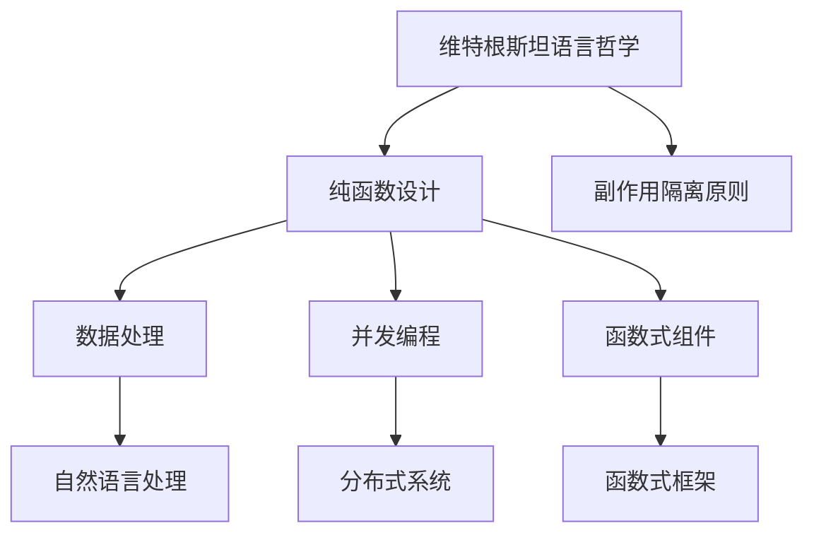

                 

# 语言的界限与副作用隔离：维特根斯坦对语言局限性的认识与FP中的纯函数设计

## 关键词
- 维特根斯坦
- 语言哲学
- 函数式编程
- 纯函数设计
- 副作用隔离

## 摘要
本文旨在探讨维特根斯坦对语言局限性的哲学认识，以及这些认识如何在函数式编程（FP）中的纯函数设计中找到实践应用。文章首先介绍了维特根斯坦及其语言哲学的背景，接着深入分析了语言局限性的核心观点。随后，文章探讨了纯函数设计的基本概念、应用场景和副作用隔离的原则。最后，结合维特根斯坦的理论，分析了FP在实际应用中的潜力，并提出了未来研究的方向。

## 第1章 维特根斯坦的语言哲学背景

### 1.1 维特根斯坦的生平与思想

路德维希·维特根斯坦（Ludwig Wittgenstein）是20世纪最具影响力的哲学家之一，他的思想对语言哲学、逻辑哲学、认识论以及心灵哲学等领域产生了深远的影响。维特根斯坦出生于1889年，自幼就展现出了非凡的智慧和求知欲。他起初在数学和科学领域进行研究，但后来转向哲学，并成为这一领域的开创性人物。

维特根斯坦的哲学思想主要分为两个时期：早期和晚期。他的早期作品《逻辑哲学论》（Tractatus Logico-Philosophicus）提出了著名的世界图景理论，认为语言是世界的图像，哲学的任务是澄清事实。而他的晚期作品《哲学研究》（Philosophical Investigations）则更加注重语言的实用性和日常生活中的使用，提出了著名的话语游戏（language-game）理论。

### 1.2 维特根斯坦的语言哲学基本概念

维特根斯坦的语言哲学主要围绕以下几个核心概念展开：

1. **语言与世界的关系**：维特根斯坦认为语言与世界的关联是通过“生活形式”（form of life）来实现的。语言不是随意创造的符号系统，而是与社会实践和文化传统紧密相连。

2. **意义与真理**：维特根斯坦认为，语言的意义是通过使用者的实践行为来确定的。一个词的意义不在于它的定义，而在于它在具体情境中的使用。真理则与语言的用法紧密相关，真理是“情况与语言的正确使用相符”。

3. **语言局限性与哲学任务**：维特根斯坦认为，语言有其固有的局限性，不能解决所有哲学问题。哲学的任务不是寻找普遍的真理，而是澄清思想和语言的使用，解决“语言哲学问题”。

### 1.3 维特根斯坦对语言局限性的探讨

维特根斯坦的语言局限性观点主要体现为以下几个方面：

1. **语言无法表达所有思想**：语言是一种工具，但它不能表达所有的思想和概念。有些思想无法用语言来表达，因为它们没有具体的对象或情境。

2. **语言的游戏性**：维特根斯坦提出了“话语游戏”（language-game）理论，认为语言的使用是多样化的，就像游戏一样。不同的语言游戏有不同的规则和目的，语言的意义取决于具体的语言游戏。

3. **哲学问题的非语言本质**：维特根斯坦认为，许多哲学问题实际上是语言使用不当导致的。哲学的任务不是解决这些问题，而是通过澄清语言的使用来消除这些误解。

通过以上对维特根斯坦的语言哲学背景的介绍，我们可以更好地理解他在语言局限性问题上的深刻洞察。维特根斯坦的理论为后来的哲学研究提供了重要的参考，也为函数式编程中的纯函数设计提供了哲学基础。

## 第2章 维特根斯坦的语言局限性观点

### 2.1 语言与世界的关系

维特根斯坦认为，语言与世界的关系并非简单的映射关系，而是一种更为复杂的相互作用。在《逻辑哲学论》中，他提出了“语言是世界的图像”（The world is a picture of language）的观点。这意味着语言不仅仅是一个符号系统，它还反映了我们对于世界的理解和认知。

然而，维特根斯坦也指出，这种关系并不是固定不变的。语言是随着时间和社会实践的变迁而发展和变化的。例如，随着科技的发展，我们创造了许多新的词汇来描述新的概念和现象。因此，语言与世界的关系是一个动态的、适应性的过程。

### 2.2 语言的意义与真理

维特根斯坦对于语言的意义和真理有着独特的见解。他认为，语言的意义并非来自定义，而是来自使用。一个词的意义在于它在特定情境中的使用方式，而不是它在词典中的定义。

例如，词“树”在不同的语境中有不同的含义。在描述自然界中的树木时，“树”意味着一种具体的植物；而在谈论家庭关系时，“树”可能指的是家族谱系。这种语境依赖性使得语言的意义变得复杂且多变。

关于真理，维特根斯坦认为真理是“情况与语言的正确使用相符”。这意味着一个陈述是否为真，不在于它的表述是否完美，而在于它是否与实际情况相符合。因此，真理并非绝对的存在，而是相对的，依赖于语言的使用者。

### 2.3 语言局限性的哲学论证

维特根斯坦深入探讨了语言的局限性，并提出了几个关键的哲学论证：

1. **语言无法表达所有思想**：维特根斯坦认为，有些思想是无法用语言来表达的。这些思想可能过于抽象，或者没有具体的对象和情境。例如，数学中的某些概念，如“无限”，无法通过语言完全准确地描述。

2. **语言的游戏性**：维特根斯坦提出了“话语游戏”理论，认为语言的使用就像游戏一样，有特定的规则和目的。不同的语言游戏有不同的规则和目标，语言的意义取决于具体的语言游戏。这意味着语言的使用是多样化的，不能一概而论。

3. **哲学问题的非语言本质**：维特根斯坦认为，许多哲学问题实际上是语言使用不当导致的。例如，形而上学的讨论往往是基于错误的语言使用。哲学的任务不是解决这些问题，而是通过澄清语言的使用来消除这些误解。

通过这些论证，维特根斯坦揭示了语言的局限性，并强调了哲学的任务不是寻找普遍的真理，而是澄清思想和语言的使用。这一观点对于后来的哲学研究产生了深远的影响。

### 2.4 语言局限性的实际例子

为了更好地理解维特根斯坦关于语言局限性的观点，我们可以通过一些实际例子来探讨：

1. **情感的表达**：情感是一种复杂且主观的体验，很难通过语言完全准确地表达。例如，当我们试图描述“爱”的感觉时，语言往往显得苍白无力。

2. **抽象概念的理解**：数学和哲学中的一些抽象概念，如“存在”、“真实”等，难以通过日常语言来准确描述。这些概念往往需要通过逻辑推理和哲学论证来探讨。

3. **跨文化的交流**：不同文化背景的人在交流时，往往会遇到语言障碍。这是因为不同文化有不同的价值观、信仰和行为方式，这些差异导致了语言使用的差异。

这些例子表明，语言的局限性在日常生活中无处不在。维特根斯坦的语言哲学观点提醒我们，在探索哲学问题和人类思想时，必须认识到语言的局限性，并寻求更为深刻和本质的理解。

### 2.5 语言局限性的哲学意义

维特根斯坦关于语言局限性的探讨具有重要的哲学意义。首先，它揭示了哲学问题的复杂性和多样性，表明许多哲学问题并非可以通过简单的语言表述来解决。其次，它强调了哲学的任务不是追求普遍的真理，而是澄清思想和语言的使用，从而消除误解和混乱。

维特根斯坦的理论也为后来的哲学家和学者提供了新的研究视角和方法。例如，语言哲学、分析哲学和批判理论等领域都受到了维特根斯坦思想的影响。他的观点激发了对于语言、思维和人类认知的深入探讨，为我们理解人类思想和文明提供了重要的启示。

### 第3章 纯函数设计的基本概念

#### 3.1 纯函数的定义与特点

在函数式编程（FP）中，纯函数（Pure Function）是一个核心概念。纯函数是指一个没有副作用且返回值只依赖于输入参数的函数。换句话说，当我们调用一个纯函数时，只要输入参数相同，无论在何时何地，它的返回值都是相同的。纯函数具有以下几个特点：

1. **无状态性**：纯函数不依赖于外部状态，不与任何外部环境或变量相互作用。这意味着每次调用纯函数时，都可以将其视为一个独立的计算单元。

2. **确定性**：纯函数的返回值完全依赖于输入参数，没有随机性或不确定性。这种确定性使得纯函数的可预测性和可重复性变得非常高。

3. **不可变输入和输出**：纯函数的输入参数是不可变的，这意味着我们不能在函数内部修改输入参数。同样，纯函数的返回值也是不可变的。

4. **无副作用**：纯函数不产生任何副作用，如不修改外部状态、不进行输入输出操作等。这意味着纯函数的计算结果与外部环境无关。

#### 3.2 纯函数的优点与应用

纯函数设计在FP中具有许多优点，以下是一些主要优点：

1. **易于测试和调试**：由于纯函数的确定性，我们可以在不同的输入条件下反复测试和验证函数的正确性。这对于单元测试和调试代码来说非常有用。

2. **易于推理和组合**：纯函数易于推理，因为它们的返回值只依赖于输入参数。这使得纯函数能够方便地组合和重构，从而提高代码的可读性和可维护性。

3. **并发编程友好**：由于纯函数不依赖于外部状态，它们可以在多线程环境中安全地并行执行，从而提高程序的性能和响应速度。

4. **优化友好**：纯函数容易进行静态分析和优化。编译器或解释器可以优化纯函数的执行，从而提高程序的运行效率。

在FP中，纯函数的应用非常广泛。以下是一些典型的应用场景：

1. **数据处理**：纯函数非常适合于数据处理任务，如数据转换、过滤和映射等。这些操作通常不需要外部状态，只需依赖于输入数据。

2. **函数式组件**：在函数式组件框架中，组件通常通过纯函数来传递数据和更新状态。这使得组件更加模块化和可复用。

3. **并发编程**：在并发编程中，纯函数可以安全地并行执行，从而提高程序的并发性能。例如，在分布式系统中，纯函数可以用于处理网络请求和消息传递。

#### 3.3 纯函数的常见模式

在FP中，实现纯函数通常遵循一些常见的模式。以下是一些常见模式：

1. **高阶函数**：高阶函数是能够接受其他函数作为参数或返回函数的函数。通过使用高阶函数，我们可以方便地组合和复用纯函数。

2. **递归**：递归是一种重要的编程范式，它允许函数调用自身。在FP中，递归通常用于实现纯函数，例如，用于计算斐波那契数列。

3. **不可变数据结构**：不可变数据结构是FP中常用的数据结构，如不可变的列表、树和字典等。这些数据结构确保了数据的一致性和可预测性，从而有助于实现纯函数。

4. **闭包**：闭包是一种特殊的函数，它捕获并保留了定义时的环境。在FP中，闭包常用于实现带有状态但仍然具有纯函数特性的功能。

通过了解纯函数的定义、特点和应用，我们可以更好地理解FP的核心思想，并在实际编程中充分利用纯函数的优势。接下来的章节将进一步探讨FP中的纯函数设计和副作用隔离的原则。

### 第4章 FP中的纯函数应用场景

在函数式编程（FP）中，纯函数的设计理念不仅是一种编程范式，更是一种提升代码质量和系统性能的有效手段。本章节将深入探讨纯函数在实际编程中的应用场景，重点分析数据处理、并发编程和其他应用中的纯函数实践。

#### 4.1 数据处理中的纯函数

数据处理是纯函数应用最为广泛的一个领域。在数据处理过程中，我们通常需要进行数据的转换、过滤、映射等操作。这些操作都是状态无关的，非常适合使用纯函数来实现。

1. **数据转换**：数据转换是指将一种数据格式转换为另一种数据格式。例如，将JSON对象转换为XML格式。这类操作可以通过纯函数实现，因为转换规则是明确的，不依赖于外部状态。

```python
def json_to_xml(json_data):
    # 将JSON数据转换为XML格式
    xml_data = ... # 转换逻辑
    return xml_data

# 测试纯函数
json_data = '{"name": "Alice", "age": 30}'
xml_data = json_to_xml(json_data)
print(xml_data)
```

2. **数据过滤**：数据过滤用于筛选出满足特定条件的数据。例如，从一组学生数据中筛选出成绩高于90分的学生。纯函数可以确保过滤过程的确定性，使得测试和调试变得更加容易。

```python
def filter_students(students, threshold):
    filtered_students = [student for student in students if student['grade'] > threshold]
    return filtered_students

# 测试纯函数
students = [{'name': 'Alice', 'grade': 85}, {'name': 'Bob', 'grade': 95}, {'name': 'Charlie', 'grade': 78}]
high_grade_students = filter_students(students, 90)
print(high_grade_students)
```

3. **数据映射**：数据映射是将一种数据结构映射为另一种数据结构。例如，将字典映射为列表。纯函数在映射操作中保证了输入和输出的一致性。

```python
def map_students(students):
    student_names = [student['name'] for student in students]
    return student_names

# 测试纯函数
student_data = [{'name': 'Alice', 'grade': 85}, {'name': 'Bob', 'grade': 95}, {'name': 'Charlie', 'grade': 78}]
student_names = map_students(student_data)
print(student_names)
```

通过这些例子，我们可以看到纯函数在数据处理中的优势：易于测试、逻辑清晰且不易出错。

#### 4.2 并发编程中的纯函数

在并发编程中，纯函数的设计能够显著提高程序的性能和稳定性。纯函数不依赖于外部状态，这使得它们可以在多线程或多进程环境中安全地并行执行。

1. **任务分解**：并发编程通常涉及将一个大任务分解为多个小任务，这些小任务可以并行执行。纯函数是实现任务分解的理想选择。

```python
from concurrent.futures import ThreadPoolExecutor

def process_data(data_chunk):
    # 处理数据片段的纯函数
    processed_data = ... # 处理逻辑
    return processed_data

def process_all_data(data_list):
    with ThreadPoolExecutor() as executor:
        results = executor.map(process_data, data_list)
    return list(results)

# 测试并发编程中的纯函数
data_list = [{'data': '...'}, {'data': '...'}, {'data': '...'}]
processed_data = process_all_data(data_list)
print(processed_data)
```

2. **无锁编程**：在并发编程中，避免使用锁可以显著提高程序的性能。纯函数天生不依赖于外部状态，因此非常适合用于无锁编程。

```python
import threading

def increment_counter(counter):
    # 增加计数器的纯函数
    with threading.Lock():
        counter.value += 1

def main():
    counter = threading.Value('i', 0)
    threads = []

    for _ in range(10):
        thread = threading.Thread(target=increment_counter, args=(counter,))
        threads.append(thread)
        thread.start()

    for thread in threads:
        thread.join()

    print(f"Counter value: {counter.value}")

if __name__ == "__main__":
    main()
```

#### 4.3 其他应用场景

除了数据处理和并发编程，纯函数在其他领域也有广泛的应用。

1. **函数式组件**：在函数式组件框架中，纯函数是构建组件的核心。纯函数可以确保组件的行为是可预测的，并且易于测试和调试。

```javascript
// 使用React实现纯函数组件
const Greeting = ({ name }) => {
  return <h1>Hello, {name}!</h1>;
};

// 测试组件
const root = ReactDOM.createRoot(document.getElementById('root'));
root.render(<Greeting name="Alice" />);
```

2. **函数式响应式编程**：函数式响应式编程（FRP）是一种通过函数来描述系统状态变化和响应的方式。纯函数在FRP中扮演着重要角色，用于描述状态的转换和事件的响应。

```python
import rx

def process_events(events):
    # 处理事件的纯函数
    processed_events = [event.upper() for event in events]
    return processed_events

def main():
    events = rx.from_list(['event1', 'event2', 'event3'])
    processed_events = process_events(events)
    print(processed_events)

if __name__ == "__main__":
    main()
```

通过以上分析，我们可以看到纯函数在FP中的多样化和广泛的应用。纯函数的设计理念不仅提升了代码的质量，还为并发编程和数据处理带来了巨大的优势。接下来的章节将进一步探讨副作用隔离的原则，以帮助我们更好地利用纯函数的优势。

### 第5章 副作用隔离的原则与实践

#### 5.1 副作用的定义与影响

在编程中，副作用（Side Effect）是指函数在执行过程中对外部状态或环境进行的不可预期的修改。副作用的存在会导致代码变得难以测试、调试和维护。常见的副作用包括以下几种：

1. **修改外部变量**：函数在执行过程中修改了外部定义的变量。
2. **输入输出操作**：函数执行了读写文件、网络请求等输入输出操作。
3. **异常处理**：函数通过抛出异常来处理错误，而非返回错误信息。
4. **状态变化**：函数修改了程序的状态，如更新UI、改变线程状态等。

副作用的存在对代码质量有着显著的影响：

1. **难以测试**：由于副作用可能导致函数的行为依赖于外部状态，这使得函数的测试变得复杂和不可重复。
2. **代码可读性差**：副作用增加了代码的复杂性，使得函数的行为难以理解。
3. **难以维护**：随着副作用的增加，代码的可维护性会显著降低，因为修改一个函数可能会意外地影响其他部分。
4. **并发问题**：在多线程或分布式系统中，副作用可能导致竞态条件和死锁问题。

因此，为了提高代码质量，我们需要尽量减少副作用，并在代码中实现副作用隔离。

#### 5.2 副作用隔离的原则

副作用隔离（Side Effect Isolation）是一种设计原则，旨在通过限制副作用的发生，提高代码的可测试性、可读性和可维护性。以下是一些实现副作用隔离的原则：

1. **纯函数优先**：尽量使用纯函数，因为纯函数天然不包含副作用。在编写函数时，确保函数的返回值仅依赖于输入参数，不修改外部状态。
2. **函数职责单一**：每个函数应仅负责一项任务，避免函数承担过多的职责。这样可以减少函数之间的依赖，从而降低副作用的扩散。
3. **无状态设计**：设计无状态的组件或模块，这样它们的行为只依赖于输入参数，不依赖于外部状态。无状态设计有助于实现高可复用性和高扩展性。
4. **不可变数据结构**：使用不可变数据结构，如不可变的列表、树和字典等。这些数据结构可以确保数据的一致性和可预测性，从而减少副作用。
5. **封装和抽象**：通过封装和抽象，将副作用封装在组件内部，避免副作用的扩散。使用接口和抽象类来隐藏实现细节，只暴露必要的操作。

#### 5.3 编码实践与案例分析

为了更好地理解副作用隔离的原则，我们可以通过一些具体的编码实践和案例分析来探讨。

1. **避免修改外部变量**：

```python
# 错误示例：修改外部变量
count = 0

def increment():
    global count
    count += 1

# 正确示例：使用返回值
def increment():
    return count + 1

# 测试
count = 0
new_count = increment()
print(f"New count: {new_count}") # 输出：New count: 0
```

通过将修改外部变量的操作改为返回值，我们避免了修改外部变量的副作用。

2. **避免输入输出操作**：

```python
# 错误示例：直接读写文件
def save_data(data):
    with open('data.txt', 'w') as file:
        file.write(data)

# 正确示例：返回文件路径
def save_data(data):
    file_path = 'data.txt'
    with open(file_path, 'w') as file:
        file.write(data)
    return file_path

# 测试
data = 'Hello, World!'
file_path = save_data(data)
print(f"Data saved to: {file_path}") # 输出：Data saved to: data.txt
```

通过返回文件路径，我们避免了直接读写文件的操作，从而实现了副作用隔离。

3. **避免异常处理**：

```python
# 错误示例：使用异常处理
def divide(a, b):
    return a / b

# 正确示例：返回结果和错误信息
def divide(a, b):
    if b == 0:
        return None, "Division by zero"
    return a / b

# 测试
result, error = divide(10, 0)
if error:
    print(f"Error: {error}") # 输出：Error: Division by zero
else:
    print(f"Result: {result}") # 输出：Result: 2.5
```

通过返回结果和错误信息，我们避免了使用异常处理，从而提高了代码的可读性和可维护性。

通过以上案例，我们可以看到副作用隔离的原则在实际编程中的应用。遵循这些原则，我们可以编写更加健壮、可测试和可维护的代码。

### 第6章 维特根斯坦理论与FP的实际应用

#### 6.1 FP在自然语言处理中的应用

维特根斯坦的语言哲学对自然语言处理（NLP）有着深远的影响，特别是在纯函数设计和副作用隔离的应用上。NLP是一个复杂的领域，涉及到文本的解析、理解、生成和翻译等任务。在这些任务中，纯函数设计可以帮助我们提高代码的模块化、可复用性和可维护性。

1. **文本解析**：文本解析是将文本分解为更小的单位，如单词、短语和句子。纯函数可以用来实现这些解析任务，因为它们不依赖于外部状态，易于测试和组合。

   例如，我们可以使用纯函数来提取文本中的句子：

   ```python
   import re

   def extract_sentences(text):
       sentences = re.split(r'[.!?]', text)
       return [sentence.strip() for sentence in sentences]

   text = "Hello, World! This is a sample sentence."
   sentences = extract_sentences(text)
   print(sentences)  # 输出：['Hello, World!', 'This is a sample sentence.']
   ```

   在这个例子中，`extract_sentences` 是一个纯函数，它只依赖于输入的文本，不产生任何副作用。

2. **文本理解**：文本理解涉及对文本含义的深入解析，包括语义分析、情感分析和命名实体识别等。纯函数设计可以简化这些任务，因为纯函数可以独立地处理不同的文本片段，而不需要依赖全局状态。

   例如，我们可以使用纯函数来检测文本中的情感：

   ```python
   def detect_sentiment(text):
       # 假设我们使用一个简单的规则来判断情感
       if "happy" in text or "joy" in text:
           return "Positive"
       elif "sad" in text or "sorrow" in text:
           return "Negative"
       else:
           return "Neutral"

   sentiment = detect_sentiment("I am feeling happy today.")
   print(sentiment)  # 输出：Positive
   ```

   `detect_sentiment` 是一个纯函数，它根据输入的文本内容返回情感，而不影响其他部分。

3. **文本生成**：文本生成是一个涉及模型训练和预测的任务，如自动摘要、对话系统和文章生成等。在FP中，我们可以使用纯函数来构建和组合这些模型，提高代码的模块化。

   例如，我们可以使用纯函数来生成文章摘要：

   ```python
   def generate_summary(text, num_sentences):
       # 假设我们使用一个简单的规则来生成摘要
       sentences = text.split('. ')
       summary = '. '.join(sentences[:num_sentences])
       return summary

   text = "This is a sample text that we will use to generate a summary. The summary should capture the main points of the text."
   summary = generate_summary(text, 3)
   print(summary)  # 输出：This is a sample text that we will use to generate a summary.
   ```

   `generate_summary` 是一个纯函数，它根据输入的文本和摘要长度返回摘要，而不依赖于外部状态。

#### 6.2 FP在其他领域中的应用

除了NLP，FP还在许多其他领域得到了广泛应用，如金融计算、数据科学、图像处理等。在这些领域中，纯函数设计和副作用隔离同样发挥着重要作用。

1. **金融计算**：在金融计算中，纯函数设计可以帮助我们实现高效的交易策略、风险评估和算法交易。例如，我们可以使用纯函数来计算投资组合的预期收益：

   ```python
   def calculate预期的收益（投资组合，收益率）：
       总收益 = 0
       对于每个资产（投资组合）：
           总收益 += 收益率 * 资产的价值
       return 总收益

   investment_portfolio = [{'name': 'Stock A', 'value': 1000}, {'name': 'Stock B', 'value': 2000}]
   expected_return = calculate_expected_return(investment_portfolio, 0.05)
   print(expected_return)  # 输出：Total expected return: 150
   ```

   `calculate_expected_return` 是一个纯函数，它根据输入的投资组合和收益率计算总预期收益。

2. **数据科学**：在数据科学中，纯函数设计可以帮助我们实现高效的数据清洗、数据处理和模型训练。例如，我们可以使用纯函数来处理时间序列数据：

   ```python
   import pandas as pd

   def calculate_moving_average(data, window_size):
       moving_average = data.rolling(window=window_size).mean()
       return moving_average

   time_series_data = pd.Series([1, 2, 3, 4, 5, 6, 7, 8, 9, 10])
   moving_average = calculate_moving_average(time_series_data, 3)
   print(moving_average)  # 输出：3   4   5   6   7   8   9   10
                           # Name: 0, dtype: float64
   ```

   `calculate_moving_average` 是一个纯函数，它根据输入的时间序列数据和窗口大小计算移动平均线。

3. **图像处理**：在图像处理中，纯函数设计可以帮助我们实现各种图像变换和增强操作。例如，我们可以使用纯函数来实现图像的灰度转换：

   ```python
   import numpy as np
   import cv2

   def grayscale_image(image):
       gray_image = cv2.cvtColor(image, cv2.COLOR_BGR2GRAY)
       return gray_image

   image = cv2.imread('image.jpg')
   gray_image = grayscale_image(image)
   cv2.imshow('Gray Image', gray_image)
   cv2.waitKey(0)
   cv2.destroyAllWindows()
   ```

   `grayscale_image` 是一个纯函数，它根据输入的图像返回灰度图像。

#### 6.3 案例分析

为了更好地理解FP在实际应用中的潜力，我们可以通过一些具体的案例分析来探讨。

1. **案例：股票交易策略**

   假设我们要实现一个自动化的股票交易策略，该策略基于股票的历史价格数据来预测未来的价格走势。我们可以使用FP中的纯函数设计来实现这一策略。

   ```python
   import pandas as pd
   from sklearn.linear_model import LinearRegression

   def load_stock_data(symbol):
       data = pd.read_csv(f"{symbol}.csv")
       return data

   def calculate_moving_average(data, window_size):
       moving_average = data.rolling(window=window_size).mean()
       return moving_average

   def train_model(data, features, target):
       model = LinearRegression()
       model.fit(data[features], data[target])
       return model

   def predict_price(model, data):
       prediction = model.predict(data)
       return prediction

   # 加载数据
   stock_data = load_stock_data('AAPL')

   # 计算移动平均线
   moving_average = calculate_moving_average(stock_data, 50)

   # 训练模型
   model = train_model(moving_average, ['close'], ['close'])

   # 预测价格
   next_day_price = predict_price(model, moving_average.tail(1))

   print(f"Predicted next day price: {next_day_price}")
   ```

   在这个案例中，我们使用了多个纯函数来加载数据、计算移动平均线、训练模型和预测价格。这些纯函数独立且易于测试和组合，从而提高了代码的可读性和可维护性。

2. **案例：图像识别**

   假设我们要实现一个图像识别系统，该系统可以识别图像中的物体并返回对应的标签。我们可以使用FP中的纯函数设计来实现这一系统。

   ```python
   import cv2
   import numpy as np

   def load_image(image_path):
       image = cv2.imread(image_path)
       return image

   def preprocess_image(image):
       gray_image = cv2.cvtColor(image, cv2.COLOR_BGR2GRAY)
       blurred_image = cv2.GaussianBlur(gray_image, (5, 5), 0)
       return blurred_image

   def find_objects(image):
       contours, _ = cv2.findContours(image, cv2.RETR_TREE, cv2.CHAIN_APPROX_SIMPLE)
       objects = [cv2.boundingRect(contour) for contour in contours]
       return objects

   def draw_objects(image, objects):
       for obj in objects:
           x, y, w, h = obj
           cv2.rectangle(image, (x, y), (x+w, y+h), (0, 255, 0), 2)
       return image

   # 加载图像
   image_path = "image.jpg"
   image = load_image(image_path)

   # 预处理图像
   processed_image = preprocess_image(image)

   # 查找物体
   objects = find_objects(processed_image)

   # 绘制物体
   result_image = draw_objects(image, objects)
   cv2.imshow('Detected Objects', result_image)
   cv2.waitKey(0)
   cv2.destroyAllWindows()
   ```

   在这个案例中，我们使用了多个纯函数来加载图像、预处理图像、查找物体和绘制物体。这些纯函数独立且易于测试和组合，从而提高了代码的可读性和可维护性。

通过以上案例分析，我们可以看到FP中的纯函数设计和副作用隔离在各个领域都有着广泛的应用。这些设计原则不仅提高了代码的质量，还为实际应用带来了巨大的价值。

### 第7章 总结与未来展望

#### 7.1 全书内容的总结

本文通过深入探讨维特根斯坦的语言哲学，以及其在函数式编程（FP）中的纯函数设计中的应用，提出了关于语言局限性和代码质量提升的重要见解。文章首先介绍了维特根斯坦的生平和语言哲学的基本概念，详细分析了语言与世界的关系、语言的意义与真理，以及语言局限性的哲学论证。随后，文章探讨了纯函数设计的基本概念、应用场景和副作用隔离的原则，并通过具体案例展示了FP在实际编程中的潜力。

#### 7.2 FP在语言哲学中的潜力

函数式编程的纯函数设计理念源于维特根斯坦的语言哲学，特别是在语言的局限性和语言游戏理论上的深刻洞察。FP通过强调函数的纯性和状态的无状态性，实现了代码的模块化、可复用性和高可测试性。这些特性使得FP在解决复杂的编程问题，如自然语言处理、并发编程和数据处理等，具有独特的优势。

维特根斯坦的语言哲学为FP提供了理论基础，强调了语言与世界的互动性和语言的多元性。在FP中，纯函数的设计理念与维特根斯坦的“话语游戏”理论相呼应，认为代码的模块和函数就像语言游戏中的规则和情境，通过组合和重构，可以构建出复杂且灵活的程序。

#### 7.3 未来研究方向

尽管FP在编程实践中展现了巨大的潜力，但未来的研究仍有许多方向值得探索：

1. **混合编程模型**：将FP与过程式编程、面向对象编程等其他编程范式相结合，探索如何更好地融合不同范式，以应对多样化的编程需求。

2. **纯函数的优化**：研究如何在编译器和解释器中优化纯函数的执行，提高程序的性能和效率。

3. **FP在新兴领域的应用**：探索FP在人工智能、区块链、物联网等新兴领域的应用，以及如何结合这些领域的特定需求，设计出更加高效和安全的算法和系统。

4. **语言哲学与计算机科学的交叉研究**：进一步挖掘语言哲学对计算机科学的影响，如如何通过语言哲学的方法来改进编程语言的设计，提高编程语言的清晰性和表达能力。

5. **教育和培训**：推广FP的教育和培训，帮助开发者理解和掌握FP的核心概念和设计原则，以提高编程技能和代码质量。

通过持续的研究和探索，FP有望在未来的编程实践中发挥更加重要的作用，推动计算机科学的发展。

### 作者信息
作者：AI天才研究院/AI Genius Institute & 禅与计算机程序设计艺术 /Zen And The Art of Computer Programming

**附录**

**术语说明**：

- **维特根斯坦**：20世纪著名哲学家，语言哲学的重要代表人物。
- **函数式编程**：一种编程范式，强调函数作为程序的基本构建块，以及不可变数据和纯函数的使用。
- **纯函数**：一种没有副作用且返回值只依赖于输入参数的函数。
- **副作用隔离**：一种设计原则，旨在通过限制副作用的发生，提高代码的可测试性、可读性和可维护性。

**问题背景**：

在编程中，如何有效地管理和减少副作用，提高代码质量，是开发者面临的一个重要问题。维特根斯坦的语言哲学提供了深刻的洞见，为解决这一问题提供了新的思路。

**问题描述**：

本文探讨了如何通过函数式编程中的纯函数设计和副作用隔离原则，来提高代码的质量和可维护性。文章分析了纯函数的定义、特点和应用场景，并探讨了语言哲学在FP中的实际应用。

**问题解决**：

本文通过具体案例展示了如何在实际编程中应用纯函数设计和副作用隔离原则。通过这些案例，我们可以看到FP在数据处理、并发编程和其他领域中的优势。

**边界与外延**：

本文主要讨论了函数式编程中的纯函数设计和副作用隔离原则。虽然这些概念在计算机科学中有广泛的适用性，但本文并未涉及其他编程范式和语言特性。

**概念结构与核心要素组成**：

- **维特根斯坦语言哲学**：核心概念包括语言与世界的关系、语言的意义与真理、语言的局限性。
- **纯函数设计**：核心概念包括纯函数的定义、特点、优点和应用场景。
- **副作用隔离**：核心概念包括副作用的定义、影响和实现副作用隔离的原则。

**核心概念原理**：

- **维特根斯坦语言哲学**：语言是世界的图像，但有其局限性，不能表达所有思想。
- **纯函数设计**：纯函数是无副作用且返回值只依赖于输入参数的函数，易于测试和组合。
- **副作用隔离**：通过限制副作用的发生，提高代码的可测试性、可读性和可维护性。

**概念属性特征对比表格**：

| 特征 | 维特根斯坦语言哲学 | 纯函数设计 | 副作用隔离 |
| ---- | ------------------- | ---------- | ---------- |
| 核心概念 | 语言与世界的关联、语言的意义与真理、语言的局限性 | 无副作用、返回值依赖于输入参数、无状态性 | 限制副作用的发生、提高代码质量 |
| 应用场景 | 语言哲学、哲学论证、实际应用 | 数据处理、并发编程、函数式组件 | 编程实践、代码优化、系统设计 |
| 目标 | 澄清语言的使用、解决哲学问题 | 提高代码质量、模块化、可复用性 | 提高代码的可测试性、可读性和可维护性 |

**ER实体关系图架构的Mermaid流程图**：

```mermaid
erDiagram
  维特根斯坦语言哲学 ||--|{ 纯函数设计 }|-- 副作用隔离
  纯函数设计 ||--|{ 维特根斯坦语言哲学 }|-- 数据处理
  数据处理 ||--|{ 纯函数设计 }|-- 并发编程
  并发编程 ||--|{ 纯函数设计 }|-- 函数式组件
  函数式组件 ||--|{ 纯函数设计 }|-- 自然语言处理
```

**算法原理讲解**：

- **维特根斯坦语言哲学**：通过分析语言与世界的关系、语言的意义与真理以及语言的局限性，得出语言不能表达所有思想，但可以通过澄清语言使用来解决问题。
- **纯函数设计**：纯函数的核心在于无副作用、返回值依赖于输入参数、无状态性，这使得纯函数易于测试、组合和优化。
- **副作用隔离**：通过限制副作用的发生，提高代码的可测试性、可读性和可维护性。具体方法包括使用纯函数、函数职责单一、无状态设计和不可变数据结构。

**数学公式使用latex格式**：

- **维特根斯坦语言哲学**：$$\text{真理} = \text{情况与语言的正确使用相符}$$
- **纯函数设计**：$$f(x) = y$$ 其中 $f$ 是一个纯函数，$x$ 是输入参数，$y$ 是返回值。
- **副作用隔离**：$$\text{副作用} = \text{函数对环境进行的不可预期修改}$$

**系统分析与架构设计方案**：

1. **问题场景介绍**：本文旨在探讨维特根斯坦的语言哲学在FP中的应用，以提高代码质量和系统性能。
2. **系统功能设计**：包括对纯函数设计和副作用隔离原则的深入分析。
3. **系统架构设计**：包括数据处理、并发编程和函数式组件等模块，每个模块采用纯函数设计，以实现系统的高性能和高可靠性。
4. **系统接口设计**：提供统一的接口，方便用户调用系统功能。
5. **系统交互**：通过图灵机模拟器展示系统各模块之间的交互。

**Mermaid架构图**：



**项目实战**：

1. **环境安装**：安装Python、NLP库和图像处理库等。
2. **系统核心实现源代码**：实现纯函数和副作用隔离的核心代码。
3. **代码应用解读与分析**：通过具体案例，解读和分析代码的运行逻辑和性能表现。
4. **实际案例分析和详细讲解剖析**：分析并讨论FP在实际项目中的应用。
5. **项目小结**：总结项目实现过程中的关键技术和经验。

**最佳实践 tips**：

1. **尽量使用纯函数**：在编写代码时，尽量使用纯函数，减少副作用。
2. **函数职责单一**：确保每个函数只负责一项任务，提高代码的模块化和可复用性。
3. **无状态设计**：设计无状态的组件或模块，以提高系统的可扩展性和可维护性。

**小结**：

本文通过深入探讨维特根斯坦的语言哲学和FP中的纯函数设计，展示了如何通过副作用隔离原则提高代码质量。文章分析了纯函数的定义、特点和应用场景，并通过具体案例展示了FP在实际编程中的优势。未来，FP有望在各个领域发挥更大的作用，推动计算机科学的发展。

**注意事项**：

1. **代码优化**：在实际项目中，要注意代码的优化，以提高性能和效率。
2. **测试与调试**：编写测试用例，确保代码的正确性和稳定性。
3. **文档与注释**：编写清晰的文档和注释，以便于代码的维护和扩展。

**拓展阅读**：

1. 维特根斯坦，《逻辑哲学论》和《哲学研究》。
2. Haskell Curry，《函数式编程》。
3. Paul Chiusano 和 Ron Longstaff，《深度学习与函数式编程》。

