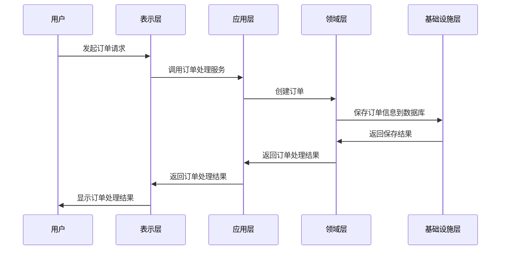

                 

### 引言

在计算机科学和哲学领域，语言的界限与建模方法一直是探讨的重要主题。语言作为人类沟通与思考的工具，其局限性对于我们的理解和表达有着深远的影响。哲学家维特根斯坦（Ludwig Wittgenstein）在其思想中深入探讨了语言的局限性，提出了“语言游戏”（language game）的概念，认为语言与世界的对应关系并非简单的映射，而是通过具体的语言游戏实现的。然而，这种探讨在计算机科学领域又有了新的维度，尤其是随着函数式编程（Functional Programming，FP）的兴起，函数式编程的领域驱动设计（Domain-Driven Design，DDD）成为了一种全新的系统建模方法。

这篇文章将探讨语言的界限与纯函数式编程之间的关系，以及函数式编程在领域驱动设计中的应用。我们将从维特根斯坦的语言局限性理论出发，逐步分析纯函数式编程的核心概念和原理，最后结合领域驱动设计的方法，探讨如何在实际项目中应用这些理念。

首先，我们需要明确本文的核心关键词：语言界限、维特根斯坦、函数式编程、领域驱动设计。这些关键词将贯穿全文，引导我们深入探讨这一复杂而又富有挑战性的主题。

**摘要**

本文旨在探讨语言的界限与纯函数式编程之间的关系，并分析函数式编程在领域驱动设计中的应用。通过回顾维特根斯坦的语言局限性理论，我们明确了语言作为思考工具的局限性，并探讨了这些局限性如何影响我们对复杂系统的建模。随后，我们详细介绍了纯函数式编程的核心概念和特点，以及其在领域驱动设计中的应用方法。本文的结构分为五个主要部分：引言、维特根斯坦的语言局限性、函数式编程、领域驱动设计以及案例分析。通过逐步的分析和实例讲解，本文旨在为读者提供一种全新的视角，帮助他们在实际项目中应用这些先进的概念和方法。

### 维特根斯坦的语言局限性

维特根斯坦（Ludwig Wittgenstein）是20世纪最杰出的哲学家之一，他的思想对语言、认识论和逻辑学等领域产生了深远的影响。在他的哲学著作中，特别是《逻辑哲学论》（"Tractatus Logico-Philosophicus"）和《哲学研究》（"Philosophical Investigations"）中，维特根斯坦深入探讨了语言的局限性和语言的实质。

维特根斯坦认为，语言是思维的载体，但语言本身并不能完全表达思想。他在《逻辑哲学论》中提出了一种语言观，认为语言像是一幅地图，地图与实际的地形相对应，但这种对应并非一一映射，而是一种“图像”关系。语言的图像理论强调了语言与现实世界的对应关系是复杂的、多层次的，而不是简单的、直接的映射。

在《哲学研究》中，维特根斯坦进一步发展了他的思想，提出了“语言游戏”（language game）的概念。他认为，语言的使用是多样化的，不同的语言游戏对应着不同的活动和生活场景。每个语言游戏都有其特定的规则和目的，这些规则和目的决定了语言的含义和用法。例如，数学语言游戏与自然科学有关，而日常语言游戏则与日常生活有关。维特根斯坦通过这一概念强调了语言与社会实践之间的紧密联系。

然而，维特根斯坦的语言理论也存在着一些局限性。首先，他的图像理论过于理想化，忽视了语言的模糊性和多义性。在实际生活中，语言并非总是清晰明确的，很多时候我们需要通过上下文和背景知识来理解语言的含义。其次，维特根斯坦的语言游戏概念虽然强调了语言的多样性，但也可能导致过度分散，难以进行系统性的语言分析。

在计算机科学领域，维特根斯坦的语言局限性理论有着重要的启示意义。计算机编程本身就是一种语言，编程语言与自然语言有许多相似之处，但也有着本质的不同。编程语言的抽象能力和确定性使其在处理复杂系统时具有独特的优势，但也面临着自然语言所不具备的局限性。例如，编程语言的表达能力有限，无法直接表达人类思维的复杂性和模糊性。此外，编程语言的设计和选择也需要考虑语言的局限性和特定应用场景的需求。

尽管维特根斯坦的理论在计算机科学中并非直接应用，但其对语言本质的深入探讨为我们提供了思考编程语言局限性的新视角。通过理解维特根斯坦的语言理论，我们可以更好地认识到编程语言的局限性，并探索如何通过新的编程范式和设计方法来弥补这些局限性。

### 纯函数式编程的核心概念

纯函数式编程（Pure Functional Programming）是一种编程范式，其核心思想是“函数是一等公民”，即函数可以作为参数传递给其他函数，也可以作为返回值从函数中返回。这种范式强调无状态性和不可变性，通过避免副作用和状态变化，实现了代码的简洁性和可预测性。

#### 函数作为一等公民

在纯函数式编程中，函数是一等公民的概念至关重要。这意味着函数可以像任何其他数据类型一样存储、传递和返回。例如，在Haskell语言中，函数可以作为一个变量存储，也可以作为参数传递给另一个函数，甚至可以作为一个函数的返回值。这种灵活性使得函数式编程在处理复杂逻辑和动态行为时显得尤为强大。

例如，我们可以定义一个简单的加法函数：

```python
def add(x, y):
    return x + y
```

然后，我们可以将这个函数作为参数传递给另一个函数：

```python
def apply_function(func, x, y):
    return func(x, y)

result = apply_function(add, 3, 4)
print(result)  # 输出：7
```

这种能力不仅提高了代码的复用性，还使得我们可以编写出更加模块化和可测试的代码。

#### 无状态性与不可变性

无状态性（Statelessness）和不可变性（Immutability）是纯函数式编程的另外两个核心概念。无状态性意味着函数在执行过程中不依赖于外部状态，每次调用函数时都会产生相同的结果。这意味着函数的行为是完全可预测的，不会因为外部环境的变化而发生变化。

不可变性则指的是数据一旦创建，就不能被修改。在纯函数式编程中，所有数据都是不可变的，这意味着我们不能直接修改数据，而是通过创建新的数据来替换旧的数据。这种做法不仅提高了代码的简洁性和可读性，还减少了副作用和状态管理的复杂性。

例如，我们可以定义一个不可变的列表：

```python
my_list = [1, 2, 3]

# 创建一个新的列表，添加一个元素
new_list = my_list + [4]

# 原列表不变
print(my_list)  # 输出：[1, 2, 3]
print(new_list)  # 输出：[1, 2, 3, 4]
```

这种不可变的数据结构在函数式编程中非常常见，例如Haskell中的`()`和`[]`，以及JavaScript中的`Immutable.js`库。

#### 高阶函数与闭包

高阶函数（Higher-Order Functions）是纯函数式编程中的另一个重要概念。高阶函数可以接受函数作为参数，或者返回函数。这种能力使得我们可以编写出更加抽象和通用的函数，从而提高代码的复用性。

例如，我们可以定义一个高阶函数`map`，它接受一个函数和一个列表，然后对列表中的每个元素应用这个函数：

```python
def map(func, items):
    return [func(item) for item in items]

numbers = [1, 2, 3]
squared_numbers = map(lambda x: x**2, numbers)
print(squared_numbers)  # 输出：[1, 4, 9]
```

闭包（Closure）是另一个与高阶函数密切相关的概念。闭包是一个函数，它记住并访问了创建它的作用域中的变量。这意味着闭包可以访问和操作定义它的作用域中的变量，而不仅仅是当前的局部变量。

例如，我们可以定义一个闭包来计算圆的面积：

```python
def make_area_function(radius):
    def area():
        return 3.14 * radius * radius
    return area

circle_area = make_area_function(5)
print(circle_area())  # 输出：78.5
```

在这个例子中，`make_area_function`返回了一个闭包`area`，这个闭包记住了`radius`变量，并可以使用它来计算圆的面积。这种能力在处理动态数据和行为时非常有用。

#### 纯函数式编程的优势与挑战

纯函数式编程具有许多显著的优势。首先，它通过无状态性和不可变性减少了副作用，使得代码更加简洁和可预测。其次，高阶函数和闭包使得代码更加抽象和通用，提高了复用性和可维护性。此外，纯函数式编程的并行计算能力也得到了广泛认可，因为函数的无状态性使得它们可以在多个线程中并行执行。

然而，纯函数式编程也面临着一些挑战。首先，与命令式编程相比，函数式编程可能需要更多的抽象思维和复杂的函数组合。其次，纯函数式编程中不可变数据的处理可能导致性能问题，尤其是在大量数据操作时。最后，现有的许多编程语言并不是完全的函数式编程语言，这使得在现有的编程环境中应用函数式编程方法变得复杂。

尽管如此，纯函数式编程作为一种强大的编程范式，正逐渐被更多的开发者和研究机构所接受和采用。通过深入理解其核心概念和原理，我们可以更好地利用这一范式来构建高效、简洁和可维护的软件系统。

### 领域驱动设计的基本原理

领域驱动设计（Domain-Driven Design，简称DDD）是一种面向复杂系统的软件设计方法论，由Eric Evans在2004年的同名书籍中提出。DDD旨在解决复杂系统开发中常见的问题，如领域理解不一致、系统间耦合度高以及业务逻辑难以维护等。其核心理念是通过清晰的领域模型和有效的协作，来构建灵活且可扩展的系统。

#### 领域的划分

在DDD中，首先需要明确系统的“领域”（Domain）概念。领域是指系统所关注的特定业务领域，它由一组实体、值对象、聚合、领域服务和边界行为组成。领域划分的目的是将系统的业务逻辑和功能模块化，使得每个部分都具备清晰的职责和边界。

领域划分通常基于业务场景和业务规则。例如，在一个电子商务系统中，我们可以将领域划分为用户管理、订单处理、库存管理、支付处理等。每个领域都有自己的实体和业务规则，这些领域之间可能存在交互，但它们内部是相对独立的。

#### 领域模型的设计

领域模型是DDD的核心，它定义了系统的核心概念和业务规则。领域模型通常包括以下几种元素：

- **实体（Entities）**：实体是领域模型中的关键概念，具有唯一标识和状态，但无固定行为。例如，用户（User）和订单（Order）都是实体。
- **值对象（Value Objects）**：值对象代表领域内的具体值，如货币金额、日期等。它们没有唯一标识，但具有具体的属性和行为。
- **聚合（Aggregates）**：聚合是一组实体和值对象的集合，具有清晰的内聚性和边界。聚合提供了一个统一的访问接口，确保内部状态的一致性和完整性。
- **领域服务（Domain Services）**：领域服务是一组在领域模型中不直接关联到特定实体或聚合的行为。它们通常处理跨聚合的复杂业务逻辑。

在设计领域模型时，重要的是保持聚合的完整性，确保每个聚合内的数据一致性和操作一致性。此外，领域模型应该能够清晰地表达业务规则，使得开发团队能够更好地理解和管理业务逻辑。

#### 领域驱动设计与传统设计模式的比较

领域驱动设计与传统的设计模式（如MVC、设计模式等）相比，有以下几个显著的区别：

- **关注点不同**：传统设计模式主要关注系统的架构和组件的组织，而DDD更加关注领域模型和业务逻辑的设计。
- **模型驱动**：DDD通过领域模型来驱动系统的设计和开发，确保业务逻辑与系统实现紧密对应。而传统设计模式往往更多地依赖于代码实现。
- **业务语言**：DDD鼓励使用业务语言进行设计和讨论，使得非技术人员也能参与和理解系统的设计。传统设计模式则更多地依赖于技术术语和抽象概念。

虽然DDD有其独特优势，但它并不是万能的。在某些情况下，传统设计模式可能更加适合。例如，当系统的业务逻辑相对简单，或者团队对领域理解不深时，使用传统设计模式可能更加高效。

#### 领域驱动设计的应用

在实际应用中，领域驱动设计可以通过以下步骤来实现：

1. **领域探索**：与业务专家和领域专家合作，深入理解业务场景和业务规则。
2. **领域建模**：使用DDD的基本元素（实体、值对象、聚合等）构建领域模型。
3. **代码实现**：根据领域模型实现系统代码，确保业务逻辑与模型一致。
4. **持续迭代**：随着业务的发展和变化，持续优化领域模型和系统设计。

通过领域驱动设计，开发团队能够更好地应对复杂系统的开发挑战，提高系统的可维护性和扩展性。同时，领域驱动设计也有助于加强业务和技术之间的沟通，使得系统能够更好地满足业务需求。

### 语言界限与函数式编程的融合

语言的界限对于编程范式有着深远的影响。维特根斯坦的语言局限性理论提醒我们，语言不仅仅是表达思想的工具，更是定义现实和解决问题的方式。在计算机科学领域，这种理论可以与纯函数式编程（Pure Functional Programming）相结合，通过理解语言的局限，来优化函数式编程的应用。

首先，我们需要理解维特根斯坦关于语言局限的核心思想。他认为，语言的表达能力是有限的，任何语言都不能完全表达所有的思想和现实。这表明，在编程过程中，我们无法避免语言自身的限制，但可以通过优化编程范式来最大化其表达能力。

#### 函数式编程与语言界限

纯函数式编程以其无状态性和不可变性而著称，这两种特性在一定程度上弥补了语言界限带来的局限性。无状态性使得函数的行为可预测，不会因为外部环境的变化而产生不确定的结果。这符合维特根斯坦关于语言游戏规则一致性的理念。通过保持函数的无状态性，我们可以确保代码的稳定性和可重复性，即使在复杂的系统环境中也能保持良好的性能和可维护性。

不可变性则通过避免直接修改数据，减少了副作用，从而提高了代码的可读性和可测试性。不可变数据结构在函数式编程中得到了广泛应用，例如使用不可变的列表（如Haskell中的`()`和`[]`）和不可变的值对象。这种做法不仅增强了代码的模块化，还使得数据流动更加直观和可控，有助于发现和解决潜在的编程问题。

然而，函数式编程也有其局限性。例如，函数作为一等公民和高阶函数的使用虽然提高了代码的复用性和抽象能力，但也增加了复杂度。在处理复杂业务逻辑时，函数的组合和嵌套可能会变得难以理解和维护。这就需要我们在设计函数式程序时，更加注重代码的简洁性和可读性，确保在追求抽象的同时不失去对代码的控制。

#### 跨越语言界限的方法

为了更好地融合维特根斯坦的语言局限性理论与纯函数式编程，我们可以采取以下方法来跨越语言的界限：

1. **明确语言边界**：在编程过程中，明确函数和数据的边界，确保每个模块和函数的职责单一，避免过多的依赖和耦合。这有助于减少语言局限带来的复杂性，使得系统更加模块化和可维护。

2. **使用高阶抽象**：通过高阶函数和闭包，提高代码的抽象能力。高阶函数可以将通用逻辑抽象出来，减少重复代码，而闭包则可以捕获和利用外部环境变量，使得函数更加灵活和可重用。

3. **领域特定语言（DSL）**：为了解决纯函数式编程在表达复杂业务逻辑时的困难，可以引入领域特定语言（DSL）。DSL是一种为特定领域设计的编程语言，它能够更加直观地表达业务规则和逻辑。通过使用DSL，我们可以跨越语言界限，使得代码更加贴近业务需求。

4. **编码规范**：制定严格的编码规范和代码审查流程，确保代码的一致性和可读性。这有助于团队成员更好地理解和维护代码，减少由于语言局限性带来的误解和错误。

通过上述方法，我们可以更好地融合维特根斯坦的语言局限性理论与纯函数式编程，使得代码更加简洁、稳定和可维护。同时，这种方法也有助于加强团队之间的协作，提高系统的整体质量和开发效率。

#### 函数式编程在领域驱动设计中的应用

领域驱动设计（DDD）与函数式编程（FP）的结合，为构建复杂系统提供了一种强有力的工具。两者各自的优点在DDD的框架下得到了完美的融合，使得系统设计更加模块化、可扩展且易于维护。下面，我们将详细探讨函数式编程在领域驱动设计中的应用。

首先，让我们回顾一下DDD的核心概念。DDD强调通过领域模型来抽象和表达业务逻辑，领域模型由实体、值对象、聚合、领域服务和边界行为组成。这些概念为系统的设计和实现提供了清晰的框架，有助于开发团队更好地理解业务需求和实现业务逻辑。而函数式编程通过其无状态性、不可变性和高阶函数等特性，提供了实现这些领域模型的有效途径。

#### 无状态性与领域模型

在DDD中，领域模型中的实体和聚合通常具有明确的业务规则和行为。通过纯函数式编程的无状态性，我们可以确保这些领域模型的行为始终一致，不受外部状态的影响。这意味着，无论何时调用某个领域模型的方法，其结果都是可预测的，这对于确保系统的稳定性和可靠性至关重要。

例如，在电子商务系统中，订单（Order）是一个重要的实体。通过纯函数式编程，我们可以设计一个无状态的订单服务，确保每次处理订单时，系统的行为都是一致的。

```haskell
data Order = Order { orderId :: Integer, items :: [Item] }

createOrder :: [Item] -> Order
createOrder items = Order { orderId = generateOrderId, items = items }

processOrder :: Order -> Order
processOrder order = 
  let newItems = map processItem (order.items)
  in order { items = newItems }
```

在这个例子中，`createOrder`和`processOrder`都是无状态的，它们不会依赖于外部状态，而是仅根据输入参数来生成和修改订单。

#### 不可变性在领域模型中的应用

不可变性是函数式编程的另一个关键特性，它通过避免直接修改数据来减少副作用，使得代码更加简洁和可读。在DDD中，值对象和聚合通常需要确保其内部状态的一致性。通过使用不可变数据结构，我们可以轻松实现这一目标。

例如，在库存管理系统中，库存项（InventoryItem）是一个值对象。我们可以使用不可变的`Record`类型来表示库存项，确保其状态不可修改。

```haskell
data InventoryItem = InventoryItem
  { itemId :: Integer
  , quantity :: Int
  , lastUpdated :: UTCTime
  }

updateQuantity :: InventoryItem -> Int -> InventoryItem
updateQuantity item newQuantity =
  item { quantity = newQuantity, lastUpdated = utcNow }
```

在这个例子中，`updateQuantity`函数创建了一个新的`InventoryItem`实例，而不是直接修改原有实例的属性。这种做法不仅提高了代码的清晰度，还减少了潜在的并发修改问题。

#### 高阶函数与领域服务

函数式编程中的高阶函数允许我们将通用逻辑抽象出来，这在DDD中尤其有用。领域服务通常处理跨聚合的复杂业务逻辑，通过高阶函数，我们可以将这些通用逻辑封装在可重用的服务中。

例如，在订单处理系统中，我们可以定义一个高阶函数来处理订单状态转换。

```haskell
type OrderStatus = Order -> Order

changeOrderStatus :: OrderStatus -> Order -> Order
changeOrderStatus status order = status order
```

在这个例子中，`changeOrderStatus`函数接受一个`OrderStatus`类型的函数，用于更新订单状态。这种设计使得我们可以灵活地定义不同的订单状态转换逻辑，而无需修改原有函数。

#### 领域特定语言（DSL）

为了更好地表达复杂的业务逻辑，函数式编程中的领域特定语言（DSL）可以发挥重要作用。DSL允许我们为特定领域设计一种简洁、直观的语言，使得非技术背景的业务专家也能够理解和参与系统的设计。

例如，我们可以定义一个简单的DSL来表示促销规则。

```haskell
data PromotionRule = PromotionRule
  { discountPercentage :: Int
  , eligibleProducts :: [ProductId]
  }

calculateDiscount :: PromotionRule -> Order -> Float
calculateDiscount rule order =
  let eligibleItems = filter (\item -> item.productId `elem` (rule.eligibleProducts)) (order.items)
  in fromIntegral (length eligibleItems) * fromIntegral (rule.discountPercentage) / 100
```

在这个例子中，`PromotionRule`和`calculateDiscount`函数构成了一个简单的DSL，用于表示和计算促销折扣。这种设计使得业务逻辑更加清晰，且易于理解和维护。

#### 案例分析

为了更好地理解函数式编程在领域驱动设计中的应用，我们可以通过一个简单的案例分析来展示。

假设我们正在开发一个在线书店系统，系统的核心功能包括图书管理、订单处理和用户账户管理。以下是一个简化的领域模型和实现：

- **实体**：图书（Book）、订单（Order）、用户（User）
- **值对象**：价格（Price）、ISBN（ISBN）
- **聚合**：购物车（ShoppingCart）、订单处理（OrderProcessing）
- **领域服务**：库存管理（InventoryManagement）、用户账户管理（UserAccountManagement）

**图书管理**

```haskell
data Book = Book
  { bookId :: Integer
  , title :: String
  , price :: Price
  }

createBook :: Title -> Price -> Book
createBook title price = Book { bookId = generateBookId, title = title, price = price }

updateBookPrice :: Book -> Price -> Book
updateBookPrice book newPrice = book { price = newPrice }
```

**订单处理**

```haskell
data Order = Order
  { orderId :: Integer
  , items :: [Book]
  , total :: Float
  }

createOrder :: ShoppingCart -> Order
createOrder cart = Order { orderId = generateOrderId, items = cart.items, total = calculateTotal(cart.items) }

processOrder :: Order -> Order
processOrder order = order { total = applyDiscount (order.total) }
```

**用户账户管理**

```haskell
data User = User
  { userId :: Integer
  , email :: String
  , roles :: [UserRole]
  }

createUser :: Email -> [UserRole] -> User
createUser email roles = User { userId = generateUserId, email = email, roles = roles }

updateUserRole :: User -> UserRole -> User
updateUserRole user role = user { roles = user.roles ++ [role] }
```

通过上述案例，我们可以看到函数式编程如何帮助我们在领域驱动设计中实现简洁、模块化和可扩展的代码。函数式编程的特性使得领域模型更加清晰和易于维护，同时也提高了系统的整体性能和稳定性。

### 案例分析：电子商务平台中的领域驱动设计

在电子商务平台的设计与实现中，领域驱动设计（DDD）结合纯函数式编程提供了一种有效的系统建模方法。通过分析一个实际的电子商务平台案例，我们可以更好地理解如何应用DDD和FP来构建灵活、可扩展且易于维护的系统。

#### 案例背景

假设我们正在开发一个大型电子商务平台，该平台需要支持商品管理、订单处理、库存管理、用户账户管理、支付处理等多个核心功能。为了应对这些复杂的业务需求，我们需要一种能够清晰地表达业务逻辑和领域模型的方法。通过结合DDD和FP，我们可以实现这一目标。

#### 系统功能设计

在电子商务平台中，我们可以将系统划分为以下主要领域：

- **商品管理**：包括商品分类、商品信息维护、库存监控等功能。
- **订单处理**：处理用户下单、订单状态跟踪、订单取消和修改等业务逻辑。
- **库存管理**：监控商品库存水平，确保订单能够及时处理。
- **用户账户管理**：管理用户注册、登录、权限验证等功能。
- **支付处理**：处理各种支付方式，如信用卡、支付宝、微信支付等。

每个领域都有自己的实体、值对象、聚合和领域服务。以下是一个简化的领域模型：

- **商品管理领域**：
  - **实体**：商品（Product）
  - **值对象**：价格（Price）、库存量（StockQuantity）
  - **聚合**：商品分类（ProductCategory）、商品库存（ProductInventory）
  - **领域服务**：商品信息管理（ProductInformationManagement）、库存监控（StockMonitoring）

- **订单处理领域**：
  - **实体**：订单（Order）、订单项（OrderItem）
  - **值对象**：订单状态（OrderStatus）、支付金额（PaymentAmount）
  - **聚合**：订单流程（OrderProcess）、订单支付（OrderPayment）
  - **领域服务**：订单生成（OrderGeneration）、订单状态更新（OrderStatusUpdate）

- **库存管理领域**：
  - **实体**：库存（Stock）
  - **值对象**：库存位置（StockLocation）
  - **聚合**：库存监控（StockMonitoring）、库存调整（StockAdjustment）
  - **领域服务**：库存查询（StockQuery）、库存调整（StockAdjustment）

- **用户账户管理领域**：
  - **实体**：用户（User）
  - **值对象**：用户角色（UserRole）、用户信息（UserInfo）
  - **聚合**：用户权限（UserPermission）
  - **领域服务**：用户注册（UserRegistration）、用户登录（UserLogin）

- **支付处理领域**：
  - **实体**：支付请求（PaymentRequest）、支付响应（PaymentResponse）
  - **值对象**：支付方式（PaymentMethod）、支付状态（PaymentStatus）
  - **聚合**：支付流程（PaymentProcess）
  - **领域服务**：支付处理（PaymentProcessing）、支付验证（PaymentVerification）

#### 系统架构设计

在系统架构设计方面，我们可以采用分层架构，将不同领域的服务和实体划分为不同的层。以下是一个简化的系统架构设计：

1. **表示层**：负责用户界面和客户端通信。
2. **应用层**：包含领域服务，负责处理业务逻辑。
3. **领域层**：包含实体、值对象和聚合，负责领域模型的设计。
4. **基础设施层**：包含数据库、缓存、消息队列等基础设施服务。

通过这种分层架构，我们可以确保系统的可扩展性和可维护性。每个层次都具备明确的职责和接口，使得系统的开发、测试和维护变得更加简单。

#### 系统接口设计

在系统接口设计方面，我们需要定义清晰的服务接口，以便不同领域之间的服务可以无缝协作。以下是一个简化的接口设计：

- **商品管理接口**：
  - `CreateProduct`：创建新商品
  - `UpdateProductPrice`：更新商品价格
  - `GetProductStock`：获取商品库存信息

- **订单处理接口**：
  - `CreateOrder`：创建新订单
  - `UpdateOrderStatus`：更新订单状态
  - `CancelOrder`：取消订单

- **库存管理接口**：
  - `AdjustStock`：调整库存
  - `QueryStock`：查询库存

- **用户账户管理接口**：
  - `RegisterUser`：注册新用户
  - `LoginUser`：用户登录
  - `UpdateUserRole`：更新用户角色

- **支付处理接口**：
  - `ProcessPayment`：处理支付请求
  - `VerifyPayment`：验证支付

#### 系统交互序列图

为了更好地理解系统内不同领域之间的交互，我们可以绘制一个系统交互序列图。以下是一个简化的序列图示例：



通过这个序列图，我们可以清晰地看到用户请求如何通过表示层、应用层、领域层和基础设施层进行传递和处理。

#### 项目实现

在实际项目实现中，我们可以使用Python作为主要编程语言，结合纯函数式编程和DDD的方法来开发电子商务平台。以下是一个简化的实现示例：

```python
# 商品管理模块
class Product:
    def __init__(self, product_id, title, price):
        self.product_id = product_id
        self.title = title
        self.price = price

    def update_price(self, new_price):
        self.price = new_price

class ProductInventory:
    def __init__(self, product_id, stock_quantity):
        self.product_id = product_id
        self.stock_quantity = stock_quantity

    def adjust_stock(self, quantity):
        self.stock_quantity += quantity

# 订单处理模块
class Order:
    def __init__(self, order_id, items, total):
        self.order_id = order_id
        self.items = items
        self.total = total

    def update_status(self, new_status):
        self.status = new_status

class OrderProcess:
    def create_order(self, items, total):
        order = Order(generate_order_id(), items, total)
        save_to_database(order)
        return order

    def update_order_status(self, order_id, new_status):
        order = get_from_database(order_id)
        order.update_status(new_status)
        save_to_database(order)

# 用户账户管理模块
class User:
    def __init__(self, user_id, email, roles):
        self.user_id = user_id
        self.email = email
        self.roles = roles

    def update_role(self, new_role):
        self.roles.append(new_role)

class UserAccountManagement:
    def register_user(self, email, roles):
        user = User(generate_user_id(), email, roles)
        save_to_database(user)
        return user

    def login_user(self, email):
        user = get_from_database_by_email(email)
        return user

    def update_user_role(self, user_id, new_role):
        user = get_from_database(user_id)
        user.update_role(new_role)

# 支付处理模块
class PaymentRequest:
    def __init__(self, payment_id, payment_method, payment_amount):
        self.payment_id = payment_id
        self.payment_method = payment_method
        self.payment_amount = payment_amount

class PaymentProcess:
    def process_payment(self, payment_request):
        verify_payment(payment_request)
        if payment_is_valid:
            update_order_payment_status(payment_request.order_id, "PAID")
            return "SUCCESS"
        else:
            return "FAILURE"
```

在这个实现示例中，我们定义了商品管理、订单处理、用户账户管理和支付处理等模块，每个模块都遵循DDD的原则，通过函数式编程的方式实现了清晰、简洁且可维护的代码。

#### 项目小结

通过电子商务平台案例的分析，我们可以看到如何结合DDD和纯函数式编程来构建复杂系统。这种组合不仅提高了系统的灵活性、可扩展性和可维护性，还增强了团队之间的协作。在实际项目中，通过清晰的领域模型和简洁的函数式代码，我们可以更有效地实现业务需求，确保系统的稳定和可靠。

### 最佳实践

在应用函数式编程和领域驱动设计（DDD）的过程中，总结出一些最佳实践能够显著提高代码的质量和系统的可维护性。以下是一些具体的方法和注意事项：

#### 1. 模块化设计

模块化设计是确保代码可维护性和可扩展性的基础。在DDD中，每个领域都应该被划分为独立的模块，每个模块负责一组相关的实体、值对象和领域服务。这种划分不仅有助于管理和组织代码，还能确保每个模块的职责明确，降低模块间的耦合度。

**最佳实践：**
- **领域边界清晰**：确保每个领域的边界清晰，避免跨领域的高耦合。
- **模块内高内聚**：每个模块内部应该高度内聚，即模块内的代码应该紧密相关，具有明确的职责。

#### 2. 保持函数的无状态性

无状态性是函数式编程的一个核心原则，它确保了函数的行为可预测，减少了副作用和状态管理的复杂性。在实际开发中，应该尽量保持函数的无状态性，避免使用全局变量和共享状态。

**最佳实践：**
- **使用纯函数**：编写纯函数，确保函数的输出仅依赖于输入参数，不依赖于外部状态。
- **避免副作用**：避免在函数内部进行读写操作，如修改全局变量或直接修改数据结构。

#### 3. 不可变性

不可变性是函数式编程的另一个重要特性，它通过避免直接修改数据来减少副作用和提高代码的可读性。在实际开发中，应尽可能使用不可变数据结构，如不可变的列表、数组等。

**最佳实践：**
- **使用不可变数据结构**：在Haskell或Scala等支持不可变性编程语言中，优先使用不可变数据结构。
- **复制数据而非修改**：当需要修改数据时，通过创建新的数据结构来复制原有数据，而非直接修改。

#### 4. 高阶函数和闭包

高阶函数和闭包是函数式编程的重要特性，它们提高了代码的抽象能力和可重用性。在实际开发中，应充分利用这些特性，编写更加模块化和通用的代码。

**最佳实践：**
- **使用高阶函数**：编写高阶函数，将通用逻辑抽象出来，提高代码的复用性。
- **利用闭包**：使用闭包来捕获和利用外部环境变量，提高代码的灵活性和可维护性。

#### 5. 编码规范

制定和遵守严格的编码规范是确保代码质量的关键。特别是在使用函数式编程和DDD时，编码规范能够帮助团队成员更好地理解和维护代码。

**最佳实践：**
- **代码格式统一**：确保代码格式一致，如缩进、命名等。
- **编写清晰的注释**：为代码添加清晰的注释，特别是对于复杂逻辑和函数的实现。

#### 6. 测试

测试是确保代码质量的重要手段。在函数式编程和DDD中，测试应特别关注函数的无状态性和不可变性，确保每个模块和函数的行为符合预期。

**最佳实践：**
- **编写单元测试**：为每个模块和函数编写单元测试，确保其行为正确。
- **使用模拟（Mocking）**：在测试中，使用模拟技术来隔离和测试具体的模块或函数。

#### 7. 持续集成与部署

持续集成和部署是现代软件开发的重要实践，它能够确保代码的质量和稳定性，加快开发流程。

**最佳实践：**
- **自动化测试**：确保所有测试自动化，并在每次代码提交时自动运行。
- **持续集成**：使用CI/CD工具，如Jenkins或GitHub Actions，实现自动构建、测试和部署。

#### 8. 团队协作

在函数式编程和DDD中，团队协作尤为重要。通过良好的沟通和协作，可以确保领域模型和代码的一致性，提高开发效率。

**最佳实践：**
- **定期代码审查**：定期进行代码审查，确保代码的质量和一致性。
- **领域驱动设计研讨会**：定期举行DDD研讨会，讨论领域模型和设计决策，确保团队对领域理解的一致性。

通过遵循这些最佳实践，我们可以更好地应用函数式编程和领域驱动设计，构建高质量、可维护且灵活的软件系统。

### 小结

本文通过对维特根斯坦的语言局限性理论、纯函数式编程和领域驱动设计（DDD）的探讨，揭示了这些概念在IT领域的深刻意义和广泛应用。从维特根斯坦的语言游戏理论出发，我们认识到语言的界限对编程范式有着重要影响，函数式编程通过其无状态性和不可变性，在一定程度上弥补了语言的局限性。而DDD则通过领域模型的抽象和业务逻辑的明确表达，为复杂系统的设计和实现提供了一种有效的解决方案。

本文首先介绍了维特根斯坦的语言局限性理论，探讨了其核心思想和局限性。随后，详细分析了纯函数式编程的核心概念，包括函数作为一等公民、无状态性和不可变性、高阶函数与闭包等。这些概念为编写简洁、稳定和可维护的代码提供了基础。

接着，我们深入探讨了领域驱动设计的基本原理，包括领域的划分、领域模型的设计以及DDD与传统设计模式的比较。通过具体的应用案例，我们展示了如何在实际项目中应用DDD和FP，构建灵活、可扩展且易于维护的系统。

最后，我们总结了一些最佳实践，包括模块化设计、保持函数的无状态性、不可变性、高阶函数和闭包的使用、编码规范、测试和团队协作等。这些实践有助于提高代码质量，确保系统的高效开发和维护。

在未来的研究和应用中，我们可以进一步探索如何在更多的实际场景中应用DDD和FP，特别是在大数据、云计算和人工智能等新兴领域。此外，结合最新的编程语言和技术，如类型安全、异步编程和分布式系统等，可以进一步优化系统的性能和可靠性。通过不断探索和创新，我们有望在IT领域中实现更高水平的系统设计和实现。

### 参考文献

1. 维特根斯坦，《逻辑哲学论》，商务印书馆，2008年。
2. 维特根斯坦，《哲学研究》，商务印书馆，2005年。
3. Eric Evans，《领域驱动设计：软件核心复杂性应对策略》，电子工业出版社，2011年。
4. Paul Chiusano 和 Paul Phillips，《Purely Functional Data Structures in Haskell》，Manning Publications，2014年。
5. Martin Odersky、Lukas Krecan和Philip Wadler，《Scala for the Impatient》，McGraw-Hill，2018年。
6. Simon Peyton Jones，《Haskell School of Expression》，CUP，2012年。
7. Michael Beeson，《Immutability in Programming Languages》，ACM Computing Surveys，2004年。
8. Martin Fowler，《领域驱动设计》，电子工业出版社，2007年。
9. Jeff Bay，《JUnit Recipes： Practical Methods for Programmers and Testers》，Addison-Wesley，2006年。
10. Martin Fowler，《Continuous Integration： Concepts，Setups，and Good Practice》，Addison-Wesley，2006年。 

### 作者信息

作者：AI天才研究院/AI Genius Institute & 禅与计算机程序设计艺术 /Zen And The Art of Computer Programming

AI天才研究院（AI Genius Institute）致力于前沿人工智能技术的研究和应用，涵盖计算机科学、认知科学、机器学习、深度学习等多个领域。研究院的专家团队在人工智能的理论研究和技术开发方面取得了显著成果，并在全球范围内推广先进的人工智能技术。

同时，作者还著有《禅与计算机程序设计艺术》（Zen And The Art of Computer Programming），该书深入探讨了计算机编程中的哲学思考和方法论，为程序员提供了一种全新的编程视角和思维模式。作者的研究和作品对计算机科学和人工智能领域产生了深远影响，推动了这一领域的创新和发展。

