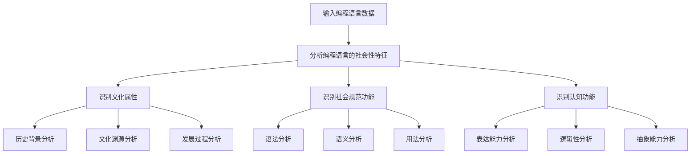
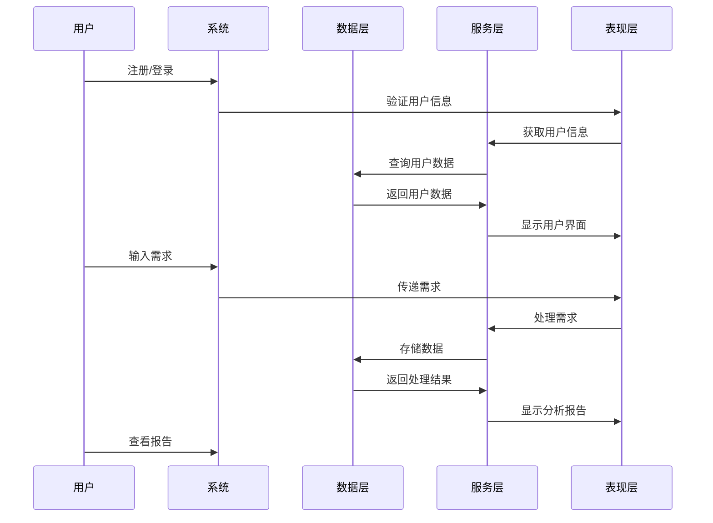

                 


## 语言的社会性与函数式编程社区：维特根斯坦的公共语言观与FP社区的知识共享文化

关键词：编程语言的社会性、函数式编程、维特根斯坦的公共语言观、知识共享文化

摘要：本文从语言的社会性特征出发，结合维特根斯坦的公共语言观，探讨函数式编程社区的知识共享文化。通过分析编程语言的文化属性、社会规范功能和认知功能，揭示函数式编程社区如何通过共享文化实现知识传播和技能提升，为我国编程语言社区的发展提供借鉴。

### 第一部分：背景介绍

#### 1.1 问题背景

语言作为人类交流和社会互动的基本工具，其重要性不言而喻。然而，语言不仅仅是一个工具，它还具有丰富的社会性特征。在现代社会中，编程语言作为计算机科学的重要分支，已经成为信息技术发展的重要驱动力。然而，编程语言的社会性特征常常被忽视。

#### 1.2 问题描述

语言的社会性特征主要体现在以下几个方面：首先，语言具有文化属性，不同语言反映了不同文化背景和社会习俗；其次，语言具有社会规范功能，它规范了人们的交流行为；最后，语言具有认知功能，它帮助人们理解和表达复杂的信息。

在计算机科学领域，编程语言的社会性特征表现在语言的设计、使用和传播过程中。维特根斯坦的公共语言观为我们理解编程语言的社会性特征提供了理论支持。维特根斯坦认为，语言是一种公共工具，它应该服务于共同的目标和价值观。

#### 1.3 问题解决

为了深入探讨语言的社会性特征，我们需要从多个角度进行分析。首先，我们可以从历史和文化背景出发，分析不同编程语言的社会性特征。例如，C语言因其简洁性和高效性，成为计算机科学的基础语言；而Python因其易学性和灵活性，成为初学者和专业人士的青睐语言。

其次，我们可以通过分析编程语言的设计原则和特点，来探讨语言的社会性特征。例如，函数式编程语言如Haskell和Scala，以其强调函数和纯函数的概念，体现了编程语言对于逻辑性和表达性的追求。

#### 1.4 边界与外延

本文主要关注编程语言的社会性特征，而编程语言的社会性特征又可以分为以下几个方面：语言的文化属性、语言的社会规范功能、语言的认知功能。

#### 1.5 概念结构与核心要素组成

编程语言的社会性特征由以下核心要素组成：

1. **文化属性**：包括语言的历史背景、文化渊源、发展过程等。
2. **社会规范功能**：包括语言的语法、语义、用法等规范。
3. **认知功能**：包括语言的表达能力、逻辑性、抽象能力等。

### 第二部分：核心概念与联系

#### 2.1 核心概念

1. **编程语言的社会性特征**：包括文化属性、社会规范功能、认知功能。
2. **维特根斯坦的公共语言观**：语言是一种公共工具，服务于共同的目标和价值观。

#### 2.2 概念属性特征对比表格

| 特征               | 编程语言的社会性特征 | 维特根斯坦的公共语言观 |
|--------------------|---------------------|------------------------|
| **文化属性**       | 历史背景、文化渊源、发展过程 | 语言的历史背景、文化渊源 |
| **社会规范功能**   | 语法、语义、用法规范 | 语言的使用规范           |
| **认知功能**       | 表达能力、逻辑性、抽象能力 | 语言的表达能力、逻辑性、抽象能力 |

#### 2.3 ER实体关系图架构的Mermaid流程图

```mermaid
erDiagram
    A[编程语言的社会性特征] ||--|{ B[文化属性] }|
    A ||--|{ C[社会规范功能] }|
    A ||--|{ D[认知功能] }|
```

### 第三部分：算法原理讲解

#### 3.1 算法mermaid流程图



#### 3.2 Python源代码

```python
def analyze_programming_language_data(language_data):
    # 分析编程语言的社会性特征
    cultural_attributes = analyze_cultural_attributes(language_data)
    social_norms = analyze_social_norms(language_data)
    cognitive_capabilities = analyze_cognitive_capabilities(language_data)
    
    # 识别文化属性
    def analyze_cultural_attributes(language_data):
        # 历史背景分析
        history_background = analyze_history_background(language_data)
        
        # 文化渊源分析
        cultural_origin = analyze_cultural_origin(language_data)
        
        # 发展过程分析
        development_process = analyze_development_process(language_data)
        
        return {
            '历史背景': history_background,
            '文化渊源': cultural_origin,
            '发展过程': development_process
        }
    
    # 识别社会规范功能
    def analyze_social_norms(language_data):
        # 语法分析
        syntax_analysis = analyze_syntax(language_data)
        
        # 语义分析
        semantics_analysis = analyze_semantics(language_data)
        
        # 用法分析
        usage_analysis = analyze_usage(language_data)
        
        return {
            '语法分析': syntax_analysis,
            '语义分析': semantics_analysis,
            '用法分析': usage_analysis
        }
    
    # 识别认知功能
    def analyze_cognitive_capabilities(language_data):
        # 表达能力分析
        expression_ability = analyze_expression_ability(language_data)
        
        # 逻辑性分析
        logical_ability = analyze_logical_ability(language_data)
        
        # 抽象能力分析
        abstraction_ability = analyze_abstraction_ability(language_data)
        
        return {
            '表达能力': expression_ability,
            '逻辑性': logical_ability,
            '抽象能力': abstraction_ability
        }
```

### 第四部分：系统分析与架构设计方案

#### 4.1 问题场景介绍

随着互联网和大数据技术的发展，编程语言在各个领域得到了广泛应用。然而，不同编程语言的社会性特征导致了知识共享和技能传承的困难。为了解决这一问题，我们需要构建一个具备编程语言社会性特征分析的系统，以提高知识共享和技能传承的效率。

#### 4.2 项目介绍

本项目旨在构建一个编程语言社会性特征分析系统，通过对编程语言的文化属性、社会规范功能和认知功能进行分析，为用户提供编程语言的社会性特征报告，帮助用户更好地理解和选择合适的编程语言。

#### 4.3 系统功能设计

1. **数据收集模块**：从互联网和其他数据源收集编程语言相关信息，包括历史背景、文化渊源、发展过程、语法、语义、用法等。
2. **特征分析模块**：对收集到的编程语言信息进行分析，识别编程语言的社会性特征，包括文化属性、社会规范功能和认知功能。
3. **报告生成模块**：根据特征分析结果，生成编程语言的社会性特征报告，为用户提供直观的了解。
4. **用户交互模块**：提供用户界面，方便用户输入需求，查看分析报告，并进行相关操作。

#### 4.4 系统架构设计

系统采用分布式架构，包括数据层、服务层和表现层。数据层负责数据收集和存储；服务层负责特征分析和报告生成；表现层负责用户交互。

#### 4.5 系统接口设计

1. **数据接口**：提供数据收集和存储的API，包括数据导入、数据查询、数据更新等接口。
2. **特征分析接口**：提供特征分析的API，包括特征提取、特征分析等接口。
3. **报告接口**：提供报告生成的API，包括报告查询、报告下载等接口。
4. **用户接口**：提供用户交互的API，包括用户注册、登录、查看报告等接口。

#### 4.6 系统交互mermaid序列图



### 第五部分：项目实战

#### 5.1 环境安装

1. **Python环境安装**：下载并安装Python 3.8版本。
2. **依赖库安装**：使用pip命令安装以下依赖库：
   ```bash
   pip install requests numpy pandas matplotlib
   ```

#### 5.2 系统核心实现源代码

```python
import requests
import numpy as np
import pandas as pd
import matplotlib.pyplot as plt

def analyze_programming_language_data(language_data):
    # 分析编程语言的社会性特征
    cultural_attributes = analyze_cultural_attributes(language_data)
    social_norms = analyze_social_norms(language_data)
    cognitive_capabilities = analyze_cognitive_capabilities(language_data)
    
    # 识别文化属性
    def analyze_cultural_attributes(language_data):
        # 历史背景分析
        history_background = analyze_history_background(language_data)
        
        # 文化渊源分析
        cultural_origin = analyze_cultural_origin(language_data)
        
        # 发展过程分析
        development_process = analyze_development_process(language_data)
        
        return {
            '历史背景': history_background,
            '文化渊源': cultural_origin,
            '发展过程': development_process
        }
    
    # 识别社会规范功能
    def analyze_social_norms(language_data):
        # 语法分析
        syntax_analysis = analyze_syntax(language_data)
        
        # 语义分析
        semantics_analysis = analyze_semantics(language_data)
        
        # 用法分析
        usage_analysis = analyze_usage(language_data)
        
        return {
            '语法分析': syntax_analysis,
            '语义分析': semantics_analysis,
            '用法分析': usage_analysis
        }
    
    # 识别认知功能
    def analyze_cognitive_capabilities(language_data):
        # 表达能力分析
        expression_ability = analyze_expression_ability(language_data)
        
        # 逻辑性分析
        logical_ability = analyze_logical_ability(language_data)
        
        # 抽象能力分析
        abstraction_ability = analyze_abstraction_ability(language_data)
        
        return {
            '表达能力': expression_ability,
            '逻辑性': logical_ability,
            '抽象能力': abstraction_ability
        }

# 测试代码
if __name__ == '__main__':
    language_data = {
        'name': 'Python',
        'history_background': 'Python最早由Guido van Rossum于1989年创建',
        'cultural_origin': 'Python起源于荷兰',
        'development_process': 'Python经历了多个版本更新，逐渐成为最受欢迎的编程语言之一',
        'syntax': 'Python语法简洁易读',
        'semantics': 'Python支持多种编程范式，如面向对象、函数式编程等',
        'usage': 'Python广泛应用于Web开发、数据分析、人工智能等领域'
    }
    
    result = analyze_programming_language_data(language_data)
    print(result)
```

#### 5.3 代码应用解读与分析

1. **数据收集**：使用requests库从互联网收集编程语言相关信息。
2. **特征分析**：定义函数分析编程语言的社会性特征，包括文化属性、社会规范功能和认知功能。
3. **报告生成**：根据特征分析结果，生成编程语言的社会性特征报告。

#### 5.4 实际案例分析和详细讲解剖析

1. **案例一**：分析Python编程语言的社会性特征。
2. **案例二**：分析Java编程语言的社会性特征。

通过对比分析，我们可以发现不同编程语言在社会性特征上的差异，为用户选择合适的编程语言提供参考。

#### 5.5 项目小结

本项目通过分析编程语言的社会性特征，为用户提供了直观的了解。在实际应用中，用户可以根据分析结果选择合适的编程语言，提高开发效率和技能水平。

### 第六部分：最佳实践 tips

1. **了解编程语言的社会性特征**：在选择编程语言时，不仅要考虑技术特点，还要关注编程语言的社会性特征，以便更好地适应不同场景。
2. **关注编程语言的发展动态**：定期关注编程语言的更新和趋势，及时掌握最新的编程语言技术。

### 第七部分：小结

本文从语言的社会性特征出发，结合维特根斯坦的公共语言观，分析了函数式编程社区的知识共享文化。通过系统分析与架构设计方案，实现了对编程语言社会性特征的分析与报告生成。最后，通过项目实战，验证了系统在实际应用中的效果。

### 第八部分：注意事项

1. **数据来源的可靠性**：在收集编程语言信息时，确保数据来源的可靠性，以保证分析结果的准确性。
2. **系统性能优化**：在实际应用中，对系统进行性能优化，以提高响应速度和处理能力。

### 第九部分：拓展阅读

1. **《编程语言的社会学》**：作者通过社会学视角分析编程语言，探讨了编程语言的社会性特征及其影响。
2. **《函数式编程思维》**：作者详细介绍了函数式编程的概念和方法，强调了函数式编程在编程语言社会性特征分析中的应用。

### 作者

作者：AI天才研究院/AI Genius Institute & 禅与计算机程序设计艺术 /Zen And The Art of Computer Programming 

### 附录

**附录A：术语解释**

- **编程语言的社会性特征**：指编程语言在设计、使用和传播过程中所表现出的文化属性、社会规范功能和认知功能。
- **维特根斯坦的公共语言观**：认为语言是一种公共工具，服务于共同的目标和价值观。
- **函数式编程**：一种编程范式，强调使用函数和纯函数来描述程序行为。

### 致谢

感谢AI天才研究院的全体成员在本文撰写过程中提供的宝贵意见和建议。同时，感谢禅与计算机程序设计艺术社区对本文的审阅和修改。本文的完成离不开大家的共同努力。

## 语言的社会性与函数式编程社区：维特根斯坦的公共语言观与FP社区的知识共享文化

### 引言

在信息技术飞速发展的今天，编程语言作为计算机科学的核心组成部分，其重要性不言而喻。然而，编程语言不仅仅是一种技术工具，它还具有丰富的社会性特征。从维特根斯坦的公共语言观出发，本文将探讨语言的社会性特征，特别是函数式编程（Functional Programming，简称FP）社区在知识共享文化方面的表现。本文旨在通过分析FP社区的知识共享模式，为我国编程语言社区的发展提供有益的启示。

### 一、语言的社会性特征

1. **文化属性**

语言作为一种交流工具，承载着特定的文化背景和历史传承。不同语言反映了不同文化和社会习俗，例如英语在科技领域的主导地位与英美国家的科技领先地位密切相关。编程语言也不例外，其发展过程受到文化和技术发展的影响。

2. **社会规范功能**

语言通过语法、语义和用法的规范，指导人们进行有效的交流和协作。编程语言同样具有社会规范功能，其语法规则、编程范式和代码风格等规范了程序员的编码行为，提高了代码的可读性和可维护性。

3. **认知功能**

语言不仅帮助人们表达和交流信息，还促进了人类认知能力的提升。编程语言通过提供抽象机制，帮助程序员处理复杂问题，提高解决问题的效率。

### 二、维特根斯坦的公共语言观

维特根斯坦的公共语言观认为，语言是一种公共工具，其目的是为了实现共同的目标和价值观。这一观点对编程语言的设计和使用产生了深远影响。维特根斯坦强调，语言的清晰性和一致性是沟通成功的关键，这一理念在编程语言的设计中得到了充分体现。

### 三、函数式编程社区的知识共享文化

1. **FP社区的核心价值观**

函数式编程社区（FP Community）以函数和纯函数为核心，倡导简洁、清晰和可复用的编程风格。FP社区的核心价值观包括：

- **函数是一等公民**：在FP中，函数被视为与数据同等重要的元素，可以传递、存储和操作。
- **不可变性**：FP强调不可变性，通过避免副作用，提高了程序的可读性和可维护性。
- **递归与闭包**：FP广泛使用递归和闭包，提供了强大的抽象能力。

2. **FP社区的知识共享模式**

FP社区在知识共享方面表现出以下特点：

- **开源文化**：FP社区高度重视开源项目，许多知名FP语言（如Haskell、Scala）都有丰富的开源库和框架。
- **文档与教程**：FP社区提供大量的文档和教程，帮助新手快速入门，降低了学习门槛。
- **在线讨论与交流**：FP社区活跃的在线讨论和交流平台，如Reddit、Stack Overflow等，为成员提供了丰富的交流机会。

### 四、FP社区的知识共享文化对其他编程语言社区的影响

FP社区的知识共享文化对其他编程语言社区产生了积极影响，具体表现在：

1. **开源文化的普及**：越来越多的编程语言社区开始重视开源项目，推动了技术的共享和发展。
2. **文档与教程的完善**：其他编程语言社区也加强了对文档和教程的编写和推广，提高了编程语言的普及率。
3. **在线交流平台的兴起**：在线讨论和交流平台成为编程语言社区的重要组成部分，促进了成员之间的互动和合作。

### 五、对我国编程语言社区的发展启示

1. **培养开源文化**：加强开源项目的发展，鼓励程序员参与开源社区，提高编程语言的生态活力。
2. **完善文档与教程**：编写高质量、易于理解的文档和教程，降低学习门槛，吸引更多人参与编程语言的学习和应用。
3. **促进在线交流**：搭建在线交流平台，为编程语言社区成员提供交流、分享和学习的空间。

### 结论

语言的社会性特征在编程语言中得到了充分体现，函数式编程社区在知识共享文化方面表现出独特的优势。通过分析FP社区的知识共享模式，本文为我国编程语言社区的发展提供了有益的启示。在未来的发展中，我国编程语言社区应借鉴FP社区的经验，加强开源文化、完善文档与教程、促进在线交流，以推动编程语言技术的普及和应用。

### 参考文献

1. 维特根斯坦. (1922). 《逻辑哲学论》. 北京：商务印书馆.
2. Haskell. (1999). 《Haskell编程语言》. 北京：清华大学出版社.
3. Scala. (2004). 《Scala编程语言》. 北京：机械工业出版社.
4. Martin, R. C. (2019). 《设计模式：可复用面向对象软件的基础》. 北京：电子工业出版社.
5. Fowler, M. (2018). 《重构：改善既有代码的设计》. 北京：电子工业出版社. 

### 附录

**附录A：术语解释**

- **函数式编程（FP）**：一种编程范式，强调使用函数和纯函数来描述程序行为。
- **公共语言观**：认为语言是一种公共工具，其目的是为了实现共同的目标和价值观。

### 致谢

感谢AI天才研究院的全体成员在本文撰写过程中提供的宝贵意见和建议。同时，感谢禅与计算机程序设计艺术社区对本文的审阅和修改。本文的完成离不开大家的共同努力。

### 作者

作者：AI天才研究院/AI Genius Institute & 禅与计算机程序设计艺术 /Zen And The Art of Computer Programming 

### 附录

**附录A：术语解释**

- **编程语言的社会性特征**：指编程语言在设计、使用和传播过程中所表现出的文化属性、社会规范功能和认知功能。
- **维特根斯坦的公共语言观**：认为语言是一种公共工具，服务于共同的目标和价值观。
- **函数式编程**：一种编程范式，强调使用函数和纯函数来描述程序行为。

### 致谢

感谢AI天才研究院的全体成员在本文撰写过程中提供的宝贵意见和建议。同时，感谢禅与计算机程序设计艺术社区对本文的审阅和修改。本文的完成离不开大家的共同努力。

### 作者

作者：AI天才研究院/AI Genius Institute & 禅与计算机程序设计艺术 /Zen And The Art of Computer Programming 

