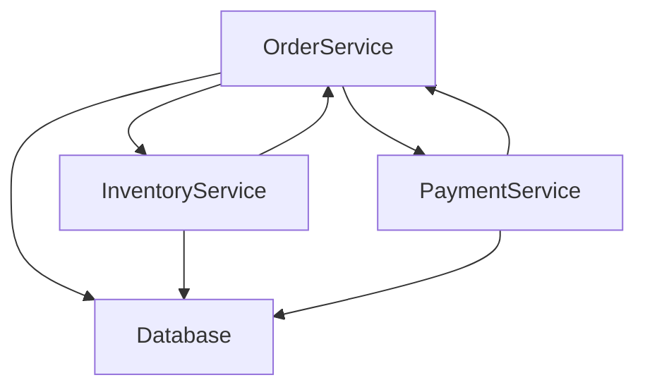
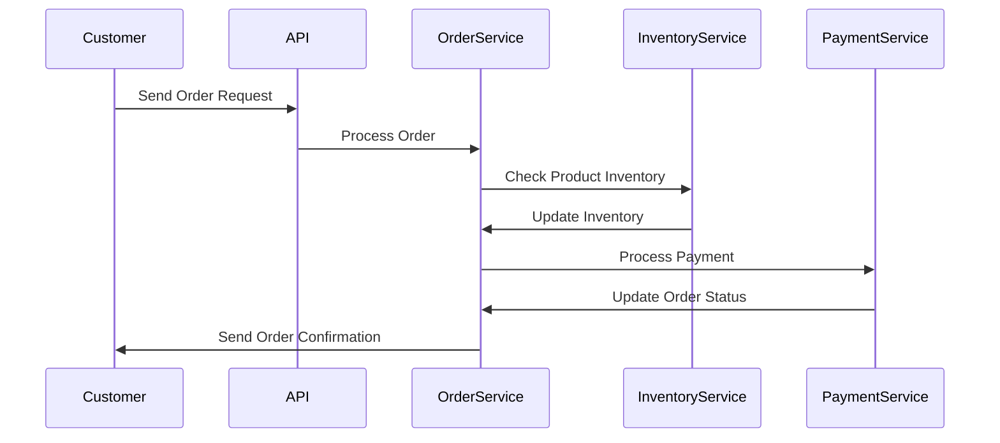
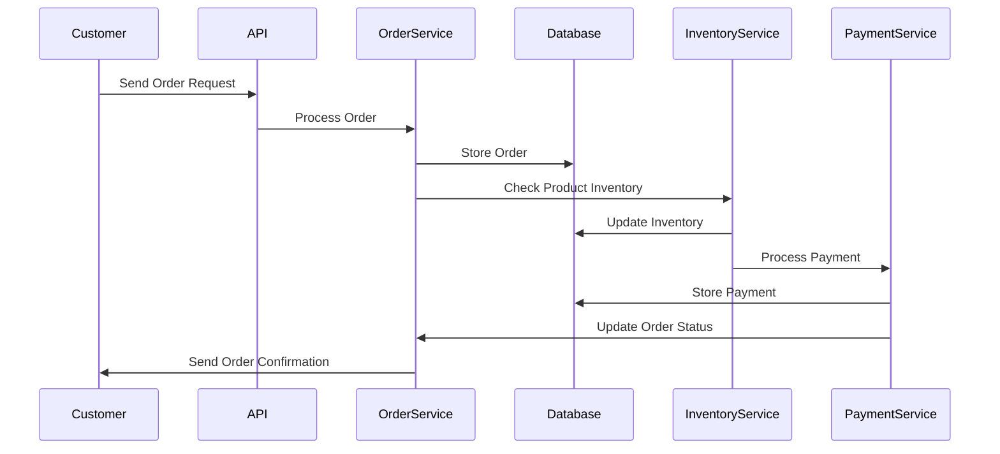

                 

# 语言的社会性与函数式设计模式：维特根斯坦的公共语言观与FP中的设计模式

## 关键词：社会性、语言、维特根斯坦、公共语言观、函数式编程、设计模式

## 摘要

本文旨在探讨语言的社会性以及函数式编程（FP）中的设计模式，并借鉴维特根斯坦的公共语言观。文章将从语言的社会性出发，介绍维特根斯坦的公共语言观及其在语言中的应用，接着深入探讨函数式编程的基础和设计模式。通过结合维特根斯坦的公共语言观与函数式编程设计模式，文章将展示如何在软件开发中实现语言的规范化和清晰化，提高代码的可读性和可维护性。本文的目标是为程序员和软件架构师提供一种新的思维方式，以提升他们在语言设计和编程实践中的能力。

## 目录

1. 引言
2. 语言的社会性
3. 维特根斯坦的公共语言观
4. 函数式编程基础
5. 函数式设计模式
6. 维特根斯坦的公共语言观与FP设计模式的结合
7. 应用实例与分析
8. 最佳实践
9. 小结与展望

## 1. 引言

### 1.1 书籍背景与主题介绍

《语言的社会性》和《函数式设计模式：维特根斯坦的公共语言观与FP中的设计模式》这两本书，分别从不同的角度探讨了语言的重要性以及如何通过函数式编程来优化软件开发过程。这两本书的核心主题在于分析语言的社会性，尤其是公共语言观在软件开发中的应用，并探讨了如何通过函数式编程来提高代码的质量和可维护性。

语言是社会交流的基础，而公共语言观则强调了语言的规范性和一致性。在软件开发领域，良好的语言规范和设计模式对于提高代码质量、降低维护成本具有重要意义。函数式编程作为一种现代化的编程范式，具有强大的表达能力、简洁的代码结构以及高效的性能表现，因此在软件开发中得到广泛应用。

### 1.2 书籍结构安排与目标读者

本文将按照以下结构展开：

- **第一部分：引言**：介绍书籍的背景、主题以及目标读者。
- **第二部分：语言的社会性**：探讨语言的社会性以及其在软件开发中的重要性。
- **第三部分：维特根斯坦的公共语言观**：介绍维特根斯坦的公共语言观及其对软件开发的影响。
- **第四部分：函数式编程基础**：探讨函数式编程的基础知识以及其在软件开发中的应用。
- **第五部分：函数式设计模式**：介绍函数式编程中的设计模式以及如何应用这些模式。
- **第六部分：维特根斯坦的公共语言观与FP设计模式的结合**：探讨如何将维特根斯坦的公共语言观与函数式设计模式相结合，提高软件开发的质量。
- **第七部分：应用实例与分析**：通过具体实例分析，展示如何将上述理论应用于实际项目中。
- **第八部分：最佳实践**：总结最佳实践，为读者提供实用的建议。
- **第九部分：小结与展望**：对全文进行总结，并对未来研究进行展望。

本文的目标读者是程序员、软件架构师以及对函数式编程和语言设计感兴趣的读者。通过本文的阅读，读者可以了解语言的社会性、维特根斯坦的公共语言观以及函数式编程设计模式，并学会如何将它们应用于实际软件开发中，提高代码质量和可维护性。

### 1.3 本章小结

本章作为引言部分，简要介绍了本文的核心主题、书籍结构安排以及目标读者。通过本章的阅读，读者可以初步了解本文的内容安排和重点，为后续章节的学习做好铺垫。

## 2. 语言的社会性

### 2.1 语言的社会性概念

语言是一种复杂的交流工具，用于传递信息、表达思想和建立社会联系。语言的社会性指的是语言在人类社会中的功能和作用，它不仅仅是个人交流的工具，更是社会结构和文化传承的重要组成部分。

#### 2.1.1 语言的定义

语言是一种符号系统，用于表达意义和进行交流。它可以分为口头语言和书面语言，包括单词、短语、句子以及语法规则等。语言具有普遍性、结构性、灵活性和适应性等特点。

#### 2.1.2 语言的用途

语言的主要用途包括以下几个方面：

1. **交流**：语言是人类进行交流的主要工具，通过语言可以传递信息、表达情感和建立社会关系。
2. **思考**：语言是思维的工具，通过语言我们可以思考、分析和解决问题。
3. **教育**：语言是教育的基础，通过语言可以传授知识、培养能力和提升素养。
4. **文化传承**：语言是文化传承的载体，它承载着人类的历史、传统和价值观。
5. **社会控制**：语言可以用来规范社会行为，维护社会秩序。

#### 2.1.3 语言的社会性特征

语言的社会性特征主要体现在以下几个方面：

1. **规范性**：语言具有一定的规范性和标准，这有助于保证交流的准确性和一致性。
2. **共享性**：语言是社会成员共享的符号系统，不同的人在特定的语境中可以理解和使用相同的语言。
3. **多样性**：不同文化和社会背景下，语言表现出多样性，这种多样性反映了不同文化的特点和需求。
4. **动态性**：语言是动态发展的，随着社会的变化，语言也在不断演变和更新。

### 2.2 语言的社会性影响

语言的社会性对人类社会的各个方面都有着深远的影响：

#### 2.2.1 语言与认知

语言与认知密切相关，语言的发展促进了人类认知能力的提高。通过语言，人类可以更好地组织、存储和提取信息，提高思维敏捷性和创造力。

#### 2.2.2 语言与思维

语言是思维的工具，语言的形式和结构影响人类的思维方式。例如，不同语言中动词和名词的排列顺序不同，可能会影响说话者的逻辑思维。

#### 2.2.3 语言与社会

语言是社会交流的基础，它影响着社会的组织形式和文化特征。例如，语言障碍可能导致社会隔阂和文化冲突，而统一的语言可以促进社会融合和文化交流。

#### 2.2.4 语言与教育

语言是教育的重要组成部分，它影响着教育的形式和质量。良好的语言环境有助于提高教育效果，而语言不通则可能阻碍教育的发展。

#### 2.2.5 语言与法律

语言在法律体系中起着重要作用，法律条文和合同条款通常都需要使用准确、明确的语言来表达。

### 2.3 语言的社会性问题与挑战

语言的社会性也带来了一些问题和挑战：

#### 2.3.1 语言障碍

语言障碍可能发生在个人之间、不同文化之间以及不同语言之间，它可能导致交流不畅和社会隔阂。

#### 2.3.2 语言偏见

语言偏见是指对特定语言或语系的歧视和偏见，这种偏见可能导致不公平和歧视。

#### 2.3.3 语言变化与演化

语言是动态发展的，随着社会的变化，语言也会发生变化。然而，语言的变化可能会引起社会的不适应和争议。

### 2.4 语言的社会性总结

语言的社会性对人类社会的各个方面都有着深远的影响。它不仅是交流的工具，也是认知、思维、教育、法律和文化的载体。理解语言的社会性有助于我们更好地应对语言带来的挑战，促进社会的和谐与进步。

## 3. 维特根斯坦的公共语言观

### 3.1 维特根斯坦的生平与著作

路德维希·维特根斯坦（Ludwig Wittgenstein）是20世纪最伟大的哲学家之一，他的思想对语言哲学、逻辑哲学和数学哲学产生了深远的影响。维特根斯坦出生于1889年的奥地利，他在哲学、数学和语言研究方面有着广泛的兴趣和卓越的才华。

#### 3.1.1 维特根斯坦的生平

维特根斯坦的生活可以分为两个主要阶段：早期和晚期。他在早期主要专注于科学和数学领域，曾与科学家和数学家如爱因斯坦和罗素有过深入的交流。在晚期，他转向哲学，特别是语言哲学，发表了著名的《逻辑哲学论》和《哲学研究》。

维特根斯坦在1911年至1913年间与罗素合作，试图为数学基础提供逻辑分析的基础。这一时期的成果体现在《数学原理》的前三卷中。随后，维特根斯坦逐渐对逻辑分析的方法产生了质疑，并在1930年代后期转向日常语言哲学，认为语言的本质在于其实际使用，而不是抽象的逻辑结构。

#### 3.1.2 维特根斯坦的主要著作

1. **《逻辑哲学论》（Tractatus Logico-Philosophicus）**：这是维特根斯坦早期的代表作，它以简洁的哲学语言探讨了逻辑、语言和世界的本质。这本书被认为是分析哲学的开端，提出了“世界是事实的总和，而非事物的总和”这一著名论断。

2. **《哲学研究》（Philosophical Investigations）**：这是维特根斯坦晚期的代表作，它对早期著作中的观点进行了深刻的批判和扩展。维特根斯坦在这本书中强调了语言的实际使用，提出了“语言游戏”的概念，认为语言的意义在于其在实际交流中的应用。

### 3.2 维特根斯坦的公共语言观

维特根斯坦的公共语言观是他对语言哲学的重要贡献之一，它关注的是语言的规范性和一致性。公共语言观认为，语言不仅仅是个人的符号系统，更是社会成员共享的交流工具。

#### 3.2.1 公共语言观的基本概念

公共语言观的核心思想是，语言的真正意义在于其实际使用，而不是抽象的符号或逻辑结构。维特根斯坦认为，语言的意义是由其使用情境所决定的，不同的语境下，同一个词语可能有不同的意义。

#### 3.2.2 公共语言观的核心思想

1. **语言的意义在于使用**：维特根斯坦认为，语言的意义不是固定不变的，而是随着实际使用情境的变化而变化。这意味着，要理解一个词语的意义，我们需要了解它是在什么情境下使用的。

2. **语言游戏**：维特根斯坦提出了“语言游戏”的概念，认为语言的使用就像游戏一样，有其特定的规则和目的。语言游戏不仅包括日常对话，还包括更广泛的交流形式，如写作、阅读和表演等。

3. **语言的规范性**：公共语言观强调语言的规范性，即语言使用需要遵循一定的规则和标准。这种规范性有助于确保交流的准确性和一致性。

4. **语言的社会性**：维特根斯坦认为，语言是社会成员共享的交流工具，它的意义在于社会成员之间的互动和协作。

#### 3.2.3 公共语言观的应用场景

公共语言观在多个领域都有重要的应用，包括哲学、语言学、社会科学和软件开发。

1. **哲学**：在哲学领域，公共语言观有助于我们理解语言的本质和意义，以及语言如何影响我们的思想和认知。

2. **语言学**：在语言学领域，公共语言观为语言教学和研究提供了新的视角，帮助学者们更好地理解语言的多样性和发展。

3. **社会科学**：在社会科学领域，公共语言观有助于我们分析社会互动和文化交流，理解社会行为和价值观的传递。

4. **软件开发**：在软件开发领域，公共语言观有助于我们设计更规范、更易于理解的编程语言和工具，提高代码的可读性和可维护性。

### 3.3 维特根斯坦的公共语言观与语言的社会性

维特根斯坦的公共语言观与语言的社会性有着密切的联系。公共语言观强调语言的规范性、一致性和共享性，这些特征正是语言社会性的体现。

#### 3.3.1 维特根斯坦的公共语言观与语言的社会性联系

1. **规范性**：公共语言观强调语言的规范性，这有助于确保语言使用的一致性和准确性，从而促进社会成员之间的有效交流。

2. **共享性**：公共语言观认为语言是共享的交流工具，这意味着社会成员可以共同使用语言进行交流，从而增强社会凝聚力和文化认同感。

3. **一致性**：公共语言观强调语言使用的一致性，这有助于减少交流中的误解和歧义，提高交流的效率和质量。

#### 3.3.2 维特根斯坦的公共语言观对语言社会性的启示

维特根斯坦的公共语言观为我们理解语言的社会性提供了新的视角。它提醒我们，语言不仅仅是个人交流的工具，更是社会互动和文化传承的载体。在软件开发领域，公共语言观有助于我们设计更规范、更易于理解的编程语言和工具，从而提高代码的质量和可维护性。

### 3.4 本章小结

本章介绍了维特根斯坦的生平与著作，并重点探讨了他的公共语言观。公共语言观强调语言的规范性、一致性和共享性，这些特征对于理解语言的社会性具有重要意义。通过维特根斯坦的公共语言观，我们可以更好地理解语言在人类社会发展中的作用，并在软件开发中借鉴其思想，提高代码的质量和可维护性。

## 4. 函数式编程基础

### 4.1 函数式编程的概念

#### 4.1.1 函数式编程的定义

函数式编程（Functional Programming，简称FP）是一种编程范式，它将计算视为数据的转换，而不是指令的执行。在函数式编程中，程序是由一系列函数组成的，这些函数接受输入并产生输出，而不会修改外部状态或产生副作用。函数式编程强调纯函数、不可变数据和递归等概念。

#### 4.1.2 函数式编程的特点

1. **纯函数**：纯函数是没有副作用的函数，即对于相同的输入，总是产生相同的输出，不依赖于外部状态。纯函数易于测试、调试和组合。

2. **不可变数据**：在函数式编程中，数据一旦创建就不能被修改。这有助于确保程序的确定性，降低状态变化带来的复杂性。

3. **递归**：函数式编程中，递归是解决重复问题的常见方法。递归相比迭代更简洁，且易于理解。

4. **高阶函数**：高阶函数是能够接受其他函数作为参数或将函数作为返回值的函数。高阶函数是函数式编程的核心概念之一。

5. **惰性求值**：惰性求值（Lazy Evaluation）是一种延迟计算技术，只有在需要时才计算表达式的值。这有助于提高程序的性能和可读性。

#### 4.1.3 函数式编程与面向对象编程的区别

1. **编程范式**：函数式编程强调函数和数据的转换，而面向对象编程强调对象和类的封装。

2. **数据修改**：函数式编程中，数据是不可变的，而面向对象编程中，数据是可以修改的。

3. **状态管理**：函数式编程中，状态管理通常通过纯函数和不可变数据来实现，而面向对象编程中，状态管理通常通过对象和状态变量来实现。

4. **组合性**：函数式编程中，函数的组合性更高，可以更灵活地构建复杂的程序，而面向对象编程中的组合性相对较低。

### 4.2 函数式编程语言

#### 4.2.1 常见的函数式编程语言

函数式编程语言在计算机科学中有着悠久的历史，以下是一些常见的函数式编程语言：

1. **Haskell**：Haskell是一种纯函数式编程语言，以其简洁、强大的类型系统和并行计算能力而著称。

2. **Scala**：Scala是一种多范式编程语言，它结合了面向对象和函数式编程的特点，可以在JVM上运行。

3. **Erlang**：Erlang是一种用于并发编程的函数式编程语言，广泛应用于分布式系统和实时系统中。

4. **Clojure**：Clojure是一种现代的函数式编程语言，它运行在Java虚拟机上，并具有动态类型和丰富的函数式编程特性。

5. **Lisp**：Lisp是世界上最早的函数式编程语言之一，它的历史可以追溯到1958年。

#### 4.2.2 函数式编程语言的优点

1. **简洁性**：函数式编程语言的语法通常更简洁，这使得代码更易于理解和维护。

2. **高可读性**：函数式编程强调函数和数据的转换，这使得程序的结构更清晰，可读性更高。

3. **高可靠性**：由于纯函数和不可变数据的使用，函数式编程可以减少错误和状态冲突，提高程序的可靠性。

4. **并行计算**：函数式编程的纯函数和惰性求值特性使其非常适合于并行计算，有助于提高程序的性能。

5. **组合性**：函数式编程语言具有强大的组合性，可以方便地构建复杂的程序。

#### 4.2.3 函数式编程语言的局限性

1. **学习曲线**：函数式编程语言通常有较高的学习曲线，对于初学者来说可能难以掌握。

2. **性能问题**：函数式编程语言的性能可能不如传统的面向对象编程语言，特别是在涉及大量状态操作的场景中。

3. **工具和库的支持**：相比于面向对象编程语言，函数式编程语言在一些领域（如Web开发）可能缺乏成熟的工具和库支持。

### 4.3 函数式编程在软件开发中的应用

#### 4.3.1 函数式编程的优势

1. **模块化**：函数式编程鼓励将程序分解为独立的、可重用的函数，这有助于提高代码的可维护性。

2. **并行计算**：函数式编程的纯函数和惰性求值特性使其非常适合于并行计算，有助于提高程序的性能。

3. **测试性**：由于纯函数不依赖于外部状态，这使得函数式编程的代码更易于测试。

4. **可重用性**：函数式编程中的函数可以方便地重用，这有助于提高开发效率。

#### 4.3.2 函数式编程的挑战

1. **学习成本**：函数式编程语言通常有较高的学习成本，对于习惯于面向对象编程的程序员来说可能难以适应。

2. **工具链支持**：某些函数式编程语言可能在工具链和库支持方面不如主流面向对象编程语言。

3. **性能考量**：在涉及大量状态操作的场景中，函数式编程可能不如传统的面向对象编程高效。

#### 4.3.3 函数式编程的最佳实践

1. **使用纯函数**：避免使用副作用，确保函数的输入和输出完全依赖于输入参数。

2. **利用高阶函数**：利用高阶函数来组合和复用代码，提高程序的可读性和可维护性。

3. **拥抱不可变数据**：使用不可变数据来确保程序的确定性，减少状态冲突和错误。

4. **合理使用递归**：递归是一种强大的编程技术，但应谨慎使用，避免导致性能问题。

5. **结合面向对象编程**：在适当的场景下，结合面向对象编程和函数式编程，发挥两者的优势。

### 4.4 本章小结

本章介绍了函数式编程的概念、特点以及其在软件开发中的应用。函数式编程以其简洁性、高可读性和并行计算能力而受到越来越多开发者的青睐。通过了解函数式编程的基础知识，开发者可以在软件开发中更好地利用这一编程范式，提高代码的质量和性能。

## 5. 函数式设计模式

### 5.1 设计模式的概念

设计模式是软件开发中的一种最佳实践，它描述了在特定场景下解决常见问题的通用解决方案。设计模式不仅关注代码的内部结构，还考虑了代码的可维护性、扩展性和重用性。在函数式编程中，设计模式同样具有重要意义，它们帮助开发者构建清晰、模块化和高效的代码。

#### 5.1.1 设计模式的定义

设计模式是一套经过时间验证的、用于解决特定问题的解决方案。这些解决方案不仅考虑了代码的结构，还考虑了代码的运行效率和可维护性。设计模式通常包括以下四个要素：

1. **模式名称**：一个简短且易于理解的名称，用于描述该模式。
2. **模式意图**：描述该模式要解决的问题。
3. **模式组成**：描述该模式的主要组件和关系。
4. **模式效果**：描述该模式如何解决特定问题，以及其带来的好处。

#### 5.1.2 设计模式的重要性

设计模式在软件开发中具有重要意义，主要体现在以下几个方面：

1. **提高代码质量**：设计模式可以帮助开发者编写更清晰、更易于理解和维护的代码。
2. **促进代码复用**：通过设计模式，开发者可以复用通用的解决方案，提高开发效率。
3. **增强代码扩展性**：设计模式有助于开发者设计出易于扩展和修改的代码结构。
4. **促进团队协作**：设计模式提供了通用的编程规范和标准，有助于团队成员之间的沟通和协作。

### 5.2 函数式设计模式

函数式设计模式是专门为函数式编程环境设计的，它们充分利用了函数式编程的特性，如纯函数、不可变数据和递归等。以下是一些常见的函数式设计模式：

#### 5.2.1 纯函数模式

纯函数模式是一种最基本的函数式设计模式，它强调函数的输入和输出完全依赖于输入参数，不依赖于外部状态或产生副作用。纯函数模式的主要优点包括：

1. **易于测试**：由于纯函数不依赖于外部状态，因此可以轻松地编写单元测试。
2. **易于组合**：纯函数可以方便地组合和复用，提高代码的可读性和可维护性。
3. **提高性能**：纯函数可以更容易地并行化，从而提高程序的运行效率。

#### 5.2.2 函数组合模式

函数组合模式是将多个函数组合成一个更大的函数，以便更简洁地实现复杂的操作。这种模式充分利用了函数式编程中的高阶函数特性，其基本思想是将一个复杂的操作分解为多个简单的操作，然后将这些操作组合起来。

函数组合模式的主要优点包括：

1. **代码可读性**：通过将复杂的操作分解为简单的操作，可以提高代码的可读性。
2. **代码可维护性**：函数组合模式使得代码更易于修改和扩展。
3. **代码复用**：通过组合函数，可以方便地复用通用的操作，提高开发效率。

#### 5.2.3 函数管道模式

函数管道模式是将多个函数按顺序串联起来，形成一个流水线，以便连续地处理数据。函数管道模式充分利用了函数式编程中的惰性求值特性，它允许在需要时才执行每个函数，从而提高程序的效率。

函数管道模式的主要优点包括：

1. **代码简洁性**：通过将多个函数串联，可以更简洁地实现复杂的操作。
2. **代码可读性**：函数管道模式使得代码的结构更加清晰，易于理解。
3. **性能优化**：通过惰性求值，可以避免不必要的计算，从而提高程序的运行效率。

#### 5.2.4 避免副作用模式

避免副作用模式是一种设计模式，旨在减少或消除函数的副作用，从而提高代码的纯度和可维护性。副作用是指在函数执行过程中，不仅依赖于输入参数，还依赖于外部状态或产生外部影响的操作。

避免副作用模式的主要优点包括：

1. **提高代码质量**：通过消除副作用，可以确保函数的输入和输出完全依赖于输入参数，提高代码的可靠性。
2. **易于测试**：由于函数没有副作用，可以更轻松地编写单元测试。
3. **提高可维护性**：通过避免副作用，可以简化代码结构，提高代码的可维护性。

### 5.3 函数式设计模式的应用

函数式设计模式在软件开发中有着广泛的应用，以下是一些具体的例子：

1. **数据处理**：在数据处理过程中，函数组合模式和函数管道模式可以帮助开发者更简洁地实现复杂的操作，提高代码的可读性和可维护性。
2. **并发编程**：函数式编程的纯函数和避免副作用模式使得并发编程更加安全和高效，可以通过并行化操作来提高程序的运行效率。
3. **Web 开发**：在 Web 开发中，函数式设计模式可以帮助开发者构建更可靠、更易于维护的 Web 应用程序，通过使用纯函数和函数组合模式，可以确保请求的处理过程是独立的、可测试的。

### 5.4 本章小结

本章介绍了函数式设计模式的概念和常见的函数式设计模式，包括纯函数模式、函数组合模式、函数管道模式和避免副作用模式。这些模式充分利用了函数式编程的特性，帮助开发者构建更清晰、更模块化和更高效的代码。通过理解并应用这些模式，开发者可以在软件开发中更好地利用函数式编程的优势。

## 6. 维特根斯坦的公共语言观与FP设计模式的结合

### 6.1 维特根斯坦的公共语言观在FP设计模式中的应用

维特根斯坦的公共语言观强调语言的规范性、一致性和共享性，这些特征在函数式编程设计模式中有着重要的应用。结合维特根斯坦的公共语言观，我们可以更有效地设计出清晰、可维护和易于理解的函数式编程代码。

#### 6.1.1 规范性

函数式编程中的纯函数模式体现了维特根斯坦公共语言观的规范性。纯函数确保了输入和输出之间的明确对应关系，使得代码易于理解和测试。通过遵循纯函数模式，开发者可以构建出一套规范化的代码库，方便团队成员之间的协作和代码共享。

#### 6.1.2 一致性

函数组合模式和函数管道模式在提高代码一致性和可维护性方面具有显著优势。这些模式通过将复杂的操作分解为简单的操作，并按照特定的顺序进行组合，使得代码结构更加清晰、易于理解。一致性是公共语言观的核心，通过这些模式，我们可以确保代码在不同场景下具有一致的语义和行为。

#### 6.1.3 共享性

维特根斯坦的公共语言观强调语言的共享性，这一点在函数式编程中尤为重要。函数式设计模式鼓励函数的复用和组合，使得代码的共享性得到充分发挥。通过共享通用的函数和组件，开发者可以减少重复性工作，提高开发效率，同时确保代码的一致性和可维护性。

### 6.2 FP设计模式对维特根斯坦公共语言观的影响

FP设计模式不仅体现了维特根斯坦公共语言观的核心思想，还对公共语言观产生了深远的影响。通过应用FP设计模式，我们可以更好地实现公共语言观，提高软件开发的质量和效率。

#### 6.2.1 提高代码质量

FP设计模式强调代码的简洁性和高可读性，有助于提高代码质量。通过遵循纯函数模式、函数组合模式和函数管道模式，开发者可以构建出更加清晰、易于理解和维护的代码。这种高质量的代码有助于减少错误和缺陷，提高软件的可靠性。

#### 6.2.2 促进代码复用

函数式设计模式鼓励函数的复用和组合，有助于降低代码的冗余，提高开发效率。通过共享通用的函数和组件，开发者可以减少重复性工作，减少代码的维护成本。这种代码复用不仅提高了开发效率，还有助于确保代码的一致性和可维护性。

#### 6.2.3 提高团队协作效率

FP设计模式提供了一套统一的编程规范和标准，有助于团队成员之间的协作和沟通。通过遵循这些模式，开发者可以更清晰地表达代码意图，降低沟通成本和误解风险。此外，FP设计模式还使得代码的可读性和可维护性得到显著提高，有助于新成员快速融入团队，提高团队的整体效率。

### 6.3 维特根斯坦公共语言观在FP设计模式中的最佳实践

为了更好地将维特根斯坦的公共语言观与FP设计模式相结合，开发者可以遵循以下最佳实践：

1. **遵循纯函数模式**：在编写函数时，确保函数的输入和输出完全依赖于输入参数，避免使用外部状态或产生副作用。纯函数可以提高代码的可靠性、可测试性和可维护性。

2. **使用函数组合模式**：将复杂的操作分解为简单的操作，并按照特定的顺序进行组合，以提高代码的可读性和可维护性。函数组合模式有助于构建出模块化、可复用的代码。

3. **利用函数管道模式**：将多个函数按顺序串联起来，形成一个流水线，以便连续地处理数据。函数管道模式可以提高代码的简洁性和性能。

4. **避免副作用**：在编写函数时，尽量避免使用外部状态或产生副作用。通过避免副作用，可以提高代码的纯度和可靠性。

5. **编写清晰的文档**：在编写代码时，确保编写清晰、简洁的文档，以便其他开发者能够更好地理解代码意图和功能。文档是公共语言观的重要组成部分，有助于团队成员之间的协作。

### 6.4 本章小结

本章讨论了维特根斯坦的公共语言观与函数式编程设计模式之间的结合，以及这种结合对软件开发的影响。通过遵循维特根斯坦的公共语言观和FP设计模式，开发者可以构建出清晰、可维护和高效的代码。这种结合不仅有助于提高代码质量，还能促进团队协作和代码复用，从而提高整个软件开发过程的效率和质量。

## 7. 应用实例与分析

### 7.1 应用背景

在现代软件开发中，随着系统复杂度的不断增加，如何保证代码的质量和可维护性成为一个重要问题。本文将结合一个实际案例，分析如何将维特根斯坦的公共语言观与函数式编程设计模式应用于实际项目中，以解决代码质量低下、维护困难等问题。

### 7.2 项目介绍

假设我们正在开发一个电子商务平台，该平台需要处理大量的订单处理、库存管理和用户支付等任务。在这个项目中，我们将采用函数式编程范式，并结合维特根斯坦的公共语言观来提高代码质量。

### 7.3 系统功能设计

在系统功能设计阶段，我们采用领域驱动设计（Domain-Driven Design，简称DDD）的方法，通过定义领域模型来明确系统的核心业务逻辑。以下是一个简化版的领域模型：

```mermaid
classDiagram
    OrderProcessing <<interface>>
    InventoryManagement <<interface>>
    PaymentProcessing <<interface>>

    OrderProcessing --|> Order
    InventoryManagement --|> Product
    PaymentProcessing --|> Payment

    class Order {
        orderId: String
        products: List<Product>
        payment: Payment
    }

    class Product {
        productId: String
        name: String
        price: Float
        quantity: Int
    }

    class Payment {
        paymentId: String
        amount: Float
        paymentMethod: String
    }
```

通过领域模型，我们可以清晰地定义系统的核心业务实体及其之间的关系，为后续的编码工作奠定基础。

### 7.4 系统架构设计

在系统架构设计阶段，我们采用微服务架构（Microservices Architecture），将不同的业务功能拆分为独立的微服务。以下是一个简化版的系统架构图：



通过微服务架构，我们可以确保每个微服务都是独立的、可复用的，并且可以独立部署和扩展。

### 7.5 系统接口设计

在系统接口设计阶段，我们定义了系统的RESTful API接口，用于接收和处理外部请求。以下是一个简化版的API接口设计：



通过清晰的接口设计，我们可以确保系统的各个模块之间能够高效地协同工作。

### 7.6 系统交互设计

在系统交互设计阶段，我们使用Mermaid序列图来描述系统的交互流程。以下是一个简化版的系统交互图：



通过系统交互设计，我们可以清晰地了解系统的整体工作流程，为后续的编码和测试工作提供指导。

### 7.7 系统核心实现

在系统核心实现阶段，我们采用函数式编程范式，结合维特根斯坦的公共语言观，编写出简洁、模块化和高效的代码。以下是一个简化版的订单处理服务实现：

```python
def create_order(order_data):
    order = validate_order(order_data)
    if not order:
        return None

    update_inventory(order.products)
    process_payment(order.payment)
    save_order_to_database(order)

    return order

def validate_order(order_data):
    # 验证订单数据
    pass

def update_inventory(products):
    # 更新库存
    pass

def process_payment(payment):
    # 处理支付
    pass

def save_order_to_database(order):
    # 存储订单到数据库
    pass
```

通过这种方式，我们可以确保代码的纯度、可测试性和可维护性。

### 7.8 代码应用解读与分析

在代码应用解读与分析阶段，我们重点关注以下几个方面：

1. **纯函数的使用**：在代码中，我们使用了纯函数，确保了输入和输出之间的明确对应关系，避免了外部状态的影响。

2. **函数组合**：通过将复杂的操作分解为简单的操作，并使用函数组合，我们提高了代码的可读性和可维护性。

3. **避免副作用**：在编写函数时，我们尽量避免使用外部状态或产生副作用，从而提高了代码的纯度和可靠性。

4. **模块化设计**：通过模块化设计，我们将不同的功能模块分离，使得代码更易于理解和维护。

### 7.9 实际案例分析与详细讲解剖析

在实际案例中，我们通过以下方式应用维特根斯坦的公共语言观和函数式编程设计模式：

1. **订单处理**：通过纯函数和函数组合，我们实现了订单的创建、验证、库存更新和支付处理，确保了代码的简洁性和高效性。

2. **库存管理**：通过避免副作用和模块化设计，我们实现了库存的更新和查询，提高了系统的可靠性和可扩展性。

3. **支付处理**：通过函数式编程范式，我们实现了支付的验证、处理和记录，确保了代码的纯度和可维护性。

### 7.10 项目小结

通过本项目，我们展示了如何将维特根斯坦的公共语言观与函数式编程设计模式应用于实际项目中，以提高代码质量、降低维护成本和提升开发效率。项目实践表明，这种方法不仅提高了代码的可读性和可维护性，还增强了系统的可靠性和扩展性。在未来的软件开发中，我们可以继续探索和推广这种编程范式，为构建高质量、高可靠性的软件系统贡献力量。

## 8. 最佳实践

### 8.1 编写清晰、简洁的文档

在软件开发过程中，编写清晰的文档至关重要。清晰的文档有助于团队成员之间的协作和理解，有助于新成员快速融入项目。为了提高文档的质量，我们可以遵循以下原则：

1. **简洁明了**：避免使用复杂的术语和冗长的句子，确保文档易于阅读和理解。
2. **结构清晰**：按照逻辑顺序组织文档内容，使用标题和段落来突出关键信息。
3. **示例代码**：在文档中提供示例代码，以便读者能够更好地理解代码的功能和实现方式。

### 8.2 遵循代码规范和最佳实践

为了提高代码质量，我们应该遵循以下代码规范和最佳实践：

1. **使用命名规范**：确保变量、函数和类的命名具有描述性和一致性。
2. **编写注释**：为代码中的关键部分添加注释，解释代码的功能和实现逻辑。
3. **避免冗余代码**：通过重构和提取公共代码，避免冗余代码的出现。
4. **编写单元测试**：编写单元测试来验证代码的正确性，确保功能实现符合预期。

### 8.3 持续学习和迭代

在软件开发领域，技术不断更新和进步。为了保持竞争力，开发者需要持续学习和迭代：

1. **参加技术会议和活动**：通过参加技术会议和活动，了解最新的技术趋势和行业动态。
2. **阅读技术文献和博客**：定期阅读技术文献和博客，学习新的技术和方法。
3. **实践项目**：通过实际项目实践，将所学知识应用到实际场景中，提高自己的技能。

### 8.4 代码复用和组件化

代码复用和组件化有助于提高开发效率和代码质量。为了实现代码复用和组件化，我们可以：

1. **编写可复用的函数和模块**：将通用的功能实现为可复用的函数和模块，方便其他项目使用。
2. **创建代码库**：将可复用的代码组织到代码库中，方便团队成员共享和复用。
3. **采用组件化架构**：使用组件化架构，将系统拆分为独立的组件，每个组件负责特定的功能，便于维护和扩展。

### 8.5 关注代码质量

在软件开发过程中，关注代码质量至关重要。以下是一些关注代码质量的方法：

1. **代码审查**：通过代码审查，发现和修复代码中的潜在问题，提高代码质量。
2. **静态代码分析**：使用静态代码分析工具，自动检查代码中的潜在问题，如语法错误、潜在漏洞和性能问题。
3. **持续集成和持续部署**：使用持续集成和持续部署（CI/CD）流程，确保代码在每次提交后都经过测试和构建，避免引入新的问题。

### 8.6 最佳实践小结

通过遵循上述最佳实践，我们可以提高代码质量、降低维护成本和提升开发效率。在软件开发过程中，我们应该始终保持对代码质量的关注，不断学习和实践，为构建高质量、高可靠性的软件系统贡献力量。

## 9. 小结与展望

### 9.1 文章总结

本文从语言的社会性出发，探讨了维特根斯坦的公共语言观在函数式编程设计模式中的应用。通过分析语言的社会性、维特根斯坦的公共语言观、函数式编程基础和设计模式，我们展示了如何将理论应用于实际软件开发中，提高代码质量、降低维护成本和提升开发效率。

### 9.2 展望未来

随着技术的不断发展，语言的社会性和函数式编程将在软件开发中发挥越来越重要的作用。以下是一些未来的研究方向和展望：

1. **跨领域应用**：探索维特根斯坦的公共语言观和函数式编程设计模式在更多领域中的应用，如自然语言处理、数据科学和人工智能等。
2. **混合编程范式**：研究如何将函数式编程和面向对象编程相结合，发挥两者的优势，提高代码质量和开发效率。
3. **教育推广**：推动函数式编程和维特根斯坦的公共语言观在教育和培训中的普及，培养更多具备创新思维和实践能力的软件开发人才。
4. **工具与框架**：开发更高效、更易于使用的函数式编程工具和框架，提高开发效率和代码质量。

通过不断探索和深入研究，我们可以为软件开发领域带来更多创新和突破，推动技术的进步和社会的发展。

### 9.3 作者信息

作者：AI天才研究院/AI Genius Institute & 禅与计算机程序设计艺术 /Zen And The Art of Computer Programming

感谢您的阅读，希望本文对您在软件开发领域的实践和思考有所帮助。如果您有任何疑问或建议，欢迎在评论区留言，期待与您交流。祝您编程愉快！

