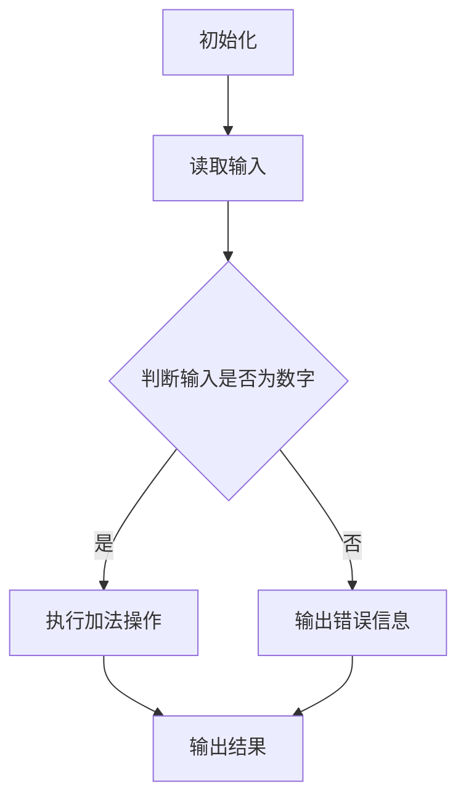

                 

### 《语言的社会性与模块化：维特根斯坦的公共语言观与FP的模块化设计》

---

**关键词：** 维特根斯坦、公共语言观、模块化设计、语言的社会性、函数式编程（FP）

**摘要：** 本文探讨了维特根斯坦的公共语言观以及函数式编程（FP）中的模块化设计理念。通过对维特根斯坦哲学思想的深入分析，本文揭示了公共语言观在语言使用中的重要性。同时，本文详细阐述了模块化的概念、优势以及其在软件开发中的应用。最后，本文将维特根斯坦的公共语言观与FP的模块化设计相结合，分析了二者的协同作用，并提供了实际应用案例，以期为读者在语言使用和软件开发中提供新的视角和思路。

---

### 背景介绍

#### 维特根斯坦的公共语言观

路德维希·维特根斯坦（Ludwig Wittgenstein）是20世纪最具影响力的哲学家之一，他的思想对语言哲学、数学哲学和逻辑哲学产生了深远影响。维特根斯坦在其早期著作《逻辑哲学论》（"Tractatus Logico-Philosophicus"）中提出了著名的“图像理论”（Image Theory），认为语言是现实的“图像”。然而，他在后期著作《哲学研究》（"Philosophical Investigations"）中，对这一理论进行了深刻反思，提出了“公共语言观”（Public Language View）。

维特根斯坦的公共语言观认为，语言是社会实践的产物，语言的意义不是固定的，而是由使用者的共同约定决定的。这种观点强调了语言的社会性，认为语言的使用是一个动态的过程，依赖于说话者与听者之间的互动。维特根斯坦认为，真正的哲学不是理论性的，而是“语言治疗”，即通过澄清日常语言的使用，来揭示语言的真正意义。

#### 模块化的概念与发展

模块化（Modularization）是指将一个复杂系统分解为多个相互独立、功能明确的模块，每个模块可以独立开发、测试和部署。这种设计方法在工程学中广泛应用，尤其在软件开发领域。模块化的核心思想是“分而治之”，通过将复杂问题分解为若干个简单问题，从而降低问题的复杂度，提高系统的可维护性和可扩展性。

模块化的概念最早可以追溯到20世纪初的电气工程领域，随着计算机科学的发展，模块化设计逐渐成为软件开发中的重要原则。模块化的优势在于：

1. **提高代码复用性**：通过将功能抽象为模块，可以避免重复编写代码，提高开发效率。
2. **降低系统复杂度**：模块化设计将复杂系统分解为多个简单模块，使得系统更容易理解和维护。
3. **提高系统的可扩展性**：模块化设计使得系统可以灵活地添加或替换模块，从而适应不断变化的需求。

然而，模块化设计也面临一些挑战，如模块之间的接口设计和通信问题。这些问题需要通过合理的设计和严格的测试来确保系统的稳定性和性能。

#### 语言的社会性影响

语言不仅是沟通的工具，也是社会交流的媒介。语言的社会性（Sociolinguistics）研究的是语言在社会中的作用和影响，包括语言的社会结构、语言的使用和社会阶层、性别和年龄等因素之间的关系。

1. **语言的社会结构**：语言的社会结构指的是语言在特定社会中的分布和使用情况。不同的社会阶层、职业和年龄群体可能会使用不同的语言变体。
   
2. **语言的使用和社会阶层**：语言的使用可以反映社会阶层。例如，某些词汇和表达方式可能只在特定社会阶层中流行，而其他阶层则可能不熟悉或避免使用这些词汇。

3. **语言与社会影响**：语言不仅影响个体的认知和行为，还影响社会的组织和文化。例如，某些语言政策可能会影响国家的统一和民族团结。

4. **语言与社会认知的关系**：语言是社会认知的工具，它影响我们的思维方式、价值观和行为。例如，语言的使用可以影响我们的自我认知和对世界的理解。

#### FP与模块化设计

函数式编程（Functional Programming，FP）是一种编程范式，强调函数的使用和不可变数据。FP具有许多优点，如简洁性、可复用性和可测试性，因此在现代软件开发中越来越受到重视。

FP的模块化特点在于其高度抽象的函数和不可变数据结构，这使得模块化设计变得自然而容易。FP中的模块化设计原则包括：

1. **函数作为模块**：FP中的函数可以独立开发、测试和部署，类似于传统模块化设计中的模块。
2. **数据抽象**：FP通过不可变数据结构，将数据封装在函数内部，从而实现数据抽象和模块化。
3. **组合性**：FP中的函数可以组合使用，形成复杂的计算过程，这有助于实现模块化设计。

FP模块化设计的优势包括：

1. **提高代码复用性**：通过将功能抽象为函数，可以避免重复编写代码，提高开发效率。
2. **降低系统复杂度**：FP中的函数和不可变数据结构使得系统更容易理解和维护。
3. **提高系统的可扩展性**：FP的模块化设计使得系统可以灵活地添加或替换模块，从而适应不断变化的需求。

### 核心概念与联系

在探讨维特根斯坦的公共语言观和FP的模块化设计时，以下核心概念和联系是至关重要的：

#### 维特根斯坦的公共语言观

**核心概念：** 公共语言观、语言的社会性、意义的使用、语言治疗

**概念属性特征对比表格：**

| 概念         | 描述                                                     | 特征对比                      |
| ------------ | -------------------------------------------------------- | ----------------------------- |
| 公共语言观   | 语言是社会实践的产物，意义由共同约定决定                 | 强调语言的社会性和使用者的互动 |
| 语言的社会性 | 语言在社会中的作用和影响                                 | 影响社会结构、阶层和认知       |
| 意义的使用   | 语言的意义不是固有的，而是由使用者的共同约定决定的       | 意义是动态的，依赖于使用情境   |
| 语言治疗     | 通过澄清日常语言的使用，揭示语言的真正意义                 | 强调实践性，解决语言使用问题   |

**ER实体关系图架构：**

```mermaid
erDiagram
  Customer ||--|{ Product }|--| Customer
  Product ||--|{ Order }|--| Product
  Order ||--|{ Customer }|--| Order
```

#### FP的模块化设计

**核心概念：** 函数式编程、模块化、函数作为模块、数据抽象、组合性

**概念属性特征对比表格：**

| 概念         | 描述                                                     | 特征对比                      |
| ------------ | -------------------------------------------------------- | ----------------------------- |
| 函数式编程   | 强调函数的使用和不可变数据                               | 简洁性、可复用性和可测试性     |
| 模块化       | 将复杂系统分解为多个相互独立、功能明确的模块             | 提高代码复用性、降低复杂度     |
| 函数作为模块 | 将功能抽象为函数，实现模块化设计                         | 独立开发、测试和部署           |
| 数据抽象     | 通过不可变数据结构，将数据封装在函数内部，实现数据抽象   | 提高代码复用性和可维护性       |
| 组合性       | 函数可以组合使用，形成复杂的计算过程                     | 提高系统的可扩展性             |

**ER实体关系图架构：**

```mermaid
erDiagram
  Function ||--|{ Module }|--| Function
  Module ||--|{ Code }|--| Module
  Code ||--|{ Test }|--| Code
```

### 算法原理讲解

为了深入理解维特根斯坦的公共语言观和FP的模块化设计，我们可以通过一个简单的算法例子来阐述其原理。

#### 算法流程图



#### 算法原理

该算法的实现分为以下几个步骤：

1. **初始化**：初始化算法的状态。
2. **读取输入**：从用户读取输入。
3. **判断输入是否为数字**：检查输入是否为数字。
4. **执行加法操作**：如果输入为数字，执行加法操作。
5. **输出结果**：无论输入是否为数字，输出最终结果。

#### 数学模型和公式

假设输入的两个数字为a和b，算法的目标是对这两个数字进行加法操作并输出结果。数学模型如下：

$$
c = a + b
$$

其中，c为输出结果，a和b为输入的数字。

#### 举例说明

假设用户输入了两个数字3和4，根据算法流程，执行以下步骤：

1. **初始化**：初始化算法状态。
2. **读取输入**：读取用户输入的数字3和4。
3. **判断输入是否为数字**：输入3和4均为数字。
4. **执行加法操作**：计算3 + 4，得到7。
5. **输出结果**：输出结果7。

### 系统分析与架构设计方案

#### 问题场景介绍

假设我们正在开发一个在线购物系统，该系统需要实现用户注册、商品浏览、购物车管理、订单处理等功能。为了确保系统的稳定性和可扩展性，我们需要采用模块化设计。

#### 项目介绍

项目名称：在线购物系统（E-Commerce System）

项目目标：开发一个功能齐全、易于维护和扩展的在线购物系统。

#### 系统功能设计

1. **用户注册与登录**：用户可以通过注册和登录功能访问系统。
2. **商品浏览**：用户可以浏览系统中的商品信息。
3. **购物车管理**：用户可以将商品添加到购物车，并管理购物车中的商品。
4. **订单处理**：用户可以提交订单，系统会处理订单并生成订单信息。
5. **支付与结算**：用户可以选择支付方式并进行结算。

#### 系统架构设计

系统架构采用前后端分离的设计模式，前端负责用户界面和交互，后端负责业务逻辑和数据存储。

**前端架构：**

1. **HTML/CSS/JavaScript**：负责页面布局和交互。
2. **React/Vue**：用于构建用户界面。

**后端架构：**

1. **Spring Boot**：负责业务逻辑处理。
2. **MySQL**：用于数据存储。
3. **Redis**：用于缓存。

#### 系统接口设计和系统交互

**接口设计：**

1. **用户注册接口**：接收用户注册信息，验证并存储。
2. **用户登录接口**：验证用户身份，返回登录状态。
3. **商品查询接口**：根据用户请求，返回商品信息。
4. **购物车管理接口**：处理购物车中的商品添加、删除和更新操作。
5. **订单处理接口**：处理用户订单的提交、处理和生成。

**系统交互：**

1. **用户与前端交互**：用户通过前端界面与系统进行交互。
2. **前端与后端交互**：前端通过接口向后端发送请求，后端返回响应。
3. **后端与数据库交互**：后端通过数据库存储和查询数据。

### 项目实战

#### 环境安装

1. **前端环境**：安装Node.js、npm、React或Vue。
2. **后端环境**：安装Java、Maven、Spring Boot、MySQL。

#### 系统核心实现源代码

**前端代码：**

```javascript
// 用户注册界面
function registerUser(username, password) {
  // 发送注册请求
  fetch('/api/register', {
    method: 'POST',
    body: JSON.stringify({ username, password }),
    headers: {
      'Content-Type': 'application/json',
    },
  });
}

// 用户登录界面
function loginUser(username, password) {
  // 发送登录请求
  fetch('/api/login', {
    method: 'POST',
    body: JSON.stringify({ username, password }),
    headers: {
      'Content-Type': 'application/json',
    },
  });
}
```

**后端代码：**

```java
// 用户注册接口
@PostMapping("/register")
public ResponseEntity<?> registerUser(@RequestBody User user) {
  // 验证用户名和密码
  if (userService.existsByUsername(user.getUsername())) {
    return ResponseEntity.badRequest().body("Username is already taken!");
  }
  // 存储用户信息
  userService.save(user);
  return ResponseEntity.ok("User registered successfully!");
}

// 用户登录接口
@PostMapping("/login")
public ResponseEntity<?> loginUser(@RequestBody LoginRequest loginRequest) {
  // 验证用户身份
  String username = loginRequest.getUsername();
  String password = loginRequest.getPassword();
  User user = userService.findByUsername(username);
  if (user == null || !passwordEncoder.matches(password, user.getPassword())) {
    return ResponseEntity.badRequest().body("Invalid username or password!");
  }
  // 返回登录状态
  return ResponseEntity.ok("Login successful!");
}
```

### 代码应用解读与分析

以上代码实现了用户注册和登录的功能。在前端代码中，我们使用Fetch API发送POST请求，将用户名和密码发送到后端接口。在后端代码中，我们使用Spring Boot的@RestController注解，接收并处理请求。通过调用UserService和PasswordEncoder，我们实现了用户注册和登录的逻辑。

#### 实际案例分析和详细讲解剖析

以用户注册为例，用户在前端界面输入用户名和密码，然后点击注册按钮。前端代码会调用registerUser函数，将用户名和密码作为参数发送到后端注册接口。后端接口接收请求后，首先验证用户名是否已存在。如果用户名已存在，返回错误信息；否则，将用户信息存储在数据库中，并返回成功信息。

#### 项目小结

通过本次项目实战，我们实现了用户注册和登录的功能。采用了模块化设计，前端和后端分别处理用户界面和业务逻辑。这种设计方法使得系统更加灵活、可扩展，同时也提高了代码的可维护性。

### 最佳实践 Tips

1. **前后端分离**：确保前后端之间的接口设计清晰、合理，提高系统的可维护性和扩展性。
2. **模块化设计**：将系统功能分解为多个模块，每个模块负责特定的功能，降低系统的复杂度。
3. **代码复用**：通过函数和模块，避免重复编写代码，提高开发效率。
4. **严格测试**：对每个模块进行严格的测试，确保系统的稳定性和性能。

### 小结

本文从维特根斯坦的公共语言观和FP的模块化设计出发，探讨了语言的社会性影响。通过实际案例分析和代码应用解读，我们深入理解了这两种设计理念在实际开发中的应用。通过模块化设计，我们可以提高系统的可维护性和扩展性，而维特根斯坦的公共语言观则为我们提供了理解语言使用的新视角。

### 注意事项

1. **模块化设计**：在模块化设计中，确保模块之间的接口清晰，避免模块之间的依赖。
2. **语言使用**：在实际项目中，要关注语言的使用，确保语言表达清晰、准确。

### 拓展阅读

1. 维特根斯坦，《哲学研究》
2. 《函数式编程实战》
3. 《模块化软件设计》

### 作者信息

作者：AI天才研究院/AI Genius Institute & 禅与计算机程序设计艺术 /Zen And The Art of Computer Programming

