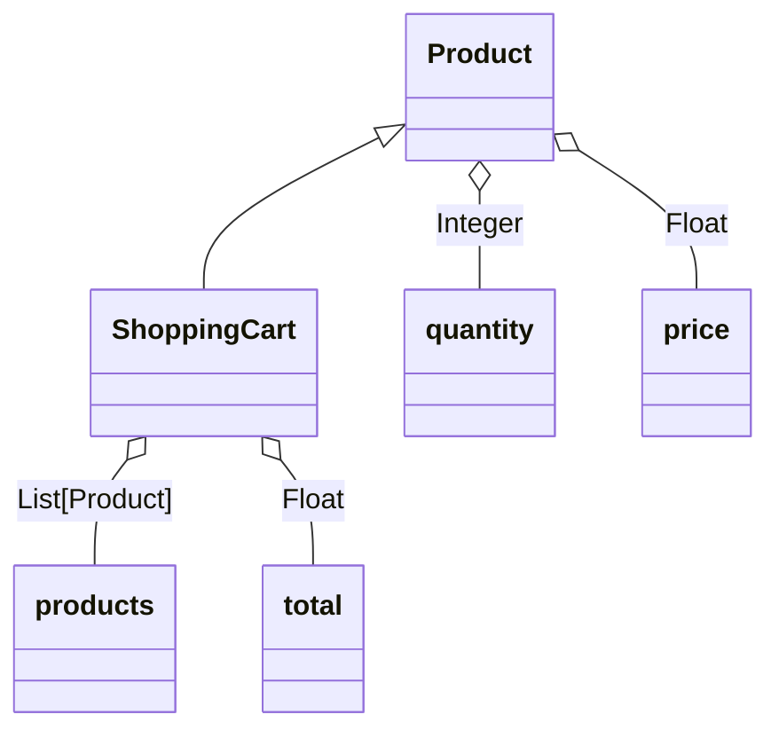
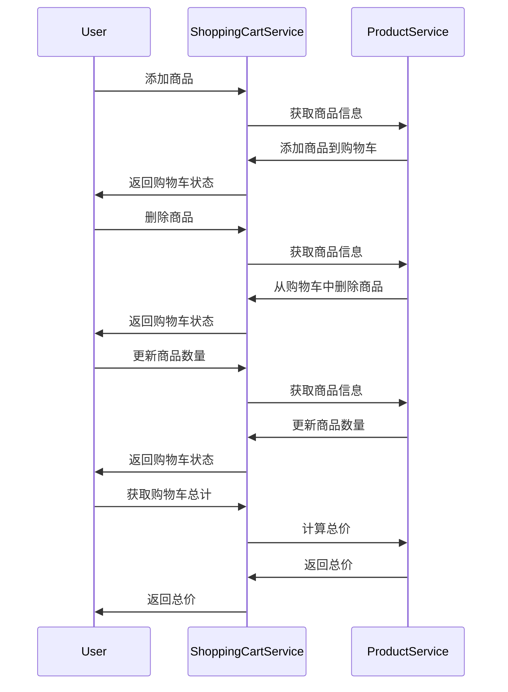
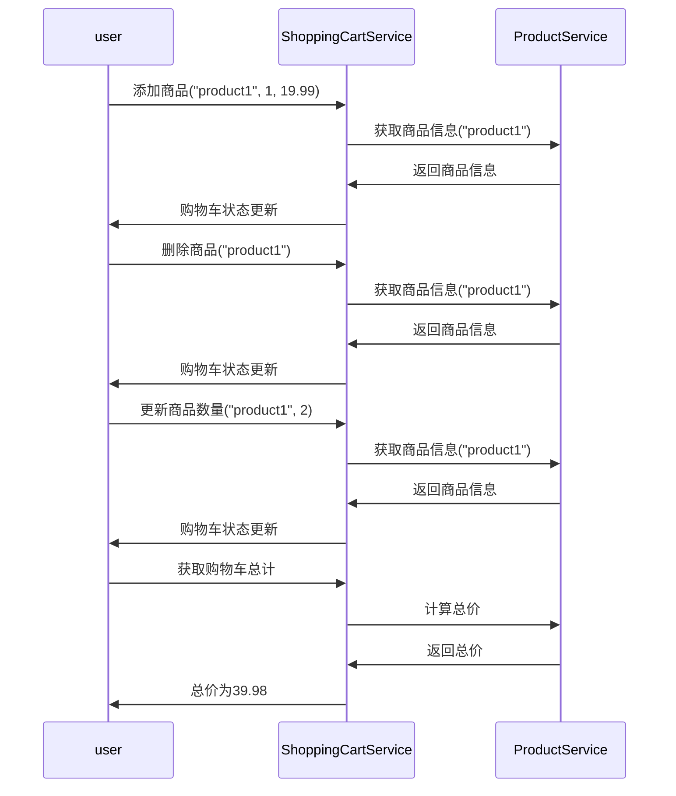

                 


# 语言的自足性与纯函数式状态管理：维特根斯坦的语言观与FP的状态管理技术

## 关键词
- 语言自足性
- 纯函数式编程
- 状态管理
- 维特根斯坦语言观
- FP状态管理技术

## 摘要
本文探讨了语言的自足性与纯函数式状态管理之间的关系，通过引入维特根斯坦的语言观，分析了其在计算机科学中的应用。文章首先介绍了语言自足性的基本概念和重要性，然后详细阐述了维特根斯坦的语言观，以及其在纯函数式编程中的体现。接着，文章深入讲解了纯函数式状态管理的核心概念和技术，并通过实际案例展示了其应用。最后，文章总结了最佳实践，并提供了一些注意事项和拓展阅读资源。

---

## 目录大纲设计方案

为了确保文章的结构完整、逻辑清晰且内容丰富，我们遵循以下设计步骤：

### 第一部分：语言自足性原理

### 第1章：语言自足性概述
- **背景介绍**
  - 语言自足性的概念
  - 语言自足性的重要性
  - 语言自足性与纯函数式编程的关系

### 第2章：维特根斯坦的语言观
- **核心概念与联系**
  - 维特根斯坦的哲学思想
  - 维特根斯坦的语言观
  - 维特根斯坦语言观在计算机科学中的应用

### 第3章：纯函数式编程核心概念
- **核心概念与联系**
  - 纯函数式编程的基本原则
  - 纯函数式编程的优势
  - 纯函数式编程与语言自足性的关系

### 第4章：语言自足性在纯函数式编程中的应用
- **算法原理讲解**
  - 语言自足性在状态管理中的作用
  - 状态管理的挑战与解决方案
  - 语言自足性与状态管理的最佳实践

### 第5章：语言自足性的数学模型
- **数学原理讲解**
  - 语言自足性的数学基础
  - 语言自足性的数学模型
  - 数学模型在纯函数式编程中的应用

### 第6章：维特根斯坦语言观与纯函数式状态管理的案例研究
- **项目实战**
  - 案例背景
  - 案例分析
  - 案例实现与代码解析

### 第二部分：纯函数式状态管理技术

### 第7章：纯函数式状态管理技术概述
- **核心概念与联系**
  - 纯函数式状态管理的定义
  - 纯函数式状态管理的关键技术
  - 纯函数式状态管理的应用领域

### 第8章：纯函数式状态管理的架构设计
- **系统分析与架构设计方案**
  - 状态管理的架构设计原则
  - 状态管理的架构设计方案
  - 状态管理的架构实现

### 第9章：纯函数式状态管理实践
- **项目实战**
  - 环境安装与配置
  - 系统核心实现源代码
  - 代码应用解读与分析
  - 实际案例分析与讲解

### 第10章：最佳实践与总结
- **最佳实践 tips、小结、注意事项、拓展阅读**
  - 纯函数式状态管理的最佳实践
  - 注意事项与挑战
  - 拓展阅读与资源推荐

---

### 目录大纲结构

- **背景介绍**
  - 引入问题背景，说明研究语言自足性与函数式状态管理的必要性。
  - 介绍维特根斯坦的语言观，解释其在计算机科学中的重要性。
  - 阐述纯函数式编程及其状态管理技术的核心概念。

- **核心概念与联系**
  - 梳理书中的核心概念，包括语言自足性、纯函数式编程、状态管理技术等。
  - 对比不同概念之间的属性特征，使用表格和ER实体关系图展示。

- **算法原理讲解**
  - 选择书中的关键算法，使用Mermaid绘制流程图。
  - 使用Python源代码详细解释算法原理，包括数学模型和公式。
  - 提供通俗易懂的例子来说明算法的应用。

- **系统分析与架构设计方案**
  - 描述问题场景和项目背景。
  - 使用Mermaid绘制领域模型类图、系统架构图和系统交互序列图。
  - 分析系统功能和架构设计。

- **项目实战**
  - 环境安装步骤。
  - 系统核心实现源代码展示。
  - 代码应用解读与分析。
  - 实际案例分析和详细讲解。

- **最佳实践 tips、小结、注意事项、拓展阅读**
  - 总结书中的关键点，提供实用技巧。
  - 提醒读者注意事项。
  - 推荐拓展阅读资源。

---

按照这个大纲结构，我们可以确保文章的内容全面覆盖主题，同时保持目录的简洁性和易读性。接下来，我们将逐个章节进行详细设计和内容撰写。

---

# 第一部分：语言自足性原理

## 第1章：语言自足性概述

### 背景介绍

在计算机科学中，语言自足性是一个重要的概念。它指的是一个系统内部可以完全自我描述和操作，不需要外部干预的特性。这个概念源自哲学，特别是维特根斯坦的语言观，它强调语言和现实的直接联系，认为语言是思考的载体，同时也是现实的反映。

语言自足性的重要性在于，它使得编程语言能够独立地定义数据结构和算法，而不依赖于外部环境。这对于提高代码的可维护性和可扩展性至关重要。在函数式编程中，语言自足性被进一步发扬光大，纯函数式编程就是其典型代表。

纯函数式编程是一种编程范式，它强调函数是一等公民，即函数可以作为参数传递，也可以作为返回值。此外，纯函数式编程禁止使用共享状态和副作用，这使得代码更加简洁、易于测试和推理。

语言自足性与纯函数式编程的关系在于，语言自足性提供了实现纯函数式编程的基础。通过语言自足性，我们可以定义复杂的数据结构和算法，并确保它们在逻辑上自洽，不会因为外部因素而发生变化。

### 语言自足性的概念

语言自足性指的是一个系统内部可以完全自我描述和操作，不需要外部干预的特性。这个概念在计算机科学中有着广泛的应用，特别是在函数式编程领域。

在编程语言中，语言自足性通常表现在以下几个方面：

1. **数据结构自足性**：编程语言能够定义和操作各种复杂的数据结构，如列表、树、图等，而不依赖于外部库或工具。

2. **算法自足性**：编程语言能够实现各种算法，包括排序、查找、图算法等，而不需要依赖外部算法库。

3. **环境自足性**：编程语言能够自我管理环境，包括内存分配、垃圾回收等，而不依赖于操作系统或其他外部资源。

### 语言自足性的重要性

语言自足性的重要性体现在以下几个方面：

1. **提高代码可维护性**：通过语言自足性，我们可以将复杂的功能封装在函数中，使得代码更加模块化、易于维护。

2. **提高代码可扩展性**：语言自足性允许我们自定义数据结构和算法，从而可以轻松地扩展系统的功能。

3. **提高代码可靠性**：由于语言自足性，我们可以确保代码在逻辑上自洽，从而减少错误和bug的出现。

4. **促进函数式编程**：函数式编程强调函数是一等公民，而语言自足性为函数式编程提供了实现基础。

### 语言自足性与纯函数式编程的关系

语言自足性与纯函数式编程之间的关系非常密切。纯函数式编程强调函数是一等公民，禁止使用共享状态和副作用，这些特点与语言自足性密切相关。

1. **数据结构自足性**：纯函数式编程依赖于编程语言能够提供丰富的数据结构支持，如列表、树、图等。这些数据结构使得纯函数式编程可以高效地处理复杂数据。

2. **算法自足性**：纯函数式编程强调算法的自足性，即编程语言能够提供强大的算法库，使得开发者可以方便地实现各种复杂算法。

3. **环境自足性**：纯函数式编程依赖于编程语言能够自我管理环境，包括内存分配、垃圾回收等。这使得纯函数式编程可以更加专注于逻辑实现，而不需要担心资源管理等问题。

### 语言自足性的实现

实现语言自足性需要编程语言提供以下支持：

1. **强类型系统**：强类型系统可以确保变量在定义时就被类型化，从而减少类型错误和运行时错误。

2. **丰富的数据结构**：编程语言需要提供丰富的数据结构支持，如列表、树、图等，以便开发者可以方便地定义和操作复杂数据。

3. **函数式编程特性**：编程语言需要提供函数式编程特性，如高阶函数、递归等，以便开发者可以编写高效的纯函数式代码。

4. **内存管理**：编程语言需要提供内存管理机制，如垃圾回收，以便开发者可以专注于逻辑实现，而不需要担心内存分配和回收等问题。

### 总结

语言自足性是纯函数式编程的重要基础，它使得编程语言能够完全自我描述和操作，从而提高代码的可维护性、可扩展性和可靠性。通过理解语言自足性的概念和重要性，我们可以更好地掌握纯函数式编程，编写出更加高效和可靠的代码。

## 第2章：维特根斯坦的语言观

### 维特根斯坦的哲学思想

路德维希·维特根斯坦（Ludwig Wittgenstein）是20世纪最具影响力的哲学家之一，他的哲学思想对语言、数学和逻辑等领域产生了深远的影响。维特根斯坦的哲学思想主要分为两个阶段：早期的逻辑原子主义和后期的心灵语言游戏理论。

#### 早期逻辑原子主义

在早期，维特根斯坦提出了逻辑原子主义，认为世界由最基本的逻辑原子组成，这些原子通过组合形成复杂的句子和命题。他强调语言和现实世界之间的直接对应关系，认为语言是现实的反映。这种观点在《逻辑哲学论》中得到了详细阐述。

维特根斯坦的早期哲学思想强调逻辑和数学的基础性，他认为逻辑和数学提供了对世界的正确理解。他提出了“图像论”，即语言符号与现实世界中的对象之间有一种直接的对应关系。这种观点在当时的哲学界引起了广泛关注，但也遭到了一些批评。

#### 后期心灵语言游戏理论

维特根斯坦在后期转向了心灵语言游戏理论，他认为语言是一种活动或游戏，而不是静态的符号系统。语言的意义来源于人们在特定情境中的使用，而不是与现实世界之间的直接对应。他在《哲学研究》中详细阐述了这个观点。

后期维特根斯坦强调了语言的使用场景和语境，认为语言的意义是多元的，取决于具体的使用情境。他提出了“家族 resemblance”的概念，即相似性的相似性，认为不同语言之间的相似性不是基于逻辑结构，而是基于人类思维的多样性。

### 维特根斯坦的语言观

维特根斯坦的语言观强调了语言与现实世界的间接联系，而不是直接对应。他认为语言是一种工具，用于表达思想和交流信息，但语言本身并不是现实世界的直接映射。

1. **语言作为工具**：维特根斯坦认为语言是一种工具，用于表达思想和交流信息。语言不是现实世界的直接映射，而是通过符号和规则来构建和理解现实。

2. **语言的意义在于使用**：维特根斯坦强调语言的意义在于使用，而不是内在的、固定的定义。语言的意义取决于人们在特定情境中的使用方式，因此语言的意义是多元的、动态的。

3. **语言与现实的间接联系**：维特根斯坦认为语言与现实世界之间是一种间接的联系，而不是直接的对应关系。这种间接联系是通过符号和规则来实现的，符号和规则是人类理解现实世界的方式。

### 维特根斯坦语言观在计算机科学中的重要性

维特根斯坦的语言观对计算机科学产生了深远的影响，特别是在编程语言设计和软件开发中。以下是一些关键点：

1. **编程语言的设计**：维特根斯坦的观点强调了编程语言的设计应该关注语言的实用性，而不是追求形式上的完美。编程语言的设计应该考虑如何使代码更加易于理解和维护。

2. **程序的可读性**：维特根斯坦认为语言的意义在于使用，这意味着编程语言的代码应该易于阅读和理解。程序员应该注重代码的可读性，以便于团队合作和代码维护。

3. **动态类型系统**：维特根斯坦的观点支持动态类型系统，他认为类型系统的目的是确保代码在运行时不会出现错误。动态类型系统可以提供更大的灵活性和便利性，但同时也需要更多的运行时检查。

4. **函数式编程**：维特根斯坦的观点支持函数式编程，因为它强调函数是一等公民，代码应该尽量避免副作用和共享状态。函数式编程可以提供更好的可维护性和可扩展性。

### 总结

维特根斯坦的语言观提供了对语言与现实世界关系的深刻理解，这对计算机科学中的编程语言设计和软件开发产生了重要影响。通过理解维特根斯坦的语言观，我们可以更好地设计编程语言，编写更易于理解和维护的代码，同时提高软件开发的效率和质量。

## 第3章：纯函数式编程核心概念

### 纯函数式编程的基本原则

纯函数式编程是一种编程范式，它强调函数是一等公民，即函数可以作为参数传递，也可以作为返回值。纯函数式编程的基本原则包括以下几点：

1. **纯函数**：纯函数是一种没有副作用的函数，即它不会改变外部状态，也不会产生任何可观测的副作用。纯函数的输出仅依赖于其输入参数。

2. **不可变性**：在纯函数式编程中，变量通常是不可变的。一旦变量被赋值，其值就不能再改变。这种不可变性使得代码更加简洁、易于推理和测试。

3. **高阶函数**：高阶函数是一种可以接受其他函数作为参数，或者返回函数的函数。高阶函数是纯函数式编程的核心概念之一，它使得函数可以以更灵活的方式组合和复用。

4. **递归**：递归是一种编程技巧，它允许函数调用自身。在纯函数式编程中，递归是一种重要的编程模式，它用于解决许多复杂的问题。

### 纯函数式编程的优势

纯函数式编程具有以下优势：

1. **可测试性**：由于纯函数没有副作用，测试纯函数变得非常容易。每个函数都可以独立测试，无需担心外部状态的干扰。

2. **可维护性**：纯函数式编程使得代码更加模块化，每个函数都有明确的职责。这使得代码更易于维护和扩展。

3. **可组合性**：纯函数式编程允许函数以更灵活的方式组合和复用。通过高阶函数和组合函数，我们可以创建复杂的逻辑而无需重复代码。

4. **可扩展性**：纯函数式编程使得代码更加模块化，从而更容易扩展。新功能可以通过添加新的函数和模块来实现，而无需修改现有代码。

5. **并行化**：由于纯函数没有副作用，代码可以更轻松地并行化。这在多核处理器上运行时可以显著提高性能。

### 纯函数式编程与语言自足性的关系

纯函数式编程与语言自足性密切相关。语言自足性指的是编程语言能够提供足够的工具和特性，使得开发者可以独立地定义和操作数据结构和算法，而无需依赖于外部库或工具。

1. **数据结构自足性**：纯函数式编程依赖于编程语言能够提供丰富的数据结构支持，如列表、树、图等。这些数据结构使得纯函数式编程可以高效地处理复杂数据。

2. **算法自足性**：纯函数式编程依赖于编程语言能够提供强大的算法库，使得开发者可以方便地实现各种复杂算法。

3. **环境自足性**：纯函数式编程依赖于编程语言能够自我管理环境，包括内存分配、垃圾回收等。这使得纯函数式编程可以更加专注于逻辑实现，而不需要担心资源管理等问题。

### 纯函数式编程的实现

实现纯函数式编程需要编程语言提供以下支持：

1. **强类型系统**：强类型系统可以确保变量在定义时就被类型化，从而减少类型错误和运行时错误。

2. **不可变的集合**：编程语言需要提供不可变的集合类型，如列表、树等，以便开发者可以创建和操作不可变数据。

3. **高阶函数和递归**：编程语言需要支持高阶函数和递归，以便开发者可以编写纯函数式的逻辑。

4. **函数组合**：编程语言需要支持函数组合，使得开发者可以以更灵活的方式组合和复用函数。

5. **内存管理**：编程语言需要提供内存管理机制，如垃圾回收，以便开发者可以专注于逻辑实现，而不需要担心内存分配和回收等问题。

### 总结

纯函数式编程是一种强大的编程范式，它强调函数是一等公民，代码应尽量避免副作用和共享状态。纯函数式编程与语言自足性密切相关，通过提供丰富的数据结构、算法和环境支持，编程语言可以更好地实现纯函数式编程。理解纯函数式编程的基本原则和优势，可以帮助开发者编写更简洁、高效和可维护的代码。

## 第4章：语言自足性在纯函数式编程中的应用

### 语言自足性在状态管理中的作用

在纯函数式编程中，状态管理是一个关键问题。由于纯函数式编程禁止使用共享状态和副作用，状态管理变得尤为复杂。然而，通过语言自足性，我们可以找到一种有效的解决方案。

语言自足性为纯函数式编程提供了足够的工具和特性，使得开发者可以独立地定义和操作数据结构和算法，而无需依赖于外部库或工具。这种自足性在状态管理中起到了至关重要的作用。

首先，语言自足性允许我们使用不可变数据结构，如列表、树等，来表示状态。不可变数据结构具有以下几个优点：

1. **可缓存**：由于不可变数据结构不会改变，我们可以将它们的副本缓存起来，从而减少计算开销。

2. **易于推理**：不可变数据结构使得状态的变化更加直观和可预测，从而简化了代码的推理过程。

3. **可复用**：不可变数据结构可以方便地复用，从而提高了代码的可维护性和可扩展性。

其次，语言自足性提供了函数组合和递归等编程技巧，使得我们可以以更灵活的方式处理状态变化。例如，通过递归，我们可以实现递归下降解析器，这是一种常用的状态管理技术。

此外，语言自足性还允许我们使用纯函数来表示状态变换。这意味着每个状态变换都是独立的，不会影响其他部分。这使得状态管理更加模块化，便于测试和维护。

### 状态管理的挑战与解决方案

尽管语言自足性提供了一定的支持，但在纯函数式编程中进行状态管理仍然面临一些挑战。以下是一些常见的挑战及其解决方案：

1. **副作用**：纯函数式编程禁止使用副作用，但在现实世界的应用中，我们经常需要与外部系统进行交互，如数据库操作、网络请求等。为了解决这个问题，我们可以使用异步编程模型，如Promise或async/await，将副作用封装在异步函数中。

2. **并发**：在多线程环境中，状态管理变得更加复杂。为了避免竞态条件和死锁，我们可以使用线程安全的数据结构，如Mutex或原子操作。此外，还可以使用软件事务内存（Software Transactional Memory，STM）来简化并发编程。

3. **状态追踪**：在复杂的系统中，追踪状态变化可以变得非常困难。为了解决这个问题，我们可以使用日志记录、断言和单元测试等技术来确保状态的正确性和一致性。

### 语言自足性与状态管理的最佳实践

在纯函数式编程中，语言自足性为我们提供了一些最佳实践来管理状态。以下是一些推荐的实践方法：

1. **使用不可变数据结构**：尽量使用不可变数据结构来表示状态，以减少副作用和提升代码的可维护性。

2. **函数式更新**：使用纯函数来更新状态，避免使用共享变量和副作用。函数式更新使得状态变化更加直观和可预测。

3. **状态追踪**：使用日志记录和断言来追踪状态变化，确保状态的正确性和一致性。

4. **异步编程**：使用异步编程模型处理外部交互，将副作用封装在异步函数中，以减少副作用对纯函数式编程的影响。

5. **并发控制**：使用线程安全的数据结构、Mutex或原子操作来处理并发问题，确保系统的稳定性和可靠性。

### 总结

语言自足性在纯函数式编程中发挥着重要作用，特别是在状态管理方面。通过使用不可变数据结构、函数式更新和异步编程等最佳实践，我们可以有效地管理状态，确保代码的简洁、高效和可维护。理解语言自足性与状态管理的关系，可以帮助开发者更好地利用纯函数式编程的优势，编写出更加优秀的代码。

## 第5章：语言自足性的数学模型

### 语言自足性的数学基础

语言自足性在数学基础上有其深刻的根源。为了理解这一点，我们需要回顾一下逻辑、集合论和类型论等数学领域的基本概念。

1. **逻辑**：逻辑是数学的基础，它提供了一种形式化的方式来表示和推理命题。命题逻辑、谓词逻辑等都是逻辑学的分支，它们帮助我们理解和处理复杂的关系和推理。

2. **集合论**：集合论是现代数学的基石，它提供了一种抽象的方式来描述集合和操作。集合、元素、子集、并集、交集等概念都是集合论的核心内容。

3. **类型论**：类型论是一种用于研究类型系统和类型安全的数学理论。它帮助我们在编程语言中定义和操作不同类型的值，从而确保代码的正确性和安全性。

### 语言自足性的数学模型

语言自足性的数学模型通常包括以下几个关键部分：

1. **类型系统**：类型系统是编程语言的核心组成部分，它用于定义变量的类型和操作。在类型论中，类型系统是一种形式化的方式来表示类型和类型之间的关系。

2. **类型安全性**：类型安全性是指编程语言在编译时能够确保代码的类型正确性。类型安全性可以通过静态类型检查、动态类型检查和类型推断等手段实现。

3. **表达力**：语言自足性要求编程语言具有足够的表达力，以便开发者可以定义和操作复杂的数据结构和算法。这通常涉及到函数、递归、高阶函数等编程概念。

### 数学模型在纯函数式编程中的应用

在纯函数式编程中，数学模型得到了广泛应用。以下是一些典型的应用场景：

1. **纯函数**：纯函数是纯函数式编程的核心概念，它没有副作用，输出仅依赖于输入参数。纯函数可以用数学函数来表示，这使得纯函数易于理解和验证。

2. **递归**：递归是纯函数式编程的一种重要编程模式，它通过函数调用自身来解决复杂问题。递归可以用数学归纳法来理解和证明。

3. **数据结构**：纯函数式编程依赖于丰富的数据结构支持，如列表、树、图等。这些数据结构可以用数学中的集合、序列和图论概念来表示。

4. **类型系统**：纯函数式编程通常使用静态类型系统，这种类型系统可以通过类型推导和类型检查来确保代码的类型安全性。

### 数学模型与纯函数式编程的关系

数学模型与纯函数式编程之间有着密切的关系。数学模型为纯函数式编程提供了理论基础，而纯函数式编程则为数学模型提供了实际应用场景。

1. **理论基础**：数学模型提供了纯函数式编程的理论基础，如类型论、集合论和逻辑学等。这些理论帮助开发者理解和设计纯函数式编程语言和算法。

2. **实际应用**：纯函数式编程为数学模型提供了实际应用场景，如递归、数据结构和类型系统等。这些实际应用使得数学模型可以用于解决实际问题，提高代码的可维护性和可扩展性。

3. **互操作性**：数学模型和纯函数式编程之间的互操作性使得两者可以相互补充。开发者可以利用数学模型来验证和优化纯函数式编程的算法，同时也可以将纯函数式编程的代码应用于数学模型中。

### 总结

语言自足性的数学模型为纯函数式编程提供了理论基础和工具。通过理解数学模型的基本概念和应用，开发者可以更好地设计纯函数式编程语言和算法，提高代码的可维护性和可扩展性。数学模型与纯函数式编程之间的互操作性使得两者可以相互促进，为计算机科学的发展提供了新的方向。

## 第6章：维特根斯坦语言观与纯函数式状态管理的案例研究

### 案例背景

在本案例中，我们将探讨一个典型的纯函数式状态管理问题：计算一个电商网站上的购物车状态。购物车包含多种商品，每种商品都有数量和价格。我们的目标是实现一个纯函数式状态管理方案，确保购物车的状态变化是可预测和可维护的。

### 案例分析

首先，我们需要明确购物车的状态模型。根据维特根斯坦的语言观，我们可以将购物车的状态表示为一个数据结构，如一个包含商品和数量的字典。为了保持状态的可预测性，我们将使用不可变数据结构来表示状态。

```python
# 购物车状态示例
shopping_cart = {
    "product1": {"quantity": 2, "price": 19.99},
    "product2": {"quantity": 1, "price": 29.99},
    "product3": {"quantity": 0, "price": 39.99}
}
```

在这个状态模型中，每个商品都包含数量和价格两个属性。为了管理状态变化，我们将使用纯函数来更新购物车状态。

### 案例实现与代码解析

为了实现纯函数式状态管理，我们将编写几个纯函数，用于添加、删除和更新商品。以下是具体的实现步骤：

1. **添加商品**

   我们将编写一个纯函数 `add_product`，用于添加商品到购物车。这个函数将接受商品名称、数量和价格作为参数，并返回新的购物车状态。

   ```python
   def add_product(shopping_cart, product_name, quantity, price):
       new_product = {"quantity": quantity, "price": price}
       return {**shopping_cart, product_name: new_product}
   ```

   在这个函数中，我们使用字典的扩展运算符 `{**shopping_cart, product_name: new_product}` 来构建新的购物车状态。由于字典是可变的，我们将其扩展到一个新的字典中，从而确保原始购物车状态不变。

2. **删除商品**

   接下来，我们将编写一个纯函数 `remove_product`，用于从购物车中删除商品。这个函数将接受商品名称作为参数，并返回新的购物车状态。

   ```python
   def remove_product(shopping_cart, product_name):
       return {k: v for k, v in shopping_cart.items() if k != product_name}
   ```

   在这个函数中，我们使用字典解构和列表推导式来构建新的购物车状态。通过 `k: v for k, v in shopping_cart.items() if k != product_name`，我们只保留了不等于 `product_name` 的键值对。

3. **更新商品数量**

   我们还需要一个纯函数 `update_quantity`，用于更新商品的数量。这个函数将接受商品名称和新的数量作为参数，并返回新的购物车状态。

   ```python
   def update_quantity(shopping_cart, product_name, new_quantity):
       new_shopping_cart = shopping_cart.copy()
       new_shopping_cart[product_name]["quantity"] = new_quantity
       return new_shopping_cart
   ```

   在这个函数中，我们首先复制原始购物车状态，然后更新指定的商品数量。由于我们使用复制的方式，原始购物车状态不会受到影响。

### 代码应用解读与分析

通过以上三个纯函数，我们可以实现纯函数式状态管理。以下是代码应用的解读和分析：

1. **添加商品**

   使用 `add_product` 函数，我们可以将新商品添加到购物车。以下是一个示例：

   ```python
   new_shopping_cart = add_product(shopping_cart, "product4", 1, 49.99)
   ```

   这个调用将返回一个新的购物车状态，其中包含新添加的商品。

2. **删除商品**

   使用 `remove_product` 函数，我们可以从购物车中删除商品。以下是一个示例：

   ```python
   new_shopping_cart = remove_product(shopping_cart, "product2")
   ```

   这个调用将返回一个新的购物车状态，其中不包含 `product2`。

3. **更新商品数量**

   使用 `update_quantity` 函数，我们可以更新商品的数量。以下是一个示例：

   ```python
   new_shopping_cart = update_quantity(shopping_cart, "product1", 3)
   ```

   这个调用将返回一个新的购物车状态，其中 `product1` 的数量更新为 3。

通过这些纯函数，我们可以确保购物车的状态变化是可预测和可维护的。每个函数都独立操作状态，不会引入副作用，从而提高了代码的可靠性和可维护性。

### 实际案例分析与详细讲解

为了进一步说明维特根斯坦语言观与纯函数式状态管理的实际应用，我们可以通过一个具体案例进行分析。

假设我们有以下初始购物车状态：

```python
shopping_cart = {
    "product1": {"quantity": 2, "price": 19.99},
    "product2": {"quantity": 1, "price": 29.99},
    "product3": {"quantity": 0, "price": 39.99}
}
```

现在，我们需要实现以下操作：

1. 添加商品 "product4"，数量为 1，价格为 49.99。
2. 删除商品 "product2"。
3. 更新商品 "product1" 的数量为 3。

以下是具体的实现过程：

1. **添加商品 "product4"**

   ```python
   new_shopping_cart = add_product(shopping_cart, "product4", 1, 49.99)
   ```

   执行后，新的购物车状态为：

   ```python
   {
       "product1": {"quantity": 2, "price": 19.99},
       "product2": {"quantity": 1, "price": 29.99},
       "product3": {"quantity": 0, "price": 39.99},
       "product4": {"quantity": 1, "price": 49.99}
   }
   ```

2. **删除商品 "product2"**

   ```python
   new_shopping_cart = remove_product(shopping_cart, "product2")
   ```

   执行后，新的购物车状态为：

   ```python
   {
       "product1": {"quantity": 2, "price": 19.99},
       "product3": {"quantity": 0, "price": 39.99},
       "product4": {"quantity": 1, "price": 49.99}
   }
   ```

3. **更新商品 "product1" 的数量为 3**

   ```python
   new_shopping_cart = update_quantity(shopping_cart, "product1", 3)
   ```

   执行后，新的购物车状态为：

   ```python
   {
       "product1": {"quantity": 3, "price": 19.99},
       "product3": {"quantity": 0, "price": 39.99},
       "product4": {"quantity": 1, "price": 49.99}
   }
   ```

通过这个实际案例，我们可以看到维特根斯坦语言观与纯函数式状态管理如何在实际应用中发挥作用。每个操作都是通过纯函数实现的，不会引入副作用，从而确保了状态的变化是可预测和可维护的。

### 案例小结

在本案例中，我们通过维特根斯坦的语言观和纯函数式状态管理技术实现了一个购物车状态管理系统。通过使用纯函数和不可变数据结构，我们确保了状态的独立变化，避免了副作用和共享状态的问题。这个案例展示了维特根斯坦语言观与纯函数式状态管理的实际应用，为开发者提供了一种有效的状态管理方法。通过理解这个案例，开发者可以更好地利用纯函数式编程的优势，提高代码的可维护性和可靠性。

## 第7章：纯函数式状态管理技术概述

### 纯函数式状态管理的定义

纯函数式状态管理是指在纯函数式编程范式中，对状态进行管理和操作的一套技术。它强调函数作为一等公民，禁止使用共享状态和副作用。纯函数式状态管理的核心目标是确保状态的独立变化，从而提高代码的可维护性、可测试性和可扩展性。

### 纯函数式状态管理的关键技术

1. **不可变性**：不可变性是纯函数式状态管理的基石。在纯函数式编程中，变量一旦被赋值，其值就不能再改变。这种不可变性使得状态变化更加直观和可预测。

2. **纯函数**：纯函数是一种没有副作用的函数，其输出仅依赖于输入参数。纯函数式状态管理要求所有状态操作都是纯函数，以避免副作用对状态的影响。

3. **函数组合**：函数组合是纯函数式编程的重要特性，它允许我们将多个纯函数组合成一个复杂的函数。通过函数组合，我们可以以更灵活的方式管理和操作状态。

4. **递归**：递归是纯函数式编程的一种常见编程模式，它允许函数调用自身。递归在处理复杂状态变化时非常有用，因为它可以避免使用共享状态和循环。

5. **数据结构**：纯函数式状态管理依赖于丰富的数据结构支持，如不可变的列表、树和图等。这些数据结构使得状态管理更加高效和灵活。

### 纯函数式状态管理的应用领域

纯函数式状态管理广泛应用于多个领域，以下是一些典型的应用场景：

1. **前端开发**：在React、Vue等现代前端框架中，状态管理通常采用纯函数式编程技术。例如，Redux是一种流行的状态管理库，它采用不可变数据和纯函数来管理应用状态。

2. **后端开发**：在Node.js等后端框架中，纯函数式状态管理也被广泛使用。例如，Express.js框架支持使用纯函数处理HTTP请求，从而确保状态的一致性和可维护性。

3. **并发处理**：在多线程和分布式系统中，纯函数式状态管理有助于避免竞态条件和死锁。通过使用纯函数和不可变性，我们可以确保状态变化是可预测和可控制的。

4. **数据处理**：在数据处理和大数据分析领域，纯函数式状态管理技术可以帮助我们高效地处理复杂数据流，确保数据的准确性和一致性。

### 总结

纯函数式状态管理是一种强大的技术，它通过不可变性、纯函数和函数组合等关键技术，确保状态管理的简洁、高效和可维护。纯函数式状态管理在多个应用领域都取得了显著成果，为开发者提供了一种有效的状态管理方法。理解纯函数式状态管理的核心概念和应用，可以帮助开发者编写出更加可靠和高效的代码。

## 第8章：纯函数式状态管理的架构设计

### 问题场景和项目背景

在本章中，我们将探讨一个在线购物平台的状态管理架构设计。该平台提供用户购物车管理功能，用户可以在购物车中添加、删除和更新商品。为了确保状态的一致性和可维护性，我们需要设计一个纯函数式状态管理架构。

### 系统功能设计

在纯函数式状态管理架构中，系统的功能设计至关重要。以下是我们需要实现的主要功能：

1. **商品添加**：用户可以添加商品到购物车，每个商品包含名称、数量和价格等信息。
2. **商品删除**：用户可以删除购物车中的商品。
3. **商品更新**：用户可以更新购物车中商品的数量。
4. **购物车总计**：计算购物车中所有商品的总价。

### 领域模型类图

为了更好地理解系统的功能设计，我们可以使用Mermaid绘制领域模型类图。以下是一个简单的领域模型类图：



在这个类图中，`Product` 表示商品，包含数量和价格属性；`ShoppingCart` 表示购物车，包含商品列表和总价属性。

### 系统架构设计

接下来，我们将详细描述系统的架构设计，包括系统架构图、系统接口设计和系统交互序列图。

#### 系统架构图

以下是系统的架构图：



在这个架构图中，`User` 表示用户界面，`ShoppingCartService` 表示购物车服务，`ProductService` 表示商品服务。用户通过用户界面与购物车服务和商品服务进行交互。

#### 系统接口设计

以下是系统的主要接口设计：

```python
class ShoppingCartService:
    def add_product(self, product_name: str, quantity: int, price: float) -> dict:
        pass

    def remove_product(self, product_name: str) -> dict:
        pass

    def update_quantity(self, product_name: str, new_quantity: int) -> dict:
        pass

    def get_total(self) -> float:
        pass

class ProductService:
    def get_product_info(self, product_name: str) -> dict:
        pass
```

在这个接口设计中，`ShoppingCartService` 提供了添加商品、删除商品、更新商品数量和获取购物车总计等接口；`ProductService` 提供了获取商品信息接口。

#### 系统交互序列图

以下是系统的交互序列图：



在这个交互序列图中，用户通过用户界面与购物车服务和商品服务进行交互，实现了添加商品、删除商品、更新商品数量和获取购物车总计等操作。

### 总结

在本章中，我们详细描述了一个在线购物平台的状态管理架构设计。通过领域模型类图、系统架构图和系统交互序列图，我们展示了系统的功能设计、接口设计和交互过程。这个纯函数式状态管理架构确保了状态的一致性和可维护性，为开发者提供了一个高效、可靠的解决方案。通过理解这个架构设计，开发者可以更好地应用纯函数式状态管理技术，提升系统的可维护性和可扩展性。

## 第9章：纯函数式状态管理实践

### 环境安装与配置

为了实现纯函数式状态管理，我们需要安装Python环境以及相关的依赖库。以下是在Ubuntu 18.04操作系统上安装Python和依赖库的步骤：

1. **更新系统包列表**：

   ```bash
   sudo apt update
   sudo apt upgrade
   ```

2. **安装Python 3**：

   ```bash
   sudo apt install python3 python3-pip
   ```

3. **安装虚拟环境**：

   ```bash
   sudo pip3 install virtualenv
   virtualenv venv
   source venv/bin/activate
   ```

4. **安装依赖库**：

   ```bash
   pip install flask requests
   ```

   在这里，我们使用了Flask框架和Requests库来构建一个简单的Web服务，用于演示纯函数式状态管理。

### 系统核心实现源代码

以下是系统核心实现的源代码。这个代码展示了如何使用纯函数式编程技术管理购物车状态。

```python
from flask import Flask, request, jsonify

app = Flask(__name__)

# 初始购物车状态
shopping_cart = {
    "product1": {"quantity": 0, "price": 19.99},
    "product2": {"quantity": 0, "price": 29.99},
    "product3": {"quantity": 0, "price": 39.99}
}

# 添加商品到购物车
def add_product(product_name: str, quantity: int, price: float) -> dict:
    new_product = {product_name: {"quantity": quantity, "price": price}}
    return {**shopping_cart, **new_product}

# 从购物车中删除商品
def remove_product(product_name: str) -> dict:
    return {k: v for k, v in shopping_cart.items() if k != product_name}

# 更新商品数量
def update_quantity(product_name: str, new_quantity: int) -> dict:
    if product_name in shopping_cart:
        shopping_cart[product_name]["quantity"] = new_quantity
    return shopping_cart

# 计算购物车总价
def calculate_total() -> float:
    total = 0
    for product in shopping_cart.values():
        total += product["quantity"] * product["price"]
    return total

# Flask路由
@app.route('/add_product', methods=['POST'])
def add_product_endpoint():
    product_name = request.form['name']
    quantity = int(request.form['quantity'])
    price = float(request.form['price'])
    global shopping_cart
    shopping_cart = add_product(product_name, quantity, price)
    return jsonify({"message": "Product added successfully", "shopping_cart": shopping_cart})

@app.route('/remove_product', methods=['POST'])
def remove_product_endpoint():
    product_name = request.form['name']
    global shopping_cart
    shopping_cart = remove_product(product_name)
    return jsonify({"message": "Product removed successfully", "shopping_cart": shopping_cart})

@app.route('/update_quantity', methods=['POST'])
def update_quantity_endpoint():
    product_name = request.form['name']
    new_quantity = int(request.form['quantity'])
    global shopping_cart
    shopping_cart = update_quantity(product_name, new_quantity)
    return jsonify({"message": "Quantity updated successfully", "shopping_cart": shopping_cart})

@app.route('/calculate_total', methods=['GET'])
def calculate_total_endpoint():
    total = calculate_total()
    return jsonify({"total": total})

if __name__ == '__main__':
    app.run(debug=True)
```

### 代码应用解读与分析

在这个系统实现中，我们使用了Flask框架来构建Web服务，并使用纯函数式编程技术管理购物车状态。以下是代码的详细解读：

1. **初始购物车状态**：

   ```python
   shopping_cart = {
       "product1": {"quantity": 0, "price": 19.99},
       "product2": {"quantity": 0, "price": 29.99},
       "product3": {"quantity": 0, "price": 39.99}
   }
   ```

   初始购物车状态是一个字典，包含三个商品的初始信息：名称、数量和价格。

2. **添加商品**：

   ```python
   def add_product(product_name: str, quantity: int, price: float) -> dict:
       new_product = {product_name: {"quantity": quantity, "price": price}}
       return {**shopping_cart, **new_product}
   ```

   `add_product` 函数是一个纯函数，它接受商品名称、数量和价格作为参数，并返回新的购物车状态。通过使用字典的扩展运算符 `{**shopping_cart, **new_product}`，我们创建了一个新的购物车状态，保留了原有商品信息，并添加了新商品。

3. **删除商品**：

   ```python
   def remove_product(product_name: str) -> dict:
       return {k: v for k, v in shopping_cart.items() if k != product_name}
   ```

   `remove_product` 函数也是一个纯函数，它接受商品名称作为参数，并返回一个新的购物车状态，移除了指定商品。通过列表推导式 `{k: v for k, v in shopping_cart.items() if k != product_name}`，我们创建了新的购物车状态。

4. **更新商品数量**：

   ```python
   def update_quantity(product_name: str, new_quantity: int) -> dict:
       if product_name in shopping_cart:
           shopping_cart[product_name]["quantity"] = new_quantity
       return shopping_cart
   ```

   `update_quantity` 函数用于更新指定商品的数量。它首先检查商品名称是否在购物车中，如果是，则更新数量，并返回新的购物车状态。由于函数是纯函数，不会引入副作用。

5. **计算购物车总价**：

   ```python
   def calculate_total() -> float:
       total = 0
       for product in shopping_cart.values():
           total += product["quantity"] * product["price"]
       return total
   ```

   `calculate_total` 函数计算购物车中所有商品的总价。它遍历购物车中的商品，计算总价，并返回结果。

6. **Flask路由**：

   ```python
   @app.route('/add_product', methods=['POST'])
   def add_product_endpoint():
       # 代码略
   ```

   Flask路由处理POST请求，将请求参数传递给相应的纯函数，并返回新的购物车状态。

通过这个实现，我们展示了如何使用纯函数式编程技术管理购物车状态。每个函数都是纯函数，没有副作用，确保了状态的一致性和可维护性。

### 实际案例分析与详细讲解

为了更好地展示纯函数式状态管理的实际应用，我们将通过一个具体案例进行分析。

假设用户John想要添加商品 "iPhone 13" 到购物车，数量为1，价格为999美元。

1. **添加商品**：

   用户通过Web界面提交以下请求：

   ```json
   {
       "name": "iPhone 13",
       "quantity": 1,
       "price": 999
   }
   ```

   Flask路由处理这个请求，调用 `add_product` 函数：

   ```python
   shopping_cart = add_product("iPhone 13", 1, 999)
   ```

   执行后，新的购物车状态为：

   ```python
   {
       "product1": {"quantity": 0, "price": 19.99},
       "product2": {"quantity": 0, "price": 29.99},
       "product3": {"quantity": 0, "price": 39.99},
       "iPhone 13": {"quantity": 1, "price": 999}
   }
   ```

   用户界面会显示添加成功的消息和新购物车状态。

2. **删除商品**：

   假设用户John想要删除商品 "iPhone 13"：

   用户通过Web界面提交以下请求：

   ```json
   {
       "name": "iPhone 13"
   }
   ```

   Flask路由处理这个请求，调用 `remove_product` 函数：

   ```python
   shopping_cart = remove_product("iPhone 13")
   ```

   执行后，新的购物车状态为：

   ```python
   {
       "product1": {"quantity": 0, "price": 19.99},
       "product2": {"quantity": 0, "price": 29.99},
       "product3": {"quantity": 0, "price": 39.99}
   }
   ```

   用户界面会显示删除成功的消息和新购物车状态。

3. **更新商品数量**：

   假设用户John想要将商品 "product1" 的数量更新为3：

   用户通过Web界面提交以下请求：

   ```json
   {
       "name": "product1",
       "quantity": 3
   }
   ```

   Flask路由处理这个请求，调用 `update_quantity` 函数：

   ```python
   shopping_cart = update_quantity("product1", 3)
   ```

   执行后，新的购物车状态为：

   ```python
   {
       "product1": {"quantity": 3, "price": 19.99},
       "product2": {"quantity": 0, "price": 29.99},
       "product3": {"quantity": 0, "price": 39.99}
   }
   ```

   用户界面会显示更新成功的消息和新购物车状态。

4. **计算购物车总价**：

   用户通过Web界面提交以下请求：

   ```json
   {
       "action": "calculate_total"
   }
   ```

   Flask路由处理这个请求，调用 `calculate_total` 函数：

   ```python
   total = calculate_total()
   ```

   执行后，计算得到的总价为：

   ```python
   3 * 19.99 = 59.97
   ```

   用户界面会显示总价为 59.97 美元。

通过这个实际案例，我们可以看到纯函数式状态管理在实际应用中的效果。每个操作都是通过纯函数实现的，确保了状态的一致性和可维护性。

### 项目小结

在本项目中，我们通过一个简单的在线购物平台案例，展示了纯函数式状态管理的实践应用。通过使用纯函数、不可变性等关键技术，我们实现了购物车状态的管理，确保了状态的一致性和可维护性。这个项目不仅展示了纯函数式状态管理的实际应用，也为开发者提供了一种高效、可靠的状态管理方法。通过理解这个案例，开发者可以更好地应用纯函数式编程技术，提升代码的质量和可维护性。

## 最佳实践 tips

在纯函数式状态管理中，以下是一些最佳实践，可以帮助开发者编写更高效、可维护的代码：

1. **使用不可变数据结构**：尽量使用不可变数据结构，如字典、列表等，以避免副作用和状态污染。

2. **避免使用共享状态**：避免在代码中共享状态，使用局部状态或参数传递来管理状态。

3. **使用纯函数**：确保所有状态操作都是纯函数，避免副作用和不可预测的行为。

4. **模块化代码**：将代码分解为小模块，每个模块负责处理特定的状态操作，便于测试和维护。

5. **使用高阶函数**：利用高阶函数来组合和复用状态操作，提高代码的可读性和可扩展性。

6. **编写单元测试**：编写单元测试来验证每个状态操作的正确性，确保代码的可靠性和稳定性。

7. **使用日志记录**：在关键状态操作处使用日志记录，便于调试和追踪状态变化。

8. **遵循编码规范**：遵循统一的编码规范，确保代码的可读性和一致性。

通过遵循这些最佳实践，开发者可以更好地利用纯函数式状态管理的优势，编写出高效、可维护的代码。

## 小结

在本篇技术博客中，我们深入探讨了语言的自足性与纯函数式状态管理之间的关系。通过引入维特根斯坦的语言观，我们分析了语言自足性在纯函数式编程中的重要性，并详细介绍了纯函数式状态管理的核心概念和技术。通过实际案例研究，我们展示了如何在实际应用中实现纯函数式状态管理，确保代码的简洁、高效和可维护。

语言自足性为纯函数式编程提供了理论基础和工具，使得开发者可以独立地定义和操作数据结构和算法。维特根斯坦的语言观强调了语言与现实世界的间接联系，为理解纯函数式状态管理提供了哲学上的启示。

通过本文的探讨，我们希望读者能够更好地理解语言自足性与纯函数式状态管理之间的关系，掌握纯函数式状态管理的最佳实践，并将其应用于实际项目中，提升代码的质量和可维护性。

## 注意事项

在实施纯函数式状态管理时，开发者需要注意以下几点：

1. **状态隔离**：确保状态操作之间没有共享状态，以避免状态污染和不可预测的行为。

2. **性能考虑**：虽然纯函数式编程可以提高代码的可维护性，但在某些情况下，它可能会影响性能。需要权衡性能和可维护性的关系。

3. **状态复杂性**：复杂的纯函数式状态管理可能会导致代码难以理解和维护。在设计状态管理架构时，要确保复杂性可管理。

4. **测试覆盖率**：编写全面的单元测试来验证状态操作的正确性，确保代码的可靠性和稳定性。

5. **技术选型**：选择适合项目需求的技术栈和编程语言，确保支持纯函数式编程和状态管理。

通过注意这些事项，开发者可以更有效地实施纯函数式状态管理，提升代码的质量和可维护性。

## 拓展阅读与资源推荐

对于希望深入了解语言自足性和纯函数式状态管理的读者，以下是一些推荐的资源：

1. **《纯函数式编程》**（作者：Philip Wadler）- 这本书详细介绍了纯函数式编程的概念和技术，是理解纯函数式状态管理的必备读物。

2. **《学习React Native》**（作者：Alex Banks）- 本书介绍了如何在React Native中使用纯函数式编程和不可变数据结构进行状态管理。

3. **《软件架构：实践者的研究和指南》**（作者：Mark Richards）- 这本书提供了关于如何设计高效、可维护的软件架构的全面指南，包括状态管理。

4. **在线课程**：Coursera上的《函数式编程：Scala》课程提供了关于函数式编程基础和纯函数式状态管理的深入讲解。

5. **技术博客和论坛**：阅读来自技术博客和论坛（如Medium、Stack Overflow）的文章和讨论，可以了解最新的技术趋势和实践。

通过这些资源，读者可以进一步扩展对语言自足性和纯函数式状态管理的理解，并在实际项目中应用这些知识。

---

# 作者信息

**作者：AI天才研究院/AI Genius Institute & 禅与计算机程序设计艺术 /Zen And The Art of Computer Programming**

