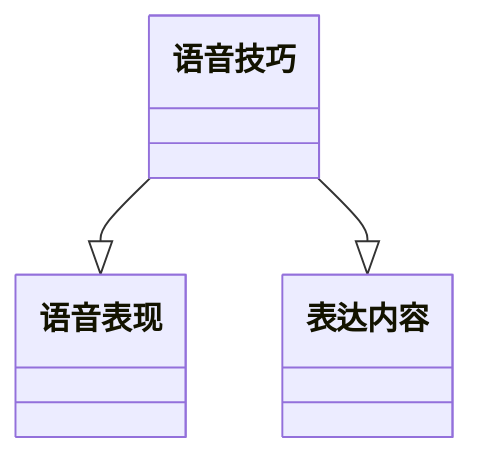
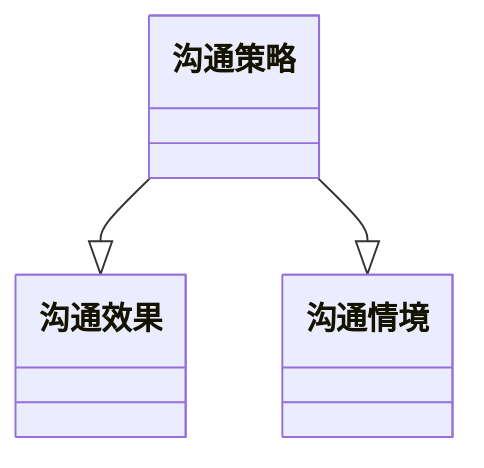
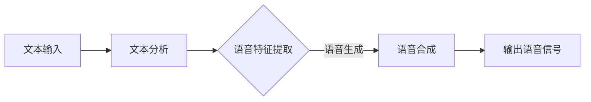
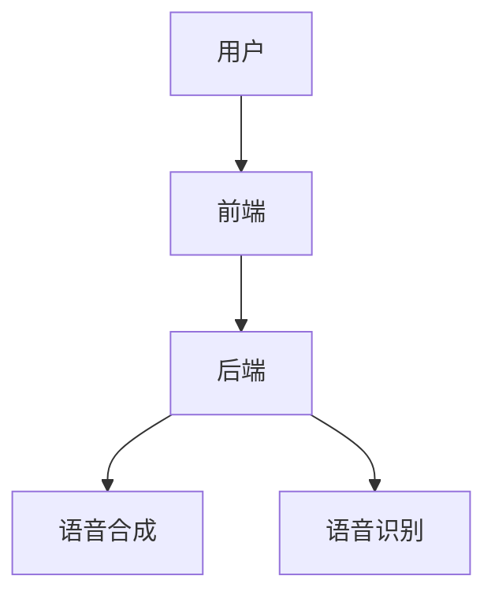
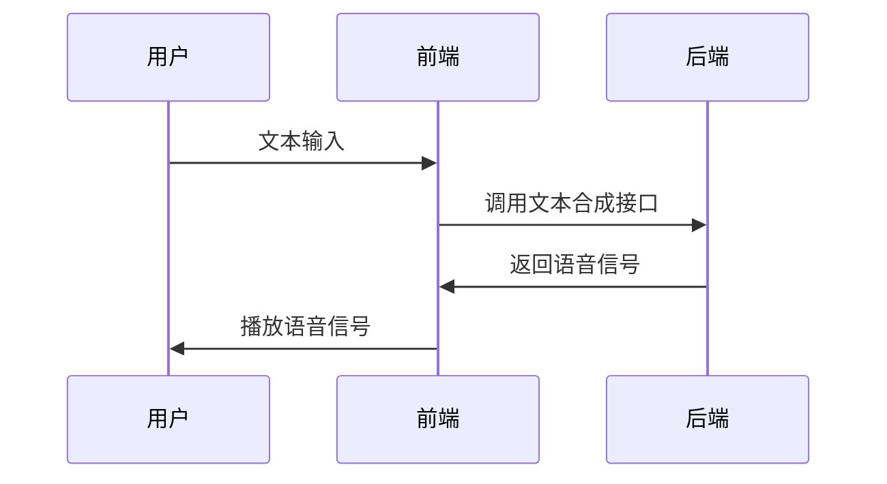

                 


### "说"也是一门技术

> 关键词：沟通技巧、语言表达、语音技巧、沟通策略、表达效率

> 摘要：本文将探讨“说”作为一门技术的重要性，通过剖析语言表达、语音技巧和沟通策略等核心概念，结合算法原理和实际应用，帮助读者理解如何提升“说”的能力，实现高效沟通。

---

#### 第一部分：前言

##### 1.1 问题的提出

随着信息技术的发展，沟通在现代社会中的地位日益重要。无论是在职场、教育还是日常生活中，清晰、准确地表达思想都成为成功的关键因素。然而，许多人却在语言表达、语音技巧和沟通策略方面存在短板，导致沟通效果不佳。因此，将“说”提升为一门技术，成为解决这一问题的关键。

##### 1.2 问题描述

“说”作为一门技术，涵盖了语言表达、语音技巧和沟通策略等多个方面。当前，教育体系中对这些技能的培养不够重视，导致很多人无法自如地运用语言进行有效沟通。本文旨在通过系统的方法和实用的技巧，帮助读者提升“说”的能力。

##### 1.3 问题解决

本文将采用理论与实践相结合的方式，深入剖析“说”的各个方面，提供实用的技巧和案例分析。通过学习本文，读者不仅可以掌握基本的语言表达技巧，还能学会如何根据不同情境灵活运用这些技巧，实现有效沟通。

##### 1.4 边界与外延

本文主要关注口语表达和沟通技巧，旨在帮助读者提升“说”的能力。然而，这些技能的运用不仅限于口语表达，还可以应用于写作、演讲等多个领域。因此，本文的内容具有广泛的适用性和延伸性。

##### 1.5 概念结构与核心要素组成

“说”作为一门技术，其核心要素包括：

- **语言表达能力**：掌握基本语法、词汇和句子结构，能够清晰、准确地表达思想。
- **语音技巧**：运用语音技巧，使表达更具感染力，如语音节奏、语调变化等。
- **沟通策略**：根据不同情境，选择合适的沟通方式，以达到最佳沟通效果。

---

#### 第二部分：核心概念与联系

##### 2.1 语言表达能力

**概念定义**：语言表达能力是指运用语言进行有效沟通的能力。它包括对语法、词汇和句子结构的掌握，以及如何运用这些知识来表达思想。

**属性特征对比表格**：

| 特征         | 语言表达能力 |
|--------------|--------------|
| 语法结构     | 精准、流畅   |
| 词汇量       | 丰富、多样   |
| 句子结构     | 简洁、明确   |
| 表达效果     | 清晰、准确   |

**ER实体关系图架构**：

```mermaid
classDiagram
  类图元素说明
  说话人 <<Class>> 说话内容
  说话人 --|> 语言环境
```

##### 2.2 语音技巧

**概念定义**：语音技巧是指通过语音的变化，使表达更具感染力和表现力的技巧。

**属性特征对比表格**：

| 特征         | 语音技巧       |
|--------------|----------------|
| 语音节奏     | 明快、流畅     |
| 语调变化     | 自然、丰富     |
| 音量控制     | 合适、稳定     |
| 发音准确度   | 高、清晰       |

**ER实体关系图架构**：



##### 2.3 沟通策略

**概念定义**：沟通策略是指根据不同情境，选择合适的沟通方式，以达到最佳沟通效果。

**属性特征对比表格**：

| 特征         | 沟通策略         |
|--------------|------------------|
| 情境分析     | 准确、全面       |
| 沟通方式选择 | 适宜、有效       |
| 沟通效果评估 | 明显、持久       |
| 调整策略     | 及时、灵活       |

**ER实体关系图架构**：



---

#### 第三部分：算法原理讲解

##### 3.1 语音合成算法

**概念定义**：语音合成算法是指通过计算机程序生成语音的技术。

**算法原理**：

语音合成算法的基本原理是将文本转化为语音信号，主要包括以下步骤：

1. **文本分析**：对输入的文本进行分析，提取语音特征。
2. **语音生成**：根据语音特征生成语音信号。
3. **语音合成**：将语音信号合成为人声。

**算法流程图**：



**Python代码实现**：

```python
import pyttsx3

def text_to_speech(text):
    engine = pyttsx3.init()
    engine.say(text)
    engine.runAndWait()

text_to_speech("这是一段文本，我们将将其转化为语音信号。")
```

---

#### 第四部分：系统分析与架构设计

##### 4.1 问题场景介绍

在职场沟通、教育培训、客户服务等多个领域，语音合成技术都有广泛的应用。本文将以客户服务场景为例，介绍如何运用语音合成算法提升沟通效果。

##### 4.2 项目介绍

项目名称：智能语音客服系统

项目目标：通过语音合成技术，实现自动化客户服务，提高沟通效率和用户体验。

##### 4.3 系统功能设计

- **文本输入**：用户可以通过文本输入框输入需要合成的文本。
- **语音合成**：系统将文本转化为语音信号，并播放出来。
- **语音识别**：系统支持语音输入，用户可以通过语音指令与系统交互。

**领域模型类图**：

```mermaid
classDiagram
    类图元素说明
    用户 <<Class>> 文本输入
    用户 --|> 语音合成
    用户 --|> 语音识别
```

##### 4.4 系统架构设计

系统采用前后端分离的架构，前端负责用户界面设计和交互，后端负责语音合成和语音识别处理。

**系统架构图**：



##### 4.5 系统接口设计

系统提供以下接口：

- **文本合成接口**：接收用户输入的文本，返回语音信号。
- **语音识别接口**：接收语音信号，返回识别结果。

**接口序列图**：



---

#### 第五部分：项目实战

##### 5.1 环境安装

1. 安装Python环境：在官网下载Python安装包并安装。
2. 安装语音合成库：在命令行中运行`pip install pyttsx3`。

##### 5.2 系统核心实现

**文本合成模块**：

```python
import pyttsx3

def text_to_speech(text):
    engine = pyttsx3.init()
    engine.say(text)
    engine.runAndWait()

text_to_speech("这是一段文本，我们将将其转化为语音信号。")
```

**语音识别模块**：

```python
import speech_recognition as sr

def speech_to_text():
    recognizer = sr.Recognizer()
    with sr.Microphone() as source:
        audio = recognizer.listen(source)
    try:
        text = recognizer.recognize_google(audio, language='zh-CN')
        return text
    except sr.UnknownValueError:
        return "无法识别语音"

text = speech_to_text()
print(text)
```

##### 5.3 代码应用解读与分析

文本合成模块和语音识别模块分别实现了文本转化为语音信号和语音转化为文本的功能。通过调用这两个模块，可以实现简单的语音合成和语音识别功能。

##### 5.4 实际案例分析和详细讲解剖析

以客户服务场景为例，用户可以通过文本输入框输入问题，系统将文本转化为语音信号，并通过扬声器播放出来。用户也可以通过语音输入问题，系统将语音转化为文本，并返回答案。

##### 5.5 项目小结

通过本项目的实现，我们可以看到语音合成技术在提升沟通效率方面具有重要作用。在实际应用中，还可以结合自然语言处理技术，实现更智能、更高效的语音服务。

---

#### 第六部分：最佳实践 tips

1. **提升语言表达能力**：多读书、多写作，积累词汇和语法知识。
2. **练习语音技巧**：模仿标准发音，注意语音节奏和语调变化。
3. **灵活运用沟通策略**：根据不同情境，选择合适的沟通方式。

#### 第七部分：小结

本文从语言表达、语音技巧和沟通策略等方面，探讨了如何将“说”提升为一门技术。通过学习本文，读者可以掌握提升“说”的能力的方法和技巧，实现高效沟通。

#### 第八部分：注意事项

1. **实践与反思**：在学习过程中，要不断实践和反思，巩固所学知识。
2. **持续学习**：语言表达和沟通技巧需要不断学习和提升，与时俱进。

#### 第九部分：拓展阅读

1. 《演讲与口才》
2. 《有效沟通》
3. 《语言表达技巧》

---

作者：AI天才研究院/AI Genius Institute & 禅与计算机程序设计艺术 /Zen And The Art of Computer Programming

